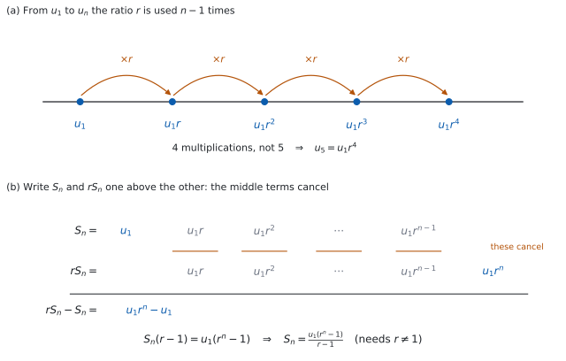

# SL 1.3 — Geometric sequences and series（等比数列と等比級数） {#sec-aasl-1-3}

::: {.callout-note}
## What you should be able to do
- **geometric sequence**（等比数列）を見分け、**common ratio**（公比）$r$ を求められる。
- $u_n = u_1 r^{\,n-1}$ で、$n$ 番目の項を求められる。
- **項が $2$ つ**分かれば、$r$ と $u_1$ を求められる（$r$ が $2$ 通りになる場合もある）。
- $S_n$ の公式を、$r$ が $1$ より大きいか小さいかに応じて**都合のよい形**で使える。
- **sigma notation**（シグマ記号）$\sum$ で書かれた等比の和を計算できる。
- 感染の広がりや人口のように、**同じ倍率で変わる場面**を等比数列で表せる。
- **等差なのか等比なのか**を、自分で見分けられる。
:::

## The idea

### 1. 同じ数を掛けていく並び {#idea}

[SL 1.2](aasl-1-2.qmd) の arithmetic sequence（等差数列）は、**同じ数を足して**いく並びでした。

今度は、**同じ数を掛けて**いきます。

$$
3, \quad 6, \quad 12, \quad 24, \quad 48, \quad \ldots
$$

となり合う項の比が、いつも同じです。$\dfrac{6}{3} = 2$、$\dfrac{12}{6} = 2$、$\dfrac{24}{12} = 2$。

こういう数列を **geometric sequence**（等比数列）と言い、その一定の比を **common ratio**（公比）と呼んで $r$ と書きます。ここでは $r = 2$ です。はじめの項 $u_1$ を **first term**（初項）と言います。

::: {.callout-important}
## $r$ は「うしろ割る前」です
$$
r = \frac{u_2}{u_1} = \frac{u_3}{u_2} = \cdots
$$

**あとの項を、前の項で割ります。** 等差数列で差を取ったところが、割り算に変わっただけです。

**この割り算を使うときは、分母になる項が $0$ でないことが必要です。** このページでは、比を求めるときに割る項は $0$ でないものとして扱います。

$r$ は、次のどれでも構いません（ここでは $u_1 > 0$ とします）。

- $r > 1$ … どんどん大きくなる（$3, 6, 12, \ldots$）
- $r = 1$ … 同じ数が並ぶ（$7, 7, 7, \ldots$）
- $0 < r < 1$ … どんどん小さくなる（$100, 50, 25, \ldots$ は $r = \frac{1}{2}$）
- $r < 0$ … **符号が交互に変わる**（$5, -10, 20, -40, \ldots$ は $r = -2$）

**$u_1$ が負だと、増える・減るが入れかわります。** $-3, -6, -12, \ldots$ は $r = 2$ ですが、値としては小さくなっていきます。
:::

**比は、書き出されている分だけ全部確かめてください。** $2, 6, 18, 50, \ldots$ は、はじめの $2$ つの比が $3$ でも、次が $\dfrac{50}{18}$ なので等比ではありません。**$2$ 組そろっただけでは足りません。**

### 2. $n$ 番目の項 — 掛ける回数は $n-1$ {#nth}

$$
u_n = u_1 r^{\,n-1}
$$ {#eq-aasl13-nth}

::: {.callout-important}
## この式は公式集にあります
公式集の **1.3** の欄に、`The nth term of a geometric sequence` として印刷されています。

試験中に配られるので、**覚える必要はありません。** ただし、**指数が $n$ ではなく $n-1$** であることは、目で確かめる習慣をつけてください。
:::

#### なぜ指数が $n-1$ なのか {#why-n-minus-1}

等差数列のときと、まったく同じ理由です。**掛ける回数が、項の番号より $1$ つ少ない**からです。

@fig-aasl13-idea の (a) を見てください。$u_1$ から $u_5$ へ行くのに、$r$ を掛けるのは $4$ 回です。

{#fig-aasl13-idea width=100%}

（(b) は和の公式を作るときの図です。いまは (a) だけ見てください。(b) には [Why it works](#why-it-works) で戻ってきます。）

はじめの例で確かめます。$u_1 = 3$、$r = 2$ なので

$$
u_5 = 3 \times 2^{5-1} = 3 \times 16 = 48
$$

書き出した $5$ 番目の項と、同じ $48$ になりました。

::: {.callout-warning}
## $u_1 r^{\,n-1}$ と $(u_1 r)^{\,n-1}$ は別物です
指数が付いているのは **$r$ だけ**です。$u_1$ には付きません。

$$
3 \times 2^{4} = 3 \times 16 = 48 \qquad \text{であって} \qquad (3 \times 2)^{4} = 1296 \ \text{ではありません}
$$

**掛け算より、指数のほうが先**です。
:::

### 3. 項が $2$ つ分かれば、$r$ と $u_1$ を求められる {#two-terms}

等差数列では**引き算**で $d$ が出ました。等比数列では**割り算**で $r$ が出ます。

$u_2 = 10$、$u_5 = 80$ とします。@eq-aasl13-nth から

$$
\frac{u_5}{u_2} = \frac{u_1 r^{4}}{u_1 r^{1}} = r^{3}
$$

$u_1$ が約分で消えます。ですから

$$
r^{3} = \frac{80}{10} = 8, \qquad r = 2
$$

$r$ が出たら、$u_2 = u_1 r$ に戻して $u_1 = \dfrac{10}{2} = 5$ です。

**ここでも割り算を使うので、分母になる項が $0$ でないことが要ります。** $u_2 = 0$ なら $\dfrac{u_5}{u_2}$ が書けません。問題文で $0$ でない項が与えられているかを、先に見てください。

::: {.callout-tip}
## 番号の差が、そのまま $r$ の指数です
$$
\frac{u_q}{u_p} = r^{\,q-p}
$$

$u_2$ から $u_5$ までは番号が $3$ つ進むので、$r$ の $3$ 乗です。**等差数列で $u_q - u_p = (q-p)d$ だったところが、割り算と指数に変わっています。**
:::

::: {.callout-warning}
## 指数が偶数のときは、$r$ が $2$ 通りになります
$r^{3} = 8$ なら $r = 2$ の $1$ つだけです。けれども $r^{2} = 9$ なら、**$r = 3$ と $r = -3$ の $2$ つ**があります。

**指数が偶数のときは、両方書いてください。** 問題文に「すべての項が正」などの断りがあれば、そこで $1$ つに絞ります。
:::

### 4. 和 — $S_n$ の $2$ つの形 {#sum}

$$
S_n = \frac{u_1(r^{\,n} - 1)}{r - 1} = \frac{u_1(1 - r^{\,n})}{1 - r}, \qquad r \neq 1
$$ {#eq-aasl13-sum}

::: {.callout-important}
## この $2$ つも公式集にあります
公式集の **1.3** の欄に、`The sum of n terms of a finite geometric sequence` として、**$r \neq 1$ という条件まで込みで**印刷されています。

**$2$ つの形は、同じ式です。** 分母と分子の両方に $-1$ を掛けただけです（[Why it works](#why-it-works)）。
:::

$r = 1$ のときにこの式が使えないのは、**分母が $0$ になる**からです。ただし $r = 1$ の数列は $u_1, u_1, u_1, \ldots$ と同じ数が並ぶだけなので、和は $S_n = n u_1$ です。公式に頼る必要がありません。

はじめの例（$3, 6, 12, 24, 48$）で確かめます。書き出して足せば $93$ です。公式でも

$$
S_5 = \frac{3(2^{5} - 1)}{2 - 1} = \frac{3(31)}{1} = 93
$$

### 5. どちらの形を使うか {#which}

**どちらでも答えは同じ**です。分数の計算が楽なほうを選びます。

| $r$ | 使うと楽な形 | 理由 |
|:--|:--|:--|
| $r > 1$ | $\dfrac{u_1(r^{\,n} - 1)}{r - 1}$ | 分母 $r-1$ が正になる |
| $r < 1$ | $\dfrac{u_1(1 - r^{\,n})}{1 - r}$ | 分母 $1-r$ が正になる |

: 和の $2$ つの形の使い分け {#tbl-aasl13-which}

**負の数で割るのを避けるための使い分け**です。数学として、どちらが正しいということはありません。

### 6. sigma notation（シグマ記号） {#sigma}

等比の和も、$\sum$ で書かれます。

$$
\sum_{k=1}^{5} 4 \times 3^{\,k-1} = 4 + 12 + 36 + 108 + 324
$$

::: {.callout-tip}
## $k$ が指数にいたら、等比です
[SL 1.2](aasl-1-2.qmd#sigma) では、$k$ の式が**$1$ 次**なら等差でした。

**$k$ が指数の位置にいれば、等比**です。$\sum a r^{\,k-1}$ の形なら、$u_1 = a$、公比は $r$ です。

上の例なら $u_1 = 4$、$r = 3$、$n = 5$ で

$$
S_5 = \frac{4(3^{5}-1)}{3-1} = \frac{4(242)}{2} = 484
$$

書き出した $4+12+36+108+324$ も $484$ です。
:::

**指数が $k-1$ か $k$ かで、$u_1$ が変わります。** $\displaystyle\sum_{k=1}^{n} 4 \times 3^{k}$ なら、$k=1$ のとき $12$ なので $u_1 = 12$ です。**下限を代入して、はじめの項を必ず自分で出してください。**

::: {.callout-tip collapse="true"}
## Paper 2 では、電卓が数列を作ってくれます
Paper 1 では使えませんが、Paper 2 では [SL 1.2 と同じ道具](aasl-1-2.qmd#sigma)が使えます。

```
seq(4*3^(n-1), n, 1, 5)        … u_1 から u_5 までを並べる
sum(seq(4*3^(n-1), n, 1, 5))   … その合計
```

`seq(` は **`menu → List & Spreadsheet → Sequence`** にあります。

**電卓で数列や和を出したときも、$u_1$ と $r$ が何かを答案に書いてください。** シラバスは、GDC を使う場合でも first term と common ratio を見つけられることを求めています。

**指数の入力に気をつけてください。** `4*3^n-1` と打つと $4 \times 3^{n} - 1$ になります。**指数は必ずかっこで囲んで** `3^(n-1)` と打ってください。
:::

### 7. 現実の場面 — 倍率で変わるもの {#applications}

等比数列がよく当てはまるのは、**the spread of disease**（感染の広がり）、**salary increase and decrease**（給料の増減）、**population growth**（人口増加）のように、**毎回同じ倍率で変わる**場面です。

**「毎年 $\ldots\%$ 増える」は、等比数列です。**

$10\%$ 増えるということは、$1$ 年後には $110\%$、つまり **$1.1$ 倍**になるということです。

| 増え方・減り方 | $r$ |
|:--|:--|
| $10\%$ 増える | $1.1$ |
| $25\%$ 増える | $1.25$ |
| $10\%$ 減る | $0.9$ |
| $25\%$ 減る | $0.75$ |

: パーセントから $r$ へ {#tbl-aasl13-percent}

::: {.callout-warning}
## $10\%$ 増えるのは、$0.1$ 倍ではありません
$0.1$ 倍にしたら、$10$ 分の $1$ になってしまいます。

**もとの $1$ に、増える分の $0.1$ を足して $1.1$ 倍**です。減るときは $1 - 0.25 = 0.75$ のように引きます。

**$r$ を出したら、$1$ より大きいか小さいかを見てください。** 増える場面で $r < 1$ になっていたら、どこかが違います。
:::

### 8. 等差か、等比か {#compare}

問題文に `arithmetic` とも `geometric` とも書かれていないことがあります。そのときは、自分で見分けます。

| | arithmetic | geometric |
|:--|:--|:--|
| となり合う項 | **差**が一定（$d$） | **比**が一定（$r$） |
| 次の項へ | $+d$ | $\times r$ |
| $n$ 番目 | $u_1 + (n-1)d$ | $u_1 r^{\,n-1}$ |
| 増え方 | まっすぐ | だんだん急（または急に小さく） |
| 場面 | 単利、毎年同じ額 | 複利、毎年同じ割合 |

: 等差と等比の見分け方 {#tbl-aasl13-compare}

**手順は $1$ つです。** となり合う項の**差**と**比**を、書き出されている分だけ出してみてください。最後までそろっているほうが答えです。**どちらもそろわなければ、等差でも等比でもありません**（$1, 2, 4, 7, \ldots$ は差が $1, 2, 3$、比が $2, 2, 1.75$ で、どちらでもありません）。

$$
5, \ 10, \ 20, \ 40 \ \longrightarrow \ \text{差は } 5, 10, 20 \ (\text{そろわない}), \quad \text{比は } 2, 2, 2 \ (\text{そろう})
$$

ですから、これは geometric です。

## Why it works

ここでは $2$ つのことを確かめます。**なぜ和の公式があの形なのか**と、**$2$ つの形が同じもの**だということです。

**なぜ、和は $\dfrac{u_1(r^{\,n}-1)}{r-1}$ になるのか。**

$S_n$ を書き出します。

$$
S_n = u_1 + u_1 r + u_1 r^{2} + \cdots + u_1 r^{\,n-1}
$$

**両辺に $r$ を掛けます。**

$$
r S_n = u_1 r + u_1 r^{2} + \cdots + u_1 r^{\,n-1} + u_1 r^{\,n}
$$

@fig-aasl13-idea の (b) のように、$2$ つを並べると、**まん中の項がそっくり同じ**です。ですから引き算をすると、そこが全部消えます。

$$
r S_n - S_n = u_1 r^{\,n} - u_1
$$

左辺を $S_n$ でくくって

$$
S_n(r - 1) = u_1(r^{\,n} - 1)
$$

**$r \neq 1$ のときだけ**、両辺を $r-1$ で割れます。

$$
S_n = \frac{u_1(r^{\,n} - 1)}{r - 1}
$$

$r = 1$ を除くのは、ここで $0$ で割れないからです。等差数列の和で「前とうしろを足す」ことをしたのと同じで、**同じ項どうしを消し合わせる**のが要です。

**なぜ、もう $1$ つの形も同じなのか。**

分子と分母の両方に $-1$ を掛けます。

$$
\frac{u_1(r^{\,n}-1)}{r-1} = \frac{-u_1(r^{\,n}-1)}{-(r-1)} = \frac{u_1(1 - r^{\,n})}{1 - r}
$$

**上と下で $-1$ が打ち消し合うので、値は変わりません。** ですから、どちらを使っても答えは同じです。片方で解いて、もう片方で確かめられます。

## Worked examples

::: {.callout-note appearance="simple"}
問題文は英語です。意味が理解できなかったら、問題文の下の「**日本語訳**」を開いてください。解説は日本語です。

**例題も演習も、すべて電卓なしで解けます。** Paper 1 のつもりで解いてください。
:::

::: {#exm-aasl13-nth}
[A geometric sequence has first term $u_1 = 3$ and common ratio $r = 2$.]{.q-en}

**(a)** [Find $u_{8}$.]{.q-en}

**(b)** [Find an expression for $u_n$ in terms of $n$.]{.q-en}

**(c)** [Show that $1536$ is a term of the sequence, and state which term it is.]{.q-en}

**(d)** [Explain why $1000$ is not a term of the sequence.]{.q-en}

<details class="jp-trans">
<summary>日本語訳</summary>

ある geometric sequence の first term が $u_1 = 3$、common ratio が $r = 2$ です。

**(a)** $u_8$ を求めなさい。

**(b)** $u_n$ を $n$ の式で表しなさい。

**(c)** $1536$ がこの数列の項であることを示し、それが第何項かを述べなさい。

**(d)** $1000$ がこの数列の項でない理由を説明しなさい。

</details>

---

**(a)** @eq-aasl13-nth に入れます。$r$ を掛けるのは $7$ 回です（[第 2 節](#nth)）。

$$
u_8 = 3 \times 2^{7} = 3 \times 128 = 384
$$

**(b)** 同じ式を、$n$ のまま書きます。

$$
u_n = 3 \times 2^{\,n-1}
$$

**(c)** `Show that` なので、$u_n = 1536$ とおいて $n$ を求めます。

$$
3 \times 2^{\,n-1} = 1536 \ \Longrightarrow \ 2^{\,n-1} = 512
$$

$512 = 2^{9}$ なので、$n - 1 = 9$、つまり $n = 10$ です。**$n$ は正の整数**なので、$1536$ は第 $10$ 項です。

**(d)** `Explain why` なので、英語で理由を書きます。

::: {.model-answer}
**試験ではこう書く**

*If $1000$ were a term, then $3 \times 2^{\,n-1} = 1000$, so $2^{\,n-1} = \frac{1000}{3}$. For every positive integer $n$, $2^{\,n-1}$ is an integer, but $\frac{1000}{3}$ is not, so no such $n$ exists and $1000$ is not a term. Equivalently, every term is a multiple of $3$, and $1000$ is not.*
:::

（もし $1000$ が項なら $3 \times 2^{\,n-1} = 1000$ となり、$2^{\,n-1} = \frac{1000}{3}$ である。どの正の整数 $n$ でも $2^{\,n-1}$ は整数だが、$\frac{1000}{3}$ は整数ではないので、そのような $n$ は存在せず、$1000$ は項ではない。同じことだが、どの項も $3$ の倍数であり、$1000$ はそうではない、という意味です。）

**検算（(a) について）。** $2$ の累乗を、$1$ つずつ書き出して確かめます。

$$
3, \ 6, \ 12, \ 24, \ 48, \ 96, \ 192, \ 384
$$

$8$ 番目が $384$ です ✓ **これは公式を使っていない別の道すじです。** 指数を $8$ と取りちがえて $3 \times 2^{8} = 768$ としていたら、書き出した $8$ 番目とは合いません（$768$ は $9$ 番目です）。

**検算（(c) について）。** 第 $10$ 項を、公式から直に出し直します。$3 \times 2^{9} = 3 \times 512 = 1536$ ✓

::: {.callout-note}
## 解答例（答案用紙にはこう書く）
**(a)**
$$u_8 = 3 \times 2^{7} = 384$$

**(b)**
$$u_n = 3 \times 2^{\,n-1}$$

**(c)**
$$3 \times 2^{\,n-1} = 1536 \ \Rightarrow \ 2^{\,n-1} = 512 = 2^{9} \ \Rightarrow \ n = 10$$
*$n = 10$ is a positive integer, so $1536$ is the $10$th term.*

**(d)**
*$3 \times 2^{\,n-1} = 1000$ gives $2^{\,n-1} = \frac{1000}{3}$, which is not an integer, so there is no positive integer $n$ with $u_n = 1000$.*
:::
:::

::: {#exm-aasl13-two-terms}
[In a geometric sequence, $u_2 = 12$ and $u_5 = 96$.]{.q-en}

**(a)** [Find the common ratio $r$.]{.q-en}

**(b)** [Find the first term $u_1$.]{.q-en}

**(c)** [Find $u_{10}$.]{.q-en}

**(d)** [Hence find $S_{10}$.]{.q-en}

<details class="jp-trans">
<summary>日本語訳</summary>

ある geometric sequence で、$u_2 = 12$、$u_5 = 96$ です。

**(a)** common ratio $r$ を求めなさい。

**(b)** first term $u_1$ を求めなさい。

**(c)** $u_{10}$ を求めなさい。

**(d)** そこから $S_{10}$ を求めなさい。

</details>

---

**(a)** 番号は $2$ から $5$ へ、$3$ つ進んでいます（[第 3 節](#two-terms)）。

$$
\frac{u_5}{u_2} = r^{3} = \frac{96}{12} = 8, \qquad r = 2
$$

**指数が奇数なので、$r$ は $1$ つに決まります。**

**(b)** $u_2 = u_1 r$ に戻します。

$$
12 = u_1 \times 2 \ \Longrightarrow \ u_1 = 6
$$

**(c)** @eq-aasl13-nth です。$2^{9} = 512$ を使います。

$$
u_{10} = 6 \times 2^{9} = 6 \times 512 = 3072
$$

**(d)** `Hence` なので、(a)〜(c) の結果を使います。$r = 2 > 1$ なので、上の形が楽です（@tbl-aasl13-which）。

$$
S_{10} = \frac{6(2^{10} - 1)}{2 - 1} = 6(1024 - 1) = 6 \times 1023 = 6138
$$

**検算（(a)(b) について）。** 出した $u_1$ と $r$ で、**問題文の $2$ つの値を両方**作り直します。

$$
u_2 = 6 \times 2 = 12, \qquad u_5 = 6 \times 2^{4} = 96
$$

どちらも合いました ✓ **$u_1$ を作るのに使った $u_2$ は、必ず合ってしまいます。** 効くのは、使わなかったほうの $u_5$ です。指数を取りちがえて $r^{4} = 8$ から $r$ を出していたら、$u_5$ がこの値になりません。

**検算（(d) について）。** もう $1$ つの形で出し直します（[Why it works](#why-it-works)）。

$$
S_{10} = \frac{6(1 - 2^{10})}{1 - 2} = \frac{6(1 - 1024)}{-1} = \frac{6(-1023)}{-1} = 6138
$$

同じ $6138$ です ✓ **符号を $2$ か所とも変えているので、片方だけ変えていたら合いません。**

::: {.callout-note}
## 解答例（答案用紙にはこう書く）
**(a)**
$$\frac{u_5}{u_2} = r^{3} = \frac{96}{12} = 8, \qquad r = 2$$

**(b)**
$$12 = u_1(2), \qquad u_1 = 6$$

**(c)**
$$u_{10} = 6 \times 2^{9} = 3072$$

**(d)**
$$S_{10} = \frac{6(2^{10}-1)}{2-1} = 6 \times 1023 = 6138$$
:::
:::

::: {#exm-aasl13-sum}
**(a)** [Find $S_6$ for the geometric sequence with $u_1 = 5$ and $r = 3$.]{.q-en}

**(b)** [Find the sum $2 + 6 + 18 + \cdots + 486$.]{.q-en}

**(c)** [Find $\displaystyle\sum_{k=1}^{6} 2^{\,k}$.]{.q-en}

**(d)** [Explain why the formula for $S_n$ cannot be used when $r = 1$, and state the sum in that case.]{.q-en}

<details class="jp-trans">
<summary>日本語訳</summary>

**(a)** $u_1 = 5$、$r = 3$ である geometric sequence の $S_6$ を求めなさい。

**(b)** 和 $2 + 6 + 18 + \cdots + 486$ を求めなさい。

**(c)** $\displaystyle\sum_{k=1}^{6} 2^{\,k}$ を求めなさい。

**(d)** $r = 1$ のときに $S_n$ の公式が使えない理由を説明し、その場合の和を述べなさい。

</details>

---

**(a)** $r = 3 > 1$ なので、上の形です。$3^{6} = 729$ です。

$$
S_6 = \frac{5(3^{6} - 1)}{3 - 1} = \frac{5(728)}{2} = 5 \times 364 = 1820
$$

**$728$ を先に $2$ で割る**と、大きな掛け算をしなくて済みます。

**(b)** **まず $r$ と項数を求めます。** $r = \dfrac{6}{2} = 3$ で、最後が $486$ です。

$$
2 \times 3^{\,n-1} = 486 \ \Longrightarrow \ 3^{\,n-1} = 243 = 3^{5} \ \Longrightarrow \ n = 6
$$

$$
S_6 = \frac{2(3^{6} - 1)}{3 - 1} = \frac{2(728)}{2} = 728
$$

**(c)** $k$ が指数にいるので等比です（[第 6 節](#sigma)）。**下限を代入して、はじめの項を出します。**

$$
k = 1 \ \text{のとき} \ 2^{1} = 2 \quad \Longrightarrow \quad u_1 = 2, \quad r = 2, \quad n = 6
$$

$$
S_6 = \frac{2(2^{6} - 1)}{2 - 1} = 2(64 - 1) = 126
$$

**(d)** `Explain why` なので、英語で理由を書きます。

::: {.model-answer}
**試験ではこう書く**

*The formula has $r - 1$ in the denominator, and when $r = 1$ this is $0$, so the division is not defined. The derivation makes the same point: it ends with $S_n(r-1) = u_1(r^{\,n}-1)$, and dividing by $r - 1$ is only allowed when $r \neq 1$. When $r = 1$ every term equals $u_1$, so the sum of $n$ terms is simply $S_n = n u_1$.*
:::

（この公式は分母に $r-1$ を持ち、$r = 1$ のときそれが $0$ になるので、割り算が定義されない。導き方も同じことを言っている。$S_n(r-1) = u_1(r^{\,n}-1)$ で終わっており、$r-1$ で割ってよいのは $r \neq 1$ のときだけである。$r = 1$ のときはどの項も $u_1$ に等しいので、$n$ 項の和は $S_n = n u_1$ になる、という意味です。）

**検算（(a) について）。** 書き出して足します。$5, 15, 45, 135, 405, 1215$ で

$$
5 + 15 + 45 + 135 + 405 + 1215 = 1820
$$

合いました ✓ **これは公式を使わない別の道すじです。**

**検算（(b) について）。** 項数 $n = 6$ を、**逆向きに**確かめます。$u_6 = 2 \times 3^{5} = 2 \times 243 = 486$ ✓ 前後も見ると $u_5 = 162$、$u_7 = 1458$ なので、$486$ はちょうど第 $6$ 項です。

**検算（(c) について）。** 書き出すと $2+4+8+16+32+64 = 126$ ✓ **$\sum 2^{k}$ の $u_1$ を $1$ と取りちがえていたら**、$\dfrac{1(2^{6}-1)}{1} = 63$ となり、ちょうど半分になります。**下限を代入する習慣が、これを防ぎます。**

::: {.callout-note}
## 解答例（答案用紙にはこう書く）
**(a)**
$$S_6 = \frac{5(3^{6}-1)}{3-1} = \frac{5(728)}{2} = 1820$$

**(b)**
$$r = 3, \qquad 2 \times 3^{\,n-1} = 486 \ \Rightarrow \ 3^{\,n-1} = 3^{5} \ \Rightarrow \ n = 6$$
$$S_6 = \frac{2(3^{6}-1)}{3-1} = 728$$

**(c)**
$$u_1 = 2, \ r = 2, \ n = 6, \qquad S_6 = \frac{2(2^{6}-1)}{2-1} = 126$$

**(d)**
*The denominator $r - 1$ is $0$ when $r = 1$, so the formula is undefined. In that case every term is $u_1$, so $S_n = n u_1$.*
:::
:::

::: {#exm-aasl13-disease}
[On day $1$ of an outbreak, $4$ new infections are recorded. The number of new infections recorded triples each day.]{.q-en}

**(a)** [Find the number of new infections recorded on day $6$.]{.q-en}

**(b)** [Find the total number of infections recorded on days $1$ to $6$.]{.q-en}

**(c)** [Comment on whether this model could still be used on day $15$.]{.q-en}

<details class="jp-trans">
<summary>日本語訳</summary>

ある流行の $1$ 日目に、$4$ 件の新規感染が記録されました。新規感染の数は、毎日 $3$ 倍になります。

**(a)** $6$ 日目に記録された新規感染の数を求めなさい。

**(b)** $1$ 日目から $6$ 日目までに記録された感染者数の合計を求めなさい。

**(c)** このモデルが $15$ 日目にも使えるかについて、述べなさい。

</details>

---

**(a)** $1$ 日目を $u_1 = 4$ とすると、$r = 3$ です。$6$ 日目は $u_6$ なので、$3$ を掛けるのは $5$ 回です。

$$
u_6 = 4 \times 3^{5} = 4 \times 243 = 972
$$

**(b)** 「合計」なので $S_6$ です。

$$
S_6 = \frac{4(3^{6} - 1)}{3 - 1} = \frac{4(728)}{2} = 4 \times 364 = 1456
$$

**(c)** `Comment on` なので、英語で述べます。

::: {.model-answer}
**試験ではこう書く**

*On day $15$ the model gives $4 \times 3^{14}$, which is close to $19$ million new infections on that single day. No real outbreak grows like this for long: the number of people who can still be infected is limited by the size of the population, and as more people recover or become immune the spread slows down. The geometric model describes only the early stage of an outbreak, so it should not be used as far ahead as day $15$.*
:::

（$15$ 日目には、このモデルは $4 \times 3^{14}$、すなわちその $1$ 日だけでおよそ $1900$ 万件の新規感染という数を与える。現実の流行がこのように増え続けることはない。まだ感染しうる人の数は人口の大きさによって限られており、回復したり免疫を得たりする人が増えれば、広がりは遅くなる。等比のモデルが表せるのは流行の初期だけなので、$15$ 日目まで先に使うべきではない、という意味です。）

**検算（(a) について）。** $1$ 日ずつ表で追います。

| 日 | $1$ | $2$ | $3$ | $4$ | $5$ | $6$ |
|:--|:--|:--|:--|:--|:--|:--|
| 新規感染 | $4$ | $12$ | $36$ | $108$ | $324$ | $972$ |

: $1$ 日ずつ $3$ 倍にする {#tbl-aasl13-days}

$6$ 日目が $972$ です ✓ **指数を $6$ と取りちがえて $4 \times 3^{6} = 2916$ としていたら、表の $7$ 日目の値になります。**

**検算（(b) について）。** 表の $6$ つを、そのまま足します。

$$
4 + 12 + 36 + 108 + 324 + 972 = 1456
$$

同じ $1456$ です ✓ **合計は、いちばん大きい $972$ より大きく、$972$ の $2$ 倍より小さいはず**です。$972 < 1456 < 1944$ ✓ **$u_1 > 0$ で $r \geq 2$ の等比数列では、最後の項が全体の半分より大きくなります。**

::: {.callout-note}
## 解答例（答案用紙にはこう書く）
**(a)**
$$u_6 = 4 \times 3^{5} = 972$$

**(b)**
$$S_6 = \frac{4(3^{6}-1)}{3-1} = 1456$$

**(c)**
*On day $15$ the model gives $4 \times 3^{14} \approx 19$ million new infections in one day, which is not possible for a real population. Geometric growth describes only the early stage of an outbreak.*
:::
:::

## Common errors

::: {.callout-warning}
## 指数を $n$ にしてしまう
$u_n = u_1 r^{\,n}$ ではありません。**$u_1 r^{\,n-1}$** です（[第 2 節](#nth)）。

$1$ 番目の項には、まだ $1$ 回も掛けていません。

**確かめ方は $n = 1$ を入れることです。** 正しい式なら $u_1 r^{0} = u_1$ になります。$u_1 r$ になったら、その式は違います。
:::

::: {.callout-warning}
## $u_1$ にも指数を付けてしまう
$u_1 r^{\,n-1}$ の指数は、**$r$ だけ**に付きます（[第 2 節](#nth)）。

$3 \times 2^{4} = 48$ であって、$(3 \times 2)^{4} = 1296$ ではありません。

**掛け算より指数が先**、という順番の話です。
:::

::: {.callout-warning}
## $r$ を引き算で出す
$r = u_2 - u_1$ ではありません。**$r = \dfrac{u_2}{u_1}$** です（[第 1 節](#idea)）。

等差数列と等比数列を、**同じ問題の中で行き来する**と起こりがちです。

**差が一定か、比が一定か**を、先に見分けてください（[第 8 節](#compare)）。
:::

::: {.callout-warning}
## $r^{2} = 9$ から $r = 3$ だけを答える
指数が偶数のときは、**$r = 3$ と $r = -3$ の $2$ つ**があります（[第 3 節](#two-terms)）。

$r = -3$ なら、項の符号が交互に変わります。

**問題文に「すべての項が正」などの断りがあるかを見てください。** なければ、両方書きます。
:::

::: {.callout-warning}
## $\%$ をそのまま $r$ にする
$10\%$ 増えるなら $r = 1.1$、$10\%$ 減るなら $r = 0.9$ です（[第 7 節](#applications)）。

$r = 0.1$ とすると、$10$ 分の $1$ になってしまいます。

**増える場面で $r < 1$ になっていたら、そこで気づいてください。**
:::

## Exercises

::: {.callout-note appearance="simple"}
各問題に、折りたたみが $3$ つ付いています。**日本語訳**、**解答例**（答案用紙に書くべきこと。英語です）、**解説**（なぜそうなるか。日本語です）。

まず自分で解いて、次に解答例と見くらべてください。**解説は、合わなかったときだけ開けば十分です。**
:::

::: {.exercise-block}

[1]{.ex-no} [A geometric sequence has $u_1 = 2$ and $r = 5$.]{.q-en} **(a)** [Find $u_6$.]{.q-en} **(b)** [Find an expression for $u_n$ in terms of $n$.]{.q-en}

<details class="jp-trans">
<summary>日本語訳</summary>

ある geometric sequence が $u_1 = 2$、$r = 5$ です。

**(a)** $u_6$ を求めなさい。　**(b)** $u_n$ を $n$ の式で表しなさい。

</details>

::: {.callout-note collapse="true"}
## 解答例（答案用紙に書くこと）

**(a)**
$$u_6 = 2 \times 5^{5} = 2 \times 3125 = 6250$$

**(b)**
$$u_n = 2 \times 5^{\,n-1}$$
:::

::: {.callout-tip collapse="true"}
## 解説

$5$ を掛けるのは $5$ 回です（[第 2 節](#nth)）。

**検算。** まず (b) の式に **$n = 1$** を入れます。$2 \times 5^{0} = 2 = u_1$ ✓ 式が正しいと分かったので、書き出して確かめます。$2, 10, 50, 250, 1250, 6250$ で、$6$ 番目が $6250$ です ✓

**$u_6 = 2 \times 5^{6} = 31250$ としていたら**、書き出した $7$ 番目の値です。$n = 1$ の確かめでも、$2 \times 5^{1} = 10 \neq 2$ となって気づけます。
:::

::: {.ex-sep}
:::

[2]{.ex-no} [Consider the geometric sequence $81,\ 27,\ 9,\ 3,\ \ldots$]{.q-en}

**(a)** [Write down the common ratio.]{.q-en}

**(b)** [Find $u_7$.]{.q-en}

<details class="jp-trans">
<summary>日本語訳</summary>

geometric sequence $81,\ 27,\ 9,\ 3,\ \ldots$ について考えます。

**(a)** common ratio を書きなさい。

**(b)** $u_7$ を求めなさい。

</details>

::: {.callout-note collapse="true"}
## 解答例（答案用紙に書くこと）

**(a)**
$$r = \frac{27}{81} = \frac{1}{3}$$

**(b)**
$$u_7 = 81 \times \left(\frac{1}{3}\right)^{6} = \frac{81}{729} = \frac{1}{9}$$
:::

::: {.callout-tip collapse="true"}
## 解説

**(a)** `Write down` なので、比を書くだけで足ります。ただし**書かれている比は全部**確かめてください。$\dfrac{27}{81} = \dfrac{9}{27} = \dfrac{3}{9} = \dfrac{1}{3}$ ✓

**(b)** $\left(\dfrac{1}{3}\right)^{6} = \dfrac{1}{729}$ です。$81 \div 729$ を約分すると $\dfrac{1}{9}$ になります。

**検算。** 書き出します。$81, 27, 9, 3, 1, \dfrac{1}{3}, \dfrac{1}{9}$ で、$7$ 番目が $\dfrac{1}{9}$ です ✓

**$r$ を $\dfrac{81}{27} = 3$ と、上下逆に取っていたら**、数列が増えていくことになり、減っている見た目と食いちがいます。
:::

::: {.ex-sep}
:::

[3]{.ex-no} [In a geometric sequence, $u_2 = 6$ and $u_4 = 24$.]{.q-en}

**(a)** [Find the two possible values of $r$.]{.q-en}

**(b)** [Find the value of $u_1$ in each case.]{.q-en}

<details class="jp-trans">
<summary>日本語訳</summary>

ある geometric sequence で、$u_2 = 6$、$u_4 = 24$ です。

**(a)** $r$ としてありうる $2$ つの値を求めなさい。

**(b)** それぞれの場合の $u_1$ の値を求めなさい。

</details>

::: {.callout-note collapse="true"}
## 解答例（答案用紙に書くこと）

**(a)**
$$\frac{u_4}{u_2} = r^{2} = \frac{24}{6} = 4, \qquad r = 2 \ \text{ or } \ r = -2$$

**(b)**
$$6 = u_1 r \ \Rightarrow \ u_1 = \frac{6}{r}$$
$$r = 2: \ u_1 = 3, \qquad r = -2: \ u_1 = -3$$
:::

::: {.callout-tip collapse="true"}
## 解説

番号は $2$ から $4$ へ $2$ つ進むので、$r$ の $2$ 乗です（[第 3 節](#two-terms)）。

**指数が偶数なので、$r$ は $2$ 通りあります。** 問題文に「すべての項が正」などの断りがないので、**両方書いてください**。

**検算。** それぞれの数列を書き出して、$u_2$ と $u_4$ が問題文と合うかを見ます。

$$
r = 2: \quad 3, \ 6, \ 12, \ 24 \qquad\qquad r = -2: \quad -3, \ 6, \ -12, \ 24
$$

どちらも $u_2 = 6$、$u_4 = 24$ です ✓ **$r = -2$ のほうは、符号が交互に変わります**（[第 1 節](#idea)）。$u_3$ の符号がちがうのに、$u_2$ と $u_4$ は同じになる、というのがこの問題の要です。

**$r = 2$ だけを答えていたら、得点が半分になることがあります。** $r^{2} = 4$ を見たら、**負のほうも必ず書いてください。**
:::

::: {.ex-sep}
:::

[4]{.ex-no} [A geometric sequence has $u_1 = 4$ and $r = 2$. Find $S_7$.]{.q-en}

<details class="jp-trans">
<summary>日本語訳</summary>

ある geometric sequence が $u_1 = 4$、$r = 2$ です。$S_7$ を求めなさい。

</details>

::: {.callout-note collapse="true"}
## 解答例（答案用紙に書くこと）

$$S_7 = \frac{4(2^{7} - 1)}{2 - 1} = 4(128 - 1) = 4 \times 127 = 508$$
:::

::: {.callout-tip collapse="true"}
## 解説

$r = 2 > 1$ なので、上の形です（@tbl-aasl13-which）。

**検算。** 書き出して足します。$4 + 8 + 16 + 32 + 64 + 128 + 256 = 508$ ✓ **これは公式を使わない別の道すじです。**

**合計が、最後の項 $256$ の $2$ 倍より小さいことも見てください。** $508 < 512$ ✓ $r = 2$ で $u_1 > 0$ の等比では、いつもこうなります。
:::

::: {.ex-sep}
:::

[5]{.ex-no} [Find the sum $3 + 12 + 48 + \cdots + 3072$.]{.q-en}

<details class="jp-trans">
<summary>日本語訳</summary>

和 $3 + 12 + 48 + \cdots + 3072$ を求めなさい。

</details>

::: {.callout-note collapse="true"}
## 解答例（答案用紙に書くこと）

$$r = \frac{12}{3} = 4, \qquad 3 \times 4^{\,n-1} = 3072 \ \Rightarrow \ 4^{\,n-1} = 1024 = 4^{5} \ \Rightarrow \ n = 6$$

$$S_6 = \frac{3(4^{6} - 1)}{4 - 1} = \frac{3(4096 - 1)}{3} = 4095$$
:::

::: {.callout-tip collapse="true"}
## 解説

**まず $r$ と項数**です。$4^{5} = 1024$ を使います。

**分子の $3$ と分母の $3$ が約分できる**ので、$4^{6} - 1 = 4095$ がそのまま答えになります。

**検算。** 項数 $n = 6$ を、逆向きに確かめます。$u_6 = 3 \times 4^{5} = 3 \times 1024 = 3072$ ✓

和のほうは、書き出して足します。$3 + 12 + 48 + 192 + 768 + 3072 = 4095$ ✓ **公式を使わない別の道すじです。**
:::

::: {.ex-sep}
:::

[6]{.ex-no} [Find $\displaystyle\sum_{k=1}^{7} 2 \times 3^{\,k-1}$.]{.q-en}

<details class="jp-trans">
<summary>日本語訳</summary>

$\displaystyle\sum_{k=1}^{7} 2 \times 3^{\,k-1}$ を求めなさい。

</details>

::: {.callout-note collapse="true"}
## 解答例（答案用紙に書くこと）

$$u_1 = 2 \times 3^{0} = 2, \qquad r = 3, \qquad n = 7$$

$$S_7 = \frac{2(3^{7} - 1)}{3 - 1} = \frac{2(2187 - 1)}{2} = 2186$$
:::

::: {.callout-tip collapse="true"}
## 解説

$k$ が指数にいるので等比です（[第 6 節](#sigma)）。**下限 $k = 1$ を代入して、$u_1 = 2$ を自分で出してください。**

$3^{7} = 2187$ です。$3^{5} = 243$、$3^{6} = 729$、$3^{7} = 2187$ と、$3$ 倍ずつ上がっていきます。

**検算。** $k = 1$ から $7$ まで $2 \times 3^{\,k-1}$ に代入して、全部並べます。

$$
2, \quad 6, \quad 18, \quad 54, \quad 162, \quad 486, \quad 1458
$$

足すと $2186$ です ✓ **これは和の公式を使わない別の道すじです。**

**$u_1$ を $6$（$k=1$ で $2 \times 3^{1}$ と読みちがえた値）としていたら**、答えは $3$ 倍の $6558$ になります。**下限の代入が、それを防ぎます。**
:::

::: {.ex-sep}
:::

[7]{.ex-no} [A geometric sequence has $u_1 = 64$ and $r = \dfrac{1}{2}$.]{.q-en}

**(a)** [Find $u_8$.]{.q-en}

**(b)** [Find $S_8$.]{.q-en}

<details class="jp-trans">
<summary>日本語訳</summary>

ある geometric sequence が $u_1 = 64$、$r = \dfrac{1}{2}$ です。

**(a)** $u_8$ を求めなさい。

**(b)** $S_8$ を求めなさい。

</details>

::: {.callout-note collapse="true"}
## 解答例（答案用紙に書くこと）

**(a)**
$$u_8 = 64 \times \left(\frac{1}{2}\right)^{7} = \frac{64}{128} = \frac{1}{2}$$

**(b)**
$$S_8 = \frac{64\left(1 - \left(\frac{1}{2}\right)^{8}\right)}{1 - \frac{1}{2}} = 128\left(1 - \frac{1}{256}\right) = 128 \times \frac{255}{256} = \frac{255}{2} = 127.5$$
:::

::: {.callout-tip collapse="true"}
## 解説

**(b)** $r < 1$ なので、下の形が楽です（@tbl-aasl13-which）。**分母の $1 - \dfrac{1}{2} = \dfrac{1}{2}$ で割るのは、$2$ を掛けること**です。

**検算。** 書き出して足します。$64 + 32 + 16 + 8 + 4 + 2 + 1 + \dfrac{1}{2} = 127.5$ ✓

**上の形でも出せます。** $\dfrac{64\left(\left(\frac{1}{2}\right)^{8} - 1\right)}{\frac{1}{2} - 1} = \dfrac{64\left(\frac{1}{256} - 1\right)}{-\frac{1}{2}} = 127.5$ ✓ **符号が上下とも変わるので、同じ値になります。**
:::

::: {.ex-sep}
:::

[8]{.ex-no} [An employee's salary in year $1$ is $\$30\,000$. The salary increases by $10\%$ each year.]{.q-en}

**(a)** [Find the salary in year $5$.]{.q-en}

**(b)** [Find the first year in which the salary exceeds $\$39\,000$.]{.q-en}

<details class="jp-trans">
<summary>日本語訳</summary>

ある会社員の $1$ 年目の給料は $\$30\,000$ です。給料は毎年 $10\%$ ずつ増えます。

**(a)** $5$ 年目の給料を求めなさい。

**(b)** 給料が $\$39\,000$ を超える最初の年を求めなさい。

</details>

::: {.callout-note collapse="true"}
## 解答例（答案用紙に書くこと）

**(a)**
$$r = 1.1, \qquad u_5 = 30\,000 \times 1.1^{4} = 30\,000 \times 1.4641 = \$43\,923$$

**(b)**
$$u_2 = 33\,000, \quad u_3 = 36\,300, \quad u_4 = 39\,930$$
*The salary first exceeds $\$39\,000$ in year $4$.*
:::

::: {.callout-tip collapse="true"}
## 解説

**$10\%$ 増えるので $r = 1.1$** です（[第 7 節](#applications)）。$1$ 年目が $u_1$ なので、$5$ 年目は $r$ を $4$ 回掛けます。

$1.1^{2} = 1.21$、$1.1^{4} = 1.21^{2} = 1.4641$ と、$2$ 乗を $2$ 回にすると手で出せます。

**(b)** は $1$ 年ずつ追うのがいちばん速いです。$30\,000 \to 33\,000 \to 36\,300 \to 39\,930$。

**検算（(a) について）。** $1$ 年ずつ掛けた $4$ 年目 $39\,930$ に、もう $1$ 回 $1.1$ を掛けます。$39\,930 \times 1.1 = 43\,923$ ✓ **これは $1.4641$ を経由しない別の道すじです。**

**検算（(b) について）。** 境目の**両側**を見ます。$u_3 = 36\,300$（$39\,000$ 以下）、$u_4 = 39\,930$（$39\,000$ より大きい）✓ **$3$ 年目と答えていたら、$36\,300$ では届きません。**
:::

::: {.ex-sep}
:::

[9]{.ex-no} [A car is worth $\$20\,000$ when new. Each year it loses one quarter of its value.]{.q-en}

**(a)** [Find the value of the car after $3$ years.]{.q-en}

**(b)** [According to this model, does the value of the car ever reach $\$0$? Justify your answer.]{.q-en}

<details class="jp-trans">
<summary>日本語訳</summary>

ある車は、新車のとき $\$20\,000$ の価値があります。毎年、価値の $4$ 分の $1$ を失います。

**(a)** $3$ 年後の車の価値を求めなさい。

**(b)** このモデルによれば、車の価値が $\$0$ になることはありますか。根拠を挙げて答えなさい。

</details>

::: {.callout-note collapse="true"}
## 解答例（答案用紙に書くこと）

**(a)**
$$r = \frac{3}{4}, \qquad 20\,000 \times \left(\frac{3}{4}\right)^{3} = 20\,000 \times \frac{27}{64} = \$8437.50$$

**(b)**
*No. The value after $n$ years is $20\,000\left(\frac{3}{4}\right)^{n}$. A power of $\frac{3}{4}$ is never $0$, because multiplying a positive number by $\frac{3}{4}$ always leaves a positive number. The values get closer and closer to $0$ as $n$ increases, but no term of the sequence is ever equal to $0$.*
:::

::: {.callout-tip collapse="true"}
## 解説

**$4$ 分の $1$ を失う**ので、残るのは $\dfrac{3}{4}$ です。$r = \dfrac{3}{4}$ です（[第 7 節](#applications)）。

**新車のときが「$0$ 年後」**です。$3$ 年後なら $\dfrac{3}{4}$ を $3$ 回掛けます。

$\left(\dfrac{3}{4}\right)^{3} = \dfrac{27}{64}$ で、$20\,000 \times \dfrac{27}{64} = \dfrac{540\,000}{64} = 8437.50$ です。

**検算（(a) について）。** $1$ 年ずつ追います。$20\,000 \to 15\,000 \to 11\,250 \to 8437.50$ ✓ **これは $\dfrac{27}{64}$ を経由しない別の道すじです。**

**$r$ を $\dfrac{1}{4}$ と取りちがえていたら**、$20\,000 \times \dfrac{1}{64} = 312.5$ となり、$1$ 年ずつ追った値とまるで合いません。

**(b)** `Justify` なので、英語で理由を書きます。

::: {.model-answer}
**試験ではこう書く**

*No. After $n$ years the value is $20\,000\left(\frac{3}{4}\right)^{n}$, which is a product of positive numbers and is therefore positive for every $n$. Multiplying a positive value by $\frac{3}{4}$ can never produce $0$, so no term of the sequence is $0$. As $n$ increases the values decrease towards $0$ without ever reaching it, so the model predicts a car that is always worth something, however little.*
:::
:::

::: {.ex-sep}
:::

[10]{.ex-no} [A student is asked to find $u_4$ for the geometric sequence with $u_1 = 7$ and $r = 2$, and writes]{.q-en}

$$
u_4 = 7 \times 2^{4} = 112
$$

[Identify the error and give the correct value of $u_4$.]{.q-en}

<details class="jp-trans">
<summary>日本語訳</summary>

ある生徒が、$u_1 = 7$、$r = 2$ である geometric sequence の $u_4$ を求めるように言われ、上のように書きました。

誤りを指摘し、$u_4$ の正しい値を書きなさい。

</details>

::: {.callout-note collapse="true"}
## 解答例（答案用紙に書くこと）

*The formula is $u_n = u_1 r^{\,n-1}$, so the index is $n - 1$, not $n$. The student multiplied by $r$ four times instead of three.*

$$u_4 = 7 \times 2^{3} = 56$$
:::

::: {.callout-tip collapse="true"}
## 解説

`Identify the error` なので、**どこが違うのかを名指し**してから、正しい答えを書きます。

**検算。** $n = 1$ を、生徒の式に入れてみます。$7 \times 2^{1} = 14$ となり、$u_1 = 7$ と合いません。**正しい式なら $7 \times 2^{0} = 7$ です**（[Common errors](#common-errors)）。

書き出しても分かります。$7, 14, 28, 56$ — $4$ 番目は $56$ です ✓ **生徒の $112$ は、$5$ 番目の値です。**

::: {.model-answer}
**試験ではこう書く**

*The $n$th term is $u_n = u_1 r^{\,n-1}$, so $r$ is used $n - 1$ times, not $n$ times. The student wrote $7 \times 2^{4}$, multiplying by $r$ four times, which gives the $5$th term rather than the $4$th. Substituting $n = 1$ into the student's method gives $7 \times 2^{1} = 14$, which is not the first term, so the method must be wrong. The correct value is $u_4 = 7 \times 2^{3} = 56$.*
:::
:::

:::
