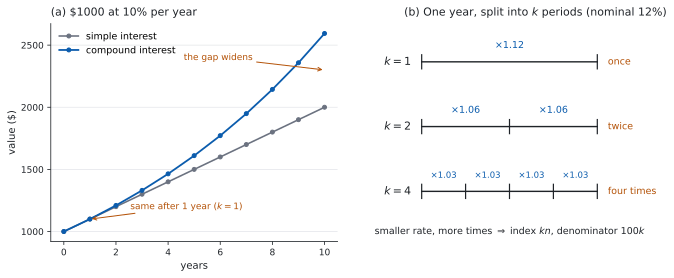

# SL 1.4 — Financial applications of geometric sequences（複利・減価償却・実質価値） {#sec-aasl-1-4}

::: {.callout-note}
## What you should be able to do
- **compound interest**（複利）が geometric sequence であることが分かる。
- 公式集の $FV = PV\left(1 + \dfrac{r}{100k}\right)^{kn}$ を、**$k$ に気をつけて**使える。
- **simple interest**（単利）と compound interest のちがいを説明できる。
- **annual depreciation**（毎年の価値の目減り）を、同じ式で扱える。
- **inflation**（インフレ）を考えた **real value**（実質価値）を求められる。
- 「何年で $\ldots$ を超えるか」を、**手で調べられる**。
:::

## The idea

### 1. 利息が、利息を生む {#idea}

[SL 1.2](aasl-1-2.qmd#applications) の **simple interest**（単利）では、利息はいつも元金に対して計算されました。ですから毎年、**同じ額**が加わります。

**compound interest**（複利）は違います。**利息が元金に組み入れられ、次の年はその合計に対して利息が付きます。**

$\$1000$ を年 $10\%$ で預けた場合を、$3$ 年ぶん書いてみます。

| 年 | 計算 | 年末の金額 |
|:--|:--|:--|
| $1$ | $1000 \times 1.1$ | $1100$ |
| $2$ | $1100 \times 1.1$ | $1210$ |
| $3$ | $1210 \times 1.1$ | $1331$ |

: 複利は、毎年 $1.1$ 倍になる {#tbl-aasl14-compound}

**毎年 $1.1$ 倍**しています。同じ数を掛け続けているので、これは [geometric sequence](aasl-1-3.qmd)（等比数列）です。公比は $r = 1.1$ です。

::: {.callout-important}
## $10\%$ 増えるのは、$1.1$ 倍
$0.1$ 倍ではありません（[SL 1.3 第 7 節](aasl-1-3.qmd#applications)）。

もとの $1$ に、増える分の $0.1$ を足して $1.1$ です。この $1.1$ を **growth factor**（増加倍率）と呼ぶことがあります。

**growth rate（増加率）とは別のもの**です。増加率は $10\%$、増加倍率は $1.1$ です。混同しないでください。
:::

### 2. 公式 {#formula}

$$
FV = PV \times \left(1 + \frac{r}{100k}\right)^{kn}
$$ {#eq-aasl14-fv}

::: {.callout-important}
## この式は公式集にあります
公式集の **1.4** の欄に `Compound interest` として印刷されています。**記号の意味も、そのまま書かれています。**

> where $FV$ is the future value, $PV$ is the present value, $n$ is the number of years, $k$ is the number of compounding periods per year, $r\%$ is the nominal annual rate of interest

**depreciation の式は、公式集にありません。** 同じ式で $r$ を負にします（[第 5 節](#depreciation)）。
:::

記号を、日本語で並べておきます。

| 記号 | 英語 | 意味 |
|:--|:--|:--|
| $PV$ | present value | いま預ける額 |
| $FV$ | future value | $n$ 年後の額 |
| $r$ | nominal annual rate of interest | 名目年利。**パーセントの数字**（$10\%$ なら $10$） |
| $n$ | number of years | **年数** |
| $k$ | compounding periods per year | $1$ 年に利息が付く回数 |

: 公式の記号 {#tbl-aasl14-symbols}

::: {.callout-warning}
## $r$ は「パーセントの数字」です
$10\%$ なら $r = 10$ であって、$0.1$ ではありません。$100k$ で割るところで、パーセントが小数に直ります。

$k = 1$、$r = 10$ なら $\dfrac{10}{100 \times 1} = 0.1$ となり、$(1 + 0.1)^{n} = 1.1^{n}$ です。@tbl-aasl14-compound と合います。
:::

::: {.callout-tip}
## 導出は、試験に出ません
シラバスに、はっきり書かれています。

> In examinations, questions that ask students to derive the formula will not be set.

**「なぜこの式になるのか証明しなさい」という問題は出ません。** 式の意味が分かって、正しく使えれば十分です。それでも、なぜこうなるのかは [Why it works](#why-it-works) で $1$ 度だけ確かめておきます。読まなくても解けます。
:::

### 3. $k$ — $1$ 年に何回つくか {#k}

シラバスは `Compound interest can be calculated yearly, half-yearly, quarterly or monthly.` と書いています。

| 英語 | 意味 | $k$ |
|:--|:--|:--|
| yearly | $1$ 年に $1$ 回 | $1$ |
| half-yearly | 半年に $1$ 回 | $2$ |
| quarterly | $3$ か月に $1$ 回 | $4$ |
| monthly | $1$ か月に $1$ 回 | $12$ |

: $k$ の読み取り方 {#tbl-aasl14-k}

**$k$ は、指数と分母の両方に効きます。**

$$
\left(1 + \underbrace{\frac{r}{100k}}_{1 \text{ 回あたりの利率}}\right)^{\overbrace{kn}^{\text{回数}}}
$$

$1$ 回あたりの利率は小さくなりますが、回数が増えます。**両方を同時に直してください。** 片方だけ直すのが、この項目でいちばん多い誤りです。

@fig-aasl14-idea の (b) が、その様子です。

{#fig-aasl14-idea width=100%}

### 4. 単利とのちがい {#simple-vs-compound}

@fig-aasl14-idea の (a) が、$\$1000$ を年 $10\%$ で預けたときの $2$ つのちがいです。

| | simple interest | compound interest |
|:--|:--|:--|
| 利息のもと | いつも元金 | そのときの残高 |
| 毎年 | 同じ**額**が加わる | 同じ**倍率**を掛ける |
| 数列 | arithmetic（等差数列） | geometric（等比数列） |
| グラフ | まっすぐ | だんだん急に上がる |

: 単利と複利 {#tbl-aasl14-vs}

**年 $1$ 回の複利（$k = 1$）なら、はじめの $1$ 年はまったく同じ**です。差がつくのは $2$ 年目からで、**年数が長いほど差が開きます。**

（$k$ が $2$ 以上なら、$1$ 年目からもう差がつきます。）

### 5. depreciation — 価値が減る {#depreciation}

**annual depreciation**（毎年の価値の目減り）は、複利の裏返しです。

車や機械の価値が毎年 $25\%$ ずつ減るなら、残るのは $75\%$、つまり **$0.75$ 倍**です。

$$
\text{value after } n \text{ years} = PV \times (0.75)^{n}
$$

公式集の式で言えば、**$r = -25$、$k = 1$** としたものです。

$$
\left(1 + \frac{-25}{100 \times 1}\right)^{n} = (1 - 0.25)^{n} = 0.75^{n}
$$

::: {.callout-warning}
## 減る割合と、残る割合を取りちがえない
$25\%$ **減る**なら、掛けるのは $0.75$ です。$0.25$ ではありません。

$0.25$ を掛けたら、$1$ 年で $4$ 分の $1$ になってしまいます。

**「減る」と書いてあったら、$1$ から引いてから掛ける**、と手を動かしてください。
:::

### 6. inflation と real value {#real}

シラバスに、この $1$ 行があります。

> Calculate the real value of an investment with an interest rate and an inflation rate.

**お金が増えても、物の値段も上がっていたら、買えるものは増えていません。**

そこで、将来の金額を「**いまのお金でいうといくらか**」に直します。これが **real value**（実質価値）です。

$$
\text{real value} = \frac{FV}{\left(1 + \dfrac{f}{100}\right)^{n}}
$$ {#eq-aasl14-real}

$f$ は **inflation rate**（インフレ率、パーセントの数字）です。

::: {.callout-important}
## この式は公式集にありません
公式集の **1.4** の欄にあるのは `Compound interest` の $FV$ の式だけです。**この割り戻しの式は印刷されていないので、覚える必要があります。**
:::

::: {.callout-warning}
## 割り戻しの指数は $kn$ ではなく $n$
$f$ は**年**のインフレ率なので、$n$ 年ぶん割り戻します。複利が $1$ 年に $k$ 回ついていても、**インフレ側の指数は $n$ のまま**です。

$k$ を指数に入れるのは、$FV$ を出す式（@eq-aasl14-fv）のほうだけです。
:::

**年 $1$ 回の複利で、利率とインフレ率が同じなら、実質価値は最初の額のまま**です。$\$2500$ を年 $20\%$ で $2$ 年預け、インフレも年 $20\%$ なら

$$
FV = 2500 \times 1.2^{2} = 3600, \qquad \text{real value} = \frac{3600}{1.2^{2}} = 2500
$$

**金額は $3600$ に増えたのに、買えるものは増えていません。**

::: {.callout-warning}
## 「利率 $-$ インフレ率」で計算しないでください
上の例では、$20\% - 20\% = 0\%$ と考えても答えが合います。**けれども、それはたまたまです。**

$2$ つの割合がちがうと、答えがずれます（@exm-aasl14-real の解説で、実際の数で見ます）。

**real value は、いつも $2$ 段階です。** ① $FV$ を出す ② インフレ率で割る。
:::

### 7. 何年で超えるか {#when}

**Paper 1 では、$\log$ を使わずに、$1$ 年ずつ調べます。**

$\$1500$ が年 $10\%$ で、いつ $\$2000$ を超えるか。

| $n$ | $1.1^{n}$ | 金額 |
|:--|:--|:--|
| $2$ | $1.21$ | $1815$ |
| $3$ | $1.331$ | $1996.50$ |
| $4$ | $1.4641$ | $2196.15$ |

: $1$ 年ずつ調べる {#tbl-aasl14-when}

$3$ 年目では届かず、$4$ 年目で超えます。答えは **$4$ 年**です。

**$1.1$ を $1$ 回ずつ掛けていく**のが、いちばん確実です。$1.21 \times 1.1 = 1.331$、$1.331 \times 1.1 = 1.4641$。

::: {.callout-important}
## 境目の両側を、必ず両方書いてください
$n = 3$ で届かないこと、$n = 4$ で超えることの**両方**を見せて、はじめて「$4$ 年が最小」と言えます。

**片方だけでは、答えの根拠になりません。**
:::

::: {.callout-tip collapse="true"}
## Paper 2 では、Finance Solver が使えます
Paper 1 では使えませんが、Paper 2 では電卓の Finance Solver が使えます。

```
menu → Finance → Finance Solver
```

| 欄 | 入れるもの |
|:--|:--|
| `N` | 期間の**回数**（$k \times n$。年数ではありません） |
| `I(%)` | 名目年利 $r$ |
| `PV` | $-$（預ける額） |
| `Pmt` | $0$ |
| `FV` | 求めたい欄（カーソルを置いて `enter`） |
| `PpY`、`CpY` | どちらも $k$ |

**符号のきまりが関門です。** 自分から出ていくお金は**負**、入ってくるお金は**正**です。預金なら $PV$ が負、$FV$ が正になります。両方同じ符号にすると、エラーか、意味のない値が返ります。

**`N` は年数ではありません。** quarterly で $5$ 年なら $N = 20$ です。`PpY`、`CpY`、`N` の $3$ つはセットで動きます。
:::

## Why it works

**なぜ $\left(1 + \dfrac{r}{100k}\right)^{kn}$ なのか。**（試験では問われません。[第 2 節](#formula)の断りのとおりです。）

$1$ 年に $k$ 回、利息が付くとします。$1$ 回あたりの利率は、年利を $k$ 等分した

$$
\frac{r}{100k}
$$

です。$1$ 回ごとに、残高は $\left(1 + \dfrac{r}{100k}\right)$ 倍になります。

$n$ 年のあいだに、利息が付く回数は $k \times n$ 回です。**同じ倍率を $kn$ 回掛ける**ので、指数が $kn$ になります。

$$
FV = PV \times \underbrace{\left(1 + \frac{r}{100k}\right) \times \cdots \times \left(1 + \frac{r}{100k}\right)}_{kn \text{ 個}}
$$

**なぜ、$k$ が大きいほど $FV$ も大きくなるのか。**

$1$ 回あたりの利率は $\dfrac{1}{k}$ になりますが、回数は $k$ 倍になります。もし利息が単利のように働くなら、これで打ち消し合って同じになるはずです。

打ち消し合わないのは、**早くついた利息にも、その先で利息が付く**からです。$k$ を大きくすると、利息が「働きはじめる」時期が早くなります。ですから、$FV$ は少しだけ大きくなります。

$\$800$、年 $12\%$、$1$ 年で見ると

$$
\begin{aligned}
k = 1 &: \quad 800(1.12) = 896 \\[2pt]
k = 2 &: \quad 800(1.06)^{2} = 898.88 \\[2pt]
k = 4 &: \quad 800(1.03)^{4} = 900.4070\ldots
\end{aligned}
$$

**増えますが、増え方はごくわずか**です。$k$ を $4$ 倍にしても、$4$ 倍増えるわけではありません。

## Worked examples

::: {.callout-note appearance="simple"}
問題文は英語です。意味が理解できなかったら、問題文の下の「**日本語訳**」を開いてください。解説は日本語です。

**例題も演習も、すべて電卓なしで解けます。** Paper 1 のつもりで解いてください。
:::

::: {#exm-aasl14-basic}
[Ken invests $\$2000$ at a nominal annual interest rate of $10\%$, compounded yearly.]{.q-en}

**(a)** [Find the value of the investment after $3$ years.]{.q-en}

**(b)** [Find the total interest earned over the $3$ years.]{.q-en}

**(c)** [Find the total interest that would be earned if the account paid $10\%$ simple interest instead.]{.q-en}

**(d)** [Explain why compound interest earns more than simple interest over the $3$ years.]{.q-en}

<details class="jp-trans">
<summary>日本語訳</summary>

Ken は $\$2000$ を、名目年利 $10\%$、$1$ 年に $1$ 回の複利で預けます。

**(a)** $3$ 年後の金額を求めなさい。

**(b)** その $3$ 年で得た利息の合計を求めなさい。

**(c)** もし年 $10\%$ の単利だったら得られたはずの利息の合計を求めなさい。

**(d)** $3$ 年では複利のほうが単利より多く増える理由を説明しなさい。

</details>

---

**(a)** $k = 1$、$r = 10$、$n = 3$ です（@eq-aasl14-fv）。

$$
FV = 2000\left(1 + \frac{10}{100}\right)^{3} = 2000(1.1)^{3} = 2000 \times 1.331 = 2662
$$

$1.1^{3}$ は、$1.1 \times 1.1 = 1.21$、$1.21 \times 1.1 = 1.331$ と $2$ 回で出せます。

**(b)** 利息は、増えた分です。

$$
2662 - 2000 = \$662
$$

**(c)** 単利なら、毎年 $2000 \times 0.1 = 200$ が加わります（[SL 1.2](aasl-1-2.qmd#applications)）。

$$
3 \times 200 = \$600
$$

**(d)** `Explain why` なので、英語で理由を書きます。

::: {.model-answer}
**試験ではこう書く**

*With simple interest the interest is always $10\%$ of the original $\$2000$, so $\$200$ is added every year. With compound interest the interest is $10\%$ of the current balance, and after the first year that balance is larger than $\$2000$. In year $2$ the interest is $10\%$ of $\$2200$, which is $\$220$, and in year $3$ it is $10\%$ of $\$2420$, which is $\$242$. Because interest is earned on interest already added, the compound total of $\$662$ is larger than the simple total of $\$600$. The two are equal only in the first year.*
:::

（単利では、利息はつねに元金 $\$2000$ の $10\%$ なので、毎年 $\$200$ が加わる。複利では、利息はそのときの残高の $10\%$ であり、$1$ 年目のあとその残高は $\$2000$ より大きい。$2$ 年目の利息は $\$2200$ の $10\%$ で $\$220$、$3$ 年目は $\$2420$ の $10\%$ で $\$242$ である。すでに付いた利息にも利息が付くので、複利の合計 $\$662$ は単利の合計 $\$600$ より大きい。$2$ つが等しいのは $1$ 年目だけである、という意味です。）

**検算（(a) について）。** $1$ 年ずつ追います。

$$
2000 \to 2200 \to 2420 \to 2662
$$

合いました ✓ **これは $1.331$ を経由しない別の道すじです。** 指数を $1.1^{2}$ と取りちがえていたら $2420$ になり、$1$ 年ずつ追った値と合いません。

**検算（(b)(c) について）。** 単利の $600$ と複利の $662$ の差は $62$ です。これは、$2$ 年目に増えた $20$ と $3$ 年目に増えた $42$ の合計です。$20 + 42 = 62$ ✓ **「利息に付いた利息」だけを数えても、同じ値になります。**

::: {.callout-note}
## 解答例（答案用紙にはこう書く）
**(a)**
$$FV = 2000(1.1)^{3} = 2000 \times 1.331 = \$2662$$

**(b)**
$$2662 - 2000 = \$662$$

**(c)**
$$2000 \times 0.1 \times 3 = \$600$$

**(d)**
*Simple interest always uses the original $\$2000$, so $\$200$ is added each year. Compound interest uses the current balance, which grows, so the interest added grows too: $\$200$, $\$220$, $\$242$.*
:::
:::

::: {#exm-aasl14-k}
[Mei invests $\$4000$ at a nominal annual interest rate of $20\%$ for $2$ years.]{.q-en}

**(a)** [Find the value of the investment if interest is compounded yearly.]{.q-en}

**(b)** [Find the value of the investment if interest is compounded half-yearly.]{.q-en}

**(c)** [Explain why compounding half-yearly gives a larger value, even though the nominal rate is the same.]{.q-en}

<details class="jp-trans">
<summary>日本語訳</summary>

Mei は $\$4000$ を、名目年利 $20\%$ で $2$ 年間預けます。

**(a)** 利息が $1$ 年に $1$ 回つく場合の金額を求めなさい。

**(b)** 利息が半年に $1$ 回つく場合の金額を求めなさい。

**(c)** 名目年利が同じなのに、半年に $1$ 回のほうが大きくなる理由を説明しなさい。

</details>

---

**(a)** $k = 1$ です。

$$
FV = 4000\left(1 + \frac{20}{100}\right)^{2} = 4000(1.2)^{2} = 4000 \times 1.44 = 5760
$$

**(b)** $k = 2$ です。**分母と指数の両方**が変わります（[第 3 節](#k)）。

$$
FV = 4000\left(1 + \frac{20}{100 \times 2}\right)^{2 \times 2} = 4000(1.1)^{4}
$$

$1.1^{4} = 1.1^{2} \times 1.1^{2} = 1.21 \times 1.21 = 1.4641$ なので

$$
FV = 4000 \times 1.4641 = 5856.40
$$

**(c)** `Explain why` なので、英語で理由を書きます。

::: {.model-answer}
**試験ではこう書く**

*Compounding half-yearly splits the year into two periods, each at $10\%$, with interest paid after six months and again at the end of the year. The interest paid after six months is added to the balance, so during the second half of the year interest is earned on that interest as well. Over two years this happens four times instead of twice, so the final value is larger. The nominal rate is the same, but the money starts earning interest sooner.*
:::

（半年ごとの複利は、$20\%$ を $10\%$ ずつ $2$ 回に分ける。半年後に付いた利息は残高に組み入れられるので、後半の半年では、その利息にも利息が付く。$2$ 年では、これが $2$ 回ではなく $4$ 回起こるので、最後の金額が大きくなる。名目年利は同じだが、お金が利息を生みはじめる時期が早い、という意味です。）

**検算（(b) について）。** 半年ごとに $1$ 回ずつ追います。

$$
4000 \to 4400 \to 4840 \to 5324 \to 5856.40
$$

合いました ✓ **これは $1.4641$ を経由しない別の道すじです。**

**$k$ を分母だけ直して $4000(1.1)^{2} = 4840$ としていたら**、$1$ 年ぶんの値です。**指数だけ直して $4000(1.2)^{4} = 8294.40$ としていたら**、$2$ 年で $2$ 倍以上になり、$20\%$ の利率としては大きすぎます。

**検算（(a)(b) の関係について）。** (b) は (a) より大きく、しかも**わずかに**大きいはずです。$5856.40 - 5760 = 96.40$ で、$5760$ の $2\%$ にも届きません ✓ **もし何倍もちがっていたら、$k$ の入れ方が違います。**

::: {.callout-note}
## 解答例（答案用紙にはこう書く）
**(a)**
$$FV = 4000(1.2)^{2} = \$5760$$

**(b)**
$$FV = 4000\left(1 + \frac{20}{200}\right)^{4} = 4000(1.1)^{4} = \$5856.40$$

**(c)**
*The year is split into two periods, each at $10\%$, so interest is added sooner and then earns interest itself. Over two years this happens four times instead of twice.*
:::
:::

::: {#exm-aasl14-depreciation}
[A machine is bought for $\$12\,000$. Its value depreciates by $25\%$ each year.]{.q-en}

**(a)** [Find the value of the machine after $3$ years.]{.q-en}

**(b)** [Show that after $3$ years the machine is worth less than half its original value.]{.q-en}

**(c)** [Find the number of years it takes for the value of the machine to fall below $\$4000$.]{.q-en}

<details class="jp-trans">
<summary>日本語訳</summary>

ある機械を $\$12\,000$ で買いました。価値は毎年 $25\%$ ずつ減ります。

**(a)** $3$ 年後の機械の価値を求めなさい。

**(b)** $3$ 年後には、買ったときの半分より安くなっていることを示しなさい。

**(c)** 機械の価値が $\$4000$ を下回るまでに何年かかるかを求めなさい。

</details>

---

**(a)** $25\%$ 減るので、残るのは $0.75$ 倍です（[第 5 節](#depreciation)）。

$$
12\,000 \times (0.75)^{3} = 12\,000 \times \frac{27}{64} = \frac{324\,000}{64} = 5062.50
$$

$0.75 = \dfrac{3}{4}$ と分数で書くと、$\left(\dfrac{3}{4}\right)^{3} = \dfrac{27}{64}$ となって手で計算できます。

**(b)** `Show that` なので、くらべて見せます。買ったときの半分は $6000$ です。

$$
5062.50 < 6000
$$

ですから、半分より安くなっています。

**(c)** $1$ 年ずつ調べます（[第 7 節](#when)）。

| $n$ | 価値 |
|:--|:--|
| $3$ | $5062.50$ |
| $4$ | $3796.88$（正確には $3796.875$） |

: $\$4000$ を下回るのはいつか {#tbl-aasl14-below}

$3$ 年目は $\$4000$ より上、$4$ 年目で下回ります。答えは **$4$ 年目**です。

**検算（(a) について）。** $1$ 年ずつ追います。

$$
12\,000 \to 9000 \to 6750 \to 5062.50
$$

合いました ✓ **$0.25$ を掛けていたら** $12\,000 \to 3000 \to 750 \to 187.50$ となり、$1$ 年で $4$ 分の $1$ になってしまいます。**「減る割合」と「残る割合」の取りちがえは、$1$ 年ぶん追うだけで見つかります。**

**検算（(c) について）。** $4$ 年目の値を、$1$ 年ずつではなく**累乗から**出します。

$$
12\,000 \times (0.75)^{4} = 12\,000 \times \frac{81}{256} = \frac{972\,000}{256} = 3796.875
$$

合いました ✓ **$5062.50$ に $0.75$ を掛けるのとは別の道すじです。** 境目の両側（$5062.50 > 4000$、$3796.875 < 4000$）がそろって、はじめて「$4$ 年目が最初」と言えます。

::: {.callout-note}
## 解答例（答案用紙にはこう書く）
**(a)**
$$12\,000 \times (0.75)^{3} = 12\,000 \times \frac{27}{64} = \$5062.50$$

**(b)**
$$\frac{12\,000}{2} = 6000, \qquad 5062.50 < 6000$$

**(c)**
$$n = 3: \ \$5062.50, \qquad n = 4: \ \$3796.88$$
*The value first falls below $\$4000$ after $4$ years.*
:::
:::

::: {#exm-aasl14-real}
[Ana invests $\$10\,000$ at a nominal annual interest rate of $10\%$, compounded yearly, for $2$ years. Over the same $2$ years the annual inflation rate is $10\%$.]{.q-en}

**(a)** [Find the value of the investment after $2$ years.]{.q-en}

**(b)** [Find the real value of the investment after $2$ years.]{.q-en}

**(c)** [Comment on what your answer to (b) tells Ana about her investment.]{.q-en}

<details class="jp-trans">
<summary>日本語訳</summary>

Ana は $\$10\,000$ を、名目年利 $10\%$、$1$ 年に $1$ 回の複利で $2$ 年間預けます。同じ $2$ 年間の年間インフレ率は $10\%$ です。

**(a)** $2$ 年後の金額を求めなさい。

**(b)** $2$ 年後の real value（実質価値）を求めなさい。

**(c)** (b) の答えが、Ana の投資について何を意味するかを述べなさい。

</details>

---

**(a)** $k = 1$、$r = 10$、$n = 2$ です。

$$
FV = 10\,000(1.1)^{2} = 10\,000 \times 1.21 = 12\,100
$$

**(b)** インフレ率で割ります（@eq-aasl14-real）。$f = 10$、$n = 2$ です。

$$
\text{real value} = \frac{12\,100}{(1.1)^{2}} = \frac{12\,100}{1.21} = 10\,000
$$

**(c)** `Comment on` なので、英語で述べます。

::: {.model-answer}
**試験ではこう書く**

*In real terms the investment is worth exactly what Ana started with. The balance has grown from $\$10\,000$ to $\$12\,100$, but prices have risen by the same $10\%$ each year, so the extra $\$2100$ buys nothing more than the original $\$10\,000$ would have bought two years earlier. Her money has kept its purchasing power, but she has gained nothing in real terms.*
:::

（実質で見ると、この投資は Ana が最初に入れた額とちょうど同じ価値である。残高は $\$10\,000$ から $\$12\,100$ に増えたが、物価も毎年同じ $10\%$ 上がったので、増えた $\$2100$ は、$2$ 年前に $\$10\,000$ で買えたもの以上のものを買えるわけではない。お金の買う力は保たれたが、実質では何も得ていない、という意味です。）

**検算（(b) について）。** 分数のまま約分します。

$$
\frac{10\,000 \times 1.1^{2}}{1.1^{2}} = 10\,000
$$

**上と下が同じ $1.1^{2}$ なので、消えます** ✓ 年 $1$ 回の複利で利率とインフレ率が同じなら、実質価値は $PV$ に戻ります。

**「$10\% - 10\% = 0\%$」でも同じ答えになりますが、たまたまです。** 割合がちがうと合いません。たとえば $\$8000$、利率 $10\%$、インフレ $5\%$、$2$ 年なら

$$
FV = 8000 \times 1.21 = 9680, \qquad \text{real value} = \frac{9680}{1.1025} = 8780.04\ldots
$$

ですが、「差の $5\%$」で計算すると $8000 \times 1.1025 = 8820$ となり、**$40$ ほどずれます**（[第 6 節](#real)）。

::: {.callout-note}
## 解答例（答案用紙にはこう書く）
**(a)**
$$FV = 10\,000(1.1)^{2} = \$12\,100$$

**(b)**
$$\text{real value} = \frac{12\,100}{1.1^{2}} = \frac{12\,100}{1.21} = \$10\,000$$

**(c)**
*The real value equals the amount invested, so the investment has kept its purchasing power but gained nothing in real terms.*
:::
:::

## Common errors

::: {.callout-warning}
## $r$ に小数を入れる
公式集の $r$ は**パーセントの数字**です（@tbl-aasl14-symbols）。$10\%$ なら $r = 10$ です。

$r = 0.1$ と入れると、$\dfrac{0.1}{100} = 0.001$ となり、$0.1\%$ の計算になってしまいます。

**答えがほとんど増えていなかったら、ここを疑ってください。**
:::

::: {.callout-warning}
## $k$ を、分母か指数の片方だけ直す
$k$ は**両方**に効きます（[第 3 節](#k)）。

half-yearly で $2$ 年なら、$\left(1 + \dfrac{r}{200}\right)^{4}$ です。

$\left(1 + \dfrac{r}{200}\right)^{2}$ は $1$ 年ぶん、$\left(1 + \dfrac{r}{100}\right)^{4}$ は年利を $2$ 倍にしたのと同じです。
:::

::: {.callout-warning}
## depreciation で $0.25$ を掛ける
$25\%$ **減る**なら、残るのは $0.75$ です（[第 5 節](#depreciation)）。

$0.25$ を掛けると、$1$ 年で $4$ 分の $1$ になります。

**$1$ 年ぶんだけ手で追えば、すぐ気づけます。**
:::

::: {.callout-warning}
## real value を「利率 $-$ インフレ率」で出す
$2$ 段階です。**① $FV$ を出す ② インフレ率で割る**（[第 6 節](#real)）。

差を取る方法は、$2$ つの割合が同じときだけ、たまたま合います。

**問題文に inflation が出てきたら、割り算がもう $1$ 回ある**、と思ってください。
:::

::: {.callout-warning}
## 「何年で超えるか」を、片側だけ書く
$n = 4$ で超えることを書いても、**$n = 3$ で届かないこと**を書かなければ、最小である根拠になりません（[第 7 節](#when)）。

**表で両側を見せる**のが、いちばん確実です。

**「何年かかるか」を聞かれているので、答えは整数の年です。**
:::

## Exercises

::: {.callout-note appearance="simple"}
各問題に、折りたたみが $3$ つ付いています。**日本語訳**、**解答例**（答案用紙に書くべきこと。英語です）、**解説**（なぜそうなるか。日本語です）。

まず自分で解いて、次に解答例と見くらべてください。**解説は、合わなかったときだけ開けば十分です。**
:::

::: {.exercise-block}

[1]{.ex-no} [Find the value of $\$2500$ invested for $2$ years at a nominal annual interest rate of $8\%$, compounded yearly.]{.q-en}

<details class="jp-trans">
<summary>日本語訳</summary>

$\$2500$ を、名目年利 $8\%$、$1$ 年に $1$ 回の複利で $2$ 年間預けたときの金額を求めなさい。

</details>

::: {.callout-note collapse="true"}
## 解答例（答案用紙に書くこと）

$$FV = 2500(1.08)^{2} = 2500 \times 1.1664 = \$2916$$
:::

::: {.callout-tip collapse="true"}
## 解説

$k = 1$ なので、$\left(1 + \dfrac{8}{100}\right)^{2} = 1.08^{2}$ です。$1.08^{2} = 1.1664$ は、$1.08 \times 1.08$ を筆算で出せます。

**検算。** $1$ 年ずつ追います。$2500 \to 2700 \to 2916$ ✓ **これは $1.1664$ を経由しない別の道すじです。**

**$1.08^{2}$ を $1.16$ としていたら**（$0.08$ を $2$ 回足した値）、$2900$ となり、$1$ 年ずつ追った値と合いません。**複利では、倍率を足すのではなく掛けます。**
:::

::: {.ex-sep}
:::

[2]{.ex-no} [Sam invests $\$5000$ for $2$ years at a nominal annual interest rate of $20\%$, compounded yearly.]{.q-en}

**(a)** [Find the value of the investment after $2$ years.]{.q-en}

**(b)** [Find the interest earned.]{.q-en}

<details class="jp-trans">
<summary>日本語訳</summary>

Sam は $\$5000$ を、名目年利 $20\%$、$1$ 年に $1$ 回の複利で $2$ 年間預けます。

**(a)** $2$ 年後の金額を求めなさい。

**(b)** 得た利息を求めなさい。

</details>

::: {.callout-note collapse="true"}
## 解答例（答案用紙に書くこと）

**(a)**
$$FV = 5000(1.2)^{2} = 5000 \times 1.44 = \$7200$$

**(b)**
$$7200 - 5000 = \$2200$$
:::

::: {.callout-tip collapse="true"}
## 解説

**(b)** 利息は「増えた分」です。$FV$ をそのまま答えにしないでください。

**検算。** $1$ 年ずつ追います。$5000 \to 6000 \to 7200$ ✓

**利息の側からも確かめられます。** $1$ 年目の利息は $1000$、$2$ 年目は $6000$ の $20\%$ で $1200$。合わせて $2200$ ✓ **単利なら $2000$ なので、$200$ だけ多いはず**です。これは「利息に付いた利息」です。
:::

::: {.ex-sep}
:::

[3]{.ex-no} [Find the value of $\$2000$ invested for $2$ years at a nominal annual interest rate of $20\%$, compounded half-yearly.]{.q-en}

<details class="jp-trans">
<summary>日本語訳</summary>

$\$2000$ を、名目年利 $20\%$、半年に $1$ 回の複利で $2$ 年間預けたときの金額を求めなさい。

</details>

::: {.callout-note collapse="true"}
## 解答例（答案用紙に書くこと）

$$FV = 2000\left(1 + \frac{20}{100 \times 2}\right)^{2 \times 2} = 2000(1.1)^{4} = 2000 \times 1.4641 = \$2928.20$$
:::

::: {.callout-tip collapse="true"}
## 解説

half-yearly なので $k = 2$ です。**分母が $200$、指数が $4$** になります（[第 3 節](#k)）。

**検算。** 半年ごとに追います。$2000 \to 2200 \to 2420 \to 2662 \to 2928.20$ ✓

**yearly の場合と見くらべる**こともできます。$2000(1.2)^{2} = 2880$ で、half-yearly のほうが $48.20$ だけ大きい ✓ **$k$ を大きくすると少しだけ増える**、という関係と合っています。
:::

::: {.ex-sep}
:::

[4]{.ex-no} [A machine costs $\$8000$. Its value depreciates by $25\%$ each year. Find its value after $3$ years.]{.q-en}

<details class="jp-trans">
<summary>日本語訳</summary>

ある機械の価格は $\$8000$ です。価値は毎年 $25\%$ 減ります。$3$ 年後の価値を求めなさい。

</details>

::: {.callout-note collapse="true"}
## 解答例（答案用紙に書くこと）

$$8000 \times (0.75)^{3} = 8000 \times \frac{27}{64} = \$3375$$
:::

::: {.callout-tip collapse="true"}
## 解説

残るのは $0.75$ 倍です（[第 5 節](#depreciation)）。$\left(\dfrac{3}{4}\right)^{3} = \dfrac{27}{64}$ と分数で計算すると、割り切れます。

**検算。** $1$ 年ずつ追います。$8000 \to 6000 \to 4500 \to 3375$ ✓

**$3$ 年で半分より少し下**になっているのも、目安になります。$0.75^{3} = 0.421875$ で、$42\%$ ほどです。
:::

::: {.ex-sep}
:::

[5]{.ex-no} [A car is bought for $\$10\,000$ and loses $20\%$ of its value each year. Find the number of years it takes for the value of the car to fall below $\$5000$.]{.q-en}

<details class="jp-trans">
<summary>日本語訳</summary>

ある車を $\$10\,000$ で買いました。価値は毎年 $20\%$ ずつ減ります。車の価値が $\$5000$ を下回るまでに何年かかるかを求めなさい。

</details>

::: {.callout-note collapse="true"}
## 解答例（答案用紙に書くこと）

$$10\,000 \to 8000 \to 6400 \to 5120 \to 4096$$

*At the end of year $3$ the value is $\$5120$, which is above $\$5000$, and at the end of year $4$ it is $\$4096$, which is below. The value first falls below $\$5000$ after $4$ years.*
:::

::: {.callout-tip collapse="true"}
## 解説

残るのは $0.8$ 倍です。$1$ 年ずつ掛けるのが、いちばん速いです（[第 7 節](#when)）。

**境目の両側を、両方書いてください。** $3$ 年目で $\$5120$（まだ上）、$4$ 年目で $\$4096$（下回る）。

**検算。** 公式でも出します。$10\,000 \times 0.8^{4} = 10\,000 \times 0.4096 = 4096$ ✓ $0.8^{2} = 0.64$、$0.8^{4} = 0.64^{2} = 0.4096$ です。

**$0.8^{3} = 0.512$ で、まだ半分より上**であることも見えます。半分になるのは $3$ 年目と $4$ 年目のあいだです。
:::

::: {.ex-sep}
:::

[6]{.ex-no} [Nina invests $\$4000$ for $3$ years at a nominal annual interest rate of $10\%$.]{.q-en}

**(a)** [Find the interest earned if the interest is simple.]{.q-en}

**(b)** [Find the interest earned if the interest is compounded yearly.]{.q-en}

**(c)** [Find the difference between the two amounts of interest.]{.q-en}

<details class="jp-trans">
<summary>日本語訳</summary>

Nina は $\$4000$ を、名目年利 $10\%$ で $3$ 年間預けます。

**(a)** 単利のときに得られる利息を求めなさい。

**(b)** $1$ 年に $1$ 回の複利のときに得られる利息を求めなさい。

**(c)** $2$ つの利息の差を求めなさい。

</details>

::: {.callout-note collapse="true"}
## 解答例（答案用紙に書くこと）

**(a)**
$$4000 \times 0.1 \times 3 = \$1200$$

**(b)**
$$4000(1.1)^{3} - 4000 = 5324 - 4000 = \$1324$$

**(c)**
$$1324 - 1200 = \$124$$
:::

::: {.callout-tip collapse="true"}
## 解説

**(a)** 単利は毎年 $400$ です（[SL 1.2](aasl-1-2.qmd#applications)）。

**(b)** $4000 \times 1.331 = 5324$ から、元金を引きます。

**検算。** 利息を $1$ 年ずつ出します。$400$、$440$（$4400$ の $10\%$）、$484$（$4840$ の $10\%$）。合わせて $1324$ ✓ **これは $1.331$ を経由しない別の道すじです。**

差の $124$ も、$0 + 40 + 84 = 124$ と、**単利との差だけを足して**確かめられます ✓
:::

::: {.ex-sep}
:::

[7]{.ex-no} [Leo invests $\$5000$ at a nominal annual interest rate of $8\%$, compounded yearly, for $1$ year. The inflation rate for that year is $4\%$.]{.q-en}

**(a)** [Find the value of the investment after $1$ year.]{.q-en}

**(b)** [Find the real value of the investment after $1$ year, correct to two decimal places.]{.q-en}

<details class="jp-trans">
<summary>日本語訳</summary>

Leo は $\$5000$ を、名目年利 $8\%$、$1$ 年に $1$ 回の複利で $1$ 年間預けます。その年のインフレ率は $4\%$ です。

**(a)** $1$ 年後の金額を求めなさい。

**(b)** $1$ 年後の real value（実質価値）を、小数第 $2$ 位まで求めなさい。

</details>

::: {.callout-note collapse="true"}
## 解答例（答案用紙に書くこと）

**(a)**
$$FV = 5000(1.08)^{1} = \$5400$$

**(b)**
$$\text{real value} = \frac{5400}{1.04} = \$5192.31$$
:::

::: {.callout-tip collapse="true"}
## 解説

**$2$ 段階です。** ① $FV$ を出す ② インフレ率で割る（[第 6 節](#real)）。

$\dfrac{5400}{1.04} = \dfrac{540\,000}{104}$ です。上下を $8$ で約分すると $\dfrac{67\,500}{13}$ になり、$13$ で割るだけの筆算になります。$13 \times 5192 = 67\,496$、余り $4$ なので $5192.307\ldots$ です。小数第 $2$ 位までなので $5192.31$ です。

**検算。** 出した実質価値に、インフレ率を**掛け戻します**。$5192.31 \times 1.04 = 5400.0024$ で、$5400$ に戻ります ✓（$0.01$ 単位に丸めたぶんのずれです。）

**「$8\% - 4\% = 4\%$」で計算していたら** $5000 \times 1.04 = 5200$ となり、$7.69$ ずれます。**割合がちがうときは、差を取る方法は使えません。**
:::

::: {.ex-sep}
:::

[8]{.ex-no} [Tom invests $\$2000$ at a nominal annual interest rate of $20\%$, compounded yearly. Find the number of years it takes for the value of the investment to exceed $\$4000$.]{.q-en}

<details class="jp-trans">
<summary>日本語訳</summary>

Tom は $\$2000$ を、名目年利 $20\%$、$1$ 年に $1$ 回の複利で預けます。金額が $\$4000$ を超えるまでに何年かかるかを求めなさい。

</details>

::: {.callout-note collapse="true"}
## 解答例（答案用紙に書くこと）

$$2000 \to 2400 \to 2880 \to 3456 \to 4147.20$$

*At the end of year $3$ the value is $\$3456$, which is below $\$4000$, and at the end of year $4$ it is $\$4147.20$, which is above. The value first exceeds $\$4000$ after $4$ years.*
:::

::: {.callout-tip collapse="true"}
## 解説

$1$ 年ずつ掛けます（[第 7 節](#when)）。$1.2$ を $1$ 回ずつ掛けるほうが、累乗を計算するより速いです。

**境目の両側を書いてください。** $3$ 年目は $\$3456$、$4$ 年目は $\$4147.20$ です。

**検算。** 公式でも出します。$2000 \times 1.2^{4} = 2000 \times 2.0736 = 4147.20$ ✓ $1.2^{2} = 1.44$、$1.2^{4} = 1.44^{2} = 2.0736$ です。

**「$2$ 倍になるのは $5$ 年」と見当をつけていた**なら、$20\%$ ずつ $5$ 回で $2.49$ 倍なので、少し遅すぎます。**$4$ 年でちょうど $2$ 倍を少し超える**、が正しい感覚です。
:::

::: {.ex-sep}
:::

[9]{.ex-no} [Ravi invests $\$1000$ for $1$ year at a nominal annual interest rate of $20\%$.]{.q-en}

**(a)** [Find the value after $1$ year if interest is compounded yearly.]{.q-en}

**(b)** [Find the value after $1$ year if interest is compounded half-yearly.]{.q-en}

**(c)** [Comment on the size of the difference between your two answers.]{.q-en}

<details class="jp-trans">
<summary>日本語訳</summary>

Ravi は $\$1000$ を、名目年利 $20\%$ で $1$ 年間預けます。

**(a)** $1$ 年に $1$ 回の複利のときの、$1$ 年後の金額を求めなさい。

**(b)** 半年に $1$ 回の複利のときの、$1$ 年後の金額を求めなさい。

**(c)** $2$ つの答えの差の大きさについて、述べなさい。

</details>

::: {.callout-note collapse="true"}
## 解答例（答案用紙に書くこと）

**(a)**
$$1000(1.2)^{1} = \$1200$$

**(b)**
$$1000\left(1 + \frac{20}{200}\right)^{2} = 1000(1.1)^{2} = \$1210$$

**(c)**
*The difference is only $\$10$, which is $1\%$ of the amount invested. Compounding twice a year rather than once does increase the value, because the interest paid after six months earns interest for the rest of the year, but the effect is small compared with the $\$200$ earned from the interest rate itself.*
:::

::: {.callout-tip collapse="true"}
## 解説

**(b)** $k = 2$ なので、分母は $200$、指数は $2$ です。

**(c)** `Comment on` なので、英語で述べます。**「大きくなる」だけでは足りません。** どれくらい大きいのかに触れてください。

**検算（(b) について）。** 半年ごとに追います。$1000 \to 1100 \to 1210$ ✓

**差の $10$ は、半年後に付いた利息 $\$100$ に、後半の半年ぶんの利率 $10\%$ が付いたもの**です。$100 \times 0.1 = 10$ ✓ **「利息に付いた利息」だけを取り出しても、同じ $10$ になります。**

::: {.model-answer}
**試験ではこう書く**

*Compounding half-yearly gives $\$1210$ instead of $\$1200$, a difference of only $\$10$ on an investment of $\$1000$. The gain comes from the $\$100$ of interest paid after six months, which itself earns $10\%$ for the second half of the year. Compared with the $\$200$ earned from the nominal rate, the effect of compounding more often is small.*
:::
:::

::: {.ex-sep}
:::

[10]{.ex-no} [A student is asked to find the value of $\$5000$ invested for $2$ years at a nominal annual interest rate of $20\%$, compounded half-yearly, and writes]{.q-en}

$$
FV = 5000(1.2)^{4} = 10\,368
$$

[Identify the error and give the correct value.]{.q-en}

<details class="jp-trans">
<summary>日本語訳</summary>

ある生徒が、$\$5000$ を名目年利 $20\%$、半年に $1$ 回の複利で $2$ 年間預けたときの金額を求めるように言われ、上のように書きました。

誤りを指摘し、正しい金額を書きなさい。

</details>

::: {.callout-note collapse="true"}
## 解答例（答案用紙に書くこと）

*The student changed the index to $kn = 4$ but not the rate. With $k = 2$ the rate per period is $\frac{20}{100 \times 2} = 0.1$, not $0.2$.*

$$FV = 5000\left(1 + \frac{20}{200}\right)^{4} = 5000(1.1)^{4} = 5000 \times 1.4641 = \$7320.50$$
:::

::: {.callout-tip collapse="true"}
## 解説

`Identify the error` なので、**どこが違うのかを名指し**してから、正しい答えを書きます。

**$k$ は分母と指数の両方に効きます**（[第 3 節](#k)）。生徒は指数だけ直しました。

**検算。** 生徒の答えの大きさを見ます。$10\,368$ は元金の $2$ 倍以上です。**年 $20\%$ で $2$ 年なら、$2$ 倍にはなりません**（$1.2^{2} = 1.44$）。ここで気づけます。

正しい答えは、半年ごとに追っても出せます。$5000 \to 5500 \to 6050 \to 6655 \to 7320.50$ ✓

::: {.model-answer}
**試験ではこう書く**

*With $k = 2$ the interest rate per period is $\frac{20}{100 \times 2} = 10\%$, so the factor is $1.1$, not $1.2$. The student used the yearly factor $1.2$ together with the half-yearly index $4$, which is the same as doubling the nominal rate. The correct value is $5000(1.1)^{4} = \$7320.50$. A quick check confirms the error: under yearly compounding the value would be $5000 \times 1.44 = \$7200$, and compounding more often changes this only a little, so $\$10\,368$ is far too large.*
:::
:::

:::
