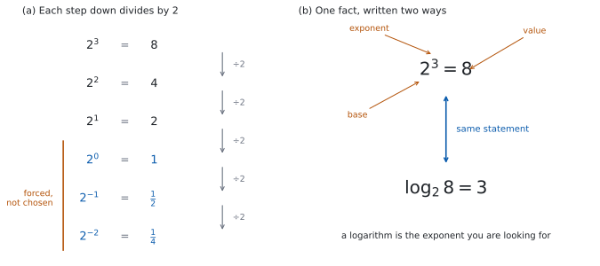

# SL 1.5 — Laws of exponents and introduction to logarithms（整数の指数法則と、対数のはじまり） {#sec-aasl-1-5}

::: {.callout-note}
## What you should be able to do
- **laws of exponents**（指数法則）を、**整数の指数**で使える。
- $a^{0} = 1$ と $a^{-n} = \dfrac{1}{a^{n}}$ が、なぜそうなるのかを説明できる。
- $(2x)^{4}$ と $2x^{-3}$ のように、**係数と文字がまざった形**を正しく扱える。
- 公式集の $a^{x} = b \iff x = \log_{a} b$ を、**両方向に**使える。
- 底が $10$ の対数（$\log$）と、底が $e$ の対数（$\ln$）が読める。
- $\log_{a} b$ の値を、**$b$ を $a$ の累乗に直して手で出せる。**
:::

## The idea

### 1. 指数は「何回掛けるか」 {#idea}

$a^{n}$ は、$a$ を $n$ 個掛けたものです。

$$
2^{3} = 2 \times 2 \times 2 = 8
$$

この読み方から、いちばん大事な法則がそのまま出てきます。$2^{3} \times 2^{4}$ を、掛ける回数で数えてみます。

$$
\underbrace{(2 \times 2 \times 2)}_{3 \text{ 個}} \times \underbrace{(2 \times 2 \times 2 \times 2)}_{4 \text{ 個}} = \underbrace{2 \times \cdots \times 2}_{7 \text{ 個}} = 2^{7}
$$

$3$ 個と $4$ 個を並べたら $7$ 個です。ですから、**指数は足し算になります。**

$$
2^{3} \times 2^{4} = 2^{3+4} = 2^{7}
$$

::: {.callout-important}
## 指数を足せるのは、底がそろっているときだけです
$2^{3} \times 5^{4}$ は、$10^{7}$ にはなりません。**同じ数を掛けているわけではない**からです。

**指数を足したり引いたりできるのは、底（下の数）が同じとき**だけだと覚えてください。

（@tbl-aasl15-laws の下の $2$ つ、積の累乗と商の累乗は、底がちがっても使えます。そちらでそろっているのは、指数のほうだからです。）

$2^{3} \times 5^{4} = 8 \times 625 = 5000$ で、$10^{7} = 10\,000\,000$ とはまるでちがいます。
:::

### 2. 指数法則 {#laws}

整数の指数で使う法則は、次の $5$ つです。

| 法則 | 式 | 覚え方 |
|:--|:--|:--|
| 積 | $a^{m} \times a^{n} = a^{m+n}$ | 掛けたら、指数は足す |
| 商 | $\dfrac{a^{m}}{a^{n}} = a^{m-n}$（$a \neq 0$） | 割ったら、指数は引く |
| 累乗の累乗 | $\left(a^{m}\right)^{n} = a^{mn}$ | 重ねたら、指数は掛ける |
| 積の累乗 | $(ab)^{n} = a^{n} b^{n}$ | かっこの中の**全部**に配る |
| 商の累乗 | $\left(\dfrac{a}{b}\right)^{n} = \dfrac{a^{n}}{b^{n}}$（$b \neq 0$） | 上にも下にも配る |

: 整数の指数で使う $5$ つの法則 {#tbl-aasl15-laws}

::: {.callout-important}
## この $5$ つは、公式集にありません
公式集の **1.5** の欄に印刷されているのは、対数の定義（@eq-aasl15-logdef）だけです。**指数法則そのものは、どこにも載っていません。**

つまり、**この $5$ つは覚えるしかありません。** ただし、@tbl-aasl15-laws の右の列のように「掛けたら足す」「割ったら引く」と唱えれば、思い出せます。
:::

商の法則は、積の法則から出ます。$\dfrac{2^{5}}{2^{3}}$ を書き出すと、

$$
\frac{2 \times 2 \times 2 \times 2 \times 2}{2 \times 2 \times 2} = 2 \times 2 = 2^{2}
$$

下の $3$ 個が、上の $3$ 個を消しました。残るのは $5 - 3 = 2$ 個です。

### 3. $a^{0} = 1$ と、負の指数 {#zero-negative}

「$0$ 回掛ける」「$-2$ 回掛ける」は、そのままでは意味が分かりません。**では、どう決めればよいのでしょうか。**

答えは、**商の法則が使えるように決める**です。

$$
\frac{2^{3}}{2^{3}} = 2^{3-3} = 2^{0}
$$

左辺は $\dfrac{8}{8} = 1$ です。ですから $2^{0} = 1$ と決めるほかありません。

同じように、

$$
\frac{2^{3}}{2^{5}} = 2^{3-5} = 2^{-2}
$$

左辺は $\dfrac{8}{32} = \dfrac{1}{4}$ です。ですから $2^{-2} = \dfrac{1}{4} = \dfrac{1}{2^{2}}$ です。

| 指数 | $3$ | $2$ | $1$ | $0$ | $-1$ | $-2$ |
|:--|:--|:--|:--|:--|:--|:--|
| $2^{n}$ | $8$ | $4$ | $2$ | $1$ | $\dfrac{1}{2}$ | $\dfrac{1}{4}$ |

: 指数を $1$ 減らすたびに、値は半分になる {#tbl-aasl15-ladder}

{#fig-aasl15-idea width=100%}

@tbl-aasl15-ladder を右へ進むと、毎回 $2$ で割っています。$8 \to 4 \to 2 \to 1 \to \dfrac{1}{2} \to \dfrac{1}{4}$ です。**$1$ のところで止める理由がありません**から、その先も自然に決まります。

まとめると、

$$
a^{0} = 1, \qquad a^{-n} = \frac{1}{a^{n}} \qquad (a \neq 0)
$$ {#eq-aasl15-neg}

::: {.callout-warning}
## $a^{-n}$ は、負の数ではありません
$2^{-2} = \dfrac{1}{4}$ です。$-4$ でも $-\dfrac{1}{4}$ でもありません。

**マイナスは「逆数にせよ」という合図**であって、符号を変える合図ではありません。$a > 0$ なら、$a^{-n}$ もつねに正です。
:::

### 4. 係数と文字がまざったとき {#coefficients}

かっこがあるかどうかで、まるで違う式になります。

$(2x)^{4}$ は、**かっこの中の全部**が $4$ 乗されます（@tbl-aasl15-laws の積の累乗）。

$$
(2x)^{4} = 2^{4} x^{4} = 16 x^{4}
$$

いっぽう $2x^{-3}$ には、かっこがありません。**$-3$ が付いているのは $x$ だけ**です。

$$
2x^{-3} = 2 \times \frac{1}{x^{3}} = \frac{2}{x^{3}}
$$

::: {.callout-warning}
## $2x^{-3}$ と $(2x)^{-3}$ は別の式です
$$
2x^{-3} = \frac{2}{x^{3}}, \qquad (2x)^{-3} = \frac{1}{(2x)^{3}} = \frac{1}{8x^{3}}
$$

$x = 1$ を入れると、前者は $2$、後者は $\dfrac{1}{8}$ です。**まったく別の値**です。

**指数は、すぐ左のものだけに付きます。** かっこがあれば、かっこ全体に付きます。
:::

### 5. 対数は、指数を取り出す {#log-def}

$2^{x} = 8$ という式を見たら、$x = 3$ だとすぐ分かります。では $2^{x} = 10$ はどうでしょうか。$x$ は $3$ より少し大きい数のはずですが、名前がありません。

（この項目であつかうのは**整数の指数**です。$x$ が整数でないときの $2^{x}$ の意味は、[SL 1.7a](aasl-1-7a.qmd) で決めます。ここでは「そういう数がある」とだけ認めてください。）

**そこで、名前を付けます。** これが **logarithm**（対数）です。

$$
a^{x} = b \iff x = \log_{a} b
$$ {#eq-aasl15-logdef}

::: {.callout-important}
## この式は公式集にあります
公式集の **1.5** の欄に `Exponents and logarithms` として印刷されています。**条件も、そのまま書かれています。**

> $a^{x} = b \iff x = \log_{a} b$, where $a > 0$, $b > 0$, $a \neq 1$

シラバスの Guidance 欄にも、同じことが書かれています。

> Awareness that $a^x = b$ is equivalent to $\log_ab = x$, that $b > 0$, and $\log_e x = \ln x$.
:::

読み方は、いつも同じです。

> $\log_{a} b$ は、**「$a$ を何乗したら $b$ になるか」**という数。

ですから $\log_{2} 8 = 3$ です。$2$ を $3$ 乗すると $8$ になるからです。

::: {.callout-warning}
## $b > 0$ でなければなりません
底が正なら、その累乗は正です。整数の指数では[第 3 節](#zero-negative)で見たとおりで、指数を整数の外へ広げても、この性質は保たれます（[SL 1.7a](aasl-1-7a.qmd) であつかいます）。ですから、$a^{x}$ が $0$ や負になることはありません。

**つまり $\log_{a} 0$ や $\log_{a}(-5)$ は、定義されません。** 「$2$ を何乗したら $-5$ になるか」という問いに、答えがないのと同じです。
:::

@eq-aasl15-logdef の $\iff$ は、**両向きに使える**という意味です。指数の式を対数の式に、対数の式を指数の式に、いつでも書きかえられます。

| 指数の形 | 対数の形 |
|:--|:--|
| $3^{4} = 81$ | $\log_{3} 81 = 4$ |
| $10^{-2} = 0.01$ | $\log_{10} 0.01 = -2$ |
| $5^{0} = 1$ | $\log_{5} 1 = 0$ |

: 同じことを、$2$ 通りに書いただけ {#tbl-aasl15-two-forms}

### 6. 底が $10$ と、底が $e$ {#base-10-e}

シラバスで名前が付いているのは、この $2$ つです。

**底が $10$** のとき、底を書かずに $\log b$ と書くことがあります。$\log 1000 = 3$ です。桁数と結びつくので、地震のマグニチュードや音の大きさ（デシベル）に使われます。

**底が $e$** のとき、$\log_{e} b$ を $\ln b$ と書きます。これが公式集とシラバスの書き方です。

$$
\log_{e} x = \ln x
$$ {#eq-aasl15-ln}

$e$ は $2.718\ldots$ と続く数で、$\pi$ と同じように、名前で呼ぶ以外にありません。**いまの段階では「決まった $1$ つの数」だと思っておけば十分です。**

::: {.callout-note}
## $\ln$ の中身も、正でなければなりません
$e > 0$ なので、[第 5 節](#log-def) の条件がそのまま当てはまります。$\ln 0$ や $\ln(-3)$ も、定義されません。
:::

定義から、次の $2$ つはすぐ出ます。どちらもよく使います。

$$
\log_{a} 1 = 0, \qquad \log_{a} a = 1
$$ {#eq-aasl15-basic}

$a^{0} = 1$ と $a^{1} = a$ を、@eq-aasl15-logdef で書きかえただけです。

### 7. 手で出す対数と、電卓 {#by-hand}

$\log_{a} b$ が**整数になるのは、$b$ が $a$ の整数乗のとき**です。ですから、手で出すときは必ず

> **$b$ を $a$ の累乗に書きかえる**

から始めます。$\log_{2} 32$ なら、$32 = 2^{5}$ と書きかえて、答えは $5$ です。

$\log_{3} \dfrac{1}{9}$ なら、$\dfrac{1}{9} = \dfrac{1}{3^{2}} = 3^{-2}$ と書きかえて、答えは $-2$ です（@eq-aasl15-neg）。

::: {.callout-tip collapse="true"}
## Paper 2 では、電卓で値を出せます
シラバスには、こう書かれています。

> Numerical evaluation of logarithms using technology.

TI-Nspire なら、$\log$ のテンプレートに**底を入れる小さい欄**があるので、そこに $a$ を入れます。$\log$ も $\ln$ も、テンプレート一覧（`ctrl` + `x²` のカタログ、または `ctrl` + `10ˣ` / `ctrl` + `eˣ`）から出せます。**キーの位置は機種で少しちがうので、自分の電卓で一度確かめておいてください。**

**Paper 1 では使えません。** ですから、このページの例題と演習は**すべて手で出せる形**にしてあります。$b$ が $a$ の累乗になっているかを、まず見てください。
:::

## Why it works

**$a^{0} = 1$ も $a^{-n} = \dfrac{1}{a^{n}}$ も、決め方は $1$ 通りしかありません。** [第 2 節](#laws) の法則を、指数が $0$ や負のときにも成り立たせようとすると、**それしか選べなくなる**のです。

商の法則 $\dfrac{a^{m}}{a^{n}} = a^{m-n}$ を認めるなら、$a \neq 0$ のもとで $m = n$ とおいて

$$
1 = \frac{a^{m}}{a^{m}} = a^{m-m} = a^{0}
$$

$a^{0}$ を $1$ 以外の何かにすると、この行が壊れます。

$m = 0$ とおけば、負の指数も出ます。

$$
a^{-n} = a^{0-n} = \frac{a^{0}}{a^{n}} = \frac{1}{a^{n}}
$$

**対数のほうも、新しい計算ではありません。** @tbl-aasl15-two-forms の左と右は、同じ事実を別の場所から見ているだけです。指数の式は「$3$ 乗したらいくつ」と値をたずね、対数の式は「いくつになるのは何乗か」と指数をたずねます。

ですから、対数の問題で行きづまったら、**まず指数の形に書きかえてください。** ほとんどの場合、それだけで見通しがよくなります。

$\log_{9} 81$ が分からなければ、$9^{x} = 81$ と書きます。$9^{1} = 9$、$9^{2} = 81$ ですから、$x = 2$ です。

## Worked examples

::: {.callout-note appearance="simple"}
問題文は英語です。意味が理解できなかったら、問題文の下の「**日本語訳**」を開いてください。解説は日本語です。

**例題も演習も、すべて電卓なしで解けます。** Paper 1 のつもりで解いてください。
:::

::: {#exm-aasl15-laws}
[Simplify each expression, giving each answer as a single power.]{.q-en}

**(a)** [$3^{5} \times 3^{-8}$]{.q-en}

**(b)** [$\dfrac{7^{6}}{7^{2}}$]{.q-en}

**(c)** [$\left(4^{-2}\right)^{3}$]{.q-en}

**(d)** [$\dfrac{2^{5} \times 2^{-3}}{2^{-4}}$]{.q-en}

日本語訳

次の式を簡単にし、答えを $1$ つの累乗の形で書きなさい。

**(a)** $3^{5} \times 3^{-8}$

**(b)** $\dfrac{7^{6}}{7^{2}}$

**(c)** $\left(4^{-2}\right)^{3}$

**(d)** $\dfrac{2^{5} \times 2^{-3}}{2^{-4}}$

---

**(a)** 掛け算なので、指数を足します（@tbl-aasl15-laws）。

$$
3^{5} \times 3^{-8} = 3^{5 + (-8)} = 3^{-3}
$$

**(b)** 割り算なので、指数を引きます。

$$
\frac{7^{6}}{7^{2}} = 7^{6-2} = 7^{4}
$$

**(c)** 累乗の累乗なので、指数を掛けます。

$$
\left(4^{-2}\right)^{3} = 4^{(-2) \times 3} = 4^{-6}
$$

**(d)** 上をまとめてから、下を引きます。

$$
\frac{2^{5} \times 2^{-3}}{2^{-4}} = \frac{2^{2}}{2^{-4}} = 2^{2 - (-4)} = 2^{6}
$$

**検算（(a) について）。** 分数に直して確かめます。$3^{-8} = \dfrac{1}{3^{8}}$ なので、

$$
\frac{3^{5}}{3^{8}} = \frac{1}{3^{3}} = 3^{-3}
$$

合いました ✓ **これは指数を足さない別の道すじです。**

**検算（(d) について）。** すべて値に直します。$2^{5} = 32$、$2^{-3} = \dfrac{1}{8}$、$2^{-4} = \dfrac{1}{16}$ です。

$$
\frac{32 \times \frac{1}{8}}{\frac{1}{16}} = \frac{4}{\frac{1}{16}} = 4 \times 16 = 64
$$

$2^{6} = 64$ ✓ **指数どうしの足し算・引き算を使わずに、値だけで確かめました。**

**$2 - (-4)$ を $2 - 4$ としていたら** $2^{-2} = \dfrac{1}{4}$ となり、$64$ とはまるでちがいます。**下の指数が負のときは、引き算のマイナスと二重になる**ので、いちばん間違えやすいところです。

::: {.callout-note}
## 解答例（答案用紙にはこう書く）
**(a)** $3^{5} \times 3^{-8} = 3^{-3}$

**(b)** $\dfrac{7^{6}}{7^{2}} = 7^{4}$

**(c)** $\left(4^{-2}\right)^{3} = 4^{-6}$

**(d)** $\dfrac{2^{5} \times 2^{-3}}{2^{-4}} = \dfrac{2^{2}}{2^{-4}} = 2^{6}$
:::
:::

::: {#exm-aasl15-coeff}
[**(a)** Write $(5x)^{3}$ in the form $ax^{n}$.]{.q-en}

**(b)** [Write $6x^{-2}$ using a positive exponent only.]{.q-en}

**(c)** [Simplify $\dfrac{15a^{4}b^{-2}}{3a^{-1}b}$, giving your answer with positive exponents only.]{.q-en}

**(d)** [Explain why $6x^{-2}$ and $(6x)^{-2}$ are not equivalent.]{.q-en}

日本語訳

**(a)** $(5x)^{3}$ を、$ax^{n}$ の形で書きなさい。

**(b)** $6x^{-2}$ を、負の指数を使わない形で書きなさい。

**(c)** $\dfrac{15a^{4}b^{-2}}{3a^{-1}b}$ を簡単にし、正の指数だけを使って書きなさい。

**(d)** $6x^{-2}$ と $(6x)^{-2}$ が同じ式ではない理由を説明しなさい。

---

**(a)** かっこの中の全部が $3$ 乗されます（[第 4 節](#coefficients)）。

$$
(5x)^{3} = 5^{3} x^{3} = 125 x^{3}
$$

**(b)** $-2$ が付いているのは $x$ だけです。

$$
6x^{-2} = \frac{6}{x^{2}}
$$

**(c)** 数、$a$、$b$ を別々にまとめます。

$$
\frac{15}{3} = 5, \qquad \frac{a^{4}}{a^{-1}} = a^{4-(-1)} = a^{5}, \qquad \frac{b^{-2}}{b^{1}} = b^{-3}
$$

$$
\frac{15a^{4}b^{-2}}{3a^{-1}b} = 5a^{5}b^{-3} = \frac{5a^{5}}{b^{3}}
$$

**(d)** `Explain why` なので、英語で理由を書きます。

::: {.model-answer}
**試験ではこう書く**

*In $6x^{-2}$ the exponent $-2$ applies only to $x$, because there are no brackets, so $6x^{-2} = \dfrac{6}{x^{2}}$. In $(6x)^{-2}$ the brackets mean that the whole product $6x$ is raised to the power $-2$, so $(6x)^{-2} = \dfrac{1}{(6x)^{2}} = \dfrac{1}{36x^{2}}$. Substituting $x = 1$ gives $6$ for the first expression and $\dfrac{1}{36}$ for the second, so they are not equal.*
:::

（$6x^{-2}$ ではかっこがないので、指数 $-2$ は $x$ だけに付き、$\dfrac{6}{x^{2}}$ になる。$(6x)^{-2}$ ではかっこがあるので、積 $6x$ 全体が $-2$ 乗され、$\dfrac{1}{36x^{2}}$ になる。$x = 1$ を入れると前者は $6$、後者は $\dfrac{1}{36}$ で、等しくない、という意味です。）

**検算（(c) について）。** $a = 2$、$b = 3$ を入れて、もとの式と答えの式の両方を計算します。

::: {.callout-warning}
## $0$ と $1$ は、代入して確かめる値に向きません
$1$ は何乗しても $1$ なので、$a = 1$ を入れると $a^{5}$ でも $a^{3}$ でも同じ値になります。**指数のまちがいを、そのまま見のがします。**
:::

もとの式は

$$
\frac{15 \times 2^{4} \times \frac{1}{9}}{3 \times \frac{1}{2} \times 3} = \frac{\frac{240}{9}}{\frac{9}{2}} = \frac{80}{3} \times \frac{2}{9} = \frac{160}{27}
$$

答えの式は $\dfrac{5 \times 2^{5}}{3^{3}} = \dfrac{160}{27}$ ✓ **$a$ の指数を $3$ とまちがえていたら $\dfrac{40}{27}$ で、合いません。**

::: {.callout-note}
## 解答例（答案用紙にはこう書く）
**(a)** $(5x)^{3} = 125x^{3}$

**(b)** $6x^{-2} = \dfrac{6}{x^{2}}$

**(c)** $\dfrac{15a^{4}b^{-2}}{3a^{-1}b} = 5a^{5}b^{-3} = \dfrac{5a^{5}}{b^{3}}$

**(d)** *Without brackets the exponent applies only to $x$, so $6x^{-2} = \dfrac{6}{x^{2}}$. With brackets it applies to $6x$, so $(6x)^{-2} = \dfrac{1}{36x^{2}}$. At $x = 1$ these give $6$ and $\dfrac{1}{36}$.*
:::
:::

::: {#exm-aasl15-convert}
[**(a)** Write $2^{6} = 64$ in logarithmic form.]{.q-en}

**(b)** [Write $\log_{3} 243 = 5$ in exponential form.]{.q-en}

**(c)** [Find the value of $\log_{5} 625$.]{.q-en}

**(d)** [Find the value of $\log_{2} \dfrac{1}{32}$.]{.q-en}

日本語訳

**(a)** $2^{6} = 64$ を、対数の形で書きなさい。

**(b)** $\log_{3} 243 = 5$ を、指数の形で書きなさい。

**(c)** $\log_{5} 625$ の値を求めなさい。

**(d)** $\log_{2} \dfrac{1}{32}$ の値を求めなさい。

---

**(a)** @eq-aasl15-logdef で、$a = 2$、$x = 6$、$b = 64$ です。

$$
\log_{2} 64 = 6
$$

**(b)** 同じ式を逆向きに読みます。$a = 3$、$b = 243$、$x = 5$ です。

$$
3^{5} = 243
$$

**(c)** $625$ を $5$ の累乗に書きかえます（[第 7 節](#by-hand)）。$5^{2} = 25$、$5^{3} = 125$、$5^{4} = 625$ です。

$$
\log_{5} 625 = \log_{5} 5^{4} = 4
$$

**(d)** $\dfrac{1}{32}$ を $2$ の累乗に書きかえます。$32 = 2^{5}$ なので、$\dfrac{1}{32} = 2^{-5}$ です（@eq-aasl15-neg）。

$$
\log_{2} \frac{1}{32} = \log_{2} 2^{-5} = -5
$$

**検算（(c) について）。** 答えを指数の形に戻します。$\log_{5} 625 = 4$ なら $5^{4} = 625$ のはずです。$5^{2} = 25$、$25^{2} = 625$ ✓ **$5$ を $4$ 回掛ける代わりに、$2$ 乗を $2$ 回にしました。別の道すじです。**

**検算（(d) について）。** 答えが**負**であることが、まず正しいかを見ます。$\dfrac{1}{32}$ は $1$ より小さく、$2^{0} = 1$ です。$2$ の累乗が $1$ より小さくなるのは指数が負のときだけなので、$-5$ という符号は正しい向きです ✓

**$\log_{2} \dfrac{1}{32}$ を $5$ と答えていたら**、$2^{5} = 32$ であって $\dfrac{1}{32}$ ではないので、指数の形に戻したところで合いません。

::: {.callout-note}
## 解答例（答案用紙にはこう書く）
**(a)** $\log_{2} 64 = 6$

**(b)** $3^{5} = 243$

**(c)** $\log_{5} 625 = \log_{5} 5^{4} = 4$

**(d)** $\log_{2} \dfrac{1}{32} = \log_{2} 2^{-5} = -5$
:::
:::

::: {#exm-aasl15-base}
[**(a)** Find the value of $\log 100\,000$, where the base is $10$.]{.q-en}

**(b)** [Find the value of $\ln e^{7}$.]{.q-en}

**(c)** [Solve the equation $10^{x} = 0.001$.]{.q-en}

**(d)** [Explain why $\log_{4}(-16)$ is not defined.]{.q-en}

日本語訳

**(a)** $\log 100\,000$ の値を求めなさい（底は $10$ です）。

**(b)** $\ln e^{7}$ の値を求めなさい。

**(c)** $10^{x} = 0.001$ を解きなさい。

**(d)** $\log_{4}(-16)$ が定義されない理由を説明しなさい。

---

**(a)** $100\,000 = 10^{5}$ です。

$$
\log 100\,000 = \log_{10} 10^{5} = 5
$$

**(b)** $\ln$ は底が $e$ の対数です（@eq-aasl15-ln）。

$$
\ln e^{7} = \log_{e} e^{7} = 7
$$

**(c)** $0.001 = \dfrac{1}{1000} = \dfrac{1}{10^{3}} = 10^{-3}$ です。

$$
10^{x} = 10^{-3} \ \Rightarrow \ x = -3
$$

**(d)** `Explain why` なので、英語で理由を書きます。

::: {.model-answer}
**試験ではこう書く**

*By definition, $\log_{4}(-16)$ would be the number $x$ with $4^{x} = -16$. Since $4 > 0$, any product of copies of $4$ is positive, and $4^{-n} = \dfrac{1}{4^{n}}$ is the reciprocal of a positive number, so it is positive too. Hence $4^{x} > 0$ for every $x$, and no value of $x$ satisfies $4^{x} = -16$. This is why the definition of $\log_{a} b$ requires $b > 0$, and so $\log_{4}(-16)$ is not defined.*
:::

（定義により、$\log_{4}(-16)$ は $4^{x} = -16$ をみたす $x$ のはずである。$4 > 0$ なので、$4^{x}$ はつねに正である。正の指数なら大きな正の値、$4^{0} = 1$、負の指数なら $4^{-1} = \dfrac{1}{4}$ のような正の分数になる。したがって $4^{x}$ が負になることはなく、$4^{x} = -16$ をみたす $x$ は存在しない。これが $\log_{a} b$ で $b > 0$ を要求する理由である、という意味です。）

**検算（(c) について）。** 答えを、もとの式に入れ直します。$10^{-3} = \dfrac{1}{10^{3}} = \dfrac{1}{1000} = 0.001$ ✓

**$0.001$ の $0$ を数えまちがえる**のが、この形でいちばん多い誤りです。$0.1 = 10^{-1}$、$0.01 = 10^{-2}$、$0.001 = 10^{-3}$ と、$1$ つずつ確かめてください。

::: {.callout-note}
## 解答例（答案用紙にはこう書く）
**(a)** $\log 100\,000 = \log_{10} 10^{5} = 5$

**(b)** $\ln e^{7} = 7$

**(c)** $10^{x} = 10^{-3}$, so $x = -3$

**(d)** *$4^{x}$ is positive for every $x$, since $4 > 0$. So $4^{x} = -16$ has no solution and $\log_{4}(-16)$ is not defined. The definition of $\log_{a} b$ requires $b > 0$.*
:::
:::

## Common errors

::: {.callout-warning}
## 掛け算で、指数を掛けてしまう
$a^{m} \times a^{n}$ は $a^{m+n}$ です。$a^{mn}$ になるのは $\left(a^{m}\right)^{n}$ のほうです（@tbl-aasl15-laws）。

$2^{2} \times 2^{3} = 4 \times 8 = 32 = 2^{5}$ です。$2^{6} = 64$ ではありません。

**小さい数で試せば、どちらか迷ったときにすぐ決まります。**
:::

::: {.callout-warning}
## 負の指数で割るとき、マイナスを $1$ つ落とす
$\dfrac{a^{m}}{a^{n}} = a^{m-n}$ の $n$ が負なら、**引き算のマイナスと、指数のマイナスが二重**になります。

$$
\frac{2^{2}}{2^{-4}} = 2^{2-(-4)} = 2^{6} = 64
$$

$2 - 4 = -2$ としてしまうと $\dfrac{1}{4}$ で、$64$ とはまるでちがいます。**かっこを書いてから引く**のが確実です。
:::

::: {.callout-warning}
## $2x^{-3}$ を $\dfrac{1}{2x^{3}}$ にする
係数 $2$ は、指数の外にいます（[第 4 節](#coefficients)）。分母に落ちるのは $x^{3}$ だけです。

$$
2x^{-3} = \frac{2}{x^{3}}
$$

**$x = 1$ を入れてみてください。** もとの式は $2$、正しい答えも $2$、誤答は $\dfrac{1}{2}$ です。
:::

::: {.callout-warning}
## 負の指数を、負の数だと思う
$3^{-2} = \dfrac{1}{9}$ です。$-9$ でも $-\dfrac{1}{9}$ でもありません（[第 3 節](#zero-negative)）。

**答えの符号だけでも見てください。** 底が正なら、累乗は必ず正です。
:::

::: {.callout-warning}
## $\log_{a} b$ の $a$ と $b$ を入れかえる
$\log_{2} 8 = 3$ です。$\log_{8} 2$ は、これとは別の数です（$3$ ではありません）。「$8$ を $3$ 乗すると $2$」は正しくないからです。

**下に小さく書いてあるほうが底**で、「何乗するか」を聞かれている数です。

迷ったら、@eq-aasl15-logdef で指数の形に戻してください。$2^{3} = 8$ は正しく、$8^{3} = 2$ は正しくありません。
:::

::: {.callout-warning}
## $\log$ の中身が $0$ や負でも、答えを書いてしまう
$\log_{a} 0$、$\log_{a}(-4)$、$\ln(-1)$ は、定義されません（[第 5 節](#log-def)）。

答案には *undefined* または *not defined* と書き、**なぜかを一行添えてください。** 定義から $b > 0$ が要るからです。
:::

## Exercises

::: {.callout-note appearance="simple"}
各問題に、折りたたみが $3$ つ付いています。**日本語訳**、**解答例**（答案用紙に書くべきこと。英語です）、**解説**（なぜそうなるか。日本語です）。

まず自分で解いて、次に解答例と見くらべてください。**解説は、合わなかったときだけ開けば十分です。**
:::

::: {.exercise-block}

[1]{.ex-no} [Simplify $3^{7} \times 3^{-5}$, giving your answer as an integer.]{.q-en}

日本語訳

$3^{7} \times 3^{-5}$ を簡単にし、答えを整数で書きなさい。

::: {.callout-note collapse="true"}
## 解答例（答案用紙に書くこと）

$$3^{7} \times 3^{-5} = 3^{7 + (-5)} = 3^{2} = 9$$
:::

::: {.callout-tip collapse="true"}
## 解説

底が同じなので、指数を足します（@tbl-aasl15-laws）。$7 + (-5) = 2$ です。

**検算。** 分数に直します。$3^{-5} = \dfrac{1}{3^{5}}$ なので、$\dfrac{3^{7}}{3^{5}}$ です。書き出すと、下の $5$ 個が上の $5$ 個を消して、$3 \times 3 = 9$ が残ります ✓ **指数を足さない別の道すじです。**

**$3^{7} \times 3^{-5}$ を $3^{-35}$ としていたら**、掛け算と累乗の累乗を取りちがえています。$3^{-35}$ は $1$ よりずっと小さい数で、$9$ とはまるでちがいます。
:::

::: {.ex-sep}
:::

[2]{.ex-no} [Write each expression as a single power.]{.q-en}

**(a)** [$\dfrac{5^{4}}{5^{7}}$]{.q-en}

**(b)** [$\left(2^{-3}\right)^{-2}$]{.q-en}

日本語訳

次の式を、$1$ つの累乗の形で書きなさい。

**(a)** $\dfrac{5^{4}}{5^{7}}$

**(b)** $\left(2^{-3}\right)^{-2}$

::: {.callout-note collapse="true"}
## 解答例（答案用紙に書くこと）

**(a)**
$$\frac{5^{4}}{5^{7}} = 5^{4-7} = 5^{-3}$$

**(b)**
$$\left(2^{-3}\right)^{-2} = 2^{(-3) \times (-2)} = 2^{6}$$
:::

::: {.callout-tip collapse="true"}
## 解説

**(a)** 割り算なので指数を引きます。$4 - 7 = -3$ です。

**(b)** 累乗の累乗なので指数を掛けます。**負どうしの掛け算なので、正**になります。

**検算。**

**(a)** 書き出して消します。$\dfrac{5^{4}}{5^{7}}$ は、上に $5$ が $4$ 個、下に $7$ 個です。上の $4$ 個が下の $4$ 個を消して、下に $3$ 個だけ残ります。$\dfrac{1}{5^{3}} = 5^{-3}$ ✓ **指数を引く計算をしていません。**

**(b)** 中から順に値にします。$2^{-3} = \dfrac{1}{8}$ で、これを $-2$ 乗するので

$$
\left(\frac{1}{8}\right)^{-2} = \frac{1}{\left(\frac{1}{8}\right)^{2}} = \frac{1}{\frac{1}{64}} = 64
$$

$2^{6} = 64$ ✓ **指数どうしを掛けていません。**

**(b) で $2^{-6}$ としていたら**、符号を掛け忘れています。$2^{-6} = \dfrac{1}{64}$ で、$64$ とは逆数の関係です。
:::

::: {.ex-sep}
:::

[3]{.ex-no} [Write each expression using positive exponents only.]{.q-en}

**(a)** [$7x^{-4}$]{.q-en}

**(b)** [$(3x)^{-2}$]{.q-en}

日本語訳

次の式を、正の指数だけを使って書きなさい。

**(a)** $7x^{-4}$

**(b)** $(3x)^{-2}$

::: {.callout-note collapse="true"}
## 解答例（答案用紙に書くこと）

**(a)**
$$7x^{-4} = \frac{7}{x^{4}}$$

**(b)**
$$(3x)^{-2} = \frac{1}{(3x)^{2}} = \frac{1}{9x^{2}}$$
:::

::: {.callout-tip collapse="true"}
## 解説

**かっこがあるかどうか**だけの違いです（[第 4 節](#coefficients)）。

**(a)** かっこがないので、$-4$ が付いているのは $x$ だけです。$7$ は上に残ります。

**(b)** かっこがあるので、$3x$ 全体が $-2$ 乗されます。$3^{2} = 9$ が分母に出ます。

**検算。** $x = 2$ を入れます。**$x = 1$ は避けます**（例題 $2$ の検算のとおりです）。

**(a)** もとの式は $7 \times 2^{-4} = \dfrac{7}{16}$、答えの式も $\dfrac{7}{2^{4}} = \dfrac{7}{16}$ ✓ **$\dfrac{1}{7x^{4}}$ としていたら $\dfrac{1}{112}$ で、合いません。**

**(b)** もとの式は $(3 \times 2)^{-2} = \dfrac{1}{36}$、答えの式も $\dfrac{1}{9 \times 4} = \dfrac{1}{36}$ ✓

**かっこの有無だけを比べたいなら**、$x = 2$ で $7x^{-4} = \dfrac{7}{16}$ と $(7x)^{-4} = \dfrac{1}{14^{4}}$ を見くらべてください。けたがまるでちがいます。
:::

::: {.ex-sep}
:::

[4]{.ex-no} [Simplify $\dfrac{20a^{6}b^{-1}}{5a^{2}b^{-3}}$, giving your answer with positive exponents only.]{.q-en}

日本語訳

$\dfrac{20a^{6}b^{-1}}{5a^{2}b^{-3}}$ を簡単にし、正の指数だけを使って書きなさい。

::: {.callout-note collapse="true"}
## 解答例（答案用紙に書くこと）

$$\frac{20}{5} = 4, \qquad \frac{a^{6}}{a^{2}} = a^{4}, \qquad \frac{b^{-1}}{b^{-3}} = b^{-1-(-3)} = b^{2}$$

$$\frac{20a^{6}b^{-1}}{5a^{2}b^{-3}} = 4a^{4}b^{2}$$
:::

::: {.callout-tip collapse="true"}
## 解説

数、$a$、$b$ を**別々に**まとめるのが確実です。

$b$ のところが関門です。$-1 - (-3) = -1 + 3 = 2$ で、**正**になります。

**検算。** $a = 3$、$b = 2$ を入れます。**$a = 1$ は避けます**（例題 $2$ の検算のとおりです）。もとの式は

$$
\frac{20 \times 3^{6} \times \frac{1}{2}}{5 \times 3^{2} \times \frac{1}{8}} = \frac{7290}{\frac{45}{8}} = 7290 \times \frac{8}{45} = 1296
$$

答えの式は $4 \times 3^{4} \times 2^{2} = 4 \times 81 \times 4 = 1296$ ✓

**$b^{-4}$ としていたら**、引き算のかっこを外しそこねています。$4 \times 81 \times \dfrac{1}{16} = \dfrac{81}{4}$ となり、$1296$ とはまるでちがいます。
:::

::: {.ex-sep}
:::

[5]{.ex-no} [**(a)** Write $4^{3} = 64$ in logarithmic form.]{.q-en}

**(b)** [Write $\log_{6} 36 = 2$ in exponential form.]{.q-en}

日本語訳

**(a)** $4^{3} = 64$ を、対数の形で書きなさい。

**(b)** $\log_{6} 36 = 2$ を、指数の形で書きなさい。

::: {.callout-note collapse="true"}
## 解答例（答案用紙に書くこと）

**(a)**
$$\log_{4} 64 = 3$$

**(b)**
$$6^{2} = 36$$
:::

::: {.callout-tip collapse="true"}
## 解説

@eq-aasl15-logdef を、そのまま両向きに使うだけです。**底は動きません。** 動くのは指数と値の位置です。

**検算。** 書きかえた式が正しいかを、値で見ます。

**(a)** $\log_{4} 64 = 3$ は「$4$ を $3$ 乗すると $64$」と読めます。$4 \times 4 \times 4 = 64$ ✓

**(b)** 書いた式を、もう一度対数の形に読み戻します。$6^{2} = 36$ は「$6$ を $2$ 乗すると $36$」なので、@eq-aasl15-logdef では $\log_{6} 36 = 2$ です。出発した式に戻りました ✓

**底と値を入れかえて $\log_{64} 4 = 3$ としていたら**、「$64$ を $3$ 乗すると $4$」という意味になります。$64^{3}$ は $4$ よりずっと大きいので、合いません。
:::

::: {.ex-sep}
:::

[6]{.ex-no} [Find the value of each logarithm.]{.q-en}

**(a)** [$\log_{7} 49$]{.q-en}

**(b)** [$\log_{2} \dfrac{1}{16}$]{.q-en}

**(c)** [$\log 0.0001$, where the base is $10$]{.q-en}

日本語訳

次の対数の値を求めなさい。

**(a)** $\log_{7} 49$

**(b)** $\log_{2} \dfrac{1}{16}$

**(c)** $\log 0.0001$（底は $10$ です）

::: {.callout-note collapse="true"}
## 解答例（答案用紙に書くこと）

**(a)**
$$\log_{7} 49 = \log_{7} 7^{2} = 2$$

**(b)**
$$\log_{2} \frac{1}{16} = \log_{2} 2^{-4} = -4$$

**(c)**
$$\log 0.0001 = \log_{10} 10^{-4} = -4$$
:::

::: {.callout-tip collapse="true"}
## 解説

どれも、**中の数を底の累乗に書きかえる**だけです（[第 7 節](#by-hand)）。

**(b)** $16 = 2^{4}$ なので $\dfrac{1}{16} = 2^{-4}$ です（@eq-aasl15-neg）。

**(c)** $0.0001 = \dfrac{1}{10\,000} = \dfrac{1}{10^{4}} = 10^{-4}$ です。

**検算。** すべて指数の形に戻します。

**(a)** $7^{2} = 49$ ✓ **(b)** $2^{-4} = \dfrac{1}{16}$ ✓ **(c)** $10^{-4} = 0.0001$ ✓

**符号の見当も付けられます。** (b) と (c) は、どちらも中の数が $1$ より小さいので、答えは負のはずです。正の数を書いていたら、その時点でおかしいと分かります。
:::

::: {.ex-sep}
:::

[7]{.ex-no} [Solve each equation.]{.q-en}

**(a)** [$10^{x} = 1\,000\,000$]{.q-en}

**(b)** [$e^{x} = \dfrac{1}{e^{5}}$]{.q-en}

日本語訳

次の方程式を解きなさい。

**(a)** $10^{x} = 1\,000\,000$

**(b)** $e^{x} = \dfrac{1}{e^{5}}$

::: {.callout-note collapse="true"}
## 解答例（答案用紙に書くこと）

**(a)**
$$10^{x} = 10^{6} \ \Rightarrow \ x = 6$$

**(b)**
$$e^{x} = e^{-5} \ \Rightarrow \ x = -5$$
:::

::: {.callout-tip collapse="true"}
## 解説

**両辺を、同じ底の累乗の形にそろえる**のが基本の手です。そろえば、指数どうしを比べるだけになります。

**(a)** $1\,000\,000$ は $0$ が $6$ 個なので $10^{6}$ です。

**(b)** $\dfrac{1}{e^{5}} = e^{-5}$ です（@eq-aasl15-neg）。

**検算。** 答えを、もとの式に入れ直します。

**(a)** $0$ を数え直さずに、掛けて作ります。$10^{3} = 1000$ で、$1000 \times 1000 = 1\,000\,000$ です ✓ **$x = 7$ としていたら** $10\,000\,000$ となり、けたが $1$ つ多くなります。

**(b)** $e^{-5} = \dfrac{1}{e^{5}}$ ✓ **$e$ の値を知らなくても確かめられます。** $e$ が何であれ、指数の形が同じなら等しいからです。

**(b) を $5$ と答えていたら**、$e^{5}$ と $\dfrac{1}{e^{5}}$ が逆です。$e > 1$ なので、$e^{5}$ は大きな数、$\dfrac{1}{e^{5}}$ は小さな数です。
:::

::: {.ex-sep}
:::

[8]{.ex-no} [On a certain scale, the magnitude $M$ of an earthquake of amplitude $A$ is]{.q-en}

$$
M = \log\left(\frac{A}{A_{0}}\right)
$$

[where the base is $10$ and $A_{0}$ is a fixed reference amplitude.]{.q-en}

**(a)** [Earthquake P has an amplitude $A = 10\,000 A_{0}$. Find the magnitude of P.]{.q-en}

**(b)** [Earthquake Q has an amplitude $100$ times that of P. Find the magnitude of Q.]{.q-en}

**(c)** [Hence find the increase in magnitude from P to Q.]{.q-en}

日本語訳

ある尺度では、振幅 $A$ のゆれの規模 $M$ が上の式で与えられます（底は $10$、$A_{0}$ は決まった基準の振幅です）。

**(a)** ゆれ P の振幅は $A = 10\,000 A_{0}$ です。P の規模を求めなさい。

**(b)** ゆれ Q の振幅は、P の $100$ 倍です。Q の規模を求めなさい。

**(c)** P から Q への規模の増加を求めなさい。

::: {.callout-note collapse="true"}
## 解答例（答案用紙に書くこと）

**(a)**
$$M = \log\left(\frac{10\,000 A_{0}}{A_{0}}\right) = \log 10\,000 = \log 10^{4} = 4$$

**(b)**
$$A = 100 \times 10\,000 A_{0} = 10^{6} A_{0}, \qquad M = \log 10^{6} = 6$$

**(c)**
*The magnitude increases by $2$.*
:::

::: {.callout-tip collapse="true"}
## 解説

$A_{0}$ が約分で消えるので、**残るのは「基準の何倍か」だけ**です。

**(b)** $100 = 10^{2}$ なので、$10^{2} \times 10^{4} = 10^{6}$ です（@tbl-aasl15-laws）。

**検算。** (c) を、(a)(b) を使わずに出します。振幅が $100$ 倍になると、$\log$ の中身は $10^{2}$ 倍です。$10$ の累乗が $10^{2}$ 倍になると、指数は $2$ 増えます。ですから $M$ は $2$ 増えます ✓ **$4$ と $6$ を引き算する道すじとは別です。**

**これが対数の目的**でもあります。$1$ 倍から $1\,000\,000$ 倍までの広い範囲が、$0$ から $6$ までの扱いやすい数になります。

**(b) を $400$ としていたら**、$M$ を $100$ 倍しています。$100$ 倍になるのは $A$ のほうであって、$M$ ではありません。
:::

::: {.ex-sep}
:::

[9]{.ex-no} [Explain why $\log_{a} 1 = 0$ for every base $a$ with $a > 0$ and $a \neq 1$.]{.q-en}

日本語訳

$a > 0$、$a \neq 1$ であるどんな底 $a$ についても $\log_{a} 1 = 0$ となる理由を説明しなさい。

::: {.callout-note collapse="true"}
## 解答例（答案用紙に書くこと）

*By definition, $\log_{a} 1$ is the exponent $x$ for which $a^{x} = 1$. Since $a > 0$, the quotient $\dfrac{a^{m}}{a^{m}}$ equals $1$, and the quotient law gives $\dfrac{a^{m}}{a^{m}} = a^{m-m} = a^{0}$, so $a^{0} = 1$. Hence $x = 0$, and $\log_{a} 1 = 0$. No particular value of $a$ was used, so this holds for every base with $a > 0$ and $a \neq 1$.*
:::

::: {.callout-tip collapse="true"}
## 解説

`Explain why` なので、**定義に戻って、一本の道すじで書きます**（@eq-aasl15-logdef）。

「$a$ を何乗したら $1$ になるか」→ $0$ 乗、で終わりです。

**検算。** $a^{0} = 1$ を使わずに確かめます。$\dfrac{2^{3}}{2^{3}}$ は、値では $\dfrac{8}{8} = 1$ です。商の法則では $2^{3-3} = 2^{0}$ です。同じ式なので $2^{0} = 1$ ✓

底を $10$ にしても同じです。$\dfrac{1000}{1000} = 1$ と $10^{3-3} = 10^{0}$ ✓ **示したい $a^{0} = 1$ を仮定せずに出しているのが要です。**

**「$a \neq 1$ が必要なのはなぜか」**も、ついでに考えてみてください。$a = 1$ だと $1^{x}$ はどんな $x$ でも $1$ なので、$\log_{1} 1$ の値が $1$ つに決まりません。だから底から外してあります。

::: {.model-answer}
**試験ではこう書く**

*The expression $\log_{a} 1$ means the exponent $x$ such that $a^{x} = 1$. Since $a > 0$, the quotient $\dfrac{a^{m}}{a^{m}}$ is equal to $1$, and the quotient law of exponents rewrites the same quotient as $a^{m-m} = a^{0}$. Therefore $a^{0} = 1$ for every $a > 0$. Hence $x = 0$ satisfies $a^{x} = 1$, and so $\log_{a} 1 = 0$. The argument uses no particular value of $a$, so it holds for every base with $a > 0$ and $a \neq 1$.*
:::
:::

::: {.ex-sep}
:::

[10]{.ex-no} [A student is asked to simplify $\dfrac{3^{8}}{3^{2}}$ and writes]{.q-en}

$$
\frac{3^{8}}{3^{2}} = 3^{4}
$$

[Identify the error, and write down the correct answer as a single power of $3$.]{.q-en}

日本語訳

ある生徒が $\dfrac{3^{8}}{3^{2}}$ を簡単にするように言われ、上のように書きました。

誤りを指摘し、正しい答えを $3$ の $1$ つの累乗の形で書きなさい。

::: {.callout-note collapse="true"}
## 解答例（答案用紙に書くこと）

*The student divided the exponents instead of subtracting them. The quotient law is $\dfrac{a^{m}}{a^{n}} = a^{m-n}$.*

$$\frac{3^{8}}{3^{2}} = 3^{8-2} = 3^{6}$$
:::

::: {.callout-tip collapse="true"}
## 解説

`Identify the error` なので、**どこが違うのかを名指し**してから、正しい答えを書きます。

生徒は $8 \div 2 = 4$ をしています。正しくは $8 - 2 = 6$ です（@tbl-aasl15-laws）。

**検算。** 小さい数で、同じ形を試します。$\dfrac{2^{4}}{2^{2}} = \dfrac{16}{4} = 4 = 2^{2}$ です。生徒の方法なら $2^{4 \div 2} = 2^{2}$ となり、**この例では偶然合ってしまいます。**

そこで、割り切れない組で試します。$\dfrac{2^{5}}{2^{2}} = \dfrac{32}{4} = 8 = 2^{3}$ です。生徒の方法なら $2^{5 \div 2} = 2^{2.5}$ となり、合いません ✓ **「たまたま合う例」を避けて試すのが要です。**

::: {.model-answer}
**試験ではこう書く**

*The student divided the exponents, writing $8 \div 2 = 4$, but the quotient law for exponents requires them to be subtracted: $\dfrac{a^{m}}{a^{n}} = a^{m-n}$. The correct working is $\dfrac{3^{8}}{3^{2}} = 3^{8-2} = 3^{6}$. The method can be tested on a small case: $\dfrac{2^{5}}{2^{2}} = \dfrac{32}{4} = 8 = 2^{3}$, which agrees with subtracting the exponents but not with dividing them.*
:::
:::

:::
