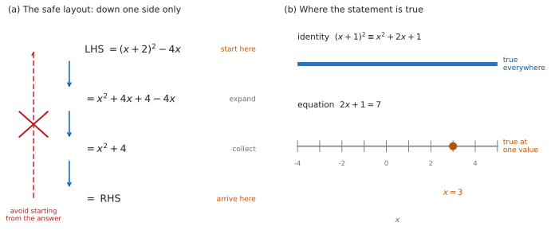

# SL 1.6 — Simple deductive proof（簡単な演繹的証明と、$=$ と $\equiv$） {#sec-aasl-1-6}

::: {.callout-note}
## What you should be able to do
- `Show that` の問題で、**答えではなく道すじ**が問われていることが分かる。
- **LHS から RHS へ**という決まった書き方で、証明を並べられる。
- $=$（equality）と $\equiv$（identity）を使い分けられる。
- 数の等式（numerical）を、文字の等式（algebraic）に**一般化**できる。
- 偶数・奇数・連続する整数を、$2n$、$2n+1$、$n$、$n+1$ で表せる。
- 自分の結果を**確かめる方法**を、答案に書ける。
:::

## The idea

### 1. `Show that` は、答えを出す問題ではない {#idea}

ふつうの問題では、答えが分かっていません。求めた答えそのものが、採点の対象になります。

`Show that` の問題では、**答えは問題文にもう書いてあります。** ですから、答えを書き写しただけでは、求められていることをしたことになりません。

> **採点されるのは、「なぜそうなるか」の道すじです。**

ただし、**最後に $= \text{RHS}$ まで書いて、たどり着いたことを示す**必要はあります。途中で止めると、そこまでの得点にとどまることがあります。

ですから、`Show that` を見たら、次の $2$ つを考えてください。

1. どちらから出発するか
2. どんな順で式を変えていくか

### 2. LHS から RHS へ {#lhs-rhs}

出発点は $2$ つのどちらかです。**左辺（LHS）から出発して右辺（RHS）へ進むか、その逆向きに進みます。** どちらでもかまいませんが、**途中で向きを変えてはいけません。** このページでは、ふつうの向き（LHS → RHS）で書きます。

シラバスに、そのまま書かれています。

> LHS to RHS proofs require students to begin with the left-hand side expression and transform this using known algebraic steps into the expression on the right-hand side (or vice versa).

$(x+2)^{2} - 4x \equiv x^{2} + 4$ を示す場合なら、

$$
\text{LHS} = (x+2)^{2} - 4x
$$

$$
= x^{2} + 4x + 4 - 4x
$$

$$
= x^{2} + 4 = \text{RHS}
$$

**左辺だけをさわっています。** 右辺には、最後まで手を触れません。

{#fig-aasl16-idea width=100%}

::: {.callout-warning}
## 両辺を同時に変形する方法には注意する
$(x+2)^{2} - 4x = x^{2} + 4$ の**両辺**に同じ操作をして、$0 = 0$ にたどり着く書き方があります。

**この書き方が、それだけで誤りというわけではありません。** 使った変形がすべて**同値変形**（逆向きにも成り立つ変形）なら、論理としては通ります。

問題は、**一つひとつの変形が逆向きにも成り立つかを、自分で確かめなければならない**ことです。$2$ 乗のように、もとの式へ必ず戻れるとはかぎらない操作を $1$ つでも使うと、**示したい向きの論理が言えなくなります**（[Why it works](#why-it-works)）。

**IB の答案では、LHS だけを既知の代数の方法で変形して RHS にたどり着く書き方が、いちばん安全です。** 逆向きを確かめる手間がまったく要らず、道すじが採点者にそのまま伝わります。

どうしても両方を整理したいときは、**左辺と右辺を別々に、独立に整理して、同じ式になったことを示してください。** これなら、どちらも「示したいこと」を使っていません。

シラバスが挙げているのも LHS → RHS（または逆向き）です。**まずはそちらで書けるようにしてください。**
:::

### 3. $=$ と $\equiv$ {#equality-identity}

同じ「イコール」でも、意味が $2$ 通りあります。

| 記号 | 使われ方 | 意味 | 例 |
|:--|:--|:--|:--|
| $=$ | equation（方程式）として | この式が成り立つ値を問う。**特定の値でだけ**成り立つことが多い | $2x + 1 = 7$（$x = 3$ のときだけ） |
| $\equiv$ | identity（恒等式）として | 式が定義されるかぎり、**すべての値で**成り立つという主張 | $(x+1)^{2} \equiv x^{2} + 2x + 1$ |

: $=$ と $\equiv$ のちがい {#tbl-aasl16-symbols}

$\equiv$ が使える場面で $=$ を書くことはできます。**逆はできません。** $2x + 1 \equiv 7$ は誤りです。

$2x + 1 = 7$ は、$x = 3$ を入れたときだけ正しい式です。$x = 0$ を入れると $1 = 7$ となり、成り立ちません。

$(x+1)^{2} \equiv x^{2} + 2x + 1$ は、**どんな $x$ でも**正しい式です。$x = 0$ でも $x = 100$ でも $x = -7$ でも成り立ちます。

::: {.callout-note}
## 分数を含むときは、分母が $0$ にならない値について
$\dfrac{1}{n}$ のような式は、$n = 0$ では書けません。ですから $\equiv$ は、**両辺が定義されるすべての値で等しい**、という意味になります。

分母が $0$ になる値は、答案でも $(n \neq 0)$ のように書き添えてください。
:::

::: {.callout-important}
## 公式集には、この項目の欄がありません
公式集の Topic 1 に、**1.6 の欄はありません。** 試験中に見られる式が、この項目には $1$ つもないということです。

代わりに必要なのは、**書き方の約束**です。@tbl-aasl16-symbols と [第 2 節](#lhs-rhs) が、その中身です。
:::

::: {.callout-tip}
## $\equiv$ を書かなくても、減点されないことが多い
試験では、$\equiv$ の代わりに $=$ を書いても、通ることがほとんどです。

ただし、**問題文が $\equiv$ を使っていたら、答案でも $\equiv$ を使ってください。** 問題文の記号に合わせるのが、いちばん安全です。
:::

### 4. 数の証明 {#numerical}

いちばん短い `Show that` は、数だけの式です。

$\dfrac{1}{3} + \dfrac{1}{6} = \dfrac{1}{2}$ を示すなら、通分して足すだけです。

$$
\frac{1}{3} + \frac{1}{6} = \frac{2}{6} + \frac{1}{6} = \frac{3}{6} = \frac{1}{2}
$$

**$0.5$ とだけ書いても、示したことになりません。** 分数のまま、$1$ 行ずつ書いてください。

::: {.callout-warning}
## 小数に直して終わりにしない
$\dfrac{1}{3} = 0.333\ldots$ は、**割り切れません。** 四捨五入した数どうしで計算すると、答えがずれます。

$\dfrac{1}{6} - \dfrac{1}{7} = \dfrac{1}{42} = 0.0238\ldots$ ですが、$0.17 - 0.14 = 0.03$ です。**合っていません。**

$\dfrac{1}{3}$ を $0.33$ として $3$ つ足しても、$0.99$ で $1$ になりません。

**分数の計算は、分数のまま。** Paper 1 に電卓はありませんが、Paper 2 でも `Show that` の答案は同じです。
:::

### 5. 文字の証明 — 数の証明の一般化 {#algebraic}

シラバスは、数の例をひとつ挙げたあと、**それを文字で一般化する**ところまで求めています。

$\dfrac{1}{5} - \dfrac{1}{6} = \dfrac{1}{30}$ という数の等式を見てください。$30 = 5 \times 6$ です。

$5$ を $n$ に、$6$ を $n+1$ に置きかえると、次の形が見えてきます。

$$
\frac{1}{n} - \frac{1}{n+1} \equiv \frac{1}{n(n+1)} \qquad (n \neq 0, \ n \neq -1)
$$ {#eq-aasl16-partial}

これを示すのが、`algebraic generalisation` の問題です。左辺を通分すれば出ます。

$$
\frac{1}{n} - \frac{1}{n+1} = \frac{(n+1) - n}{n(n+1)} = \frac{1}{n(n+1)}
$$

**数の例は、文字の証明の下書きです。** 何を $n$ に置きかえればよいかが、数の例に書いてあります。

### 6. 整数を、文字で表す {#integers}

「偶数」「奇数」「連続する $3$ つの整数」は、そのままでは計算できません。**文字で書きかえます。**

| 日本語 | 文字で |
|:--|:--|
| 偶数（even） | $2n$ |
| 奇数（odd） | $2n + 1$ |
| 連続する $2$ つの整数 | $n$, $n+1$ |
| 連続する $3$ つの整数 | $n$, $n+1$, $n+2$ |
| 連続する $2$ つの奇数 | $2n+1$, $2n+3$ |
| $3$ の倍数 | $3n$ |

: 整数を文字で表す {#tbl-aasl16-integers}

$n$ は整数です。答案では *where $n$ is an integer* と、**一言添えてください。**

$n$ は**負の整数でも $0$ でもかまいません。** $2n+1$ は、$n = -1$ で $-1$、$n = 0$ で $1$ となり、**すべての奇数**を表せます。「任意の $\ldots$」と問われたら、**書いた式が全部の場合を表しているか**を確かめてください。

「$3$ の倍数であることを示す」なら、最後に $3 \times (\text{整数})$ の形にします。

$$
n + (n+1) + (n+2) = 3n + 3 = 3(n+1)
$$

$n+1$ は整数なので、$3(n+1)$ は $3$ の倍数です。**くくり出して、かっこの中が整数だと述べたところで、証明は終わりです。** どちらか一方では足りません。

### 7. 自分の結果を確かめる {#checking}

シラバスは、確かめることまで求めています。

> Students will be expected to show how they can check a result including a check of their own results.

いちばん手軽なのは、**両辺に同じ数を入れて、値が合うかを見る**ことです。

@eq-aasl16-partial なら、$n = 5$ を入れます。

$$
\text{LHS} = \frac{1}{5} - \frac{1}{6} = \frac{1}{30}, \qquad \text{RHS} = \frac{1}{5 \times 6} = \frac{1}{30}
$$

合いました ✓

::: {.callout-warning}
## $1$ つの値で合っても、証明にはなりません
$x = 0$ を入れると、$(x+2)^{2}$ も $x^{2} + 4$ も $4$ になります。**それでも $(x+2)^{2} \equiv x^{2} + 4$ は正しくありません。** $x = 1$ で $9$ と $5$ に分かれます。

**片方向にだけ強い道具**だと思ってください。

- 合わなかった → **正しくないと分かる**（強い）
- 合った → **まだ正しいかもしれない**（弱い）

ですから検算は、**自分の計算ミスを見つけるため**に使い、証明の本体は [第 2 節](#lhs-rhs) の式変形で書きます。
:::

::: {.callout-tip collapse="true"}
## Paper 2 では、電卓でも確かめられます
恒等式かどうかを見るだけなら、$2$ つの式を $\mathsf{f1}(x)$、$\mathsf{f2}(x)$ としてグラフを描き、**重なるかどうか**を見る手もあります。表（`ctrl` + `T`）で、いくつかの $x$ の値を並べても分かります。

ただし、**画面で重なって見えても、ちがう式のことがあります。** ずれが小さいと、点の中に隠れます。表で $x$ の値をいくつも見るほうが確実です。

**これは確かめであって、証明ではありません。** Paper 1 でも Paper 2 でも、答案に書くのは式変形です。
:::

## Why it works

**なぜ、示したい式から出発する書き方に注意が要るのでしょうか。**

**逆向きに戻せない操作を使うと、必要な向きの論理が言えなくなる**からです。

$-1 = 1$ を「証明」してみます。

$$
-1 = 1
$$

両辺を $2$ 乗すると、

$$
1 = 1
$$

正しい式にたどり着きました。しかし $-1 = 1$ は正しくありません。

**どこがおかしいのでしょうか。** 使った $2$ 乗が、**同値変形になっていない**ところです。

示せたのは「$A$ が正しいなら $B$ も正しい」だけです。必要なのは「$B$ が正しいから $A$ も正しい」のほうですが、$1 = 1$ から $-1 = 1$ へは戻れません。**$2$ 乗は符号のちがいを消してしまう**からです。

**両辺を同時に変形する書き方そのものが誤り、というわけではありません。** 両辺に $3$ を足す、両辺から $x^{2}$ を引く、といった操作は逆向きにも成り立つので、論理としては通ります。**危ないのは、$2$ 乗のように戻せない操作がまざったとき**です。しかも、まざっているかどうかは $1$ 行ずつ確かめないと分かりません。

**LHS から RHS へ進む書き方なら、その確認そのものが要りません。** 出発点の $(x+2)^{2} - 4x$ は、示したい式ではなく、**ただの式**です。それを等しい式に置きかえていって、行き先が RHS だった、という順序になります。だから IB の答案では、こちらを勧めます。

**$=$ と $\equiv$ のちがいも、ここから説明できます。** 方程式は「この式が成り立つのはどの $x$ か」という**問い**です。恒等式は「どの $x$ でも成り立つ」という**事実**です。証明で作るのは、いつも後者のほうです。

## Worked examples

::: {.callout-note appearance="simple"}
問題文は英語です。意味が理解できなかったら、問題文の下の「**日本語訳**」を開いてください。解説は日本語です。

**例題も演習も、すべて電卓なしで解けます。** Paper 1 のつもりで解いてください。
:::

::: {#exm-aasl16-numeric}
[**(a)** Show that $\dfrac{1}{4} + \dfrac{1}{20} = \dfrac{3}{10}$.]{.q-en}

**(b)** [Show that $\dfrac{1}{6} - \dfrac{1}{7} = \dfrac{1}{42}$.]{.q-en}

**(c)** [Suggest a general result, in terms of $n$, that part **(b)** illustrates.]{.q-en}

日本語訳

**(a)** $\dfrac{1}{4} + \dfrac{1}{20} = \dfrac{3}{10}$ であることを示しなさい。

**(b)** $\dfrac{1}{6} - \dfrac{1}{7} = \dfrac{1}{42}$ であることを示しなさい。

**(c)** **(b)** が示している一般の結果を、$n$ を使って予想しなさい。

---

**(a)** 左辺から出発します。$4$ と $20$ の最小公倍数は $20$ です。

$$
\text{LHS} = \frac{1}{4} + \frac{1}{20} = \frac{5}{20} + \frac{1}{20} = \frac{6}{20} = \frac{3}{10} = \text{RHS}
$$

**(b)** $6$ と $7$ の最小公倍数は $42$ です。

$$
\text{LHS} = \frac{1}{6} - \frac{1}{7} = \frac{7}{42} - \frac{6}{42} = \frac{1}{42} = \text{RHS}
$$

**(c)** $6$ と $7$ は連続する整数で、$42 = 6 \times 7$ です（[第 5 節](#algebraic)）。

$$
\frac{1}{n} - \frac{1}{n+1} \equiv \frac{1}{n(n+1)}
$$

**検算（(a) について）。** 引き算に直して、別の道すじで見ます。答えから片方を引けば、もう片方に戻るはずです。

$$
\frac{3}{10} - \frac{1}{4} = \frac{6}{20} - \frac{5}{20} = \frac{1}{20}
$$

合いました ✓ **足し算をやり直すのではなく、逆の操作で確かめています。**

**検算（(c) について）。** $n = 6$ を入れると **(b)** に戻りますが、**もともと (b) から作った式なので、これは検算になりません。** 使っていない値で見ます。

$n = 2$ なら $\dfrac{1}{2} - \dfrac{1}{3} = \dfrac{1}{6}$ で、$\dfrac{1}{2 \times 3} = \dfrac{1}{6}$ ✓

$n = 4$ なら $\dfrac{1}{4} - \dfrac{1}{5} = \dfrac{1}{20}$ で、$\dfrac{1}{4 \times 5} = \dfrac{1}{20}$ ✓

::: {.callout-note}
## 解答例（答案用紙にはこう書く）
**(a)**
$$\text{LHS} = \frac{1}{4} + \frac{1}{20} = \frac{5}{20} + \frac{1}{20} = \frac{6}{20} = \frac{3}{10} = \text{RHS}$$

**(b)**
$$\text{LHS} = \frac{1}{6} - \frac{1}{7} = \frac{7}{42} - \frac{6}{42} = \frac{1}{42} = \text{RHS}$$

**(c)**
$$\frac{1}{n} - \frac{1}{n+1} \equiv \frac{1}{n(n+1)}$$
:::
:::

::: {#exm-aasl16-identity}
[**(a)** Show that $\dfrac{1}{4} + \dfrac{1}{12} = \dfrac{1}{3}$.]{.q-en}

**(b)** [Show that $\dfrac{1}{m+1} + \dfrac{1}{m^{2}+m} \equiv \dfrac{1}{m}$, where $m \neq 0$ and $m \neq -1$.]{.q-en}

日本語訳

**(a)** $\dfrac{1}{4} + \dfrac{1}{12} = \dfrac{1}{3}$ であることを示しなさい。

**(b)** $m \neq 0$、$m \neq -1$ のとき、$\dfrac{1}{m+1} + \dfrac{1}{m^{2}+m} \equiv \dfrac{1}{m}$ であることを示しなさい。

---

**(a)** $4$ と $12$ の最小公倍数は $12$ です。

$$
\text{LHS} = \frac{1}{4} + \frac{1}{12} = \frac{3}{12} + \frac{1}{12} = \frac{4}{12} = \frac{1}{3} = \text{RHS}
$$

**(b)** **$m^{2} + m = m(m+1)$ と因数分解するのが、最初の一歩です。** これで、共通分母が $m(m+1)$ だと見えます。第 $2$ 項の分母は、もうその形です。

$$
\text{LHS} = \frac{1}{m+1} + \frac{1}{m(m+1)}
$$

$$
= \frac{m}{m(m+1)} + \frac{1}{m(m+1)}
$$

$$
= \frac{m+1}{m(m+1)}
$$

$$
= \frac{1}{m} = \text{RHS}
$$

**最後に $m+1$ が約分で消える**のが山場です。

**(a) は、(b) の $m = 3$ の場合です。** $\dfrac{1}{3+1} + \dfrac{1}{9+3} = \dfrac{1}{4} + \dfrac{1}{12}$ で、右辺は $\dfrac{1}{3}$ です。数の例が、文字の証明の下書きになっています（[第 5 節](#algebraic)）。

**検算。** **(a) は (b) から作った場合なので、検算には使えません。** 使っていない値で見ます。

$m = 5$ なら、$\text{LHS} = \dfrac{1}{6} + \dfrac{1}{30} = \dfrac{5}{30} + \dfrac{1}{30} = \dfrac{6}{30} = \dfrac{1}{5}$、$\text{RHS} = \dfrac{1}{5}$ ✓

$m = 2$ なら、$\text{LHS} = \dfrac{1}{3} + \dfrac{1}{6} = \dfrac{2}{6} + \dfrac{1}{6} = \dfrac{1}{2}$、$\text{RHS} = \dfrac{1}{2}$ ✓

**$m^{2}+m$ を $m(m+1)$ にせず、$m^{2}$ と $m$ に分けていたら**、共通分母が見つからずに止まります。**因数分解が、この問題のすべてです。**

::: {.callout-note}
## 解答例（答案用紙にはこう書く）
**(a)**
$$\text{LHS} = \frac{1}{4} + \frac{1}{12} = \frac{3}{12} + \frac{1}{12} = \frac{4}{12} = \frac{1}{3} = \text{RHS}$$

**(b)**
$$m^{2} + m = m(m+1)$$

$$\text{LHS} = \frac{1}{m+1} + \frac{1}{m(m+1)} = \frac{m}{m(m+1)} + \frac{1}{m(m+1)}$$

$$= \frac{m+1}{m(m+1)} = \frac{1}{m} = \text{RHS}$$
:::
:::

::: {#exm-aasl16-expand}
[**(a)** Show that $(x-4)^{2} + 3 \equiv x^{2} - 8x + 19$.]{.q-en}

**(b)** [Explain why the symbol $\equiv$ is used in part **(a)** rather than $=$.]{.q-en}

日本語訳

**(a)** $(x-4)^{2} + 3 \equiv x^{2} - 8x + 19$ であることを示しなさい。

**(b)** **(a)** で $=$ ではなく $\equiv$ が使われている理由を説明しなさい。

---

**(a)** 左辺を展開します。

$$
\text{LHS} = (x-4)^{2} + 3
$$

$$
= x^{2} - 8x + 16 + 3
$$

$$
= x^{2} - 8x + 19 = \text{RHS}
$$

**(b)** `Explain why` なので、英語で理由を書きます。

::: {.model-answer}
**試験ではこう書く**

*The symbol $\equiv$ means that the two expressions are equal for every value of $x$, not just for some values. The working in part **(a)** only expands the brackets and collects terms, and every step is a rearrangement that is valid whatever $x$ is, so the two sides agree for all $x$. An ordinary equals sign such as in $2x + 1 = 7$ states a condition that is true only for particular values of $x$, which is a different claim.*
:::

（記号 $\equiv$ は、$2$ つの式が一部の値ではなく**すべての** $x$ で等しいことを表す。**(a)** の計算はかっこを展開して項をまとめただけで、$x$ の値を仮定していないので、両辺はすべての $x$ で一致する。$2x + 1 = 7$ のようなふつうの等号は、特定の $x$ でだけ成り立つ条件を述べており、主張の種類がちがう、という意味です。）

**検算（(a) について）。** $x = 1$ を、両辺に入れます。

$$
\text{LHS} = (1-4)^{2} + 3 = 9 + 3 = 12, \qquad \text{RHS} = 1 - 8 + 19 = 12
$$

合いました ✓ 念のため $x = 5$ でも見ます。$\text{LHS} = 1 + 3 = 4$、$\text{RHS} = 25 - 40 + 19 = 4$ ✓ さらに $x = 2$ でも見ます。$\text{LHS} = 4 + 3 = 7$、$\text{RHS} = 4 - 16 + 19 = 7$ ✓

**$2$ 次式どうしなら、$3$ つの値で合うところまで見てください。** $2$ つでは足りません。$x^{2}$ の係数までまちがえていると、$2$ つの値で偶然そろうことがあります。

**$(x-4)^{2}$ を $x^{2} - 16$ としていたら**、$x^{2} - 13$ になります。$x = 1$ で $-12$ となり、$12$ と符号まで違います。

::: {.callout-note}
## 解答例（答案用紙にはこう書く）
**(a)**
$$\text{LHS} = (x-4)^{2} + 3 = x^{2} - 8x + 16 + 3 = x^{2} - 8x + 19 = \text{RHS}$$

**(b)**
*$\equiv$ means the two sides are equal for every value of $x$. The working only expands and collects, so no value of $x$ is assumed. An equation such as $2x + 1 = 7$ holds only for particular values.*
:::
:::

::: {#exm-aasl16-integers}
[**(a)** Show that the sum of any three consecutive integers is a multiple of $3$.]{.q-en}

**(b)** [A student claims that the sum of any two consecutive integers is even. Comment on this claim.]{.q-en}

日本語訳

**(a)** 連続する $3$ つの整数の和は、$3$ の倍数であることを示しなさい。

**(b)** ある生徒が「連続する $2$ つの整数の和は偶数である」と主張しています。この主張について述べなさい。

---

**(a)** 連続する $3$ つの整数を $n$、$n+1$、$n+2$ とおきます（@tbl-aasl16-integers）。

$$
n + (n+1) + (n+2) = 3n + 3 = 3(n+1)
$$

$n$ は整数なので $n+1$ も整数です。ですから $3(n+1)$ は $3$ の倍数です。

**(b)** `Comment on` なので、英語で書きます。**正しいか正しくないかを、はっきり述べてから理由を書きます。**

::: {.model-answer}
**試験ではこう書く**

*The claim is false. Two consecutive integers can be written as $n$ and $n+1$, where $n$ is an integer, and their sum is $n + (n+1) = 2n + 1$. Since $2n$ is even, $2n + 1$ is odd for every integer $n$, so the sum is odd in every case. One counterexample is also sufficient: $3 + 4 = 7$, which is odd.*
:::

（この主張は正しくない。連続する $2$ つの整数は $n$、$n+1$（$n$ は整数）と書け、その和は $2n+1$ である。$2n$ は偶数なので $2n+1$ はどんな整数 $n$ でも奇数であり、和はつねに奇数で、偶数になることはない。反例をひとつ挙げるだけでも決まる。$3 + 4 = 7$ は奇数である、という意味です。）

**検算（(a) について）。** 実際の数で試します。$4 + 5 + 6 = 15 = 3 \times 5$ ✓ $10 + 11 + 12 = 33 = 3 \times 11$ ✓

**式のほうとも合わせます。** $n = 4$ なら $3(n+1) = 3 \times 5 = 15$ ✓ **文字の答えと数の答えが、同じところを指しています。**

**答えを $3n$ で止めていたら**、$+3$ を落としています。$n = 4$ で $12$ となり、$15$ と合いません。

::: {.callout-note}
## 解答例（答案用紙にはこう書く）
**(a)**
*Let the integers be $n$, $n+1$ and $n+2$, where $n$ is an integer.*
$$n + (n+1) + (n+2) = 3n + 3 = 3(n+1)$$
*Since $n+1$ is an integer, the sum is a multiple of $3$.*

**(b)**
*False. Two consecutive integers are $n$ and $n+1$, and $n + (n+1) = 2n + 1$, which is odd for every integer $n$. For example, $3 + 4 = 7$.*
:::
:::

## Common errors

::: {.callout-warning}
## 示したい式から出発して、両辺をいじる
$(x+2)^{2} - 4x \equiv x^{2} + 4$ を、この式のまま書いて、両辺をいじって $0 = 0$ にする書き方です。

**この書き方が通るのは、使った変形がすべて逆向きにも成り立つときだけ**です（[第 2 節](#lhs-rhs)）。$2$ 乗のように戻せない操作がまざると、示したい向きの論理になりません。

答案では、**LHS か RHS のどちらか一方から出発してください。** $\text{LHS} =$ から始める習慣を付けると、逆向きの確認そのものが要らなくなります。
:::

::: {.callout-warning}
## $1$ つの値を入れて「証明した」とする
$x = 0$ で合っても、それは $1$ つの場合にすぎません（[第 7 節](#checking)）。

**恒等式の証明には、文字のままの式変形が要ります。**

ただし、$1$ つの値で**合わなかった**ときは、正しくないと言い切れます。**反例（counterexample）は、$1$ つで足ります。**
:::

::: {.callout-warning}
## 「$n$ は整数」を書き忘れる
$3(n+1)$ が $3$ の倍数だと言えるのは、**$n+1$ が整数だから**です（[第 6 節](#integers)）。

$n = 0.5$ なら $3 \times 1.5 = 4.5$ で、倍数ではありません。

答案に *where $n$ is an integer* と、**一言だけ**書いてください。
:::

::: {.callout-warning}
## 偶数と奇数を、同じ文字で書く
$2n$ と $2n+1$ は、**同じ $n$ を使うと連続した $2$ 数**になります。

「任意の偶数と、任意の奇数」を表したいなら、$2m$ と $2n+1$ のように**別の文字**を使ってください。

**問題文が「連続する」と言っているかどうか**を、必ず読み直してください。
:::

::: {.callout-warning}
## 分数を小数に直して示す
$\dfrac{1}{3} + \dfrac{1}{6} = 0.5$ と書いても、必要な過程を示したことになりません（[第 4 節](#numerical)）。

$\dfrac{1}{3}$ は割り切れないので、小数にした時点で**近い値**になっています。

**分数の計算は、分数のまま。**
:::

## Exercises

::: {.callout-note appearance="simple"}
各問題に、折りたたみが $3$ つ付いています。**日本語訳**、**解答例**（答案用紙に書くべきこと。英語です）、**解説**（なぜそうなるか。日本語です）。

まず自分で解いて、次に解答例と見くらべてください。**解説は、合わなかったときだけ開けば十分です。**
:::

::: {.exercise-block}

[1]{.ex-no} [Show that $\dfrac{1}{2} + \dfrac{1}{6} = \dfrac{2}{3}$.]{.q-en}

日本語訳

$\dfrac{1}{2} + \dfrac{1}{6} = \dfrac{2}{3}$ であることを示しなさい。

::: {.callout-note collapse="true"}
## 解答例（答案用紙に書くこと）

$$\text{LHS} = \frac{1}{2} + \frac{1}{6} = \frac{3}{6} + \frac{1}{6} = \frac{4}{6} = \frac{2}{3} = \text{RHS}$$
:::

::: {.callout-tip collapse="true"}
## 解説

$2$ と $6$ の最小公倍数は $6$ です。$\dfrac{1}{2} = \dfrac{3}{6}$ に直してから足します。

最後の約分を忘れないでください。$\dfrac{4}{6}$ のままでは、右辺の形になっていません。

**検算。** 逆の操作で見ます。答えから $\dfrac{1}{6}$ を引けば、$\dfrac{1}{2}$ に戻るはずです。$\dfrac{2}{3} - \dfrac{1}{6} = \dfrac{4}{6} - \dfrac{1}{6} = \dfrac{3}{6} = \dfrac{1}{2}$ ✓ **足し算をやり直していません。**
:::

::: {.ex-sep}
:::

[2]{.ex-no} [Show that $\dfrac{1}{3} - \dfrac{1}{12} = \dfrac{1}{4}$.]{.q-en}

日本語訳

$\dfrac{1}{3} - \dfrac{1}{12} = \dfrac{1}{4}$ であることを示しなさい。

::: {.callout-note collapse="true"}
## 解答例（答案用紙に書くこと）

$$\text{LHS} = \frac{1}{3} - \frac{1}{12} = \frac{4}{12} - \frac{1}{12} = \frac{3}{12} = \frac{1}{4} = \text{RHS}$$
:::

::: {.callout-tip collapse="true"}
## 解説

$12$ は $3$ の倍数なので、共通分母は $12$ でそのまま使えます。

**検算。** 逆の操作で見ます。引いた $\dfrac{1}{12}$ を答えに足し戻すと、もとの $\dfrac{1}{3}$ になるはずです。$\dfrac{1}{4} + \dfrac{1}{12} = \dfrac{3}{12} + \dfrac{1}{12} = \dfrac{4}{12} = \dfrac{1}{3}$ ✓

::: {.callout-warning}
## これは検算であって、答案の書き方ではありません
「両辺に $\dfrac{1}{12}$ を足す」は、示したい式を先に認めています（[第 2 節](#lhs-rhs)）。

右辺から書き始めたいなら、**右辺だけ**を変形します。

$$
\text{RHS} = \frac{1}{4} = \frac{3}{12} = \frac{4}{12} - \frac{1}{12} = \frac{1}{3} - \frac{1}{12} = \text{LHS}
$$

シラバスが `or vice versa` と認めているのは、この書き方です。**途中で向きを変えてはいけません。**
:::
:::

::: {.ex-sep}
:::

[3]{.ex-no} [Show that $(x+5)^{2} - 10x \equiv x^{2} + 25$.]{.q-en}

日本語訳

$(x+5)^{2} - 10x \equiv x^{2} + 25$ であることを示しなさい。

::: {.callout-note collapse="true"}
## 解答例（答案用紙に書くこと）

$$\text{LHS} = (x+5)^{2} - 10x = x^{2} + 10x + 25 - 10x = x^{2} + 25 = \text{RHS}$$
:::

::: {.callout-tip collapse="true"}
## 解説

$(x+5)^{2} = x^{2} + 10x + 25$ です。**まん中の項は $2 \times 5 = 10$ 倍**の $x$ です。

そこから $10x$ を引くので、$x$ の項がちょうど消えます。

**検算。** $x = 2$ を両辺に入れます。$\text{LHS} = 7^{2} - 20 = 49 - 20 = 29$、$\text{RHS} = 4 + 25 = 29$ ✓

**$(x+5)^{2}$ を $x^{2} + 25$ としていたら**、$x^{2} + 25 - 10x$ となり、$x = 2$ で $9$ です。$29$ と合いません。
:::

::: {.ex-sep}
:::

[4]{.ex-no} [Show that $(2x-1)^{2} + 4x \equiv 4x^{2} + 1$.]{.q-en}

日本語訳

$(2x-1)^{2} + 4x \equiv 4x^{2} + 1$ であることを示しなさい。

::: {.callout-note collapse="true"}
## 解答例（答案用紙に書くこと）

$$\text{LHS} = (2x-1)^{2} + 4x = 4x^{2} - 4x + 1 + 4x = 4x^{2} + 1 = \text{RHS}$$
:::

::: {.callout-tip collapse="true"}
## 解説

$(2x-1)^{2}$ では、**はじめの項も $2$ 乗されます。** $(2x)^{2} = 4x^{2}$ です（[SL 1.5 第 4 節](aasl-1-5.qmd#coefficients)）。

まん中の項は $2 \times 2x \times (-1) = -4x$ です。ここに $+4x$ が来て、消えます。

**検算。** $x = 3$ を両辺に入れます。$\text{LHS} = 5^{2} + 12 = 25 + 12 = 37$、$\text{RHS} = 36 + 1 = 37$ ✓

**$(2x-1)^{2}$ を $2x^{2} - 1$ としていたら**、$x = 3$ で $18 - 1 + 12 = 29$ となり、$37$ と合いません。
:::

::: {.ex-sep}
:::

[5]{.ex-no} [Show that $\dfrac{1}{n} - \dfrac{1}{n+2} \equiv \dfrac{2}{n(n+2)}$, where $n \neq 0$ and $n \neq -2$.]{.q-en}

日本語訳

$n \neq 0$、$n \neq -2$ のとき、$\dfrac{1}{n} - \dfrac{1}{n+2} \equiv \dfrac{2}{n(n+2)}$ であることを示しなさい。

::: {.callout-note collapse="true"}
## 解答例（答案用紙に書くこと）

$$\text{LHS} = \frac{1}{n} - \frac{1}{n+2} = \frac{n+2}{n(n+2)} - \frac{n}{n(n+2)}$$

$$= \frac{(n+2) - n}{n(n+2)} = \frac{2}{n(n+2)} = \text{RHS}$$
:::

::: {.callout-tip collapse="true"}
## 解説

@eq-aasl16-partial と同じ形ですが、**分子に残るのが $2$** です。$(n+2) - n = 2$ だからです。

**検算。** $n = 4$ を両辺に入れます。

$$
\text{LHS} = \frac{1}{4} - \frac{1}{6} = \frac{3}{12} - \frac{2}{12} = \frac{1}{12}, \qquad \text{RHS} = \frac{2}{4 \times 6} = \frac{2}{24} = \frac{1}{12}
$$

合いました ✓ **右辺は約分すると $\dfrac{1}{12}$ です。** 約分の前で止めて「合わない」と思わないでください。

**分子を $1$ としていたら**、$\dfrac{1}{24}$ となり、$\dfrac{1}{12}$ と合いません。
:::

::: {.ex-sep}
:::

[6]{.ex-no} [Show that the sum of any two consecutive odd numbers is a multiple of $4$.]{.q-en}

日本語訳

連続する $2$ つの奇数の和は、$4$ の倍数であることを示しなさい。

::: {.callout-note collapse="true"}
## 解答例（答案用紙に書くこと）

*Let the two consecutive odd numbers be $2n+1$ and $2n+3$, where $n$ is an integer.*

$$(2n+1) + (2n+3) = 4n + 4 = 4(n+1)$$

*Since $n+1$ is an integer, the sum is a multiple of $4$.*
:::

::: {.callout-tip collapse="true"}
## 解説

連続する $2$ つの奇数は、**$2$ だけ離れています。** ですから $2n+1$ と $2n+3$ です（@tbl-aasl16-integers）。

$2n+1$ と $2n-1$ でも、同じ結論になります。どちらでもかまいません。

最後に **$4$ でくくる**のが要です。$4n+4$ で止めると、$4$ の倍数だと言い切れていません。

**検算。** 実際の数で試します。$5 + 7 = 12 = 4 \times 3$ ✓ $11 + 13 = 24 = 4 \times 6$ ✓

**式とも合わせます。** $5 = 2n+1$ なら $n = 2$ で、$4(n+1) = 12$ ✓

$n$ には整数をどれでも入れられるので、$2n+1$ は**すべての奇数**を表しています。だから「任意の $2$ つ」に答えられます。

**「$n$ は整数」を書き忘れないでください。**
:::

::: {.ex-sep}
:::

[7]{.ex-no} [Show that $(x+3)^{2} - (x+1)^{2} \equiv 4(x+2)$.]{.q-en}

日本語訳

$(x+3)^{2} - (x+1)^{2} \equiv 4(x+2)$ であることを示しなさい。

::: {.callout-note collapse="true"}
## 解答例（答案用紙に書くこと）

$$\text{LHS} = (x+3)^{2} - (x+1)^{2} = (x^{2} + 6x + 9) - (x^{2} + 2x + 1)$$

$$= 4x + 8 = 4(x+2) = \text{RHS}$$
:::

::: {.callout-tip collapse="true"}
## 解説

**引き算のかっこ**が関門です。$-(x^{2} + 2x + 1)$ は、$3$ つの項すべての符号が変わります。

$x^{2}$ が消え、$6x - 2x = 4x$、$9 - 1 = 8$ が残ります。

**ここの $x$ は、整数とはかぎりません。** 恒等式なので、どんな数でも成り立ちます。*where $n$ is an integer* のような断りは要りません。

**検算。** $x = 1$ を両辺に入れます。$\text{LHS} = 16 - 4 = 12$、$\text{RHS} = 4 \times 3 = 12$ ✓ $x = 5$ でも見ます。$\text{LHS} = 64 - 36 = 28$、$\text{RHS} = 4 \times 7 = 28$ ✓ $x = 0$ でも見ます。$\text{LHS} = 9 - 1 = 8$、$\text{RHS} = 4 \times 2 = 8$ ✓

**$-1$ の符号を落として $4x + 10$ としていたら**、$x = 1$ で $14$ となり、$12$ と合いません。
:::

::: {.ex-sep}
:::

[8]{.ex-no} [State whether $=$ or $\equiv$ is the correct symbol in each statement.]{.q-en}

**(a)** [$5x + 10 \ \square \ 5(x+2)$]{.q-en}

**(b)** [$x^{2} - 1 \ \square \ 0$]{.q-en}

**(c)** [$(x-1)(x+1) \ \square \ x^{2} - 1$]{.q-en}

日本語訳

次の各式で、$=$ と $\equiv$ のどちらが正しい記号かを述べなさい。

**(a)** $5x + 10 \ \square \ 5(x+2)$

**(b)** $x^{2} - 1 \ \square \ 0$

**(c)** $(x-1)(x+1) \ \square \ x^{2} - 1$

::: {.callout-note collapse="true"}
## 解答例（答案用紙に書くこと）

**(a)** $\equiv$ *(true for all $x$)*

**(b)** $=$ *(true only for $x = 1$ and $x = -1$)*

**(c)** $\equiv$ *(true for all $x$)*
:::

::: {.callout-tip collapse="true"}
## 解説

見分け方は $1$ つです。**すべての $x$ で成り立つか、特定の $x$ でだけか**（@tbl-aasl16-symbols）。

**(a)** 右辺を展開すると $5x + 10$ です。同じ式なので $\equiv$ です。

**(b)** $x^{2} - 1 = 0$ は方程式で、$x = 1$ と $x = -1$ でだけ成り立ちます。

**(c)** 左辺を展開すると $x^{2} - 1$ です。同じ式なので $\equiv$ です。

**検算。** $x = 0$ を入れてみます。

**(a)** $10$ と $10$ で一致 ✓ **(b)** $-1$ と $0$ で不一致 → すべての $x$ ではない ✓ **(c)** $-1$ と $-1$ で一致 ✓

**(a) と (c) は、$x = 0$ で合っただけでは $\equiv$ の証拠になりません**（[第 7 節](#checking)）。展開して同じ式になることを見てください。**(b) は逆で、$1$ つ合わない値があれば $\equiv$ でないと言い切れます。**
:::

::: {.ex-sep}
:::

[9]{.ex-no} [Explain why substituting one value of $x$ is not enough to prove an identity.]{.q-en}

日本語訳

$x$ の値を $1$ つ代入するだけでは恒等式を証明したことにならない理由を、説明しなさい。

::: {.callout-note collapse="true"}
## 解答例（答案用紙に書くこと）

*An identity claims that the two sides are equal for every value of $x$, while a substitution tests only one value. Two different expressions can still agree there: $(x+3)^{2}$ and $x^{2} + 9$ are both $9$ at $x = 0$, but $16$ and $10$ at $x = 1$.*

（**この短い形が、答案に必要な最低限です。** 下の「試験ではこう書く」は、余裕があるときの書き方です。）
:::

::: {.callout-tip collapse="true"}
## 解説

`Explain why` なので、**理由を述べ、例を $1$ つ添えます。**

要点は、**主張の大きさと、確かめた範囲が釣り合っていない**ことです。恒等式は無限個の $x$ についての主張ですが、代入は $1$ 個しか見ていません。

**検算。** 例が本当に成り立つかを確かめます。$x = 0$ のとき $(0+3)^{2} = 9$、$0 + 9 = 9$ で一致 ✓ $x = 1$ のとき $(1+3)^{2} = 16$、$1 + 9 = 10$ で不一致 ✓ **「$1$ 点で合うのに恒等式ではない」例が、実際に作れました。**

**逆向きは強い**ことも、書き添えると印象がよくなります。$1$ つでも合わない値が見つかれば、恒等式ではないと言い切れます。

::: {.model-answer}
**試験ではこう書く**

*An identity is the claim that two expressions are equal for every value of the variable, so it makes infinitely many statements at once. Substituting a single value tests only one of them, and two different expressions can easily agree at one point. For instance, $(x+3)^{2}$ and $x^{2}+9$ are both equal to $9$ when $x = 0$, yet at $x = 1$ they take the values $16$ and $10$, so the identity $(x+3)^{2} \equiv x^{2}+9$ is false. A proof therefore has to transform one side into the other algebraically, without assuming any particular value. The reverse direction is different: a single value at which the two sides disagree is enough to show that an identity is false.*
:::
:::

::: {.ex-sep}
:::

[10]{.ex-no} [A student is asked to show that $(x+3)^{2} - 6x \equiv x^{2} + 9$, and writes]{.q-en}

$$
(x+3)^{2} - 6x = x^{2} + 9
$$

$$
x^{2} + 9 = x^{2} + 9
$$

[and concludes that the identity is proved. Identify the error in the student's method, and write a correct proof.]{.q-en}

日本語訳

ある生徒が $(x+3)^{2} - 6x \equiv x^{2} + 9$ を示すように言われ、上のように書いて、証明できたと結論しました。

この方法の誤りを指摘し、正しい証明を書きなさい。

::: {.callout-note collapse="true"}
## 解答例（答案用紙に書くこと）

*The student starts from the statement that is to be proved and rearranges both sides. This is valid only if every step can be reversed, and the student does not check that. The layout expected in an examination begins from one side alone.*

$$\text{LHS} = (x+3)^{2} - 6x = x^{2} + 6x + 9 - 6x = x^{2} + 9 = \text{RHS}$$
:::

::: {.callout-tip collapse="true"}
## 解説

`Identify the error` なので、**どこが違うのかを名指し**してから、正しい書き方を示します。

**答え自体も、式変形も合っています。** 足りないのは、**その変形が逆向きにも成り立つという確認**です（[第 2 節](#lhs-rhs)）。

**検算。** 正しい証明が本当に正しいかを見ます。$x = 2$ を両辺に入れます。$\text{LHS} = 25 - 12 = 13$、$\text{RHS} = 4 + 9 = 13$ ✓

**生徒の式変形そのものは、まちがっていません。** 展開も項の整理も、逆向きに戻せる操作だからです。ですから、この答案は**論理として破れているわけではありません。**

**まずいのは、それが読み手に分からないこと**です。逆向きに戻せるかどうかを、生徒は $1$ 行も確かめていません。$2$ 乗のような戻せない操作がまざっていれば、同じ書き方で $-1 = 1$ から $1 = 1$ にたどり着けてしまいます（[Why it works](#why-it-works)）。

**答案では、LHS か RHS のどちらか一方から出発してください。** 確かめることが $1$ つも増えません。

::: {.model-answer}
**試験ではこう書く**

*The student's first line is the statement that is to be proved, so the result is written down as if it were already known. Reducing it to $x^{2} + 9 = x^{2} + 9$ shows only that the claim implies something true. That is enough only if every step can be reversed, and the student does not check this. The same layout can lead to a false conclusion as soon as a step cannot be reversed: starting from $-1 = 1$ and squaring both sides also gives $1 = 1$. The layout expected in an examination begins from one side alone: $\text{LHS} = (x+3)^{2} - 6x = x^{2} + 6x + 9 - 6x = x^{2} + 9 = \text{RHS}$. Substituting $x = 2$ gives $13$ on both sides, which checks the working.*
:::
:::

:::
