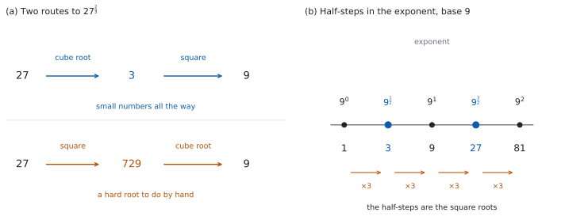

# SL 1.7a — Laws of exponents with rational exponents（有理数の指数） {#sec-aasl-1-7a}

::: {.callout-note}
## What you should be able to do
- $a^{\frac{1}{m}} = \sqrt[m]{a}$ が、**なぜそうなるのか**を説明できる。
- $m$ が偶数のとき、**正の根**を指すという約束を守れる。
- $a^{\frac{m}{n}}$ を、電卓なしで計算できる（Paper 1 では、**先に根をとる**のが定石）。
- 負の有理数の指数 $a^{-\frac{m}{n}}$ を扱える。
- 根号の形（$\sqrt{x}$、$\sqrt[3]{x}$）と、指数の形（$x^{\frac{1}{2}}$、$x^{\frac{1}{3}}$）を行き来できる。
- $x^{\frac{m}{n}} = c$ の形の方程式を解ける。
:::

## The idea

### 1. 分数の指数は、どこから来るのか {#idea}

「$\dfrac{1}{2}$ 回掛ける」は、そのままでは意味が分かりません。[SL 1.5](aasl-1-5.qmd#zero-negative) の $a^{0}$ や $a^{-n}$ と、同じ状況です。

**やることも同じです。指数法則が使えるように決めます。**

$\left(a^{m}\right)^{n} = a^{mn}$ を認めるなら、$a^{\frac{1}{2}}$ を $2$ 乗すると

$$
\left(a^{\frac{1}{2}}\right)^{2} = a^{\frac{1}{2} \times 2} = a^{1} = a
$$

**$2$ 乗すると $a$ になる数**です。そういう数は $2$ つありますが、**正のほうを選ぶ**と決めます。つまり $\sqrt{a}$ です（理由は[第 2 節](#root)と [Why it works](#why-it-works) で）。

同じように、$a^{\frac{1}{3}}$ を $3$ 乗すると $a$ になるので、$a^{\frac{1}{3}} = \sqrt[3]{a}$ です。

### 2. $a^{\frac{1}{m}} = \sqrt[m]{a}$ {#root}

$$
a^{\frac{1}{m}} = \sqrt[m]{a}
$$ {#eq-aasl17a-root}

::: {.callout-note}
## このページでは、底は正とします
$a > 0$（文字なら $x > 0$）とします。$m$ が偶数のとき、**負の数の $m$ 乗根は実数の中にない**からです。$(-16)^{\frac{1}{2}}$ は、実数としては定義されません。

問題文に $x > 0$ と書いてあるのは、このためです。
:::

::: {.callout-important}
## この式は公式集にありません
公式集の **1.7** の欄に印刷されているのは、**対数の法則・底の変換・$a^{x} = \mathrm{e}^{x\ln a}$** だけです（どれも [SL 1.7b](aasl-1-7b.qmd) の内容です）。**有理数の指数についての式は、載っていません。**

シラバスの Guidance 欄には、次のように書かれています。

> $a^{\frac{1}{m}} = \sqrt[m]{a}$, if $m$ is even this refers to the positive root.

**「$m$ が偶数なら正の根」**（if $m$ is even this refers to the positive root）という但し書きが、いちばん大事なところです。
:::

$m$ が偶数のとき、$m$ 乗して $a$ になる数は $2$ つあります。$4^{2} = 16$ ですが、$(-4)^{2} = 16$ でもあります。

**$16^{\frac{1}{2}}$ が指すのは、そのうち正のほうだけ**です。

$$
16^{\frac{1}{2}} = 4 \quad (\text{$-4$ ではありません})
$$

::: {.callout-warning}
## $x^{2} = 16$ の解とは別の話です
方程式 $x^{2} = 16$ の解は $x = 4$ と $x = -4$ の $2$ つです（[SL 1.3](aasl-1-3.qmd) の $r$ と同じ事情です）。

いっぽう $16^{\frac{1}{2}}$ は、**ひとつの数を表す記号**です。$2$ つの値を持つことはできません。

**「解を求めよ」なのか「値を求めよ」なのか**を、問題文で見分けてください。
:::

### 3. $a^{\frac{m}{n}}$ — 根をとってから累乗する {#two-ways}

分子が $1$ でないときは、$2$ 通りに読めます。

$$
a^{\frac{m}{n}} = \left(\sqrt[n]{a}\right)^{m} = \sqrt[n]{a^{m}}
$$ {#eq-aasl17a-rational}

::: {.callout-warning}
## 文字の役割が、[第 2 節](#root) と入れかわります
ここでは $m$ が**分子＝累乗の回数**、$n$ が**分母＝根の次数**です。[第 2 節](#root) の $a^{\frac{1}{m}}$ では、$m$ が根の次数でした。

**「$m$ が偶数なら正の根」の但し書きがかかるのは、根の次数のほう**、つまりここでは $n$ です。
:::

どちらでも同じ値になりますが、**底が $n$ 乗数になっているときは、左（先に根をとる）が圧倒的に楽です。** Paper 1 の問題は、ほぼ必ずそうなっています。

$27^{\frac{2}{3}}$ で比べてみます。

| 順序 | 計算 |
|:--|:--|
| **先に根**（おすすめ） | $\left(\sqrt[3]{27}\right)^{2} = 3^{2} = 9$ |
| 先に累乗 | $\sqrt[3]{27^{2}} = \sqrt[3]{729} = 9$ |

: 同じ答えでも、手間がちがう {#tbl-aasl17a-order}

{#fig-aasl17a-idea width=100%}

**Paper 1 では、$729$ の $3$ 乗根を直接出すのは大変です。** 先に $\sqrt[3]{27} = 3$ を出せば、あとは $3^{2}$ だけです。

::: {.callout-tip}
## 底を、素数の累乗に書きかえる
$32^{\frac{2}{5}}$ のような形は、$32 = 2^{5}$ と書きかえると一気に片づきます。

$$
32^{\frac{2}{5}} = \left(2^{5}\right)^{\frac{2}{5}} = 2^{5 \times \frac{2}{5}} = 2^{2} = 4
$$

**分母の $5$ と、$2^{5}$ の $5$ が約分されます。** どの素数の何乗かを見つけるのが、いちばんの近道です。
:::

### 4. 負の有理数の指数 {#negative}

[SL 1.5](aasl-1-5.qmd#zero-negative) の $a^{-n} = \dfrac{1}{a^{n}}$ が、そのまま使えます。

$$
a^{-\frac{m}{n}} = \frac{1}{a^{\frac{m}{n}}}
$$ {#eq-aasl17a-neg}

$8^{-\frac{2}{3}}$ なら、まずマイナスを外して $8^{\frac{2}{3}}$ を出します。

$$
8^{\frac{2}{3}} = \left(\sqrt[3]{8}\right)^{2} = 2^{2} = 4, \qquad 8^{-\frac{2}{3}} = \frac{1}{4}
$$

::: {.callout-warning}
## 答えは負になりません
$8^{-\frac{2}{3}} = \dfrac{1}{4}$ です。$-4$ でも $-\dfrac{1}{4}$ でもありません。

**マイナスは「逆数にせよ」の合図**です（[SL 1.5 第 3 節](aasl-1-5.qmd#zero-negative)）。底が正なら、答えも正です。
:::

分数の底なら、**上下をひっくり返す**と早くなります。

$$
\left(\frac{9}{16}\right)^{-\frac{1}{2}} = \left(\frac{16}{9}\right)^{\frac{1}{2}} = \frac{4}{3}
$$

### 5. 指数法則は、そのまま使える {#laws-hold}

[SL 1.5 第 2 節](aasl-1-5.qmd#laws) の $5$ つの法則は、**底が正なら**、指数が分数でもそのまま成り立ちます。**新しく覚えることはありません。**

（底が負だと崩れます。$\left((-2)^{2}\right)^{\frac{1}{2}} = 4^{\frac{1}{2}} = 2$ であって、$-2$ ではありません。）

$$
x^{\frac{1}{4}} \times x^{\frac{3}{4}} = x^{\frac{1}{4} + \frac{3}{4}} = x^{1} = x
$$

$$
\frac{x^{\frac{5}{3}}}{x^{\frac{2}{3}}} = x^{\frac{5}{3} - \frac{2}{3}} = x^{1} = x
$$

$$
\left(x^{\frac{2}{3}}\right)^{\frac{3}{4}} = x^{\frac{2}{3} \times \frac{3}{4}} = x^{\frac{1}{2}}
$$

**指数どうしの足し算・引き算・掛け算が、分数の計算になるだけ**です。

### 6. 根号の形と、指数の形 {#surds}

問題文は根号で書かれ、答えは指数で求められる、ということがよくあります。**行き来できるようにしておいてください。**

| 根号の形 | 指数の形 |
|:--|:--|
| $\sqrt{x}$ | $x^{\frac{1}{2}}$ |
| $\sqrt[3]{x}$ | $x^{\frac{1}{3}}$ |
| $\dfrac{1}{\sqrt{x}}$ | $x^{-\frac{1}{2}}$ |
| $x\sqrt{x}$ | $x^{\frac{3}{2}}$ |
| $\sqrt{x^{3}}$ | $x^{\frac{3}{2}}$ |

: 根号と指数の対応 {#tbl-aasl17a-surds}

$x\sqrt{x}$ が $x^{\frac{3}{2}}$ になるところだけ、少していねいに見ます。

$$
x \sqrt{x} = x^{1} \times x^{\frac{1}{2}} = x^{1 + \frac{1}{2}} = x^{\frac{3}{2}}
$$

**$x$ を $x^{1}$ と書きなおすのが要です。** 指数の付いていない文字は、いつでも $1$ 乗です。

### 7. 方程式に使う {#equations}

$x^{\frac{m}{n}} = c$ の形は、$x > 0$、$c > 0$ のとき、**両辺を $\dfrac{n}{m}$ 乗すれば解けます。** 指数が $1$ になるからです。$x > 0$ の条件は問題文に必ず書かれているので、見落とさないでください。

$$
x^{\frac{3}{4}} = 8 \ \Rightarrow \ \left(x^{\frac{3}{4}}\right)^{\frac{4}{3}} = 8^{\frac{4}{3}} \ \Rightarrow \ x = 16
$$

$8^{\frac{4}{3}}$ は、@eq-aasl17a-rational で $\left(\sqrt[3]{8}\right)^{4} = 2^{4} = 16$ です。

::: {.callout-tip collapse="true"}
## Paper 2 では、電卓で確かめられます
TI-Nspire CX II には分数のテンプレートがあるので、$27^{\frac{2}{3}}$ と**見た目のまま**入力できます。$1$ 行で打つときだけ、`27^(2/3)` のように**指数をかっこで囲んでください。** `27^2/3` と打つと $\dfrac{27^{2}}{3}$ と解釈されます。

方程式なら `solve(x^(2/3) = 9, x)` でも出ます。

**Paper 1 では使えません。** このページの例題と演習は、すべて手で出せる形にしてあります。
:::

## Why it works

**$a^{\frac{1}{2}}$ が「$2$ 乗して $a$ になる数」になるところまでは、決めごとではありません。逃げ道がないからです。決めごとなのは、$\pm$ のどちらを選ぶかだけです。**

[SL 1.5](aasl-1-5.qmd#laws) の $\left(a^{m}\right)^{n} = a^{mn}$ を、$m = \dfrac{1}{2}$、$n = 2$ でも成り立たせたいとします。すると

$$
\left(a^{\frac{1}{2}}\right)^{2} = a^{1} = a
$$

$2$ 乗して $a$ になる数は、$\sqrt{a}$ と $-\sqrt{a}$ の $2$ つです。**そこで、どちらか一方に決めなければなりません。**

正のほうを選ぶ理由は $2$ つあります。

- $a^{x}$ を、$x$ が動くときに**なめらかにつなぎたい**。$a^{0} = 1$、$a^{1} = a$ の間を通るのは、正のほうです。
- 負のほうを選ぶと、**$a^{\frac{1}{2}} = \left(a^{\frac{1}{4}}\right)^{2}$ が壊れます。** 実数を $2$ 乗すると負にはならないからです。$16^{\frac{1}{2}} = \left(16^{\frac{1}{4}}\right)^{2} = 2^{2} = 4$ で、$-4$ にはなりようがありません。

（$a^{\frac{1}{2}} \times a^{\frac{1}{2}} = a$ のほうは、負の根を選んでも成り立ちます。**決め手にはなりません。**）

だからシラバスは `if m is even this refers to the positive root` と、はっきり書いています。

**$a^{\frac{m}{n}}$ の $2$ 通りの読み方が同じ値になる理由**も、同じ法則から出ます。

$$
\left(\sqrt[n]{a}\right)^{m} = \left(a^{\frac{1}{n}}\right)^{m} = a^{\frac{m}{n}}, \qquad \sqrt[n]{a^{m}} = \left(a^{m}\right)^{\frac{1}{n}} = a^{\frac{m}{n}}
$$

どちらも $a^{\frac{m}{n}}$ に行き着きます。**ちがうのは、途中に出てくる数の大きさだけ**です（@tbl-aasl17a-order）。

## Worked examples

::: {.callout-note appearance="simple"}
問題文は英語です。意味が理解できなかったら、問題文の下の「**日本語訳**」を開いてください。解説は日本語です。

**例題も演習も、すべて電卓なしで解けます。** Paper 1 のつもりで解いてください。
:::

::: {#exm-aasl17a-basic}
[Find the value of each of the following without using a calculator.]{.q-en}

**(a)** [$49^{\frac{1}{2}}$]{.q-en}

**(b)** [$27^{\frac{2}{3}}$]{.q-en}

**(c)** [$8^{-\frac{2}{3}}$]{.q-en}

**(d)** [Explain why your answer to part **(c)** is positive.]{.q-en}

日本語訳

電卓を使わずに、次の値を求めなさい。

**(a)** $49^{\frac{1}{2}}$

**(b)** $27^{\frac{2}{3}}$

**(c)** $8^{-\frac{2}{3}}$

**(d)** **(c)** の答えが正である理由を説明しなさい。

---

**(a)** $\dfrac{1}{2}$ 乗は平方根です（@eq-aasl17a-root）。$m = 2$ は偶数なので、正の根をとります。

$$
49^{\frac{1}{2}} = \sqrt{49} = 7
$$

**(b)** 先に $3$ 乗根をとります（@tbl-aasl17a-order）。

$$
27^{\frac{2}{3}} = \left(\sqrt[3]{27}\right)^{2} = 3^{2} = 9
$$

**(c)** まずマイナスを外します（@eq-aasl17a-neg）。

$$
8^{\frac{2}{3}} = \left(\sqrt[3]{8}\right)^{2} = 2^{2} = 4, \qquad 8^{-\frac{2}{3}} = \frac{1}{4}
$$

**(d)** `Explain why` なので、英語で理由を書きます。

::: {.model-answer}
**試験ではこう書く**

*A negative exponent means a reciprocal, not a change of sign: $8^{-\frac{2}{3}} = \dfrac{1}{8^{\frac{2}{3}}}$. Since $8 > 0$, its cube root is $2$, which is positive, and squaring gives the positive value $4$. The reciprocal of a positive number is positive, so $8^{-\frac{2}{3}} = \dfrac{1}{4}$ is positive.*
:::

（負の指数は符号を変えるのではなく、逆数を意味する。$8 > 0$ なので $3$ 乗根の $2$ は正であり、$2$ 乗しても正の $4$ になる。正の数の逆数は正なので、$8^{-\frac{2}{3}} = \dfrac14$ は正である、という意味です。）

**検算（(b) について）。** 答えを $3$ 乗したものと、$27$ を $2$ 乗したものが一致するはずです（@eq-aasl17a-rational）。

$$
9^{3} = 729, \qquad 27^{2} = 729
$$

合いました ✓ **$\sqrt[3]{729}$ を直接出す必要はありません。掛け算だけで確かめられます。**

**検算（(c) について）。** 答えを $-\dfrac{3}{2}$ 乗して、$8$ に戻るかを見ます。$\left(\dfrac{1}{4}\right)^{-\frac{3}{2}} = 4^{\frac{3}{2}} = 2^{3} = 8$ ✓

**$8^{-\frac{2}{3}}$ を $-4$ としていたら**、この戻し計算が書けません。$(-4)$ の $-\dfrac{3}{2}$ 乗は、負の数の平方根が出てくるので**実数としては定義されない**からです。戻せない時点で、答えが誤りだと分かります。

::: {.callout-note}
## 解答例（答案用紙にはこう書く）
**(a)** $49^{\frac{1}{2}} = \sqrt{49} = 7$

**(b)** $27^{\frac{2}{3}} = \left(\sqrt[3]{27}\right)^{2} = 3^{2} = 9$

**(c)** $8^{-\frac{2}{3}} = \dfrac{1}{8^{\frac{2}{3}}} = \dfrac{1}{2^{2}} = \dfrac{1}{4}$

**(d)** *A negative exponent gives a reciprocal, not a negative value. Here $8^{\frac{2}{3}} = 4 > 0$, and the reciprocal of a positive number is positive.*
:::
:::

::: {#exm-aasl17a-fractions}
[Find the value of each of the following without using a calculator.]{.q-en}

**(a)** [$81^{\frac{3}{4}}$]{.q-en}

**(b)** [$\left(\dfrac{9}{16}\right)^{\frac{1}{2}}$]{.q-en}

**(c)** [$\left(\dfrac{8}{27}\right)^{-\frac{1}{3}}$]{.q-en}

**(d)** [Explain why $16^{\frac{1}{2}} = 4$ rather than $\pm 4$.]{.q-en}

日本語訳

電卓を使わずに、次の値を求めなさい。

**(a)** $81^{\frac{3}{4}}$

**(b)** $\left(\dfrac{9}{16}\right)^{\frac{1}{2}}$

**(c)** $\left(\dfrac{8}{27}\right)^{-\frac{1}{3}}$

**(d)** $16^{\frac{1}{2}}$ が $\pm 4$ ではなく $4$ に等しい理由を説明しなさい。

---

**(a)** 先に $4$ 乗根をとります。$3^{4} = 81$ なので $\sqrt[4]{81} = 3$ です。

$$
81^{\frac{3}{4}} = \left(\sqrt[4]{81}\right)^{3} = 3^{3} = 27
$$

**(b)** 分子と分母に、それぞれ配ります（[SL 1.5 第 2 節](aasl-1-5.qmd#laws) の商の累乗）。

$$
\left(\frac{9}{16}\right)^{\frac{1}{2}} = \frac{9^{\frac{1}{2}}}{16^{\frac{1}{2}}} = \frac{3}{4}
$$

**(c)** マイナスの指数なので、上下をひっくり返します（[第 4 節](#negative)）。

$$
\left(\frac{8}{27}\right)^{-\frac{1}{3}} = \left(\frac{27}{8}\right)^{\frac{1}{3}} = \frac{3}{2}
$$

**(d)** `Explain why` なので、英語で理由を書きます。

::: {.model-answer}
**試験ではこう書く**

*The notation $16^{\frac{1}{2}}$ stands for a single number, so it cannot have two values. Both $4$ and $-4$ square to $16$, and the convention is that when the root index is even the symbol denotes the positive root, so $16^{\frac{1}{2}} = 4$. The two values $\pm 4$ belong to the equation $x^{2} = 16$, which asks for every $x$ with that property; that is a different question from evaluating $16^{\frac{1}{2}}$.*
:::

（$16^{\frac{1}{2}}$ という記号はひとつの数を表すので、$2$ つの値を持つことはできない。$4$ も $-4$ も $2$ 乗すると $16$ になるが、根の次数が偶数のときは正の根を表すという約束なので $16^{\frac{1}{2}} = 4$ である。$\pm4$ は方程式 $x^2 = 16$ の解であり、$16^{\frac{1}{2}}$ の値を求めるのとは別の問いである、という意味です。）

**検算（(a) について）。** 答えを $\dfrac{4}{3}$ 乗して、$81$ に戻るかを見ます。$27^{\frac{4}{3}} = \left(\sqrt[3]{27}\right)^{4} = 3^{4} = 81$ ✓

**検算（(c) について）。** 答えを $-3$ 乗します。$\left(\dfrac{3}{2}\right)^{-3} = \left(\dfrac{2}{3}\right)^{3} = \dfrac{8}{27}$ ✓ **もとの数に戻りました。**

**ひっくり返し忘れて $\dfrac{2}{3}$ としていたら**、$\left(\dfrac{2}{3}\right)^{-3} = \dfrac{27}{8}$ となり、$\dfrac{8}{27}$ と逆になります。

::: {.callout-note}
## 解答例（答案用紙にはこう書く）
**(a)** $81^{\frac{3}{4}} = \left(\sqrt[4]{81}\right)^{3} = 3^{3} = 27$

**(b)** $\left(\dfrac{9}{16}\right)^{\frac{1}{2}} = \dfrac{3}{4}$

**(c)** $\left(\dfrac{8}{27}\right)^{-\frac{1}{3}} = \left(\dfrac{27}{8}\right)^{\frac{1}{3}} = \dfrac{3}{2}$

**(d)** *$16^{\frac{1}{2}}$ denotes one number, and for an even root the symbol means the positive root, so it equals $4$. The values $\pm 4$ are the solutions of $x^{2} = 16$, which is a different question.*
:::
:::

::: {#exm-aasl17a-surds}
[Write each expression in the form $x^{k}$, where $x > 0$ and $k$ is a rational number.]{.q-en}

**(a)** [$\sqrt{x}$]{.q-en}

**(b)** [$\dfrac{1}{\sqrt[3]{x}}$]{.q-en}

**(c)** [$x^{2}\sqrt{x}$]{.q-en}

**(d)** [$\dfrac{\sqrt{x^{5}}}{x}$]{.q-en}

日本語訳

次の式を、$k$ を有理数として $x^{k}$ の形で書きなさい。

**(a)** $\sqrt{x}$

**(b)** $\dfrac{1}{\sqrt[3]{x}}$

**(c)** $x^{2}\sqrt{x}$

**(d)** $\dfrac{\sqrt{x^{5}}}{x}$

---

**(a)** @eq-aasl17a-root そのものです。

$$
\sqrt{x} = x^{\frac{1}{2}}
$$

**(b)** 分母にあるので、指数は負になります（@eq-aasl17a-neg）。

$$
\frac{1}{\sqrt[3]{x}} = \frac{1}{x^{\frac{1}{3}}} = x^{-\frac{1}{3}}
$$

**(c)** $x = x^{1}$ と見て、指数を足します（[第 6 節](#surds)）。

$$
x^{2}\sqrt{x} = x^{2} \times x^{\frac{1}{2}} = x^{2 + \frac{1}{2}} = x^{\frac{5}{2}}
$$

**(d)** 上を先に直してから、割ります。

$$
\sqrt{x^{5}} = \left(x^{5}\right)^{\frac{1}{2}} = x^{\frac{5}{2}}, \qquad \frac{x^{\frac{5}{2}}}{x^{1}} = x^{\frac{5}{2} - 1} = x^{\frac{3}{2}}
$$

**検算（(c) について）。** $x = 4$ を入れます。もとの式は $16 \times 2 = 32$ です。答えの式は $4^{\frac{5}{2}} = \left(\sqrt{4}\right)^{5} = 2^{5} = 32$ ✓

**検算（(d) について）。** $x = 4$ を入れます。もとの式は $\dfrac{\sqrt{1024}}{4} = \dfrac{32}{4} = 8$ です。答えの式は $4^{\frac{3}{2}} = 2^{3} = 8$ ✓ **数を入れる検算は、指数の計算では特に効きます。**

**(d) を $x^{\frac{5}{2}}$ のままにしていたら**、$x = 4$ で $32$ となり、$8$ と合いません。**割り算を忘れたことに、すぐ気づけます。**

::: {.callout-note}
## 解答例（答案用紙にはこう書く）
**(a)** $\sqrt{x} = x^{\frac{1}{2}}$

**(b)** $\dfrac{1}{\sqrt[3]{x}} = x^{-\frac{1}{3}}$

**(c)** $x^{2}\sqrt{x} = x^{2} \times x^{\frac{1}{2}} = x^{\frac{5}{2}}$

**(d)** $\dfrac{\sqrt{x^{5}}}{x} = \dfrac{x^{\frac{5}{2}}}{x} = x^{\frac{3}{2}}$
:::
:::

::: {#exm-aasl17a-equations}
[Solve each equation for $x > 0$.]{.q-en}

**(a)** [$x^{\frac{1}{2}} = 6$]{.q-en}

**(b)** [$x^{\frac{2}{3}} = 9$]{.q-en}

**(c)** [$x^{-\frac{1}{2}} = \dfrac{1}{5}$]{.q-en}

**(d)** [$x^{\frac{3}{2}} = 27$]{.q-en}

日本語訳

$x > 0$ として、次の方程式を解きなさい。

**(a)** $x^{\frac{1}{2}} = 6$

**(b)** $x^{\frac{2}{3}} = 9$

**(c)** $x^{-\frac{1}{2}} = \dfrac{1}{5}$

**(d)** $x^{\frac{3}{2}} = 27$

---

**(a)** 両辺を $2$ 乗します（[第 7 節](#equations)）。

$$
x = 6^{2} = 36
$$

**(b)** 両辺を $\dfrac{3}{2}$ 乗します。

$$
x = 9^{\frac{3}{2}} = \left(\sqrt{9}\right)^{3} = 3^{3} = 27
$$

**(c)** まず逆数を外します。$x^{-\frac{1}{2}} = \dfrac{1}{x^{\frac{1}{2}}}$ なので、

$$
\frac{1}{x^{\frac{1}{2}}} = \frac{1}{5} \ \Rightarrow \ x^{\frac{1}{2}} = 5 \ \Rightarrow \ x = 25
$$

**(d)** 両辺を $\dfrac{2}{3}$ 乗します。

$$
x = 27^{\frac{2}{3}} = \left(\sqrt[3]{27}\right)^{2} = 3^{2} = 9
$$

**検算。** すべて、もとの式に入れ直します。

**(a)** $36^{\frac{1}{2}} = 6$ ✓ **(b)** $27^{\frac{2}{3}} = 3^{2} = 9$ ✓ **(c)** $25^{-\frac{1}{2}} = \dfrac{1}{5}$ ✓ **(d)** $9^{\frac{3}{2}} = 3^{3} = 27$ ✓

**(b) と (d) が、たがいに逆になっている**ことにも気づいてください。$x^{\frac{2}{3}} = 9$ の答えが $27$、$x^{\frac{3}{2}} = 27$ の答えが $9$ です。**指数をひっくり返すと、$x$ と値が入れかわります。**

**(b) で両辺を $\dfrac{2}{3}$ 乗していたら**、$9^{\frac{2}{3}}$ となり、$27$ とは別の数になります。**掛けて $1$ になる指数を選ぶ**、と覚えてください。

::: {.callout-note}
## 解答例（答案用紙にはこう書く）
**(a)** $x = 6^{2} = 36$

**(b)** $x = 9^{\frac{3}{2}} = 3^{3} = 27$

**(c)** $x^{\frac{1}{2}} = 5$, so $x = 25$

**(d)** $x = 27^{\frac{2}{3}} = 3^{2} = 9$
:::
:::

## Common errors

::: {.callout-warning}
## 指数を、底に掛けてしまう
$8^{\frac{2}{3}}$ は $8 \times \dfrac{2}{3}$ ではありません。**指数は、掛ける回数を表しています**（[SL 1.5 第 1 節](aasl-1-5.qmd#idea)）。

$$
8^{\frac{2}{3}} = \left(\sqrt[3]{8}\right)^{2} = 2^{2} = 4
$$

**大きさを見るだけでは、この誤りは見つかりません。** 誤答の $8 \times \dfrac{2}{3} = \dfrac{16}{3}$ も、正しい $4$ も、どちらも $8$ より小さいからです。**式の形そのもの**で、指数を掛け算として読んでいないかを確かめてください。
:::

::: {.callout-warning}
## 負の指数の答えを、負にする
$a^{-\frac{m}{n}}$ は逆数です（[第 4 節](#negative)）。底が正なら、答えも正です。

$$
8^{-\frac{2}{3}} = \frac{1}{4}
$$

**$-4$ や $-\dfrac{1}{4}$ と書いていたら、そこで止まってください。**
:::

::: {.callout-warning}
## $16^{\frac{1}{2}}$ を $\pm 4$ と書く
$m$ が偶数のとき、$a^{\frac{1}{m}}$ は**正の根だけ**を指します（[第 2 節](#root)）。

$\pm$ が付くのは、$x^{2} = 16$ のような**方程式を解いたとき**です。

**「値を求めよ」か「解け」か**を、問題文で見分けてください。
:::

::: {.callout-warning}
## 負の数に、偶数の根をつける
$(-16)^{\frac{1}{2}}$ は、$-4$ でも $4$ でもなく、**実数としては定義されません。** $2$ 乗して $-16$ になる実数がないからです（[第 2 節](#root)）。

奇数の根なら大丈夫です。$(-8)^{\frac{1}{3}} = -2$ です。
:::

::: {.callout-warning}
## 分数の指数を、和にばらまく
$(x + 9)^{\frac{1}{2}}$ は $x^{\frac{1}{2}} + 3$ ではありません。指数法則が使えるのは、**積と商**だけです（[SL 1.5 第 2 節](aasl-1-5.qmd#laws)）。

$x = 16$ で試すと、$\sqrt{25} = 5$ に対して $4 + 3 = 7$ です。**合いません。**
:::

::: {.callout-warning}
## 先に累乗してしまい、計算が重くなる
$27^{\frac{2}{3}}$ を $\sqrt[3]{729}$ から始めると、$729$ の $3$ 乗根を暗算することになります（@tbl-aasl17a-order）。

**先に根をとってください。** $\sqrt[3]{27} = 3$ のあと、$3^{2} = 9$ です。

答えは同じですが、**Paper 1 では時間の差になり、途中の大きな数で計算ミスも増えます。**
:::

::: {.callout-warning}
## $x\sqrt[3]{x}$ を $x^{\frac{1}{3}}$ にする
$x$ を落としています。$x = x^{1}$ なので、

$$
x\sqrt[3]{x} = x^{1} \times x^{\frac{1}{3}} = x^{\frac{4}{3}}
$$

**指数の付いていない文字は $1$ 乗**です（[第 6 節](#surds)）。$x = 8$ を入れれば、$8 \times 2 = 16$ と $8^{\frac{4}{3}} = 2^{4} = 16$ が合うことも確かめられます。
:::

## Exercises

::: {.callout-note appearance="simple"}
各問題に、折りたたみが $3$ つ付いています。**日本語訳**、**解答例**（答案用紙に書くべきこと。英語です）、**解説**（なぜそうなるか。日本語です）。

まず自分で解いて、次に解答例と見くらべてください。**解説は、合わなかったときだけ開けば十分です。**
:::

::: {.exercise-block}

[1]{.ex-no} [Find the value of $36^{\frac{1}{2}}$ without using a calculator.]{.q-en}

日本語訳

電卓を使わずに $36^{\frac{1}{2}}$ の値を求めなさい。

::: {.callout-note collapse="true"}
## 解答例（答案用紙に書くこと）

$$36^{\frac{1}{2}} = \sqrt{36} = 6$$
:::

::: {.callout-tip collapse="true"}
## 解説

$\dfrac{1}{2}$ 乗は平方根です（@eq-aasl17a-root）。$m = 2$ は偶数なので、**正の根だけ**です。

**検算。** 答えを $2$ 乗すると $6^{2} = 36$ ✓ ただし $(-6)^{2}$ も $36$ です。**この検算で決まるのは大きさだけで、符号は決まりません。**

符号は「$m$ が偶数なら正の根」という約束から決まります（[第 2 節](#root)）。

**$\pm 6$ と書いていたら**、方程式 $x^{2} = 36$ の答えと混ざっています。
:::

::: {.ex-sep}
:::

[2]{.ex-no} [Find the value of each of the following without using a calculator.]{.q-en}

**(a)** [$64^{\frac{2}{3}}$]{.q-en}

**(b)** [$32^{\frac{3}{5}}$]{.q-en}

日本語訳

電卓を使わずに、次の値を求めなさい。

**(a)** $64^{\frac{2}{3}}$

**(b)** $32^{\frac{3}{5}}$

::: {.callout-note collapse="true"}
## 解答例（答案用紙に書くこと）

**(a)**
$$64^{\frac{2}{3}} = \left(\sqrt[3]{64}\right)^{2} = 4^{2} = 16$$

**(b)**
$$32^{\frac{3}{5}} = \left(\sqrt[5]{32}\right)^{3} = 2^{3} = 8$$
:::

::: {.callout-tip collapse="true"}
## 解説

どちらも**先に根をとります**（@tbl-aasl17a-order）。$4^{3} = 64$、$2^{5} = 32$ です。

**(b)** は $32 = 2^{5}$ と書きかえても出ます。$\left(2^{5}\right)^{\frac{3}{5}} = 2^{3} = 8$ です。

**検算。** 答えを、指数をひっくり返して戻します。

**(a)** $16^{\frac{3}{2}} = 4^{3} = 64$ ✓ **(b)** $8^{\frac{5}{3}} = 2^{5} = 32$ ✓ **もとの底に戻りました。**

**先に $2$ 乗して $64^{2} = 4096$ から始めても答えは同じ**ですが、$\sqrt[3]{4096}$ を手で出すのは大変です。
:::

::: {.ex-sep}
:::

[3]{.ex-no} [Find the value of each of the following without using a calculator.]{.q-en}

**(a)** [$125^{-\frac{1}{3}}$]{.q-en}

**(b)** [$16^{-\frac{3}{4}}$]{.q-en}

日本語訳

電卓を使わずに、次の値を求めなさい。

**(a)** $125^{-\frac{1}{3}}$

**(b)** $16^{-\frac{3}{4}}$

::: {.callout-note collapse="true"}
## 解答例（答案用紙に書くこと）

**(a)**
$$125^{-\frac{1}{3}} = \frac{1}{125^{\frac{1}{3}}} = \frac{1}{5}$$

**(b)**
$$16^{-\frac{3}{4}} = \frac{1}{16^{\frac{3}{4}}} = \frac{1}{2^{3}} = \frac{1}{8}$$
:::

::: {.callout-tip collapse="true"}
## 解説

**まずマイナスを外す**のが、いちばん間違えにくい順です（[第 4 節](#negative)）。

**(b)** $\sqrt[4]{16} = 2$ なので、$16^{\frac{3}{4}} = 2^{3} = 8$ です。

**検算。** 答えを、もとの指数の逆数だけ累乗して、底に戻るかを見ます。

**(a)** $\left(\dfrac{1}{5}\right)^{-3} = 5^{3} = 125$ ✓ **(b)** $\left(\dfrac{1}{8}\right)^{-\frac{4}{3}} = 8^{\frac{4}{3}} = 2^{4} = 16$ ✓

**答えを負の数にしていたら**、そこで止まってください。底が正なら、答えも正です。
:::

::: {.ex-sep}
:::

[4]{.ex-no} [Find the value of $\left(\dfrac{25}{4}\right)^{-\frac{1}{2}}$ without using a calculator.]{.q-en}

日本語訳

電卓を使わずに $\left(\dfrac{25}{4}\right)^{-\frac{1}{2}}$ の値を求めなさい。

::: {.callout-note collapse="true"}
## 解答例（答案用紙に書くこと）

$$\left(\frac{25}{4}\right)^{-\frac{1}{2}} = \left(\frac{4}{25}\right)^{\frac{1}{2}} = \frac{2}{5}$$
:::

::: {.callout-tip collapse="true"}
## 解説

**上下をひっくり返してから、平方根をとります**（[第 4 節](#negative)）。ひっくり返した時点で、指数のマイナスは消えます。

$\sqrt{4} = 2$、$\sqrt{25} = 5$ です。

**検算。** 答えを $-2$ 乗します。$\left(\dfrac{2}{5}\right)^{-2} = \left(\dfrac{5}{2}\right)^{2} = \dfrac{25}{4}$ ✓ **もとの数に戻りました。**

**ひっくり返さずに $\dfrac{5}{2}$ としていたら**、この戻し計算が $\dfrac{4}{25}$ になり、合いません。
:::

::: {.ex-sep}
:::

[5]{.ex-no} [Write each expression in the form $x^{k}$, where $x > 0$ and $k$ is a rational number.]{.q-en}

**(a)** [$\sqrt[4]{x}$]{.q-en}

**(b)** [$\dfrac{1}{x\sqrt{x}}$]{.q-en}

日本語訳

次の式を、$k$ を有理数として $x^{k}$ の形で書きなさい。

**(a)** $\sqrt[4]{x}$

**(b)** $\dfrac{1}{x\sqrt{x}}$

::: {.callout-note collapse="true"}
## 解答例（答案用紙に書くこと）

**(a)**
$$\sqrt[4]{x} = x^{\frac{1}{4}}$$

**(b)**
$$x\sqrt{x} = x^{\frac{3}{2}}, \qquad \frac{1}{x\sqrt{x}} = x^{-\frac{3}{2}}$$
:::

::: {.callout-tip collapse="true"}
## 解説

**(b)** は $2$ 段階です。まず分母を $1$ つの累乗にまとめ（[第 6 節](#surds)）、それから分母にあることをマイナスで表します。

**検算。** $x = 4$ を入れます。

**(a)** 答えを $4$ 乗すると、$\left(x^{\frac{1}{4}}\right)^{4} = x$ に戻ります。もとの式も $\left(\sqrt[4]{x}\right)^{4} = x$ です ✓ **もし $x^{\frac{1}{3}}$ としていたら**、$3$ 乗で $x$ に戻ってしまい、$4$ 乗では戻りません。

**(b)** もとの式は $\dfrac{1}{4 \times 2} = \dfrac{1}{8}$ です。答えの式は $4^{-\frac{3}{2}} = \dfrac{1}{4^{\frac{3}{2}}} = \dfrac{1}{8}$ ✓

**(b) を $x^{-\frac{1}{2}}$ としていたら**、$x = 4$ で $\dfrac{1}{2}$ となり、$\dfrac{1}{8}$ と合いません。**分母の $x$ を落としています。**
:::

::: {.ex-sep}
:::

[6]{.ex-no} [Simplify $\dfrac{x^{\frac{1}{2}} \times x^{\frac{3}{2}}}{x^{-1}}$, giving your answer in the form $x^{k}$.]{.q-en}

日本語訳

$\dfrac{x^{\frac{1}{2}} \times x^{\frac{3}{2}}}{x^{-1}}$ を簡単にし、答えを $x^{k}$ の形で書きなさい。

::: {.callout-note collapse="true"}
## 解答例（答案用紙に書くこと）

$$x^{\frac{1}{2}} \times x^{\frac{3}{2}} = x^{\frac{1}{2} + \frac{3}{2}} = x^{2}$$

$$\frac{x^{2}}{x^{-1}} = x^{2 - (-1)} = x^{3}$$
:::

::: {.callout-tip collapse="true"}
## 解説

指数法則は、分数でもそのまま使えます（[第 5 節](#laws-hold)）。

**上をまとめてから、下を引く**のが安全な順です。$\dfrac{1}{2} + \dfrac{3}{2} = 2$、$2 - (-1) = 3$ です。

**検算。** $x = 4$ を入れます。もとの式は

$$
\frac{2 \times 8}{\frac{1}{4}} = 16 \times 4 = 64
$$

答えの式は $4^{3} = 64$ ✓ **指数どうしの足し算・引き算を使わずに、値だけで確かめました。**

**$2 - (-1)$ を $2 - 1$ としていたら** $x^{1}$ となり、$x = 4$ で $4$ です。$64$ と合いません。
:::

::: {.ex-sep}
:::

[7]{.ex-no} [Solve each equation for $x > 0$.]{.q-en}

**(a)** [$x^{\frac{1}{3}} = 4$]{.q-en}

**(b)** [$x^{-\frac{1}{2}} = \dfrac{1}{7}$]{.q-en}

日本語訳

$x > 0$ として、次の方程式を解きなさい。

**(a)** $x^{\frac{1}{3}} = 4$

**(b)** $x^{-\frac{1}{2}} = \dfrac{1}{7}$

::: {.callout-note collapse="true"}
## 解答例（答案用紙に書くこと）

**(a)**
$$x = 4^{3} = 64$$

**(b)**
$$x^{\frac{1}{2}} = 7, \qquad x = 7^{2} = 49$$
:::

::: {.callout-tip collapse="true"}
## 解説

**(a)** 両辺を $3$ 乗します（[第 7 節](#equations)）。

**(b)** まず逆数を外して $x^{\frac{1}{2}} = 7$ にしてから、$2$ 乗します。

**検算。** もとの式に入れ直します。

**(a)** $64^{\frac{1}{3}} = 4$ ✓ **(b)** $49^{-\frac{1}{2}} = \dfrac{1}{\sqrt{49}} = \dfrac{1}{7}$ ✓

**(b) で $x = \dfrac{1}{49}$ としていたら**、$\left(\dfrac{1}{49}\right)^{-\frac{1}{2}} = 7$ となり、$\dfrac{1}{7}$ と逆になります。**逆数を外す向きが逆です。** $\dfrac{1}{7}$ の側ではなく、$x$ の側の指数のマイナスを外してください。
:::

::: {.ex-sep}
:::

[8]{.ex-no} [Solve $x^{\frac{2}{3}} = 25$ for $x > 0$.]{.q-en}

日本語訳

$x > 0$ として、$x^{\frac{2}{3}} = 25$ を解きなさい。

::: {.callout-note collapse="true"}
## 解答例（答案用紙に書くこと）

$$x = 25^{\frac{3}{2}} = \left(\sqrt{25}\right)^{3} = 5^{3} = 125$$
:::

::: {.callout-tip collapse="true"}
## 解説

両辺を $\dfrac{3}{2}$ 乗します。$\dfrac{2}{3} \times \dfrac{3}{2} = 1$ なので、左辺は $x$ になります（[第 7 節](#equations)）。

右辺は**先に平方根**をとります。$\sqrt{25} = 5$、$5^{3} = 125$ です。

**検算。** もとの式に入れ直します。$125^{\frac{2}{3}} = \left(\sqrt[3]{125}\right)^{2} = 5^{2} = 25$ ✓

**$25^{\frac{2}{3}}$ を計算していたら**、指数をひっくり返し忘れています。**掛けて $1$ になる指数**を選んでください。
:::

::: {.ex-sep}
:::

[9]{.ex-no} [Explain why $a^{\frac{1}{3}} \times a^{\frac{1}{6}} = a^{\frac{1}{2}}$, where $a > 0$. State the law of exponents that you use.]{.q-en}

日本語訳

$a > 0$ のとき $a^{\frac{1}{3}} \times a^{\frac{1}{6}} = a^{\frac{1}{2}}$ となる理由を説明し、使った指数法則を述べなさい。

::: {.callout-note collapse="true"}
## 解答例（答案用紙に書くこと）

*The product law $a^{m} \times a^{n} = a^{m+n}$ holds for rational exponents as well as integer ones. Here $\dfrac{1}{3} + \dfrac{1}{6} = \dfrac{2}{6} + \dfrac{1}{6} = \dfrac{3}{6} = \dfrac{1}{2}$, so the product is $a^{\frac{1}{2}}$.*
:::

::: {.callout-tip collapse="true"}
## 解説

`Explain why` なので、**使った法則の名前と、指数の足し算**の $2$ つを書きます。

新しい法則は要りません。**分数の足し算になるだけ**です（[第 5 節](#laws-hold)）。

**検算。** $a = 64$ で試します。$64^{\frac{1}{3}} = 4$、$64^{\frac{1}{6}} = 2$ なので、積は $8$ です。いっぽう $64^{\frac{1}{2}} = 8$ ✓ **法則を使わずに、値どうしで確かめました。**

**$\dfrac{1}{3} + \dfrac{1}{6}$ を $\dfrac{2}{9}$ としていたら**、分母どうし・分子どうしを足しています。$a = 64 = 2^{6}$ なら $64^{\frac{2}{9}} = 2^{6 \times \frac{2}{9}} = 2^{\frac{4}{3}}$ で、$8 = 2^{3}$ とは別の数です。

::: {.model-answer}
**試験ではこう書く**

*The product law of exponents states that $a^{m} \times a^{n} = a^{m+n}$, and this law holds for rational exponents in the same way as for integer ones. Adding the exponents gives $\dfrac{1}{3} + \dfrac{1}{6} = \dfrac{2}{6} + \dfrac{1}{6} = \dfrac{3}{6} = \dfrac{1}{2}$, so $a^{\frac{1}{3}} \times a^{\frac{1}{6}} = a^{\frac{1}{2}}$. The result can be checked with $a = 64$: the left-hand side is $4 \times 2 = 8$ and the right-hand side is $\sqrt{64} = 8$.*
:::
:::

::: {.ex-sep}
:::

[10]{.ex-no} [A student is asked to evaluate $16^{\frac{3}{4}}$ and writes]{.q-en}

$$
16^{\frac{3}{4}} = 16 \times \frac{3}{4} = 12
$$

[Identify the error in the student's working, and find the correct value of $16^{\frac{3}{4}}$.]{.q-en}

日本語訳

ある生徒が $16^{\frac{3}{4}}$ の値を求めるように言われ、上のように書きました。

生徒の計算の誤りを指摘し、$16^{\frac{3}{4}}$ の正しい値を求めなさい。

::: {.callout-note collapse="true"}
## 解答例（答案用紙に書くこと）

*The student multiplied the base by the exponent. An exponent is not a multiplier: $a^{\frac{m}{n}}$ means the $n$th root of $a$, raised to the power $m$.*

$$16^{\frac{3}{4}} = \left(\sqrt[4]{16}\right)^{3} = 2^{3} = 8$$
:::

::: {.callout-tip collapse="true"}
## 解説

`Identify the error` なので、**どこが違うのかを名指し**してから、正しい値を書きます。

$\sqrt[4]{16} = 2$ です（$2^{4} = 16$）。それを $3$ 乗して $8$ です。

**検算。** 別の順序でも出します（@eq-aasl17a-rational）。$16^{3} = 4096$、$\sqrt[4]{4096} = 8$ です（$8^{4} = 4096$）✓

**生徒の方法が使えないことも、小さい数で示せます。** $4^{\frac{1}{2}}$ に同じ方法を使うと $4 \times \dfrac{1}{2} = 2$ となり、たまたま正しい答え $2$ と一致します。そこで $9^{\frac{1}{2}}$ で試すと、生徒の方法は $4.5$、正しい答えは $3$ です ✓ **「たまたま合う例」を避けて試すのが要です。**

::: {.model-answer}
**試験ではこう書く**

*The student treated the exponent as a multiplier and calculated $16 \times \dfrac{3}{4}$. A rational exponent does not multiply the base: $a^{\frac{m}{n}}$ means the $n$th root of $a$ raised to the power $m$. The correct value is $16^{\frac{3}{4}} = \left(\sqrt[4]{16}\right)^{3} = 2^{3} = 8$. The student's method can be tested on $9^{\frac{1}{2}}$, where it gives $4.5$ instead of the correct value $3$, so it is not a valid method.*
:::
:::

:::
