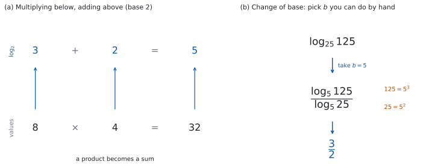

# SL 1.7b — Laws of logarithms, change of base and exponential equations（対数法則・底の変換・指数方程式） {#sec-aasl-1-7b}

::: {.callout-note}
## What you should be able to do
- 公式集の**対数法則 $3$ つ**（積・商・累乗）を、両向きに使える。
- **change of base**（底の変換）の式を使って、底のちがう対数をそろえられる。
- $\log_{a} a^{x} = x$ と $a^{\log_{a} x} = x$ が、**打ち消し合う組**であることが分かる。
- 指数方程式を、**両辺の底をそろえて**解ける。
- 底がそろえられないときに、**両辺の対数をとって**解ける。
- 答えを $\dfrac{\ln p}{\ln q}$ や $\log_{a} b$ の形で、**正確に**書ける。
:::

## The idea

### 1. 対数法則は、指数法則の言いかえ {#idea}

[SL 1.5](aasl-1-5.qmd#log-def) で、対数は**指数を取り出す**ものだと見ました。

指数の世界では、掛け算をすると指数が**足し算**になります（[SL 1.5 第 2 節](aasl-1-5.qmd#laws)）。

$$
2^{3} \times 2^{2} = 2^{5}
$$

これを対数で書き直すと、

$$
\log_{2} 8 + \log_{2} 4 = \log_{2} 32
$$

$3 + 2 = 5$ です。**掛け算が、足し算に変わりました。**

{#fig-aasl17b-idea width=100%}

**これが対数法則の正体**です。新しい規則ではなく、指数法則を別の言葉で言っただけです。

### 2. $3$ つの法則 {#laws}

$$
\log_{a} xy = \log_{a} x + \log_{a} y
$$ {#eq-aasl17b-mul}

$$
\log_{a} \frac{x}{y} = \log_{a} x - \log_{a} y
$$ {#eq-aasl17b-div}

$$
\log_{a} x^{m} = m \log_{a} x
$$ {#eq-aasl17b-pow}

::: {.callout-important}
## この $3$ つは公式集にあります
公式集の **1.7** の欄に、そのまま印刷されています。

> $\log_{a} xy = \log_{a} x + \log_{a} y$
>
> $\log_{a} \dfrac{x}{y} = \log_{a} x - \log_{a} y$
>
> $\log_{a} x^{m} = m \log_{a} x$

シラバスの Content 欄には、使える範囲も書かれています。

> for $a$, $x$, $y > 0$

これに加えて、**底は $a \neq 1$** でなければなりません。$1$ は何乗しても $1$ なので、$\log_{1}$ は決まらないからです（[SL 1.5](aasl-1-5.qmd#log-def)）。

**$3$ つとも、底 $a$ は動きません。** 変わるのは中身だけです。
:::

::: {.callout-warning}
## 足し算・引き算には、法則がありません
$\log_{a}(x + y)$ を、$\log_{a} x$ と $\log_{a} y$ に分ける法則は**ありません。**

$$
\log_{a}(x+y) \neq \log_{a} x + \log_{a} y
$$

法則が使えるのは、**中身が掛け算・割り算・累乗のとき**だけです（[Common errors](#common-errors)）。

（正確には「一般には等しくない」です。$x + y = xy$ になる特別な場合、たとえば $x = y = 2$ なら、たまたま両辺が一致します。$4 = 2 \times 2$ だからです。）
:::

@eq-aasl17b-pow は、$2$ 通りに使えます。

- **前に出す。** $\log_{2} 4^{5} = 5 \log_{2} 4 = 5 \times 2 = 10$
- **中に入れる。** $3 \log 2 = \log 2^{3} = \log 8$

**どちらの向きも使えるようにしておいてください。**

### 3. 底の変換 {#change-of-base}

底がそろっていないと、[第 2 節](#laws) の法則は使えません。**そこで、底をそろえる式があります。**

$$
\log_{a} x = \frac{\log_{b} x}{\log_{b} a}
$$ {#eq-aasl17b-base}

::: {.callout-important}
## この式も公式集にあります
公式集の **1.7** の欄に、次の形で印刷されています。

> $\log_{a} x = \dfrac{\log_{b} x}{\log_{b} a}$

条件は、シラバスの Content 欄のほうに書かれています。

> for $a$, $b$, $x > 0$

これに加えて、**$a \neq 1$ と $b \neq 1$** が要ります。$b = 1$ だと分母が $0$、$a = 1$ だと左辺が決まらないからです。

シラバスの Guidance 欄には、次の例が挙がっています。

> $\log_47 = \dfrac{\ln7}{\ln4}$
:::

$b$ は、**こちらが選べます。** 選び方は $2$ つです。

| 目的 | 選ぶ $b$ | 例 |
|:--|:--|:--|
| 手で値を出す | $a$ と $x$ の**共通の底** | $\log_{25} 125 = \dfrac{\log_{5} 125}{\log_{5} 25} = \dfrac{3}{2}$ |
| 電卓で値を出す | $10$ か $e$ | $\log_{4} 7 = \dfrac{\ln 7}{\ln 4}$ |

: $b$ の選び方 {#tbl-aasl17b-base}

$25 = 5^{2}$、$125 = 5^{3}$ なので、$b = 5$ を選べば上下とも整数になります。**Paper 1 では、この選び方が要になります。**

### 4. 打ち消し合う $2$ つ {#inverse}

$$
\log_{a} a^{x} = x, \qquad a^{\log_{a} x} = x
$$ {#eq-aasl17b-inverse}

::: {.callout-important}
## これも公式集にあります
公式集の **1.7** の欄に、`Exponential and logarithmic functions` として印刷されています。

> $a^{x} = \mathrm{e}^{x \ln a}$ ; $\log_{a} a^{x} = x = a^{\log_{a} x}$ where $a$, $x > 0$, $a \neq 1$

前半の $a^{x} = \mathrm{e}^{x\ln a}$ は、SL では **Topic 2（Functions）** の指数関数で使います。**このページで使うのは、後半のほうです。**
:::

意味は単純です。$\log_{a} x$ は「$a$ を何乗すれば $x$ になるか」でした。その答えを、実際に $a$ の指数に入れ直せば、$x$ に戻ります。**$\log_{a}$ と $a^{\square}$ は、たがいに打ち消し合います。**

どちらの式も、$a > 0$、$a \neq 1$、$x > 0$ のときに使えます。

$$
\log_{2} 2^{7} = 7, \qquad 5^{\log_{5} 9} = 9
$$

指数方程式を解くときに、この打ち消しをそのまま使います（[第 7 節](#take-logs)）。

### 5. まとめる／ばらす {#combine}

問題文は、たいてい次のどちらかを求めています。

**まとめる。** いくつかの対数を、$1$ つの対数にします。

$$
2\log_{3} 2 + \log_{3} 5 = \log_{3} 2^{2} + \log_{3} 5 = \log_{3} 4 + \log_{3} 5 = \log_{3} 20
$$

**係数を先に中へ入れる**のが順です（@eq-aasl17b-pow）。そうしないと @eq-aasl17b-mul が使えません。

**ばらす。** $1$ つの対数を、与えられた記号で表します。

$\log_{a} 2 = p$、$\log_{a} 3 = q$ が与えられていて、$\log_{a} 12$ を表すなら、

$$
12 = 2^{2} \times 3, \qquad \log_{a} 12 = 2\log_{a} 2 + \log_{a} 3 = 2p + q
$$

**中身を素因数に分ける**のが、いつもの第一歩です。

### 6. 指数方程式（$1$）— 底をそろえる {#same-base}

$x$ が指数にある方程式は、**両辺を同じ底の累乗にできるなら、対数は要りません。**

$$
8^{x} = 4
$$

$8 = 2^{3}$、$4 = 2^{2}$ なので、

$$
2^{3x} = 2^{2} \ \Rightarrow \ 3x = 2 \ \Rightarrow \ x = \frac{2}{3}
$$

**底がそろえば、指数どうしを比べるだけ**になります。$a > 0$、$a \neq 1$ のとき $a^{x}$ は同じ値を $2$ 度とらないので、両辺の指数を比べてよいのです。

$\left(\dfrac{1}{2}\right)^{x}$ のような形も、$2^{-x}$ と書きかえれば同じです（[SL 1.5](aasl-1-5.qmd#zero-negative)）。

### 7. 指数方程式（$2$）— 対数をとる {#take-logs}

底がそろえられないときは、**両辺の対数をとります。**

$$
3^{x} = 7
$$

$7$ は $3$ の累乗ではないので、[第 6 節](#same-base) の手は使えません。両辺に $\ln$ をつけます。

$$
\ln 3^{x} = \ln 7
$$

$$
x \ln 3 = \ln 7
$$

$$
x = \frac{\ln 7}{\ln 3}
$$

$2$ 行目で @eq-aasl17b-pow を使いました。**指数の $x$ が、前に出ます。** これが対数を使う理由のすべてです。

底は $10$ でも $e$ でもかまいません。$\dfrac{\log 7}{\log 3}$ でも同じ値です（@eq-aasl17b-base）。

::: {.callout-tip collapse="true"}
## Paper 2 では、電卓で小数にできます
TI-Nspire なら `ln(7)/ln(3)` で $1.7712\ldots$ と出ます。`solve(3^x = 7, x)` でも解けます。

**最終解答は、指示がなければ有効数字 $3$ 桁**で $x = 1.77$ と書きます。

**Paper 2 でも、まず正確な形を書いてから**小数に直してください。方法点（M mark）を得るためにも、途中式を書いておくのが安全です。

**Paper 1 では、$\dfrac{\ln 7}{\ln 3}$ が答えです。** 小数に直す必要はありません。
:::

## Why it works

**@eq-aasl17b-mul は、指数法則から $3$ 行で出ます。**

以下、$a > 0$、$a \neq 1$、$x > 0$、$y > 0$ とします。$\log_{a} x = m$、$\log_{a} y = n$ とおきます。定義（[SL 1.5](aasl-1-5.qmd#log-def)）から

$$
x = a^{m}, \qquad y = a^{n}
$$

掛けると、指数法則で

$$
xy = a^{m} \times a^{n} = a^{m+n}
$$

これを対数の形に戻すと（@eq-aasl17b-inverse）、

$$
\log_{a} xy = m + n = \log_{a} x + \log_{a} y
$$

**同じやり方で、割り算からは @eq-aasl17b-div が、累乗からは @eq-aasl17b-pow が出ます。** 覚える式は $3$ つですが、もとは指数法則の $3$ つです。

**底の変換の式も、同じ道すじで出ます。** $\log_{a} x = m$ とおくと $x = a^{m}$ です。両辺に $\log_{b}$ をつけて、

$$
\log_{b} x = \log_{b} a^{m} = m \log_{b} a
$$

$m$ について解けば、

$$
m = \frac{\log_{b} x}{\log_{b} a}
$$

これが @eq-aasl17b-base です。

**$b$ は、$b > 0$、$b \neq 1$ でありさえすれば、どれを選んでも同じ値になります。** どの $b$ を選ぶかは、この導き方のどこにも効いていないからです。

ただし最後に $\log_{b} a$ で割っているので、$\log_{b} a \neq 0$、つまり **$a \neq 1$** が要ります。$x > 0$ も、$\log_{b} x$ が書ける条件として要ります。

## Worked examples

::: {.callout-note appearance="simple"}
問題文は英語です。意味が理解できなかったら、問題文の下の「**日本語訳**」を開いてください。解説は日本語です。

**例題も演習も、すべて電卓なしで解けます。** Paper 1 のつもりで解いてください。
:::

::: {#exm-aasl17b-single}
[Write each expression as a single logarithm.]{.q-en}

**(a)** [$\log 6 + \log 5$]{.q-en}

**(b)** [$\log_{2} 24 - \log_{2} 3$]{.q-en}

**(c)** [$2\log_{5} 3 + \log_{5} 2$]{.q-en}

**(d)** [Explain why $\log 6 + \log 5$ can be written as a single logarithm, referring to a law of exponents.]{.q-en}

日本語訳

次の式を、$1$ つの対数で書きなさい。

**(a)** $\log 6 + \log 5$

**(b)** $\log_{2} 24 - \log_{2} 3$

**(c)** $2\log_{5} 3 + \log_{5} 2$

**(d)** $\log 6 + \log 5$ が $1$ つの対数で書ける理由を、指数法則にふれながら説明しなさい。

---

**(a)** 足し算なので、中身を掛けます（@eq-aasl17b-mul）。

$$
\log 6 + \log 5 = \log 30
$$

**(b)** 引き算なので、中身を割ります（@eq-aasl17b-div）。

$$
\log_{2} 24 - \log_{2} 3 = \log_{2} 8
$$

$8 = 2^{3}$ なので、値まで出ます。$\log_{2} 8 = 3$ です。

**(c)** **係数を先に中へ入れます**（@eq-aasl17b-pow）。

$$
2\log_{5} 3 = \log_{5} 3^{2} = \log_{5} 9
$$

$$
\log_{5} 9 + \log_{5} 2 = \log_{5} 18
$$

**(d)** `Explain why` なので、英語で理由を書きます。

::: {.model-answer}
**試験ではこう書く**

*Writing $6 = 10^{m}$ and $5 = 10^{n}$ means $m = \log 6$ and $n = \log 5$. The product law of exponents gives $6 \times 5 = 10^{m} \times 10^{n} = 10^{m+n}$, so $30 = 10^{m+n}$ and therefore $\log 30 = m + n = \log 6 + \log 5$. Multiplying the numbers adds their exponents, which is exactly what the first law of logarithms states.*
:::

（$6 = 10^m$、$5 = 10^n$ と書けば $m = \log 6$、$n = \log 5$ である。指数の積の法則から $6 \times 5 = 10^{m+n}$ なので $30 = 10^{m+n}$ であり、$\log 30 = m+n = \log 6 + \log 5$ となる。数を掛けると指数が足されるという事実が、対数の第 $1$ 法則の中身である、という意味です。）

**検算（(b) について）。** 答えから逆にたどります。$\log_{2} 8 = 3$ は $2^{3} = 8$ ということです。この $8$ に、引いた $\log_{2} 3$ の中身 $3$ を掛け戻すと $8 \times 3 = 24$ ✓ **もとの中身に戻りました。**

大きさも見ておきます。$\log_{2} 24$ は $\log_{2} 16 = 4$ と $\log_{2} 32 = 5$ の間、$\log_{2} 3$ は $1$ と $2$ の間なので、差は $2$ と $4$ の間です。$3$ はこの中に入ります ✓ **範囲を絞るだけで、値を決める検算ではありません。**

**検算（(c) について）。** 両辺を $5$ の指数に戻します（@eq-aasl17b-inverse）。

$$
5^{\log_{5} 18} = 18, \qquad 5^{2\log_{5} 3 + \log_{5} 2} = \left(5^{\log_{5} 3}\right)^{2} \times 5^{\log_{5} 2} = 3^{2} \times 2 = 18
$$

どちらも $18$ です ✓ **対数法則を使わない道すじで、同じところに着きました。**

**(c) で $\log_{5} 6$ としていたら**、$2$ を係数のまま $3 \times 2$ にしています。**係数は、中身の指数になります。**

::: {.callout-note}
## 解答例（答案用紙にはこう書く）
**(a)** $\log 6 + \log 5 = \log 30$

**(b)** $\log_{2} 24 - \log_{2} 3 = \log_{2} 8 = 3$

**(c)** $2\log_{5} 3 + \log_{5} 2 = \log_{5} 9 + \log_{5} 2 = \log_{5} 18$

**(d)** *With $6 = 10^{m}$ and $5 = 10^{n}$, the product law gives $30 = 10^{m+n}$, so $\log 30 = m + n = \log 6 + \log 5$.*
:::
:::

::: {#exm-aasl17b-evaluate}
[Find the value of each expression without using a calculator.]{.q-en}

**(a)** [$\log_{2} 40 - \log_{2} 5$]{.q-en}

**(b)** [$\log_{3} 9^{4}$]{.q-en}

**(c)** [$\log_{10} 4 + \log_{10} 25$]{.q-en}

**(d)** [$\log_{9} 27$]{.q-en}

日本語訳

電卓を使わずに、次の値を求めなさい。

**(a)** $\log_{2} 40 - \log_{2} 5$

**(b)** $\log_{3} 9^{4}$

**(c)** $\log_{10} 4 + \log_{10} 25$

**(d)** $\log_{9} 27$

---

**(a)** 引き算なので、中身を割ります。

$$
\log_{2} 40 - \log_{2} 5 = \log_{2} 8 = 3
$$

**(b)** 指数を前に出します（@eq-aasl17b-pow）。

$$
\log_{3} 9^{4} = 4 \log_{3} 9 = 4 \times 2 = 8
$$

**(c)** 足し算なので、中身を掛けます。$4 \times 25 = 100$ です。

$$
\log 4 + \log 25 = \log 100 = 2
$$

**(d)** 底の変換を使います（@eq-aasl17b-base）。$9$ も $27$ も $3$ の累乗なので、$b = 3$ を選びます。

$$
\log_{9} 27 = \frac{\log_{3} 27}{\log_{3} 9} = \frac{3}{2}
$$

**検算（(b) について）。** 中身を先に $3$ の累乗にします。$9^{4} = \left(3^{2}\right)^{4} = 3^{8}$ なので、$\log_{3} 3^{8} = 8$ ✓（@eq-aasl17b-inverse）**@eq-aasl17b-pow を使わない別の道すじです。**

**検算（(d) について）。** 答えを指数の形に戻します。$9^{\frac{3}{2}} = \left(\sqrt{9}\right)^{3} = 3^{3} = 27$ ✓（[SL 1.7a](aasl-1-7a.qmd#two-ways)）

**(d) を $\dfrac{2}{3}$ としていたら**、上下が逆です。$9^{\frac{2}{3}} < 9^{1} = 9$ なので、$27$ には届きません。**「$9$ を何乗したら $27$ か」を思い出せば、$1$ より大きいはず**だと分かります。

::: {.callout-note}
## 解答例（答案用紙にはこう書く）
**(a)** $\log_{2} 40 - \log_{2} 5 = \log_{2} 8 = 3$

**(b)** $\log_{3} 9^{4} = 4\log_{3} 9 = 8$

**(c)** $\log 4 + \log 25 = \log 100 = 2$

**(d)** $\log_{9} 27 = \dfrac{\log_{3} 27}{\log_{3} 9} = \dfrac{3}{2}$
:::
:::

::: {#exm-aasl17b-samebase}
[Solve each equation.]{.q-en}

**(a)** [$2^{x} = 32$]{.q-en}

**(b)** [$9^{x} = 27$]{.q-en}

**(c)** [$\left(\dfrac{1}{2}\right)^{x} = 8$]{.q-en}

**(d)** [$4^{x+1} = 8^{x}$]{.q-en}

日本語訳

次の方程式を解きなさい。

**(a)** $2^{x} = 32$

**(b)** $9^{x} = 27$

**(c)** $\left(\dfrac{1}{2}\right)^{x} = 8$

**(d)** $4^{x+1} = 8^{x}$

---

**(a)** $32 = 2^{5}$ です。

$$
2^{x} = 2^{5} \ \Rightarrow \ x = 5
$$

**(b)** どちらも $3$ の累乗にします。$9 = 3^{2}$、$27 = 3^{3}$ です。

$$
3^{2x} = 3^{3} \ \Rightarrow \ 2x = 3 \ \Rightarrow \ x = \frac{3}{2}
$$

**(c)** $\dfrac{1}{2} = 2^{-1}$ です。

$$
2^{-x} = 2^{3} \ \Rightarrow \ -x = 3 \ \Rightarrow \ x = -3
$$

**(d)** どちらも $2$ の累乗にします。$4 = 2^{2}$、$8 = 2^{3}$ です。

$$
2^{2(x+1)} = 2^{3x} \ \Rightarrow \ 2x + 2 = 3x \ \Rightarrow \ x = 2
$$

**検算。** すべて、もとの式に入れ直します。

**(a)** $2^{5} = 32$ ✓ **(b)** $9^{\frac{3}{2}} = 3^{3} = 27$ ✓ **(c)** $\left(\dfrac{1}{2}\right)^{-3} = 2^{3} = 8$ ✓ **(d)** $4^{3} = 64$、$8^{2} = 64$ ✓

**(d) の検算が、いちばん役に立ちます。** $2$ の累乗に書き直す作業をやり直さずに、両辺をそのまま計算して同じ $64$ になることを確かめられます。

**(c) で $x = 3$ としていたら**、$\left(\dfrac{1}{2}\right)^{3} = \dfrac{1}{8}$ となり、$8$ と逆数の関係になります。**$\dfrac{1}{2} = 2^{-1}$ の $-1$ を落としています。**

::: {.callout-note}
## 解答例（答案用紙にはこう書く）
**(a)** $2^{x} = 2^{5}$, so $x = 5$

**(b)** $3^{2x} = 3^{3}$, so $2x = 3$ and $x = \dfrac{3}{2}$

**(c)** $2^{-x} = 2^{3}$, so $x = -3$

**(d)** $2^{2x+2} = 2^{3x}$, so $2x + 2 = 3x$ and $x = 2$
:::
:::

::: {#exm-aasl17b-logs}
[**(a)** Solve $5^{x} = 12$, giving your answer in the form $\dfrac{\ln p}{\ln q}$.]{.q-en}

**(b)** [Solve $2^{x-1} = 10$, giving your answer in the form $a + \log_{2} b$, where $a$ and $b$ are integers.]{.q-en}

**(c)** [Explain why $\log(x+y)$ is not equal to $\log x + \log y$ for all positive $x$ and $y$.]{.q-en}

日本語訳

**(a)** $5^{x} = 12$ を解き、答えを $\dfrac{\ln p}{\ln q}$ の形で書きなさい。

**(b)** $2^{x-1} = 10$ を解き、答えを $a + \log_{2} b$（$a$、$b$ は整数）の形で書きなさい。

**(c)** すべての正の $x$、$y$ について $\log(x+y)$ が $\log x + \log y$ と等しくなるわけではない理由を説明しなさい。

---

**(a)** $12$ は $5$ の累乗ではないので、両辺の対数をとります（[第 7 節](#take-logs)）。

$$
\ln 5^{x} = \ln 12 \ \Rightarrow \ x \ln 5 = \ln 12 \ \Rightarrow \ x = \frac{\ln 12}{\ln 5}
$$

**(b)** 指数 $x - 1$ を、$1$ つのかたまりと見ます。$2^{\square} = 10$ は、対数の定義（[SL 1.5](aasl-1-5.qmd#log-def)）から $\square = \log_{2} 10$ ということです。

$$
x - 1 = \log_{2} 10 \ \Rightarrow \ x = 1 + \log_{2} 10
$$

$\ln$ をとって $x = 1 + \dfrac{\ln 10}{\ln 2}$ と書いても、同じ値です（@eq-aasl17b-base）。

**(c)** `Explain why` なので、英語で理由を書きます。

::: {.model-answer}
**試験ではこう書く**

*The laws of logarithms come from the laws of exponents, and those laws describe products, quotients and powers, not sums. There is no exponent law that turns $a^{m} + a^{n}$ into a single power, so no logarithm law can split $\log(x+y)$. A single counterexample settles it: with $x = y = 1$, $\log(x+y) = \log 2$, while $\log x + \log y = \log 1 + \log 1 = 0$, and $\log 2 \neq 0$. The two sides do agree for the special pairs with $x + y = xy$, such as $x = y = 2$, but not in general.*
:::

（対数法則は指数法則から出ており、指数法則が述べているのは積・商・累乗であって和ではない。$a^m + a^n$ を $1$ つの累乗にする指数法則はないので、$\log(x+y)$ を分ける対数法則もない。数で見ても違う。$x = y = 1$ のとき $\log(x+y) = \log 2$ だが、$\log x + \log y = 0$ である、という意味です。）

**検算（(a) について）。** 答えの大きさを見ます。$5^{1} = 5$、$5^{2} = 25$ なので、$x$ は $1$ と $2$ の間のはずです。$\ln 12$ は $\ln 5$ の $2$ 倍より小さいので、$\dfrac{\ln 12}{\ln 5}$ も $2$ より小さくなります ✓

**検算（(b) について）。** 答えをもとの式に入れ直します。

$$
2^{(1 + \log_{2} 10) - 1} = 2^{\log_{2} 10} = 10
$$

合いました ✓（@eq-aasl17b-inverse）**打ち消し合う組が、そのまま働いています。**

**(a) を $\dfrac{\ln 5}{\ln 12}$ としていたら**、上下が逆です。この値は $1$ より小さくなり、$1$ と $2$ の間という見当と合いません。

::: {.callout-note}
## 解答例（答案用紙にはこう書く）
**(a)**
$$x \ln 5 = \ln 12, \qquad x = \frac{\ln 12}{\ln 5}$$

**(b)**
$$x - 1 = \log_{2} 10, \qquad x = 1 + \log_{2} 10$$

**(c)** *The laws of logarithms follow from the laws of exponents, which deal with products, quotients and powers, not sums. Taking $x = y = 1$ gives $\log 2$ on one side and $0$ on the other, so the two are not equal in general.*
:::
:::

## Common errors

::: {.callout-warning}
## $\log(x+y)$ を分ける
一般に $\log_{a}(x + y) \neq \log_{a} x + \log_{a} y$ です（[第 2 節](#laws)）。

**法則があるのは、中身が掛け算・割り算・累乗のときだけ**です。

$x = y = 1$ を入れれば、すぐ分かります。左辺は $\log 2$、右辺は $0$ です。
:::

::: {.callout-warning}
## $\dfrac{\log x}{\log y}$ を $\log x - \log y$ にする
割り算の法則は、**$\log$ の中身**が分数のときです（@eq-aasl17b-div）。

$$
\log_{a}\frac{x}{y} = \log_{a} x - \log_{a} y, \qquad \frac{\log_{a} x}{\log_{a} y} \ \text{は別の式}
$$

$\dfrac{\log_{b} x}{\log_{b} a}$ の形は、**底の変換**のほうです（@eq-aasl17b-base）。**分数の形を見たら、まずどちらかを見分けてください。**

$\dfrac{\ln 7}{\ln 3}$ を $\ln \dfrac{7}{3}$ にするのも、同じ誤りです。$\ln \dfrac{7}{3} = \ln 7 - \ln 3$ であって、割り算ではありません。**$\dfrac{\ln 7}{\ln 3}$ は、これ以上簡単になりません。**
:::

::: {.callout-warning}
## 係数を、中身に掛ける
$2\log_{5} 3$ は $\log_{5} 6$ ではありません。$\log_{5} 3^{2} = \log_{5} 9$ です（@eq-aasl17b-pow）。

**係数は、中身の指数になります。**
:::

::: {.callout-warning}
## 底の変換で、上下を逆にする
$\log_{a} x = \dfrac{\log_{b} x}{\log_{b} a}$ です。**上に来るのは $x$**、下に来るのは $a$ です。

迷ったら、$a = b$ で試してください。$\dfrac{\log_{a} x}{\log_{a} a} = \dfrac{\log_{a} x}{1} = \log_{a} x$ となり、正しい向きだと分かります。

逆にしていたら $\dfrac{1}{\log_{a} x}$ になり、合いません。**ただし $x = a$ のときは両方とも $1$ になる**ので、$x$ は $a$ とちがう数で試してください。
:::

::: {.callout-warning}
## Paper 1 で、小数に直そうとする
$\dfrac{\ln 7}{\ln 3}$ のような形が、そのまま答えです（[第 7 節](#take-logs)）。**電卓がないので、小数にはできません。**

問題文が `giving your answer in the form` と言っていたら、**その形のまま書いてください。** 直そうとして時間を使うほうが、損です。
:::

## Exercises

::: {.callout-note appearance="simple"}
各問題に、折りたたみが $3$ つ付いています。**日本語訳**、**解答例**（答案用紙に書くべきこと。英語です）、**解説**（なぜそうなるか。日本語です）。

まず自分で解いて、次に解答例と見くらべてください。**解説は、合わなかったときだけ開けば十分です。**
:::

::: {.exercise-block}

[1]{.ex-no} [Write $\log 7 + \log 4$ as a single logarithm.]{.q-en}

日本語訳

$\log 7 + \log 4$ を、$1$ つの対数で書きなさい。

::: {.callout-note collapse="true"}
## 解答例（答案用紙に書くこと）

$$\log 7 + \log 4 = \log 28$$
:::

::: {.callout-tip collapse="true"}
## 解説

足し算なので、中身を掛けます（@eq-aasl17b-mul）。$7 \times 4 = 28$ です。

**検算。** 別の法則で戻します（@eq-aasl17b-div）。$\log 28 - \log 4 = \log \dfrac{28}{4} = \log 7$ ✓ **足した $\log 4$ が、引くとちょうど消えました。**

**$\log 11$ としていたら**、中身を足しています。同じ検算をすると $\log 11 - \log 4 = \log \dfrac{11}{4}$ となり、$\log 7$ に戻りません。**足すのは対数のほう、掛けるのは中身のほう**です。
:::

::: {.ex-sep}
:::

[2]{.ex-no} [Find the value of each of the following without using a calculator.]{.q-en}

**(a)** [$\log_{3} 45 - \log_{3} 5$]{.q-en}

**(b)** [$\log_{2} 8^{3}$]{.q-en}

日本語訳

電卓を使わずに、次の値を求めなさい。

**(a)** $\log_{3} 45 - \log_{3} 5$

**(b)** $\log_{2} 8^{3}$

::: {.callout-note collapse="true"}
## 解答例（答案用紙に書くこと）

**(a)**
$$\log_{3} 45 - \log_{3} 5 = \log_{3} 9 = 2$$

**(b)**
$$\log_{2} 8^{3} = 3\log_{2} 8 = 3 \times 3 = 9$$
:::

::: {.callout-tip collapse="true"}
## 解説

**(a)** 中身を割ります。$\dfrac{45}{5} = 9 = 3^{2}$ です。

**(b)** 指数を前に出します（@eq-aasl17b-pow）。$\log_{2} 8 = 3$ です。

**検算。**

**(a)** 答えを指数に戻します。$3^{2} = 9$ ✓ そして $9 \times 5 = 45$ ✓ **もとの $45$ に戻りました。**

**(b)** 中身を先に $2$ の累乗にします。$8^{3} = \left(2^{3}\right)^{3} = 2^{9}$ なので $\log_{2} 2^{9} = 9$ ✓ **@eq-aasl17b-pow を使わない別の道すじです。**
:::

::: {.ex-sep}
:::

[3]{.ex-no} [Find the value of $\log_{10} 50 + \log_{10} 2$.]{.q-en}

日本語訳

$\log_{10} 50 + \log_{10} 2$ の値を求めなさい。

::: {.callout-note collapse="true"}
## 解答例（答案用紙に書くこと）

$$\log 50 + \log 2 = \log 100 = 2$$
:::

::: {.callout-tip collapse="true"}
## 解説

**中身を掛けると、ちょうど $100$ になります。** 底が $10$ の対数の値を問う問題では、中身を掛けると $10$ の累乗になることが多いので、まず掛けてみてください。

**検算。** $\log_{10} 50 = \log_{10} 100 - \log_{10} 2 = 2 - \log_{10} 2$ です（@eq-aasl17b-div）。これに $\log_{10} 2$ を足すと、ちょうど $2$ になります ✓ **中身を掛ける道すじとは別です。**

大きさも見ておきます。$\log_{10} 50$ は $1$ と $2$ の間、$\log_{10} 2$ は $0$ と $1$ の間なので、和は $1$ と $3$ の間です。$2$ はこの中に入ります ✓ **範囲を絞るだけで、値を決める検算にはなりません。**
:::

::: {.ex-sep}
:::

[4]{.ex-no} [Given that $\log_{a} 2 = p$ and $\log_{a} 3 = q$, express $\log_{a} 18$ in terms of $p$ and $q$.]{.q-en}

日本語訳

$\log_{a} 2 = p$、$\log_{a} 3 = q$ とします。$\log_{a} 18$ を $p$ と $q$ で表しなさい。

::: {.callout-note collapse="true"}
## 解答例（答案用紙に書くこと）

$$18 = 2 \times 3^{2}$$

$$\log_{a} 18 = \log_{a} 2 + 2\log_{a} 3 = p + 2q$$
:::

::: {.callout-tip collapse="true"}
## 解説

**まず中身を素因数に分けます**（[第 5 節](#combine)）。$18 = 2 \times 9 = 2 \times 3^{2}$ です。

そのあと @eq-aasl17b-mul と @eq-aasl17b-pow を順に使います。

**検算。** 答えを $a$ の指数に戻します（@eq-aasl17b-inverse）。

$$
a^{p + 2q} = a^{p} \times \left(a^{q}\right)^{2} = 2 \times 3^{2} = 18
$$

もとの $18$ に戻りました ✓ **対数法則を使わない道すじです。**

**$2p + q$ としていたら**、同じ検算で $a^{2p+q} = 2^{2} \times 3 = 12$ となり、$18$ になりません。$18 = 4 \times 3$ ではないからです。
:::

::: {.ex-sep}
:::

[5]{.ex-no} [Find the exact value of $\log_{8} 32$.]{.q-en}

日本語訳

$\log_{8} 32$ の正確な値を求めなさい。

::: {.callout-note collapse="true"}
## 解答例（答案用紙に書くこと）

$$\log_{8} 32 = \frac{\log_{2} 32}{\log_{2} 8} = \frac{5}{3}$$
:::

::: {.callout-tip collapse="true"}
## 解説

$8$ も $32$ も $2$ の累乗なので、**底の変換で $b = 2$ を選びます**（@tbl-aasl17b-base）。上下とも整数になります。

**検算。** 答えを指数の形に戻します。

$$
8^{\frac{5}{3}} = \left(\sqrt[3]{8}\right)^{5} = 2^{5} = 32
$$

合いました ✓（[SL 1.7a](aasl-1-7a.qmd#two-ways)）

**大きさの見当も付きます。** $8^{1} = 8$、$8^{2} = 64$ なので、答えは $1$ と $2$ の間のはずです ✓

**上下を逆にして $\dfrac{3}{5}$ としていたら**、$8^{\frac{3}{5}} < 8^{1} = 8$ なので、$32$ には届きません。$1$ より小さい答えは、上の見当とも合いません。
:::

::: {.ex-sep}
:::

[6]{.ex-no} [Solve each equation.]{.q-en}

**(a)** [$3^{x} = 81$]{.q-en}

**(b)** [$\left(\dfrac{1}{5}\right)^{x} = 125$]{.q-en}

**(c)** [$\left(\dfrac{1}{3}\right)^{x} = 9^{x+1}$]{.q-en}

日本語訳

次の方程式を解きなさい。

**(a)** $3^{x} = 81$

**(b)** $\left(\dfrac{1}{5}\right)^{x} = 125$

**(c)** $\left(\dfrac{1}{3}\right)^{x} = 9^{x+1}$

::: {.callout-note collapse="true"}
## 解答例（答案用紙に書くこと）

**(a)**
$$3^{x} = 3^{4} \ \Rightarrow \ x = 4$$

**(b)**
$$5^{-x} = 5^{3} \ \Rightarrow \ -x = 3 \ \Rightarrow \ x = -3$$

**(c)**
$$3^{-x} = 3^{2(x+1)} \ \Rightarrow \ -x = 2x + 2 \ \Rightarrow \ x = -\frac{2}{3}$$
:::

::: {.callout-tip collapse="true"}
## 解説

どれも**両辺を同じ底の累乗にします**（[第 6 節](#same-base)）。

**(b)** $\dfrac{1}{5} = 5^{-1}$ です。マイナスを落とさないでください。

**(c)** 左辺は $\left(3^{-1}\right)^{x} = 3^{-x}$、右辺は $\left(3^{2}\right)^{x+1} = 3^{2(x+1)}$ です。**右辺の指数は、かっこのまま $2$ 倍します。**

**検算。** もとの式に入れ直します。

**(a)** $3^{4} = 81$ ✓ **(b)** $\left(\dfrac{1}{5}\right)^{-3} = 5^{3} = 125$ ✓

**(c)** 左辺は $\left(\dfrac{1}{3}\right)^{-\frac{2}{3}} = 3^{\frac{2}{3}}$、右辺は $9^{-\frac{2}{3}+1} = 9^{\frac{1}{3}} = \left(3^{2}\right)^{\frac{1}{3}} = 3^{\frac{2}{3}}$ ✓ **両辺とも $3^{\frac{2}{3}}$ になりました**（[SL 1.7a](aasl-1-7a.qmd#two-ways)）。

**(b) で $x = 3$ としていたら**、$\left(\dfrac{1}{5}\right)^{3} = \dfrac{1}{125}$ となり、$125$ と逆数の関係になります。

**(c) で $2(x+1)$ を $2x+1$ としていたら**、$-x = 2x+1$ から $x = -\dfrac{1}{3}$ です。入れ直すと左辺 $3^{\frac{1}{3}}$、右辺 $9^{\frac{2}{3}} = 3^{\frac{4}{3}}$ で、合いません。
:::

::: {.ex-sep}
:::

[7]{.ex-no} [Solve $8^{x} = 16^{x-1}$.]{.q-en}

日本語訳

$8^{x} = 16^{x-1}$ を解きなさい。

::: {.callout-note collapse="true"}
## 解答例（答案用紙に書くこと）

$$2^{3x} = 2^{4(x-1)}$$

$$3x = 4x - 4 \ \Rightarrow \ x = 4$$
:::

::: {.callout-tip collapse="true"}
## 解説

$8 = 2^{3}$、$16 = 2^{4}$ です。**指数の指数を掛けるとき、$(x-1)$ をかっこのまま扱ってください**（[SL 1.5 第 2 節](aasl-1-5.qmd#laws)）。

$4(x-1) = 4x - 4$ です。

**検算。** もとの式に入れ直します。$8^{4} = 4096$、$16^{3} = 4096$ ✓ **両辺が同じ値になりました。**

**$2$ の累乗でも確かめられます。** $8^{4} = 2^{12}$、$16^{3} = 2^{12}$ ✓

**$4(x-1)$ を $4x - 1$ としていたら**、$3x = 4x - 1$ から $x = 1$ です。すると $8^{1} = 8$、$16^{0} = 1$ となり、合いません。
:::

::: {.ex-sep}
:::

[8]{.ex-no} [Solve $7^{x} = 30$, giving your answer in the form $\dfrac{\ln p}{\ln q}$.]{.q-en}

日本語訳

$7^{x} = 30$ を解き、答えを $\dfrac{\ln p}{\ln q}$ の形で書きなさい。

::: {.callout-note collapse="true"}
## 解答例（答案用紙に書くこと）

$$\ln 7^{x} = \ln 30$$

$$x \ln 7 = \ln 30 \ \Rightarrow \ x = \frac{\ln 30}{\ln 7}$$
:::

::: {.callout-tip collapse="true"}
## 解説

$30$ は $7$ の累乗ではないので、**両辺の対数をとります**（[第 7 節](#take-logs)）。@eq-aasl17b-pow で $x$ が前に出ます。

**検算。** 大きさを見ます。$7^{1} = 7$、$7^{2} = 49$ なので、$x$ は $1$ と $2$ の間のはずです。

$\ln 30$ は $\ln 49$ より小さく、$\ln 7$ より大きいので、$\dfrac{\ln 30}{\ln 7}$ は $1$ と $2$ の間です ✓

**上下を逆にしていたら**、$1$ より小さくなり、この見当と合いません。**割る側は、いつも「もとの底」のほう**です。
:::

::: {.ex-sep}
:::

[9]{.ex-no} [Explain why $\log_{a} x^{m} = m\log_{a} x$ follows from a law of exponents.]{.q-en}

日本語訳

$\log_{a} x^{m} = m\log_{a} x$ が指数法則から導かれる理由を、説明しなさい。

::: {.callout-note collapse="true"}
## 解答例（答案用紙に書くこと）

*Let $\log_{a} x = k$, so that $x = a^{k}$. Raising both sides to the power $m$ and using $\left(a^{k}\right)^{m} = a^{km}$ gives $x^{m} = a^{km}$. Writing this in logarithmic form gives $\log_{a} x^{m} = km = m\log_{a} x$.*
:::

::: {.callout-tip collapse="true"}
## 解説

`Explain why` なので、**定義に戻ってから、使った指数法則の名前を出します**（[Why it works](#why-it-works)）。

道すじは $3$ 行です。**対数を文字でおく → 指数の形に直す → $m$ 乗する。**

**検算。** 数で試します。$a = 2$、$x = 4$、$m = 3$ とします。左辺は $\log_{2} 4^{3} = \log_{2} 64 = 6$ です。右辺は $3\log_{2} 4 = 3 \times 2 = 6$ ✓

**$x^{m}$ と $(\log_{a} x)^{m}$ は別物です。** $\left(\log_{2} 4\right)^{3} = 2^{3} = 8$ で、$6$ とは違います。**指数が $\log$ の中にあるのか外にあるのかを、必ず見てください。**

::: {.model-answer}
**試験ではこう書く**

*Let $k = \log_{a} x$, which by the definition of a logarithm means $x = a^{k}$. Raising both sides to the power $m$ and using the exponent law $\left(a^{k}\right)^{m} = a^{km}$ gives $x^{m} = a^{km}$. Converting back to logarithmic form gives $\log_{a} x^{m} = km$, and since $k = \log_{a} x$ this is $m\log_{a} x$. The law therefore comes directly from the rule for a power of a power. Checking with $a = 2$, $x = 4$, $m = 3$ gives $\log_{2} 64 = 6$ on the left and $3 \times 2 = 6$ on the right.*
:::
:::

::: {.ex-sep}
:::

[10]{.ex-no} [A student is asked to simplify $\log 8 - \log 2$ and writes]{.q-en}

$$
\log 8 - \log 2 = \log 6
$$

[Identify the error and give the correct answer as a single logarithm.]{.q-en}

日本語訳

ある生徒が $\log 8 - \log 2$ を簡単にするように言われ、上のように書きました。

誤りを指摘し、正しい答えを $1$ つの対数で書きなさい。

::: {.callout-note collapse="true"}
## 解答例（答案用紙に書くこと）

*The student subtracted the arguments instead of dividing them; the quotient law gives $\log 8 - \log 2 = \log \dfrac{8}{2}$.*

$$\log 8 - \log 2 = \log \frac{8}{2} = \log 4$$
:::

::: {.callout-tip collapse="true"}
## 解説

`Identify the error` なので、**どこが違うのかを名指し**してから、正しい答えを書きます。

生徒は $8 - 2$ をしています。正しくは $\dfrac{8}{2}$ です（@eq-aasl17b-div）。

**検算。** 底を $2$ にして、値で確かめます。$\log_{2} 8 - \log_{2} 2 = 3 - 1 = 2$ です。いっぽう $\log_{2} 4 = 2$ ✓ 生徒の答えなら $\log_{2} 6$ ですが、$6$ は $2$ の累乗ではないので $2$ にはなりません（$\log_{2} 4 = 2$、$\log_{2} 8 = 3$ の間）。

**この検算のうまいところは、底を選べる点です。** 問題文の底が $10$ でも、法則は底によらないので、$2$ で確かめれば手で計算できます。

::: {.model-answer}
**試験ではこう書く**

*The student subtracted the arguments, writing $8 - 2 = 6$, but the quotient law states that $\log x - \log y = \log \dfrac{x}{y}$, so the arguments are divided. The correct answer is $\log 8 - \log 2 = \log \dfrac{8}{2} = \log 4$. The laws hold in any base, so the result can be checked in base $2$: $\log_{2} 8 - \log_{2} 2 = 3 - 1 = 2$, which equals $\log_{2} 4$, whereas $\log_{2} 6$ lies strictly between $2$ and $3$.*
:::
:::

:::
