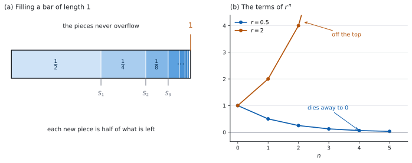

# SL 1.8 — The sum of an infinite geometric series（無限等比級数の和） {#sec-aasl-1-8}

::: {.callout-note}
## What you should be able to do
- 項を無限に足しても、**和が $1$ つの値に近づくことがある**と分かる。
- 公式集の $S_{\infty} = \dfrac{u_{1}}{1-r}$ を、$|r| < 1$ を確かめてから使える。
- **modulus notation**（絶対値の記号）$|r| < 1$ を、$-1 < r < 1$ と読みかえられる。
- **convergent**（収束する）と **divergent**（発散する）を見分けられる。
- $S_{\infty}$ と $u_{1}$ から $r$ を、$S_{\infty}$ と $r$ から $u_{1}$ を求められる。
- **循環小数を分数に直す**のに使える。
:::

## The idea

### 1. 足し続けても、行き先がある {#idea}

$\dfrac{1}{2} + \dfrac{1}{4} + \dfrac{1}{8} + \cdots$ を、途中まで足してみます。

| 項の数 | 足した結果 |
|:--|:--|
| $1$ | $\dfrac{1}{2}$ |
| $2$ | $\dfrac{3}{4}$ |
| $3$ | $\dfrac{7}{8}$ |
| $4$ | $\dfrac{15}{16}$ |

: 足すほど $1$ に近づく {#tbl-aasl18-partial}

**$1$ を超えることはありません。** 毎回、残りのちょうど半分を足しているからです。

{#fig-aasl18-idea width=100%}

この数列は [geometric sequence](aasl-1-3.qmd) で、$u_{1} = \dfrac{1}{2}$、$r = \dfrac{1}{2}$ です。**項が毎回一定の割合（ここでは半分）で小さくなるので、足しても行き先がある**のです。

**「項が小さくなること」だけでは足りません。** 大事なのは $r$ の大きさで、それが $|r| < 1$ という条件になります。

### 2. 公式 {#formula}

$$
S_{\infty} = \frac{u_{1}}{1-r}
$$ {#eq-aasl18-sinf}

::: {.callout-important}
## この式は公式集にあります
公式集の **1.8** の欄に `The sum of an infinite geometric sequence` として印刷されています。**条件も、そのまま書かれています。**

> $S_{\infty} = \dfrac{u_{1}}{1-r}$, $\left|r\right| < 1$

**$|r| < 1$ を書かずに使うと、成り立たない場合にまで当てはめてしまいます**（[第 4 節](#converge)）。
:::

@tbl-aasl18-partial で確かめます。$u_{1} = \dfrac{1}{2}$、$r = \dfrac{1}{2}$ なので、

$$
S_{\infty} = \frac{\frac{1}{2}}{1 - \frac{1}{2}} = \frac{\frac{1}{2}}{\frac{1}{2}} = 1
$$

表が近づいていた $1$ と、合いました。

### 3. $|r| < 1$ の読み方 {#modulus}

$|r|$ は **modulus**（絶対値）で、**符号を外した大きさ**です。

$$
|3| = 3, \qquad |-3| = 3, \qquad \left|-\tfrac{1}{2}\right| = \tfrac{1}{2}
$$

ですから $|r| < 1$ は、$r$ が $-1$ と $1$ の間にあるということです。

$$
|r| < 1 \iff -1 < r < 1
$$ {#eq-aasl18-modulus}

**$r$ が負でもかまいません。** $r = -\dfrac{1}{2}$ なら $|r| = \dfrac{1}{2} < 1$ なので、和があります。項の符号が交互に変わるだけです。

::: {.callout-warning}
## $r < 1$ ではありません
$r = -3$ は $r < 1$ をみたしますが、$|r| = 3$ なので**和はありません。**

$3 - 9 + 27 - 81 + \cdots$ を思い浮かべてください。**項が大きくなり続けます。**

答案では $|r| < 1$ と書くか、$-1 < r < 1$ と書いてください。$r < 1$ とだけ書くと、得点にならない可能性があります。
:::

### 4. 収束と発散 {#converge}

$|r| < 1$ でない場合を、$3$ つ見ておきます。

| $r$ | 数列 | 何が起きるか |
|:--|:--|:--|
| $r = 2$ | $3, 6, 12, 24, \ldots$ | 項が大きくなる。和も限りなく大きくなる |
| $r = 1$ | $3, 3, 3, 3, \ldots$ | 同じ数を足し続ける。和は限りなく大きくなる |
| $r = -1$ | $3, -3, 3, -3, \ldots$ | 和が $3$ と $0$ を行き来して、$1$ つに決まらない |

: $|r| \geq 1$ では和がない {#tbl-aasl18-diverge}

どの場合も、**和が $1$ つの値に近づきません。** このとき級数は **divergent**（発散する）といい、近づくときは **convergent**（収束する）といいます。

$r = 1$ のときは、@eq-aasl18-sinf の分母が $0$ になることからも分かります。**式そのものが書けません。**

::: {.callout-tip}
## まず $r$ を出し、$|r| < 1$ を確かめる
`sum to infinity` の問題では、**$r$ が与えられていなければ、答案の $1$ 行目で $r$ を出します。**

そして、$r$ が与えられていてもいなくても、**$|r| < 1$ を確かめた、と一言書いてから**公式を使ってください。「和があるか」を問う問題では、この条件の確認が採点対象になることがあります。
:::

### 5. $S_{n}$ から $S_{\infty}$ へ {#from-sn}

[SL 1.3](aasl-1-3.qmd) の有限和の式は、公式集に $2$ つの形で印刷されています。

$$
S_{n} = \frac{u_{1}(r^{n} - 1)}{r - 1} = \frac{u_{1}(1 - r^{n})}{1 - r}, \qquad r \neq 1
$$ {#eq-aasl18-sn}

ここでは、$|r| < 1$ のときに扱いやすい右の形を使います。**$r \neq 1$ という条件も、公式集に書かれています。**

ここで $n$ を大きくすると、何が起きるでしょうか。**$r^{n}$ だけが動きます。**

| $n$ | $\left(\dfrac{1}{2}\right)^{n}$ |
|:--|:--|
| $1$ | $0.5$ |
| $2$ | $0.25$ |
| $3$ | $0.125$ |
| $10$ | $0.000976\ldots$ |

: $|r| < 1$ なら、$r^{n}$ は $0$ に近づく {#tbl-aasl18-rn}

$r^{n}$ が $0$ に近づくので、$1 - r^{n}$ は $1$ に近づきます。ですから

$$
S_{n} \to \frac{u_{1}(1 - 0)}{1-r} = \frac{u_{1}}{1-r}
$$

**これが @eq-aasl18-sinf です。** 新しい式ではなく、有限和の式の行き先です。

$|r| \geq 1$ だと $r^{n}$ は $0$ に近づかないので、この話が成り立ちません。**条件は、ここから出てきます。** $r = 1$ のときは、そもそも @eq-aasl18-sn が使えません（分母が $0$）。

::: {.callout-note}
## 「近づく」を、ここでは証明していません
$|r| < 1$ のとき $r^{n}$ が $0$ に**近づく**ことは、@tbl-aasl18-rn と「毎回 $|r|$ 倍だから縮む」という見方で納得するところまでです。**厳密な証明（極限の議論）は SL の範囲外**で、試験でも求められません。

答案で書けばよいのは、@eq-aasl18-sn から出発して、**$|r| < 1$ のとき $r^{n} \to 0$ なので $S_{n} \to \dfrac{u_{1}}{1-r}$** と述べることです。
:::

### 6. 逆向きに使う {#backwards}

@eq-aasl18-sinf には $S_{\infty}$、$u_{1}$、$r$ の $3$ つが入っています。**$2$ つ分かれば、残りが出ます。**

**$r$ を求める。** $S_{\infty} = 24$、$u_{1} = 16$ なら、

$$
\frac{16}{1-r} = 24 \ \Rightarrow \ 16 = 24(1-r) \ \Rightarrow \ 1 - r = \frac{2}{3} \ \Rightarrow \ r = \frac{1}{3}
$$

**$u_{1}$ を求める。** $S_{\infty} = 21$、$r = \dfrac{3}{7}$ なら、

$$
u_{1} = S_{\infty}(1-r) = 21 \times \frac{4}{7} = 12
$$

**分母をはらってから動かす**のが、いちばん間違えにくい順です。

### 7. 循環小数を分数に直す {#recurring}

$0.\overline{7} = 0.7777\ldots$ は、**無限等比級数の和として書けます。**

$$
0.7777\ldots = \frac{7}{10} + \frac{7}{100} + \frac{7}{1000} + \cdots
$$

$u_{1} = \dfrac{7}{10}$、$r = \dfrac{1}{10}$ です。$|r| < 1$ なので、

$$
S_{\infty} = \frac{\frac{7}{10}}{1 - \frac{1}{10}} = \frac{\frac{7}{10}}{\frac{9}{10}} = \frac{7}{9}
$$

**$0.\overline{7} = \dfrac{7}{9}$ です。** 循環する数字が $2$ 桁なら、$r = \dfrac{1}{100}$ になります。

::: {.callout-tip collapse="true"}
## Paper 2 では、電卓で確かめられます
分数を小数に直すキー（TI-Nspire なら `ctrl` + `enter` で近似値）を使えば、$\dfrac{4}{9} = 0.4444\ldots$ がすぐ出ます。

数列の和を直接出すこともできます。`menu → Calculus → Sum` で、$\sum$ の下に $n = 1$、上に大きな数（$100$ など）、本体に一般項（$0.\overline{7}$ なら $7 \times 10^{-n}$）を入れます。

**$|r|$ が $1$ に近いほど、収束はゆっくり**です。$100$ 項でも $S_{\infty}$ との差が残ることがあります。

**これは確かめであって、答案ではありません。** Paper 1 でも Paper 2 でも、書くのは @eq-aasl18-sinf を使った式です。
:::

## Why it works

**なぜ $|r| < 1$ でないと和がないのか**を、$3$ つの場合に分けて見ます。

**$|r| > 1$ のとき**（以下、$u_{1} \neq 0$ とします）。項の大きさ $|u_{1}| \, |r|^{\,n-1}$ は毎回 $|r|$ 倍になるので、**小さくなるどころか、大きくなり続けます。**

部分和に次の項を足したときの**変わり方**が $0$ に近づかないので、部分和が $1$ つの値に落ち着くことはありません。

- **$r > 1$** なら、同じ向きにどんどん大きくなります（@tbl-aasl18-diverge の $r = 2$ の行）。
- **$r < -1$** なら、正と負を行き来しながら、**振れ幅が大きくなります。**

$r = -2$ の例を見ておきます。$3 - 6 + 12 - 24 + \cdots$ の部分和は

$$
3, \quad -3, \quad 9, \quad -15, \quad 33, \ \ldots
$$

正負に振れながら、$1$ つの値から離れていきます。**どちらの場合も、級数は発散します。**

**$r = 1$ のとき。** 同じ数を足し続けます。$3 + 3 + 3 + \cdots$ は、いくらでも大きくできます。@eq-aasl18-sinf の分母 $1 - r$ が $0$ になるのも、同じことを言っています。

**$r = -1$ のとき。** 項は $3, -3, 3, -3, \ldots$ です。足していくと $3, 0, 3, 0, \ldots$ と行き来します。**大きくはなりませんが、$1$ つの値に近づきません。** これも和がない場合です。

**$|r| < 1$ のときだけ**、@tbl-aasl18-rn のように $r^{n}$ が $0$ へ向かい、@eq-aasl18-sn の行き先が決まります。

**$r$ が負でも大丈夫な理由**も、ここから分かります。$|r| < 1$ なら $|r^{n}| = |r|^{n}$ も $0$ に近づきます。符号が交互に変わっても、大きさが $0$ に向かえば同じです。

$r = -\dfrac{1}{3}$、$u_{1} = 9$ で確かめてみます。項は $9, -3, 1, -\dfrac{1}{3}, \ldots$ で、足した結果は

$$
9, \quad 6, \quad 7, \quad \frac{20}{3}, \quad \frac{61}{9}, \ \ldots
$$

$\dfrac{27}{4} = 6.75$ をはさみながら近づいています。公式でも $\dfrac{9}{1+\frac{1}{3}} = \dfrac{9}{\frac{4}{3}} = \dfrac{27}{4}$ です。

**$r$ が負のとき、$S_{\infty}$ は連続する $2$ つの部分和のあいだにあります。** $6 < 6.75 < 7$、$\dfrac{20}{3} < 6.75 < \dfrac{61}{9}$ です。

## Worked examples

::: {.callout-note appearance="simple"}
問題文は英語です。意味が理解できなかったら、問題文の下の「**日本語訳**」を開いてください。解説は日本語です。

**例題も演習も、すべて電卓なしで解けます。** Paper 1 のつもりで解いてください。
:::

::: {#exm-aasl18-basic}
[**(a)** An infinite geometric series has $u_{1} = 15$ and $r = \dfrac{1}{3}$. Find its sum to infinity.]{.q-en}

**(b)** [An infinite geometric series has $u_{1} = 8$ and $r = -\dfrac{1}{2}$. Find its sum to infinity.]{.q-en}

**(c)** [Find the sum to infinity of $24 + 6 + \dfrac{3}{2} + \cdots$]{.q-en}

**(d)** [Explain why the series $5 + 10 + 20 + \cdots$ has no sum to infinity.]{.q-en}

日本語訳

**(a)** ある無限等比級数で $u_{1} = 15$、$r = \dfrac{1}{3}$ です。無限和を求めなさい。

**(b)** ある無限等比級数で $u_{1} = 8$、$r = -\dfrac{1}{2}$ です。無限和を求めなさい。

**(c)** $24 + 6 + \dfrac{3}{2} + \cdots$ の無限和を求めなさい。

**(d)** 級数 $5 + 10 + 20 + \cdots$ に無限和がない理由を説明しなさい。

---

**(a)** $\left|\dfrac{1}{3}\right| < 1$ なので、@eq-aasl18-sinf が使えます。

$$
S_{\infty} = \frac{15}{1 - \frac{1}{3}} = \frac{15}{\frac{2}{3}} = 15 \times \frac{3}{2} = \frac{45}{2}
$$

**(b)** $\left|-\dfrac{1}{2}\right| = \dfrac{1}{2} < 1$ なので、使えます。**分母は引き算のまま**です。

$$
S_{\infty} = \frac{8}{1 - \left(-\frac{1}{2}\right)} = \frac{8}{\frac{3}{2}} = 8 \times \frac{2}{3} = \frac{16}{3}
$$

**(c)** まず $r$ を出します（[第 4 節](#converge)）。

$$
r = \frac{6}{24} = \frac{1}{4}
$$

$\left|\dfrac{1}{4}\right| < 1$ なので、

$$
S_{\infty} = \frac{24}{1 - \frac{1}{4}} = \frac{24}{\frac{3}{4}} = 24 \times \frac{4}{3} = 32
$$

**(d)** `Explain why` なので、英語で理由を書きます。

::: {.model-answer}
**試験ではこう書く**

*The common ratio is $r = \dfrac{10}{5} = 2$, so $|r| = 2$, which is not less than $1$. The condition for a sum to infinity is $|r| < 1$, so the formula does not apply. The terms $5, 10, 20, 40, \ldots$ increase without limit, so the partial sums also increase without limit and do not approach a single value. The series is divergent.*
:::

（公比は $r = 2$ で、$|r| = 2$ は $1$ より小さくない。無限和がある条件は $|r| < 1$ なので、公式は使えない。項 $5, 10, 20, 40, \ldots$ は限りなく大きくなるので、部分和も限りなく大きくなり、$1$ つの値に近づかない。この級数は発散する、という意味です。）

**検算（(c) について）。** $3$ 項目まで足すと $24 + 6 + \dfrac{3}{2} = \dfrac{63}{2} = 31.5$ です。

**残りをまとめて足すと、ぴったり合います。** $4$ 項目は $\dfrac{3}{8}$ で、そこから先も等比級数です。初項 $\dfrac{3}{8}$、公比 $\dfrac{1}{4}$ なので、

$$
\frac{\frac{3}{8}}{1 - \frac{1}{4}} = \frac{\frac{3}{8}}{\frac{3}{4}} = \frac{1}{2}
$$

$31.5 + 0.5 = 32$ ✓ **途中で切って、残りを足し直す別の道すじです。** 「小さいから合っていそう」ではなく、**ぴったり一致する**ところが要です。

**$r$ を $\dfrac{24}{6} = 4$ と逆にとっていたら**、$|r| > 1$ となり「和はない」と答えてしまいます。**$r$ は「次 ÷ 前」です**（[SL 1.3](aasl-1-3.qmd)）。

::: {.callout-note}
## 解答例（答案用紙に書くこと）
**(a)** $\left|\dfrac{1}{3}\right| < 1$
$$S_{\infty} = \frac{15}{1 - \frac{1}{3}} = \frac{45}{2}$$

**(b)** $\left|-\dfrac{1}{2}\right| < 1$
$$S_{\infty} = \frac{8}{1 + \frac{1}{2}} = \frac{16}{3}$$

**(c)** $r = \dfrac{6}{24} = \dfrac{1}{4}$, and $\left|\dfrac{1}{4}\right| < 1$
$$S_{\infty} = \frac{24}{1 - \frac{1}{4}} = 32$$

**(d)** *$r = 2$, so $|r| = 2 > 1$ and the condition $|r| < 1$ fails. The terms increase without limit, so the series is divergent and has no sum to infinity.*
:::
:::

::: {#exm-aasl18-backwards}
[**(a)** An infinite geometric series has $u_{1} = 10$ and sum to infinity $40$. Find $r$.]{.q-en}

**(b)** [An infinite geometric series has $r = \dfrac{2}{3}$ and sum to infinity $18$. Find $u_{1}$.]{.q-en}

**(c)** [An infinite geometric series has $u_{2} = 6$ and $r = \dfrac{1}{2}$. Find its sum to infinity.]{.q-en}

日本語訳

**(a)** ある無限等比級数で、$u_{1} = 10$、無限和が $40$ です。$r$ を求めなさい。

**(b)** ある無限等比級数で、$r = \dfrac{2}{3}$、無限和が $18$ です。$u_{1}$ を求めなさい。

**(c)** ある無限等比級数で、$u_{2} = 6$、$r = \dfrac{1}{2}$ です。無限和を求めなさい。

---

**(a)** @eq-aasl18-sinf に入れて、分母をはらいます（[第 6 節](#backwards)）。

$$
\frac{10}{1-r} = 40 \ \Rightarrow \ 10 = 40(1-r) \ \Rightarrow \ 1 - r = \frac{1}{4} \ \Rightarrow \ r = \frac{3}{4}
$$

$40$ で割ると $1 - r = \dfrac{10}{40} = \dfrac{1}{4}$ です。

**(b)** $u_{1}$ について解いた形にします。

$$
u_{1} = S_{\infty}(1-r) = 18 \times \left(1 - \frac{2}{3}\right) = 18 \times \frac{1}{3} = 6
$$

**(c)** $u_{2} = u_{1}r$ なので（[SL 1.3](aasl-1-3.qmd)）、まず $u_{1}$ を出します。

$$
6 = u_{1} \times \frac{1}{2} \ \Rightarrow \ u_{1} = 12
$$

$$
S_{\infty} = \frac{12}{1 - \frac{1}{2}} = \frac{12}{\frac{1}{2}} = 24
$$

**検算（(a) について）。** 出した $r$ を、もとの式に入れ直します。$\dfrac{10}{1 - \frac{3}{4}} = \dfrac{10}{\frac{1}{4}} = 40$ ✓

**大きさの見当も付きます。** $S_{\infty}$ が $u_{1}$ の $4$ 倍なので、$1 - r = \dfrac{1}{4}$ でなければなりません。**倍率の逆数が $1-r$ です。**

**検算（(c) について）。** 項を書き出して足します。$12, 6, 3, \dfrac{3}{2}, \dfrac{3}{4}, \ldots$ を足すと $12, 18, 21, 22.5, 23.25, \ldots$ です。$24$ に向かっています ✓ **公式を使わない道すじです。**

**(c) で $u_{2}$ を $u_{1}$ と取りちがえていたら**、$S_{\infty} = \dfrac{6}{1 - \frac{1}{2}} = 12$ となります。

**この誤りは、部分和では見つかりません。** $6, 3, \dfrac{3}{2}, \ldots$ の和は $12$ に向かうからです。**書き出した数列の $2$ 項目が、問題文の $u_{2} = 6$ と合うか**を見てください。$u_{1} = 12$ なら $12, 6, 3, \ldots$ で合い、$u_{1} = 6$ なら $6, 3, \ldots$ で $u_{2} = 3 \neq 6$ です ✓

::: {.callout-note}
## 解答例（答案用紙に書くこと）
**(a)**
$$\frac{10}{1-r} = 40, \qquad 1 - r = \frac{1}{4}, \qquad r = \frac{3}{4}$$

**(b)**
$$u_{1} = 18\left(1 - \frac{2}{3}\right) = 6$$

**(c)** $\left|\dfrac{1}{2}\right| < 1$
$$u_{1} = \frac{6}{\frac{1}{2}} = 12, \qquad S_{\infty} = \frac{12}{1 - \frac{1}{2}} = 24$$
:::
:::

::: {#exm-aasl18-recurring}
[**(a)** Express the recurring decimal $0.\overline{4}$ as a fraction in its simplest form.]{.q-en}

**(b)** [Express the recurring decimal $0.\overline{12}$ as a fraction in its simplest form.]{.q-en}

**(c)** [Show that $0.\overline{9} = 1$.]{.q-en}

日本語訳

**(a)** 循環小数 $0.\overline{4}$ を、これ以上約分できない分数で表しなさい。

**(b)** 循環小数 $0.\overline{12}$ を、これ以上約分できない分数で表しなさい。

**(c)** $0.\overline{9} = 1$ であることを示しなさい。

---

**(a)** 位ごとに分けます（[第 7 節](#recurring)）。$u_{1} = \dfrac{4}{10}$、$r = \dfrac{1}{10}$ です。

$$
S_{\infty} = \frac{\frac{4}{10}}{1 - \frac{1}{10}} = \frac{\frac{4}{10}}{\frac{9}{10}} = \frac{4}{9}
$$

**(b)** 循環するのが $2$ 桁なので、$u_{1} = \dfrac{12}{100}$、$r = \dfrac{1}{100}$ です。

$$
S_{\infty} = \frac{\frac{12}{100}}{1 - \frac{1}{100}} = \frac{\frac{12}{100}}{\frac{99}{100}} = \frac{12}{99} = \frac{4}{33}
$$

**(c)** $u_{1} = \dfrac{9}{10}$、$r = \dfrac{1}{10}$ で、$|r| < 1$ です。

$$
S_{\infty} = \frac{\frac{9}{10}}{1 - \frac{1}{10}} = \frac{\frac{9}{10}}{\frac{9}{10}} = 1
$$

**$0.\overline{9}$ は「$1$ に限りなく近い別の数」ではなく、$1$ そのものです。** $0.9, 0.99, 0.999, \ldots$ という部分和の**行き先**が $0.\overline{9}$ の意味だからです（[第 5 節](#from-sn)）。

**検算（(a) について）。** 逆向きに、割り算で戻します。$4 \div 9$ を筆算すると $0.444\ldots$ です ✓ **分数から小数へ、という別の道すじです。**

**検算（(b) について）。** 約分の前後で値が変わっていないかを見ます。$\dfrac{12}{99}$ の上下を $3$ で割ると $\dfrac{4}{33}$ です。$4 \div 33$ を筆算すると $0.1212\ldots$ ✓

**$r$ を $\dfrac{1}{10}$ のままにしていたら**、$\dfrac{\frac{12}{100}}{\frac{9}{10}} = \dfrac{12}{90} = \dfrac{2}{15}$ です。$2 \div 15 = 0.1333\ldots$ となり、$0.1212\ldots$ と合いません。**循環する桁数と同じ回数だけ $10$ を掛けた数**が、$r$ の分母です（$2$ 桁なら $10^{2} = 100$）。

::: {.callout-note}
## 解答例（答案用紙に書くこと）
**(a)** $u_{1} = \dfrac{4}{10}$, $r = \dfrac{1}{10}$
$$S_{\infty} = \frac{\frac{4}{10}}{\frac{9}{10}} = \frac{4}{9}$$

**(b)** $u_{1} = \dfrac{12}{100}$, $r = \dfrac{1}{100}$
$$S_{\infty} = \frac{\frac{12}{100}}{\frac{99}{100}} = \frac{12}{99} = \frac{4}{33}$$

**(c)** $u_{1} = \dfrac{9}{10}$, $r = \dfrac{1}{10}$
$$S_{\infty} = \frac{\frac{9}{10}}{\frac{9}{10}} = 1$$
:::
:::

::: {#exm-aasl18-range}
[Consider the infinite geometric series $1 + x + x^{2} + x^{3} + \cdots$]{.q-en}

**(a)** [Find the values of $x$ for which the series has a sum to infinity.]{.q-en}

**(b)** [Find the sum to infinity in terms of $x$.]{.q-en}

**(c)** [Hence find the sum to infinity when $x = \dfrac{2}{5}$.]{.q-en}

**(d)** [Explain why the series has no sum to infinity when $x = -1$.]{.q-en}

日本語訳

無限等比級数 $1 + x + x^{2} + x^{3} + \cdots$ を考えます。

**(a)** この級数に無限和がある $x$ の範囲を求めなさい。

**(b)** 無限和を $x$ を使って表しなさい。

**(c)** **(b)** を使って、$x = \dfrac{2}{5}$ のときの無限和を求めなさい。

**(d)** $x = -1$ のとき無限和がない理由を説明しなさい。

---

**(a)** $u_{1} = 1$、$r = x$ です。条件は $|r| < 1$ なので（@eq-aasl18-modulus）、

$$
|x| < 1, \qquad \text{つまり} \qquad -1 < x < 1
$$

**(b)** @eq-aasl18-sinf に入れるだけです。

$$
S_{\infty} = \frac{1}{1-x}
$$

**(c)** $x = \dfrac{2}{5}$ は $-1 < x < 1$ の中にあります。

$$
S_{\infty} = \frac{1}{1 - \frac{2}{5}} = \frac{1}{\frac{3}{5}} = \frac{5}{3}
$$

**(d)** `Explain why` なので、英語で理由を書きます。

::: {.model-answer}
**試験ではこう書く**

*When $x = -1$ the terms are $1, -1, 1, -1, \ldots$, so $|r| = 1$ and the condition $|r| < 1$ fails. The partial sums are $1, 0, 1, 0, \ldots$, which do not approach a single value: they keep alternating between $1$ and $0$. The series is therefore divergent and has no sum to infinity. Substituting $x = -1$ into $\dfrac{1}{1-x}$ would give $\dfrac{1}{2}$, but that value is not the sum of the series, because the formula is only valid for $|x| < 1$.*
:::

（$x = -1$ のとき項は $1, -1, 1, -1, \ldots$ なので $|r| = 1$ となり、条件 $|r| < 1$ をみたさない。部分和は $1, 0, 1, 0, \ldots$ で、$1$ と $0$ を行き来し、$1$ つの値に近づかない。したがってこの級数は発散し、無限和はない。$x = -1$ を $\dfrac{1}{1-x}$ に入れると $\dfrac12$ が出るが、公式が使えるのは $|x| < 1$ のときだけなので、この値は和ではない、という意味です。）

**検算（(c) について）。** 項を書き出して足します。$1, 0.4, 0.16, 0.064, \ldots$ を足すと $1, 1.4, 1.56, 1.624, \ldots$ です。$\dfrac{5}{3} = 1.666\ldots$ に向かっています ✓ **公式を使わない道すじです。**

**(b) で $\dfrac{1}{1+x}$ としていたら**、$x = \dfrac{2}{5}$ で $\dfrac{5}{7} = 0.714\ldots$ となり、$1$ 項目の $1$ より小さくなります。**項がすべて正なら、和は $1$ 項目より小さくなりません。**

::: {.callout-note}
## 解答例（答案用紙に書くこと）
**(a)** *$r = x$, so a sum to infinity exists when* $|x| < 1$, *that is* $-1 < x < 1$

**(b)**
$$S_{\infty} = \frac{1}{1-x}$$

**(c)**
$$S_{\infty} = \frac{1}{1 - \frac{2}{5}} = \frac{5}{3}$$

**(d)** *At $x = -1$, $|r| = 1$, so the condition $|r| < 1$ fails. The partial sums are $1, 0, 1, 0, \ldots$ and do not approach a single value.*
:::
:::

## Common errors

::: {.callout-warning}
## $r < 1$ で確かめる
条件は $|r| < 1$ です（[第 3 節](#modulus)）。$r = -3$ は $r < 1$ ですが、$|r| = 3$ なので和はありません。

**答案には $|r| < 1$、または $-1 < r < 1$ と書いてください。**
:::

::: {.callout-warning}
## $|r| < 1$ を確かめずに、公式に入れる
$|r| \geq 1$ のとき @eq-aasl18-sinf は使えません（[第 4 節](#converge)）。それでも**数は出てしまう**のが、この誤りの怖いところです。

$u_{1} = 4$、$r = 3$ なら $\dfrac{4}{1-3} = -2$ という値が出ます。**項がすべて正なのに、和が負**です。

**答えの符号や大きさが不自然なら、まず $r$ を疑ってください。**
:::

::: {.callout-warning}
## 負の $r$ で、分母の引き算をまちがえる
$r = -\dfrac{1}{2}$ なら、分母は $1 - \left(-\dfrac{1}{2}\right) = \dfrac{3}{2}$ です。$\dfrac{1}{2}$ ではありません。

**かっこを書いてから引く**と、防げます。
:::

::: {.callout-warning}
## $r$ を「前 ÷ 次」でとる
$r$ は **次の項 ÷ 前の項**です（[SL 1.3](aasl-1-3.qmd)）。

$24 + 6 + \cdots$ なら $r = \dfrac{6}{24} = \dfrac{1}{4}$ です。$\dfrac{24}{6} = 4$ ではありません。

**項の大きさが小さくなっていく級数なら、$|r| < 1$ のはず**です。$r$ を逆にとると $|r| > 1$ になるので、そこで気づけます。
:::

::: {.callout-warning}
## 「項が大きくならないから収束する」と思い込む
$r = -1$ のとき、項は $u_{1}, -u_{1}, u_{1}, -u_{1}, \ldots$ で**大きくなりません。** それでも部分和は $u_{1}, 0, u_{1}, 0, \ldots$ を行き来するだけで、$1$ つの値に近づきません（[第 4 節](#converge)）。

**収束するかどうかを決めるのは項の大きさではなく、$|r| < 1$ かどうか**です。$|r| = 1$ は、この条件に入りません。
:::

::: {.callout-warning}
## 循環小数で、$r$ の桁数を数えまちがえる
循環する数字が $1$ 桁なら $r = \dfrac{1}{10}$、$2$ 桁なら $r = \dfrac{1}{100}$、$3$ 桁なら $r = \dfrac{1}{1000}$ です（[第 7 節](#recurring)）。

**$u_{1}$ の分母と、$r$ の分母は同じ**になります。$0.\overline{12}$ なら、どちらも $100$ です。
:::

## Exercises

::: {.callout-note appearance="simple"}
各問題に、折りたたみが $3$ つ付いています。**日本語訳**、**解答例**（答案用紙に書くべきこと。英語です）、**解説**（なぜそうなるか。日本語です）。

まず自分で解いて、次に解答例と見くらべてください。**解説は、合わなかったときだけ開けば十分です。**
:::

::: {.exercise-block}

[1]{.ex-no} [An infinite geometric series has $u_{1} = 20$ and $r = \dfrac{2}{5}$. Find its sum to infinity.]{.q-en}

日本語訳

ある無限等比級数で $u_{1} = 20$、$r = \dfrac{2}{5}$ です。無限和を求めなさい。

::: {.callout-note collapse="true"}
## 解答例（答案用紙に書くこと）

$\left|\dfrac{2}{5}\right| < 1$

$$S_{\infty} = \frac{20}{1 - \frac{2}{5}} = \frac{20}{\frac{3}{5}} = \frac{100}{3}$$
:::

::: {.callout-tip collapse="true"}
## 解説

$|r| < 1$ を確かめてから、@eq-aasl18-sinf に入れます（[第 4 節](#converge)）。

分数で割るときは、**ひっくり返して掛けます。** $20 \times \dfrac{5}{3} = \dfrac{100}{3}$ です。

**検算。** $4$ 項まで足すと $20 + 8 + 3.2 + 1.28 = 32.48 = \dfrac{812}{25}$ です。

**残りをまとめて足します。** $5$ 項目は $20 \times \left(\dfrac{2}{5}\right)^{4} = \dfrac{64}{125}$ で、そこから先も等比級数なので

$$
\frac{\frac{64}{125}}{1 - \frac{2}{5}} = \frac{\frac{64}{125}}{\frac{3}{5}} = \frac{64}{75}
$$

合わせて $\dfrac{2436}{75} + \dfrac{64}{75} = \dfrac{2500}{75} = \dfrac{100}{3}$ ✓ **途中で切って、残りを足し直す別の道すじです。**

**$\dfrac{20}{\frac{2}{5}} = 50$ としていたら**、分母を $1-r$ ではなく $r$ にしています。$50$ は上の部分和の行き先とは合いません。
:::

::: {.ex-sep}
:::

[2]{.ex-no} [Find the sum to infinity of $18 + 6 + 2 + \cdots$]{.q-en}

日本語訳

$18 + 6 + 2 + \cdots$ の無限和を求めなさい。

::: {.callout-note collapse="true"}
## 解答例（答案用紙に書くこと）

$$r = \frac{6}{18} = \frac{1}{3}, \qquad \left|\frac{1}{3}\right| < 1$$

$$S_{\infty} = \frac{18}{1 - \frac{1}{3}} = \frac{18}{\frac{2}{3}} = 27$$
:::

::: {.callout-tip collapse="true"}
## 解説

まず $r$ を出します。$\dfrac{6}{18} = \dfrac{1}{3}$ で、$\dfrac{2}{6} = \dfrac{1}{3}$ とも合っています。**$2$ 組で確かめておくと安心です。**

**検算。** $3$ 項目までの和は $18 + 6 + 2 = 26$ です。

**残りをまとめて足します。** $4$ 項目は $\dfrac{2}{3}$ で、そこから先も等比級数なので

$$
\frac{\frac{2}{3}}{1 - \frac{1}{3}} = \frac{\frac{2}{3}}{\frac{2}{3}} = 1
$$

合わせて $26 + 1 = 27$ ✓ **「小さいから合っていそう」ではなく、ぴったり一致します。**
:::

::: {.ex-sep}
:::

[3]{.ex-no} [An infinite geometric series has $u_{1} = 5$ and $r = -\dfrac{3}{4}$. Find its sum to infinity.]{.q-en}

日本語訳

ある無限等比級数で $u_{1} = 5$、$r = -\dfrac{3}{4}$ です。無限和を求めなさい。

::: {.callout-note collapse="true"}
## 解答例（答案用紙に書くこと）

$\left|-\dfrac{3}{4}\right| = \dfrac{3}{4} < 1$

$$S_{\infty} = \frac{5}{1 - \left(-\frac{3}{4}\right)} = \frac{5}{\frac{7}{4}} = \frac{20}{7}$$
:::

::: {.callout-tip collapse="true"}
## 解説

**分母のかっこ**が関門です。$1 - \left(-\dfrac{3}{4}\right) = 1 + \dfrac{3}{4} = \dfrac{7}{4}$ です。

**検算。** 項を書き出して足します。$5, -3.75, 2.8125, \ldots$ を足すと $5, 1.25, 4.0625, \ldots$ です。

**$r$ が負のとき、$S_{\infty}$ は連続する $2$ つの部分和のあいだにあります**（[Why it works](#why-it-works)）。ここでは $1.25 < S_{\infty} < 4.0625$ です。$\dfrac{20}{7} = 2.857\ldots$ は、この中に入っています ✓

**分母を $\dfrac{1}{4}$ としていたら**、$S_{\infty} = 20$ です。$20$ は $1.25$ と $4.0625$ のあいだにありません。**はさみうちで、はっきり除けます。**
:::

::: {.ex-sep}
:::

[4]{.ex-no} [An infinite geometric series has $u_{1} = 12$ and sum to infinity $30$. Find $r$.]{.q-en}

日本語訳

ある無限等比級数で $u_{1} = 12$、無限和が $30$ です。$r$ を求めなさい。

::: {.callout-note collapse="true"}
## 解答例（答案用紙に書くこと）

$$\frac{12}{1-r} = 30 \ \Rightarrow \ 12 = 30(1-r) \ \Rightarrow \ 1 - r = \frac{12}{30} = \frac{2}{5} \ \Rightarrow \ r = \frac{3}{5}$$
:::

::: {.callout-tip collapse="true"}
## 解説

分母をはらってから動かします（[第 6 節](#backwards)）。

**検算。** 出した $r$ を、もとの式に入れ直します。$\dfrac{12}{1 - \frac{3}{5}} = \dfrac{12}{\frac{2}{5}} = 30$ ✓

**$|r| < 1$ も確かめておきます。** $\left|\dfrac{3}{5}\right| = \dfrac{3}{5} < 1$ なので、答えとして意味があります ✓

**$|r| \geq 1$ が出たら、まず計算を見直してください。** それでも $|r| \geq 1$ なら、その級数に無限和はありません。$u_{1} = 12$、$S_{\infty} = 6$ のような問題は、計算をまちがえなくても $r = -1$ になります。
:::

::: {.ex-sep}
:::

[5]{.ex-no} [An infinite geometric series has $r = \dfrac{1}{3}$ and sum to infinity $45$. Find $u_{1}$.]{.q-en}

日本語訳

ある無限等比級数で $r = \dfrac{1}{3}$、無限和が $45$ です。$u_{1}$ を求めなさい。

::: {.callout-note collapse="true"}
## 解答例（答案用紙に書くこと）

$\left|\dfrac{1}{3}\right| < 1$

$$u_{1} = S_{\infty}(1-r) = 45 \times \left(1 - \frac{1}{3}\right) = 45 \times \frac{2}{3} = 30$$
:::

::: {.callout-tip collapse="true"}
## 解説

$u_{1}$ について解いた形を使います（[第 6 節](#backwards)）。

**検算。** 出した $u_{1}$ を、もとの式に入れ直します。$\dfrac{30}{1 - \frac{1}{3}} = \dfrac{30}{\frac{2}{3}} = 45$ ✓

**大きさの見当も付きます。** ここは $r = \dfrac{1}{3} > 0$ で**項がすべて正**なので、$u_{1} < S_{\infty}$ でなければなりません。$30 < 45$ ✓

**$r$ が負のときは、この見当は使えません。** 項の符号が交互になるので、$u_{1}$ のほうが大きいことがあります（演習 $3$ がその例です）。

**$45 \div \dfrac{2}{3} = \dfrac{135}{2}$ としていたら**、掛けるところを割っています。$67.5 > 45$ となり、この見当と合いません。
:::

::: {.ex-sep}
:::

[6]{.ex-no} [In an infinite geometric series, $u_{2} = 4$ and $u_{3} = 2$. Find its sum to infinity.]{.q-en}

日本語訳

ある無限等比級数で $u_{2} = 4$、$u_{3} = 2$ です。無限和を求めなさい。

::: {.callout-note collapse="true"}
## 解答例（答案用紙に書くこと）

$$r = \frac{u_{3}}{u_{2}} = \frac{2}{4} = \frac{1}{2}, \qquad \left|\frac{1}{2}\right| < 1, \qquad u_{1} = \frac{u_{2}}{r} = \frac{4}{\frac{1}{2}} = 8$$

$$S_{\infty} = \frac{8}{1 - \frac{1}{2}} = 16$$
:::

::: {.callout-tip collapse="true"}
## 解説

$3$ 段階です。**$r$ を出す → $u_{1}$ に戻る → 公式に入れる。**

$u_{1}$ に戻るときは、$r$ で**割ります。** $1$ つ前へ戻るからです。

**検算。** 数列を書き出して、問題文と合うかを見ます。$8, 4, 2, 1, \dfrac{1}{2}, \ldots$ です。$u_{2} = 4$、$u_{3} = 2$ ✓

**部分和も見ます。** $8, 12, 14, 15, 15.5, \ldots$ で、$16$ に向かっています ✓ **公式を使わない道すじです。**

**$u_{1}$ を $4$ のままにしていたら**、$S_{\infty} = 8$ です。

**この誤りは、部分和では見つかりません。** $4, 2, 1, \ldots$ の和は $8$ に向かうからです。**問題文に戻って確かめます。** $4$ を $u_{1}$ とすると $u_{2} = 2$、$u_{3} = 1$ となり、与えられた $u_{2} = 4$、$u_{3} = 2$ と合いません ✓ **添字は、必ず問題文と照合してください。**
:::

::: {.ex-sep}
:::

[7]{.ex-no} [Express each recurring decimal as a fraction in its simplest form.]{.q-en}

**(a)** [$0.\overline{5}$]{.q-en}

**(b)** [$0.\overline{18}$]{.q-en}

日本語訳

次の循環小数を、これ以上約分できない分数で表しなさい。

**(a)** $0.\overline{5}$

**(b)** $0.\overline{18}$

::: {.callout-note collapse="true"}
## 解答例（答案用紙に書くこと）

**(a)** $u_{1} = \dfrac{5}{10}$, $r = \dfrac{1}{10}$
$$S_{\infty} = \frac{\frac{5}{10}}{\frac{9}{10}} = \frac{5}{9}$$

**(b)** $u_{1} = \dfrac{18}{100}$, $r = \dfrac{1}{100}$
$$S_{\infty} = \frac{\frac{18}{100}}{\frac{99}{100}} = \frac{18}{99} = \frac{2}{11}$$
:::

::: {.callout-tip collapse="true"}
## 解説

循環する桁数で、$u_{1}$ と $r$ の分母が決まります（[第 7 節](#recurring)）。

**(b)** は約分を忘れないでください。$18$ と $99$ は、どちらも $9$ で割れます。

**検算。** 割り算で小数に戻します。

**(a)** $5 \div 9$ を筆算すると $0.555\ldots$ ✓

**(b)** $2 \div 11$ を筆算すると $0.1818\ldots$ ✓ **分数から小数へ、という別の道すじです。**

**(b) で $r = \dfrac{1}{10}$ としていたら**、$\dfrac{\frac{18}{100}}{\frac{9}{10}} = \dfrac{18}{90} = \dfrac{1}{5} = 0.2$ です。$0.1818\ldots$ と合いません。
:::

::: {.ex-sep}
:::

[8]{.ex-no} [Consider the infinite geometric series $8 + 8k + 8k^{2} + \cdots$]{.q-en}

**(a)** [Find the values of $k$ for which the series has a sum to infinity.]{.q-en}

**(b)** [Find the sum to infinity when $k = \dfrac{3}{4}$.]{.q-en}

日本語訳

無限等比級数 $8 + 8k + 8k^{2} + \cdots$ を考えます。

**(a)** この級数に無限和がある $k$ の範囲を求めなさい。

**(b)** $k = \dfrac{3}{4}$ のときの無限和を求めなさい。

::: {.callout-note collapse="true"}
## 解答例（答案用紙に書くこと）

**(a)** *The common ratio is $k$, so a sum to infinity exists when* $|k| < 1$, *that is* $-1 < k < 1$

**(b)** $\left|\dfrac{3}{4}\right| < 1$
$$S_{\infty} = \frac{8}{1 - \frac{3}{4}} = \frac{8}{\frac{1}{4}} = 32$$
:::

::: {.callout-tip collapse="true"}
## 解説

**(a)** 公比は $8k \div 8 = k$ です。$u_{1} = 8$ は条件に関係しません。**条件は $r$ だけで決まります。**

**(b)** $\dfrac{3}{4}$ は $-1 < k < 1$ の中にあるので、公式が使えます。

**検算（(b) について）。** $4$ 項まで足すと $8 + 6 + 4.5 + 3.375 = \dfrac{175}{8}$ です。

**残りをまとめて足します。** $5$ 項目は $8k^{4} = 8 \times \dfrac{81}{256} = \dfrac{81}{32}$ で、そこから先も等比級数なので

$$
\frac{\frac{81}{32}}{1 - \frac{3}{4}} = \frac{\frac{81}{32}}{\frac{1}{4}} = \frac{81}{8}
$$

合わせて $\dfrac{175}{8} + \dfrac{81}{8} = \dfrac{256}{8} = 32$ ✓ **途中で切って、残りを足し直す別の道すじです。**

**$k$ が $1$ に近いので、部分和はゆっくりしか近づきません。** それでも、残りをまとめて足せばぴったり合います。

**(a) で $k < 1$ とだけ書いていたら**、$k = -5$ のような値まで含んでしまいます。**$|k| < 1$ と書いてください**（[第 3 節](#modulus)）。
:::

::: {.ex-sep}
:::

[9]{.ex-no} [Explain why an infinite geometric series has a sum to infinity only when $|r| < 1$.]{.q-en}

日本語訳

無限等比級数に無限和があるのが $|r| < 1$ のときだけである理由を、説明しなさい。

::: {.callout-note collapse="true"}
## 解答例（答案用紙に書くこと）

*The sum of $n$ terms is $S_{n} = \dfrac{u_{1}(1-r^{n})}{1-r}$. When $|r| < 1$, $r^{n}$ approaches $0$ as $n$ increases, so $S_{n}$ approaches $\dfrac{u_{1}}{1-r}$. When $|r| > 1$, $|r^{n}|$ increases without limit, so $S_{n}$ does not approach a single value. When $r = 1$ the formula has $1 - r = 0$ and the terms are all equal, and when $r = -1$ the partial sums alternate between $u_{1}$ and $0$.*
:::

::: {.callout-tip collapse="true"}
## 解説

`Explain why` なので、**有限和の式から始めて、$n$ を大きくする**のが筋道です（[第 5 節](#from-sn)）。

$|r| \geq 1$ の場合を $3$ つに分けて書くと、抜けがありません。**$|r| > 1$**（$r > 1$ と $r < -1$ の両方）、**$r = 1$**、**$r = -1$** です。

**$r = -1$ だけは、ふるまいがちがいます。** 項は大きくならないのに、部分和が行き来します。必ず別に書いてください。

**検算。** $r = \dfrac{1}{2}$、$u_{1} = 1$ で、実際に確かめます。$S_{n} = \dfrac{1 - \left(\frac{1}{2}\right)^{n}}{\frac{1}{2}} = 2\left(1 - \left(\tfrac{1}{2}\right)^{n}\right)$ です。

$n = 1, 2, 3$ で $1, 1.5, 1.75$ となり、$2$ に近づきます。公式でも $\dfrac{1}{1 - \frac{1}{2}} = 2$ ✓

**$r = 2$ でも見ます。** $S_{n} = \dfrac{1 - 2^{n}}{-1} = 2^{n} - 1$ です。$1, 3, 7, 15, \ldots$ と限りなく大きくなります ✓ **同じ式が、条件によって別のふるまいをするのが見えます。**

::: {.model-answer}
**試験ではこう書く**

*The sum of the first $n$ terms is $S_{n} = \dfrac{u_{1}(1-r^{n})}{1-r}$, so the behaviour of $S_{n}$ as $n$ increases is controlled entirely by $r^{n}$. If $|r| < 1$, then $|r^{n}| = |r|^{n}$ approaches $0$, so $1 - r^{n}$ approaches $1$ and $S_{n}$ approaches $\dfrac{u_{1}}{1-r}$, which is the sum to infinity. If $|r| > 1$, then $|r^{n}|$ increases without limit, so $S_{n}$ does too and there is no limiting value. If $r = 1$ the formula cannot be used at all, since $1 - r = 0$, and the series is $u_{1} + u_{1} + u_{1} + \cdots$, whose partial sums increase without limit. If $r = -1$ the partial sums alternate between $u_{1}$ and $0$, so they never settle on one value. Hence a sum to infinity exists exactly when $|r| < 1$.*
:::
:::

::: {.ex-sep}
:::

[10]{.ex-no} [A student is asked to find the sum to infinity of the series $4 + 12 + 36 + \cdots$, and writes]{.q-en}

$$
r = 3, \qquad S_{\infty} = \frac{4}{1-3} = -2
$$

[Identify the error in the student's work, and state the correct conclusion.]{.q-en}

日本語訳

ある生徒が $4 + 12 + 36 + \cdots$ の無限和を求めるように言われ、上のように書きました。

生徒の解答の誤りを指摘し、正しい結論を述べなさい。

::: {.callout-note collapse="true"}
## 解答例（答案用紙に書くこと）

*The student used the formula without checking that $|r| < 1$. Here $|r| = 3$, so the formula does not apply and the series has no sum to infinity.*
:::

::: {.callout-tip collapse="true"}
## 解説

`Identify the error` なので、**どこが違うのかを名指し**してから、正しい答えを書きます。

$r = 3$ という計算そのものは正しいのです。**まちがっているのは、そのあとで公式に入れたこと**です（[第 4 節](#converge)）。

**検算。** 生徒の答えがおかしいことは、値そのものから分かります。**項はすべて正**なのに、答えが $-2$ と負になっています。**正の数をいくら足しても、負にはなりません。**

部分和を見ても分かります。$4, 16, 52, 160, \ldots$ と大きくなり続けます。$-2$ には近づきません ✓

**この誤りが怖いのは、数が出てしまう**ところです。$|r| < 1$ を確かめる $1$ 行を、必ず書いてください。

::: {.model-answer}
**試験ではこう書く**

*The common ratio is $r = \dfrac{12}{4} = 3$, which the student found correctly, but the formula $S_{\infty} = \dfrac{u_{1}}{1-r}$ is only valid when $|r| < 1$. Here $|r| = 3$, so the condition fails and the formula must not be used. The terms $4, 12, 36, 108, \ldots$ increase without limit, so the partial sums $4, 16, 52, 160, \ldots$ also increase without limit and the series is divergent: it has no sum to infinity. The answer $-2$ is impossible in any case, since every term is positive and a sum of positive numbers cannot be negative.*
:::
:::

:::
