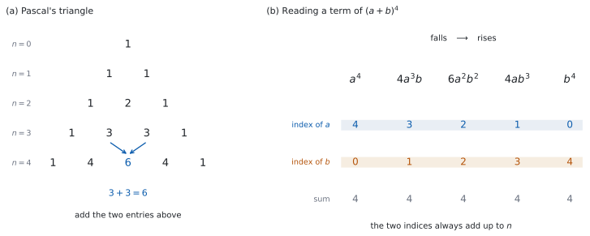

# SL 1.9 — The binomial theorem（二項定理） {#sec-aasl-1-9}

::: {.callout-note}
## What you should be able to do
- **Pascal's triangle**（パスカルの三角形）を作り、係数として使える。
- $^{n}\mathrm{C}_{r} = \dfrac{n!}{r!(n-r)!}$ を、電卓なしで計算できる。
- 公式集の二項定理を使って、$(a+b)^{n}$ を展開できる。
- 展開せずに、**特定の項の係数だけ**を取り出せる。
- $(2x-3)^{4}$ のように、$a$ や $b$ が**単項式でないとき**も扱える。
- $^{6}\mathrm{C}_{r} = 20$ のような問題を、値を並べて解ける。
:::

## The idea

### 1. 展開すると、何が起きるか {#idea}

$(a+b)^{2}$ と $(a+b)^{3}$ を、手で展開してみます。

$$
(a+b)^{2} = a^{2} + 2ab + b^{2}
$$

$$
(a+b)^{3} = a^{3} + 3a^{2}b + 3ab^{2} + b^{3}
$$

**$3$ つのことが起きています。**

- $a$ の指数は $n$ から $0$ へ、$1$ ずつ**下がります。**
- $b$ の指数は $0$ から $n$ へ、$1$ ずつ**上がります。**
- どの項でも、**$2$ つの指数の和は $n$** です。

残るのは**係数**だけです。$n = 2$ で $1, 2, 1$、$n = 3$ で $1, 3, 3, 1$ でした。**この係数に、規則があります。**

### 2. パスカルの三角形 {#pascal}

係数だけを、$n$ の小さいほうから並べます。

| $n$ | 係数 |
|:--|:--|
| $0$ | $1$ |
| $1$ | $1 \quad 1$ |
| $2$ | $1 \quad 2 \quad 1$ |
| $3$ | $1 \quad 3 \quad 3 \quad 1$ |
| $4$ | $1 \quad 4 \quad 6 \quad 4 \quad 1$ |

: Pascal's triangle（$n = 0$ から $4$ まで） {#tbl-aasl19-pascal}

{#fig-aasl19-idea width=100%}

**作り方は $1$ つだけです。**

> 両端は $1$。**それ以外は、すぐ上の $2$ つを足す。**

$n = 4$ の行の $6$ は、$n = 3$ の行の $3$ と $3$ を足したものです。$4$ は $1 + 3$ です。

**この先も、いくらでも作れます。** $n = 5$ の行を作るには、$n = 4$ の行から足していきます。

::: {.callout-tip}
## $n$ が小さければ、三角形のほうが速い
$n \leq 5$ くらいまでなら、三角形を書くほうが $^{n}\mathrm{C}_{r}$ を計算するより速いことが多いです。

**$n$ が大きいときや、$1$ つの項だけがほしいときは、$^{n}\mathrm{C}_{r}$ を使います**（[第 5 節](#one-term)）。
:::

### 3. $^{n}\mathrm{C}_{r}$ の式 {#ncr}

三角形を書かずに、係数を直接出す式があります。

$$
^{n}\mathrm{C}_{r} = \frac{n!}{r!\,(n-r)!}
$$ {#eq-aasl19-ncr}

::: {.callout-important}
## この式は公式集にあります
公式集の **1.9** の欄に、二項定理といっしょに印刷されています。

> $^{n}\mathrm{C}_{r} = \dfrac{n!}{r!(n-r)!}$

シラバスの Guidance 欄には、こう書かれています。

> $^{n}C_r$ should be found using **both** the formula and technology.

**式で出せることも、電卓で出せることも、どちらも求められています。**
:::

$n!$（**factorial**、階乗）は、$1$ から $n$ までを掛けたものです。

$$
5! = 5 \times 4 \times 3 \times 2 \times 1 = 120, \qquad 0! = 1
$$

$^{5}\mathrm{C}_{2}$ を出してみます。

$$
^{5}\mathrm{C}_{2} = \frac{5!}{2!\,3!} = \frac{120}{2 \times 6} = \frac{120}{12} = 10
$$

::: {.callout-tip}
## 約分してから計算する
$\dfrac{5!}{2!\,3!}$ は、$120$ を出さなくても計算できます。$5! = 5 \times 4 \times 3!$ なので、$3!$ が消えます。

$$
\frac{5 \times 4 \times 3!}{2! \times 3!} = \frac{5 \times 4}{2} = 10
$$

**$n$ が大きいときは、この形でないと計算が急に重くなります。** $^{10}\mathrm{C}_{3}$ なら $\dfrac{10 \times 9 \times 8}{3 \times 2 \times 1} = 120$ です。**上は $r$ 個だけ、下は $r!$** と覚えてください。
:::

### 4. 二項定理 {#theorem}

$$
(a+b)^{n} = a^{n} + {}^{n}\mathrm{C}_{1}\,a^{n-1}b + \cdots + {}^{n}\mathrm{C}_{r}\,a^{n-r}b^{r} + \cdots + b^{n}
$$ {#eq-aasl19-binomial}

::: {.callout-important}
## この式も公式集にあります
公式集の **1.9** の欄に、次の形で印刷されています。

> Binomial theorem $n \in \mathbb{N}$
>
> $(a+b)^{n} = a^{n} + {}^{n}\mathrm{C}_{1} a^{n-1}b + \ldots + {}^{n}\mathrm{C}_{r} a^{n-r}b^{r} + \ldots + b^{n}$

$n \in \mathbb{N}$ は、**$n$ が $0$ 以上の整数**という意味です。分数や負の数の $n$ は、SL では扱いません。

**日本の学校では「自然数」に $0$ を含めないのがふつうですが、IB の $\mathbb{N}$ は $0$ を含みます。** 記号の約束が違うだけなので、IB の答案では IB の約束に合わせてください。
:::

公式集では、はじめと終わりの項が $a^{n}$、$b^{n}$ と、**係数を書かずに**印刷されています。これは

$$
^{n}\mathrm{C}_{0} = \frac{n!}{0!\,n!} = 1, \qquad {}^{n}\mathrm{C}_{n} = \frac{n!}{n!\,0!} = 1
$$

だからです（$0! = 1$ を使います）。**$^{n}\mathrm{C}_{0}\,a^{n}$ と書いても、同じことです。**

[第 1 節](#idea) で見た $3$ つのことが、そのまま式になっています。

| 場所 | 中身 |
|:--|:--|
| 係数 | $^{n}\mathrm{C}_{r}$ |
| $a$ の指数 | $n - r$（下がる） |
| $b$ の指数 | $r$（上がる） |
| 指数の和 | $(n-r) + r = n$（いつも $n$） |

: 一般項 $^{n}\mathrm{C}_{r}\,a^{n-r}b^{r}$ の読み方 {#tbl-aasl19-term}

**$r$ は $0$ から始まります。** $r = 0$ の項が $a^{n}$、$r = n$ の項が $b^{n}$ です。

### 5. 特定の項だけを取り出す {#one-term}

$(x+1)^{20}$ の $x^{18}$ の係数を聞かれたとき、全部展開する必要はありません。**ほしい項だけを、@tbl-aasl19-term から作ります。**

手順は $2$ 段階です。

1. **$r$ を決める。** ほしい指数から、$n - r$ か $r$ のどちらかで方程式を立てます。
2. **その項だけを計算する。**

$(x+3)^{5}$ の $x^{2}$ の係数なら、$a = x$、$b = 3$、$n = 5$ です。$a$ の指数が $2$ なので、

$$
n - r = 2 \ \Rightarrow \ 5 - r = 2 \ \Rightarrow \ r = 3
$$

その項は

$$
^{5}\mathrm{C}_{3}\,x^{2}\,3^{3} = 10 \times 27 \times x^{2} = 270x^{2}
$$

**係数は $270$ です。**

冒頭の $(x+1)^{20}$ も同じです。$20 - r = 18$ から $r = 2$ で、係数は

$$
^{20}\mathrm{C}_{2} = \frac{20 \times 19}{2 \times 1} = 190
$$

**$20$ 乗を展開する必要は、まったくありません。**

::: {.callout-warning}
## 「項」と「係数」を区別する
`the term in` $x^{2}$ と聞かれたら $270x^{2}$、`the coefficient of` $x^{2}$ と聞かれたら $270$ です。

**$x^{2}$ を付けるかどうか**が違います。問題文を読み直してください。
:::

### 6. $a$ や $b$ に係数や符号が付いているとき {#substitution}

$(2x-3)^{4}$ のような形でも、やることは同じです。**$a = 2x$、$b = -3$ と見ます。**

$2x$ も $-3$ も、項が $1$ つだけの式（**monomial**、単項式）です。$x$ や $3$ とちがうのは、**係数と符号が付いている**ことだけです。

大事なのは、**かっこ**です。

$$
^{4}\mathrm{C}_{1}\,(2x)^{3}(-3)^{1} = 4 \times 8x^{3} \times (-3) = -96x^{3}
$$

$(2x)^{3} = 8x^{3}$ です。$2x^{3}$ ではありません（[SL 1.5 第 4 節](aasl-1-5.qmd#coefficients)）。

::: {.callout-warning}
## マイナスは $b$ に含めます
$(2x-3)^{4}$ は $(2x + (-3))^{4}$ です。$b = -3$ として、**$b$ の累乗の中にマイナスを入れます。**

$$
(-3)^{1} = -3, \quad (-3)^{2} = 9, \quad (-3)^{3} = -27, \quad (-3)^{4} = 81
$$

**$a$ と $b$ の符号が逆のときは、符号が $1$ つおきに変わります。** $(2x-3)^{4}$ がその形です。

**$a$ も $b$ も正なら、すべて $+$** になります。

**$a$ も $b$ も負なら、共通の $-1$ をくくり出します。** $(-2x-3)^{4} = (2x+3)^{4}$ なので、すべて $+$。$(-2x-3)^{3} = -(2x+3)^{3}$ なので、すべて $-$ です。**$n$ が偶数か奇数かで決まります。**

**まず $a$ と $b$ の符号を見てから、この見方を使ってください。**
:::

### 7. 値を並べて解く {#tabulate}

シラバスに、次の例が挙がっています。

> Example: Find $r$ when $^{6}C_r = 20$, using a table of values generated with technology.

やり方を、$n = 4$ で見ておきます。$^{4}\mathrm{C}_{r}$ を $r = 0$ から順に並べると、

$$
1, \quad 4, \quad 6, \quad 4, \quad 1
$$

@tbl-aasl19-pascal の $n = 4$ の行そのものです。たとえば $^{4}\mathrm{C}_{r} = 6$ になるのは $r = 2$ のときだけだと、**並びを見るだけで**分かります。

**シラバスの例は $n = 6$ ですが、やることは同じです**（演習 $8$ で扱います）。

**この並びは、左右対称です。** $^{4}\mathrm{C}_{1} = {}^{4}\mathrm{C}_{3} = 4$ です。一般に

$$
^{n}\mathrm{C}_{r} = {}^{n}\mathrm{C}_{n-r}
$$ {#eq-aasl19-symmetry}

ただし $n$ と $r$ は整数で、$0 \leq r \leq n$ のときの話です。

**計算を半分に減らせます。** $^{9}\mathrm{C}_{7}$ を出すなら、$^{9}\mathrm{C}_{2}$ を出すほうが楽です。

::: {.callout-tip collapse="true"}
## Paper 2 では、電卓で表が作れます
機種ごとの場所です。

| 機種 | 出し方 |
|:--|:--|
| TI-Nspire | `menu → Probability → Combinations` |
| Casio fx-CG50 | `OPTN → PROB → nCr` |
| TI-84 | `MATH → PRB → nCr` |

: $^{n}\mathrm{C}_{r}$ のキー {#tbl-aasl19-gdc}

どの機種でも、$^{6}\mathrm{C}_{3}$ は `6 nCr 3` の形で入力します。

表にするには、$r$ の列に $0, 1, 2, \ldots$ を入れ、隣の列で $^{6}\mathrm{C}_{r}$ を計算させます。**シラバスが言っている `a table of values` は、これです。**

**Paper 1 では使えません。** ですから、このページの例題と演習は、すべて手で出せる大きさにしてあります。
:::

## Why it works

**なぜ係数が $^{n}\mathrm{C}_{r}$ なのでしょうか。** 展開を、かっこの数え上げとして見ると分かります。

$(a+b)^{3}$ は、かっこが $3$ つあります。

$$
(a+b)(a+b)(a+b)
$$

展開するとは、**それぞれのかっこから $a$ か $b$ のどちらかを選んで掛け、すべての選び方を足す**ことです。

$ab^{2}$ という項ができるのは、**$3$ つのうち $2$ つのかっこから $b$ を選んだとき**です。その選び方は

$$
b\,b\,a, \qquad b\,a\,b, \qquad a\,b\,b
$$

の $3$ 通りあります。だから $ab^{2}$ の係数は $3$ です。

一般に、**$n$ 個のかっこから $b$ を取る $r$ 個を選ぶ選び方の数**が、そのまま係数になります。それが $^{n}\mathrm{C}_{r}$ です。シラバスが `Counting principles may be used in the development of the theorem` と書いているのは、この見方のことです。

**パスカルの三角形の作り方も、同じ見方で説明できます。** $n$ 個から $r$ 個を選ぶとき、**最後の $1$ 個を使うか使わないか**で分けます。

- 使うなら、残り $n-1$ 個から $r-1$ 個を選ぶ。
- 使わないなら、残り $n-1$ 個から $r$ 個を選ぶ。

この $2$ つを足したものが $^{n}\mathrm{C}_{r}$ です。**「すぐ上の $2$ つを足す」は、これを言っています。**

## Worked examples

::: {.callout-note appearance="simple"}
問題文は英語です。意味が理解できなかったら、問題文の下の「**日本語訳**」を開いてください。解説は日本語です。

**例題も演習も、すべて電卓なしで解けます。** Paper 1 のつもりで解いてください。
:::

::: {#exm-aasl19-expand}
[Expand $(x+2)^{4}$, giving your answer in ascending powers of $x$.]{.q-en}

日本語訳

$(x+2)^{4}$ を展開し、$x$ の次数の低いほうから順に書きなさい。

---

$n = 4$ の係数は $1, 4, 6, 4, 1$ です（@tbl-aasl19-pascal）。$a = x$、$b = 2$ です。

$b$ の累乗を、先に出しておきます。$2^{0} = 1$、$2^{1} = 2$、$2^{2} = 4$、$2^{3} = 8$、$2^{4} = 16$ です。

| $r$ | 係数 | $a^{4-r}$ | $b^{r}$ | 項 |
|:--|:--|:--|:--|:--|
| $0$ | $1$ | $x^{4}$ | $1$ | $x^{4}$ |
| $1$ | $4$ | $x^{3}$ | $2$ | $8x^{3}$ |
| $2$ | $6$ | $x^{2}$ | $4$ | $24x^{2}$ |
| $3$ | $4$ | $x$ | $8$ | $32x$ |
| $4$ | $1$ | $1$ | $16$ | $16$ |

: $1$ 項ずつ作る {#tbl-aasl19-ex1}

`ascending powers` なので、次数の低いほうから並べます。

$$
(x+2)^{4} = 16 + 32x + 24x^{2} + 8x^{3} + x^{4}
$$

**検算。** $x = 1$ を、もとの式と答えの式の両方に入れます。

もとの式は $(1+2)^{4} = 3^{4} = 81$ です。答えの式は

$$
16 + 32 + 24 + 8 + 1 = 81
$$

合いました ✓ **独立なのは、左側だけです。** $(1+2)^{4} = 81$ は、二項定理をまったく使わずに出しています。右側は係数の合計なので、**係数の値のまちがい**は見つかりますが、**並べる順序のまちがいは見つかりません。**

**順序は、$x = 0$ で見ます。** もとの式は $(0+2)^{4} = 16$ で、答えの式で $x$ を含まない項も $16$ です ✓ もし降べきの順に書いていたら、先頭が $x^{4}$ になり、`ascending` の指示に合いません。

**$x = -1$ でも見ます。** もとの式は $(-1+2)^{4} = 1$ です。答えの式は $16 - 32 + 24 - 8 + 1 = 1$ ✓

**$(x+2)^{4}$ を $x^{4} + 2^{4}$ としていたら**、$x = 1$ で $1 + 16 = 17$ となり、$81$ とはまるでちがいます。**累乗は、かっこの中の和には配れません。**

::: {.callout-note}
## 解答例（答案用紙に書くこと）

$$(x+2)^{4} = 16 + 32x + 24x^{2} + 8x^{3} + x^{4}$$
:::
:::

::: {#exm-aasl19-ncr}
**(a)** [Use the formula $^{n}\mathrm{C}_{r} = \dfrac{n!}{r!(n-r)!}$ to find the value of $^{7}\mathrm{C}_{3}$.]{.q-en}

**(b)** [Find the value of $^{7}\mathrm{C}_{4}$.]{.q-en}

**(c)** [Explain why $^{n}\mathrm{C}_{r} = {}^{n}\mathrm{C}_{n-r}$ for integers $n$ and $r$ with $0 \leq r \leq n$.]{.q-en}

日本語訳

**(a)** 公式 $^{n}\mathrm{C}_{r} = \dfrac{n!}{r!(n-r)!}$ を使って、$^{7}\mathrm{C}_{3}$ の値を求めなさい。

**(b)** $^{7}\mathrm{C}_{4}$ の値を求めなさい。

**(c)** $0 \leq r \leq n$ をみたす整数 $n$、$r$ について $^{n}\mathrm{C}_{r} = {}^{n}\mathrm{C}_{n-r}$ となる理由を説明しなさい。

---

**(a)** @eq-aasl19-ncr に $n = 7$、$r = 3$ を入れます。

$$
^{7}\mathrm{C}_{3} = \frac{7!}{3!\,4!} = \frac{7 \times 6 \times 5}{3 \times 2 \times 1} = \frac{210}{6} = 35
$$

$7! = 7 \times 6 \times 5 \times 4!$ なので、$4!$ が約分で消えます（[第 3 節](#ncr)）。

**(b)** @eq-aasl19-symmetry を使えば、**計算せずに**出ます。$7 - 4 = 3$ なので、

$$
^{7}\mathrm{C}_{4} = {}^{7}\mathrm{C}_{3} = 35
$$

**(c)** `Explain why` なので、英語で理由を書きます。

::: {.model-answer}
**試験ではこう書く**

*By the formula, $^{n}\mathrm{C}_{n-r} = \dfrac{n!}{(n-r)!\,\bigl(n-(n-r)\bigr)!} = \dfrac{n!}{(n-r)!\,r!}$, which is the same expression as $^{n}\mathrm{C}_{r} = \dfrac{n!}{r!\,(n-r)!}$, since $r!\,(n-r)! = (n-r)!\,r!$. There is also a counting reason: choosing which $r$ of the $n$ objects to take is the same as choosing which $n-r$ objects to leave, so the two counts must be equal.*
:::

（公式によれば $^{n}\mathrm{C}_{n-r} = \dfrac{n!}{(n-r)!\,r!}$ となり、$^{n}\mathrm{C}_{r}$ と同じ式である。掛ける順序を変えただけだからである。数え方でも説明できる。$n$ 個のうち取る $r$ 個を選ぶことと、残す $n-r$ 個を選ぶことは同じなので、通りの数は等しい、という意味です。）

**検算（(a) について）。** @eq-aasl19-symmetry より $^{7}\mathrm{C}_{3} = {}^{7}\mathrm{C}_{4}$ なので、$r = 4$ のほうを公式で出してみます。

$$
^{7}\mathrm{C}_{4} = \frac{7!}{4!\,3!} = \frac{7 \times 6 \times 5 \times 4}{4 \times 3 \times 2 \times 1} = \frac{840}{24} = 35
$$

割る数も掛ける数も **(a)** とは違いますが、同じ $35$ になりました ✓ **(a) の $\dfrac{210}{6}$ を計算し直したのではない**ところが大事です。

**$7 \times 6 \times 5 = 210$ で止めていたら**、$3!$ で割り忘れています。$^{n}\mathrm{C}_{r}$ は「並べ方」ではなく「選び方」なので、**同じ組を数え直した分を $r!$ で割る**必要があります。

::: {.callout-note}
## 解答例（答案用紙に書くこと）
**(a)**
$$^{7}\mathrm{C}_{3} = \frac{7!}{3!\,4!} = \frac{7 \times 6 \times 5}{3 \times 2 \times 1} = 35$$

**(b)**
$$^{7}\mathrm{C}_{4} = {}^{7}\mathrm{C}_{3} = 35$$

**(c)** *Replacing $r$ by $n-r$ in the formula gives $^{n}\mathrm{C}_{n-r} = \dfrac{n!}{(n-r)!\,\bigl(n-(n-r)\bigr)!} = \dfrac{n!}{(n-r)!\,r!} = {}^{n}\mathrm{C}_{r}$. Choosing which $r$ objects to take is the same as choosing which $n-r$ objects to leave.*
:::
:::

::: {#exm-aasl19-brackets}
[Expand $(2x-3)^{3}$.]{.q-en}

日本語訳

$(2x-3)^{3}$ を展開しなさい。

---

$a = 2x$、$b = -3$、$n = 3$ です（[第 6 節](#substitution)）。係数は $1, 3, 3, 1$ です。

$$
(2x)^{3} = 8x^{3}, \qquad (2x)^{2} = 4x^{2}, \qquad (2x)^{1} = 2x
$$

$$
(-3)^{1} = -3, \qquad (-3)^{2} = 9, \qquad (-3)^{3} = -27
$$

$1$ 項ずつ作ります。

$$
1 \times 8x^{3} = 8x^{3}
$$

$$
3 \times 4x^{2} \times (-3) = -36x^{2}
$$

$$
3 \times 2x \times 9 = 54x
$$

$$
1 \times (-27) = -27
$$

$$
(2x-3)^{3} = 8x^{3} - 36x^{2} + 54x - 27
$$

**検算。** $x = 1$ を、もとの式と答えの式に入れます。

もとの式は $(2-3)^{3} = (-1)^{3} = -1$ です。答えの式は

$$
8 - 36 + 54 - 27 = -1
$$

合いました ✓

**$x = 0$ でも見ます。** 定数項は $b^{n}$ そのものなので、**値が合っているかの確認にはなりません。** 確認できるのは、**定数項が正しい位置にあるか**です。もとの式は $(-3)^{3} = -27$、答えの式で $x$ を含まない項も $-27$ ✓

**符号の並びも見ます。** $a = 2x$ が正、$b = -3$ が負なので、$+, -, +, -$ と交互になるはずです（[第 6 節](#substitution)）。同じ符号が続いていたら、そこを疑ってください。

**$(2x)^{2}$ を $2x^{2}$ としていたら**、$x^{2}$ の項は $-18x^{2}$ です。$x = 1$ で $8 - 18 + 54 - 27 = 17$ となり、$-1$ と合いません。

::: {.callout-note}
## 解答例（答案用紙に書くこと）

$$(2x-3)^{3} = (2x)^{3} + 3(2x)^{2}(-3) + 3(2x)(-3)^{2} + (-3)^{3}$$

$$= 8x^{3} - 36x^{2} + 54x - 27$$
:::
:::

::: {#exm-aasl19-coefficient}
**(a)** [Find the coefficient of $x^{3}$ in the expansion of $(x+3)^{6}$.]{.q-en}

**(b)** [Find the coefficient of $x^{2}$ in the expansion of $(2x-1)^{5}$.]{.q-en}

**(c)** [Explain why your answer to part **(b)** is negative.]{.q-en}

日本語訳

**(a)** $(x+3)^{6}$ を展開したときの $x^{3}$ の係数を求めなさい。

**(b)** $(2x-1)^{5}$ を展開したときの $x^{2}$ の係数を求めなさい。

**(c)** **(b)** の答えが負である理由を説明しなさい。

---

**(a)** $a = x$、$b = 3$、$n = 6$ です。$a$ の指数がほしい $3$ なので（[第 5 節](#one-term)）、

$$
6 - r = 3 \ \Rightarrow \ r = 3
$$

その項は

$$
^{6}\mathrm{C}_{3} = \frac{6 \times 5 \times 4}{3 \times 2 \times 1} = 20
$$

$$
^{6}\mathrm{C}_{3}\,x^{3}\,3^{3} = 20 \times 27 \times x^{3} = 540x^{3}
$$

**係数は $540$ です。**

**(b)** $a = 2x$、$b = -1$、$n = 5$ です。$x^{2}$ がほしいので、

$$
5 - r = 2 \ \Rightarrow \ r = 3
$$

その項は

$$
^{5}\mathrm{C}_{3}\,(2x)^{2}(-1)^{3} = 10 \times 4x^{2} \times (-1) = -40x^{2}
$$

**係数は $-40$ です。**

**(c)** `Explain why` なので、英語で理由を書きます。

::: {.model-answer}
**試験ではこう書く**

*The term in $x^{2}$ comes from $r = 3$, so it contains the factor $(-1)^{3}$. Since $3$ is odd, $(-1)^{3} = -1$, while the other factors of the coefficient, $^{5}\mathrm{C}_{3} = 10$ and $2^{2} = 4$, are both positive. The coefficient is therefore $10 \times 4 \times (-1) = -40$, which is negative. In general the terms of $(2x-1)^{5}$ alternate in sign, and the ones with an odd value of $r$ are the negative ones.*
:::

（$x^2$ の項は $r = 3$ から出るので、因数 $(-1)^3$ を含む。$3$ は奇数なので $(-1)^3 = -1$ であり、ほかの因数 $^{5}\mathrm{C}_{3} = 10$ と $(2x)^2 = 4x^2$ はどちらも正である。したがって積は負になり、$-40x^2$ となる。一般に $(2x-1)^5$ の項は符号が交互で、$r$ が奇数のものが負になる、という意味です。）

**検算（(a) について）。** $^{6}\mathrm{C}_{3}$ を、パスカルの作り方でも出します。$^{5}\mathrm{C}_{2} = 10$ で（[第 3 節](#ncr)）、@eq-aasl19-symmetry より $^{5}\mathrm{C}_{3} = {}^{5}\mathrm{C}_{2} = 10$ なので、

$$
^{6}\mathrm{C}_{3} = {}^{5}\mathrm{C}_{2} + {}^{5}\mathrm{C}_{3} = 10 + 10 = 20
$$

割り算をまったく使わずに、同じ $20$ になりました ✓

**検算（(b) について）。** $x = 1$ で全体を見ます。もとの式は $(2-1)^{5} = 1$ です。全部展開すると

$$
32x^{5} - 80x^{4} + 80x^{3} - 40x^{2} + 10x - 1
$$

で、$32 - 80 + 80 - 40 + 10 - 1 = 1$ ✓ $x^{2}$ の係数は $-40$ で、合っています。

**指数の和 $3 + 3 = 6$ は、検算にはなりません。** 一般項が $a^{n-r}b^{r}$ の形をしている以上、和はいつも $n$ になるからです。

**効くのは、どちらが $a$ の指数かの確認です。** **(a)** では $r = 3$ を $b$ の指数と取りちがえても、$a$ の指数も $3$ なので**たまたま同じ答え**になります。**(b)** ではそうなりません。$r = 3$ のとき $a$ の指数は $2$ です。**$2$ つが違う問題で確かめるのが要です。**

::: {.callout-note}
## 解答例（答案用紙に書くこと）
**(a)** $6 - r = 3$, so $r = 3$
$$^{6}\mathrm{C}_{3} = \frac{6 \times 5 \times 4}{3 \times 2 \times 1} = 20$$
$$^{6}\mathrm{C}_{3}\,x^{3}\,3^{3} = 20 \times 27 x^{3} = 540x^{3}$$
*The coefficient is $540$.*

**(b)** $5 - r = 2$, so $r = 3$
$$^{5}\mathrm{C}_{3}\,(2x)^{2}(-1)^{3} = 10 \times 4x^{2} \times (-1) = -40x^{2}$$
*The coefficient is $-40$.*

**(c)** *The term has the factor $(-1)^{3} = -1$, while $^{5}\mathrm{C}_{3} = 10$ and $2^{2} = 4$ are positive, so the coefficient is negative.*
:::
:::

## Common errors

::: {.callout-warning}
## $(x+2)^{4}$ を $x^{4} + 2^{4}$ にする
累乗は、**かっこの中の和には配れません**（[SL 1.5 第 2 節](aasl-1-5.qmd#laws)）。配れるのは、積と商のときだけです。

$x = 1$ を入れれば、すぐ分かります。$(1+2)^{4} = 81$ で、$1 + 16 = 17$ ではありません。
:::

::: {.callout-warning}
## $(2x)^{3}$ を $2x^{3}$ にする
かっこの中の全部が $3$ 乗されます。$(2x)^{3} = 8x^{3}$ です（[第 6 節](#substitution)）。

**$a$ が単項式でないときは、必ずかっこを書いてから**累乗してください。
:::

::: {.callout-warning}
## マイナスを $b$ に入れ忘れる
$(2x-3)^{4}$ では $b = -3$ です。$b = 3$ として計算すると、**符号がすべて $+$** になります。

**$a$ が正で $b$ が負のとき**は、展開の結果で $+$ と $-$ が交互に並びます。並んでいなければ、マイナスを落としています。

**$a$ も $b$ も正のときは、すべて $+$ です。** 交互でないからといって、まちがいとはかぎりません。
:::

::: {.callout-warning}
## $r$ と、$a$ の指数を取りちがえる
一般項は $^{n}\mathrm{C}_{r}\,a^{n-r}b^{r}$ です。**$r$ は $b$ の指数**で、$a$ の指数は $n - r$ です（@tbl-aasl19-term）。

$x^{k}$ の係数がほしいとき、$a = x$ なら $n - r = k$ です。$r = k$ ではありません。

**$2$ つの指数を足して $n$ になるか**を、必ず確かめてください。
:::

::: {.callout-warning}
## `ascending powers` を、降べきの順で答える
`ascending powers of` $x$ は、**定数項から書き始めて、次数を上げていく**という意味です。$(x+2)^{4}$ なら $16 + 32x + 24x^{2} + 8x^{3} + x^{4}$ で、$x^{4} + 8x^{3} + \cdots$ ではありません。

**$x = 1$ を入れる検算では見つかりません。** 順序を逆にしても、係数の合計は変わらないからです。

**$x = 0$ を入れて、定数項が正しい位置にあるか**を見てください。
:::

::: {.callout-warning}
## 「項」と「係数」を取りちがえる
`the term in` $x^{2}$ は $270x^{2}$、`the coefficient of` $x^{2}$ は $270$ です（[第 5 節](#one-term)）。

**問題文の英語で決まります。** 迷ったら、両方書くのではなく、聞かれたほうだけを書いてください。

**符号も係数の一部です。** $-40x^{2}$ の係数は $-40$ であって、$40$ ではありません。
:::

## Exercises

::: {.callout-note appearance="simple"}
各問題に、折りたたみが $3$ つ付いています。**日本語訳**、**解答例**（答案用紙に書くべきこと。英語です）、**解説**（なぜそうなるか。日本語です）。

まず自分で解いて、次に解答例と見くらべてください。**解説は、合わなかったときだけ開けば十分です。**
:::

::: {.exercise-block}

[1]{.ex-no} **(a)** [Write down the numbers in the row of Pascal's triangle for $n = 5$.]{.q-en}

**(b)** [Hence expand $(x+1)^{5}$.]{.q-en}

日本語訳

**(a)** パスカルの三角形の $n = 5$ の行の数を書きなさい。

**(b)** それを使って $(x+1)^{5}$ を展開しなさい。

::: {.callout-note collapse="true"}
## 解答例（答案用紙に書くこと）

**(a)** $1, \ 5, \ 10, \ 10, \ 5, \ 1$

**(b)**
$$(x+1)^{5} = x^{5} + 5x^{4} + 10x^{3} + 10x^{2} + 5x + 1$$
:::

::: {.callout-tip collapse="true"}
## 解説

**(a)** $n = 4$ の行 $1, 4, 6, 4, 1$ から作ります（@tbl-aasl19-pascal）。両端は $1$、それ以外はすぐ上の $2$ つを足します。$1+4 = 5$、$4+6 = 10$、$6+4 = 10$、$4+1 = 5$ です。

**(b)** $b = 1$ なので、$b$ の累乗はすべて $1$ です。**係数がそのまま項の係数になります。**

**検算。** $x = 1$ を入れます。もとの式は $2^{5} = 32$ です。答えの式は $1+5+10+10+5+1 = 32$ ✓

**行の合計が $2^{n}$ になる**のは、偶然ではありません（演習 $9$ で扱います）。

**$1, 5, 10, 5, 1$ と $1$ つ足りなければ**、行の数が $n+1$ 個になっていません。**$n = 5$ の行には、数が $6$ 個あります。**
:::

::: {.ex-sep}
:::

[2]{.ex-no} [Find the value of each of the following.]{.q-en}

**(a)** [$^{8}\mathrm{C}_{2}$]{.q-en}

**(b)** [$^{8}\mathrm{C}_{6}$]{.q-en}

日本語訳

次の値を求めなさい。

**(a)** $^{8}\mathrm{C}_{2}$

**(b)** $^{8}\mathrm{C}_{6}$

::: {.callout-note collapse="true"}
## 解答例（答案用紙に書くこと）

**(a)**
$$^{8}\mathrm{C}_{2} = \frac{8!}{2!\,6!} = \frac{8 \times 7}{2 \times 1} = 28$$

**(b)**
$$^{8}\mathrm{C}_{6} = {}^{8}\mathrm{C}_{2} = 28$$
:::

::: {.callout-tip collapse="true"}
## 解説

**(a)** $8! = 8 \times 7 \times 6!$ なので、$6!$ が約分で消えます（[第 3 節](#ncr)）。

**(b)** $8 - 6 = 2$ なので、@eq-aasl19-symmetry がそのまま使えます。**計算し直す必要はありません。**

**検算。** 数え方で出します。$^{8}\mathrm{C}_{2}$ は、$8$ 個から $2$ 個を選ぶ選び方の数です。**小さいほうの番号で分けて**数えます。$1$ 番と組む相手は $7$ 通り、$2$ 番と組む相手は（$1$ 番を除いて）$6$ 通り、… と続けて

$$
7 + 6 + 5 + 4 + 3 + 2 + 1 = 28
$$

割り算を一度も使わずに $28$ になりました ✓

**(b) の $\dfrac{8!}{6!\,2!}$ を計算し直しても、検算にはなりません。** 約分すると **(a)** とまったく同じ $\dfrac{8 \times 7}{2}$ になるからです。**同じ計算を書き直すのは、検算ではありません。**

**$8 \times 7 = 56$ で止めていたら**、$2!$ で割り忘れています。$^{n}\mathrm{C}_{r}$ は「並べ方」ではなく「選び方」なので、**同じ組を数え直した分を $r!$ で割る**必要があります。
:::

::: {.ex-sep}
:::

[3]{.ex-no} [Expand $(x-2)^{4}$.]{.q-en}

日本語訳

$(x-2)^{4}$ を展開しなさい。

::: {.callout-note collapse="true"}
## 解答例（答案用紙に書くこと）

$$(x-2)^{4} = x^{4} + 4x^{3}(-2) + 6x^{2}(-2)^{2} + 4x(-2)^{3} + (-2)^{4}$$

$$= x^{4} - 8x^{3} + 24x^{2} - 32x + 16$$
:::

::: {.callout-tip collapse="true"}
## 解説

$b = -2$ です（[第 6 節](#substitution)）。$(-2)^{1} = -2$、$(-2)^{2} = 4$、$(-2)^{3} = -8$、$(-2)^{4} = 16$ です。

**検算。** $x = 1$ を入れます。もとの式は $(1-2)^{4} = (-1)^{4} = 1$ です。答えの式は

$$
1 - 8 + 24 - 32 + 16 = 1
$$

合いました ✓

**$x = 0$ でも見ます。** 定数項は $b^{4}$ そのものなので、**値の確認にはなりません。** 確認できるのは**位置**です。もとの式は $(-2)^{4} = 16$、答えの式で $x$ を含まない項も $16$ ✓

**符号の並びも見ます。** $a = x$ が正、$b = -2$ が負なので、$+, -, +, -, +$ と交互になるはずです ✓

**$b = 2$ としていたら**、すべて $+$ になります。$x = 1$ で $1 + 8 + 24 + 32 + 16 = 81$ となり、$1$ と合いません。
:::

::: {.ex-sep}
:::

[4]{.ex-no} [Expand $(3x+1)^{3}$.]{.q-en}

日本語訳

$(3x+1)^{3}$ を展開しなさい。

::: {.callout-note collapse="true"}
## 解答例（答案用紙に書くこと）

$$(3x+1)^{3} = (3x)^{3} + 3(3x)^{2} + 3(3x) + 1$$

$$= 27x^{3} + 27x^{2} + 9x + 1$$
:::

::: {.callout-tip collapse="true"}
## 解説

$a = 3x$、$b = 1$ です。$b$ の累乗はすべて $1$ なので、書かなくてすみます。

$(3x)^{3} = 27x^{3}$、$(3x)^{2} = 9x^{2}$ です。**かっこを忘れないでください**（[第 6 節](#substitution)）。

**検算。** $x = 1$ を入れます。もとの式は $4^{3} = 64$ です。答えの式は $27 + 27 + 9 + 1 = 64$ ✓

**$x^{3}$ と $x^{2}$ の係数が、どちらも $27$ になります。** $1 \times 3^{3}$ と $3 \times 3^{2}$ が、たまたま同じ値になっただけです。**「同じ数が並んだから計算ミスだ」とは思わないでください。**

**$(3x)^{2}$ を $3x^{2}$ としていたら**、$x^{2}$ の項は $9x^{2}$ です。$x = 1$ で $27 + 9 + 9 + 1 = 46$ となり、$64$ と合いません。
:::

::: {.ex-sep}
:::

[5]{.ex-no} [Expand $(1+2x)^{5}$, giving your answer in ascending powers of $x$.]{.q-en}

日本語訳

$(1+2x)^{5}$ を展開し、$x$ の次数の低いほうから順に書きなさい。

::: {.callout-note collapse="true"}
## 解答例（答案用紙に書くこと）

$$(1+2x)^{5} = 1 + 5(2x) + 10(2x)^{2} + 10(2x)^{3} + 5(2x)^{4} + (2x)^{5}$$

$$= 1 + 10x + 40x^{2} + 80x^{3} + 80x^{4} + 32x^{5}$$
:::

::: {.callout-tip collapse="true"}
## 解説

$a = 1$、$b = 2x$ です。**今度は $b$ のほうが文字**ですが、やることは同じです。係数は演習 $1$ で作った $1, 5, 10, 10, 5, 1$ です。

$a$ の累乗がすべて $1$ なので、$b$ の累乗だけを計算します。$(2x)^{2} = 4x^{2}$、$(2x)^{3} = 8x^{3}$、$(2x)^{4} = 16x^{4}$、$(2x)^{5} = 32x^{5}$ です。

$r$ が $b$ の指数なので、**この形では次数の低いほうから自然に並びます。**

**検算。** $x = 1$ を入れます。もとの式は $3^{5} = 243$ です。答えの式は

$$
1 + 10 + 40 + 80 + 80 + 32 = 243
$$

合いました ✓

**$x = -\dfrac{1}{2}$ でも見ます。** もとの式は $(1-1)^{5} = 0$ です。答えの式は

$$
1 - 5 + 10 - 10 + 5 - 1 = 0
$$

合いました ✓ **$0$ になる値を選ぶと、符号の落としがあれば $0$ にならないので、すぐ気づけます。**（$2$ 点で合っても証明ではありませんが、実用上は十分です。）
:::

::: {.ex-sep}
:::

[6]{.ex-no} [Find the coefficient of $x^{4}$ in the expansion of $(x+2)^{7}$.]{.q-en}

日本語訳

$(x+2)^{7}$ を展開したときの $x^{4}$ の係数を求めなさい。

::: {.callout-note collapse="true"}
## 解答例（答案用紙に書くこと）

$7 - r = 4$, so $r = 3$

$$^{7}\mathrm{C}_{3}\,x^{4}\,2^{3} = 35 \times 8 \times x^{4} = 280x^{4}$$

*The coefficient is $280$.*
:::

::: {.callout-tip collapse="true"}
## 解説

展開せずに、ほしい項だけを作ります（[第 5 節](#one-term)）。

$a = x$ なので、**$a$ の指数がほしい $4$** です。$7 - r = 4$ から $r = 3$ です。

**指数の和 $4 + 3 = 7$ は、検算にはなりません。** 一般項が $a^{n-r}b^{r}$ の形をしている以上、和はいつも $n$ だからです（@tbl-aasl19-term）。**効くのは、どちらが $a$ の指数かの確認です。**

**検算。** $^{7}\mathrm{C}_{3}$ を、$r$ を $1$ ずつ増やす道すじで出します。$^{7}\mathrm{C}_{1} = 7$ から始めて、

$$
^{7}\mathrm{C}_{2} = 7 \times \frac{6}{2} = 21, \qquad {}^{7}\mathrm{C}_{3} = 21 \times \frac{5}{3} = 35
$$

同じ $35$ です ✓ **階乗を書かない別の道すじです。**

**$r = 4$ としていたら**、項は $^{7}\mathrm{C}_{4}x^{3}2^{4} = 35 \times 16 x^{3} = 560x^{3}$ です。$x^{3}$ の項であって、$x^{4}$ ではありません。**指数の和は $7$ で合ってしまう**ので、**どちらが $a$ の指数か**を必ず確かめてください。
:::

::: {.ex-sep}
:::

[7]{.ex-no} [Find the term in $x^{2}$ in the expansion of $(2x-1)^{4}$.]{.q-en}

日本語訳

$(2x-1)^{4}$ を展開したときの $x^{2}$ の項を求めなさい。

::: {.callout-note collapse="true"}
## 解答例（答案用紙に書くこと）

$4 - r = 2$, so $r = 2$

$$^{4}\mathrm{C}_{2}\,(2x)^{2}(-1)^{2} = 6 \times 4x^{2} \times 1 = 24x^{2}$$
:::

::: {.callout-tip collapse="true"}
## 解説

`the term in` $x^{2}$ なので、**$x^{2}$ を付けて答えます**（[第 5 節](#one-term)）。$24$ だけでは、聞かれたものと違います。

$a = 2x$ なので、$(2x)^{2} = 4x^{2}$ です。**かっこを忘れないでください。**

$(-1)^{2} = 1$ なので、この項は正です。

**検算。** $(2x-1)^{4}$ を全部展開します。係数は $1, 4, 6, 4, 1$ で、

$$
16x^{4} - 32x^{3} + 24x^{2} - 8x + 1
$$

**$x^{2}$ の項だけを見くらべても、検算にはなりません。** 同じ $6 \times (2x)^{2} \times (-1)^{2}$ をもう一度書くだけだからです。

**効くのは $x = 1$ の代入です。** もとの式は $(2-1)^{4} = 1$、展開した式は $16 - 32 + 24 - 8 + 1 = 1$ ✓

**$(2x)^{2}$ を $2x^{2}$ としていたら**、$x^{2}$ の項は $12x^{2}$ になります。$x = 1$ で $16 - 32 + 12 - 8 + 1 = -11$ となり、$1$ と合いません。**そこで気づけます。**
:::

::: {.ex-sep}
:::

[8]{.ex-no} **(a)** [Write down the values of $^{6}\mathrm{C}_{r}$ for $r = 0, 1, 2, 3, 4, 5, 6$.]{.q-en}

**(b)** [Hence find the value of $r$ for which $^{6}\mathrm{C}_{r} = 20$.]{.q-en}

日本語訳

**(a)** $r = 0, 1, 2, 3, 4, 5, 6$ について $^{6}\mathrm{C}_{r}$ の値を書きなさい。

**(b)** それを使って、$^{6}\mathrm{C}_{r} = 20$ となる $r$ の値を求めなさい。

::: {.callout-note collapse="true"}
## 解答例（答案用紙に書くこと）

**(a)** $1, \ 6, \ 15, \ 20, \ 15, \ 6, \ 1$

**(b)** $r = 3$
:::

::: {.callout-tip collapse="true"}
## 解説

**(a)** パスカルの三角形の $n = 6$ の行です。$n = 5$ の行から作れます。

**(b)** 並びの中に $20$ は $1$ つだけなので、$r = 3$ に決まります。

**検算。** $^{6}\mathrm{C}_{3}$ を、公式でも出します。

$$
\frac{6 \times 5 \times 4}{3 \times 2 \times 1} = \frac{120}{6} = 20
$$

合いました ✓

**左右対称なのは正しい形ですが、これだけでは検算になりません。** まん中の数がずれていても、対称のままだからです（@eq-aasl19-symmetry）。

**効くのは、行の合計です。** $1+6+15+20+15+6+1 = 64 = 2^{6}$ ✓（演習 $9$）**公式と行の合計、$2$ つの独立な見方で確かめられました。**
:::

::: {.ex-sep}
:::

[9]{.ex-no} [Explain why the numbers in the row of Pascal's triangle that gives the coefficients of $(a+b)^{n}$ add up to $2^{n}$.]{.q-en}

日本語訳

$(a+b)^{n}$ の係数を与える、パスカルの三角形の行について、その数の合計が $2^{n}$ になる理由を説明しなさい。

::: {.callout-note collapse="true"}
## 解答例（答案用紙に書くこと）

*Substituting $a = 1$ and $b = 1$ into the binomial theorem gives*
$$(1+1)^{n} = {}^{n}\mathrm{C}_{0} + {}^{n}\mathrm{C}_{1} + \cdots + {}^{n}\mathrm{C}_{n}$$
*Every power of $1$ is $1$, so the right-hand side is exactly the sum of the row, and the left-hand side is $2^{n}$.*
:::

::: {.callout-tip collapse="true"}
## 解説

`Explain why` なので、**どこに何を代入したか**をはっきり書きます。

$a = 1$、$b = 1$ を @eq-aasl19-binomial に入れると、$a^{n-r}b^{r} = 1$ となって係数だけが残ります。

**検算。** 小さい $n$ で確かめます。

$n = 3$ なら $1+3+3+1 = 8 = 2^{3}$ ✓ $n = 4$ なら $1+4+6+4+1 = 16 = 2^{4}$ ✓

**数え方でも説明できます。** $n$ 個のかっこから、それぞれ $a$ か $b$ を選ぶ選び方は全部で $2^{n}$ 通りです（[Why it works](#why-it-works)）。それを「$b$ を何個選んだか」で分けて数えたのが、この行の数です。**同じものを $2$ 通りに数えているので、合計が一致します。**

::: {.model-answer}
**試験ではこう書く**

*The binomial theorem states that $(a+b)^{n} = {}^{n}\mathrm{C}_{0}a^{n} + {}^{n}\mathrm{C}_{1}a^{n-1}b + \cdots + {}^{n}\mathrm{C}_{n}b^{n}$, and the numbers in the row of Pascal's triangle are exactly the coefficients $^{n}\mathrm{C}_{0}, {}^{n}\mathrm{C}_{1}, \ldots, {}^{n}\mathrm{C}_{n}$. Substituting $a = 1$ and $b = 1$ makes every factor $a^{n-r}b^{r}$ equal to $1$, so the right-hand side becomes the sum of the row, while the left-hand side becomes $(1+1)^{n} = 2^{n}$. Hence the row sums to $2^{n}$. For example, the row for $n = 4$ is $1, 4, 6, 4, 1$, and $1+4+6+4+1 = 16 = 2^{4}$.*
:::
:::

::: {.ex-sep}
:::

[10]{.ex-no} [A student expands $(x-3)^{4}$ and writes the following.]{.q-en}

$$
x^{4} + 12x^{3} + 54x^{2} + 108x + 81
$$

[Identify the error in the student's work, and write down the correct expansion.]{.q-en}

日本語訳

ある生徒が $(x-3)^{4}$ を展開するように言われ、上のように書きました。

生徒の誤りを指摘し、正しい展開を書きなさい。

::: {.callout-note collapse="true"}
## 解答例（答案用紙に書くこと）

*The student used $b = 3$ instead of $b = -3$, so all the signs are positive.*

$$(x-3)^{4} = x^{4} - 12x^{3} + 54x^{2} - 108x + 81$$
:::

::: {.callout-tip collapse="true"}
## 解説

`Identify the error` なので、**どこが違うのかを名指し**してから、正しい答えを書きます。

$b = -3$ です（[第 6 節](#substitution)）。$(-3)^{1} = -3$、$(-3)^{2} = 9$、$(-3)^{3} = -27$、$(-3)^{4} = 81$ なので、**符号が交互**になります。

**係数の大きさは、生徒のものと同じ**です。変わるのは符号だけです。

**検算。** $x = 1$ を入れます。もとの式は $(1-3)^{4} = (-2)^{4} = 16$ です。

正しい展開は $1 - 12 + 54 - 108 + 81 = 16$ ✓

生徒の答えは $1 + 12 + 54 + 108 + 81 = 256$ で、$16$ とはまるでちがいます ✓ **$x = 1$ を入れるだけで、符号の落としが見つかります。**

::: {.model-answer}
**試験ではこう書く**

*The student treated the second term as $b = 3$ rather than $b = -3$, so every term came out positive. With $b = -3$ the odd powers of $b$ are negative, so the signs alternate. The correct expansion is $(x-3)^{4} = x^{4} - 12x^{3} + 54x^{2} - 108x + 81$. Substituting $x = 1$ confirms this: the original expression gives $(-2)^{4} = 16$, the correct expansion gives $1 - 12 + 54 - 108 + 81 = 16$, and the student's answer gives $256$.*
:::
:::

:::
