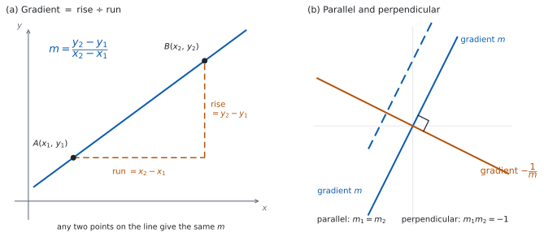

# SL 2.1 — Different forms of the equation of a straight line（直線の方程式） {#sec-aasl-2-1}

::: {.callout-note}
## What you should be able to do
- **gradient**（傾き）を、公式集の $m = \dfrac{y_{2}-y_{1}}{x_{2}-x_{1}}$ で $2$ 点から求められる。
- 直線の**$3$ つの形**（$y = mx+c$、$ax+by+d=0$、$y-y_{1} = m(x-x_{1})$）を使い分けられる。
- $3$ つの形を、**行き来できる**。
- **intercepts**（切片）を求められる。
- **parallel**（平行）$m_{1} = m_{2}$ と **perpendicular**（垂直）$m_{1} \times m_{2} = -1$ を使える。
- 道路や橋の**勾配**を、傾きとして扱える。
:::

## The idea

### 1. 直線は、傾きと $1$ 点で決まる {#idea}

紙の上に直線を $1$ 本引くには、何が分かればよいでしょうか。

**$2$ 点**が分かれば引けます。でも、それだけではありません。

**傾きと、通る点が $1$ つ**でも引けます。傾きが「どちらへどれだけ進むか」を決め、点が「どこを通るか」を決めるからです。

$$
\text{直線} \ = \ \text{傾き} \ + \ \text{通る点 } 1 \text{ つ}
$$

**直線の式が $3$ つの形を持つのは、この $2$ つをどう書くかの違い**です（[第 3 節](#forms)）。

### 2. gradient（傾き）を、$2$ 点から出す {#gradient}

$$
m = \frac{y_{2}-y_{1}}{x_{2}-x_{1}}
$$ {#eq-aasl21-gradient}

::: {.callout-important}
## この式は公式集にあります
公式集の **2.1** の欄に `Gradient formula` として印刷されています。

> $m = \dfrac{y_{2}-y_{1}}{x_{2}-x_{1}}$
:::

**上が縦の変化、下が横の変化**です。英語では **rise over run**（上がり ÷ 進み）と言います。

{#fig-aasl21-idea width=100%}

@fig-aasl21-idea の (a) が、その様子です。**直線上のどの $2$ 点で測っても、$m$ は同じ値**になります。(b) は[第 6 節](#parallel-perp)で使います。

::: {.callout-warning}
## 上と下で、点の順番をそろえてください
$A(1,5)$ と $B(4,14)$ なら、

$$
m = \frac{14-5}{4-1} = 3 \qquad \text{または} \qquad m = \frac{5-14}{1-4} = \frac{-9}{-3} = 3
$$

**どちらの順でも同じ値**になります。いけないのは、**上と下で、先に書く点を変えてしまう**ことです。次の式は、上を $A$ から（$5-14$）、下を $B$ から（$4-1$）取っているので、符号が逆になります。

$$
\frac{5 - 14}{4 - 1} = -3 \quad (\text{符号が逆になります})
$$

**上と下で、同じ点を先に書く。** これだけで防げます。
:::

**直線上の異なる $2$ 点をとっても $x_{1} = x_{2}$ になってしまうときは、分母が $0$ です。** このとき直線は縦向きで、傾きは**定義されません**（[第 6 節](#parallel-perp)、演習 $9$）。

### 3. $3$ つの形 {#forms}

$$
y = mx + c
$$ {#eq-aasl21-slope}

$$
ax + by + d = 0
$$ {#eq-aasl21-general}

$$
y - y_{1} = m(x - x_{1})
$$ {#eq-aasl21-point}

::: {.callout-important}
## この $3$ つは公式集にあります
公式集の **2.1** の欄に `Equations of a straight line` として、まとめて印刷されています。

> $y = mx + c$ ; $ax + by + d = 0$ ; $y - y_{1} = m\left(x - x_{1}\right)$

シラバスの Guidance 欄には、名前も書かれています。

> $y = mx + c$ (gradient-intercept form).
>
> $ax + by + d = 0$ (general form).
>
> $y - y_1 = m(x - x_1)$ (point-gradient form).
:::

| 形 | 英語名 | すぐ読み取れるもの | 使うとき |
|:--|:--|:--|:--|
| $y = mx + c$ | gradient-intercept form | 傾き $m$、$y$ 切片 $c$ | グラフをかく、傾きを比べる |
| $ax + by + d = 0$ | general form | — | 答えを整数の係数でそろえる |
| $y - y_{1} = m(x-x_{1})$ | point-gradient form | 傾き $m$、通る点 $(x_{1}, y_{1})$ | **式を組み立てる** |

: $3$ つの形の使い分け {#tbl-aasl21-forms}

**傾きと、$y$ 切片でない点が分かっているときは、point-gradient form から**組み立てます。傾きと点が $1$ つあれば、そのまま書けるからです。$y$ 切片そのものが分かっているときは、$y = mx + c$ に直接入れるほうが速くなります。

### 4. $3$ つの形を行き来する {#convert}

$(2,-3)$ を通り、傾き $-\dfrac{1}{2}$ の直線で見ます。

**point-gradient form。** $x_{1} = 2$、$y_{1} = -3$、$m = -\dfrac{1}{2}$ を入れるだけです。

$$
y - (-3) = -\frac{1}{2}(x - 2), \qquad \text{つまり} \qquad y + 3 = -\frac{1}{2}(x-2)
$$

**gradient-intercept form へ。** 展開して $y$ について解きます。

$$
y + 3 = -\frac{1}{2}x + 1 \ \Rightarrow \ y = -\frac{1}{2}x - 2
$$

**general form へ。** 分母をはらって、片側に集めます。

$$
2y = -x - 4 \ \Rightarrow \ x + 2y + 4 = 0
$$

::: {.callout-tip}
## general form は、係数を整数にする
$ax+by+d=0$ で答えるよう言われたら、**分数を残さない**のがふつうです。両辺に分母の最小公倍数を掛けてください。

$a > 0$ になるようにそろえる習慣も、答え合わせが楽になります。$-x-2y-4=0$ と $x+2y+4=0$ は同じ直線です。
:::

### 5. intercepts（切片） {#intercepts}

| 切片 | 求め方 | 座標 |
|:--|:--|:--|
| $y$-intercept | $x = 0$ を入れる | $(0, \ \ldots)$ |
| $x$-intercept | $y = 0$ を入れる | $(\ldots, \ 0)$ |

: 切片は、片方を $0$ にするだけ {#tbl-aasl21-intercepts}

$x + 2y + 4 = 0$ なら、

$$
x = 0: \ 2y + 4 = 0 \ \Rightarrow \ y = -2 \qquad (0, -2)
$$

$$
y = 0: \ x + 4 = 0 \ \Rightarrow \ x = -4 \qquad (-4, 0)
$$

::: {.callout-warning}
## $y = mx + c$ の $c$ は、$y$ 切片です
$x = 0$ を入れると $y = c$ になるからです。**$x$ 切片は読み取れません。** そちらは $y = 0$ を入れて計算します。

$y$ 切片を「$c$」、$x$ 切片を「$-\dfrac{c}{m}$」と暗記する必要はありません。**$0$ を入れるほうが速くて確実です。**
:::

### 6. 平行と垂直 {#parallel-perp}

$$
\text{parallel:} \quad m_{1} = m_{2}
$$ {#eq-aasl21-parallel}

$$
\text{perpendicular:} \quad m_{1} \times m_{2} = -1
$$ {#eq-aasl21-perp}

::: {.callout-important}
## この $2$ つは公式集にありません
公式集の **2.1** の欄にあるのは、直線の $3$ つの形と gradient formula だけです。**平行・垂直の条件は印刷されていないので、覚えてください。**

シラバスの Content 欄には、こう書かれています。

> Parallel lines $m_1 = m_2$.
>
> Perpendicular lines $m_1 \times m_2 = -1$.
:::

**$m_{1} \neq 0$ のとき**、$m_{1}m_{2} = -1$ は $m_{2} = -\dfrac{1}{m_{1}}$ と書き直せます。**逆数にして、符号を変える**と覚えてください（**negative reciprocal**、負の逆数）。$m_{1} = 0$（横向きの直線）のときは、下の警告を見てください。

@fig-aasl21-idea の (b) が、平行な直線と垂直な直線の見え方です。

| $m_{1}$ | 垂直な直線の傾き $m_{2}$ |
|:--|:--|
| $2$ | $-\dfrac{1}{2}$ |
| $-\dfrac{2}{3}$ | $\dfrac{3}{2}$ |
| $1$ | $-1$ |

: 逆数にして、符号を変える {#tbl-aasl21-perp}

::: {.callout-warning}
## 横向きと縦向きの組には、使えません
$y = 3$（横向き、$m = 0$）と $x = 5$（縦向き、傾きなし）は垂直に交わりますが、$m_{1}m_{2} = -1$ では確かめられません。

$0 \times (\text{定義されない値})$ が書けないからです。**@eq-aasl21-perp が使えるのは、どちらの直線も縦向きでないとき**です（演習 $9$）。
:::

### 7. 勾配 — 傾きが表しているもの {#incline}

シラバスは、傾きを実際の場面で使うことも求めています。

> Calculate gradients of inclines such as mountain roads, bridges, etc.

道路標識の「$5\%$」は、**傾きを百分率で書いたもの**です。

$$
\text{勾配} = \frac{\text{高さの変化}}{\text{水平方向の距離}}
$$

水平に $900$ m 進んで $45$ m 上がる道なら、

$$
m = \frac{45}{900} = \frac{1}{20} = 0.05 \ \rightarrow \ 5\%
$$

::: {.callout-warning}
## 分母は「水平距離」で、「道に沿った距離」ではありません
$5\%$ は、**水平に $100$ m 進んで $5$ m 上がる**という意味です。「道に沿って $100$ m 進んで」ではありません。

傾きがゆるいときは、この $2$ つはほとんど同じです。**急な坂では、はっきり違ってきます。**
:::

::: {.callout-tip collapse="true"}
## Paper 2 では、電卓でグラフを重ねられます
TI-Nspire の Graphs 画面に $2$ 本の直線を入れると、平行かどうか・垂直かどうかが目で見えます。交点は `menu → Analyze Graph → Intersection` で出せます。

**画面の縦横の比率に気をつけてください。** 目盛りの幅がそろっていないと、垂直な $2$ 直線が垂直に見えません。`menu → Window/Zoom → Zoom Square` でそろえられます。

**Paper 1 では使えません。** このページの例題と演習は、すべて手で解ける形にしてあります。
:::

## Why it works

**なぜ、垂直な $2$ 直線の傾きの積が $-1$ になるのでしょうか。**

傾きが $m$ の直線を思い浮かべます。原点から出発して、**右へ $1$、上へ $m$** 進むと、その直線の上に乗ります。つまり、直線の向きは $(1, m)$ という進み方で表せます。

この向きを、**$90^{\circ}$ 回します。** 「右へ $1$、上へ $m$」という矢印を、横の辺の長さが $1$、縦の辺の長さが $m$ の直角三角形の斜辺だと思ってください。この三角形を原点のまわりに反時計回りに $90^{\circ}$ 回すと、**横だった辺が縦になり、縦だった辺が横になります。** 「右へ $1$」は「上へ $1$」に、「上へ $m$」は「左へ $m$」に変わるので、新しい向きは $(-m, \, 1)$ です。

（$m < 0$ のときは「左へ $m$」が実際には右向きになりますが、座標の書き方は同じ $(-m, 1)$ です。）

新しい向きの傾きは、

$$
m_{2} = \frac{1}{-m} = -\frac{1}{m}
$$

ですから

$$
m_{1} m_{2} = m \times \left(-\frac{1}{m}\right) = -1
$$

**$m = 0$ のときだけ、この計算が書けません。** 横向きの直線を $90^{\circ}$ 回すと縦向きになり、傾きが定義されないからです。だから[第 6 節](#parallel-perp)の但し書きが要ります。

**$3$ つの形が同じ直線を表す理由**も、ひとことで言えます。**どれも「傾きが一定」という同じ事実を書いているだけ**です。$y - y_{1} = m(x-x_{1})$ を $x - x_{1}$ で割れば @eq-aasl21-gradient に戻ります（$x \neq x_{1}$ のとき）。

## Worked examples

::: {.callout-note appearance="simple"}
問題文は英語です。意味が理解できなかったら、問題文の下の「**日本語訳**」を開いてください。解説は日本語です。

**例題も演習も、すべて電卓なしで解けます。** Paper 1 のつもりで解いてください。
:::

::: {#exm-aasl21-twopoints}
[The points $A(1, 5)$ and $B(4, 14)$ lie on a line $L$.]{.q-en}

**(a)** [Find the gradient of $L$.]{.q-en}

**(b)** [Find the equation of $L$ in the form $y = mx + c$.]{.q-en}

**(c)** [Find the equation of $L$ in the form $ax + by + d = 0$, where $a$, $b$ and $d$ are integers.]{.q-en}

**(d)** [Find the $x$-intercept of $L$.]{.q-en}

日本語訳

$2$ 点 $A(1,5)$、$B(4,14)$ が直線 $L$ の上にあります。

**(a)** $L$ の傾きを求めなさい。

**(b)** $L$ の方程式を $y = mx + c$ の形で求めなさい。

**(c)** $L$ の方程式を、$a$、$b$、$d$ を整数として $ax+by+d=0$ の形で書きなさい。

**(d)** $L$ の $x$ 切片を求めなさい。

---

**(a)** @eq-aasl21-gradient に入れます。**上も下も、$B$ を先に**書きます。

$$
m = \frac{14-5}{4-1} = \frac{9}{3} = 3
$$

**(b)** point-gradient form から始めます（@tbl-aasl21-forms）。点は $A(1,5)$ を使います。

$$
y - 5 = 3(x-1) \ \Rightarrow \ y - 5 = 3x - 3 \ \Rightarrow \ y = 3x + 2
$$

**(c)** すべて左に集めます。

$$
3x - y + 2 = 0
$$

**(d)** $y = 0$ を入れます（@tbl-aasl21-intercepts）。

$$
0 = 3x + 2 \ \Rightarrow \ x = -\frac{2}{3}
$$

$x$ 切片は $\left(-\dfrac{2}{3}, \ 0\right)$ です。

**検算（(b) について）。** **$A$ ではなく $B$ を通ることを確かめます。** $x = 4$ を入れると

$$
y = 3(4) + 2 = 14
$$

$B(4,14)$ と合いました ✓ **式を作るのに使わなかったほうの点で確かめる**のが要です。$A$ を入れても、作るときに使った式をなぞるだけになります。

**検算（(d) について）。** 出した $x$ を、もとの式に入れ直します。

$$
y = 3\left(-\frac{2}{3}\right) + 2 = -2 + 2 = 0
$$

$y = 0$ になりました ✓

**上下の順をまちがえて $m = \dfrac{5-14}{4-1} = -3$ としていたら**、$A(1,5)$ から $y - 5 = -3(x-1)$、つまり $y = -3x + 8$ になります。$x = 4$ を入れると $y = -12 + 8 = -4$ で、$B$ の $y = 14$ と合いません。**傾きをまちがえると、$y$ 切片まで変わります。**

::: {.callout-note}
## 解答例（答案用紙に書くこと）
**(a)**
$$m = \frac{14-5}{4-1} = 3$$

**(b)**
$$y - 5 = 3(x-1), \qquad y = 3x + 2$$

**(c)**
$$3x - y + 2 = 0$$

**(d)** $y = 0$ gives $3x + 2 = 0$
$$x = -\frac{2}{3}$$
:::
:::

::: {#exm-aasl21-pointgradient}
[A line $L$ passes through the point $(4, -1)$ and has gradient $-\dfrac{3}{2}$.]{.q-en}

**(a)** [Write down the equation of $L$ in the form $y - y_{1} = m(x - x_{1})$.]{.q-en}

**(b)** [Find the equation of $L$ in the form $ax + by + d = 0$, where $a$, $b$ and $d$ are integers.]{.q-en}

**(c)** [Find the $y$-intercept of $L$.]{.q-en}

日本語訳

直線 $L$ は点 $(4,-1)$ を通り、傾きは $-\dfrac{3}{2}$ です。

**(a)** $L$ の方程式を $y - y_{1} = m(x-x_{1})$ の形で書きなさい。

**(b)** $L$ の方程式を、$a$、$b$、$d$ を整数として $ax+by+d=0$ の形で求めなさい。

**(c)** $L$ の $y$ 切片を求めなさい。

---

**(a)** @eq-aasl21-point に、そのまま入れます。$y_{1} = -1$ なので、左辺は $y - (-1) = y + 1$ です。

$$
y + 1 = -\frac{3}{2}(x - 4)
$$

**(b)** 両辺を $2$ 倍して、分数をなくします（[第 4 節](#convert)）。

$$
2y + 2 = -3(x - 4) = -3x + 12
$$

$$
3x + 2y - 10 = 0
$$

**(c)** $x = 0$ を入れます。

$$
2y - 10 = 0 \ \Rightarrow \ y = 5
$$

$y$ 切片は $(0, 5)$ です。

**検算（(b) について）。** 与えられた点 $(4,-1)$ を、答えの式に入れます。

$$
3(4) + 2(-1) - 10 = 12 - 2 - 10 = 0
$$

$0$ になりました ✓ **general form では、点を代入して $0$ になるかを見ます。**

**傾きも確かめます。** $3x + 2y - 10 = 0$ を $y$ について解くと $y = -\dfrac{3}{2}x + 5$ で、傾きは $-\dfrac{3}{2}$ ✓ 問題文と合っています。

**$y + 1 = -\dfrac{3}{2}(x+4)$ と符号をまちがえていたら**、$(4,-1)$ を入れたとき左辺は $-1+1 = 0$、右辺は $-\dfrac{3}{2}(8) = -12$ となり、合いません。**$x_{1}$ の符号は、必ず引き算の形で確かめてください。**

::: {.callout-note}
## 解答例（答案用紙に書くこと）
**(a)**
$$y + 1 = -\frac{3}{2}(x-4)$$

**(b)**
$$2y + 2 = -3x + 12, \qquad 3x + 2y - 10 = 0$$

**(c)** $x = 0$ gives $2y - 10 = 0$
$$y = 5, \qquad (0, 5)$$
:::
:::

::: {#exm-aasl21-parallel}
[The line $L$ has equation $2x + 3y - 12 = 0$.]{.q-en}

**(a)** [Find the gradient of $L$.]{.q-en}

**(b)** [Find the equation of the line through $(3, 1)$ that is parallel to $L$, in the form $ax + by + d = 0$.]{.q-en}

**(c)** [Find the equation of the line through $(3, 1)$ that is perpendicular to $L$, in the form $ax + by + d = 0$.]{.q-en}

**(d)** [Explain why the line found in part (b) can never meet $L$.]{.q-en}

日本語訳

直線 $L$ の方程式は $2x + 3y - 12 = 0$ です。

**(a)** $L$ の傾きを求めなさい。

**(b)** $(3,1)$ を通り $L$ に平行な直線の方程式を、$ax+by+d=0$ の形で求めなさい。

**(c)** $(3,1)$ を通り $L$ に垂直な直線の方程式を、$ax+by+d=0$ の形で求めなさい。

**(d)** (b) で求めた直線が $L$ と決して交わらない理由を説明しなさい。

---

**(a)** $y$ について解いて、$y = mx+c$ の形にします。

$$
3y = -2x + 12 \ \Rightarrow \ y = -\frac{2}{3}x + 4
$$

傾きは $-\dfrac{2}{3}$ です。

**(b)** 平行なので、傾きは同じ $-\dfrac{2}{3}$ です（@eq-aasl21-parallel）。

$$
y - 1 = -\frac{2}{3}(x-3)
$$

$3$ 倍して整理します。

$$
3y - 3 = -2x + 6 \ \Rightarrow \ 2x + 3y - 9 = 0
$$

**(c)** 垂直なので、傾きは負の逆数 $\dfrac{3}{2}$ です（@tbl-aasl21-perp）。

$$
y - 1 = \frac{3}{2}(x-3)
$$

$2$ 倍して整理します。

$$
2y - 2 = 3x - 9 \ \Rightarrow \ 3x - 2y - 7 = 0
$$

**(d)** `Explain why` なので、英語で理由を書きます。**「平行だから」で止めず、交わる点が存在しないことまで示します。**

::: {.model-answer}
**試験ではこう書く**

*The line found in part (b) is $2x + 3y - 9 = 0$ and $L$ is $2x + 3y - 12 = 0$. Suppose a point $(x, y)$ lay on both lines. The first equation gives $2x + 3y = 9$ and the second gives $2x + 3y = 12$, so $9 = 12$, which is impossible. Hence no point lies on both lines, and the two lines never meet. Both lines have gradient $-\dfrac{2}{3}$, so they are parallel, and they are different lines because their constant terms differ.*
:::

（(b) で求めた直線は $2x+3y-9=0$、$L$ は $2x+3y-12=0$ である。ある点 $(x,y)$ が両方の直線の上にあると仮定する。$1$ つ目の式から $2x+3y=9$、$2$ つ目の式から $2x+3y=12$ となるので $9=12$ となり、これはあり得ない。したがって両方の直線に乗る点は存在せず、$2$ 直線は交わらない。どちらの直線も傾きは $-\dfrac{2}{3}$ なので平行であり、定数項が違うので別の直線である、という意味です。）

**検算（(b) について）。** 点 $(3,1)$ を答えの式に入れます。$2(3) + 3(1) - 9 = 6 + 3 - 9 = 0$ ✓

**平行なことも確かめます。** $2x + 3y - 9 = 0$ と $2x + 3y - 12 = 0$ は、**$x$ と $y$ の係数が同じ**です。定数だけが違うので平行です ✓ **general form では、$x$ と $y$ の係数の比が同じで、定数項だけが違えば平行**です（定数項まで同じ比なら、同じ直線になります）。

**検算（(c) について）。** 点 $(3,1)$ を入れます。$3(3) - 2(1) - 7 = 9 - 2 - 7 = 0$ ✓

**傾きの積も見ます。** $3x-2y-7=0$ を解くと $y = \dfrac{3}{2}x - \dfrac{7}{2}$ で、$-\dfrac{2}{3} \times \dfrac{3}{2} = -1$ ✓

**(c) で傾きを $\dfrac{2}{3}$（符号を変えずに逆数だけ）としていたら**、積は $-\dfrac{4}{9}$ で $-1$ になりません。**逆数と符号の両方**が要ります。

::: {.callout-note}
## 解答例（答案用紙に書くこと）
**(a)** $y = -\dfrac{2}{3}x + 4$, so $m = -\dfrac{2}{3}$

**(b)**
$$y - 1 = -\frac{2}{3}(x-3), \qquad 2x + 3y - 9 = 0$$

**(c)** $m_{2} = \dfrac{3}{2}$
$$y - 1 = \frac{3}{2}(x-3), \qquad 3x - 2y - 7 = 0$$

**(d)** *If a point lay on both lines, then $2x + 3y = 9$ and $2x + 3y = 12$, so $9 = 12$, which is impossible. The lines are parallel and distinct, so they never meet.*
:::
:::

::: {#exm-aasl21-incline}
**(a)** [A mountain road rises $84$ m over a horizontal distance of $1200$ m. Find the gradient of the road.]{.q-en}

**(b)** [Express this gradient as a percentage.]{.q-en}

**(c)** [A bridge has a gradient of $0.02$. Find the rise over a horizontal distance of $350$ m.]{.q-en}

**(d)** [A sign states that a road has a gradient of $5\%$. A student says this means the road rises $5$ m for every $100$ m travelled along the road. Comment on this statement.]{.q-en}

日本語訳

**(a)** ある山道は、水平方向に $1200$ m 進むあいだに $84$ m 上がります。この道の勾配を求めなさい。

**(b)** この勾配を百分率で表しなさい。

**(c)** ある橋の勾配は $0.02$ です。水平方向に $350$ m 進むあいだの上がりを求めなさい。

**(d)** ある標識に、道の勾配が $5\%$ と書かれています。ある生徒が「これは道に沿って $100$ m 進むごとに $5$ m 上がるという意味だ」と言いました。この発言について述べなさい。

---

**(a)** @eq-aasl21-gradient と同じ考え方です（[第 7 節](#incline)）。

$$
m = \frac{84}{1200} = \frac{7}{100} = 0.07
$$

**(b)** $100$ を掛けます。

$$
0.07 \times 100 = 7\%
$$

**(c)** 勾配 $=\dfrac{\text{上がり}}{\text{水平距離}}$ なので、上がり $=$ 勾配 $\times$ 水平距離です。

$$
0.02 \times 350 = 7 \ \text{m}
$$

**(d)** `Comment on` なので、英語で書きます。**正しいか正しくないかを、はっきり述べてから理由を書きます。**

::: {.model-answer}
**試験ではこう書く**

*The statement is not correct. A gradient is the rise divided by the **horizontal** distance, not the distance measured along the road, so a gradient of $5\%$ means the road rises $5$ m for every $100$ m measured horizontally. For a gentle slope the two distances are almost the same, so the difference is small in practice, but they are not equal: the distance along the road is the hypotenuse of a right-angled triangle whose horizontal side is $100$ m, so it is always longer than $100$ m, and the difference grows as the slope becomes steeper.*
:::

（この発言は正しくない。勾配は上がりを**水平**距離で割ったものであり、道に沿って測った距離で割ったものではない。したがって $5\%$ は、水平に $100$ m 測って $5$ m 上がるという意味である。ゆるい坂ではこの $2$ つの距離はほとんど同じなので、実際の差は小さい。しかし等しくはない。道に沿った距離は、水平の辺が $100$ m の直角三角形の斜辺なので、つねに $100$ m より長く、坂が急になるほど差は大きくなる、という意味です。）

**検算（(a) について）。** 割合を、別の言い方でも出します。$1200$ m は $100$ m の $12$ 倍です。$84 \div 12 = 7$ なので、**水平 $100$ m あたり $7$ m 上がる**ことになり、$\dfrac{7}{100} = 0.07$ ✓ **約分を経由しない道すじです。**

**検算（(c) について）。** 答えを、勾配の式に戻します。$\dfrac{7}{350} = \dfrac{1}{50} = 0.02$ ✓

**(c) で $350 \div 0.02 = 17\,500$ としていたら**、掛けるところを割っています。**橋が $17.5$ km 上がることになり、あり得ません。** 大きさの見当で気づけます。

::: {.callout-note}
## 解答例（答案用紙に書くこと）
**(a)**
$$m = \frac{84}{1200} = \frac{7}{100} = 0.07$$

**(b)** $0.07 \times 100 = 7\%$

**(c)**
$$0.02 \times 350 = 7 \ \text{m}$$

**(d)** *Not correct. The gradient uses the horizontal distance, so $5\%$ means a rise of $5$ m for every $100$ m measured horizontally, not along the road.*
:::
:::

## Common errors

::: {.callout-warning}
## 傾きの上下で、点の順番がずれる
$\dfrac{y_{2}-y_{1}}{x_{2}-x_{1}}$ です。**上と下で、同じ点を先に書いてください**（[第 2 節](#gradient)）。

ずれると符号だけが逆になるので、**答えの符号が図と合わないとき**は、まずここを疑ってください。
:::

::: {.callout-warning}
## point-gradient form で、符号を落とす
$y - y_{1} = m(x - x_{1})$ は、**どちらも引き算**です。$y_{1} = -3$ なら左辺は $y + 3$、$x_{1} = -4$ なら右辺は $m(x+4)$ です。

**与えられた点を答えの式に入れて、成り立つかを確かめてください。** これで必ず見つかります。
:::

::: {.callout-warning}
## 垂直の傾きで、逆数だけ、または符号だけ変える
$m_{1}m_{2} = -1$ には、**逆数と符号の両方**が要ります（@tbl-aasl21-perp）。

$m_{1} = -\dfrac{2}{3}$ に対して、$\dfrac{2}{3}$ でも $-\dfrac{3}{2}$ でもなく、$\dfrac{3}{2}$ です。

**積を計算して $-1$ になるか**、必ず見てください。
:::

::: {.callout-warning}
## $x$ 切片と $y$ 切片を取りちがえる
$y$ 切片は $x = 0$、$x$ 切片は $y = 0$ です（@tbl-aasl21-intercepts）。

**「$x$ 切片」は $x$ 軸を切るところ**なので、そこでは $y = 0$ です。名前と、$0$ になる文字が入れかわることに注意してください。
:::

::: {.callout-warning}
## general form で、分数を残す
$ax+by+d=0$ で答えるよう言われたら、**係数は整数**にします（[第 4 節](#convert)）。

$\dfrac{1}{2}x + y + 2 = 0$ ではなく、$2$ 倍して $x + 2y + 4 = 0$ です。
:::

## Exercises

::: {.callout-note appearance="simple"}
各問題に、折りたたみが $3$ つ付いています。**日本語訳**、**解答例**（答案用紙に書くべきこと。英語です）、**解説**（なぜそうなるか。日本語です）。

まず自分で解いて、次に解答例と見くらべてください。**解説は、合わなかったときだけ開けば十分です。**
:::

::: {.exercise-block}

[1]{.ex-no} [Find the gradient of the line through $(-2, 7)$ and $(4, -5)$.]{.q-en}

日本語訳

$2$ 点 $(-2,7)$、$(4,-5)$ を通る直線の傾きを求めなさい。

::: {.callout-note collapse="true"}
## 解答例（答案用紙に書くこと）

$$m = \frac{-5-7}{4-(-2)} = \frac{-12}{6} = -2$$
:::

::: {.callout-tip collapse="true"}
## 解説

@eq-aasl21-gradient に入れます。**上も下も、$(4,-5)$ を先に**書きました。

分母は $4 - (-2) = 6$ です。**引き算のかっこ**を落とさないでください。

**検算。** 出した傾きから直線の式を作り、**もう一方の点**が乗るかを見ます。$(4,-5)$ を使うと

$$
y + 5 = -2(x-4), \qquad \text{つまり} \qquad y = -2x + 3
$$

$x = -2$ を入れると $y = 4 + 3 = 7$ で、$(-2,7)$ と合いました ✓

**上下をそろえて入れかえるだけでは、検算になりません。** 上下で点の順番をまぜる誤りをしていると、入れかえても同じ誤った値が出てしまうからです。

**符号の見当も付きます。** $x$ が増えて $y$ が減っているので、傾きは負のはずです ✓
:::

::: {.ex-sep}
:::

[2]{.ex-no} [Find the equation of the line with gradient $4$ that passes through $(2, 3)$, giving your answer in the form $y = mx + c$.]{.q-en}

日本語訳

傾きが $4$ で点 $(2,3)$ を通る直線の方程式を、$y = mx+c$ の形で求めなさい。

::: {.callout-note collapse="true"}
## 解答例（答案用紙に書くこと）

$$y - 3 = 4(x - 2)$$

$$y = 4x - 5$$
:::

::: {.callout-tip collapse="true"}
## 解説

point-gradient form から始めます（@tbl-aasl21-forms）。$y - 3 = 4x - 8$ なので、$y = 4x - 5$ です。

**検算。** 与えられた点を、答えの式に入れます。$x = 2$ で $y = 8 - 5 = 3$ ✓

**傾きも確かめます。** $y = 4x-5$ で $x$ を $1$ 増やすと、$y$ は $4$ 増えるはずです。$x = 3$ とすると $y = 12 - 5 = 7$ で、$(2,3)$ から右へ $1$・上へ $4$ 進んだ点になっています ✓

**$y = 4x + 3$ としていたら**（$c$ に $y$ 座標をそのまま入れた誤り）、$x=2$ で $y = 11$ となり、$3$ と合いません。**$c$ は $y$ 切片であって、通る点の $y$ 座標ではありません。**
:::

::: {.ex-sep}
:::

[3]{.ex-no} [The line $L$ has equation $y = \dfrac{3}{4}x - 2$. Find the equation of $L$ in the form $ax + by + d = 0$, where $a$, $b$ and $d$ are integers.]{.q-en}

日本語訳

直線 $L$ の方程式は $y = \dfrac{3}{4}x - 2$ です。$L$ の方程式を、$a$、$b$、$d$ を整数として $ax+by+d=0$ の形で求めなさい。

::: {.callout-note collapse="true"}
## 解答例（答案用紙に書くこと）

$$4y = 3x - 8$$

$$3x - 4y - 8 = 0$$
:::

::: {.callout-tip collapse="true"}
## 解説

**分母をはらってから**、片側に集めます（[第 4 節](#convert)）。両辺を $4$ 倍します。

$a > 0$ になるようにそろえました。$-3x + 4y + 8 = 0$ も同じ直線です。

**検算。** $y$ 切片で見ます。もとの式は $x = 0$ で $y = -2$ です。答えの式に $x = 0$、$y = -2$ を入れると

$$
3(0) - 4(-2) - 8 = 8 - 8 = 0
$$

$0$ になりました ✓

**もう $1$ 点でも見ます。** $x = 4$ なら、もとの式は $y = 3 - 2 = 1$ です。答えの式は $12 - 4 - 8 = 0$ ✓ **$2$ 点で合えば、直線は $1$ つに決まります。**
:::

::: {.ex-sep}
:::

[4]{.ex-no} [Find the coordinates of the $x$-intercept and the $y$-intercept of the line $5x - 2y - 20 = 0$.]{.q-en}

日本語訳

直線 $5x - 2y - 20 = 0$ の $x$ 切片と $y$ 切片の座標を求めなさい。

::: {.callout-note collapse="true"}
## 解答例（答案用紙に書くこと）

$y = 0$: $5x - 20 = 0$, so $x = 4$
$$(4, \ 0)$$

$x = 0$: $-2y - 20 = 0$, so $y = -10$
$$(0, \ -10)$$
:::

::: {.callout-tip collapse="true"}
## 解説

**$x$ 切片は $y = 0$、$y$ 切片は $x = 0$** です（@tbl-aasl21-intercepts）。名前と入れる文字が入れかわるところが関門です。

**検算。** どちらの座標も、もとの式に入れ直します。

$(4,0)$: $5(4) - 2(0) - 20 = 0$ ✓ $(0,-10)$: $5(0) - 2(-10) - 20 = 20 - 20 = 0$ ✓

**符号の見当も付きます。** $y = \dfrac{5}{2}x - 10$ と直すと、傾きが正で $y$ 切片が負です。ですから $x$ 切片は正のはずです ✓
:::

::: {.ex-sep}
:::

[5]{.ex-no} [Find the equation of the line through $(1, 2)$ and $(5, -6)$, giving your answer in the form $ax + by + d = 0$ with integer coefficients.]{.q-en}

日本語訳

$2$ 点 $(1,2)$、$(5,-6)$ を通る直線の方程式を、係数を整数として $ax+by+d=0$ の形で求めなさい。

::: {.callout-note collapse="true"}
## 解答例（答案用紙に書くこと）

$$m = \frac{-6-2}{5-1} = \frac{-8}{4} = -2$$

$$y - 2 = -2(x-1), \qquad y = -2x + 4$$

$$2x + y - 4 = 0$$
:::

::: {.callout-tip collapse="true"}
## 解説

$3$ 段階です。**傾きを出す → point-gradient form → general form。**

**検算。** 式を作るのに**使わなかったほうの点** $(5,-6)$ を入れます。

$$
2(5) + (-6) - 4 = 10 - 6 - 4 = 0
$$

$0$ になりました ✓ **使ったほうの点 $(1,2)$ で確かめても、作った式をなぞるだけです。**

**傾きの符号も見ます。** $x$ が増えて $y$ が減っているので、負です ✓
:::

::: {.ex-sep}
:::

[6]{.ex-no} [The line $L$ has equation $3x - y + 5 = 0$. Find the equation of the line through $(2, 1)$ that is]{.q-en}

**(a)** [parallel to $L$, in the form $y = mx + c$]{.q-en}

**(b)** [perpendicular to $L$, in the form $ax + by + d = 0$.]{.q-en}

日本語訳

直線 $L$ の方程式は $3x - y + 5 = 0$ です。点 $(2,1)$ を通る次の直線の方程式を求めなさい。

**(a)** $L$ に平行な直線（$y = mx+c$ の形で）

**(b)** $L$ に垂直な直線（$ax+by+d=0$ の形で）

::: {.callout-note collapse="true"}
## 解答例（答案用紙に書くこと）

$L$: $y = 3x + 5$, so $m = 3$

**(a)** $m_{1} = 3$
$$y - 1 = 3(x-2), \qquad y = 3x - 5$$

**(b)** $m_{2} = -\dfrac{1}{3}$
$$y - 1 = -\frac{1}{3}(x-2), \qquad x + 3y - 5 = 0$$
:::

::: {.callout-tip collapse="true"}
## 解説

まず $L$ を $y = mx+c$ に直して、傾き $3$ を読み取ります。

**(b)** は負の逆数 $-\dfrac{1}{3}$ です（@tbl-aasl21-perp）。$3$ 倍して $3y - 3 = -(x-2) = -x+2$ から $x + 3y - 5 = 0$ です。

**検算。** 点 $(2,1)$ を、どちらの答えにも入れます。

**(a)** $y = 3(2) - 5 = 1$ ✓ **(b)** $2 + 3(1) - 5 = 0$ ✓

**傾きの積も見ます。** 答えの $x + 3y - 5 = 0$ を $y$ について解くと $y = -\dfrac{1}{3}x + \dfrac{5}{3}$ で、傾きは $-\dfrac{1}{3}$ です。$3 \times \left(-\dfrac{1}{3}\right) = -1$ ✓（@eq-aasl21-perp）**自分で書いた $-\dfrac{1}{3}$ ではなく、答えの式から傾きを取り直すのが要です。**

**(b) で $-3$ としていたら**、符号だけ変えて逆数にしていません。積は $-9$ で、$-1$ になりません。
:::

::: {.ex-sep}
:::

[7]{.ex-no} [A ramp rises $0.6$ m over a horizontal distance of $7.5$ m.]{.q-en}

**(a)** [Find the gradient of the ramp.]{.q-en}

**(b)** [Express this gradient as a percentage.]{.q-en}

日本語訳

あるスロープは、水平方向に $7.5$ m 進むあいだに $0.6$ m 上がります。

**(a)** このスロープの勾配を求めなさい。

**(b)** この勾配を百分率で表しなさい。

::: {.callout-note collapse="true"}
## 解答例（答案用紙に書くこと）

**(a)**
$$m = \frac{0.6}{7.5} = \frac{6}{75} = \frac{2}{25} = 0.08$$

**(b)** $0.08 \times 100 = 8\%$
:::

::: {.callout-tip collapse="true"}
## 解説

**上下を $10$ 倍**して、小数を消してから約分すると楽です（[第 7 節](#incline)）。

**検算。** 答えから、上がりを出し直します。$0.08 \times 7.5 = 0.6$ ✓

**割合の見当も付きます。** $7.5$ の $10\%$ は $0.75$ で、実際の上がり $0.6$ より大きい。ですから勾配は $10\%$ より小さいはずです。$8\%$ は合っています ✓

**$\dfrac{7.5}{0.6} = 12.5$ としていたら**、上下が逆です。**勾配が $1250\%$ になり、あり得ません。**
:::

::: {.ex-sep}
:::

[8]{.ex-no} [The line through $(0, k)$ and $(6, 1)$ has gradient $-\dfrac{1}{2}$. Find the value of $k$.]{.q-en}

日本語訳

$2$ 点 $(0,k)$、$(6,1)$ を通る直線の傾きが $-\dfrac{1}{2}$ です。$k$ の値を求めなさい。

::: {.callout-note collapse="true"}
## 解答例（答案用紙に書くこと）

$$\frac{1 - k}{6 - 0} = -\frac{1}{2}$$

$$1 - k = -3, \qquad k = 4$$
:::

::: {.callout-tip collapse="true"}
## 解説

@eq-aasl21-gradient に、そのまま入れて $k$ について解きます。両辺に $6$ を掛けると $1-k = -3$ です。

**検算。** 出した $k$ で、傾きを計算し直します。

$$
m = \frac{1-4}{6-0} = \frac{-3}{6} = -\frac{1}{2}
$$

合いました ✓

**大きさの見当も付きます。** 傾きが負なので、$x$ が $0$ から $6$ へ増えるあいだに $y$ は減ります。ですから $k > 1$ のはずです。$4 > 1$ ✓

**$1 - k = -\dfrac{1}{2} \times 6 = -3$ の符号を落として $k = -2$ としていたら**、傾きは $\dfrac{1-(-2)}{6} = \dfrac{1}{2}$ となり、符号が逆になります。
:::

::: {.ex-sep}
:::

[9]{.ex-no} [Explain why a vertical line has no gradient.]{.q-en}

日本語訳

縦向きの直線に傾きがない理由を説明しなさい。

::: {.callout-note collapse="true"}
## 解答例（答案用紙に書くこと）

*Every point on a vertical line has the same $x$-coordinate, so for any two points on it $x_{2} = x_{1}$. In the gradient formula $m = \dfrac{y_{2}-y_{1}}{x_{2}-x_{1}}$ the denominator is then $0$, and division by $0$ is not defined. So the gradient of a vertical line is undefined.*
:::

::: {.callout-tip collapse="true"}
## 解説

`Explain why` なので、**公式に戻って、どこで書けなくなるか**を示します。

要点は $2$ つです。**縦向きなら $x$ 座標が変わらないこと**と、**$0$ で割れないこと**です。

**検算。** 実際の $2$ 点で見ます。$(3, 1)$ と $(3, 8)$ は、どちらも $x = 3$ の直線の上にあります。

$$
m = \frac{8-1}{3-3} = \frac{7}{0}
$$

分母が $0$ になりました ✓ **「とても大きい数」ではなく、書けない**というのが正確な言い方です。

**「傾きが $\infty$」と書かないでください。** $\infty$ は数ではないので、$m$ の値にはなりません。

::: {.model-answer}
**試験ではこう書く**

*A vertical line has equation $x = k$, so every point on it has the same $x$-coordinate. For any two points on the line, $x_{2} = x_{1}$, and the gradient formula $m = \dfrac{y_{2}-y_{1}}{x_{2}-x_{1}}$ then has denominator $x_{2}-x_{1} = 0$. Division by zero is not defined, so no value of $m$ exists and the gradient of a vertical line is undefined. For example, the points $(3,1)$ and $(3,8)$ give $\dfrac{7}{0}$, which is not a number.*
:::
:::

::: {.ex-sep}
:::

[10]{.ex-no} [A student is asked to find the gradient of the line through $A(3, 8)$ and $B(7, 2)$, and writes]{.q-en}

$$
m = \frac{7-3}{2-8} = -\frac{2}{3}
$$

[Identify the error in the student's work, and find the correct gradient.]{.q-en}

日本語訳

ある生徒が、$2$ 点 $A(3,8)$、$B(7,2)$ を通る直線の傾きを求めるように言われ、上のように書きました。

生徒の計算の誤りを指摘し、正しい傾きを求めなさい。

::: {.callout-note collapse="true"}
## 解答例（答案用紙に書くこと）

*The student put the difference of the $x$-coordinates on top and the difference of the $y$-coordinates underneath. The gradient formula has the change in $y$ on top.*

$$m = \frac{2-8}{7-3} = \frac{-6}{4} = -\frac{3}{2}$$
:::

::: {.callout-tip collapse="true"}
## 解説

`Identify the error` なので、**どこが違うのかを名指し**してから、正しい値を書きます。

生徒は**上下を入れかえて**います。$\dfrac{y_{2}-y_{1}}{x_{2}-x_{1}}$ であって、その逆ではありません（@eq-aasl21-gradient）。

**検算。** 正しい傾きで、直線の式を作って確かめます。$A(3,8)$ を使うと

$$
y - 8 = -\frac{3}{2}(x-3)
$$

$x = 7$ を入れると $y - 8 = -\dfrac{3}{2}(4) = -6$ で、$y = 2$ です。$B(7,2)$ と合いました ✓

**生徒の答えでも同じことをすると**、$y - 8 = -\dfrac{2}{3}(4) = -\dfrac{8}{3}$ から $y = \dfrac{16}{3}$ となり、$B$ の $y = 2$ と合いません ✓

**この誤りは、符号だけを見ても気づけない**ところが厄介です。$-\dfrac{2}{3}$ も $-\dfrac{3}{2}$ も負の数なので、「$x$ が増えて $y$ が減るから負のはず」という見当では通ってしまいます。**上が $y$ の変化**であることを、式を書く前に確かめてください。

::: {.model-answer}
**試験ではこう書く**

*The student interchanged the numerator and the denominator, writing the change in $x$ over the change in $y$. The gradient formula is $m = \dfrac{y_{2}-y_{1}}{x_{2}-x_{1}}$, with the change in $y$ on top, so the correct value is $m = \dfrac{2-8}{7-3} = \dfrac{-6}{4} = -\dfrac{3}{2}$.*
:::
:::

:::
