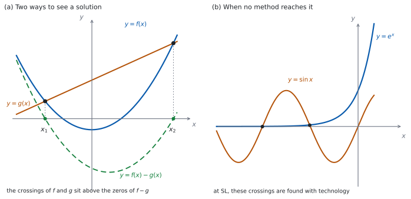

# SL 2.10 — Solving equations, graphically and analytically（方程式を解く：グラフと式） {#sec-aasl-2-10}

::: {.callout-note}
## What you should be able to do
- $f(x) = g(x)$ の解が、**$2$ つのグラフの交点の $x$ 座標**だと分かる。
- 同じことが、**$f(x) - g(x)$ の零点**だとも分かる。
- **$u$ でおきかえて** $2$ 次方程式に持ちこめる（$e^{2x}$ を含む式など）。
- **両辺の対数をとって**、指数の位置にある $x$ を下ろせる。
- **この課程の変形では解けない方程式**があることを知り、Paper 2 では電卓で読む。
- おきかえや対数のあとで、**捨てるべき解**を見分けられる。
:::

## The idea

### 1. 「解く」とは、両辺が等しくなる $x$ を見つけること {#idea}

$$
f(x) = g(x)
$$ {#eq-aasl210-eq}

この式を満たす $x$ が、**解（solution／root）**です。見方が $2$ つあります。

- **交点として見る。** $y = f(x)$ と $y = g(x)$ のグラフをかくと、**交点の $x$ 座標**が解です（[SL 2.3](aasl-2-3.qmd#sums)）。
- **零点として見る。** 全部を左辺に集めると $f(x) - g(x) = 0$ です。$y = f(x) - g(x)$ のグラフの **$x$ 切片**が解です（[SL 2.4](aasl-2-4.qmd#zeros)）。

@fig-aasl210-idea の (a) が、その $2$ つの見方です。**同じ $x$ を、ちがう場所で見ている**だけです。

たとえば $x^{2} = x + 6$ なら、$y = x^{2}$ と $y = x+6$ の交点を見ても、$y = x^{2}-x-6$ の $x$ 切片を見ても、同じ $x$ が出ます。

### 2. 解析的に解く {#analytic}

**analytically**（解析的に）とは、**式の変形だけで、正確な値まで出す**ことです。

$x^{2} - x - 6 = 0$ なら $(x-3)(x+2) = 0$ から $x = 3$ または $x = -2$ です（[SL 2.7a](aasl-2-7a.qmd#factor)）。$\sqrt{\ }$ や $\ln$ が残っても、**小数にしないかぎり正確な値**です。

::: {.callout-warning}
## `exact` と言われたら、小数にしないでください
$\ln 5$、$e^{2}$、$\dfrac{-3+\sqrt{29}}{2}$ は、どれも正確な値です。

電卓で $1.609\ldots$ と出すと、**正確ではなくなります**。`Give an exact answer` のときは、記号のまま書いてください。
:::

### 3. $u$ でおきかえる {#substitution}

**同じかたまりが $2$ 回出てくる**方程式は、そのかたまりを $u$ とおくと $2$ 次方程式になります。

$$
e^{2x} - 9e^{x} + 14 = 0
$$

$e^{2x} = \left(e^{x}\right)^{2}$ なので（[SL 1.5](../01-number-and-algebra/aasl-1-5.qmd#laws)）、$u = e^{x}$ とおくと

$$
u^{2} - 9u + 14 = 0
$$

になります。あとは $2$ 次方程式です（[SL 2.7a](aasl-2-7a.qmd#factor)）。**$u$ を出したら、$e^{x} = u$ に戻して $x$ を求めます。**

::: {.callout-warning}
## $u = e^{x}$ なら、$u > 0$ でなければなりません
$e^{x}$ は決して $0$ にも負にもなりません（[SL 2.9](aasl-2-9.qmd#exponential)）。

$2$ 次方程式から $u$ が負の値で出てきたら、**それは捨てます**。「解なし」ではなく、「その $u$ に対応する $x$ がない」ということです。

答案には *reject*（捨てる）と理由を書いてください。
:::

### 4. 両辺の対数をとる {#taking-logs}

**$x$ が指数の位置にある**ときは、両辺の対数をとると下ろせます。

$$
3^{x} = 20
$$

両辺の $\ln$ をとって

$$
\ln 3^{x} = \ln 20 \ \Rightarrow \ x \ln 3 = \ln 20 \ \Rightarrow \ x = \frac{\ln 20}{\ln 3}
$$

::: {.callout-important}
## この法則は公式集にあります
$\ln 3^{x} = x \ln 3$ で使った $\log_{a} x^{m} = m \log_{a} x$ は、公式集の **1.7** の欄に対数の法則の $1$ つとして印刷されています（[SL 1.7b](../01-number-and-algebra/aasl-1-7b.qmd#laws)）。**覚えていなくても、試験中に見られます。**
:::

**底が合わせられるなら、対数は要りません。** $2^{x} = 8$ なら $2^{x} = 2^{3}$ から $x = 3$ です（[SL 1.7b](../01-number-and-algebra/aasl-1-7b.qmd#same-base)）。

### 5. グラフで解く（Paper 2） {#graphical}

電卓が使えるときは、@fig-aasl210-idea の (a) の見方をそのまま画面でやります。

1. **$y = f(x)$ と $y = g(x)$ を両方入れて、交点を出す。** または
2. **全部を左辺に集めて、$y = f(x) - g(x)$ の $x$ 切片を出す。**

どちらでも同じ答えになります。**$2$ 番目のほうが、入力が $1$ つで済みます。**

::: {.callout-tip collapse="true"}
## Paper 2 では、電卓で交点や零点を出します
TI-Nspire の Graphs 画面に $2$ つの式を入れ、`menu → Analyze Graph → Intersection` で交点を出します。左右の境目を聞かれるので、**交点を $1$ つずつはさんで**指定します。

$1$ つの式にまとめたときは、`menu → Analyze Graph → Zero` です。

**画面に出ている範囲しか見えません。** 窓の外に解が残っていることがあるので、`menu → Window/Zoom` で範囲を広げて、**解が何個あるかを先に確かめて**ください。

答えの書き方（何桁で書くか）は、**試験用紙の冒頭の指示**に従ってください。

**Paper 1 では使えません。** このページの例題と演習は、すべて手で解ける形にしてあります。
:::

### 6. 習った変形では解けない方程式 {#no-analytic}

$$
2^{x} = x + 3
$$

この方程式は、**この課程で習う式の変形では解けません。** 左辺では $x$ が**指数の位置**に、右辺では**ふつうの項**として出てくるからです。$\log$ をとれば左の指数は下りますが、右は $\ln(x+3)$ になり、$x$ は対数の中に残ります。**どちらの道からも、$x$ を片側に集められません。**

交点は $2$ つあり、その値は電卓で出します（[例題 4](#exm-aasl210-technology)）。**ここまでに習った関数だけでできているのに、解が書けない**、という例です。

$$
e^{x} = \sin x
$$

同じことが起きる例を、もう $1$ つ挙げておきます。**三角関数は [SL 3.7a](../03-geometry/aasl-3-7a.qmd) で学びます**ので、いまは「形だけ」見ておいてください。@fig-aasl210-idea の (b) のように、交点は**負の側にいくつも**ありますが、**その値は電卓でしか出せません。**（$x \ge 0$ では $e^{x} \ge 1$、$\sin x \le 1$ で、同時に $1$ にはならないので交わりません。）

$x^{4} + 5x - 3 = 0$ のように、**SL の道具ではすぐに手が出ない**方程式もあります。こういう問題は Paper 2 に出て、電卓で解くことが期待されています。

**「解けない」のではなく、「習った変形では届かない」**ということです。

### 7. 捨てる解と、解の個数 {#care}

::: {.callout-warning}
## 変形の途中で、解が増えることがあります
$\log$ を $1$ つにまとめる、両辺を $2$ 乗する、といった変形をすると、**もとの方程式を満たさない値**が候補に混じることがあります。

おきかえのときは少しちがい、出てきた $u$ の値のうち**対応する $x$ がないもの**を落とすことになります。

$\ln$ を含む方程式では、**$\log$ の中身が正かどうか**を必ず確かめてください（[SL 2.9](aasl-2-9.qmd#care)）。出た値を**もとの式に入れ直す**のが、いちばん確実です。
:::

::: {.callout-warning}
## 解の個数は、グラフを思いうかべると分かります
$2$ 次方程式なら多くても $2$ つですが、$e^{x} = \sin x$ のように**いくつもある**こともあります。

`Find all solutions` や `How many solutions` と書かれていたら、**$1$ つ見つけて終わりにしない**でください。
:::

{#fig-aasl210-idea width=100%}

## Why it works

**なぜ、交点の $x$ 座標が @eq-aasl210-eq の解なのでしょうか。**

点 $(p, q)$ が $y = f(x)$ 上にあるとは $q = f(p)$ のこと、$y = g(x)$ 上にあるとは $q = g(p)$ のことです（[SL 2.3](aasl-2-3.qmd#sums)）。**両方の上にある**なら $f(p) = g(p)$ で、$p$ は方程式の解です。

逆に $p$ が解なら $f(p) = g(p)$ なので、点 $(p, f(p))$ は両方のグラフの上にあり、交点になります。**「解であること」と「交点の $x$ 座標であること」は、同じことです。**

**なぜ、差の零点でも同じなのでしょうか。** $f(p) - g(p) = 0$ と $f(p) = g(p)$ は、同じ式の書きかえです。だから**同じ $p$ の集まり**になります。

**なぜ、おきかえた先で出た値を、そのまま答えにできないのでしょうか。** $u = e^{x}$ とおくと、$u$ についての $2$ 次方程式は $u$ の値を $2$ つ返します。ところが $e^{x}$ は正の値しかとらないので、**負の $u$ には対応する $x$ がありません**（[SL 2.9](aasl-2-9.qmd#exponential)）。

つまり、おきかえた先の方程式は**もとの方程式より「広い」**のです。広いところで解いたので、狭いところに戻すときに**入らないものを落とす**ことになります。

**なぜ、電卓が要る方程式があるのでしょうか。** $e^{x} = \sin x$ では、$x$ が指数の中と三角関数の中の両方に入っています。**片方を外す変形をすると、もう片方が壊れます。** $\ln$ をとれば左は $x$ になりますが、右は $\ln(\sin x)$ になって、かえって複雑です。**どちらの道からも $x$ を取り出せません。**

## Worked examples

::: {.callout-note appearance="simple"}
問題文は英語です。意味が理解できなかったら、問題文の下の「**日本語訳**」を開いてください。解説は日本語です。

**例題も演習も、すべて電卓なしで解けます。** Paper 1 のつもりで解いてください。
:::

::: {#exm-aasl210-substitution}
[Consider the equation $e^{2x} - 3e^{x} - 4 = 0$.]{.q-en}

**(a)** [Show that the substitution $u = e^{x}$ gives $u^{2} - 3u - 4 = 0$.]{.q-en}

**(b)** [Solve $u^{2} - 3u - 4 = 0$.]{.q-en}

**(c)** [Hence find the exact solution of the original equation.]{.q-en}

**(d)** [Explain why one of the values of $u$ must be rejected.]{.q-en}

日本語訳

方程式 $e^{2x} - 3e^{x} - 4 = 0$ を考えます。

**(a)** $u = e^{x}$ とおくと $u^{2} - 3u - 4 = 0$ になることを示しなさい。

**(b)** $u^{2} - 3u - 4 = 0$ を解きなさい。

**(c)** それを使って、もとの方程式の正確な解を求めなさい。

**(d)** $u$ の値の一方を捨てなければならない理由を説明しなさい。

---

**(a)** `Show that` なので、**書きかえの過程を書いて見せます。** 指数法則から $e^{2x} = \left(e^{x}\right)^{2}$ です。

$$
\left(e^{x}\right)^{2} - 3e^{x} - 4 = 0
$$

$u = e^{x}$ とおくと $u^{2} - 3u - 4 = 0$ になります。

**(b)** **かけて $-4$、足して $-3$** になる $2$ 数は $-4$ と $1$ です。

$$
(u-4)(u+1) = 0 \ \Rightarrow \ u = 4 \ \text{または} \ u = -1
$$

**(c)** $u = e^{x}$ に戻します。$e^{x} = -1$ は解をもたないので（(d)）、$e^{x} = 4$ だけです。

$$
x = \ln 4
$$

**(d)** `Explain why` なので、英語で理由を書きます。

::: {.model-answer}
**試験ではこう書く**

*Every power of $e$ is positive, so $e^{x} > 0$ for all real $x$ and $e^{x} = -1$ has no solution. The value $u = -1$ therefore corresponds to no value of $x$ and must be rejected. Only $u = 4$ leads to a solution, giving $x = \ln 4$.*
:::

（$e$ の累乗はつねに正なので、どんな実数 $x$ でも $e^{x} > 0$ であり、$e^{x} = -1$ に解はない。よって $u = -1$ に対応する $x$ は存在せず、捨てなければならない。解につながるのは $u = 4$ だけで、$x = \ln 4$ となる、という意味です。）

**検算（(a) について）。** **逆向きにたどります。** $u^{2}-3u-4$ に $u = e^{x}$ を入れると $\left(e^{x}\right)^{2} - 3e^{x} - 4 = e^{2x} - 3e^{x} - 4$ ✓ もとの式に戻りました。

**検算（(b) について）。** **展開してもとに戻します。** $(u-4)(u+1) = u^{2}+u-4u-4 = u^{2}-3u-4$ ✓

**検算（(c) について）。** **もとの方程式に入れ直します。** $x = \ln 4$ なら $e^{x} = 4$、$e^{2x} = \left(e^{x}\right)^{2} = 16$ です。$16 - 3(4) - 4 = 16 - 12 - 4 = 0$ ✓

::: {.callout-note}
## 解答例（答案用紙に書くこと）
**(a)** $e^{2x} = \left(e^{x}\right)^{2}$, so with $u = e^{x}$
$$u^{2} - 3u - 4 = 0$$

**(b)** $(u-4)(u+1) = 0$
$$u = 4 \quad \text{or} \quad u = -1$$

**(c)** $e^{x} = -1$ has no solution, so $e^{x} = 4$
$$x = \ln 4$$

**(d)** *$e^{x} > 0$ for all real $x$, so $e^{x} = -1$ has no solution and $u = -1$ is rejected.*
:::
:::

::: {#exm-aasl210-logs}
[Solve the equations in parts (a) to (c).]{.q-en}

**(a)** [$3^{x} = 81$]{.q-en}

**(b)** [$2^{x} = 7$, giving your answer in the form $\dfrac{\ln p}{\ln q}$, where $p, q \in \mathbb{Z}^{+}$.]{.q-en}

**(c)** [$\ln(2x - 1) = 0$]{.q-en}

**(d)** [A student solves $2^{x} = 7$ by writing $x = \dfrac{7}{2}$. Identify the error, and state what should be done instead.]{.q-en}

日本語訳

(a) から (c) の方程式を解きなさい。

**(a)** $3^{x} = 81$

**(b)** $2^{x} = 7$（答えを $\dfrac{\ln p}{\ln q}$ の形で書きなさい。$p$、$q$ は正の整数）

**(c)** $\ln(2x - 1) = 0$

**(d)** ある生徒が $2^{x} = 7$ を解いて $x = \dfrac{7}{2}$ と書きました。誤りを指摘し、代わりに何をすべきかを述べなさい。

---

**(a)** **底をそろえます。** $81 = 3^{4}$ です（[第 4 節](#taking-logs)）。

$$
3^{x} = 3^{4} \ \Rightarrow \ x = 4
$$

**(b)** $7$ は $2$ の累乗ではないので、**両辺の $\ln$ をとります。**

$$
x \ln 2 = \ln 7 \ \Rightarrow \ x = \frac{\ln 7}{\ln 2}
$$

**(c)** $\ln$ の形を、指数の形に書き直します（[SL 2.9](aasl-2-9.qmd#inverse)）。

$$
2x - 1 = e^{0} = 1 \ \Rightarrow \ x = 1
$$

**(d)** `Identify the error` なので、英語でどこが違うかを書いてから、正しい手順を書きます。

::: {.model-answer}
**試験ではこう書く**

*The student has divided $7$ by $2$, but in $2^{x} = 7$ the unknown is an exponent, not a factor, so dividing does nothing to it. Checking shows the answer is wrong: $2^{\frac{7}{2}} = 8\sqrt{2}$, which is more than $8$, not $7$. Taking logarithms of both sides brings the exponent down: $x \ln 2 = \ln 7$, so $x = \dfrac{\ln 7}{\ln 2}$.*
:::

（この生徒は $7$ を $2$ で割っているが、$2^{x} = 7$ の未知数は指数の位置にあり、かけ算の相手ではないので、割っても指数には効かない。確かめると答えが誤りだと分かる。$2^{\frac{7}{2}} = 8\sqrt{2}$ は $8$ より大きく、$7$ ではない。両辺の対数をとれば指数を下ろせて、$x \ln 2 = \ln 7$、$x = \dfrac{\ln 7}{\ln 2}$ となる、という意味です。）

**検算（(a) について）。** **かけ算に戻します。** $3, 9, 27, 81$ と $3$ を $4$ 回かけています ✓

**検算（(b) について）。** **大きさで見当をつけます。** $2^{2} = 4$、$2^{3} = 8$ なので、$2^{x} = 7$ の $x$ は $2$ と $3$ のあいだのはずです。$\ln 7$ は $\ln 4 = 2\ln 2$ より大きく $\ln 8 = 3\ln 2$ より小さいので、$\dfrac{\ln 7}{\ln 2}$ は $2$ と $3$ のあいだにあります ✓

**検算（(c) について）。** **もとの式に入れ直します。** $x = 1$ なら $2(1)-1 = 1$ で、$\ln 1 = 0$ ✓ また $1 > 0$ なので、$\log$ の中身も正です。

::: {.callout-note}
## 解答例（答案用紙に書くこと）
**(a)** $3^{x} = 3^{4}$
$$x = 4$$

**(b)** $x \ln 2 = \ln 7$
$$x = \frac{\ln 7}{\ln 2}$$

**(c)** $2x - 1 = e^{0} = 1$
$$x = 1$$

**(d)** *The unknown is an exponent, so dividing by $2$ does not reach it; take logarithms of both sides to get $x = \dfrac{\ln 7}{\ln 2}$.*
:::
:::

::: {#exm-aasl210-intersection}
[The graphs of $y = x^{2}$ and $y = 4 - 3x$ are drawn on the same axes.]{.q-en}

**(a)** [Write down an equation whose solutions are the $x$-coordinates of the points of intersection.]{.q-en}

**(b)** [Solve this equation.]{.q-en}

**(c)** [Find the coordinates of the two points of intersection.]{.q-en}

**(d)** [Explain how the number of points of intersection could be found from a sketch, without solving the equation.]{.q-en}

日本語訳

$y = x^{2}$ と $y = 4 - 3x$ のグラフを、同じ座標軸にかきます。

**(a)** 交点の $x$ 座標を解とする方程式を書きなさい。

**(b)** その方程式を解きなさい。

**(c)** $2$ つの交点の座標を求めなさい。

**(d)** 方程式を解かずに、交点の個数をスケッチから求める方法を説明しなさい。

---

**(a)** **$2$ つの $y$ を等しくおきます**（[第 1 節](#idea)）。

$$
x^{2} = 4 - 3x
$$

**(b)** 全部を左辺に集めてから、因数分解します。

$$
x^{2} + 3x - 4 = 0 \ \Rightarrow \ (x+4)(x-1) = 0
$$

$$
x = -4 \quad \text{または} \quad x = 1
$$

**(c)** どちらか一方の式に入れます。**直線のほうが計算が軽い**です。

$$
x = -4: \ y = 4 - 3(-4) = 16, \qquad x = 1: \ y = 4 - 3(1) = 1
$$

$$
(-4, \ 16) \quad \text{and} \quad (1, \ 1)
$$

**(d)** `Explain` なので、英語で書きます。

::: {.model-answer}
**試験ではこう書く**

*Sketch the upward parabola $y = x^{2}$, with vertex at the origin, and the line $y = 4 - 3x$, which has a positive $y$-intercept. At $x = 0$ the line is above the parabola, but far to the left and far to the right the parabola is above the line, because a quadratic eventually beats a linear expression. So the graphs cross at least once on each side of the $y$-axis, and a line can meet a parabola at most twice, so there are exactly two points of intersection.*
:::

（原点を頂点とする下に凸の放物線 $y = x^{2}$ と、$y$ 切片が正の直線 $y = 4-3x$ をかく。$x = 0$ では直線のほうが上にあるが、左へ遠く行っても右へ遠く行っても、最後は放物線のほうが上に出る（$2$ 次のほうが $1$ 次に勝つから）。だから $y$ 軸の左右で少なくとも $1$ 回ずつ交わり、直線と放物線は多くても $2$ 点でしか出会えないので、交点はちょうど $2$ つである、という意味です。）

**検算（(a)(b) について）。** **因数分解を展開して戻します。** $(x+4)(x-1) = x^{2}-x+4x-4 = x^{2}+3x-4$ ✓ **差の零点としても見ます。** $x^{2}-(4-3x) = x^{2}+3x-4$ で、同じ式です ✓ **交点で見ても差で見ても、同じ方程式になりました。**

**検算（(c) について）。** **もう一方の式にも入れます。** $x = -4$ では $x^{2} = 16$ ✓ $x = 1$ では $x^{2} = 1$ ✓ **どちらの式でも同じ $y$ が出たので、たしかに交点です。**

**検算（(d) について）。** **判別式でも数えられます。** $x^{2}+3x-4$ の $\Delta = 9 + 16 = 25 > 0$ なので、実数解は $2$ つ ✓（[SL 2.7b](aasl-2-7b.qmd#intersect)）スケッチから読んだ個数と合っています。

::: {.callout-note}
## 解答例（答案用紙に書くこと）
**(a)**
$$x^{2} = 4 - 3x$$

**(b)** $x^{2}+3x-4 = 0$, $(x+4)(x-1) = 0$
$$x = -4 \quad \text{or} \quad x = 1$$

**(c)**
$$(-4, \ 16) \quad \text{and} \quad (1, \ 1)$$

**(d)** *At $x = 0$ the line is above the parabola but far out on both sides the parabola is above, so there is a crossing on each side; a line meets a parabola at most twice, so there are exactly two.*
:::
:::

::: {#exm-aasl210-technology}
[Let $f(x) = 2^{x}$ and $g(x) = x + 3$.]{.q-en}

**(a)** [Show that the equation $f(x) = g(x)$ has a solution between $x = 2$ and $x = 3$.]{.q-en}

**(b)** [Show that there is a second solution between $x = -3$ and $x = -2$.]{.q-en}

**(c)** [Explain why this equation cannot be solved by the algebraic methods of this course.]{.q-en}

**(d)** [Explain how the solutions could be found using technology.]{.q-en}

**(e)** [Using technology, find both solutions of $f(x) = g(x)$, correct to three significant figures. State the equation you enter and the interval you search in each case.]{.q-en}

日本語訳

$f(x) = 2^{x}$、$g(x) = x + 3$ とします。

**(a)** 方程式 $f(x) = g(x)$ が $x = 2$ と $x = 3$ のあいだに解をもつことを示しなさい。

**(b)** $x = -3$ と $x = -2$ のあいだにもう $1$ つ解があることを示しなさい。

**(c)** この方程式が、この課程で習う代数の方法では解けない理由を説明しなさい。

**(d)** 電卓を使って解を求める方法を説明しなさい。

**(e)** 電卓を使って $f(x) = g(x)$ の解を $2$ つとも求め、有効数字 $3$ 桁で答えなさい。それぞれについて、入力した式と、探した区間も書きなさい。

---

**(a)** `Show that` なので、**両端で $f - g$ の符号を計算して見せます。**

$$
f(2) - g(2) = 4 - 5 = -1, \qquad f(3) - g(3) = 8 - 6 = 2
$$

符号が $-$ から $+$ に変わり、しかも $y = 2^{x} - x - 3$ のグラフは**切れ目のない $1$ 本の曲線**なので、そのあいだで必ず $x$ 軸を横切ります。そこが $f(x) - g(x) = 0$ となる $x$ です。

**(b)** 同じことを、負の側でやります。

$$
f(-3) - g(-3) = \frac{1}{8} - 0 = \frac{1}{8}, \qquad f(-2) - g(-2) = \frac{1}{4} - 1 = -\frac{3}{4}
$$

今度は $+$ から $-$ に変わります。やはり切れ目のない曲線なので、そのあいだにも解があります。

**(c)** `Explain why` なので、英語で理由を書きます。

::: {.model-answer}
**試験ではこう書く**

*In $2^{x} = x + 3$ the unknown appears both as an exponent on the left and as a term on the right. Taking logarithms brings the left exponent down but turns the right side into $\ln(x+3)$, so $x$ is still trapped inside a logarithm. No rearrangement available in this course isolates $x$ on one side, so the solutions cannot be written exactly.*
:::

（$2^{x} = x+3$ では、未知数が左辺では指数の位置に、右辺では項として現れている。対数をとれば左辺の指数は下りるが、右辺は $\ln(x+3)$ になり、$x$ はまだ対数の中に閉じこめられたままである。この課程で使える変形では $x$ を片側に取り出せないので、解を正確な形で書くことはできない、という意味です。）

**(d)** `Explain` なので、英語で書きます。

::: {.model-answer}
**試験ではこう書く**

*Enter $y = 2^{x}$ and $y = x + 3$ on the graphing screen and use the intersection tool, once for each crossing. Alternatively enter the single function $y = 2^{x} - x - 3$ and use the zero tool. The window must be wide enough to show both crossings found in parts (a) and (b), and each answer is written to the accuracy the paper asks for.*
:::

（グラフ画面に $y = 2^{x}$ と $y = x+3$ を入れ、交点を求める機能を交点ごとに $1$ 回ずつ使う。あるいは $y = 2^{x} - x - 3$ という $1$ つの関数を入れて、零点を求める機能を使う。(a) と (b) で見つけた $2$ つの交点が両方入るように窓を広げておく必要があり、それぞれの答えは試験用紙が求める精度で書く、という意味です。）

**(e)** **入力する式と、探す区間を書いてから、値を写します。**

$y = 2^{x} - x - 3$ を $1$ つ入れて、`menu → Analyze Graph → Zero` を使います。探す範囲は、(a) と (b) で分かった区間をそのまま使います。

| 探す区間 | 画面に出る値 | 有効数字 $3$ 桁 |
|:--|:--|:--|
| $2 \le x \le 3$ | $2.44490\ldots$ | $2.44$ |
| $-3 \le x \le -2$ | $-2.86250\ldots$ | $-2.86$ |

: 電卓で出した近似解 {#tbl-aasl210-approx}

**途中で丸めないでください。** 画面の値をそのまま使い、**最後に $1$ 回だけ**丸めます。

**検算（(a) について）。** **もう $1$ 点はさんで、符号の変化を確かめます。** $x = 2.5$ では $2^{2.5} = 4\sqrt{2}$ です。$\sqrt{2} > 1.4$ なので $4\sqrt{2} > 5.6$、いっぽう $g(2.5) = 5.5$ なので $f - g > 0$ ✓ **解は $2$ と $2.5$ のあいだ**まで、しぼれました。

**検算（(b) について）。** **もう $1$ 点はさんで、範囲を狭めます。** $x = -2.5$ では $2^{-\frac{5}{2}} = \dfrac{1}{4\sqrt{2}}$ です。$4\sqrt{2} > 5.6$ なので $2^{-\frac{5}{2}} < 0.18$、いっぽう $g(-2.5) = 0.5$ なので $f - g < 0$ ✓ $x = -3$ では正だったので、**解は $-3$ と $-2.5$ のあいだ**まで、しぼれました。

**検算（(c)(d) について）。** **区間の外に解がないことを確かめます。** $x < -3$ では $2^{x} > 0$、$x+3 < 0$ なので $f - g > 0$ で、交わりません ✓ $x > 3$ では、$x = 3$ ですでに $f - g = 2 > 0$ で、そこから $2^{x}$ のほうが $x+3$ より速く増えるので、この差は縮まりません ✓ **だから解はすべて $-3 \le x \le 3$ の中にあり、窓をこれより広げても新しい交点は出てきません。**（この範囲の中で交点がちょうど $2$ つであることは、グラフの形から読みます。）

::: {.callout-note}
## 解答例（答案用紙に書くこと）
**(a)** $f(2)-g(2) = 4-5 = -1 < 0$ and $f(3)-g(3) = 8-6 = 2 > 0$

*$y = 2^{x}-x-3$ is a continuous curve and the sign changes, so there is a solution between $2$ and $3$.*

**(b)** $f(-3)-g(-3) = \dfrac{1}{8} > 0$ and $f(-2)-g(-2) = \dfrac{1}{4}-1 < 0$

*The sign changes again on a continuous curve, so there is a second solution between $-3$ and $-2$.*

**(c)** *$x$ is an exponent on one side and a term on the other, so no rearrangement isolates it.*

**(d)** *Graph both sides and use the intersection tool, or graph $y = 2^{x}-x-3$ and use the zero tool.*

**(e)** *enter $y = 2^{x}-x-3$; search $2 \le x \le 3$ and $-3 \le x \le -2$*

$$x = 2.44 \quad \text{and} \quad x = -2.86 \qquad (3 \text{ s.f.})$$
:::
:::

## Common errors

::: {.callout-warning}
## おきかえたまま、$x$ に戻さない
$u = 4$ は $u$ の値です。**答えは $x$ の値**なので、$e^{x} = 4$ から $x = \ln 4$ まで書きます（[第 3 節](#substitution)）。
:::

::: {.callout-warning}
## 負の $u$ を捨てずに、$\ln$ の中に入れてしまう
$e^{x} = -1$ には解がありません（[第 3 節](#substitution)）。$\ln(-1)$ と書かずに、**reject と理由**を書いてください。
:::

::: {.callout-warning}
## 指数の位置にある $x$ を、割り算で下ろそうとする
$2^{x} = 7$ で $x = \dfrac{7}{2}$ とはなりません（[第 4 節](#taking-logs)）。**両辺の対数**をとります。
:::

::: {.callout-warning}
## $\log$ を含む方程式で、中身の符号を確かめない
出た値を**もとの式に入れ直して**、$\log$ の中身が正かを見てください（[第 7 節](#care)）。負になる値は捨てます。
:::

::: {.callout-warning}
## 交点を求めて、$x$ 座標だけ書く
`Find the coordinates` なら、**$y$ も必要**です（[SL 2.3](aasl-2-3.qmd#sums)）。片方の式に入れて $y$ を出します。
:::

::: {.callout-warning}
## 電卓の窓に入っている解だけ答える
画面の外に解が残っていることがあります（[第 5 節](#graphical)）。**窓を広げて、個数を先に確かめて**ください。
:::

## Exercises

::: {.callout-note appearance="simple"}
各問題に、折りたたみが $3$ つ付いています。**日本語訳**、**解答例**（答案用紙に書くべきこと。英語です）、**解説**（なぜそうなるか。日本語です）。

まず自分で解いて、次に解答例と見くらべてください。**解説は、合わなかったときだけ開けば十分です。**
:::

::: {.exercise-block}

[1]{.ex-no} [Solve $e^{x} = 5$, giving an exact answer.]{.q-en}

日本語訳

$e^{x} = 5$ を解きなさい。答えは正確な値で書きなさい。

::: {.callout-note collapse="true"}
## 解答例（答案用紙に書くこと）

$$x = \ln 5$$
:::

::: {.callout-tip collapse="true"}
## 解説

$e$ と $\ln$ はほどき合います（[SL 2.9](aasl-2-9.qmd#inverse)）。両辺の $\ln$ をとると $x = \ln 5$ です。

**検算。** **もとの式に入れ直します。** $e^{\ln 5} = 5$ ✓ **大きさでも見ます。** $e^{1}$ はおよそ $2.7$、$e^{2}$ はおよそ $7.4$ なので、$\ln 5$ は $1$ と $2$ のあいだの数のはずです ✓

**$1.609\ldots$ と書かないでください。** `exact` なので、$\ln 5$ のままが答えです。
:::

::: {.ex-sep}
:::

[2]{.ex-no} [Solve $\ln x = 3$, giving an exact answer.]{.q-en}

日本語訳

$\ln x = 3$ を解きなさい。答えは正確な値で書きなさい。

::: {.callout-note collapse="true"}
## 解答例（答案用紙に書くこと）

$$x = e^{3}$$
:::

::: {.callout-tip collapse="true"}
## 解説

$\ln x = 3$ は $e^{3} = x$ と同じことです（[SL 2.9](aasl-2-9.qmd#inverse)）。

**検算。** **もとの式に入れ直します。** $\ln e^{3} = 3$ ✓ また $e^{3} > 0$ なので、$\log$ の中身も正です。**大きさでも見ます。** $e^{3}$ は $20$ くらいで、$3e$ のおよそ $8.2$ とはまるでちがう値です ✓

**$x = 3e$ としないでください。** $\ln$ は「$e$ をかける」ではありません。
:::

::: {.ex-sep}
:::

[3]{.ex-no} [Solve $4^{x} = 64$.]{.q-en}

日本語訳

$4^{x} = 64$ を解きなさい。

::: {.callout-note collapse="true"}
## 解答例（答案用紙に書くこと）

$4^{x} = 4^{3}$

$$x = 3$$
:::

::: {.callout-tip collapse="true"}
## 解説

**底がそろえられるので、対数は要りません**（[第 4 節](#taking-logs)）。$64 = 4^{3}$ です。

**検算。** **かけ算に戻します。** $4 \times 4 = 16$、$16 \times 4 = 64$ で、$4$ を $3$ 回かけています ✓

**$\dfrac{\ln 64}{\ln 4}$ と書いても正しい**のですが、それが $3$ だと気づけると速いです。
:::

::: {.ex-sep}
:::

[4]{.ex-no} [Solve $e^{2x} - 6e^{x} + 8 = 0$, giving exact answers.]{.q-en}

日本語訳

$e^{2x} - 6e^{x} + 8 = 0$ を解きなさい。答えは正確な値で書きなさい。

::: {.callout-note collapse="true"}
## 解答例（答案用紙に書くこと）

Let $u = e^{x}$. Then $u^{2} - 6u + 8 = 0$, so $(u-2)(u-4) = 0$.

$$x = \ln 2 \quad \text{or} \quad x = \ln 4$$
:::

::: {.callout-tip collapse="true"}
## 解説

$u = e^{x}$ とおきます（[第 3 節](#substitution)）。**かけて $8$、足して $-6$** になる $2$ 数は $-2$ と $-4$ です。

**今回は $2$ つとも正なので、どちらも残ります。**

**検算。** **もとの式に入れ直します。** $x = \ln 2$ なら $e^{x} = 2$、$e^{2x} = 4$ で、$4 - 12 + 8 = 0$ ✓ $x = \ln 4$ なら $e^{x} = 4$、$e^{2x} = 16$ で、$16 - 24 + 8 = 0$ ✓

**$u$ のまま答えないでください。** 答えは $x$ の値です。
:::

::: {.ex-sep}
:::

[5]{.ex-no} [Find the coordinates of the points where the graph of $y = x^{2} - 2$ meets the line $y = x$.]{.q-en}

日本語訳

$y = x^{2} - 2$ のグラフが直線 $y = x$ と出会う点の座標を求めなさい。

::: {.callout-note collapse="true"}
## 解答例（答案用紙に書くこと）

$x^{2} - 2 = x$, so $x^{2} - x - 2 = 0$ and $(x-2)(x+1) = 0$

$$(2, \ 2) \quad \text{and} \quad (-1, \ -1)$$
:::

::: {.callout-tip collapse="true"}
## 解説

$2$ つの $y$ を等しくおきます（[第 1 節](#idea)）。$y = x$ なので、$y$ の値は $x$ の値と同じです。

**検算。** **もう一方の式にも入れます。** $x = 2$ では $x^{2}-2 = 2$ ✓ $x = -1$ では $1 - 2 = -1$ ✓ どちらも直線の値と一致しました。

**$x$ の値だけで止めないでください。** `coordinates` なので、$y$ も要ります。
:::

::: {.ex-sep}
:::

[6]{.ex-no} [Solve $\ln(3x + 1) = 0$.]{.q-en}

日本語訳

$\ln(3x + 1) = 0$ を解きなさい。

::: {.callout-note collapse="true"}
## 解答例（答案用紙に書くこと）

$3x + 1 = e^{0} = 1$

$$x = 0$$
:::

::: {.callout-tip collapse="true"}
## 解説

$\ln A = 0$ は $A = e^{0} = 1$ と同じことです（[SL 2.9](aasl-2-9.qmd#inverse)）。

**検算。** **もとの式に入れ直します。** $x = 0$ なら $3(0)+1 = 1$ で、$\ln 1 = 0$ ✓ 中身が $1 > 0$ なので、domain の中でもあります。

**$3x+1 = 0$ としないでください。** $\ln$ の値が $0$ でも、中身は $0$ ではありません。
:::

::: {.ex-sep}
:::

[7]{.ex-no} [Solve $10^{x} = 3$, giving your answer in the form $\log_{10} k$, where $k \in \mathbb{Z}^{+}$.]{.q-en}

日本語訳

$10^{x} = 3$ を解きなさい。答えを $\log_{10} k$（$k$ は正の整数）の形で書きなさい。

::: {.callout-note collapse="true"}
## 解答例（答案用紙に書くこと）

$$x = \log_{10} 3$$
:::

::: {.callout-tip collapse="true"}
## 解説

$a^{x} = b$ と $\log_{a} b = x$ は同じことです（[SL 2.9](aasl-2-9.qmd#inverse)）。$3$ は $10$ の累乗ではないので、この形が最終形です。

**検算。** **大きさで見当をつけます。** $10^{0} = 1$、$10^{1} = 10$ なので、$x$ は $0$ と $1$ のあいだのはずです。$\log_{10} 3$ はたしかにそのあいだにあります ✓

**$\dfrac{3}{10}$ としないでください。** 指数の位置にある $x$ は、割り算では下りません。
:::

::: {.ex-sep}
:::

[8]{.ex-no} [Explain why the equation $e^{x} = -2$ has no solution.]{.q-en}

日本語訳

方程式 $e^{x} = -2$ が解をもたない理由を説明しなさい。

::: {.callout-note collapse="true"}
## 解答例（答案用紙に書くこと）

*$e^{x} > 0$ for every real $x$, so $e^{x}$ can never equal $-2$ and the equation has no solution.*
:::

::: {.callout-tip collapse="true"}
## 解説

`Explain why` なので、**$e^{x}$ のとる値がどこにあるかを言ってから、$-2$ がそこに入らないと書きます。**

**検算。** **グラフでも見ます。** $y = e^{x}$ のグラフは $x$ 軸より上にあり、$y = -2$ は $x$ 軸より下の水平な直線です（[SL 2.9](aasl-2-9.qmd#exponential)）。$2$ 本は交わりません ✓

::: {.model-answer}
**試験ではこう書く**

*The range of $f(x) = e^{x}$ is $y > 0$, so every value of $e^{x}$ is positive. The number $-2$ is negative, so it is not in the range and there is no real $x$ with $e^{x} = -2$. On a graph, $y = e^{x}$ lies entirely above the $x$-axis while $y = -2$ lies entirely below it, so the two never meet.*
:::
:::

::: {.ex-sep}
:::

[9]{.ex-no} [Solve $e^{2x} = e^{x + 6}$.]{.q-en}

日本語訳

$e^{2x} = e^{x + 6}$ を解きなさい。

::: {.callout-note collapse="true"}
## 解答例（答案用紙に書くこと）

$2x = x + 6$

$$x = 6$$
:::

::: {.callout-tip collapse="true"}
## 解説

**底が同じなので、指数どうしを等しくおけます**（[第 4 節](#taking-logs)）。$e^{x}$ は同じ値を $2$ 回とらないからです。

**検算。** **もとの式に入れ直します。** $x = 6$ なら左辺は $e^{12}$、右辺は $e^{6+6} = e^{12}$ ✓

**おきかえは要りません。** $u = e^{x}$ とおくと $u^{2} = e^{6}u$ になり、遠回りです。
:::

::: {.ex-sep}
:::

[10]{.ex-no} [A student solves $\ln x + \ln(x-3) = \ln 4$ and gives the answers $x = 4$ and $x = -1$. Identify the error, and write down the correct solution.]{.q-en}

日本語訳

ある生徒が $\ln x + \ln(x-3) = \ln 4$ を解いて、$x = 4$ と $x = -1$ を答えました。誤りを指摘し、正しい解を書きなさい。

::: {.callout-note collapse="true"}
## 解答例（答案用紙に書くこと）

*The original equation needs $x > 0$ and $x - 3 > 0$, so $x > 3$. The value $x = -1$ does not satisfy this and must be rejected.*

$$x = 4$$
:::

::: {.callout-tip collapse="true"}
## 解説

対数法則で $\ln\!\big(x(x-3)\big) = \ln 4$、つまり $x^{2}-3x-4 = 0$ となり、$(x-4)(x+1) = 0$ から $x = 4$、$x = -1$ が出ます（[SL 1.7b](../01-number-and-algebra/aasl-1-7b.qmd#laws)）。ここまでは正しい計算です。

**まとめる変形で、解が増えました**（[第 7 節](#care)）。もとの式では $\ln x$ が $x > 0$ を、$\ln(x-3)$ が $x > 3$ を要求するので、**式が意味をもつのは $x > 3$ のときだけ**です。ところが $\ln\!\big(x(x-3)\big)$ にまとめると、$x$ と $x-3$ がそろって負のとき、つまり $x < 0$ でも中身が正になってしまいます。**$x < 0$ の側が新しく開いた**ぶんが、余分な解です。

**検算。** **両方をもとの式に入れ直します。** $x = 4$ なら $\ln 4 + \ln 1 = \ln 4 + 0 = \ln 4$ ✓ $x = -1$ なら $\ln(-1)$ に値がありません ✓ だから $x = -1$ は捨てます。

::: {.model-answer}
**試験ではこう書く**

*Combining the logarithms gives $\ln\!\big(x(x-3)\big) = \ln 4$, so $x^{2}-3x-4 = 0$ and $x = 4$ or $x = -1$. The algebra is correct, but the combined equation allows values that the original does not. In the original equation $\ln x$ requires $x > 0$ and $\ln(x-3)$ requires $x > 3$, so $x = -1$ must be rejected. Checking $x = 4$ gives $\ln 4 + \ln 1 = \ln 4$, so the only solution is $x = 4$.*
:::
:::

:::
