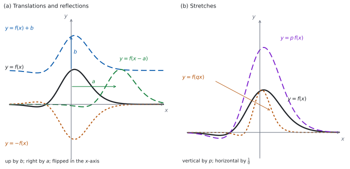

# SL 2.11 — Transformations of graphs（グラフの移動と拡大） {#sec-aasl-2-11}

::: {.callout-note}
## What you should be able to do
- **translation**（平行移動）$y = f(x) + b$ と $y = f(x-a)$ を、向きも含めて説明できる。
- 移動をベクトル $\begin{pmatrix} a \\ b \end{pmatrix}$ で書ける。
- **reflection**（対称移動）$y = -f(x)$ と $y = f(-x)$ を区別できる。
- **stretch**（拡大）$y = p\,f(x)$（縦に $p$ 倍）と $y = f(qx)$（横に $\dfrac{1}{q}$ 倍）を区別できる。
- **composite transformations**（組み合わせ）を、**順番に気をつけて**扱える。
- 漸近線・切片・頂点が**どう動くか**を言える。
:::

## The idea

### 1. transformation は、グラフ全体を動かす操作 {#idea}

もとの関数 $f$ から新しい式を作ると、グラフ全体が**動いたり、伸びたり、折り返されたり**します。これを **transformation**（変換）といいます。

大事なのは、**式のどこをいじったか**です。

- **$f$ の「外」をいじる** → **$y$ の側**が変わる → **縦向き**の変化。見たとおりに動きます。
- **$f$ の「中」（$x$ の側）をいじる** → **横向き**の変化。**見た目と逆**になります。

この $2$ 行が、このページ全体の土台です。ただし、この $2$ 行で分かるのは**向きだけ**です。**量**は、外なら見たまま、中なら符号が逆・倍率が逆数になります。

また、この読み方が使えるのは、中が**ちょうど $x-a$ か $qx$ の形**のときだけです。$y = f(2x-6)$ を「中が $-6$ だから右へ $6$」と読むことはできません（[第 5 節](#composite)）。

### 2. 平行移動 {#translation}

$$
y = f(x) + b \quad \text{：上へ } b
$$ {#eq-aasl211-up}

$$
y = f(x - a) \quad \text{：右へ } a
$$ {#eq-aasl211-right}

@fig-aasl211-idea の (a) を見てください。$b$ が負なら下へ、$a$ が負なら左へ動きます。

$2$ つを合わせた $y = f(x-a) + b$ は、**ベクトル**で書けます。

$$
\begin{pmatrix} a \\ b \end{pmatrix}
$$

これは「右へ $a$、上へ $b$」という意味です。答案では、この書き方が使えます。

::: {.callout-warning}
## $f(x-a)$ は「右へ」です。符号に見えるものと逆です
$f(x-3)$ は**右へ $3$**、$f(x+3)$ は**左へ $3$** です。

理由は [Why it works](#why-it-works) にあります。**「中はさかさま」と覚えるより、$1$ 点で確かめる**のが確実です（その確かめ方も [Why it works](#why-it-works) にあります）。
:::

### 3. 対称移動 {#reflection}

$$
y = -f(x) \quad \text{：} x \text{ 軸で折り返す}
$$ {#eq-aasl211-refx}

$$
y = f(-x) \quad \text{：} y \text{ 軸で折り返す}
$$ {#eq-aasl211-refy}

$-f(x)$ は $f$ の**外**にマイナスが付いています。だから**縦**の変化、つまり $x$ 軸についての折り返しです。$f(-x)$ は**中**なので**横**、$y$ 軸についての折り返しです。

@fig-aasl211-idea の (a) の点々の曲線が $y = -f(x)$ です。

### 4. 拡大 {#stretch}

$$
y = p\,f(x) \quad \text{：縦に } p \text{ 倍}
$$ {#eq-aasl211-vstretch}

$$
y = f(qx) \quad \text{：横に } \frac{1}{q} \text{ 倍}
$$ {#eq-aasl211-hstretch}

ここでは **$p > 0$、$q > 0$** とします。$p$ や $q$ が負のときは、**拡大に対称移動が組み合わさった**形になり、答案には $2$ つを分けて書きます。たとえば $y = -3f(x)$ は「$x$ 軸についての対称移動」と「scale factor $3$ の縦の拡大」の $2$ つです。

**縦は素直、横はさかさま**です。$y = f(4x)$ は横に $\dfrac{1}{4}$ 倍、つまり**細くなります**。$y = f\!\left(\dfrac{x}{2}\right)$ なら $q = \dfrac{1}{2}$ で、横に $2$ 倍、**太くなります**。

@fig-aasl211-idea の (b) が、その $2$ つです。

::: {.callout-warning}
## `scale factor` は「何倍か」です。$q$ そのものではありません
$y = f(5x)$ の horizontal stretch の scale factor は $\dfrac{1}{5}$ です。$5$ ではありません。

答案には **scale factor $\dfrac{1}{5}$**、あるいは「横に $\dfrac{1}{5}$ 倍」と書きます。
:::

### 5. 組み合わせる {#composite}

$2$ つ以上を続けてはたらかせることができます。**順番で結果が変わることがあります。**

たとえば $y = f(x)$ に「縦に $3$ 倍」→「上へ $1$」の順ではたらかせると

$$
y = 3f(x) + 1
$$

ですが、「上へ $1$」→「縦に $3$ 倍」の順なら

$$
y = 3\big(f(x) + 1\big) = 3f(x) + 3
$$

で、**ちがう式**になります。

**ちがう向き**（縦と横）なら、どちらが先でも同じ結果です。縦は $y$ 座標だけ、横は $x$ 座標だけを変えるからです。

**同じ向きどうしでは、順番が効くことがあります。** 効くのは、**平行移動（足す）と、拡大・対称移動（かける）が、同じ向きで混ざるとき**です。上の例がまさにそれで、縦の拡大と縦の平行移動でした。

いっぽう、同じ向きでも**かける操作どうし**なら、順番は結果を変えません。「縦に $3$ 倍」と「$x$ 軸で折り返す」は、どちらが先でも $y = -3f(x)$ です。平行移動どうしも同じです。

まとめると、**「足す」と「かける」が同じ向きでぶつかるときだけ、順番を気にすれば十分**です。**この項目（2.11）では横どうしが混ざる形（下の callout）を扱わない**ので、ここで順番が問題になるのは**縦どうし**の組み合わせだけです。

::: {.callout-warning}
## $f(ax+b)$ の形は、この項目では扱いません
シラバスの 2.11 には `Not required:` として、**$f(ax+b)$ の形の変換**が挙がっています。ここで問われないのは、**グラフだけが与えられた一般の $f$ について、横の拡大と横の平行移動が同時に入った形を「述べる」こと**です。

**これは 2.11 の範囲の話で、SL 全体で出ないという意味ではありません。** [SL 3.7b](../03-geometry/aasl-3-7b.qmd#shift-c) の $y = a\sin\bigl(b(x+c)\bigr) + d$ は、まさに横の拡大と横の平行移動が同時に入った形で、シラバス 3.7 に書かれています。

**ちがいは、かっこが $b(x+c)$ の形にくくってあることです。** くくってあれば、横の拡大は $b$、横の平行移動は $c$ と、別々に読めます。くくっていない $f(ax+b)$ を一般の $f$ について扱うことが、2.11 では求められない、ということです。
:::

### 6. 特徴のある点や線は、どう動くか {#features}

**変換は、平面のすべての点に同じことをします。** グラフ上の点だけでなく、平面にひいた線も同じ規則で移ります。だから切片や頂点だけでなく、**グラフが触れていない漸近線も**、同じ規則で動きます。

| もとの特徴 | $y = f(x)+b$ | $y = f(x-a)$ | $y = -f(x)$ | $y = f(-x)$ | $y = p\,f(x)$ | $y = f(qx)$ |
|:--|:--|:--|:--|:--|:--|:--|
| 点 $(s, t)$ | $(s, \ t+b)$ | $(s+a, \ t)$ | $(s, \ -t)$ | $(-s, \ t)$ | $(s, \ pt)$ | $\left(\dfrac{s}{q}, \ t\right)$ |
| 水平漸近線 $y = k$ | $y = k+b$ | $y = k$ | $y = -k$ | $y = k$ | $y = pk$ | $y = k$ |
| 垂直漸近線 $x = h$ | $x = h$ | $x = h+a$ | $x = h$ | $x = -h$ | $x = h$ | $x = \dfrac{h}{q}$ |

: 変換で、点と漸近線がどう動くか {#tbl-aasl211-move}

**表を覚える必要はありません。** $1$ つの点でやってみれば、その場で出せます（[Why it works](#why-it-works)）。

### 7. 答案の書き方 {#answers}

`Describe the transformation` と言われたら、次の $3$ つを書きます。

1. **名前**（translation / reflection / stretch）
2. **量**（何単位か、scale factor はいくつか）
3. **向き**（上下左右、どの軸について、縦か横か）

たとえば「translation of $3$ units to the right」「reflection in the $x$-axis」「vertical stretch with scale factor $2$」です。**$3$ つのうち $1$ つでも抜けると、伝わりません。**

::: {.callout-tip collapse="true"}
## Paper 2 では、電卓で動きを見られます
TI-Nspire の Graphs 画面に $f_1(x)$ を入れ、$f_2(x) = f_1(x-3)$ のように**前の式を参照して**入れると、$2$ 本が同時に出ます。どちらへ動いたかが、その場で見えます。

`menu → Actions → Insert Slider` でスライダーを置き、**変数名を $a$ に変えて**から $f_2(x) = f_1(x-a)$ と入れると、**$a$ を動かしながら**グラフの動きを見られます。メニューの名前は OS のバージョンでちがうことがあるので、自分の機械でたしかめてください。

**Paper 1 では使えません。** このページの例題と演習は、すべて手で解ける形にしてあります。
:::

{#fig-aasl211-idea width=100%}

## Why it works

**なぜ、$f(x-a)$ が「右へ」なのでしょうか。**

$y = f(x-a)$ のグラフが点 $(X, Y)$ を通るとは、$Y = f(X-a)$ ということです。ここで $s = X - a$ とおくと $Y = f(s)$ なので、**点 $(s, Y)$ は、もとのグラフの上にあります。**

$X = s + a$ ですから、**もとの点 $(s, Y)$ が、新しいグラフでは $(s+a, Y)$ に移っている**わけです。$a$ だけ右です。

**「中の $-a$」が「右へ $+a$」になるのは、$x$ を解き直しているから**です。$f$ に食べさせる値を同じに保つには、$x$ のほうを $a$ だけ大きくしなければなりません。

**なぜ、$f(qx)$ が「横に $\dfrac{1}{q}$ 倍」なのでしょうか。** 同じ考え方です。$Y = f(qX)$ で $s = qX$ とおくと、もとの点は $(s, Y)$、新しい点は $\left(\dfrac{s}{q}, Y\right)$ です。**$x$ 座標が $\dfrac{1}{q}$ 倍**になっています。

**なぜ、縦向きは素直なのでしょうか。** $y = f(x) + b$ では、$x$ をそのまま $f$ に食べさせて、**出てきた値に $b$ を足す**だけです。$x$ 座標はさわっていないので、点 $(s, t)$ は $(s, t+b)$ に移ります。**式の見たとおり**です。

**なぜ、順番で変わることがあるのでしょうか。** 縦向きの変換は、$f(x)$ の値に**かける**か**足す**かの操作です。「$3$ 倍してから $1$ を足す」と「$1$ を足してから $3$ 倍する」がちがうのは、あとからかけると、**先に足した $1$ まで一緒に $3$ 倍されてしまう**からです。

いっぽう、縦の操作は $y$ 座標だけ、横の操作は $x$ 座標だけを変えます。**別々の座標をさわっているので、ぶつかりません。** だから縦と横は、どちらが先でも同じ結果になります。

## Worked examples

::: {.callout-note appearance="simple"}
問題文は英語です。意味が理解できなかったら、問題文の下の「**日本語訳**」を開いてください。解説は日本語です。

**例題も演習も、すべて電卓なしで解けます。** Paper 1 のつもりで解いてください。
:::

::: {#exm-aasl211-translation}
[Let $f(x) = x^{2}$.]{.q-en}

**(a)** [Describe the transformation that maps the graph of $y = f(x)$ to the graph of $y = f(x) + 3$.]{.q-en}

**(b)** [Describe the transformation that maps the graph of $y = f(x)$ to the graph of $y = f(x - 4)$.]{.q-en}

**(c)** [Write down the coordinates of the vertex of $y = f(x-4) + 3$.]{.q-en}

**(d)** [Explain why the graph of $y = f(x-4)$ is a translation of the graph of $y = f(x)$ to the right and not to the left.]{.q-en}

日本語訳

$f(x) = x^{2}$ とします。

**(a)** $y = f(x)$ のグラフを $y = f(x) + 3$ のグラフに移す変換を述べなさい。

**(b)** $y = f(x)$ のグラフを $y = f(x-4)$ のグラフに移す変換を述べなさい。

**(c)** $y = f(x-4)+3$ の頂点の座標を書きなさい。

**(d)** $y = f(x-4)$ のグラフが、$y = f(x)$ のグラフの、左でなく右への平行移動である理由を説明しなさい。

---

**(a)** $f$ の**外**に $+3$ です。縦の変化で、見たとおりに上へ動きます（[第 2 節](#translation)）。

$$
\text{translation of } 3 \text{ units up}, \qquad \begin{pmatrix} 0 \\ 3 \end{pmatrix}
$$

**(b)** $f$ の**中**が $x - 4$ です。横の変化で、**右へ** $4$ です。

$$
\text{translation of } 4 \text{ units to the right}, \qquad \begin{pmatrix} 4 \\ 0 \end{pmatrix}
$$

**(c)** $y = x^{2}$ の頂点は $(0, 0)$ です。右へ $4$、上へ $3$ 動かします（@tbl-aasl211-move）。

$$
(4, \ 3)
$$

**(d)** `Explain why` なので、英語で理由を書きます。

::: {.model-answer}
**試験ではこう書く**

*A point $(x, y)$ lies on $y = f(x-4)$ when the value fed into $f$ is $x-4$. To feed $f$ the same input as before, $x$ must now be $4$ larger, so every point appears $4$ units further right. Checking with the vertex: $y = (x-4)^{2}$ has its minimum where $x-4 = 0$, that is at $x = 4$, which is to the right of $x = 0$.*
:::

（点 $(x, y)$ が $y = f(x-4)$ の上にあるとき、$f$ に入れている値は $x-4$ である。前と同じ値を $f$ に入れるには、$x$ のほうが $4$ だけ大きくなければならない。よってどの点も $4$ だけ右に現れる。頂点で確かめると、$y = (x-4)^{2}$ が最小になるのは $x-4 = 0$ のとき、つまり $x = 4$ で、$x = 0$ より右である、という意味です。）

**検算（(a) について）。** **$1$ 点でためします。** もとのグラフは $(2, 4)$ を通ります。$y = f(2)+3 = 7$ なので、新しいグラフは $(2, 7)$ を通ります ✓ $x$ は変わらず、$y$ が $3$ 増えました。

**検算（(b) について）。** **同じ $y$ の値がどこに来るかを見ます。** もとのグラフで $y = 4$ になるのは $x = \pm 2$ です。$y = f(x-4) = (x-4)^{2} = 4$ を解くと $x - 4 = \pm 2$、つまり $x = 6$ と $x = 2$ です ✓ どちらも、もとの $x$ より $4$ 大きくなっています。

**検算（(c) について）。** **式を書き下して、vertex form として読みます。** $y = (x-4)^{2}+3$ は vertex form そのもので、頂点は $(4, 3)$ です（[SL 2.6](aasl-2-6.qmd#vertex)）✓ 移動から出した答えと一致しました。

::: {.callout-note}
## 解答例（答案用紙に書くこと）
**(a)** *Translation of $3$ units up*
$$\begin{pmatrix} 0 \\ 3 \end{pmatrix}$$

**(b)** *Translation of $4$ units to the right*
$$\begin{pmatrix} 4 \\ 0 \end{pmatrix}$$

**(c)**
$$(4, \ 3)$$

**(d)** *The input to $f$ is $x-4$, so $x$ must be $4$ larger to give the same output; every point moves $4$ to the right.*
:::
:::

::: {#exm-aasl211-reflection}
[Let $f(x) = x^{2} - 4x$.]{.q-en}

**(a)** [Find the zeros of $f$.]{.q-en}

**(b)** [Write down the zeros of $y = -f(x)$.]{.q-en}

**(c)** [Find the zeros of $y = f(-x)$.]{.q-en}

**(d)** [Explain why a reflection in the $x$-axis leaves the zeros unchanged.]{.q-en}

日本語訳

$f(x) = x^{2} - 4x$ とします。

**(a)** $f$ の zeros を求めなさい。

**(b)** $y = -f(x)$ の zeros を書きなさい。

**(c)** $y = f(-x)$ の zeros を求めなさい。

**(d)** $x$ 軸についての対称移動で zeros が変わらない理由を説明しなさい。

---

**(a)** 共通因数でくくります（[SL 2.7a](aasl-2-7a.qmd#factor)）。

$$
x(x-4) = 0 \ \Rightarrow \ x = 0 \ \text{または} \ x = 4
$$

**(b)** $x$ 軸で折り返しても、$x$ 軸上の点はその場に残ります（(d)）。

$$
x = 0 \quad \text{または} \quad x = 4
$$

**(c)** $y$ 軸で折り返すので、$x$ 座標の符号が変わります（@tbl-aasl211-move）。式でも確かめます。

$$
f(-x) = (-x)^{2} - 4(-x) = x^{2} + 4x = x(x+4)
$$

$$
x = 0 \quad \text{または} \quad x = -4
$$

**(d)** `Explain why` なので、英語で理由を書きます。

::: {.model-answer}
**試験ではこう書く**

*A zero is a value of $x$ with $f(x) = 0$. Under $y = -f(x)$ the new value at that $x$ is $-0 = 0$, so the same $x$ is still a zero. Geometrically, the zeros are the points where the graph meets the $x$-axis, and reflecting in the $x$-axis keeps every point of that axis fixed, so those crossing points do not move.*
:::

（zero とは $f(x) = 0$ となる $x$ の値である。$y = -f(x)$ ではその $x$ での値が $-0 = 0$ になるので、同じ $x$ がやはり zero である。図で見れば、zeros はグラフが $x$ 軸と出会う点であり、$x$ 軸についての折り返しは $x$ 軸上のどの点も動かさないので、その交点は動かない、という意味です。）

**検算（(a) について）。** **もとの式に入れ直します。** $f(0) = 0$ ✓ $f(4) = 16 - 16 = 0$ ✓

**検算（(b) について）。** **式を書いて確かめます。** $-f(x) = -x^{2}+4x = -x(x-4)$ で、$0$ になるのは $x = 0$ と $x = 4$ ✓ (a) と同じです。

**検算（(c) について）。** **展開した式を使わず、もとの $f$ に入れ直します。** $y = f(-x)$ に $x = -4$ を入れると $f\big(-(-4)\big) = f(4) = 16-16 = 0$ ✓ $x = 0$ でも $f(0) = 0$ ✓ 別の道すじで、同じ $2$ 数が出ました。

::: {.callout-note}
## 解答例（答案用紙に書くこと）
**(a)** $x(x-4) = 0$
$$x = 0 \quad \text{or} \quad x = 4$$

**(b)**
$$x = 0 \quad \text{or} \quad x = 4$$

**(c)** $f(-x) = x^{2}+4x = x(x+4)$
$$x = 0 \quad \text{or} \quad x = -4$$

**(d)** *A zero has $f(x) = 0$, and $-0 = 0$, so the same $x$ values work; points on the $x$-axis are fixed by a reflection in that axis.*
:::
:::

::: {#exm-aasl211-stretch}
[Let $f(x) = x^{2} - 9$.]{.q-en}

**(a)** [Write down the coordinates of the points where the graph of $y = f(x)$ meets the $x$-axis.]{.q-en}

**(b)** [Find the coordinates of the points where the graph of $y = f(2x)$ meets the $x$-axis.]{.q-en}

**(c)** [Find the coordinates of the point where the graph of $y = 3f(x)$ meets the $y$-axis.]{.q-en}

**(d)** [A student states that $y = f(2x)$ is a horizontal stretch with scale factor $2$. Comment on this statement.]{.q-en}

日本語訳

$f(x) = x^{2} - 9$ とします。

**(a)** $y = f(x)$ のグラフが $x$ 軸と出会う点の座標を書きなさい。

**(b)** $y = f(2x)$ のグラフが $x$ 軸と出会う点の座標を求めなさい。

**(c)** $y = 3f(x)$ のグラフが $y$ 軸と出会う点の座標を求めなさい。

**(d)** ある生徒が「$y = f(2x)$ は scale factor $2$ の横方向の拡大である」と述べました。この発言について述べなさい。

---

**(a)** $x^{2} - 9 = (x-3)(x+3)$ です。

$$
(3, \ 0) \quad \text{and} \quad (-3, \ 0)
$$

**(b)** $f(2x) = (2x)^{2} - 9 = 4x^{2} - 9$ です。

$$
4x^{2} - 9 = 0 \ \Rightarrow \ x^{2} = \frac{9}{4} \ \Rightarrow \ x = \pm\frac{3}{2}
$$

$$
\left(\frac{3}{2}, \ 0\right) \quad \text{and} \quad \left(-\frac{3}{2}, \ 0\right)
$$

**(c)** $y$ 軸では $x = 0$ です。$3f(0) = 3(-9) = -27$。

$$
(0, \ -27)
$$

**(d)** `Comment on` なので、英語で判断とその理由を書きます。

::: {.model-answer}
**試験ではこう書く**

*The statement is not correct. In $y = f(qx)$ the horizontal scale factor is $\dfrac{1}{q}$, so here it is $\dfrac{1}{2}$, and the graph is squeezed rather than widened. The intercepts show this: they move from $x = \pm 3$ to $x = \pm\dfrac{3}{2}$, which is half as far from the $y$-axis. A scale factor of $2$ would put them at $x = \pm 6$.*
:::

（この発言は正しくない。$y = f(qx)$ では横方向の scale factor は $\dfrac{1}{q}$ なので、ここでは $\dfrac{1}{2}$ であり、グラフは広がるのではなく縮む。切片がそれを示している。$x = \pm 3$ から $x = \pm\dfrac{3}{2}$ へ移り、$y$ 軸からの距離が半分になっている。scale factor が $2$ なら $x = \pm 6$ に来るはずである、という意味です。）

**検算（(a) について）。** **もとの式に入れ直します。** $f(3) = 9 - 9 = 0$ ✓ $f(-3) = 0$ ✓

**検算（(b) について）。** **もとの点との対応で見ます。** @tbl-aasl211-move によると、点 $(s, t)$ は $\left(\dfrac{s}{q}, t\right)$ に移ります。$q = 2$ なので $(3, 0) \to \left(\dfrac{3}{2}, 0\right)$ ✓ 式を解いて出した答えと一致しました。

**検算（(c) について）。** **変換後の式を書き下して読みます。** $y = 3f(x) = 3\big(x^{2}-9\big) = 3x^{2}-27$ です。定数項が $y$ 切片なので $(0, -27)$ ✓ ついでに $x$ 切片も見ると、$3x^{2} = 27$ から $x = \pm 3$ で、(a) と変わっていません。**縦の拡大では $x$ 切片が動かない**ことも確かめられました。

::: {.callout-note}
## 解答例（答案用紙に書くこと）
**(a)**
$$(3, \ 0) \quad \text{and} \quad (-3, \ 0)$$

**(b)** $4x^{2} - 9 = 0$
$$\left(\frac{3}{2}, \ 0\right) \quad \text{and} \quad \left(-\frac{3}{2}, \ 0\right)$$

**(c)**
$$(0, \ -27)$$

**(d)** *Not correct: for $y = f(qx)$ the scale factor is $\dfrac{1}{q} = \dfrac{1}{2}$, and the intercepts move from $\pm 3$ to $\pm\dfrac{3}{2}$.*
:::
:::

::: {#exm-aasl211-composite}
[The graph of $y = f(x)$ is transformed by a vertical stretch with scale factor $2$, followed by a translation by the vector $\begin{pmatrix} 0 \\ -5 \end{pmatrix}$.]{.q-en}

**(a)** [Write down the equation of the resulting graph in terms of $f$.]{.q-en}

**(b)** [The point $(3, 4)$ lies on the graph of $y = f(x)$. Find the coordinates of its image.]{.q-en}

**(c)** [The same two transformations are applied in the opposite order. Write down the equation of the resulting graph.]{.q-en}

**(d)** [Explain why the order of these two transformations matters.]{.q-en}

日本語訳

$y = f(x)$ のグラフに、scale factor $2$ の縦方向の拡大、続いてベクトル $\begin{pmatrix} 0 \\ -5 \end{pmatrix}$ の平行移動をほどこします。

**(a)** できあがるグラフの式を、$f$ を使って書きなさい。

**(b)** 点 $(3, 4)$ が $y = f(x)$ のグラフ上にあります。その像の座標を求めなさい。

**(c)** 同じ $2$ つの変換を、逆の順にほどこします。できあがるグラフの式を書きなさい。

**(d)** この $2$ つの変換で順番が問題になる理由を説明しなさい。

---

**(a)** まず縦に $2$ 倍して $2f(x)$、それから下へ $5$ です（[第 5 節](#composite)）。

$$
y = 2f(x) - 5
$$

**(b)** $x$ 座標は変わりません。$y$ 座標は $2(4) - 5$ です。

$$
(3, \ 3)
$$

**(c)** 先に下へ $5$ で $f(x) - 5$、それを縦に $2$ 倍します。

$$
y = 2\big(f(x) - 5\big) = 2f(x) - 10
$$

**(d)** `Explain why` なので、英語で理由を書きます。

::: {.model-answer}
**試験ではこう書く**

*Both transformations change only the $y$-coordinate: one multiplies it by $2$, the other subtracts $5$. Multiplying and then subtracting is not the same as subtracting and then multiplying, because the stretch also multiplies the $5$ when it is applied second. The point $(3,4)$ shows this: one order gives $2(4)-5 = 3$, the other gives $2(4-5) = -2$.*
:::

（どちらの変換も $y$ 座標だけを変える。一方は $2$ 倍し、もう一方は $5$ を引く。かけてから引くのと、引いてからかけるのは同じではない。拡大をあとにすると、その $5$ まで $2$ 倍されてしまうからである。点 $(3,4)$ がそれを示す。一方の順では $2(4)-5 = 3$、もう一方では $2(4-5) = -2$ となる、という意味です。）

**検算（(a) について）。** **点で追います。** $(3, 4)$ を縦に $2$ 倍すると $(3, 8)$、下へ $5$ で $(3, 3)$ です。式 $y = 2f(3) - 5 = 8 - 5 = 3$ ✓ 同じ点になりました。

**検算（(b) について）。** **像から、逆にたどって戻します。** 像 $(3, 3)$ に、平行移動の逆（上へ $5$）をほどこすと $(3, 8)$、拡大の逆（縦に $\dfrac{1}{2}$ 倍）で $(3, 4)$ です ✓ もとの点にちょうど戻りました。

**検算（(c) について）。** **同じ点で、逆の順に追います。** $(3, 4)$ を下へ $5$ で $(3, -1)$、縦に $2$ 倍で $(3, -2)$ です。式 $y = 2f(3) - 10 = 8 - 10 = -2$ ✓ (a) の $3$ とはちがう値です。

::: {.callout-note}
## 解答例（答案用紙に書くこと）
**(a)**
$$y = 2f(x) - 5$$

**(b)**
$$(3, \ 3)$$

**(c)**
$$y = 2\big(f(x) - 5\big) = 2f(x) - 10$$

**(d)** *Both change only $y$: multiplying by $2$ then subtracting $5$ is not the same as subtracting $5$ then multiplying, since the second order also doubles the $5$.*
:::
:::

## Common errors

::: {.callout-warning}
## $f(x-a)$ を「左へ」としてしまう
$f(x-3)$ は**右へ $3$** です（[第 2 節](#translation)）。**$1$ 点でためす**のがいちばん確実です。
:::

::: {.callout-warning}
## $-f(x)$ と $f(-x)$ を取りちがえる
$-f(x)$ は**外**なので縦、$x$ 軸で折り返します。$f(-x)$ は**中**なので横、$y$ 軸で折り返します（[第 3 節](#reflection)）。
:::

::: {.callout-warning}
## $f(qx)$ の scale factor を $q$ と書く
横の scale factor は $\dfrac{1}{q}$ です（[第 4 節](#stretch)）。$f(2x)$ なら $\dfrac{1}{2}$ です。
:::

::: {.callout-warning}
## `describe` なのに、名前・量・向きのどれかを落とす
$3$ つそろって $1$ つの答えです（[第 7 節](#answers)）。「$3$ 動かす」だけでは、どちらへか分かりません。
:::

::: {.callout-warning}
## 同じ向きの変換で、順番を入れかえる
縦の**拡大（または対称移動）**と縦の**平行移動**は、順番で結果が変わります（[第 5 節](#composite)）。**問題文の順に**ほどこしてください。
:::

::: {.callout-warning}
## 平行移動で、漸近線を動かし忘れる
$y = f(x) + b$ なら、水平漸近線も $b$ だけ上がります（@tbl-aasl211-move）。グラフの点だけでなく、**漸近線も一緒に動きます。**
:::

## Exercises

::: {.callout-note appearance="simple"}
各問題に、折りたたみが $3$ つ付いています。**日本語訳**、**解答例**（答案用紙に書くべきこと。英語です）、**解説**（なぜそうなるか。日本語です）。

まず自分で解いて、次に解答例と見くらべてください。**解説は、合わなかったときだけ開けば十分です。**
:::

::: {.exercise-block}

[1]{.ex-no} [Describe the transformation that maps the graph of $y = f(x)$ to the graph of $y = f(x) - 6$.]{.q-en}

日本語訳

$y = f(x)$ のグラフを $y = f(x) - 6$ のグラフに移す変換を述べなさい。

::: {.callout-note collapse="true"}
## 解答例（答案用紙に書くこと）

*Translation of $6$ units down*

$$\begin{pmatrix} 0 \\ -6 \end{pmatrix}$$
:::

::: {.callout-tip collapse="true"}
## 解説

$f$ の**外**の引き算なので、縦の変化です（[第 2 節](#translation)）。見たとおり、下へ $6$ です。

**検算。** **$1$ 点でためします。** もとのグラフが $(1, 10)$ を通るなら、新しいグラフでは $y = 10 - 6 = 4$ で $(1, 4)$ です ✓ $x$ は変わらず、$y$ が $6$ 減りました。

**名前・量・向きの $3$ つを書いてください**（[第 7 節](#answers)）。「$-6$」だけでは足りません。
:::

::: {.ex-sep}
:::

[2]{.ex-no} [Describe the transformation that maps the graph of $y = f(x)$ to the graph of $y = f(x + 2)$.]{.q-en}

日本語訳

$y = f(x)$ のグラフを $y = f(x+2)$ のグラフに移す変換を述べなさい。

::: {.callout-note collapse="true"}
## 解答例（答案用紙に書くこと）

*Translation of $2$ units to the left*

$$\begin{pmatrix} -2 \\ 0 \end{pmatrix}$$
:::

::: {.callout-tip collapse="true"}
## 解説

$f$ の**中**なので横の変化で、**見た目と逆**です（[第 2 節](#translation)）。$f(x-a)$ の形に直すと $a = -2$ なので、左へ $2$ です。

**検算。** **$1$ 点でためします。** もとのグラフが $(5, 1)$ を通るなら、$f(x+2) = 1$ になるのは $x + 2 = 5$、つまり $x = 3$ です ✓ もとより $2$ 小さいので、左へ動いています。

**「右へ $2$」としないでください。** 中の符号は、そのままの向きにはなりません。
:::

::: {.ex-sep}
:::

[3]{.ex-no} [The graph of $y = x^{2}$ is translated by $\begin{pmatrix} 3 \\ -1 \end{pmatrix}$. Write down the equation of the new graph.]{.q-en}

日本語訳

$y = x^{2}$ のグラフを、ベクトル $\begin{pmatrix} 3 \\ -1 \end{pmatrix}$ だけ平行移動します。新しいグラフの式を書きなさい。

::: {.callout-note collapse="true"}
## 解答例（答案用紙に書くこと）

$$y = (x-3)^{2} - 1$$
:::

::: {.callout-tip collapse="true"}
## 解説

右へ $3$ なので中が $x - 3$、下へ $1$ なので外が $-1$ です（[第 2 節](#translation)）。

**検算。** **頂点で確かめます。** もとの頂点 $(0, 0)$ は $(3, -1)$ に移るはずです。$y = (x-3)^{2}-1$ は vertex form なので頂点は $(3, -1)$ ✓（[SL 2.6](aasl-2-6.qmd#vertex)）

**$y = (x+3)^{2}-1$ としないでください。** 右へ動かすときは、中が引き算です。
:::

::: {.ex-sep}
:::

[4]{.ex-no} [Describe the transformation that maps the graph of $y = f(x)$ to the graph of $y = -f(x)$.]{.q-en}

日本語訳

$y = f(x)$ のグラフを $y = -f(x)$ のグラフに移す変換を述べなさい。

::: {.callout-note collapse="true"}
## 解答例（答案用紙に書くこと）

*Reflection in the $x$-axis*
:::

::: {.callout-tip collapse="true"}
## 解説

マイナスが $f$ の**外**にあるので、縦の変化です（[第 3 節](#reflection)）。

**検算。** **$1$ 点でためします。** もとのグラフが $(2, 5)$ を通るなら、新しいグラフでは $y = -5$ で $(2, -5)$ です ✓ $x$ 軸をはさんで反対側に来ました。

**`in the x-axis` と書いてください。** `about` や `over` より、この言い方が使われます。
:::

::: {.ex-sep}
:::

[5]{.ex-no} [The point $(2, 7)$ lies on the graph of $y = f(x)$. Write down the coordinates of the image of this point on the graph of $y = f(-x)$.]{.q-en}

日本語訳

点 $(2, 7)$ が $y = f(x)$ のグラフ上にあります。$y = f(-x)$ のグラフ上の、この点の像の座標を書きなさい。

::: {.callout-note collapse="true"}
## 解答例（答案用紙に書くこと）

$$(-2, \ 7)$$
:::

::: {.callout-tip collapse="true"}
## 解説

$y$ 軸で折り返すので、$x$ 座標の符号だけが変わります（@tbl-aasl211-move）。

**検算。** **式で追います。** $x = -2$ を入れると $f(-(-2)) = f(2) = 7$ ✓ たしかに $(-2, 7)$ を通ります。

**$y$ 座標は変わりません。** 横の変換なので、高さはそのままです。
:::

::: {.ex-sep}
:::

[6]{.ex-no} [The graph of $y = f(x)$ passes through the point $(1, 4)$.]{.q-en}

**(a)** [The graph is stretched vertically with scale factor $3$, and the result is then translated $2$ units up. Write down the equation of the final graph and the coordinates of the image of $(1, 4)$.]{.q-en}

**(b)** [The graph of $y = f(x)$ is translated $2$ units up, and the result is then stretched vertically with scale factor $3$. Write down the equation of the final graph and the coordinates of the image of $(1, 4)$.]{.q-en}

**(c)** [Comment on what your two answers show about the order of these transformations.]{.q-en}

日本語訳

$y = f(x)$ のグラフは点 $(1, 4)$ を通ります。

**(a)** このグラフを縦に scale factor $3$ で拡大し、そのあと上へ $2$ 平行移動します。できたグラフの式と、$(1,4)$ が移る先の座標を書きなさい。

**(b)** $y = f(x)$ のグラフを上へ $2$ 平行移動し、そのあと縦に scale factor $3$ で拡大します。できたグラフの式と、$(1,4)$ が移る先の座標を書きなさい。

**(c)** $2$ つの答えから、これらの変換の順番について何が分かるかを述べなさい。

::: {.callout-note collapse="true"}
## 解答例（答案用紙に書くこと）

**(a)**

$$y = 3f(x) + 2, \qquad (1, \ 14)$$

**(b)**

$$y = 3\bigl(f(x) + 2\bigr) = 3f(x) + 6, \qquad (1, \ 18)$$

**(c)** *the two graphs are different, so the order of these two transformations matters*
:::

::: {.callout-tip collapse="true"}
## 解説

**(a)** 縦に $3$ 倍して $3f(x)$、そのあと上へ $2$ で $3f(x)+2$ です。点の $y$ 座標は $4 \to 12 \to 14$ と動きます。

**(b)** 上へ $2$ で $f(x)+2$、そのあと縦に $3$ 倍して $3\bigl(f(x)+2\bigr) = 3f(x)+6$ です。$y$ 座標は $4 \to 6 \to 18$ と動きます。**あとからかける拡大は、足した $2$ も $3$ 倍にします。**

**どちらも縦の変換**なので、順番が効きます（[第 5 節](#composite)）。「足す」と「かける」が同じ向きでぶつかっているからです。

**検算（$1$ 点で）。** (a) は $3 \times 4 + 2 = 14$、(b) は $3 \times (4+2) = 18$ ✓ ちがう値になりました。

**検算（$y$ 切片で）。** $f(0) = 0$ とすると、(a) の $y$ 切片は $2$、(b) は $6$ です ✓ ここでもちがいます。

::: {.model-answer}
**試験ではこう書く**

*Stretching first and then translating gives $y = 3f(x)+2$, and the point $(1, 4)$ maps to $(1, 14)$. Translating first and then stretching gives $y = 3f(x)+6$, and the same point maps to $(1, 18)$. The equations and the images are different, so these two transformations cannot be applied in either order: when a vertical stretch and a vertical translation are combined, the order changes the result.*
:::
:::

::: {.ex-sep}
:::

[7]{.ex-no} [Describe the transformation that maps the graph of $y = f(x)$ to the graph of $y = f(3x)$.]{.q-en}

日本語訳

$y = f(x)$ のグラフを $y = f(3x)$ のグラフに移す変換を述べなさい。

::: {.callout-note collapse="true"}
## 解答例（答案用紙に書くこと）

*Horizontal stretch with scale factor $\dfrac{1}{3}$*
:::

::: {.callout-tip collapse="true"}
## 解説

$f$ の**中**なので横の変化で、scale factor は $\dfrac{1}{q} = \dfrac{1}{3}$ です（[第 4 節](#stretch)）。グラフは細くなります。

**検算。** **$1$ 点でためします。** もとのグラフが $(6, 5)$ を通るなら、$f(3x) = 5$ になるのは $3x = 6$、つまり $x = 2$ です ✓ $y$ 軸からの距離が $\dfrac{1}{3}$ になりました。

**scale factor を $3$ としないでください。** 横だけは、$q$ の逆数です。
:::

::: {.ex-sep}
:::

[8]{.ex-no} [The graph of $y = f(x)$ has a horizontal asymptote $y = 2$. Write down the equation of the horizontal asymptote of the graph of $y = f(x) + 5$.]{.q-en}

日本語訳

$y = f(x)$ のグラフは水平漸近線 $y = 2$ をもちます。$y = f(x) + 5$ のグラフの水平漸近線の式を書きなさい。

::: {.callout-note collapse="true"}
## 解答例（答案用紙に書くこと）

$$y = 7$$
:::

::: {.callout-tip collapse="true"}
## 解説

グラフ全体が上へ $5$ 動くので、漸近線も一緒に上がります（@tbl-aasl211-move）。

**検算。** **近づく値で見ます。** $x$ が大きいとき $f(x)$ は $2$ に近づくので、$f(x)+5$ は $2+5 = 7$ に近づきます ✓

**漸近線を動かし忘れないでください**（[SL 2.8](aasl-2-8.qmd#asymptotes)）。点だけでなく、線も動きます。
:::

::: {.ex-sep}
:::

[9]{.ex-no} [Explain why a reflection in the $y$-axis does not change the $y$-intercept of a graph.]{.q-en}

日本語訳

$y$ 軸についての対称移動で、グラフの $y$ 切片が変わらない理由を説明しなさい。

::: {.callout-note collapse="true"}
## 解答例（答案用紙に書くこと）

*The $y$-intercept is the point where $x = 0$, and $f(-0) = f(0)$, so the value there is unchanged.*
:::

::: {.callout-tip collapse="true"}
## 解説

`Explain why` なので、**$y$ 切片が何かを言ってから、$x = 0$ で何が起こるかを書きます。**

**検算。** **$y$ 切片が $0$ でない例で見ます。** $f(x) = x^{2}-4x+3$ なら $f(0) = 3$ で、$y$ 切片は $(0, 3)$ です。$f(-x) = x^{2}+4x+3$ で、こちらも $x = 0$ のとき $3$ です ✓ $x$ 切片は $1, 3$ から $-1, -3$ へ動いたのに、**$y$ 切片だけは動きませんでした。**

::: {.model-answer}
**試験ではこう書く**

*The $y$-intercept is the point of the graph with $x = 0$. On $y = f(-x)$ the value at $x = 0$ is $f(-0) = f(0)$, which is the same as before, so the intercept is unchanged. Geometrically, the point $(0, f(0))$ lies on the $y$-axis, and a reflection in the $y$-axis leaves every point of that axis where it is.*
:::
:::

::: {.ex-sep}
:::

[10]{.ex-no} [A student states that the graph of $y = \dfrac{1}{2}f(x)$ is obtained from the graph of $y = f(x)$ by a vertical stretch with scale factor $2$. Identify the error, and write down the correct scale factor.]{.q-en}

日本語訳

ある生徒が、$y = \dfrac{1}{2}f(x)$ のグラフは $y = f(x)$ のグラフを scale factor $2$ の縦方向の拡大で得られる、と述べました。誤りを指摘し、正しい scale factor を書きなさい。

::: {.callout-note collapse="true"}
## 解答例（答案用紙に書くこと）

*The vertical scale factor is the number multiplying $f(x)$, and here that number is $\dfrac{1}{2}$.*

$$\text{scale factor } \frac{1}{2}$$
:::

::: {.callout-tip collapse="true"}
## 解説

`Identify the error` なので、**どこが違うのかを名指し**してから、正しい答えを書きます。

**縦の拡大は素直**です（[第 4 節](#stretch)）。逆数をとるのは、横のときだけです。この生徒は、横の規則を縦に当てはめています。

**検算。** **$1$ 点でためします。** もとのグラフが $(1, 6)$ を通るなら、新しいグラフは $\left(1, 3\right)$ を通ります ✓ 高さが半分になっており、$2$ 倍ではありません。

::: {.model-answer}
**試験ではこう書く**

*For $y = p f(x)$ the vertical scale factor is $p$ itself, not its reciprocal; reciprocals appear only for horizontal stretches $y = f(qx)$. Here $p = \dfrac{1}{2}$, so the graph is squashed to half its height, not doubled. For example a point $(1, 6)$ on $y = f(x)$ maps to $(1, 3)$. The scale factor is $\dfrac{1}{2}$.*
:::
:::

:::
