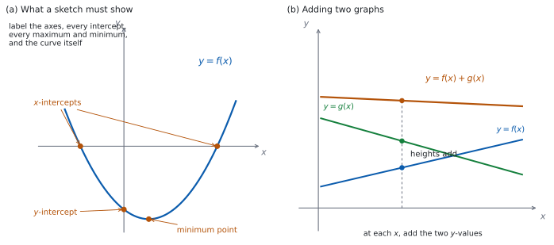

# SL 2.3 — The graph of a function（関数のグラフ） {#sec-aasl-2-3}

::: {.callout-note}
## What you should be able to do
- $y = f(x)$ の**グラフ**が何を表しているかを説明できる。
- **draw** と **sketch** のちがいを知り、求められたほうの書き方ができる。
- 軸と **key features**（重要な特徴）に、もれなく**ラベルをつけられる**。
- 表を作って、式に合った結び方（直線か、**なめらかな曲線**か）でグラフをかける。
- 文章で与えられた場面から、グラフを **sketch** できる。
- 電卓の画面のグラフを、**紙に写しかえられる**。
- $2$ つの関数の**和と差**のグラフが、どうできているかが分かる。
:::

## The idea

### 1. グラフは、点の集まり {#idea}

$y = f(x)$ の**グラフ**とは、$x$ を **domain**（定義域）の中で動かしたときにできる点

$$
\bigl(x, \ f(x)\bigr)
$$ {#eq-aasl23-point}

を**すべて集めたもの**です。

ですから、「点 $(p, q)$ がグラフの上にある」ことと「$q = f(p)$ が成り立つ」ことは、**同じことの言いかえ**です。

::: {.callout-tip}
## 点がグラフの上にあるかは、代入すれば分かります
$y = 2x + 1$ のグラフに、点 $(3, 7)$ はあるでしょうか。

$x = 3$ を入れると $2(3) + 1 = 7$ です。$y$ 座標と合ったので、**あります**。

$(1, 4)$ はどうでしょう。$2(1) + 1 = 3$ で、$4$ とはちがいます。だから**ありません**。

**グラフを見なくても、代入だけで決まります。**
:::

### 2. draw と sketch はちがいます {#draw-sketch}

シラバスの Guidance 欄に、はっきり書かれています。

> Students should be aware of the difference between the command terms "draw" and "sketch".

$2$ つの語は、シラバスの Glossary of command terms で次のように定義されています。

> **Draw**: Represent by means of a labelled, accurate diagram or graph, using a pencil. A ruler (straight edge) should be used for straight lines. Diagrams should be drawn to scale. Graphs should have points correctly plotted (if appropriate) and joined in a straight line or smooth curve.

> **Sketch**: Represent by means of a diagram or graph (labelled as appropriate). The sketch should give a general idea of the required shape or relationship, and should include relevant features.

| | **Draw** | **Sketch** |
|:--|:--|:--|
| 目盛り | **正確に**。方眼紙に合わせる | だいたいでよい |
| 道具 | 鉛筆。直線は**定規** | 手がきでよい |
| 点 | **正しい位置にとる** | とらなくてよい |
| 形 | 正確 | **形が伝わればよい** |
| ラベル | **必要** | **必要** |

: draw と sketch のちがい {#tbl-aasl23-drawsketch}

::: {.callout-important}
## この項目には、公式集の欄がありません
公式集（formula booklet）の Topic 2 に印刷されているのは、**2.1**（直線の方程式と gradient formula）、**2.6**（軸の式）、**2.7**（解の公式と判別式）だけです。

**2.3 の内容は、公式集には載っていません。**
:::

@tbl-aasl23-drawsketch でいちばん大事なのは、**いちばん下の行**です。Glossary の Sketch の定義は `labelled as appropriate` と書いていますが、Topic 2 の Guidance が「**All axes and key features should be labelled.**」と重ねて求めています。ですから**この項目では、どちらでもラベルは要ります。**

### 3. 何にラベルをつけるか {#labels}

シラバスは、こう求めています。

> All axes and key features should be labelled.

{#fig-aasl23-idea width=100%}

@fig-aasl23-idea の (a) は、**どこにラベルをつけるか**を示したものです。図では場所の名前だけを書いていますが、**答案では名前ではなく座標を書きます。** 何を、どう書くかを次の表にまとめます。

| ラベルするもの | 書き方 |
|:--|:--|
| 軸 | $x$、$y$（場面があるときは量と単位） |
| $x$ 切片・$y$ 切片 | **座標で**。$(4, 0)$ のように |
| 最大点・最小点 | **座標で**。$(-2, 5)$ のように |
| 漸近線（asymptote） | **式で**。$x = 2$、$y = 0$ のように。線は点線で（SL 2.8 で扱います） |
| 曲線そのもの | $y = f(x)$ |
| domain の端 | 制限があるときは、端の点も |

: key features とその書き方 {#tbl-aasl23-labels}

::: {.callout-warning}
## 印をつけるだけでは足りません
グラフに $\bullet$ を打っただけでは、**それがどこなのかが伝わりません。** $(3,0)$ のように**座標を書いてください**。

軸の目盛りに $3$ と書いてあって、そこから点まで点線が引いてあるなら、それでもかまいません。**読む人が値を読み取れること**が要です。
:::

### 4. 表を作ってかく {#table}

**draw** と言われたら、まず表を作ります。$y = x^{2} - 2$ を $-3 \le x \le 3$ でかいてみます。

| $x$ | $-3$ | $-2$ | $-1$ | $0$ | $1$ | $2$ | $3$ |
|:--|:--|:--|:--|:--|:--|:--|:--|
| $y$ | $7$ | $2$ | $-1$ | $-2$ | $-1$ | $2$ | $7$ |

: $y = x^{2}-2$ の値の表 {#tbl-aasl23-values}

@tbl-aasl23-values の $7$ つの点を打って、**なめらかな曲線**で結びます。

::: {.callout-warning}
## 点と点を、直線で結ばないでください
表に出てくるのは**とびとびの点**だけです。その間にも、グラフは続いています。

$y = x^{2}-2$ は $x = 0$ の近くでゆるやかに曲がっています。$(-1,-1)$、$(0,-2)$、$(1,-1)$ を線分で結ぶと、$2$ 本の線分が出会う $(0,-2)$ に**折れ曲がった角**ができてしまいます。実際には角はありません。

**式が曲線を表しているときは、曲線で結ぶ。** これが原則です。
:::

### 5. 場面からグラフをかく {#context}

文章で与えられた場面から、グラフを sketch する問題も出ます。次の順に決めます。

1. **何を横軸、何を縦軸にするか。** ふつう、時間などの「決めるほう」が横軸です。
2. **軸に、量と単位を書く。** 「$t$（分）」「$V$（リットル）」のように。
3. **始まりの点と終わりの点。** 場面の domain の両端です（[SL 2.2 の第 6 節](aasl-2-2.qmd#model)）。
4. **形。** 同じ時間に変わる**量**が同じなら直線（線分）。その量が変わっていくなら曲線。割合が途中で切りかわる場面なら、直線をつないだ**折れ線**になります。

::: {.callout-warning}
## 「毎分 $\square$ ずつ」が**同じ量**なら、直線です
「毎分 $8$ リットル**ずつ**減る」「毎時 $3$ cm **ずつ**短くなる」のように、**同じ時間に変わる「量」が同じ**なら、グラフは**直線**です。曲線にしてはいけません。

グラフが曲がるのは、**同じ時間に変わる量そのものが変わるとき**です。

**「$\%$ ずつ」は別です。** 「毎年 $5\%$ ずつ減る」は、減る「量」が毎年ちがう（もとの量が減っていくから）ので、直線にはなりません。日本語の「一定の割合」は $2$ とおりに読めるので、**「同じ量ずつ」なのか「同じ百分率ずつ」なのか**を、問題文で確かめてください。
:::

### 6. 画面から紙へ写す {#screen}

Paper 2 では、電卓の画面のグラフを紙に写すことがあります。シラバスは、これも項目の一部としています。

電卓の画面を写すときは、**画面をそのまま写すのではなく、読み取った値を書く**と考えてください。

1. **window（表示範囲）を決める。** 大事な部分が全部入るように。
2. **軸をかいて、ラベルと目盛りを書く。**
3. **切片、最大点、最小点を、電卓で読み取る。**（漸近線があるグラフは SL 2.8 で扱います。）
4. **その点を打ってから、式に合った結び方をする。** 直線を表す式なら定規で直線、曲線を表す式ならなめらかな曲線です。**画面でグラフが切れているところ（漸近線をまたぐところなど）は、つないではいけません。**
5. **読み取った座標を、グラフに書き込む。**

::: {.callout-tip collapse="true"}
## Paper 2 では、電卓の値を読み取ってから写します
TI-Nspire の Graphs 画面で、`menu → Analyze Graph` を開くと、`Zero`（$x$ 切片）、`Minimum`、`Maximum`、`Intersection`（交点）が読み取れます。表示範囲は `menu → Window/Zoom → Window Settings` で決められます。

**画面の絵を写すのではなく、読み取った座標を書き込んでください。** 画面の形だけを写すと、値のラベルが抜けます。

**画面の外に大事な部分があるかもしれません。** 表示範囲を広げて、切片や最大最小が他にもないかを確かめてください。

**Paper 1 では使えません。** このページの例題と演習は、すべて手で解ける形にしてあります。
:::

### 7. 和と差のグラフ {#sums}

関数どうしを足したり引いたりしたグラフも、この項目で扱います。

$2$ つの関数 $f$ と $g$ に対して、

$$
(f+g)(x) = f(x) + g(x), \qquad (f-g)(x) = f(x) - g(x)
$$ {#eq-aasl23-sum}

です。グラフでは、**同じ $x$ のところで、$y$ の値を足す（引く）**ことになります（@fig-aasl23-idea の (b)）。

**差のグラフには、特に大事な使い道があります。**

$$
f(x) = g(x) \quad \Longleftrightarrow \quad f(x) - g(x) = 0
$$ {#eq-aasl23-diff}

つまり、**$2$ つのグラフの交点の $x$ 座標**は、**$y = f(x) - g(x)$ のグラフの $x$ 切片の $x$ 座標**と同じものです。

## Why it works

**なぜ、$f(x) = g(x)$ の解が「$2$ つのグラフの交点の $x$ 座標」になるのでしょうか。**

点 $(p, q)$ が $2$ つのグラフの**両方**の上にあるとします。@eq-aasl23-point より、

- $y = f(x)$ の上にあるので、$q = f(p)$。
- $y = g(x)$ の上にあるので、$q = g(p)$。

$2$ つとも $q$ に等しいのですから、$f(p) = g(p)$ です。**交点の $x$ 座標は、$f(x) = g(x)$ の解になっています。**

逆に、$f(p) = g(p)$ となる $p$ があれば、その共通の値を $q$ とおくと、点 $(p,q)$ は両方のグラフの上にあります。**解があれば交点があり、交点があれば解がある**、というわけです。

ここで $h(x) = f(x) - g(x)$ とおくと、$f(p) = g(p)$ は $h(p) = 0$ と同じことです。$h(p) = 0$ は、**点 $(p, 0)$ が $y = h(x)$ のグラフの上にある**、つまり **$(p, 0)$ が $y = h(x)$ の $x$ 切片**だということです（@eq-aasl23-diff）。

**なぜ、表の点をなめらかな曲線で結ぶのでしょうか。** 理由は $2$ つあります。

**(i) 値がずれるから。** 表に書けるのは有限個の点だけですが、グラフはその間にも続いています。$(-1,-1)$ と $(0,-2)$ を線分で結ぶと、$x = -0.5$ での高さは $\dfrac{(-1)+(-2)}{2} = -1.5$ です。正しい値は $(-0.5)^{2}-2 = -1.75$ で、一致しません。

**(ii) ない角ができるから。** $y = x^{2}-2$ のような**多項式**のグラフには、とがった角ができません。線分で結ぶと、点を打ったところに**実際にはない角**を作ってしまいます。

**では、点と点の間の形は、どうやって決めるのでしょうか。** 式から判断します。表の点を増やせば、間の様子はもっとよく分かります。$y = x^{2}-2$ なら、$x = \pm 0.5$ を足してみると、底のあたりの丸みが見えてきます。

## Worked examples

::: {.callout-note appearance="simple"}
問題文は英語です。意味が理解できなかったら、問題文の下の「**日本語訳**」を開いてください。解説は日本語です。

**例題も演習も、すべて電卓なしで解けます。** Paper 1 のつもりで解いてください。
:::

::: {#exm-aasl23-features}
[The function $f$ is defined by $f(x) = x^{2} - 2x - 3$.]{.q-en}

**(a)** [Find the coordinates of the points where the graph of $y = f(x)$ crosses the $x$-axis.]{.q-en}

**(b)** [Write down the coordinates of the $y$-intercept.]{.q-en}

**(c)** [The graph has a minimum point at $x = 1$. Find its coordinates.]{.q-en}

**(d)** [Explain why a sketch of $y = f(x)$ does not need an accurate scale on the axes, while a drawing of $y = f(x)$ does.]{.q-en}

日本語訳

関数 $f$ は $f(x) = x^{2} - 2x - 3$ で定められています。

**(a)** $y = f(x)$ のグラフが $x$ 軸と交わる点の座標を求めなさい。

**(b)** $y$ 切片の座標を書きなさい。

**(c)** このグラフは $x = 1$ で最小になります。その点の座標を求めなさい。

**(d)** $y = f(x)$ の sketch には正確な目盛りが要らないのに、drawing には要る理由を説明しなさい。

---

**(a)** $y = 0$ とおいて解きます。因数分解できます。

$$
x^{2} - 2x - 3 = (x-3)(x+1) = 0
$$

$$
x = 3 \quad \text{または} \quad x = -1
$$

座標は $(3, 0)$ と $(-1, 0)$ です。**「$x = 3$」だけでは座標になりません**（[第 3 節](#labels)）。

**(b)** $x = 0$ を入れます。

$$
f(0) = 0 - 0 - 3 = -3
$$

$y$ 切片は $(0, -3)$ です。

**(c)** $x = 1$ を入れます。

$$
f(1) = 1 - 2 - 3 = -4
$$

最小点は $(1, -4)$ です。

**(d)** `Explain why` なので、英語で理由を書きます。

::: {.model-answer}
**試験ではこう書く**

*The two command terms ask for different things. A sketch only has to give a general idea of the shape and to show the relevant features, so the axes need labels but the spacing between the marks does not have to be accurate. A drawing must be an accurate diagram: the points have to be plotted in their correct positions and the diagram has to be to scale, so an accurate scale on the axes is necessary. Both a sketch and a drawing must have labelled axes and labelled key features.*
:::

（$2$ つの command term は、求めていることがちがう。sketch は形のあらましと重要な特徴を示せばよいので、軸にラベルは要るが、目盛りの間隔まで正確である必要はない。drawing は正確な図でなければならず、点は正しい位置にとり、図は縮尺どおりにかく必要があるので、軸の正確な目盛りが要る。sketch でも drawing でも、軸と重要な特徴のラベルは必要である、という意味です。）

**検算（(a) について）。** 出した $2$ 点を、**もとの式に入れ直します。**

$$
f(3) = 9 - 6 - 3 = 0, \qquad f(-1) = 1 + 2 - 3 = 0
$$

どちらも $0$ になりました ✓ **因数分解した式ではなく、もとの式に入れる**のが要です。

**検算（(c) について）。** 求めたのは $y$ 座標の $-4$ です。**因数分解した形に入れて、別の道すじで出します。** $f(1) = (1-3)(1+1) = (-2)(2) = -4$ ✓ 展開した式と因数分解した式の両方で $-4$ になりました。

**$x = 1$ が最小の位置であることも、確かめられます。** $2$ つの $x$ 切片 $3$ と $-1$ のまん中は $\dfrac{3+(-1)}{2} = 1$ で、問題文と合っています ✓（放物線が軸について左右対称であることを使いました。軸の式そのものは SL 2.6 で扱います。）

**$y$ 切片を $(-3, 0)$ と書いていたら**、座標の順番を取りちがえています。**$y$ 切片は $y$ 軸の上の点**なので、$x$ 座標が $0$ です。正しくは $(0, -3)$ です。

::: {.callout-note}
## 解答例（答案用紙に書くこと）
**(a)** $(x-3)(x+1) = 0$
$$(3, \ 0) \quad \text{and} \quad (-1, \ 0)$$

**(b)**
$$(0, \ -3)$$

**(c)** $f(1) = 1 - 2 - 3$
$$(1, \ -4)$$

**(d)** *A sketch only needs the general shape with labelled axes and features; a drawing must be accurate and to scale, with points plotted correctly, so it needs an accurate scale.*
:::
:::

::: {#exm-aasl23-reading}
[The function $g$ is defined by $g(x) = 4 - x^{2}$, with domain $-3 \le x \le 3$.]{.q-en}

**(a)** [Find $g(-3)$, $g(0)$ and $g(2)$.]{.q-en}

**(b)** [Write down the coordinates of the maximum point of the graph of $y = g(x)$.]{.q-en}

**(c)** [Find the coordinates of the points where the graph crosses the $x$-axis.]{.q-en}

**(d)** [Write down the range of $g$.]{.q-en}

日本語訳

関数 $g$ は $g(x) = 4 - x^{2}$（定義域は $-3 \le x \le 3$）で定められています。

**(a)** $g(-3)$、$g(0)$、$g(2)$ を求めなさい。

**(b)** $y = g(x)$ のグラフの最大点の座標を書きなさい。

**(c)** グラフが $x$ 軸と交わる点の座標を求めなさい。

**(d)** $g$ の値域を書きなさい。

---

**(a)** それぞれ入れます。

$$
g(-3) = 4 - 9 = -5, \qquad g(0) = 4 - 0 = 4, \qquad g(2) = 4 - 4 = 0
$$

**(b)** $-x^{2}$ は $0$ 以下なので、$g(x)$ がいちばん大きくなるのは $x = 0$ のときです。

最大点は $(0, 4)$ です。

**(c)** $y = 0$ とおきます。

$$
4 - x^{2} = 0 \ \Rightarrow \ x^{2} = 4 \ \Rightarrow \ x = 2 \ \text{または} \ x = -2
$$

座標は $(2, 0)$ と $(-2, 0)$ です。

**(d)** いちばん大きいのは (b) の $4$、いちばん小さいのは domain の端 $x = \pm 3$ での $-5$ です。

$$
-5 \le g(x) \le 4
$$

**検算（(c) について）。** 出した $x$ を、もとの式に入れ直します。$g(2) = 0$、$g(-2) = 4 - 4 = 0$ ✓ どちらも $x$ 軸の上にあります。

**検算（(d) について）。** **両端が実際に出るかを見ます。** $x = 3$ で $g(3) = 4 - 9 = -5$ ✓（$x = -3$ でも同じ）$x = 0$ で $4$ ✓ また、$4$ より大きい値は出ません。$g(x) = 5$ とすると $x^{2} = -1$ となり、実数の $x$ はないからです ✓

**$-5$ より小さい値も出ません。** domain が $-3 \le x \le 3$ なので $x^{2} \le 9$、したがって $g(x) = 4 - x^{2} \ge 4 - 9 = -5$ です ✓ **上端は式そのものから、下端は domain の制限から**決まっています。

**(d) を「$-5 \le x \le 4$」と書いていたら**、文字がちがいます。**range**（値域）は $g(x)$ で書きます。**$x$ の範囲は問題文に $-3 \le x \le 3$ と書いてあります。**

::: {.callout-note}
## 解答例（答案用紙に書くこと）
**(a)**
$$g(-3) = -5, \qquad g(0) = 4, \qquad g(2) = 0$$

**(b)**
$$(0, \ 4)$$

**(c)** $4 - x^{2} = 0$
$$(2, \ 0) \quad \text{and} \quad (-2, \ 0)$$

**(d)**
$$-5 \le g(x) \le 4$$
:::
:::

::: {#exm-aasl23-sums}
[The functions $f$ and $g$ are defined by $f(x) = x^{2} - 1$ and $g(x) = x + 1$.]{.q-en}

**(a)** [Find $(f+g)(2)$.]{.q-en}

**(b)** [Find an expression for $(f-g)(x)$.]{.q-en}

**(c)** [Find the values of $x$ for which $f(x) = g(x)$.]{.q-en}

**(d)** [Explain why the solutions of $f(x) = g(x)$ are the $x$-coordinates of the points where the two graphs meet.]{.q-en}

日本語訳

関数 $f$、$g$ は $f(x) = x^{2}-1$、$g(x) = x+1$ で定められています。

**(a)** $(f+g)(2)$ を求めなさい。

**(b)** $(f-g)(x)$ の式を求めなさい。

**(c)** $f(x) = g(x)$ となる $x$ の値を求めなさい。

**(d)** $f(x) = g(x)$ の解が、$2$ つのグラフが交わる点の $x$ 座標になる理由を説明しなさい。

---

**(a)** それぞれの値を出して、足します（@eq-aasl23-sum）。

$$
f(2) = 4 - 1 = 3, \qquad g(2) = 2 + 1 = 3
$$

$$
(f+g)(2) = 3 + 3 = 6
$$

**(b)** 式のまま引きます。**引くほうは、かっこでくくってください。**

$$
(f-g)(x) = (x^{2}-1) - (x+1) = x^{2} - 1 - x - 1 = x^{2} - x - 2
$$

**(c)** $f(x) = g(x)$ とおいて解きます。(b) の式が $0$ になるところです（@eq-aasl23-diff）。

$$
x^{2} - x - 2 = 0 \ \Rightarrow \ (x-2)(x+1) = 0
$$

$$
x = 2 \quad \text{または} \quad x = -1
$$

**(d)** `Explain why` なので、英語で理由を書きます。

::: {.model-answer}
**試験ではこう書く**

*A point lies on the graph of $y = f(x)$ exactly when its coordinates satisfy $y = f(x)$, and likewise for $y = g(x)$. Suppose the point $(p, q)$ lies on both graphs. Then $q = f(p)$ and $q = g(p)$, so $f(p) = g(p)$ and $p$ is a solution of $f(x) = g(x)$. Conversely, if $f(p) = g(p)$, let $q$ be this common value; then $(p, q)$ lies on both graphs, so it is a point where they meet. The solutions of $f(x) = g(x)$ are therefore exactly the $x$-coordinates of the points of intersection.*
:::

（点が $y = f(x)$ のグラフの上にあるのは、その座標が $y = f(x)$ を満たすとき、ちょうどそのときである。$y = g(x)$ についても同じ。点 $(p,q)$ が両方のグラフの上にあるとすると、$q = f(p)$ かつ $q = g(p)$ なので $f(p) = g(p)$ となり、$p$ は $f(x)=g(x)$ の解である。逆に $f(p)=g(p)$ ならば、その共通の値を $q$ とおくと $(p,q)$ は両方のグラフの上にあるので、交点である。したがって $f(x)=g(x)$ の解は、ちょうど交点の $x$ 座標である、という意味です。）

**検算（(a) について）。** **和の式を先に作る道すじでも出します。** $(f+g)(x) = (x^{2}-1) + (x+1) = x^{2}+x$ なので、$x = 2$ で $4 + 2 = 6$ ✓ 別の順で計算しても同じ値になりました。

**検算（(c) について）。** 出した $x$ を、**$f$ と $g$ の両方**に入れます。

$$
x = 2: \quad f(2) = 3, \quad g(2) = 3 \quad \text{（等しい）}
$$

$$
x = -1: \quad f(-1) = 0, \quad g(-1) = 0 \quad \text{（等しい）}
$$

どちらも合いました ✓ **(b) で作った差の式ではなく、もとの $2$ 式に入れる**のが要です。(b) を写しまちがえていても、これなら見つかります。

::: {.callout-note}
## 解答例（答案用紙に書くこと）
**(a)** $f(2) = 3$, $g(2) = 3$
$$(f+g)(2) = 6$$

**(b)**
$$(f-g)(x) = (x^{2}-1)-(x+1) = x^{2}-x-2$$

**(c)** $x^{2}-x-2 = 0$, $(x-2)(x+1) = 0$
$$x = 2 \quad \text{or} \quad x = -1$$

**(d)** *If $(p,q)$ lies on both graphs then $q = f(p)$ and $q = g(p)$, so $f(p) = g(p)$; conversely a solution $p$ gives a common point $(p, f(p))$. So the solutions are the $x$-coordinates of the intersections.*
:::
:::

::: {#exm-aasl23-context}
[A candle is $24$ cm tall. It burns down at a constant rate of $3$ cm per hour. Let $h(t)$ be the height of the candle, in cm, after $t$ hours.]{.q-en}

**(a)** [Write down an expression for $h(t)$.]{.q-en}

**(b)** [Find the value of $t$ at which the candle has burnt out.]{.q-en}

**(c)** [State the domain of $h$ in this context.]{.q-en}

**(d)** [A student sketches the graph of $h$ against $t$ as a curve that becomes less steep as $t$ increases. Comment on this sketch.]{.q-en}

日本語訳

あるろうそくの高さは $24$ cm で、$1$ 時間に $3$ cm ずつ一定の割合で短くなります。$t$ 時間後の高さを、cm で $h(t)$ とします。

**(a)** $h(t)$ の式を書きなさい。

**(b)** ろうそくが燃えつきる $t$ の値を求めなさい。

**(c)** この場面での $h$ の定義域を述べなさい。

**(d)** ある生徒が、$h$ を $t$ に対してかいたグラフを「$t$ が増えるにつれて傾きがゆるくなる曲線」として sketch しました。この sketch について述べなさい。

---

**(a)** はじめの高さから、減った分を引きます。

$$
h(t) = 24 - 3t
$$

**(b)** 燃えつきるのは $h(t) = 0$ のときです。

$$
24 - 3t = 0 \ \Rightarrow \ 3t = 24 \ \Rightarrow \ t = 8
$$

$8$ 時間後です。

**(c)** 時間は負になりませんし、燃えつきたあとはこの式が使えません（[第 5 節](#context)）。

$$
0 \le t \le 8
$$

**(d)** `Comment on` なので、英語で判断とその理由を書きます。

::: {.model-answer}
**試験ではこう書く**

*The sketch is not correct. The candle burns down at a constant rate of $3$ cm per hour, so the height decreases by the same amount in every hour and the rate of change does not alter. A graph whose steepness changes represents a rate of change that is not constant, so the graph should be a straight line segment of gradient $-3$, not a curve. It should run from $(0, 24)$ to $(8, 0)$, and both axes should be labelled with the quantity and its unit.*
:::

（この sketch は正しくない。ろうそくは $1$ 時間に $3$ cm という一定の割合で短くなるので、どの $1$ 時間でも減る量は同じであり、変化の割合は変わらない。傾きが変わるグラフは変化の割合が一定でないことを表すので、グラフは曲線ではなく、傾き $-3$ の線分でなければならない。線分は $(0,24)$ から $(8,0)$ までであり、両方の軸に量と単位のラベルを書くべきである、という意味です。）

**検算（(b) について）。** **別の道すじでも出します。** $1$ 時間で $3$ cm 減るので、$24$ cm 減るには $24 \div 3 = 8$ 時間かかります ✓ 式を解かずに出せました。

**検算（(c) について）。** **両端が意味をもつかを見ます。** $t = 0$ で $h(0) = 24$（はじめの高さ）✓ $t = 8$ で $h(8) = 24 - 24 = 0$（燃えつきた）✓

**検算（(a) について）。** $1$ 時間後を数えます。$h(1) = 24 - 3 = 21$ で、たしかに $3$ cm 減っています ✓

::: {.callout-note}
## 解答例（答案用紙に書くこと）
**(a)**
$$h(t) = 24 - 3t$$

**(b)** $24 - 3t = 0$
$$t = 8 \ \text{hours}$$

**(c)**
$$0 \le t \le 8$$

**(d)** *Not correct. The rate is constant, so the graph is a straight line segment from $(0,24)$ to $(8,0)$ with gradient $-3$, not a curve.*
:::
:::

## Common errors

::: {.callout-warning}
## sketch だからといって、ラベルを省く
sketch でも drawing でも、**軸と key features のラベルは必要**です（@tbl-aasl23-drawsketch）。

sketch で省いてよいのは、**目盛りの正確さ**だけです。
:::

::: {.callout-warning}
## 切片を「$x = 3$」とだけ書く
`coordinates` を求められたら、**$(3, 0)$ のように座標で**書きます（@tbl-aasl23-labels）。

グラフに書き込むときも同じです。**印だけでは、どこなのかが伝わりません。**
:::

::: {.callout-warning}
## 表の点を、直線で結ぶ
曲線を表す式なら、**なめらかな曲線**で結びます（[第 4 節](#table)）。

とがった角ができていたら、たいてい結び方の誤りです。
:::

::: {.callout-warning}
## 画面に見えている範囲だけで判断する
表示範囲の外に、切片や最大最小があるかもしれません（[第 6 節](#screen)）。

**範囲を広げて確かめてから**、紙に写してください。
:::

::: {.callout-warning}
## 同じ量ずつ変わる場面を、曲線でかく
同じ時間に変わる量が同じなら、グラフは**直線**です（[第 5 節](#context)）。

「毎分 $\square$ リットル」「毎時 $\square$ cm」「$1$ 個あたり $\square$ 円」のように、**単位あたりの「量」**が示されていたら、**まず直線を疑ってください。** ただし「毎年 $\square\%$」のように**百分率**で与えられているときは、直線ではありません。
:::

::: {.callout-warning}
## 交点を聞かれているのに、$x$ だけ答える
`Find the coordinates of the point of intersection` なら、**$x$ と $y$ の両方**が要ります。$f(x) = g(x)$ を解いて $x$ を出したら、どちらかの式に戻して $y$ も出してください。

逆に `Find the values of x` なら、$x$ だけでよいことになります。**問題文がどちらを求めているか**を読んでください。
:::

## Exercises

::: {.callout-note appearance="simple"}
各問題に、折りたたみが $3$ つ付いています。**日本語訳**、**解答例**（答案用紙に書くべきこと。英語です）、**解説**（なぜそうなるか。日本語です）。

まず自分で解いて、次に解答例と見くらべてください。**解説は、合わなかったときだけ開けば十分です。**
:::

::: {.exercise-block}

[1]{.ex-no} [Find the coordinates of the $x$-intercept and the $y$-intercept of the graph of $y = 2x - 6$.]{.q-en}

日本語訳

$y = 2x - 6$ のグラフの $x$ 切片と $y$ 切片の座標を求めなさい。

::: {.callout-note collapse="true"}
## 解答例（答案用紙に書くこと）

$y = 0$: $2x - 6 = 0$, so $x = 3$
$$(3, \ 0)$$

$x = 0$: $y = -6$
$$(0, \ -6)$$
:::

::: {.callout-tip collapse="true"}
## 解説

$x$ 切片は $y = 0$、$y$ 切片は $x = 0$ です。**座標で答えます**（@tbl-aasl23-labels）。

**検算。** $x$ 切片は、もとの式に入れ直します。$2(3) - 6 = 0$ ✓ $y$ 切片は、**傾きから数え直します。** $x = 3$ で $y = 0$ なので、$x$ を $3$ 減らすと $y$ は $2 \times 3 = 6$ 減って $-6$ ✓ **代入とはちがう道すじです。**

**符号の見当も付きます。** 傾きが正で $y$ 切片が負なので、$x$ 切片は正のはずです ✓
:::

::: {.ex-sep}
:::

[2]{.ex-no} [Find the coordinates of the points where the graph of $y = x^{2} - 9$ crosses the axes.]{.q-en}

日本語訳

$y = x^{2} - 9$ のグラフが座標軸と交わる点の座標を求めなさい。

::: {.callout-note collapse="true"}
## 解答例（答案用紙に書くこと）

$y = 0$: $x^{2} = 9$
$$(3, \ 0) \quad \text{and} \quad (-3, \ 0)$$

$x = 0$: $y = -9$
$$(0, \ -9)$$
:::

::: {.callout-tip collapse="true"}
## 解説

`the axes` は**両方の軸**です。$x$ 軸との交点が $2$ つ、$y$ 軸との交点が $1$ つで、合わせて $3$ 点あります。

**$x^{2} = 9$ の解を $x = 3$ だけにしないでください。** $-3$ も解です。

**検算。** $x$ 切片は、もとの式に入れ直します。$3^{2}-9 = 0$ ✓ $(-3)^{2}-9 = 0$ ✓ $y$ 切片は、**因数分解した形からも出します。** $y = (x-3)(x+3)$ なので $x = 0$ で $(-3)(3) = -9$ ✓

**個数の見当も付きます。** 下に凸で $y$ 切片が負なので、$x$ 軸と $2$ 点で交わるはずです ✓
:::

::: {.ex-sep}
:::

[3]{.ex-no} [The table below is to be completed for $y = x^{2} - 2x$.]{.q-en}

| $x$ | $-1$ | $0$ | $1$ | $2$ | $3$ |
|:--|:--|:--|:--|:--|:--|
| $y$ | | | | | |

[Find the five missing values of $y$.]{.q-en}

日本語訳

上の表は、$y = x^{2}-2x$ の値の表です（$y$ の欄は空です）。$5$ つの $y$ の値を求めなさい。

::: {.callout-note collapse="true"}
## 解答例（答案用紙に書くこと）

$$3, \quad 0, \quad -1, \quad 0, \quad 3$$
:::

::: {.callout-tip collapse="true"}
## 解説

$1$ つずつ代入します。$x = -1$ では $(-1)^{2} - 2(-1) = 1 + 2 = 3$ です。**負の数を $2$ 乗すると正**になり、$-2x$ も正になります。

**検算。** **左右対称になっているはず**です。$y = x^{2}-2x = x(x-2)$ なので $x = 0$ と $x = 2$ で $0$ になり、そのまん中の $x = 1$ が最小です。$x = -1$ と $x = 3$ は $x = 1$ から同じだけ離れているので、値も**等しいはず**です。どちらも $3$ ✓ **値そのものは、因数分解した形で確かめます。** $x = 3$ で $3(3-2) = 3$ ✓ $x = -1$ で $(-1)(-1-2) = 3$ ✓

**この $5$ 点を打ったら、なめらかな曲線で結んでください**（[第 4 節](#table)）。
:::

::: {.ex-sep}
:::

[4]{.ex-no} [The functions $f$ and $g$ are defined by $f(x) = x^{2}$ and $g(x) = 2x + 3$.]{.q-en}

**(a)** [Find an expression for $(f+g)(x)$.]{.q-en}

**(b)** [Find $(f+g)(1)$.]{.q-en}

日本語訳

関数 $f$、$g$ は $f(x) = x^{2}$、$g(x) = 2x+3$ で定められています。

**(a)** $(f+g)(x)$ の式を求めなさい。

**(b)** $(f+g)(1)$ を求めなさい。

::: {.callout-note collapse="true"}
## 解答例（答案用紙に書くこと）

**(a)**
$$(f+g)(x) = x^{2} + 2x + 3$$

**(b)**
$$(f+g)(1) = 1 + 2 + 3 = 6$$
:::

::: {.callout-tip collapse="true"}
## 解説

和は、そのまま足すだけです（@eq-aasl23-sum）。

**検算（(b) について）。** **足す前の値からも出します。** $f(1) = 1$、$g(1) = 5$ なので $1 + 5 = 6$ ✓ (a) の式を経由しない道すじです。(a) を写しまちがえていても、これで見つかります。
:::

::: {.ex-sep}
:::

[5]{.ex-no} [The functions $f$ and $g$ are defined by $f(x) = x^{2} + 2x$ and $g(x) = 3$. Find the values of $x$ for which $f(x) = g(x)$.]{.q-en}

日本語訳

関数 $f$、$g$ は $f(x) = x^{2}+2x$、$g(x) = 3$ で定められています。$f(x) = g(x)$ となる $x$ の値を求めなさい。

::: {.callout-note collapse="true"}
## 解答例（答案用紙に書くこと）

$$x^{2} + 2x = 3$$

$$x^{2} + 2x - 3 = 0, \qquad (x+3)(x-1) = 0$$

$$x = -3 \quad \text{or} \quad x = 1$$
:::

::: {.callout-tip collapse="true"}
## 解説

**片側に集めてから**因数分解します（@eq-aasl23-diff）。$g$ は定数関数なので、グラフは横向きの直線です。

**検算。** 出した $x$ を、**$f$ と $g$ の両方**に入れます。$f(-3) = 9 - 6 = 3 = g(-3)$ ✓ $f(1) = 1 + 2 = 3 = g(1)$ ✓

**問われているのは $x$ の値**なので、これで終わりです。もし `coordinates of the points of intersection` と書かれていたら、$y = 3$ も添えます。
:::

::: {.ex-sep}
:::

[6]{.ex-no} [A tank holds $500$ litres of water. Water drains out at a constant rate of $25$ litres per minute. Let $V(t)$ be the volume of water, in litres, after $t$ minutes.]{.q-en}

**(a)** [Write down an expression for $V(t)$.]{.q-en}

**(b)** [Find the time at which the tank is empty.]{.q-en}

**(c)** [Write down the coordinates of the two endpoints of the graph of $V$ against $t$ in this context.]{.q-en}

日本語訳

あるタンクに $500$ リットルの水が入っています。水は毎分 $25$ リットルの一定の割合で流れ出ます。$t$ 分後の水の量を、リットルで $V(t)$ とします。

**(a)** $V(t)$ の式を書きなさい。

**(b)** タンクが空になる時刻を求めなさい。

**(c)** この場面で、$V$ を $t$ に対してかいたグラフの両端の点の座標を書きなさい。

::: {.callout-note collapse="true"}
## 解答例（答案用紙に書くこと）

**(a)**
$$V(t) = 500 - 25t$$

**(b)** $500 - 25t = 0$
$$t = 20 \ \text{minutes}$$

**(c)**
$$(0, \ 500) \quad \text{and} \quad (20, \ 0)$$
:::

::: {.callout-tip collapse="true"}
## 解説

一定の割合なので、グラフは**線分**です（[第 5 節](#context)）。両端は、場面の domain の両端に当たります。

**検算（(b) について）。** **割り算でも出します。** $500 \div 25 = 20$ ✓ 式を解かずに出せました。

**検算（(c) について）。** 両端を、もとの式に入れ直します。$V(0) = 500$ ✓ $V(20) = 500 - 500 = 0$ ✓

**軸のラベルも忘れないでください。** 横軸は $t$（分）、縦軸は $V$（リットル）です。
:::

::: {.ex-sep}
:::

[7]{.ex-no} [The function $f$ is defined by $f(x) = (x+2)(x-4)$. The minimum point of the graph occurs at $x = 1$. Sketch the graph of $y = f(x)$ for $-3 \le x \le 5$, labelling the axes, the $x$-intercepts, the $y$-intercept and the minimum point with their coordinates.]{.q-en}

日本語訳

関数 $f$ は $f(x) = (x+2)(x-4)$ で定められています。グラフの最小点は $x = 1$ にあります。$-3 \le x \le 5$ で $y = f(x)$ のグラフを sketch し、軸、$x$ 切片、$y$ 切片、最小点に座標のラベルをつけなさい。

::: {.callout-note collapse="true"}
## 解答例（答案用紙に書くこと）

A parabola opening upwards, with the axes labelled $x$ and $y$, and these points labelled:

$$(-2, \ 0), \qquad (4, \ 0), \qquad (0, \ -8), \qquad (1, \ -9)$$

*the curve is drawn only for* $-3 \le x \le 5$, *so it stops at* $(-3, \ 7)$ *and* $(5, \ 7)$

{#fig-aasl23-ex7 width=100%}
:::

::: {.callout-tip collapse="true"}
## 解説

$x$ 切片は $(x+2)(x-4) = 0$ から $x = -2$ と $x = 4$、$y$ 切片は $f(0) = (2)(-4) = -8$ です。最小点の $x = 1$ は問題文で与えられているので、$f(1) = (3)(-3) = -9$ を計算するだけです。**なぜ $x = 1$ なのか**（$2$ つの $x$ 切片のまん中になること）は、[SL 2.7a](aasl-2-7a.qmd) で学びます。

**sketch なので、目盛りの間隔は正確でなくてかまいません**（@tbl-aasl23-drawsketch）。**ただしラベルは要ります。** $\bullet$ を打つだけでなく、座標を書いてください。

**検算。** $y$ 切片と最小点を、**展開した式からも出します。** $f(x) = x^{2}-2x-8$ なので $f(0) = -8$ ✓ $f(1) = 1 - 2 - 8 = -9$ ✓ どちらも因数分解した形とはちがう道すじです。

**形の見当も付きます。** $x^{2}$ の係数が正なので下に凸、$y$ 切片が負なので $x$ 軸を $2$ 点で横切ります ✓ 与えられた範囲 $-3 \le x \le 5$ に、$4$ つの点はすべて入っています ✓

**検算（端点）。** $f(-3) = (-1)(-7) = 7$、$f(5) = (7)(1) = 7$ ✓ **範囲が指定されているので、そこで曲線を止めます。** 両端は $2$ つとも $y = 7$ で、左右対称です（軸が $x = 1$ だからです）。
:::

::: {.ex-sep}
:::

[8]{.ex-no} [The point $(4, k)$ lies on the graph of $y = 3x - 5$.]{.q-en}

**(a)** [Find the value of $k$.]{.q-en}

**(b)** [Determine whether the point $(2, 2)$ lies on the same graph.]{.q-en}

日本語訳

点 $(4, k)$ は $y = 3x - 5$ のグラフの上にあります。

**(a)** $k$ の値を求めなさい。

**(b)** 点 $(2,2)$ が同じグラフの上にあるかどうかを判断しなさい。

::: {.callout-note collapse="true"}
## 解答例（答案用紙に書くこと）

**(a)** $k = 3(4) - 5$
$$k = 7$$

**(b)** $3(2) - 5 = 1 \neq 2$

*The point $(2, 2)$ does not lie on the graph.*
:::

::: {.callout-tip collapse="true"}
## 解説

「点がグラフの上にある」は「座標が式を満たす」と同じことです（[第 1 節](#idea)）。**代入して確かめるだけ**です。

**検算（(a) について）。** **傾きから数え直します。** $x = 0$ のとき $y = -5$ で、$x$ が $1$ 増えるごとに $y$ は $3$ 増えます。$x = 0$ から $x = 4$ までに $3 \times 4 = 12$ 増えるので、$y = -5 + 12 = 7$ ✓ 代入とはちがう道すじで、同じ値になりました。

**検算（(b) について）。** **$x$ から $y$ を出すのではなく、逆向きにも見ます。** $y = 2$ になる $x$ を求めると $3x - 5 = 2$ から $x = \dfrac{7}{3}$ です。$2$ ではないので、点 $(2,2)$ はグラフの上にありません ✓ **同じ結論が、別の道すじからも出ました。**
:::

::: {.ex-sep}
:::

[9]{.ex-no} [A student draws the graph of $y = x^{2}$ from a table of values by joining the plotted points with straight line segments.]{.q-en}

**(a)** [Find the height of the student's line segment from $(1, 1)$ to $(2, 4)$ at $x = 1.5$, and the correct value of $y$ at $x = 1.5$.]{.q-en}

**(b)** [Hence explain why the plotted points should be joined with a smooth curve.]{.q-en}

日本語訳

ある生徒が、値の表から $y = x^{2}$ のグラフを draw するとき、打った点を線分で結びました。

**(a)** $(1,1)$ から $(2,4)$ への線分の $x = 1.5$ における高さと、$x = 1.5$ における正しい $y$ の値を求めなさい。

**(b)** よって、打った点をなめらかな曲線で結ぶべき理由を説明しなさい。

::: {.callout-note collapse="true"}
## 解答例（答案用紙に書くこと）

**(a)** Segment: $\dfrac{1+4}{2} = 2.5$. Correct value: $1.5^{2} = 2.25$

**(b)** *The segment passes above the curve, so joining with straight segments gives wrong values between the plotted points. It also creates corners, which the graph of $y = x^{2}$ does not have.*
:::

::: {.callout-tip collapse="true"}
## 解説

**(a)** $x = 1.5$ は $1$ と $2$ のまん中なので、線分の高さは両端の $y$ の平均です。正しい値は、式に入れるだけです。

**(b)** `Hence` なので、**(a) で出した $2$ つの数を根拠に使います。** 理由を $2$ つ書くと確実です。「値がずれること」と「実際にはない角ができること」です。

**検算（(a) について）。** 線分の高さを、**傾きからも出します。** $(1,1)$ から $(2,4)$ への傾きは $\dfrac{4-1}{2-1} = 3$ です。$(1,1)$ から $x$ を $0.5$ 進めると $y$ は $1.5$ 増えて $1 + 1.5 = 2.5$ ✓ 平均とはちがう道すじで、同じ値になりました。

**ずれの向きも見ておきます。** $2.5 > 2.25$ なので、線分は正しい曲線より**上**を通ります ✓ 下に凸の曲線では、いつもこうなります。

**「きれいだから」は理由になりません。** 値がちがってしまう、というのが理由です。

::: {.model-answer}
**試験ではこう書く**

*At $x = 1.5$ the straight segment has height $2.5$, but the correct value is $1.5^{2} = 2.25$, so the segment passes above the curve and gives incorrect values between the plotted points. Joining with segments would also create corners at the plotted points, and the graph of $y = x^{2}$ has no corners. A smooth curve follows the function between the points.*
:::
:::

::: {.ex-sep}
:::

[10]{.ex-no} [A student is asked to find where the graph of $y = x^{2} - 4$ crosses the $x$-axis, and writes]{.q-en}

$$
x^{2} = 4, \qquad \text{the graph crosses the } x \text{-axis at } y = 2 \text{ and } y = -2
$$

[Identify the error in the student's answer, and write down the correct coordinates.]{.q-en}

日本語訳

ある生徒が、$y = x^{2}-4$ のグラフが $x$ 軸と交わるところを求めるように言われ、上のように書きました。

生徒の答えの誤りを指摘し、正しい座標を書きなさい。

::: {.callout-note collapse="true"}
## 解答例（答案用紙に書くこと）

*The values $2$ and $-2$ are values of $x$, not of $y$, and the answer should be given as coordinates.*

$$(2, \ 0) \quad \text{and} \quad (-2, \ 0)$$
:::

::: {.callout-tip collapse="true"}
## 解説

`Identify the error` なので、**どこが違うのかを名指し**してから、正しい答えを書きます。

誤りは $2$ つ重なっています。**(i) 文字がちがう**（$2$ と $-2$ は $x$ の値）。**(ii) 座標になっていない**（点を聞かれています）。

$x$ 軸の上の点は、**$y$ 座標が $0$** です。$x$ 軸と交わるところを求めるのに $y = 0$ とおいたのですから、答えの $y$ 座標が $0$ でないのはおかしい、と気づけます。

**検算。** 正しい座標を、もとの式に入れます。$(2)^{2} - 4 = 0$ ✓ $(-2)^{2} - 4 = 0$ ✓ どちらも $y = 0$ で、$x$ 軸の上にあります。

**生徒の書いた「$y = 2$」が成り立つ点を探すと**、誤りがはっきりします。$x^{2}-4 = 2$ を解くと $x^{2} = 6$ で、これは $x$ 軸との交点ではありません ✓ **$x$ 軸の上では $y = 0$** なのですから、答えに $y = 2$ が出てくること自体がおかしい、と気づけます。

::: {.model-answer}
**試験ではこう書く**

*The student solved $x^{2} = 4$ correctly, but then wrote the answers as values of $y$. The numbers $2$ and $-2$ are values of $x$. Also, the question asks where the graph crosses the axis, so the answer should be given as coordinates. On the $x$-axis the $y$-coordinate is $0$, so the correct points are $(2, 0)$ and $(-2, 0)$.*
:::
:::

:::
