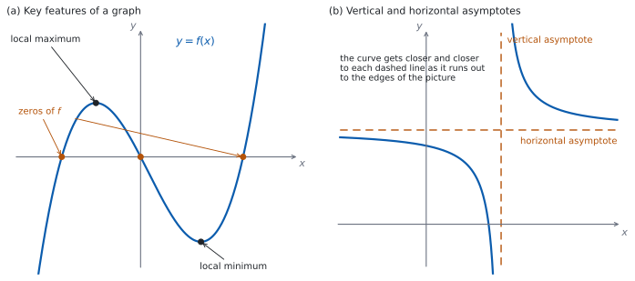

# SL 2.4 — Key features of graphs（グラフの重要な特徴） {#sec-aasl-2-4}

::: {.callout-note}
## What you should be able to do
- グラフの **key features**（重要な特徴）が何を指すかを言える。
- **intercepts**（切片）と **zeros**（零点）・**roots**（解）の関係が分かる。
- **local maximum**（極大）と **local minimum**（極小）を、座標で書ける。
- **maximum value**（最大値）が、極大の値とは別ものであることが分かる。
- **symmetry**（対称性）と **vertex**（頂点）を見つけられる。
- **vertical asymptote**（垂直漸近線）と **horizontal asymptote**（水平漸近線）の式を求められる。
- $2$ つのグラフの**交点の座標**を求められる。
- どの特徴が**式で出せて**、どれが**電卓向き**かを見分けられる。
:::

## The idea

### 1. key features とは、この $6$ つ {#idea}

グラフについて「特徴を述べなさい」と言われたとき、IB が求めているものは決まっています。シラバスの Guidance 欄が、次のように並べています。

> Maximum and minimum values; intercepts; symmetry; vertex; zeros of functions or roots of equations; vertical and horizontal asymptotes using graphing technology.

| key feature | 日本語 | どこを見るか |
|:--|:--|:--|
| intercepts | 切片 | 軸との交わり |
| zeros / roots | 零点・解 | $f(x) = 0$ になる $x$ |
| maximum / minimum | 極大・極小 | 山の頂上、谷の底 |
| symmetry | 対称性 | 折り返して重なるか |
| vertex | 頂点 | 放物線の折り返しの点 |
| asymptotes | 漸近線 | 近づいていく直線 |

: key features の一覧 {#tbl-aasl24-list}

{#fig-aasl24-idea width=100%}

@tbl-aasl24-list の並びは、そのまま答案の見直しの手順に使えます。@fig-aasl24-idea の (a) は、このうち zeros と local maximum・local minimum を $1$ つの曲線の上で示したものです。(b) は[第 5 節](#asymptotes)で使います。

### 2. intercepts と zeros / roots {#zeros}

この $3$ つの言葉は、**同じ場所を指しているのに、指しているものがちがいます。**

| 言葉 | 何を指すか | 書き方 |
|:--|:--|:--|
| $x$-intercept | **点** | $(3, 0)$ |
| zero of $f$ | **$x$ の値** | $x = 3$ |
| root of $f(x)=0$ | **$x$ の値** | $x = 3$ |

: 同じ場所でも、指すものがちがう {#tbl-aasl24-zeros}

**`intercept` は点を指す言葉、`zero` と `root` は数を指す言葉**です（@tbl-aasl24-zeros）。試験で減点されるとは限りませんが、**聞かれた形に合わせて書く**のがいちばん安全です。

`zero` は**関数**について、`root` は**方程式**について使う言い方です。$f(x) = x^{2}-9$ の zeros は $x = 3$ と $x = -3$、方程式 $x^{2}-9 = 0$ の roots も $x = 3$ と $x = -3$ です。

$y$-intercept は、$x = 0$ を入れるだけです。**$y$ 切片は、あっても $1$ つだけ**です（$1$ つの $x$ に $y$ は $1$ つしかないからです）。$x$-intercept は、いくつあってもかまいません。

### 3. maximum と minimum {#maxmin}

**local maximum（極大）**とは、**その近くでいちばん高い点**のことです。**local minimum（極小）**は、その近くでいちばん低い点です。

::: {.callout-warning}
## 「極大」は「いちばん大きい」ではありません
@fig-aasl24-idea の (a) の local maximum より、グラフの右のほうはもっと高くなっています。**局所的に見て高い**というだけです。

`Find the maximum value of` $f$ と言われたら、**domain の中でいちばん大きい値**を答えます。極大の値がそのまま答えになるとは限りません。**domain の端の値も、候補に入れてください。**
:::

答えるときは、**座標**で書きます。「local minimum は $-4$」ではなく「local minimum は $(3, -4)$」です。ただし `Find the minimum value` と言われたら、値だけ（$-4$）で答えます。

### 4. symmetry と vertex {#symmetry}

放物線（parabola）は、**頂点（vertex）を通る縦の直線**について左右対称です。

$x$ 切片が $2$ つあるなら、**そのまん中**が対称の軸です。

$$
x = \frac{(\text{$1$ つめの } x \text{ 切片}) + (\text{$2$ つめの } x \text{ 切片})}{2}
$$ {#eq-aasl24-axis}

::: {.callout-important}
## この式は、公式集にありません
公式集（formula booklet）の Topic 2 に印刷されているのは、**2.1**（直線の方程式と gradient formula）、**2.6**（軸の式）、**2.7**（解の公式と判別式）だけです。

@eq-aasl24-axis のような **2.4 の内容は、公式集には載っていません。** 使えるようにしておいてください。
:::

$y$ 軸について対称かどうかは、**式で確かめられます。**

$$
f(-x) = f(x) \ \text{が、すべての } x \text{ で成り立つ} \quad \Longleftrightarrow \quad y \text{ 軸について対称}
$$ {#eq-aasl24-even}

$f(x) = x^{4} - 5x^{2} + 4$ なら、$(-x)^{4} = x^{4}$、$(-x)^{2} = x^{2}$ なので $f(-x) = f(x)$ です。ですから $y$ 軸について対称です。

::: {.callout-warning}
## 対称かどうかは、見た目で決めないでください
グラフを見て「対称っぽい」だけでは根拠になりません。**$f(-x)$ を計算して、$f(x)$ と同じになるか**を見てください（@eq-aasl24-even）。

$f(x) = x^{2} + x$ は、$f(-x) = x^{2} - x$ で、$f(x)$ とはちがいます。**$y$ 軸については対称ではありません**（別の縦の直線については対称です）。
:::

### 5. asymptotes（漸近線） {#asymptotes}

**asymptote（漸近線）**とは、グラフが**どこまでも近づいていく直線**のことです（@fig-aasl24-idea の (b)）。

**分数の形をした関数**では、**vertical asymptote（垂直漸近線）** は、**分母が $0$ になるところ**にできます。ただし、そこで**分子が $0$ でないこと**が要ります。（分数の形でない関数にも垂直漸近線をもつものがありますが、SL でこの形で問われるのは、ほとんどが分数の形です。）

**horizontal asymptote（水平漸近線）** は、**$x$ をどこまでも大きく（小さく）していったとき、$y$ が近づく値**です。

$p(x) = \dfrac{1}{x-1} + 2$ で見ます。

- $x = 1$ で分母が $0$、分子は $1$ で $0$ ではありません。→ 垂直漸近線は $x = 1$。
- $x$ を大きくすると $\dfrac{1}{x-1}$ は $0$ に近づくので、$p(x)$ は $2$ に近づきます。→ 水平漸近線は $y = 2$。

::: {.callout-warning}
## 漸近線は、**式**で書きます
「垂直漸近線は $1$」ではなく、**$x = 1$** です。直線なので、直線の式で書きます。

グラフにかき込むときは、**点線**で引いて、そのそばに式を書いてください。
:::

### 6. $2$ つのグラフの交点 {#intersection}

$y = f(x)$ と $y = g(x)$ の交点は、[SL 2.3 の第 7 節](aasl-2-3.qmd#sums)で見たとおり $f(x) = g(x)$ を解いて求めます。

**求めるのが「座標」なら、$y$ も出してください。**

$$
f(x) = g(x) \ \text{を解いて } x \text{ を出す} \ \longrightarrow \ \text{どちらかの式に戻して } y \text{ を出す}
$$ {#eq-aasl24-meet}

**戻すのは、どちらの式でもかまいません。** 交点では $2$ つの値が等しいからです。むしろ、**もう一方の式にも入れて同じ $y$ になるか**を見れば、それが検算になります。

### 7. 式で出すか、電卓で出すか {#how}

シラバスは、この項目に **using graphing technology** と書き添えています。ただし **AA の Paper 1 は電卓なし**なので、手で出せるものは手で出せなければなりません。@tbl-aasl24-how が、その分かれ目です。

| key feature | 手で出せるか |
|:--|:--|
| $y$ 切片 | $x = 0$ を入れるだけ。**いつでも手で出せます** |
| $x$ 切片・zeros | 因数分解、または解の公式（SL 2.7）で解けるなら、手で出せます |
| 放物線の頂点 | $x$ 切片のまん中、または平方完成（SL 2.6）で出せます |
| 漸近線 | 分母が $0$ になる値と、$x$ を大きくしたときの行き先で出せます |
| 交点 | 連立して解けるなら、手で出せます |
| 一般の曲線の極大・極小 | **電卓**（または SL 5.8 の微分）が要ります |

: 手で出せるもの／電卓が要るもの {#tbl-aasl24-how}

::: {.callout-tip collapse="true"}
## Paper 2 では、電卓が key features を出してくれます
TI-Nspire の Graphs 画面で `menu → Analyze Graph` を開くと、`Zero`、`Minimum`、`Maximum`、`Intersection` が選べます。左端と右端をカーソルで挟むと、そのあいだの値を返します。

**挟む範囲に気をつけてください。** 極大が $2$ つあるグラフで、範囲を広く取りすぎると、ほしいほうが出ないことがあります。

漸近線は `Analyze Graph` では出ません。**式を見て、分母が $0$ になる値から求めてください。**

**Paper 1 では使えません。** このページの例題と演習は、すべて手で解ける形にしてあります。
:::

## Why it works

**なぜ、分母が $0$ になるところに垂直漸近線ができるのでしょうか。**

$\dfrac{1}{x-1}$ を考えます。$x$ が $1$ に近づくと、分母 $x - 1$ は $0$ に近づきます。**$0$ に近い数で割ると、答えの絶対値は大きくなります。**

右から近づけると、$x = 1.01$ で $\dfrac{1}{0.01} = 100$、$x = 1.0001$ で $10\,000$。左から近づけると、$x = 0.99$ で $\dfrac{1}{-0.01} = -100$、$x = 0.9999$ で $-10\,000$ です。

つまり、$x$ を $1$ に近づけるほど $|y|$ はいくらでも大きくなり、グラフは縦の直線 $x = 1$ にはりつくように伸びていきます。**「小さい数で割ると大きくなる」ではありません。** $0.5$ で割っても $2$ 倍になるだけです。**$0$ に近い**ことが効いています。

**分子が $0$ でないこと**が要るのは、そうでないと話が変わるからです。$\dfrac{x-2}{x-2}$ は、$x \neq 2$ ではいつも $1$ です。分母が $0$ になる $x = 2$ でも、$y$ が大きくなることはありません（この点でグラフに穴があくだけです）。

**なぜ、$p(x) = \dfrac{1}{x-1} + 2$ の水平漸近線が $y = 2$ なのでしょうか。**

$x$ を大きくすると、分母 $x-1$ が大きくなるので $\dfrac{1}{x-1}$ は $0$ に近づきます。$x = 1001$ なら $\dfrac{1}{1000} = 0.001$ です。残るのは $2$ だけですから、$p(x)$ は $2$ に近づきます。$x$ を小さく（負の方向に大きく）しても同じです。

**どんな関数でもグラフが水平漸近線を横切らない、というわけではありません。** 近づいていくかどうかと、途中で横切るかどうかは、別のことです。

**なぜ、$x$ 切片のまん中が放物線の対称の軸なのでしょうか。** 放物線は軸について左右対称です。$2$ つの $x$ 切片はどちらも高さ $0$ の点なので、**軸から左右に同じだけ離れた位置**になければなりません。ですから、その $2$ つのまん中が軸です（@eq-aasl24-axis）。

## Worked examples

::: {.callout-note appearance="simple"}
問題文は英語です。意味が理解できなかったら、問題文の下の「**日本語訳**」を開いてください。解説は日本語です。

**例題も演習も、すべて電卓なしで解けます。** Paper 1 のつもりで解いてください。
:::

::: {#exm-aasl24-parabola}
[The function $f$ is defined by $f(x) = x^{2} - 6x + 5$.]{.q-en}

**(a)** [Find the zeros of $f$.]{.q-en}

**(b)** [Write down the coordinates of the $y$-intercept.]{.q-en}

**(c)** [Find the coordinates of the vertex.]{.q-en}

**(d)** [Find the range of $f$.]{.q-en}

日本語訳

関数 $f$ は $f(x) = x^{2} - 6x + 5$ で定められています。

**(a)** $f$ の零点を求めなさい。

**(b)** $y$ 切片の座標を書きなさい。

**(c)** 頂点の座標を求めなさい。

**(d)** $f$ の値域を求めなさい。

---

**(a)** `zeros` なので、**$x$ の値**で答えます（@tbl-aasl24-zeros）。

$$
x^{2} - 6x + 5 = (x-1)(x-5) = 0
$$

$$
x = 1 \quad \text{または} \quad x = 5
$$

**(b)** $x = 0$ を入れます。$f(0) = 5$ なので、$(0, 5)$ です。

**(c)** 頂点の $x$ 座標は、$2$ つの零点のまん中です（@eq-aasl24-axis）。

$$
x = \frac{1+5}{2} = 3
$$

$$
f(3) = 9 - 18 + 5 = -4
$$

頂点は $(3, -4)$ です。

**(d)** 定義域は実数全体です。下に凸の放物線なので、頂点でいちばん小さくなり、そこから上はいくらでも大きくなります。

$$
f(x) \ge -4
$$

**検算（(a) について）。** 出した $2$ 数を、**もとの式に入れ直します。**

$$
f(1) = 1 - 6 + 5 = 0, \qquad f(5) = 25 - 30 + 5 = 0
$$

どちらも $0$ ✓ **因数分解した式ではなく、もとの式に入れる**のが要です。

**検算（(c) について）。** **左右対称であることを使います。** 頂点から左右に $1$ ずつ離れた $x = 2$ と $x = 4$ で、値が等しいはずです。

$$
f(2) = 4 - 12 + 5 = -3, \qquad f(4) = 16 - 24 + 5 = -3
$$

等しくなりました ✓ 対称の軸が $x = 3$ であることが確かめられました。**下に凸の放物線では、軸の上の点がいちばん低い点**なので、$(3,-4)$ が谷の底です ✓

**検算（(d) について）。** **頂点からのずれを $t$ とおいて、値域そのものを出します。** $x = 3 + t$ とすると

$$
f(3+t) = (3+t)^{2} - 6(3+t) + 5 = 9 + 6t + t^{2} - 18 - 6t + 5 = t^{2} - 4
$$

$t^{2}$ は $0$ 以上なので、$f(x) \ge -4$ です ✓ 等号になるのは $t = 0$、つまり $x = 3$ のときだけ ✓ **$1$ つの値を試すのではなく、すべての $x$ についていえました。**

**(a) を $(1,0)$、$(5,0)$ と書いていたら**、`zeros` に対して点で答えています。`Find the x-intercepts` なら、そちらが正解です。

::: {.callout-note}
## 解答例（答案用紙に書くこと）
**(a)** $(x-1)(x-5) = 0$
$$x = 1 \quad \text{or} \quad x = 5$$

**(b)**
$$(0, \ 5)$$

**(c)** $x = \dfrac{1+5}{2} = 3$, $f(3) = -4$
$$(3, \ -4)$$

**(d)**
$$f(x) \ge -4$$
:::
:::

::: {#exm-aasl24-asymptote}
[The function $g$ is defined by $g(x) = \dfrac{1}{x-2} + 3$.]{.q-en}

**(a)** [Write down the equations of the vertical and horizontal asymptotes of the graph of $y = g(x)$.]{.q-en}

**(b)** [Find the coordinates of the $y$-intercept.]{.q-en}

**(c)** [Find the coordinates of the $x$-intercept.]{.q-en}

**(d)** [Explain why the graph of $y = g(x)$ never meets the line $y = 3$.]{.q-en}

日本語訳

関数 $g$ は $g(x) = \dfrac{1}{x-2} + 3$ で定められています。

**(a)** $y = g(x)$ のグラフの垂直漸近線と水平漸近線の方程式を書きなさい。

**(b)** $y$ 切片の座標を求めなさい。

**(c)** $x$ 切片の座標を求めなさい。

**(d)** $y = g(x)$ のグラフが直線 $y = 3$ と決して交わらない理由を説明しなさい。

---

**(a)** 分母が $0$ になるのは $x = 2$ で、そこでの分子は $1$（$0$ ではありません）。$x$ を大きくすると $\dfrac{1}{x-2}$ は $0$ に近づきます（[第 5 節](#asymptotes)）。

$$
x = 2 \qquad \text{and} \qquad y = 3
$$

**(b)** $x = 0$ を入れます。

$$
g(0) = \frac{1}{-2} + 3 = -\frac{1}{2} + 3 = \frac{5}{2}
$$

$y$ 切片は $\left(0, \dfrac{5}{2}\right)$ です。

**(c)** $g(x) = 0$ とおきます。

$$
\frac{1}{x-2} + 3 = 0 \ \Rightarrow \ \frac{1}{x-2} = -3 \ \Rightarrow \ x - 2 = -\frac{1}{3}
$$

$$
x = 2 - \frac{1}{3} = \frac{5}{3}
$$

$x$ 切片は $\left(\dfrac{5}{3}, 0\right)$ です。

**(d)** `Explain why` なので、英語で理由を書きます。

::: {.model-answer}
**試験ではこう書く**

*If the graph met the line $y = 3$, there would be a value of $x$ with $\dfrac{1}{x-2} + 3 = 3$, that is $\dfrac{1}{x-2} = 0$. A fraction is zero only when its numerator is zero, but the numerator here is $1$, so no such $x$ exists. Hence the graph never meets the line $y = 3$, although it gets closer and closer to it as $x$ becomes large.*
:::

（もしグラフが直線 $y = 3$ と交わるなら、$\dfrac{1}{x-2} + 3 = 3$、つまり $\dfrac{1}{x-2} = 0$ となる $x$ があるはずである。分数が $0$ になるのは分子が $0$ のときだけだが、ここでの分子は $1$ なので、そのような $x$ は存在しない。したがってグラフは $y = 3$ と決して交わらない。ただし $x$ が大きくなるにつれて、限りなく近づいていく、という意味です。）

**検算（(b) について）。** **分数を通分してから入れ直します。** $g(x) = \dfrac{1 + 3(x-2)}{x-2} = \dfrac{3x-5}{x-2}$ なので、$x = 0$ で $\dfrac{-5}{-2} = \dfrac{5}{2}$ ✓ 別の形の式でも同じ値になりました。

**検算（(c) について）。** 出した $x$ を、もとの式に入れ直します。$x - 2 = \dfrac{5}{3} - 2 = -\dfrac{1}{3}$ なので

$$
g\left(\frac{5}{3}\right) = \frac{1}{-\frac{1}{3}} + 3 = -3 + 3 = 0
$$

$0$ になりました ✓

**位置の見当も付きます。** $x$ 切片の $\dfrac{5}{3}$ は $2$ より小さいので、垂直漸近線の**左側**にあります。$y$ 切片の $\dfrac{5}{2}$ は $3$ より小さいので、水平漸近線の**下側**です。この $2$ 点は同じ枝の上にあり、つじつまが合っています ✓

::: {.callout-note}
## 解答例（答案用紙に書くこと）
**(a)**
$$x = 2, \qquad y = 3$$

**(b)** $g(0) = -\dfrac{1}{2} + 3$
$$\left(0, \ \frac{5}{2}\right)$$

**(c)** $\dfrac{1}{x-2} = -3$, so $x - 2 = -\dfrac{1}{3}$
$$\left(\frac{5}{3}, \ 0\right)$$

**(d)** *$g(x) = 3$ would need $\dfrac{1}{x-2} = 0$, which is impossible since the numerator is $1$.*
:::
:::

::: {#exm-aasl24-meet}
[The functions $f$ and $g$ are defined by $f(x) = x^{2} - 3$ and $g(x) = 2x$.]{.q-en}

**(a)** [Find the values of $x$ for which $f(x) = g(x)$.]{.q-en}

**(b)** [Hence find the coordinates of the points where the two graphs meet.]{.q-en}

**(c)** [Explain why the two graphs cannot meet at a third point.]{.q-en}

日本語訳

関数 $f$、$g$ は $f(x) = x^{2}-3$、$g(x) = 2x$ で定められています。

**(a)** $f(x) = g(x)$ となる $x$ の値を求めなさい。

**(b)** それを使って、$2$ つのグラフが交わる点の座標を求めなさい。

**(c)** $2$ つのグラフが $3$ つめの点で交わることはない理由を説明しなさい。

---

**(a)** 片側に集めます。

$$
x^{2} - 3 = 2x \ \Rightarrow \ x^{2} - 2x - 3 = 0 \ \Rightarrow \ (x-3)(x+1) = 0
$$

$$
x = 3 \quad \text{または} \quad x = -1
$$

**(b)** `Hence` なので、(a) の $x$ を式に戻します（@eq-aasl24-meet）。$g(x) = 2x$ のほうが計算が楽です。

$$
g(3) = 6, \qquad g(-1) = -2
$$

交点は $(3, 6)$ と $(-1, -2)$ です。

**(c)** `Explain why` なので、英語で理由を書きます。

::: {.model-answer}
**試験ではこう書く**

*A point where the graphs meet gives a value of $x$ with $f(x) = g(x)$, that is a solution of $x^{2} - 2x - 3 = 0$. This is a quadratic equation, and a quadratic equation has at most two real solutions. Two solutions have already been found, so there is no further value of $x$ and therefore no third point of intersection.*
:::

（グラフが交わる点があれば、そこから $f(x) = g(x)$ となる $x$、つまり $x^{2}-2x-3=0$ の解が得られる。これは $2$ 次方程式であり、$2$ 次方程式の実数解は多くとも $2$ 個である。すでに $2$ 個見つかっているので、これ以上の $x$ はなく、$3$ つめの交点もない、という意味です。）

**検算（(b) について）。** **もう一方の式にも入れて、同じ $y$ になるかを見ます。**

$$
f(3) = 9 - 3 = 6, \qquad f(-1) = 1 - 3 = -2
$$

どちらも $g$ から出した値と一致しました ✓ **交点では $2$ つの式が同じ値になる**ので、これが使えます。片方だけで済ませると、代入する式をまちがえても気づけません。

**位置の見当も付きます。** $f$ は下に凸の放物線、$g$ は原点を通る直線です。放物線の頂点は $(0,-3)$ で直線より下にあり、放物線は左右で急に上がるので、交わるのは $2$ 点のはずです ✓

::: {.callout-note}
## 解答例（答案用紙に書くこと）
**(a)** $x^{2}-2x-3 = 0$, $(x-3)(x+1) = 0$
$$x = 3 \quad \text{or} \quad x = -1$$

**(b)** $g(3) = 6$, $g(-1) = -2$
$$(3, \ 6) \quad \text{and} \quad (-1, \ -2)$$

**(c)** *$f(x) = g(x)$ reduces to the quadratic $x^{2}-2x-3=0$, which has at most two real solutions, and both have been found.*
:::
:::

::: {#exm-aasl24-symmetry}
[The function $f$ is defined by $f(x) = x^{4} - 5x^{2} + 4$.]{.q-en}

**(a)** [Show that $f(-x) = f(x)$, and state what this tells you about the graph of $y = f(x)$.]{.q-en}

**(b)** [Find the zeros of $f$.]{.q-en}

**(c)** [Write down the coordinates of the $y$-intercept.]{.q-en}

**(d)** [A student says that the maximum value of $f$ is $4$. Comment on this statement.]{.q-en}

日本語訳

関数 $f$ は $f(x) = x^{4} - 5x^{2} + 4$ で定められています。

**(a)** $f(-x) = f(x)$ を示し、これが $y = f(x)$ のグラフについて何を意味するかを述べなさい。

**(b)** $f$ の零点を求めなさい。

**(c)** $y$ 切片の座標を書きなさい。

**(d)** ある生徒が「$f$ の最大値は $4$ だ」と言いました。この発言について述べなさい。

---

**(a)** $x$ のところに $-x$ を入れます。

$$
f(-x) = (-x)^{4} - 5(-x)^{2} + 4 = x^{4} - 5x^{2} + 4 = f(x)
$$

**偶数乗なので、符号が消えます。** ですからグラフは **$y$ 軸について対称**です（@eq-aasl24-even）。

**(b)** $x^{2}$ のかたまりで見ると、因数分解できます。

$$
x^{4} - 5x^{2} + 4 = (x^{2}-1)(x^{2}-4) = 0
$$

$$
x^{2} = 1 \ \text{または} \ x^{2} = 4
$$

$$
x = 1, \ -1, \ 2, \ -2
$$

**(c)** $x = 0$ を入れると $f(0) = 4$ なので、$(0, 4)$ です。

**(d)** `Comment on` なので、英語で判断とその理由を書きます。

::: {.model-answer}
**試験ではこう書く**

*The value $4$ is a local maximum, reached at $(0, 4)$, but it is not the maximum value of $f$. The domain is all real numbers, and $f(3) = 81 - 45 + 4 = 40$, which is greater than $4$. As $x$ becomes large the term $x^{4}$ dominates, so $f(x)$ increases without bound and $f$ has no maximum value.*
:::

（$4$ は $(0,4)$ でとる極大値ではあるが、$f$ の最大値ではない。定義域は実数全体であり、$f(3) = 81 - 45 + 4 = 40$ で $4$ より大きい。$x$ が大きくなると $x^{4}$ の項が効いてくるので、$f(x)$ はいくらでも大きくなり、$f$ に最大値はない、という意味です。）

**検算（(a) について）。** **数を $1$ つ入れて確かめます。ただし零点は使えません。** $x = \pm 1$、$\pm 2$ では両辺とも $0$ になってしまい、対称でない関数でも通ってしまうからです。$f(3) = 81 - 45 + 4 = 40$、$f(-3) = 81 - 45 + 4 = 40$ ✓ $0$ でない値でも合いました。

**検算（(b) について）。** 出した $4$ 数を、**もとの式に入れ直します。** $f(1) = 1 - 5 + 4 = 0$ ✓ $f(2) = 0$ ✓ 対称性から $f(-1)$ と $f(-2)$ も $0$ です ✓ **(a) で示した対称性が、ここで働いています。**

**個数の見当も付きます。** $4$ 次式なので、実数の零点は多くても $4$ 個です。$4$ 個見つかったので、これで全部です ✓

::: {.callout-note}
## 解答例（答案用紙に書くこと）
**(a)** $f(-x) = (-x)^{4} - 5(-x)^{2} + 4 = x^{4}-5x^{2}+4 = f(x)$

*The graph is symmetric about the $y$-axis.*

**(b)** $(x^{2}-1)(x^{2}-4) = 0$
$$x = 1, \ -1, \ 2, \ -2$$

**(c)**
$$(0, \ 4)$$

**(d)** *$4$ is a local maximum at $(0,4)$, not the maximum value: $f(3) = 40 > 4$, and $f(x)$ increases without bound.*
:::
:::

## Common errors

::: {.callout-warning}
## `zero` と `intercept` を書き分けない
`zero` と `root` は**数**を、`intercept` は**点**を指す言葉です（@tbl-aasl24-zeros）。

`Find the zeros` なら $x = 1$、`Find the x-intercepts` なら $(1, 0)$ と書き分けてください。
:::

::: {.callout-warning}
## 極大を「いちばん大きい値」と思う
local maximum は**その近くで**いちばん高い点です（[第 3 節](#maxmin)）。

`the maximum value` を求められたら、**domain の端の値も候補**に入れてください。domain が実数全体なら、最大値そのものが存在しないこともあります。
:::

::: {.callout-warning}
## 漸近線を、数で書く
漸近線は直線なので、**$x = 2$、$y = 3$ のように式で**書きます（[第 5 節](#asymptotes)）。

「$2$ と $3$」とだけ書くと、どちらがどちらか伝わりません。
:::

::: {.callout-warning}
## 分母が $0$ なら、いつでも垂直漸近線があると思う
**分子が $0$ でないこと**が要ります（[Why it works](#why-it-works)）。

$\dfrac{x-2}{x-2}$ は、$x = 2$ で穴があくだけで、漸近線はできません。
:::

::: {.callout-warning}
## 交点を聞かれて、$x$ だけ答える
`coordinates` なら、**$y$ も出します**（@eq-aasl24-meet）。$x$ を求めたら、どちらかの式に戻してください。

逆に `Find the values of x` なら、$x$ だけで十分です。
:::

::: {.callout-warning}
## 対称性を、見た目で決める
$y$ 軸について対称かどうかは、**$f(-x)$ を計算して確かめます**（@eq-aasl24-even）。

グラフが左右対称に見えても、軸が $y$ 軸とは限りません。
:::

## Exercises

::: {.callout-note appearance="simple"}
各問題に、折りたたみが $3$ つ付いています。**日本語訳**、**解答例**（答案用紙に書くべきこと。英語です）、**解説**（なぜそうなるか。日本語です）。

まず自分で解いて、次に解答例と見くらべてください。**解説は、合わなかったときだけ開けば十分です。**
:::

::: {.exercise-block}

[1]{.ex-no} [The function $f$ is defined by $f(x) = x^{2} - 4x + 3$. Find the coordinates of the points where the graph of $y = f(x)$ crosses the axes.]{.q-en}

日本語訳

関数 $f$ は $f(x) = x^{2}-4x+3$ で定められています。$y = f(x)$ のグラフが座標軸と交わる点の座標を求めなさい。

::: {.callout-note collapse="true"}
## 解答例（答案用紙に書くこと）

$y = 0$: $(x-1)(x-3) = 0$
$$(1, \ 0) \quad \text{and} \quad (3, \ 0)$$

$x = 0$: $f(0) = 3$
$$(0, \ 3)$$
:::

::: {.callout-tip collapse="true"}
## 解説

`the axes` は**両方の軸**です。$3$ 点あります。**座標**で答えます（@tbl-aasl24-zeros）。

**検算。** $x$ 切片は、$2$ 点とももとの式に入れ直します。$f(1) = 1-4+3 = 0$ ✓ $f(3) = 9-12+3 = 0$ ✓

$y$ 切片は、**因数分解した形から出し直します。** $(0-1)(0-3) = (-1)(-3) = 3$ ✓ もとの式で出した $3$ と一致しました。**同じ計算をなぞらない**のが要です。

**係数からも確かめられます。** $(x-1)(x-3)$ を展開すると、$x$ の係数は $-1-3 = -4$ で、もとの式と合っています ✓
:::

::: {.ex-sep}
:::

[2]{.ex-no} [Find the coordinates of the vertex of the graph of $y = x^{2} + 2x - 8$.]{.q-en}

日本語訳

$y = x^{2} + 2x - 8$ のグラフの頂点の座標を求めなさい。

::: {.callout-note collapse="true"}
## 解答例（答案用紙に書くこと）

$(x+4)(x-2) = 0$, so the zeros are $x = -4$ and $x = 2$

$x = \dfrac{-4+2}{2} = -1$, $y = 1 - 2 - 8 = -9$

$$(-1, \ -9)$$
:::

::: {.callout-tip collapse="true"}
## 解説

$2$ つの零点のまん中が、対称の軸です（@eq-aasl24-axis）。その $x$ を式に入れて $y$ を出します。

**検算。** **左右対称であることを使います。** $x = -1$ から左右に $1$ ずつ離れた $x = -2$ と $x = 0$ で

$$
(-2)^{2} + 2(-2) - 8 = -8, \qquad 0 + 0 - 8 = -8
$$

等しくなりました ✓ 対称の軸が $x = -1$ であることが確かめられました。**下に凸の放物線では、軸の上の点がいちばん低い点**なので、$(-1,-9)$ が谷の底です ✓

**$x = \dfrac{-4+2}{2}$ を $\dfrac{4+2}{2} = 3$ としていたら**、符号を落としています。$f(3) = 9+6-8 = 7$ で、これは $f(-1) = -9$ より大きく、下に凸の放物線の頂点にはなりません。
:::

::: {.ex-sep}
:::

[3]{.ex-no} [Write down the equations of the vertical and horizontal asymptotes of the graph of $y = \dfrac{1}{x+1}$.]{.q-en}

日本語訳

$y = \dfrac{1}{x+1}$ のグラフの垂直漸近線と水平漸近線の方程式を書きなさい。

::: {.callout-note collapse="true"}
## 解答例（答案用紙に書くこと）

$$x = -1, \qquad y = 0$$
:::

::: {.callout-tip collapse="true"}
## 解説

分母が $0$ になるのは $x = -1$ で、そこでの分子は $1$ です（[第 5 節](#asymptotes)）。$x$ を大きくすると $\dfrac{1}{x+1}$ は $0$ に近づくので、水平漸近線は $y = 0$ です。

**検算。** **漸近線の近くで、実際に値を見ます。** $x = -0.9$ なら $\dfrac{1}{0.1} = 10$、$x = -0.99$ なら $100$ で、大きくなっています ✓ $x = 99$ なら $\dfrac{1}{100} = 0.01$ で、$0$ に近づいています ✓

**「$x = 1$」としていたら**、符号を落としています。$x = 1$ を入れると $\dfrac{1}{2}$ という値がふつうに出るので、そこが漸近線でないことはすぐ分かります。
:::

::: {.ex-sep}
:::

[4]{.ex-no} [The function $h$ is defined by $h(x) = \dfrac{2}{x-3} - 1$.]{.q-en}

**(a)** [Write down the equations of the two asymptotes of the graph of $y = h(x)$.]{.q-en}

**(b)** [Find the coordinates of the $y$-intercept.]{.q-en}

日本語訳

関数 $h$ は $h(x) = \dfrac{2}{x-3} - 1$ で定められています。

**(a)** $y = h(x)$ のグラフの $2$ 本の漸近線の方程式を書きなさい。

**(b)** $y$ 切片の座標を求めなさい。

::: {.callout-note collapse="true"}
## 解答例（答案用紙に書くこと）

**(a)**
$$x = 3, \qquad y = -1$$

**(b)** $h(0) = \dfrac{2}{-3} - 1$
$$\left(0, \ -\frac{5}{3}\right)$$
:::

::: {.callout-tip collapse="true"}
## 解説

**(a)** 分母が $0$ になるのは $x = 3$。$x$ を大きくすると $\dfrac{2}{x-3}$ は $0$ に近づくので、残るのは $-1$ です。

**(b)** $-\dfrac{2}{3} - 1 = -\dfrac{2}{3} - \dfrac{3}{3} = -\dfrac{5}{3}$ です。

**検算（(b) について）。** **通分した形からも出します。** $h(x) = \dfrac{2 - (x-3)}{x-3} = \dfrac{5-x}{x-3}$ なので、$x = 0$ で $\dfrac{5}{-3} = -\dfrac{5}{3}$ ✓ 別の形の式でも同じ値になりました。

**位置の見当も付きます。** $y$ 切片の $-\dfrac{5}{3}$ は $-1$ より小さいので、水平漸近線の**下側**です。$x = 0$ は $3$ より小さいので、垂直漸近線の**左側**の枝にあります ✓
:::

::: {.ex-sep}
:::

[5]{.ex-no} [Find the coordinates of the points of intersection of the graphs of $y = x^{2}$ and $y = x + 2$.]{.q-en}

日本語訳

$y = x^{2}$ と $y = x+2$ のグラフの交点の座標を求めなさい。

::: {.callout-note collapse="true"}
## 解答例（答案用紙に書くこと）

$x^{2} = x + 2$, so $x^{2} - x - 2 = 0$

$(x-2)(x+1) = 0$, so $x = 2$ or $x = -1$

$$(2, \ 4) \quad \text{and} \quad (-1, \ 1)$$
:::

::: {.callout-tip collapse="true"}
## 解説

`coordinates` なので、$x$ を出したあと $y$ も出します（@eq-aasl24-meet）。

**検算。** **もう一方の式にも入れます。** $x = 2$ では $x + 2 = 4$ ✓（$x^{2} = 4$ と一致）$x = -1$ では $x + 2 = 1$ ✓（$x^{2} = 1$ と一致）**どちらの式でも同じ $y$ になりました。**

**$x = 2$、$x = -1$ とだけ答えていたら**、座標になっていません。問題文は `coordinates` を求めています。
:::

::: {.ex-sep}
:::

[6]{.ex-no} [The graph of $y = f(x)$ is a parabola with zeros at $x = -3$ and $x = 7$. Write down the equation of its axis of symmetry.]{.q-en}

日本語訳

$y = f(x)$ のグラフは、$x = -3$ と $x = 7$ に零点をもつ放物線です。その対称の軸の方程式を書きなさい。

::: {.callout-note collapse="true"}
## 解答例（答案用紙に書くこと）

$$x = \frac{-3+7}{2} = 2$$
:::

::: {.callout-tip collapse="true"}
## 解説

$2$ つの零点のまん中です（@eq-aasl24-axis）。**軸は直線なので、$x = 2$ と式で書きます。**「$2$」だけでは足りません。

**検算。** **両端からの距離を数えます。** $2$ から $-3$ までは $5$、$2$ から $7$ までも $5$ ✓ 同じ距離になりました。

**足し算をまちがえて $\dfrac{-3+7}{2} = \dfrac{4}{2}$ のところを $\dfrac{10}{2} = 5$ としていたら**、$5$ から $-3$ までが $8$、$5$ から $7$ までが $2$ で、距離が合いません。
:::

::: {.ex-sep}
:::

[7]{.ex-no} [Show that the function $f(x) = x^{4} + 3x^{2}$ satisfies $f(-x) = f(x)$, and state what this tells you about the graph of $y = f(x)$.]{.q-en}

日本語訳

関数 $f(x) = x^{4} + 3x^{2}$ が $f(-x) = f(x)$ を満たすことを示し、これが $y = f(x)$ のグラフについて何を意味するかを述べなさい。

::: {.callout-note collapse="true"}
## 解答例（答案用紙に書くこと）

$$f(-x) = (-x)^{4} + 3(-x)^{2} = x^{4} + 3x^{2} = f(x)$$

*The graph is symmetric about the $y$-axis.*
:::

::: {.callout-tip collapse="true"}
## 解説

`Show that` なので、**途中の式を書きます**。$(-x)^{4} = x^{4}$、$(-x)^{2} = x^{2}$ が使えるところです。

**答えを写すだけでは、求められていることをしたことになりません。** $-x$ を入れた形を、いったん書いてください。

**検算。** **数を $1$ つ入れて確かめます。** $f(2) = 16 + 12 = 28$、$f(-2) = 16 + 12 = 28$ ✓ 一般の式で示したあと、具体例でも合うことを見ておきます。

**指数が奇数だと成り立ちません。** $g(x) = x^{3}$ なら $g(-x) = -x^{3}$ で、$g(x)$ とはちがいます。
:::

::: {.ex-sep}
:::

[8]{.ex-no} [Find the zeros of the function $f(x) = x^{3} - 4x$.]{.q-en}

日本語訳

関数 $f(x) = x^{3} - 4x$ の零点を求めなさい。

::: {.callout-note collapse="true"}
## 解答例（答案用紙に書くこと）

$$x^{3} - 4x = x(x^{2}-4) = x(x-2)(x+2) = 0$$

$$x = 0, \quad x = 2, \quad x = -2$$
:::

::: {.callout-tip collapse="true"}
## 解説

**まず共通因数の $x$ をくくり出します。** ここで両辺を $x$ で割ってはいけません。$x = 0$ という解が消えてしまいます。

**検算。** $3$ 数とも、もとの式に入れ直します。$f(0) = 0$ ✓ $f(2) = 8 - 8 = 0$ ✓ $f(-2) = -8 + 8 = 0$ ✓

**個数の見当も付きます。** $3$ 次式なので、実数の零点は多くても $3$ 個です。$3$ 個見つかったので、これで全部です ✓

**$x$ で割って $x = 2, -2$ だけを答えていたら**、$x = 0$ が抜けています。$f(0) = 0$ なので、$0$ も零点です。
:::

::: {.ex-sep}
:::

[9]{.ex-no} [Explain why the graph of $y = \dfrac{1}{x-4}$ has no $x$-intercept.]{.q-en}

日本語訳

$y = \dfrac{1}{x-4}$ のグラフに $x$ 切片がない理由を説明しなさい。

::: {.callout-note collapse="true"}
## 解答例（答案用紙に書くこと）

*An $x$-intercept needs $y = 0$, so $\dfrac{1}{x-4} = 0$. A fraction is zero only when its numerator is zero, but the numerator is $1$, so there is no such $x$.*
:::

::: {.callout-tip collapse="true"}
## 解説

`Explain why` なので、**$y = 0$ とおいてから、どこで行き詰まるか**を示します。

**分数が $0$ になるのは、分子が $0$ のときだけ**です。ここでは分子が $1$ なので、どんな $x$ でも $0$ になりません。

**検算。** **大きい $x$ で、値が $0$ に近づくだけで $0$ にならないことを見ます。** $x = 104$ なら $\dfrac{1}{100} = 0.01$、$x = 1004$ なら $0.001$ ✓ 小さくはなりますが、$0$ にはなりません。

**「$x = 4$ で分母が $0$ になるから」は理由になりません。** それは垂直漸近線の話で、$x$ 切片がないこととは別です。

::: {.model-answer}
**試験ではこう書く**

*An $x$-intercept is a point where $y = 0$, so it would need $\dfrac{1}{x-4} = 0$. A fraction equals zero only when its numerator equals zero, and here the numerator is the constant $1$, which is never zero. Hence there is no value of $x$ giving $y = 0$, and the graph has no $x$-intercept.*
:::
:::

::: {.ex-sep}
:::

[10]{.ex-no} [A student is asked for the equation of the vertical asymptote of the graph of $y = \dfrac{3}{x+2}$, and writes]{.q-en}

$$
x = 2
$$

[Identify the error in the student's answer, and write down the correct equation.]{.q-en}

日本語訳

ある生徒が、$y = \dfrac{3}{x+2}$ のグラフの垂直漸近線の方程式を聞かれ、上のように書きました。

生徒の答えの誤りを指摘し、正しい方程式を書きなさい。

::: {.callout-note collapse="true"}
## 解答例（答案用紙に書くこと）

*The student used the number in the denominator instead of solving $x + 2 = 0$.*

$$x = -2$$
:::

::: {.callout-tip collapse="true"}
## 解説

`Identify the error` なので、**どこが違うのかを名指し**してから、正しい答えを書きます。

垂直漸近線は、**分母を $0$ とおいて解いた $x$** です。$x + 2 = 0$ から $x = -2$ です。分母に見えている $2$ を、そのまま書き写してはいけません。

**検算。** **生徒の答えを式に入れてみます。** $x = 2$ では $\dfrac{3}{4}$ というふつうの値が出るので、そこは漸近線ではありません ✓

**正しい答えのほうは、近づけて見ます。** $x = -1.99$ なら $\dfrac{3}{0.01} = 300$、$x = -2.01$ なら $\dfrac{3}{-0.01} = -300$ で、両側とも絶対値が大きくなっています ✓ **「$x = -2$ で分母が $0$」を確かめても、$-2$ を出した手順をなぞるだけ**なので、検算にはなりません。

::: {.model-answer}
**試験ではこう書く**

*The student wrote the number appearing in the denominator instead of solving the equation. The vertical asymptote occurs where the denominator is zero, so we solve $x + 2 = 0$, giving $x = -2$. At $x = 2$ the function has the ordinary value $\dfrac{3}{4}$, so $x = 2$ is not an asymptote.*
:::
:::

:::
