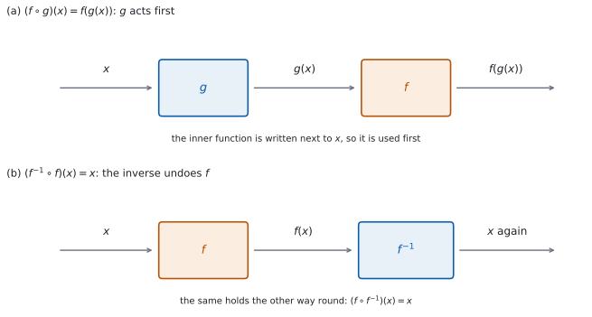

# SL 2.5 — Composite functions and the inverse function（合成関数と逆関数） {#sec-aasl-2-5}

::: {.callout-note}
## What you should be able to do
- **composite function**（合成関数）$(f \circ g)(x) = f(g(x))$ の意味が分かる。
- $f \circ g$ と $g \circ f$ を**区別して**計算できる。
- 合成関数の **domain** を、内側と外側の両方から決められる。
- **identity function**（恒等関数）$x \mapsto x$ が何かを言える。
- $f^{-1}(x)$ の**式を求められる**。
- $(f \circ f^{-1})(x) = (f^{-1} \circ f)(x) = x$ を、**検算に使える**。
- $f^{-1}$ の domain と range を書ける。
:::

## The idea

### 1. 合成関数は、機械を $2$ 台つないだもの {#idea}

関数を「入れたら出てくる機械」だと思ってください（[SL 2.2](aasl-2-2.qmd)）。

**composite function（合成関数）**とは、**$1$ 台目の出口を、$2$ 台目の入口につないだもの**です。

{#fig-aasl25-idea width=100%}

@fig-aasl25-idea の (a) が、そのようすです。$x$ を $g$ に入れて $g(x)$ が出てきたら、それをそのまま $f$ に入れます。

### 2. $(f \circ g)(x) = f(g(x))$ — 内側が先 {#order}

シラバスは、記号をこう定めています。

> $(f \circ g)(x) = f(g(x))$.

$$
(f \circ g)(x) = f\bigl(g(x)\bigr)
$$ {#eq-aasl25-comp}

::: {.callout-important}
## この項目には、公式集の欄がありません
公式集（formula booklet）の Topic 2 に印刷されているのは、**2.1**（直線の方程式と gradient formula）、**2.6**（軸の式）、**2.7**（解の公式と判別式）だけです。

**2.5 の内容は、公式集には載っていません。** 記号の意味を覚えてください。
:::

**$\circ$ は「かける」ではありません。** $f \circ g$ は $f \times g$ とは別のものです。

**順番は、右から左**です。$f \circ g$ と書いてあったら、**$g$ が先**に働きます。$f(g(x))$ と書き直せば、**かっこの内側が先**だとすぐ分かります。

::: {.callout-warning}
## $f \circ g$ と $g \circ f$ は、ふつうちがいます
$f(x) = \dfrac{x}{2}$、$g(x) = x+6$ で見ます。

$$
(f \circ g)(x) = f(x+6) = \frac{x+6}{2}
$$

$$
(g \circ f)(x) = g\left(\frac{x}{2}\right) = \frac{x}{2} + 6
$$

**まったく別の式**です。$x = 2$ を入れると $4$ と $7$ で、値もちがいます。

**迷ったら、$f(g(x))$ の形に書き直してください。** かっこがあれば、順番はまちがえません。
:::

### 3. 合成関数の domain {#comp-domain}

$(f \circ g)(x)$ が計算できるためには、**$2$ つの条件**が要ります。

1. $x$ が **$g$ の domain** に入っていること（そうでないと $g(x)$ が出ません）。
2. $g(x)$ が **$f$ の domain** に入っていること（そうでないと $f$ に入れられません）。

$f(x) = \sqrt{x}$（domain は $x \ge 0$）、$g(x) = 2x - 6$ で見ます。

$$
(f \circ g)(x) = \sqrt{2x-6}
$$

$g$ の domain は実数全体なので、条件 1 は自動的に満たされます。条件 2 は $g(x) \ge 0$、つまり $2x - 6 \ge 0$ で、$x \ge 3$ です。

::: {.callout-warning}
## 外側の関数だけを見て決めないでください
「$f$ の domain が $x \ge 0$ だから、$f \circ g$ の domain も $x \ge 0$」は誤りです。**$f$ に入るのは $x$ ではなく $g(x)$** だからです。

正しくは、**$g(x)$ が $f$ の domain に入る条件**を、$x$ の条件に書き直します。ここでは $g(x) \ge 0$ から $x \ge 3$ です。

**できあがった式だけを見て決めてはいけません。** $f$ の domain がもともと制限されているときは、できあがった式がそれより広い範囲で計算できてしまうことがあります。そのとき答えを決めるのは式ではなく、**$g(x)$ が $f$ の domain に入る条件**のほうです。
:::

### 4. identity function（恒等関数） {#identity}

**identity function（恒等関数）**とは、**入れたものをそのまま返す関数**のことです。

$$
I(x) = x
$$ {#eq-aasl25-identity}

何もしない機械だと思ってください。グラフは直線 $y = x$ です。

この関数が大事なのは、**逆関数の性質がこの形で書ける**からです（[第 6 節](#check)）。

### 5. $f^{-1}(x)$ の式を求める {#find-inverse}

[SL 2.2](aasl-2-2.qmd) では、$f^{-1}$ の**値**を求めました。ここでは**式**を求めます。手順は $3$ つです。

| 手順 | すること | $f(x) = 3x-4$ の場合 |
|:--|:--|:--|
| $1$ | $y = f(x)$ と書く | $y = 3x - 4$ |
| $2$ | **$x$ と $y$ を入れかえる** | $x = 3y - 4$ |
| $3$ | $y$ について解く | $y = \dfrac{x+4}{3}$ |

: 逆関数の式を求める $3$ 手順 {#tbl-aasl25-steps}

最後に $y$ を $f^{-1}(x)$ と書き直します。

$$
f^{-1}(x) = \frac{x+4}{3}
$$

::: {.callout-tip}
## 入れかえは、最初でも最後でもかまいません
$y = 3x-4$ をそのまま $x$ について解いて $x = \dfrac{y+4}{3}$ とし、**最後に $x$ と $y$ を入れかえて** $y = \dfrac{x+4}{3}$ としても、同じ答えになります。

やりやすいほうで進めてください。**ただし、入れかえを $1$ 回だけ**行うことに気をつけてください。$2$ 回やると、もとに戻ってしまいます。
:::

### 6. $f \circ f^{-1}$ と $f^{-1} \circ f$ は恒等関数 {#check}

シラバスは、次の関係を挙げています。

> $(f \circ f^{-1})(x) = (f^{-1} \circ f)(x) = x$.

$$
f\bigl(f^{-1}(x)\bigr) = x, \qquad f^{-1}\bigl(f(x)\bigr) = x
$$ {#eq-aasl25-undo}

@fig-aasl25-idea の (b) が、そのようすです。**$f$ を通してから $f^{-1}$ を通すと、もとの $x$ に戻ります。** 図には描いていませんが、順を入れかえて $f^{-1}$ → $f$ としても同じです。

**これは、そのまま検算になります。** $f^{-1}$ の式を求めたら、$f\bigl(f^{-1}(x)\bigr)$ を計算して $x$ になるかを見てください（こちらのほうが、たいてい計算が楽です）。

$$
f\left(\frac{x+4}{3}\right) = 3 \cdot \frac{x+4}{3} - 4 = (x+4) - 4 = x
$$

$x$ そのものになりました ✓ これが恒等関数（@eq-aasl25-identity）です。

::: {.callout-warning}
## $x$ は、それぞれの domain の中の値です
$f^{-1}\bigl(f(x)\bigr) = x$ が言えるのは、**$x$ が $f$ の domain に入っているとき**です。$f\bigl(f^{-1}(x)\bigr) = x$ のほうは、**$x$ が $f^{-1}$ の domain（$=f$ の range）に入っているとき**です。

たとえば $f(x) = \sqrt{x+2}$（domain $x \ge -2$）の逆関数の式は $x^{2}-2$ ですが、$f^{-1}$ の domain は $x \ge 0$ に制限されます（[第 7 節](#dom-range)）。
:::

### 7. $f^{-1}$ の domain と range {#dom-range}

[SL 2.2 の第 7 節](aasl-2-2.qmd#inverse)で見たとおり、**そっくり入れかわります。**

| | $f$ | $f^{-1}$ |
|:--|:--|:--|
| domain | $A$ | $B$ |
| range | $B$ | $A$ |

: domain と range の入れかわり {#tbl-aasl25-swap}

**式を求めただけでは終わりではありません。** できた式が、もっと広い範囲で定義できてしまうことがあるからです。

そのときは、**$f$ の range を先に出し、それをそのまま $f^{-1}$ の domain として書きます。** 実際の例は、例題 $3$ で見ます。

::: {.callout-tip collapse="true"}
## Paper 2 では、電卓で合成の値を確かめられます
TI-Nspire の Calculator 画面で `Define f1(x)=3x-4` と `Define f2(x)=(x+4)/3` のように $2$ つ定義しておくと、`f1(f2(7))` と打つだけで合成の値が出ます。**いくつかの値で試して、いつも入れた数がそのまま返ってくるかを見てください。** $1$ つの値で合っただけでは、正しいことの証明にはなりません。

Graphs 画面に両方を入れて、`y = x` も一緒に表示すると、**$y = x$ について対称**であることが目で見えます。`menu → Window/Zoom → Zoom Square` で目盛りをそろえてください。

**Paper 1 では使えません。** このページの例題と演習は、すべて手で解ける形にしてあります。
:::

## Why it works

**なぜ、$x$ と $y$ を入れかえると逆関数になるのでしょうか。**

$y = f(x)$ という式は、「$x$ を入れたら $y$ が出る」という関係を表しています。$f$ が one-to-one なら、$f$ が出した $y$ から、もとの $x$ がただ $1$ つに決まります。それが $f^{-1}(y)$ です。

つまり、$x$ が $f$ の domain に、$y$ が $f$ の range にあるとき

$$
y = f(x) \quad \Longleftrightarrow \quad x = f^{-1}(y)
$$

が成り立ちます。逆関数は、この関係を**逆向きに読んだもの**です。ここまでは、$x$ が入力、$y$ が出力のままです。

ところが、関数の式はふつう「**入力を $x$、出力を $y$**」と書く約束になっています。$x = f^{-1}(y)$ は、その約束と文字の役割が逆です。そこで**文字の名前だけを取りかえて**、$y = f^{-1}(x)$ と書き直します。

**入れかえているのは関係ではなく、文字の名前です。** だから $1$ 回だけでよいのです。

**なぜ、$f \circ g$ と $g \circ f$ はふつうちがうのでしょうか。**

「$3$ 倍する」と「$2$ を足す」で考えてみてください。$4$ から始めると、

- $3$ 倍してから $2$ 足す → $12 + 2 = 14$
- $2$ 足してから $3$ 倍する → $6 \times 3 = 18$

**順番を変えると、足した $2$ まで $3$ 倍されてしまいます。** 日常の動作でも同じです。「靴下をはく」と「靴をはく」は、順番を変えると結果がまったくちがいます。

**ただし、いつもちがうわけではありません。** ある $x$ では、たまたま同じ値になることがあります（例題 $1$ の (d)）。また、$g$ が $f$ の逆関数のときは、どちらの順でも恒等関数になります（@eq-aasl25-undo）。

**なぜ、$f^{-1}$ の domain は $f$ の range なのでしょうか。** $f^{-1}$ に入れられるのは、**$f$ から実際に出てきた値**だけだからです。$f$ が出さない値を $f^{-1}$ に入れても、「どこから来たか」がありません。$f$ が出す値の全体が range ですから、それがそのまま $f^{-1}$ の domain になります。

## Worked examples

::: {.callout-note appearance="simple"}
問題文は英語です。意味が理解できなかったら、問題文の下の「**日本語訳**」を開いてください。解説は日本語です。

**例題も演習も、すべて電卓なしで解けます。** Paper 1 のつもりで解いてください。
:::

::: {#exm-aasl25-order}
[The functions $f$ and $g$ are defined by $f(x) = 2x + 1$ and $g(x) = x^{2}$.]{.q-en}

**(a)** [Find $(f \circ g)(3)$.]{.q-en}

**(b)** [Find an expression for $(f \circ g)(x)$.]{.q-en}

**(c)** [Find an expression for $(g \circ f)(x)$.]{.q-en}

**(d)** [Find the values of $x$ for which $(f \circ g)(x) = (g \circ f)(x)$.]{.q-en}

日本語訳

関数 $f$、$g$ は $f(x) = 2x+1$、$g(x) = x^{2}$ で定められています。

**(a)** $(f \circ g)(3)$ を求めなさい。

**(b)** $(f \circ g)(x)$ の式を求めなさい。

**(c)** $(g \circ f)(x)$ の式を求めなさい。

**(d)** $(f \circ g)(x) = (g \circ f)(x)$ となる $x$ の値を求めなさい。

---

**(a)** **内側の $g$ が先**です（@eq-aasl25-comp）。

$$
g(3) = 9, \qquad f(9) = 2(9) + 1 = 19
$$

**(b)** $f$ の $x$ のところに、$g(x) = x^{2}$ を入れます。

$$
(f \circ g)(x) = 2x^{2} + 1
$$

**(c)** 今度は $g$ の $x$ のところに、$f(x) = 2x+1$ を入れます。

$$
(g \circ f)(x) = (2x+1)^{2} = 4x^{2} + 4x + 1
$$

**(d)** $2$ つを等号でつなぎます。

$$
2x^{2} + 1 = 4x^{2} + 4x + 1
$$

$$
0 = 2x^{2} + 4x = 2x(x+2)
$$

$$
x = 0 \quad \text{または} \quad x = -2
$$

**検算（(a) について）。** **(b) の式を使う、別の道すじでも出します。** $2(3)^{2} + 1 = 18 + 1 = 19$ ✓ (a) は $g$ を先に計算し、こちらは合成の式に代入したので、道すじがちがいます。

**検算（(d) について）。** 出した $2$ 数を、**(b)(c) の式ではなく、$f$ と $g$ に順に通して**確かめます。

$$
x = 0: \quad g(0) = 0, \ f(0) = 1 \qquad \text{および} \qquad f(0) = 1, \ g(1) = 1
$$

$$
x = -2: \quad g(-2) = 4, \ f(4) = 9 \qquad \text{および} \qquad f(-2) = -3, \ g(-3) = 9
$$

どちらも一致しました ✓ **(b) と (c) の式に入れるだけでは足りません。** その $2$ 式から方程式を作ったのですから、$2$ 式が誤っていても両辺はそろって誤り、一致してしまいます。

**$x = 1$ では一致しません。** $2(1)+1 = 3$、$(2+1)^{2} = 9$ です。**$f \circ g$ と $g \circ f$ が一致するのは、特別な $x$ のときだけ**だと分かります。

::: {.callout-note}
## 解答例（答案用紙に書くこと）
**(a)** $g(3) = 9$, $f(9) = 19$
$$(f \circ g)(3) = 19$$

**(b)**
$$(f \circ g)(x) = 2x^{2} + 1$$

**(c)**
$$(g \circ f)(x) = (2x+1)^{2} = 4x^{2}+4x+1$$

**(d)** $2x^{2}+1 = 4x^{2}+4x+1$, so $2x(x+2) = 0$
$$x = 0 \quad \text{or} \quad x = -2$$
:::
:::

::: {#exm-aasl25-linear}
[The function $f$ is defined by $f(x) = 3x - 4$, with domain $x \in \mathbb{R}$.]{.q-en}

**(a)** [Find an expression for $f^{-1}(x)$.]{.q-en}

**(b)** [Show that $f\bigl(f^{-1}(x)\bigr) = x$.]{.q-en}

**(c)** [Find $f^{-1}(11)$.]{.q-en}

**(d)** [Explain why $f$ has an inverse function.]{.q-en}

日本語訳

関数 $f$ は $f(x) = 3x - 4$（定義域は実数全体）で定められています。

**(a)** $f^{-1}(x)$ の式を求めなさい。

**(b)** $f\bigl(f^{-1}(x)\bigr) = x$ を示しなさい。

**(c)** $f^{-1}(11)$ を求めなさい。

**(d)** $f$ が逆関数をもつ理由を説明しなさい。

---

**(a)** @tbl-aasl25-steps の $3$ 手順です。

$$
y = 3x - 4 \ \longrightarrow \ x = 3y - 4 \ \longrightarrow \ 3y = x + 4
$$

$$
f^{-1}(x) = \frac{x+4}{3}
$$

**(b)** `Show that` なので、**途中の式を書きます**（@eq-aasl25-undo）。

$$
f\left(\frac{x+4}{3}\right) = 3 \cdot \frac{x+4}{3} - 4 = (x+4) - 4 = x
$$

**(c)** (a) の式に $11$ を入れます。

$$
f^{-1}(11) = \frac{11+4}{3} = \frac{15}{3} = 5
$$

**(d)** `Explain why` なので、英語で理由を書きます。

::: {.model-answer}
**試験ではこう書く**

*The function $f$ is linear with gradient $3$, which is not zero, so as $x$ increases $f(x)$ always increases. Two different inputs therefore always give two different outputs, so $f$ is one-to-one. A one-to-one function has an inverse, so $f^{-1}$ exists.*
:::

（$f$ は傾き $3$ の $1$ 次関数で、傾きは $0$ でないので、$x$ が増えれば $f(x)$ はつねに増える。したがってちがう $2$ つの入力からは必ずちがう出力が出るので、$f$ は $1$ 対 $1$ である。$1$ 対 $1$ の関数は逆関数をもつので、$f^{-1}$ は存在する、という意味です。）

**検算（(c) について）。** **$f$ に入れ直します。** $f(5) = 15 - 4 = 11$ ✓ **逆関数の値は、もとの関数に入れて確かめます。**

**検算（(a) について）。** (b) とは**逆の順**でも見ます。

$$
f^{-1}\bigl(f(x)\bigr) = \frac{(3x-4)+4}{3} = \frac{3x}{3} = x
$$

$2$ つの順のどちらでも $x$ になりました ✓

**$y$ について解いたあと、$y$ にもとの $3x-4$ を入れ直して $\dfrac{3x-4+4}{3}$ と書いてしまったら**、それは $f^{-1}\bigl(f(x)\bigr)$ を計算しただけです。**出てきた $x$ は、逆関数の式ではありません。** $f^{-1}(x)$ は、$x$ だけの式でなければなりません。

**合成して確かめること自体は、有効な検算です。** 候補が誤っていれば、合成しても $x$ にはもどりません。たとえば $g(x) = \dfrac{x-4}{3}$ を候補にすると、$g\bigl(f(x)\bigr) = \dfrac{(3x-4)-4}{3} = x - \dfrac{8}{3}$ となり、$x$ とちがうことがすぐ分かります。**一般には、合成が $x$ になる範囲（定義域）もあわせて確かめます。**

::: {.callout-note}
## 解答例（答案用紙に書くこと）
**(a)** $y = 3x-4$, $x = 3y-4$, $3y = x+4$
$$f^{-1}(x) = \frac{x+4}{3}$$

**(b)**
$$f\left(\frac{x+4}{3}\right) = 3 \cdot \frac{x+4}{3} - 4 = x$$

**(c)**
$$f^{-1}(11) = \frac{15}{3} = 5$$

**(d)** *$f$ is linear with non-zero gradient, so it is one-to-one and an inverse exists.*
:::
:::

::: {#exm-aasl25-root}
[The function $f$ is defined by $f(x) = \sqrt{x-1}$, with domain $x \ge 1$.]{.q-en}

**(a)** [Write down the range of $f$.]{.q-en}

**(b)** [Find an expression for $f^{-1}(x)$.]{.q-en}

**(c)** [State the domain of $f^{-1}$.]{.q-en}

**(d)** [Explain why the domain of $f^{-1}$ must be restricted, even though the expression found in part (b) is defined for every real number.]{.q-en}

日本語訳

関数 $f$ は $f(x) = \sqrt{x-1}$（定義域は $x \ge 1$）で定められています。

**(a)** $f$ の値域を書きなさい。

**(b)** $f^{-1}(x)$ の式を求めなさい。

**(c)** $f^{-1}$ の定義域を述べなさい。

**(d)** (b) で求めた式はすべての実数で計算できるのに、$f^{-1}$ の定義域を制限しなければならない理由を説明しなさい。

---

**(a)** 根号の値は負になりません。$x = 1$ で $0$ が出て、$x$ を大きくすればいくらでも大きくなります。

$$
f(x) \ge 0
$$

**(b)** @tbl-aasl25-steps の $3$ 手順です。

$$
y = \sqrt{x-1} \ \longrightarrow \ x = \sqrt{y-1}
$$

両辺を $2$ 乗します。**このとき $x \ge 0$ を忘れないでください。** $x^{2} = y-1$ から $x = \sqrt{y-1}$ に戻れるのは $x \ge 0$ のときだけで、この $x$ はもとの $f$ の出力なので $x \ge 0$ です。この条件が、あとで (c) の答えになります。

$$
x^{2} = y - 1 \ \Rightarrow \ y = x^{2} + 1
$$

$$
f^{-1}(x) = x^{2} + 1
$$

**(c)** $f^{-1}$ の domain は $f$ の range です（@tbl-aasl25-swap）。(a) より

$$
x \ge 0
$$

**(d)** `Explain why` なので、英語で理由を書きます。

::: {.model-answer}
**試験ではこう書く**

*The inverse function must undo $f$, so it can only accept values that $f$ actually produces. The range of $f$ is $f(x) \ge 0$, so the domain of $f^{-1}$ is $x \ge 0$. Without this restriction the rule $x^{2}+1$ would not be one-to-one: for example it sends both $2$ and $-2$ to $5$, so it could not be an inverse function.*
:::

（逆関数は $f$ をもとに戻すものなので、$f$ が実際に出す値しか受け取れない。$f$ の値域は $f(x) \ge 0$ なので、$f^{-1}$ の定義域は $x \ge 0$ である。この制限がないと $x^{2}+1$ という規則は $1$ 対 $1$ にならない。たとえば $2$ と $-2$ の両方が $5$ に移るので、逆関数にはなれない、という意味です。）

**検算（(b) について）。** **$f$ に入れ直します。** $x \ge 0$ のとき

$$
f\bigl(x^{2}+1\bigr) = \sqrt{(x^{2}+1)-1} = \sqrt{x^{2}} = x
$$

$x$ に戻りました ✓

**$\sqrt{x^{2}} = x$ と書けるのは $x \ge 0$ のときだけ**です。$x = -2$ なら $\sqrt{4} = 2$ で、$-2$ には戻りません。**ここでも (c) の制限が効いています。**

**検算（(c) について）。** **制限の外側で、往復が壊れることを見ます。** $x = -1$ を $x^{2}+1$ に入れると $2$ が出ますが、$f(2) = \sqrt{1} = 1$ で、$-1$ には戻りません ✓ $-1$ は $f$ が出さない値なので、$f^{-1}$ には入れられません。

**端の $x = 0$ では、きちんと往復します。** $f^{-1}(0) = 1$、$f(1) = \sqrt{0} = 0$ ✓ また $f(5) = 2$ に対して $f^{-1}(2) = 5$ ✓

::: {.callout-note}
## 解答例（答案用紙に書くこと）
**(a)**
$$f(x) \ge 0$$

**(b)** $x = \sqrt{y-1}$, $x^{2} = y-1$
$$f^{-1}(x) = x^{2}+1$$

**(c)**
$$x \ge 0$$

**(d)** *The domain of $f^{-1}$ is the range of $f$, which is $x \ge 0$. Without the restriction $x^{2}+1$ is not one-to-one, since $2$ and $-2$ both give $5$.*
:::
:::

::: {#exm-aasl25-domain}
[The functions $f$ and $g$ are defined by $f(x) = \dfrac{1}{x}$, with domain $x \neq 0$, and $g(x) = x - 3$, with domain $x \in \mathbb{R}$.]{.q-en}

**(a)** [Find an expression for $(f \circ g)(x)$.]{.q-en}

**(b)** [State the domain of $f \circ g$.]{.q-en}

**(c)** [Find an expression for $(g \circ f)(x)$, and state its domain.]{.q-en}

**(d)** [A student says that the domain of $f \circ g$ is $x \neq 0$, because the domain of $f$ is $x \neq 0$. Comment on this statement.]{.q-en}

日本語訳

関数 $f$、$g$ は $f(x) = \dfrac{1}{x}$（定義域は $x \neq 0$）、$g(x) = x-3$（定義域は実数全体）で定められています。

**(a)** $(f \circ g)(x)$ の式を求めなさい。

**(b)** $f \circ g$ の定義域を述べなさい。

**(c)** $(g \circ f)(x)$ の式を求め、その定義域を述べなさい。

**(d)** ある生徒が「$f$ の定義域が $x \neq 0$ なので、$f \circ g$ の定義域も $x \neq 0$ だ」と言いました。この発言について述べなさい。

---

**(a)** $f$ の $x$ のところに、$g(x) = x-3$ を入れます。

$$
(f \circ g)(x) = \frac{1}{x-3}
$$

**(b)** 分母が $0$ にならないことが要ります（[第 3 節](#comp-domain)）。

$$
x \neq 3
$$

**(c)** 今度は $g$ の $x$ のところに、$f(x) = \dfrac{1}{x}$ を入れます。

$$
(g \circ f)(x) = \frac{1}{x} - 3
$$

$f$ に入れる時点で $x \neq 0$ が要るので、domain は $x \neq 0$ です。

**(d)** `Comment on` なので、英語で判断とその理由を書きます。

::: {.model-answer}
**試験ではこう書く**

*The statement is not correct. The condition $x \neq 0$ applies to the input of $f$, but the input of $f$ here is $g(x)$, not $x$. What is needed is $g(x) \neq 0$, that is $x - 3 \neq 0$, so the domain of $f \circ g$ is $x \neq 3$. The value $x = 0$ is allowed, since $(f \circ g)(0) = -\dfrac{1}{3}$.*
:::

（この発言は正しくない。$x \neq 0$ という条件は $f$ の入力についてのものだが、ここで $f$ に入るのは $x$ ではなく $g(x)$ である。必要なのは $g(x) \neq 0$、つまり $x - 3 \neq 0$ なので、$f \circ g$ の定義域は $x \neq 3$ である。$x = 0$ は使ってよく、$(f\circ g)(0) = -\dfrac{1}{3}$ である、という意味です。）

**検算（(a) について）。** **$f$ と $g$ に順に通した値と比べます。** $x = 5$ なら $g(5) = 2$、$f(2) = \dfrac{1}{2}$ です。合成の式でも $\dfrac{1}{5-3} = \dfrac{1}{2}$ ✓ **合成の式を自分で評価し直すだけでは、(a) の誤りは見つかりません。**

**検算（(b) について）。** **$g(x)$ が $f$ の domain に入るかを、境目の前後で見ます。** $x = 4$ なら $g(4) = 1 \neq 0$ で $f$ に入れられます ✓ $x = 2$ なら $g(2) = -1 \neq 0$ で、これも入れられます ✓ $x = 3$ では $g(3) = 0$ となり、$f$ の domain から外れます ✓

**検算（(c) について）。** **$2$ 台に順に通した値と、合成の式の値を比べます。** $x = 2$ とすると、$f(2) = \dfrac{1}{2}$、$g\left(\dfrac{1}{2}\right) = \dfrac{1}{2} - 3 = -\dfrac{5}{2}$ です。合成の式でも $\dfrac{1}{2} - 3 = -\dfrac{5}{2}$ ✓

**(a) と (c) はまったく別の式です。** $x = 2$ では $(f\circ g)(2) = -1$、$(g\circ f)(2) = -\dfrac{5}{2}$ で、値もちがいます。

::: {.callout-note}
## 解答例（答案用紙に書くこと）
**(a)**
$$(f \circ g)(x) = \frac{1}{x-3}$$

**(b)**
$$x \neq 3$$

**(c)**
$$(g \circ f)(x) = \frac{1}{x} - 3, \qquad x \neq 0$$

**(d)** *Not correct. The condition applies to the input of $f$, which is $g(x)$, so we need $x - 3 \neq 0$, giving $x \neq 3$.*
:::
:::

## Common errors

::: {.callout-warning}
## $f \circ g$ の順番を逆にする
$(f \circ g)(x) = f(g(x))$ で、**$g$ が先**です（@eq-aasl25-comp）。

**$f(g(x))$ の形に書き直してから代入してください。** かっこの内側が先だと、目で見て分かります。
:::

::: {.callout-warning}
## $f \circ g$ を $f \times g$ と読む
$\circ$ は**かけ算の記号ではありません**（[第 2 節](#order)）。

$f(x) = 3x$、$g(x) = x+2$ なら、$(f \circ g)(x) = 3x+6$ ですが、$f(x)g(x) = 3x(x+2) = 3x^{2}+6x$ です。
:::

::: {.callout-warning}
## 逆関数を求めるとき、入れかえを忘れる（または $2$ 回する）
入れかえは **$1$ 回だけ**です（@tbl-aasl25-steps）。

$2$ 回すると、もとの $f$ に戻ってしまいます。**求めた式を $f$ に入れて $x$ になるか**を、必ず確かめてください（@eq-aasl25-undo）。
:::

::: {.callout-warning}
## 合成関数の domain を、外側の関数だけで決める
$f$ に入るのは $x$ ではなく $g(x)$ です（[第 3 節](#comp-domain)）。

**$g(x)$ が $f$ の domain に入る条件を、$x$ の条件に書き直してください。** できあがった式の分母や根号を見るだけで済むのは、$f$ の domain がその式の条件とたまたま一致するときだけです。
:::

::: {.callout-warning}
## $f^{-1}$ の domain を書き忘れる
式が求まっても、それだけでは足りないことがあります（[第 7 節](#dom-range)）。

**$f^{-1}$ の domain は $f$ の range** です。$f$ の range を先に出しておくと、そのまま使えます。
:::

::: {.callout-warning}
## $f^{-1}$ を求めたのに、検算しない
$f\bigl(f^{-1}(x)\bigr)$ を計算して $x$ になるかを見れば、**符号や割り算のまちがいはほぼ見つかります**（@eq-aasl25-undo）。

$1$ 行で終わる検算なので、必ずしてください。**ただし、この検算では domain の書き忘れは見つかりません。** domain は別に確かめてください。
:::

## Exercises

::: {.callout-note appearance="simple"}
各問題に、折りたたみが $3$ つ付いています。**日本語訳**、**解答例**（答案用紙に書くべきこと。英語です）、**解説**（なぜそうなるか。日本語です）。

まず自分で解いて、次に解答例と見くらべてください。**解説は、合わなかったときだけ開けば十分です。**
:::

::: {.exercise-block}

[1]{.ex-no} [The functions $f$ and $g$ are defined by $f(x) = x + 4$ and $g(x) = 3x$. Find $(f \circ g)(2)$.]{.q-en}

日本語訳

関数 $f$、$g$ は $f(x) = x+4$、$g(x) = 3x$ で定められています。$(f \circ g)(2)$ を求めなさい。

::: {.callout-note collapse="true"}
## 解答例（答案用紙に書くこと）

$g(2) = 6$

$$(f \circ g)(2) = f(6) = 10$$
:::

::: {.callout-tip collapse="true"}
## 解説

**内側の $g$ が先**です（@eq-aasl25-comp）。

**検算。** **それぞれの機械が何をするかに戻ります。** $g$ は「$3$ 倍する」、$f$ は「$4$ を足す」です。$(f \circ g)(2)$ は「$2$ を $3$ 倍してから $4$ を足す」なので、$6$ のあとに $10$ ✓

**$(g \circ f)(2)$ と取りちがえていたら**、先に $4$ を足して $6$、それを $3$ 倍することになり、$10$ とはちがう値が出ます。
:::

::: {.ex-sep}
:::

[2]{.ex-no} [The functions $f$ and $g$ are defined by $f(x) = x + 4$ and $g(x) = 3x$.]{.q-en}

**(a)** [Find an expression for $(f \circ g)(x)$.]{.q-en}

**(b)** [Find an expression for $(g \circ f)(x)$.]{.q-en}

日本語訳

関数 $f$、$g$ は $f(x) = x+4$、$g(x) = 3x$ で定められています。

**(a)** $(f \circ g)(x)$ の式を求めなさい。

**(b)** $(g \circ f)(x)$ の式を求めなさい。

::: {.callout-note collapse="true"}
## 解答例（答案用紙に書くこと）

**(a)**
$$(f \circ g)(x) = 3x + 4$$

**(b)**
$$(g \circ f)(x) = 3(x+4) = 3x + 12$$
:::

::: {.callout-tip collapse="true"}
## 解説

**(b)** では、**$x+4$ 全体が $3$ 倍**されます。かっこを落とさないでください。

**検算。** **数を $1$ つ入れて、$2$ 台に順に通した値と比べます。** $x = 1$ とすると

**(a)** $g(1) = 3$、$f(3) = 7$。式では $3 + 4 = 7$ ✓

**(b)** $f(1) = 5$、$g(5) = 15$。式では $3 + 12 = 15$ ✓

**$2$ つの式がちがうことも見えます。** $x = 1$ で $7$ と $15$ です。
:::

::: {.ex-sep}
:::

[3]{.ex-no} [The function $f$ is defined by $f(x) = 5x - 2$. Find an expression for $f^{-1}(x)$.]{.q-en}

日本語訳

関数 $f$ は $f(x) = 5x - 2$ で定められています。$f^{-1}(x)$ の式を求めなさい。

::: {.callout-note collapse="true"}
## 解答例（答案用紙に書くこと）

$y = 5x - 2$, so $x = 5y - 2$

$5y = x + 2$

$$f^{-1}(x) = \frac{x+2}{5}$$
:::

::: {.callout-tip collapse="true"}
## 解説

@tbl-aasl25-steps の $3$ 手順です。

**検算。** **$f$ に入れ直します**（@eq-aasl25-undo）。

$$
f\left(\frac{x+2}{5}\right) = 5 \cdot \frac{x+2}{5} - 2 = (x+2) - 2 = x
$$

$x$ になりました ✓

**$\dfrac{x-2}{5}$ としていたら**（符号のまちがい）、$f$ に入れると $x - 2 - 2 = x - 4$ となり、$x$ になりません。
:::

::: {.ex-sep}
:::

[4]{.ex-no} [The function $f$ is defined by $f(x) = \dfrac{x}{4} + 3$. Find an expression for $f^{-1}(x)$.]{.q-en}

日本語訳

関数 $f$ は $f(x) = \dfrac{x}{4} + 3$ で定められています。$f^{-1}(x)$ の式を求めなさい。

::: {.callout-note collapse="true"}
## 解答例（答案用紙に書くこと）

$y = \dfrac{x}{4} + 3$, so $x = \dfrac{y}{4} + 3$

$\dfrac{y}{4} = x - 3$

$$f^{-1}(x) = 4(x-3) = 4x - 12$$
:::

::: {.callout-tip collapse="true"}
## 解説

**先に $3$ を引いてから、$4$ 倍します。** $f$ が「$4$ で割ってから $3$ を足す」なので、逆は「$3$ を引いてから $4$ 倍する」です。**逆向きの順で、逆の操作**をします。

**検算。** **$f$ に入れ直します。**

$$
f(4x-12) = \frac{4x-12}{4} + 3 = (x-3) + 3 = x
$$

$x$ になりました ✓

**$4x - 3$ としていたら**（$4$ 倍を先にした誤り）、$f$ に入れると $\dfrac{4x-3}{4} + 3 = x - \dfrac{3}{4} + 3$ となり、$x$ にはなりません。
:::

::: {.ex-sep}
:::

[5]{.ex-no} [The function $f$ is defined by $f(x) = 2x + 7$. Find $f^{-1}(3)$.]{.q-en}

日本語訳

関数 $f$ は $f(x) = 2x + 7$ で定められています。$f^{-1}(3)$ を求めなさい。

::: {.callout-note collapse="true"}
## 解答例（答案用紙に書くこと）

$2x + 7 = 3$

$$f^{-1}(3) = -2$$
:::

::: {.callout-tip collapse="true"}
## 解説

**値を $1$ つ求めるだけなら、式を作る必要はありません**（[SL 2.2](aasl-2-2.qmd)）。$f(x) = 3$ を解けば済みます。

**検算。** **$f$ に入れ直します。** $f(-2) = -4 + 7 = 3$ ✓

**式を作ってからでも同じです。** $f^{-1}(x) = \dfrac{x-7}{2}$ なので、$x = 3$ で $\dfrac{-4}{2} = -2$ ✓ **$2$ つの道すじで同じ値になりました。**
:::

::: {.ex-sep}
:::

[6]{.ex-no} [The functions $f$ and $g$ are defined by $f(x) = x^{2}$, with domain $x \ge 0$, and $g(x) = x + 5$.]{.q-en}

**(a)** [Find an expression for $(f \circ g)(x)$.]{.q-en}

**(b)** [State the domain of $f \circ g$.]{.q-en}

日本語訳

関数 $f$、$g$ は $f(x) = x^{2}$（定義域は $x \ge 0$）、$g(x) = x+5$ で定められています。

**(a)** $(f \circ g)(x)$ の式を求めなさい。

**(b)** $f \circ g$ の定義域を述べなさい。

::: {.callout-note collapse="true"}
## 解答例（答案用紙に書くこと）

**(a)**
$$(f \circ g)(x) = (x+5)^{2}$$

**(b)** $g(x) \ge 0$, so $x + 5 \ge 0$
$$x \ge -5$$
:::

::: {.callout-tip collapse="true"}
## 解説

**$f$ に入るのは $g(x) = x+5$** です（[第 3 節](#comp-domain)）。$f$ の domain が $x \ge 0$ なので、$x + 5 \ge 0$ が要ります。

**検算。** **境目の外側で、条件が破れることを見ます。** $x = -6$ とすると $g(-6) = -1$ で、これは $f$ の domain $x \ge 0$ に入っていません ✓ 境目の $x = -5$ では $g(-5) = 0$ で、$f$ に入れられます ✓

**「$x \ge 0$」としていたら**、外側の domain をそのまま書いています。$x = -1$ とすると $g(-1) = 4$ で、$f$ に問題なく入れられます。**$x \ge 0$ では狭すぎます。**
:::

::: {.ex-sep}
:::

[7]{.ex-no} [The functions $f$ and $g$ are defined by $f(x) = \sqrt{x}$ and $g(x) = x - 9$. Find an expression for $(f \circ g)(x)$ and state its domain.]{.q-en}

日本語訳

関数 $f$、$g$ は $f(x) = \sqrt{x}$、$g(x) = x-9$ で定められています。$(f \circ g)(x)$ の式を求め、その定義域を述べなさい。

::: {.callout-note collapse="true"}
## 解答例（答案用紙に書くこと）

$$(f \circ g)(x) = \sqrt{x-9}$$

$x - 9 \ge 0$, so

$$x \ge 9$$
:::

::: {.callout-tip collapse="true"}
## 解説

根号の中が $0$ 以上、という条件です（[第 3 節](#comp-domain)）。

**検算。** **境目の外側で、値が出ないことを見ます。** $x = 8$ なら $\sqrt{-1}$ で、実数の値をもちません ✓ 境目の $x = 9$ では $\sqrt{0} = 0$ ✓ $x = 13$ なら $\sqrt{4} = 2$ ✓

**$(g \circ f)(x) = \sqrt{x} - 9$ とは別のもの**です。こちらの domain は $x \ge 0$ で、範囲がちがいます。
:::

::: {.ex-sep}
:::

[8]{.ex-no} [The function $f$ is defined by $f(x) = \dfrac{2}{x-1}$, with domain $x \neq 1$. Find an expression for $f^{-1}(x)$.]{.q-en}

日本語訳

関数 $f$ は $f(x) = \dfrac{2}{x-1}$（定義域は $x \neq 1$）で定められています。$f^{-1}(x)$ の式を求めなさい。

::: {.callout-note collapse="true"}
## 解答例（答案用紙に書くこと）

$y = \dfrac{2}{x-1}$, so $x = \dfrac{2}{y-1}$

$x(y-1) = 2$, so $y - 1 = \dfrac{2}{x}$

$$f^{-1}(x) = \frac{2}{x} + 1$$
:::

::: {.callout-tip collapse="true"}
## 解説

入れかえたあと、**両辺に $y-1$ を掛けてから $x$ で割ります**（@tbl-aasl25-steps）。

**検算。** **$f$ に入れ直します**（@eq-aasl25-undo）。$f^{-1}(x) - 1 = \dfrac{2}{x}$ なので

$$
f\left(\frac{2}{x}+1\right) = \frac{2}{\left(\frac{2}{x}+1\right)-1} = \frac{2}{\frac{2}{x}} = x
$$

$x$ になりました ✓

**具体的な値でも往復します。** $f(3) = \dfrac{2}{2} = 1$ なので、$f^{-1}(1) = \dfrac{2}{1} + 1 = 3$ ✓ もとの $3$ に戻りました。
:::

::: {.ex-sep}
:::

[9]{.ex-no} [Explain why $(f \circ g)(x)$ and $(g \circ f)(x)$ are usually different, using the functions $f(x) = 2x$ and $g(x) = x + 1$ as an example.]{.q-en}

日本語訳

$(f \circ g)(x)$ と $(g \circ f)(x)$ がふつうちがう理由を、$f(x) = 2x$、$g(x) = x+1$ を例として使って説明しなさい。

::: {.callout-note collapse="true"}
## 解答例（答案用紙に書くこと）

*$(f \circ g)(x) = 2(x+1) = 2x+2$, but $(g \circ f)(x) = 2x+1$. Doubling after adding $1$ also doubles the $1$, while adding $1$ after doubling does not, so the order in which the functions act changes the result.*
:::

::: {.callout-tip collapse="true"}
## 解説

`Explain why` なので、**具体例を計算してから、なぜちがうのかを言葉で述べます。**

**検算。** **数を $1$ つ入れて、$2$ つの値がちがうことを確かめます。** $x = 3$ とすると、$(f \circ g)(3) = 2(4) = 8$、$(g \circ f)(3) = 6 + 1 = 7$ ✓ たしかにちがいます。

**「順番が大事だから」だけでは、理由になりません。** **なぜ**順番で変わるのかを書いてください。「あとから $2$ 倍すると、足した $1$ まで $2$ 倍される」が理由です。

**いつもちがう、とは言い切れません。** この $f$、$g$ では $2x+2 = 2x+1$ に解がないので、どの $x$ でも一致しません。しかし関数によっては、ある $x$ で一致することがあります（例題 $1$ の (d) では $x = 0$ と $x = -2$ で一致しました）。`usually` と書かれているのは、そのためです。

::: {.model-answer}
**試験ではこう書く**

*With $f(x) = 2x$ and $g(x) = x+1$ we get $(f \circ g)(x) = f(x+1) = 2(x+1) = 2x+2$, while $(g \circ f)(x) = g(2x) = 2x+1$. These are different expressions. Doubling after adding $1$ doubles the $1$ as well, but adding $1$ after doubling does not, so changing the order changes the result.*
:::
:::

::: {.ex-sep}
:::

[10]{.ex-no} [The functions $f$ and $g$ are defined by $f(x) = x^{2}$ and $g(x) = x + 3$. A student is asked to find $(f \circ g)(x)$, and writes]{.q-en}

$$
(f \circ g)(x) = x^{2} + 3
$$

[Identify the error in the student's work, and write down the correct expression.]{.q-en}

日本語訳

関数 $f$、$g$ は $f(x) = x^{2}$、$g(x) = x+3$ で定められています。ある生徒が $(f \circ g)(x)$ を求めるように言われ、上のように書きました。

生徒の計算の誤りを指摘し、正しい式を書きなさい。

::: {.callout-note collapse="true"}
## 解答例（答案用紙に書くこと）

*The student applied $f$ first and then added $3$. In $(f \circ g)(x)$ the inner function $g$ acts first, so the whole of $x+3$ must be squared.*

$$(f \circ g)(x) = (x+3)^{2}$$
:::

::: {.callout-tip collapse="true"}
## 解説

`Identify the error` なので、**どこが違うのかを名指し**してから、正しい式を書きます。

生徒が書いた $x^{2}+3$ は、実は $(g \circ f)(x)$ です。**順番を逆にしています**（@eq-aasl25-comp）。

**検算。** **数を $1$ つ入れて比べます。** $x = 1$ とすると、正しくは $g(1) = 4$、$f(4) = 16$ です。生徒の式では $1 + 3 = 4$ となり、合いません ✓

**展開した形でも見えます。** $(x+3)^{2} = x^{2} + 6x + 9$ で、$x^{2}+3$ との差は $6x + 6$ です。この差が $0$ になるのは $x = -1$ のときだけなので、**$x = -1$ で確かめると、まちがった式でも一致してしまいます**（どちらも $4$）。**確かめに使う値は、$-1$ 以外を選んでください。**

::: {.model-answer}
**試験ではこう書く**

*The student squared $x$ first and then added $3$, which gives $(g \circ f)(x)$. In $(f \circ g)(x)$ the inner function $g$ acts first, so its output $x+3$ is the input of $f$ and the whole bracket must be squared. The correct expression is $(f \circ g)(x) = (x+3)^{2}$.*
:::
:::

:::
