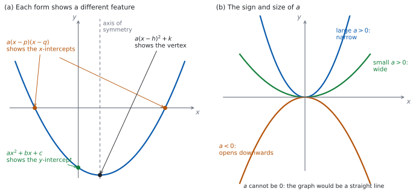

# SL 2.6 — The quadratic function and its three forms（2 次関数の 3 つの形） {#sec-aasl-2-6}

::: {.callout-note}
## What you should be able to do
- **quadratic function**（$2$ 次関数）の**$3$ つの形**を見分けられる。
- $f(x) = ax^{2}+bx+c$ から **$y$ 切片 $(0,c)$** と、**対称の軸 $x = -\dfrac{b}{2a}$** を読める。
- $f(x) = a(x-p)(x-q)$ から **$x$ 切片 $(p,0)$、$(q,0)$** を読める。
- $f(x) = a(x-h)^{2}+k$ から **頂点 $(h,k)$** を読める。
- **$3$ つの形を行き来できる**（展開・因数分解・平方完成）。
- **$a$ の符号と大きさ**が、グラフの形をどう決めるかを言える。
- 与えられた情報から、**$2$ 次関数の式を組み立てられる**。
:::

## The idea

### 1. $2$ 次関数には、$3$ つの書き方がある {#idea}

**quadratic function（$2$ 次関数）**とは、$x$ の $2$ 乗までを使って書ける関数のことです。グラフは **parabola（放物線）**と呼ばれます。

同じ $1$ つの放物線を、**ちがう形に書き直せます。** どれも同じ関数ですが、**すぐ読み取れる特徴がちがいます。**

ただし、**factorised form に書けるのは $x$ 切片をもつ放物線だけ**です（[第 3 節](#factorised)）。standard form と vertex form は、どの $2$ 次関数でも必ず書けます。

| 形 | 英語名 | すぐ読めるもの |
|:--|:--|:--|
| $f(x) = ax^{2}+bx+c$ | standard form（一般形） | $y$ 切片 $(0, c)$ |
| $f(x) = a(x-p)(x-q)$ | factorised form（因数分解した形） | $x$ 切片 $(p,0)$、$(q,0)$ |
| $f(x) = a(x-h)^{2}+k$ | vertex form（頂点形） | 頂点 $(h, k)$ |

: $3$ つの形と、それぞれが見せてくれるもの {#tbl-aasl26-forms}

{#fig-aasl26-idea width=100%}

@fig-aasl26-idea の (a) が、そのようすです。**どの形を選ぶかは、何が知りたいかで決めます。**

::: {.callout-warning}
## $a \neq 0$ です
$a = 0$ にすると $bx + c$ という $1$ 次式になり、グラフは直線です（[SL 2.1](aasl-2-1.qmd)）。$2$ 次関数ではありません。

$3$ つの形のどれでも、**$a$ は同じ数**です。因数分解した形の $a$ を書き忘れると、別の放物線になってしまいます（[第 3 節](#factorised)）。
:::

### 2. standard form と、対称の軸 {#standard}

$$
f(x) = ax^{2} + bx + c, \qquad a \neq 0
$$ {#eq-aasl26-standard}

@eq-aasl26-standard に $x = 0$ を入れると $f(0) = c$ なので、**$y$ 切片は $(0, c)$** です。$c$ を見るだけで分かります。

対称の軸は、次の式で求められます。

$$
x = -\frac{b}{2a}
$$ {#eq-aasl26-axis}

::: {.callout-important}
## この式は公式集にあります
公式集の **2.6** の欄に `Axis of symmetry of the graph of a quadratic function` として印刷されています。

> $f(x) = ax^{2} + bx + c \Rightarrow$ axis of symmetry is $x = -\dfrac{b}{2a}$

**覚える必要はありません。** ただし、$b$ の**符号を落とさない**ように気をつけてください。
:::

軸が求まれば、**その $x$ を $f$ に入れるだけで頂点の $y$ 座標**が出ます。

### 3. factorised form と $x$ 切片 {#factorised}

$$
f(x) = a(x-p)(x-q)
$$ {#eq-aasl26-factorised}

$x = p$ でも $x = q$ でも、かっこのどちらかが $0$ になるので $f(x) = 0$ です。ですから **$x$ 切片は $(p, 0)$ と $(q, 0)$** です。$p$ と $q$ が同じ数のときは、$x$ 切片は $1$ つだけで、そこが頂点になります。

**すべての $2$ 次関数が、この形に書けるわけではありません。** $x$ 切片をもたない放物線（グラフが $x$ 軸とまったく交わらないもの）は、実数の $p$、$q$ では書けません。そのような例は、このあとの例題と演習で扱います。

**対称の軸は、$2$ つの $x$ 切片のまん中**です（[SL 2.4](aasl-2-4.qmd#symmetry)）。

$$
x = \frac{p+q}{2}
$$ {#eq-aasl26-mid}

::: {.callout-warning}
## $x$ 切片だけでは、式は決まりません
$x$ 切片が $(2,0)$ と $(6,0)$ の放物線は、$1$ つではありません。$a$ の値だけ、いくらでもあります。

$(x-2)(x-6)$、$3(x-2)(x-6)$、$-\dfrac{1}{2}(x-2)(x-6)$ …… **どれも $x = 2$ と $x = 6$ でかっこが $0$ になる**ので、$x$ 切片は同じです。ちがうのは開き方だけです（$a$ が形に効くようすは @fig-aasl26-idea の (b)）。

**$a$ を決めるには、もう $1$ 点**が要ります（[第 7 節](#build)）。
:::

### 4. vertex form と頂点 {#vertex}

$$
f(x) = a(x-h)^{2} + k
$$ {#eq-aasl26-vertex}

$(x-h)^{2}$ は $0$ 以上で、$x = h$ のときだけ $0$ になります。ですから

- $a > 0$ なら、$x = h$ で**いちばん小さく**なり、そのときの値は $k$。
- $a < 0$ なら、$x = h$ で**いちばん大きく**なり、そのときの値は $k$。

どちらの場合も、**頂点は $(h, k)$**、対称の軸は $x = h$ です。

::: {.callout-warning}
## $h$ の符号に気をつけてください
式は $(x - h)^{2}$ です。$(x + 6)^{2} - 1$ と書いてあったら、$h = -6$ で、頂点は $(-6, -1)$ です。

**$(x+6)$ を見て $h = 6$ としない**でください。$x$ 切片のときと同じで、**引き算の形に直してから読む**のが確実です。
:::

### 5. $3$ つの形を行き来する {#convert}

| 行き先 | 使う操作 |
|:--|:--|
| vertex form → standard form | **展開する** |
| factorised form → standard form | **展開する** |
| standard form → factorised form | **因数分解する**（$x$ 切片をもつときだけ） |
| standard form → vertex form | **completing the square（平方完成）**をする |
| factorised form ↔ vertex form | **いったん standard form を経由する** |

: 形の変えかた {#tbl-aasl26-convert}

**平方完成**を、$g(x) = x^{2}+10x+3$ で見ます。

$x^{2}+10x$ は、$(x+5)^{2} = x^{2}+10x+25$ の一部です。$25$ が余分なので、引いておきます。

$$
x^{2}+10x+3 = \bigl(x^{2}+10x+25\bigr) - 25 + 3 = (x+5)^{2} - 22
$$

**$x$ の係数の半分**（ここでは $5$）が、かっこの中の数になります。

::: {.callout-tip}
## $a \neq 1$ のときは、先にくくり出します
$3x^{2}+12x+5$ なら、まず $x^{2}$ と $x$ の項から $3$ をくくり出します。

$$
3\bigl(x^{2}+4x\bigr) + 5 = 3\bigl((x+2)^{2}-4\bigr) + 5 = 3(x+2)^{2} - 12 + 5 = 3(x+2)^{2} - 7
$$

**かっこの外に出すとき、$-4$ も $3$ 倍される**ことを忘れないでください。
:::

### 6. $a$ の符号と大きさ {#a}

@fig-aasl26-idea の (b) のとおりです。

| $a$ | グラフ |
|:--|:--|
| $a > 0$ | 下に凸（$\cup$ の形）。頂点が**最小** |
| $a < 0$ | 上に凸（$\cap$ の形）。頂点が**最大** |
| $\lvert a \rvert$ が大きい | **細い**（急に立ち上がる） |
| $\lvert a \rvert$ が小さい | **広い**（ゆるやか） |

: $a$ が決めるもの {#tbl-aasl26-a}

**「細い」「広い」は、比べたときの言い方です。** @fig-aasl26-idea の (b) のように、**頂点をそろえて並べたとき**、$\lvert a \rvert$ が大きいほうが細くなります。$y = x^{2}$ を目安にすると、$\lvert a \rvert > 1$ なら細く、$0 < \lvert a \rvert < 1$ なら広くなります。

**vertex form $a(x-h)^{2}+k$ で見れば、$a$ は開き方だけを決め、頂点の位置は $h$ と $k$ が決めます。** ただし standard form で $b$ と $c$ をそのままにして $a$ だけを変えると、軸 $x = -\dfrac{b}{2a}$ も動くので、頂点の位置も変わります。**「$a$ は開き方だけ」と言えるのは、頂点をそろえて比べたときです。**

### 7. 情報から式を組み立てる {#build}

**与えられた情報に合う形を選ぶ**のが要です。

| 与えられたもの | 使う形 |
|:--|:--|
| 頂点と、もう $1$ 点 | vertex form $a(x-h)^{2}+k$ |
| $x$ 切片 $2$ つと、もう $1$ 点 | factorised form $a(x-p)(x-q)$ |
| $3$ 点 | standard form（$a$、$b$、$c$ の連立方程式になります。手で解くには重いので、Paper 1 ではあまり問われません） |

: どの形から始めるか {#tbl-aasl26-build}

手順は、どれも同じです。**分かっているものを先に入れて、残った $a$ を「もう $1$ 点」で決めます。**

::: {.callout-tip collapse="true"}
## Paper 2 では、電卓が頂点を出してくれます
TI-Nspire の Graphs 画面に $2$ 次関数を入れ、`menu → Analyze Graph → Minimum`（または `Maximum`）で頂点の座標が読み取れます。`Zero` で $x$ 切片も出ます。

Calculator 画面に、`Factor`（因数分解）や `Complete the Square`（平方完成）はありません。**因数分解も平方完成も、手でやることです。**

**Paper 1 では使えません。** このページの例題と演習は、すべて手で解ける形にしてあります。**平方完成は、手でできるようにしておいてください。**
:::

## Why it works

**なぜ、対称の軸が $x = -\dfrac{b}{2a}$ なのでしょうか。**

standard form を、平方完成して vertex form に直してみます。まず $a$ をくくり出します。

$$
ax^{2}+bx+c = a\left(x^{2} + \frac{b}{a}x\right) + c
$$

かっこの中を平方完成します。$x$ の係数の半分は $\dfrac{b}{2a}$ です。展開してみると

$$
\left(x + \frac{b}{2a}\right)^{2} = x^{2} + \frac{b}{a}x + \frac{b^{2}}{4a^{2}}
$$

なので、$\dfrac{b^{2}}{4a^{2}}$ が余分です。引いておきます。

$$
x^{2} + \frac{b}{a}x = \left(x + \frac{b}{2a}\right)^{2} - \frac{b^{2}}{4a^{2}}
$$

これを戻します。**かっこの外に出すとき、$\dfrac{b^{2}}{4a^{2}}$ は $a$ 倍されて $\dfrac{b^{2}}{4a}$ になります。**

$$
ax^{2}+bx+c = a\left(x + \frac{b}{2a}\right)^{2} - \frac{b^{2}}{4a} + c
$$

**これは vertex form です。** かっこの中を**引き算の形に直す**と（[第 4 節](#vertex)）

$$
x + \frac{b}{2a} = x - \left(-\frac{b}{2a}\right)
$$

なので $h = -\dfrac{b}{2a}$、$k = c - \dfrac{b^{2}}{4a}$ です。頂点の $x$ 座標、つまり対称の軸は $x = -\dfrac{b}{2a}$ になります。**公式の前のマイナスは、ここから来ています。**

**この計算は $a \neq 0$ でなければできません。** $\dfrac{b}{a}$ が書けないからです。公式集の式に $a \neq 0$ が書かれていなくても、$2$ 次関数である以上その条件は付いています。

**なぜ、$x$ 切片のまん中も同じ軸になるのでしょうか。** $a(x-p)(x-q)$ を展開すると

$$
a\bigl(x^{2} - (p+q)x + pq\bigr) = ax^{2} - a(p+q)x + apq
$$

なので、$b = -a(p+q)$ です。@eq-aasl26-axis に入れると

$$
-\frac{b}{2a} = -\frac{-a(p+q)}{2a} = \frac{p+q}{2}
$$

**$2$ つの言い方が、ぴったり一致しました**（@eq-aasl26-mid）。

**なぜ、$x$ 切片が同じでも放物線が $1$ つに決まらないのでしょうか。** @eq-aasl26-factorised の $a$ を変えても、$x = p$ と $x = q$ ではかっこが $0$ になるので、$f(x) = 0$ のままだからです。**$a$ は $x$ 切片の位置には効かず、開き方だけを変えます。**

## Worked examples

::: {.callout-note appearance="simple"}
問題文は英語です。意味が理解できなかったら、問題文の下の「**日本語訳**」を開いてください。解説は日本語です。

**例題も演習も、すべて電卓なしで解けます。** Paper 1 のつもりで解いてください。
:::

::: {#exm-aasl26-complete}
[The function $f$ is defined by $f(x) = x^{2} + 8x + 11$.]{.q-en}

**(a)** [Write down the coordinates of the $y$-intercept.]{.q-en}

**(b)** [Find the equation of the axis of symmetry.]{.q-en}

**(c)** [Write $f(x)$ in the form $a(x-h)^{2} + k$.]{.q-en}

**(d)** [Write down the minimum value of $f$.]{.q-en}

日本語訳

関数 $f$ は $f(x) = x^{2}+8x+11$ で定められています。

**(a)** $y$ 切片の座標を書きなさい。

**(b)** 対称の軸の方程式を求めなさい。

**(c)** $f(x)$ を $a(x-h)^{2}+k$ の形で書きなさい。

**(d)** $f$ の最小値を書きなさい。

---

**(a)** standard form なので、定数項がそのまま $y$ 切片です（@tbl-aasl26-forms）。

$$
(0, \ 11)
$$

**(b)** @eq-aasl26-axis に $a = 1$、$b = 8$ を入れます。

$$
x = -\frac{8}{2(1)} = -4
$$

**(c)** 平方完成します（[第 5 節](#convert)）。$x$ の係数 $8$ の半分は $4$ です。

$$
x^{2}+8x+11 = (x+4)^{2} - 16 + 11 = (x+4)^{2} - 5
$$

**(d)** vertex form から、頂点は $(-4, -5)$ です。$a = 1 > 0$ なので下に凸で、頂点が最小です。

$$
-5
$$

**検算（(c) について）。** **展開して、もとの式に戻るかを見ます。**

$$
(x+4)^{2} - 5 = x^{2} + 8x + 16 - 5 = x^{2} + 8x + 11
$$

もとの式と一致しました ✓ **平方完成のあとは、必ず展開して戻してください。**

**検算（(b) と (c) について）。** (b) で求めた軸 $x = -4$ と、(c) の vertex form の $h = -4$ が一致しています ✓ **ちがう $2$ つの方法で、同じ値が出ました。**

**検算（(d) について）。** **軸から左右に同じだけ離れた点で、値が等しく、しかも $-5$ より大きいことを見ます。** $f(-3) = 9 - 24 + 11 = -4$、$f(-5) = 25 - 40 + 11 = -4$ ✓ どちらも $-5$ より大きい ✓ 下に凸の放物線では、**軸上にある点（頂点）**がいちばん低いので、$-5$ が最小値です ✓

**(b) で符号を落として $x = 4$ としていたら**、$f(4) = 16+32+11 = 59$ で、$f(-4) = -5$ よりずっと大きくなります。**下に凸の放物線の頂点にはなりません。**

::: {.callout-note}
## 解答例（答案用紙に書くこと）
**(a)**
$$(0, \ 11)$$

**(b)** $x = -\dfrac{8}{2(1)}$
$$x = -4$$

**(c)**
$$f(x) = (x+4)^{2} - 5$$

**(d)**
$$-5$$
:::
:::

::: {#exm-aasl26-factor}
[The function $f$ is defined by $f(x) = 2x^{2} + 4x - 6$.]{.q-en}

**(a)** [Write $f(x)$ in the form $a(x-p)(x-q)$.]{.q-en}

**(b)** [Write down the coordinates of the $x$-intercepts.]{.q-en}

**(c)** [Find the equation of the axis of symmetry.]{.q-en}

**(d)** [Find the coordinates of the vertex.]{.q-en}

日本語訳

関数 $f$ は $f(x) = 2x^{2}+4x-6$ で定められています。

**(a)** $f(x)$ を $a(x-p)(x-q)$ の形で書きなさい。

**(b)** $x$ 切片の座標を書きなさい。

**(c)** 対称の軸の方程式を求めなさい。

**(d)** 頂点の座標を求めなさい。

---

**(a)** **まず共通因数の $2$ をくくり出します。**

$$
2x^{2}+4x-6 = 2\bigl(x^{2}+2x-3\bigr) = 2(x+3)(x-1)
$$

**(b)** かっこが $0$ になる $x$ です（@eq-aasl26-factorised）。$x = -3$ と $x = 1$ なので、

$$
(-3, \ 0) \quad \text{と} \quad (1, \ 0)
$$

**(c)** $2$ つの $x$ 切片のまん中です（@eq-aasl26-mid）。

$$
x = \frac{-3+1}{2} = -1
$$

**(d)** $x = -1$ を、もとの式に入れます。

$$
f(-1) = 2 - 4 - 6 = -8
$$

頂点は $(-1, -8)$ です。

**検算（(a) について）。** **展開して、もとの式に戻るかを見ます。** $2(x+3)(x-1) = 2(x^{2}+2x-3) = 2x^{2}+4x-6$ ✓

**検算（(c) について）。** **@eq-aasl26-axis でも出します。** $a = 2$、$b = 4$ なので

$$
x = -\frac{4}{2(2)} = -1
$$

一致しました ✓ **因数分解した形と standard form の、ちがう $2$ つの道すじです。**

**検算（(d) について）。** **因数分解した形にも入れます。** $f(-1) = 2(-1+3)(-1-1) = 2(2)(-2) = -8$ ✓ ちがう形の式で、同じ値になりました。

**(a) で $2$ を書き忘れて $(x+3)(x-1)$ としていたら**、$x$ 切片は同じですが、頂点は $(-1,-4)$ になってしまいます。**$x = 0$ を入れると $-3$ で、もとの式の $-6$ と合いません。**

::: {.callout-note}
## 解答例（答案用紙に書くこと）
**(a)** $2(x^{2}+2x-3)$
$$f(x) = 2(x+3)(x-1)$$

**(b)**
$$(-3, \ 0) \quad \text{and} \quad (1, \ 0)$$

**(c)** $x = \dfrac{-3+1}{2}$
$$x = -1$$

**(d)** $f(-1) = 2-4-6$
$$(-1, \ -8)$$
:::
:::

::: {#exm-aasl26-build}
[A parabola has vertex $(1, 4)$ and passes through the point $(3, 16)$.]{.q-en}

**(a)** [Find its equation in the form $a(x-h)^{2} + k$.]{.q-en}

**(b)** [Write the equation in the form $ax^{2}+bx+c$.]{.q-en}

**(c)** [Write down the coordinates of the $y$-intercept.]{.q-en}

**(d)** [Explain why the parabola has no $x$-intercepts.]{.q-en}

日本語訳

ある放物線は、頂点が $(1,4)$ で、点 $(3,16)$ を通ります。

**(a)** その方程式を $a(x-h)^{2}+k$ の形で求めなさい。

**(b)** その方程式を $ax^{2}+bx+c$ の形で書きなさい。

**(c)** $y$ 切片の座標を書きなさい。

**(d)** この放物線に $x$ 切片がない理由を説明しなさい。

---

**(a)** 頂点が分かっているので、vertex form から始めます（@tbl-aasl26-build）。$h = 1$、$k = 4$ です。

$$
f(x) = a(x-1)^{2} + 4
$$

$a$ を決めるために、通る点 $(3, 16)$ を入れます。

$$
a(3-1)^{2} + 4 = 16 \ \Rightarrow \ 4a = 12 \ \Rightarrow \ a = 3
$$

$$
f(x) = 3(x-1)^{2} + 4
$$

**(b)** 展開します（@tbl-aasl26-convert）。

$$
3\bigl(x^{2}-2x+1\bigr) + 4 = 3x^{2} - 6x + 3 + 4 = 3x^{2} - 6x + 7
$$

**(c)** standard form の定数項です。

$$
(0, \ 7)
$$

**(d)** `Explain why` なので、英語で理由を書きます。

::: {.model-answer}
**試験ではこう書く**

*In the form $f(x) = 3(x-1)^{2}+4$ the term $(x-1)^{2}$ is never negative, so $3(x-1)^{2} \ge 0$ and therefore $f(x) \ge 4$ for every $x$. The smallest value taken by $f$ is $4$, which is positive, so $f(x) = 0$ has no solution and the graph never meets the $x$-axis.*
:::

（$f(x) = 3(x-1)^{2}+4$ の形で見ると、$(x-1)^{2}$ は負にならないので $3(x-1)^{2} \ge 0$ であり、すべての $x$ について $f(x) \ge 4$ である。$f$ がとる最小の値は $4$ で正なので、$f(x) = 0$ に解はなく、グラフは $x$ 軸と交わらない、という意味です。）

**検算（(b) について）。** **$a$ を決めるのに使っていない $x$ を選んで、$2$ つの形に入れます。** $x = 2$ とすると、vertex form では $3(2-1)^{2}+4 = 3+4 = 7$、standard form では $12 - 12 + 7 = 7$ ✓ 一致しました。

**$a$ を決めた点（ここでは $x = 3$）で比べても、両方の形が同じ値になるのは当てはめた結果なので、検算にはなりません。**

**検算（(c) について）。** **vertex form からも出します。** $f(0) = 3(0-1)^{2}+4 = 3+4 = 7$ ✓ 展開した式を経由しない道すじです。

**検算（(a) について）。** **$a$ を決めたのは「$(3,16)$ を通る」という条件だけなので、それとは別の点で確かめます。** 対称性から、$x = 3$ と軸 $x = 1$ について対称な点は $x = -1$ です。

$$
f(-1) = 3(-1-1)^{2}+4 = 3(4)+4 = 16
$$

$(3,16)$ と同じ値になりました ✓ $a$ を取りちがえていれば、この値も $16$ にはなりません。

**軸の式で $x = -\dfrac{-6}{2(3)} = 1$ を確かめても、検算にはなりません。** (b) は (a) を展開したものなので、$a$ がどんな値でも軸は $1$ になってしまうからです。

::: {.callout-note}
## 解答例（答案用紙に書くこと）
**(a)** $a(3-1)^{2}+4 = 16$, so $a = 3$
$$f(x) = 3(x-1)^{2} + 4$$

**(b)**
$$f(x) = 3x^{2} - 6x + 7$$

**(c)**
$$(0, \ 7)$$

**(d)** *$(x-1)^{2} \ge 0$, so $f(x) \ge 4 > 0$ for every $x$; hence $f(x) = 0$ has no solution.*
:::
:::

::: {#exm-aasl26-negative}
[The function $f$ is defined by $f(x) = -x^{2} - 4x + 5$.]{.q-en}

**(a)** [Write $f(x)$ in the form $a(x-p)(x-q)$.]{.q-en}

**(b)** [Write down the coordinates of the $x$-intercepts.]{.q-en}

**(c)** [Find the coordinates of the vertex.]{.q-en}

**(d)** [A student says that because the graph has a maximum point, $f$ has no minimum value. Comment on this statement.]{.q-en}

日本語訳

関数 $f$ は $f(x) = -x^{2}-4x+5$ で定められています。

**(a)** $f(x)$ を $a(x-p)(x-q)$ の形で書きなさい。

**(b)** $x$ 切片の座標を書きなさい。

**(c)** 頂点の座標を求めなさい。

**(d)** ある生徒が「グラフに最大点があるので、$f$ には最小値がない」と言いました。この発言について述べなさい。

---

**(a)** **$-1$ をくくり出してから**因数分解します。

$$
-x^{2}-4x+5 = -\bigl(x^{2}+4x-5\bigr) = -(x+5)(x-1)
$$

**(b)** $x = -5$ と $x = 1$ です。

$$
(-5, \ 0) \quad \text{と} \quad (1, \ 0)
$$

**(c)** 軸は $2$ つの $x$ 切片のまん中です。

$$
x = \frac{-5+1}{2} = -2, \qquad f(-2) = -4 + 8 + 5 = 9
$$

頂点は $(-2, 9)$ です。$a = -1 < 0$ なので上に凸で、この点が最大です。

**(d)** `Comment on` なので、英語で判断とその理由を書きます。

::: {.model-answer}
**試験ではこう書く**

*The conclusion is right but the reason given is not. Having a maximum point does not by itself rule out a minimum value: on a closed interval a function can have both. What matters here is that $a = -1 < 0$ and the domain is all real numbers, so the parabola opens downwards and $f(x)$ decreases without bound as $x$ moves away from $x = -2$ in either direction; for example $f(10) = -135$. So $f$ has no smallest value. If the domain were restricted to a closed interval, $f$ would take a minimum value at one of the endpoints.*
:::

（結論は正しいが、述べられた理由は成り立たない。最大点があることだけでは、最小値がないとは言えない。閉区間の上でなら、最大値と最小値の両方をもつこともある。ここで効いているのは $a = -1 < 0$ であることと、定義域が実数全体であることである。放物線は上に凸で、$x$ が $-2$ からどちらの向きに離れても $f(x)$ はいくらでも小さくなる。たとえば $f(10) = -135$ である。したがって最小値は存在しない。定義域が閉区間に制限されていれば、$f$ は端点のどちらかで最小値をとる、という意味です。）

**検算（(a) について）。** **展開して、もとの式に戻るかを見ます。** $-(x+5)(x-1) = -(x^{2}+4x-5) = -x^{2}-4x+5$ ✓

**検算（(c) について）。** **@eq-aasl26-axis でも出します。** $a = -1$、$b = -4$ なので

$$
x = -\frac{-4}{2(-1)} = -\frac{-4}{-2} = -2
$$

一致しました ✓ **符号が $2$ か所に出てくるので、ここは慎重に。**

**もう $1$ つ、左右対称でも見ます。** $f(-1) = -1+4+5 = 8$、$f(-3) = -9+12+5 = 8$ ✓ 等しく、しかも $9$ より小さい。上に凸の放物線では、**軸上にある点（頂点）**がいちばん高いので、$(-2,9)$ が山の頂上です ✓

::: {.callout-note}
## 解答例（答案用紙に書くこと）
**(a)** $-(x^{2}+4x-5)$
$$f(x) = -(x+5)(x-1)$$

**(b)**
$$(-5, \ 0) \quad \text{and} \quad (1, \ 0)$$

**(c)** $x = \dfrac{-5+1}{2} = -2$, $f(-2) = 9$
$$(-2, \ 9)$$

**(d)** *The conclusion is right, but the reason is not: a maximum point does not rule out a minimum. Since $a < 0$ and the domain is all real numbers, $f(x)$ decreases without bound, so there is no smallest value. On a closed interval there would be a minimum at an endpoint.*
:::
:::

## Common errors

::: {.callout-warning}
## 因数分解した形で、$a$ を書き忘れる
$x$ 切片が同じでも、$a$ がちがえば別の放物線です（[第 3 節](#factorised)）。

**$y$ 切片で確かめてください。** $x = 0$ を入れた値が、もとの式と合っていなければ $a$ がちがいます。
:::

::: {.callout-warning}
## $-\dfrac{b}{2a}$ の符号を落とす
公式の前に**マイナス**が付いています（@eq-aasl26-axis）。$b$ が負のときは、$-\dfrac{(-4)}{2a}$ のように**かっこを付けて**書くと安全です。

出した軸を $f$ に入れて、**左右の値が等しいか**を確かめてください。
:::

::: {.callout-warning}
## vertex form の $h$ の符号を取りちがえる
$a(x-h)^{2}+k$ です。$(x+6)^{2}-1$ なら $h = -6$、頂点は $(-6,-1)$ です（[第 4 節](#vertex)）。

**引き算の形に直してから読む**のが確実です。
:::

::: {.callout-warning}
## 平方完成で、$a$ をくくり出さない
$a \neq 1$ のときは、**先に $x^{2}$ と $x$ の項から $a$ をくくり出します**（[第 5 節](#convert)）。

くくり出したあとに引いた数も、**かっこの外に出すとき $a$ 倍**されます。
:::

::: {.callout-warning}
## 頂点の $y$ 座標を出さずに終わる
`Find the coordinates of the vertex` なら、**$x$ と $y$ の両方**が要ります。軸を求めたら、その $x$ を $f$ に入れてください。

`Find the axis of symmetry` なら、$x = \ldots$ という**直線の式**で答えます。
:::

::: {.callout-warning}
## $a = 0$ の場合を考えてしまう
$2$ 次関数では $a \neq 0$ です（[第 1 節](#idea)）。$k$ などの文字が $a$ の位置にあるときは、**$k \neq 0$ という条件が要る**ことに注意してください。
:::

## Exercises

::: {.callout-note appearance="simple"}
各問題に、折りたたみが $3$ つ付いています。**日本語訳**、**解答例**（答案用紙に書くべきこと。英語です）、**解説**（なぜそうなるか。日本語です）。

まず自分で解いて、次に解答例と見くらべてください。**解説は、合わなかったときだけ開けば十分です。**
:::

::: {.exercise-block}

[1]{.ex-no} [The function $f$ is defined by $f(x) = x^{2} - 4x - 5$.]{.q-en}

**(a)** [Write down the coordinates of the $y$-intercept.]{.q-en}

**(b)** [Find the equation of the axis of symmetry.]{.q-en}

日本語訳

関数 $f$ は $f(x) = x^{2}-4x-5$ で定められています。

**(a)** $y$ 切片の座標を書きなさい。

**(b)** 対称の軸の方程式を求めなさい。

::: {.callout-note collapse="true"}
## 解答例（答案用紙に書くこと）

**(a)**
$$(0, \ -5)$$

**(b)** $x = -\dfrac{-4}{2(1)}$
$$x = 2$$
:::

::: {.callout-tip collapse="true"}
## 解説

**(a)** standard form の定数項です（@tbl-aasl26-forms）。

**(b)** @eq-aasl26-axis に $a = 1$、$b = -4$ を入れます。**$b$ が負なので、かっこを付けて書くと安全です。**

**検算（(b) について）。** **左右対称であることを使います。** $f(1) = 1-4-5 = -8$、$f(3) = 9-12-5 = -8$ ✓ 等しくなったので、まん中の $x = 2$ が軸です。

**符号を落として $x = -2$ としていたら**、$f(-1) = 1+4-5 = 0$、$f(-3) = 9+12-5 = 16$ で、左右の値が合いません。
:::

::: {.ex-sep}
:::

[2]{.ex-no} [Write $x^{2} + 6x + 2$ in the form $(x-h)^{2} + k$.]{.q-en}

日本語訳

$x^{2}+6x+2$ を $(x-h)^{2}+k$ の形で書きなさい。

::: {.callout-note collapse="true"}
## 解答例（答案用紙に書くこと）

$$x^{2}+6x+2 = (x+3)^{2} - 9 + 2$$

$$= (x+3)^{2} - 7$$
:::

::: {.callout-tip collapse="true"}
## 解説

$x$ の係数 $6$ の半分は $3$ です。$(x+3)^{2} = x^{2}+6x+9$ なので、$9$ を引いておきます（[第 5 節](#convert)）。

**検算。** **展開して、もとの式に戻るかを見ます。** $(x+3)^{2}-7 = x^{2}+6x+9-7 = x^{2}+6x+2$ ✓

**頂点でも確かめられます。** $h = -3$ なので、$x = -3$ で最小のはずです。もとの式に入れると $9 - 18 + 2 = -7$ ✓ $k$ と一致しました。
:::

::: {.ex-sep}
:::

[3]{.ex-no} [The function $f$ is defined by $f(x) = x^{2} - 2x - 15$.]{.q-en}

**(a)** [Write $f(x)$ in the form $(x-p)(x-q)$.]{.q-en}

**(b)** [Write down the coordinates of the $x$-intercepts.]{.q-en}

日本語訳

関数 $f$ は $f(x) = x^{2}-2x-15$ で定められています。

**(a)** $f(x)$ を $(x-p)(x-q)$ の形で書きなさい。

**(b)** $x$ 切片の座標を書きなさい。

::: {.callout-note collapse="true"}
## 解答例（答案用紙に書くこと）

**(a)**
$$f(x) = (x-5)(x+3)$$

**(b)**
$$(5, \ 0) \quad \text{and} \quad (-3, \ 0)$$
:::

::: {.callout-tip collapse="true"}
## 解説

**かけて $-15$、足して $-2$** になる $2$ 数を探します。$-5$ と $3$ です。

**検算。** **展開して、もとの式に戻るかを見ます。** $(x-5)(x+3) = x^{2}+3x-5x-15 = x^{2}-2x-15$ ✓

**$y$ 切片でも見ます。** $x = 0$ を入れると、因数分解した形では $(-5)(3) = -15$、もとの式でも $-15$ ✓
:::

::: {.ex-sep}
:::

[4]{.ex-no} [The function $f$ is defined by $f(x) = 2(x-3)^{2} - 8$.]{.q-en}

**(a)** [Write down the coordinates of the vertex.]{.q-en}

**(b)** [Write $f(x)$ in the form $ax^{2}+bx+c$.]{.q-en}

日本語訳

関数 $f$ は $f(x) = 2(x-3)^{2}-8$ で定められています。

**(a)** 頂点の座標を書きなさい。

**(b)** $f(x)$ を $ax^{2}+bx+c$ の形で書きなさい。

::: {.callout-note collapse="true"}
## 解答例（答案用紙に書くこと）

**(a)**
$$(3, \ -8)$$

**(b)** $2(x^{2}-6x+9) - 8$
$$f(x) = 2x^{2} - 12x + 10$$
:::

::: {.callout-tip collapse="true"}
## 解説

**(a)** vertex form なので、そのまま読めます（@eq-aasl26-vertex）。$h = 3$、$k = -8$ です。

**(b)** かっこの中を展開してから、$2$ 倍します。**$9$ も $2$ 倍**されて $18$ になり、$18 - 8 = 10$ です。

**検算（(b) について）。** **まず $y$ 切片で見ます。** vertex form に $x = 0$ を入れると $2(0-3)^{2}-8 = 18-8 = 10$、展開した式の定数項も $10$ ✓ **定数項の誤りは、ここでしか見つかりません。** 軸の式（@eq-aasl26-axis）は $a$ と $b$ しか使わないので、$c$ をまちがえても気づけないからです。

**もう $1$ つ、軸でも見ます。** $a = 2$、$b = -12$ なので $x = -\dfrac{(-12)}{2(2)} = \dfrac{12}{4} = 3$ ✓ (a) の $h = 3$ と一致しました。これは $x^{2}$ と $x$ の項が正しいことの確認です。
:::

::: {.ex-sep}
:::

[5]{.ex-no} [A parabola has $x$-intercepts $(-1, 0)$ and $(5, 0)$, and passes through the point $(0, -10)$. Find its equation in the form $a(x-p)(x-q)$.]{.q-en}

日本語訳

ある放物線は、$x$ 切片が $(-1,0)$ と $(5,0)$ で、点 $(0,-10)$ を通ります。その方程式を $a(x-p)(x-q)$ の形で求めなさい。

::: {.callout-note collapse="true"}
## 解答例（答案用紙に書くこと）

$f(x) = a(x+1)(x-5)$

$a(1)(-5) = -10$, so $a = 2$

$$f(x) = 2(x+1)(x-5)$$
:::

::: {.callout-tip collapse="true"}
## 解説

$x$ 切片が分かっているので、factorised form から始めます（@tbl-aasl26-build）。**$a$ を決めるには、もう $1$ 点が要ります**（[第 3 節](#factorised)）。

**検算。** **$3$ つの条件を、すべて確かめます。** $f(-1) = 2(0)(-6) = 0$ ✓ $f(5) = 2(6)(0) = 0$ ✓ $f(0) = 2(1)(-5) = -10$ ✓

**$a$ を書き忘れて $(x+1)(x-5)$ としていたら**、$f(0) = -5$ で、$-10$ と合いません。**$y$ 切片が、$a$ を見つける手がかりになります。**
:::

::: {.ex-sep}
:::

[6]{.ex-no} [A parabola has vertex $(-2, 1)$ and passes through the point $(0, 9)$. Find its equation in the form $a(x-h)^{2} + k$.]{.q-en}

日本語訳

ある放物線は、頂点が $(-2,1)$ で、点 $(0,9)$ を通ります。その方程式を $a(x-h)^{2}+k$ の形で求めなさい。

::: {.callout-note collapse="true"}
## 解答例（答案用紙に書くこと）

$f(x) = a(x+2)^{2} + 1$

$a(0+2)^{2} + 1 = 9$, so $4a = 8$ and $a = 2$

$$f(x) = 2(x+2)^{2} + 1$$
:::

::: {.callout-tip collapse="true"}
## 解説

頂点が分かっているので、vertex form から始めます（@tbl-aasl26-build）。$h = -2$ なので、$(x-(-2))^{2} = (x+2)^{2}$ です。**符号に気をつけてください**（[第 4 節](#vertex)）。

**検算。** **$2$ つの条件を確かめます。** $f(-2) = 2(0)+1 = 1$ ✓（頂点を通る）$f(0) = 2(4)+1 = 9$ ✓（もう $1$ 点を通る）

**$h = 2$ としていたら**、$f(0) = 2(4)+1 = 9$ でたまたま合ってしまいます。しかし $f(2) = 1$ となり、頂点が $(2,1)$ になってしまいます。**両方の条件を確かめてください。**
:::

::: {.ex-sep}
:::

[7]{.ex-no} [The function $f$ is defined by $f(x) = -2x^{2} + 8x - 3$.]{.q-en}

**(a)** [Find the equation of the axis of symmetry.]{.q-en}

**(b)** [Find the maximum value of $f$.]{.q-en}

日本語訳

関数 $f$ は $f(x) = -2x^{2}+8x-3$ で定められています。

**(a)** 対称の軸の方程式を求めなさい。

**(b)** $f$ の最大値を求めなさい。

::: {.callout-note collapse="true"}
## 解答例（答案用紙に書くこと）

**(a)** $x = -\dfrac{8}{2(-2)}$
$$x = 2$$

**(b)** $f(2) = -8 + 16 - 3$
$$5$$
:::

::: {.callout-tip collapse="true"}
## 解説

**(a)** @eq-aasl26-axis に $a = -2$、$b = 8$ を入れます。分母が負なので、**符号を $2$ 回まちがえないように**。

**(b)** $a = -2 < 0$ なので上に凸です。軸の上の点が最大になります（@tbl-aasl26-a）。**`the maximum value` なので、値だけ**を答えます。

**検算。** **左右対称であることを使います。** $f(1) = -2+8-3 = 3$、$f(3) = -18+24-3 = 3$ ✓ 等しく、しかもどちらも $5$ より小さい ✓ 上に凸の放物線では、**軸上にある点（頂点）**がいちばん高いので、$5$ が最大値です ✓

**座標 $(2,5)$ と答えていたら**、`the maximum value` に対して点で答えています。値だけで十分です。
:::

::: {.ex-sep}
:::

[8]{.ex-no} [Explain why the graph of $f(x) = 3x^{2} + 5$ has no $x$-intercepts.]{.q-en}

日本語訳

$f(x) = 3x^{2}+5$ のグラフに $x$ 切片がない理由を説明しなさい。

::: {.callout-note collapse="true"}
## 解答例（答案用紙に書くこと）

*$x^{2} \ge 0$ for every real $x$, so $3x^{2} \ge 0$ and $f(x) \ge 5$. The smallest value of $f$ is $5$, which is positive, so $f(x) = 0$ has no solution.*
:::

::: {.callout-tip collapse="true"}
## 解説

`Explain why` なので、**$f(x) = 0$ とおいて、どこで行き詰まるか**を示します。

$3x^{2} = -5$ となりますが、$x^{2}$ は負になりません。**この $1$ 行が理由です。**

**検算。** **最小値が実際に出るかを見ます。** $x = 0$ で $f(0) = 5$ ✓ また、$5$ より小さい値、たとえば $f(x) = 4$ とすると $3x^{2} = -1$ で、実数の $x$ はありません ✓

**「グラフが上のほうにあるから」だけでは、理由になりません。** **なぜ**上にあるのかを、式で示してください。

::: {.model-answer}
**試験ではこう書く**

*An $x$-intercept needs $f(x) = 0$, that is $3x^{2} + 5 = 0$, so $3x^{2} = -5$. For every real $x$ we have $x^{2} \ge 0$, hence $3x^{2} \ge 0$, and $3x^{2}$ can never equal $-5$. Equivalently, $f(x) = 3x^{2}+5 \ge 5 > 0$ for every $x$, so the graph stays above the $x$-axis and has no $x$-intercepts.*
:::
:::

::: {.ex-sep}
:::

[9]{.ex-no} [The function $f$ is defined by $f(x) = (x-7)^{2} + 2$.]{.q-en}

**(a)** [Write down the coordinates of the vertex.]{.q-en}

**(b)** [State whether the vertex is a maximum point or a minimum point, and give a reason.]{.q-en}

日本語訳

関数 $f$ は $f(x) = (x-7)^{2}+2$ で定められています。

**(a)** 頂点の座標を書きなさい。

**(b)** 頂点が最大点か最小点かを述べ、理由も書きなさい。

::: {.callout-note collapse="true"}
## 解答例（答案用紙に書くこと）

**(a)**
$$(7, \ 2)$$

**(b)** *A minimum point, because $a = 1 > 0$, so the parabola opens upwards.*
:::

::: {.callout-tip collapse="true"}
## 解説

**(a)** vertex form なので、そのまま読めます。$h = 7$、$k = 2$ です。

**(b)** $a$ は $(x-7)^{2}$ の前の係数で、書かれていないので $1$ です（@tbl-aasl26-a）。

**検算。** **頂点の左右で、値が大きくなるかを見ます。** $f(6) = 1 + 2 = 3$、$f(8) = 1 + 2 = 3$ ✓ どちらも $2$ より大きいので、$(7,2)$ は最小点です ✓

**$(-7, 2)$ と答えていたら**、符号を取りちがえています。$f(-7) = (-14)^{2}+2 = 198$ で、$2$ にはなりません。
:::

::: {.ex-sep}
:::

[10]{.ex-no} [A student is asked for the coordinates of the vertex of $y = (x+3)^{2} - 4$, and writes]{.q-en}

$$
(3, \ -4)
$$

[Identify the error in the student's answer, and write down the correct coordinates.]{.q-en}

日本語訳

ある生徒が、$y = (x+3)^{2}-4$ の頂点の座標を聞かれ、上のように書きました。

生徒の答えの誤りを指摘し、正しい座標を書きなさい。

::: {.callout-note collapse="true"}
## 解答例（答案用紙に書くこと）

*The form is $a(x-h)^{2}+k$, so $x+3 = x-(-3)$ gives $h = -3$, not $3$.*

$$(-3, \ -4)$$
:::

::: {.callout-tip collapse="true"}
## 解説

`Identify the error` なので、**どこが違うのかを名指し**してから、正しい答えを書きます。

$(x+3)^{2}$ を $(x-(-3))^{2}$ と書き直せば、$h = -3$ だと見えます（[第 4 節](#vertex)）。

**検算。** **$2$ つの候補を、それぞれ式に入れます。** $x = -3$ では $(0)^{2}-4 = -4$ ✓ 頂点の $y$ 座標と合いました。$x = 3$ では $(6)^{2}-4 = 32$ で、$-4$ とはまったくちがいます ✓

**左右対称でも見えます。** $x = -3$ の左右で $f(-4) = 1-4 = -3$、$f(-2) = 1-4 = -3$ と等しくなります ✓

::: {.model-answer}
**試験ではこう書く**

*The vertex form is $a(x-h)^{2}+k$, with a subtraction inside the bracket. Here $x+3$ must be read as $x-(-3)$, so $h = -3$ and not $3$. The student took the number as it appeared. The correct vertex is $(-3, -4)$, which can be checked by substituting $x = -3$ to obtain $y = -4$.*
:::
:::

:::
