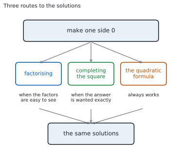
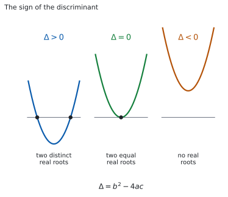
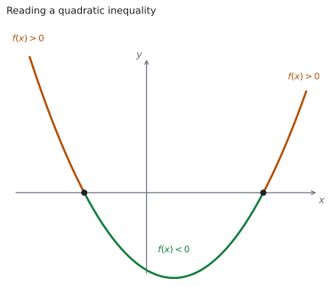
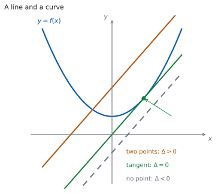

# SL 2.7 — Quadratic equations, inequalities and the discriminant（2 次方程式・2 次不等式・判別式） {#sec-aasl-2-7}

::: {.callout-note}
## What you should be able to do
- $2$ 次方程式を、**因数分解・平方完成・解の公式**の $3$ つで解ける。
- 問題文の言い方から、**どの方法を使うか**を選べる。
- $x$ で割って解を落とす、$\pm$ を落とすなどの**落とし穴**を避けられる。
- **discriminant（判別式）**$\Delta = b^{2}-4ac$ から、**解の種類**を言える。
- $\Delta$ の符号と、**グラフが $x$ 軸と何回出会うか**を結びつけられる。
- **$2$ 次不等式**を、グラフの形から解ける。
- 答えを $a < x < b$ や $x < a$ `or` $x > b$ の形で正しく書ける。
- **直線と曲線が出会う条件**を、$\Delta$ で判定できる。
- `touch`（接する）が $\Delta = 0$ だと分かる。
:::

## The idea

### 1. solving a quadratic equation（$2$ 次方程式を解く） {#idea}

{#fig-aasl27-idea-a width=100%}

$2$ 次方程式とは、$ax^{2}+bx+c = 0$（$a \neq 0$）の形に直せる方程式のことです。

**まず、右辺を $0$ にします。** そこから先は、$3$ つの道すじがあります。

@fig-aasl27-idea-a が、そのようすです。**どの道すじでも、出てくる解は同じ**です。ちがうのは、手間と、答えの見た目です。

::: {.callout-warning}
## `root` と `zero` と `solution` は、同じ数を指します
シラバスにこう書かれています。

> Solutions may be referred to as roots of equations or zeros of functions.

$x^{2}-9x+20 = 0$ の **roots**（解）は $4$ と $5$、$f(x) = x^{2}-9x+20$ の **zeros**（零点）も $4$ と $5$ です（[SL 2.4](aasl-2-4.qmd#zeros)）。**どの言い方でも、答える数は同じ**です。
:::

### 2. factorising（因数分解）で解く {#factor}

因数分解して解くときに使う性質は、次のとおりです。

$$
AB = 0 \quad \Longrightarrow \quad A = 0 \ \text{or} \ B = 0
$$ {#eq-aasl27-zero}

**$2$ つの数をかけて $0$ になるのは、少なくとも一方が $0$ のとき**です。これを **zero product property**（積が $0$ の性質）と言います。

$x^{2}-9x+20 = 0$ なら、

$$
(x-4)(x-5) = 0 \ \Rightarrow \ x - 4 = 0 \ \text{or} \ x - 5 = 0
$$

$$
x = 4 \quad \text{or} \quad x = 5
$$

::: {.callout-warning}
## @eq-aasl27-zero が使えるのは、右辺が $0$ のときだけです
$(x-4)(x-5) = 2$ から「$x-4 = 2$ または $x-5 = 2$」とはできません。**かけて $2$ になる $2$ 数の組み合わせは、いくらでもある**からです。

**必ず、すべてを左辺に集めて $= 0$ の形にしてから**因数分解してください。
:::

::: {.callout-warning}
## $x$ で割らないでください
$5x^{2} = 15x$ の両辺を $x$ で割ると $5x = 15$、つまり $x = 3$ だけになります。**$x = 0$ という解が消えてしまいます。**

$x$ で割れるのは $x \neq 0$ のときだけです。**割らずに、左辺に集めて共通因数をくくり出してください。**

$$
5x^{2} - 15x = 0 \ \Rightarrow \ 5x(x-3) = 0 \ \Rightarrow \ x = 0 \ \text{or} \ x = 3
$$
:::

### 3. completing the square（平方完成）で解く {#complete}

[SL 2.6](aasl-2-6.qmd#convert) の平方完成を使うと、**根号を使った正確な値**が出ます。

$x^{2}+4x-1 = 0$ で見ます。$x$ の係数 $4$ の半分は $2$ です。

$$
(x+2)^{2} - 4 - 1 = 0 \ \Rightarrow \ (x+2)^{2} = 5
$$

両辺の平方根をとります。**このとき $\pm$ が要ります。**

$$
x + 2 = \pm\sqrt{5} \ \Rightarrow \ x = -2 \pm \sqrt{5}
$$

::: {.callout-warning}
## $\pm$ を落とさないでください
$(x+2)^{2} = 5$ を満たすのは、$x+2 = \sqrt{5}$ だけではありません。$x+2 = -\sqrt{5}$ でも、$2$ 乗すれば $5$ になります。

**$2$ 乗して $5$ になる数は $2$ つある**ので、解も $2$ つです。
:::

### 4. the quadratic formula（解の公式）で解く {#formula}

$ax^{2}+bx+c = 0$ の解を、係数から直接出す公式は、次のとおりです。

$$
x = \frac{-b \pm \sqrt{b^{2}-4ac}}{2a}
$$ {#eq-aasl27-formula}

::: {.callout-important}
## この式は公式集にあります
公式集の **2.7** の欄に `Solutions of a quadratic equation` として印刷されています。

> $ax^{2} + bx + c = 0 \Rightarrow x = \dfrac{-b \pm \sqrt{b^{2}-4ac}}{2a}$, $a \neq 0$

**$a \neq 0$ も、公式集に書かれています。** $a = 0$ なら分母が $0$ になり、そもそも $2$ 次方程式ではありません。
:::

$2x^{2}+3x-4 = 0$ なら、$a = 2$、$b = 3$、$c = -4$ です。

$$
x = \frac{-3 \pm \sqrt{9 - 4(2)(-4)}}{2(2)} = \frac{-3 \pm \sqrt{9+32}}{4} = \frac{-3 \pm \sqrt{41}}{4}
$$

**$a$ と $c$ の符号がちがうので、$-4ac$ は正**になります（ここでは $a = 2 > 0$、$c = -4 < 0$）。**$a$ と $c$ が同符号なら、$-4ac$ は負**です。

::: {.callout-warning}
## 分母の $2a$ は、**全体**にかかります
$\dfrac{-b}{2a} \pm \sqrt{b^{2}-4ac}$ ではありません。**分子は $-b \pm \sqrt{\ldots}$ のひとかたまり**です。

書くときは、**分数の線を長く引いて**、$-b$ と根号の両方が上にあることが見えるようにしてください。
:::

### 5. どの方法を選ぶか {#choose}

| 問題文の言い方 | 使う方法 |
|:--|:--|
| 何も指定がなく、因数が見つかる | **因数分解** |
| `in the form` $p \pm \sqrt{q}$ | **平方完成** |
| `giving your answer in the form` $\dfrac{p \pm \sqrt{q}}{r}$ | **解の公式** |
| `Hence` の前に平方完成をさせている | **その結果を使う** |
| 因数が見つからない | **解の公式** |

: 方法の選び方 {#tbl-aasl27-choose}

### 6. discriminant（判別式）$\Delta$：解の個数と種類を決める {#discriminant}

解の個数と種類を決める判別式 $\Delta$ は、次の式です。

$$
\Delta = b^{2} - 4ac
$$ {#eq-aasl27-disc}

::: {.callout-important}
## この式は公式集にあります
公式集の **2.7** の欄に `Discriminant` として印刷されています。

> $\Delta = b^{2} - 4ac$

**$\Delta$ はギリシャ文字のデルタ**です。$\Delta = b^{2}-4ac$ は、解の公式（[SL 2.7a](aasl-2-7.qmd#formula)）の**根号の中身**そのものです。
:::

$$
x = \frac{-b \pm \sqrt{\Delta}}{2a}
$$

**根号の中が正か、$0$ か、負か**で、出てくる解のようすが変わります。**解を全部求めなくても、個数だけが分かる**のが判別式の便利なところです。

**$\Delta$ の符号が、解の種類を決めます。**

$3$ つの場合を、英語ではこう呼び分けます。答案では、この言い方をそのまま書いてください。

| $\Delta$ | 解のようす | 英語 | 図 |
|:--|:--|:--|:--|
| $\Delta > 0$ | ちがう実数解が $2$ つ | two distinct real roots | @fig-aasl27-idea-c |
| $\Delta = 0$ | 等しい実数解が $2$ つ | two equal real roots | @fig-aasl27-idea-c |
| $\Delta < 0$ | 実数解なし | no real roots | @fig-aasl27-idea-c |

: 判別式と解の種類 {#tbl-aasl27-nature}

::: {.callout-warning}
## 「$2$ 実解」と「ちがう $2$ 実解」はちがいます
`two distinct real roots` なら $\Delta > 0$ です。`distinct` の付かない `two real roots` は、ふつう $\Delta \ge 0$（等しい場合も含む）と読みます。**問題文の語をそのまま条件に写す**つもりで読んでください。

**`distinct` という語があるかどうか**で、$\ge$ と $>$ が変わります。問題文をよく読んでください。

`equal roots`、`repeated root`、`a double root` は、どれも $\Delta = 0$ を指す言い方です。
:::

::: {.callout-warning}
## $\Delta < 0$ は「解がない」ではありません
正確には「**実数の解がない**」です。答案では `no real roots` と書いてください。

SL の範囲では実数だけを扱うので、実際上は「解けない」と同じですが、**書き方は `real` を落とさない**でください。
:::

**同じことを、グラフでも見ておきます。**

{#fig-aasl27-idea-c width=100%}

@fig-aasl27-idea-c が、そのようすです。**$\Delta > 0$ なら $x$ 軸と $2$ 点で交わり、$\Delta = 0$ なら $1$ 点で接し（頂点が $x$ 軸上にあり）、$\Delta < 0$ なら交わりません。**

**$\Delta < 0$ のとき、グラフは $x$ 軸の片側に丸ごとあります。** $a > 0$ なら全部が上、$a < 0$ なら全部が下です。

### 7. quadratic inequality（$2$ 次不等式） {#inequality}

{#fig-aasl27-idea-b width=100%}

$2$ 次不等式は、**$3$ 段階**で解きます。

1. **すべてを片側に集めて、右辺を $0$ にする。**
2. **等号（$= 0$）とおいて解く**（$x$ 切片を求める）。
3. **グラフの形から、どちらの側かを決める。**

以下では、**$x$ 切片が $2$ つある場合**を扱います。$1$ つのとき・$0$ のときは、[第 6 節](#discriminant)の判別式で見分けます。

$x^{2}-2x-3 > 0$ で見ます。

**段階 1。** 右辺はすでに $0$ です。

**段階 2。** $x^{2}-2x-3 = 0$ から $(x-3)(x+1) = 0$ なので、$x = 3$ と $x = -1$ です。

**段階 3。** $a = 1 > 0$ なので下に凸です。@fig-aasl27-idea-b のとおり、グラフが $x$ 軸より**上**にあるのは、**$2$ つの $x$ 切片の外側**です。

$$
x < -1 \quad \text{or} \quad x > 3
$$

::: {.callout-tip}
## 迷ったら、数を $1$ つ入れてみてください
$3$ つの区間から $1$ つずつ、計算しやすい数を選びます。

- $x = -2$：$4+4-3 = 5 > 0$ ✓（外側は成り立つ）
- $x = 0$：$0-0-3 = -3$（内側は成り立たない）
- $x = 4$：$16-8-3 = 5 > 0$ ✓（外側は成り立つ）

**グラフをかかなくても、これで決まります。**
:::

**答えの書き方は、$2$ とおりだけです。**

| 場合 | 書き方 |
|:--|:--|
| 外側（$2$ つの区間） | $x < -1$ `or` $x > 3$ |
| 内側（$1$ つの区間） | $-1 < x < 3$ |

: 答えの書き方 {#tbl-aasl27-write}

::: {.callout-warning}
## 離れた $2$ つの区間は、$1$ つの不等式にまとめられません
$-1 < x < 3$ のような書き方が使えるのは、**$1$ つのつながった区間**のときだけです。@tbl-aasl27-write の $2$ 行を見くらべてください。

外側の答えは**離れた $2$ つの区間**なので、$1$ つの不等式にまとめられません。**`or` で結んで、$2$ つ書いてください。**

**答案には `x < -1 or x > 3` と書きます。** 日本語の「または」ではなく、`or` を使ってください。`and` にすると「両方を同時に満たす」という意味になり、そのような $x$ はありません。
:::

**$\le$ と $<$ の区別**にも気をつけてください。$x^{2}-2x-3 \ge 0$ なら、$x$ 切片も答えに入るので $x \le -1$ `or` $x \ge 3$ です。

### 8. 直線と曲線が出会う条件 {#intersect}

{#fig-aasl27-idea-d width=100%}

$y = mx+c$ と $y = f(x)$ が出会う点の $x$ 座標は、$f(x) = mx+c$ の解です（[SL 2.3](aasl-2-3.qmd#sums)）。

**$f$ が $2$ 次関数のとき**、すべてを片側に集めると **$2$ 次方程式**になります（$x^{2}$ の係数は $f$ のものがそのまま残るので、$0$ にはなりません）。その判別式を見ればよいわけです。

| $\Delta$ | 直線と曲線 |
|:--|:--|
| $\Delta > 0$ | **$2$ 点**で交わる |
| $\Delta = 0$ | **接する**（$1$ 点で出会う） |
| $\Delta < 0$ | **出会わない** |

: 直線と曲線 {#tbl-aasl27-line .tbl-narrow}

@fig-aasl27-idea-d が、その $3$ つの場合です。

**`touch`（接する）という語が出てきたら、$\Delta = 0$ です。**

- $x$ 軸に接する → $y = ax^{2}+bx+c$ の $\Delta = 0$。
- 直線と曲線が接する → **連立してできた $2$ 次方程式**の $\Delta = 0$（上の @tbl-aasl27-line）。

**放物線と直線が出会う点がちょうど $1$ つなら $\Delta = 0$**、つまり接しています。ただしこれは $y = mx+c$ の形に書ける直線の話です。$x = 3$ のような**縦の直線**は、放物線と必ずちょうど $1$ 点で出会いますが、接してはいません。

::: {.callout-tip collapse="true"}
## Paper 2 では、電卓で解と交点を出せます
TI-Nspire CX II に `solve(` はありません。`menu → Algebra → Polynomial Tools → Find Roots of Polynomial` を使うと、次数と係数を入れて $2$ つの解が小数で返ります。

**このサイトは TI-Nspire CX II を前提にしています。** ほかの機種を使う場合、試験に持ちこめるかどうかは学校の DP コーディネーターに確認してください。IB は、承認された電卓の一覧を Programme Resource Centre (PRC) の calculator の項に置いています（学校からアクセスします）。**ここに書いていない機種の可否は、推測しないでください。**

**不等式は、式のままでは解けません。** Graphs 画面に $y = f(x)$ をかき、`menu → Analyze Graph → Zero` で $x$ 切片を出してから、グラフが $x$ 軸より上か下かを見て区間を決めてください。

**Paper 1 では使えません。** このページの例題と演習は、すべて手で解ける形にしてあります。**解の公式は、公式集を見ながら手で使えるようにしておいてください。**

`Show that` と書かれている設問では、電卓で答えだけ出しても、求められていることをしたことになりません。
:::

::: {.callout-tip collapse="true"}
## Paper 2 では、電卓で判別式を確かめられます
TI-Nspire の Calculator 画面で、$a$、$b$、$c$ に値を入れてから `b^2-4*a*c` と打てば値が出ます。**値を入れていない変数は、そのまま文字として返ってきます**（`b^2-4*a*c` という式が出るだけです）。まず `1` `sto→` `a` のように入れてください。

**$k$ を含む判別式を、電卓に解かせることはできません。** 値の入っていない文字が残るからです。**文字を含む問題は手で解きます。**

Graphs 画面にグラフをかいて、$x$ 軸との交わり方を見るのも早い確かめ方です。**ただし、$\Delta$ が $0$ にとても近いときは、画面では見分けられません。** そのときは式で確かめてください。

**Paper 1 では使えません。** このページの例題と演習は、すべて手で解ける形にしてあります。
:::

## Why it works

::: {.callout-tip collapse="true"}
## クリックすると開きます

**なぜ、$AB = 0$ から「$A = 0$ または $B = 0$」が言えるのでしょうか。**

$A \neq 0$ だとします。すると両辺を $A$ で割れて、$B = 0$ が出ます。つまり、**$A$ が $0$ でないなら $B$ が $0$** です。$A$ が $0$ の場合も合わせると、「少なくとも一方が $0$」になります。

**これは $0$ だから言えることです。** $AB = 6$ なら、$A = 2, B = 3$ でも $A = 12, B = \frac{1}{2}$ でも成り立ち、**どちらの数も $0$ ではありません**。$AB = 0$ になる $2$ 数の組み合わせも無数にありますが、**そのどれもが「少なくとも一方は $0$」を満たします。** ここだけが $0$ の特別なところで、$6$ や $2$ にはこの性質がありません。

**なぜ、解の公式が出るのでしょうか。**

[SL 2.6](aasl-2-6.qmd#why-it-works) で見たとおり、平方完成すると

$$
ax^{2}+bx+c = a\left(x + \frac{b}{2a}\right)^{2} - \frac{b^{2}}{4a} + c
$$

です。これを $0$ とおいて、$\left(x + \dfrac{b}{2a}\right)^{2}$ について解きます。

$$
a\left(x + \frac{b}{2a}\right)^{2} = \frac{b^{2}}{4a} - c = \frac{b^{2}-4ac}{4a}
$$

$$
\left(x + \frac{b}{2a}\right)^{2} = \frac{b^{2}-4ac}{4a^{2}}
$$

右辺が $0$ 以上のとき、つまり **$b^{2}-4ac \ge 0$ のとき**、両辺の平方根をとれます（$\pm$ が要ります）。$\sqrt{4a^{2}} = \lvert 2a \rvert$ ですが、$\pm$ が付いているので $2a$ と書いても出てくる $2$ つの値は同じです。

（$b^{2}-4ac < 0$ のときは平方根がとれません。その場合に何が起きるかは [SL 2.7b](aasl-2-7.qmd) で見ます。）

$$
x + \frac{b}{2a} = \frac{\pm\sqrt{b^{2}-4ac}}{2a}
$$

$$
x = \frac{-b \pm \sqrt{b^{2}-4ac}}{2a}
$$

**解の公式は、平方完成を一般の $a$、$b$、$c$ でやっただけ**です。だから $2$ つは必ず同じ答えを出します。

**なぜ、$a > 0$ の不等式では「外側」が正なのでしょうか。** $f(x) = a(x-p)(x-q)$ と書けるとき（$p < q$）、

- $x > q$ なら、$x-p$ も $x-q$ も正。積は正。
- $p < x < q$ なら、$x-p$ は正、$x-q$ は負。積は負。
- $x < p$ なら、$x-p$ も $x-q$ も負。積は正。

**$a > 0$ なら、これがそのまま $f(x)$ の符号**です。$a < 0$ なら、すべて逆になります。

**なぜ、$\Delta$ の符号で解の個数が決まるのでしょうか。**

解の公式は

$$
x = \frac{-b \pm \sqrt{\Delta}}{2a}
$$

でした（[SL 2.7a](aasl-2-7.qmd#formula)）。ここで $\Delta$ の符号ごとに見ます。

- **$\Delta > 0$。** $\sqrt{\Delta}$ は正の実数です。$-b + \sqrt{\Delta}$ と $-b - \sqrt{\Delta}$ はちがう数なので、**解は $2$ つ**です。
- **$\Delta = 0$。** $\sqrt{0} = 0$ なので、$\pm$ を付けても同じ $x = -\dfrac{b}{2a}$ です。**$2$ つの解が重なって、$1$ か所になります。**
- **$\Delta < 0$。** $2$ 乗して負になる実数はないので、$\sqrt{\Delta}$ は実数になりません。**実数の解はありません。**

**なぜ、$\Delta = 0$ で $x$ 軸に接するのでしょうか。**

[SL 2.6](aasl-2-6.qmd#why-it-works) で、平方完成すると

$$
ax^{2}+bx+c = a\left(x + \frac{b}{2a}\right)^{2} + c - \frac{b^{2}}{4a}
$$

になることを見ました。頂点の $y$ 座標は

$$
c - \frac{b^{2}}{4a} = \frac{4ac - b^{2}}{4a} = -\frac{\Delta}{4a}
$$

です。頂点は、**$a > 0$ ならグラフのいちばん低い点、$a < 0$ ならいちばん高い点**です（[SL 2.6](aasl-2-6.qmd#vertex)）。だから頂点が $x$ 軸上にあるとき、グラフが $x$ 軸に届くのはその $1$ 点だけで、**横切らずに接します**。**頂点が $x$ 軸上にあるのは、この値が $0$ のとき**、つまり $\Delta = 0$ のときです。

同じ式から、$\Delta < 0$ のときのことも分かります。$a > 0$ なら $-\dfrac{\Delta}{4a} > 0$ で、**頂点が $x$ 軸より上**にあります。下に凸なので、グラフ全体が $x$ 軸より上です。$a < 0$ なら、すべて逆になります。

**なぜ、直線と曲線でも同じ話になるのでしょうか。** **$f$ が $2$ 次関数なら**、$f(x) = mx+c$ を片側に集めると、$x$ についての $2$ 次方程式になります。**その解の個数が、そのまま出会う点の個数**です（[SL 2.3](aasl-2-3.qmd#sums)）。だから、その方程式の $\Delta$ を見ればよいことになります。
:::

## Worked examples

::: {.callout-note appearance="simple"}
問題文は英語です。意味が理解できなかったら、問題文の下の「**日本語訳**」を開いてください。解説は日本語です。

**例題も演習も、すべて電卓なしで解けます。** Paper 1 のつもりで解いてください。
:::

::: {#exm-aasl27-factor}
**(a)** [Solve $x^{2} - 7x + 12 = 0$.]{.q-en}

**(b)** [Solve $2x^{2} = 8x$.]{.q-en}

**(c)** [Explain why dividing both sides of $2x^{2} = 8x$ by $x$ does not give all the solutions.]{.q-en}

**(d)** [Solve $3x^{2} - 12 = 0$.]{.q-en}

日本語訳

**(a)** $x^{2}-7x+12 = 0$ を解きなさい。

**(b)** $2x^{2} = 8x$ を解きなさい。

**(c)** $2x^{2} = 8x$ の両辺を $x$ で割ると、すべての解が得られない理由を説明しなさい。

**(d)** $3x^{2}-12 = 0$ を解きなさい。

---

**(a)** **かけて $12$、足して $-7$** になる $2$ 数は $-3$ と $-4$ です。

$$
(x-3)(x-4) = 0
$$

$$
x = 3 \quad \text{or} \quad x = 4
$$

**(b)** **右辺を $0$ にしてから**、共通因数をくくり出します（[第 2 節](#factor)）。

$$
2x^{2} - 8x = 0 \ \Rightarrow \ 2x(x-4) = 0
$$

$$
x = 0 \quad \text{or} \quad x = 4
$$

**(c)** `Explain why` なので、英語で理由を書きます。

::: {.model-answer}
**試験ではこう書く**

*Dividing both sides by $x$ is only allowed when $x \neq 0$, because division by zero is not defined. The value $x = 0$ does satisfy the original equation, since $2(0)^{2} = 0 = 8(0)$, but it is removed by the division, which leaves only $2x = 8$ and so $x = 4$. Bringing everything to one side and factorising as $2x(x-4) = 0$ keeps both solutions.*
:::

（両辺を $x$ で割ってよいのは $x \neq 0$ のときだけである。$0$ で割ることは定義されないからである。$x = 0$ はもとの方程式を満たす（$2(0)^{2} = 0 = 8(0)$）が、割り算によって取り除かれてしまい、$2x = 8$、つまり $x = 4$ だけが残る。すべてを片側に集めて $2x(x-4) = 0$ と因数分解すれば、$2$ つの解が両方とも残る、という意味です。）

**(d)** $x$ の項がないので、そのまま解けます。

$$
3x^{2} = 12 \ \Rightarrow \ x^{2} = 4 \ \Rightarrow \ x = \pm 2
$$

**検算（(a) について）。** 出した $2$ 数を、**もとの式に入れ直します。**

$$
3^{2}-7(3)+12 = 9-21+12 = 0, \qquad 4^{2}-7(4)+12 = 16-28+12 = 0
$$

どちらも $0$ ✓ **因数分解した式ではなく、もとの式に入れる**のが要です。

**検算（(b) について）。** **もとの形（両辺のある式）に入れます。** $x = 0$ では左辺 $0$、右辺 $0$ ✓ $x = 4$ では左辺 $2(16) = 32$、右辺 $8(4) = 32$ ✓

**検算（(d) について）。** $x = 2$ で $3(4)-12 = 0$ ✓ $x = -2$ でも $3(4)-12 = 0$ ✓ **$\pm$ を落としていないかは、負のほうを入れて確かめられます。**

::: {.callout-note}
## 解答例（答案用紙に書くこと）
**(a)** $(x-3)(x-4) = 0$
$$x = 3 \quad \text{or} \quad x = 4$$

**(b)** $2x^{2}-8x = 0$, $2x(x-4) = 0$
$$x = 0 \quad \text{or} \quad x = 4$$

**(c)** *Dividing by $x$ requires $x \neq 0$, so the solution $x = 0$ is lost. Factorising $2x(x-4) = 0$ keeps both.*

**(d)** $x^{2} = 4$
$$x = \pm 2$$
:::
:::

::: {#exm-aasl27-forms}
[**(a)** Write $x^{2} + 6x - 2$ in the form $(x+h)^{2} + k$.]{.q-en}

**(b)** [Hence solve $x^{2} + 6x - 2 = 0$, giving your answers in the form $p \pm \sqrt{q}$.]{.q-en}

**(c)** [Solve $2x^{2} + 5x - 1 = 0$, giving your answers in the form $\dfrac{p \pm \sqrt{q}}{r}$.]{.q-en}

**(d)** [Explain why the quadratic formula cannot be used when $a = 0$.]{.q-en}

日本語訳

**(a)** $x^{2}+6x-2$ を $(x+h)^{2}+k$ の形で書きなさい。

**(b)** それを使って $x^{2}+6x-2 = 0$ を解き、答えを $p \pm \sqrt{q}$ の形で書きなさい。

**(c)** $2x^{2}+5x-1 = 0$ を解き、答えを $\dfrac{p \pm \sqrt{q}}{r}$ の形で書きなさい。

**(d)** $a = 0$ のとき解の公式が使えない理由を説明しなさい。

---

**(a)** $x$ の係数 $6$ の半分は $3$ です（[第 3 節](#complete)）。

$$
x^{2}+6x-2 = (x+3)^{2} - 9 - 2 = (x+3)^{2} - 11
$$

**(b)** `Hence` なので、(a) の形を使います。**ここで解の公式に切りかえてはいけません。**

$$
(x+3)^{2} - 11 = 0 \ \Rightarrow \ (x+3)^{2} = 11
$$

$$
x + 3 = \pm\sqrt{11} \ \Rightarrow \ x = -3 \pm \sqrt{11}
$$

**(c)** 答えの形が $\dfrac{p \pm \sqrt{q}}{r}$ なので、解の公式です（[第 5 節](#choose)）。$a = 2$、$b = 5$、$c = -1$ を @eq-aasl27-formula に入れます。**$a$ と $c$ の符号がちがうので、$-4ac$ は正**になります。

$$
x = \frac{-5 \pm \sqrt{5^{2} - 4(2)(-1)}}{2(2)} = \frac{-5 \pm \sqrt{25+8}}{4} = \frac{-5 \pm \sqrt{33}}{4}
$$

**(d)** `Explain why` なので、英語で理由を書きます。

::: {.model-answer}
**試験ではこう書く**

*If $a = 0$ the denominator $2a$ is zero, and division by zero is not defined, so the formula gives no value. When $a = 0$ the equation is $bx + c = 0$, which is linear rather than quadratic, so a formula that produces two solutions cannot apply. This is why the formula booklet states the condition $a \neq 0$.*
:::

（$a = 0$ なら分母 $2a$ が $0$ になり、$0$ で割ることは定義されないので、公式は値を返さない。$a = 0$ のとき方程式は $bx+c = 0$ で、$2$ 次ではなく $1$ 次だから、$2$ つの解を出す公式は当てはまらない。公式集に $a \neq 0$ と書かれているのは、このためである、という意味です。）

**検算（(a) について）。** **展開して、もとの式に戻るかを見ます。** $(x+3)^{2}-11 = x^{2}+6x+9-11 = x^{2}+6x-2$ ✓

**検算（(b) について）。** **解の公式でも出します。** $a = 1$、$b = 6$、$c = -2$ なので

$$
x = \frac{-6 \pm \sqrt{36+8}}{2} = \frac{-6 \pm \sqrt{44}}{2} = \frac{-6 \pm 2\sqrt{11}}{2} = -3 \pm \sqrt{11}
$$

一致しました ✓ **ちがう $2$ つの方法で、同じ答えが出ました。**

**検算（(c) について）。** **平方完成でも出します。**

$$
2x^{2}+5x-1 = 2\left(x+\frac{5}{4}\right)^{2} - \frac{25}{8} - 1 = 2\left(x+\frac{5}{4}\right)^{2} - \frac{33}{8}
$$

$0$ とおくと $\left(x+\dfrac{5}{4}\right)^{2} = \dfrac{33}{16}$ なので $x = -\dfrac{5}{4} \pm \dfrac{\sqrt{33}}{4} = \dfrac{-5 \pm \sqrt{33}}{4}$ ✓ **公式を通らずに同じ答えが出ました。**

**$\pm$ を落として $x = -3+\sqrt{11}$ だけにしていたら**、解を $1$ つ落としています。**解は $2$ つあります。**

::: {.callout-note}
## 解答例（答案用紙に書くこと）
**(a)**
$$x^{2}+6x-2 = (x+3)^{2} - 11$$

**(b)** $(x+3)^{2} = 11$, $x+3 = \pm\sqrt{11}$
$$x = -3 \pm \sqrt{11}$$

**(c)** $x = \dfrac{-5 \pm \sqrt{25+8}}{4}$
$$x = \frac{-5 \pm \sqrt{33}}{4}$$

**(d)** *If $a = 0$ the denominator $2a$ is zero, so the formula is not defined; the equation is then linear, not quadratic.*
:::
:::

::: {#exm-aasl27-nature}
[For each of the following equations, find the discriminant and state the nature of the roots.]{.q-en}

**(a)** [$x^{2}+4x+1 = 0$]{.q-en}

**(b)** [$x^{2}-6x+9 = 0$]{.q-en}

**(c)** [$2x^{2}+x+3 = 0$]{.q-en}

**(d)** [Explain what $\Delta = 0$ tells you about the graph of the corresponding quadratic function.]{.q-en}

日本語訳

次のそれぞれの方程式について、判別式を求め、解の種類を述べなさい。

**(a)** $x^{2}+4x+1 = 0$

**(b)** $x^{2}-6x+9 = 0$

**(c)** $2x^{2}+x+3 = 0$

**(d)** $\Delta = 0$ が、対応する $2$ 次関数のグラフについて何を意味するかを説明しなさい。

---

**(a)** $a = 1$、$b = 4$、$c = 1$ です（@eq-aasl27-disc）。

$$
\Delta = 4^{2} - 4(1)(1) = 16 - 4 = 12
$$

$\Delta > 0$ なので、**two distinct real roots** です。

**(b)** $a = 1$、$b = -6$、$c = 9$ です。**$b$ が負でも $b^{2}$ は正**です。

$$
\Delta = (-6)^{2} - 4(1)(9) = 36 - 36 = 0
$$

$\Delta = 0$ なので、**two equal real roots** です。

**(c)** $a = 2$、$b = 1$、$c = 3$ です。

$$
\Delta = 1^{2} - 4(2)(3) = 1 - 24 = -23
$$

$\Delta < 0$ なので、**no real roots** です。

**(d)** `Explain` なので、英語で書きます。

::: {.model-answer}
**試験ではこう書く**

*If $\Delta = 0$ the two roots are equal, so the graph meets the $x$-axis at exactly one point. That point is the vertex, because the two intersections have come together at the axis of symmetry $x = -\dfrac{b}{2a}$. The graph therefore touches the $x$-axis instead of crossing it, and the vertex lies on the $x$-axis.*
:::

（$\Delta = 0$ なら $2$ つの解は等しいので、グラフは $x$ 軸とちょうど $1$ 点で出会う。その点は頂点である。$2$ つの交点が対称の軸 $x = -\dfrac{b}{2a}$ のところで重なったからである。したがってグラフは $x$ 軸を横切らずに接し、頂点が $x$ 軸上にある、という意味です。）

**検算（(a) について）。** **$\Delta$ を使わずに、解が $2$ つあることを確かめます。** $f(x) = x^{2}+4x+1$ とすると $f(0) = 1 > 0$、$f(-1) = 1-4+1 = -2 < 0$、$f(-4) = 16-16+1 = 1 > 0$ です。$-1$ の左と右で符号が変わるので、**$x$ 軸を $2$ 回横切ります** ✓ ちがう実数解が $2$ つある、と合っています。

**検算（(b) について）。** **実際に解いて、$1$ 点になるかを見ます。** $x^{2}-6x+9 = (x-3)^{2} = 0$ なので $x = 3$ だけです ✓ $\Delta = 0$ と合っています。

**検算（(c) について）。** **判別式を通らない道でも見ます。** 平方完成すると

$$
2x^{2}+x+3 = 2\left(x+\frac{1}{4}\right)^{2} - \frac{1}{8} + 3 = 2\left(x+\frac{1}{4}\right)^{2} + \frac{23}{8}
$$

です。$2$ 乗は $0$ 以上なので、この値は $\dfrac{23}{8}$ より小さくなりません。**$0$ になることがない**ので、実数解はありません ✓

::: {.callout-note}
## 解答例（答案用紙に書くこと）
**(a)** $\Delta = 16 - 4 = 12 > 0$

*two distinct real roots*

**(b)** $\Delta = 36 - 36 = 0$

*two equal real roots*

**(c)** $\Delta = 1 - 24 = -23 < 0$

*no real roots*

**(d)** *The graph touches the $x$-axis at one point, and that point is the vertex.*
:::
:::

::: {#exm-aasl27-line}
[The line $y = 2x + k$ and the curve $y = x^{2} + 3x + 4$ are given, where $k$ is a constant.]{.q-en}

**(a)** [Show that the $x$-coordinates of any points of intersection satisfy $x^{2} + x + 4 - k = 0$.]{.q-en}

**(b)** [Find the value of $k$ for which the line is a tangent to the curve.]{.q-en}

**(c)** [Find the set of values of $k$ for which the line and the curve do not meet.]{.q-en}

**(d)** [A student writes that the line is a tangent when $k < \dfrac{15}{4}$. Comment on this statement.]{.q-en}

日本語訳

直線 $y = 2x+k$ と曲線 $y = x^{2}+3x+4$ が与えられています。$k$ は定数です。

**(a)** 交点の $x$ 座標が $x^{2}+x+4-k = 0$ を満たすことを示しなさい。

**(b)** 直線が曲線に接するときの $k$ の値を求めなさい。

**(c)** 直線と曲線が出会わない $k$ の値の範囲を求めなさい。

**(d)** ある生徒が「$k < \dfrac{15}{4}$ のとき直線は接する」と書きました。この発言について述べなさい。

---

**(a)** `Show that` なので、**式を等号でつないで、集める過程を書きます**（[第 6 節](#intersect)）。

$$
x^{2}+3x+4 = 2x+k
$$

$$
x^{2}+3x+4-2x-k = 0 \ \Rightarrow \ x^{2}+x+4-k = 0
$$

**(b)** 接するのは $\Delta = 0$ のときです（[第 5 節](#intersect)）。$a = 1$、$b = 1$、$c = 4-k$ です。

$$
\Delta = 1 - 4(1)(4-k) = 1 - 16 + 4k = 4k - 15
$$

$$
4k - 15 = 0 \ \Rightarrow \ k = \frac{15}{4}
$$

**(c)** 出会わないのは $\Delta < 0$ のときです（@tbl-aasl27-line）。

$$
4k - 15 < 0 \ \Rightarrow \ k < \frac{15}{4}
$$

**(d)** `Comment on` なので、英語で判断とその理由を書きます。

::: {.model-answer}
**試験ではこう書く**

*The statement is not correct. For $k < \dfrac{15}{4}$ the discriminant $4k - 15$ is negative, so $x^{2}+x+4-k = 0$ has no real solution and the line and the curve do not meet at all. A tangent touches the curve at exactly one point, which needs $\Delta = 0$, so it happens only for the single value $k = \dfrac{15}{4}$. The student has used an inequality where an equation is required.*
:::

（この発言は正しくない。$k < \dfrac{15}{4}$ なら判別式 $4k-15$ は負なので、$x^{2}+x+4-k = 0$ に実数解はなく、直線と曲線はまったく出会わない。接線は曲線とちょうど $1$ 点で接するので $\Delta = 0$ が必要であり、それが起こるのは $k = \dfrac{15}{4}$ というただ $1$ つの値のときだけである。この生徒は、方程式であるべきところに不等式を使っている、という意味です。）

**検算（(a) について）。** **$k$ に $1$ つ値を入れて、出た $x$ で直線と曲線の $y$ が一致するかを見ます。** $k = 6$ とすると $x^{2}+x-2 = (x+2)(x-1) = 0$ で、$x = -2$ と $x = 1$ です。

- $x = 1$：直線は $y = 2(1)+6 = 8$、曲線は $y = 1+3+4 = 8$ ✓
- $x = -2$：直線は $y = 2(-2)+6 = 2$、曲線は $y = 4-6+4 = 2$ ✓

**どちらの点でも $y$ が一致しました。**

**検算（(b) について）。** **接点を実際に求めて、$1$ 点だけになるかを見ます。** $k = \dfrac{15}{4}$ のとき

$$
x^{2}+x+4-\frac{15}{4} = x^{2}+x+\frac{1}{4} = \left(x+\frac{1}{2}\right)^{2} = 0
$$

$x = -\dfrac{1}{2}$ だけになりました ✓

**検算（(c) について）。** **範囲の中と外で、$1$ つずつ試します。** $k = 0$（範囲の中）なら $x^{2}+x+4 = 0$ で $\Delta = 1-16 = -15 < 0$ ✓ 出会いません。$k = 5$（範囲の外）なら $x^{2}+x-1 = 0$ で $\Delta = 1+4 = 5 > 0$ ✓ $2$ 点で交わります。

::: {.callout-note}
## 解答例（答案用紙に書くこと）
**(a)** $x^{2}+3x+4 = 2x+k$
$$x^{2}+x+4-k = 0$$

**(b)** $\Delta = 1 - 4(4-k) = 4k-15 = 0$
$$k = \frac{15}{4}$$

**(c)** $4k - 15 < 0$
$$k < \frac{15}{4}$$

**(d)** *Not correct: $k < \dfrac{15}{4}$ gives $\Delta < 0$, so the line misses the curve. A tangent needs $\Delta = 0$, that is $k = \dfrac{15}{4}$ only.*
:::
:::
## Common errors

::: {.callout-warning}
## 右辺を $0$ にせずに因数分解する
@eq-aasl27-zero が使えるのは、**右辺が $0$ のときだけ**です（[第 2 節](#factor)）。

$(x-1)(x+2) = 4$ から「$x-1 = 4$ または $x+2 = 4$」とはできません。**展開して集め直してください。**
:::

::: {.callout-warning}
## 両辺を $x$ で割って、解を落とす
$x$ で割れるのは $x \neq 0$ のときだけです（[第 2 節](#factor)）。

**共通因数としてくくり出せば、$x = 0$ も残ります。**
:::

::: {.callout-warning}
## 平方根をとるときに $\pm$ を落とす
$(x+h)^{2} = k$（$k > 0$）から出る解は **$2$ つ**です（[第 3 節](#complete)）。

$x^{2} = 49$ の解も $x = 7$ だけではなく、$x = \pm 7$ です。
:::

::: {.callout-warning}
## 解の公式で、$-b$ と分母を書きまちがえる
$-b$ の符号（$b$ が負なら $-b$ は正）と、**分母の $2a$ が分子全体にかかる**ことに気をつけてください（@eq-aasl27-formula）。

$b^{2}-4ac$ では、**$a$ と $c$ の符号がちがうと $-4ac$ が正**（足し算）になります。同符号なら負です。
:::

::: {.callout-warning}
## 不等式で、外側と内側を取りちがえる
$x$ 切片が $2$ つあり $a > 0$ なら、$f(x) > 0$ は**外側**、$f(x) < 0$ は**内側**です（[第 6 節](#inequality)）。

$a < 0$ なら逆になります。**迷ったら、数を $1$ つ入れてください。**
:::

::: {.callout-warning}
## 離れた $2$ 区間を、$1$ つの不等式にまとめる
$3 < x < -2$ のようには書けません（[第 7 節](#inequality)）。**`or` で結んで $2$ つ書きます。**

つながった $1$ 区間のときだけ、$-2 < x < 3$ の形が使えます。
:::

::: {.callout-warning}
## 文字が $a$ の位置にあるのに、$a \neq 0$ を確かめない
$kx^{2} + \ldots$ の形では、**$k = 0$ だと $2$ 次方程式ではありません**（[第 7 節](#intersect)）。

判別式を使う前に、**$a$ が $0$ でないことを書いておく**と安全です。
:::

::: {.callout-warning}
## `two real roots` と `two distinct real roots` を取りちがえる
`distinct` があれば $\Delta > 0$、なければふつう $\Delta \ge 0$ です（[第 2 節](#discriminant)）。

**問題文の語を、そのまま条件に写す**つもりで読んでください。
:::

::: {.callout-warning}
## $-4ac$ の符号をまちがえる
$c$ が負なら $-4ac$ は**足し算**です（[第 7 節](#intersect)）。$a$、$b$、$c$ を**符号ごと書き出してから**代入してください。

$b$ が負でも、$b^{2}$ は正です。
:::

::: {.callout-warning}
## $\Delta < 0$ を「解がない」と書く
正確には「**実数の解がない**」です（[第 2 節](#discriminant)）。答案では `no real roots` と書いてください。
:::

## Exercises

::: {.callout-note appearance="simple"}
各問題に、折りたたみが $3$ つ付いています。**日本語訳**、**解答例**（答案用紙に書くべきこと。英語です）、**解説**（なぜそうなるか。日本語です）。

まず自分で解いて、次に解答例と見くらべてください。**解説は、合わなかったときだけ開けば十分です。**
:::

::: {.exercise-block}

[1]{.ex-no} [Solve $x^{2} + 5x + 6 = 0$.]{.q-en}

日本語訳

$x^{2}+5x+6 = 0$ を解きなさい。

::: {.callout-note collapse="true"}
## 解答例（答案用紙に書くこと）

$$(x+2)(x+3) = 0$$

$$x = -2 \quad \text{or} \quad x = -3$$
:::

::: {.callout-tip collapse="true"}
## 解説

**かけて $6$、足して $5$** になる $2$ 数は $2$ と $3$ です。どちらも正なので、かっこの中は $+$ です。

**検算。** 出した $2$ 数を、もとの式に入れ直します。$4-10+6 = 0$ ✓ $9-15+6 = 0$ ✓

**符号の見当も付きます。** **実数解をもつ場合**、定数項が正なら $2$ 解の符号は同じで、$x$ の係数も正なら**どちらも負**のはずです ✓ （実数解があるかどうかは、これでは分かりません。）
:::
::: {.ex-sep}
:::

[2]{.ex-no} [Solve $x^{2} = 9x$.]{.q-en}

日本語訳

$x^{2} = 9x$ を解きなさい。

::: {.callout-note collapse="true"}
## 解答例（答案用紙に書くこと）

$$x^{2} - 9x = 0$$

$$x(x-9) = 0$$

$$x = 0 \quad \text{or} \quad x = 9$$
:::

::: {.callout-tip collapse="true"}
## 解説

**$x$ で割らないでください**（[第 2 節](#factor)）。右辺を $0$ にしてから、共通因数をくくり出します。

**検算。** **もとの形（両辺のある式）に入れます。** $x = 0$ では左辺 $0$、右辺 $0$ ✓ $x = 9$ では左辺 $81$、右辺 $81$ ✓

**$x = 9$ だけ答えていたら**、$x$ で割って $x = 0$ を落としています。**$2$ 次方程式の実数解は多くても $2$ つです。$1$ つ見つけたら、もう $1$ つがないかを必ず確かめてください。**
:::
::: {.ex-sep}
:::

[3]{.ex-no} [**(a)** Write $x^{2} - 4x + 1$ in the form $(x-h)^{2} + k$.]{.q-en}

**(b)** [Hence solve $x^{2} - 4x + 1 = 0$, giving your answers in the form $p \pm \sqrt{q}$.]{.q-en}

日本語訳

**(a)** $x^{2}-4x+1$ を $(x-h)^{2}+k$ の形で書きなさい。

**(b)** それを使って $x^{2}-4x+1 = 0$ を解き、答えを $p \pm \sqrt{q}$ の形で書きなさい。

::: {.callout-note collapse="true"}
## 解答例（答案用紙に書くこと）

**(a)**
$$x^{2}-4x+1 = (x-2)^{2} - 4 + 1 = (x-2)^{2} - 3$$

**(b)** $(x-2)^{2} = 3$
$$x = 2 \pm \sqrt{3}$$
:::

::: {.callout-tip collapse="true"}
## 解説

$x$ の係数 $-4$ の半分は $-2$ です。$(x-2)^{2} = x^{2}-4x+4$ なので、$4$ を引きます。

**検算（(a) について）。** 展開して、もとの式に戻るかを見ます。$(x-2)^{2}-3 = x^{2}-4x+4-3 = x^{2}-4x+1$ ✓

**検算（(b) について）。** **解の公式でも出します。** $a=1$、$b=-4$、$c=1$ なので

$$
x = \frac{4 \pm \sqrt{16-4}}{2} = \frac{4 \pm \sqrt{12}}{2} = \frac{4 \pm 2\sqrt{3}}{2} = 2 \pm \sqrt{3}
$$

一致しました ✓
:::
::: {.ex-sep}
:::

[4]{.ex-no} [Solve $x^{2} + 3x - 5 = 0$, giving your answers in the form $\dfrac{p \pm \sqrt{q}}{r}$.]{.q-en}

日本語訳

$x^{2}+3x-5 = 0$ を解き、答えを $\dfrac{p \pm \sqrt{q}}{r}$ の形で書きなさい。

::: {.callout-note collapse="true"}
## 解答例（答案用紙に書くこと）

$a = 1$, $b = 3$, $c = -5$

$$x = \frac{-3 \pm \sqrt{9 + 20}}{2}$$

$$x = \frac{-3 \pm \sqrt{29}}{2}$$
:::

::: {.callout-tip collapse="true"}
## 解説

答えの形が指定されているので、解の公式です（@tbl-aasl27-choose）。**$c = -5$ なので $-4ac = +20$** になります。

**検算。** **$+$ のほうの解を、もとの式に入れ直します。** $x = \dfrac{-3+\sqrt{29}}{2}$ のとき $x^{2} = \dfrac{9-6\sqrt{29}+29}{4} = \dfrac{19-3\sqrt{29}}{2}$、$3x = \dfrac{-9+3\sqrt{29}}{2}$ なので、足すと $\dfrac{19-3\sqrt{29}-9+3\sqrt{29}}{2} - 5 = 5 - 5 = 0$ ✓ **$\sqrt{29}$ が消えました。**

**$\sqrt{29}$ はこれ以上簡単になりません。** $29$ は素数なので、根号の外に出せる因数がありません。$-3$ と $2$ にも共通の因数がないので、分数の約分もできません。**$\dfrac{-3 \pm \sqrt{29}}{2}$ が最終形**です。
:::
::: {.ex-sep}
:::

[5]{.ex-no} [Solve the inequality $x^{2} - 2x - 8 < 0$.]{.q-en}

日本語訳

不等式 $x^{2}-2x-8 < 0$ を解きなさい。

::: {.callout-note collapse="true"}
## 解答例（答案用紙に書くこと）

$(x-4)(x+2) = 0$ gives $x = 4$ and $x = -2$

$a > 0$, so the graph is below the axis between the roots

$$-2 < x < 4$$
:::

::: {.callout-tip collapse="true"}
## 解説

まず $= 0$ として解き、それから向きを決めます（[第 6 節](#inequality)）。$a = 1 > 0$、$< 0$ なので**内側**です。

**検算。** **$3$ つの区間から $1$ つずつ入れます。** $x = -3$：$9+6-8 = 7$（成り立たない）$x = 0$：$-8 < 0$ ✓ $x = 5$：$25-10-8 = 7$（成り立たない）**内側だけが成り立ちました。**

**$<$ なので、端は入りません。** $x = -2$ では $4+4-8 = 0$ で、$< 0$ にはなりません。
:::
::: {.ex-sep}
:::

[6]{.ex-no} [Solve the inequality $x^{2} \ge 16$.]{.q-en}

日本語訳

不等式 $x^{2} \ge 16$ を解きなさい。

::: {.callout-note collapse="true"}
## 解答例（答案用紙に書くこと）

$x^{2} - 16 \ge 0$, and $(x-4)(x+4) = 0$ gives $x = \pm 4$

$$x \le -4 \quad \text{or} \quad x \ge 4$$
:::

::: {.callout-tip collapse="true"}
## 解説

**まず右辺を $0$ にします。** $a > 0$ で $\ge 0$ なので、外側（端を含む）です。

**検算。** $x = -5$：$25 \ge 16$ ✓ $x = 0$：$0 \ge 16$ は成り立たない ✓ $x = 5$：$25 \ge 16$ ✓ 端の $x = 4$ では $16 \ge 16$ で、成り立ちます ✓

**「$x \ge 4$」だけにしていたら**、負のほうが抜けています。$x = -5$ も $x^{2} = 25 \ge 16$ を満たします。**$2$ 乗すると符号が消える**ことを思い出してください。
:::
::: {.ex-sep}
:::

[7]{.ex-no} [Find the discriminant of $x^{2} + 5x + 2 = 0$ and state the nature of the roots.]{.q-en}

日本語訳

$x^{2}+5x+2 = 0$ の判別式を求め、解の種類を述べなさい。

::: {.callout-note collapse="true"}
## 解答例（答案用紙に書くこと）

$$\Delta = 5^{2} - 4(1)(2) = 25 - 8 = 17$$

*$\Delta > 0$, so there are two distinct real roots.*
:::

::: {.callout-tip collapse="true"}
## 解説

$a = 1$、$b = 5$、$c = 2$ を @eq-aasl27-disc に入れるだけです。

**検算。** **判別式を使わずに、符号の変わり方で見ます。** $f(x) = x^{2}+5x+2$ とすると $f(0) = 2 > 0$、$f(-1) = 1-5+2 = -2 < 0$、$f(-5) = 25-25+2 = 2 > 0$ です。$-1$ の左と右で符号が変わるので、**$x$ 軸を $2$ 回横切ります** ✓

**$17$ は平方数ではありません。** ですから解は根号を含む形になり、因数分解では出せません。
:::
::: {.ex-sep}
:::

[8]{.ex-no} [The equation $x^{2} + kx + 25 = 0$ has two equal real roots. Find the possible values of $k$.]{.q-en}

日本語訳

方程式 $x^{2}+kx+25 = 0$ は、等しい $2$ 実解をもちます。$k$ のとりうる値を求めなさい。

::: {.callout-note collapse="true"}
## 解答例（答案用紙に書くこと）

$$\Delta = k^{2} - 4(1)(25) = k^{2} - 100$$

$k^{2} - 100 = 0$

$$k = \pm 10$$
:::

::: {.callout-tip collapse="true"}
## 解説

**文字が入っていても、やることは同じです。**

1. **$a$、$b$、$c$ を、文字を含んだまま書き出す。** ここでは $a = 1$、$b = k$、$c = 25$ です。
2. **$\Delta$ を作る。** $\Delta = k^{2} - 4(1)(25) = k^{2} - 100$。
3. **条件を、$\Delta$ についての式にする。** `two equal real roots` なので $\Delta = 0$ です（@tbl-aasl27-nature）。
4. **解く。** $k^{2} = 100$ から $k = \pm 10$。
5. **$a \neq 0$ を確かめる。** ここは $a = 1$ なので、確かめることはありません。**文字が $a$ の位置に来ているときだけ、この手順が必要になります**（演習 $9$ のあとの注意）。

**検算。** **両方の $k$ で、実際に等しい $2$ 実解になるかを見ます。** $k = 10$ なら $x^{2}+10x+25 = (x+5)^{2} = 0$ で $x = -5$ ✓ $k = -10$ なら $x^{2}-10x+25 = (x-5)^{2} = 0$ で $x = 5$ ✓

**$k = 10$ だけ答えていたら**、$\pm$ を落としています。**$k^{2} = 100$ の解は $2$ つ**です。
:::
::: {.ex-sep}
:::

[9]{.ex-no} [The equation $2x^{2} + 3x + c = 0$ has no real roots. Find the set of values of $c$.]{.q-en}

日本語訳

方程式 $2x^{2}+3x+c = 0$ は実数解をもちません。$c$ の値の範囲を求めなさい。

::: {.callout-note collapse="true"}
## 解答例（答案用紙に書くこと）

$$\Delta = 3^{2} - 4(2)(c) = 9 - 8c$$

$9 - 8c < 0$

$$c > \frac{9}{8}$$
:::

::: {.callout-tip collapse="true"}
## 解説

**演習 $8$ と同じ $5$ 手順です。** ちがうのは、**条件が等式ではなく不等式**になるところだけです。

1. $a = 2$、$b = 3$、$c = c$。
2. $\Delta = 3^{2} - 4(2)(c) = 9 - 8c$。
3. `no real roots` なので **$\Delta < 0$**。
4. $9 - 8c < 0$ を解きます。**$-8c$ を右辺に移す**と $9 < 8c$ になり、**不等号の向きは変わりません**（負の数で割るときだけ向きが変わります）。
5. $a = 2$ で、文字は入っていません。

**もし $a$ の位置に文字があったら**、たとえば $kx^{2}+3x+1 = 0$ なら、$k = 0$ のとき $3x+1 = 0$ という $1$ 次方程式になり、解が $1$ つあります。**$\Delta$ の話ではなくなる**ので、$k \neq 0$ を最後に書き添えてください。

**検算。** **境目の両側で試します。** $c = 2$（範囲の中）なら $\Delta = 9-16 = -7 < 0$ ✓ $c = 1$（範囲の外）なら $\Delta = 9-8 = 1 > 0$ で、実数解が $2$ つあります ✓ 境目の $c = \dfrac{9}{8}$ では $\Delta = 0$ で、等しい $2$ 実解です ✓

**向きをまちがえて $c < \dfrac{9}{8}$ としていたら**、$c = 0$ を入れると $2x^{2}+3x = 0$ で、解が $2$ つ出てしまいます。
:::
::: {.ex-sep}
:::

[10]{.ex-no} [A student is asked to find the values of $k$ for which $x^{2} + kx + 4 = 0$ has two equal real roots, and writes]{.q-en}

$$
k^{2} - 16 = 0, \qquad k = 4
$$

[Identify the error in the student's answer, and write down the correct values.]{.q-en}

日本語訳

ある生徒が、$x^{2}+kx+4 = 0$ が等しい $2$ 実解をもつ $k$ の値を求めるように言われ、上のように書きました。

生徒の答えの誤りを指摘し、正しい値を書きなさい。

::: {.callout-note collapse="true"}
## 解答例（答案用紙に書くこと）

*The discriminant is correct, but $k^{2} = 16$ has two solutions, not one.*

$$k = \pm 4$$
:::

::: {.callout-tip collapse="true"}
## 解説

`Identify the error` なので、**どこが違うのかを名指し**してから、正しい答えを書きます。

$\Delta = k^{2}-16$ までは正しく、$k^{2} = 16$ も正しい。**落ちているのは $k = -4$** です（[SL 2.7a](aasl-2-7.qmd#complete)）。

**検算。** **落ちた値でも、条件が成り立つかを確かめます。** $k = -4$ なら $x^{2}-4x+4 = (x-2)^{2} = 0$ で、$x = 2$ の等しい $2$ 実解 ✓ たしかに条件を満たします。

**$k = 4$ のほうも確かめます。** $x^{2}+4x+4 = (x+2)^{2} = 0$ で $x = -2$ ✓ **生徒の答えは「まちがい」ではなく「不足」です。**

::: {.model-answer}
**試験ではこう書く**

*The discriminant $\Delta = k^{2} - 4(1)(4) = k^{2}-16$ is correct, and setting it to zero gives $k^{2} = 16$. The error is in the last step: $k^{2} = 16$ has the two solutions $k = 4$ and $k = -4$, and the student gave only the positive one. Both values work: $k = 4$ gives $(x+2)^{2} = 0$ and $k = -4$ gives $(x-2)^{2} = 0$, each with two equal real roots. So $k = \pm 4$.*
:::
:::

:::

