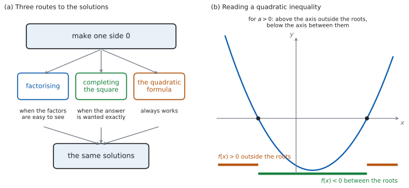

# SL 2.7a — Solving quadratic equations and inequalities（2 次方程式と 2 次不等式） {#sec-aasl-2-7a}

::: {.callout-note}
## What you should be able to do
- **$2$ 次方程式**を、**因数分解**・**平方完成**・**解の公式**の $3$ つの方法で解ける。
- 問題文の指示から、**どの方法を使うか**を選べる。
- 積の形の方程式は、**右辺を $0$ にしてから**でないと $A = 0$ または $B = 0$ と分けられない、と分かる（$AB = 2$ からは何も言えない）。
- 解を **exact value**（正確な値）で書ける。
- **$2$ 次不等式**を解ける。
- 不等式の答えを、**正しい書き方**で書ける。
:::

## The idea

### 1. 解く道すじは $3$ つ {#idea}

$2$ 次方程式とは、$ax^{2}+bx+c = 0$（$a \neq 0$）の形に直せる方程式のことです。

**まず、右辺を $0$ にします。** そこから先は、$3$ つの道すじがあります。

{#fig-aasl27a-idea width=100%}

@fig-aasl27a-idea の (a) が、そのようすです。**どの道すじでも、出てくる解は同じ**です。ちがうのは、手間と、答えの見た目です。

::: {.callout-warning}
## `root` と `zero` と `solution` は、同じ数を指します
シラバスにこう書かれています。

> Solutions may be referred to as roots of equations or zeros of functions.

$x^{2}-9x+20 = 0$ の **roots** は $4$ と $5$、$f(x) = x^{2}-9x+20$ の **zeros** も $4$ と $5$ です（[SL 2.4](aasl-2-4.qmd#zeros)）。**どの言い方でも、答える数は同じ**です。
:::

### 2. 因数分解で解く {#factor}

$$
AB = 0 \quad \Longrightarrow \quad A = 0 \ \text{または} \ B = 0
$$ {#eq-aasl27a-zero}

**$2$ つの数をかけて $0$ になるのは、少なくとも一方が $0$ のとき**です。これを **zero product property**（積が $0$ の性質）と言います。

$x^{2}-9x+20 = 0$ なら、

$$
(x-4)(x-5) = 0 \ \Rightarrow \ x - 4 = 0 \ \text{または} \ x - 5 = 0
$$

$$
x = 4 \quad \text{または} \quad x = 5
$$

::: {.callout-warning}
## @eq-aasl27a-zero が使えるのは、右辺が $0$ のときだけです
$(x-4)(x-5) = 2$ から「$x-4 = 2$ または $x-5 = 2$」とはできません。**かけて $2$ になる $2$ 数の組み合わせは、いくらでもある**からです。

**必ず、すべてを左辺に集めて $= 0$ の形にしてから**因数分解してください。
:::

::: {.callout-warning}
## $x$ で割らないでください
$5x^{2} = 15x$ の両辺を $x$ で割ると $5x = 15$、つまり $x = 3$ だけになります。**$x = 0$ という解が消えてしまいます。**

$x$ で割れるのは $x \neq 0$ のときだけです。**割らずに、左辺に集めて共通因数をくくり出してください。**

$$
5x^{2} - 15x = 0 \ \Rightarrow \ 5x(x-3) = 0 \ \Rightarrow \ x = 0 \ \text{または} \ x = 3
$$
:::

### 3. 平方完成で解く {#complete}

[SL 2.6](aasl-2-6.qmd#convert) の平方完成を使うと、**根号を使った正確な値**が出ます。

$x^{2}+4x-1 = 0$ で見ます。$x$ の係数 $4$ の半分は $2$ です。

$$
(x+2)^{2} - 4 - 1 = 0 \ \Rightarrow \ (x+2)^{2} = 5
$$

両辺の平方根をとります。**このとき $\pm$ が要ります。**

$$
x + 2 = \pm\sqrt{5} \ \Rightarrow \ x = -2 \pm \sqrt{5}
$$

::: {.callout-warning}
## $\pm$ を落とさないでください
$(x+2)^{2} = 5$ を満たすのは、$x+2 = \sqrt{5}$ だけではありません。$x+2 = -\sqrt{5}$ でも、$2$ 乗すれば $5$ になります。

**$2$ 乗して $5$ になる数は $2$ つある**ので、解も $2$ つです。
:::

### 4. 解の公式 {#formula}

$$
x = \frac{-b \pm \sqrt{b^{2}-4ac}}{2a}
$$ {#eq-aasl27a-formula}

::: {.callout-important}
## この式は公式集にあります
公式集の **2.7** の欄に `Solutions of a quadratic equation` として印刷されています。

> $ax^{2} + bx + c = 0 \Rightarrow x = \dfrac{-b \pm \sqrt{b^{2}-4ac}}{2a}$, $a \neq 0$

**$a \neq 0$ も、公式集に書かれています。** $a = 0$ なら分母が $0$ になり、そもそも $2$ 次方程式ではありません。
:::

$2x^{2}+3x-4 = 0$ なら、$a = 2$、$b = 3$、$c = -4$ です。

$$
x = \frac{-3 \pm \sqrt{9 - 4(2)(-4)}}{2(2)} = \frac{-3 \pm \sqrt{9+32}}{4} = \frac{-3 \pm \sqrt{41}}{4}
$$

**$a$ と $c$ の符号がちがうので、$-4ac$ は正**になります（ここでは $a = 2 > 0$、$c = -4 < 0$）。**$a$ と $c$ が同符号なら、$-4ac$ は負**です。

::: {.callout-warning}
## 分母の $2a$ は、**全体**にかかります
$\dfrac{-b}{2a} \pm \sqrt{b^{2}-4ac}$ ではありません。**分子は $-b \pm \sqrt{\ldots}$ のひとかたまり**です。

書くときは、**分数の線を長く引いて**、$-b$ と根号の両方が上にあることが見えるようにしてください。
:::

### 5. どの方法を選ぶか {#choose}

| 問題文の言い方 | 使う方法 |
|:--|:--|
| 何も指定がなく、因数が見つかる | **因数分解** |
| `in the form` $p \pm \sqrt{q}$ | **平方完成** |
| `giving your answer in the form` $\dfrac{p \pm \sqrt{q}}{r}$ | **解の公式** |
| `Hence` の前に平方完成をさせている | **その結果を使う** |
| 因数が見つからない | **解の公式** |

: 方法の選び方 {#tbl-aasl27a-choose}

**因数分解は、うまくいけばいちばん速い**方法です。$1$ 分ほど探して見つからなければ、公式に切りかえてください。

### 6. $2$ 次不等式 {#inequality}

$2$ 次不等式は、**$3$ 段階**で解きます。

1. **すべてを片側に集めて、右辺を $0$ にする。**
2. **等号（$= 0$）とおいて解く**（$x$ 切片を求める）。
3. **グラフの形から、どちらの側かを決める。**

以下では、**$x$ 切片が $2$ つある場合**を扱います（$1$ つのとき・$0$ のときは [SL 2.7b](aasl-2-7b.qmd) で扱います）。

$x^{2}-2x-3 > 0$ で見ます。

**段階 1。** 右辺はすでに $0$ です。

**段階 2。** $x^{2}-2x-3 = 0$ から $(x-3)(x+1) = 0$ なので、$x = 3$ と $x = -1$ です。

**段階 3。** $a = 1 > 0$ なので下に凸です。@fig-aasl27a-idea の (b) のとおり、グラフが $x$ 軸より**上**にあるのは、**$2$ つの $x$ 切片の外側**です。

$$
x < -1 \quad \text{または} \quad x > 3
$$

::: {.callout-tip}
## 迷ったら、数を $1$ つ入れてみてください
$3$ つの区間から $1$ つずつ、計算しやすい数を選びます。

- $x = -2$：$4+4-3 = 5 > 0$ ✓（外側は成り立つ）
- $x = 0$：$0-0-3 = -3$（内側は成り立たない）
- $x = 4$：$16-8-3 = 5 > 0$ ✓（外側は成り立つ）

**グラフをかかなくても、これで決まります。**
:::

### 7. 不等式の答えの書き方 {#write}

| 場合 | 書き方 |
|:--|:--|
| 外側（$2$ つの区間） | $x < -1$ **または** $x > 3$ |
| 内側（$1$ つの区間） | $-1 < x < 3$ |

: 答えの書き方 {#tbl-aasl27a-write}

::: {.callout-warning}
## 離れた $2$ つの区間は、$1$ つの不等式にまとめられません
$-1 < x < 3$ のような書き方が使えるのは、**$1$ つのつながった区間**のときだけです。@tbl-aasl27a-write の $2$ 行を見くらべてください。

外側の答えは**離れた $2$ つの区間**なので、$1$ つの不等式にまとめられません。**`or` で結んで、$2$ つ書いてください。**

英語で書くときは `x < -1 or x > 3` です。`and` にすると「両方を同時に満たす」という意味になり、そのような $x$ はありません。
:::

**$\le$ と $<$ の区別**にも気をつけてください。$x^{2}-2x-3 \ge 0$ なら、$x$ 切片も答えに入るので $x \le -1$ または $x \ge 3$ です。

::: {.callout-tip collapse="true"}
## Paper 2 では、電卓で解と交点を出せます
TI-Nspire CX II に `solve(` はありません。`menu → Algebra → Polynomial Tools → Find Roots of Polynomial` を使うと、次数と係数を入れて $2$ つの解が小数で返ります。

**このサイトは TI-Nspire CX II を前提にしています。** ほかの機種を使う場合、試験に持ちこめるかどうかは学校の DP コーディネーターに確認してください。IB は、承認された電卓の一覧を Programme Resource Centre (PRC) の calculator の項に置いています（学校からアクセスします）。**ここに書いていない機種の可否は、推測しないでください。**

**不等式は、式のままでは解けません。** Graphs 画面に $y = f(x)$ をかき、`menu → Analyze Graph → Zero` で $x$ 切片を出してから、グラフが $x$ 軸より上か下かを見て区間を決めてください。

**Paper 1 では使えません。** このページの例題と演習は、すべて手で解ける形にしてあります。**解の公式は、公式集を見ながら手で使えるようにしておいてください。**

`Show that` と書かれている設問では、電卓で答えだけ出しても、求められていることをしたことになりません。
:::

## Why it works

**なぜ、$AB = 0$ から「$A = 0$ または $B = 0$」が言えるのでしょうか。**

$A \neq 0$ だとします。すると両辺を $A$ で割れて、$B = 0$ が出ます。つまり、**$A$ が $0$ でないなら $B$ が $0$** です。$A$ が $0$ の場合も合わせると、「少なくとも一方が $0$」になります。

**これは $0$ だから言えることです。** $AB = 6$ なら、$A = 2, B = 3$ でも $A = 12, B = \frac{1}{2}$ でも成り立ち、**どちらの数も $0$ ではありません**。$AB = 0$ になる $2$ 数の組み合わせも無数にありますが、**そのどれもが「少なくとも一方は $0$」を満たします。** ここだけが $0$ の特別なところで、$6$ や $2$ にはこの性質がありません。

**なぜ、解の公式が出るのでしょうか。**

[SL 2.6](aasl-2-6.qmd#why-it-works) で見たとおり、平方完成すると

$$
ax^{2}+bx+c = a\left(x + \frac{b}{2a}\right)^{2} - \frac{b^{2}}{4a} + c
$$

です。これを $0$ とおいて、$\left(x + \dfrac{b}{2a}\right)^{2}$ について解きます。

$$
a\left(x + \frac{b}{2a}\right)^{2} = \frac{b^{2}}{4a} - c = \frac{b^{2}-4ac}{4a}
$$

$$
\left(x + \frac{b}{2a}\right)^{2} = \frac{b^{2}-4ac}{4a^{2}}
$$

右辺が $0$ 以上のとき、つまり **$b^{2}-4ac \ge 0$ のとき**、両辺の平方根をとれます（$\pm$ が要ります）。$\sqrt{4a^{2}} = \lvert 2a \rvert$ ですが、$\pm$ が付いているので $2a$ と書いても出てくる $2$ つの値は同じです。

（$b^{2}-4ac < 0$ のときは平方根がとれません。その場合に何が起きるかは [SL 2.7b](aasl-2-7b.qmd) で見ます。）

$$
x + \frac{b}{2a} = \frac{\pm\sqrt{b^{2}-4ac}}{2a}
$$

$$
x = \frac{-b \pm \sqrt{b^{2}-4ac}}{2a}
$$

**解の公式は、平方完成を一般の $a$、$b$、$c$ でやっただけ**です。だから $2$ つは必ず同じ答えを出します。

**なぜ、$a > 0$ の不等式では「外側」が正なのでしょうか。** $f(x) = a(x-p)(x-q)$ と書けるとき（$p < q$）、

- $x > q$ なら、$x-p$ も $x-q$ も正。積は正。
- $p < x < q$ なら、$x-p$ は正、$x-q$ は負。積は負。
- $x < p$ なら、$x-p$ も $x-q$ も負。積は正。

**$a > 0$ なら、これがそのまま $f(x)$ の符号**です。$a < 0$ なら、すべて逆になります。

## Worked examples

::: {.callout-note appearance="simple"}
問題文は英語です。意味が理解できなかったら、問題文の下の「**日本語訳**」を開いてください。解説は日本語です。

**例題も演習も、すべて電卓なしで解けます。** Paper 1 のつもりで解いてください。
:::

::: {#exm-aasl27a-factor}
**(a)** [Solve $x^{2} - 7x + 12 = 0$.]{.q-en}

**(b)** [Solve $2x^{2} = 8x$.]{.q-en}

**(c)** [Explain why dividing both sides of $2x^{2} = 8x$ by $x$ does not give all the solutions.]{.q-en}

**(d)** [Solve $3x^{2} - 12 = 0$.]{.q-en}

日本語訳

**(a)** $x^{2}-7x+12 = 0$ を解きなさい。

**(b)** $2x^{2} = 8x$ を解きなさい。

**(c)** $2x^{2} = 8x$ の両辺を $x$ で割ると、すべての解が得られない理由を説明しなさい。

**(d)** $3x^{2}-12 = 0$ を解きなさい。

---

**(a)** **かけて $12$、足して $-7$** になる $2$ 数は $-3$ と $-4$ です。

$$
(x-3)(x-4) = 0
$$

$$
x = 3 \quad \text{または} \quad x = 4
$$

**(b)** **右辺を $0$ にしてから**、共通因数をくくり出します（[第 2 節](#factor)）。

$$
2x^{2} - 8x = 0 \ \Rightarrow \ 2x(x-4) = 0
$$

$$
x = 0 \quad \text{または} \quad x = 4
$$

**(c)** `Explain why` なので、英語で理由を書きます。

::: {.model-answer}
**試験ではこう書く**

*Dividing both sides by $x$ is only allowed when $x \neq 0$, because division by zero is not defined. The value $x = 0$ does satisfy the original equation, since $2(0)^{2} = 0 = 8(0)$, but it is removed by the division, which leaves only $2x = 8$ and so $x = 4$. Bringing everything to one side and factorising as $2x(x-4) = 0$ keeps both solutions.*
:::

（両辺を $x$ で割ってよいのは $x \neq 0$ のときだけである。$0$ で割ることは定義されないからである。$x = 0$ はもとの方程式を満たす（$2(0)^{2} = 0 = 8(0)$）が、割り算によって取り除かれてしまい、$2x = 8$、つまり $x = 4$ だけが残る。すべてを片側に集めて $2x(x-4) = 0$ と因数分解すれば、$2$ つの解が両方とも残る、という意味です。）

**(d)** $x$ の項がないので、そのまま解けます。

$$
3x^{2} = 12 \ \Rightarrow \ x^{2} = 4 \ \Rightarrow \ x = \pm 2
$$

**検算（(a) について）。** 出した $2$ 数を、**もとの式に入れ直します。**

$$
3^{2}-7(3)+12 = 9-21+12 = 0, \qquad 4^{2}-7(4)+12 = 16-28+12 = 0
$$

どちらも $0$ ✓ **因数分解した式ではなく、もとの式に入れる**のが要です。

**検算（(b) について）。** **もとの形（両辺のある式）に入れます。** $x = 0$ では左辺 $0$、右辺 $0$ ✓ $x = 4$ では左辺 $2(16) = 32$、右辺 $8(4) = 32$ ✓

**検算（(d) について）。** $x = 2$ で $3(4)-12 = 0$ ✓ $x = -2$ でも $3(4)-12 = 0$ ✓ **$\pm$ を落としていないかは、負のほうを入れて確かめられます。**

::: {.callout-note}
## 解答例（答案用紙に書くこと）
**(a)** $(x-3)(x-4) = 0$
$$x = 3 \quad \text{or} \quad x = 4$$

**(b)** $2x^{2}-8x = 0$, $2x(x-4) = 0$
$$x = 0 \quad \text{or} \quad x = 4$$

**(c)** *Dividing by $x$ requires $x \neq 0$, so the solution $x = 0$ is lost. Factorising $2x(x-4) = 0$ keeps both.*

**(d)** $x^{2} = 4$
$$x = \pm 2$$
:::
:::

::: {#exm-aasl27a-complete}
[The function $f$ is defined by $f(x) = x^{2} + 6x - 2$.]{.q-en}

**(a)** [Write $f(x)$ in the form $(x+h)^{2} + k$.]{.q-en}

**(b)** [Hence solve $f(x) = 0$, giving your answers in the form $p \pm \sqrt{q}$.]{.q-en}

**(c)** [Write down the coordinates of the vertex of the graph of $y = f(x)$.]{.q-en}

**(d)** [Find the sum of the two solutions found in part (b).]{.q-en}

日本語訳

関数 $f$ は $f(x) = x^{2}+6x-2$ で定められています。

**(a)** $f(x)$ を $(x+h)^{2}+k$ の形で書きなさい。

**(b)** それを使って $f(x) = 0$ を解き、答えを $p \pm \sqrt{q}$ の形で書きなさい。

**(c)** $y = f(x)$ のグラフの頂点の座標を書きなさい。

**(d)** (b) で求めた $2$ つの解の和を求めなさい。

---

**(a)** $x$ の係数 $6$ の半分は $3$ です（[第 3 節](#complete)）。

$$
x^{2}+6x-2 = (x+3)^{2} - 9 - 2 = (x+3)^{2} - 11
$$

**(b)** `Hence` なので、(a) の形を使います。

$$
(x+3)^{2} - 11 = 0 \ \Rightarrow \ (x+3)^{2} = 11
$$

$$
x + 3 = \pm\sqrt{11} \ \Rightarrow \ x = -3 \pm \sqrt{11}
$$

**(c)** vertex form から読めます（[SL 2.6](aasl-2-6.qmd#vertex)）。$(x+h)^{2}+k$ の頂点は $(-h,\ k)$ です。ここでは $h = 3$、$k = -11$ なので、$x$ 座標は $-3$ になります。

$$
(-3, \ -11)
$$

**(d)** $2$ つの解は $-3+\sqrt{11}$ と $-3-\sqrt{11}$ です。足すと $\sqrt{11}$ が消えます。

$$
(-3+\sqrt{11}) + (-3-\sqrt{11}) = -6
$$

**検算（(a) について）。** **展開して、もとの式に戻るかを見ます。** $(x+3)^{2}-11 = x^{2}+6x+9-11 = x^{2}+6x-2$ ✓

**検算（(b) について）。** **解の公式でも出します。** $a = 1$、$b = 6$、$c = -2$ なので

$$
x = \frac{-6 \pm \sqrt{36+8}}{2} = \frac{-6 \pm \sqrt{44}}{2} = \frac{-6 \pm 2\sqrt{11}}{2} = -3 \pm \sqrt{11}
$$

一致しました ✓ **ちがう $2$ つの方法で、同じ答えが出ました。**

**検算（(d) について）。** **足す前に、$2$ 解が本当に解かを確かめます。** $x = -3+\sqrt{11}$ のとき $(-3+\sqrt{11})^{2} = 9-6\sqrt{11}+11 = 20-6\sqrt{11}$、$6x = -18+6\sqrt{11}$ なので、$f(x) = 20-6\sqrt{11}-18+6\sqrt{11}-2 = 0$ ✓ $-$ のほうも $\sqrt{11}$ の符号が変わるだけで $0$ です。**$2$ 解が正しいと分かってから足しています。**

**$\pm$ を落として $x = -3+\sqrt{11}$ だけにしていたら**、(d) の和が出せません。**解は $2$ つあります。**

::: {.callout-note}
## 解答例（答案用紙に書くこと）
**(a)**
$$f(x) = (x+3)^{2} - 11$$

**(b)** $(x+3)^{2} = 11$, $x+3 = \pm\sqrt{11}$
$$x = -3 \pm \sqrt{11}$$

**(c)**
$$(-3, \ -11)$$

**(d)**
$$(-3+\sqrt{11}) + (-3-\sqrt{11}) = -6$$
:::
:::

::: {#exm-aasl27a-formula}
[Consider the equation $2x^{2} + 5x - 1 = 0$.]{.q-en}

**(a)** [Write down the values of $a$, $b$ and $c$.]{.q-en}

**(b)** [Solve the equation, giving your answers in the form $\dfrac{p \pm \sqrt{q}}{r}$.]{.q-en}

**(c)** [Show that the two solutions differ by $\dfrac{\sqrt{33}}{2}$.]{.q-en}

**(d)** [Explain why the quadratic formula cannot be used when $a = 0$.]{.q-en}

日本語訳

方程式 $2x^{2}+5x-1 = 0$ を考えます。

**(a)** $a$、$b$、$c$ の値を書きなさい。

**(b)** この方程式を解き、答えを $\dfrac{p \pm \sqrt{q}}{r}$ の形で書きなさい。

**(c)** $2$ つの解の差が $\dfrac{\sqrt{33}}{2}$ であることを示しなさい。

**(d)** $a = 0$ のとき解の公式が使えない理由を説明しなさい。

---

**(a)** $x^{2}$ の係数、$x$ の係数、定数項です。

$$
a = 2, \qquad b = 5, \qquad c = -1
$$

**(b)** @eq-aasl27a-formula に入れます。**$a$ と $c$ の符号がちがうので、$-4ac$ は正**になります。

$$
x = \frac{-5 \pm \sqrt{5^{2} - 4(2)(-1)}}{2(2)} = \frac{-5 \pm \sqrt{25+8}}{4} = \frac{-5 \pm \sqrt{33}}{4}
$$

**(c)** `Show that` なので、**引き算を書いて見せます。**

$$
\frac{-5+\sqrt{33}}{4} - \frac{-5-\sqrt{33}}{4} = \frac{2\sqrt{33}}{4} = \frac{\sqrt{33}}{2}
$$

**(d)** `Explain why` なので、英語で理由を書きます。

::: {.model-answer}
**試験ではこう書く**

*If $a = 0$ the denominator $2a$ is zero, and division by zero is not defined, so the formula gives no value. When $a = 0$ the equation is $bx + c = 0$, which is linear rather than quadratic, so a formula that produces two solutions cannot apply. This is why the formula booklet states the condition $a \neq 0$.*
:::

（$a = 0$ なら分母 $2a$ が $0$ になり、$0$ で割ることは定義されないので、公式は値を返さない。$a = 0$ のとき方程式は $bx+c = 0$ で、$2$ 次ではなく $1$ 次だから、$2$ つの解を出す公式は当てはまらない。公式集に $a \neq 0$ と書かれているのは、このためである、という意味です。）

**検算（(b) について）。** **出した解を、もとの式に入れ直します。** $x = \dfrac{-5+\sqrt{33}}{4}$ のとき

$$
x^{2} = \frac{25 - 10\sqrt{33} + 33}{16} = \frac{29 - 5\sqrt{33}}{8}
$$

なので $2x^{2} = \dfrac{29 - 5\sqrt{33}}{4}$、$5x = \dfrac{-25 + 5\sqrt{33}}{4}$ です。足すと

$$
2x^{2} + 5x - 1 = \frac{29 - 5\sqrt{33} - 25 + 5\sqrt{33}}{4} - 1 = \frac{4}{4} - 1 = 0
$$

✓ **$\sqrt{33}$ がちょうど消えるのが、合っている印です。** $-$ のほうは $\sqrt{33}$ の符号が変わるだけなので、同じ計算で $0$ になります。

**検算（(c) について）。** **解の公式を使わない道でも出します。** 平方完成すると

$$
2x^{2}+5x-1 = 2\left(x+\frac{5}{4}\right)^{2} - \frac{25}{8} - 1 = 2\left(x+\frac{5}{4}\right)^{2} - \frac{33}{8}
$$

です。$0$ とおくと $\left(x+\dfrac{5}{4}\right)^{2} = \dfrac{33}{16}$ なので、$2$ 解は $x = -\dfrac{5}{4}$ から左右に $\dfrac{\sqrt{33}}{4}$ ずつ離れています。差はその $2$ 倍で $\dfrac{\sqrt{33}}{2}$ ✓ **公式を通らずに同じ差が出ました。**

::: {.callout-note}
## 解答例（答案用紙に書くこと）
**(a)**
$$a = 2, \quad b = 5, \quad c = -1$$

**(b)** $x = \dfrac{-5 \pm \sqrt{25+8}}{4}$
$$x = \frac{-5 \pm \sqrt{33}}{4}$$

**(c)**
$$\frac{-5+\sqrt{33}}{4} - \frac{-5-\sqrt{33}}{4} = \frac{2\sqrt{33}}{4} = \frac{\sqrt{33}}{2}$$

**(d)** *If $a = 0$ the denominator $2a$ is zero, so the formula is not defined; the equation is then linear, not quadratic.*
:::
:::

::: {#exm-aasl27a-inequality}
[Consider the function $f(x) = x^{2} - x - 6$.]{.q-en}

**(a)** [Solve $f(x) = 0$.]{.q-en}

**(b)** [Hence solve the inequality $f(x) > 0$.]{.q-en}

**(c)** [Write down the solution of $f(x) \le 0$.]{.q-en}

**(d)** [A student writes the answer to part (b) as $3 < x < -2$. Comment on this answer.]{.q-en}

日本語訳

関数 $f(x) = x^{2}-x-6$ を考えます。

**(a)** $f(x) = 0$ を解きなさい。

**(b)** それを使って、不等式 $f(x) > 0$ を解きなさい。

**(c)** $f(x) \le 0$ の解を書きなさい。

**(d)** ある生徒が (b) の答えを $3 < x < -2$ と書きました。この答えについて述べなさい。

---

**(a)** **かけて $-6$、足して $-1$** になる $2$ 数は $-3$ と $2$ です。

$$
(x-3)(x+2) = 0 \ \Rightarrow \ x = 3 \ \text{または} \ x = -2
$$

**(b)** $a = 1 > 0$ なので下に凸です。$x$ 軸より上にあるのは、$2$ つの $x$ 切片の外側です（[第 6 節](#inequality)）。

$$
x < -2 \quad \text{または} \quad x > 3
$$

**(c)** $\le$ なので、$x$ 切片も入ります。今度は内側です。

$$
-2 \le x \le 3
$$

**(d)** `Comment on` なので、英語で判断とその理由を書きます。

::: {.model-answer}
**試験ではこう書く**

*The answer is not correct as written. A chain such as $3 < x < -2$ means both $x > 3$ and $x < -2$ at the same time, and no number satisfies both, so it describes the empty set. The solution set here is two separate intervals, which cannot be written as one chain: it must be given as $x < -2$ or $x > 3$. The word "or" is essential, since a single value of $x$ lies in only one of the two intervals.*
:::

（この答えは、書かれたままでは正しくない。$3 < x < -2$ のような書き方は「$x > 3$ かつ $x < -2$」を意味するが、その両方を満たす数はないので、空集合を表すことになる。ここでの解集合は離れた $2$ つの区間であり、$1$ つの連なりには書けない。$x < -2$ または $x > 3$ と書かなければならない。$1$ つの $x$ はどちらか一方の区間にしか入らないので、`or` が欠かせない、という意味です。）

**検算（(a) について）。** もとの式に入れ直します。$f(3) = 9-3-6 = 0$ ✓ $f(-2) = 4+2-6 = 0$ ✓ **境目の数がここで確かめられたので、あとの検算はその外側・内側だけを見ればよくなります。**

**検算（(b) について）。** **$3$ つの区間から $1$ つずつ数を入れます。** $x = -3$：$9+3-6 = 6 > 0$ ✓ $x = 0$：$-6$ で、成り立ちません ✓ $x = 4$：$16-4-6 = 6 > 0$ ✓ **外側の $2$ 区間だけが成り立ちました。**

**検算（(c) について）。** **(b) と合わせて、すべての実数がちょうど $1$ 回ずつ現れるかを見ます。** (b) は $x < -2$ と $x > 3$、(c) は $-2 \le x \le 3$ です。合わせると実数全体になり、重なりもありません ✓ **ただしこの見方は、境目の数そのものが正しいかは見ていません**（それは (a) の検算の役目です）。**$>$ の答えと $\le$ の答えは、境目をどちらが取るかだけがちがいます。**

::: {.callout-note}
## 解答例（答案用紙に書くこと）
**(a)** $(x-3)(x+2) = 0$
$$x = 3 \quad \text{or} \quad x = -2$$

**(b)**
$$x < -2 \quad \text{or} \quad x > 3$$

**(c)**
$$-2 \le x \le 3$$

**(d)** *Not correct: $3 < x < -2$ means $x > 3$ and $x < -2$ at once, which is impossible. The two intervals must be written as $x < -2$ or $x > 3$.*
:::
:::

## Common errors

::: {.callout-warning}
## 右辺を $0$ にせずに因数分解する
@eq-aasl27a-zero が使えるのは、**右辺が $0$ のときだけ**です（[第 2 節](#factor)）。

$(x-1)(x+2) = 4$ から「$x-1 = 4$ または $x+2 = 4$」とはできません。**展開して集め直してください。**
:::

::: {.callout-warning}
## 両辺を $x$ で割って、解を落とす
$x$ で割れるのは $x \neq 0$ のときだけです（[第 2 節](#factor)）。

**共通因数としてくくり出せば、$x = 0$ も残ります。**
:::

::: {.callout-warning}
## 平方根をとるときに $\pm$ を落とす
$(x+h)^{2} = k$（$k > 0$）から出る解は **$2$ つ**です（[第 3 節](#complete)）。

$x^{2} = 49$ の解も $x = 7$ だけではなく、$x = \pm 7$ です。
:::

::: {.callout-warning}
## 解の公式で、$-b$ と分母を書きまちがえる
$-b$ の符号（$b$ が負なら $-b$ は正）と、**分母の $2a$ が分子全体にかかる**ことに気をつけてください（@eq-aasl27a-formula）。

$b^{2}-4ac$ では、**$a$ と $c$ の符号がちがうと $-4ac$ が正**（足し算）になります。同符号なら負です。
:::

::: {.callout-warning}
## 不等式で、外側と内側を取りちがえる
$x$ 切片が $2$ つあり $a > 0$ なら、$f(x) > 0$ は**外側**、$f(x) < 0$ は**内側**です（[第 6 節](#inequality)）。

$a < 0$ なら逆になります。**迷ったら、数を $1$ つ入れてください。**
:::

::: {.callout-warning}
## 離れた $2$ 区間を、$1$ つの不等式にまとめる
$3 < x < -2$ のようには書けません（[第 7 節](#write)）。**`or` で結んで $2$ つ書きます。**

つながった $1$ 区間のときだけ、$-2 < x < 3$ の形が使えます。
:::

## Exercises

::: {.callout-note appearance="simple"}
各問題に、折りたたみが $3$ つ付いています。**日本語訳**、**解答例**（答案用紙に書くべきこと。英語です）、**解説**（なぜそうなるか。日本語です）。

まず自分で解いて、次に解答例と見くらべてください。**解説は、合わなかったときだけ開けば十分です。**
:::

::: {.exercise-block}

[1]{.ex-no} [Solve $x^{2} + 5x + 6 = 0$.]{.q-en}

日本語訳

$x^{2}+5x+6 = 0$ を解きなさい。

::: {.callout-note collapse="true"}
## 解答例（答案用紙に書くこと）

$$(x+2)(x+3) = 0$$

$$x = -2 \quad \text{or} \quad x = -3$$
:::

::: {.callout-tip collapse="true"}
## 解説

**かけて $6$、足して $5$** になる $2$ 数は $2$ と $3$ です。どちらも正なので、かっこの中は $+$ です。

**検算。** 出した $2$ 数を、もとの式に入れ直します。$4-10+6 = 0$ ✓ $9-15+6 = 0$ ✓

**符号の見当も付きます。** **実数解をもつ場合**、定数項が正なら $2$ 解の符号は同じで、$x$ の係数も正なら**どちらも負**のはずです ✓ （実数解があるかどうかは、これでは分かりません。）
:::

::: {.ex-sep}
:::

[2]{.ex-no} [Solve $x^{2} = 9x$.]{.q-en}

日本語訳

$x^{2} = 9x$ を解きなさい。

::: {.callout-note collapse="true"}
## 解答例（答案用紙に書くこと）

$$x^{2} - 9x = 0$$

$$x(x-9) = 0$$

$$x = 0 \quad \text{or} \quad x = 9$$
:::

::: {.callout-tip collapse="true"}
## 解説

**$x$ で割らないでください**（[第 2 節](#factor)）。右辺を $0$ にしてから、共通因数をくくり出します。

**検算。** **もとの形（両辺のある式）に入れます。** $x = 0$ では左辺 $0$、右辺 $0$ ✓ $x = 9$ では左辺 $81$、右辺 $81$ ✓

**$x = 9$ だけ答えていたら**、$x$ で割って $x = 0$ を落としています。**$2$ 次方程式の実数解は多くても $2$ つです。$1$ つ見つけたら、もう $1$ つがないかを必ず確かめてください。**
:::

::: {.ex-sep}
:::

[3]{.ex-no} [Solve $2x^{2} - 18 = 0$.]{.q-en}

日本語訳

$2x^{2} - 18 = 0$ を解きなさい。

::: {.callout-note collapse="true"}
## 解答例（答案用紙に書くこと）

$$2x^{2} = 18, \qquad x^{2} = 9$$

$$x = \pm 3$$
:::

::: {.callout-tip collapse="true"}
## 解説

$x$ の項がないので、$x^{2}$ について解いてから平方根をとります。**$\pm$ を忘れないでください**（[第 3 節](#complete)）。

**検算。** 両方入れ直します。$2(9)-18 = 0$ ✓ $x = -3$ でも $(-3)^{2} = 9$ なので $0$ ✓

**因数分解でも出せます。** $2(x^{2}-9) = 2(x-3)(x+3) = 0$ ✓ **ちがう道すじで、同じ $2$ 解になりました。**
:::

::: {.ex-sep}
:::

[4]{.ex-no} [**(a)** Write $x^{2} - 4x + 1$ in the form $(x-h)^{2} + k$.]{.q-en}

**(b)** [Hence solve $x^{2} - 4x + 1 = 0$, giving your answers in the form $p \pm \sqrt{q}$.]{.q-en}

日本語訳

**(a)** $x^{2}-4x+1$ を $(x-h)^{2}+k$ の形で書きなさい。

**(b)** それを使って $x^{2}-4x+1 = 0$ を解き、答えを $p \pm \sqrt{q}$ の形で書きなさい。

::: {.callout-note collapse="true"}
## 解答例（答案用紙に書くこと）

**(a)**
$$x^{2}-4x+1 = (x-2)^{2} - 4 + 1 = (x-2)^{2} - 3$$

**(b)** $(x-2)^{2} = 3$
$$x = 2 \pm \sqrt{3}$$
:::

::: {.callout-tip collapse="true"}
## 解説

$x$ の係数 $-4$ の半分は $-2$ です。$(x-2)^{2} = x^{2}-4x+4$ なので、$4$ を引きます。

**検算（(a) について）。** 展開して、もとの式に戻るかを見ます。$(x-2)^{2}-3 = x^{2}-4x+4-3 = x^{2}-4x+1$ ✓

**検算（(b) について）。** **解の公式でも出します。** $a=1$、$b=-4$、$c=1$ なので

$$
x = \frac{4 \pm \sqrt{16-4}}{2} = \frac{4 \pm \sqrt{12}}{2} = \frac{4 \pm 2\sqrt{3}}{2} = 2 \pm \sqrt{3}
$$

一致しました ✓
:::

::: {.ex-sep}
:::

[5]{.ex-no} [Solve $3x^{2} + 7x + 2 = 0$ by factorising.]{.q-en}

日本語訳

$3x^{2}+7x+2 = 0$ を因数分解して解きなさい。

::: {.callout-note collapse="true"}
## 解答例（答案用紙に書くこと）

$$(3x+1)(x+2) = 0$$

$$x = -\frac{1}{3} \quad \text{or} \quad x = -2$$
:::

::: {.callout-tip collapse="true"}
## 解説

$x^{2}$ の係数が $1$ でないので、**$3x$ と $x$ に分けて**考えます。$(3x+1)(x+2)$ を展開すると $3x^{2}+6x+x+2 = 3x^{2}+7x+2$ です。

**$3x+1 = 0$ から $x = -\dfrac{1}{3}$** です。**分数の解を、整数に丸めないでください。**

**検算。** もとの式に入れ直します。$x = -2$ では $12-14+2 = 0$ ✓ $x = -\dfrac{1}{3}$ では

$$
3\left(\frac{1}{9}\right) + 7\left(-\frac{1}{3}\right) + 2 = \frac{1}{3} - \frac{7}{3} + \frac{6}{3} = 0
$$

✓ になりました。
:::

::: {.ex-sep}
:::

[6]{.ex-no} [Solve $x^{2} + 3x - 5 = 0$, giving your answers in the form $\dfrac{p \pm \sqrt{q}}{r}$.]{.q-en}

日本語訳

$x^{2}+3x-5 = 0$ を解き、答えを $\dfrac{p \pm \sqrt{q}}{r}$ の形で書きなさい。

::: {.callout-note collapse="true"}
## 解答例（答案用紙に書くこと）

$a = 1$, $b = 3$, $c = -5$

$$x = \frac{-3 \pm \sqrt{9 + 20}}{2}$$

$$x = \frac{-3 \pm \sqrt{29}}{2}$$
:::

::: {.callout-tip collapse="true"}
## 解説

答えの形が指定されているので、解の公式です（@tbl-aasl27a-choose）。**$c = -5$ なので $-4ac = +20$** になります。

**検算。** **$+$ のほうの解を、もとの式に入れ直します。** $x = \dfrac{-3+\sqrt{29}}{2}$ のとき $x^{2} = \dfrac{9-6\sqrt{29}+29}{4} = \dfrac{19-3\sqrt{29}}{2}$、$3x = \dfrac{-9+3\sqrt{29}}{2}$ なので、足すと $\dfrac{19-3\sqrt{29}-9+3\sqrt{29}}{2} - 5 = 5 - 5 = 0$ ✓ **$\sqrt{29}$ が消えました。**

**$\sqrt{29}$ はこれ以上簡単になりません。** $29$ は素数なので、根号の外に出せる因数がありません。$-3$ と $2$ にも共通の因数がないので、分数の約分もできません。**$\dfrac{-3 \pm \sqrt{29}}{2}$ が最終形**です。
:::

::: {.ex-sep}
:::

[7]{.ex-no} [Solve the inequality $x^{2} - 2x - 8 < 0$.]{.q-en}

日本語訳

不等式 $x^{2}-2x-8 < 0$ を解きなさい。

::: {.callout-note collapse="true"}
## 解答例（答案用紙に書くこと）

$(x-4)(x+2) = 0$ gives $x = 4$ and $x = -2$

$a > 0$, so the graph is below the axis between the roots

$$-2 < x < 4$$
:::

::: {.callout-tip collapse="true"}
## 解説

まず $= 0$ として解き、それから向きを決めます（[第 6 節](#inequality)）。$a = 1 > 0$、$< 0$ なので**内側**です。

**検算。** **$3$ つの区間から $1$ つずつ入れます。** $x = -3$：$9+6-8 = 7$（成り立たない）$x = 0$：$-8 < 0$ ✓ $x = 5$：$25-10-8 = 7$（成り立たない）**内側だけが成り立ちました。**

**$<$ なので、端は入りません。** $x = -2$ では $4+4-8 = 0$ で、$< 0$ にはなりません。
:::

::: {.ex-sep}
:::

[8]{.ex-no} [Solve the inequality $x^{2} \ge 16$.]{.q-en}

日本語訳

不等式 $x^{2} \ge 16$ を解きなさい。

::: {.callout-note collapse="true"}
## 解答例（答案用紙に書くこと）

$x^{2} - 16 \ge 0$, and $(x-4)(x+4) = 0$ gives $x = \pm 4$

$$x \le -4 \quad \text{or} \quad x \ge 4$$
:::

::: {.callout-tip collapse="true"}
## 解説

**まず右辺を $0$ にします。** $a > 0$ で $\ge 0$ なので、外側（端を含む）です。

**検算。** $x = -5$：$25 \ge 16$ ✓ $x = 0$：$0 \ge 16$ は成り立たない ✓ $x = 5$：$25 \ge 16$ ✓ 端の $x = 4$ では $16 \ge 16$ で、成り立ちます ✓

**「$x \ge 4$」だけにしていたら**、負のほうが抜けています。$x = -5$ も $x^{2} = 25 \ge 16$ を満たします。**$2$ 乗すると符号が消える**ことを思い出してください。
:::

::: {.ex-sep}
:::

[9]{.ex-no} [Explain why the equations $x^{2} - 4x + 3 = 0$ and $2x^{2} - 8x + 6 = 0$ have the same solutions.]{.q-en}

日本語訳

方程式 $x^{2}-4x+3 = 0$ と $2x^{2}-8x+6 = 0$ の解が同じである理由を説明しなさい。

::: {.callout-note collapse="true"}
## 解答例（答案用紙に書くこと）

*$2x^{2}-8x+6 = 2(x^{2}-4x+3)$. A product is zero exactly when one factor is zero, and $2 \neq 0$, so $2(x^{2}-4x+3) = 0$ holds exactly when $x^{2}-4x+3 = 0$. The two equations therefore have the same solutions.*
:::

::: {.callout-tip collapse="true"}
## 解説

`Explain why` なので、**$2$ つの式の関係を書いてから、理由を述べます。**

$2$ 番目の式は、$1$ 番目の式を **$2$ 倍したもの**です。**$0$ を $2$ 倍しても $0$** なので、解は変わりません。

**「$0$ でない数を掛けた」ことが要です。** $0$ を掛けたら $0 = 0$ になり、すべての $x$ が解になってしまいます。

**検算。** **どちらの式も解いて、同じ解が出るかを見ます。** $x^{2}-4x+3 = (x-1)(x-3) = 0$ から $x = 1, 3$。$2x^{2}-8x+6$ に $x = 1$ を入れると $2-8+6 = 0$ ✓ $x = 3$ では $18-24+6 = 0$ ✓

::: {.model-answer}
**試験ではこう書く**

*Factorising the second expression gives $2x^{2}-8x+6 = 2(x^{2}-4x+3)$. A product equals zero exactly when one of its factors equals zero, and the factor $2$ is never zero, so $2(x^{2}-4x+3) = 0$ holds exactly when $x^{2}-4x+3 = 0$. The two equations are therefore satisfied by the same values of $x$, namely $x = 1$ and $x = 3$. Multiplying an equation by a non-zero constant does not change its solutions.*
:::
:::

::: {.ex-sep}
:::

[10]{.ex-no} [A student is asked to solve $x^{2} = 5x$, and writes]{.q-en}

$$
x^{2} = 5x, \qquad x = 5
$$

[Identify the error in the student's work, and write down all the solutions.]{.q-en}

日本語訳

ある生徒が $x^{2} = 5x$ を解くように言われ、上のように書きました。

生徒の計算の誤りを指摘し、すべての解を書きなさい。

::: {.callout-note collapse="true"}
## 解答例（答案用紙に書くこと）

*The student divided both sides by $x$, which is only allowed when $x \neq 0$, so the solution $x = 0$ was lost.*

$$x^{2} - 5x = 0, \qquad x(x-5) = 0$$

$$x = 0 \quad \text{or} \quad x = 5$$
:::

::: {.callout-tip collapse="true"}
## 解説

`Identify the error` なので、**どこが違うのかを名指し**してから、正しい答えを書きます。

生徒は**両辺を $x$ で割っています**。$x$ が $0$ かもしれないので、それはできません（[第 2 節](#factor)）。

**検算。** **落ちた解が、本当に解であることを確かめます。** $x = 0$ を入れると、左辺 $0^{2} = 0$、右辺 $5(0) = 0$ ✓ 等しいので、$x = 0$ は解です。

**$x = 5$ のほうは正しい**ことも確かめます。左辺 $25$、右辺 $25$ ✓ **生徒の答えは「まちがい」ではなく「不足」です。**

::: {.model-answer}
**試験ではこう書く**

*The student divided both sides by $x$. This is only valid when $x \neq 0$, so the possible solution $x = 0$ is lost; substituting $x = 0$ into the original equation gives $0 = 0$, so it is a solution. The correct method is to bring everything to one side: $x^{2}-5x = 0$, so $x(x-5) = 0$ and $x = 0$ or $x = 5$.*
:::
:::

:::
