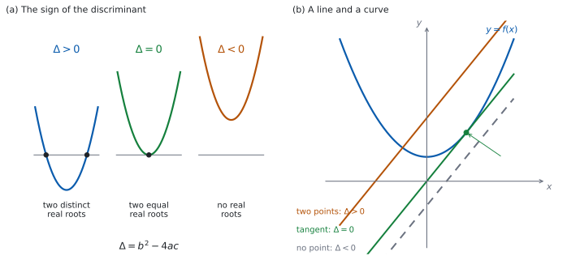

# SL 2.7b — The discriminant and the nature of the roots（判別式と解の種類） {#sec-aasl-2-7b}

::: {.callout-note}
## What you should be able to do
- **discriminant**（判別式）$\Delta = b^{2}-4ac$ を求められる。
- $\Delta$ の符号から、**実数解の個数**を言える。
- $\Delta$ と、**グラフが $x$ 軸と交わる回数**の対応が分かる。
- 「$2$ 実解をもつ」などの条件から、**文字の値や範囲**を求められる。
- **接する**ことが $\Delta = 0$ だと分かる。
- 直線と曲線が**交わる／接する／交わらない**条件を、$\Delta$ で書ける。
- **$a \neq 0$** を確かめる習慣がある。
:::

## The idea

### 1. 判別式は、解の公式の根号の中 {#idea}

$$
\Delta = b^{2} - 4ac
$$ {#eq-aasl27b-disc}

::: {.callout-important}
## この式は公式集にあります
公式集の **2.7** の欄に `Discriminant` として印刷されています。

> $\Delta = b^{2} - 4ac$

**$\Delta$ はギリシャ文字のデルタ**です。$\Delta = b^{2}-4ac$ は、解の公式（[SL 2.7a](aasl-2-7a.qmd#formula)）の**根号の中身**そのものです。
:::

$$
x = \frac{-b \pm \sqrt{\Delta}}{2a}
$$

**根号の中が正か、$0$ か、負か**で、出てくる解のようすが変わります。**解を全部求めなくても、個数だけが分かる**のが判別式の便利なところです。

### 2. $\Delta$ の符号と、解の個数 {#nature}

$3$ つの場合を、英語ではこう呼び分けます。答案では、この言い方をそのまま書いてください。

| $\Delta$ | 解のようす | 英語 |
|:--|:--|:--|
| $\Delta > 0$ | ちがう実数解が $2$ つ | two distinct real roots |
| $\Delta = 0$ | 等しい実数解が $2$ つ | two equal real roots |
| $\Delta < 0$ | 実数解なし | no real roots |

: 判別式と解の種類 {#tbl-aasl27b-nature}

::: {.callout-warning}
## 「$2$ 実解」と「ちがう $2$ 実解」はちがいます
`two distinct real roots` なら $\Delta > 0$ です。`distinct` の付かない `two real roots` は、ふつう $\Delta \ge 0$（等しい場合も含む）と読みます。**問題文の語をそのまま条件に写す**つもりで読んでください。

**`distinct` という語があるかどうか**で、$\ge$ と $>$ が変わります。問題文をよく読んでください。

`equal roots`、`repeated root`、`a double root` は、どれも $\Delta = 0$ を指す言い方です。
:::

::: {.callout-warning}
## $\Delta < 0$ は「解がない」ではありません
正確には「**実数の解がない**」です。答案では `no real roots` と書いてください。

SL の範囲では実数だけを扱うので、実際上は「解けない」と同じですが、**書き方は `real` を落とさない**でください。
:::

### 3. グラフとの対応 {#graph}

{#fig-aasl27b-idea width=100%}

@fig-aasl27b-idea の (a) が、そのようすです。対応は @tbl-aasl27b-graph のとおりです。

| $\Delta$ | $y = ax^{2}+bx+c$ のグラフ |
|:--|:--|
| $\Delta > 0$ | $x$ 軸と **$2$ 点**で交わる |
| $\Delta = 0$ | $x$ 軸に **$1$ 点で接する**（頂点が $x$ 軸上にある） |
| $\Delta < 0$ | $x$ 軸と**交わらない** |

: 判別式とグラフ {#tbl-aasl27b-graph}

**$\Delta < 0$ のとき、グラフは $x$ 軸の片側に丸ごとあります。** $a > 0$ なら全部が上、$a < 0$ なら全部が下です。

### 4. 文字を含む方程式で、条件から値を求める {#findk}

手順は、いつも同じです。

1. **$a$、$b$、$c$ を、文字を含んだまま書き出す。**
2. **$\Delta$ を作る。**
3. **条件を、$\Delta$ についての方程式か不等式にする。**
4. **解く。**
5. **$a \neq 0$ を確かめる。**

たとえば $3kx^{2}+2x+k = 0$ が等しい $2$ 実解をもつ $k$ を求めるとします。$a = 3k$、$b = 2$、$c = k$ です。

$$
\Delta = 2^{2} - 4(3k)(k) = 4 - 12k^{2}
$$

`two equal real roots` なので $\Delta = 0$ です。

$$
4 - 12k^{2} = 0 \ \Rightarrow \ k^{2} = \frac{1}{3} \ \Rightarrow \ k = \pm\frac{1}{\sqrt{3}} = \pm\frac{\sqrt{3}}{3}
$$

$a = 3k$ なので、$k \neq 0$ が要ります。出した $2$ 値はどちらも $0$ ではないので、両方とも答えです。

### 5. 「接する」は $\Delta = 0$ {#tangent}

**touch（接する）**という語が出てきたら、$\Delta = 0$ です。

- $x$ 軸に接する → $y = ax^{2}+bx+c$ の $\Delta = 0$。
- 直線と曲線が接する → **連立してできた $2$ 次方程式**の $\Delta = 0$（[第 6 節](#intersect)）。

**放物線と直線が出会う点がちょうど $1$ つなら $\Delta = 0$**、つまり接しています。ただしこれは $y = mx+c$ の形に書ける直線の話です。$x = 3$ のような**縦の直線**は、放物線と必ずちょうど $1$ 点で出会いますが、接してはいません。

### 6. 直線と曲線が出会う条件 {#intersect}

$y = mx+c$ と $y = f(x)$ が出会う点の $x$ 座標は、$f(x) = mx+c$ の解です（[SL 2.3](aasl-2-3.qmd#sums)）。

**$f$ が $2$ 次関数のとき**、すべてを片側に集めると **$2$ 次方程式**になります（$x^{2}$ の係数は $f$ のものがそのまま残るので、$0$ にはなりません）。その判別式を見ればよいわけです。

| $\Delta$ | 直線と曲線 |
|:--|:--|
| $\Delta > 0$ | **$2$ 点**で交わる |
| $\Delta = 0$ | **接する**（$1$ 点で出会う） |
| $\Delta < 0$ | **出会わない** |

: 直線と曲線 {#tbl-aasl27b-line}

@fig-aasl27b-idea の (b) が、その $3$ つの場合です。

### 7. 気をつける $2$ つのこと {#care}

::: {.callout-warning}
## 文字が $a$ の位置にあるときは、$a \neq 0$ を確かめてください
$kx^{2}+bx+c = 0$ のような形では、**$k = 0$ だと $2$ 次方程式ではありません。** 判別式の話も、解の公式も使えません。

$k = 0$ が出てきたら、**それは答えから外す**か、**別に調べて答える**ことになります（[第 4 節](#findk)）。
:::

::: {.callout-warning}
## $-4ac$ の符号に気をつけてください
**決まるのは $ac$ の符号です**（$2$ 次方程式なので $a \ne 0$）。$ac < 0$ なら $-4ac > 0$ で**足し算**、$ac > 0$ なら $-4ac < 0$ で**引き算**、$ac = 0$ なら $-4ac = 0$ です（[SL 2.7a](aasl-2-7a.qmd#formula)）。

**$a$ と $c$ が両方とも負のときは、引き算です。** $a$ が負というだけで足し算になるわけではありません。$-x^{2}+x-1 = 0$ なら $a = -1$、$c = -1$ で $ac = 1 > 0$ なので、$\Delta = 1 - 4 = -3$ となり、実数解はありません。

**$a$、$b$、$c$ を、符号ごと書き出してから**代入するのが安全です。

$b$ の $2$ 乗は、$b$ が負でも**正**になります。$b = -5$ なら $b^{2} = 25$ です。
:::

::: {.callout-tip collapse="true"}
## Paper 2 では、電卓で判別式を確かめられます
TI-Nspire の Calculator 画面で、$a$、$b$、$c$ に値を入れてから `b^2-4*a*c` と打てば値が出ます。**値を入れていない変数は、そのまま文字として返ってきます**（`b^2-4*a*c` という式が出るだけです）。まず `1` `sto→` `a` のように入れてください。

**$k$ を含む判別式を、電卓に解かせることはできません。** 値の入っていない文字が残るからです。**文字を含む問題は手で解きます。**

Graphs 画面にグラフをかいて、$x$ 軸との交わり方を見るのも早い確かめ方です。**ただし、$\Delta$ が $0$ にとても近いときは、画面では見分けられません。** そのときは式で確かめてください。

**Paper 1 では使えません。** このページの例題と演習は、すべて手で解ける形にしてあります。
:::

## Why it works

**なぜ、$\Delta$ の符号で解の個数が決まるのでしょうか。**

解の公式は

$$
x = \frac{-b \pm \sqrt{\Delta}}{2a}
$$

でした（[SL 2.7a](aasl-2-7a.qmd#formula)）。ここで $\Delta$ の符号ごとに見ます。

- **$\Delta > 0$。** $\sqrt{\Delta}$ は正の実数です。$-b + \sqrt{\Delta}$ と $-b - \sqrt{\Delta}$ はちがう数なので、**解は $2$ つ**です。
- **$\Delta = 0$。** $\sqrt{0} = 0$ なので、$\pm$ を付けても同じ $x = -\dfrac{b}{2a}$ です。**$2$ つの解が重なって、$1$ か所になります。**
- **$\Delta < 0$。** $2$ 乗して負になる実数はないので、$\sqrt{\Delta}$ は実数になりません。**実数の解はありません。**

**なぜ、$\Delta = 0$ で $x$ 軸に接するのでしょうか。**

[SL 2.6](aasl-2-6.qmd#why-it-works) で、平方完成すると

$$
ax^{2}+bx+c = a\left(x + \frac{b}{2a}\right)^{2} + c - \frac{b^{2}}{4a}
$$

になることを見ました。頂点の $y$ 座標は

$$
c - \frac{b^{2}}{4a} = \frac{4ac - b^{2}}{4a} = -\frac{\Delta}{4a}
$$

です。頂点は、**$a > 0$ ならグラフのいちばん低い点、$a < 0$ ならいちばん高い点**です（[SL 2.6](aasl-2-6.qmd#vertex)）。だから頂点が $x$ 軸上にあるとき、グラフが $x$ 軸に届くのはその $1$ 点だけで、**横切らずに接します**。**頂点が $x$ 軸上にあるのは、この値が $0$ のとき**、つまり $\Delta = 0$ のときです。

同じ式から、$\Delta < 0$ のときのことも分かります。$a > 0$ なら $-\dfrac{\Delta}{4a} > 0$ で、**頂点が $x$ 軸より上**にあります。下に凸なので、グラフ全体が $x$ 軸より上です。$a < 0$ なら、すべて逆になります。

**なぜ、直線と曲線でも同じ話になるのでしょうか。** **$f$ が $2$ 次関数なら**、$f(x) = mx+c$ を片側に集めると、$x$ についての $2$ 次方程式になります。**その解の個数が、そのまま出会う点の個数**です（[SL 2.3](aasl-2-3.qmd#sums)）。だから、その方程式の $\Delta$ を見ればよいことになります。

## Worked examples

::: {.callout-note appearance="simple"}
問題文は英語です。意味が理解できなかったら、問題文の下の「**日本語訳**」を開いてください。解説は日本語です。

**例題も演習も、すべて電卓なしで解けます。** Paper 1 のつもりで解いてください。
:::

::: {#exm-aasl27b-nature}
[For each of the following equations, find the discriminant and state the nature of the roots.]{.q-en}

**(a)** [$x^{2}+4x+1 = 0$]{.q-en}

**(b)** [$x^{2}-6x+9 = 0$]{.q-en}

**(c)** [$2x^{2}+x+3 = 0$]{.q-en}

**(d)** [Explain what $\Delta = 0$ tells you about the graph of the corresponding quadratic function.]{.q-en}

日本語訳

次のそれぞれの方程式について、判別式を求め、解の種類を述べなさい。

**(a)** $x^{2}+4x+1 = 0$

**(b)** $x^{2}-6x+9 = 0$

**(c)** $2x^{2}+x+3 = 0$

**(d)** $\Delta = 0$ が、対応する $2$ 次関数のグラフについて何を意味するかを説明しなさい。

---

**(a)** $a = 1$、$b = 4$、$c = 1$ です（@eq-aasl27b-disc）。

$$
\Delta = 4^{2} - 4(1)(1) = 16 - 4 = 12
$$

$\Delta > 0$ なので、**two distinct real roots** です。

**(b)** $a = 1$、$b = -6$、$c = 9$ です。**$b$ が負でも $b^{2}$ は正**です。

$$
\Delta = (-6)^{2} - 4(1)(9) = 36 - 36 = 0
$$

$\Delta = 0$ なので、**two equal real roots** です。

**(c)** $a = 2$、$b = 1$、$c = 3$ です。

$$
\Delta = 1^{2} - 4(2)(3) = 1 - 24 = -23
$$

$\Delta < 0$ なので、**no real roots** です。

**(d)** `Explain` なので、英語で書きます。

::: {.model-answer}
**試験ではこう書く**

*If $\Delta = 0$ the two roots are equal, so the graph meets the $x$-axis at exactly one point. That point is the vertex, because the two intersections have come together at the axis of symmetry $x = -\dfrac{b}{2a}$. The graph therefore touches the $x$-axis instead of crossing it, and the vertex lies on the $x$-axis.*
:::

（$\Delta = 0$ なら $2$ つの解は等しいので、グラフは $x$ 軸とちょうど $1$ 点で出会う。その点は頂点である。$2$ つの交点が対称の軸 $x = -\dfrac{b}{2a}$ のところで重なったからである。したがってグラフは $x$ 軸を横切らずに接し、頂点が $x$ 軸上にある、という意味です。）

**検算（(a) について）。** **$\Delta$ を使わずに、解が $2$ つあることを確かめます。** $f(x) = x^{2}+4x+1$ とすると $f(0) = 1 > 0$、$f(-1) = 1-4+1 = -2 < 0$、$f(-4) = 16-16+1 = 1 > 0$ です。$-1$ の左と右で符号が変わるので、**$x$ 軸を $2$ 回横切ります** ✓ ちがう実数解が $2$ つある、と合っています。

**検算（(b) について）。** **実際に解いて、$1$ 点になるかを見ます。** $x^{2}-6x+9 = (x-3)^{2} = 0$ なので $x = 3$ だけです ✓ $\Delta = 0$ と合っています。

**検算（(c) について）。** **判別式を通らない道でも見ます。** 平方完成すると

$$
2x^{2}+x+3 = 2\left(x+\frac{1}{4}\right)^{2} - \frac{1}{8} + 3 = 2\left(x+\frac{1}{4}\right)^{2} + \frac{23}{8}
$$

です。$2$ 乗は $0$ 以上なので、この値は $\dfrac{23}{8}$ より小さくなりません。**$0$ になることがない**ので、実数解はありません ✓

::: {.callout-note}
## 解答例（答案用紙に書くこと）
**(a)** $\Delta = 16 - 4 = 12 > 0$

*two distinct real roots*

**(b)** $\Delta = 36 - 36 = 0$

*two equal real roots*

**(c)** $\Delta = 1 - 24 = -23 < 0$

*no real roots*

**(d)** *The graph touches the $x$-axis at one point, and that point is the vertex.*
:::
:::

::: {#exm-aasl27b-findk}
[The equation $kx^{2} + 4x + k = 0$ has two equal real roots.]{.q-en}

**(a)** [Show that $\Delta = 16 - 4k^{2}$.]{.q-en}

**(b)** [Find the possible values of $k$.]{.q-en}

**(c)** [For the positive value of $k$ found in part (b), solve the equation.]{.q-en}

**(d)** [Explain why $k = 0$ cannot be a solution of this problem.]{.q-en}

日本語訳

方程式 $kx^{2}+4x+k = 0$ は、等しい $2$ 実解をもちます。

**(a)** $\Delta = 16 - 4k^{2}$ であることを示しなさい。

**(b)** $k$ のとりうる値を求めなさい。

**(c)** (b) で求めた正のほうの $k$ について、この方程式を解きなさい。

**(d)** $k = 0$ がこの問題の答えになり得ない理由を説明しなさい。

---

**(a)** `Show that` なので、**代入の式を書いて見せます。** $a = k$、$b = 4$、$c = k$ です。

$$
\Delta = 4^{2} - 4(k)(k) = 16 - 4k^{2}
$$

**(b)** `two equal real roots` なので $\Delta = 0$ です（@tbl-aasl27b-nature）。

$$
16 - 4k^{2} = 0 \ \Rightarrow \ k^{2} = 4 \ \Rightarrow \ k = \pm 2
$$

どちらも $0$ ではないので、**$k = 2$ と $k = -2$** の両方が答えです。

**(c)** $k = 2$ を入れます。

$$
2x^{2}+4x+2 = 0 \ \Rightarrow \ x^{2}+2x+1 = 0 \ \Rightarrow \ (x+1)^{2} = 0
$$

$$
x = -1
$$

**(d)** `Explain why` なので、英語で理由を書きます。

::: {.model-answer}
**試験ではこう書く**

*If $k = 0$ the equation becomes $4x = 0$, which is linear, not quadratic. A linear equation has exactly one root, so it cannot have two equal real roots, and the discriminant does not apply to it. The condition $a \neq 0$ in the quadratic formula is exactly this requirement, so $k = 0$ must be excluded.*
:::

（$k = 0$ とすると方程式は $4x = 0$ となり、$2$ 次ではなく $1$ 次である。$1$ 次方程式の解はちょうど $1$ つなので、等しい $2$ 実解をもつことはあり得ず、判別式もあてはまらない。解の公式の条件 $a \neq 0$ が、まさにこの要請である。よって $k = 0$ は外さなければならない、という意味です。）

**検算（(b) について）。** **$k = -2$ のほうでも、等しい $2$ 実解になるかを見ます。**

$$
-2x^{2}+4x-2 = 0 \ \Rightarrow \ x^{2}-2x+1 = 0 \ \Rightarrow \ (x-1)^{2} = 0
$$

$x = 1$ だけになりました ✓ **正のほうだけを確かめて済ませないでください。**

**検算（(c) について）。** 出した $x$ を、もとの式（$k = 2$）に入れ直します。$2(1) + 4(-1) + 2 = 2 - 4 + 2 = 0$ ✓

**$\Delta$ を $16 - 4k$ としていたら**（$c$ が $k$ なのに $1$ として計算した誤り）、$k = 4$ が出ます。$4x^{2}+4x+4 = 0$ の判別式は $16 - 64 = -48 < 0$ で、実数解がありません。**条件と合わないので、そこで気づけます。**

::: {.callout-note}
## 解答例（答案用紙に書くこと）
**(a)** $a = k$, $b = 4$, $c = k$
$$\Delta = 4^{2} - 4(k)(k) = 16 - 4k^{2}$$

**(b)** $16 - 4k^{2} = 0$, $k^{2} = 4$
$$k = \pm 2$$

**(c)** $k = 2$: $2x^{2}+4x+2 = 0$, $(x+1)^{2} = 0$
$$x = -1$$

**(d)** *If $k = 0$ the equation is $4x = 0$, which is linear and has one root, so it cannot have two equal real roots.*
:::
:::

::: {#exm-aasl27b-norealroots}
[The equation $x^{2} + 6x + c = 0$ is given, where $c$ is a constant.]{.q-en}

**(a)** [Show that $\Delta = 36 - 4c$.]{.q-en}

**(b)** [Find the set of values of $c$ for which the equation has no real roots.]{.q-en}

**(c)** [Find the value of $c$ for which the equation has two equal real roots, and solve the equation in that case.]{.q-en}

**(d)** [Explain why the graph of $y = x^{2}+6x+c$ lies entirely above the $x$-axis when $c > 9$.]{.q-en}

日本語訳

方程式 $x^{2}+6x+c = 0$ が与えられています。$c$ は定数です。

**(a)** $\Delta = 36 - 4c$ であることを示しなさい。

**(b)** この方程式が実数解をもたない $c$ の値の範囲を求めなさい。

**(c)** 等しい $2$ 実解をもつ $c$ の値を求め、そのときの方程式を解きなさい。

**(d)** $c > 9$ のとき、$y = x^{2}+6x+c$ のグラフが完全に $x$ 軸より上にある理由を説明しなさい。

---

**(a)** $a = 1$、$b = 6$ で、定数項はそのまま $c$ です。

$$
\Delta = 6^{2} - 4(1)(c) = 36 - 4c
$$

**(b)** `no real roots` なので $\Delta < 0$ です。

$$
36 - 4c < 0 \ \Rightarrow \ 36 < 4c \ \Rightarrow \ c > 9
$$

**(c)** `two equal real roots` なので $\Delta = 0$、つまり $c = 9$ です。

$$
x^{2}+6x+9 = 0 \ \Rightarrow \ (x+3)^{2} = 0 \ \Rightarrow \ x = -3
$$

**(d)** `Explain why` なので、英語で理由を書きます。

::: {.model-answer}
**試験ではこう書く**

*Completing the square gives $y = (x+3)^{2} + c - 9$. A square is never negative, so the smallest value of $y$ is $c - 9$, which is positive when $c > 9$. Every value of $y$ is therefore positive, so the whole graph lies above the $x$-axis.*
:::

（平方完成すると $y = (x+3)^{2} + c - 9$ となる。$2$ 乗は負にならないので $y$ の最小値は $c-9$ で、$c > 9$ のときこれは正である。したがって $y$ はつねに正であり、グラフ全体が $x$ 軸より上にある、という意味です。）

**検算（(b) について）。** **境目の外側で、実際に確かめます。** $c = 10$ とすると $x^{2}+6x+10$ で、$\Delta = 36-40 = -4 < 0$ ✓ 頂点の $y$ 座標は $10 - 9 = 1 > 0$ です ✓ $c = 8$ とすると $\Delta = 36-32 = 4 > 0$ で、実数解が $2$ つあります ✓

**検算（(c) について）。** 出した $x$ を、もとの式に入れ直します。$9 - 18 + 9 = 0$ ✓ また $(x+3)^{2}$ を展開すると $x^{2}+6x+9$ で、$c = 9$ と合っています ✓

**不等号の向きに注意してください。** $36 - 4c < 0$ を「$c < 9$」としないように。**$-4c$ を右辺に移す**と $36 < 4c$ になり、向きは変わりません。

::: {.callout-note}
## 解答例（答案用紙に書くこと）
**(a)**
$$\Delta = 6^{2} - 4(1)(c) = 36 - 4c$$

**(b)** $36 - 4c < 0$
$$c > 9$$

**(c)** $\Delta = 0$ gives $c = 9$, and $(x+3)^{2} = 0$
$$x = -3$$

**(d)** *$y = (x+3)^{2} + c - 9$, and $c - 9 > 0$, so the smallest value of $y$ is positive.*
:::
:::

::: {#exm-aasl27b-line}
[The line $y = 2x + k$ and the curve $y = x^{2} + 3x + 4$ are given, where $k$ is a constant.]{.q-en}

**(a)** [Show that the $x$-coordinates of any points of intersection satisfy $x^{2} + x + 4 - k = 0$.]{.q-en}

**(b)** [Find the value of $k$ for which the line is a tangent to the curve.]{.q-en}

**(c)** [Find the set of values of $k$ for which the line and the curve do not meet.]{.q-en}

**(d)** [A student writes that the line is a tangent when $k < \dfrac{15}{4}$. Comment on this statement.]{.q-en}

日本語訳

直線 $y = 2x+k$ と曲線 $y = x^{2}+3x+4$ が与えられています。$k$ は定数です。

**(a)** 交点の $x$ 座標が $x^{2}+x+4-k = 0$ を満たすことを示しなさい。

**(b)** 直線が曲線に接するときの $k$ の値を求めなさい。

**(c)** 直線と曲線が出会わない $k$ の値の範囲を求めなさい。

**(d)** ある生徒が「$k < \dfrac{15}{4}$ のとき直線は接する」と書きました。この発言について述べなさい。

---

**(a)** `Show that` なので、**式を等号でつないで、集める過程を書きます**（[第 6 節](#intersect)）。

$$
x^{2}+3x+4 = 2x+k
$$

$$
x^{2}+3x+4-2x-k = 0 \ \Rightarrow \ x^{2}+x+4-k = 0
$$

**(b)** 接するのは $\Delta = 0$ のときです（[第 5 節](#tangent)）。$a = 1$、$b = 1$、$c = 4-k$ です。

$$
\Delta = 1 - 4(1)(4-k) = 1 - 16 + 4k = 4k - 15
$$

$$
4k - 15 = 0 \ \Rightarrow \ k = \frac{15}{4}
$$

**(c)** 出会わないのは $\Delta < 0$ のときです（@tbl-aasl27b-line）。

$$
4k - 15 < 0 \ \Rightarrow \ k < \frac{15}{4}
$$

**(d)** `Comment on` なので、英語で判断とその理由を書きます。

::: {.model-answer}
**試験ではこう書く**

*The statement is not correct. For $k < \dfrac{15}{4}$ the discriminant $4k - 15$ is negative, so $x^{2}+x+4-k = 0$ has no real solution and the line and the curve do not meet at all. A tangent touches the curve at exactly one point, which needs $\Delta = 0$, so it happens only for the single value $k = \dfrac{15}{4}$. The student has used an inequality where an equation is required.*
:::

（この発言は正しくない。$k < \dfrac{15}{4}$ なら判別式 $4k-15$ は負なので、$x^{2}+x+4-k = 0$ に実数解はなく、直線と曲線はまったく出会わない。接線は曲線とちょうど $1$ 点で接するので $\Delta = 0$ が必要であり、それが起こるのは $k = \dfrac{15}{4}$ というただ $1$ つの値のときだけである。この生徒は、方程式であるべきところに不等式を使っている、という意味です。）

**検算（(a) について）。** **$k$ に $1$ つ値を入れて、出た $x$ で直線と曲線の $y$ が一致するかを見ます。** $k = 6$ とすると $x^{2}+x-2 = (x+2)(x-1) = 0$ で、$x = -2$ と $x = 1$ です。

- $x = 1$：直線は $y = 2(1)+6 = 8$、曲線は $y = 1+3+4 = 8$ ✓
- $x = -2$：直線は $y = 2(-2)+6 = 2$、曲線は $y = 4-6+4 = 2$ ✓

**どちらの点でも $y$ が一致しました。**

**検算（(b) について）。** **接点を実際に求めて、$1$ 点だけになるかを見ます。** $k = \dfrac{15}{4}$ のとき

$$
x^{2}+x+4-\frac{15}{4} = x^{2}+x+\frac{1}{4} = \left(x+\frac{1}{2}\right)^{2} = 0
$$

$x = -\dfrac{1}{2}$ だけになりました ✓

**検算（(c) について）。** **範囲の中と外で、$1$ つずつ試します。** $k = 0$（範囲の中）なら $x^{2}+x+4 = 0$ で $\Delta = 1-16 = -15 < 0$ ✓ 出会いません。$k = 5$（範囲の外）なら $x^{2}+x-1 = 0$ で $\Delta = 1+4 = 5 > 0$ ✓ $2$ 点で交わります。

::: {.callout-note}
## 解答例（答案用紙に書くこと）
**(a)** $x^{2}+3x+4 = 2x+k$
$$x^{2}+x+4-k = 0$$

**(b)** $\Delta = 1 - 4(4-k) = 4k-15 = 0$
$$k = \frac{15}{4}$$

**(c)** $4k - 15 < 0$
$$k < \frac{15}{4}$$

**(d)** *Not correct: $k < \dfrac{15}{4}$ gives $\Delta < 0$, so the line misses the curve. A tangent needs $\Delta = 0$, that is $k = \dfrac{15}{4}$ only.*
:::
:::

## Common errors

::: {.callout-warning}
## 文字が $a$ の位置にあるのに、$a \neq 0$ を確かめない
$kx^{2} + \ldots$ の形では、**$k = 0$ だと $2$ 次方程式ではありません**（[第 7 節](#care)）。

判別式を使う前に、**$a$ が $0$ でないことを書いておく**と安全です。
:::

::: {.callout-warning}
## `two real roots` と `two distinct real roots` を取りちがえる
`distinct` があれば $\Delta > 0$、なければふつう $\Delta \ge 0$ です（[第 2 節](#nature)）。

**問題文の語を、そのまま条件に写す**つもりで読んでください。
:::

::: {.callout-warning}
## $-4ac$ の符号をまちがえる
$c$ が負なら $-4ac$ は**足し算**です（[第 7 節](#care)）。$a$、$b$、$c$ を**符号ごと書き出してから**代入してください。

$b$ が負でも、$b^{2}$ は正です。
:::

::: {.callout-warning}
## $\Delta < 0$ を「解がない」と書く
正確には「**実数の解がない**」です（[第 2 節](#nature)）。答案では `no real roots` と書いてください。
:::

::: {.callout-warning}
## 「接する」を $\Delta > 0$ と混同する
接するのは $\Delta = 0$、**ちょうど $1$ 点**のときです（[第 5 節](#tangent)）。$\Delta > 0$ は $2$ 点で交わる場合です。

**「$1$ 点で出会う」という言い方が出てきたら、$\Delta = 0$** を疑ってください。
:::

::: {.callout-warning}
## 条件が不等式なのに、等式として解く
`no real roots` や `two distinct real roots` は**不等式**の条件です。$\Delta = 0$ と置いてしまうと、境目の $1$ 点しか出ません。

**求めるものが「値」か「範囲」か**を、問題文で確かめてください。
:::

## Exercises

::: {.callout-note appearance="simple"}
各問題に、折りたたみが $3$ つ付いています。**日本語訳**、**解答例**（答案用紙に書くべきこと。英語です）、**解説**（なぜそうなるか。日本語です）。

まず自分で解いて、次に解答例と見くらべてください。**解説は、合わなかったときだけ開けば十分です。**
:::

::: {.exercise-block}

[1]{.ex-no} [Find the discriminant of $x^{2} + 5x + 2 = 0$ and state the nature of the roots.]{.q-en}

日本語訳

$x^{2}+5x+2 = 0$ の判別式を求め、解の種類を述べなさい。

::: {.callout-note collapse="true"}
## 解答例（答案用紙に書くこと）

$$\Delta = 5^{2} - 4(1)(2) = 25 - 8 = 17$$

*$\Delta > 0$, so there are two distinct real roots.*
:::

::: {.callout-tip collapse="true"}
## 解説

$a = 1$、$b = 5$、$c = 2$ を @eq-aasl27b-disc に入れるだけです。

**検算。** **判別式を使わずに、符号の変わり方で見ます。** $f(x) = x^{2}+5x+2$ とすると $f(0) = 2 > 0$、$f(-1) = 1-5+2 = -2 < 0$、$f(-5) = 25-25+2 = 2 > 0$ です。$-1$ の左と右で符号が変わるので、**$x$ 軸を $2$ 回横切ります** ✓

**$17$ は平方数ではありません。** ですから解は根号を含む形になり、因数分解では出せません。
:::

::: {.ex-sep}
:::

[2]{.ex-no} **(a)** [Find the discriminant of $x^{2} - 8x + 16 = 0$.]{.q-en}

**(b)** [Hence solve the equation.]{.q-en}

日本語訳

**(a)** $x^{2}-8x+16 = 0$ の判別式を求めなさい。

**(b)** それを使って、この方程式を解きなさい。

::: {.callout-note collapse="true"}
## 解答例（答案用紙に書くこと）

**(a)**
$$\Delta = (-8)^{2} - 4(1)(16) = 64 - 64 = 0$$

**(b)** Two equal real roots, so $x = -\dfrac{b}{2a} = \dfrac{8}{2}$
$$x = 4$$
:::

::: {.callout-tip collapse="true"}
## 解説

**(a)** $b = -8$ なので $b^{2} = 64$ です。**符号を落とさないでください。**

**(b)** $\Delta = 0$ なので、解は $x = -\dfrac{b}{2a}$ ただ $1$ つです（[Why it works](#why-it-works)）。

**検算。** **因数分解でも出します。** $x^{2}-8x+16 = (x-4)^{2} = 0$ なので $x = 4$ ✓ **ちがう道すじで、同じ答えになりました。**

**もとの式に入れ直しても確かめられます。** $16 - 32 + 16 = 0$ ✓
:::

::: {.ex-sep}
:::

[3]{.ex-no} [Show that $3x^{2} + 2x + 5 = 0$ has no real roots.]{.q-en}

日本語訳

$3x^{2}+2x+5 = 0$ が実数解をもたないことを示しなさい。

::: {.callout-note collapse="true"}
## 解答例（答案用紙に書くこと）

$$\Delta = 2^{2} - 4(3)(5) = 4 - 60 = -56$$

*$\Delta < 0$, so the equation has no real roots.*
:::

::: {.callout-tip collapse="true"}
## 解説

`Show that` なので、**$\Delta$ の計算を書いてから結論を書きます。** 値だけでは足りません。

**検算。** **判別式を通らない道でも示せます。** 平方完成すると

$$
3x^{2}+2x+5 = 3\left(x+\frac{1}{3}\right)^{2} - \frac{1}{3} + 5 = 3\left(x+\frac{1}{3}\right)^{2} + \frac{14}{3}
$$

です。$2$ 乗は $0$ 以上なので、この値は $\dfrac{14}{3}$ より小さくなりません ✓ $0$ になることはないので、実数解はありません。

**「$\Delta < 0$」だけで終わらないでください。** `no real roots` という結論まで書きます。
:::

::: {.ex-sep}
:::

[4]{.ex-no} [The equation $x^{2} + kx + 25 = 0$ has two equal real roots. Find the possible values of $k$.]{.q-en}

日本語訳

方程式 $x^{2}+kx+25 = 0$ は、等しい $2$ 実解をもちます。$k$ のとりうる値を求めなさい。

::: {.callout-note collapse="true"}
## 解答例（答案用紙に書くこと）

$$\Delta = k^{2} - 4(1)(25) = k^{2} - 100$$

$k^{2} - 100 = 0$

$$k = \pm 10$$
:::

::: {.callout-tip collapse="true"}
## 解説

`two equal real roots` なので $\Delta = 0$ です（@tbl-aasl27b-nature）。**$a = 1$ なので、$a \neq 0$ の確認は要りません。**

**検算。** **両方の $k$ で、実際に等しい $2$ 実解になるかを見ます。** $k = 10$ なら $x^{2}+10x+25 = (x+5)^{2} = 0$ で $x = -5$ ✓ $k = -10$ なら $x^{2}-10x+25 = (x-5)^{2} = 0$ で $x = 5$ ✓

**$k = 10$ だけ答えていたら**、$\pm$ を落としています。**$k^{2} = 100$ の解は $2$ つ**です。
:::

::: {.ex-sep}
:::

[5]{.ex-no} [The equation $2x^{2} + 3x + c = 0$ has no real roots. Find the set of values of $c$.]{.q-en}

日本語訳

方程式 $2x^{2}+3x+c = 0$ は実数解をもちません。$c$ の値の範囲を求めなさい。

::: {.callout-note collapse="true"}
## 解答例（答案用紙に書くこと）

$$\Delta = 3^{2} - 4(2)(c) = 9 - 8c$$

$9 - 8c < 0$

$$c > \frac{9}{8}$$
:::

::: {.callout-tip collapse="true"}
## 解説

`no real roots` なので $\Delta < 0$ です。**$-8c$ を右辺に移す**と $9 < 8c$ になり、不等号の向きは変わりません。

**検算。** **境目の両側で試します。** $c = 2$（範囲の中）なら $\Delta = 9-16 = -7 < 0$ ✓ $c = 1$（範囲の外）なら $\Delta = 9-8 = 1 > 0$ で、実数解が $2$ つあります ✓ 境目の $c = \dfrac{9}{8}$ では $\Delta = 0$ で、等しい $2$ 実解です ✓

**向きをまちがえて $c < \dfrac{9}{8}$ としていたら**、$c = 0$ を入れると $2x^{2}+3x = 0$ で、解が $2$ つ出てしまいます。
:::

::: {.ex-sep}
:::

[6]{.ex-no} [The equation $x^{2} - 4x + k = 0$ has two distinct real roots. Find the set of values of $k$.]{.q-en}

日本語訳

方程式 $x^{2}-4x+k = 0$ は、ちがう $2$ 実解をもちます。$k$ の値の範囲を求めなさい。

::: {.callout-note collapse="true"}
## 解答例（答案用紙に書くこと）

$$\Delta = (-4)^{2} - 4(1)(k) = 16 - 4k$$

$16 - 4k > 0$

$$k < 4$$
:::

::: {.callout-tip collapse="true"}
## 解説

`distinct` があるので $\Delta > 0$ です（[第 2 節](#nature)）。**`distinct` がなければ $\ge$ でした。**

**検算。** **境目の両側で試します。** $k = 3$ なら $x^{2}-4x+3 = (x-1)(x-3) = 0$ で、$x = 1$ と $x = 3$ の $2$ 解 ✓ $k = 4$ なら $(x-2)^{2} = 0$ で $1$ 点だけ（`distinct` ではない）✓ $k = 5$ なら $\Delta = -4 < 0$ で実数解なし ✓

**$k \le 4$ としていたら**、$k = 4$ を含めています。そのときは等しい $2$ 実解で、`distinct` ではありません。
:::

::: {.ex-sep}
:::

[7]{.ex-no} [Solve $(x-2)^{2} > 0$, and find the discriminant of $(x-2)^{2} = 0$. Use the shape of the graph of $y = (x-2)^{2}$ to justify your solution set.]{.q-en}

日本語訳

$(x-2)^{2} > 0$ を解き、$(x-2)^{2} = 0$ の判別式を求めなさい。$y = (x-2)^{2}$ のグラフの形を使って、解の範囲の根拠を述べなさい。

::: {.callout-note collapse="true"}
## 解答例（答案用紙に書くこと）

$$(x-2)^{2} = x^{2} - 4x + 4, \qquad \Delta = (-4)^{2} - 4(1)(4) = 0$$

$$x < 2 \quad \text{or} \quad x > 2$$

*The graph touches the $x$-axis at $x = 2$ and lies above it everywhere else, so the expression is positive at every value of $x$ except $x = 2$.*
:::

::: {.callout-tip collapse="true"}
## 解説

$\Delta = 0$ は**重解**（equal roots）です。グラフは $x$ 軸に**触れるだけ**で、横切りません（[第 2 節](#nature)、[第 3 節](#graph)）。

触れる $1$ 点をのぞけば、グラフは $x$ 軸より上にあります。だから $(x-2)^{2} > 0$ の解は「$x = 2$ 以外のすべて」、つまり $x < 2$ または $x > 2$ です。

**$x \ne 2$ と書いてもかまいません。** $2$ つの区間に分けて書くと、$1$ つの不等式にまとめられないことがはっきりします（[SL 2.7a](aasl-2-7a.qmd#write)）。

**検算。** $x = 0$ で $(0-2)^{2} = 4 > 0$ ✓ $x = 2$ で $0$ となり、$> 0$ は成り立ちません ✓ $x = 3$ で $1 > 0$ ✓

**検算（等号があるとき）。** $(x-2)^{2} \ge 0$ なら $x = 2$ も入るので、すべての実数が解です ✓ 等号の有無で、$1$ 点だけ変わります。
:::

::: {.ex-sep}
:::

[8]{.ex-no} [Show that the line $y = x + 1$ and the curve $y = x^{2} + 3$ do not meet.]{.q-en}

日本語訳

直線 $y = x+1$ と曲線 $y = x^{2}+3$ が出会わないことを示しなさい。

::: {.callout-note collapse="true"}
## 解答例（答案用紙に書くこと）

$x^{2} + 3 = x + 1$, so $x^{2} - x + 2 = 0$

$$\Delta = (-1)^{2} - 4(1)(2) = 1 - 8 = -7$$

*$\Delta < 0$, so there is no real solution and the line and the curve do not meet.*
:::

::: {.callout-tip collapse="true"}
## 解説

**まず連立して、$2$ 次方程式を作ります**（[第 6 節](#intersect)）。それから判別式を見ます。

**検算。** **差の関数を、判別式を使わずに調べます。** $x^{2}+3 - (x+1) = x^{2}-x+2$ です。平方完成すると

$$
x^{2}-x+2 = \left(x-\frac{1}{2}\right)^{2} - \frac{1}{4} + 2 = \left(x-\frac{1}{2}\right)^{2} + \frac{7}{4}
$$

で、この値は $\dfrac{7}{4}$ より小さくなりません ✓ 差がつねに正なので、**曲線はつねに直線より上**にあります。「出会わない」だけでなく、どちらが上かまで分かりました。

**「$\Delta < 0$」だけで終わらないでください。** 「だから出会わない」という結論まで書きます。
:::

::: {.ex-sep}
:::

[9]{.ex-no} **(a)** [Show that the inequality $x^{2} + 1 \le 0$ has no solutions.]{.q-en}

**(b)** [Solve $-x^{2} + 4 > 0$. Explain, using the shape of the graph of $y = -x^{2} + 4$, why the solution set is a single interval.]{.q-en}

日本語訳

**(a)** 不等式 $x^{2}+1 \le 0$ に解がないことを示しなさい。

**(b)** $-x^{2}+4 > 0$ を解きなさい。$y = -x^{2}+4$ のグラフの形を使って、解の範囲が $1$ つの区間になる理由を説明しなさい。

::: {.callout-note collapse="true"}
## 解答例（答案用紙に書くこと）

**(a)**

$$\Delta = 0^{2} - 4(1)(1) = -4 < 0$$

*$\Delta < 0$ and $a = 1 > 0$, so $x^{2}+1$ is positive for every real $x$ and the inequality has no solutions.*

**(b)**

$$-x^{2}+4 = 0 \ \Rightarrow \ x = -2 \ \text{ or } \ x = 2$$

$$-2 < x < 2$$

*The parabola opens downwards, so it lies above the $x$-axis between its two intercepts.*
:::

::: {.callout-tip collapse="true"}
## 解説

**(a)** $x^{2}+1 = 0$ では $a = 1$、$b = 0$、$c = 1$ で、$\Delta = -4$ です。**$\Delta < 0$ と $a > 0$ の両方がそろって、はじめて「つねに正」と言えます**（[第 3 節](#graph)）。$a$ が負なら、$\Delta < 0$ でも「つねに負」になります。

**(b)** $-x^{2}+4 = 0$ から $x = \pm 2$ です。$a = -1 < 0$ なので**上に凸**、つまり $2$ つの $x$ 切片の**あいだ**が $x$ 軸より上になります。

**下に凸のときと逆です。** $x^{2}-4 > 0$ なら、答えは $x < -2$ または $x > 2$ という、はなれた $2$ つの区間です（[SL 2.7a](aasl-2-7a.qmd#write)）。

**検算。** $x = 0$ で $-0+4 = 4 > 0$ ✓ $x = 3$ で $-9+4 = -5$ となり、成り立ちません ✓ $x = -3$ でも $-5$ です ✓

**検算（判別式）。** $-x^{2}+4 = 0$ の $\Delta = 0^{2}-4(-1)(4) = 16 > 0$ ✓ 異なる $2$ 実解があるので、$x$ 切片は $2$ つです。

::: {.model-answer}
**試験ではこう書く**

*The coefficient of $x^{2}$ in $-x^{2}+4$ is $-1$, which is negative, so the parabola opens downwards. Its $x$-intercepts are the roots of $-x^{2}+4 = 0$, namely $x = -2$ and $x = 2$. A downward parabola lies above the $x$-axis between its two roots and below the axis outside them, so $-x^{2}+4 > 0$ exactly when $-2 < x < 2$. That is a single interval, not two separate ones.*
:::
:::

::: {.ex-sep}
:::

[10]{.ex-no} [A student is asked to find the values of $k$ for which $x^{2} + kx + 4 = 0$ has two equal real roots, and writes]{.q-en}

$$
k^{2} - 16 = 0, \qquad k = 4
$$

[Identify the error in the student's answer, and write down the correct values.]{.q-en}

日本語訳

ある生徒が、$x^{2}+kx+4 = 0$ が等しい $2$ 実解をもつ $k$ の値を求めるように言われ、上のように書きました。

生徒の答えの誤りを指摘し、正しい値を書きなさい。

::: {.callout-note collapse="true"}
## 解答例（答案用紙に書くこと）

*The discriminant is correct, but $k^{2} = 16$ has two solutions, not one.*

$$k = \pm 4$$
:::

::: {.callout-tip collapse="true"}
## 解説

`Identify the error` なので、**どこが違うのかを名指し**してから、正しい答えを書きます。

$\Delta = k^{2}-16$ までは正しく、$k^{2} = 16$ も正しい。**落ちているのは $k = -4$** です（[SL 2.7a](aasl-2-7a.qmd#complete)）。

**検算。** **落ちた値でも、条件が成り立つかを確かめます。** $k = -4$ なら $x^{2}-4x+4 = (x-2)^{2} = 0$ で、$x = 2$ の等しい $2$ 実解 ✓ たしかに条件を満たします。

**$k = 4$ のほうも確かめます。** $x^{2}+4x+4 = (x+2)^{2} = 0$ で $x = -2$ ✓ **生徒の答えは「まちがい」ではなく「不足」です。**

::: {.model-answer}
**試験ではこう書く**

*The discriminant $\Delta = k^{2} - 4(1)(4) = k^{2}-16$ is correct, and setting it to zero gives $k^{2} = 16$. The error is in the last step: $k^{2} = 16$ has the two solutions $k = 4$ and $k = -4$, and the student gave only the positive one. Both values work: $k = 4$ gives $(x+2)^{2} = 0$ and $k = -4$ gives $(x-2)^{2} = 0$, each with two equal real roots. So $k = \pm 4$.*
:::
:::

:::
