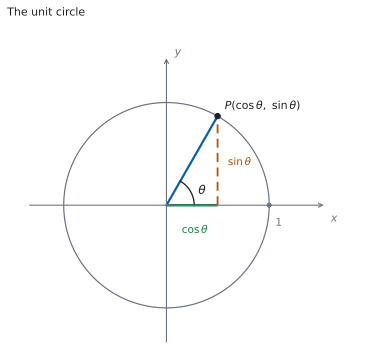
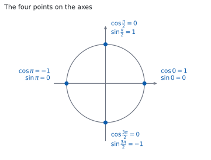
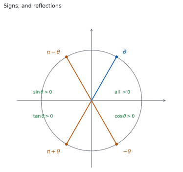
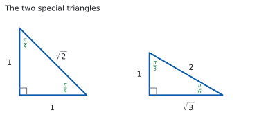
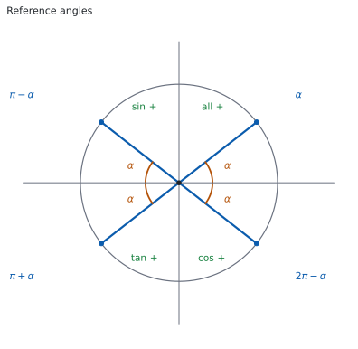
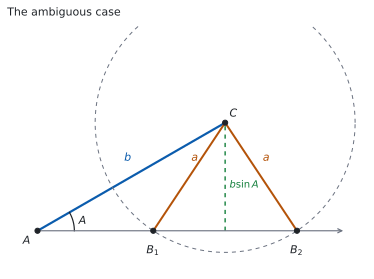

# SL 3.5 — The unit circle, exact values and the ambiguous case（単位円・正確な値・あいまいな場合） {#sec-aasl-3-5}

::: {.callout-note}
## What you should be able to do
- **unit circle**（単位円）の上の点の座標が $(\cos\theta,\ \sin\theta)$ であることを使える。
- $\theta$ が鋭角でなくても（鈍角でも、負でも、$2\pi$ より大きくても）、$\cos\theta$ と $\sin\theta$ が決まる理由が言える。
- $\tan\theta = \dfrac{\sin\theta}{\cos\theta}$ の定義と、**値をもたない角**が言える。
- $4$ つの **quadrant**（象限）での符号が言える。
- $0$、$\dfrac{\pi}{6}$、$\dfrac{\pi}{4}$、$\dfrac{\pi}{3}$、$\dfrac{\pi}{2}$ の $\sin$・$\cos$・$\tan$ を、**正確な値**で書ける。
- **reference angle**（参照角）と象限の符号から、**その倍数の角**の値を出せる。
- 折り返しから、$\cos(-\theta)$、$\sin(\pi-\theta)$、$\tan(\pi+\theta)$ などを $\theta$ の式で書ける。
- 負の角や $2\pi$ を超える角を、まず $0$ 以上 $2\pi$ 未満に直せる。
- 正弦定理で角を求めるとき、**$2$ つの候補**（$B$ と $\pi - B$）を出せる。
- できる三角形が $2$ つ・$1$ つ・$0$ のどれになるかを、**理由をつけて**言える。
:::

## The idea

### 1. unit circle（単位円） {#unit-circle}

{#fig-aasl35-idea-a width=100%}

**unit circle**（単位円）は、**原点を中心とする半径 $1$ の円**です。式で書けば $x^{2}+y^{2}=1$ です。

角は、**$x$ 軸の正の向きから測ります**。**anticlockwise**（反時計回り）が正、**clockwise**（時計回り）が負です。@fig-aasl35-idea-a を見てください。

**bearings**（方位角）（[SL 3.3](aasl-3-3.qmd#bearings)）とはちがい、**北からでも時計回りでもありません。** ここで混ざりやすいので、気をつけてください。

### 2. $\cos\theta$、$\sin\theta$、$\tan\theta$ の定義 {#definitions}

単位円の上で、角 $\theta$ のところにある点を $P$ とします。このとき

$$
P = (\cos\theta,\ \sin\theta)
$$ {#eq-aasl35-def}

と**定めます**。$x$ 座標が $\cos\theta$、$y$ 座標が $\sin\theta$ です。

これは、直角三角形での定義（[SL 3.2](aasl-3-2.qmd#ratios)）を**広げたもの**です。$\theta$ が鋭角なら、$2$ つは同じ値になります（[Why it works](#why-it-works)）。ちがうのは、**$\theta$ が鋭角でなくても使えるところ**です。

- $\theta$ が鈍角でも、点はあります。
- $\theta$ が負でも、時計回りに測れば点はあります。
- $\theta$ が $2\pi$ より大きくても、何周かすればどこかの点に着きます。

点は円の上にあるので、座標は $-1$ 以上 $1$ 以下です。つまり

$$
-1 \le \cos\theta \le 1, \qquad -1 \le \sin\theta \le 1
$$ {#eq-aasl35-range}

がすべての $\theta$ で成り立ちます。

**軸の上の $4$ 点は、座標を読むだけです。** @fig-aasl35-axes に、その $4$ 点の $\cos$ と $\sin$ を書き入れてあります。

{#fig-aasl35-axes width=100%}

**$\tan\theta$ は、unit circle のなかの直角三角形で、$\dfrac{\text{opposite}}{\text{adjacent}}$ を使います。**

opposite $= \sin\theta$、adjacent $= \cos\theta$ なので、次のようになります。

$$
\tan\theta = \frac{\sin\theta}{\cos\theta}
$$ {#eq-aasl35-tan}

::: {.callout-important}
公式集の **3.5** の欄に `Identity for tanθ` として印刷されています。

> $\tan\theta = \dfrac{\sin\theta}{\cos\theta}$

**分母が $0$ のときは定まりません。** そこは公式集には書かれていないので、自分で気をつけます。
:::

$\cos\theta = 0$ になるのは、点が $y$ 軸の上にあるとき、つまり $\theta = \dfrac{\pi}{2}$、$\theta = \dfrac{3\pi}{2}$、そしてそれらに $2\pi$ の整数倍を足した角です。**そこでは $\tan\theta$ は定まりません（英語では `undefined`）。**

### 3. quadrants and signs（象限と符号） {#quadrants}

{#fig-aasl35-idea-b width=100%}

座標平面は $4$ つの **quadrant**（象限）に分かれます。符号は、座標の符号を見るだけで決まります。

| 象限 | $\theta$ の範囲 | $\cos\theta$ | $\sin\theta$ | $\tan\theta$ |
|:--|:--|:--|:--|:--|
| 第 $1$ | $0 < \theta < \dfrac{\pi}{2}$ | $+$ | $+$ | $+$ |
| 第 $2$ | $\dfrac{\pi}{2} < \theta < \pi$ | $-$ | $+$ | $-$ |
| 第 $3$ | $\pi < \theta < \dfrac{3\pi}{2}$ | $-$ | $-$ | $+$ |
| 第 $4$ | $\dfrac{3\pi}{2} < \theta < 2\pi$ | $+$ | $-$ | $-$ |

: 象限と符号 {#tbl-aasl35-signs}

**$\tan\theta$ の符号は、$2$ つの符号の割り算です。** 第 $3$ 象限で $\tan\theta$ が正になるのは、負を負で割るからです。@fig-aasl35-idea-b にまとめてあります。

### 4. the two special triangles（2 つの特別な三角形） {#special}

{#fig-aasl35-idea-d width=100%}

$0$ と $\dfrac{\pi}{2}$ の値は、単位円の**軸の上の点**から直接読みます（[SL 3.5](aasl-3-5.qmd#definitions)）。それ以外の値は、**$2$ つの三角形**から読み取るだけです。@fig-aasl35-idea-d を見てください。

- **正方形を対角線で半分**にすると、$\dfrac{\pi}{4}$、$\dfrac{\pi}{4}$、$\dfrac{\pi}{2}$ の直角三角形になります。辺の比は $1 : 1 : \sqrt{2}$ です。
- **正三角形を高さで半分**にすると、$\dfrac{\pi}{6}$、$\dfrac{\pi}{3}$、$\dfrac{\pi}{2}$ の直角三角形になります。辺の比は $1 : \sqrt{3} : 2$ です。

どちらも、**ピタゴラスの定理で辺の長さを出せます**（[Why it works](#why-it-works)）。

**`exact values`（特別な三角比の値）は、この $2$ つの三角形から読み取ったものです。**

@tbl-aasl35-exact が、覚えておく値です。

| $\theta$ | $0$ | $\dfrac{\pi}{6}$ | $\dfrac{\pi}{4}$ | $\dfrac{\pi}{3}$ | $\dfrac{\pi}{2}$ |
|:--|:--|:--|:--|:--|:--|
| $\sin\theta$ | $0$ | $\dfrac{1}{2}$ | $\dfrac{\sqrt{2}}{2}$ | $\dfrac{\sqrt{3}}{2}$ | $1$ |
| $\cos\theta$ | $1$ | $\dfrac{\sqrt{3}}{2}$ | $\dfrac{\sqrt{2}}{2}$ | $\dfrac{1}{2}$ | $0$ |
| $\tan\theta$ | $0$ | $\dfrac{\sqrt{3}}{3}$ | $1$ | $\sqrt{3}$ | なし |

: $0$ から $\dfrac{\pi}{2}$ までの正確な値 {#tbl-aasl35-exact}

**この表は公式集にはありません。** Paper 1 は電卓なしなので、覚える必要があります。

**$\sin$ の行は $0, \dfrac{1}{2}, \dfrac{\sqrt{2}}{2}, \dfrac{\sqrt{3}}{2}, 1$ と増えていき、$\cos$ の行はそれを逆に並べたものです。** この見方だと、$2$ 行を取りちがえにくくなります。

$\dfrac{\sqrt{3}}{3}$ は $\dfrac{1}{\sqrt{3}}$ を有理化した形です。答案ではどちらでもかまいませんが、**分母に $\sqrt{\ }$ を残さない形**がふつうです。

### 5. reference angle（参照角）と、折り返しでできる関係 {#reference}

{#fig-aasl35-idea-c width=100%}

第 $4$ 節の表にあるのは $0$ から $\dfrac{\pi}{2}$ までです。**それ以外の角は、$4$ 手順で出します。**

1. **reference angle**（参照角）$\alpha$ を出す … **円の半径**と **$x$ 軸**のなす鋭角です。@fig-aasl35-idea-c を見てください。
2. **$\alpha$ の $\sin$・$\cos$・$\tan$ を、@tbl-aasl35-exact から読む。**
3. **もとの角がどの象限にあるかを見る。**
4. **その象限の符号を付ける**（[第 3 節](#quadrants)）。

参照角 $\alpha$ は、$0 \le \theta < 2\pi$ なら次のようになります。

| 象限 | 第 $1$ | 第 $2$ | 第 $3$ | 第 $4$ |
|:--|:--|:--|:--|:--|
| 参照角 $\alpha$ | $\theta$ | $\pi - \theta$ | $\theta - \pi$ | $2\pi - \theta$ |

: 参照角の出し方 {#tbl-aasl35-ref}

たとえば $\theta = \dfrac{5\pi}{6}$ は第 $2$ 象限で、参照角は $\alpha = \pi - \dfrac{5\pi}{6} = \dfrac{\pi}{6}$ です。**よって、$\sin\alpha$ と $\cos\alpha$ の値を使います。** 第 $2$ 象限では $\sin$ が正、$\cos$ が負なので

$$
\sin\frac{5\pi}{6} = \sin\alpha = \frac{1}{2}, \qquad \cos\frac{5\pi}{6} = -\cos\alpha = -\frac{\sqrt{3}}{2}
$$

です。**大きさは表から、符号は象限から**、と覚えてください。

$\theta$ が $0$、$\dfrac{\pi}{2}$、$\pi$、$\dfrac{3\pi}{2}$ のように**軸の上**にあるときは、象限がないので参照角は使いません。単位円の座標をそのまま読みます（[SL 3.5](aasl-3-5.qmd#definitions)）。

**参照角は、折り返しと同じことを言っています。**

$P$ を軸で折り返すと、別の角の点になります。座標の符号だけが変わるので、関係がそのまま読み取れます。

- **$x$ 軸で折り返す**（$\theta \to -\theta$）… $(\cos\theta,\ -\sin\theta)$
- **$y$ 軸で折り返す**（$\theta \to \pi-\theta$）… $(-\cos\theta,\ \sin\theta)$
- **原点で折り返す**（$\theta \to \pi+\theta$）… $(-\cos\theta,\ -\sin\theta)$

座標を読むと、次のようになります。

$$
\begin{aligned}
\cos(-\theta) &= \cos\theta, & \sin(-\theta) &= -\sin\theta \\
\cos(\pi-\theta) &= -\cos\theta, & \sin(\pi-\theta) &= \sin\theta \\
\cos(\pi+\theta) &= -\cos\theta, & \sin(\pi+\theta) &= -\sin\theta
\end{aligned}
$$ {#eq-aasl35-reflect}

$\tan$ は、この $2$ つの割り算です。$\tan\theta$ が定まる角では

$$
\tan(-\theta) = -\tan\theta, \qquad \tan(\pi-\theta) = -\tan\theta, \qquad
\tan(\pi+\theta) = \tan\theta
$$ {#eq-aasl35-tanreflect}

となります。

::: {.callout-warning}
## $\sin$ と $\cos$ で、変わり方がちがいます
$y$ 軸で折り返すと、$\sin$ は**そのまま**、$\cos$ は**符号が変わります**。$2$ つを同じ扱いにしないでください。

**どちらの座標が動くか**を図で見れば、迷いません。
:::

### 6. 負の角・$2\pi$ を超える角（periodicity） {#periodic}

角に $2\pi$ を足すと、円をちょうど $1$ 周して**同じ点にもどります**。だから

$$
\cos(\theta + 2\pi) = \cos\theta, \qquad \sin(\theta + 2\pi) = \sin\theta
$$ {#eq-aasl35-turn}

です。$2\pi$ の整数倍を足しても引いても同じです。

**大きい角や負の角は、まず $2\pi$ を足し引きして $0$ 以上 $2\pi$ 未満に直す**と見やすくなります。

**大きい角や負の角の正確な値も、これで出せます。** まず $2\pi$ を足すか引くかして $0$ 以上 $2\pi$ 未満に直し、そのあとは [第 5 節](#reference)と同じ $4$ 手順です。

たとえば $\theta = \dfrac{\pi}{4}$、$\dfrac{9\pi}{4}$、$\dfrac{17\pi}{4}$ は、どれも単位円の**同じ点**を指します。$\dfrac{9\pi}{4} - 2\pi = \dfrac{\pi}{4}$、$\dfrac{17\pi}{4} - 4\pi = \dfrac{\pi}{4}$ だからです。$\dfrac{\pi}{4}$ は第 $1$ 象限で $\sin$ も $\cos$ も正なので

$$
\sin\frac{\pi}{4} = \sin\frac{9\pi}{4} = \sin\frac{17\pi}{4}
= \frac{\sqrt{2}}{2}, \qquad
\cos\frac{\pi}{4} = \cos\frac{9\pi}{4} = \cos\frac{17\pi}{4}
= \frac{\sqrt{2}}{2}
$$

です。

::: {.callout-warning}
## 符号を付け忘れる
表の値はすべて $0$ 以上です。**負になるかどうかは、象限を見ないと決まりません**（@tbl-aasl35-ref）。

参照角を出しただけで止めず、**最後に符号を付ける**ところまでを $1$ 組にしてください。
:::

::: {.callout-tip collapse="true"}
## Paper 2 では、電卓が符号まで出します
TI-Nspire で `doc → Settings → Document Settings` の `Angle` を `Radian` にしておけば、$\cos\left(\dfrac{2\pi}{3}\right)$ のような値も、負号まで正しく出ます。

**$\tan\left(\dfrac{\pi}{2}\right)$ を入れると、`undef`（未定義）が返ります。** 角を小数（$1.5707963$ など）で入れた場合は、けた数の大きな数が返ることもあります。どちらも「値がない」ことの表れです。電卓の答えをそのまま書き写さないでください。

**Paper 1 では使えません。** このページの例題と演習は、すべて手で解ける形にしてあります。
:::

::: {.callout-tip collapse="true"}
## Paper 2 では、電卓は $1$ つしか返しません
TI-Nspire の $\sin^{-1}$ は、**$-\dfrac{\pi}{2}$ から $\dfrac{\pi}{2}$ までの値**しか返しません。三角形の角は正なので、返ってくるのは**鋭角のほう**だけです（$\sin B = 1$ のときだけ $\dfrac{\pi}{2}$）。

**もう $1$ つの候補 $\pi - B$ は、自分で書き足す必要があります。** 電卓は「あいまいな場合」を教えてくれません。

**Paper 1 では使えません。** このページの例題と演習は、すべて手で解ける形にしてあります。
:::

## Why it works

::: {.callout-tip collapse="true"}
## クリックすると開きます

**なぜ、直角三角形の定義と同じになるのでしょうか。** $\theta$ を鋭角とし、$P$ から $x$ 軸に垂線を下ろして、その足を $H$ とします。

三角形 $OPH$ は直角三角形で、斜辺 $OP$ は**半径なので $1$** です。$\theta$ から見ると、$OH$ が隣辺、$PH$ が対辺です。だから（[SL 3.2](aasl-3-2.qmd#ratios)）

$$
\cos\theta = \frac{OH}{1} = OH, \qquad \sin\theta = \frac{PH}{1} = PH
$$

となり、$OH$ と $PH$ はそのまま $P$ の座標の大きさです。**半径を $1$ にしたので、割り算が消えた**わけです。

**なぜ、鋭角でない角にも広げてよいのでしょうか。** 半径 $1$ の円では、角 $\theta$ に対する弧の長さは $l = r\theta = \theta$ です（[SL 3.4](aasl-3-4.qmd#arc)）。だから $(1,\ 0)$ から弧を長さ $|\theta|$ だけたどれば（$\theta > 0$ なら反時計回り、$\theta < 0$ なら時計回り）、着く点は**ちょうど $1$ つに決まります**。だから @eq-aasl35-def は、どんな $\theta$ に対しても値を $1$ つ返します。

$\theta$ と $\theta + 2\pi$ のように**ちがう角が同じ点になる**ことはありますが、決めているのは「角から点へ」の向きなので、値が $2$ つになることはありません。鋭角のところで前の定義と一致しているので、これは**広げ方として筋が通っています**。

**なぜ、折り返しで符号だけが変わるのでしょうか。** $x$ 軸での折り返しは、点 $(x,\ y)$ を $(x,\ -y)$ に写します。単位円は $x$ 軸について対称なので、写った点も単位円の上にあります。

角のほうを見ると、$x$ 軸で折り返すことは、回る向きを逆にすることです。つまり角 $\theta$ の点は角 $-\theta$ の点に写ります。この $2$ つを合わせると、@eq-aasl35-reflect の $1$ 行目になります。$y$ 軸、原点についても同じです。

**なぜ、原点を通る直線が $y = x\tan\theta$ なのでしょうか。** その直線が単位円と交わる点の $1$ つが $(\cos\theta,\ \sin\theta)$ です。原点とその点を通るので、傾きは

$$
\frac{\sin\theta - 0}{\cos\theta - 0} = \tan\theta
$$

です。原点を通る傾き $m$ の直線は $y = mx$ ですから、$y = x\tan\theta$ になります。$\cos\theta = 0$ のときは傾きがなく、この形では書けません。

**なぜ、あの $2$ つの三角形から値が出るのでしょうか。** まず正方形です。$1$ 辺 $1$ の正方形を対角線で切ると、直角をはさむ $2$ 辺が $1$、$1$ の直角三角形になります。対角線の長さは

$$
\sqrt{1^{2}+1^{2}} = \sqrt{2}
$$

です。残りの $2$ 角は等しく、和が $\dfrac{\pi}{2}$ なので、どちらも $\dfrac{\pi}{4}$ です。

斜辺が $1$ になるように縮めると、この三角形は単位円の中に入ります。$\theta$ が鋭角なら、直角三角形の比と単位円の座標は同じ値なので（[SL 3.5](aasl-3-5.qmd#definitions)）、**辺の比がそのまま $\sin$・$\cos$ の値**になります。だから

$$
\sin\frac{\pi}{4} = \frac{1}{\sqrt{2}} = \frac{\sqrt{2}}{2}
$$

となります。$\cos$ も同じ値、$\tan$ は $1$ です。

**正三角形のほうも同じです。** $1$ 辺 $2$ の正三角形を、$1$ つの頂点から高さで切ります。底辺は半分になって $1$、斜辺は $2$ のままです。高さは

$$
\sqrt{2^{2}-1^{2}} = \sqrt{3}
$$

です。もとの角 $\dfrac{\pi}{3}$ は半分になって $\dfrac{\pi}{6}$ になり、残りの角が $\dfrac{\pi}{3}$ です。ここから表の $\dfrac{\pi}{6}$ と $\dfrac{\pi}{3}$ の列が読めます。

**なぜ、候補が $2$ つ出るのでしょうか。** @eq-aasl35-sinb で分かるのは $\sin B$ の**値**だけです。$0 < B < \pi$ の範囲で $\sin B$ が同じ値になる角は、$B$ と $\pi - B$ の $2$ つあります（$B = \dfrac{\pi}{2}$ のときだけ、この $2$ つが重なって $1$ つです）。

角そのものではなく値しか分からない以上、**$2$ つとも候補**です。どちらが本当かは、$\sin$ 以外の条件で決めるしかありません。

**その条件が、角の和です。** 三角形の $3$ 角の和は $\pi$ なので、$\hat{A} + \hat{B} < \pi$ でなければなりません。これをみたさない候補は、三角形になりません。

**$a \ge b$ のときに候補が $1$ つになるのは**、大きい辺の向かいに大きい角が来るからです。$a \ge b$ なら $\hat{A} \ge \hat{B}$ です。もし $\hat{B}$ が鈍角なら $\hat{A}$ も鈍角になり、$2$ つの鈍角の和が $\pi$ を超えてしまいます。だから $\hat{B}$ は鋭角しかありえません。
:::

## Worked examples

::: {.callout-note appearance="simple"}
問題文は英語です。意味が理解できなかったら、問題文の下の「**日本語訳**」を開いてください。解説は日本語です。

**例題も演習も、すべて電卓なしで解けます。** Paper 1 のつもりで解いてください。
:::

::: {#exm-aasl35-axes}
[The point $\mathrm{P}$ lies on the unit circle at an angle $\theta$, measured anticlockwise from the positive $x$-axis.]{.q-en}

**(a)** [Write down the coordinates of $\mathrm{P}$ when $\theta = \pi$.]{.q-en}

**(b)** [Write down the value of $\cos\dfrac{3\pi}{2}$ and the value of $\sin\dfrac{3\pi}{2}$.]{.q-en}

**(c)** [Now let $\theta$ be any angle, and suppose $\mathrm{P}$ has coordinates $(a,\ b)$. Write down, in terms of $a$ and $b$, the coordinates of the point on the unit circle at angle $\theta + \pi$.]{.q-en}

**(d)** [Explain why $-1 \le \cos\theta \le 1$ for every angle $\theta$.]{.q-en}

日本語訳

点 $\mathrm{P}$ は単位円の上にあり、$x$ 軸の正の向きから反時計回りに測った角が $\theta$ です。

**(a)** $\theta = \pi$ のときの $\mathrm{P}$ の座標を書きなさい。

**(b)** $\cos\dfrac{3\pi}{2}$ の値と $\sin\dfrac{3\pi}{2}$ の値を書きなさい。

**(c)** 今度は $\theta$ をどんな角でもよいものとします。$\mathrm{P}$ の座標が $(a,\ b)$ のとき、角 $\theta + \pi$ にある単位円上の点の座標を、$a$ と $b$ で書きなさい。

**(d)** どんな角 $\theta$ でも $-1 \le \cos\theta \le 1$ になる理由を説明しなさい。

---

**(a)** $\theta = \pi$ は半周なので、点は $x$ 軸の負の側です（@fig-aasl35-axes）。

$$
\mathrm{P} = (-1,\ 0)
$$

**(b)** $\theta = \dfrac{3\pi}{2}$ は $\dfrac{3}{4}$ 周で、点は $y$ 軸の負の側 $(0,\ -1)$ です。座標を読みます。

$$
\cos\frac{3\pi}{2} = 0, \qquad \sin\frac{3\pi}{2} = -1
$$

**(c)** $\pi$ を足すのは、原点で折り返すことです（[第 5 節](#reference)）。

$$
(-a,\ -b)
$$

**(d)** `Explain why` なので、英語で理由を書きます。

::: {.model-answer}
**試験ではこう書く**

*By definition $\cos\theta$ is the $x$-coordinate of the point on the unit circle at angle $\theta$. Every point on the unit circle satisfies $x^{2}+y^{2}=1$, so $x^{2} \le 1$ and therefore $-1 \le x \le 1$. Hence $-1 \le \cos\theta \le 1$ for every $\theta$.*
:::

（定義により、$\cos\theta$ は角 $\theta$ にある単位円上の点の $x$ 座標である。単位円上のどの点も $x^{2}+y^{2}=1$ をみたすので $x^{2} \le 1$、したがって $-1 \le x \le 1$ である。よってどんな $\theta$ でも $-1 \le \cos\theta \le 1$ である、という意味です。）

**検算（(a) について）。** **折り返して見ます。** $\pi = 0 + \pi$ なので、$\theta = 0$ の点 $(1,\ 0)$ を原点で折り返した点です。符号が変わって $(-1,\ 0)$ になり、そろっています ✓ 単位円の上にあることも $(-1)^{2}+0^{2} = 1$ から分かります。

**検算（(b) について）。** **符号の表で見ます。** $\dfrac{3\pi}{2}$ は第 $3$ 象限と第 $4$ 象限の境目です。どちらでも $\sin\theta$ は負なので、境目で $-1$ になるのは筋が通っています ✓

**検算（(c) について）。** **$2$ 回折り返します。** $(-a,\ -b)$ をもう一度原点で折り返すと $(a,\ b)$ にもどります。角のほうも $\theta + 2\pi$ でもとにもどるので、合っています ✓

::: {.callout-note}
## 解答例（答案用紙に書くこと）
**(a)**
$$\mathrm{P} = (-1,\ 0)$$

**(b)**
$$\cos\frac{3\pi}{2} = 0, \qquad \sin\frac{3\pi}{2} = -1$$

**(c)**
$$(-a,\ -b)$$

**(d)** *$\cos\theta$ is the $x$-coordinate of a point on $x^{2}+y^{2}=1$, so $x^{2} \le 1$ and $-1 \le \cos\theta \le 1$.*
:::
:::

::: {#exm-aasl35-quadrant}
[The angle $\theta = \dfrac{7\pi}{6}$.]{.q-en}

**(a)** [Write down the quadrant containing $\theta$, and write down the reference angle.]{.q-en}

**(b)** [Find the exact values of $\sin\theta$ and $\cos\theta$.]{.q-en}

**(c)** [Hence find the exact value of $\tan\theta$.]{.q-en}

**(d)** [Explain why $\tan\theta$ is positive for this angle.]{.q-en}

日本語訳

角 $\theta = \dfrac{7\pi}{6}$ とします。

**(a)** $\theta$ をふくむ象限と、参照角を書きなさい。

**(b)** $\sin\theta$ と $\cos\theta$ の正確な値を求めなさい。

**(c)** これらから $\tan\theta$ の正確な値を求めなさい。

**(d)** この角で $\tan\theta$ が正になる理由を説明しなさい。

---

**(a)** $\pi < \dfrac{7\pi}{6} < \dfrac{3\pi}{2}$ なので第 $3$ 象限です。参照角は

$$
\frac{7\pi}{6} - \pi = \frac{\pi}{6}
$$

**(b)** 第 $3$ 象限では $\sin$ も $\cos$ も負です。

$$
\sin\frac{7\pi}{6} = -\frac{1}{2}, \qquad \cos\frac{7\pi}{6} = -\frac{\sqrt{3}}{2}
$$

**(c)** 比を取ります。

$$
\tan\frac{7\pi}{6} = \frac{-\frac{1}{2}}{-\frac{\sqrt{3}}{2}} = \frac{1}{\sqrt{3}} = \frac{\sqrt{3}}{3}
$$

**(d)** `Explain why` なので、英語で理由を書きます。

::: {.model-answer}
**試験ではこう書く**

*The angle $\dfrac{7\pi}{6}$ lies in the third quadrant, where the point on the unit circle has a negative $x$-coordinate and a negative $y$-coordinate. So $\sin\theta < 0$ and $\cos\theta < 0$. Since $\tan\theta = \dfrac{\sin\theta}{\cos\theta}$ is a quotient of two negative numbers, it is positive.*
:::

（角 $\dfrac{7\pi}{6}$ は第 $3$ 象限にあり、そこでは単位円上の点の $x$ 座標も $y$ 座標も負である。よって $\sin\theta < 0$、$\cos\theta < 0$ である。$\tan\theta = \dfrac{\sin\theta}{\cos\theta}$ は負を負で割った商なので、正になる、という意味です。）

**検算（(a) について）。** **度に直して見ます。** $\dfrac{7\pi}{6} = 210°$ で、$180°$ と $270°$ のあいだですから第 $3$ 象限です ✓ 参照角も $210° - 180° = 30°$ で合っています。

**検算（(b) について）。** **$2$ 乗の和を見ます。** 点は単位円 $x^{2}+y^{2}=1$ の上にあるはずです（[SL 3.5](aasl-3-5.qmd#unit-circle)）。$\left(-\dfrac{1}{2}\right)^{2}+\left(-\dfrac{\sqrt{3}}{2}\right)^{2} = \dfrac{1}{4}+\dfrac{3}{4} = 1$ ✓ **ただし、この確かめでは符号までは分かりません。**

**検算（(c) について）。** **$\pi$ を足す関係で見ます。** $\dfrac{7\pi}{6} = \dfrac{\pi}{6} + \pi$ なので、$\tan\dfrac{7\pi}{6} = \tan\dfrac{\pi}{6}$ のはずです（[SL 3.5](aasl-3-5.qmd#reference)）。表の $\tan\dfrac{\pi}{6} = \dfrac{\sqrt{3}}{3}$ と一致します ✓

::: {.callout-note}
## 解答例（答案用紙に書くこと）
**(a)** third quadrant, reference angle
$$\frac{7\pi}{6} - \pi = \frac{\pi}{6}$$

**(b)**
$$\sin\frac{7\pi}{6} = -\frac{1}{2}, \qquad \cos\frac{7\pi}{6} = -\frac{\sqrt{3}}{2}$$

**(c)**
$$\tan\frac{7\pi}{6} = \frac{\sqrt{3}}{3}$$

**(d)** *In the third quadrant both coordinates are negative, so $\tan\theta$ is a quotient of two negatives and is positive.*
:::
:::

::: {#exm-aasl35-period}
[In this question $\theta$ is any angle.]{.q-en}

**(a)** [Write down, in terms of $\cos\theta$ and $\sin\theta$, the coordinates of the point on the unit circle at angle $\theta + 2\pi$.]{.q-en}

**(b)** [Explain why $\tan(\theta + \pi) = \tan\theta$ for every $\theta$ at which $\tan\theta$ is defined.]{.q-en}

**(c)** [Show that $\tan(3\pi - \theta) = -\tan\theta$ whenever $\tan\theta$ is defined.]{.q-en}

**(d)** [Write down $\sin(\theta + 4\pi)$ in terms of $\sin\theta$.]{.q-en}

日本語訳

この問題では、$\theta$ はどんな角でもよいものとします。

**(a)** 角 $\theta + 2\pi$ にある単位円上の点の座標を、$\cos\theta$ と $\sin\theta$ で書きなさい。

**(b)** $\tan\theta$ が定まるどの $\theta$ でも $\tan(\theta + \pi) = \tan\theta$ になる理由を説明しなさい。

**(c)** $\tan\theta$ が定まるとき $\tan(3\pi - \theta) = -\tan\theta$ であることを示しなさい。

**(d)** $\sin(\theta + 4\pi)$ を $\sin\theta$ で書きなさい。

---

**(a)** $2\pi$ 足すのは $1$ 周することなので、同じ点です（[第 6 節](#periodic)）。

$$
(\cos\theta,\ \sin\theta)
$$

**(b)** `Explain why` なので、英語で理由を書きます。

::: {.model-answer}
**試験ではこう書く**

*Adding $\pi$ reflects the point in the origin, so the point at angle $\theta + \pi$ is $(-\cos\theta,\ -\sin\theta)$. Hence $\cos(\theta+\pi) = -\cos\theta$ and $\sin(\theta+\pi) = -\sin\theta$. Because $\tan\theta$ is defined, $\cos\theta \neq 0$, so $\cos(\theta+\pi) \neq 0$ and we may divide: $\tan(\theta+\pi) = \dfrac{-\sin\theta}{-\cos\theta} = \tan\theta$.*
:::

（$\pi$ を足すことは原点で折り返すことなので、角 $\theta + \pi$ の点は $(-\cos\theta,\ -\sin\theta)$ である。よって $\cos(\theta+\pi) = -\cos\theta$、$\sin(\theta+\pi) = -\sin\theta$ である。$\tan\theta$ が定まるので $\cos\theta \neq 0$、したがって $\cos(\theta+\pi) \neq 0$ で割ってよく、$\tan(\theta+\pi) = \tan\theta$ となる、という意味です。）

**(c)** `Show that` なので、**つなぐ過程を書きます。** $3\pi - \theta = (\pi - \theta) + 2\pi$ です。$2\pi$ は $1$ 周で点が同じなので、$\cos$ も $\sin$ も変わらず（@eq-aasl35-turn）、その比である $\tan$ も変わりません。

$$
\tan(3\pi - \theta) = \tan(\pi - \theta) = -\tan\theta
$$

最後の等号は @eq-aasl35-tanreflect です。

**(d)** $4\pi$ は $2$ 周です。

$$
\sin(\theta + 4\pi) = \sin\theta
$$

**検算（(b) について）。** **象限で見ます。** $\theta$ が第 $1$ 象限なら $\theta + \pi$ は第 $3$ 象限で、どちらも $\tan$ は正です。$\theta$ が第 $2$ 象限なら $\theta + \pi$ は第 $4$ 象限で、どちらも負です ✓ 符号が食いちがう組はありません。

**検算（(c) について）。** **座標で確かめます。** $3\pi - \theta$ の点は、$1$ 周ぶんを落とせば $\pi - \theta$ の点、つまり $(-\cos\theta,\ \sin\theta)$ です。比を取ると $\dfrac{\sin\theta}{-\cos\theta} = -\tan\theta$ ✓

**検算（(d) について）。** **$2$ 段に分けます。** $\sin(\theta + 4\pi) = \sin((\theta + 2\pi) + 2\pi) = \sin(\theta + 2\pi) = \sin\theta$ ✓ @eq-aasl35-turn を $2$ 回使いました。

::: {.callout-note}
## 解答例（答案用紙に書くこと）
**(a)**
$$(\cos\theta,\ \sin\theta)$$

**(b)** *Adding $\pi$ gives $(-\cos\theta,\ -\sin\theta)$, and $\cos\theta \neq 0$, so $\tan(\theta+\pi) = \dfrac{-\sin\theta}{-\cos\theta} = \tan\theta$.*

**(c)** $3\pi - \theta = (\pi - \theta) + 2\pi$
$$\tan(3\pi-\theta) = \tan(\pi-\theta) = -\tan\theta$$

**(d)**
$$\sin(\theta + 4\pi) = \sin\theta$$
:::
:::
::: {#exm-aasl35-count}
[In triangle $\mathrm{ABC}$, $\hat{\mathrm{A}} = \dfrac{\pi}{6}$ and $b = 8$, where $b$ is the side opposite $\hat{\mathrm{B}}$ and $a$ is the side opposite $\hat{\mathrm{A}}$.]{.q-en}

**(a)** [Given that $a = 4$, show that there is exactly one possible triangle, and find $\hat{\mathrm{B}}$.]{.q-en}

**(b)** [Given instead that $a = 3$, show that no triangle is possible.]{.q-en}

**(c)** [Given instead that $a = 10$, find the number of possible triangles, justifying your answer.]{.q-en}

**(d)** [Explain why there is never more than one possible triangle when $\hat{\mathrm{A}}$ is obtuse.]{.q-en}

日本語訳

三角形 $\mathrm{ABC}$ で $\hat{\mathrm{A}} = \dfrac{\pi}{6}$、$b = 8$ です。$b$ は $\hat{\mathrm{B}}$ の向かい、$a$ は $\hat{\mathrm{A}}$ の向かいの辺です。

**(a)** $a = 4$ のとき、三角形はちょうど $1$ つであることを示し、$\hat{\mathrm{B}}$ を求めなさい。

**(b)** 代わりに $a = 3$ のとき、三角形ができないことを示しなさい。

**(c)** 代わりに $a = 10$ のとき、考えられる三角形の数を、理由をつけて求めなさい。

**(d)** $\hat{\mathrm{A}}$ が鈍角のとき、三角形が $2$ つ以上にならない理由を説明しなさい。

---

**この問題は、$2$ 辺と、そのあいだにない角**（$a$、$b$、$\hat{\mathrm{A}}$）**が分かっている形**です。ここでは、三角形が $2$ つできることも、$1$ つのことも、$0$ のこともあります。これを **ambiguous case**（あいまいな場合）といいます。

{#fig-aasl35-idea-e width=100%}

@fig-aasl35-idea-e では、$\hat{A}$ の一方の辺に $\mathrm{AC} = b$ を取り、$C$ を中心とする半径 $a$ の円が、$A$ から出るもう一方の半直線と $2$ 回交わっています。交点が $B_{1}$ と $B_{2}$ の $2$ とおりあるので、三角形も $2$ つできます。**$2$ 辺とそのはさむ角なら、こうはなりません。** 三角形が $1$ つに決まるからです。

正弦定理（[SL 3.2](aasl-3-2.qmd#sine-rule)、公式集の **3.2** の欄）を、辺と、その向かいの角の組で使います。

$$
\frac{a}{\sin A} = \frac{b}{\sin B}
$$ {#eq-aasl35-sine}

@eq-aasl35-sine から

$$
\sin B = \frac{b\sin A}{a}
$$ {#eq-aasl35-sinb}

が出ますが、**$\sin B$ の値が同じ角は、$0$ と $\pi$ のあいだに $2$ つあります**（$\sin B = 1$ のときだけ、$\dfrac{\pi}{2}$ の $1$ つです）。$\sin(\pi - B) = \sin B$（[第 5 節](#reference)）だからです。

$C$ から半直線 $\mathrm{AB}$ までの距離は **$b\sin A$** です。この長さと $a$ をくらべると、円が $2$ 回交わるか、接するか、交わらないかが決まります。

| 条件 | $\sin B$ | 三角形の数 |
|:--|:--|:--|
| $a < b\sin A$ | $1$ より大きい | $0$ |
| $a = b\sin A$ | ちょうど $1$ | $1$（$\hat{B} = \dfrac{\pi}{2}$） |
| $b\sin A < a < b$ | $1$ より小さい | $2$ |
| $a \ge b$ | $1$ より小さい | $1$ |

: $\hat{A}$ が鋭角のとき {#tbl-aasl35-count}

**$a \ge b$ のとき候補が $1$ つに減る理由**は、$\hat{B} \le \hat{A}$ となって $\hat{B}$ が鈍角になれないので、鈍角のほうの候補が消えるからです。**$\hat{A}$ が直角か鈍角のときは、$a > b$ なら $1$ つ、そうでなければ $0$ です。**

**答案では、こう書きます。**

- **$\sin B$ の値を出したら、いったん止まります。** 候補は $B$ と $\pi - B$ の $2$ つです。
- **それぞれについて $\hat{A} + \hat{B} < \pi$ を確かめます。** これをみたさない候補は捨てます。
- **残ったものをすべて書きます。** $2$ つ残ったら $2$ つとも書きます。
- **図をかいておくと、捨てた理由が伝わります。**

**(a)** `Show that` なので、**過程を書きます。**

$$
\sin\hat{\mathrm{B}} = \frac{8 \times \frac{1}{2}}{4} = 1
$$

$\sin\hat{\mathrm{B}} = 1$ となる角は $0$ と $\pi$ のあいだに $\dfrac{\pi}{2}$ だけです。$\hat{\mathrm{A}} + \hat{\mathrm{B}} = \dfrac{\pi}{6}+\dfrac{\pi}{2} = \dfrac{2\pi}{3} < \pi$ なので、この候補は三角形になります。候補が $1$ つなので、三角形も $1$ つです。

$$
\hat{\mathrm{B}} = \frac{\pi}{2}
$$

**(b)** 同じように計算します。

$$
\sin\hat{\mathrm{B}} = \frac{8 \times \frac{1}{2}}{3} = \frac{4}{3}
$$

$\sin$ の値は $1$ 以下でなければなりません（[SL 3.5](aasl-3-5.qmd#definitions)）。$\dfrac{4}{3} > 1$ なので、そのような角はなく、三角形はできません。

**(c)** `justifying your answer` なので、英語で理由を書きます。

$$
\sin\hat{\mathrm{B}} = \frac{8 \times \frac{1}{2}}{10} = \frac{2}{5}
$$

::: {.model-answer}
**試験ではこう書く**

*Here $a = 10 > 8 = b$, so $\hat{\mathrm{A}} > \hat{\mathrm{B}}$ because the larger side faces the larger angle. Since $\hat{\mathrm{A}} = \dfrac{\pi}{6}$, this forces $\hat{\mathrm{B}} < \dfrac{\pi}{6}$, so the obtuse candidate $\pi - \hat{\mathrm{B}}$ is rejected. The acute candidate does give a triangle, since $\hat{\mathrm{A}} + \hat{\mathrm{B}} < \dfrac{\pi}{3} < \pi$. So there is exactly one possible triangle.*
:::

（ここでは $a = 10 > 8 = b$ なので、大きい辺の向かいに大きい角が来ることから $\hat{\mathrm{A}} > \hat{\mathrm{B}}$ である。$\hat{\mathrm{A}} = \dfrac{\pi}{6}$ だから $\hat{\mathrm{B}} < \dfrac{\pi}{6}$ となり、鈍角のほうの候補は捨てられる。よって三角形はちょうど $1$ つである、という意味です。）

**(d)** `Explain why` なので、英語で理由を書きます。

::: {.model-answer}
**試験ではこう書く**

*A triangle has at most one angle that is not acute, because two angles of at least $\dfrac{\pi}{2}$ would already sum to at least $\pi$. If $\hat{\mathrm{A}}$ is obtuse, then $\hat{\mathrm{B}}$ must be acute, so of the two candidates $\hat{\mathrm{B}}$ and $\pi - \hat{\mathrm{B}}$ only the acute one can be used. Hence there is at most one triangle.*
:::

（三角形で鋭角でない角は多くても $1$ つである。$\dfrac{\pi}{2}$ 以上の角が $2$ つあれば、和がすでに $\pi$ 以上になってしまうからである。$\hat{\mathrm{A}}$ が鈍角なら $\hat{\mathrm{B}}$ は鋭角でなければならず、$2$ つの候補 $\hat{\mathrm{B}}$ と $\pi - \hat{\mathrm{B}}$ のうち鋭角のほうしか使えない。よって三角形は多くても $1$ つである、という意味です。）

**検算（(a) について）。** **余弦定理でも見ます**（[SL 3.2](aasl-3-2.qmd#cosine-rule)）。$16 = 64 + c^{2} - 8\sqrt{3}\,c$ から $c^{2} - 8\sqrt{3}\,c + 48 = 0$ です。判別式は $192 - 192 = 0$ なので $c$ はただ $1$ つ（$c = 4\sqrt{3}$）で、三角形も $1$ つ ✓ **正弦定理を通らない道すじでも同じです。**

**検算（(b) について）。** **余弦定理でも見ます。** $9 = 64 + c^{2} - 8\sqrt{3}\,c$ から $c^{2} - 8\sqrt{3}\,c + 55 = 0$ です。判別式は $192 - 220 = -28 < 0$ なので、実数の $c$ がありません ✓ 三角形はできません。

**検算（(c) について）。** **角の和でも確かめます。** $\sin\hat{\mathrm{B}} = \dfrac{2}{5} < \dfrac{1}{2} = \sin\dfrac{\pi}{6}$ です。$0$ から $\dfrac{\pi}{2}$ では $\sin$ が増えるので、鋭角の候補は $\dfrac{\pi}{6}$ より小さくなります。すると鈍角の候補はその補角で、$\pi - \dfrac{\pi}{6} = \dfrac{5\pi}{6}$ より大きくなります。$\hat{\mathrm{A}} = \dfrac{\pi}{6}$ を足すと $\pi$ を超えるので、鈍角の候補は捨てられます ✓ @tbl-aasl35-count の $4$ 行目（$a \ge b$）とも合っています。

::: {.callout-note}
## 解答例（答案用紙に書くこと）
**(a)** $\sin\hat{\mathrm{B}} = \dfrac{8\sin\frac{\pi}{6}}{4} = 1$, and only one angle in $0 < B < \pi$ has sine $1$; also $\hat{\mathrm{A}} + \hat{\mathrm{B}} = \dfrac{2\pi}{3} < \pi$
$$\hat{\mathrm{B}} = \frac{\pi}{2}$$

**(b)** $\sin\hat{\mathrm{B}} = \dfrac{8\sin\frac{\pi}{6}}{3} = \dfrac{4}{3} > 1$
$$\text{no triangle}$$

**(c)** *$a > b$ so $\hat{\mathrm{B}} < \hat{\mathrm{A}} = \dfrac{\pi}{6}$: the obtuse candidate is rejected, and the acute one gives $\hat{\mathrm{A}} + \hat{\mathrm{B}} < \dfrac{\pi}{3} < \pi$.*
$$\text{one triangle}$$

**(d)** *A triangle has at most one non-acute angle, so $\hat{\mathrm{B}}$ must be acute and only one candidate survives.*
:::
:::
## Common errors

::: {.callout-warning}
## 角を $y$ 軸から、または時計回りに測る
単位円の角は、**$x$ 軸の正の向きから反時計回り**です（[第 1 節](#unit-circle)）。方位角とは測り方がちがいます。
:::

::: {.callout-warning}
## 第 $2$ 象限で $\cos\theta$ を正にする
第 $2$ 象限では $x$ 座標が負なので、$\cos\theta$ は負です（[第 4 節](#quadrants)）。座標の符号を見れば決まります。
:::

::: {.callout-warning}
## $\tan\dfrac{\pi}{2}$ に値があると思う
$\cos\dfrac{\pi}{2} = 0$ なので、$\tan\dfrac{\pi}{2}$ は定まりません（[第 3 節](#definitions)）。電卓が `undef` や大きな数を返しても、それは値ではありません。
:::

::: {.callout-warning}
## $\sin(\pi-\theta)$ と $\cos(\pi-\theta)$ を同じ扱いにする
$\sin$ は変わらず、$\cos$ は符号が変わります（@eq-aasl35-reflect）。
:::

::: {.callout-warning}
## 負の角や $2\pi$ より大きい角を「ない」と思う
単位円では、どちら向きにも、何周でも回れます（[第 6 節](#periodic)）。$2\pi$ を足し引きして直してください。
:::

::: {.callout-warning}
## $\sin^{-1}$ の値だけで止める
候補は $B$ と $\pi - B$ の $2$ つです（例題 $4$）。電卓も、$1$ つ（ふつうは鋭角のほう）しか返しません。
:::

::: {.callout-warning}
## $\pi - B$ を、確かめずに採用する
$\hat{A} + \hat{B} < \pi$ をみたさない候補は捨てます（例題 $4$）。$2$ つ書けばよい、というものではありません。
:::

::: {.callout-warning}
## $\sin$ の行と $\cos$ の行を取りちがえる
$\cos$ の行は $\sin$ の行を逆に並べたものです（[第 2 節](#special)）。$\cos 0 = 1$ から始まる、と覚えると入れかわりません。
:::

::: {.callout-warning}
## $\sin\hat{B} > 1$ になったのに続ける
$\sin$ の値は $-1$ 以上 $1$ 以下です。$1$ を超えたら、そこで「三角形はできない」と書きます。
:::

::: {.callout-warning}
## 参照角をそのまま答えにする
参照角は $0$ と $\dfrac{\pi}{2}$ のあいだの角です。聞かれているのがもとの角なら、**象限にもどしてから**答えます。
:::

## Exercises

::: {.callout-note appearance="simple"}
各問題に、折りたたみが $3$ つ付いています。**日本語訳**、**解答例**（答案用紙に書くべきこと。英語です）、**解説**（なぜそうなるか。日本語です）。

まず自分で解いて、次に解答例と見くらべてください。**解説は、合わなかったときだけ開けば十分です。**
:::

::: {.exercise-block}

[1]{.ex-no} [Explain why $\cos\theta$ and $\sin\theta$ have a value for every angle $\theta$, including angles greater than $2\pi$ and negative angles.]{.q-en}

日本語訳

$2\pi$ より大きい角や負の角もふくめて、どんな角 $\theta$ でも $\cos\theta$ と $\sin\theta$ に値がある理由を説明しなさい。

::: {.callout-note collapse="true"}
## 解答例（答案用紙に書くこと）

*Measuring $\theta$ from the positive $x$-axis reaches exactly one point of the unit circle, so $\cos\theta$ and $\sin\theta$ are defined as its coordinates.*
:::

::: {.callout-tip collapse="true"}
## 解説

`Explain why` なので、**「角を測ると点が $1$ つ決まる」ことを根拠として書きます**（[第 2 節](#definitions)）。向きの決め方（正なら反時計回り、負なら時計回り）にもふれます。

**検算。** **大きい角でためします。** $\theta = \dfrac{9\pi}{2}$ から $2\pi$ を $2$ 回引くと $\dfrac{\pi}{2}$ で、点は $(0,\ 1)$ です。$2$ 周ぶん回っても、行き先は $1$ つに決まりました ✓

::: {.model-answer}
**試験ではこう書く**

*Measure $\theta$ from the positive $x$-axis, anticlockwise if $\theta > 0$ and clockwise if $\theta < 0$. However large $|\theta|$ is, this reaches exactly one point of the unit circle, because each extra turn of $2\pi$ returns to the same point. By definition $\cos\theta$ and $\sin\theta$ are the coordinates of that point, so both have a value for every $\theta$.*
:::
:::
::: {.ex-sep}
:::

[2]{.ex-no} [Explain why $\tan\theta$ is not defined when $\theta = \dfrac{\pi}{2}$, and write down all the angles $\theta$ with $0 \le \theta < 4\pi$ at which $\tan\theta$ is not defined.]{.q-en}

日本語訳

$\theta = \dfrac{\pi}{2}$ のとき $\tan\theta$ が定まらない理由を説明し、$0 \le \theta < 4\pi$ のうち $\tan\theta$ が定まらない角をすべて書きなさい。

::: {.callout-note collapse="true"}
## 解答例（答案用紙に書くこと）

*At $\theta = \dfrac{\pi}{2}$ the point on the unit circle is $(0,\ 1)$, so $\cos\dfrac{\pi}{2} = 0$. Since $\tan\theta = \dfrac{\sin\theta}{\cos\theta}$, this would require division by zero.*

$$\theta = \frac{\pi}{2},\ \frac{3\pi}{2},\ \frac{5\pi}{2},\ \frac{7\pi}{2}$$
:::

::: {.callout-tip collapse="true"}
## 解説

`Explain why` なので、**$\cos\dfrac{\pi}{2} = 0$ を根拠として書きます**（[第 3 節](#definitions)）。

**検算。** **傾きでも見ます。** 原点と $(0,\ 1)$ を結ぶ直線は $y$ 軸で、傾きがありません。$\tan\theta$ が傾きだったことと、そろっています ✓

**検算（角の並びについて）。** **$\pi$ ずつ増えるか見ます。** 点が $y$ 軸に来るのは半周ごとなので、$\dfrac{\pi}{2}$ から $\pi$ ずつ足していけばすべて出ます。$4\pi$ の手前で止めると $\dfrac{7\pi}{2}$ までで、$4$ 個です ✓

::: {.model-answer}
**試験ではこう書く**

*By definition, $\tan\theta = \dfrac{\sin\theta}{\cos\theta}$. The point on the unit circle at $\theta = \dfrac{\pi}{2}$ is $(0,\ 1)$, so $\cos\dfrac{\pi}{2} = 0$ and $\sin\dfrac{\pi}{2} = 1$. The quotient $\dfrac{1}{0}$ has no value, so $\tan\dfrac{\pi}{2}$ is not defined. Equivalently, the line through the origin at this angle is the $y$-axis, which has no gradient.*
:::
:::
::: {.ex-sep}
:::

[3]{.ex-no} [The angle $\theta$ lies in the second quadrant. Write down the sign of $\cos\theta$, the sign of $\sin\theta$ and the sign of $\tan\theta$.]{.q-en}

日本語訳

角 $\theta$ は第 $2$ 象限にあります。$\cos\theta$、$\sin\theta$、$\tan\theta$ のそれぞれの符号を書きなさい。

::: {.callout-note collapse="true"}
## 解答例（答案用紙に書くこと）

$$\cos\theta < 0, \qquad \sin\theta > 0, \qquad \tan\theta < 0$$
:::

::: {.callout-tip collapse="true"}
## 解説

第 $2$ 象限では $x$ 座標が負、$y$ 座標が正です（@tbl-aasl35-signs）。

**検算。** **割り算で見ます。** $\tan\theta = \dfrac{\sin\theta}{\cos\theta}$ で、正を負で割るので負です ✓ 符号を別々に覚える必要はありません。

**$\tan\theta$ だけ落とさないでください。** $3$ つとも聞かれています。
:::
::: {.ex-sep}
:::

[4]{.ex-no} [Write down the exact value of $\cos\dfrac{\pi}{3}$, and hence find the exact value of $\cos\dfrac{2\pi}{3}$.]{.q-en}

日本語訳

$\cos\dfrac{\pi}{3}$ の正確な値を書き、それをもとに $\cos\dfrac{2\pi}{3}$ の正確な値を求めなさい。

::: {.callout-note collapse="true"}
## 解答例（答案用紙に書くこと）

$$\cos\frac{\pi}{3} = \frac{1}{2}$$

reference angle $\dfrac{\pi}{3}$, second quadrant

$$\cos\frac{2\pi}{3} = -\frac{1}{2}$$
:::

::: {.callout-tip collapse="true"}
## 解説

参照角は $\pi - \dfrac{2\pi}{3} = \dfrac{\pi}{3}$、第 $2$ 象限なので $\cos$ は負です（@tbl-aasl35-ref）。

**検算。** **$\dfrac{\pi}{2}$ とくらべます。** $\dfrac{2\pi}{3}$ は $\dfrac{\pi}{2}$ より大きいので、$\cos$ は負でなければなりません ✓ 大きさは $\cos\dfrac{\pi}{3} = \dfrac{1}{2}$ と同じです。

**符号を落とさないでください。** $\dfrac{1}{2}$ は第 $1$ 象限の値です。
:::
::: {.ex-sep}
:::

[5]{.ex-no} [Find the exact value of $\tan\dfrac{5\pi}{4}$.]{.q-en}

日本語訳

$\tan\dfrac{5\pi}{4}$ の正確な値を求めなさい。

::: {.callout-note collapse="true"}
## 解答例（答案用紙に書くこと）

reference angle $\dfrac{\pi}{4}$, third quadrant

$$\tan\frac{5\pi}{4} = 1$$
:::

::: {.callout-tip collapse="true"}
## 解説

第 $3$ 象限では $\tan$ が正です（[SL 3.5](aasl-3-5.qmd#quadrants)）。大きさは $\tan\dfrac{\pi}{4} = 1$ です。

**検算。** **$\pi$ を足す関係で見ます。** $\dfrac{5\pi}{4} = \dfrac{\pi}{4} + \pi$ なので $\tan\dfrac{5\pi}{4} = \tan\dfrac{\pi}{4} = 1$ ✓

**$-1$ としないでください。** $\tan$ が負になるのは第 $2$ と第 $4$ 象限です。
:::
::: {.ex-sep}
:::

[6]{.ex-no} [The point on the unit circle at angle $\theta$ has coordinates $(p,\ q)$. Write down the coordinates of the point at angle $-\theta$, and hence write down $\sin(-\theta)$ in terms of $\sin\theta$.]{.q-en}

日本語訳

角 $\theta$ にある単位円上の点の座標が $(p,\ q)$ です。角 $-\theta$ にある点の座標を書き、それをもとに $\sin(-\theta)$ を $\sin\theta$ で書きなさい。

::: {.callout-note collapse="true"}
## 解答例（答案用紙に書くこと）

$$(p,\ -q)$$

$$\sin(-\theta) = -\sin\theta$$
:::

::: {.callout-tip collapse="true"}
## 解説

$-\theta$ は $x$ 軸で折り返した角なので、$y$ 座標だけ符号が変わります（[第 5 節](#reference)）。

**検算。** **$2$ 回折り返します。** $(p,\ -q)$ をもう一度 $x$ 軸で折り返すと $(p,\ q)$ にもどり、角も $-(-\theta) = \theta$ にもどります ✓

**$\cos$ まで符号を変えないでください。** $x$ 座標は動きません。
:::
::: {.ex-sep}
:::

[7]{.ex-no} [Find the exact value of $\sin\dfrac{13\pi}{6}$.]{.q-en}

日本語訳

$\sin\dfrac{13\pi}{6}$ の正確な値を求めなさい。

::: {.callout-note collapse="true"}
## 解答例（答案用紙に書くこと）

$\dfrac{13\pi}{6} - 2\pi = \dfrac{\pi}{6}$

$$\sin\frac{13\pi}{6} = \frac{1}{2}$$
:::

::: {.callout-tip collapse="true"}
## 解説

まず $2\pi$ を引いて $0$ 以上 $2\pi$ 未満に直します（[第 4 節](#periodic)）。$\dfrac{\pi}{6}$ は第 $1$ 象限なので、そのまま表の値です。

**検算。** **範囲をしぼって見ます。** $\dfrac{13\pi}{6} - 2\pi = \dfrac{\pi}{6}$ は $\dfrac{\pi}{4}$ より小さいので、$\sin$ は正で、$\sin\dfrac{\pi}{4} = \dfrac{\sqrt{2}}{2} \approx 0.71$ より小さいはずです。$\dfrac{1}{2}$ はその範囲に入っています ✓

**$\dfrac{13\pi}{6}$ を第 $4$ 象限としないでください。** $2\pi$ を超えています。
:::
::: {.ex-sep}
:::

[8]{.ex-no} [In triangle $\mathrm{ABC}$, $a = 5$, $b = 5\sqrt{3}$ and $\hat{\mathrm{A}} = \dfrac{\pi}{6}$, where $a$ is opposite $\hat{\mathrm{A}}$ and $b$ is opposite $\hat{\mathrm{B}}$. Show that there are two possible triangles, and find both values of $\hat{\mathrm{B}}$.]{.q-en}

日本語訳

三角形 $\mathrm{ABC}$ で $a = 5$、$b = 5\sqrt{3}$、$\hat{\mathrm{A}} = \dfrac{\pi}{6}$ です（$a$ は $\hat{\mathrm{A}}$ の向かい、$b$ は $\hat{\mathrm{B}}$ の向かい）。三角形が $2$ つできることを示し、$\hat{\mathrm{B}}$ の値を両方とも求めなさい。

::: {.callout-note collapse="true"}
## 解答例（答案用紙に書くこと）

$$\sin\hat{\mathrm{B}} = \frac{5\sqrt{3} \times \frac{1}{2}}{5} = \frac{\sqrt{3}}{2}$$

$$\hat{\mathrm{B}} = \frac{\pi}{3} \ \text{ or } \ \hat{\mathrm{B}} = \frac{2\pi}{3}$$

Both give $\hat{\mathrm{A}} + \hat{\mathrm{B}} < \pi$, so there are two triangles.
:::

::: {.callout-tip collapse="true"}
## 解説

@eq-aasl35-sinb に入れてから、$2$ つの候補を出します。$\dfrac{\pi}{6}+\dfrac{\pi}{3} = \dfrac{\pi}{2}$、$\dfrac{\pi}{6}+\dfrac{2\pi}{3} = \dfrac{5\pi}{6}$ で、どちらも $\pi$ より小さいので、どちらも三角形になります。

**検算。** **余弦定理でも見ます**（[SL 3.2](aasl-3-2.qmd#cosine-rule)）。$25 = 75 + c^{2} - 15c$ から $c^{2} - 15c + 50 = 0$、つまり $(c-5)(c-10) = 0$ です。$c = 5$ と $c = 10$ の $2$ つとも正なので、三角形は $2$ つ ✓ **正弦定理を通らない道すじでも $2$ つです。**

**片方だけで終わらせないでください。** 「$2$ つある」ことを示す問題です。
:::
::: {.ex-sep}
:::

[9]{.ex-no} [In triangle $\mathrm{ABC}$, $a = 7$, $b = 5$ and $\hat{\mathrm{A}} = \dfrac{2\pi}{3}$, where $a$ is opposite $\hat{\mathrm{A}}$ and $b$ is opposite $\hat{\mathrm{B}}$. Find the number of possible triangles, justifying your answer.]{.q-en}

日本語訳

三角形 $\mathrm{ABC}$ で $a = 7$、$b = 5$、$\hat{\mathrm{A}} = \dfrac{2\pi}{3}$ です（$a$ は $\hat{\mathrm{A}}$ の向かい、$b$ は $\hat{\mathrm{B}}$ の向かい）。考えられる三角形の数を、理由をつけて求めなさい。

::: {.callout-note collapse="true"}
## 解答例（答案用紙に書くこと）

$$\sin\hat{\mathrm{B}} = \frac{5 \times \frac{\sqrt{3}}{2}}{7} = \frac{5\sqrt{3}}{14}$$

*$\hat{\mathrm{A}}$ is obtuse, so $\hat{\mathrm{B}}$ must be acute and the obtuse candidate is rejected.*

$$\text{one triangle}$$
:::

::: {.callout-tip collapse="true"}
## 解説

`justifying your answer` なので、**捨てた候補の理由まで書きます**（例題 $4$）。$\dfrac{5\sqrt{3}}{14} < 1$ なので候補は $2$ つ出ますが、$\hat{\mathrm{A}}$ が鈍角なので鋭角のほうだけが残ります。

**検算。** **余弦定理でも見ます**（[SL 3.2](aasl-3-2.qmd#cosine-rule)）。$49 = 25 + c^{2} + 5c$ から $c^{2} + 5c - 24 = 0$、つまり $(c-3)(c+8) = 0$ です。正の解は $c = 3$ だけなので、三角形は $1$ つ ✓ **正弦定理を通らない道すじでも $1$ つです。**

::: {.model-answer}
**試験ではこう書く**

*From the sine rule $\sin\hat{\mathrm{B}} = \dfrac{5\sin\frac{2\pi}{3}}{7} = \dfrac{5\sqrt{3}}{14}$, which is less than $1$, so there are two candidate angles with this sine. However $\hat{\mathrm{A}} = \dfrac{2\pi}{3}$ is obtuse, and a triangle cannot have two non-acute angles, so $\hat{\mathrm{B}}$ must be acute and the obtuse candidate is rejected. The acute candidate does give a triangle: $\dfrac{5\sqrt{3}}{14} < \dfrac{7\sqrt{3}}{14} = \sin\dfrac{\pi}{3}$, so $\hat{\mathrm{B}} < \dfrac{\pi}{3} = \pi - \hat{\mathrm{A}}$ and $\hat{\mathrm{A}} + \hat{\mathrm{B}} < \pi$. There is exactly one possible triangle.*
:::
:::
::: {.ex-sep}
:::

[10]{.ex-no} [In triangle $\mathrm{ABC}$, $a = 6$, $b = 8$ and $\hat{\mathrm{A}} = \dfrac{\pi}{6}$. A student writes $\sin\hat{\mathrm{B}} = \dfrac{2}{3}$, so $\hat{\mathrm{B}} = \sin^{-1}\dfrac{2}{3}$, and stops. Identify what the student has missed, and write down the other possible value of $\hat{\mathrm{B}}$.]{.q-en}

日本語訳

三角形 $\mathrm{ABC}$ で $a = 6$、$b = 8$、$\hat{\mathrm{A}} = \dfrac{\pi}{6}$ です。ある生徒が $\sin\hat{\mathrm{B}} = \dfrac{2}{3}$、よって $\hat{\mathrm{B}} = \sin^{-1}\dfrac{2}{3}$ と書いて、そこで止めました。この生徒が見落としたことを指摘し、$\hat{\mathrm{B}}$ のもう $1$ つの値を書きなさい。

::: {.callout-note collapse="true"}
## 解答例（答案用紙に書くこと）

*The student has missed the obtuse candidate with the same sine.*

$$\hat{\mathrm{B}} = \pi - \sin^{-1}\frac{2}{3}$$
:::

::: {.callout-tip collapse="true"}
## 解説

`Identify` なので、**何が抜けているかを名指し**します。$\sin\hat{\mathrm{B}} = \dfrac{2}{3}$ の計算は正しく、抜けているのは**もう $1$ つの候補**です。

$a = 6 < b = 8$ なので、@tbl-aasl35-count の $3$ 行目にあたるか確かめます。$b\sin A = 8 \times \dfrac{1}{2} = 4$ で、$4 < 6 < 8$ ですから三角形は $2$ つです。

**検算。** **角の和で見ます。** $\dfrac{2}{3} > \dfrac{1}{2} = \sin\dfrac{\pi}{6}$ なので、鋭角の候補は $\dfrac{\pi}{6}$ より大きく $\dfrac{\pi}{2}$ より小さい角です。鈍角の候補はその補角なので、$\dfrac{\pi}{2}$ と $\dfrac{5\pi}{6}$ のあいだにあります。$\hat{\mathrm{A}} = \dfrac{\pi}{6}$ を足しても $\pi$ より小さいので、こちらも三角形になります ✓

::: {.model-answer}
**試験ではこう書く**

*The equation $\sin\hat{\mathrm{B}} = \dfrac{2}{3}$ has two solutions with $0 < \hat{\mathrm{B}} < \pi$, since $\sin(\pi - \hat{\mathrm{B}}) = \sin\hat{\mathrm{B}}$, and the inverse sine gives only the acute one. The other candidate is $\pi - \sin^{-1}\dfrac{2}{3}$. Here $a < b$ and $b\sin\hat{\mathrm{A}} = 4 < a$, so both candidates give a triangle and both should be stated.*
:::
:::

:::

