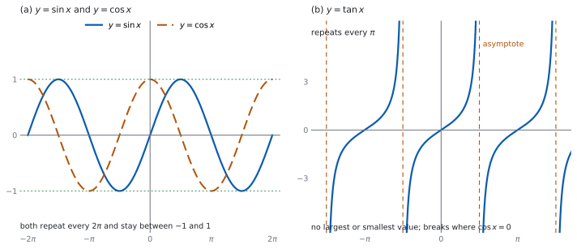

# SL 3.7a — The circular functions and their graphs（三角関数とそのグラフ） {#sec-aasl-3-7a}

::: {.callout-note}
## What you should be able to do
- $y = \sin x$、$y = \cos x$、$y = \tan x$ の**形**をかける。
- **amplitude**（振幅）と **period**（周期）が言える。
- $\sin$ と $\cos$ が **$\dfrac{\pi}{2}$ ずれている**ことを使える。
- $y = \tan x$ の **asymptote**（漸近線）の位置が言える。
- 各グラフの**定義域と値域**が言える。
:::

## The idea

### 1. $y = \sin x$ のグラフ {#sinx}

単位円の点 $(\cos x,\ \sin x)$ を思い出してください（[SL 3.5a](aasl-3-5a.qmd#definitions)）。$x$ を $0$ から増やしていくと、**$y$ 座標の動き**がそのまま $y = \sin x$ のグラフになります。

@fig-aasl37a-idea の (a) の実線がそれです。$0$ から始まって上がり、下がり、また上がる、なめらかな波です。

**$1$ 周すると同じ形にもどります。** $\sin(x + 2\pi) = \sin x$ だからです（[SL 3.5a](aasl-3-5a.qmd#periodic)）。だからグラフは、幅 $2\pi$ の同じ形が左右にくり返される形になります。

**値は $-1$ 以上 $1$ 以下**です。単位円の $y$ 座標だからです（[SL 3.5a](aasl-3-5a.qmd#definitions)）。

### 2. $y = \cos x$ のグラフ {#cosx}

こんどは**$x$ 座標の動き**です。@fig-aasl37a-idea の (a) の破線がそれです。

$x = 0$ のとき点は $(1,\ 0)$ なので、グラフは $1$ から始まります。あとは $\sin$ と同じで、**幅 $2\pi$ でくり返し**、**値は $-1$ 以上 $1$ 以下**です。

$\cos(-x) = \cos x$ なので、$y$ 軸について**左右対称**です。$\sin(-x) = -\sin x$ のほうは、原点について**点対称**になります。

### 3. $\sin$ と $\cos$ のずれ {#shift}

$2$ つのグラフは、**形が同じで、位置が $\dfrac{\pi}{2}$ だけずれている**だけです。式で書くと

$$
\cos x = \sin\left(x + \frac{\pi}{2}\right)
$$ {#eq-aasl37a-shift}

です。**$\sin$ のグラフを左に $\dfrac{\pi}{2}$ ずらすと $\cos$ のグラフになる**、ということです（理由は [Why it works](#why-it-works)）。

**どちら向きにずらすかで迷ったら、$x = 0$ を見てください。** $\cos 0 = 1$ で山の頂上、$\sin 0 = 0$ で真ん中です。$\sin$ の山は $x = \dfrac{\pi}{2}$ にあるので、それを $x = 0$ に持ってくるには**左へ**動かします。

### 4. amplitude と period {#amplitude}

- **amplitude**（振幅）… 波の形のグラフで、（$1$ 周期ぶんの最大値 $-$ $1$ 周期ぶんの最小値）$\div 2$。上下の振れ幅の半分です。
- **period**（周期）… すべての $x$ で $f(x + p) = f(x)$ となる、**いちばん小さい正の数** $p$。同じ形がくり返される幅のうち、いちばん狭いものです。

$y = \sin x$ と $y = \cos x$ では、最大値 $1$、最小値 $-1$ なので

$$
\text{amplitude} = \frac{1 - (-1)}{2} = 1, \qquad \text{period} = 2\pi
$$ {#eq-aasl37a-amp}

です。

**この項目は公式集にありません。** amplitude と period の求め方も、$3$ つのグラフの形も印刷されていないので、覚える必要があります。

::: {.callout-warning}
## amplitude は「最大値」とはかぎりません
いまは最大値も $1$、amplitude も $1$ なので同じに見えます。**上下にずらしたグラフでは、$2$ つはちがう値になります**（SL 3.7b で扱います）。

amplitude は**振れ幅の半分**、と覚えてください。
:::

### 5. $y = \tan x$ のグラフ {#tanx}

$\tan x = \dfrac{\sin x}{\cos x}$ なので（[SL 3.5a](aasl-3-5a.qmd#tan)）、**$\cos x = 0$ のところで値がありません**。そこがグラフの切れ目です。@fig-aasl37a-idea の (b) を見てください。

- 切れ目は …、$x = -\dfrac{\pi}{2}$、$x = \dfrac{\pi}{2}$、$x = \dfrac{3\pi}{2}$、… と、**$\pi$ ごと**に左右へ限りなく並びます。まとめて書けば $x = \dfrac{\pi}{2} + n\pi$（$n$ は整数）です。そこに縦の **asymptote**（漸近線）を、破線でかき入れます。
- **period は $\pi$** です。$\tan(x + \pi) = \tan x$ でした（[SL 3.5a](aasl-3-5a.qmd#relations)）。$2\pi$ ではありません。
- **最大値も最小値もありません。** 値はいくらでも大きく、いくらでも小さくなります。だから **amplitude もありません**。
- 切れ目と切れ目のあいだで、グラフは下から上へ切れ目なくつながって動くので、**どんな実数もちょうど $1$ 回ずつとります**。だから**値域はすべての実数**です。

$\tan x = 0$ になるのは $\sin x = 0$ のとき、つまり $x = 0$、$\pm\pi$、$\pm 2\pi$、… です。

### 6. かくときの手順 {#sketch}

**曲線を先にかかず、点を先に打ちます。**

1. **軸に $\dfrac{\pi}{2}$ きざみの目盛り**を打つ（度なら $90°$ きざみ）。
2. **切りのよい点**を打つ。$\cos$ なら $x = 0,\ \dfrac{\pi}{2},\ \pi,\ \dfrac{3\pi}{2},\ 2\pi$ の $5$ 点です。
3. $\tan$ なら、**先に漸近線**を破線で引く。
4. 点を**なめらかに**つなぐ。山と谷はとがらせません。

$y = \cos x$ を $0 \le x \le 2\pi$ でかくなら、打つ点は @tbl-aasl37a-cos です。

| $x$ | $0$ | $\dfrac{\pi}{2}$ | $\pi$ | $\dfrac{3\pi}{2}$ | $2\pi$ |
|:--|:--|:--|:--|:--|:--|
| $\cos x$ | $1$ | $0$ | $-1$ | $0$ | $1$ |

: $y = \cos x$ の $5$ 点 {#tbl-aasl37a-cos}

### 7. 定義域と値域 {#range}

| 関数 | 定義域 | 値域 | period |
|:--|:--|:--|:--|
| $y = \sin x$ | すべての実数 | $-1 \le y \le 1$ | $2\pi$ |
| $y = \cos x$ | すべての実数 | $-1 \le y \le 1$ | $2\pi$ |
| $y = \tan x$ | $x \ne \dfrac{\pi}{2} + n\pi$（$n$ は整数） | すべての実数 | $\pi$ |

: $3$ つのグラフのまとめ {#tbl-aasl37a-summary}

**問題文が範囲を指定したら、その中だけをかきます。** 「$0 \le x \le 2\pi$」と書いてあるのに $2\pi$ より先までかくと、聞かれていないことを答えたことになります。

::: {.callout-tip collapse="true"}
## Paper 2 では、電卓でグラフをかけます
TI-Nspire の Graphs 画面で `f1(x)=sin(x)` のように入れます。**`Angle` の設定は `Radian` にしておきます**（[SL 3.4](aasl-3-4.qmd#exam)）。

**窓の設定を自分で決めてください。** 初期設定のままだと横が $-10$ から $10$ で、$\pi$ の目盛りになりません。`menu → Window/Zoom → Zoom-Trig` を使うと、$\dfrac{\pi}{2}$ きざみの窓になります。

**Paper 1 では使えません。** 手でかけるように、点を打つ手順を身につけてください。
:::

{#fig-aasl37a-idea width=100%}

## Why it works

**なぜ、$\sin$ のグラフは波になるのでしょうか。** 単位円を反時計回りに一定の速さで回る点を考えます。その点の $y$ 座標を、時間 $x$ に対して記録したものが $y = \sin x$ のグラフです。

点が上へ行くとき $y$ 座標は増え、下へ行くとき減ります。**上の端と下の端では向きが変わる**ので、そこがグラフの山と谷になります。円を一周すると点はもとにもどるので、$2\pi$ ごとに同じ形がくり返されます。

**なぜ、$\cos x = \sin\left(x + \dfrac{\pi}{2}\right)$ なのでしょうか。** 角 $x$ の点を $(a,\ b)$ とします。定義から $a = \cos x$、$b = \sin x$ です（[SL 3.5a](aasl-3-5a.qmd#definitions)）。角を $\dfrac{\pi}{2}$ 増やすことは、点を**反時計回りに $\dfrac{1}{4}$ 回転**させることです。

$\dfrac{1}{4}$ 回転で、点 $(a,\ b)$ は $(-b,\ a)$ に写ります。$x$ 軸の正の向きにある点 $(1,\ 0)$ が $y$ 軸の正の向き $(0,\ 1)$ に写ることを見れば、向きが確かめられます。

写った点は**角 $x + \dfrac{\pi}{2}$ の点**なので、その $y$ 座標は $\sin\left(x + \dfrac{\pi}{2}\right)$ です。一方、写った点は $(-b,\ a)$ なので、$y$ 座標は $a$ です。つまり

$$
\sin\left(x + \frac{\pi}{2}\right) = a = \cos x
$$

となり、@eq-aasl37a-shift が出ます。

**なぜ、$\tan$ の period は $\pi$ なのでしょうか。** $\tan(x + \pi) = \tan x$ が成り立つからです（[SL 3.5a](aasl-3-5a.qmd#relations)）。$\pi$ 進むと点は原点について反対側へ行き、$x$ 座標も $y$ 座標も符号が変わりますが、**比を取ると符号が消えます**。

だから $\tan$ のグラフは、幅 $\pi$ の同じ形のくり返しです。$\sin$ や $\cos$ の半分の幅で、もうくり返しています。

**なぜ、漸近線ができるのでしょうか。** $x$ が $\dfrac{\pi}{2}$ に近づくと $\cos x$ は $0$ に近づき、$\sin x$ は $1$ に近づきます。分母が $0$ に近い小さい数になるので、**商の大きさはいくらでも大きくなります**。

左から近づくときは $\cos x > 0$ で商は正、右から近づくときは $\cos x < 0$ で商は負です。だからグラフは、漸近線の左で上へ、右で下から立ち上がります。

## Worked examples

::: {.callout-note appearance="simple"}
問題文は英語です。意味が理解できなかったら、問題文の下の「**日本語訳**」を開いてください。解説は日本語です。

**例題も演習も、すべて電卓なしで解けます。** Paper 1 のつもりで解いてください。
:::

::: {#exm-aasl37a-sin}
[The function $f(x) = \sin x$ has domain $0 \le x \le 2\pi$.]{.q-en}

**(a)** [Write down the amplitude of $f$.]{.q-en}

**(b)** [Write down the period of $f$.]{.q-en}

**(c)** [Write down the coordinates of the maximum point of $f$.]{.q-en}

**(d)** [Explain why $f(x) = 0$ at exactly three values of $x$ in this domain.]{.q-en}

日本語訳

関数 $f(x) = \sin x$ の定義域は $0 \le x \le 2\pi$ です。

**(a)** $f$ の amplitude を書きなさい。

**(b)** $f$ の period を書きなさい。

**(c)** $f$ の最大点の座標を書きなさい。

**(d)** この定義域で $f(x) = 0$ となる $x$ がちょうど $3$ 個である理由を説明しなさい。

---

**(a)** 最大値 $1$、最小値 $-1$ なので（@eq-aasl37a-amp）

$$
\text{amplitude} = \frac{1 - (-1)}{2} = 1
$$

**(b)** period は $y = \sin x$ という関数そのものの性質です。$0 \le x \le 2\pi$ は、そのくり返し $1$ 個ぶんを切り取った範囲にすぎないので、幅は $2\pi$ のままです。

$$
\text{period} = 2\pi
$$

**(c)** 山の頂上は $x = \dfrac{\pi}{2}$ です。

$$
\left(\frac{\pi}{2},\ 1\right)
$$

**(d)** `Explain why` なので、英語で理由を書きます。

::: {.model-answer}
**試験ではこう書く**

*On the unit circle, $\sin x$ is the $y$-coordinate, and this is zero exactly when the point lies on the $x$-axis, that is at $x = 0$ and $x = \pi$ within one turn. Adding $2\pi$ gives $x = 2\pi$, which is still in the domain. No other angle in $0 \le x \le 2\pi$ puts the point on the $x$-axis, so there are exactly three values.*
:::

（単位円では $\sin x$ は $y$ 座標で、これが $0$ になるのは点が $x$ 軸の上にあるとき、つまり $1$ 周のうち $x = 0$ と $x = \pi$ のときである。$2\pi$ を足すと $x = 2\pi$ で、これも定義域に入る。$0 \le x \le 2\pi$ で点が $x$ 軸に来る角はほかにないので、ちょうど $3$ 個である、という意味です。）

**検算（(a) について）。** **中心線からの高さで見ます。** このグラフの中心線は $y = 0$ です。山の頂上 $y = 1$ までが $1$、谷の底 $y = -1$ までも $1$ で、上下が同じ高さです ✓ **引き算を通らない見方でも $1$ になりました。**

**検算（(c) について）。** **表の値で見ます。** $\sin\dfrac{\pi}{2} = 1$ です（[SL 3.5b](aasl-3-5b.qmd#table)）。最大値 $1$ をとる点なので、たしかに山の頂上です ✓

**検算（(d) について）。** **グラフの形で見ます。** $0$ から $2\pi$ までで、グラフは $x$ 軸を「始まり・真ん中・終わり」の $3$ か所で通ります ✓ 山を $1$ つ、谷を $1$ つ通るので、その前後で $3$ 回です。

::: {.callout-note}
## 解答例（答案用紙に書くこと）
**(a)**
$$\text{amplitude} = 1$$

**(b)**
$$\text{period} = 2\pi$$

**(c)**
$$\left(\frac{\pi}{2},\ 1\right)$$

**(d)** *$\sin x$ is the $y$-coordinate on the unit circle, which is $0$ only on the $x$-axis: at $x = 0$, $\pi$ and $2\pi$ in this domain.*
:::
:::

::: {#exm-aasl37a-cos}
[The function $g(x) = \cos x$ has domain $-\pi \le x \le \pi$.]{.q-en}

**(a)** [Write down the maximum value and the minimum value of $g$.]{.q-en}

**(b)** [Write down the coordinates of the points where the graph of $g$ crosses the $x$-axis.]{.q-en}

**(c)** [Write down the coordinates of the point where the graph of $g$ crosses the $y$-axis.]{.q-en}

**(d)** [Explain why the graph of $g$ is symmetric about the $y$-axis.]{.q-en}

日本語訳

関数 $g(x) = \cos x$ の定義域は $-\pi \le x \le \pi$ です。

**(a)** $g$ の最大値と最小値を書きなさい。

**(b)** $g$ のグラフが $x$ 軸と交わる点の座標を書きなさい。

**(c)** $g$ のグラフが $y$ 軸と交わる点の座標を書きなさい。

**(d)** $g$ のグラフが $y$ 軸について対称である理由を説明しなさい。

---

**(a)** 単位円の $x$ 座標なので、$-1$ 以上 $1$ 以下です（@tbl-aasl37a-summary）。この定義域には $x = 0$ と $x = \pm\pi$ が入っているので、どちらもとります。

$$
\text{maximum} = 1, \qquad \text{minimum} = -1
$$

**(b)** $\cos x = 0$ になるのは、点が $y$ 軸の上にあるときです。

$$
\left(-\frac{\pi}{2},\ 0\right), \qquad \left(\frac{\pi}{2},\ 0\right)
$$

**(c)** $x = 0$ を入れます。$\cos 0 = 1$ です。

$$
(0,\ 1)
$$

**(d)** `Explain why` なので、英語で理由を書きます。

::: {.model-answer}
**試験ではこう書く**

*For any $x$, the points on the unit circle at angles $x$ and $-x$ are reflections of each other in the $x$-axis, so they have the same $x$-coordinate. Hence $\cos(-x) = \cos x$, so $g(-x) = g(x)$ for every $x$ in the domain, and the domain itself is symmetric about $0$. A graph with $g(-x) = g(x)$ is symmetric about the $y$-axis.*
:::

（どんな $x$ でも、角 $x$ と角 $-x$ にある単位円上の点は $x$ 軸について互いに折り返したものなので、$x$ 座標が等しい。よって $\cos(-x) = \cos x$ となり、定義域のどの $x$ でも $g(-x) = g(x)$ である。定義域そのものも $0$ について対称である。$g(-x) = g(x)$ をみたすグラフは $y$ 軸について対称である、という意味です。）

**検算（(a) について）。** **端の値を見ます。** $\cos(-\pi) = \cos\pi = -1$ で、最小値をとっています ✓ $\cos 0 = 1$ で最大値です。

**検算（(b) について）。** **対称性で見ます。** $2$ つの交点は $x = \pm\dfrac{\pi}{2}$ で、$y$ 軸から同じだけ離れています ✓ (d) の対称性と合っています。

**検算（(c) について）。** **表の値で見ます。** $\cos 0 = 1$ です（[SL 3.5b](aasl-3-5b.qmd#table)）。@tbl-aasl37a-cos の $1$ 列目とも合っています ✓

::: {.callout-note}
## 解答例（答案用紙に書くこと）
**(a)**
$$\text{maximum} = 1, \qquad \text{minimum} = -1$$

**(b)**
$$\left(-\frac{\pi}{2},\ 0\right), \quad \left(\frac{\pi}{2},\ 0\right)$$

**(c)**
$$(0,\ 1)$$

**(d)** *$\cos(-x) = \cos x$ for every $x$, and the domain is symmetric about $0$, so the graph is symmetric about the $y$-axis.*
:::
:::

::: {#exm-aasl37a-tan}
[The function $h(x) = \tan x$ is considered on the domain $0 \le x \le 2\pi$, excluding the values at which it is undefined.]{.q-en}

**(a)** [Write down the period of $h$.]{.q-en}

**(b)** [Write down the equations of the vertical asymptotes of the graph of $h$ in this domain.]{.q-en}

**(c)** [Write down the values of $x$ in this domain at which the graph crosses the $x$-axis.]{.q-en}

**(d)** [Explain why the graph of $h$ has a vertical asymptote at $x = \dfrac{\pi}{2}$.]{.q-en}

日本語訳

関数 $h(x) = \tan x$ を、定義域 $0 \le x \le 2\pi$（値をもたない $x$ は除く）で考えます。

**(a)** $h$ の period を書きなさい。

**(b)** この定義域における、$h$ のグラフの垂直漸近線の式を書きなさい。

**(c)** この定義域で、グラフが $x$ 軸と交わる $x$ の値を書きなさい。

**(d)** $x = \dfrac{\pi}{2}$ でグラフが垂直漸近線をもつ理由を説明しなさい。

---

**(a)** $\tan(x + \pi) = \tan x$ です（[第 5 節](#tanx)）。

$$
\text{period} = \pi
$$

**(b)** $\cos x = 0$ になる $x$ を探します。

$$
x = \frac{\pi}{2}, \qquad x = \frac{3\pi}{2}
$$

**(c)** $\tan x = 0$ になるのは $\sin x = 0$ のときです。

$$
x = 0, \qquad x = \pi, \qquad x = 2\pi
$$

**(d)** `Explain why` なので、英語で理由を書きます。

::: {.model-answer}
**試験ではこう書く**

*By definition $\tan x = \dfrac{\sin x}{\cos x}$. At $x = \dfrac{\pi}{2}$ the point on the unit circle is $(0,\ 1)$, so $\cos x = 0$ and $\sin x = 1$. As $x$ approaches $\dfrac{\pi}{2}$ the denominator approaches $0$ while the numerator approaches $1$, so the size of the quotient grows without bound. The graph therefore has a vertical asymptote there.*
:::

（定義により $\tan x = \dfrac{\sin x}{\cos x}$ である。$x = \dfrac{\pi}{2}$ では単位円上の点が $(0,\ 1)$ なので $\cos x = 0$、$\sin x = 1$ である。$x$ が $\dfrac{\pi}{2}$ に近づくと分母は $0$ に近づき、分子は $1$ に近づくので、商の大きさはいくらでも大きくなる。よってそこに垂直漸近線ができる、という意味です。）

**検算（(a) について）。** **グラフの形で見ます。** $0$ から $2\pi$ までに、同じ形が $2$ つ入っています ✓ $2\pi \div 2 = \pi$ です。

**検算（(b) について）。** **$\cos$ のグラフと見くらべます。** $y = \cos x$ が $x$ 軸を横切るのが $x = \dfrac{\pi}{2}$ と $x = \dfrac{3\pi}{2}$ です ✓ そこが $\tan$ の切れ目です。

**検算（(c) について）。** **値を入れます。** $\tan\pi = \dfrac{\sin\pi}{\cos\pi} = \dfrac{0}{-1} = 0$ ✓ ついでに $x = \dfrac{\pi}{2}$ を入れると分母が $0$ なので、そこは切れ目であって $x$ 切片ではないと分かります。

::: {.callout-note}
## 解答例（答案用紙に書くこと）
**(a)**
$$\text{period} = \pi$$

**(b)**
$$x = \frac{\pi}{2}, \quad x = \frac{3\pi}{2}$$

**(c)**
$$x = 0, \quad \pi, \quad 2\pi$$

**(d)** *$\tan x = \dfrac{\sin x}{\cos x}$ and $\cos\dfrac{\pi}{2} = 0$ with $\sin\dfrac{\pi}{2} = 1$, so the quotient grows without bound near $x = \dfrac{\pi}{2}$.*
:::
:::

::: {#exm-aasl37a-both}
[The graphs of $y = \sin x$ and $y = \cos x$ are drawn on the same axes for $0 \le x \le 2\pi$.]{.q-en}

**(a)** [Write down the range of $y = \sin x$.]{.q-en}

**(b)** [Write down the coordinates of the minimum point of $y = \sin x$ in this interval.]{.q-en}

**(c)** [Find the number of points at which the two graphs meet in this interval.]{.q-en}

**(d)** [Explain why there is no value of $x$ for which $\sin x$ and $\cos x$ are both equal to $1$.]{.q-en}

日本語訳

$y = \sin x$ と $y = \cos x$ のグラフを、$0 \le x \le 2\pi$ で同じ軸上にかきます。

**(a)** $y = \sin x$ の値域を書きなさい。

**(b)** この区間での $y = \sin x$ の最小点の座標を書きなさい。

**(c)** この区間で $2$ つのグラフが交わる点の個数を求めなさい。

**(d)** $\sin x$ と $\cos x$ がともに $1$ になる $x$ が存在しない理由を説明しなさい。

---

**(a)** 単位円の $y$ 座標です（@tbl-aasl37a-summary）。

$$
-1 \le y \le 1
$$

**(b)** 谷の底は $x = \dfrac{3\pi}{2}$ です。

$$
\left(\frac{3\pi}{2},\ -1\right)
$$

**(c)** $\sin x = \cos x$ になるのは、単位円の点で $y$ 座標と $x$ 座標が等しいとき、つまり点が直線 $y = x$ の上にあるときです（[SL 3.5a](aasl-3-5a.qmd#line)）。単位円と直線 $y = x$ が交わるのは $2$ 点で、$0 \le x \le 2\pi$ にはその $2$ 点がちょうど $1$ 回ずつ現れます。

$$
2
$$

**(d)** `Explain why` なので、英語で理由を書きます。

::: {.model-answer}
**試験ではこう書く**

*For every $x$ the identity $\cos^{2}x + \sin^{2}x = 1$ holds. If $\sin x = 1$ and $\cos x = 1$ at the same value of $x$, the left-hand side would be $1 + 1 = 2$, which is not $1$. Hence no such $x$ exists. Equivalently, on the unit circle the point $(1,\ 1)$ is not on the circle.*
:::

（どんな $x$ でも $\cos^{2}x + \sin^{2}x = 1$ が成り立つ。同じ $x$ で $\sin x = 1$ かつ $\cos x = 1$ なら、左辺は $1 + 1 = 2$ となり $1$ ではない。よってそのような $x$ は存在しない。同じことは、点 $(1,\ 1)$ が単位円の上にないことからも分かる、という意味です。）

**検算（(b) について）。** **山の位置とくらべます。** 山は $x = \dfrac{\pi}{2}$ でした。谷はその半周あとなので $\dfrac{\pi}{2} + \pi = \dfrac{3\pi}{2}$ ✓

**検算（(c) について）。** **表の値で見ます。** $\sin\dfrac{\pi}{4} = \cos\dfrac{\pi}{4} = \dfrac{\sqrt{2}}{2}$、$\sin\dfrac{5\pi}{4} = \cos\dfrac{5\pi}{4} = -\dfrac{\sqrt{2}}{2}$ です（[SL 3.5b](aasl-3-5b.qmd#table)、[第 3 節](#shift)）。この $2$ か所で実際に値が一致します ✓

**検算（(d) について）。** **点で確かめます。** $(1,\ 1)$ は原点から $\sqrt{2}$ の距離にあり、$1$ ではありません ✓ だから単位円の上にありません。

::: {.callout-note}
## 解答例（答案用紙に書くこと）
**(a)**
$$-1 \le y \le 1$$

**(b)**
$$\left(\frac{3\pi}{2},\ -1\right)$$

**(c)**
$$2$$

**(d)** *$\cos^{2}x + \sin^{2}x = 1$, but $1^{2} + 1^{2} = 2$, so $\sin x$ and $\cos x$ cannot both be $1$.*
:::
:::

## Common errors

::: {.callout-warning}
## $y = \tan x$ の period を $2\pi$ とする
$\pi$ です（[第 5 節](#tanx)）。$\sin$ や $\cos$ の半分で、もうくり返しています。
:::

::: {.callout-warning}
## 漸近線をかき忘れる
$\tan$ のグラフでは、**先に破線で漸近線**を引いてから曲線をかきます（[第 6 節](#sketch)）。
:::

::: {.callout-warning}
## 目盛りを度とラジアンで混ぜる
$1$ つのグラフの中では、どちらかにそろえます（[SL 3.4](aasl-3-4.qmd#exam)）。
:::

::: {.callout-warning}
## $\sin$ と $\cos$ のずれの向きを逆にする
$\cos$ は $\sin$ を**左**へ $\dfrac{\pi}{2}$ 動かしたものです（@eq-aasl37a-shift）。$x = 0$ での値で確かめてください。
:::

::: {.callout-warning}
## 山と谷をとがらせる
$\sin$ と $\cos$ のグラフは**なめらか**です。折れ線にしないでください。
:::

::: {.callout-warning}
## 指定された範囲の外までかく
問題文が $0 \le x \le 2\pi$ と言っていたら、そこで止めます（[第 7 節](#range)）。
:::

## Exercises

::: {.callout-note appearance="simple"}
各問題に、折りたたみが $3$ つ付いています。**日本語訳**、**解答例**（答案用紙に書くべきこと。英語です）、**解説**（なぜそうなるか。日本語です）。

まず自分で解いて、次に解答例と見くらべてください。**解説は、合わなかったときだけ開けば十分です。**
:::

::: {.exercise-block}

[1]{.ex-no} [Copy and complete a table of values of $y = \cos x$ at $x = 0$, $\dfrac{\pi}{2}$, $\pi$, $\dfrac{3\pi}{2}$ and $2\pi$, and hence sketch the graph of $y = \cos x$ for $0 \le x \le 2\pi$, marking the coordinates of the maximum and minimum points.]{.q-en}

日本語訳

$x = 0$、$\dfrac{\pi}{2}$、$\pi$、$\dfrac{3\pi}{2}$、$2\pi$ における $y = \cos x$ の値の表をつくり、それをもとに $0 \le x \le 2\pi$ で $y = \cos x$ のグラフをかきなさい。最大点と最小点の座標も書き入れなさい。

::: {.callout-note collapse="true"}
## 解答例（答案用紙に書くこと）

*Values $1$, $0$, $-1$, $0$, $1$; plot these five points and join them with a smooth curve, stopping at $x = 2\pi$.*

$$\text{maximum points } (0,\ 1) \text{ and } (2\pi,\ 1)$$

$$\text{minimum point } (\pi,\ -1)$$

{#fig-aasl37a-ex1 width=100%}
:::

::: {.callout-tip collapse="true"}
## 解説

点を先に打ってから、なめらかにつなぎます（[第 6 節](#sketch)）。$0 \le x \le 2\pi$ と指定があるので、そこで止めます。

**検算。** **上下の幅で見ます。** かいた曲線は $y = 1$ と $y = -1$ のあいだにおさまっているはずです ✓ はみ出していたら、点の打ち方がまちがっています。

**最大点を $1$ つで済ませないでください。** 両端の $2$ 点とも最大点です。
:::

::: {.ex-sep}
:::

[2]{.ex-no} [Write down the two values of $x$ in $-2\pi \le x \le 2\pi$ for which $\cos x = -1$.]{.q-en}

日本語訳

$-2\pi \le x \le 2\pi$ で $\cos x = -1$ となる $2$ つの $x$ を書きなさい。

::: {.callout-note collapse="true"}
## 解答例（答案用紙に書くこと）

$$x = -\pi, \qquad x = \pi$$
:::

::: {.callout-tip collapse="true"}
## 解説

$\cos x$ が $-1$ になるのは、単位円の点が $(-1,\ 0)$ のときです（[SL 3.5a](aasl-3-5a.qmd#definitions)）。period が $2\pi$ なので、そこから $2\pi$ ごとに同じことが起きます。

**検算。** **範囲を見ます。** 次の候補は $3\pi$ と $-3\pi$ で、どちらも $-2\pi \le x \le 2\pi$ の外です ✓ だから $2$ つで全部です。

**$\pm\dfrac{\pi}{2}$ としないでください。** そこでは $\cos x = 0$ です。
:::

::: {.ex-sep}
:::

[3]{.ex-no} [Sketch the graph of $y = \tan x$ for $0 \le x \le 2\pi$, showing the vertical asymptotes as dashed lines, and write down the period of the function.]{.q-en}

日本語訳

$0 \le x \le 2\pi$ で $y = \tan x$ のグラフをかきなさい。垂直漸近線は破線で示しなさい。また、この関数の period を書きなさい。

::: {.callout-note collapse="true"}
## 解答例（答案用紙に書くこと）

![The graph of y equals tan x on the interval from zero to two pi. Dashed vertical asymptotes are drawn at x equals pi over two and at x equals three pi over two, and they cut the graph into three pieces: the middle piece is a complete branch rising from far below the axis to far above it, while the piece on the left and the piece on the right are each half of a branch. The curve meets the horizontal axis at x equals zero, at x equals pi and at x equals two pi, and these three zeros are marked. A note gives the period as pi](img/aasl-3-7a-ex3.svg){#fig-aasl37a-ex3 width=100%}

$$\text{period} = \pi$$
:::

::: {.callout-tip collapse="true"}
## 解説

**先に漸近線を破線で引きます**（[第 6 節](#sketch)）。$\cos x = 0$ になる $x$、つまり $x = \dfrac{\pi}{2}$ と $x = \dfrac{3\pi}{2}$ です。そのあいだに、右上がりの枝をかきます。

**指定された区間では、$3$ つの部分になります。** まん中は枝が丸ごと $1$ 本、左と右はそれぞれ枝の半分です。$0 \le x \le 2\pi$ という区間の切り方でこうなります。

**零点は $0$、$\pi$、$2\pi$ の $3$ つです。** $\tan x = 0$ になるのは $\sin x = 0$ のときだからです。

**検算。** **値を入れます。** $\tan\dfrac{\pi}{4} = 1$、$\tan\dfrac{5\pi}{4} = 1$ で、$\pi$ 離れた $2$ 点の値が実際に一致します ✓（[SL 3.5b](aasl-3-5b.qmd#table)）period が $\pi$ であることと合っています。

**枝を漸近線でつながないでください。** そこには点がありません。
:::

::: {.ex-sep}
:::

[4]{.ex-no} [Find the values of $x$ in $0 \le x \le 4\pi$ at which $y = \sin x$ has a minimum point.]{.q-en}

日本語訳

$0 \le x \le 4\pi$ で $y = \sin x$ が最小点をとる $x$ の値を求めなさい。

::: {.callout-note collapse="true"}
## 解答例（答案用紙に書くこと）

$$x = \frac{3\pi}{2}, \qquad x = \frac{7\pi}{2}$$
:::

::: {.callout-tip collapse="true"}
## 解説

最初の谷は $x = \dfrac{3\pi}{2}$ です。period が $2\pi$ なので、次は $\dfrac{3\pi}{2} + 2\pi = \dfrac{7\pi}{2}$ です（[第 4 節](#amplitude)）。

**検算。** **範囲を見ます。** $\dfrac{7\pi}{2} = 3.5\pi \le 4\pi$ なので入っています ✓ 次は $\dfrac{11\pi}{2} = 5.5\pi$ で、範囲の外です。

**$1$ つで止めないでください。** $0$ から $4\pi$ は $2$ 周期ぶんです。
:::

::: {.ex-sep}
:::

[5]{.ex-no} [Explain why $\sin\left(x + \dfrac{\pi}{2}\right) = \cos x$ for every value of $x$, using the unit circle.]{.q-en}

日本語訳

単位円を使って、どんな $x$ でも $\sin\left(x + \dfrac{\pi}{2}\right) = \cos x$ になる理由を説明しなさい。

::: {.callout-note collapse="true"}
## 解答例（答案用紙に書くこと）

*The point at angle $x$ is $(\cos x,\ \sin x)$; a quarter-turn anticlockwise sends $(a,\ b)$ to $(-b,\ a)$, so the point at angle $x + \dfrac{\pi}{2}$ has $y$-coordinate $\cos x$.*
:::

::: {.callout-tip collapse="true"}
## 解説

`Explain why` なので、**回転で座標がどう写るか**を書きます（[第 3 節](#shift)、[Why it works](#why-it-works)）。

**検算。** **値でためします。** $x = 0$ なら左辺は $\sin\dfrac{\pi}{2} = 1$、右辺は $\cos 0 = 1$ ✓ $x = \dfrac{\pi}{2}$ なら左辺は $\sin\pi = 0$、右辺は $\cos\dfrac{\pi}{2} = 0$ ✓

::: {.model-answer}
**試験ではこう書く**

*On the unit circle the point at angle $x$ has coordinates $(\cos x,\ \sin x)$. Increasing the angle by $\dfrac{\pi}{2}$ turns the point a quarter-turn anticlockwise, and this rotation sends a point $(a,\ b)$ to $(-b,\ a)$. The image is the point at angle $x + \dfrac{\pi}{2}$, so its $y$-coordinate is $\sin\left(x + \dfrac{\pi}{2}\right)$. That $y$-coordinate is $a = \cos x$. Hence $\sin\left(x + \dfrac{\pi}{2}\right) = \cos x$ for every $x$.*
:::
:::

::: {.ex-sep}
:::

[6]{.ex-no} [Write down the domain and the range of $f(x) = \tan x$.]{.q-en}

日本語訳

$f(x) = \tan x$ の定義域と値域を書きなさい。

::: {.callout-note collapse="true"}
## 解答例（答案用紙に書くこと）

$$\text{domain: } x \ne \frac{\pi}{2} + n\pi \ (n \in \mathbb{Z})$$

$$\text{range: all real numbers}$$
:::

::: {.callout-tip collapse="true"}
## 解説

$\cos x = 0$ になる $x$ を外します（@tbl-aasl37a-summary）。値のほうは、切れ目と切れ目のあいだで下から上へつながって動くので、どんな実数もとります（[第 5 節](#tanx)）。

**検算。** **外した点を数えます。** $0 \le x \le 2\pi$ では $\dfrac{\pi}{2}$ と $\dfrac{3\pi}{2}$ の $2$ つが外れます ✓ $n = 0$ と $n = 1$ にあたります。

**値域を $-1 \le f(x) \le 1$ としないでください。** それは $\sin$ と $\cos$ です。
:::

::: {.ex-sep}
:::

[7]{.ex-no} [Find the number of values of $x$ in $-2\pi \le x \le 2\pi$ for which $\sin x = 0$.]{.q-en}

日本語訳

$-2\pi \le x \le 2\pi$ で $\sin x = 0$ となる $x$ の個数を求めなさい。

::: {.callout-note collapse="true"}
## 解答例（答案用紙に書くこと）

$$5$$
:::

::: {.callout-tip collapse="true"}
## 解説

$\sin x = 0$ になるのは $x$ が $\pi$ の整数倍のときです。$-2\pi$、$-\pi$、$0$、$\pi$、$2\pi$ の $5$ 個です。

**検算。** **$2$ つに分けて数えます。** $-2\pi \le x \le 0$ では $-2\pi$、$-\pi$、$0$ の $3$ 個、$0 \le x \le 2\pi$ では $0$、$\pi$、$2\pi$ の $3$ 個です。$0$ を二重に数えているので $3 + 3 - 1 = 5$ ✓

**両端を数え落とさないでください。** $\le$ なので入ります。
:::

::: {.ex-sep}
:::

[8]{.ex-no} [Explain why the graph of $y = \sin x$ has rotational symmetry of order $2$ about the origin.]{.q-en}

日本語訳

$y = \sin x$ のグラフが原点について $2$ 回対称（点対称）である理由を説明しなさい。

::: {.callout-note collapse="true"}
## 解答例（答案用紙に書くこと）

*$\sin(-x) = -\sin x$ for every $x$, so the point $(-x,\ -\sin x)$ is on the graph whenever $(x,\ \sin x)$ is; that is the image under a half-turn about the origin.*
:::

::: {.callout-tip collapse="true"}
## 解説

`Explain why` なので、**$\sin(-x) = -\sin x$ を根拠として書きます**（[SL 3.5a](aasl-3-5a.qmd#relations)）。

**検算。** **点でためします。** $\left(\dfrac{\pi}{2},\ 1\right)$ が上にあるなら、$\left(-\dfrac{\pi}{2},\ -1\right)$ も上にあるはずです。$\sin\left(-\dfrac{\pi}{2}\right) = -1$ ✓

::: {.model-answer}
**試験ではこう書く**

*A half-turn about the origin sends the point $(x,\ y)$ to $(-x,\ -y)$. Suppose $(x,\ \sin x)$ lies on the graph. Its image is $(-x,\ -\sin x)$, and since $\sin(-x) = -\sin x$ this is the point $(-x,\ \sin(-x))$, which also lies on the graph. As this holds for every $x$, the graph maps onto itself under a half-turn, so it has rotational symmetry of order $2$ about the origin.*
:::
:::

::: {.ex-sep}
:::

[9]{.ex-no} [State whether the equation $\sin x = 2$ has any solutions, justifying your answer.]{.q-en}

日本語訳

方程式 $\sin x = 2$ に解があるかどうかを、理由をつけて答えなさい。

::: {.callout-note collapse="true"}
## 解答例（答案用紙に書くこと）

*No solutions: the range of $\sin$ is $-1 \le \sin x \le 1$, and $2$ is outside it.*
:::

::: {.callout-tip collapse="true"}
## 解説

`justifying your answer` なので、**値域を根拠として書きます**（@tbl-aasl37a-summary）。

**検算。** **グラフで見ます。** $y = \sin x$ のグラフは $y = 1$ の線より上に出ません。$y = 2$ の線とは交わりません ✓

::: {.model-answer}
**試験ではこう書く**

*The value of $\sin x$ is the $y$-coordinate of a point on the unit circle, so it satisfies $-1 \le \sin x \le 1$ for every $x$. Since $2 > 1$, no value of $x$ can give $\sin x = 2$. Graphically, the horizontal line $y = 2$ lies entirely above the graph of $y = \sin x$ and never meets it. So the equation has no solutions.*
:::
:::

::: {.ex-sep}
:::

[10]{.ex-no} [A student states that the period of $y = \tan x$ is $2\pi$, because $\tan x$ is built from $\sin x$ and $\cos x$, which both have period $2\pi$. Identify the error, and write down the correct period.]{.q-en}

日本語訳

ある生徒が「$\tan x$ は period が $2\pi$ の $\sin x$ と $\cos x$ からできているので、$y = \tan x$ の period も $2\pi$ である」と述べました。誤りを指摘し、正しい period を書きなさい。

::: {.callout-note collapse="true"}
## 解答例（答案用紙に書くこと）

*Repeating after $2\pi$ does not rule out repeating sooner, and the period is the smallest positive repeat; $\sin$ and $\cos$ both change sign after $\pi$, and the two changes cancel in the quotient.*

$$\text{period} = \pi$$
:::

::: {.callout-tip collapse="true"}
## 解説

`Identify the error` なので、**どこが違うのかを名指し**します。生徒の言うとおり $\tan(x + 2\pi) = \tan x$ は成り立ちますが、**period は「くり返す幅のうち最小の正のもの」**です（[第 4 節](#amplitude)）。

**検算。** **グラフで数えます。** $0$ から $2\pi$ のあいだに、$\tan$ の同じ形が $2$ つ入っています ✓ だから $2\pi$ は最小ではありません。

::: {.model-answer}
**試験ではこう書く**

*The student is right that $\tan(x + 2\pi) = \tan x$, but the period is the smallest positive such repeat, and a smaller one exists. Adding $\pi$ sends the point on the unit circle to the opposite point, so $\sin(x + \pi) = -\sin x$ and $\cos(x + \pi) = -\cos x$. In the quotient the two minus signs cancel, giving $\tan(x + \pi) = \tan x$. Hence the period is $\pi$.*
:::
:::

:::
