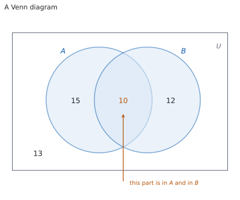
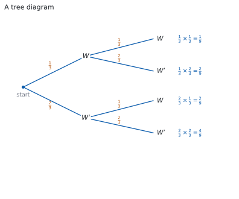
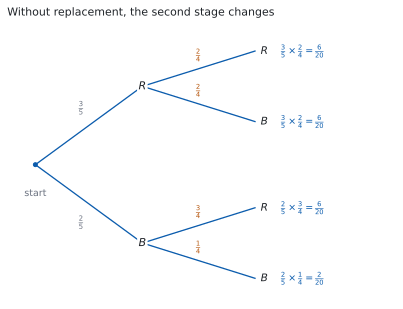
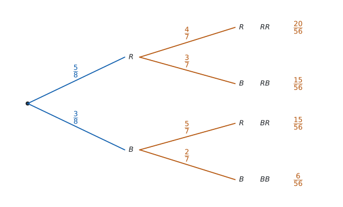
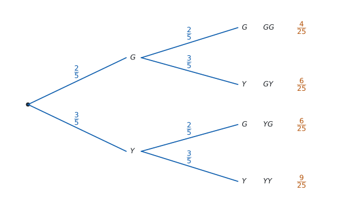
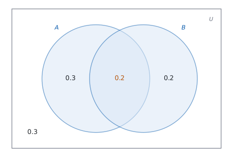

# SL 4.6 — Combined events: Venn diagrams, tree diagrams and tables（事象の組み合わせ） {#sec-aasl-4-6}

::: {.callout-note}
## What you should be able to do
- **intersection**（積事象）$A \cap B$、**union**（和事象）$A \cup B$、**complement**（余事象）$A'$ を読み書きできる。
- 確率でいう **"or"** が「両方でもよい」を含むことを説明できる。
- **Venn diagram**（ベン図）に人数や確率を書き込み、そこから確率を読める。
- **combined events**（複合事象）の式 $P(A \cup B) = P(A) + P(B) - P(A \cap B)$ を使える。
- **mutually exclusive**（互いに排反）かどうかを判定し、$P(A \cap B) = 0$ を使える。
- **sample space diagram / table of outcomes**（結果の表）で確率を求められる。
- **tree diagram**（樹形図）で、枝に沿ってかけ、枝先を足せる。
- もどさない場合に、$2$ 段目の枝の確率が変わることを説明できる。
- **independent**（独立）かどうかを $P(A \cap B) = P(A)P(B)$ で確かめられる。
:::

**このページの図（ベン図・表・樹形図）が読めるようになったら、[SL 4.11](aasl-4-11.qmd) に進みます。** 4.11 では、ここで図から読み取った関係を、記号と式だけで扱います。

## The idea

### 1. and・or・not {#and-or}

$2$ つの事象 $A$ と $B$ を組み合わせるとき、使う記号は $3$ つだけです。

| 記号 | 英語 | 日本語 | 中身 |
|:--|:--|:--|:--|
| $A \cap B$ | $A$ **and** $B$（intersection） | 積事象 | $A$ にも $B$ にも入っている結果 |
| $A \cup B$ | $A$ **or** $B$（union） | 和事象 | $A$ か $B$ の**少なくとも一方**に入っている結果 |
| $A'$ | **not** $A$（complement） | 余事象 | $A$ に入っていない結果 |

: 組み合わせのことば {#tbl-aasl46-words}

**確率の "or" は「両方でもよい」を含みます。** 日常の日本語で「コーヒーか紅茶」と言うと、ふつうはどちらか一方です。しかし $A \cup B$ は、$A$ だけ・$B$ だけ・両方、の $3$ とおりを**すべて**含みます。

**「少なくとも一方」と読みかえると、まちがえません。** $A \cup B$ は「$A$ と $B$ の少なくとも一方が起こる」です。

**$A \cap B$ は「両方いっしょに起こる」です。** $1$ 回の試行で、$A$ と $B$ の両方にあてはまる結果のことです。

### 2. Venn diagram で数える {#venn}

{#fig-aasl46-idea-a width=100%}

**Venn diagram**（ベン図）は、sample space（標本空間）$U$ を長方形で表し、事象を円で表した図です。円が $2$ つ**重なっているとき**、$U$ は $4$ つの部分に分かれます（@fig-aasl46-idea-a）。

| 部分 | 意味 |
|:--|:--|
| 円 $A$ の中で、重なりの外 | $A$ だけ。$A \cap B'$ と書きます |
| 重なり | $A \cap B$ |
| 円 $B$ の中で、重なりの外 | $B$ だけ。$A' \cap B$ と書きます |
| 円の外 | $(A \cup B)'$、つまりどちらでもない |

: Venn 図の $4$ つの部分 {#tbl-aasl46-regions}

**書き込むのは、重なりからです。** $A \cap B$ の数を先に入れ、そのぶんを引いてから「$A$ だけ」「$B$ だけ」を入れます。この順にすると、二重に数えることがありません。

**$4$ つの数の合計は $n(U)$ です。** ここが合わなければ、どこかがまちがっています。

### 3. 足しすぎた分を引く（the addition rule） {#addition}

$n(A)$ と $n(B)$ をそのまま足すと、重なりの部分を **$2$ 回**数えてしまいます。だから $1$ 回ぶん引きます。

@fig-aasl46-idea-a で確かめてみます。$n(A) = 15 + 10 = 25$、$n(B) = 10 + 12 = 22$ なので、そのまま足すと $25 + 22 = 47$ です。ところが $A$ か $B$ の少なくとも一方に入っているのは $15 + 10 + 12 = 37$ 人です。**差の $10$ が、$2$ 回数えた重なりの分**です。

$$
P(A \cup B) = P(A) + P(B) - P(A \cap B)
$$ {#eq-aasl46-add}

::: {.callout-important}
## この式は公式集にあります
$P(A \cup B) = P(A) + P(B) - P(A \cap B)$ は、公式集の **4.6** の欄に *Combined events* として載っています。試験中に配られるので、覚える必要はありません。

**覚えるのは、なぜ引くのかのほうです。** 重なりを $2$ 回数えているからです。
:::

**$4$ つの量のうち $3$ つが分かれば、残りが出ます。** 「$P(A)$、$P(B)$、$P(A \cup B)$ が与えられて $P(A \cap B)$ を求める」という問題は、この式を移項するだけです。

### 4. mutually exclusive（互いに排反） {#exclusive}

**mutually exclusive**（互いに排反）とは、$A$ と $B$ が**同時には起こらない**ことです。共通の結果が $1$ つもないので

$$
P(A \cap B) = 0
$$ {#eq-aasl46-zero}

このとき、@eq-aasl46-add で引くものがなくなり、

$$
P(A \cup B) = P(A) + P(B)
$$ {#eq-aasl46-me}

::: {.callout-important}
## この式も公式集にあります
$P(A \cup B) = P(A) + P(B)$ は、公式集の **4.6** の欄に *Mutually exclusive events* として載っています。

**ただし、使ってよいのは $A \cap B$ が空のときだけです。** 使う前に、重なりがないことを必ず確かめてください。
:::

**Venn 図では、ふつう円を離してかきます。** 重なりに入る結果がないからです（重なりをかいて $0$ を書き込んでもかまいません）。

**「$A$ が起これば $B$ は起こらない」と言いかえられます。** たとえば $1$ 個のさいころで、「$2$ 以下が出る」と「$5$ 以上が出る」は互いに排反です。

### 5. table of outcomes（表で書き出す） {#table}

$2$ つのことが続けて（または同時に）起こるときは、**table of outcomes**（結果の表）が使えます。行に $1$ つ目の結果、列に $2$ つ目の結果を並べます。

**マスの数が $n(U)$ です。** さいころ $2$ 個なら $6 \times 6 = 36$ マス、コイン $1$ 枚とさいころ $1$ 個なら $2 \times 6 = 12$ マスです。

**事象はマスの集まりです。** $A \cap B$ は「両方の条件を満たすマス」、$A \cup B$ は「どちらかの条件を満たすマス」です。表があれば、引き算をしなくても直接数えられます。

**マスを数えて確率を出せるのは、マスがすべて同様に確からしいときだけです。** 公平なさいころやコインならそうなります。そうでないときは、マスに確率を書いて足します。

### 6. tree diagram（樹形図） {#tree}

{#fig-aasl46-idea-b width=100%}

**tree diagram**（樹形図）は、段階のある試行を枝で表した図です（@fig-aasl46-idea-b）。

**枝に沿ってかけ、枝先を足します。**

- $1$ 本の道すじ（始点から端まで）の確率は、通った枝の確率の**積**です。
- 複数の道すじをまとめた事象の確率は、その道すじの確率の**和**です。

**すべての枝先の確率を足すと $1$ になります。** ここが検算になります。

**「少なくとも $1$ 回」は、余事象が速いことが多いです。** 「少なくとも $1$ 回は赤」なら、$1 - P(\text{赤が 1 個も出ない})$ です。

::: {.callout-note appearance="simple"}
**この節の樹形図は、$1$ 回目の結果が $2$ 回目の確からしさを変えない場合です。** **with replacement**（復元、玉をもどす）場合が、これにあたります。

もどさない場合は、$2$ 回目の枝の確率が $1$ 回目によって変わります。[第 7 節](#conditional)で扱います。
:::

### 7. 条件によって確率が変わる {#conditional}

**条件が分かったら、その条件に合う場合だけを見て確率を考えます。**

たとえば、赤玉 $3$ 個・青玉 $2$ 個の袋から、玉をもどさずに $2$ 個引きます。$1$ 個目が赤だった場合、残りは赤玉 $2$ 個・青玉 $2$ 個です。$2$ 個目の確率は、この残りの玉から考えます。

{#fig-aasl46-idea-c width=100%}

樹形図では、**その枝までに起こったことをもとに、次の枝の確率を書きます**（@fig-aasl46-idea-c）。同じ経路の確率はかけ、求めたい経路が複数あれば足します。

**枝先を全部足すと $1$ になります。** もどさない場合でも、ここは変わりません。

このような確率を **conditional probability**（条件付き確率）といいます。記号と公式は、[SL 4.11](aasl-4-11.qmd) で学びます。

### 8. independent events（独立な事象） {#independent}

**independent**（独立）とは、**一方が起こったと分かっても、もう一方の起こる確率が変わらない**ことです。玉をもどせば $2$ 回目の確率は変わらないので、$1$ 回目と $2$ 回目は独立です。もどさなければ独立ではありません（[第 7 節](#conditional)）。

事象 $A$ と $B$ が独立かどうかは、次の式で確かめられます。

$$
P(A \cap B) = P(A)P(B)
$$ {#eq-aasl46-indep}

::: {.callout-important}
## この式も公式集にあります
$P(A \cap B) = P(A)P(B)$ は、公式集の **4.6** の欄に *Independent events* として載っています。
:::

**判定するときは、$P(A \cap B)$ と $P(A) \times P(B)$ を別々に求めて比べます。** 等しければ独立、等しくなければ独立ではありません。

**排反と独立は、同じ意味ではありません。**

| | 排反（mutually exclusive） | 独立（independent） |
|:--|:--|:--|
| 意味 | **両方は起こらない** | **一方が起こったと分かっても、もう一方の確率は変わらない** |
| 式 | $P(A \cap B) = 0$ | $P(A \cap B) = P(A)P(B)$ |

: 排反と独立 {#tbl-aasl46-compare}

さいころを $1$ 回振って「$1$ が出る」と「$2$ が出る」は排反です。でも「$2$ が出た」と分かると「$1$ が出る」確率は $\dfrac{1}{6}$ から $0$ に変わるので、独立ではありません。**どちらも起こる確率が $0$ より大きい場合、排反な $2$ つの事象は独立ではありません。**

## Why it works

::: {.callout-tip collapse="true"}
## クリックすると開きます

**なぜ、$P(A \cap B)$ を引くのでしょうか。** 個数で見ると分かります。$A$ の中の結果を数え、次に $B$ の中の結果を数えたとします。このとき、**両方に入っている結果は $2$ 回数えられています**。

だから、個数では

$$
n(A \cup B) = n(A) + n(B) - n(A \cap B)
$$

です。どの結果も同様に確からしいなら、両辺を $n(U)$ で割って

$$
\frac{n(A \cup B)}{n(U)} = \frac{n(A)}{n(U)} + \frac{n(B)}{n(U)} - \frac{n(A \cap B)}{n(U)}
$$

となり、@eq-aasl46-add が出ます。

**同様に確からしくない場合も、同じ式が成り立ちます。** Venn 図の $4$ つの部分は重なりません。重ならないものの確率は足せるので（[SL 4.5 の Why it works](aasl-4-5.qmd#why-it-works)）、$P(A)$ は「$A$ だけ」と「重なり」の和、$P(B)$ は「$B$ だけ」と「重なり」の和です。両方を足すと重なりが $2$ 回入るので、$1$ 回ぶん引けば $A \cup B$ の確率になります。

**なぜ、mutually exclusive のときは引かなくてよいのでしょうか。** 共通の結果が $1$ つもないので $n(A \cap B) = 0$、つまり $P(A \cap B) = 0$ です。引くものがないので、@eq-aasl46-me になります。

**逆に、$P(A \cap B) = 0$ を確かめずに足すのは危険です。** 重なりがあるのに足すと、答えが大きくなりすぎます。$1$ をこえたら、まちがいだとすぐ分かります。

**なぜ、樹形図では枝に沿ってかけるのでしょうか。** もどす場合なら、数えて確かめられます。

赤玉 $3$ 個と青玉 $1$ 個の袋を考えます。玉に $R_1, R_2, R_3, B_1$ と名前を付け、$1$ 個取って**もどし**、もう $1$ 個取ります。このとき、順序を区別した組は

$$
4 \times 4 = 16
$$

とおりあり、どれも同様に確からしいです。「$2$ 回とも赤」になる組は $3 \times 3 = 9$ とおりなので、確率は $\dfrac{9}{16}$ です。

一方、枝に沿ってかけると $\dfrac{3}{4} \times \dfrac{3}{4} = \dfrac{9}{16}$ です。**数えた答えと一致します。**

**分子と分母を別々に見ると、理由が見えます。** 全体の $16$ は $4 \times 4$、赤赤の $9$ は $3 \times 3$ です。だから $\dfrac{3 \times 3}{4 \times 4} = \dfrac{3}{4} \times \dfrac{3}{4}$ と分けられます。

**確率が個数で与えられていないときも、同じことが言えます。** たとえば「$1$ 回で当たる確率が $0.3$」なら、円を $10$ 等分して $3$ つを当たりにしたルーレットと同じです。$2$ 回まわすと、区画の組は $10 \times 10 = 100$ とおりで同様に確からしく、$2$ 回とも当たる組は $3 \times 3 = 9$ とおりなので $\dfrac{9}{100}$ です。枝に沿ってかけた $0.3 \times 0.3$ と一致します。**$1$ 回目の結果が $2$ 回目の区画の選ばれ方を変えないことが、この数え方が使える条件です。**

**もどさない場合は、この数え方が変わります。** $2$ 回目に選べる玉が $3$ 個に減るので、$2$ 回目の枝の確率も変わります。扱いは[第 7 節](#conditional)です。

**なぜ、枝先を足せるのでしょうか。** どの道すじも、別々の組に対応していて、重なりません。重ならないものの確率は足せます。

**なぜ、枝先の合計が $1$ になるのでしょうか。** $16$ とおりのすべてが、ちょうど $1$ 本の道すじに入るからです。すき間なく分けたので、合計は $1$ です。
:::

## Worked examples

::: {.callout-note appearance="simple"}
問題文は英語です。意味が理解できなかったら、問題文の下の「**日本語訳**」を開いてください。解説は日本語です。

**例題も演習も、すべて電卓なしで解けます。** 答えは分数のままで書いてかまいません。
:::

::: {#exm-aasl46-venn}
[In a class of $30$ students, $18$ play football and $14$ play tennis. $6$ students play both.]{.q-en}

**(a)** [Draw a Venn diagram and write the number of students in each of the four regions.]{.q-en}

**(b)** [Find the probability that a student chosen at random plays at least one of the two sports.]{.q-en}

**(c)** [Find the probability that a student chosen at random plays neither sport.]{.q-en}

**(d)** [Explain why the number of students who play at least one sport is not $18 + 14$.]{.q-en}

日本語訳

$30$ 人のクラスで、$18$ 人がサッカーを、$14$ 人がテニスをしています。$6$ 人は両方をしています。

**(a)** ベン図をかき、$4$ つの部分それぞれに人数を書きなさい。

**(b)** 無作為に選んだ生徒が、$2$ つのうち少なくとも一方をしている確率を求めなさい。

**(c)** 無作為に選んだ生徒が、どちらもしていない確率を求めなさい。

**(d)** 少なくとも一方をしている人数が $18 + 14$ でない理由を説明しなさい。

---

**(a)** **重なりから書きます**（[第 2 節](#venn)）。両方が $6$ 人です。

サッカーだけは $18 - 6 = 12$ 人、テニスだけは $14 - 6 = 8$ 人です。どちらでもないのは

$$
30 - (12 + 6 + 8) = 30 - 26 = 4
$$

人です。$4$ つの数は $12$、$6$、$8$、$4$ です。

**(b)** 少なくとも一方は、円の中に入っている人です。

$$
P(F \cup T) = \frac{12 + 6 + 8}{30} = \frac{26}{30} = \frac{13}{15}
$$

**(c)** どちらでもないのは円の外です。

$$
P((F \cup T)') = \frac{4}{30} = \frac{2}{15}
$$

**(d)** `Explain why` なので、英語で理由を書きます。

::: {.model-answer}
**試験ではこう書く**

*The $18$ football players include the $6$ who also play tennis, and the $14$ tennis players include the same $6$. Adding $18$ and $14$ therefore counts those $6$ students twice, giving $32$, which is more than the $30$ students in the class. Subtracting the overlap once gives $18 + 14 - 6 = 26$.*
:::

（$18$ 人の中に両方をする $6$ 人が入っており、$14$ 人の中にも同じ $6$ 人が入っている。だから $18 + 14$ ではその $6$ 人を $2$ 回数えていて、$32$ となりクラスの $30$ 人をこえてしまう。重なりを $1$ 回引けば $26$ になる、という意味です。）

**検算（(a) について）。** **もとの人数にもどるか見ます。** サッカーは $12 + 6 = 18$ ✓、テニスは $8 + 6 = 14$ ✓ で、問題の人数と一致します。合計も $12 + 6 + 8 + 4 = 30$ ✓

**検算（(b) について、式で）。** @eq-aasl46-add を使うと $\dfrac{18}{30} + \dfrac{14}{30} - \dfrac{6}{30} = \dfrac{26}{30}$ ✓ 図から数えた答えと一致します。

**検算（(c) について）。** **別の道すじで数えます。** どちらもしない人は、$30$ 人からサッカーをする $18$ 人と、テニスだけの $8$ 人を除いた人です。$30 - 18 - 8 = 4$ ✓ (a) の $4$ 人と一致します。

::: {.callout-note}
## 解答例（答案用紙に書くこと）
**(a)** *football only $12$, both $6$, tennis only $8$, neither $4$*

**(b)**
$$P(F \cup T) = \frac{18 + 14 - 6}{30} = \frac{26}{30} = \frac{13}{15}$$

**(c)**
$$P((F \cup T)') = \frac{4}{30} = \frac{2}{15}$$

**(d)** *the $6$ who play both are counted in the $18$ and again in the $14$, so $18 + 14$ counts them twice*
:::
:::

::: {#exm-aasl46-without}
[A bag contains $5$ red counters and $3$ blue counters. Two counters are taken at random, one after the other, without replacement.]{.q-en}

**(a)** [Draw a tree diagram for the two draws.]{.q-en}

**(b)** [Find the probability that both counters are red.]{.q-en}

**(c)** [Find the probability that exactly one counter is red.]{.q-en}

**(d)** [Explain why the probabilities on the second set of branches are not the same as those on the first.]{.q-en}

日本語訳

袋の中に赤い駒が $5$ 個、青い駒が $3$ 個入っています。$2$ 個を無作為に、$1$ 個ずつ、もどさずに取り出します。

**(a)** $2$ 回の取り出しについて樹形図をかきなさい。

**(b)** $2$ 個とも赤である確率を求めなさい。

**(c)** ちょうど $1$ 個が赤である確率を求めなさい。

**(d)** $2$ 段目の枝の確率が $1$ 段目と同じでない理由を説明しなさい。

---

**(a)** $1$ 段目は $P(R) = \dfrac{5}{8}$、$P(B) = \dfrac{3}{8}$ です。

$2$ 段目は、残り $7$ 個から取ります。赤のあとなら赤は $4$ 個、青のあとなら赤は $5$ 個です。

{#fig-aasl46-without width=100%}

**(b)** 枝に沿ってかけます（[第 6 節](#tree)）。

$$
P(RR) = \frac{5}{8} \times \frac{4}{7} = \frac{20}{56} = \frac{5}{14}
$$

**(c)** $RB$ と $BR$ の $2$ 本を足します。

$$
P(\text{exactly one red}) = \frac{5}{8} \times \frac{3}{7} + \frac{3}{8} \times \frac{5}{7} = \frac{15}{56} + \frac{15}{56} = \frac{30}{56} = \frac{15}{28}
$$

**(d)** `Explain why` なので、英語で理由を書きます。

::: {.model-answer}
**試験ではこう書く**

*The first counter is not replaced, so only $7$ counters remain for the second draw and the denominator falls from $8$ to $7$. The numerator also depends on the first result: if a red counter was taken, only $4$ reds remain, but if a blue counter was taken, all $5$ reds remain. The second probabilities are therefore conditional on the first draw.*
:::

（$1$ 個目をもどさないので、$2$ 回目は $7$ 個からになり、分母が $8$ から $7$ に減る。分子も $1$ 回目によって変わり、赤を取れば赤は $4$ 個、青を取れば赤は $5$ 個残る。だから $2$ 段目は条件付き確率である、という意味です。）

**検算（枝先の合計）。** $\dfrac{20}{56} + \dfrac{15}{56} + \dfrac{15}{56} + \dfrac{6}{56} = \dfrac{56}{56} = 1$ ✓

**検算（(b) について、数えます）。** **駒に名前を付けて数えます。** 順序を区別した組は $8 \times 7 = 56$ とおりです。$2$ 個とも赤になる組は $5 \times 4 = 20$ とおりです。$\dfrac{20}{56} = \dfrac{5}{14}$ ✓

**検算（もどす場合と比べます）。** もどせば $\dfrac{5}{8} \times \dfrac{5}{8} = \dfrac{25}{64}$ で、$\dfrac{5}{14} = \dfrac{160}{448}$、$\dfrac{25}{64} = \dfrac{175}{448}$ です。もどさないほうが小さくなっています ✓ 赤を $1$ 個減らしたので、そうなるはずです。

::: {.callout-note}
## 解答例（答案用紙に書くこと）
**(a)** *tree with first branches $R\ \dfrac{5}{8}$, $B\ \dfrac{3}{8}$; second branches $\dfrac{4}{7}, \dfrac{3}{7}$ after $R$ and $\dfrac{5}{7}, \dfrac{2}{7}$ after $B$*

**(b)**
$$P(RR) = \frac{5}{8} \times \frac{4}{7} = \frac{20}{56} = \frac{5}{14}$$

**(c)**
$$P = \frac{5}{8} \times \frac{3}{7} + \frac{3}{8} \times \frac{5}{7} = \frac{30}{56} = \frac{15}{28}$$

**(d)** *the first counter is not replaced, so the second draw is from $7$ counters and the number of reds left depends on the first result*
:::
:::

::: {#exm-aasl46-dice}
[Two fair six-sided dice are rolled. Let $A$ be the event that the total is at least $10$, and let $B$ be the event that at least one die shows a $6$.]{.q-en}

**(a)** [Find $P(A)$.]{.q-en}

**(b)** [Find $P(B)$.]{.q-en}

**(c)** [Find $P(A \cup B)$.]{.q-en}

**(d)** [Explain why $P(A) + P(B)$ is not the answer to part (c).]{.q-en}

日本語訳

公平な $6$ 面のさいころを $2$ 個投げます。$A$ を「合計が $10$ 以上」という事象、$B$ を「少なくとも一方が $6$ を示す」という事象とします。

**(a)** $P(A)$ を求めなさい。

**(b)** $P(B)$ を求めなさい。

**(c)** $P(A \cup B)$ を求めなさい。

**(d)** $P(A) + P(B)$ が (c) の答えでない理由を説明しなさい。

---

表で考えます（[第 5 節](#table)）。マスは $6 \times 6 = 36$ 個で、どれも同様に確からしいです。

**(a)** 合計 $10$ は $3$ 通り、$11$ は $2$ 通り、$12$ は $1$ 通りです。

$$
P(A) = \frac{3 + 2 + 1}{36} = \frac{6}{36} = \frac{1}{6}
$$

**(b)** $6$ が $1$ つも出ないマスは $5 \times 5 = 25$ 個なので、少なくとも $1$ つ出るのは $36 - 25 = 11$ 個です。

$$
P(B) = \frac{11}{36}
$$

**(c)** 両方にあてはまるマスを数えます。合計が $10$ 以上で、しかも $6$ をふくむのは $(4,6)$、$(6,4)$、$(5,6)$、$(6,5)$、$(6,6)$ の $5$ 個です。

$$
P(A \cup B) = \frac{6}{36} + \frac{11}{36} - \frac{5}{36} = \frac{12}{36} = \frac{1}{3}
$$

**(d)** `Explain why` なので、英語で理由を書きます。

::: {.model-answer}
**試験ではこう書く**

*A roll such as $(6,6)$ has a total of at least $10$ and also shows a $6$, so $A$ and $B$ can happen together. Adding $P(A)$ and $P(B)$ counts each of the five such rolls twice, so $P(A \cap B) = \dfrac{5}{36}$ must be subtracted once.*
:::

（$(6,6)$ のような出方は合計が $10$ 以上で、しかも $6$ を示すので、$A$ と $B$ は同時に起こりうる。$P(A)$ と $P(B)$ を足すと、そのような $5$ 通りを $2$ 回ずつ数えることになるので、$\dfrac{5}{36}$ を $1$ 回引く、という意味です。）

**検算（(c) について、直接数えます）。** **$A$ のマスと $B$ のマスを合わせて並べます。** $A$ は $(4,6), (5,5), (6,4), (5,6), (6,5), (6,6)$、$B$ でまだ出ていないのは $(1,6), (2,6), (3,6), (6,1), (6,2), (6,3)$ の $6$ 個です。合わせて $12$ 個 ✓ $\dfrac{12}{36}$ と一致します。

**検算（(a) について）。** **合計ごとの通り数を確かめます。** $10$ は $(4,6), (5,5), (6,4)$ の $3$ 通り、$11$ は $(5,6), (6,5)$ の $2$ 通り、$12$ は $(6,6)$ の $1$ 通りです ✓

**検算（(b) について、直接数えます）。** **$6$ をふくむマスを数えます。** $1$ 個目が $6$ のマスが $6$ 個、$2$ 個目が $6$ のマスが $6$ 個、$(6,6)$ が両方に入るので $6 + 6 - 1 = 11$ ✓

::: {.callout-note}
## 解答例（答案用紙に書くこと）
**(a)**
$$P(A) = \frac{6}{36} = \frac{1}{6}$$

**(b)**
$$P(B) = 1 - \frac{25}{36} = \frac{11}{36}$$

**(c)** *outcomes in both:* $(4,6), (6,4), (5,6), (6,5), (6,6)$
$$P(A \cup B) = \frac{6}{36} + \frac{11}{36} - \frac{5}{36} = \frac{12}{36} = \frac{1}{3}$$

**(d)** *five rolls are in both $A$ and $B$, so adding $P(A)$ and $P(B)$ counts them twice*
:::
:::

::: {#exm-aasl46-tree}
[A bag contains $4$ green counters and $6$ yellow counters. A counter is taken at random, its colour is recorded, and it is returned to the bag. A second counter is then taken at random.]{.q-en}

**(a)** [Draw a tree diagram for the two draws.]{.q-en}

**(b)** [Find the probability that both counters are green.]{.q-en}

**(c)** [Find the probability that exactly one counter is green.]{.q-en}

**(d)** [Find the probability that at least one counter is green.]{.q-en}

**(e)** [Justify the probabilities you used on the second set of branches.]{.q-en}

日本語訳

袋の中に緑の駒が $4$ 個、黄の駒が $6$ 個入っています。$1$ 個を無作為に取り出して色を記録し、袋にもどします。次に、もう $1$ 個を無作為に取り出します。

**(a)** $2$ 回の取り出しについて樹形図をかきなさい。

**(b)** $2$ 個とも緑である確率を求めなさい。

**(c)** ちょうど $1$ 個が緑である確率を求めなさい。

**(d)** 少なくとも $1$ 個が緑である確率を求めなさい。

**(e)** $2$ 段目の枝に使った確率が正しい理由を述べなさい。

---

**(a)** $1$ 回の取り出しで、$P(G) = \dfrac{4}{10} = \dfrac{2}{5}$、$P(Y) = \dfrac{6}{10} = \dfrac{3}{5}$ です。

$2$ 段目も同じ確率になります（もどしたので）。枝先は $GG$、$GY$、$YG$、$YY$ の $4$ 本です。

{#fig-aasl46-tree width=100%}

**(b)** 枝に沿ってかけます（[第 6 節](#tree)）。

$$
P(GG) = \frac{2}{5} \times \frac{2}{5} = \frac{4}{25}
$$

**(c)** ちょうど $1$ 個は、$GY$ と $YG$ の $2$ 本です。枝先を足します。

$$
P(\text{exactly one green}) = \frac{2}{5} \times \frac{3}{5} + \frac{3}{5} \times \frac{2}{5} = \frac{6}{25} + \frac{6}{25} = \frac{12}{25}
$$

**(d)** 「少なくとも $1$ 個」の余事象は「$2$ 個とも黄」です。

$$
P(YY) = \frac{3}{5} \times \frac{3}{5} = \frac{9}{25}
$$

$$
P(\text{at least one green}) = 1 - \frac{9}{25} = \frac{16}{25}
$$

**(e)** `Justify` なので、英語で理由を書きます。

::: {.model-answer}
**試験ではこう書く**

*The first counter is returned before the second is taken, so the bag again contains $4$ green and $6$ yellow counters. The second counter is again taken at random from the same $10$ counters, so its probabilities are the same as those for the first, $\dfrac{2}{5}$ for green and $\dfrac{3}{5}$ for yellow, whichever colour was drawn first.*
:::

（$1$ 個目をもどしてから $2$ 個目を取るので、袋は再び緑 $4$ 個・黄 $6$ 個の計 $10$ 個にもどる。よって $2$ 回目の確率は $1$ 回目と同じで、$1$ 回目が何色でも緑 $\dfrac{2}{5}$、黄 $\dfrac{3}{5}$ である、という意味です。）

**検算（枝先の合計）。** $\dfrac{4}{25} + \dfrac{6}{25} + \dfrac{6}{25} + \dfrac{9}{25} = \dfrac{25}{25} = 1$ ✓

**検算（(d) について、直接足します）。** **緑を含む枝先を足します。** $\dfrac{4}{25} + \dfrac{6}{25} + \dfrac{6}{25} = \dfrac{16}{25}$ ✓ 余事象で出した答えと一致します。

**検算（(c) について、数えます）。** **駒に名前を付けて数えます。** もどすので順序を区別した組は $10 \times 10 = 100$ とおりです。緑が $1$ 個目だけの組は $4 \times 6 = 24$、$2$ 個目だけの組は $6 \times 4 = 24$ で、合わせて $48$ とおりです。$\dfrac{48}{100} = \dfrac{12}{25}$ ✓

::: {.callout-note}
## 解答例（答案用紙に書くこと）
**(a)** *tree with first branches $G\ \dfrac{2}{5}$, $Y\ \dfrac{3}{5}$ and the same two probabilities on each second branch*

**(b)**
$$P(GG) = \frac{2}{5} \times \frac{2}{5} = \frac{4}{25}$$

**(c)**
$$P = \frac{2}{5} \times \frac{3}{5} + \frac{3}{5} \times \frac{2}{5} = \frac{12}{25}$$

**(d)**
$$P = 1 - \frac{3}{5} \times \frac{3}{5} = 1 - \frac{9}{25} = \frac{16}{25}$$

**(e)** *the counter is replaced, so the bag is back to $4$ green and $6$ yellow and the second draw has the same probabilities as the first*
:::
:::

## Common errors

::: {.callout-warning}
## "or" を「どちらか一方だけ」と読む
$A \cup B$ は「少なくとも一方」です（[第 1 節](#and-or)）。両方の場合も含みます。
:::

::: {.callout-warning}
## $P(A \cup B)$ で $P(A \cap B)$ を引き忘れる
重なりを $2$ 回数えたままになります（@eq-aasl46-add）。$1$ をこえたら、まず引き忘れを疑ってください。**$1$ 以下でも、まちがっていることがあります。** 図で数えて確かめてください。
:::

::: {.callout-warning}
## Venn 図の重なりの外に $n(A)$ をそのまま書く
円 $A$ 全体が $n(A)$ です（[第 2 節](#venn)）。重なりの外に書く数は $n(A) - n(A \cap B)$ です。
:::

::: {.callout-warning}
## Venn 図の外側を忘れる
「どちらでもない」も $U$ の一部です（@tbl-aasl46-regions）。$4$ つの数の合計が $n(U)$ になるか確かめてください。
:::

::: {.callout-warning}
## 樹形図で、$1$ 本の枝に沿って足す
$1$ 本の道すじは**かけます**（[第 6 節](#tree)）。足すのは、別々の道すじどうしです。
:::

::: {.callout-warning}
## $P(A \cap B) = 0$ を「$A$ と $B$ は無関係」と読む
$P(A \cap B) = 0$ は「同時には起こらない」です（[第 4 節](#exclusive)）。「無関係」は独立のことで、[第 8 節](#independent)で扱います。
:::

## Exercises

::: {.callout-note appearance="simple"}
各問題に、折りたたみが $3$ つ付いています。**日本語訳**、**解答例**（答案用紙に書くべきこと。英語です）、**解説**（なぜそうなるか。日本語です）。

まず自分で解いて、次に解答例と見くらべてください。**解説は、合わなかったときだけ開けば十分です。**
:::

::: {.exercise-block}

[1]{.ex-no} [In a group of $40$ people, $25$ like coffee and $18$ like tea. $9$ like both. One person is chosen at random. Find the probability that the person likes at least one of the two drinks, and the probability that the person likes neither.]{.q-en}

日本語訳

$40$ 人のグループで、$25$ 人がコーヒーを、$18$ 人が紅茶を好きです。$9$ 人は両方が好きです。$1$ 人を無作為に選びます。少なくとも一方が好きである確率と、どちらも好きでない確率を求めなさい。

::: {.callout-note collapse="true"}
## 解答例（答案用紙に書くこと）

$$n(C \cup T) = 25 + 18 - 9 = 34$$

$$P(C \cup T) = \frac{34}{40} = \frac{17}{20}, \qquad P((C \cup T)') = \frac{6}{40} = \frac{3}{20}$$

:::

::: {.callout-tip collapse="true"}
## 解説

重なりを $1$ 回引きます（@eq-aasl46-add）。$25 + 18 - 9 = 34$ 人です。

**検算。** **もとの人数にもどるか見ます。** コーヒーだけ $16$ 人、両方 $9$ 人、紅茶だけ $9$ 人、どちらでもない $6$ 人です。コーヒーは $16 + 9 = 25$ ✓、紅茶は $9 + 9 = 18$ ✓ で、問題の人数と一致します。

**検算（別の道すじ）。** どちらも好きでない人は、$40$ 人からコーヒーが好きな $25$ 人と、紅茶だけが好きな $9$ 人を除いた人です。$40 - 25 - 9 = 6$ ✓ 上で出した $6$ 人と一致します。

**引き忘れると $43$ 人になります。** グループの $40$ 人をこえるので、すぐ気づけます。
:::

::: {.ex-sep}
:::

[2]{.ex-no} [A box contains $4$ green pens and $6$ red pens. Two pens are taken at random, one after the other, without replacement. Find the probability that both pens are green, and the probability that at least one pen is green.]{.q-en}

日本語訳

箱の中に緑のペンが $4$ 本、赤のペンが $6$ 本入っています。$2$ 本を無作為に、$1$ 本ずつ、もどさずに取り出します。$2$ 本とも緑である確率と、少なくとも $1$ 本が緑である確率を求めなさい。

::: {.callout-note collapse="true"}
## 解答例（答案用紙に書くこと）

$$P(GG) = \frac{4}{10} \times \frac{3}{9} = \frac{12}{90} = \frac{2}{15}$$

$$P(\text{at least one green}) = 1 - \frac{6}{10} \times \frac{5}{9} = 1 - \frac{30}{90} = \frac{2}{3}$$

:::

::: {.callout-tip collapse="true"}
## 解説

もどさないので、$2$ 段目の分母は $9$ です（[第 7 節](#conditional)）。「少なくとも $1$ 本」は、余事象「$2$ 本とも赤」を使います。

**検算。** **直接足します。** ちょうど $1$ 本が緑なのは $\dfrac{4}{10} \times \dfrac{6}{9} + \dfrac{6}{10} \times \dfrac{4}{9} = \dfrac{48}{90}$ です。$\dfrac{12}{90} + \dfrac{48}{90} = \dfrac{60}{90} = \dfrac{2}{3}$ ✓ 余事象で出した答えと一致します。

**検算（数えます）。** ペンに名前を付けると、順序を区別した組は $10 \times 9 = 90$ とおりです。$2$ 本とも緑は $4 \times 3 = 12$ とおり ✓

**検算（もどす場合と比べます）。** もどせば $\dfrac{4}{10} \times \dfrac{4}{10} = \dfrac{16}{100}$ で、$\dfrac{2}{15} \approx 0.133$ より大きいです ✓ 緑を $1$ 本減らしたので、そうなるはずです。
:::

::: {.ex-sep}
:::

[3]{.ex-no} [A fair six-sided die is rolled once. Let $A$ be the event that the number is even, let $B$ be the event that the number is greater than $4$, and let $C$ be the event that the number is odd. **(a)** Explain whether $A$ and $B$ are mutually exclusive, and find $P(A \cup B)$. **(b)** Explain whether $A$ and $C$ are mutually exclusive, and find $P(A \cup C)$.]{.q-en}

日本語訳

公平な $6$ 面のさいころを $1$ 回投げます。$A$ を「出た数が偶数」という事象、$B$ を「出た数が $4$ より大きい」という事象、$C$ を「出た数が奇数」という事象とします。**(a)** $A$ と $B$ が互いに排反かどうかを説明し、$P(A \cup B)$ を求めなさい。**(b)** $A$ と $C$ が互いに排反かどうかを説明し、$P(A \cup C)$ を求めなさい。

::: {.callout-note collapse="true"}
## 解答例（答案用紙に書くこと）

**(a)** *$6$ is even and greater than $4$, so $A \cap B = \{6\}$ and the events are not mutually exclusive*

$$P(A \cup B) = \frac{3}{6} + \frac{2}{6} - \frac{1}{6} = \frac{4}{6} = \frac{2}{3}$$

**(b)** *no number is both even and odd, so $A \cap C$ is empty and the events are mutually exclusive*

$$P(A \cup C) = \frac{3}{6} + \frac{3}{6} = 1$$

:::

::: {.callout-tip collapse="true"}
## 解説

$A = \{2, 4, 6\}$、$B = \{5, 6\}$、$C = \{1, 3, 5\}$ です。

**(a)** $6$ が $A$ と $B$ の両方に入っているので、互いに排反ではありません（[第 4 節](#exclusive)）。@eq-aasl46-add で $1$ 回引きます。

**(b)** 偶数でも奇数でもある数はないので、$A$ と $C$ は互いに排反です。引くものがないので、@eq-aasl46-me がそのまま使えます。

**検算（(a) について）。** **$A \cup B$ を書き出します。** $\{2, 4, 5, 6\}$ の $4$ 個です ✓ $\dfrac{4}{6} = \dfrac{2}{3}$ と一致します。

**検算（(a) で、排反だと思って足したら）。** $\dfrac{3}{6} + \dfrac{2}{6} = \dfrac{5}{6}$ になり、書き出した $4$ 個と合いません ✓ 引く必要があると分かります。

**検算（(b) について）。** **$A \cup C$ を書き出します。** $\{1, 2, 3, 4, 5, 6\}$ の $6$ 個で、$U$ そのものです ✓ $\dfrac{6}{6} = 1$ と一致します。

**検算（(b) で、余事象を見ます）。** 偶数でも奇数でもない目はないので、$P((A \cup C)') = 0$ です ✓ $1 - 0 = 1$ と一致します。

::: {.model-answer}
**試験ではこう書く**

*The number $6$ is even and is also greater than $4$, so $A \cap B$ is not empty and $A$ and $B$ are not mutually exclusive; the overlap $P(A \cap B) = \dfrac{1}{6}$ must be subtracted once. No number is both even and odd, so $A \cap C$ is empty and $P(A \cap C) = 0$. Therefore $A$ and $C$ are mutually exclusive, and their probabilities may simply be added.*
:::
:::

::: {.ex-sep}
:::

[4]{.ex-no} [Two fair six-sided dice are rolled. By setting out the outcomes in a table, find the probability that the product of the two numbers is even.]{.q-en}

日本語訳

公平な $6$ 面のさいころを $2$ 個投げます。結果を表に書き出すことによって、$2$ つの数の積が偶数である確率を求めなさい。

::: {.callout-note collapse="true"}
## 解答例（答案用紙に書くこと）

*table of $36$ outcomes; the product is odd only when both numbers are odd*

$$n(\text{both odd}) = 3 \times 3 = 9$$

$$P(\text{product even}) = \frac{36 - 9}{36} = \frac{27}{36} = \frac{3}{4}$$

:::

::: {.callout-tip collapse="true"}
## 解説

表のマスは $36$ 個です（[第 5 節](#table)）。積が奇数になるのは、$2$ つとも奇数のときだけです。奇数は $1, 3, 5$ の $3$ 個なので、$3 \times 3 = 9$ マスです。残りが積が偶数のマスです。

**検算。** **積が偶数のマスを直接数えます。** $1$ 個目が偶数なら $3 \times 6 = 18$ マス、$1$ 個目が奇数で $2$ 個目が偶数なら $3 \times 3 = 9$ マスで、$18 + 9 = 27$ ✓

**検算（少なくとも一方が偶数）。** 「積が偶数」は「少なくとも一方が偶数」と同じです。@eq-aasl46-add で $\dfrac{18}{36} + \dfrac{18}{36} - \dfrac{9}{36} = \dfrac{27}{36}$ ✓ 数えた答えと一致します。

**「積が偶数」を「両方とも偶数」と読みまちがえないでください。** 片方だけが偶数でも、積は偶数です。両方とも偶数なのは $9$ マスだけです。
:::

::: {.ex-sep}
:::

[5]{.ex-no} [A spinner is designed so that the probability of a win on any spin is $0.3$. It is spun twice, and the result of the first spin does not change the probabilities for the second. Find the probability of winning on both spins, the probability of winning on exactly one spin, and the probability of winning at least once.]{.q-en}

日本語訳

あるルーレットは、$1$ 回まわすと確率 $0.3$ で当たるように作られています。これを $2$ 回まわします。$1$ 回目の結果は、$2$ 回目の確率を変えないものとします。$2$ 回とも当たる確率、ちょうど $1$ 回当たる確率、少なくとも $1$ 回当たる確率を求めなさい。

::: {.callout-note collapse="true"}
## 解答例（答案用紙に書くこと）

$$P(\text{both}) = 0.3 \times 0.3 = 0.09$$

$$P(\text{exactly one}) = 0.3 \times 0.7 + 0.7 \times 0.3 = 0.42$$

$$P(\text{at least one}) = 1 - 0.7 \times 0.7 = 1 - 0.49 = 0.51$$

:::

::: {.callout-tip collapse="true"}
## 解説

樹形図をかきます（[第 6 節](#tree)）。枝先は $4$ 本で、$1$ 回目の結果が $2$ 回目を変えないので、$2$ 段目も $0.3$ と $0.7$ です。

**検算。** **枝先を全部足します。** $0.09 + 0.21 + 0.21 + 0.49 = 1$ ✓

**検算（少なくとも $1$ 回を直接足す）。** $0.09 + 0.21 + 0.21 = 0.51$ ✓ 余事象で出した答えと一致します。

**「少なくとも $1$ 回」を $0.3 + 0.3 = 0.6$ としないでください。** これは「$1$ 回目に当たる」と「$2$ 回目に当たる」を足したものですが、この $2$ つは同時に起こりえます。@eq-aasl46-add で重なり（$2$ 回とも当たる $0.09$）を $1$ 回引くと $0.6 - 0.09 = 0.51$ ✓ 余事象で出した答えと一致します。
:::

::: {.ex-sep}
:::

[6]{.ex-no} [For two events $A$ and $B$, $P(A) = 0.5$, $P(B) = 0.4$ and $P(A \cap B) = 0.2$. By drawing a Venn diagram and writing the probability in each of the four regions, find $P(A \cup B)$, the probability that neither event occurs, and the probability that $A$ occurs but $B$ does not.]{.q-en}

日本語訳

$2$ つの事象 $A$、$B$ について、$P(A) = 0.5$、$P(B) = 0.4$、$P(A \cap B) = 0.2$ です。ベン図をかいて $4$ つの部分それぞれに確率を書き、$P(A \cup B)$ と、どちらの事象も起こらない確率と、$A$ は起こるが $B$ は起こらない確率を求めなさい。

::: {.callout-note collapse="true"}
## 解答例（答案用紙に書くこと）

$$P(A \cup B) = 0.5 + 0.4 - 0.2 = 0.7$$

$$P((A \cup B)') = 1 - 0.7 = 0.3$$

$$P(A \cap B') = 0.5 - 0.2 = 0.3$$

{#fig-aasl46-ex6 width=100%}

:::

::: {.callout-tip collapse="true"}
## 解説

Venn 図の $4$ つの部分に入れます（[第 2 節](#venn)）。重なりが $0.2$、$A$ だけが $0.5 - 0.2 = 0.3$、$B$ だけが $0.4 - 0.2 = 0.2$、外が残りです。

**検算。** **もとの確率にもどるか見ます。** $P(A) = 0.3 + 0.2 = 0.5$ ✓、$P(B) = 0.2 + 0.2 = 0.4$ ✓ で、与えられた値と一致します。

**検算（$P(A \cup B)$ を図から）。** 円の中は $0.3 + 0.2 + 0.2 = 0.7$ ✓ 式で出した答えと一致します。

**$P(A \cap B')$ は「$A$ だけ」です。** $P(A)$ から重なりを引きます。
:::

::: {.ex-sep}
:::

[7]{.ex-no} [For two events $A$ and $B$, $P(A) = 0.45$, $P(B) = 0.35$ and $P(A \cup B) = 0.6$. Find $P(A \cap B)$. Explain whether $A$ and $B$ are mutually exclusive.]{.q-en}

日本語訳

$2$ つの事象 $A$、$B$ について、$P(A) = 0.45$、$P(B) = 0.35$、$P(A \cup B) = 0.6$ です。$P(A \cap B)$ を求めなさい。$A$ と $B$ が互いに排反かどうかを説明しなさい。

::: {.callout-note collapse="true"}
## 解答例（答案用紙に書くこと）

$$0.6 = 0.45 + 0.35 - P(A \cap B)$$

$$P(A \cap B) = 0.8 - 0.6 = 0.2$$

*$P(A \cap B) = 0.2 \ne 0$, so $A$ and $B$ are not mutually exclusive*

:::

::: {.callout-tip collapse="true"}
## 解説

@eq-aasl46-add を移項します。$P(A \cap B) = P(A) + P(B) - P(A \cup B)$ です。

**検算。** **もどして確かめます。** $0.45 + 0.35 - 0.2 = 0.6$ ✓ 与えられた $P(A \cup B)$ と一致します。

**検算（$4$ つの部分）。** $A$ だけ $0.25$、両方 $0.2$、$B$ だけ $0.15$、外 $0.4$ で、合計 $1$ ✓ どれも $0$ 以上です。

::: {.model-answer}
**試験ではこう書く**

*Rearranging the combined-events formula gives $P(A \cap B) = 0.45 + 0.35 - 0.6 = 0.2$. Mutually exclusive events satisfy $P(A \cap B) = 0$. Here $P(A \cap B) = 0.2$, which is not zero, so $A$ and $B$ are not mutually exclusive.*
:::
:::

::: {.ex-sep}
:::

[8]{.ex-no} [Give an example of two events that are mutually exclusive but not independent, and an example of two events that are independent but not mutually exclusive. In each case state the probabilities you are using. Explain how the two ideas differ.]{.q-en}

日本語訳

互いに排反だが独立でない $2$ つの事象の例と、独立だが互いに排反でない $2$ つの事象の例を、それぞれ $1$ つ挙げなさい。使った確率を書きなさい。$2$ つの考え方がどうちがうかを説明しなさい。

::: {.callout-note collapse="true"}
## 解答例（答案用紙に書くこと）

*mutually exclusive but not independent: one die, $A$: the number is $1$, $B$: the number is $2$*

$$P(A \cap B) = 0, \qquad P(A)P(B) = \frac{1}{6} \times \frac{1}{6} = \frac{1}{36} \ne 0$$

*independent but not mutually exclusive: two dice, $C$: the first shows $1$, $D$: the second shows $2$*

$$P(C \cap D) = \frac{1}{36} = P(C)P(D), \qquad P(C \cap D) \ne 0$$

:::

::: {.callout-tip collapse="true"}
## 解説

`Give an example` と `Explain how` なので、**例を $2$ つ挙げてから、式でちがいを述べます**（@tbl-aasl46-compare）。例は自分で作ってかまいません。下のものは $1$ つの作り方です。

**検算（$1$ つ目の例が条件を満たすか）。** **同時に起こりうるか見ます。** さいころ $1$ 個を $1$ 回投げると、$1$ と $2$ が同時に出ることはありません ✓ だから $P(A \cap B) = 0$ で排反です。$P(A)P(B) = \dfrac{1}{36}$ は $0$ ではないので、独立ではありません ✓

**検算（$2$ つ目の例が条件を満たすか）。** さいころ $2$ 個なら $(1, 2)$ が起こりうるので、排反ではありません ✓ $P(C \cap D) = \dfrac{1}{36}$ と $P(C)P(D) = \dfrac{1}{36}$ が等しいので、独立です ✓

**検算（どちらの例も確率が $0$ でないこと）。** $\dfrac{1}{6}$ はどれも $0$ ではありません ✓ 確率が $0$ の事象を使うと、排反と独立が同時に成り立ってしまい、ちがいを示す例になりません。

::: {.model-answer}
**試験ではこう書く**

*Mutually exclusive events cannot both happen, so $P(A \cap B) = 0$. Independent events can both happen, but knowing that one has happened does not change the probability of the other, so $P(A \cap B) = P(A)P(B)$. For example, with one die, "the number is $1$" and "the number is $2$" are mutually exclusive, but $P(A)P(B) = \dfrac{1}{36} \ne 0$, so they are not independent. With two dice, "the first shows $1$" and "the second shows $2$" satisfy $P(C \cap D) = \dfrac{1}{36} = P(C)P(D)$ and can both happen, so they are independent but not mutually exclusive.*
:::
:::

::: {.ex-sep}
:::

[9]{.ex-no} [A bag contains $3$ red beads and $5$ white beads. A bead is taken at random, its colour is recorded, and it is returned to the bag. A second bead is then taken at random. Find the probability that the two beads are the same colour, and the probability that they are different colours.]{.q-en}

日本語訳

袋の中に赤いビーズが $3$ 個、白いビーズが $5$ 個入っています。$1$ 個を無作為に取り出して色を記録し、袋にもどします。次に、もう $1$ 個を無作為に取り出します。$2$ 個が同じ色である確率と、ちがう色である確率を求めなさい。

::: {.callout-note collapse="true"}
## 解答例（答案用紙に書くこと）

$$P(\text{same}) = \frac{3}{8} \times \frac{3}{8} + \frac{5}{8} \times \frac{5}{8} = \frac{9}{64} + \frac{25}{64} = \frac{34}{64} = \frac{17}{32}$$

$$P(\text{different}) = 1 - \frac{17}{32} = \frac{15}{32}$$

:::

::: {.callout-tip collapse="true"}
## 解説

もどすので、$2$ 段目の枝も $\dfrac{3}{8}$ と $\dfrac{5}{8}$ です（[第 6 節](#tree)）。同じ色は $RR$ と $WW$ の $2$ 本なので、枝先を足します。

**検算。** **ちがう色を直接出します。** $\dfrac{3}{8} \times \dfrac{5}{8} + \dfrac{5}{8} \times \dfrac{3}{8} = \dfrac{30}{64} = \dfrac{15}{32}$ ✓ 余事象で出した答えと一致します。

**検算（枝先の合計）。** $\dfrac{9}{64} + \dfrac{15}{64} + \dfrac{15}{64} + \dfrac{25}{64} = \dfrac{64}{64} = 1$ ✓

**検算（数えます）。** ビーズに名前を付けると、順序を区別した組は $8 \times 8 = 64$ とおりです。同じ色は $3 \times 3 + 5 \times 5 = 34$ とおり ✓ $\dfrac{34}{64}$ と一致します。
:::

::: {.ex-sep}
:::

[10]{.ex-no} [Two fair six-sided dice are rolled. Let $A$ be the event that the total is $8$, and let $B$ be the event that the two dice show the same number. Find $P(A \cup B)$. Explain why the answer is not $P(A) + P(B)$.]{.q-en}

日本語訳

公平な $6$ 面のさいころを $2$ 個投げます。$A$ を「合計が $8$」という事象、$B$ を「$2$ つのさいころが同じ数を示す」という事象とします。$P(A \cup B)$ を求めなさい。その答えが $P(A) + P(B)$ でない理由を説明しなさい。

::: {.callout-note collapse="true"}
## 解答例（答案用紙に書くこと）

*total $8$:* $(2,6), (3,5), (4,4), (5,3), (6,2)$, *so* $5$ *outcomes; same number:* $6$ *outcomes; both:* $(4,4)$

$$P(A \cup B) = \frac{5}{36} + \frac{6}{36} - \frac{1}{36} = \frac{10}{36} = \frac{5}{18}$$

:::

::: {.callout-tip collapse="true"}
## 解説

表で数えます（[第 5 節](#table)）。合計 $8$ は $5$ マス、ぞろ目は $6$ マス、両方にあてはまるのは $(4,4)$ の $1$ マスだけです。

**検算。** **$A \cup B$ のマスを並べます。** $(2,6), (3,5), (4,4), (5,3), (6,2), (1,1), (2,2), (3,3), (5,5), (6,6)$ の $10$ マスです ✓ $\dfrac{10}{36} = \dfrac{5}{18}$ と一致します。

**検算（引き忘れたら）。** $\dfrac{5}{36} + \dfrac{6}{36} = \dfrac{11}{36}$ になり、並べた $10$ マスと合いません ✓

::: {.model-answer}
**試験ではこう書く**

*The roll $(4,4)$ has a total of $8$ and also shows the same number on both dice, so $A$ and $B$ are not mutually exclusive. Adding $P(A)$ and $P(B)$ counts that outcome twice, so $P(A \cap B) = \dfrac{1}{36}$ must be subtracted once.*
:::
:::

:::
