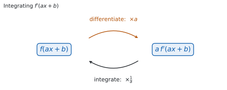

# SL 5.10 — Standard integrals, reverse chain rule and substitution（標準的な不定積分・逆連鎖律・置換積分） {#sec-aasl-5-10}

::: {.callout-note}
## What you should be able to do
- $x^{n}$、$\dfrac{1}{x}$、$\sin x$、$\cos x$、$e^{x}$ の不定積分を書ける。
- 根号や分数を、**まず指数の形に直して**から積分できる。
- 中身が $ax + b$ のとき、**$\dfrac{1}{a}$ をかける**形を使える。
- $\displaystyle\int g'(x)\,f(g(x))\,dx$ の形を**見分けられる**。
- **逆連鎖律**（見て書く）で積分できる。
- **置換積分**（$u = g(x)$ と置く）で積分できる。
- 足りない定数を、**前に出して合わせられる**。
- $\dfrac{g'(x)}{g(x)}$ の形を、$\ln\lvert g(x)\rvert$ と書ける。
- 答えを**微分して確かめられる**。
:::

## The idea

### 1. standard integrals（標準的な $5$ つの形） {#standard}

**微分の表を、逆向きに読みます**（[SL 5.6](aasl-5-6.qmd#standard)）。

$$
\int x^{n}\,dx = \frac{x^{n+1}}{n+1} + C, \qquad n \ne -1
$$ {#eq-aasl510-power}

$$
\int \frac{1}{x}\,dx = \ln|x| + C
$$ {#eq-aasl510-ln}

$$
\int \sin x\,dx = -\cos x + C, \qquad \int \cos x\,dx = \sin x + C
$$ {#eq-aasl510-trig}

$$
\int e^{x}\,dx = e^{x} + C
$$ {#eq-aasl510-exp}

::: {.callout-important}
## この式は公式集にあります
公式集の **5.10** の欄に、@eq-aasl510-ln、@eq-aasl510-trig の $2$ 本、@eq-aasl510-exp が印刷されています。おぼえる必要はありませんが、**どこにあるかは知っておいてください。**
:::

**$\dfrac{1}{x}$ だけは @eq-aasl510-power が使えません**（$n = -1$ とすると $0$ で割ることになります）。**絶対値が付いているのは $x < 0$ の側もふくめるためで、定義域が $x > 0$ と分かっているときは $\ln x$ と書いてかまいません。**

**$+C$ を忘れないでください**（[SL 5.5](aasl-5-5.qmd#plusc)）。不定積分の答えには、必ず付けます。

**$\sin$ と $\cos$ の $x$ は radian（ラジアン）で測った角です**（[SL 5.6](aasl-5-6.qmd#standard)）。度で測った角には、この形は使えません。

### 2. rational exponents（指数が分数のとき） {#rational}

**@eq-aasl510-power は、$n$ が分数でも使えます。** シラバスは $n \in \mathbb{Q}$、つまり有理数まで認めています。

::: {.callout-important}
## この式は公式集にあります
@eq-aasl510-power は公式集の **5.5** の欄に、*Integral of $x^{n}$* として印刷されています（[SL 5.5](aasl-5-5.qmd#power)）。**5.10 の欄ではありません。**
:::

**やることは変わりません。** 指数を $1$ 増やして、その新しい指数で割ります。

| もとの形 | 指数の形 | 不定積分 |
|:--|:--|:--|
| $\sqrt{x}$ | $x^{\frac{1}{2}}$ | $\dfrac{2}{3}x^{\frac{3}{2}} + C$ |
| $\dfrac{1}{\sqrt{x}}$ | $x^{-\frac{1}{2}}$ | $2x^{\frac{1}{2}} + C$ |
| $\sqrt[3]{x}$ | $x^{\frac{1}{3}}$ | $\dfrac{3}{4}x^{\frac{4}{3}} + C$ |

: 分数の指数 {#tbl-aasl510-rational}

**分数で割るときは、逆数をかけます。** $\dfrac{3}{2}$ で割ることは、$\dfrac{2}{3}$ をかけることです。

**まず指数の形に直してください**（[SL 5.3](aasl-5-3.qmd#rewrite)）。根号や分数のままでは、@eq-aasl510-power にあてはめられません。

**根号があるときは、定義域に気をつけてください。** $\sqrt{x}$ が使えるのは $x \geq 0$、$\dfrac{1}{\sqrt{x}}$ が使えるのは $x > 0$ のところだけです。**このページでは、$n$ が整数でない $x^{n}$ は $x > 0$ の範囲で考えます。**

### 3. composing with $ax + b$（$ax + b$ との合成） {#linear}

**中身が $1$ 次式（$ax + b$）のとき**、つまり中身に $x^{2}$ や $\sin x$ のようなものが入っていないときは、最後に $\dfrac{1}{a}$ をかけます。

$$
\int f'(ax + b)\,dx = \frac{1}{a}f(ax + b) + C, \qquad a \ne 0
$$ {#eq-aasl510-linear}

**@eq-aasl510-linear は公式集にありません。** この形は自分で使えるようにしておいてください。

| 積分 | 答え |
|:--|:--|
| $\displaystyle\int (ax + b)^{n}\,dx$（$n \ne -1$） | $\dfrac{(ax + b)^{n+1}}{a(n + 1)} + C$ |
| $\displaystyle\int \frac{1}{ax + b}\,dx$ | $\dfrac{1}{a}\ln\lvert ax + b\rvert + C$ |
| $\displaystyle\int \sin(ax + b)\,dx$ | $-\dfrac{1}{a}\cos(ax + b) + C$ |
| $\displaystyle\int \cos(ax + b)\,dx$ | $\dfrac{1}{a}\sin(ax + b) + C$ |
| $\displaystyle\int e^{ax + b}\,dx$ | $\dfrac{1}{a}e^{ax + b} + C$ |

: $ax + b$ との合成 {#tbl-aasl510-linear}

**割るのは $a$ だけで、$b$ では割りません。** $b$ は中身にそのまま残します。$\displaystyle\int e^{5x - 1}\,dx$ なら、答えの中身も $5x - 1$ のままです。

**最後に、必ず微分して確かめてください。** 微分してもとの式にもどり、**$+C$ が書いてあれば**、その答えで合っています（[SL 5.6](aasl-5-6.qmd#chain)）。**これは自分でできる検算です。**

### 4. reverse chain rule（chain rule の逆を考える） {#inspection}

**たとえば、次の $2$ つです。**

$$
\int 3x^{2}\,\bigl(x^{3} - 4\bigr)^{5}dx, \qquad \int 4x\,\sin\bigl(x^{2}\bigr)\,dx
$$

**$1$ つ目は、合成関数の中身が $x^{3} - 4$ で、その derivative（導関数）$3x^{2}$ がかけてあります。** $2$ つ目は、合成関数の中身が $x^{2}$ で、その導関数 $2x$ が、$2$ 倍された $4x$ の形でかけてあります。

**このように、中身の導関数がかけ算でくっついている形を探します。**

$$
\int g'(x)\,f(g(x))\,dx
$$ {#eq-aasl510-form}

**$g(x)$ が「合成関数の中身」、$g'(x)$ が「中身の導関数」、$f$ が「外側の関数」です。** 中身は、かっこの中、根号の中、$\sin$ や $e$ の右にあるものです。それを微分したものが（定数倍のちがいを除いて）かけてあるかどうかを見ます。**中身が $ax + b$ のときは、[第 3 節](#linear) の形で足ります。**

**この形は、chain rule で微分したあとの姿です**（[SL 5.6](aasl-5-6.qmd#chain)）。合成関数を微分すると、外側を微分したものに、中身の導関数 $g'(x)$ がかかります。かけてある $g'(x)$ は、その「微分したときに出てきた分」です。

**だから、外側だけを積分して、中身はそのままにします。** $g'(x)$ は役目を終えるので、答えには残りません。

はじめの例 $\displaystyle\int 3x^{2}\bigl(x^{3} - 4\bigr)^{5}dx$ でやってみます。外側は $5$ 乗なので、積分すると $6$ 乗を $6$ で割った形です。中身は $x^{3} - 4$ のままにします。

$$
\int 3x^{2}\bigl(x^{3} - 4\bigr)^{5}dx = \frac{\bigl(x^{3} - 4\bigr)^{6}}{6} + C
$$

**必ず微分して確かめてください。** これが自分でできる検算です。

$$
\frac{d}{dx}\frac{\bigl(x^{3} - 4\bigr)^{6}}{6} = \frac{6\bigl(x^{3} - 4\bigr)^{5} \times 3x^{2}}{6} = 3x^{2}\bigl(x^{3} - 4\bigr)^{5}
$$

### 5. the $\dfrac{g'(x)}{g(x)}$ form（対数になる形） {#logform}

**分子が分母の導関数なら、答えは $\ln$ です。**

$$
\int \frac{g'(x)}{g(x)}\,dx = \ln\lvert g(x)\rvert + C
$$ {#eq-aasl510-log}

**@eq-aasl510-log は、@eq-aasl510-form で $f(u) = \dfrac{1}{u}$ とした場合です。** 新しい規則ではありません（[第 1 節](#standard)）。

**定義域から $g(x) > 0$ と分かるときだけ、絶対値を外して $\ln g(x)$ と書けます**（[第 1 節](#standard)）。**分からないときは $\ln\lvert g(x)\rvert$ のままにしてください。** $g(x)$ が負になる範囲もあるからです。

分子と分母がこの関係になっている例を $1$ つ見ておきます。分母を $g(x) = \cos x$ とすると $g'(x) = -\sin x$ なので、分子は $-g'(x)$ です。

$$
\int \frac{\sin x}{\cos x}\,dx = -\ln\lvert\cos x\rvert + C
$$ {#eq-aasl510-tan}

**@eq-aasl510-tan の負号は、$-g'(x)$ の $-$ です。** 分子が $g'(x)$ の$-1$ 倍だから、答えにも $-$ が付きます。

### 6. adjusting the constant（定数を合わせる） {#constant}

**$g'(x)$ がぴったりでなくても、定数倍なら直せます。** 定数は積分の外に出せるからです（[SL 5.5](aasl-5-5.qmd#sum)）。次の $3$ つが典型です（@tbl-aasl510-constant）。

| 見えている形 | 中身 $g(x)$ | $g'(x)$ | 不定積分 |
|:--|:--|:--|:--|
| $x\left(x^{2}+1\right)^{3}$ | $x^{2}+1$ | $2x$ | $\dfrac{\left(x^{2}+1\right)^{4}}{8} + C$ |
| $x^{4}\left(x^{5}+2\right)^{3}$ | $x^{5}+2$ | $5x^{4}$ | $\dfrac{\left(x^{5}+2\right)^{4}}{20} + C$ |
| $\dfrac{x}{x^{2}+3}$ | $x^{2}+3$ | $2x$ | $\dfrac{1}{2}\ln\left(x^{2}+3\right) + C$ |

: 定数を合わせる {#tbl-aasl510-constant}

**どれも、見えている形が $g'(x)$ の定数倍になっています。** $1$ つ目は $x = \dfrac{1}{2} \times 2x$、$2$ つ目は $x^{4} = \dfrac{1}{5} \times 5x^{4}$、$3$ つ目は分子の $x$ が $\dfrac{1}{2} \times 2x$ です。**その分だけ、答えにも $\dfrac{1}{2}$ や $\dfrac{1}{5}$ がかかります。**

**$3$ つ目に絶対値が要らないのは、$x^{2}+3$ がつねに正だからです**（[第 5 節](#logform)）。

**$x$ を含むものは、外に出せません。** $\dfrac{1}{x}$ や $\dfrac{1}{2x}$ を積分の外に出すことはできません。

### 7. integration by substitution（置換積分） {#substitution}

**[第 4 節](#inspection) で見て書いた積分は、別のやり方でも解けます。** それが integration by substitution（置換積分）です。**合成関数の中身を $u$ と置くのがコツです。**

$$
u = g(x), \qquad \frac{du}{dx} = g'(x), \qquad du = g'(x)\,dx
$$ {#eq-aasl510-du}

**$g'(x)\,dx$ のかたまりを、まるごと $du$ に置きかえるのが要点です。** $dx$ だけを $du$ に書き替えるのではありません。

同じ例 $\displaystyle\int 3x^{2}\bigl(x^{3} - 4\bigr)^{5}dx$ でやってみます。中身が $x^{3} - 4$ なので、$u = x^{3} - 4$ と置きます。微分すると $\dfrac{du}{dx} = 3x^{2}$ なので、$du = 3x^{2}\,dx$ です。

$$
\int \bigl(x^{3} - 4\bigr)^{5}\,3x^{2}\,dx = \int u^{5}\,du = \frac{u^{6}}{6} + C
$$

**最後に $u = x^{3} - 4$ をもどします。** 答えは $\dfrac{\bigl(x^{3} - 4\bigr)^{6}}{6} + C$ で、[第 4 節](#inspection) で見て書いたものと同じです。

**$x$ が $1$ つでも残っていたら、まだ積分できません。** すべて $u$ で書けてから積分します。**$u$ が残ったままでも、もとの積分の答えになっていません。** $u = g(x)$ をもどすところまでが答えです。

### 8. choosing $u$（$u$ の選び方） {#choose}

**$u$ には「中身」を選びます。** 外側ではありません。かっこの中、根号の中、$\sin$ や $e$ の右、分数の分母が候補です。

**選んだ $u$ を微分して、その形が式の中にあるか確かめてください。** なければ、その選び方はうまくいきません。

**$g'(x)$ がまったくないときは、この方法は使えません。** たとえば $\displaystyle\int \left(x^{2}+3\right)^{2}dx$ には $2x$ がかかっていないので、$u = x^{2}+3$ と置いても $dx$ を $du$ に直せません。**この積分は展開して求めます。**

**中身が $ax+b$ でもなく、$g'(x)$ もかかっていないときは、置換以外の手を考えます。** かっこを展開できるものは、展開して項ごとに積分します。$\displaystyle\int \cos(x^{2})\,dx$ のように展開もできないものは、AA SL の範囲では原始関数を書けません。

::: {.callout-warning}
## この項目は電卓なしで解きます
逆連鎖律も置換積分も、手で計算する方法です。**Paper 1 の項目です。**

**置換で解いたときは、$u$ と $du$ を書いた行を答案に残してください。** 見て書いたとき（[第 4 節](#inspection)）は、答えを書いてから微分して確かめた行を残します。**どちらでも、途中の式が読み手に見える形にします。**
:::

::: {.callout-note collapse="true"}
## 電卓が使えるときは、こう確かめます
もとの被積分関数のグラフと、自分の答えを微分したもののグラフを重ねてかくと、$2$ つが同じ曲線になるかどうかが見えます。

**それでも、答案には手で書いた式が要ります。** 電卓は確かめに使ってください。
:::

## Why it works

::: {.callout-tip collapse="true"}
## クリックすると開きます

{#fig-aasl510-linear width=100%}

**なぜ、$\displaystyle\int \frac{1}{x}\,dx$ に絶対値が付くのでしょうか。** $x < 0$ の側も表したいからです。

$x > 0$ では $\dfrac{d}{dx}\ln x = \dfrac{1}{x}$ です（[SL 5.6](aasl-5-6.qmd#standard)）。$x < 0$ のときは $-x > 0$ なので $\ln(-x)$ が使えて、連鎖律で微分すると次のようになります。

$$
\frac{d}{dx}\ln(-x) = \frac{1}{-x} \times (-1) = \frac{1}{x}
$$

**どちらの側でも、導関数は $\dfrac{1}{x}$ です。** $2$ つをまとめて書いたものが $\ln|x|$ です。

**なぜ、$\displaystyle\int \sin x\,dx$ に負号が付くのでしょうか。** 微分して確かめれば分かります。

原始関数の候補を $\cos x$ にしてみます。$\dfrac{d}{dx}\cos x = -\sin x$ なので、これでは $\sin x$ ではなく $-\sin x$ にもどってしまいます。**符号を合わせるために、$-\cos x$ のほうを選びます。** $\dfrac{d}{dx}(-\cos x) = \sin x$ です。

**なぜ、$ax + b$ の合成には $\dfrac{1}{a}$ が要るのでしょうか。** 微分すると $a$ がかかるからです。

連鎖律で $f(ax + b)$ を微分すると、中身の導関数 $a$ がかかります（[SL 5.6](aasl-5-6.qmd#chain)）。

$$
\frac{d}{dx}f(ax + b) = a\,f'(ax + b)
$$

**よけいな $a$ を打ち消すために、$\dfrac{1}{a}$ をかけておきます**（@fig-aasl510-linear）。$\dfrac{1}{a}$ は定数なので、微分してもそのまま残ります。

$$
\frac{d}{dx}\left(\frac{1}{a}f(ax + b)\right) = \frac{1}{a} \times a\,f'(ax + b) = f'(ax + b)
$$

**なぜ、中身が $x^{2}$ ではだめなのでしょうか。** $\dfrac{1}{2x}$ が定数ではないからです。

$\dfrac{1}{a}$ を前に出せたのは、$a$ が定数だったからです。中身が $x^{2}$ なら、かかるのは $2x$ で、$x$ を含みます。**$x$ を含むものを、積分の外には出せません。**

**なぜ、$g'(x)$ がかかっていると積分できるのでしょうか。** 連鎖律が、ちょうどその形を作るからです。

$F' = f$ となる $F$ があるとき、$F(g(x))$ を微分すると次のようになります（[SL 5.6](aasl-5-6.qmd#chain)）。

$$
\frac{d}{dx}F(g(x)) = F'(g(x)) \times g'(x) = g'(x)\,f(g(x))
$$

**右辺が、まさに見分けたい形です。** だから、その積分は $F(g(x)) + C$ です。

**なぜ、$du = g'(x)\,dx$ と書いてよいのでしょうか。** 上の計算を、記号で短く書いたものだからです。

$u = g(x)$ とすると $\dfrac{du}{dx} = g'(x)$ です。ここで $du$ と $dx$ を別々の数のように動かすのは、**連鎖律の計算を短く書くための記法**です。分数の計算をしているわけではありませんが、AA SL ではこの書き方でかまいません。

**なぜ、$g'(x)$ がないと使えないのでしょうか。** 定数しか外に出せないからです。

$\displaystyle\int \sqrt{x^{2}+1}\,dx$ で $u = x^{2}+1$ と置くと $du = 2x\,dx$ ですが、式に $2x$ がありません。$dx = \dfrac{du}{2x}$ と書いても $x$ が残り、**$x$ を含むものは積分の外に出せません**（[第 6 節](#constant)）。

**なぜ、$\displaystyle\int \frac{g'(x)}{g(x)}\,dx$ が $\ln$ になるのでしょうか。** $f(u) = \dfrac{1}{u}$ の場合だからです。

$\dfrac{g'(x)}{g(x)}$ は $g'(x) \times \dfrac{1}{g(x)}$ です。$\dfrac{1}{u}$ の原始関数は $\ln\lvert u\rvert$ なので（[第 1 節](#standard)）、答えは $\ln\lvert g(x)\rvert + C$ になります。
:::

## Worked examples

::: {.callout-note appearance="simple"}
問題文は英語です。意味が理解できなかったら、問題文の下の「**日本語訳**」を開いてください。解説は日本語です。

**例題 $1$・$2$ は標準的な形と $ax + b$、例題 $3$・$4$ は逆連鎖律と置換積分です。**
:::

::: {#exm-aasl510-standard}
[Find $\displaystyle\int \left(\frac{3}{x} + 2e^{x} - \sin x\right)dx$.]{.q-en}

日本語訳

$\displaystyle\int \left(\frac{3}{x} + 2e^{x} - \sin x\right)dx$ を求めなさい。

---

**項ごとに、@eq-aasl510-ln から @eq-aasl510-exp を使います**（[第 1 節](#standard)）。

$$
\int \frac{3}{x}\,dx = 3\ln|x|
$$

$$
\int 2e^{x}\,dx = 2e^{x}
$$

$$
\int (-\sin x)\,dx = \cos x
$$

$$
\int \left(\frac{3}{x} + 2e^{x} - \sin x\right)dx = 3\ln|x| + 2e^{x} + \cos x + C
$$

**検算（符号）。** $\dfrac{d}{dx}\cos x = -\sin x$ ✓ もとの $-\sin x$ にもどりました。

**検算（$x < 0$ でも）。** $x < 0$ では $\ln|x| = \ln(-x)$ で、微分すると $\dfrac{1}{-x} \times (-1) = \dfrac{1}{x}$ ✓ 負の側でも、もとの $\dfrac{3}{x}$ にもどります（[第 1 節](#standard)）。

**検算（$e^{x}$）。** $\dfrac{d}{dx}(2e^{x}) = 2e^{x}$ ✓ 変わらないのが $e^{x}$ の性質です。

**検算（定数を足しても）。** $3\ln|x| + 2e^{x} + \cos x + 7$ を微分しても同じ式にもどります ✓ 定数が決まらないので、$C$ を残します。

::: {.callout-note}
## 解答例（答案用紙に書くこと）
$$\int \left(\frac{3}{x} + 2e^{x} - \sin x\right)dx = 3\ln|x| + 2e^{x} + \cos x + C$$

:::
:::

::: {#exm-aasl510-linear}
[Find each of the following.]{.q-en}

**(a)** [$\displaystyle\int \cos(3x - 1)\,dx$]{.q-en}

**(b)** [$\displaystyle\int e^{5x - 1}\,dx$]{.q-en}

日本語訳

次のそれぞれを求めなさい。

**(a)** $\displaystyle\int \cos(3x - 1)\,dx$

**(b)** $\displaystyle\int e^{5x - 1}\,dx$

---

**(a)** 中身は $3x - 1$ なので $a = 3$ です（[第 3 節](#linear)）。$\cos$ の積分は $\sin$ で、それに $\dfrac{1}{3}$ をかけます。

$$
\int \cos(3x - 1)\,dx = \frac{1}{3}\sin(3x - 1) + C
$$

**(b)** 中身は $5x - 1$ なので $a = 5$ です。$e^{x}$ の積分は $e^{x}$ のままで、$\dfrac{1}{5}$ をかけます。

$$
\int e^{5x - 1}\,dx = \frac{1}{5}e^{5x - 1} + C
$$

**検算（(a) を微分して）。** $\dfrac{d}{dx}\left(\dfrac{1}{3}\sin(3x - 1)\right) = \dfrac{1}{3} \times 3\cos(3x - 1) = \cos(3x - 1)$ ✓

**検算（(b) を微分して）。** $\dfrac{d}{dx}\left(\dfrac{1}{5}e^{5x - 1}\right) = \dfrac{1}{5} \times 5e^{5x - 1} = e^{5x - 1}$ ✓

**検算（中身を落としたら）。** もし $\dfrac{1}{3}\sin(3x)$ と書くと、微分して $\cos(3x)$ になり、もとの $\cos(3x - 1)$ とはちがう関数です ✓ 中身の $-1$ は落とせません。

**検算（かけるのは $\dfrac{1}{a}$）。** $a = 3$ なら $\dfrac{1}{3}$、$a = 5$ なら $\dfrac{1}{5}$ です ✓ $3$ や $5$ をかけるのではありません。

::: {.callout-note}
## 解答例（答案用紙に書くこと）
**(a)**
$$\int \cos(3x - 1)\,dx = \frac{1}{3}\sin(3x - 1) + C$$

**(b)**
$$\int e^{5x - 1}\,dx = \frac{1}{5}e^{5x - 1} + C$$

:::
:::

::: {#exm-aasl510-inspection}
[Find $\displaystyle\int 6x\left(x^{2} + 5\right)^{3}dx$.]{.q-en}

日本語訳

$\displaystyle\int 6x\left(x^{2} + 5\right)^{3}dx$ を求めなさい。

---

**中身は $x^{2} + 5$ です**（[第 4 節](#inspection)）。これを微分すると $2x$ で、式には $6x$ があります。

$$
6x = 3 \times 2x
$$

$u = x^{2} + 5$、$du = 2x\,dx$ と置きます（[第 7 節](#substitution)）。

$$
\int 6x\left(x^{2} + 5\right)^{3}dx = 3\int u^{3}\,du = \frac{3u^{4}}{4} + C
$$

$u$ をもどします。

$$
\int 6x\left(x^{2} + 5\right)^{3}dx = \frac{3\left(x^{2} + 5\right)^{4}}{4} + C
$$

**検算（微分して）。** $\dfrac{d}{dx}\left(\dfrac{3(x^{2}+5)^{4}}{4}\right) = \dfrac{3}{4} \times 4(x^{2}+5)^{3} \times 2x = 6x(x^{2}+5)^{3}$ ✓ もとの式にもどりました。

**検算（$3$ の出どころ）。** $3 \times 2x = 6x$ です ✓ この $3$ が積分の外に出た定数です。

**検算（$x$ にもどしたか）。** 答えに $u$ が残っていません ✓

**検算（展開しても合うか）。** $6x(x^{2}+5)^{3}$ を展開すると $6x^{7} + 90x^{5} + 450x^{3} + 750x$ で、項ごとに積分すると $\dfrac{3}{4}x^{8} + 15x^{6} + \dfrac{225}{2}x^{4} + 375x^{2}$ です。答えを展開したものとは**定数だけ**ちがいます ✓ 原始関数は定数のちがいを除いて決まるので、これで合っています。

::: {.callout-note}
## 解答例（答案用紙に書くこと）
$$u = x^{2} + 5, \quad du = 2x\,dx$$
$$\int 6x\left(x^{2} + 5\right)^{3}dx = 3\int u^{3}\,du = \frac{3u^{4}}{4} + C$$
$$= \frac{3\left(x^{2} + 5\right)^{4}}{4} + C$$

:::
:::

::: {#exm-aasl510-two}
[Find each of the following.]{.q-en}

**(a)** [$\displaystyle\int x\,e^{x^{2}}\,dx$]{.q-en}

**(b)** [$\displaystyle\int \frac{2x + 3}{x^{2} + 3x + 1}\,dx$]{.q-en}

日本語訳

次のそれぞれを求めなさい。

**(a)** $\displaystyle\int x\,e^{x^{2}}\,dx$

**(b)** $\displaystyle\int \frac{2x + 3}{x^{2} + 3x + 1}\,dx$

---

**(a)** 中身は $e$ の肩の $x^{2}$ です。微分すると $2x$ で、式には $x$ があります。

$$
u = x^{2}, \qquad du = 2x\,dx, \qquad x\,dx = \frac{1}{2}\,du
$$

$$
\int x\,e^{x^{2}}\,dx = \frac{1}{2}\int e^{u}\,du = \frac{1}{2}e^{u} + C = \frac{1}{2}e^{x^{2}} + C
$$

**(b)** 分母を $g(x) = x^{2} + 3x + 1$ とすると、$g'(x) = 2x + 3$ です。分子がちょうどそれになっています（[第 5 節](#logform)）。

$$
\int \frac{2x + 3}{x^{2} + 3x + 1}\,dx = \ln\lvert x^{2} + 3x + 1\rvert + C
$$

**検算（(a) を微分して）。** $\dfrac{d}{dx}\left(\dfrac{1}{2}e^{x^{2}}\right) = \dfrac{1}{2}e^{x^{2}} \times 2x = x\,e^{x^{2}}$ ✓

**検算（(b) を微分して）。** $\dfrac{d}{dx}\ln\lvert x^{2}+3x+1\rvert = \dfrac{2x+3}{x^{2}+3x+1}$ ✓

**検算（(b) の絶対値）。** $x^{2} + 3x + 1$ は判別式が $9 - 4 = 5 > 0$ なので、負になる範囲があります ✓ 絶対値を落とせません。

**検算（(a) で $e^{x^{2}}$ の中身）。** 答えの肩も $x^{2}$ のままです ✓ $u$ が残っていません。

::: {.callout-note}
## 解答例（答案用紙に書くこと）
**(a)**
$$u = x^{2}, \quad du = 2x\,dx$$
$$\int x\,e^{x^{2}}\,dx = \frac{1}{2}\int e^{u}\,du = \frac{1}{2}e^{x^{2}} + C$$

**(b)**
$$\int \frac{2x + 3}{x^{2} + 3x + 1}\,dx = \ln\lvert x^{2} + 3x + 1\rvert + C$$

:::
:::

## Common errors

::: {.callout-warning}
## $\displaystyle\int \frac{1}{x}\,dx$ を $\ln x$ と書く
定義域が $x > 0$ と分かっていないかぎり、$\ln|x|$ が要ります（[第 1 節](#standard)）。
:::

::: {.callout-warning}
## $\displaystyle\int \sin x\,dx$ を $\cos x$ と書く
負号が付いて $-\cos x + C$ です（[第 1 節](#standard)）。微分して確かめてください。
:::

::: {.callout-warning}
## $ax + b$ の合成で $\dfrac{1}{a}$ をかけ忘れる
中身を写すだけでは足りません（[第 3 節](#linear)）。微分すると $a$ が余ります。
:::

::: {.callout-warning}
## $\dfrac{1}{a}$ ではなく $a$ をかける
微分で $a$ がかかるので、積分では $a$ で**割ります**（[第 3 節](#linear)）。
:::

::: {.callout-warning}
## 中身が $ax + b$ でないのに $\dfrac{1}{a}$ の形を使う
$\dfrac{1}{a}$ を前に出せるのは、$a$ が定数のときだけです（[第 3 節](#linear)）。
:::

::: {.callout-warning}
## 根号のまま積分しようとする
先に $\sqrt{x} = x^{\frac{1}{2}}$ のように指数の形へ直します（[第 2 節](#rational)）。
:::

::: {.callout-warning}
## $g'(x)$ がないのに、逆連鎖律を使う
中身の導関数がかかっていることが条件です（[第 4 節](#inspection)）。$\displaystyle\int \left(x^{2}+3\right)^{2}dx$ には使えません。
:::

::: {.callout-warning}
## 定数を合わせ忘れる
$du = g'(x)\,dx$ の行を書けば、必要な定数が見えます（[第 6 節](#constant)）。
:::

::: {.callout-warning}
## $u$ のままで答えを書く
最後に $u = g(x)$ をもどします（[第 7 節](#substitution)）。$x$ の式にするまでが答えです。
:::

::: {.callout-warning}
## $dx$ を $du$ に直さないまま積分する
$dx$ が残っていると、$u$ で積分できません（[第 7 節](#substitution)）。
:::

::: {.callout-warning}
## $\displaystyle\int \frac{g'(x)}{g(x)}\,dx$ で絶対値を落とす
$g(x)$ が負になる範囲もあります（[第 5 節](#logform)）。
:::

::: {.callout-warning}
## $x$ を含むものを、積分の外に出す
外に出せるのは定数だけです（[第 6 節](#constant)）。$\dfrac{1}{2x}$ は出せません。
:::

## Exercises

::: {.callout-note appearance="simple"}
各問題に、折りたたみが $3$ つ付いています。**日本語訳**、**解答例**（答案用紙に書くべきこと。英語です。英語の答案例が付くものもあります）、**解説**（なぜそうなるか。日本語です）。

まず自分で解いて、次に解答例と見くらべてください。**解説は、合わなかったときだけ開けば十分です。**
:::

::: {.exercise-block}

[1]{.ex-no} [Find $\displaystyle\int \left(\frac{2}{\sqrt{x}} - x^{3}\right)dx$, for $x > 0$.]{.q-en}

日本語訳

$x > 0$ のとき、$\displaystyle\int \left(\frac{2}{\sqrt{x}} - x^{3}\right)dx$ を求めなさい。

::: {.callout-note collapse="true"}
## 解答例（答案用紙に書くこと）

$$\frac{2}{\sqrt{x}} - x^{3} = 2x^{-\frac{1}{2}} - x^{3}$$

$$\int \left(2x^{-\frac{1}{2}} - x^{3}\right)dx = 4\sqrt{x} - \frac{x^{4}}{4} + C$$

:::

::: {.callout-tip collapse="true"}
## 解説

指数が**負の分数**でも、やることは変わりません（[第 2 節](#rational)）。$-\dfrac{1}{2} + 1 = \dfrac{1}{2}$ で、$\dfrac{1}{2}$ で割ることは $2$ をかけることです。

**検算（微分して）。** $\dfrac{d}{dx}\left(4x^{\frac{1}{2}}\right) = 4 \times \dfrac{1}{2}x^{-\frac{1}{2}} = 2x^{-\frac{1}{2}}$ ✓ もとの第 $1$ 項にもどりました。

**検算（第 $2$ 項）。** $\dfrac{d}{dx}\left(-\dfrac{x^{4}}{4}\right) = -x^{3}$ ✓

**検算（指数が $1$ 増えたか）。** $-\dfrac{1}{2}$ が $\dfrac{1}{2}$ に、$3$ が $4$ になっています ✓

**検算（定義域）。** $\dfrac{1}{\sqrt{x}}$ が使えるのは $x > 0$ のところだけです ✓ 問題文の条件と合っています。
:::

::: {.ex-sep}
:::

[2]{.ex-no} [Find $\displaystyle\int \sqrt{4x + 1}\,dx$.]{.q-en}

日本語訳

$\displaystyle\int \sqrt{4x + 1}\,dx$ を求めなさい。

::: {.callout-note collapse="true"}
## 解答例（答案用紙に書くこと）

$$\sqrt{4x + 1} = (4x + 1)^{\frac{1}{2}}$$

$$\int \sqrt{4x + 1}\,dx = \frac{(4x + 1)^{\frac{3}{2}}}{6} + C$$

:::

::: {.callout-tip collapse="true"}
## 解説

指数の形に直してから、@tbl-aasl510-linear の $1$ 行目を使います。$n = \dfrac{1}{2}$、$a = 4$ なので、割る数は $a(n + 1) = 4 \times \dfrac{3}{2} = 6$ です。

**検算（微分して）。** $\dfrac{d}{dx}\left(\dfrac{(4x + 1)^{\frac{3}{2}}}{6}\right) = \dfrac{1}{6} \times \dfrac{3}{2}(4x + 1)^{\frac{1}{2}} \times 4 = (4x + 1)^{\frac{1}{2}}$ ✓

**検算（規則を $2$ つ使う）。** 分数の指数（[第 2 節](#rational)）と $ax + b$（[第 3 節](#linear)）の両方が要ります ✓ どちらか一方だけでは足りません。

**検算（定義域）。** $\sqrt{4x + 1}$ が使えるのは $4x + 1 \geq 0$、つまり $x \geq -\dfrac{1}{4}$ のところです ✓
:::

::: {.ex-sep}
:::

[3]{.ex-no} [Find $\displaystyle\int \frac{1}{5x - 2}\,dx$.]{.q-en}

日本語訳

$\displaystyle\int \frac{1}{5x - 2}\,dx$ を求めなさい。

::: {.callout-note collapse="true"}
## 解答例（答案用紙に書くこと）

$$\int \frac{1}{5x - 2}\,dx = \frac{1}{5}\ln\lvert 5x - 2\rvert + C$$

:::

::: {.callout-tip collapse="true"}
## 解説

@eq-aasl510-ln に合成の $\dfrac{1}{5}$ をかけます（[第 3 節](#linear)）。

**検算（微分して）。** $\dfrac{d}{dx}\left(\dfrac{1}{5}\ln\lvert 5x - 2\rvert\right) = \dfrac{1}{5} \times \dfrac{5}{5x - 2} = \dfrac{1}{5x - 2}$ ✓

**検算（絶対値）。** 定義域の指定がないので、$5x - 2 < 0$ の側も表せる形にします ✓

**検算（指数の公式を使っていないか）。** 指数が $-1$ なので @eq-aasl510-power は使えません ✓（[第 1 節](#standard)）。
:::

::: {.ex-sep}
:::

[4]{.ex-no} [A curve is defined for $x > 0$, and its gradient is given by $\dfrac{dy}{dx} = \dfrac{2}{x} + e^{x}$. The curve passes through the point $(1, 4)$. Find $y$ in terms of $x$.]{.q-en}

日本語訳

ある曲線が $x > 0$ で定義され、その傾きは $\dfrac{dy}{dx} = \dfrac{2}{x} + e^{x}$ です。この曲線は点 $(1, 4)$ を通ります。$y$ を $x$ の式で表しなさい。

::: {.callout-note collapse="true"}
## 解答例（答案用紙に書くこと）

$$y = 2\ln x + e^{x} + C$$

$$2\ln 1 + e + C = 4 \quad \Rightarrow \quad C = 4 - e$$

$$y = 2\ln x + e^{x} + 4 - e$$

:::

::: {.callout-tip collapse="true"}
## 解説

積分してから、通る点を代入して $C$ を決めます（[SL 5.5](aasl-5-5.qmd#boundary)）。

**検算（絶対値を外してよい理由）。** 定義域が $x > 0$ なので $\ln x$ と書けます ✓（[第 1 節](#standard)）。

**検算（$\ln 1$）。** $\ln 1 = 0$ なので、残るのは $e + C = 4$ です ✓

**検算（微分して）。** $\dfrac{d}{dx}\left(2\ln x + e^{x} + 4 - e\right) = \dfrac{2}{x} + e^{x}$ ✓ $4 - e$ は定数なので消えます。

**検算（$C$ の形）。** $4 - e$ は $1$ つの数です ✓ $e$ は約 $2.718$ なので、$C$ は約 $1.28$ です。
:::

::: {.ex-sep}
:::

[5]{.ex-no} [A student writes $\displaystyle\int \cos(2x)\,dx = 2\sin(2x) + C$. Identify the error and give the correct answer.]{.q-en}

日本語訳

ある生徒が $\displaystyle\int \cos(2x)\,dx = 2\sin(2x) + C$ と書きました。誤りを指摘し、正しい答えを書きなさい。

::: {.callout-note collapse="true"}
## 解答例（答案用紙に書くこと）

*the student multiplied by $a$ instead of dividing by $a$*

$$\int \cos(2x)\,dx = \frac{1}{2}\sin(2x) + C$$

:::

::: {.callout-tip collapse="true"}
## 解説

合成のときにかけるのは $\dfrac{1}{a}$ です（[第 3 節](#linear)）。

**検算（生徒の答えを微分して）。** $\dfrac{d}{dx}\bigl(2\sin(2x)\bigr) = 4\cos(2x)$ ✓ もとの式の $4$ 倍になってしまいます。

**検算（正しい答えを微分して）。** $\dfrac{d}{dx}\left(\dfrac{1}{2}\sin(2x)\right) = \dfrac{1}{2} \times 2\cos(2x) = \cos(2x)$ ✓

**検算（ずれの大きさ）。** $\dfrac{1}{2}$ をかけるべきところを $2$ にしたので、生徒の答えは正しい値の $4$ 倍になっています ✓ $2$ は $\dfrac{1}{2}$ の $4$ 倍だからです。

::: {.model-answer}
**試験ではこう書く**

*The student multiplied by $a$ instead of dividing by $a$. Here $a = 2$, so the factor should be $\frac{1}{2}$, not $2$. Differentiating $2\sin(2x)$ gives $4\cos(2x)$, not $\cos(2x)$. The correct answer is $\frac{1}{2}\sin(2x) + C$.*
:::
:::

::: {.ex-sep}
:::

[6]{.ex-no} [Find $\displaystyle\int \frac{\cos x}{2 + \sin x}\,dx$.]{.q-en}

日本語訳

$\displaystyle\int \frac{\cos x}{2 + \sin x}\,dx$ を求めなさい。

::: {.callout-note collapse="true"}
## 解答例（答案用紙に書くこと）

$$\int \frac{\cos x}{2 + \sin x}\,dx = \ln\left(2 + \sin x\right) + C$$

:::

::: {.callout-tip collapse="true"}
## 解説

分子が分母の導関数そのものです（[第 5 節](#logform)）。$g(x) = 2 + \sin x$ とすると $g'(x) = \cos x$ です。

**検算（微分して）。** $\dfrac{d}{dx}\ln\left(2+\sin x\right) = \dfrac{\cos x}{2+\sin x}$ ✓

**検算（絶対値を外してよい理由）。** $\sin x$ は $-1$ 以上なので、$2 + \sin x$ は $1$ 以上です ✓ つねに正なので、絶対値は要りません。

**検算（$0$ にならないか）。** $2 + \sin x$ が $0$ になることはありません ✓ どの $x$ でも使えます。
:::

::: {.ex-sep}
:::

[7]{.ex-no} [Find $\displaystyle\int \cos x\,e^{\sin x}\,dx$ by inspection, without writing a substitution. Verify your answer by differentiating it.]{.q-en}

日本語訳

$\displaystyle\int \cos x\,e^{\sin x}\,dx$ を、置きかえを書かずに「見て」求めなさい。答えを微分して、正しいことを確かめなさい。

::: {.callout-note collapse="true"}
## 解答例（答案用紙に書くこと）

$$\int \cos x\,e^{\sin x}\,dx = e^{\sin x} + C$$

$$\frac{d}{dx}e^{\sin x} = e^{\sin x} \times \cos x \ \checkmark$$

:::

::: {.callout-tip collapse="true"}
## 解説

$e$ の肩が中身で、その導関数 $\cos x$ がそのままかかっています（[第 4 節](#inspection)）。$e^{u}$ の原始関数は $e^{u}$ なので、中身を $\sin x$ のまま書けば終わりです。

**検算（微分して）。** $\dfrac{d}{dx}e^{\sin x} = e^{\sin x} \times \cos x$ ✓ もとの式にもどりました。

**検算（定数を落としていないか）。** $du = \cos x\,dx$ で、式の $\cos x\,dx$ がそのまま $du$ になります ✓ もし式が $2\cos x\,e^{\sin x}$ なら、答えは $2e^{\sin x} + C$ です。

**検算（肩を $u$ のままにしていないか）。** 答えの肩は $\sin x$ です ✓ $u$ が残っていたら、まだ答えになっていません。
:::

::: {.ex-sep}
:::

[8]{.ex-no} [Find $\displaystyle\int \frac{x}{\sqrt{x^{2} + 9}}\,dx$.]{.q-en}

日本語訳

$\displaystyle\int \frac{x}{\sqrt{x^{2} + 9}}\,dx$ を求めなさい。

::: {.callout-note collapse="true"}
## 解答例（答案用紙に書くこと）

$$u = x^{2} + 9, \quad du = 2x\,dx$$

$$\int \frac{x}{\sqrt{x^{2} + 9}}\,dx = \frac{1}{2}\int u^{-\frac{1}{2}}\,du = u^{\frac{1}{2}} + C$$

$$= \sqrt{x^{2} + 9} + C$$

:::

::: {.callout-tip collapse="true"}
## 解説

根号の中が中身です。$\dfrac{1}{\sqrt{u}} = u^{-\frac{1}{2}}$ と書き直してから積分します（[第 2 節](#rational)）。

**検算（微分して）。** $\dfrac{d}{dx}\sqrt{x^{2}+9} = \dfrac{1}{2}\left(x^{2}+9\right)^{-\frac{1}{2}} \times 2x = \dfrac{x}{\sqrt{x^{2}+9}}$ ✓

**検算（係数）。** $\dfrac{1}{2} \times 2 = 1$ です ✓ $u^{\frac{1}{2}}$ の前に係数が残りません。

**検算（指数）。** $-\dfrac{1}{2} + 1 = \dfrac{1}{2}$ ✓
:::

::: {.ex-sep}
:::

[9]{.ex-no} [Consider $\displaystyle\int \frac{6x^{2}}{\left(x^{3} + 2\right)^{2}}\,dx$.]{.q-en}

**(a)** [Write down a suitable substitution $u$, and find $du$.]{.q-en}

**(b)** [Write the integral in terms of $u$.]{.q-en}

**(c)** [Hence find the integral in terms of $x$.]{.q-en}

日本語訳

$\displaystyle\int \frac{6x^{2}}{\left(x^{3} + 2\right)^{2}}\,dx$ について考えます。

**(a)** 適切な置きかえ $u$ を書き、$du$ を求めなさい。

**(b)** この積分を $u$ の式で書きなさい。

**(c)** よって、この積分を $x$ の式で求めなさい。

::: {.callout-note collapse="true"}
## 解答例（答案用紙に書くこと）

**(a)**
$$u = x^{3} + 2, \quad du = 3x^{2}\,dx$$

**(b)**
$$2\int u^{-2}\,du$$

**(c)**
$$2 \times \frac{u^{-1}}{-1} + C = -\frac{2}{x^{3} + 2} + C$$

:::

::: {.callout-tip collapse="true"}
## 解説

$u$ を置き、$du$ を書き、定数を合わせてから積分します（[第 7 節](#substitution)）。分母は $u^{2}$ なので、$u^{-2}$ と書き直してから積分します。

**検算（(a) の $du$）。** $\dfrac{d}{dx}\left(x^{3}+2\right) = 3x^{2}$ ✓

**検算（(b) の $2$）。** $6x^{2} = 2 \times 3x^{2}$ です ✓

**検算（(c) を微分して）。** $\dfrac{d}{dx}\left(-2\left(x^{3}+2\right)^{-1}\right) = 2\left(x^{3}+2\right)^{-2} \times 3x^{2} = \dfrac{6x^{2}}{\left(x^{3}+2\right)^{2}}$ ✓

**検算（$\ln$ ではない）。** 分母が $2$ 乗なので、$\dfrac{g'}{g}$ の形ではありません ✓ 答えは $\ln$ になりません（[第 5 節](#logform)）。
:::

::: {.ex-sep}
:::

[10]{.ex-no} [Explain why $\displaystyle\int 2x\left(x^{2} + 1\right)^{4}dx$ can be found by substitution, but $\displaystyle\int \left(x^{2} + 1\right)^{4}dx$ cannot.]{.q-en}

日本語訳

$\displaystyle\int 2x\left(x^{2} + 1\right)^{4}dx$ は置換積分で求められるのに、$\displaystyle\int \left(x^{2} + 1\right)^{4}dx$ では求められない理由を説明しなさい。

::: {.callout-note collapse="true"}
## 解答例（答案用紙に書くこと）

*with $u = x^{2} + 1$, $du = 2x\,dx$, and the first integral already contains the factor $2x$*

*the second has no factor of $x$, so $dx$ cannot be replaced by $du$ without leaving an $x$*

*the second integral is found by expanding the bracket instead*

:::

::: {.callout-tip collapse="true"}
## 解説

置換積分ができるのは、$g'(x)$ がかかっているときだけです（[第 8 節](#choose)）。

**検算（$1$ つめ）。** $\dfrac{d}{dx}\dfrac{\left(x^{2}+1\right)^{5}}{5} = \left(x^{2}+1\right)^{4} \times 2x$ ✓ うまくいきます。

**検算（$2$ つめで試すと）。** $dx = \dfrac{du}{2x}$ と書いても $x$ が残ります ✓ $\dfrac{1}{2x}$ は定数ではないので、外に出せません（[第 6 節](#constant)）。

**検算（展開すると）。** $\left(x^{2}+1\right)^{4} = x^{8} + 4x^{6} + 6x^{4} + 4x^{2} + 1$ で、$5$ 項とも $x^{n}$ の公式で積分できます ✓（[第 2 節](#rational)）。

::: {.model-answer}
**試験ではこう書く**

*Substitution needs the derivative of the inside function to appear as a factor. With $u = x^{2}+1$ we have $du = 2x\,dx$, and the first integral contains exactly that factor $2x$, so it becomes $\int u^{4}\,du$. The second integral has no factor of $x$, so replacing $dx$ by $\frac{du}{2x}$ leaves an $x$ in the integrand, and only constants may be taken outside an integral. The second integral is found by expanding the bracket and integrating term by term.*
:::
:::

:::
