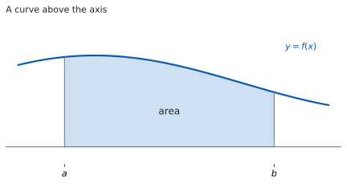
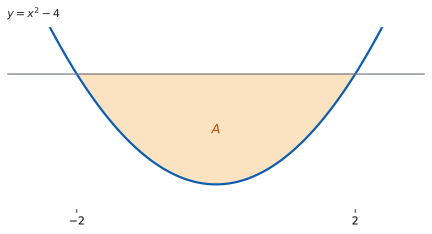
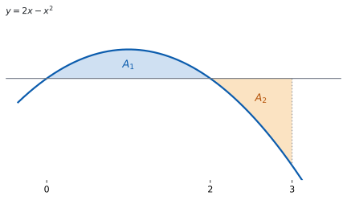
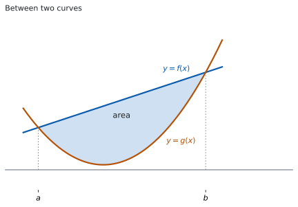

# SL 5.11 — Definite integrals and areas（定積分と面積） {#sec-aasl-5-11}

::: {.callout-note}
## What you should be able to do
- **definite integral**（定積分）と不定積分のちがいを説明できる。
- 角かっこ $\bigl[F(x)\bigr]_{a}^{b}$ の書き方で、値を手で求められる。
- **$+C$ が要らない理由**を説明できる。
- 上端と下端を**入れかえたときの符号**、**区間を分ける**書き方を使える。
- $f(x) > 0$ のときの面積を、定積分で書ける。
- $f(x) < 0$ のとき、**面積は積分の値の $-1$ 倍**になることを説明できる。
- $A = \displaystyle\int_{a}^{b} \lvert y\rvert\,dx$ が公式集のどこにあるかを知っている。
- **符号の変わる点で区間を分けて**、面積を求められる。
- $2$ 曲線ではさまれた面積を、**上の式 $-$ 下の式**で書ける。
- 置換したときに、**上端・下端も $u$ に直せる**。
:::

## The idea

### 1. definite integral（定積分） {#what}

**definite integral（定積分）とは、関数を $a \leq x \leq b$ の範囲で積分して、$1$ つの数を出すものです。**

**その数は、antiderivative（原始関数）$F$ の両端での差です。** $F' = f$ となる $F$ を求め、答案では角かっこに入れて書きます。

$$
\int_{a}^{b} f(x)\,dx = \bigl[F(x)\bigr]_{a}^{b} = F(b) - F(a)
$$ {#eq-aasl511-bracket}

**$a$ を lower limit（下端）、$b$ を upper limit（上端）といいます。**

**引く順番は「上端 $-$ 下端」です。** $F(a) - F(b)$ と書くと、符号が逆になります。

**$+C$ は書きません。** 書いても引き算で消えるからです。

### 2. limits of integration（上端・下端の性質） {#props}

**定積分には、計算が短くなる性質が $3$ つあります。**

**$1$ つ目。上下を入れかえると、符号が変わります。**

$$
\int_{b}^{a} f(x)\,dx = -\int_{a}^{b} f(x)\,dx
$$ {#eq-aasl511-swap}

**$2$ つ目。途中の点 $c$ で、区間を分けられます。**

$$
\int_{a}^{b} f(x)\,dx = \int_{a}^{c} f(x)\,dx + \int_{c}^{b} f(x)\,dx
$$ {#eq-aasl511-split}

**$3$ つ目。上端と下端が同じなら、値は $0$ です。**

$$
\int_{a}^{a} f(x)\,dx = 0
$$ {#eq-aasl511-zero}

**定数倍と和は、不定積分と同じです**（[SL 5.5](aasl-5-5.qmd#sum)）。

$$
\int_{a}^{b}\bigl(f(x) + g(x)\bigr)dx = \int_{a}^{b} f(x)\,dx + \int_{a}^{b} g(x)\,dx
$$

$$
\int_{a}^{b} kf(x)\,dx = k\int_{a}^{b} f(x)\,dx
$$

### 3. area under a curve（$x$ 軸より上のとき） {#positive}

{#fig-aasl511-area width=100%}

**曲線が $x$ 軸より上にあるときは、定積分がそのまま面積です**（@fig-aasl511-area、[SL 5.5](aasl-5-5.qmd#area)）。**ここでいう面積は、曲線 $y = f(x)$、$x$ 軸、そして $2$ 本のたての直線 $x = a$、$x = b$ で囲まれた部分の面積です。**

$$
A = \int_{a}^{b} f(x)\,dx, \qquad f(x) \geq 0 \text{ on } a \leq x \leq b
$$ {#eq-aasl511-pos}

**条件が付いていることに気をつけてください。** 区間の中で $f$ が負になるところがあると、この式は面積になりません。$f(x) = 0$ になる点があるのはかまいません。

**上端・下端が問題文にないこともあります。** `the region enclosed by the curve and the x-axis` とだけ書いてあるときは、$f(x) = 0$ を解いて、となり合う $2$ つの解を上端・下端にします。

### 4. area below the axis（$x$ 軸より下のとき） {#negative}

{#fig-aasl511-below width=100%}

**$x$ 軸より下にあるときは、定積分の値が負になります**（@fig-aasl511-below）。その範囲の面積を求めたい場合は、面積は正の数なので、符号を変えます。

$$
A = -\int_{a}^{b} f(x)\,dx, \qquad f(x) \leq 0 \text{ on } a \leq x \leq b
$$ {#eq-aasl511-neg}

**定積分の値は、負の値になることもあります。** それをそのまま面積にはしないでください。

**$y = x^{2} - 4$ と $x$ 軸が囲む部分でやってみます**（@fig-aasl511-below）。$x^{2} - 4 = 0$ の解は $x = -2$ と $x = 2$ で、その間では $y < 0$ です。

$$
\int_{-2}^{2} \bigl(x^{2} - 4\bigr)dx = \left[\frac{x^{3}}{3} - 4x\right]_{-2}^{2} = -\frac{16}{3} - \frac{16}{3} = -\frac{32}{3}
$$

**符号を変えたものが面積です。**

$$
A = -\left(-\frac{32}{3}\right) = \frac{32}{3}
$$

### 5. the formula booklet form（絶対値でまとめ、符号の変わる点で分ける） {#booklet}

$x$ 軸の上なのか下なのかにかかわらず、曲線と $x$ 軸ではさまれた部分の面積を求める公式は、次のとおりです。

$$
A = \int_{a}^{b} \lvert y\rvert\,dx
$$ {#eq-aasl511-abs}

::: {.callout-important}
## この式は公式集にあります
公式集の **5.11** の欄に、*Area of region enclosed by a curve and $x$-axis* として @eq-aasl511-abs が印刷されています。おぼえる必要はありませんが、**どこにあるかは知っておいてください。**
:::

**電卓で求める場合は、絶対値の記号をそのまま入力してください。** 手で計算するときは、絶対値が付いたままでは、いつもの規則で原始関数を書けません。**そこで、$x$ 軸の上と下の場合で分けます。**

シラバスは、この項目について次のように書いています。

> Areas of a region enclosed by a curve y = f (x) and the x-axis, where f (x) can be positive or negative, without the use of technology.

**まず、グラフの $x$ 切片（`x-intercept`、`zero`、`root`）を見つけます**（[SL 5.2](aasl-5-2.qmd#zero)）。

{#fig-aasl511-cross width=100%}

**$y = 2x - x^{2}$ と $x$ 軸が、$0 \leq x \leq 3$ で囲む部分でやってみます**（@fig-aasl511-cross）。$2x - x^{2} = 0$ の解は $x = 0$ と $x = 2$ で、$x = 1$ では $y = 1 > 0$、$x = 2.5$ では $y = -1.25 < 0$ です。だから $x = 2$ で分けます。

$$
A = \int_{0}^{2} \bigl(2x - x^{2}\bigr)dx - \int_{2}^{3} \bigl(2x - x^{2}\bigr)dx
$$

$$
= \frac{4}{3} - \left(-\frac{4}{3}\right) = \frac{8}{3}
$$

**$y < 0$ の部分にだけマイナスを付けます。** どちらの部分も正の数になります。

**分けずに $\displaystyle\int_{0}^{3}\bigl(2x - x^{2}\bigr)dx$ を計算すると $0$ です。** 打ち消し合うので、それは面積ではありません。

シラバスは、答案の書き方についてこう書いています。

> Students are expected to first write a correct expression before calculating the area.

**求められているのは、値の前に式を書くことです。** マイナスを付けた式の行を、答案に残してください。

### 6. area between two curves（$2$ 曲線ではさまれた面積） {#between}

{#fig-aasl511-between width=100%}

**上の式から下の式を引いて、積分します**（@fig-aasl511-between）。

$$
A = \int_{a}^{b} \bigl(f(x) - g(x)\bigr)dx, \qquad f(x) \geq g(x) \text{ on } a \leq x \leq b
$$ {#eq-aasl511-between}

**@eq-aasl511-between は公式集にありません。** 自分で使えるようにしておいてください。

**$x$ 軸より下にあっても、そのまま使えます。** 縦の長さは $f(x) - g(x)$ です。$a \leq x \leq b$ で $f(x) \geq g(x)$ なら、$f$ と $g$ の値が両方とも負であっても、この差は $0$ 以上になります。**$x$ 軸より上か下かではなく、どちらが上のグラフかで引く順番が決まります。**

**上端・下端は、$2$ つのグラフの交点なので、$f(x) = g(x)$ を解いて求めます。**

### 7. substitution（置換したら、上端・下端も変える） {#sub}

**$u$ に置きかえたら、上端と下端も $u$ の値に直します**（[SL 5.10](aasl-5-10.qmd#substitution)）。$\displaystyle\int_{0}^{2} 2x\bigl(x^{2}+1\bigr)^{3}dx$ でやってみます。

**中身が $x^{2}+1$ なので、$u$ はこう置きます。**

$$
u = x^{2}+1, \qquad du = 2x\,dx
$$

**上端・下端も、$u$ の値に直します。**

$$
x = 0 \ \Rightarrow\ u = 1, \qquad x = 2 \ \Rightarrow\ u = 5
$$

$$
\int_{0}^{2} 2x\bigl(x^{2}+1\bigr)^{3}dx = \int_{1}^{5} u^{3}\,du
$$

$$
= \left[\frac{u^{4}}{4}\right]_{1}^{5} = \frac{625}{4} - \frac{1}{4} = 156
$$

**$u$ のまま代入して終われました。** $x$ にもどす必要がありません。

**$0$ と $2$ を、そのまま $u$ の式に入れてはいけません。** その $2$ つは $x$ の値だからです。

::: {.callout-warning}
## この項目は電卓なしで解きます
@eq-aasl511-bracket を使う計算も、$f(x)$ が正にも負にもなるときの面積も、**Paper 1 の項目です。** シラバスは面積について `without the use of technology` と書いています（[第 5 節](#booklet)）。

Paper 2 では、電卓で値を出す定積分も出ます（[SL 5.5](aasl-5-5.qmd#expression)）。**そのときも、まず式を書いてください。**
:::

::: {.callout-note collapse="true"}
## 電卓が使えるときは、こう確かめます
定積分の値は、電卓の積分の機能で直接出せます（[SL 5.5](aasl-5-5.qmd)）。面積なら、グラフ画面に $y = f(x)$ と $y = g(x)$ をかくと、交点とどちらが上かが目で見えます。

**それでも、答案には角かっこの行と、マイナスを付けた式が要ります。** 電卓は確かめに使ってください。
:::

## Why it works

::: {.callout-tip collapse="true"}
## クリックすると開きます

**なぜ、$+C$ を書かなくてよいのでしょうか。** 引き算で消えるからです。

原始関数を $F(x) + C$ としても、代入して引くと次のようになります。

$$
\bigl(F(b) + C\bigr) - \bigl(F(a) + C\bigr) = F(b) - F(a)
$$

**$C$ がどんな値でも、答えは同じです。** だから定積分では $C$ を書きません。

**なぜ、上下を入れかえると符号が変わるのでしょうか。** 引く順番が入れかわるからです。

$\displaystyle\int_{b}^{a} f(x)\,dx = F(a) - F(b)$ で、これは $F(b) - F(a)$ の $-1$ 倍です。**新しい規則ではなく、引き算の性質です。**

**なぜ、区間を分けられるのでしょうか。** 途中の値が打ち消し合うからです。

$$
\bigl(F(c) - F(a)\bigr) + \bigl(F(b) - F(c)\bigr) = F(b) - F(a)
$$

**$F(c)$ が消えました。** どこで分けても、両端だけが残ります。

**なぜ、置換したら上端・下端も変えるのでしょうか。** 数の意味が変わるからです。

$\displaystyle\int_{a}^{b}$ の $a$ と $b$ は $x$ の値です。積分を $u$ で書き直したら、そこに入る数も $u$ の値、つまり $g(a)$ と $g(b)$ でなければなりません。**同じ記号でも、指しているものがちがいます。**

**なぜ、$f(x) < 0$ のときに符号を変えるのでしょうか。** 定積分が高さと幅の積を足したものだからです。

幅は正ですが、$f(x)$ が負なら、その積も負です（[SL 5.5](aasl-5-5.qmd#area)）。**足し合わせた値も負になります。** 面積として使いたいのは、その大きさのほうなので、$-1$ 倍します。

**なぜ、分けずに計算すると打ち消し合うのでしょうか。** 正の分と負の分を、そのまま足してしまうからです。

@fig-aasl511-cross では、$a$ から $b$ までの定積分が $A_{1} - A_{2}$ になります。**$A_{1}$ と $A_{2}$ が等しければ、値は $0$ です。** それでも、$x$ 軸との間に囲まれた図形は $2$ つあります。

**なぜ、$2$ 曲線のときは引き算でよいのでしょうか。** 縦の長さが差だからです。

$x$ を $1$ つ決めると、上の点の高さは $f(x)$、下の点の高さは $g(x)$ です。**その間の長さは $f(x) - g(x)$ です。** これを $a$ から $b$ まで積分すると、はさまれた部分の面積になります。

**なぜ、$x$ 軸より下でも同じ式でよいのでしょうか。** 差は位置によらないからです。

$2$ つとも $3$ だけ下にずらしても、$\bigl(f(x) - 3\bigr) - \bigl(g(x) - 3\bigr) = f(x) - g(x)$ で変わりません。**縦の長さは、$x$ 軸がどこにあっても同じです。**
:::

## Worked examples

::: {.callout-note appearance="simple"}
問題文は英語です。意味が理解できなかったら、問題文の下の「**日本語訳**」を開いてください。解説は日本語です。

**どれも電卓なしで解ける形です。**
:::

::: {#exm-aasl511-poly}
[Find the value of $\displaystyle\int_{1}^{3} \left(3x^{2} - 4x + 1\right)dx$.]{.q-en}

日本語訳

$\displaystyle\int_{1}^{3} \left(3x^{2} - 4x + 1\right)dx$ の値を求めなさい。

---

**まず原始関数を書きます**（[SL 5.5](aasl-5-5.qmd#power)）。

$$
\int_{1}^{3} \left(3x^{2} - 4x + 1\right)dx = \Bigl[x^{3} - 2x^{2} + x\Bigr]_{1}^{3}
$$

上端と下端を代入します。

$$
F(3) = 27 - 18 + 3 = 12, \qquad F(1) = 1 - 2 + 1 = 0
$$

$$
\int_{1}^{3} \left(3x^{2} - 4x + 1\right)dx = 12 - 0 = 12
$$

**検算（微分して）。** $\dfrac{d}{dx}\left(x^{3} - 2x^{2} + x\right) = 3x^{2} - 4x + 1$ ✓ 原始関数が合っています。

**検算（$+C$ を入れても）。** $\bigl(12 + C\bigr) - \bigl(0 + C\bigr) = 12$ ✓ $C$ は消えます。

**検算（分けても同じ）。** $F(2) = 8 - 8 + 2 = 2$ です。$x = 2$ で分けると $(2 - 0) + (12 - 2) = 12$ ✓ @eq-aasl511-split と合っています。

**検算（おおよその大きさ）。** $1 \leq x \leq 3$ で $3x^{2} - 4x + 1$ は $0$ から $16$ の間の値をとり、区間の幅は $2$ です。だから値は $0 \times 2 = 0$ 以上 $16 \times 2 = 32$ 以下になります ✓ 答えの $12$ は、この間にあります。

::: {.callout-note}
## 解答例（答案用紙に書くこと）
$$\int_{1}^{3} \left(3x^{2} - 4x + 1\right)dx = \Bigl[x^{3} - 2x^{2} + x\Bigr]_{1}^{3}$$
$$= (27 - 18 + 3) - (1 - 2 + 1)$$
$$= 12$$

:::
:::

::: {#exm-aasl511-props}
[It is given that $\displaystyle\int_{1}^{4} f(x)\,dx = 7$ and $\displaystyle\int_{1}^{2} f(x)\,dx = 3$.]{.q-en}

**(a)** [Find $\displaystyle\int_{2}^{4} f(x)\,dx$.]{.q-en}

**(b)** [Find $\displaystyle\int_{4}^{1} f(x)\,dx$.]{.q-en}

**(c)** [Find $\displaystyle\int_{1}^{4} 3f(x)\,dx$.]{.q-en}

**(d)** [Explain why the answer to part (a) can be found without knowing $f(x)$.]{.q-en}

日本語訳

$\displaystyle\int_{1}^{4} f(x)\,dx = 7$、$\displaystyle\int_{1}^{2} f(x)\,dx = 3$ とします。

**(a)** $\displaystyle\int_{2}^{4} f(x)\,dx$ を求めなさい。

**(b)** $\displaystyle\int_{4}^{1} f(x)\,dx$ を求めなさい。

**(c)** $\displaystyle\int_{1}^{4} 3f(x)\,dx$ を求めなさい。

**(d)** (a) の答えが、$f(x)$ を知らなくても求められる理由を説明しなさい。

---

**(a)** 区間を $x = 2$ で分けます（@eq-aasl511-split）。

$$
\int_{1}^{4} f(x)\,dx = \int_{1}^{2} f(x)\,dx + \int_{2}^{4} f(x)\,dx
$$

$$
7 = 3 + \int_{2}^{4} f(x)\,dx \quad \Rightarrow \quad \int_{2}^{4} f(x)\,dx = 4
$$

**(b)** 上端と下端が入れかわっています（@eq-aasl511-swap）。

$$
\int_{4}^{1} f(x)\,dx = -7
$$

**(c)** 定数倍は外に出せます（[第 2 節](#props)）。

$$
\int_{1}^{4} 3f(x)\,dx = 3 \times 7 = 21
$$

**(d)** 分ける性質は、$F(c)$ が打ち消し合うことから出るものです。**だから $F$ が何であっても、したがって $f$ が何であっても成り立ちます。** 使ったのは、与えられた $2$ つの値だけです。

**検算（足しもどして）。** $3 + 4 = 7$ ✓ (a) の答えを足すと、もとの値にもどります。

**検算（当てはまる $f$ を $1$ つ作って）。** $f(x) = -\dfrac{2}{3}x + 4$ は $\displaystyle\int_{1}^{4} f(x)\,dx = 7$ と $\displaystyle\int_{1}^{2} f(x)\,dx = 3$ の両方を満たします。この $f$ で直接計算すると $\displaystyle\int_{2}^{4} f(x)\,dx = 4$、$\displaystyle\int_{4}^{1} f(x)\,dx = -7$、$\displaystyle\int_{1}^{4} 3f(x)\,dx = 21$ ✓ (a)(b)(c) の答えと合います。

**検算（$f$ が $1$ つに決まらないこと）。** 条件を満たす $f$ はほかにもあります ✓ それでも (a)(b)(c) の答えは同じです。

::: {.model-answer}
**試験ではこう書く**

*Splitting a definite integral at an interior point follows from the fact that the integral equals $F(b) - F(a)$ for any antiderivative $F$. Splitting at $x = 2$ gives $(F(2) - F(1)) + (F(4) - F(2)) = F(4) - F(1)$, since $F(2)$ cancels. So the three integrals are related by $\int_{1}^{4} f(x)\,dx = \int_{1}^{2} f(x)\,dx + \int_{2}^{4} f(x)\,dx$ whatever the function $f$ is, and the two given values determine the third.*
:::

::: {.callout-note}
## 解答例（答案用紙に書くこと）
**(a)**
$$7 = 3 + \int_{2}^{4} f(x)\,dx \quad \Rightarrow \quad \int_{2}^{4} f(x)\,dx = 4$$

**(b)**
$$\int_{4}^{1} f(x)\,dx = -7$$

**(c)**
$$\int_{1}^{4} 3f(x)\,dx = 21$$

**(d)**
*the splitting rule follows from $F(b) - F(a)$, so it holds for every $f$*

:::
:::

::: {#exm-aasl511-split}
[The curve $y = x^{2} - x$ and the $x$-axis enclose regions for $0 \leq x \leq 2$. Find the total area of these regions.]{.q-en}

日本語訳

曲線 $y = x^{2} - x$ と $x$ 軸は、$0 \leq x \leq 2$ でいくつかの領域を囲みます。それらの面積の合計を求めなさい。

---

**符号の変わる点を探します。** $x^{2} - x = x(x - 1) = 0$ なので $x = 0$ と $x = 1$ です。

$0 < x < 1$ では $f < 0$、$1 < x < 2$ では $f > 0$ です。だから $x = 1$ で分けます（[第 5 節](#booklet)）。

$$
A = -\int_{0}^{1} \left(x^{2} - x\right)dx + \int_{1}^{2} \left(x^{2} - x\right)dx
$$

$$
\int_{0}^{1} \left(x^{2} - x\right)dx = \left[\frac{x^{3}}{3} - \frac{x^{2}}{2}\right]_{0}^{1} = \frac{1}{3} - \frac{1}{2} = -\frac{1}{6}
$$

$$
\int_{1}^{2} \left(x^{2} - x\right)dx = \left(\frac{8}{3} - 2\right) - \left(\frac{1}{3} - \frac{1}{2}\right) = \frac{5}{6}
$$

$$
A = \frac{1}{6} + \frac{5}{6} = 1
$$

**検算（符号を $1$ 点で）。** $x = \dfrac{1}{2}$ では $\dfrac{1}{4} - \dfrac{1}{2} = -\dfrac{1}{4} < 0$、$x = \dfrac{3}{2}$ では $\dfrac{9}{4} - \dfrac{3}{2} = \dfrac{3}{4} > 0$ ✓ 分け方が合っています。

**検算（分けないと）。** $\displaystyle\int_{0}^{2} \left(x^{2} - x\right)dx = -\dfrac{1}{6} + \dfrac{5}{6} = \dfrac{2}{3}$ で、面積の $1$ とはちがいます ✓ 打ち消し合った分だけ小さくなります。

**検算（どちらの部分も正）。** $\dfrac{1}{6} > 0$、$\dfrac{5}{6} > 0$ ✓

**検算（微分して）。** $\dfrac{d}{dx}\left(\dfrac{x^{3}}{3} - \dfrac{x^{2}}{2}\right) = x^{2} - x$ ✓

::: {.callout-note}
## 解答例（答案用紙に書くこと）
$$x^{2} - x = x(x - 1) = 0 \quad \Rightarrow \quad x = 0, \ x = 1$$
$$A = -\int_{0}^{1} \left(x^{2} - x\right)dx + \int_{1}^{2} \left(x^{2} - x\right)dx$$
$$= -\left[\frac{x^{3}}{3} - \frac{x^{2}}{2}\right]_{0}^{1} + \left[\frac{x^{3}}{3} - \frac{x^{2}}{2}\right]_{1}^{2}$$
$$= \frac{1}{6} + \frac{5}{6} = 1$$

:::
:::

::: {#exm-aasl511-between}
[Find the area of the region enclosed by the curve $y = x^{2}$ and the line $y = x + 2$.]{.q-en}

日本語訳

曲線 $y = x^{2}$ と直線 $y = x + 2$ が囲む領域の面積を求めなさい。

---

**まず交点を求めます**（[第 6 節](#between)）。

$$
x^{2} = x + 2 \quad \Rightarrow \quad x^{2} - x - 2 = (x + 1)(x - 2) = 0
$$

$x = -1$ と $x = 2$ です。

**どちらが上かを $1$ 点で確かめます。** $x = 0$ では、直線が $2$、曲線が $0$ です。だから直線のほうが上です。

$$
A = \int_{-1}^{2} \bigl(x + 2 - x^{2}\bigr)dx
$$

$$
= \left[\frac{x^{2}}{2} + 2x - \frac{x^{3}}{3}\right]_{-1}^{2} = \left(2 + 4 - \frac{8}{3}\right) - \left(\frac{1}{2} - 2 + \frac{1}{3}\right)
$$

$$
= \frac{10}{3} + \frac{7}{6} = \frac{9}{2}
$$

**検算（交点で高さが $0$）。** $x = -1$ でも $x = 2$ でも $x + 2 - x^{2} = 0$ です ✓ はさまれた部分の端です。

**検算（区間の中で入れかわらないこと）。** $x^{2} = x + 2$ の解は $x = -1$ と $x = 2$ の $2$ つだけなので、その間で上下が入れかわることはありません ✓（[第 6 節](#between)）。

**検算（もう $1$ 点で）。** $x = 1$ では $1 + 2 - 1 = 2 > 0$ です ✓ 区間の中で上下が入れかわっていません。

**検算（大きさ）。** 幅は $3$、いちばん高いところは $x = \dfrac{1}{2}$ で $\dfrac{9}{4}$ です。だから面積は $3 \times \dfrac{9}{4} = \dfrac{27}{4}$ より小さくなります ✓ $\dfrac{9}{2} < \dfrac{27}{4}$ です。

::: {.callout-note}
## 解答例（答案用紙に書くこと）
$$x^{2} = x + 2 \quad \Rightarrow \quad (x + 1)(x - 2) = 0$$
$$x = -1, \ x = 2$$
$$A = \int_{-1}^{2} \bigl(x + 2 - x^{2}\bigr)dx$$
$$= \left[\frac{x^{2}}{2} + 2x - \frac{x^{3}}{3}\right]_{-1}^{2} = \frac{9}{2}$$

:::
:::

## Common errors

::: {.callout-warning}
## 定積分に $+C$ を書く
引き算で消えます（[第 1 節](#what)）。角かっこの中に $C$ は書きません。
:::

::: {.callout-warning}
## $F(a) - F(b)$ と、逆に引く
「上端 $-$ 下端」です（[第 1 節](#what)）。逆にすると符号が変わります。
:::

::: {.callout-warning}
## 区間の中に、定義されない点があるまま角かっこを当てる
$\displaystyle\int_{-1}^{1}\frac{1}{x^{2}}\,dx$ のように、$a$ と $b$ の間に被積分関数が定義されない点があるときは、この計算はできません。上端と下端を見たら、その間を確かめてください。
:::

::: {.callout-warning}
## 負の値を、そのまま面積として書く
面積は正です（[第 4 節](#negative)）。$f < 0$ の部分にはマイナスを付けます。
:::

::: {.callout-warning}
## 符号の変わる点で分けない
分けないと打ち消し合います（[第 5 節](#booklet)）。まず $f(x) = 0$ を解いてください。
:::

::: {.callout-warning}
## 絶対値記号を付けたまま、原始関数を書こうとする
@eq-aasl511-abs は考え方を表す式です（[第 5 節](#booklet)）。計算するときは分けます。
:::

::: {.callout-warning}
## $2$ 曲線で、引く順番を取りちがえる
上の式から下の式を引きます（[第 6 節](#between)）。$1$ 点で確かめてください。
:::

::: {.callout-warning}
## 式を書かずに、値だけ書く
シラバスは、先に正しい式を書くことを求めています（[第 5 節](#booklet)）。
:::

::: {.callout-warning}
## 置換したのに、上端・下端を直さない
$u$ の値に直します（[第 7 節](#sub)）。直さないなら、$x$ にもどしてから代入します。
:::

## Exercises

::: {.callout-note appearance="simple"}
各問題に、折りたたみが $3$ つ付いています。**日本語訳**、**解答例**（答案用紙に書くべきこと。英語です。英語の答案例が付くものもあります）、**解説**（なぜそうなるか。日本語です）。

まず自分で解いて、次に解答例と見くらべてください。**解説は、合わなかったときだけ開けば十分です。**
:::

::: {.exercise-block}

[1]{.ex-no} [Find the value of $\displaystyle\int_{0}^{2} \left(x^{2} + 1\right)dx$.]{.q-en}

日本語訳

$\displaystyle\int_{0}^{2} \left(x^{2} + 1\right)dx$ の値を求めなさい。

::: {.callout-note collapse="true"}
## 解答例（答案用紙に書くこと）

$$\int_{0}^{2} \left(x^{2} + 1\right)dx = \left[\frac{x^{3}}{3} + x\right]_{0}^{2}$$

$$= \left(\frac{8}{3} + 2\right) - 0 = \frac{14}{3}$$

:::

::: {.callout-tip collapse="true"}
## 解説

原始関数を書いて、代入して引きます（[第 1 節](#what)）。

**検算（微分して）。** $\dfrac{d}{dx}\left(\dfrac{x^{3}}{3} + x\right) = x^{2} + 1$ ✓

**検算（下端の値）。** $F(0) = 0$ です ✓ 値が $0$ でも、$F(2) - F(0)$ という引き算の行は省かずに書きます。

**検算（大きさ）。** $0 \leq x \leq 2$ で被積分関数は $1$ から $5$ の間なので、値は $2$ から $10$ の間です ✓ $\dfrac{14}{3}$ はおよそ $4.67$ です。
:::

::: {.ex-sep}
:::

[2]{.ex-no} [Find the value of $\displaystyle\int_{\pi}^{\frac{3\pi}{2}} \sin x\,dx$.]{.q-en}

日本語訳

$\displaystyle\int_{\pi}^{\frac{3\pi}{2}} \sin x\,dx$ の値を求めなさい。

::: {.callout-note collapse="true"}
## 解答例（答案用紙に書くこと）

$$\int_{\pi}^{\frac{3\pi}{2}} \sin x\,dx = \Bigl[-\cos x\Bigr]_{\pi}^{\frac{3\pi}{2}}$$

$$= -\cos\frac{3\pi}{2} - \left(-\cos\pi\right) = 0 - 1 = -1$$

:::

::: {.callout-tip collapse="true"}
## 解説

$\sin$ の原始関数は $-\cos$ です（[SL 5.10](aasl-5-10.qmd#standard)）。

**検算（微分して）。** $\dfrac{d}{dx}(-\cos x) = \sin x$ ✓

**検算（正確な値）。** $\cos\dfrac{3\pi}{2} = 0$、$\cos\pi = -1$ ✓ radian（ラジアン）です。

**検算（符号）。** $\pi \leq x \leq \dfrac{3\pi}{2}$ で $\sin x \leq 0$ なので、値が負になるのは正しいことです ✓ 負の値が出ても、計算まちがいとはかぎりません（[第 4 節](#negative)）。

**検算（大きさ）。** 区間の幅は $\dfrac{\pi}{2}$、およそ $1.57$ です。$\sin x$ は $0$ から $-1$ の間なので、値は $-1.57$ 以上 $0$ 以下です ✓ 答えの $-1$ は、この間にあります。
:::

::: {.ex-sep}
:::

[3]{.ex-no} [Find the value of $\displaystyle\int_{1}^{4} \frac{x^{2} + 1}{\sqrt{x}}\,dx$.]{.q-en}

日本語訳

$\displaystyle\int_{1}^{4} \frac{x^{2} + 1}{\sqrt{x}}\,dx$ の値を求めなさい。

::: {.callout-note collapse="true"}
## 解答例（答案用紙に書くこと）

$$\frac{x^{2} + 1}{\sqrt{x}} = x^{\frac{3}{2}} + x^{-\frac{1}{2}}$$

$$\int_{1}^{4} \left(x^{\frac{3}{2}} + x^{-\frac{1}{2}}\right)dx = \left[\frac{2}{5}x^{\frac{5}{2}} + 2x^{\frac{1}{2}}\right]_{1}^{4}$$

$$= \left(\frac{64}{5} + 4\right) - \left(\frac{2}{5} + 2\right) = \frac{72}{5}$$

:::

::: {.callout-tip collapse="true"}
## 解説

先に指数の形へ直してから積分します（[SL 5.10](aasl-5-10.qmd#rational)）。

**検算（書き直し）。** $\dfrac{x^{2}}{\sqrt{x}} = x^{2 - \frac{1}{2}} = x^{\frac{3}{2}}$、$\dfrac{1}{\sqrt{x}} = x^{-\frac{1}{2}}$ ✓

**検算（微分して）。** $\dfrac{d}{dx}\left(\dfrac{2}{5}x^{\frac{5}{2}} + 2x^{\frac{1}{2}}\right) = x^{\frac{3}{2}} + x^{-\frac{1}{2}}$ ✓

**検算（$4^{\frac{5}{2}}$）。** $4^{\frac{5}{2}} = \left(\sqrt{4}\right)^{5} = 32$ なので、$\dfrac{2}{5} \times 32 = \dfrac{64}{5}$ ✓

**検算（区間に $0$ がない）。** $1 \leq x \leq 4$ なので $\sqrt{x}$ が使えます ✓（[第 1 節](#what)）。
:::

::: {.ex-sep}
:::

[4]{.ex-no} [Find the area of the region enclosed by the curve $y = x^{2} - 3x$ and the $x$-axis.]{.q-en}

日本語訳

曲線 $y = x^{2} - 3x$ と $x$ 軸が囲む領域の面積を求めなさい。

::: {.callout-note collapse="true"}
## 解答例（答案用紙に書くこと）

$$x^{2} - 3x = x(x - 3) = 0 \quad \Rightarrow \quad x = 0, \ x = 3$$

$$A = -\int_{0}^{3} \left(x^{2} - 3x\right)dx = -\left[\frac{x^{3}}{3} - \frac{3x^{2}}{2}\right]_{0}^{3}$$

$$= -\left(9 - \frac{27}{2}\right) = \frac{9}{2}$$

:::

::: {.callout-tip collapse="true"}
## 解説

区間が与えられていないので、まず $x$ 軸との交点を求めます（[第 3 節](#positive)）。

**検算（符号を $1$ 点で）。** $x = 1$ で $1 - 3 = -2 < 0$ ✓ $0 < x < 3$ でずっと負なので、マイナスを前に付けます。

**検算（別の道で）。** $\displaystyle\int_{0}^{3}\left(3x - x^{2}\right)dx = \left[\frac{3x^{2}}{2} - \frac{x^{3}}{3}\right]_{0}^{3} = \frac{27}{2} - 9 = \frac{9}{2}$ ✓ $-f$ を積分しても同じ値です。

**検算（大きさ）。** 幅は $3$、$\lvert x^{2} - 3x\rvert$ はいちばん大きいところ（$x = \dfrac{3}{2}$）で $\dfrac{9}{4}$ です。だから面積は $3 \times \dfrac{9}{4} = \dfrac{27}{4}$ より小さくなります ✓ $\dfrac{9}{2} < \dfrac{27}{4}$ です。
:::

::: {.ex-sep}
:::

[5]{.ex-no} [Find the total area of the regions enclosed by the curve $y = \cos x$ and the $x$-axis for $0 \leq x \leq \pi$.]{.q-en}

日本語訳

$0 \leq x \leq \pi$ で、曲線 $y = \cos x$ と $x$ 軸が囲む領域の面積の合計を求めなさい。

::: {.callout-note collapse="true"}
## 解答例（答案用紙に書くこと）

$$\cos x = 0, \quad 0 \leq x \leq \pi \quad \Rightarrow \quad x = \frac{\pi}{2}$$

$$A = \int_{0}^{\frac{\pi}{2}} \cos x\,dx - \int_{\frac{\pi}{2}}^{\pi} \cos x\,dx = \Bigl[\sin x\Bigr]_{0}^{\frac{\pi}{2}} - \Bigl[\sin x\Bigr]_{\frac{\pi}{2}}^{\pi}$$

$$= 1 - (-1) = 2$$

:::

::: {.callout-tip collapse="true"}
## 解説

$x = \dfrac{\pi}{2}$ で符号が変わります（[第 5 節](#booklet)）。

**検算（それぞれの値）。** $\Bigl[\sin x\Bigr]_{0}^{\frac{\pi}{2}} = 1$、$\Bigl[\sin x\Bigr]_{\frac{\pi}{2}}^{\pi} = -1$ ✓ あとのほうにマイナスを付けて $1$ にします。

**検算（符号を $1$ 点で）。** $x = \dfrac{\pi}{4}$ で $\cos x > 0$、$x = \dfrac{3\pi}{4}$ で $\cos x < 0$ ✓

**検算（大きさ）。** 幅は $\pi$、およそ $3.14$ で、高さは最大 $1$ です。だから面積は $3.14$ より小さくなります ✓ $2$ はその範囲にあります。
:::

::: {.ex-sep}
:::

[6]{.ex-no} [Find the value of $\displaystyle\int_{0}^{1} 3x^{2}\left(x^{3} + 1\right)^{2}dx$, using the substitution $u = x^{3} + 1$.]{.q-en}

日本語訳

置きかえ $u = x^{3} + 1$ を使って、$\displaystyle\int_{0}^{1} 3x^{2}\left(x^{3} + 1\right)^{2}dx$ の値を求めなさい。

::: {.callout-note collapse="true"}
## 解答例（答案用紙に書くこと）

$$u = x^{3} + 1, \quad du = 3x^{2}\,dx$$

$$x = 0 \Rightarrow u = 1, \qquad x = 1 \Rightarrow u = 2$$

$$\int_{0}^{1} 3x^{2}\left(x^{3} + 1\right)^{2}dx = \int_{1}^{2} u^{2}\,du = \left[\frac{u^{3}}{3}\right]_{1}^{2} = \frac{7}{3}$$

:::

::: {.callout-tip collapse="true"}
## 解説

上端・下端も $u$ に直します（[第 7 節](#sub)）。

**検算（$u$ の区間）。** $x = 0$ で $u = 1$、$x = 1$ で $u = 2$ ✓ $0$ から $1$ ではありません。

**検算（値）。** $\dfrac{8}{3} - \dfrac{1}{3} = \dfrac{7}{3}$ ✓

**検算（$x$ にもどしても）。** $\left[\dfrac{\left(x^{3}+1\right)^{3}}{3}\right]_{0}^{1} = \dfrac{8}{3} - \dfrac{1}{3} = \dfrac{7}{3}$ ✓ 同じ値です。
:::

::: {.ex-sep}
:::

[7]{.ex-no} [Find the area of the region enclosed by the curves $y = x^{2} - 4$ and $y = -x^{2} + 2x$.]{.q-en}

日本語訳

曲線 $y = x^{2} - 4$ と $y = -x^{2} + 2x$ が囲む領域の面積を求めなさい。

::: {.callout-note collapse="true"}
## 解答例（答案用紙に書くこと）

$$x^{2} - 4 = -x^{2} + 2x \quad \Rightarrow \quad 2x^{2} - 2x - 4 = 0$$

$$(x + 1)(x - 2) = 0 \quad \Rightarrow \quad x = -1, \ x = 2$$

$$A = \int_{-1}^{2} \bigl(-x^{2} + 2x - \left(x^{2} - 4\right)\bigr)dx = \int_{-1}^{2} \left(-2x^{2} + 2x + 4\right)dx$$

$$= \left[-\frac{2x^{3}}{3} + x^{2} + 4x\right]_{-1}^{2} = \frac{20}{3} + \frac{7}{3} = 9$$

:::

::: {.callout-tip collapse="true"}
## 解説

領域の一部が $x$ 軸より下にありますが、引き算の順番は変わりません（[第 6 節](#between)）。

**検算（どちらが上か）。** $x = 0$ では、$-x^{2} + 2x = 0$、$x^{2} - 4 = -4$ ✓ $y = -x^{2} + 2x$ が上です。$2$ つとも負になる $x$ でも、上のほうを前に書きます。

**検算（区間の中で入れかわらないこと）。** 交点は $x = -1$ と $x = 2$ の $2$ つだけなので、その間で上下が入れかわることはありません ✓（[第 6 節](#between)）。

**検算（交点で高さが $0$）。** $x = -1$ でも $x = 2$ でも $-2x^{2} + 2x + 4 = 0$ です ✓

**検算（微分して）。** $\dfrac{d}{dx}\left(-\dfrac{2x^{3}}{3} + x^{2} + 4x\right) = -2x^{2} + 2x + 4$ ✓
:::

::: {.ex-sep}
:::

[8]{.ex-no} [Find the total area of the regions enclosed by the curve $y = x^{3}$ and the line $y = 4x$.]{.q-en}

日本語訳

曲線 $y = x^{3}$ と直線 $y = 4x$ が囲む領域の面積の合計を求めなさい。

::: {.callout-note collapse="true"}
## 解答例（答案用紙に書くこと）

$$x^{3} = 4x \quad \Rightarrow \quad x\left(x^{2} - 4\right) = 0 \quad \Rightarrow \quad x = -2, \ 0, \ 2$$

$$A = \int_{-2}^{0} \left(x^{3} - 4x\right)dx + \int_{0}^{2} \left(4x - x^{3}\right)dx$$

$$= \left[\frac{x^{4}}{4} - 2x^{2}\right]_{-2}^{0} + \left[2x^{2} - \frac{x^{4}}{4}\right]_{0}^{2} = 4 + 4 = 8$$

:::

::: {.callout-tip collapse="true"}
## 解説

交点が $3$ つあるので、領域は $2$ つです（[第 6 節](#between)）。となり合う解の間ごとに、どちらが上かを調べます。

**検算（$-2 < x < 0$ で）。** $x = -1$ では $x^{3} = -1$、$4x = -4$ ✓ 曲線のほうが上です。

**検算（$0 < x < 2$ で）。** $x = 1$ では $x^{3} = 1$、$4x = 4$ ✓ 直線のほうが上です。上下が入れかわっています。

**検算（対称性）。** $x^{3}$ も $4x$ も原点について対称なので、$2$ つの領域の面積は同じです ✓ どちらも $4$ です。

**検算（$1$ つの積分にしないこと）。** $\displaystyle\int_{-2}^{2} \left(4x - x^{3}\right)dx = 0$ です ✓ 上下が入れかわるので、分けずに計算すると打ち消し合います。
:::

::: {.ex-sep}
:::

[9]{.ex-no} [A student writes $\displaystyle\int_{1}^{3} 2x\,dx = x^{2} + C$. Identify what is wrong with this answer, and give the correct value.]{.q-en}

日本語訳

ある生徒が $\displaystyle\int_{1}^{3} 2x\,dx = x^{2} + C$ と書きました。この答えの何がおかしいかを指摘し、正しい値を書きなさい。

::: {.callout-note collapse="true"}
## 解答例（答案用紙に書くこと）

*a definite integral is a number, so the answer must not contain $x$ or $C$*

$$\int_{1}^{3} 2x\,dx = \Bigl[x^{2}\Bigr]_{1}^{3} = 9 - 1 = 8$$

:::

::: {.callout-tip collapse="true"}
## 解説

生徒が書いたのは不定積分の答えです。定積分では、そのあと上端と下端を代入して引きます（[第 1 節](#what)）。

**検算（$C$ を入れて計算して）。** $\left(9 + C\right) - \left(1 + C\right) = 8$ ✓ $C$ は消えます。

**検算（微分して）。** $\dfrac{d}{dx}x^{2} = 2x$ ✓ 原始関数そのものは合っています。

**検算（大きさ）。** $1 \leq x \leq 3$ で $2x$ は $2$ から $6$、区間の幅は $2$ なので、値は $4$ 以上 $12$ 以下です ✓ 答えの $8$ は、この間にあります。

::: {.model-answer}
**試験ではこう書く**

*A definite integral has a numerical value, so the answer cannot contain the variable $x$, and it cannot contain an arbitrary constant $C$. The student stopped at the antiderivative, which is the answer to the indefinite integral. To finish, the upper and lower limits must be substituted and subtracted: $\int_{1}^{3} 2x\,dx = \left[x^{2}\right]_{1}^{3} = 9 - 1 = 8$. Any constant $C$ would cancel in this subtraction.*
:::
:::

::: {.ex-sep}
:::

[10]{.ex-no} [It is given that $\displaystyle\int_{0}^{2\pi} \sin x\,dx = 0$. Explain why the regions enclosed by the curve $y = \sin x$ and the $x$-axis for $0 \leq x \leq 2\pi$ do not have total area $0$, and find that total area.]{.q-en}

日本語訳

$\displaystyle\int_{0}^{2\pi} \sin x\,dx = 0$ であることが分かっています。$0 \leq x \leq 2\pi$ で曲線 $y = \sin x$ と $x$ 軸が囲む領域の面積の合計が $0$ ではない理由を説明し、その合計を求めなさい。

::: {.callout-note collapse="true"}
## 解答例（答案用紙に書くこと）

*$\sin x \geq 0$ for $0 \leq x \leq \pi$ and $\sin x \leq 0$ for $\pi \leq x \leq 2\pi$, so the two parts cancel in the integral*

$$A = \int_{0}^{\pi} \sin x\,dx - \int_{\pi}^{2\pi} \sin x\,dx = \Bigl[-\cos x\Bigr]_{0}^{\pi} - \Bigl[-\cos x\Bigr]_{\pi}^{2\pi}$$

$$= 2 - (-2) = 4$$

:::

::: {.callout-tip collapse="true"}
## 解説

$x = \pi$ で符号が変わります（[第 5 節](#booklet)）。

**検算（それぞれの値）。** $\Bigl[-\cos x\Bigr]_{0}^{\pi} = 1 + 1 = 2$、$\Bigl[-\cos x\Bigr]_{\pi}^{2\pi} = -1 - 1 = -2$ ✓ 足すと $0$ になります。

**検算（対称性）。** $2$ つの部分は形が同じなので、面積も同じです ✓

**検算（大きさ）。** 幅は $2\pi$、およそ $6.28$ で、高さは最大 $1$ です。だから面積は $6.28$ より小さくなります ✓ $4$ はその範囲にあります。

::: {.model-answer}
**試験ではこう書く**

*The value of the integral is zero because the curve is above the axis for $0 \leq x \leq \pi$ and below it for $\pi \leq x \leq 2\pi$, so the positive and negative contributions cancel exactly. An area counts both regions as positive, so the interval must be split at $x = \pi$ and a minus sign written in front of the second integral. This gives $A = \int_{0}^{\pi} \sin x\,dx - \int_{\pi}^{2\pi} \sin x\,dx = 2 + 2 = 4$.*
:::
:::

:::
