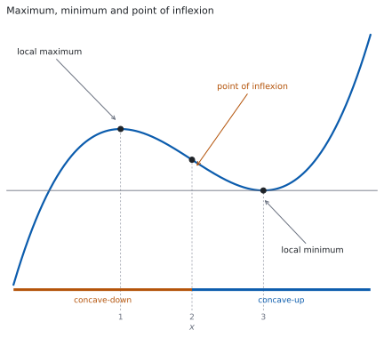
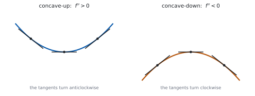
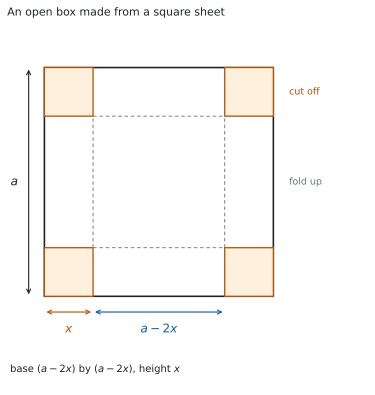

# SL 5.8 — Maximum and minimum points, concavity and optimization（極大・極小・凹凸・変曲点と最適化） {#sec-aasl-5-8}

::: {.callout-note}
## What you should be able to do
- **stationary point**（停留点）を、$f'(x) = 0$ を解いて求められる。
- **local maximum**（極大）と **local minimum**（極小）を、**$f'$ の符号の変わり方**で判定できる。
- 同じ判定を、**$f''$ の符号**でもできる。
- **concave-up**（下に凸）と **concave-down**（上に凸）の範囲を、$f''$ の符号から求められる。
- **point of inflexion**（変曲点）を、**$f''$ が符号を変える**ところとして求められる。
- **$f''(a) = 0$ だけでは変曲点と言えない**ことを、例をあげて説明できる。
- 文章から、**最大（最小）にしたい量**を式で書ける。
- **constraint**（制約条件）を使って、変数を $1$ つに減らせる。
- **domain**（定義域）を、問題の意味に合うように決められる。
- 答えを、**聞かれた量**と**単位**で書ける。
:::

## The idea

### 1. stationary point とその種類 {#stationary}

{#fig-aasl58-idea-a width=100%}

**$f'(a) = 0$ となる点を stationary point（停留点）といいます**（[SL 5.2](aasl-5-2.qmd#zero)）。グラフがそこで水平になります。

SL で扱う関数では、停留点は次の $3$ 種類のどれかになります（@fig-aasl58-idea-a）。

| 種類 | 英語 | そのまわりでのようす |
|:--|:--|:--|
| 極大 | local maximum | いちばん高い |
| 極小 | local minimum | いちばん低い |
| 傾き $0$ の変曲点 | point of inflexion with zero gradient | 上がり（下がり）つづける |

: 停留点の $3$ 種類 {#tbl-aasl58-kinds}

**「local」は「そのまわりで」という意味です。** グラフ全体でいちばん高いとはかぎりません。

**座標を聞かれたら、$y$ の値も出してください。** $x$ を求めたら、もとの $f(x)$ に入れます。

### 2. first derivative test（第 1 次導関数による判定） {#firsttest}

**$f'(a) = 0$ のとき、$a$ の左右で $f'$ の符号を調べる方法です。** $f'$ が $+$ から $-$ に変われば **local maximum**（極大）、$-$ から $+$ に変われば **local minimum**（極小）です。

**符号の並びと停留点の種類の対応は、[SL 5.2](aasl-5-2.qmd#zero) にまとめてあります。** sign diagram のかき方も、そちらを見てください。

**符号が変わらないときは、そこで止めます。** わかるのは「極大でも極小でもない」ことだけで、傾き $0$ の変曲点かどうかは、$f''$ が符号を変えるかどうかで決まります（[第 5 節](#inflexion)）。

### 3. concave-up と concave-down {#concavity}

{#fig-aasl58-concavity width=100%}

**$f''(x) > 0$ の範囲を concave-up（下に凸）といいます。** グラフの傾きがだんだん大きくなる範囲です（[SL 5.7](aasl-5-7.qmd#shape)）。

**$f''(x) < 0$ の範囲を concave-down（上に凸）といいます。** 傾きがだんだん小さくなる範囲です。

**これは増加・減少とは別の話です。** concave-up でも下がりつづけることがありますし、concave-down でも上がりつづけることがあります。

**答えは区間で書きます。** 「$x > 2$ で concave-up」のように書きます。

**接線をならべると、傾きの変わり方が見えます**（@fig-aasl58-concavity）。concave-up では接線がだんだん右上がりになり、concave-down ではだんだん右下がりになります。

### 4. second derivative test（第 2 次導関数による判定） {#secondtest}

**$f''$ の符号は、そこでの concavity を表していました**（[第 3 節](#concavity)）。停留点ではグラフが水平になっているので、そのまわりが concave-down なら山の形、concave-up なら谷の形です。**だから、$f''(a)$ の符号が分かれば極大か極小かが決まります。**

**左右を調べるかわりに、$x = a$ での $f''$ の値を $1$ つ計算するだけです。**

$f'(a) = 0$ のとき

| $f''(a)$ | $x = a$ は |
|:--|:--|
| $f''(a) < 0$ | *a local maximum* |
| $f''(a) > 0$ | *a local minimum* |
| $f''(a) = 0$ | *not decided by this test* |

: $f''$ による判定 {#tbl-aasl58-second}

**符号の向きに気をつけてください。** $f'' < 0$ が極大です。逆に覚えている人がとても多いところです。**$f'' < 0$ は concave-down、つまり上にふくらんだ形**だと思えば、取りちがえにくくなります（[第 3 節](#concavity)）。

**$f''(a) = 0$ のときは、[第 2 節](#firsttest) にもどります。** $f'$ の符号を左右で調べれば、極大か、極小か、そのどちらでもないかがわかります（[SL 5.2](aasl-5-2.qmd#zero)）。

### 5. point of inflexion {#inflexion}

**point of inflexion（変曲点）は、concave-up と concave-down が入れかわる点です。**

$(a,\ f(a))$ が変曲点であるための条件は、次の $2$ つです。

$$
f''(a) = 0 \quad \text{and} \quad f'' \text{ changes sign at } x = a
$$ {#eq-aasl58-inflexion}

**$f''(a) = 0$ を解いて候補を出し、そのあと符号が変わるかを確かめます。** この $2$ 段が要ります。

**符号が変わったことを、答案に書いてください。** $f'$ のときと同じように、**$f''$ の sign diagram（符号表）をかくのがいちばん確かです**（[SL 5.2](aasl-5-2.qmd#zero)）。$a$ の左右で $f''$ の値を $1$ つずつ計算し、$+$ と $-$ を書きこみます。

**$f''(a) = 0$ だけでは足りません。** $f(x) = x^{4}$ は $f''(0) = 0$ ですが、$f''(x) = 12x^{2}$ の符号が変わらないので $(0,\ 0)$ は変曲点ではありません。$f(x) = x^{3}$ なら $f''(x) = 6x$ の符号が変わるので、$(0,\ 0)$ は変曲点です。

**変曲点は、停留点とはかぎりません。** 条件は $f''$ についてのものだけなので、$f'(a) \ne 0$ の**傾きのある変曲点**もふつうにあります。

### 6. optimization（最適化）とは {#what}

**optimization（最適化）は、ある量をいちばん大きく（小さく）する場面を求めることです。**

面積、体積、費用、利益などが題材になります。**やることは第 1〜5 節と同じで、極大・極小を求めるだけです。** ちがうのは、式が問題文からは直接与えられないところです。

**式を自分で作るところが、この項目の中心です。**

{#fig-aasl58-box width=100%}

**たとえば、正方形の板の四隅から小さい正方形を切り取り、残りを折り上げてふたのない箱を作る場面です**（@fig-aasl58-box）。切り取る長さ $x$ を変えると体積が変わるので、体積がいちばん大きくなる $x$ を求めます。

**式の作り方と進め方は、例題で具体的に見てください。** 例題 $3$ と例題 $4$ が、この形の問題です。

::: {.callout-warning}
## この項目は Paper 1 でも Paper 2 でも出ます
判定と座標の計算は、電卓なしで出します。**このページの例題と演習は、すべて手で解ける形です。**

Paper 2 では、文章題の最大・最小を電卓で出してもかまいませんが、**式を作るところと定義域は自分で書きます。**
:::

::: {.callout-note collapse="true"}
## 電卓が使えるときは、こう確かめます
グラフ画面に $y = f(x)$ をかき、極大・極小の位置が求めた座標と合っているかを目で確かめます。

$y = f''(x)$ もいっしょにかくと、符号が変わる場所が見えます。

**文章題では、定義域の外を見ていないかもいっしょに確かめてください。** グラフは定義域の外にも続いてしまいます。
:::

## Why it works

::: {.callout-tip collapse="true"}
## クリックすると開きます

**なぜ、$f'$ の符号が変わると極大や極小になるのでしょうか。** 上がってから下がれば、その境目がいちばん高いからです。

$a$ の左で $f' > 0$ なら、そこまで $f$ は増加しています。$a$ の右で $f' < 0$ なら、そこから減少します。**だから $f(a)$ は、そのまわりでいちばん大きい値です**（[SL 5.2](aasl-5-2.qmd#interval)）。極小はその逆です。

**なぜ、$f''(a) < 0$ で極大になるのでしょうか。** $f'$ が減っていく途中で $0$ を通るからです。

$f''(a) < 0$ は、**$f'$ の変化率が $x = a$ で負**だということです。$f'(a) = 0$ なので、$a$ のすぐ左では $f'$ の値は $0$ より大きく、すぐ右では $0$ より小さくなります。**これは、$f'$ が $+$ から $-$ に変わるということです**（[SL 5.2](aasl-5-2.qmd#zero)）。

**「$a$ のまわりの区間で $f'$ が減少している」とまでは、$f''(a) < 0$ だけからは言えません。** [SL 5.7](aasl-5-7.qmd#sign) の言い方は、区間全体で $f''$ の符号が決まっているときのものです。

**つまり、$2$ つの判定は別々の事実ではありません。** $f''$ による判定は、$f'$ の符号の変わり方を $1$ 度の計算で調べる近道です。

**なぜ、$f''(a) = 0$ では決まらないのでしょうか。** $f'$ の減り方・増え方が、そこで止まっているだけだからです。

$f''(a) = 0$ は「$f'$ の変化がその瞬間 $0$」という意味で、$f'$ が $a$ の前後で符号を変えるかどうかは何も言いません。**だから、$f'$ を直接見にいくしかありません。**

**なぜ、変曲点には符号の変化が要るのでしょうか。** 変曲点の意味が「向きが入れかわる点」だからです。

concave-up と concave-down のちがいは $f''$ の符号です。**入れかわるということは、$f''$ の符号が変わるということです。** $f''(a) = 0$ は、その途中で通るだけの条件です。

**なぜ、変数を $1$ つにするのでしょうか。** 微分は $1$ 変数の関数についての道具だからです。

$A = xy$ のままでは、$x$ を動かしたときに $y$ もどう動くかが決まりません。**制約条件は、その動き方を決めてくれます。** $y$ を $x$ で書きなおせば、$A$ は $x$ だけの関数になり、微分できます。

**なぜ、定義域が要るのでしょうか。** 式は、場面より広い範囲で意味をもってしまうからです。

$A = x(14 - x)$ は $x = 20$ でも計算できますが、そのとき「もう片方の辺」は $-6$ になります。**式は数を返しますが、場面としてはありえません。** だから、はじめに範囲を決めておきます。

**なぜ、極大・極小の判定が要るのでしょうか。** $f'(x) = 0$ は、極大でも極小でも、傾き $0$ の変曲点でも起こるからです（[第 1 節](#stationary)）。

**「文章題だから最大に決まっている」とは言えません。** 同じ式が、別の場面では最小を聞いていることもあります。判定を書けば、どちらであっても正しく答えられます。

**なぜ、$\dfrac{k}{x}$ の形がよく出るのでしょうか。** 固定された量から求めた文字を、面積の式でもう一度かけ算するからです。

半径 $r$ の円柱で体積が $V$ に決まっていれば、高さは $\dfrac{V}{\pi r^{2}}$ です。側面積はこれに $2\pi r$ をかけた $\dfrac{2V}{r}$ になります。**$r^{2}$ が $1$ つ約分されるので、分母が $r^{2}$ ではなく $r$ になります。**
:::

## Worked examples

::: {.callout-note appearance="simple"}
問題文は英語です。意味が理解できなかったら、問題文の下の「**日本語訳**」を開いてください。解説は日本語です。

**例題 $1$・$2$ は判定と変曲点、例題 $3$・$4$ は最適化です。**
:::

::: {#exm-aasl58-maxmin}
[The function $f$ is given by $f(x) = 2x^{3} + 3x^{2} - 12x + 1$. Find the coordinates of the local maximum point and of the local minimum point.]{.q-en}

日本語訳

関数 $f$ は $f(x) = 2x^{3} + 3x^{2} - 12x + 1$ で与えられます。極大点と極小点の座標を求めなさい。

---

**$1$ 歩目。** $f'(x) = 0$ を解きます。

$$
f'(x) = 6x^{2} + 6x - 12 = 6(x + 2)(x - 1)
$$

$$
x = -2 \quad \text{or} \quad x = 1
$$

**$2$ 歩目。** $f''$ で判定します（[第 4 節](#secondtest)）。

$$
f''(x) = 12x + 6
$$

$f''(-2) = -24 + 6 = -18 < 0$ なので、$x = -2$ は極大です。

$f''(1) = 12 + 6 = 18 > 0$ なので、$x = 1$ は極小です。

**$3$ 歩目。** $y$ の値を出します。

$$
f(-2) = -16 + 12 + 24 + 1 = 21
$$

$$
f(1) = 2 + 3 - 12 + 1 = -6
$$

極大点は $(-2, 21)$、極小点は $(1, -6)$ です。

**検算（両側の値で）。** $f(-3) = -54 + 27 + 36 + 1 = 10$、$f(-1) = -2 + 3 + 12 + 1 = 14$ ✓ どちらも $21$ より小さいので、$(-2, 21)$ が**そのまわりで**いちばん高い点だと確かめられます。

**検算（$y$ の値）。** $f(1) = 2 + 3 - 12 + 1 = -6$ ✓ もとの式に入れて出しました。

**検算（$f'$ の符号で）。** $f'(0) = -12 < 0$ です ✓ $x = -2$ と $x = 1$ のあいだで $f$ が減っているので、左が極大、右が極小と合っています。

**検算（因数分解）。** $6(x+2)(x-1) = 6x^{2} + 6x - 12$ ✓ 展開してもどりました。

::: {.callout-note}
## 解答例（答案用紙に書くこと）
$$f'(x) = 6x^{2} + 6x - 12 = 6(x + 2)(x - 1) = 0$$
$$x = -2, \qquad x = 1$$
$$f''(x) = 12x + 6$$
$$f''(-2) = -18 < 0 \quad \text{(maximum)}, \qquad f''(1) = 18 > 0 \quad \text{(minimum)}$$
$$(-2,\ 21) \quad \text{and} \quad (1,\ -6)$$

:::
:::

::: {#exm-aasl58-inflexion}
[The function $f$ is given by $f(x) = x^{4} - 4x^{3}$. Find the coordinates of the points of inflexion on the graph of $f$, and state which of them is a stationary point.]{.q-en}

日本語訳

関数 $f$ は $f(x) = x^{4} - 4x^{3}$ で与えられます。$f$ のグラフの変曲点の座標を求め、そのうちどれが停留点かを述べなさい。

---

**$1$ 歩目。** $f''(x) = 0$ を解いて、候補を出します。

$$
f'(x) = 4x^{3} - 12x^{2}
$$

$$
f''(x) = 12x^{2} - 24x = 12x(x - 2)
$$

$$
x = 0 \quad \text{or} \quad x = 2
$$

**$2$ 歩目。** それぞれで符号が変わるかを確かめます（[第 5 節](#inflexion)）。

$f''(-1) = 12 + 24 = 36 > 0$、$f''(1) = 12 - 24 = -12 < 0$ なので、$x = 0$ で符号が変わります。

$f''(1) = -12 < 0$、$f''(3) = 108 - 72 = 36 > 0$ なので、$x = 2$ でも符号が変わります。

**$3$ 歩目。** $y$ の値を出します。

$$
f(0) = 0, \qquad f(2) = 16 - 32 = -16
$$

変曲点は $(0, 0)$ と $(2, -16)$ です。

**$4$ 歩目。** 停留点かどうかを見ます（[第 5 節](#inflexion)）。

$f'(0) = 0$ なので $(0,0)$ は停留点です。$f'(2) = 32 - 48 = -16 \ne 0$ なので、$(2,-16)$ は停留点ではありません。

**検算（$f''$ の形）。** $12x(x-2)$ は $2$ 次式で、$2$ つの根のあいだで負、外で正です ✓ 調べた値と合っています。

**検算（符号の並び）。** 正・負・正と並んでいるので、符号の変わり目はちょうど $2$ か所です ✓ $f''$ が $2$ 次式であることと合っています。

**検算（$f(2)$）。** $2^{4} = 16$、$4 \times 2^{3} = 32$ なので $16 - 32 = -16$ ✓

**検算（$f'(2)$）。** $4 \times 8 - 12 \times 4 = 32 - 48 = -16$ ✓ $0$ ではないので、停留点ではありません。

::: {.callout-note}
## 解答例（答案用紙に書くこと）
$$f'(x) = 4x^{3} - 12x^{2}, \qquad f''(x) = 12x^{2} - 24x = 12x(x - 2)$$
$$f''(x) = 0 \Rightarrow x = 0, \ x = 2$$
$$f''(-1) = 36 > 0, \quad f''(1) = -12 < 0, \quad f''(3) = 36 > 0$$
*so $f''$ changes sign at both values*
$$(0,\ 0) \quad \text{and} \quad (2,\ -16)$$
*$(0,0)$ is a stationary point since $f'(0) = 0$; $(2,-16)$ is not, since $f'(2) = -16$*

:::
:::

::: {#exm-aasl58-area}
[A rectangle has a perimeter of $40$ m. Find the largest possible area of the rectangle.]{.q-en}

日本語訳

ある長方形のまわりの長さは $40$ m です。この長方形の面積として考えられる最大の値を求めなさい。

---

**$1$ 歩目。** $2$ 辺を $x$ m と $y$ m とします。

**$2$ 歩目。** 最大にしたい量は面積です。

$$
A = xy
$$

**$3$ 歩目。** 制約条件は $2x + 2y = 40$、つまり $y = 20 - x$ です。

$$
A = x(20 - x) = 20x - x^{2}
$$

**$4$ 歩目。** $x$ も $y$ も正なので、定義域は $0 < x < 20$ です。

**$5$ 歩目。** 微分します。

$$
\frac{dA}{dx} = 20 - 2x = 0 \quad \Rightarrow \quad x = 10
$$

$$
\frac{d^{2}A}{dx^{2}} = -2 < 0
$$

$\dfrac{d^{2}A}{dx^{2}}$ が負なので、$x = 10$ で極大です。

**$6$ 歩目。** 聞かれているのは面積です。

$$
A = 10 \times 10 = 100
$$

最大の面積は $100$ m$^{2}$ です。

**検算（定義域）。** $10$ は $0 < x < 20$ の中にあります ✓

**検算（両側の値で）。** $A(9) = 9 \times 11 = 99$、$A(11) = 11 \times 9 = 99$ ✓ どちらも $100$ より小さくなっています。

**検算（形）。** $y = 20 - 10 = 10$ なので、正方形になっています ✓ まわりの長さが決まった長方形では、正方形の面積がいちばん大きくなります。

**検算（単位）。** 長さが m なので、面積は m$^{2}$ です ✓

::: {.callout-note}
## 解答例（答案用紙に書くこと）
$$2x + 2y = 40 \quad \Rightarrow \quad y = 20 - x$$
$$A = x(20 - x) = 20x - x^{2}, \qquad 0 < x < 20$$
$$\frac{dA}{dx} = 20 - 2x = 0 \quad \Rightarrow \quad x = 10$$
$$\frac{d^{2}A}{dx^{2}} = -2 < 0 \quad \text{(maximum)}$$
$$A = 100 \text{ m}^{2}$$

:::
:::

::: {#exm-aasl58-volume}
[An open box is made from a square sheet of card of side $24$ cm by cutting a square of side $x$ cm from each corner and folding up the sides. Find the value of $x$ that gives the largest volume, and find that volume.]{.q-en}

日本語訳

$1$ 辺 $24$ cm の正方形の厚紙の四隅から $1$ 辺 $x$ cm の正方形を切り取り、辺を折り上げて、ふたのない箱を作ります。体積が最大になる $x$ の値と、そのときの体積を求めなさい。

---

**$1$ 歩目から $3$ 歩目まで。** 制約条件は「板の $1$ 辺が $24$ cm」です。四隅から $x$ cm ずつ切るので、底面は $1$ 辺 $(24 - 2x)$ cm、高さは $x$ cm になります（@fig-aasl58-box）。**この時点で、変数は $x$ だけになっています。**

$$
V = x(24 - 2x)^{2}
$$

**$4$ 歩目。** 切り取れるのは $x > 0$ で、底面が残るには $24 - 2x > 0$ が要ります。定義域は $0 < x < 12$ です。

**$5$ 歩目。** 積の微分法と連鎖律を使います（[SL 5.6](aasl-5-6.qmd#withchain)）。

$$
\frac{dV}{dx} = (24 - 2x)^{2} + x \times 2(24 - 2x) \times (-2)
$$

$(24 - 2x)$ でくくります。

$$
\frac{dV}{dx} = (24 - 2x)\bigl[(24 - 2x) - 4x\bigr] = (24 - 2x)(24 - 6x)
$$

$$
\frac{dV}{dx} = 0 \quad \Rightarrow \quad x = 12 \quad \text{or} \quad x = 4
$$

**$x = 12$ は定義域の外なので捨てます。** そのとき底面の $1$ 辺が $0$ になり、箱ができません。

$x = 3$ では $\dfrac{dV}{dx} = 18 \times 6 = 108 > 0$、$x = 5$ では $\dfrac{dV}{dx} = 14 \times (-6) = -84 < 0$ です。正から負に変わるので、$x = 4$ で極大です。

**$6$ 歩目。**

$$
V = 4 \times 16^{2} = 1024
$$

$x = 4$ のとき、体積は $1024$ cm$^{3}$ です。

**検算（定義域）。** $4$ は $0 < x < 12$ の中、$12$ は外です ✓

**検算（両側の値で）。** $V(3) = 3 \times 18^{2} = 972$、$V(5) = 5 \times 14^{2} = 980$ ✓ どちらも $1024$ より小さくなっています。

**検算（別の道で）。** 先に $V = x(24-2x)^{2} = 4x^{3} - 96x^{2} + 576x$ と展開してから微分すると $12x^{2} - 192x + 576$ です。$(24 - 2x)(24 - 6x)$ を展開しても $12x^{2} - 192x + 576$ ✓ 別の道で同じ式になりました。

**検算（単位）。** 長さが cm なので、体積は cm$^{3}$ です ✓

::: {.callout-note}
## 解答例（答案用紙に書くこと）
$$V = x(24 - 2x)^{2}, \qquad 0 < x < 12$$
$$\frac{dV}{dx} = (24 - 2x)(24 - 6x) = 0 \quad \Rightarrow \quad x = 4 \text{ or } x = 12$$
*$x = 12$ is outside the domain, so it is rejected*
$$\frac{dV}{dx} > 0 \text{ at } x = 3, \qquad \frac{dV}{dx} < 0 \text{ at } x = 5 \quad \text{(maximum)}$$
$$x = 4, \qquad V = 1024 \text{ cm}^{3}$$

:::
:::

## Common errors

::: {.callout-warning}
## $f'(a) = 0$ だけで極大・極小と決める
停留点には変曲点もあります（[第 1 節](#stationary)）。判定が要ります。
:::

::: {.callout-warning}
## $f''$ の符号の向きを逆に覚える
$f''(a) < 0$ が**極大**です（[第 4 節](#secondtest)）。ここは毎年まちがえる人がいます。
:::

::: {.callout-warning}
## $f''(a) = 0$ だけで変曲点と決める
符号が変わることまで確かめてください（[第 5 節](#inflexion)）。$y = x^{4}$ が反例です。
:::

::: {.callout-warning}
## 座標を聞かれて $x$ だけ答える
$y$ の値も出してください（[第 1 節](#stationary)）。もとの $f(x)$ に入れます。
:::

::: {.callout-warning}
## concave-up を「増加」と混同する
concave-up は傾きが増えることで、$y$ が増えることではありません（[第 3 節](#concavity)）。
:::

::: {.callout-warning}
## 変曲点は必ず停留点だと思う
$f'(a) \ne 0$ の変曲点もあります（[第 5 節](#inflexion)）。
:::

::: {.callout-warning}
## 定義域を書かない
意味から決まる範囲を、はじめに書いてください（[第 6 節](#what)）。捨てる解の理由になります。
:::

::: {.callout-warning}
## 極大・極小であることを示さない
$f'(x) = 0$ を解いただけでは足りません（[第 4 節](#secondtest)）。$f''$ か、$f'$ の符号を書きます。
:::

::: {.callout-warning}
## 変数が $2$ つのまま微分する
制約条件で $1$ つに減らしてから微分します（[第 6 節](#what)）。
:::

::: {.callout-warning}
## 図から式を作るときに、寸法を取りちがえる
$x$ が半分の長さなのか、全体の長さなのかを、図に書きこんで確かめます（[第 6 節](#what)）。
:::

::: {.callout-warning}
## 聞かれた量を、単位をつけて答えない
「最大の面積」を聞かれていたら、$x$ ではなく面積を、cm$^{2}$ をつけて書きます（[第 6 節](#what)）。
:::

::: {.callout-warning}
## 意味のない解をそのまま使う
定義域の外の解は、理由をつけて捨てます（[第 6 節](#what)）。
:::

## Exercises

::: {.callout-note appearance="simple"}
各問題に、折りたたみが $3$ つ付いています。**日本語訳**、**解答例**（答案用紙に書くべきこと。英語です。英語の答案例が付くものもあります）、**解説**（なぜそうなるか。日本語です）。

まず自分で解いて、次に解答例と見くらべてください。**解説は、合わなかったときだけ開けば十分です。**
:::

::: {.exercise-block}

[1]{.ex-no} [The function $f$ is given by $f(x) = x^{3} - 12x + 1$. Find the coordinates of the local maximum point and of the local minimum point, using the sign of $f'$ to show which is which.]{.q-en}

日本語訳

関数 $f$ は $f(x) = x^{3} - 12x + 1$ で与えられます。極大点と極小点の座標を求め、$f'$ の符号を使ってどちらがどちらかを示しなさい。

::: {.callout-note collapse="true"}
## 解答例（答案用紙に書くこと）

$$f'(x) = 3x^{2} - 12 = 3(x - 2)(x + 2) = 0 \Rightarrow x = -2, \ x = 2$$

$$f'(-3) = 15 > 0, \qquad f'(0) = -12 < 0, \qquad f'(3) = 15 > 0$$

*$f'$ changes from positive to negative at $x = -2$, so $(-2,\ 17)$ is a local maximum point*

*$f'$ changes from negative to positive at $x = 2$, so $(2,\ -15)$ is a local minimum point*

:::

::: {.callout-tip collapse="true"}
## 解説

$f'(x) = 0$ を解いてから、$3$ か所で $f'$ の符号を調べます（[第 2 節](#firsttest)）。

**検算（$y$ の値）。** $f(-2) = -8 + 24 + 1 = 17$、$f(2) = 8 - 24 + 1 = -15$ ✓

**検算（$f''$ でも）。** $f''(x) = 6x$ なので $f''(-2) = -12 < 0$、$f''(2) = 12 > 0$ ✓ 同じ結論になります（[第 4 節](#secondtest)）。

**検算（両側の値で）。** $f(-3) = -27 + 36 + 1 = 10$、$f(-1) = -1 + 12 + 1 = 12$ ✓ どちらも $17$ より小さいので、$(-2, 17)$ はそのまわりでいちばん高い点です。
:::

::: {.ex-sep}
:::

[2]{.ex-no} [The function $f$ is given by $f(x) = x^{3} - 3x^{2} + 4$. Find the coordinates of the point of inflexion on the graph of $f$.]{.q-en}

日本語訳

関数 $f$ は $f(x) = x^{3} - 3x^{2} + 4$ で与えられます。$f$ のグラフの変曲点の座標を求めなさい。

::: {.callout-note collapse="true"}
## 解答例（答案用紙に書くこと）

$$f'(x) = 3x^{2} - 6x, \qquad f''(x) = 6x - 6$$

$$f''(x) = 0 \Rightarrow x = 1$$

$$f''(0) = -6 < 0, \qquad f''(2) = 6 > 0$$

*so $f''$ changes sign at $x = 1$*

$$(1,\ 2)$$

:::

::: {.callout-tip collapse="true"}
## 解説

候補を出してから、符号が変わることを確かめます（[第 5 節](#inflexion)）。

**検算（$y$ の値）。** $f(1) = 1 - 3 + 4 = 2$ ✓

**検算（$1$ 次式）。** $f''$ は $1$ 次式なので、符号は必ず $1$ 度だけ変わります ✓

**検算（停留点か）。** $f'(1) = 3 - 6 = -3 \ne 0$ です ✓ 傾きのある変曲点です（[第 5 節](#inflexion)）。
:::

::: {.ex-sep}
:::

[3]{.ex-no} [The function $f$ is given by $f(x) = x^{4} - 2x^{3}$. Find the interval on which the graph of $f$ is concave-down.]{.q-en}

日本語訳

関数 $f$ は $f(x) = x^{4} - 2x^{3}$ で与えられます。$f$ のグラフが concave-down となる区間を求めなさい。

::: {.callout-note collapse="true"}
## 解答例（答案用紙に書くこと）

$$f'(x) = 4x^{3} - 6x^{2}, \qquad f''(x) = 12x^{2} - 12x = 12x(x - 1)$$

$$12x(x - 1) < 0$$

$$0 < x < 1$$

:::

::: {.callout-tip collapse="true"}
## 解説

concave-down は $f''(x) < 0$ の範囲です（[第 3 節](#concavity)）。因数分解してから符号を見ます。

**検算（$x = \dfrac{1}{2}$ で）。** $f''\left(\dfrac{1}{2}\right) = 3 - 6 = -3 < 0$ ✓ 求めた区間の中にあります。

**検算（外側で）。** $f''(-1) = 12 + 12 = 24 > 0$、$f''(2) = 48 - 24 = 24 > 0$ ✓ どちらも区間の外です。

**検算（端で）。** $f''(0) = 0$、$f''(1) = 0$ です ✓ 区間の端で $f''$ が $0$ になっています。
:::

::: {.ex-sep}
:::

[4]{.ex-no} [The function $f$ is given by $f(x) = x + \dfrac{4}{x}$, for $x \ne 0$. Find the coordinates of the stationary points and determine their nature.]{.q-en}

日本語訳

関数 $f$ は $f(x) = x + \dfrac{4}{x}$（$x \ne 0$）で与えられます。停留点の座標を求め、その種類を判定しなさい。

::: {.callout-note collapse="true"}
## 解答例（答案用紙に書くこと）

$$f(x) = x + 4x^{-1}$$

$$f'(x) = 1 - 4x^{-2} = 0 \Rightarrow x^{2} = 4 \Rightarrow x = -2, \ x = 2$$

$$f''(x) = 8x^{-3}$$

$$f''(-2) = -1 < 0 \quad \text{(maximum)}, \qquad f''(2) = 1 > 0 \quad \text{(minimum)}$$

*$(-2,\ -4)$ is a local maximum point*

*$(2,\ 4)$ is a local minimum point*

:::

::: {.callout-tip collapse="true"}
## 解説

$\dfrac{4}{x} = 4x^{-1}$ と見て微分します（[SL 5.3](aasl-5-3.qmd#negative)）。

**検算（$y$ の値）。** $f(-2) = -2 - 2 = -4$、$f(2) = 2 + 2 = 4$ ✓

**検算（$f''$ の値）。** $f''(2) = \dfrac{8}{8} = 1$、$f''(-2) = \dfrac{8}{-8} = -1$ ✓

**検算（「local」の意味）。** 極大の $y$ は $-4$、極小の $y$ は $4$ で、**極大のほうが小さい**です ✓ 極大・極小はそのまわりでの話で、グラフ全体の高い低いではありません（[第 1 節](#stationary)）。
:::

::: {.ex-sep}
:::

[5]{.ex-no} [A student writes: "$f''(2) = 0$, so the graph of $f$ has a point of inflexion at $x = 2$." Explain why this reasoning is not enough, and state what else must be checked.]{.q-en}

日本語訳

ある生徒が「$f''(2) = 0$ なので、$f$ のグラフは $x = 2$ に変曲点をもつ」と書きました。この理由づけでは足りない理由を説明し、ほかに何を確かめる必要があるかを述べなさい。

::: {.callout-note collapse="true"}
## 解答例（答案用紙に書くこと）

*$f''(2) = 0$ does not say that $f''$ changes sign at $2$*

*you must also check the sign of $f''$ on each side of $2$*

:::

::: {.callout-tip collapse="true"}
## 解説

$f''(a) = 0$ は候補を出す条件で、判定ではありません（[第 5 節](#inflexion)）。

**検算（反例）。** $f(x) = (x-2)^{4}$ とすると $f''(x) = 12(x-2)^{2}$ で、$f''(2) = 0$ ですが符号は変わりません ✓ 変曲点ではありません。

**検算（何を書けばよいか）。** $x = 1$ と $x = 3$ での $f''$ の値を並べれば足ります ✓

**検算（逆は正しいか）。** $f''(a)$ が計算できる変曲点では、$f''(a) = 0$ です ✓ この向きは成り立ちます。

::: {.model-answer}
**試験ではこう書く**

*A point of inflexion requires $f''$ to change sign, not just to be zero. The equation $f''(2) = 0$ only produces a candidate. For example, if $f(x) = (x - 2)^{4}$ then $f''(2) = 0$, but $f''(x) = 12(x - 2)^{2}$ is positive on both sides, so there is no point of inflexion. The student must also check the sign of $f''$ on each side of $x = 2$.*
:::
:::

::: {.ex-sep}
:::

[6]{.ex-no} [A rectangle has an area of $36$ cm$^{2}$. Find the smallest possible perimeter of the rectangle.]{.q-en}

日本語訳

ある長方形の面積は $36$ cm$^{2}$ です。この長方形のまわりの長さとして考えられる最小の値を求めなさい。

::: {.callout-note collapse="true"}
## 解答例（答案用紙に書くこと）

$$xy = 36 \quad \Rightarrow \quad y = \frac{36}{x}$$

$$P = 2x + \frac{72}{x}, \qquad x > 0$$

$$\frac{dP}{dx} = 2 - \frac{72}{x^{2}} = 0 \quad \Rightarrow \quad x^{2} = 36 \quad \Rightarrow \quad x = 6$$

$$\frac{d^{2}P}{dx^{2}} = \frac{144}{x^{3}} > 0 \text{ for } x > 0 \quad \text{(minimum)}$$

$$P = 24 \text{ cm}$$

:::

::: {.callout-tip collapse="true"}
## 解説

今度は面積が制約条件で、まわりの長さを最小にします（[第 6 節](#what)）。

**検算（両側の値で）。** $P(4) = 8 + 18 = 26$、$P(9) = 18 + 8 = 26$ ✓ どちらも $24$ より大きくなっています。

**検算（$x = -6$ は）。** $x^{2} = 36$ の解は $\pm 6$ ですが、$x > 0$ なので $-6$ は捨てます ✓（[第 6 節](#what)）

**検算（形）。** $y = \dfrac{36}{6} = 6$ なので正方形です ✓
:::

::: {.ex-sep}
:::

[7]{.ex-no} [A farmer has $200$ m of fencing. He uses it to make three sides of a rectangular field; the fourth side is an existing straight wall. Find the largest possible area of the field.]{.q-en}

日本語訳

ある農家は $200$ m の柵をもっています。長方形の畑の $3$ 辺をこの柵で作り、残りの $1$ 辺はもとからあるまっすぐな壁を使います。この畑の面積として考えられる最大の値を求めなさい。

::: {.callout-note collapse="true"}
## 解答例（答案用紙に書くこと）

$$2x + y = 200 \quad \Rightarrow \quad y = 200 - 2x$$

$$A = x(200 - 2x), \qquad 0 < x < 100$$

$$\frac{dA}{dx} = 200 - 4x = 0 \quad \Rightarrow \quad x = 50$$

$$\frac{d^{2}A}{dx^{2}} = -4 < 0 \quad \text{(maximum)}$$

$$A = 5000 \text{ m}^{2}$$

:::

::: {.callout-tip collapse="true"}
## 解説

柵は $3$ 辺だけなので、制約条件は $2x + y = 200$ です（[第 6 節](#what)）。

**検算（両側の値で）。** $A(49) = 49 \times 102 = 4998$、$A(51) = 51 \times 98 = 4998$ ✓

**検算（形）。** $y = 200 - 100 = 100$ なので、壁に沿った辺が $2$ 倍の長さです ✓ 正方形ではありません。

**検算（柵の長さ）。** $2 \times 50 + 100 = 200$ ✓ 制約条件にもどります。
:::

::: {.ex-sep}
:::

[8]{.ex-no} [A shop sells a toy for $p$ dollars each. At this price it sells $60 - 2p$ toys each day. The shop also has daily running costs of $100$ dollars.]{.q-en}

**(a)** [Show that the daily profit, in dollars, is $P = 60p - 2p^{2} - 100$.]{.q-en}

**(b)** [Find the price that gives the largest daily profit, and find that profit.]{.q-en}

日本語訳

ある店はおもちゃを $1$ 個 $p$ ドルで売っています。この値段のとき、$1$ 日に $60 - 2p$ 個売れます。また、$1$ 日の運営費は $100$ ドルです。

**(a)** $1$ 日の利益（ドル）が $P = 60p - 2p^{2} - 100$ であることを示しなさい。

**(b)** $1$ 日の利益が最大になる値段と、そのときの利益を求めなさい。

::: {.callout-note collapse="true"}
## 解答例（答案用紙に書くこと）

**(a)**
$$P = p(60 - 2p) - 100 = 60p - 2p^{2} - 100, \qquad 0 < p < 30$$

**(b)**
$$\frac{dP}{dp} = 60 - 4p = 0 \quad \Rightarrow \quad p = 15$$

$$\frac{d^{2}P}{dp^{2}} = -4 < 0 \quad \text{(maximum)}$$

$$P = 900 - 450 - 100 = 350$$

*the price is $15$ dollars and the largest daily profit is $350$ dollars*

:::

::: {.callout-tip collapse="true"}
## 解説

売上は「値段 × 売れる個数」です。そこから運営費を引くと利益になります（[第 6 節](#what)）。

**検算（定義域）。** 売れる個数 $60 - 2p$ は正でなければならないので $p < 30$ です ✓ 値段も正なので $0 < p < 30$ です。

**検算（両側の値で）。** $P(14) = 840 - 392 - 100 = 348$、$P(16) = 960 - 512 - 100 = 348$ ✓ どちらも $350$ より小さくなっています。

**検算（売れる個数）。** $p = 15$ のとき $60 - 30 = 30$ 個売れます ✓ 売上は $15 \times 30 = 450$ ドル、そこから $100$ を引いて $350$ ドルです。
:::

::: {.ex-sep}
:::

[9]{.ex-no} [The cost, in dollars, of running a machine for $x$ hours is $C(x) = 3x + \dfrac{1200}{x}$, for $x > 0$. Find the value of $x$ that minimises the cost. Justify that your value gives a minimum.]{.q-en}

日本語訳

ある機械を $x$ 時間動かす費用（ドル）は $C(x) = 3x + \dfrac{1200}{x}$（$x > 0$）です。費用を最小にする $x$ の値を求め、その値で最小になることを説明しなさい。

::: {.callout-note collapse="true"}
## 解答例（答案用紙に書くこと）

$$C'(x) = 3 - \frac{1200}{x^{2}} = 0 \quad \Rightarrow \quad x^{2} = 400 \quad \Rightarrow \quad x = 20$$

$$C''(x) = \frac{2400}{x^{3}} > 0 \text{ for } x > 0 \quad \text{(minimum)}$$

$$x = 20 \text{ hours}$$

:::

::: {.callout-tip collapse="true"}
## 解説

$\dfrac{1200}{x} = 1200x^{-1}$ と見て微分します（[SL 5.3](aasl-5-3.qmd#negative)）。

**検算（$x = -20$ は）。** $x^{2} = 400$ の解は $\pm 20$ ですが、$x > 0$ なので $-20$ は捨てます ✓

**検算（値）。** $C(20) = 60 + 60 = 120$ ✓

**検算（両側の値で）。** $C(10) = 30 + 120 = 150$、$C(40) = 120 + 30 = 150$ ✓ どちらも $120$ より大きくなっています。

::: {.model-answer}
**試験ではこう書く**

*Differentiating gives $C'(x) = 3 - \dfrac{1200}{x^{2}}$. Setting this equal to zero gives $x^{2} = 400$, so $x = 20$ (the value $x = -20$ is rejected because $x > 0$). Differentiating again gives $C''(x) = \dfrac{2400}{x^{3}}$, which is positive for every $x > 0$. A positive second derivative at a stationary point means a minimum, so the cost is least when $x = 20$.*
:::
:::

::: {.ex-sep}
:::

[10]{.ex-no} [A rectangle has a perimeter of $48$ cm. To find the largest possible area, a student writes $A = x(24 - x)$, where $x$ cm is one side, and then $\dfrac{dA}{dx} = 24 - 2x = 0$, so $x = 12$. The student stops there. Describe what else the student must do to complete the answer.]{.q-en}

日本語訳

ある長方形のまわりの長さは $48$ cm です。面積の最大値を求めるために、ある生徒は $1$ 辺を $x$ cm として $A = x(24 - x)$ と書き、$\dfrac{dA}{dx} = 24 - 2x = 0$ から $x = 12$ を得て、そこで止めました。答えを完成させるために、この生徒があとやるべきことを述べなさい。

::: {.callout-note collapse="true"}
## 解答例（答案用紙に書くこと）

*justify that $x = 12$ gives a maximum, for example by showing $\dfrac{d^{2}A}{dx^{2}} = -2 < 0$*

*state the domain $0 < x < 24$*

*answer the question asked: the area, $A = 144$ cm$^{2}$, not the value of $x$*

:::

::: {.callout-tip collapse="true"}
## 解説

$5$ 歩目と $6$ 歩目が抜けています（[第 6 節](#what)）。

**検算（面積の値）。** $A = 12 \times 12 = 144$ ✓

**検算（判定）。** $\dfrac{d^{2}A}{dx^{2}} = -2 < 0$ なので極大です ✓

**検算（何が聞かれたか）。** 聞かれたのは面積で、$x$ ではありません ✓

::: {.model-answer}
**試験ではこう書く**

*The student must justify that $x = 12$ gives a maximum, for example by finding $\dfrac{d^{2}A}{dx^{2}} = -2$, which is negative. The domain should also be stated: both sides are positive lengths, so $0 < x < 24$. Finally the question asks for the area, not for $x$, so the student must substitute to get $A = 12 \times 12 = 144$ and give the answer with units.*
:::
:::

:::
