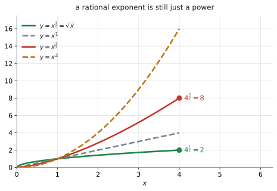

# AHL 1.10 — Rational exponents（有理数の指数） {#sec-ahl-1-10}

::: {.callout-note}
## What you should be able to do
- $a^{1/n}$ が **$n$ 乗すると $a$ になる数**、つまり $\sqrt[n]{a}$ だと言える。
- $a^{m/n} = \sqrt[n]{a^{m}} = \left(\sqrt[n]{a}\right)^{m}$ を、**計算しやすいほうの順**で使える。
- **負の指数**を分数に直せる（$x^{-1/2} = \dfrac{1}{\sqrt{x}}$）。
- [SL 1.5](../../ai-sl/01-number-and-algebra/sl-1-5.qmd) の **laws of exponents**（指数法則）が、指数が分数でもそのまま使えると分かる。
- 根号の入った文字式を、**指数の形に直してから**整理できる。
:::

::: {.callout-important}
## 公式集に、この項目の欄はありません
公式集の Topic 1 を最後まで見ても、**AHL 1.10 の欄はありません。** それどころか、$a^{m} \times a^{n} = a^{m+n}$ のような **laws of exponents は、AI の公式集のどこにも印刷されていません。**

$1.5$ の欄にあるのは、指数と対数のつなぎ目の $1$ 行だけです。

$$
a^{x} = b \iff x = \log_{a} b, \quad a > 0,\ b > 0,\ a \neq 1
$$

**ですから、指数法則はここだけは覚える必要があります。** [SL 1.5](../../ai-sl/01-number-and-algebra/sl-1-5.qmd#exp-laws) にも同じことが書いてあります。

この項目で新しく足されるのは、**指数が分数のとき**の話だけです。法則そのものは何も変わりません。
:::

::: {.callout-note}
## シラバスが、この項目に求めていること
Content 欄は $1$ 行です。

> Simplifying expressions, both numerically and algebraically, involving rational exponents.

Guidance 欄には、例が $4$ つ挙がっています。

> **Examples:** $5^{\frac{1}{2}} \times 5^{\frac{1}{3}} = 5^{\frac{5}{6}}$, $\quad 6^{\frac{3}{4}} \div 6^{\frac{1}{2}} = 6^{\frac{1}{4}}$, $\quad 32^{\frac{3}{5}} = 8$, $\quad x^{-\frac{1}{2}} = \dfrac{1}{\sqrt{x}}$

**この $4$ つが、シラバスが示している難しさの目安**です。「both numerically and algebraically」——数だけの式と、文字の入った式の**両方**が出る、ということです。
:::

## The idea

### 1. $a^{1/n}$ は「$n$ 乗すると $a$ になる数」です {#idea}

指数が整数のときは、$a^{3} = a \times a \times a$ のように「何回かける」で意味が決まりました（[SL 1.5](../../ai-sl/01-number-and-algebra/sl-1-5.qmd#exp-laws)）。**$a^{1/2}$ を「$\dfrac{1}{2}$ 回かける」と読むことはできません。**

そこで、**指数法則がこわれないように**意味を決めます。そう決めると、$a^{1/n}$ は「**$n$ 乗すると $a$ になる正の数**」になります。それは $\sqrt[n]{a}$ にほかなりません（なぜそう決めるほかにないのかは、[Why it works](#why-it-works) にあります）。

$$
a^{1/n} = \sqrt[n]{a}
$$ {#eq-ahl110-root}

$$
9^{1/2} = \sqrt{9} = 3, \qquad 8^{1/3} = \sqrt[3]{8} = 2, \qquad 32^{1/5} = \sqrt[5]{32} = 2
$$

{#fig-ahl110-powers width=100%}

@fig-ahl110-powers の (a) を見てください。$x > 1$ のところで、$y = x^{3/2}$ は $y = x^{1}$ と $y = x^{2}$ の**間**にあります。$y = x^{1/2}$ のほうは $y = x^{1}$ より**下**です。指数の $\dfrac{1}{2}$ が、$0$ と $1$ の間だからです。

**指数を分数にすると、整数の指数のグラフの間が、こうして埋まります。**

::: {.callout-important}
## このページでは、底 $a$ は正の数とします
$a$ が負だと、$(-4)^{1/2}$ のように**実数にならない**ものが出てきます。また $\dfrac{1}{3} = \dfrac{2}{6}$ なのに $(-8)^{1/3} = -2$、$(-8)^{2/6} = \sqrt[6]{64} = 2$ となって、**同じ指数のはずなのに答えが食い違います。**

負の底でも、指数を**既約分数**にしたときの**分母が奇数**なら、実数として扱える場合はあります（$(-8)^{1/3} = -2$ がそれです）。しかし、いま見たように**表し方によって答えが食い違い**、指数法則を一貫して使えなくなります。ですからこのページでは、**底 $a$ は正の数に限ります。** 試験でも、底が負の分数指数は出てきません。
:::

### 2. $a^{m/n}$ は、根と累乗を組み合わせたもの {#mn}

$\dfrac{m}{n} = m \times \dfrac{1}{n}$ ですから、@eq-ahl110-root と $(a^{m})^{n} = a^{mn}$ を合わせると

$$
a^{m/n} = \left(\sqrt[n]{a}\right)^{m} = \sqrt[n]{a^{m}}
$$ {#eq-ahl110-mn}

です。**どちらの順でやっても答えは同じ**です。

#### 分母が根、分子が累乗 {#which-is-which}

ここが、この項目でいちばん取り違えられるところです。

$$
a^{\frac{m}{n}} \ \longrightarrow \ \text{分母の } n \ \text{が根}, \quad \text{分子の } m \ \text{が累乗}
$$

$32^{3/5}$ なら、**$5$ 乗根**をとって **$3$ 乗**します。$3$ 乗根をとって $5$ 乗するのではありません。

#### 順番で、計算の楽さが変わります {#order}

@fig-ahl110-powers の (b) が、$32^{3/5}$ の $2$ 通りの道です。

- **根を先に** … $\sqrt[5]{32} = 2$、それを $3$ 乗して $8$
- **累乗を先に** … $32^{3} = 32768$、その $5$ 乗根をとって $8$

どちらも $8$ になりますが、**根を先にとるほうが、扱う数のけたが小さく済みます。** $32$ や $64$ のように、その数がちょうど $n$ 乗数になっているときは、根を先にとってください。

$5^{2/3}$ のように $\sqrt[3]{5} = 1.7099\ldots$ が割り切れないときは、根を先にとると**途中で小数を丸める**ことになります。そういうときは、電卓に `5^(2/3)` とそのまま入れます。

### 3. 負の指数は、逆数にします {#negative}

[SL 1.5](../../ai-sl/01-number-and-algebra/sl-1-5.qmd#exp-laws) の $a^{-n} = \dfrac{1}{a^{n}}$ は、指数が分数でもそのままです。

$$
a^{-m/n} = \frac{1}{a^{m/n}}
$$ {#eq-ahl110-neg}

シラバスの Guidance の $4$ つ目が、まさにこれです。

$$
x^{-1/2} = \frac{1}{x^{1/2}} = \frac{1}{\sqrt{x}}
$$

::: {.callout-warning}
## 負の指数は、答えを負にしません
$2^{-3} = \dfrac{1}{8}$ であって、$-8$ ではありません。

**負の指数が言っているのは「分母に行け」**ということで、符号の話ではありません（[Common errors](#common-errors) の $3$ つ目）。
:::

### 4. 使う法則は、SL 1.5 のものと同じです {#laws}

分数の指数でも、法則は $1$ つも増えません。

| 法則 | 分数の指数での例 |
|:--|:--|
| $a^{m} \times a^{n} = a^{m+n}$ | $5^{1/2} \times 5^{1/3} = 5^{5/6}$ |
| $a^{m} \div a^{n} = a^{m-n}$ | $6^{3/4} \div 6^{1/2} = 6^{1/4}$ |
| $(a^{m})^{n} = a^{mn}$ | $\left(x^{2}\right)^{3/2} = x^{3}$ |
| $(ab)^{n} = a^{n}b^{n}$ | $\left(8y^{6}\right)^{2/3} = 4y^{4}$ |
| $a^{-n} = \dfrac{1}{a^{n}}$ | $x^{-1/2} = \dfrac{1}{\sqrt{x}}$ |
| $a^{0} = 1$ | $7^{0} = 1$ |

: 指数法則は、分数でもそのまま {#tbl-ahl110-laws}

右の列の $1$ 番目・$2$ 番目・$5$ 番目が、シラバスの Guidance の例そのものです。

**足し算・引き算のところで、分数の通分**が要ります。そこだけが SL との違いです。

$$
\frac{1}{2} + \frac{1}{3} = \frac{3}{6} + \frac{2}{6} = \frac{5}{6}
$$

### 5. 文字式は、指数の形にそろえてから {#algebraic}

$\sqrt{\ }$ が混じった式は、**先に全部を指数の形に直します。** そうすれば、あとは @tbl-ahl110-laws だけで進みます。

$$
\sqrt{x} = x^{1/2}, \qquad \sqrt[3]{x} = x^{1/3}, \qquad \frac{1}{\sqrt{x}} = x^{-1/2}
$$

たとえば

$$
\frac{x^{3/2}\sqrt{x}}{x^{-1/2}} = \frac{x^{3/2} \cdot x^{1/2}}{x^{-1/2}} = x^{\frac{3}{2}+\frac{1}{2}-\left(-\frac{1}{2}\right)} = x^{5/2}
$$

分母の $-\dfrac{1}{2}$ を**引く**ので、$+\dfrac{1}{2}$ になります。ここで符号を落としやすくなります。

**答えの形は、問題文の指定に合わせてください。** `in the form` で $ax^{p}$ が指定されていれば指数のまま、指定がなければどちらでも構いません。

### 6. AI で、この項目が効いてくる場所 {#uses}

分数の指数は、それ自体を問う問題より、**他の項目の途中で出てくる**ほうが多いところです。

- **power model**（べき乗モデル）$y = ax^{b}$ … [AHL 4.13](../04-statistics-and-probability/ahl-4-13.qmd) の非線形回帰。$b$ が $1$ より小さいときの読み方が、@exm-ahl110-model と同じです
- **half-life**（半減期）… [AHL 1.9](ahl-1-9.qmd) では $M = 200e^{-0.03t}$ のような形で扱います。指数が負や分数になっても法則は同じ、という見方がそのまま効きます
- **面積と体積の関係** … 長さが $k$ 倍になると面積は $k^{2}$ 倍、体積は $k^{3}$ 倍。逆に体積から長さを出すと $V^{1/3}$ になります

## Why it works

ここでは、**なぜ $a^{1/n}$ が $\sqrt[n]{a}$ になるのか**だけを説明します。

$a^{1/2}$ を「$\dfrac{1}{2}$ 回かける」と読むことはできません。ですから、**意味を決めてやる**必要があります。

決め方の方針は $1$ つです。**すでにある指数法則が、こわれないようにする。**

$(a^{m})^{n} = a^{mn}$ を残したいとします。$m = \dfrac{1}{n}$ を入れると

$$
\left(a^{1/n}\right)^{n} = a^{\frac{1}{n} \times n} = a^{1} = a
$$

でなければなりません。つまり $a^{1/n}$ は、**$n$ 乗したら $a$ に戻る数**です。

$a > 0$ のとき、$n$ 乗して $a$ になる**正の数はただ $1$ つ**しかありません。それが $\sqrt[n]{a}$ です。

$n$ が偶数のときは、$(-3)^{2} = 9$ のように**負の数を $n$ 乗しても $a$ になります。** それでも $9^{1/2}$ は $3$ と決めます。$\sqrt{\ }$ は非負の値を表すと決めておかないと、$9^{1/2} \times 9^{1/2}$ の答えが $9$ にも $-9$ にもなってしまうからです。

ですから

$$
a^{1/n} = \sqrt[n]{a}
$$

と決めるほかに、選びようがありません。

**新しい約束を持ちこんだのではなく、古い法則が使えるように名前を付けただけ**——それがこの項目の正体です。

## Worked examples

::: {.callout-note appearance="simple"}
問題文は英語です。意味が理解できなかったら、問題文の下の「**日本語訳**」を開いてください。解説は日本語です。
:::

::: {#exm-ahl110-numeric}
**(a)** [Write $7^{2/3} \times 7^{5/6}$ in the form $7^{p}$.]{.q-en}

**(b)** [Write $10^{5/4} \div 10^{1/2}$ in the form $10^{q}$.]{.q-en}

**(c)** [Find the exact value of $81^{3/4}$.]{.q-en}

<details class="jp-trans">
<summary>日本語訳</summary>

**(a)** $7^{2/3} \times 7^{5/6}$ を $7^{p}$ の形で書きなさい。

**(b)** $10^{5/4} \div 10^{1/2}$ を $10^{q}$ の形で書きなさい。

**(c)** $81^{3/4}$ の正確な値を求めなさい。

</details>

---

**(a)** かけ算なので、指数を足します（@tbl-ahl110-laws）。通分してから足してください。

$$
\frac{2}{3} + \frac{5}{6} = \frac{4}{6} + \frac{5}{6} = \frac{9}{6} = \frac{3}{2}
$$

$$
7^{2/3} \times 7^{5/6} = 7^{3/2}
$$

**約分まで済ませてください。** $7^{9/6}$ でも同じ値ですが、$7^{3/2}$ が答えの形です。

**(b)** わり算なので、指数を引きます。

$$
\frac{5}{4} - \frac{1}{2} = \frac{5}{4} - \frac{2}{4} = \frac{3}{4}
$$

$$
10^{5/4} \div 10^{1/2} = 10^{3/4}
$$

**(c)** `exact value` なので、小数近似ではなく正確な値で答えます。ここでは $81 = 3^{4}$ に気づけば、答えがちょうど整数になります。

$$
81^{3/4} = \left(3^{4}\right)^{3/4} = 3^{4 \times \frac{3}{4}} = 3^{3} = 27
$$

根を先にとる道でも同じです（[第2節](#order)）。$\sqrt[4]{81} = 3$、それを $3$ 乗して $27$ です。

**検算。** 電卓に `81^(3/4)` と入れると $27$ と返ります ✓

::: {.callout-note}
## 解答例（答案用紙にはこう書く）
**(a)**
$$\frac{2}{3}+\frac{5}{6} = \frac{9}{6} = \frac{3}{2} \ \Rightarrow \ 7^{2/3} \times 7^{5/6} = 7^{3/2}$$

**(b)**
$$\frac{5}{4}-\frac{1}{2} = \frac{3}{4} \ \Rightarrow \ 10^{5/4} \div 10^{1/2} = 10^{3/4}$$

**(c)**
$$81^{3/4} = \left(3^{4}\right)^{3/4} = 3^{3} = 27$$
:::
:::

::: {#exm-ahl110-algebraic}
[Simplify the following, giving each answer as a single power of the variable where possible.]{.q-en}

**(a)** [$\dfrac{x^{3/2}\sqrt{x}}{x^{-1/2}}$, where $x > 0$]{.q-en}

**(b)** [$\left(8y^{6}\right)^{2/3}$]{.q-en}

<details class="jp-trans">
<summary>日本語訳</summary>

次の式を簡単にしなさい。できるものは、文字の $1$ つの累乗の形で書きなさい。

**(a)** $\dfrac{x^{3/2}\sqrt{x}}{x^{-1/2}}$（ただし $x > 0$）

**(b)** $\left(8y^{6}\right)^{2/3}$

</details>

---

**(a)** まず $\sqrt{x}$ を指数の形に直します（[第5節](#algebraic)）。

$$
\frac{x^{3/2} \cdot x^{1/2}}{x^{-1/2}}
$$

分子はかけ算なので足し、分母は引きます。

$$
\frac{3}{2} + \frac{1}{2} - \left(-\frac{1}{2}\right) = \frac{3}{2}+\frac{1}{2}+\frac{1}{2} = \frac{5}{2}
$$

$$
\frac{x^{3/2}\sqrt{x}}{x^{-1/2}} = x^{5/2}
$$

**負の指数を引くと、足すことになります。** ここが落としどころです。

**(b)** $(ab)^{n} = a^{n}b^{n}$ なので、$8$ にも $y^{6}$ にも $\dfrac{2}{3}$ 乗がかかります。

$$
\left(8y^{6}\right)^{2/3} = 8^{2/3} \times \left(y^{6}\right)^{2/3}
$$

$8 = 2^{3}$ なので $8^{2/3} = \left(2^{3}\right)^{2/3} = 2^{2} = 4$、$\left(y^{6}\right)^{2/3} = y^{4}$ です。

$$
\left(8y^{6}\right)^{2/3} = 4y^{4}
$$

**$8$ を残して $8y^{4}$ としないでください。** 係数にも指数はかかります（[Common errors](#common-errors) の $5$ つ目）。

::: {.callout-note}
## 解答例（答案用紙にはこう書く）
**(a)**
$$\frac{x^{3/2} \cdot x^{1/2}}{x^{-1/2}} = x^{\frac{3}{2}+\frac{1}{2}+\frac{1}{2}} = x^{5/2}$$

**(b)**
$$\left(8y^{6}\right)^{2/3} = 8^{2/3}y^{4} = \left(2^{3}\right)^{2/3}y^{4} = 4y^{4}$$
:::
:::

::: {#exm-ahl110-form}
[Write $\dfrac{3}{\sqrt[3]{x^{2}}}$ in the form $ax^{p}$, where $a$ and $p$ are constants.]{.q-en}

<details class="jp-trans">
<summary>日本語訳</summary>

$\dfrac{3}{\sqrt[3]{x^{2}}}$ を $ax^{p}$ の形で書きなさい。$a$ と $p$ は定数です。

</details>

---

手順は $2$ つです。**根号を指数に直す**、**分母を負の指数で上げる**。

$$
\sqrt[3]{x^{2}} = x^{2/3}
$$

@eq-ahl110-neg より $\dfrac{1}{x^{2/3}} = x^{-2/3}$ ですから

$$
\frac{3}{\sqrt[3]{x^{2}}} = 3x^{-2/3}
$$

$a = 3$、$p = -\dfrac{2}{3}$ です。

::: {.callout-tip}
## この形は、微分の前によく使います
$ax^{p}$ の形にしておくと、[AHL 5.9a](../05-calculus/ahl-5-9a.qmd) の **power rule**（累乗の微分の法則）がそのまま使えます。根号のままでは微分できません。

**「$ax^{p}$ の形にせよ」と言われたら、次に微分か積分が来る**と思って構いません。
:::

::: {.callout-note}
## 解答例（答案用紙にはこう書く）
$$\frac{3}{\sqrt[3]{x^{2}}} = \frac{3}{x^{2/3}} = 3x^{-2/3}$$
:::
:::

::: {#exm-ahl110-model}
[The mass $M$ kg of a certain animal and its daily energy use $E$ kilojoules are modelled by]{.q-en}

$$
E = 290\,M^{3/4}
$$

**(a)** [Find $E$ when $M = 16$.]{.q-en}

**(b)** [A second animal has $16$ times the mass of the first. Find the factor by which its daily energy use is greater, and comment on your answer.]{.q-en}

<details class="jp-trans">
<summary>日本語訳</summary>

ある動物の質量 $M$ kg と、$1$ 日のエネルギー消費 $E$ キロジュールが、上の式でモデル化されています。

**(a)** $M = 16$ のときの $E$ を求めなさい。

**(b)** $2$ 頭目の動物は、$1$ 頭目の $16$ 倍の質量です。$1$ 日のエネルギー消費が何倍になるかを求め、その答えについてコメントしなさい。

</details>

---

**(a)** $16 = 2^{4}$ なので、$16^{3/4}$ は正確に出せます。

$$
16^{3/4} = \left(2^{4}\right)^{3/4} = 2^{3} = 8
$$

$$
E = 290 \times 8 = 2320
$$

**単位を付けてください。** $2320$ キロジュールです。

**(b)** $M$ が $16$ 倍になると、$M^{3/4}$ は $16^{3/4}$ 倍になります。

$$
\frac{290\,(16M)^{3/4}}{290\,M^{3/4}} = 16^{3/4} = 8
$$

$E$ は **$8$ 倍**です。

`comment on` は、**数値の意味を文脈の言葉で言う**設問です。$16$ 倍にならないところが要点です。

::: {.model-answer}
**試験ではこう書く**

*The daily energy use is $8$ times greater, not $16$ times. Because the exponent $\frac{3}{4}$ is less than $1$, energy use grows more slowly than mass, so the larger animal uses less energy per kilogram of body mass than the smaller one.*
:::

（$1$ 日のエネルギー消費は $8$ 倍であって、$16$ 倍ではない。指数 $\dfrac{3}{4}$ が $1$ より小さいので、エネルギー消費は質量ほど速くは増えず、大きい動物のほうが体重 $1$ kg あたりの消費が少ない、という意味です。）

::: {.callout-note}
## 解答例（答案用紙にはこう書く）
**(a)**
$$16^{3/4} = \left(2^{4}\right)^{3/4} = 2^{3} = 8$$
$$E = 290 \times 8 = 2320 \text{ kJ}$$

**(b)**
$$\frac{(16M)^{3/4}}{M^{3/4}} = 16^{3/4} = 8$$
*The energy use is $8$ times greater, not $16$ times. Since $\frac{3}{4} < 1$, energy use grows more slowly than mass.*
:::
:::

## Common errors

::: {.callout-warning}
## 分子と分母を取り違える
$32^{3/5}$ を $\sqrt[3]{32^{5}}$ と読んでしまう誤りです。

**分母が根、分子が累乗**です（[第2節](#which-is-which)）。正しくは $\sqrt[5]{32^{3}} = \left(\sqrt[5]{32}\right)^{3} = 2^{3} = 8$ です。

誤った読み方だと $\sqrt[3]{32^{5}} = 322.5\ldots$ になり、まったく違う数になります。
:::

::: {.callout-warning}
## かけ算のところで、指数もかけてしまう
$5^{1/2} \times 5^{1/3}$ を $5^{1/6}$ としてしまう誤りです。

**かけ算では指数を足します。** $\dfrac{1}{2}+\dfrac{1}{3} = \dfrac{5}{6}$ です。

指数をかけるのは $(a^{m})^{n}$ のときだけです（@tbl-ahl110-laws）。**式の形をよく見てから**、足すのかかけるのかを決めてください。
:::

::: {.callout-warning}
## 負の指数を、負の数だと思う
$2^{-3}$ を $-8$ としてしまう誤りです。

$$
2^{-3} = \frac{1}{2^{3}} = \frac{1}{8}
$$

**負の指数は「分母に行け」という指示**で、符号の話ではありません（[第3節](#negative)）。底が正なら、答えはいつも正です。
:::

::: {.callout-warning}
## 根号を、和や差に分ける
$\sqrt{a+b}$ を $\sqrt{a}+\sqrt{b}$ としてしまう誤りです。

$(ab)^{n} = a^{n}b^{n}$ は成り立ちますが、**$(a+b)^{n} = a^{n}+b^{n}$ は成り立ちません。**

$\sqrt{9+16} = \sqrt{25} = 5$ ですが、$\sqrt{9}+\sqrt{16} = 3+4 = 7$ です。**別の数になります。**
:::

::: {.callout-warning}
## 係数を、累乗し忘れる
$\left(8y^{6}\right)^{2/3}$ を $8y^{4}$ としてしまう誤りです。

かっこの外の指数は、**中身の全部**にかかります。$8$ にもかかるので

$$
8^{2/3} = \left(2^{3}\right)^{2/3} = 4
$$

で、答えは $4y^{4}$ です（@exm-ahl110-algebraic）。
:::

## Using your GDC (TI-Nspire CX II)

### 1. 分数の指数は、かっこで囲みます {#gdc-brackets}

いちばん多い打ち間違いは、ここです。

```
81^(3/4)
```

$27$ と返ります。**かっこを外すと、別の式になります。**

| 入力 | 電卓が読むもの |
|:--|:--|
| `81^(3/4)` | $81^{3/4} = 27$ |
| `81^3/4` | $\dfrac{81^{3}}{4}$（`enter` なら $\dfrac{531441}{4}$、`ctrl + enter` なら $132860.25$） |

: かっこの有無で変わります {#tbl-ahl110-gdc}

指数が $2$ 文字以上あるときは、**必ずかっこ**を付けてください。

### 2. 正確な形と小数を切り替える {#gdc-exact}

`enter` で入力すると、**分数は分数のまま**返ります。`ctrl + enter` で入力すると小数になります。

ただし、**根号は残りません。** TI-Nspire CX II（非CAS）は Numeric なので、

```
12^(1/2)
```

は `enter` でも $3.4641\ldots$ と小数で返ります（機種ごとの違いは [SL 3.1](../../ai-sl/03-geometry-and-trigonometry/sl-3-1.qmd) の表にあります）。

ですから `exact value` と問われて $2\sqrt{3}$ のような形が要るときは、**自分で書く**ことになります。電卓が答えの形をそのまま出してくれるのは、$81^{3/4} = 27$ のように整数や分数になるときだけです。

### 3. 根号のテンプレート {#gdc-root}

$\sqrt{\ }$ は `ctrl + x²` で入ります。$n$ 乗根は、**$9$ キーの右にあるテンプレートのパレット**から $\sqrt[n]{\ }$ を選びます（[SL 1.3](../../ai-sl/01-number-and-algebra/sl-1-3.qmd) と同じ場所です）。

**指数の形で打つほうが速いことが多い**ので、$\sqrt[5]{32}$ は `32^(1/5)` と打っても構いません。

### 4. 文字式は、電卓では簡単になりません {#gdc-algebra}

::: {.callout-warning}
## 非CAS の電卓は、文字式を整理しません
`(8y^6)^(2/3)` と打っても、$4y^{4}$ にはなりません。$y$ に値が入っていないので、そこで止まってエラーの表示が出ます。

**文字式の整理は、手でやる仕事**です（[第5節](#algebraic)）。

電卓が使えるのは、**数だけの式**と、**答えの確かめ**です。
:::

### 5. 検算のしかた {#gdc-check}

手で出した答えを確かめる方法が $2$ つあります。

- **数の式** … 元の式と、簡単にした式を、それぞれ小数で出して見くらべる
- **文字式** … $x$ に適当な数（たとえば $x = 4$）を入れて、両方が同じ値になるか見る

$2$ つ目が便利です。@exm-ahl110-algebraic (a) なら、$x = 4$ で

$$
\frac{4^{3/2}\sqrt{4}}{4^{-1/2}} = \frac{8 \times 2}{0.5} = 32, \qquad 4^{5/2} = 32
$$

**一致しました。** 文字が $1$ つなら、この確かめがいちばん速く済みます。

## Exercises

::: {.callout-note appearance="simple"}
各問題に、折りたたみが3つ付いています。**日本語訳**、**解答例**（答案用紙に書くべきこと。英語です）、**解説**（なぜそうなるか。日本語です）。

まず自分で解いて、次に解答例と見くらべてください。**解説は、合わなかったときだけ開けば十分です。**
:::

::: {.exercise-block}

[1]{.ex-no} [Write $3^{1/4} \times 3^{7/12}$ in the form $3^{p}$.]{.q-en}

<details class="jp-trans">
<summary>日本語訳</summary>

$3^{1/4} \times 3^{7/12}$ を $3^{p}$ の形で書きなさい。

</details>

::: {.callout-note collapse="true"}
## 解答例（答案用紙に書くこと）

$$\frac{1}{4}+\frac{7}{12} = \frac{3}{12}+\frac{7}{12} = \frac{10}{12} = \frac{5}{6}$$

$$3^{1/4} \times 3^{7/12} = 3^{5/6}$$
:::

::: {.callout-tip collapse="true"}
## 解説

かけ算なので、指数を足します（@tbl-ahl110-laws）。

分母を $12$ にそろえてから足してください。$\dfrac{1}{4} = \dfrac{3}{12}$ です。

$\dfrac{10}{12}$ は**約分して** $\dfrac{5}{6}$ にします。約分を忘れても値は同じですが、答えの形としては $3^{5/6}$ です。
:::

::: {.ex-sep}
:::

[2]{.ex-no} [Write $12^{5/6} \div 12^{1/3}$ in the form $12^{q}$.]{.q-en}

<details class="jp-trans">
<summary>日本語訳</summary>

$12^{5/6} \div 12^{1/3}$ を $12^{q}$ の形で書きなさい。

</details>

::: {.callout-note collapse="true"}
## 解答例（答案用紙に書くこと）

$$\frac{5}{6}-\frac{1}{3} = \frac{5}{6}-\frac{2}{6} = \frac{3}{6} = \frac{1}{2}$$

$$12^{5/6} \div 12^{1/3} = 12^{1/2}$$
:::

::: {.callout-tip collapse="true"}
## 解説

わり算なので、指数を引きます。

$12^{1/2} = \sqrt{12} = 2\sqrt{3}$ とも書けますが、`in the form` で $12^{q}$ が指定されているので $12^{1/2}$ が答えです。

**問題文が求めている形で止めてください。** よけいに書き進めても点は増えません。
:::

::: {.ex-sep}
:::

[3]{.ex-no} [Find the exact value of $64^{2/3}$.]{.q-en}

<details class="jp-trans">
<summary>日本語訳</summary>

$64^{2/3}$ の正確な値を求めなさい。

</details>

::: {.callout-note collapse="true"}
## 解答例（答案用紙に書くこと）

$$64^{2/3} = \left(\sqrt[3]{64}\right)^{2} = 4^{2} = 16$$
:::

::: {.callout-tip collapse="true"}
## 解説

**根を先に**とります（[第2節](#order)）。$\sqrt[3]{64} = 4$ で、それを $2$ 乗して $16$ です。

累乗を先にすると $64^{2} = 4096$ となり、その $3$ 乗根を手で出すのは大変です。答えは同じ $16$ ですが、道のりが長くなります。

$64 = 2^{6}$ と見て $\left(2^{6}\right)^{2/3} = 2^{4} = 16$ としても構いません。
:::

::: {.ex-sep}
:::

[4]{.ex-no} [Find the exact value of $\left(\dfrac{25}{4}\right)^{-1/2}$.]{.q-en}

<details class="jp-trans">
<summary>日本語訳</summary>

$\left(\dfrac{25}{4}\right)^{-1/2}$ の正確な値を求めなさい。

</details>

::: {.callout-note collapse="true"}
## 解答例（答案用紙に書くこと）

$$\left(\frac{25}{4}\right)^{-1/2} = \left(\frac{4}{25}\right)^{1/2} = \frac{\sqrt{4}}{\sqrt{25}} = \frac{2}{5}$$
:::

::: {.callout-tip collapse="true"}
## 解説

負の指数は逆数にします（[第3節](#negative)）。分数の逆数は、**上下をひっくり返す**ことです。

$\left(\dfrac{a}{b}\right)^{n} = \dfrac{a^{n}}{b^{n}}$ なので、$\sqrt{\ }$ は分子と分母のそれぞれにかかります。

**答えは正の数です。** 指数が負でも、底が正なら答えは負になりません。
:::

::: {.ex-sep}
:::

[5]{.ex-no} [Write $\dfrac{5}{\sqrt{x}}$ in the form $ax^{p}$, where $x > 0$.]{.q-en}

<details class="jp-trans">
<summary>日本語訳</summary>

$\dfrac{5}{\sqrt{x}}$ を $ax^{p}$ の形で書きなさい。ただし $x > 0$ とします。

</details>

::: {.callout-note collapse="true"}
## 解答例（答案用紙に書くこと）

$$\frac{5}{\sqrt{x}} = \frac{5}{x^{1/2}} = 5x^{-1/2}$$
:::

::: {.callout-tip collapse="true"}
## 解説

$\sqrt{x} = x^{1/2}$ に直してから、分母を負の指数で上げます（[第5節](#algebraic)）。

シラバスの Guidance の $4$ つ目そのものです。

**$5$ には指数が付きません。** 分母にあるのは $\sqrt{x}$ だけなので、$5$ はそのまま前に残ります。
:::

::: {.ex-sep}
:::

[6]{.ex-no} [Simplify $\left(16x^{8}\right)^{3/4}$.]{.q-en}

<details class="jp-trans">
<summary>日本語訳</summary>

$\left(16x^{8}\right)^{3/4}$ を簡単にしなさい。

</details>

::: {.callout-note collapse="true"}
## 解答例（答案用紙に書くこと）

$$\left(16x^{8}\right)^{3/4} = 16^{3/4} \times x^{8 \times \frac{3}{4}} = \left(2^{4}\right)^{3/4}x^{6} = 2^{3}x^{6} = 8x^{6}$$
:::

::: {.callout-tip collapse="true"}
## 解説

かっこの外の指数は、**$16$ にも $x^{8}$ にもかかります**（[Common errors](#common-errors) の $5$ つ目）。

$16 = 2^{4}$ と見ると、$16^{3/4} = 2^{3} = 8$ です。

$x$ のほうは指数どうしをかけて、$8 \times \dfrac{3}{4} = 6$ です。

**検算。** $x = 1$ を入れると、元の式は $16^{3/4} = 8$、答えは $8 \times 1 = 8$ ✓ 係数だけを確かめられます。
:::

::: {.ex-sep}
:::

[7]{.ex-no} [Simplify $\dfrac{\left(x^{2}\right)^{3/2}}{x^{1/2}\sqrt{x}}$, where $x > 0$.]{.q-en}

<details class="jp-trans">
<summary>日本語訳</summary>

$\dfrac{\left(x^{2}\right)^{3/2}}{x^{1/2}\sqrt{x}}$ を簡単にしなさい。ただし $x > 0$ とします。

</details>

::: {.callout-note collapse="true"}
## 解答例（答案用紙に書くこと）

$$\left(x^{2}\right)^{3/2} = x^{3}, \qquad x^{1/2}\sqrt{x} = x^{1/2} \cdot x^{1/2} = x$$

$$\frac{x^{3}}{x} = x^{2}$$
:::

::: {.callout-tip collapse="true"}
## 解説

分子と分母を**別々に**片づけてから、最後に引き算をします。

- 分子は $(a^{m})^{n} = a^{mn}$ なので $2 \times \dfrac{3}{2} = 3$
- 分母は $\sqrt{x} = x^{1/2}$ に直して、$\dfrac{1}{2}+\dfrac{1}{2} = 1$

$3 - 1 = 2$ で、答えは $x^{2}$ です。

**検算。** $x = 4$ を入れると、分子は $4^{3} = 64$、分母は $2 \times 2 = 4$、$\dfrac{64}{4} = 16 = 4^{2}$ ✓
:::

::: {.ex-sep}
:::

[8]{.ex-no} [Solve the equation $x^{3/2} = 27$, where $x > 0$.]{.q-en}

<details class="jp-trans">
<summary>日本語訳</summary>

方程式 $x^{3/2} = 27$ を解きなさい。ただし $x > 0$ とします。

</details>

::: {.callout-note collapse="true"}
## 解答例（答案用紙に書くこと）

*Raise both sides to the power $\dfrac{2}{3}$:*

$$\left(x^{3/2}\right)^{2/3} = 27^{2/3}$$

$$x = \left(\sqrt[3]{27}\right)^{2} = 3^{2} = 9$$
:::

::: {.callout-tip collapse="true"}
## 解説

$\dfrac{3}{2}$ を消すには、**その逆数の $\dfrac{2}{3}$ 乗**をとります。$\dfrac{3}{2} \times \dfrac{2}{3} = 1$ になるからです。

両辺に同じことをしてください。右辺も $\dfrac{2}{3}$ 乗します。

$27^{2/3}$ は、根を先にとって $\sqrt[3]{27} = 3$、それを $2$ 乗して $9$ です。

**検算。** $9^{3/2} = \left(\sqrt{9}\right)^{3} = 3^{3} = 27$ ✓ 元の式に戻りました。
:::

::: {.ex-sep}
:::

[9]{.ex-no} [The surface area $S$ cm$^{2}$ of a certain fruit is modelled in terms of its volume $V$ cm$^{3}$ by $S = 4.8\,V^{2/3}$.]{.q-en}

**(a)** [Find $S$ when $V = 125$.]{.q-en}

**(b)** [A second fruit has $8$ times the volume of the first. Find the factor by which its surface area is greater, and interpret your answer in context.]{.q-en}

<details class="jp-trans">
<summary>日本語訳</summary>

ある果物の表面積 $S$ cm$^{2}$ が、体積 $V$ cm$^{3}$ を使って $S = 4.8\,V^{2/3}$ とモデル化されています。

**(a)** $V = 125$ のときの $S$ を求めなさい。

**(b)** $2$ つ目の果物は、$1$ つ目の $8$ 倍の体積です。表面積が何倍になるかを求め、その答えを文脈の中で解釈しなさい。

</details>

::: {.callout-note collapse="true"}
## 解答例（答案用紙に書くこと）

**(a)**
$$125^{2/3} = \left(\sqrt[3]{125}\right)^{2} = 5^{2} = 25$$
$$S = 4.8 \times 25 = 120 \text{ cm}^{2}$$

**(b)**
$$\frac{4.8\,(8V)^{2/3}}{4.8\,V^{2/3}} = 8^{2/3} = 4$$
*The surface area is $4$ times greater, not $8$ times. Since $\frac{2}{3} < 1$, the surface area grows more slowly than the volume, so the larger fruit has less surface area for each cm$^{3}$ of flesh.*
:::

::: {.callout-tip collapse="true"}
## 解説

**(a)** $125 = 5^{3}$ なので、根を先にとると正確な値が出ます（[第2節](#order)）。

**(b)** 倍率だけを聞かれているので、$V$ を消せます。$8^{2/3} = \left(\sqrt[3]{8}\right)^{2} = 2^{2} = 4$ です。

`interpret` が付いているので、$4$ という数だけでは点になりません。**現実に何を意味するか**を書いてください。

指数が $1$ より小さいと、**大きくなるほど「割に合わなくなる」**——これがこの型のモデルの読みどころです。

::: {.model-answer}
**試験ではこう書く**

*The surface area is $4$ times greater, not $8$ times. Because the exponent $\frac{2}{3}$ is less than $1$, the surface area grows more slowly than the volume, so the bigger fruit has less skin per cm$^{3}$ of flesh than the smaller one.*
:::
:::

::: {.ex-sep}
:::

[10]{.ex-no} [A student is asked to find the exact value of $32^{3/5}$ and writes]{.q-en}

$$
32^{3/5} = \sqrt[3]{32^{5}} = 322.5\ldots
$$

[Identify the error and find the correct value.]{.q-en}

<details class="jp-trans">
<summary>日本語訳</summary>

ある生徒が $32^{3/5}$ の正確な値を求めるように言われて、上のように書きました。誤りを指摘し、正しい値を求めなさい。

</details>

::: {.callout-note collapse="true"}
## 解答例（答案用紙に書くこと）

*The student has swapped the numerator and the denominator. In $a^{m/n}$ the denominator $n$ gives the root and the numerator $m$ gives the power, so the root here is the fifth root, not the cube root.*

$$32^{3/5} = \left(\sqrt[5]{32}\right)^{3} = 2^{3} = 8$$
:::

::: {.callout-tip collapse="true"}
## 解説

`Identify the error` なので、**どこが違うかを言葉で書く**必要があります。値だけを直しても、指摘の点は取れません。

$a^{m/n}$ では、**分母が根、分子が累乗**です（[第2節](#which-is-which)）。

生徒の書いた $\sqrt[3]{32^{5}}$ は $322.5\ldots$ という中途半端な数になります。**`exact value` と問われているのに小数が出てきた時点で、どこかがおかしい**と気づけます。

正しくは $\sqrt[5]{32} = 2$ を先にとって、$2^{3} = 8$ です。

**検算。** 電卓に `32^(3/5)` と入れると $8$ と返ります ✓

::: {.model-answer}
**試験ではこう書く**

*The error is that the numerator and denominator of the exponent have been swapped. In $a^{m/n}$, the denominator $n$ tells you which root to take and the numerator $m$ tells you which power to raise it to. Here $n = 5$, so the fifth root is needed: $32^{3/5} = \left(\sqrt[5]{32}\right)^{3} = 2^{3} = 8$.*
:::
:::

:::
