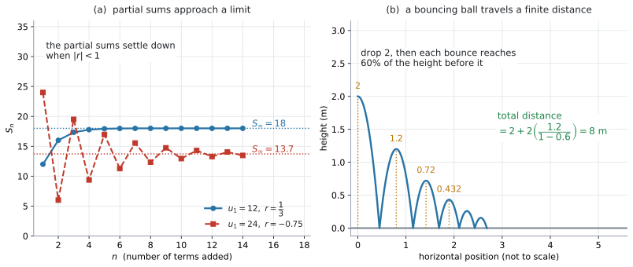

# AHL 1.11 — The sum of an infinite geometric sequence（無限等比級数の和） {#sec-ahl-1-11}

::: {.callout-note}
## What you should be able to do
- 等比数列を**無限に足しても、有限の値に落ち着くことがある**と言える。
- $S_{\infty} = \dfrac{u_1}{1-r}$ を、$\lvert r \rvert < 1$ を確かめてから使える。
- **$u_1 \neq 0$ で $\lvert r \rvert \geq 1$ なら和が存在しない**ことを、理由とともに説明できる。
- $S_{\infty}$ が与えられて、$u_1$ や $r$ を逆に求められる。
- 弾むボールのような文脈で、**何を足しているのか**を式にできる。
:::

::: {.callout-important}
## 公式集の 1.11 の欄
$1$ 行と、その条件が印刷されています。

$$
S_{\infty} = \frac{u_1}{1-r}, \quad \lvert r \rvert < 1
$$ {#eq-ahl111-sinf}

見出しは「**The sum of an infinite geometric sequence**」です。

**式も条件も配られるので、覚える必要はありません。** 身につけるべきなのは、**条件を確かめてから使う**ことと、**$u_1$ がどれなのかを見分ける**ことです。

有限個の和 $S_n$ は、[SL 1.3](../../ai-sl/01-number-and-algebra/sl-1-3.qmd) の欄にあります。このページは、その $n$ を無限に大きくしたらどうなるか、という話です。
:::

::: {.callout-note}
## シラバスが、この項目に求めていること
Content 欄は $1$ 行です。

> The sum of infinite geometric sequences.

Guidance 欄も $1$ 行です。

> **Link to:** the concept of a limit (SL 5.1), fractals (AHL 3.9), and Markov chains (AHL 4.19).

Connections 欄には、文脈と TOK の問いが挙がっています。

> **Other contexts:** Total distance travelled by a bouncing ball.

> **TOK:** Is it possible to know about things of which we can have no experience, such as infinity?

**弾むボールは、シラバスが名指しした文脈**です。@exm-ahl111-ball で扱います。
:::

## The idea

### 1. 無限に足しても、行き先が決まることがあります {#idea}

$$
\frac{1}{2} + \frac{1}{4} + \frac{1}{8} + \frac{1}{16} + \cdots
$$

を足し続けると、どうなるでしょうか。項は無限にあるので、**いくらでも大きくなりそう**に見えます。

しかし、実際には $1$ を超えません。**$1$ までの残り**を見てください。

$\dfrac{1}{2}$ まで足した時点で、$1$ までの残りは $\dfrac{1}{2}$ です。次に足す $\dfrac{1}{4}$ は、**その残りのちょうど半分**です。足すと和は $\dfrac{3}{4}$、残りは $\dfrac{1}{4}$ に減ります。次の $\dfrac{1}{8}$ も、また残りの半分です。足すと $\dfrac{7}{8}$、残りは $\dfrac{1}{8}$。

つまり、**足すたびに、$1$ までの残りがちょうど半分になる**ということです。半分にし続けても $0$ にはならないので、残りは決してなくなりません。だから和は $1$ に近づきはしても、$1$ を追い越せないのです。

**足す個数が無限でも、和が有限の値に落ち着くことがある。** これがこの項目の中身です。

{#fig-ahl111-sum width=100%}

### 2. 有限個の和から出発します {#finite}

[SL 1.3](../../ai-sl/01-number-and-algebra/sl-1-3.qmd) で、最初の $n$ 項の和を出しました。この和を **partial sum**（部分和）といいます。

$$
S_n = \frac{u_1\left(1-r^{n}\right)}{1-r}, \quad r \neq 1
$$ {#eq-ahl111-sn}

この式で、**$n$ をどんどん大きくしたらどうなるか**を見ます。動くのは $r^{n}$ のところだけです。$u_1$ も $r$ も $1-r$ も、$n$ とは関係がありません。

### 3. $r^{n}$ の行方は、$\lvert r \rvert$ で決まります {#rn}

$r$ をいくつか選んで、$r^{n}$ がどうなるか見てみます。

| $r$ | $r^{10}$ | $r^{50}$ | $r^{100}$ |
|:--|:--|:--|:--|
| $0.9$ | $0.349$ | $0.00515$ | $0.0000266$ |
| $-0.75$ | $0.0563$ | $0.000000566$ | $0.000000000000321$ |
| $1.1$ | $2.59$ | $117$ | $13800$ |

: $n$ が大きくなると $r^{n}$ はどうなるか {#tbl-ahl111-rn}

$-0.75$ の行は、$n$ が偶数なのでどれも正の数です。$n$ が奇数なら符号が負になります（$(-0.75)^{51} = -0.000000425$）。**符号は行ったり来たりしますが、大きさは減り続けます。**

上の $2$ 行では、$r^{n}$ が **$0$ に押しつぶされて**いきます。下の $1$ 行では、**大きくなり続けます。**

分かれ目は $\lvert r \rvert$ が $1$ より小さいかどうかです。

$$
\lvert r \rvert < 1 \quad \Longrightarrow \quad r^{n} \to 0 \quad (n \to \infty)
$$ {#eq-ahl111-limit}

$\to$ は「近づく」と読みます。**ちょうど $0$ になるのではなく、いくらでも $0$ に近づく**という意味です。この考え方が、シラバスの Guidance が言う `the concept of a limit` です（[SL 5.1](../../ai-sl/05-calculus/sl-5-1.qmd)）。

### 4. だから $S_{\infty} = \dfrac{u_1}{1-r}$ です {#formula}

@eq-ahl111-sn の $r^{n}$ を $0$ に置きかえます。

$$
S_n = \frac{u_1\left(1-r^{n}\right)}{1-r} \ \longrightarrow \ \frac{u_1(1-0)}{1-r} = \frac{u_1}{1-r}
$$

これが @eq-ahl111-sinf です。この $S_{\infty}$ を、**the sum of an infinite geometric sequence**（無限等比級数の和）といいます。公式集の見出しも、この言葉です。問題文では **sum to infinity** と書かれることのほうが多いので、どちらも同じものだと覚えてください。

**公式集の $\lvert r \rvert < 1$ という条件は、$r^{n} \to 0$ が成り立つ範囲**を書いたものです。

@fig-ahl111-sum の (a) が、その様子です。$u_1 = 12$、$r = \dfrac{1}{3}$ の青い点は、$18$ の線に下から吸い寄せられていきます。

$$
S_{\infty} = \frac{12}{1-\frac{1}{3}} = \frac{12}{\frac{2}{3}} = 18
$$

### 5. $r$ が負でも構いません {#negative-r}

@fig-ahl111-sum の (a) の赤い点が、$u_1 = 24$、$r = -0.75$ の場合です。部分和は**行き過ぎたり戻ったりを繰り返しながら**、$13.7$ に近づいていきます。

$\lvert -0.75 \rvert = 0.75 < 1$ なので、条件は満たしています。

$$
S_{\infty} = \frac{24}{1-(-0.75)} = \frac{24}{1.75} = 13.7
$$

::: {.callout-warning}
## $1 - r$ の $r$ に、符号ごと入れてください
$r = -0.75$ のとき、分母は $1 - 0.75 = 0.25$ ではありません。

$$
1 - (-0.75) = 1 + 0.75 = 1.75
$$

**$r$ が負なら、分母は $1$ より大きくなります**（[Common errors](#common-errors) の $2$ つ目）。
:::

### 6. $u_1 \neq 0$ で $\lvert r \rvert \geq 1$ なら、和が存在しません {#diverge}

条件を外れると、部分和は落ち着き先を持ちません。この状態を **diverge**（発散する）といいます。

以下では、ふつうの等比数列として **$u_1 \neq 0$** を考えます（$u_1 = 0$ なら、すべての項も部分和も $0$ になり、$r$ が何であっても $S_{\infty} = 0$ が存在する、という例外があります）。

| $r$ の範囲 | 部分和のふるまい | $S_{\infty}$ |
|:--|:--|:--|
| $\lvert r \rvert < 1$ | ひとつの値に近づく（**converge**・収束する） | $\dfrac{u_1}{1-r}$ |
| $r > 1$ | 一定の値に近づかず、大きさが際限なく大きくなる | **存在しない** |
| $r < -1$ | 符号を変えながら、大きさが際限なく大きくなる | **存在しない** |
| $r = 1$ | $S_n = n\,u_1$。一定の値に近づかない | **存在しない** |
| $r = -1$ | $u_1,\ 0,\ u_1,\ 0,\ \ldots$ と振動し、一定の値に近づかない | **存在しない** |

: $r$ で決まること（$u_1 \neq 0$） {#tbl-ahl111-cases}

$r = 1$ の行では、@eq-ahl111-sn の分母が $0$ になるので、そもそも式が使えません。だから公式集にも $r \neq 1$ と書いてあります。

::: {.callout-important}
## 使う前に、$\lvert r \rvert < 1$ を確かめてください
条件を確かめずに @eq-ahl111-sinf に入れると、**数は出てきます。** $r = -1.5$、$u_1 = 6$ なら

$$
\frac{6}{1-(-1.5)} = \frac{6}{2.5} = 2.4
$$

となります。しかし $\lvert -1.5 \rvert = 1.5 \geq 1$ なので、**この $2.4$ には意味がありません。**

答案には、**「$\lvert r \rvert < 1$ だから使える」の一言**を書く習慣を付けてください。書いておいて損はありません。
:::

### 7. sum to infinity の利用方法 {#uses}

$S_{\infty}$ を使うのは、**終わりのない繰り返しの、合計を知りたい**ときです。AI HL では、次の $4$ つの場面で出てきます。

- **弾むボール**（total distance travelled by a bouncing ball）… 跳ね返るたびに高さが一定の割合で減るので、動いた距離の合計が無限等比級数になります。シラバスが名指しした文脈です（@exm-ahl111-ball）
- **fractal**（フラクタル）… [AHL 3.9](../03-geometry-and-trigonometry/ahl-3-9.qmd#fractals) で、縮小をくり返して作る図形。段階を無限に続けたときの長さや面積の合計が、この式で出ます
- **Markov chain**（マルコフ連鎖）… [AHL 4.19](../04-statistics-and-probability/ahl-4-19.qmd) の long-term の状態。回数を無限に増やしたときの「落ち着き先」を求める、という見方が同じです
- **limit**（極限）… [SL 5.1](../../ai-sl/05-calculus/sl-5-1.qmd) の $x \to a$。この項目の $r^{n} \to 0$ が、極限の考え方そのものです

**試験で出るのは、ほとんどが弾むボールの形です。** 残りの $3$ つは、シラバスの Guidance が挙げている行き先——同じ考え方が別の項目でも使われている、という関係です。

## Why it works

ここでは、**なぜ $\lvert r \rvert < 1$ のとき $r^{n}$ が $0$ に近づくのか**だけを説明します。

$r^{n+1} = r^{n} \times r$ です。つまり、$1$ つ進むたびに **$r$ をかける**ことになります。

$\lvert r \rvert < 1$ なら、$r$ をかけるたびに**大きさが必ず小さくなります。** $0.9$ をかけるなら $1$ 割減、$0.5$ をかけるなら半分です。

これを何度もくり返すと、どうなるか。$r = 0.9$ で見てみます。

$$
0.9^{10} = 0.349, \qquad 0.9^{50} = 0.00515, \qquad 0.9^{100} = 0.0000266
$$

$0.9$ は $1$ にかなり近い数ですが、それでも $100$ 回かけると $10$ 万分の $3$ ほどになります。**どんなに $1$ に近くても、$1$ より小さければ、いつかは好きなだけ $0$ に近づけられます。**

いっぽう $\lvert r \rvert > 1$ では、かけるたびに大きさが増えます。$1.1$ でも $100$ 回で $13800$ ほどです。**$0$ に近づくどころか、離れていきます。**

$r$ が負のときは、符号が毎回入れかわります。しかし @eq-ahl111-limit で見ているのは**大きさ**なので、$\lvert r \rvert < 1$ でありさえすれば、符号がどうであれ $0$ に近づきます。

## Worked examples

::: {.callout-note appearance="simple"}
問題文は英語です。意味が理解できなかったら、問題文の下の「**日本語訳**」を開いてください。解説は日本語です。
:::

::: {#exm-ahl111-basic}
[A geometric sequence has first term $u_1 = 12$ and common ratio $r = \dfrac{1}{3}$.]{.q-en}

[Find the sum to infinity of the sequence.]{.q-en}

<details class="jp-trans">
<summary>日本語訳</summary>

ある等比数列の first term が $u_1 = 12$、common ratio が $r = \dfrac{1}{3}$ です。

この数列の sum to infinity を求めなさい。

</details>

---

まず条件を確かめます。`Show that` や `Justify` の付いた設問では、この $1$ 行が答案に要ります（[第6節](#diverge)）。付いていない設問でも、書いておけば公式を使ってよい場面かどうかを自分で確かめられます。

$$
\lvert r \rvert = \frac{1}{3} < 1
$$

条件を満たしているので、@eq-ahl111-sinf が使えます。

$$
S_{\infty} = \frac{12}{1-\frac{1}{3}} = \frac{12}{\frac{2}{3}} = 12 \times \frac{3}{2} = 18
$$

分数で割るところは、**逆数をかける**と間違えにくくなります。

**検算。** 最初の何項かを足してみます。$12 + 4 + \dfrac{4}{3} + \dfrac{4}{9} = 17.77\ldots$ で、$18$ に近づいています ✓（@fig-ahl111-sum の (a) の青い点です）

::: {.callout-note}
## 解答例（答案用紙にはこう書く）
*$\lvert r \rvert = \frac{1}{3} < 1$, so the sum to infinity exists.*

$$S_{\infty} = \frac{u_1}{1-r} = \frac{12}{1-\frac{1}{3}} = \frac{12}{\frac{2}{3}} = 18$$
:::
:::

::: {#exm-ahl111-negative}
[Consider the geometric sequence $24,\ -18,\ 13.5,\ \ldots$]{.q-en}

**(a)** [Find the common ratio.]{.q-en}

**(b)** [Show that the sum to infinity exists, and find its value, giving your answer correct to $3$ significant figures.]{.q-en}

<details class="jp-trans">
<summary>日本語訳</summary>

等比数列 $24,\ -18,\ 13.5,\ \ldots$ を考えます。

**(a)** common ratio を求めなさい。

**(b)** sum to infinity が存在することを示し、その値を有効数字 $3$ 桁で求めなさい。

</details>

---

**(a)** common ratio は、**となり合う項の割り算**で出します（[SL 1.3](../../ai-sl/01-number-and-algebra/sl-1-3.qmd)）。引き算ではありません。

$$
r = \frac{u_2}{u_1} = \frac{-18}{24} = -0.75
$$

**検算。** $-18 \times (-0.75) = 13.5$ ✓ $3$ 項目と合いました。

**(b)** `Show that` なので、条件を確かめる過程を書きます。

$$
\lvert r \rvert = \lvert -0.75 \rvert = 0.75 < 1
$$

ですから sum to infinity は存在します。

$$
S_{\infty} = \frac{24}{1-(-0.75)} = \frac{24}{1.75} = 13.714\ldots = 13.7
$$

分母が $1.75$ になるところに気をつけてください（[第5節](#negative-r)）。

::: {.callout-note}
## 解答例（答案用紙にはこう書く）
**(a)**
$$r = \frac{-18}{24} = -0.75$$

**(b)**
*$\lvert r \rvert = 0.75 < 1$, so the sum to infinity exists.*
$$S_{\infty} = \frac{24}{1-(-0.75)} = \frac{24}{1.75} = 13.7$$
:::
:::

::: {#exm-ahl111-reverse}
[The sum to infinity of a geometric sequence is $50$. The first term is $20$.]{.q-en}

[Find the common ratio.]{.q-en}

<details class="jp-trans">
<summary>日本語訳</summary>

ある等比数列の sum to infinity が $50$、first term が $20$ です。

common ratio を求めなさい。

</details>

---

@eq-ahl111-sinf に、分かっているものを入れて $r$ の方程式にします。

$$
\frac{20}{1-r} = 50
$$

分母を払います。

$$
20 = 50(1-r)
$$

$$
1-r = \frac{20}{50} = 0.4
$$

$$
r = 1 - 0.4 = 0.6
$$

**最後に条件を確かめてください。** $\lvert 0.6 \rvert < 1$ なので、この $r$ は使えます。

**検算。** $\dfrac{20}{1-0.6} = \dfrac{20}{0.4} = 50$ ✓ 元の値に戻りました。

::: {.callout-tip}
## $S_{\infty}$ が $u_1$ より小さい答えが出たら、疑ってください
$u_1 > 0$ で $0 < r < 1$ のときは、$1-r$ が $1$ より小さいので、**$S_{\infty}$ は $u_1$ より大きく**なります。

ここでは $u_1 = 20 > 0$、$r = 0.6 > 0$ で、$50 > 20$。つじつまが合っています。

**$u_1$ が負のときは、向きがそっくり逆になります。**
:::

::: {.callout-note}
## 解答例（答案用紙にはこう書く）
$$\frac{20}{1-r} = 50$$
$$20 = 50(1-r) \ \Rightarrow \ 1-r = 0.4 \ \Rightarrow \ r = 0.6$$
*Since $\lvert 0.6 \rvert < 1$, the sum to infinity does exist.*
:::
:::

::: {#exm-ahl111-ball}
[A ball is dropped from a height of $2$ metres. After each bounce it rises to $60\%$ of the height it fell from.]{.q-en}

**(a)** [Find the height the ball reaches after the first bounce.]{.q-en}

**(b)** [Find the total vertical distance travelled by the ball before it comes to rest.]{.q-en}

**(c)** [Comment on whether the answer to part (b) is realistic.]{.q-en}

<details class="jp-trans">
<summary>日本語訳</summary>

ボールを高さ $2$ メートルから落とします。$1$ 回はねるたびに、落ちてきた高さの $60\%$ まで上がります。

**(a)** $1$ 回目にはねたあと、ボールが達する高さを求めなさい。

**(b)** ボールが止まるまでに動く縦方向の距離の合計を求めなさい。

**(c)** (b) の答えが現実的かどうかについて、コメントしなさい。

</details>

---

**(a)** $2 \times 0.6 = 1.2$ メートルです。

**(b)** ここが要点です。**何を足しているのかを、先に書き出してください。**

@fig-ahl111-sum の (b) を見ながら、動きを追います。

- **最初の落下** … $2$（これは $1$ 回だけ）
- **$1$ 回目のはね返り** … 上に $1.2$、下に $1.2$
- **$2$ 回目** … 上に $0.72$、下に $0.72$
- 以下、$0.6$ 倍ずつ続く

$1$ 回目から先は、**上りと下りで同じ距離を $2$ 回ずつ**通ります。ですから

$$
\text{合計} = 2 + 2\left(1.2 + 0.72 + 0.432 + \cdots\right)
$$

かっこの中は $u_1 = 1.2$、$r = 0.6$ の等比数列です。$\lvert 0.6 \rvert < 1$ なので

$$
1.2 + 0.72 + 0.432 + \cdots = \frac{1.2}{1-0.6} = \frac{1.2}{0.4} = 3
$$

$$
\text{合計} = 2 + 2(3) = 8
$$

答えは $8$ メートルです。

::: {.callout-warning}
## この問題で落とすところは、$2$ か所です
- **最初の落下 $2$ を足し忘れる**（$6$ になってしまう）
- **$2$ 倍を忘れる**（$5$ になってしまう）

図をかいて、上りと下りを別々に数えるのが確実です。
:::

**(c)** `Comment on` は、**言葉で答える**設問です。

::: {.model-answer}
**試験ではこう書く**

*The model gives a finite total distance of $8$ m, which is reasonable: even though the ball bounces infinitely many times in the model, the bounce heights shrink very quickly. However, a real ball stops after a finite number of bounces, and the model ignores air resistance and assumes the $60\%$ ratio still holds for very small bounces, so $8$ m is an estimate rather than an exact value.*
:::

（このモデルは合計 $8$ m という有限の値を出しており、それは無理のない値である。モデルの中ではボールは無限回はねるが、はねる高さがすぐにとても小さくなるからである。ただし実際のボールは有限の回数ではね終わり、モデルは空気抵抗や、はねが小さくなったときに $60\%$ という比が崩れることを考えていないので、$8$ m は正確な値ではなく見積もりである、という意味です。）

::: {.callout-note}
## 解答例（答案用紙にはこう書く）
**(a)**
$$2 \times 0.6 = 1.2 \text{ m}$$

**(b)**
*After the first drop, each bounce height is travelled twice (up and down).*
$$\text{total} = 2 + 2\left(1.2 + 0.72 + \cdots\right)$$
*The series in brackets is geometric with $u_1 = 1.2$ and $r = 0.6$, and $\lvert r \rvert < 1$:*
$$\frac{1.2}{1-0.6} = 3$$
$$\text{total} = 2 + 2(3) = 8 \text{ m}$$

**(c)**
*The total distance is finite because the bounce heights shrink geometrically. A real ball stops after a finite number of bounces and the model ignores air resistance, so $8$ m is an estimate.*
:::
:::

## Common errors

::: {.callout-warning}
## $\lvert r \rvert < 1$ を確かめずに、公式に入れる
$r = 2$ でも $\dfrac{u_1}{1-r}$ は計算できてしまいます。$u_1 = 3$ なら $\dfrac{3}{-1} = -3$ です。

**正の数ばかりを足しているのに、答えが負になりました。** これは、条件を外れた式に意味がない証拠です。

ただし $r = -1.5$ のように、**それらしい数が出てしまう**場合もあります（演習 $10$）。符号がおかしいかどうかではなく、**$\lvert r \rvert$ を見て**判断してください。

`Find the sum to infinity` と問われたら、まず $\lvert r \rvert$ を見てください（[第6節](#diverge)）。
:::

::: {.callout-warning}
## $1-r$ に、$r$ の符号を入れ忘れる
$r = -0.75$ のとき、分母を $0.25$ としてしまう誤りです。

$$
1 - (-0.75) = 1.75
$$

**引き算の記号と $r$ の負号が、$2$ つ並びます。** かっこを付けて書けば見落としません（[第5節](#negative-r)）。
:::

::: {.callout-warning}
## $u_1$ を取り違える
数列が $u_2$ から与えられているのに、それを $u_1$ として使ってしまう誤りです。

@eq-ahl111-sinf の $u_1$ は、**その数列の最初の項**です。$u_2$ と $u_3$ が与えられた問題では、まず $r$ を出して、$u_1 = \dfrac{u_2}{r}$ で $1$ つ戻ってください。

弾むボールの問題では、**かっこの中の数列の最初の項**が $u_1$ です。最初の落下の $2$ ではありません（@exm-ahl111-ball）。
:::

::: {.callout-warning}
## $r$ を、引き算で出す
$24,\ -18,\ 13.5$ で、$r = -18 - 24 = -42$ としてしまう誤りです。

**引き算で出すのは、等差数列の common difference です。** 等比数列の common ratio は割り算で出します。

$$
r = \frac{u_2}{u_1} = \frac{-18}{24} = -0.75
$$

**$3$ 項目でも同じ $r$ になるか**を見れば、すぐ確かめられます。
:::

::: {.callout-warning}
## 弾むボールで、上りと下りを数え違える
最初の落下だけは $1$ 回、それ以降は上りと下りで $2$ 回ずつ——というところを間違えると、$5$ や $6$ という答えになります。

**図をかいてください。** @fig-ahl111-sum の (b) のように、山の形を $3$ つか $4$ つかいて、それぞれの高さを書きこむだけで防げます。
:::

## Using your GDC (TI-Nspire CX II)

### 1. 公式は手で入れます {#gdc-formula}

$S_{\infty} = \dfrac{u_1}{1-r}$ を計算するだけなら、電卓の出番はほとんどありません。

**分数のテンプレート**（$9$ キーの右にあるテンプレートのパレット）に、分子と分母を見た目のまま入れます。分母の $1-\dfrac{1}{3}$ も、その中でもう一度テンプレートを使えば、そのままの形で入ります。

$$
\frac{12}{1-\frac{1}{3}}
$$

$18$ と返ります。$1$ 行で `12/(1-1/3)` と打っても同じですが、そのときは**分母全体をかっこで囲む**ことが要ります。`12/1-1/3` は $12 - \dfrac{1}{3}$ になってしまいます。

### 2. 部分和で、近づく様子を見る {#gdc-partial}

$\Sigma$ のテンプレート（$9$ キーの右のパレット）を使うと、部分和を一度に出せます。下の箱に `n=1`、上の箱に足す個数、まん中に $12 \times \left(\dfrac{1}{3}\right)^{n-1}$ を入れます（[SL 1.3](../../ai-sl/01-number-and-algebra/sl-1-3.qmd) と同じ操作です）。

$\texttt{sum}\left(\texttt{seq}\left(12 \times \left(\dfrac{1}{3}\right)^{n - 1},\ n,\ 1,\ 10\right)\right)$

と打っても、同じ値が出ます。

**$n$ を $3$、$5$、$10$ と変えてみてください。** $17.333\ldots$、$17.926\ldots$、$17.9997$ と、$18$ に近づいていく様子が見えます。$n = 20$ まで行くと画面には $18$ と出ます。**そこまで来ると差が見えなくなる**——それが「近づく」ということです。

### 3. 表にして見る {#gdc-table}

```
ctrl + doc → Add Lists & Spreadsheet
```

いちばん上の名前の行に `n`、`sn` と打ってから、$n$ に $1$ から $20$、$s_n$ に @eq-ahl111-sn の値を入れます。@fig-ahl111-sum の (a) の**青いほうの点**が、そのまま表になります。

Data & Statistics ページで散布図にすると、**落ち着いていく様子が絵で見えます。**

::: {.callout-warning}
## 電卓は、条件を確かめてくれません
$r = 2$ を入れても、電卓は文句を言わずに数を返します。

**$\lvert r \rvert < 1$ の確認は、自分でやること**です（[第6節](#diverge)）。
:::

### 4. 検算のしかた {#gdc-check}

- $S_{\infty}$ を出したら、**$n = 20$ くらいの部分和**と見くらべる。近ければ合っています
- $r$ を逆算した問題では、**出した $r$ を元の式に戻して** $S_{\infty}$ が合うか見る
- 文脈問題では、**何を足しているかを日本語で書き出してから**電卓を使う

$1$ つ目が、いちばん確実です。**部分和と大きく離れていたら、どこかで間違えています。**

## Exercises

::: {.callout-note appearance="simple"}
各問題に、折りたたみが3つ付いています。**日本語訳**、**解答例**（答案用紙に書くべきこと。英語です）、**解説**（なぜそうなるか。日本語です）。

まず自分で解いて、次に解答例と見くらべてください。**解説は、合わなかったときだけ開けば十分です。**
:::

::: {.exercise-block}

[1]{.ex-no} [A geometric sequence has $u_1 = 40$ and $r = 0.25$. Find the sum to infinity, giving your answer correct to $3$ significant figures.]{.q-en}

<details class="jp-trans">
<summary>日本語訳</summary>

ある等比数列の $u_1 = 40$、$r = 0.25$ です。sum to infinity を有効数字 $3$ 桁で求めなさい。

</details>

::: {.callout-note collapse="true"}
## 解答例（答案用紙に書くこと）

*$\lvert r \rvert = 0.25 < 1$, so the sum to infinity exists.*

$$S_{\infty} = \frac{40}{1-0.25} = \frac{40}{0.75} = 53.3$$
:::

::: {.callout-tip collapse="true"}
## 解説

条件の確認を、答えの前に $1$ 行書いてください（[第6節](#diverge)）。

$\dfrac{40}{0.75} = \dfrac{160}{3} = 53.333\ldots$ なので、$3$ s.f. で $53.3$ です。

**検算。** $S_{\infty}$ は $u_1 = 40$ より大きくなるはずです（@exm-ahl111-reverse の tip）。$53.3 > 40$ ✓
:::

::: {.ex-sep}
:::

[2]{.ex-no} [Find the sum to infinity of the geometric sequence $18,\ 6,\ 2,\ \ldots$]{.q-en}

<details class="jp-trans">
<summary>日本語訳</summary>

等比数列 $18,\ 6,\ 2,\ \ldots$ の sum to infinity を求めなさい。

</details>

::: {.callout-note collapse="true"}
## 解答例（答案用紙に書くこと）

$$r = \frac{6}{18} = \frac{1}{3}$$

*$\lvert r \rvert = \frac{1}{3} < 1$, so the sum to infinity exists.*

$$S_{\infty} = \frac{18}{1-\frac{1}{3}} = \frac{18}{\frac{2}{3}} = 27$$
:::

::: {.callout-tip collapse="true"}
## 解説

$r$ は割り算で出します（[Common errors](#common-errors) の $4$ つ目）。

**検算。** $6 \times \dfrac{1}{3} = 2$ ✓ $3$ 項目と合っています。

分数で割るときは、逆数をかけてください。$18 \times \dfrac{3}{2} = 27$ です。
:::

::: {.ex-sep}
:::

[3]{.ex-no} [Find the sum to infinity of the geometric sequence $5,\ -2,\ 0.8,\ \ldots$, giving your answer correct to $3$ significant figures.]{.q-en}

<details class="jp-trans">
<summary>日本語訳</summary>

等比数列 $5,\ -2,\ 0.8,\ \ldots$ の sum to infinity を、有効数字 $3$ 桁で求めなさい。

</details>

::: {.callout-note collapse="true"}
## 解答例（答案用紙に書くこと）

$$r = \frac{-2}{5} = -0.4$$

*$\lvert r \rvert = 0.4 < 1$, so the sum to infinity exists.*

$$S_{\infty} = \frac{5}{1-(-0.4)} = \frac{5}{1.4} = 3.57$$
:::

::: {.callout-tip collapse="true"}
## 解説

$r$ が負なので、分母は $1.4$ になります（[第5節](#negative-r)）。$0.6$ としないでください。

$\dfrac{5}{1.4} = 3.5714\ldots$ なので $3.57$ です。

**$S_{\infty}$ が $u_1$ より小さくなりました。** $u_1 > 0$ で $r$ が負のときは、これで正しい向きです。$r$ が負だと分母の $1-r$ が $1$ より**大きく**なるので、$\dfrac{u_1}{1-r}$ は $u_1$ より小さくなります。

**検算。** $5 - 2 + 0.8 - 0.32 = 3.48$ で、$3.57$ のまわりを行き来しています ✓ 項を足すたびに、上と下から交互に近づきます。
:::

::: {.ex-sep}
:::

[4]{.ex-no} [Explain why the geometric sequence $3,\ 6,\ 12,\ 24,\ \ldots$ does not have a sum to infinity.]{.q-en}

<details class="jp-trans">
<summary>日本語訳</summary>

等比数列 $3,\ 6,\ 12,\ 24,\ \ldots$ に sum to infinity がない理由を説明しなさい。

</details>

::: {.callout-note collapse="true"}
## 解答例（答案用紙に書くこと）

$$r = \frac{6}{3} = 2$$

*Since $\lvert r \rvert = 2 \geq 1$, the terms do not get smaller: each term is twice the one before it. The partial sums therefore increase without limit and do not approach any fixed value, so there is no sum to infinity.*
:::

::: {.callout-tip collapse="true"}
## 解説

`Explain why` なので、英語で理由を書きます。

言うべきことは $2$ つです。

- $r = 2$ で、$\lvert r \rvert \geq 1$ である
- だから項が小さくならず、部分和が落ち着き先を持たない

**「公式の条件を満たさないから」だけでは弱い**答案です。条件を満たさないと**何が起きるのか**まで書いてください（[第3節](#rn)）。

::: {.model-answer}
**試験ではこう書く**

*The common ratio is $r = 2$, so $\lvert r \rvert \geq 1$ and the condition $\lvert r \rvert < 1$ is not met. Each term is larger than the one before, so the partial sums grow without limit instead of approaching a fixed value. The sequence therefore has no sum to infinity.*
:::
:::

::: {.ex-sep}
:::

[5]{.ex-no} [A geometric sequence has $r = 0.4$ and sum to infinity $60$. Find the first term.]{.q-en}

<details class="jp-trans">
<summary>日本語訳</summary>

ある等比数列の $r = 0.4$、sum to infinity が $60$ です。first term を求めなさい。

</details>

::: {.callout-note collapse="true"}
## 解答例（答案用紙に書くこと）

*$\lvert r \rvert = 0.4 < 1$, so the sum to infinity exists.*

$$\frac{u_1}{1-0.4} = 60$$

$$u_1 = 60 \times 0.6 = 36$$
:::

::: {.callout-tip collapse="true"}
## 解説

@eq-ahl111-sinf に分かっている値を入れて、$u_1$ について解きます。

$1-0.4 = 0.6$ を先に計算してから、両辺にかけてください。

**検算。** $\dfrac{36}{0.6} = 60$ ✓ 元の値に戻りました。

$u_1 = 36$ は $S_{\infty} = 60$ より小さく、$r > 0$ の場合として正しい向きです。
:::

::: {.ex-sep}
:::

[6]{.ex-no} [A geometric sequence has $u_1 = 8$ and sum to infinity $12$.]{.q-en}

**(a)** [Find the common ratio.]{.q-en}

**(b)** [Hence find the third term.]{.q-en}

<details class="jp-trans">
<summary>日本語訳</summary>

ある等比数列の $u_1 = 8$、sum to infinity が $12$ です。

**(a)** common ratio を求めなさい。

**(b)** これを用いて $3$ 項目を求めなさい。

</details>

::: {.callout-note collapse="true"}
## 解答例（答案用紙に書くこと）

**(a)**
$$\frac{8}{1-r} = 12 \ \Rightarrow \ 1-r = \frac{8}{12} = \frac{2}{3} \ \Rightarrow \ r = \frac{1}{3}$$

*$\lvert r \rvert = \frac{1}{3} < 1$, so the sum to infinity does exist.*

**(b)**
$$u_3 = u_1 r^{2} = 8 \times \left(\frac{1}{3}\right)^{2} = \frac{8}{9}$$
:::

::: {.callout-tip collapse="true"}
## 解説

**(a)** 分母を払ってから $r$ について解きます。$\dfrac{8}{12}$ は約分して $\dfrac{2}{3}$ にしておくと、あとが楽になります。

**(b)** `Hence` は「(a) の答えを使いなさい」という指示です。$u_n = u_1 r^{\,n-1}$（[SL 1.3](../../ai-sl/01-number-and-algebra/sl-1-3.qmd)）に $n = 3$ を入れます。

**指数は $n-1 = 2$ です。** $3$ 乗ではありません。

**検算。** $8 + \dfrac{8}{3} + \dfrac{8}{9} + \dfrac{8}{27} = 11.85\ldots$ で、$12$ に近づいています ✓
:::

::: {.ex-sep}
:::

[7]{.ex-no} [A geometric sequence has $u_2 = 6$ and $u_3 = 4$. Find the sum to infinity.]{.q-en}

<details class="jp-trans">
<summary>日本語訳</summary>

ある等比数列の $u_2 = 6$、$u_3 = 4$ です。sum to infinity を求めなさい。

</details>

::: {.callout-note collapse="true"}
## 解答例（答案用紙に書くこと）

$$r = \frac{u_3}{u_2} = \frac{4}{6} = \frac{2}{3}$$

$$u_1 = \frac{u_2}{r} = \frac{6}{\frac{2}{3}} = 9$$

*$\lvert r \rvert = \frac{2}{3} < 1$, so the sum to infinity exists.*

$$S_{\infty} = \frac{9}{1-\frac{2}{3}} = \frac{9}{\frac{1}{3}} = 27$$
:::

::: {.callout-tip collapse="true"}
## 解説

**$6$ を $u_1$ として使わないでください**（[Common errors](#common-errors) の $3$ つ目）。与えられているのは $2$ 項目です。

手順は $3$ つです。

1. $r$ を、となり合う項の割り算で出す
2. $u_1 = \dfrac{u_2}{r}$ で $1$ つ**戻る**
3. @eq-ahl111-sinf に入れる

$2$ 番は、かけるのではなく**割る**ところに気をつけてください。前へ戻るからです。

**検算。** $9 \times \dfrac{2}{3} = 6$ ✓ $u_2$ と合いました。
:::

::: {.ex-sep}
:::

[8]{.ex-no} [A geometric sequence has first term $5$ and common ratio $r$. State the values of $r$ for which the sequence has a sum to infinity, giving a reason.]{.q-en}

<details class="jp-trans">
<summary>日本語訳</summary>

ある等比数列の first term が $5$、common ratio が $r$ です。この数列が sum to infinity を持つような $r$ の値を述べ、理由も書きなさい。

</details>

::: {.callout-note collapse="true"}
## 解答例（答案用紙に書くこと）

$$-1 < r < 1$$

*The formula $S_{\infty} = \dfrac{u_1}{1-r}$ requires $\lvert r \rvert < 1$. This is the condition under which $r^{n} \to 0$ as $n \to \infty$, so that the partial sums approach a fixed value.*
:::

::: {.callout-tip collapse="true"}
## 解説

$\lvert r \rvert < 1$ を、不等号を使わない形で書くと $-1 < r < 1$ です。

`giving a reason` が付いているので、範囲だけでは点になりません。**なぜその範囲なのか**を書いてください。

$u_1 = 5$ という値は、答えに関係しません。**条件は $r$ だけで決まります。**

$r = 1$ と $r = -1$ は**入りません。** 等号を付けないでください（[第6節](#diverge)）。

::: {.model-answer}
**試験ではこう書く**

*The sum to infinity exists exactly when $-1 < r < 1$. The formula $S_{\infty} = \frac{u_1}{1-r}$ comes from letting $n \to \infty$ in $S_n = \frac{u_1(1-r^{n})}{1-r}$, and $r^{n} \to 0$ only when $\lvert r \rvert < 1$. Outside that range the partial sums do not approach a fixed value.*
:::
:::

::: {.ex-sep}
:::

[9]{.ex-no} [A patient takes a $60$ mg dose of a drug at the same time every day. Each day, $25\%$ of the drug in the body at that time is still present $24$ hours later.]{.q-en}

**(a)** [Show that the amount of drug in the body just after a dose approaches a fixed value in the long term, and find that value.]{.q-en}

**(b)** [Interpret this value in the context of the patient.]{.q-en}

<details class="jp-trans">
<summary>日本語訳</summary>

ある患者が、毎日同じ時刻に $60$ mg の薬を飲みます。そのとき体内にある薬のうち、$25\%$ が $24$ 時間後にも残っています。

**(a)** 服用直後に体内にある薬の量が、長い目で見てひとつの値に近づくことを示し、その値を求めなさい。

**(b)** その値を、この患者の文脈で解釈しなさい。

</details>

::: {.callout-note collapse="true"}
## 解答例（答案用紙に書くこと）

**(a)**
*Just after the $n$th dose, the body contains the $60$ mg just taken, plus $25\%$ of what was there a day earlier, and so on:*

$$60 + 60(0.25) + 60(0.25)^{2} + \cdots$$

*This is geometric with $u_1 = 60$ and $r = 0.25$, and $\lvert r \rvert < 1$, so the sum to infinity exists:*

$$S_{\infty} = \frac{60}{1-0.25} = \frac{60}{0.75} = 80 \text{ mg}$$

**(b)**
*In the long term, the amount just after a dose settles at about $80$ mg. The drug does not build up without limit, because each day three quarters of what is present is removed, and eventually the $60$ mg taken each day is balanced by the $60$ mg lost each day.*
:::

::: {.callout-tip collapse="true"}
## 解説

**(a)** いちばん大事なのは、**何を足しているのかを書き出す**ことです。

服用直後の量は、

- 今日飲んだ $60$
- 昨日の分の残り $60 \times 0.25$
- 一昨日の分の残り $60 \times 0.25^{2}$

を足したものです。$u_1 = 60$、$r = 0.25$ の等比数列になっています。

`Show that` なので、**この足し算の形を書いてから**公式を使ってください。数字だけでは点になりません。

**(b)** `Interpret` なので、$80$ mg という数の意味を文脈の言葉で言います。単位を忘れないでください。

**なぜ増え続けないのか**まで書けると、しっかりした答案になります。長い目で見ると、$1$ 日に入る $60$ mg と、$1$ 日に失われる量がつり合います。$80 \times 0.75 = 60$ で、たしかにつり合っています。

同じ「落ち着き先」の考え方が、[AHL 4.19](../04-statistics-and-probability/ahl-4-19.qmd) の Markov chain にも出てきます（[第7節](#uses)）。

::: {.model-answer}
**試験ではこう書く**

*In the long term the amount just after a dose settles at $80$ mg, so the drug does not build up without limit. Each day $75\%$ of what is present is removed, and when the amount reaches $80$ mg the $60$ mg lost each day is exactly replaced by the $60$ mg dose, so the level stays steady.*
:::
:::

::: {.ex-sep}
:::

[10]{.ex-no} [A student is asked to find the sum to infinity of the geometric sequence with $u_1 = 6$ and $r = -1.5$, and writes]{.q-en}

$$
S_{\infty} = \frac{6}{1-(-1.5)} = \frac{6}{2.5} = 2.4
$$

[Identify the error and state what the correct answer is.]{.q-en}

<details class="jp-trans">
<summary>日本語訳</summary>

ある生徒が、$u_1 = 6$、$r = -1.5$ の等比数列の sum to infinity を求めるように言われて、上のように書きました。誤りを指摘し、正しい答えが何であるかを述べなさい。

</details>

::: {.callout-note collapse="true"}
## 解答例（答案用紙に書くこと）

*The arithmetic is correct, but the formula may not be used here. It requires $\lvert r \rvert < 1$, and $\lvert -1.5 \rvert = 1.5 \geq 1$.*

*The terms $6,\ -9,\ 13.5,\ -20.25,\ \ldots$ grow in size, so the partial sums do not approach any fixed value.*

*There is no sum to infinity for this sequence.*
:::

::: {.callout-tip collapse="true"}
## 解説

`Identify the error` なので、**どこが違うかを言葉で書く**必要があります。

この問題のこわいところは、**計算そのものは合っている**ことです。$\dfrac{6}{2.5}$ はたしかに $2.4$ です。

間違っているのは、**使ってはいけない場面で公式を使った**ことです（[第6節](#diverge)）。

項を書き出すと $6,\ -9,\ 13.5,\ -20.25,\ \ldots$ で、**大きさが増え続けています。** これを無限に足して $2.4$ に落ち着く、ということはありません。

**答えは「和は存在しない」**です。数を書いてはいけません。

::: {.model-answer}
**試験ではこう書く**

*The student used the formula without checking its condition. Since $\lvert r \rvert = 1.5 \geq 1$, the terms do not shrink and the partial sums grow without limit, so no sum to infinity exists. The value $2.4$ has no meaning here, even though the arithmetic is correct.*
:::
:::

:::
