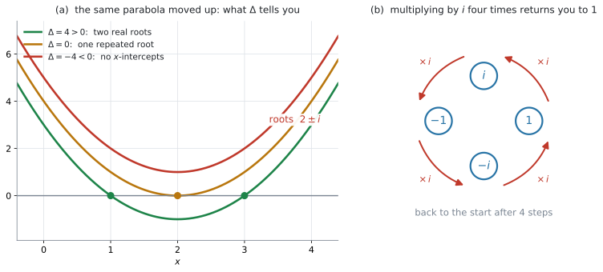

# AHL 1.12a — Complex numbers in Cartesian form（複素数と直交形式） {#sec-ahl-1-12a}

::: {.callout-note}
## What you should be able to do
- **$i^{2} = -1$** という約束から出発して、複素数を **$z = a + bi$** の形で書ける。
- **real part**（実部）と **imaginary part**（虚部）を、正しく取り出せる。
- **conjugate**（共役複素数）$z^{*}$ を書ける。
- 和・差・積を手で計算し、商は **conjugate をかけて** $a + bi$ の形に直せる。
- 実数係数の $2$ 次方程式で **$b^{2}-4ac < 0$** のとき、解を $a \pm bi$ の形で求められる。
- 累乗や検算を、GDC でできる。
:::

::: {.callout-important}
## 公式集の 1.12 の欄
$2$ つだけ印刷されています。

$$
z = a + bi
$$ {#eq-ahl112a-cartesian}

$$
\Delta = b^{2} - 4ac
$$ {#eq-ahl112a-disc}

$2$ つ目の見出しは「**Discriminant**」（判別式）です。

さらに、**Topic 2 の「Prior learning – HL」**の欄に、解の公式そのものが載っています。

$$
ax^{2}+bx+c = 0 \ \text{の解は} \quad x = \frac{-b \pm \sqrt{b^{2}-4ac}}{2a}, \quad a \neq 0
$$ {#eq-ahl112a-quad}

**配られるので、覚える必要はありません。** ただし、$i$ の意味（$i^{2} = -1$）と conjugate の使い方は、どこにも印刷されていません。**そこは自分の中に入れておく必要があります。**
:::

::: {.callout-note}
## AI SL の公式集には、解の公式が載っていません
AI **SL** の公式集を最後まで見ても、$x = \dfrac{-b \pm \sqrt{b^{2}-4ac}}{2a}$ は出てきません。SL では [SL 2.5](../../ai-sl/02-functions/sl-2-5.qmd) の $2$ 次関数を、GDC のグラフで扱っていました。

**HL では、この式が配られるようになります。** $\Delta$ の符号を見る、という作業がここから始まります。

**complex plane**（複素平面）と **modulus**（絶対値）・**argument**（偏角）は、[AHL 1.12b](ahl-1-12b.qmd) で扱います。
:::

## The idea

### 1. $x^{2} = -1$ を解きたい {#idea}

実数の中では、$2$ 乗して負になる数はありません。ですから

$$
x^{2} + 1 = 0
$$

は、実数の解を持ちません。$y = x^{2}+1$ のグラフが $x$ 軸と交わらない、と言っても同じことです。

ここで数学がしたのは、「解なし」で止めることではなく、**$2$ 乗すると $-1$ になる数を $1$ つだけ新しく用意する**ことでした。それが **imaginary unit**（虚数単位）$i$ です。

$$
i^{2} = -1
$$ {#eq-ahl112a-i}

シラバスも、この形で $i$ を定義しています。

> Complex numbers: the number $i$ such that $i^{2} = -1$.

#### 「$i = \sqrt{-1}$」と書かない理由 {#not-sqrt}

$i = \sqrt{-1}$ と書いてある本もありますが、この書き方は落とし穴を作ります。$\sqrt{\ }$ の計算法則をそのまま持ちこむと

$$
\sqrt{-1} \times \sqrt{-1} = \sqrt{(-1)(-1)} = \sqrt{1} = 1
$$

となってしまい、$i^{2} = -1$ と食い違います。**正しいのは $i^{2} = -1$ のほう**です。

間違っているのは $\sqrt{\ }$ の使い方のほうです。$\sqrt{a} \times \sqrt{b} = \sqrt{ab}$ という法則が使えるのは、**$a \geq 0$ かつ $b \geq 0$ のとき**だけで、中身が負のときには成り立ちません。

ですから、**負の数を $\sqrt{\ }$ の中に残したまま計算しないでください。** 先に $i$ を外に出して、$\sqrt{\ }$ の中には正の数だけを残します。そうすれば、あとは今までどおりの法則が使えます。

$$
\sqrt{-36} = \sqrt{36}\,i = 6i, \qquad \sqrt{-20} = \sqrt{20}\,i = 2\sqrt{5}\,i
$$

### 2. Cartesian form は $a + bi$ です {#cartesian}

$i$ を $1$ つ足すだけで、実数と組み合わせた数がすべて書けるようになります。

$$
z = a + bi \qquad (a,\ b \ \text{は実数})
$$

この形を **Cartesian form**（直交形式）といいます。$a$ を **real part**（実部）、$b$ を **imaginary part**（虚部）といい、$\operatorname{Re}(z) = a$、$\operatorname{Im}(z) = b$ と書きます。

::: {.callout-important}
## imaginary part は $b$ です。$bi$ ではありません
$z = 3 + 2i$ のとき

- real part は $3$
- imaginary part は $\mathbf{2}$

です。$2i$ ではありません。**real part も imaginary part も、どちらも実数**です。$i$ は、$2$ つの実数を組にして並べておくための目印だと思ってください。
:::

$b = 0$ のとき $z$ は実数、$a = 0$（かつ $b \neq 0$）のとき **purely imaginary**（純虚数）といいます。

$2$ つの複素数が等しいのは、**real part どうしと imaginary part どうしが、両方とも等しいとき**だけです。答えを $a + bi$ の形にそろえてから見くらべる、という習慣はここから来ています。

### 3. 和と差は、部分ごとに {#add-sub}

$i$ を、文字式の $x$ のように扱ってください。同じ部分どうしを足します。

$$
(3 + 2i) + (1 - 5i) = (3+1) + (2-5)i = 4 - 3i
$$

$$
(3 + 2i) - (1 - 5i) = (3-1) + (2+5)i = 2 + 7i
$$

### 4. 積は、展開してから $i^{2} = -1$ {#multiply}

かっこを普通に展開して、最後に $i^{2}$ を $-1$ に置きかえます。

$$
\begin{aligned}
(3+2i)(1-5i) &= 3 - 15i + 2i - 10i^{2} \\
&= 3 - 13i - 10(-1) \\
&= 13 - 13i
\end{aligned}
$$

**$-10i^{2}$ が $+10$ に変わるところ**が、この計算の要です。$-10$ に $i^{2}$ の $-1$ がかかります。**負の数どうしをかけると正になる**ので、符号が $-$ から $+$ に変わります。

#### $i$ の累乗は $4$ つで一周します {#powers-of-i}

$$
i^{1} = i, \qquad i^{2} = -1, \qquad i^{3} = i^{2}\cdot i = -i, \qquad i^{4} = (i^{2})^{2} = 1
$$

$i^{4} = 1$ に戻るので、ここから先は同じ $4$ つの繰り返しです。ですから $i$ の大きな累乗は、**指数を $4$ で割った余り**だけ見れば決まります。

$$
i^{23} = i^{20} \cdot i^{3} = (i^{4})^{5} \cdot i^{3} = 1 \cdot (-i) = -i
$$

複素数そのものの累乗（$(3+2i)^{7}$ のようなもの）は、**GDC で計算してよい**とシラバスに書かれています。

> Calculating powers of complex numbers, in Cartesian form, with technology.

$z^{2}$ のかたまりを作って、それを何度も $2$ 乗する——という手の方法は @exm-ahl112a-power にあります。

### 5. conjugate は、虚部の符号だけ変えたもの {#conjugate}

$z = a + bi$ に対して、**conjugate**（共役複素数）を

$$
z^{*} = a - bi
$$ {#eq-ahl112a-conj}

と書きます。$\bar{z}$ という書き方もありますが、IB の問題文では $z^{*}$ がよく使われます。

conjugate が大事なのは、**$z$ と $z^{*}$ を足しても、かけても、答えが実数になる**からです。

$$
z + z^{*} = (a+bi) + (a-bi) = 2a
$$

$$
z\,z^{*} = (a+bi)(a-bi) = a^{2} - (bi)^{2} = a^{2} - b^{2}i^{2} = a^{2} + b^{2}
$$ {#eq-ahl112a-zzstar}

$a^{2}+b^{2}$ は、$a$ と $b$ が同時に $0$ でないかぎり**必ず正の実数**です。この $a^{2}+b^{2}$ は、[AHL 1.12b](ahl-1-12b.qmd#modulus) で扱う **modulus**（絶対値）の $2$ 乗にあたります。

### 6. 商は、conjugate をかけて実数の分母にする {#divide}

$\dfrac{3+2i}{1-5i}$ のままでは、$a + bi$ の形になっていません。分母に $i$ が残っているからです。

そこで、**分母の conjugate を、分母と分子の両方にかけます。**

$$
\frac{3+2i}{1-5i} = \frac{(3+2i)(1+5i)}{(1-5i)(1+5i)}
$$

分母は @eq-ahl112a-zzstar より $1^{2}+5^{2} = 26$ で、実数になります。分子は展開して

$$
(3+2i)(1+5i) = 3 + 15i + 2i + 10i^{2} = -7 + 17i
$$

ですから

$$
\frac{3+2i}{1-5i} = \frac{-7+17i}{26} = -\frac{7}{26} + \frac{17}{26}\,i
$$

となります。小数なら $-0.269 + 0.654i$（$3$ s.f.）です。

::: {.callout-tip}
## 中学で習った「分母の有理化」と同じ手です
$\dfrac{1}{2-\sqrt{3}}$ の分母をなくすとき、$2+\sqrt{3}$ をかけました。あのときの相手が、ここでは conjugate になっただけです。
:::

### 7. $b^{2}-4ac < 0$ の $2$ 次方程式 {#quadratic}

実数係数の $2$ 次方程式 $ax^{2}+bx+c = 0$ は、@eq-ahl112a-quad で解けます。$\Delta = b^{2}-4ac$ が負のときは、$\sqrt{\ }$ の中が負になります。**$i$ があれば、そこで止まりません。**

$$
x^{2} - 4x + 13 = 0
$$

$\Delta = (-4)^{2} - 4(1)(13) = 16 - 52 = -36$ です。

$$
x = \frac{4 \pm \sqrt{-36}}{2} = \frac{4 \pm 6i}{2} = 2 \pm 3i
$$

**検算。** $(2+3i)^{2} - 4(2+3i) + 13 = (4 + 12i - 9) - 8 - 12i + 13 = 0$ ✓

#### $\Delta$ の符号と、グラフの関係 {#graph-link}

シラバスの Guidance 欄は、この項目を $2$ 次関数のグラフと結びつけるよう書いています。

> Quadratic formula and the link with the graph of $f(x) = ax^{2}+bx+c$.

{#fig-ahl112a-disc width=78%}

@fig-ahl112a-disc は、$y = x^{2}-4x+3$、$y = x^{2}-4x+4$、$y = x^{2}-4x+5$ の $3$ つです。形は同じで、上下にずれているだけです。

| $\Delta$ | グラフと $x$ 軸 | 解 |
|:--|:--|:--|
| $\Delta > 0$ | $2$ 点で交わる | 実数が $2$ つ |
| $\Delta = 0$ | $1$ 点で接する | 実数が $1$ つ（重解） |
| $\Delta < 0$ | 交わらない | **実数ではない複素数が $2$ つ** |

: $\Delta$ の符号で決まること {#tbl-ahl112a-disc}

**「グラフが $x$ 軸と交わらない」と「解がない」は、別のことです。** 交わらないのは、解が実数の中にないというだけで、複素数まで広げれば $2$ つあります。

#### なぜ、いつも **conjugate pair**（共役な組）になるのか {#why-pair}

$\Delta < 0$ のとき、$\sqrt{\Delta} = \sqrt{|\Delta|}\,i$ ですから、解の公式は

$$
x = \frac{-b}{2a} \pm \frac{\sqrt{\lvert \Delta \rvert}}{2a}\,i
$$

という形になります。$a$、$b$、$\Delta$ はすべて実数なので、

- **real part は $\dfrac{-b}{2a}$ で、$2$ つの解に共通**
- **imaginary part は $\pm$ の符号だけが違う**

これはまさに $p + qi$ と $p - qi$、つまり conjugate pair です。上の例でも $2+3i$ と $2-3i$ になりました。

**係数が実数であることが重要です。** 係数に $i$ が混じっている方程式では、解が組になるとはかぎりません。

## Why it works

ここでは、**なぜ conjugate をかけると分母から $i$ が消えるのか**だけを説明します。

中学校で

$$
(x+y)(x-y) = x^{2} - y^{2}
$$

を習いました。$x = a$、$y = bi$ として、そのまま使います。

$$
(a+bi)(a-bi) = a^{2} - (bi)^{2} = a^{2} - b^{2}i^{2}
$$

ここで $i^{2} = -1$ なので、$-b^{2}i^{2} = +b^{2}$ になります。

$$
(a+bi)(a-bi) = a^{2} + b^{2}
$$

$i$ が消えたのは、**$i$ の入った項が $2$ つ出てきて、符号が逆で打ち消し合ったから**です（$+abi$ と $-abi$）。そして残った $a^{2}+b^{2}$ は、$2$ つの実数の $2$ 乗の和なので、必ず $0$ 以上になります。分母として使えるのは、**$0$ にならない**——つまり $z \neq 0$ である——ときです。

## Worked examples

::: {.callout-note appearance="simple"}
問題文は英語です。意味が理解できなかったら、問題文の下の「**日本語訳**」を開いてください。解説は日本語です。
:::

::: {#exm-ahl112a-four}
[Let $z_1 = 3 + 2i$ and $z_2 = 1 - 5i$.]{.q-en}

**(a)** [Find $z_1 + z_2$.]{.q-en}

**(b)** [Find $z_1 z_2$.]{.q-en}

**(c)** [Write $\dfrac{z_1}{z_2}$ in the form $a + bi$, where $a$ and $b$ are rational numbers.]{.q-en}

<details class="jp-trans">
<summary>日本語訳</summary>

$z_1 = 3 + 2i$、$z_2 = 1 - 5i$ とします。

**(a)** $z_1 + z_2$ を求めなさい。

**(b)** $z_1 z_2$ を求めなさい。

**(c)** $\dfrac{z_1}{z_2}$ を $a + bi$ の形で書きなさい。ただし $a$ と $b$ は有理数とします。

</details>

---

**(a)** real part どうし、imaginary part どうしを足します（[第3節](#add-sub)）。

$$
(3+1) + (2-5)i = 4 - 3i
$$

**(b)** 展開してから $i^{2} = -1$ に置きかえます（[第4節](#multiply)）。

$$
(3+2i)(1-5i) = 3 - 15i + 2i - 10i^{2} = 3 - 13i + 10 = 13 - 13i
$$

**(c)** 分母の conjugate は $1 + 5i$ です。**分母と分子の両方**にかけます（[第6節](#divide)）。

$$
\frac{(3+2i)(1+5i)}{(1-5i)(1+5i)} = \frac{-7+17i}{1^{2}+5^{2}} = \frac{-7+17i}{26}
$$

「$a$ と $b$ は有理数」と指定されているので、分数のままで答えます。

**検算。** $(-\tfrac{7}{26} + \tfrac{17}{26}i)(1-5i) = \tfrac{1}{26}(-7 + 35i + 17i + 85) = \tfrac{1}{26}(78 + 52i) = 3 + 2i = z_1$ ✓

::: {.callout-note}
## 解答例（答案用紙にはこう書く）
**(a)**
$$z_1 + z_2 = (3+1) + (2-5)i = 4 - 3i$$

**(b)**
$$z_1 z_2 = 3 - 15i + 2i - 10i^{2} = 3 - 13i + 10 = 13 - 13i$$

**(c)**
$$\frac{z_1}{z_2} = \frac{(3+2i)(1+5i)}{(1-5i)(1+5i)} = \frac{3+15i+2i+10i^{2}}{1+25} = \frac{-7+17i}{26} = -\frac{7}{26} + \frac{17}{26}i$$
:::
:::

::: {#exm-ahl112a-conj}
[Let $z = 4 - i$.]{.q-en}

**(a)** [Write down $z^{*}$.]{.q-en}

**(b)** [Find $z + z^{*}$ and $z z^{*}$.]{.q-en}

**(c)** [Show that $z - z^{*}$ is purely imaginary.]{.q-en}

<details class="jp-trans">
<summary>日本語訳</summary>

$z = 4 - i$ とします。

**(a)** $z^{*}$ を書きなさい。

**(b)** $z + z^{*}$ と $z z^{*}$ を求めなさい。

**(c)** $z - z^{*}$ が純虚数であることを示しなさい。

</details>

---

**(a)** imaginary part の符号だけを変えます（[第5節](#conjugate)）。

$$
z^{*} = 4 + i
$$

**(b)** 足すほうは $i$ の項が消えます。かけるほうは @eq-ahl112a-zzstar が使えます。

$$
z + z^{*} = (4-i)+(4+i) = 8
$$

$$
z z^{*} = 4^{2} + (-1)^{2} = 16 + 1 = 17
$$

**(c)** `Show that` と言われているので、**途中の式を書くこと**が答えになります。

$$
z - z^{*} = (4-i) - (4+i) = -2i
$$

real part が $0$ で、imaginary part が $0$ ではありません。これが purely imaginary の定義です（[第2節](#cartesian)）。

::: {.callout-note}
## 解答例（答案用紙にはこう書く）
**(a)**
$$z^{*} = 4 + i$$

**(b)**
$$z + z^{*} = (4-i)+(4+i) = 8$$
$$z z^{*} = (4-i)(4+i) = 16 - i^{2} = 16 + 1 = 17$$

**(c)**
$$z - z^{*} = (4-i)-(4+i) = -2i$$
*The real part is $0$ and the imaginary part is $-2 \neq 0$, so $z - z^{*}$ is purely imaginary.*
:::
:::

::: {#exm-ahl112a-quad}
[Consider the equation $2x^{2} + 2x + 5 = 0$.]{.q-en}

**(a)** [Find the value of the discriminant.]{.q-en}

**(b)** [Hence solve the equation, giving your answers in the form $a + bi$.]{.q-en}

**(c)** [State the number of times the graph of $y = 2x^{2}+2x+5$ crosses the $x$-axis, giving a reason for your answer.]{.q-en}

<details class="jp-trans">
<summary>日本語訳</summary>

方程式 $2x^{2} + 2x + 5 = 0$ を考えます。

**(a)** 判別式の値を求めなさい。

**(b)** これを用いて方程式を解き、答えを $a + bi$ の形で書きなさい。

**(c)** $y = 2x^{2}+2x+5$ のグラフが $x$ 軸を横切る回数を述べ、その理由も書きなさい。

</details>

---

**(a)** $a = 2$、$b = 2$、$c = 5$ です。

$$
\Delta = 2^{2} - 4(2)(5) = 4 - 40 = -36
$$

**(b)** `Hence` は「(a) の結果を使いなさい」という意味です。$\Delta = -36$ をそのまま解の公式に入れます。

$$
x = \frac{-2 \pm \sqrt{-36}}{2(2)} = \frac{-2 \pm 6i}{4} = -\frac{1}{2} \pm \frac{3}{2}i
$$

$4$ で割るとき、**実部と虚部の両方**を割ってください。

**検算。** 解を元の式に入れ直します。$\left(-\tfrac{1}{2}+\tfrac{3}{2}i\right)^{2} = \tfrac{1}{4} - \tfrac{3}{2}i - \tfrac{9}{4} = -2 - \tfrac{3}{2}i$ なので

$$
2\left(-2-\tfrac{3}{2}i\right) + 2\left(-\tfrac{1}{2}+\tfrac{3}{2}i\right) + 5 = -4 - 3i - 1 + 3i + 5 = 0
$$

✓ もう一方の解でも、$i$ の符号が全部逆になるだけで同じ $0$ になります。

**(c)** $\Delta < 0$ なので、実数の解がありません。グラフが $x$ 軸を横切るのは実数の解のところだけですから、$0$ 回です（[第7節](#graph-link)）。

`giving a reason` が付いているので、**数だけでは点になりません。**

::: {.model-answer}
**試験ではこう書く**

*The graph does not cross the $x$-axis at all. Since $\Delta = -36 < 0$, the equation has no real solutions, and the $x$-intercepts of the graph are exactly the real solutions of $2x^{2}+2x+5=0$.*
:::

（グラフは $x$ 軸をまったく横切らない。$\Delta = -36 < 0$ なので実数の解がなく、グラフの $x$ 切片は $2x^{2}+2x+5=0$ の実数解そのものだから、という意味です。）

::: {.callout-note}
## 解答例（答案用紙にはこう書く）
**(a)**
$$\Delta = 2^{2} - 4(2)(5) = 4 - 40 = -36$$

**(b)**
$$x = \frac{-2 \pm \sqrt{-36}}{4} = \frac{-2 \pm 6i}{4} = -\frac{1}{2} \pm \frac{3}{2}i$$

**(c)**
*The graph does not cross the $x$-axis. Since $\Delta = -36 < 0$, there are no real solutions.*
:::
:::

::: {#exm-ahl112a-power}
[Let $z = 1 + i$.]{.q-en}

**(a)** [Show that $z^{2} = 2i$.]{.q-en}

**(b)** [Hence find $z^{8}$.]{.q-en}

**(c)** [Verify your answer to part (b) using your GDC.]{.q-en}

<details class="jp-trans">
<summary>日本語訳</summary>

$z = 1 + i$ とします。

**(a)** $z^{2} = 2i$ となることを示しなさい。

**(b)** これを用いて $z^{8}$ を求めなさい。

**(c)** (b) の答えを GDC で確かめなさい。

</details>

---

**(a)** 展開します。

$$
(1+i)^{2} = 1 + 2i + i^{2} = 1 + 2i - 1 = 2i
$$

**(b)** $z^{8}$ を $8$ 回かけるのではなく、$z^{2}$ のかたまりを使います。

$$
z^{8} = \left(z^{2}\right)^{4} = (2i)^{4} = 2^{4} \cdot i^{4} = 16 \cdot 1 = 16
$$

$i^{4} = 1$ は [第4節](#powers-of-i) の輪から出てきます。$z^{8}$ は**実数**になりました。

**(c)** GDC に $(1+i)^{8}$ と入れます（[GDC 第4節](#gdc-power)）。$16$ と返れば一致です。

`Verify` は「自分の答えが正しいことを確かめて示す」という意味の command term です。答えを $2$ 通りで出しただけでは不十分で、**一致したことを一言書いてください。**

::: {.callout-note}
## 解答例（答案用紙にはこう書く）
**(a)**
$$z^{2} = (1+i)^{2} = 1 + 2i + i^{2} = 1 + 2i - 1 = 2i$$

**(b)**
$$z^{8} = (z^{2})^{4} = (2i)^{4} = 16\,i^{4} = 16$$

**(c)**
*The GDC gives $(1+i)^{8} = 16$, which agrees with the answer in part (b).*
:::
:::

## Common errors

::: {.callout-warning}
## imaginary part を $bi$ と答える
$z = 3 + 2i$ の imaginary part を $2i$ と書いてしまう誤りです。

**正しくは $2$ です。** real part も imaginary part も**実数**で、$i$ は含みません（[第2節](#cartesian)）。

`Find the imaginary part of z` と `Find the imaginary part of z, in the form bi` は別の問いです。前者の答えに $i$ を付けると、点になりません。
:::

::: {.callout-warning}
## 展開のあと、$i^{2}$ をそのままにする
$(3+2i)(1-5i) = 3 - 13i - 10i^{2}$ で止めてしまう誤りです。

$-10i^{2}$ は $-10 \times (-1) = +10$ になります。**負の数どうしのかけ算で符号が変わる**ところなので、ここで落としやすくなります（[第4節](#multiply)）。

$i^{2}$ が式に残っているうちは、まだ Cartesian form ではありません。
:::

::: {.callout-warning}
## conjugate を分子だけ、あるいは分母だけにかける
$\dfrac{3+2i}{1-5i}$ で、分母にだけ $1+5i$ をかけると、値そのものが変わってしまいます。

かけているのは、**$\dfrac{1+5i}{1+5i} = 1$ という「$1$」**です。分母と分子の**両方**にかけて、はじめて値が変わりません（[第6節](#divide)）。
:::

::: {.callout-warning}
## $\Delta < 0$ のとき「no solutions」と書く
$\Delta < 0$ で答えられるのは `no real solutions`（実数の解がない）までです。

**HL では、複素数の解が $2$ つあります。** `Solve` と問われていたら、$a \pm bi$ の形まで書いてください（[第7節](#quadratic)）。

`no solutions` と `no real solutions` の $1$ 語の違いが、そのまま点数の差になります。
:::

::: {.callout-warning}
## $\sqrt{-36}$ を $-6$ と書く
$-6$ を $2$ 乗すると $+36$ なので、$\sqrt{-36}$ にはなりません。

$$
\sqrt{-36} = \sqrt{36}\,i = 6i
$$

負号は $i$ として外に出し、$\sqrt{\ }$ の中には正の数 $36$ だけを残します。**$i$ を先に外に出す**、という順番を固定しておくと安全です（[第1節](#not-sqrt)）。
:::

## Using your GDC (TI-Nspire CX II)

### 1. まず、複素数を表示させる設定にする {#gdc-setting}

初期状態のままだと、複素数の答えが `Error: Non-real result` になることがあります。

```
doc → Settings → Document Settings
```

`Real or Complex` を **`Rectangular`** にしてください。

::: {.callout-tip}
## `Rectangular` は $a + bi$ の形のことです
`Polar` にすると $r\,e^{i\theta}$ の形で返ってきます。これは AHL 1.13 で扱う exponential form です。

このページでは $a + bi$ の形が欲しいので、`Rectangular` にしておきます。同じ設定は、あとで [AHL 5.17b](../05-calculus/ahl-5-17b.qmd#gdc-complex) の複素数の固有値でも使います。
:::

### 2. $i$ の入れ方 {#gdc-i}

虚数単位の $i$ は、**記号パレット**から選びます。キーボードのいちばん下、左端の **`π` のキー**を押すとパレットが開きます。$\pi$、$i$、$\infty$、$e$、$\theta$ が並んでいるので、そこから $i$ を選んでください。

::: {.callout-warning}
## キーボードの `i` は、ふつうの変数です
アルファベットとして打った `i` は、値の入っていない**変数**として扱われます。CX II は値の入っていない変数を計算できないので、そこで止まってエラーの表示が出ます。

**エラーが出たら、まず $i$ をパレットのものに入れ直してください。**

うまく入っているかどうかは、`i^2` と打つのがいちばん速い確かめ方です。$-1$ が返れば、虚数単位の $i$ が入っています。
:::

### 3. 四則をそのまま入れる {#gdc-four}

かっこを付けて、そのまま打ちます。

```
(3+2i)(1-5i)
```

$13 - 13i$ と返ります。

商は、**分数のテンプレート**（$9$ キーの右にあるテンプレートのパレット）に、分子と分母を**見た目のまま**入れられます。

$$
\frac{3+2i}{1-5i}
$$

`enter` で入力すると $-\dfrac{7}{26} + \dfrac{17}{26}i$ と**分数のまま**、`ctrl + enter` で入力すると小数で返ります（[AHL 1.14](ahl-1-14.qmd) の逆行列と同じ挙動です）。$1$ 行で `(3+2i)/(1-5i)` と打っても、答えは同じです。

::: {.callout-tip}
## 答えの形は、問題文の指定で決まります
`in the form a + bi where a and b are rational` なら分数、`correct to 3 significant figures` なら小数です。**電卓の表示をそのまま写すのではなく、問われた形にそろえてください。**
:::

### 4. 累乗と、部分を取り出す関数 {#gdc-power}

累乗も、**見た目のまま**入れられます。`^` を押すと指数の位置に移るので、そこに $8$ と打つだけです。

$$
(1+i)^{8}
$$

$16$ と返ります。次の $3$ つも使えます。

| 入力 | 返るもの | 意味 |
|:--|:--|:--|
| `conj(3+2i)` | $3-2i$ | conjugate |
| `real(3+2i)` | $3$ | real part |
| `imag(3+2i)` | $2$ | imaginary part |

: 複素数から部分を取り出す関数 {#tbl-ahl112a-gdc}

`imag()` が返すのは $2$ であって $2i$ ではありません。[Common errors](#common-errors) の $1$ つ目と同じ約束です。

::: {.callout-tip}
## 関数名を覚えていなくても、メニューから選べます
この $3$ つは、**Complex Number Tools** にまとめて並んでいます。

```
menu → Number → Complex Number Tools
```

`Complex Conjugate`、`Real Part`、`Imaginary Part` を選ぶと、かっこ付きの形が入力欄に出るので、あとは中身を打つだけです。**つづりを間違える心配がありません。**

同じところにある `Magnitude`（$\lvert z \rvert$）と `Polar Angle`（$\arg z$）は、[AHL 1.12b](ahl-1-12b.qmd#gdc-abs) で使います。
:::

### 5. $2$ 次方程式を解く {#gdc-solve}

$2$ 次方程式は、Polynomial Root Finder で解けます。

```
menu → Algebra → Polynomial Tools → Find Roots of Polynomial
```

次数を $2$ にして係数を入れ、根の種類を **`Real and Complex`** にすると、複素数の解も返ります。返ってくるのは $-0.5 + 1.5\,i$ と $-0.5 - 1.5\,i$ のような**小数**です。分数の答えが要るときは、自分で $-\dfrac{1}{2} \pm \dfrac{3}{2}i$ と書き直してください。

::: {.callout-warning}
## 答案には、解の公式を書いてください
`Solve` と問われたとき、答えの数字だけでは満点になりません。$\Delta$ の値と、解の公式に入れた式を書いてください。

電卓は、**書いた答えが合っているかを確かめるため**に使います。
:::

### 6. 検算のしかた {#gdc-check}

複素数の計算は、**答えを元の式に入れ直す**のが最も確実です。

- 商 $\dfrac{z_1}{z_2} = w$ を出したら、$w \times z_2$ を計算して $z_1$ に戻るか見る
- $2$ 次方程式 $2x^{2}+2x+5 = 0$ の解 $x_0$ を出したら、$2x_0^{2} + 2x_0 + 5$ を計算して $0$ になるか見る

手で計算した答えを電卓に打ち直すことになるので、**写し間違いも一緒に見つかります。**

## Exercises

::: {.callout-note appearance="simple"}
各問題に、折りたたみが3つ付いています。**日本語訳**、**解答例**（答案用紙に書くべきこと。英語です）、**解説**（なぜそうなるか。日本語です）。

まず自分で解いて、次に解答例と見くらべてください。**解説は、合わなかったときだけ開けば十分です。**
:::

::: {.exercise-block}

[1]{.ex-no} [Let $z_1 = 5 + 3i$ and $z_2 = 2 - 4i$. Find $z_1 + z_2$, $z_1 - z_2$ and $3z_1 + 2z_2$.]{.q-en}

<details class="jp-trans">
<summary>日本語訳</summary>

$z_1 = 5 + 3i$、$z_2 = 2 - 4i$ とします。$z_1 + z_2$、$z_1 - z_2$、$3z_1 + 2z_2$ を求めなさい。

</details>

::: {.callout-note collapse="true"}
## 解答例（答案用紙に書くこと）

$$z_1 + z_2 = (5+2) + (3-4)i = 7 - i$$

$$z_1 - z_2 = (5-2) + (3+4)i = 3 + 7i$$

$$3z_1 + 2z_2 = (15 + 9i) + (4 - 8i) = 19 + i$$
:::

::: {.callout-tip collapse="true"}
## 解説

real part どうし、imaginary part どうしで計算します（[第3節](#add-sub)）。

$3$ つ目では、先に $3z_1 = 15+9i$ と $2z_2 = 4-8i$ をそれぞれ出してから足すと、符号の間違いが減ります。$z_2$ の imaginary part が $-4$ なので、$2z_2$ の imaginary part は $-8$ です。
:::

::: {.ex-sep}
:::

[2]{.ex-no} [Expand and simplify $(4-3i)(2+5i)$, giving your answer in the form $a + bi$.]{.q-en}

<details class="jp-trans">
<summary>日本語訳</summary>

$(4-3i)(2+5i)$ を展開して整理し、答えを $a + bi$ の形で書きなさい。

</details>

::: {.callout-note collapse="true"}
## 解答例（答案用紙に書くこと）

$$(4-3i)(2+5i) = 8 + 20i - 6i - 15i^{2} = 8 + 14i + 15 = 23 + 14i$$
:::

::: {.callout-tip collapse="true"}
## 解説

$-15i^{2}$ が $+15$ になります（[第4節](#multiply)）。$i^{2}$ を残したまま答えにしないでください。

$i$ の項は $20i - 6i = 14i$ です。$-3i \times 2 = -6i$ の符号に気をつけてください。
:::

::: {.ex-sep}
:::

[3]{.ex-no} [Write $\dfrac{2+i}{3-i}$ in the form $a + bi$, where $a$ and $b$ are rational numbers.]{.q-en}

<details class="jp-trans">
<summary>日本語訳</summary>

$\dfrac{2+i}{3-i}$ を $a + bi$ の形で書きなさい。ただし $a$ と $b$ は有理数とします。

</details>

::: {.callout-note collapse="true"}
## 解答例（答案用紙に書くこと）

$$\frac{2+i}{3-i} = \frac{(2+i)(3+i)}{(3-i)(3+i)} = \frac{6+2i+3i+i^{2}}{9+1} = \frac{5+5i}{10} = \frac{1}{2} + \frac{1}{2}i$$
:::

::: {.callout-tip collapse="true"}
## 解説

分母の conjugate は $3+i$ です。分母は $3^{2}+1^{2} = 10$ になります（@eq-ahl112a-zzstar）。

分子は $6 + 2i + 3i + i^{2} = 6 + 5i - 1 = 5 + 5i$ です。

最後に $10$ で割るとき、**実部と虚部の両方**を割ってください。$\dfrac{5}{10} = \dfrac{1}{2}$ です。

**検算。** $\left(\tfrac{1}{2}+\tfrac{1}{2}i\right)(3-i) = \tfrac{3}{2} - \tfrac{1}{2}i + \tfrac{3}{2}i + \tfrac{1}{2} = 2 + i$ ✓
:::

::: {.ex-sep}
:::

[4]{.ex-no} [Let $z = 3 - 7i$. Write down $z^{*}$, and find $z + z^{*}$ and $z z^{*}$.]{.q-en}

<details class="jp-trans">
<summary>日本語訳</summary>

$z = 3 - 7i$ とします。$z^{*}$ を書き、$z + z^{*}$ と $z z^{*}$ を求めなさい。

</details>

::: {.callout-note collapse="true"}
## 解答例（答案用紙に書くこと）

$$z^{*} = 3 + 7i$$

$$z + z^{*} = 6$$

$$z z^{*} = 3^{2} + 7^{2} = 9 + 49 = 58$$
:::

::: {.callout-tip collapse="true"}
## 解説

$z + z^{*} = 2a$、$z z^{*} = a^{2}+b^{2}$ です（[第5節](#conjugate)）。

$z z^{*}$ で $b = -7$ を $2$ 乗すると $+49$ になります。**符号は消えます。** $z$ と $z^{*}$ を実際に展開しても、同じ $58$ が出ます。
:::

::: {.ex-sep}
:::

[5]{.ex-no} [Find the value of $i^{50}$.]{.q-en}

<details class="jp-trans">
<summary>日本語訳</summary>

$i^{50}$ の値を求めなさい。

</details>

::: {.callout-note collapse="true"}
## 解答例（答案用紙に書くこと）

$$i^{50} = (i^{4})^{12} \times i^{2} = 1^{12} \times (-1) = -1$$
:::

::: {.callout-tip collapse="true"}
## 解説

$50 = 4 \times 12 + 2$ なので、$4$ つの輪を $12$ 周してから $2$ つ進む、と考えます（[第4節](#powers-of-i)）。

つまり、**$50$ を $4$ で割った余りの $2$ だけ**を見ればよく、$i^{2} = -1$ が答えです。

$50$ 回かけ算をする必要はありません。
:::

::: {.ex-sep}
:::

[6]{.ex-no} [Solve the equation $x^{2} - 6x + 25 = 0$, giving your answers in the form $a + bi$.]{.q-en}

<details class="jp-trans">
<summary>日本語訳</summary>

方程式 $x^{2} - 6x + 25 = 0$ を解き、答えを $a + bi$ の形で書きなさい。

</details>

::: {.callout-note collapse="true"}
## 解答例（答案用紙に書くこと）

$$\Delta = (-6)^{2} - 4(1)(25) = 36 - 100 = -64$$

$$x = \frac{6 \pm \sqrt{-64}}{2} = \frac{6 \pm 8i}{2} = 3 \pm 4i$$
:::

::: {.callout-tip collapse="true"}
## 解説

$\sqrt{-64} = 8i$ です。$i$ を先に外に出してください（[第1節](#not-sqrt)）。

$2$ で割るときは、**実部と虚部の両方**を割ります。$\dfrac{6}{2} = 3$、$\dfrac{8}{2} = 4$ です。

**検算。** $x = 3+4i$ を元の式に入れ直します。$(3+4i)^{2} = 9 + 24i - 16 = -7+24i$ なので

$$
(-7+24i) - 6(3+4i) + 25 = -7 + 24i - 18 - 24i + 25 = 0
$$

✓ $0$ になりました。
:::

::: {.ex-sep}
:::

[7]{.ex-no} [Solve the equation $3x^{2} + 4x + 3 = 0$. Give your answers correct to $3$ significant figures.]{.q-en}

<details class="jp-trans">
<summary>日本語訳</summary>

方程式 $3x^{2} + 4x + 3 = 0$ を解きなさい。答えは有効数字 $3$ 桁で書きなさい。

</details>

::: {.callout-note collapse="true"}
## 解答例（答案用紙に書くこと）

$$\Delta = 4^{2} - 4(3)(3) = 16 - 36 = -20$$

$$x = \frac{-4 \pm \sqrt{-20}}{6} = \frac{-4 \pm 2\sqrt{5}\,i}{6} = -\frac{2}{3} \pm \frac{\sqrt{5}}{3}i$$

$$x = -0.667 + 0.745i \quad \text{or} \quad x = -0.667 - 0.745i$$
:::

::: {.callout-tip collapse="true"}
## 解説

$\sqrt{-20} = \sqrt{20}\,i = 2\sqrt{5}\,i$ です。$\sqrt{20}$ をそのまま残しても構いません。

$6$ で割ると $\dfrac{-4}{6} = -\dfrac{2}{3}$、$\dfrac{2\sqrt{5}}{6} = \dfrac{\sqrt{5}}{3}$ になります。

問題文が $3$ s.f. を指定しているので、**最後に小数にします。** $\dfrac{\sqrt{5}}{3} = 0.7453\ldots$ なので $0.745$ です。

途中で小数にすると、丸めの誤差が積み重なります。分数のまま計算して、最後だけ小数にしてください。
:::

::: {.ex-sep}
:::

[8]{.ex-no} [The equation $x^{2} + kx + 10 = 0$, where $k$ is a positive integer, has no real solutions.]{.q-en}

**(a)** [Find the largest possible value of $k$.]{.q-en}

**(b)** [For this value of $k$, state how many times the graph of $y = x^{2}+kx+10$ meets the $x$-axis, giving a reason.]{.q-en}

<details class="jp-trans">
<summary>日本語訳</summary>

方程式 $x^{2} + kx + 10 = 0$（$k$ は正の整数）は、実数の解を持ちません。

**(a)** $k$ のとりうる最大の値を求めなさい。

**(b)** その $k$ の値について、$y = x^{2}+kx+10$ のグラフが $x$ 軸と出会う回数を述べ、理由も書きなさい。

</details>

::: {.callout-note collapse="true"}
## 解答例（答案用紙に書くこと）

**(a)**
$$\Delta = k^{2} - 40 < 0 \ \Rightarrow \ k^{2} < 40$$
$$\sqrt{40} = 6.32\ldots \ \Rightarrow \ \text{the largest positive integer is } k = 6$$

**(b)**
*The graph does not meet the $x$-axis. With $k = 6$, $\Delta = 36 - 40 = -4 < 0$, so there are no real solutions and therefore no $x$-intercepts.*
:::

::: {.callout-tip collapse="true"}
## 解説

「実数の解を持たない」は、$\Delta < 0$ と同じ意味です（[第7節](#graph-link)）。

$k^{2} - 40 < 0$ から $k^{2} < 40$ です。$k$ は正の整数なので、$k = 6$ のとき $36 < 40$ で成り立ち、$k = 7$ のとき $49 > 40$ で成り立ちません。ですから最大は $6$ です。

**$k^{2} < 40$ を $k < 6.32$ とだけ書いて終わらないでください。** 問われているのは整数の最大値です。

**(b)** は `giving a reason` が付いているので、回数だけでは点になりません。$\Delta$ の値を計算して示してください。

::: {.model-answer}
**試験ではこう書く**

*The graph does not meet the $x$-axis. When $k = 6$ the discriminant is $\Delta = 6^{2}-4(1)(10) = -4$, which is negative, so the equation has no real solutions and the graph has no $x$-intercepts.*
:::
:::

::: {.ex-sep}
:::

[9]{.ex-no} [Show that $(2+i)^{2} = 3 + 4i$. Hence find $(2+i)^{4}$.]{.q-en}

<details class="jp-trans">
<summary>日本語訳</summary>

$(2+i)^{2} = 3 + 4i$ となることを示しなさい。これを用いて $(2+i)^{4}$ を求めなさい。

</details>

::: {.callout-note collapse="true"}
## 解答例（答案用紙に書くこと）

$$(2+i)^{2} = 4 + 4i + i^{2} = 4 + 4i - 1 = 3 + 4i$$

$$(2+i)^{4} = \left((2+i)^{2}\right)^{2} = (3+4i)^{2} = 9 + 24i + 16i^{2} = 9 + 24i - 16 = -7 + 24i$$
:::

::: {.callout-tip collapse="true"}
## 解説

`Hence` は「前の結果を使いなさい」という指示です。$(2+i)$ を $4$ 回かけるのではなく、**$(2+i)^{2}$ のかたまりを $2$ 乗**します（@exm-ahl112a-power と同じ考え方です）。

$(3+4i)^{2}$ でも $16i^{2} = -16$ になります。$9 - 16 = -7$ です。

**検算。** GDC に $(2+i)^{4}$ と入れると $-7 + 24i$ と返ります ✓
:::

::: {.ex-sep}
:::

[10]{.ex-no} [A student writes: "The equation $x^{2} + 9 = 0$ has no solutions." Explain why this statement is not correct, and state the solutions of the equation.]{.q-en}

<details class="jp-trans">
<summary>日本語訳</summary>

ある生徒が「方程式 $x^{2} + 9 = 0$ は解を持たない」と書きました。この記述が正しくない理由を説明し、方程式の解を述べなさい。

</details>

::: {.callout-note collapse="true"}
## 解答例（答案用紙に書くこと）

*The statement is only true if we look for solutions among the real numbers. Since $\Delta = 0^{2} - 4(1)(9) = -36 < 0$, the equation has no real solutions, but it does have two complex solutions.*

$$x^{2} = -9 \ \Rightarrow \ x = \pm\sqrt{9}\,i = \pm 3i$$

*The solutions are $x = 3i$ and $x = -3i$.*
:::

::: {.callout-tip collapse="true"}
## 解説

`Explain why` が付いているので、**英語で理由を一文書く**必要があります。

言うべきことは $1$ つです。「解がない」のではなく「**実数の**解がない」のであって、複素数まで広げれば $2$ つある、ということです（[Common errors](#common-errors) の $4$ つ目）。

解そのものは、解の公式を使わなくても出せます。$x^{2} = -9$ から $x = \pm 3i$ です。$3i$ と $-3i$ は conjugate pair になっています（[第7節](#why-pair)）。

$b = 0$ なので、この方程式では real part が $\dfrac{-b}{2a} = 0$、つまり $2$ つの解はどちらも purely imaginary です。

::: {.model-answer}
**試験ではこう書く**

*The equation has no solutions among the real numbers, because $\Delta = -36 < 0$. It is not correct to say it has no solutions at all: over the complex numbers there are two, $x = 3i$ and $x = -3i$.*
:::
:::

:::
