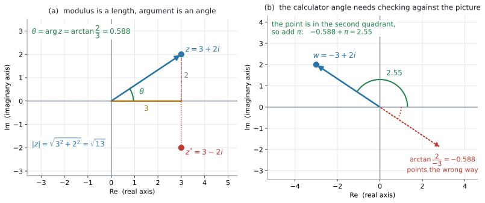
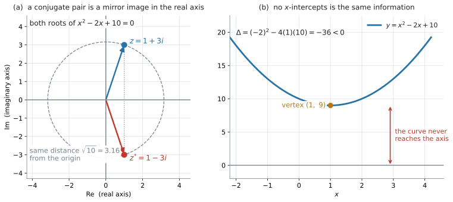

# AHL 1.12b — The complex plane（複素平面） {#sec-ahl-1-12b}

::: {.callout-note}
## What you should be able to do
- **Argand diagram**（アルガン図）に、$z = a+bi$ を点として書ける。
- **modulus**（絶対値）$\lvert z \rvert = \sqrt{a^{2}+b^{2}}$ を、原点からの距離として求められる。
- **argument**（偏角）$\arg z$ を、**象限を確かめてから**求められる。
- $\arctan$ の値をそのまま答えにせず、図と合わせて $\pm\pi$ を調整できる。
- $2$ つの点の**距離**を $\lvert z_1 - z_2 \rvert$ で求められる。
- 実数係数の $2$ 次方程式で $\Delta < 0$ のとき、解が実軸に関して**対称な $2$ 点**になることを説明できる。
:::

::: {.callout-important}
## modulus と argument を $a$、$b$ から出す式は、公式集にありません
公式集の $1.12$ の欄にあるのは、$z = a+bi$ と $\Delta = b^{2}-4ac$ の $2$ つだけです（[AHL 1.12a](ahl-1-12a.qmd)）。

$1.13$ の欄には

$$
z = r(\cos\theta + i\sin\theta) = r\,e^{i\theta} = r\operatorname{cis}\theta
$$

が印刷されていますが、これは $r$ と $\theta$ から $z$ を作る式です。**$a$ と $b$ から $r$ と $\theta$ を出す式は、どこにも印刷されていません。**

ただし、$\lvert z \rvert$ は図をかけば **Pythagoras の定理そのもの**です（[第3節](#modulus)）。式として覚えるより、**直角三角形の絵で覚えるほうが安全**です。

なお、公式集の Topic 3 の Prior learning の欄には、$2$ 点間の距離 $d = \sqrt{(x_1-x_2)^{2}+(y_1-y_2)^{2}}$ が印刷されています。$(0,\ 0)$ と $(a,\ b)$ に使えば、それがそのまま $\lvert z \rvert$ です。
:::

::: {.callout-note}
## シラバスが、この項目に求めていること
AHL 1.12 の Content 欄は $5$ 行あり、[AHL 1.12a](ahl-1-12a.qmd) とこのページで分けて扱っています。このページに関わるのは、次の $2$ 行です。

> Cartesian form: $z=a+bi$; the terms real part, imaginary part, conjugate, **modulus and argument**.

> The complex plane.

Guidance 欄には、こう書かれています。

> Use and draw Argand diagrams.

**modulus と argument は、Content 欄に名前が挙がっています。** ですから、図をかけることに加えて、$\lvert z \rvert$ と $\arg z$ を求められることまでが求められています。

もう $1$ 行の Guidance「Quadratic formula and the link with the graph of $f(x)=ax^{2}+bx+c$」は、[第6節](#roots)で扱います。

複素数どうしのかけ算を回転として読むところ（geometric interpretation）は AHL 1.13 の内容なので、このページでは扱いません。
:::

## The idea

### 1. 複素数は、平面の点として書けます {#idea}

実数は数直線の点として書けました。複素数 $z = a+bi$ には $a$ と $b$ の $2$ つの実数が入っているので、**$1$ 本の直線には収まりません。** そこで平面を使います。

- 横軸（**real axis**、実軸）に real part の $a$
- 縦軸（**imaginary axis**、虚軸）に imaginary part の $b$

をとって、$z$ を点 $(a,\ b)$ として書きます。この平面を **complex plane**（複素平面）といい、複素数を書きこんだ図を **Argand diagram**（アルガン図）といいます。

{#fig-ahl112b-argand width=100%}

@fig-ahl112b-argand の (a) は、$z = 3+2i$ を点 $(3,\ 2)$ として書いたものです。

::: {.callout-important}
## 縦軸の目盛りは $b$ です。$bi$ ではありません
虚軸には「$1$、$2$、$3$」と書きます。「$i$、$2i$、$3i$」と書く流儀もありますが、**目盛りとして読む数そのものは実数の $b$** です。

$z = 3+2i$ の点は、$x$ 座標が $3$、$y$ 座標が $2$ の点です。$2i$ という座標ではありません（[AHL 1.12a](ahl-1-12a.qmd#cartesian)）。
:::

### 2. conjugate は、実軸に関する折り返し {#conj-reflect}

$z = a+bi$ の conjugate は $z^{*} = a-bi$ でした（[AHL 1.12a](ahl-1-12a.qmd#conjugate)）。$a$ はそのままで、$b$ の符号だけが変わります。

図の上では、これは**実軸に関して折り返した点**です。@fig-ahl112b-argand の (a) で、$z = 3+2i$ と $z^{*} = 3-2i$ が上下対称に並んでいるのが見えます。

折り返しても原点からの距離は変わらないので、**$z$ と $z^{*}$ の modulus は等しくなります。**

### 3. modulus は、原点からの距離 {#modulus}

$z = a+bi$ に対して、**modulus**（絶対値）を

$$
\lvert z \rvert = \sqrt{a^{2}+b^{2}}
$$ {#eq-ahl112b-mod}

と書きます。@fig-ahl112b-argand の (a) の直角三角形——横 $3$、縦 $2$、斜辺が $\lvert z \rvert$——を見てください。**Pythagoras の定理そのもの**です。

$$
\lvert 3+2i \rvert = \sqrt{3^{2}+2^{2}} = \sqrt{13} = 3.61
$$

#### $\lvert z \rvert^{2}$ と $z z^{*}$ は同じもの {#mod-zzstar}

[AHL 1.12a](ahl-1-12a.qmd#conjugate) で $z z^{*} = a^{2}+b^{2}$ を出しました。@eq-ahl112b-mod と見くらべると

$$
\lvert z \rvert^{2} = z\,z^{*}
$$ {#eq-ahl112b-modsq}

です。**$\lvert z \rvert$ は「$z$ と $z^{*}$ をかけて $\sqrt{\ }$ をとったもの」**でもある、ということです。この見方は [第6節](#roots) で効いてきます。

#### $2$ 点の距離 {#distance}

$z_1$ と $z_2$ を点として書いたとき、その $2$ 点の距離は

$$
\lvert z_1 - z_2 \rvert
$$

です。$z_1 - z_2$ の real part は $x$ 座標の差、imaginary part は $y$ 座標の差なので、@eq-ahl112b-mod がそのまま座標平面の距離の公式になります。

### 4. argument は、正の実軸から測った角 {#argument}

**argument**（偏角）$\arg z$ は、**正の実軸から、原点と $z$ を結んだ線までの角**です。反時計回りを正の向きとします。

@fig-ahl112b-argand の (a) では

$$
\tan\theta = \frac{2}{3}
$$

です。点 $(3,\ 2)$ は第 $1$ 象限にあるので、この $\theta$ は

$$
\theta = \arctan\frac{2}{3} = 0.588
$$

でよい、ということになります。**「第 $1$ 象限にある」という一言が要る**ところは、[この節の後半](#quadrant)で扱います。

#### 角の範囲は $-\pi < \theta \leq \pi$ にとります {#range}

$\theta$ に $2\pi$ を足しても同じ点を指すので、argument は $1$ つに決まりません。そこで、ふつうは

$$
-\pi < \theta \leq \pi
$$

の範囲でとります。この範囲のものを **principal argument**（主偏角）といいます。GDC の `angle()` も、`Angle` を `Radian` にしてあれば、この範囲の値を返します。

::: {.callout-important}
## HL の試験では radian が既定です
シラバスの AHL Topic 3 の前置きに、こう書かれています。

> On HL examination papers radian measure should be assumed unless otherwise indicated.

ですから、**度の指定がないかぎり radian で答えてください。** GDC も `Angle: Radian` にしておきます。

```
doc → Settings → Document Settings → Angle: Radian
```
:::

#### $\arctan$ だけでは足りません {#quadrant}

ここがこの項目でいちばん落としやすいところです。$\arctan$ が返すのは $-\dfrac{\pi}{2}$ と $\dfrac{\pi}{2}$ の**あいだ**の角、つまり**正の実軸のまわり（第 $1$・第 $4$ 象限の向き）**だけです。第 $2$・第 $3$ 象限の点では、返ってきた角が**反対向き**を指してしまいます。

@fig-ahl112b-argand の (b) がその例です。$w = -3+2i$ について

$$
\arctan\frac{2}{-3} = -0.588
$$

ですが、$-0.588$ は第 $4$ 象限の向きで、$w$ の位置とはまったく逆です。正しい argument は

$$
\arg w = -0.588 + \pi = 2.55
$$

です。

::: {.callout-tip}
## 手順は「先に点をかく」です

1. **点をかいて、どの象限にあるか見る**
2. $\arctan\dfrac{b}{a}$ を電卓で出す
3. **図と向きが合っているか見くらべる**
4. 合っていなければ $\pi$ を足すか引く（$-\pi < \theta \leq \pi$ に収まるほう）

$3$ 番を飛ばさないでください。**図をかいてから計算する**のが、この項目の要点です。
:::

象限ごとにまとめると、次のようになります。

| $z = a+bi$ の位置 | $\arg z$ |
|:--|:--|
| 第 $1$ 象限（$a>0$、$b>0$） | $\arctan\dfrac{b}{a}$ |
| 第 $4$ 象限（$a>0$、$b<0$） | $\arctan\dfrac{b}{a}$（負の値） |
| 第 $2$ 象限（$a<0$、$b>0$） | $\arctan\dfrac{b}{a} + \pi$ |
| 第 $3$ 象限（$a<0$、$b<0$） | $\arctan\dfrac{b}{a} - \pi$ |
| 正の虚軸上（$a=0$、$b>0$） | $\dfrac{\pi}{2}$ |
| 負の虚軸上（$a=0$、$b<0$） | $-\dfrac{\pi}{2}$ |
| 正の実軸上（$a>0$、$b=0$） | $0$ |
| 負の実軸上（$a<0$、$b=0$） | $\pi$ |

: 象限と argument {#tbl-ahl112b-quad}

$a = 0$ の行では $\dfrac{b}{a}$ が計算できないので、$\arctan$ は使えません。**図を見て $\pm\dfrac{\pi}{2}$ と答えます。**

$b = 0$ の行、つまり実軸上の点は、どの象限にも入りません。$a > 0$ なら $\arg z = 0$ です。$a < 0$ のときは、$\pi$ と $-\pi$ が図の上で**同じ向き**を指すので、絵を見ても決まりません。範囲を $-\pi < \theta \leq \pi$ ととる約束のほうで決めて、$\arg z = \pi$ と答えます。

$z = 0$ のときは向きが決まらないので、argument は定義されません。

### 5. modulus と argument で、点の場所が決まります {#pair}

$\lvert z \rvert$ は「原点からどれだけ離れているか」、$\arg z$ は「どの向きか」です。**$z \neq 0$ なら**、この $2$ つがそろえば、点の場所は $1$ つに決まります。

$$
\lvert z \rvert \ \text{は距離} \qquad \arg z \ \text{は向き}
$$

この $2$ つを使って $z$ そのものを書き直したものが、AHL 1.13 の polar form です。このページでは、**$a$ と $b$ から $2$ つを取り出すところ**までを扱います。

### 6. $\Delta < 0$ のとき、$2$ つの解は実軸に関して対称に並びます {#roots}

[AHL 1.12a](ahl-1-12a.qmd#why-pair) で、実数係数の $2$ 次方程式は $\Delta < 0$ のとき conjugate pair を解に持つことを見ました。図の上では、これは [第2節](#conj-reflect) の折り返しそのものです。

{#fig-ahl112b-roots width=100%}

@fig-ahl112b-roots の (a) は、$x^{2}-2x+10 = 0$ の解 $1 \pm 3i$ です。

- $2$ 点は、実軸に関して**上下対称**
- したがって $2$ 点の modulus は**等しい**
- argument は、符号だけが違う（$\theta$ と $-\theta$）

$\lvert 1+3i \rvert = \sqrt{1+9} = \sqrt{10} = 3.16$ です。

#### 解の積を使うと、modulus が検算できます {#roots-check}

$ax^{2}+bx+c = 0$ の $2$ つの解の積は $\dfrac{c}{a}$ です。解が $z$ と $z^{*}$ なら、その積は @eq-ahl112b-modsq より $\lvert z \rvert^{2}$ ですから

$$
\lvert z \rvert^{2} = \frac{c}{a}
$$ {#eq-ahl112b-product}

となります。$x^{2}-2x+10 = 0$ なら $\dfrac{c}{a} = 10$ で、$\lvert z \rvert = \sqrt{10}$ ✓ 一致しました。

**この式が使えるのは、係数が実数で $\Delta < 0$ のとき**です。$\Delta > 0$ なら解は相異なる実数の $2$ つで、たとえば $x^{2}-4 = 0$ では $\dfrac{c}{a} = -4$ と負になり、$\lvert z \rvert^{2}$ にはなりません。

@fig-ahl112b-roots の (b) は同じ方程式のグラフです。$\Delta = -36 < 0$ で $x$ 軸と交わりません。**(a) と (b) は、同じことを $2$ 通りに見せているだけ**です。

## Why it works

ここでは、**なぜ $\lvert z \rvert = \sqrt{a^{2}+b^{2}}$ なのか**だけを説明します。

$z = a+bi$ を点 $(a,\ b)$ として書き、原点と結びます。この線分と、実軸に沿った長さ $\lvert a \rvert$ の線分、そして垂直に下ろした長さ $\lvert b \rvert$ の線分で、直角三角形ができます。

斜辺の長さを $r$ とすると、Pythagoras の定理から

$$
r^{2} = \lvert a \rvert^{2} + \lvert b \rvert^{2} = a^{2}+b^{2}
$$

です（$2$ 乗すると符号は消えるので、絶対値は外せます）。$a$ と $b$ のどちらかが $0$ のときは三角形がつぶれますが、そのときは $\lvert z \rvert$ が軸に沿った長さそのもので、$\sqrt{a^{2}+b^{2}}$ はやはり正しい値になります。長さは負にならないので

$$
r = \sqrt{a^{2}+b^{2}}
$$

となります。

つまり **modulus は、新しく決めた約束ではなく、中学校で習った距離そのもの**です。実数 $x$ の $\lvert x \rvert$ が「$0$ からの距離」だったことと、同じ考え方が続いています。

## Worked examples

::: {.callout-note appearance="simple"}
問題文は英語です。意味が理解できなかったら、問題文の下の「**日本語訳**」を開いてください。解説は日本語です。
:::

::: {#exm-ahl112b-basic}
[Let $z = 3 + 2i$.]{.q-en}

**(a)** [Plot $z$ and $z^{*}$ on an Argand diagram.]{.q-en}

**(b)** [Find $\lvert z \rvert$, giving your answer correct to $3$ significant figures.]{.q-en}

**(c)** [Find $\arg z$ in radians, correct to $3$ significant figures.]{.q-en}

<details class="jp-trans">
<summary>日本語訳</summary>

$z = 3+2i$ とします。

**(a)** $z$ と $z^{*}$ を Argand diagram に書きなさい。

**(b)** $\lvert z \rvert$ を、有効数字 $3$ 桁で求めなさい。

**(c)** $\arg z$ を radian で、有効数字 $3$ 桁で求めなさい。

</details>

---

**(a)** $z$ は点 $(3,\ 2)$、$z^{*} = 3-2i$ は点 $(3,\ -2)$ です。軸に名前（Re と Im）を付け、目盛りを入れてください。@fig-ahl112b-argand の (a) と同じ図になります。

**(b)** @eq-ahl112b-mod にそのまま入れます。

$$
\lvert z \rvert = \sqrt{3^{2}+2^{2}} = \sqrt{13} = 3.61
$$

**(c)** 点 $(3,\ 2)$ は第 $1$ 象限にあるので、$\arctan$ の値をそのまま使えます（@tbl-ahl112b-quad）。

$$
\arg z = \arctan\frac{2}{3} = 0.588
$$

**検算。** $0.588$ は $0$ と $\dfrac{\pi}{2} = 1.57$ の間にあります ✓ 第 $1$ 象限の角として正しい範囲です。

::: {.callout-note}
## 解答例（答案用紙にはこう書く）
**(a)** *Argand diagram with the real axis and imaginary axis labelled, showing $z$ at $(3,\ 2)$ and $z^{*}$ at $(3,\ -2)$.*

**(b)**
$$\lvert z \rvert = \sqrt{3^{2}+2^{2}} = \sqrt{13} = 3.61$$

**(c)**
$$\arg z = \arctan\frac{2}{3} = 0.588 \text{ radians}$$
:::
:::

::: {#exm-ahl112b-quadrant}
[Let $w = -3 + 2i$.]{.q-en}

**(a)** [Find $\lvert w \rvert$.]{.q-en}

**(b)** [Find $\arg w$ in radians, correct to $3$ significant figures.]{.q-en}

**(c)** [Explain why $\arctan\left(\dfrac{2}{-3}\right)$ is not the argument of $w$.]{.q-en}

<details class="jp-trans">
<summary>日本語訳</summary>

$w = -3+2i$ とします。

**(a)** $\lvert w \rvert$ を求めなさい。

**(b)** $\arg w$ を radian で、有効数字 $3$ 桁で求めなさい。

**(c)** $\arctan\left(\dfrac{2}{-3}\right)$ が $w$ の argument ではない理由を説明しなさい。

</details>

---

**(a)** $2$ 乗すると符号が消えるので、$-3$ でも $3$ でも同じ値になります。

$$
\lvert w \rvert = \sqrt{(-3)^{2}+2^{2}} = \sqrt{13} = 3.61
$$

@exm-ahl112b-basic の $z = 3+2i$ と**同じ距離**です。向きだけが違います。

**(b)** まず点をかきます。$(-3,\ 2)$ は**第 $2$ 象限**です。

$$
\arctan\frac{2}{-3} = -0.588
$$

$-0.588$ は第 $4$ 象限の向きなので、$\pi$ を足します（@tbl-ahl112b-quad）。

$$
\arg w = -0.588 + \pi = 2.55
$$

**検算。** $2.55$ は $\dfrac{\pi}{2} = 1.57$ と $\pi = 3.14$ の間にあります ✓ 第 $2$ 象限の角として正しい範囲です。

**(c)** `Explain why` なので、英語で理由を書きます。

::: {.model-answer}
**試験ではこう書く**

*The function $\arctan$ only returns angles strictly between $-\frac{\pi}{2}$ and $\frac{\pi}{2}$, which are directions around the positive real axis. The point $(-3,\ 2)$ is in the second quadrant, so $\arctan\left(\frac{2}{-3}\right) = -0.588$ points in the opposite direction. Adding $\pi$ gives the correct argument, $2.55$.*
:::

（$\arctan$ が返すのは $-\frac{\pi}{2}$ から $\frac{\pi}{2}$ までの角で、それは第 $1$・第 $4$ 象限の向きである。点 $(-3,\ 2)$ は第 $2$ 象限にあるので、$-0.588$ は逆向きを指している。$\pi$ を足すと正しい $2.55$ になる、という意味です。）

::: {.callout-note}
## 解答例（答案用紙にはこう書く）
**(a)**
$$\lvert w \rvert = \sqrt{(-3)^{2}+2^{2}} = \sqrt{13} = 3.61$$

**(b)**
$$\arctan\frac{2}{-3} = -0.588$$
*The point $(-3,\ 2)$ lies in the second quadrant, so*
$$\arg w = -0.588 + \pi = 2.55 \text{ radians}$$

**(c)**
*$\arctan$ returns values only strictly between $-\frac{\pi}{2}$ and $\frac{\pi}{2}$, so it gives a direction around the positive real axis. Since $w$ is in the second quadrant, $\pi$ must be added.*
:::
:::

::: {#exm-ahl112b-roots}
[Consider the equation $x^{2} - 2x + 10 = 0$.]{.q-en}

**(a)** [Solve the equation, giving your answers in the form $a+bi$.]{.q-en}

**(b)** [Plot the two solutions on an Argand diagram.]{.q-en}

**(c)** [Find the modulus of each solution.]{.q-en}

**(d)** [Comment on the relationship between the two solutions.]{.q-en}

<details class="jp-trans">
<summary>日本語訳</summary>

方程式 $x^{2}-2x+10 = 0$ を考えます。

**(a)** この方程式を解き、答えを $a+bi$ の形で書きなさい。

**(b)** $2$ つの解を Argand diagram に書きなさい。

**(c)** それぞれの解の modulus を求めなさい。

**(d)** $2$ つの解の関係についてコメントしなさい。

</details>

---

**(a)** $\Delta = (-2)^{2}-4(1)(10) = 4-40 = -36$ です。

$$
x = \frac{2 \pm \sqrt{-36}}{2} = \frac{2 \pm 6i}{2} = 1 \pm 3i
$$

**(b)** 点 $(1,\ 3)$ と $(1,\ -3)$ です。@fig-ahl112b-roots の (a) がその図です。

**(c)** どちらも同じ値になります。

$$
\lvert 1+3i \rvert = \sqrt{1^{2}+3^{2}} = \sqrt{10} = 3.16
$$

**検算。** @eq-ahl112b-product より $\lvert z \rvert^{2} = \dfrac{c}{a} = 10$ で、$\sqrt{10}$ と一致します ✓

**(d)** `Comment on` は、**数値ではなく言葉で答える**設問です。見えることを $2$ つ書きます。

::: {.model-answer}
**試験ではこう書く**

*The two solutions form a conjugate pair: they have the same real part and imaginary parts of opposite sign. On the Argand diagram they are reflections of each other in the real axis, so they have the same modulus, $\sqrt{10}$, and arguments of equal size but opposite sign.*
:::

（$2$ つの解は conjugate pair である。real part が同じで、imaginary part の符号だけが逆になっている。Argand diagram の上では実軸に関する折り返しなので、modulus は同じ $\sqrt{10}$ で、argument は大きさが同じで符号が逆になる、という意味です。）

::: {.callout-note}
## 解答例（答案用紙にはこう書く）
**(a)**
$$\Delta = (-2)^{2}-4(1)(10) = -36$$
$$x = \frac{2 \pm 6i}{2} = 1 \pm 3i$$

**(b)** *Argand diagram showing $(1,\ 3)$ and $(1,\ -3)$, with both axes labelled.*

**(c)**
$$\lvert 1 \pm 3i \rvert = \sqrt{1+9} = \sqrt{10} = 3.16$$

**(d)**
*The solutions are a conjugate pair, so they are reflections of each other in the real axis and have equal modulus.*
:::
:::

::: {#exm-ahl112b-circuit}
[In an alternating current circuit, the impedance $Z$ is written as a complex number $Z = R + Xi$, where $R$ is the resistance and $X$ is the reactance, both measured in ohms. A circuit has $R = 40$ and $X = 30$.]{.q-en}

**(a)** [Find $\lvert Z \rvert$.]{.q-en}

**(b)** [Find $\arg Z$ in radians, correct to $3$ significant figures.]{.q-en}

**(c)** [Interpret the value of $\lvert Z \rvert$ in the context of the circuit.]{.q-en}

<details class="jp-trans">
<summary>日本語訳</summary>

交流回路では、impedance（インピーダンス）$Z$ を複素数 $Z = R + Xi$ として書きます。ここで $R$ は resistance（抵抗）、$X$ は reactance（リアクタンス）で、どちらも単位はオームです。ある回路で $R = 40$、$X = 30$ です。

**(a)** $\lvert Z \rvert$ を求めなさい。

**(b)** $\arg Z$ を radian で、有効数字 $3$ 桁で求めなさい。

**(c)** $\lvert Z \rvert$ の値を、この回路の文脈で解釈しなさい。

</details>

---

文脈は電気ですが、やることは @exm-ahl112b-basic と同じです。$Z = 40 + 30i$ を点 $(40,\ 30)$ として見ます。

**(a)**

$$
\lvert Z \rvert = \sqrt{40^{2}+30^{2}} = \sqrt{2500} = 50
$$

$3$–$4$–$5$ の直角三角形を $10$ 倍したものです。

**(b)** $(40,\ 30)$ は第 $1$ 象限なので、$\arctan$ をそのまま使えます。

$$
\arg Z = \arctan\frac{30}{40} = \arctan 0.75 = 0.644
$$

**(c)** `Interpret` は、**数値を文脈の言葉に直す**設問です。単位を必ず付けてください。

::: {.model-answer}
**試験ではこう書く**

*$\lvert Z \rvert = 50$ ohms is the total opposition of the circuit to the current. It combines the resistance $40$ and the reactance $30$ into a single value, and it is not their sum because the two act in perpendicular directions on the Argand diagram.*
:::

（$\lvert Z \rvert = 50$ オームは、この回路が電流に対して示す全体の妨げの大きさである。抵抗 $40$ とリアクタンス $30$ を $1$ つの値にまとめたもので、Argand diagram の上で $2$ つが直角の向きにはたらくため、単純な和にはならない、という意味です。）

::: {.callout-tip}
## 工学では、この角を度で言うことが多くあります
$0.644$ radian は $36.9^{\circ}$ です。この角は **phase angle**（位相角）と呼ばれ、電圧と電流のずれを表します。

ただし **IB の HL の試験では、指定がないかぎり radian**です（[第4節](#range)）。度で答えるのは、問題文に度の記号があるときだけにしてください。
:::

::: {.callout-note}
## 解答例（答案用紙にはこう書く）
**(a)**
$$\lvert Z \rvert = \sqrt{40^{2}+30^{2}} = \sqrt{2500} = 50 \text{ ohms}$$

**(b)**
$$\arg Z = \arctan\frac{30}{40} = 0.644 \text{ radians}$$

**(c)**
*$\lvert Z \rvert = 50$ ohms measures the total opposition of the circuit to the current, combining the resistance and the reactance into one value.*
:::
:::

## Common errors

::: {.callout-warning}
## $\arctan\dfrac{b}{a}$ を、そのまま argument にする
第 $2$・第 $3$ 象限の点で必ず起きる誤りです。$\arctan$ が返すのは $-\dfrac{\pi}{2}$ から $\dfrac{\pi}{2}$ までなので、その範囲の外にある角は出せません。

**点をかいてから計算する**、という順番を守ってください。図と向きが合わなければ、$\pi$ を足すか引きます（[第4節](#quadrant)）。
:::

::: {.callout-warning}
## modulus に $i$ を残す
$\lvert 3+2i \rvert$ の答えを $\sqrt{13}\,i$ のように書いてしまう誤りです。

**modulus は長さなので、いつも $0$ 以上の実数**です。@eq-ahl112b-mod の $\sqrt{\ }$ の中には $a^{2}$ と $b^{2}$ しか入っておらず、$i$ はどこにも残りません。
:::

::: {.callout-warning}
## $\lvert z \rvert = a + b$ と足してしまう
$\lvert 3+2i \rvert$ を $5$ と書いてしまう誤りです。

$a$ と $b$ は**直角の向き**にはたらくので、単純には足せません。@exm-ahl112b-circuit の $40$ と $30$ が $70$ ではなく $50$ になるのが、その例です。

$2$ 乗して足し、最後に $\sqrt{\ }$ をとってください。
:::

::: {.callout-warning}
## 角を度のまま答える
GDC が `Angle: Degree` のままだと、$\arctan\dfrac{2}{3}$ が $33.7$ と返ります。この数字を radian の答えとして書くと、点になりません。

HL の試験では **radian が既定**です（[第4節](#range)）。計算を始める前に

```
doc → Settings → Document Settings → Angle: Radian
```

を済ませてください。$0.588$ と $33.7$ は、同じ角の $2$ 通りの表し方です。
:::

::: {.callout-warning}
## Argand diagram の縦軸に $i$ を書く
虚軸の目盛りに「$i$、$2i$、$3i$」と書いてしまう誤りです。

軸には **Re** と **Im** という名前を付け、目盛りには**実数**を書きます（[第1節](#idea)）。点 $z = 3+2i$ の座標は $(3,\ 2)$ です。

軸に名前を付けていない図は、`Plot on an Argand diagram` の点になりません。
:::

## Using your GDC (TI-Nspire CX II)

### 1. 準備は $2$ つ {#gdc-setup}

複素数を扱う前に、設定を $2$ つ確かめてください。

```
doc → Settings → Document Settings
```

- `Real or Complex` を **`Rectangular`** に（[AHL 1.12a](ahl-1-12a.qmd#gdc-setting)）
- `Angle` を **`Radian`** に

`Angle` が `Degree` のままだと、次の `angle()` が度で返ってきます。

### 2. modulus は `abs()` {#gdc-abs}

```
abs(3+2i)
```

$\sqrt{13}$ と返ります。小数で見たいときは `ctrl + enter` で入力してください。

$i$ は記号パレットから入れます（[AHL 1.12a](ahl-1-12a.qmd#gdc-i)）。キーボードのいちばん下、左端の **`π` のキー**を押すとパレットが開きます。

### 3. argument は `angle()` {#gdc-angle}

```
angle(-3+2i)
```

$2.55$ と返ります。**この関数は象限を自分で判断してくれる**ので、@tbl-ahl112b-quad の $\pi$ の足し引きは要りません。

::: {.callout-warning}
## それでも、手順は答案に書いてください
`angle()` は答えを出すだけです。$\arctan$ の値と、象限を見て $\pi$ を足したことを書かないと、途中の点が取れません。

**電卓は、自分の答えが合っているかを確かめるために使います。** 図をかいて手で出し、`angle()` で照らし合わせる、という順番にしてください。
:::

::: {.callout-tip}
## `abs` と `angle` は、メニューからも選べます
関数名を打たなくても、**Complex Number Tools** から選べます。

```
menu → Number → Complex Number Tools
```

`Magnitude` が `abs()`、`Polar Angle` が `angle()` です。同じところに `Complex Conjugate`、`Real Part`、`Imaginary Part` もあります（[AHL 1.12a](ahl-1-12a.qmd#gdc-power)）。
:::

### 4. 点をかいてみる {#gdc-plot}

Argand diagram そのものを描く機能はありませんが、$z = a+bi$ を点 $(a,\ b)$ として散布図にすれば同じ絵になります。

```
ctrl + doc → Add Lists & Spreadsheet
```

いちばん上の名前の行に `re`、`im` と打ってから、$1$ 列目に real part、$2$ 列目に imaginary part を入れます。**名前を付けないと、Data & Statistics ページで軸に選べません。** そのうえで散布図にします。conjugate pair を入れると、実軸に関して対称に並ぶのが見えます。

**試験で図を求められたら、手でかいてください。** この方法は、家で確かめるためのものです。

### 5. 検算のしかた {#gdc-check}

- modulus … $\lvert z \rvert^{2}$ と `z × conj(z)` が一致するか（@eq-ahl112b-modsq）
- argument … 出した $\theta$ が、点の象限に合う範囲に入っているか
- $2$ 次方程式の解 … $\lvert z \rvert^{2}$ が $\dfrac{c}{a}$ と一致するか（@eq-ahl112b-product）

$3$ つ目は、元の方程式に代入し直さずに済むので速く終わります。ただし使えるのは、係数が実数で $\Delta < 0$ のときだけです。

## Exercises

::: {.callout-note appearance="simple"}
各問題に、折りたたみが3つ付いています。**日本語訳**、**解答例**（答案用紙に書くべきこと。英語です）、**解説**（なぜそうなるか。日本語です）。

まず自分で解いて、次に解答例と見くらべてください。**解説は、合わなかったときだけ開けば十分です。**
:::

::: {.exercise-block}

[1]{.ex-no} [Let $z = 5 - 12i$. Find $\lvert z \rvert$, and plot $z$ and $z^{*}$ on an Argand diagram.]{.q-en}

<details class="jp-trans">
<summary>日本語訳</summary>

$z = 5-12i$ とします。$\lvert z \rvert$ を求め、$z$ と $z^{*}$ を Argand diagram に書きなさい。

</details>

::: {.callout-note collapse="true"}
## 解答例（答案用紙に書くこと）

$$\lvert z \rvert = \sqrt{5^{2}+(-12)^{2}} = \sqrt{25+144} = \sqrt{169} = 13$$

*Argand diagram with axes labelled Re and Im, showing $z$ at $(5,\ -12)$ and $z^{*}$ at $(5,\ 12)$.*
:::

::: {.callout-tip collapse="true"}
## 解説

$(-12)^{2} = +144$ です。**$2$ 乗すると符号は消えます**（[第3節](#modulus)）。

$5$–$12$–$13$ は、よく出る直角三角形の組です。$\sqrt{169}$ がちょうど $13$ になります。

$z$ は第 $4$ 象限、$z^{*}$ は第 $1$ 象限にあり、実軸に関して対称です（[第2節](#conj-reflect)）。
:::

::: {.ex-sep}
:::

[2]{.ex-no} [Find the modulus and the argument of $z = -1 + i$. Give the argument in radians as an exact multiple of $\pi$.]{.q-en}

<details class="jp-trans">
<summary>日本語訳</summary>

$z = -1+i$ の modulus と argument を求めなさい。argument は radian で、$\pi$ の正確な倍数として書きなさい。

</details>

::: {.callout-note collapse="true"}
## 解答例（答案用紙に書くこと）

$$\lvert z \rvert = \sqrt{(-1)^{2}+1^{2}} = \sqrt{2}$$

$$\arctan\frac{1}{-1} = -\frac{\pi}{4}$$

*The point $(-1,\ 1)$ is in the second quadrant, so*

$$\arg z = -\frac{\pi}{4} + \pi = \frac{3\pi}{4}$$
:::

::: {.callout-tip collapse="true"}
## 解説

点 $(-1,\ 1)$ は**第 $2$ 象限**です。$\arctan(-1) = -\dfrac{\pi}{4}$ は第 $4$ 象限の向きなので、$\pi$ を足します（@tbl-ahl112b-quad）。

$$-\frac{\pi}{4} + \pi = \frac{3\pi}{4}$$

**検算。** $\dfrac{3\pi}{4} = 2.36$ で、$\dfrac{\pi}{2} = 1.57$ と $\pi = 3.14$ の間にあります ✓

「exact multiple of $\pi$」と指定されているので、$2.36$ ではなく $\dfrac{3\pi}{4}$ と書いてください。
:::

::: {.ex-sep}
:::

[3]{.ex-no} [Find $\arg z$ for $z = -2 - 2i$, giving your answer in radians in the interval $-\pi < \arg z \leq \pi$.]{.q-en}

<details class="jp-trans">
<summary>日本語訳</summary>

$z = -2-2i$ について $\arg z$ を求めなさい。答えは radian で、$-\pi < \arg z \leq \pi$ の範囲で書きなさい。

</details>

::: {.callout-note collapse="true"}
## 解答例（答案用紙に書くこと）

$$\arctan\frac{-2}{-2} = \arctan 1 = \frac{\pi}{4}$$

*The point $(-2,\ -2)$ is in the third quadrant, so*

$$\arg z = \frac{\pi}{4} - \pi = -\frac{3\pi}{4}$$
:::

::: {.callout-tip collapse="true"}
## 解説

$\dfrac{-2}{-2} = 1$ なので、$\arctan$ は $\dfrac{\pi}{4}$ を返します。これは**第 $1$ 象限の向き**で、$z$ の位置とは正反対です。

点 $(-2,\ -2)$ は第 $3$ 象限なので、$\pi$ を**引きます**（@tbl-ahl112b-quad）。足すと $\dfrac{5\pi}{4}$ になり、指定された範囲 $-\pi < \arg z \leq \pi$ を外れます。

**$\pi$ を足すか引くかは、答えが範囲に入るほうを選びます。**

**検算。** GDC で `angle(-2-2i)` と入れると $-2.36$ で、$-\dfrac{3\pi}{4} = -2.36$ と一致します ✓
:::

::: {.ex-sep}
:::

[4]{.ex-no} [Let $z = 4 + 3i$.]{.q-en}

**(a)** [Find $\lvert z \rvert$ and $\lvert z^{*} \rvert$.]{.q-en}

**(b)** [Explain why $\lvert z \rvert = \lvert z^{*} \rvert$ for every complex number $z$.]{.q-en}

<details class="jp-trans">
<summary>日本語訳</summary>

$z = 4+3i$ とします。

**(a)** $\lvert z \rvert$ と $\lvert z^{*} \rvert$ を求めなさい。

**(b)** すべての複素数 $z$ について $\lvert z \rvert = \lvert z^{*} \rvert$ となる理由を説明しなさい。

</details>

::: {.callout-note collapse="true"}
## 解答例（答案用紙に書くこと）

**(a)**
$$\lvert z \rvert = \sqrt{4^{2}+3^{2}} = 5, \qquad \lvert z^{*} \rvert = \sqrt{4^{2}+(-3)^{2}} = 5$$

**(b)**
*For $z = a+bi$ we have $z^{*} = a-bi$, so $\lvert z^{*} \rvert = \sqrt{a^{2}+(-b)^{2}} = \sqrt{a^{2}+b^{2}} = \lvert z \rvert$. Geometrically, $z^{*}$ is the reflection of $z$ in the real axis, and a reflection does not change the distance from the origin.*
:::

::: {.callout-tip collapse="true"}
## 解説

`Explain why` なので、英語で理由を書きます。書き方は $2$ 通りあり、どちらでも点になります。

- **式で** … $(-b)^{2} = b^{2}$ なので、$\sqrt{\ }$ の中身が変わらない
- **図で** … $z^{*}$ は $z$ を実軸で折り返した点で、折り返しは原点からの距離を変えない（[第2節](#conj-reflect)）

$4$–$3$–$5$ の直角三角形なので、$\lvert z \rvert$ はちょうど $5$ です。

::: {.model-answer}
**試験ではこう書く**

*Writing $z = a+bi$ gives $z^{*} = a-bi$, and $(-b)^{2} = b^{2}$, so both moduli equal $\sqrt{a^{2}+b^{2}}$. On an Argand diagram $z^{*}$ is the reflection of $z$ in the real axis, and reflecting a point does not change its distance from the origin.*
:::
:::

::: {.ex-sep}
:::

[5]{.ex-no} [Solve the equation $x^{2} + 4x + 20 = 0$, and find the modulus of each solution.]{.q-en}

<details class="jp-trans">
<summary>日本語訳</summary>

方程式 $x^{2}+4x+20 = 0$ を解き、それぞれの解の modulus を求めなさい。

</details>

::: {.callout-note collapse="true"}
## 解答例（答案用紙に書くこと）

$$\Delta = 4^{2}-4(1)(20) = 16 - 80 = -64$$

$$x = \frac{-4 \pm \sqrt{-64}}{2} = \frac{-4 \pm 8i}{2} = -2 \pm 4i$$

$$\lvert -2 \pm 4i \rvert = \sqrt{(-2)^{2}+4^{2}} = \sqrt{20} = 4.47$$
:::

::: {.callout-tip collapse="true"}
## 解説

$\sqrt{-64} = 8i$ です。$2$ で割るときは実部と虚部の両方を割ります（[AHL 1.12a](ahl-1-12a.qmd#quadratic)）。

$2$ つの解は conjugate pair なので、modulus は同じ値になります（[第6節](#roots)）。片方だけ計算すれば十分です。

**検算。** @eq-ahl112b-product より $\lvert z \rvert^{2} = \dfrac{c}{a} = 20$ です。$\sqrt{20} = 4.47$ と一致します ✓
:::

::: {.ex-sep}
:::

[6]{.ex-no} [The solutions of a quadratic equation with real coefficients are $2 + 5i$ and $2 - 5i$. Find the equation in the form $x^{2}+bx+c = 0$.]{.q-en}

<details class="jp-trans">
<summary>日本語訳</summary>

実数係数のある $2$ 次方程式の解が $2+5i$ と $2-5i$ です。この方程式を $x^{2}+bx+c = 0$ の形で求めなさい。

</details>

::: {.callout-note collapse="true"}
## 解答例（答案用紙に書くこと）

*Sum of the solutions:*
$$(2+5i)+(2-5i) = 4$$

*Product of the solutions:*
$$(2+5i)(2-5i) = 2^{2}+5^{2} = 29$$

*For $x^{2}+bx+c = 0$ the sum is $-b$ and the product is $c$, so $b = -4$ and $c = 29$:*

$$x^{2} - 4x + 29 = 0$$
:::

::: {.callout-tip collapse="true"}
## 解説

conjugate pair の**和も積も実数**になります（[AHL 1.12a](ahl-1-12a.qmd#conjugate)）。だからこそ、係数が実数の方程式が作れます。

積は @eq-ahl112b-modsq を使えば $\lvert 2+5i \rvert^{2} = 4+25 = 29$ とすぐ出ます。

**検算。** $\Delta = (-4)^{2}-4(29) = 16-116 = -100$ で、$x = \dfrac{4 \pm 10i}{2} = 2 \pm 5i$ ✓ 元の解に戻りました。
:::

::: {.ex-sep}
:::

[7]{.ex-no} [In an alternating current circuit the impedance is $Z = 60 + 80i$ ohms. Find $\lvert Z \rvert$ and $\arg Z$, giving the argument in radians correct to $3$ significant figures.]{.q-en}

<details class="jp-trans">
<summary>日本語訳</summary>

ある交流回路の impedance が $Z = 60+80i$ オームです。$\lvert Z \rvert$ と $\arg Z$ を求めなさい。argument は radian で、有効数字 $3$ 桁で書きなさい。

</details>

::: {.callout-note collapse="true"}
## 解答例（答案用紙に書くこと）

$$\lvert Z \rvert = \sqrt{60^{2}+80^{2}} = \sqrt{10000} = 100 \text{ ohms}$$

$$\arg Z = \arctan\frac{80}{60} = 0.927 \text{ radians}$$
:::

::: {.callout-tip collapse="true"}
## 解説

$60$–$80$–$100$ は $3$–$4$–$5$ を $20$ 倍したものです（@exm-ahl112b-circuit と同じ形です）。

$(60,\ 80)$ は第 $1$ 象限なので、$\arctan$ の値をそのまま使えます。

$\dfrac{80}{60} = \dfrac{4}{3}$ で、$\arctan\dfrac{4}{3} = 0.9273\ldots$ ですから $0.927$ です。

**単位を忘れないでください。** modulus はオーム、argument は radian です。
:::

::: {.ex-sep}
:::

[8]{.ex-no} [Let $z_1 = 2+3i$ and $z_2 = -1-i$. Find $\lvert z_1 - z_2 \rvert$, and interpret this value on an Argand diagram.]{.q-en}

<details class="jp-trans">
<summary>日本語訳</summary>

$z_1 = 2+3i$、$z_2 = -1-i$ とします。$\lvert z_1 - z_2 \rvert$ を求め、その値を Argand diagram の上で解釈しなさい。

</details>

::: {.callout-note collapse="true"}
## 解答例（答案用紙に書くこと）

$$z_1 - z_2 = (2-(-1)) + (3-(-1))i = 3 + 4i$$

$$\lvert z_1 - z_2 \rvert = \sqrt{3^{2}+4^{2}} = 5$$

*This is the distance between the two points $(2,\ 3)$ and $(-1,\ -1)$ on the Argand diagram.*
:::

::: {.callout-tip collapse="true"}
## 解説

$z_1 - z_2$ の real part は $x$ 座標の差、imaginary part は $y$ 座標の差です（[第3節](#distance)）。

$$2-(-1) = 3, \qquad 3-(-1) = 4$$

**引き算の符号**に気をつけてください。$z_2$ の両方の部分が負なので、引くと足すことになります。

`Interpret` が付いているので、$5$ という数だけでは点になりません。

::: {.model-answer}
**試験ではこう書く**

*$\lvert z_1 - z_2 \rvert = 5$ is the distance between the points representing $z_1$ and $z_2$ on the Argand diagram, that is, the length of the segment joining $(2,\ 3)$ and $(-1,\ -1)$.*
:::
:::

::: {.ex-sep}
:::

[9]{.ex-no} [Find the value of $k$, where $k > 0$, such that $\lvert 3 + ki \rvert = 5$.]{.q-en}

<details class="jp-trans">
<summary>日本語訳</summary>

$\lvert 3+ki \rvert = 5$ となる $k$ の値を求めなさい。ただし $k > 0$ とします。

</details>

::: {.callout-note collapse="true"}
## 解答例（答案用紙に書くこと）

$$\sqrt{3^{2}+k^{2}} = 5$$

$$9 + k^{2} = 25$$

$$k^{2} = 16 \ \Rightarrow \ k = 4 \quad (\text{since } k > 0)$$
:::

::: {.callout-tip collapse="true"}
## 解説

@eq-ahl112b-mod を立ててから、両辺を $2$ 乗して $\sqrt{\ }$ を外します。

$k^{2} = 16$ の解は $k = 4$ と $k = -4$ の $2$ つですが、問題文が $k > 0$ と指定しているので $k = 4$ です。**条件を読み落とすと、要らない解まで書くことになります。**

$3$–$4$–$5$ の直角三角形です。図でいえば、原点を中心とする半径 $5$ の円の上で、$x$ 座標が $3$ の点を探していることになります。
:::

::: {.ex-sep}
:::

[10]{.ex-no} [A student is asked to find $\arg(-4+4i)$ and writes]{.q-en}

$$
\arg(-4+4i) = \arctan\frac{4}{-4} = \arctan(-1) = -\frac{\pi}{4}
$$

[Identify the error and give the correct value of $\arg(-4+4i)$.]{.q-en}

<details class="jp-trans">
<summary>日本語訳</summary>

ある生徒が $\arg(-4+4i)$ を求めるよう言われて、上のように書きました。誤りを指摘し、$\arg(-4+4i)$ の正しい値を書きなさい。

</details>

::: {.callout-note collapse="true"}
## 解答例（答案用紙に書くこと）

*The student used the value returned by $\arctan$ without checking the quadrant. The point $(-4,\ 4)$ lies in the second quadrant, but $-\frac{\pi}{4}$ is a direction in the fourth quadrant.*

$$\arg(-4+4i) = -\frac{\pi}{4} + \pi = \frac{3\pi}{4}$$
:::

::: {.callout-tip collapse="true"}
## 解説

`Identify the error` なので、**どこが間違っているかを言葉で書く**必要があります。値だけを直しても、指摘の点は取れません。

$\arctan$ は $-\dfrac{\pi}{2}$ と $\dfrac{\pi}{2}$ のあいだしか返せないので、第 $2$ 象限の角である $\dfrac{3\pi}{4}$ は最初から出てきません（[第4節](#quadrant)）。

**$\dfrac{4}{-4}$ と $\dfrac{-4}{4}$ が同じ $-1$ になってしまう**ところが、この誤りの原因です。$\arctan$ には比しか渡らないので、$a$ と $b$ のどちらが負なのかという情報が消えています。だから象限は、自分で図から補う必要があります。

**検算。** $\dfrac{3\pi}{4} = 2.36$ で、GDC の `angle(-4+4i)` と一致します ✓

::: {.model-answer}
**試験ではこう書く**

*The error is that the value of $\arctan$ was accepted without checking the quadrant. Since $\arctan$ only returns angles strictly between $-\frac{\pi}{2}$ and $\frac{\pi}{2}$, it cannot give a second-quadrant angle. The point $(-4,\ 4)$ is in the second quadrant, so $\pi$ must be added: $\arg(-4+4i) = -\frac{\pi}{4}+\pi = \frac{3\pi}{4}$.*
:::
:::

:::
