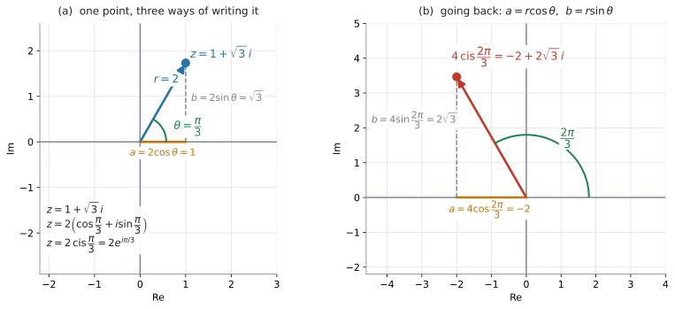
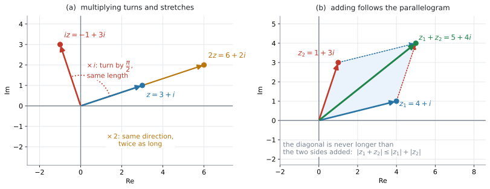

# AHL 1.13a — Polar and exponential form（極形式と指数形式） {#sec-ahl-1-13a}

::: {.callout-note}
## What you should be able to do
- $z = a+bi$ を **polar form**（極形式）$r(\cos\theta + i\sin\theta) = r\operatorname{cis}\theta$ に直せる。
- **exponential form**（指数形式）$re^{i\theta}$ で書け、$3$ つの form を行き来できる。
- 逆に、$r$ と $\theta$ から $a = r\cos\theta$、$b = r\sin\theta$ で Cartesian form に戻せる。
- **積は modulus をかけて argument を足す**、商はその逆、と言える。
- 整数の**べき乗**を $z^{n} = r^{n}\operatorname{cis}(n\theta)$ で求められる。
- Argand diagram の上で、かけ算が**回転と拡大**、足し算が**ベクトルの和**であることを説明できる。
:::

::: {.callout-important}
## 公式集の 1.13 の欄
$1$ 行だけ印刷されています。

$$
z = r(\cos\theta + i\sin\theta) = r\,e^{i\theta} = r\operatorname{cis}\theta
$$ {#eq-ahl113a-forms}

見出しは「**Modulus-argument (polar) and exponential (Euler) form**」です。

**この $1$ 行が、$3$ つの form が同じものだという宣言そのもの**です。配られるので、覚える必要はありません。

ただし、**積・商・べき乗の規則はどこにも印刷されていません。** そこは自分の中に入れておく必要があります（[第5節](#multiply)〜[第7節](#power)）。

$r$ と $\theta$ を $a$、$b$ から出す式（modulus と argument）も印刷されていません。それは [AHL 1.12b](ahl-1-12b.qmd#modulus) で扱いました。
:::

::: {.callout-note}
## シラバスが、この項目に求めていること
Content 欄のうち、このページに関わるのは次の $5$ 行です。

> Modulus–argument (polar) form: $z = r(\cos\theta + i\sin\theta) = r\operatorname{cis}\theta$.

> Exponential form: $z = re^{i\theta}$.

> Conversion between Cartesian, polar and exponential forms, by hand and with technology.

> Calculate products, quotients and integer powers in polar or exponential forms.

> Geometric interpretation of complex numbers.

Guidance 欄のうち、このページに関わるのは次の $2$ 行です。

> Exponential form is sometimes called the Euler form.

> In examinations students will not be required to find the roots of complex numbers.

Guidance 欄には、図の上での読み方を書いた $2$ 行（[第9節](#geometry)）と、交流回路の phase shift の行（[AHL 1.13b](ahl-1-13b.qmd)）もあります。

**$2$ つ目は、範囲の上限をはっきり決めてくれています。** $z^{n}$ を求めることは出ますが、$\sqrt[n]{z}$ を求めることは出ません。

同じ周波数の正弦波を足す話は、[AHL 1.13b](ahl-1-13b.qmd) で扱います。
:::

## The idea

### 1. 同じ点を、別のやり方で指す {#idea}

[AHL 1.12b](ahl-1-12b.qmd) で、複素数を平面の点として書きました。その点を指すやり方は、$2$ 通りあります。

- **Cartesian form** … 原点から**右へ $a$、上へ $b$**（$z = a+bi$）
- **polar form** … 原点から**距離 $r$、向き $\theta$**

住所の書き方が変わるだけで、**点そのものは同じ**です。番地で言うか、駅からの距離と方角で言うかの違いだと思ってください。

{#fig-ahl113a-forms width=100%}

### 2. polar form の作り方 {#to-polar}

@fig-ahl113a-forms の (a) の直角三角形を見てください。距離 $r$、向き $\theta$ が決まれば

$$
a = r\cos\theta, \qquad b = r\sin\theta
$$ {#eq-ahl113a-ab}

です。これを $z = a+bi$ に入れると

$$
z = r\cos\theta + i\,r\sin\theta = r(\cos\theta + i\sin\theta)
$$

となります。これが **polar form**（極形式）です。**$r$ でくくっただけ**なので、新しいことは何も起きていません。

$\cos\theta + i\sin\theta$ は毎回書くには長いので、**$\operatorname{cis}\theta$** と略します。

$$
z = r\operatorname{cis}\theta
$$

::: {.callout-warning}
## $\operatorname{cis}\theta$ は $1$ つのまとまりです
$\operatorname{cis}$ は **c**osine と **i** **s**ine を組み合わせた**略記**で、

$$
\operatorname{cis}\theta = \cos\theta + i\sin\theta
$$

を表します。$\operatorname{cis}\theta$ でひとかたまりだと読んでください。

$\cos\theta \times i \times \sin\theta$ ではありません。
:::

$r$ と $\theta$ の出し方は [AHL 1.12b](ahl-1-12b.qmd) のとおりです。

$$
r = \lvert z \rvert = \sqrt{a^{2}+b^{2}}, \qquad \theta = \arg z
$$

**$\theta$ は象限を確かめてから決めます**（[AHL 1.12b](ahl-1-12b.qmd#quadrant)）。ここでも $\arctan$ の値をそのまま使わないでください。

@fig-ahl113a-forms の (a) は $z = 1 + \sqrt{3}\,i$ です。

$$
r = \sqrt{1^{2}+(\sqrt{3})^{2}} = \sqrt{4} = 2
$$

点 $(1,\ \sqrt{3})$ は第 $1$ 象限なので、$\arctan$ の値がそのまま使えます。

$$
\theta = \arctan\frac{\sqrt{3}}{1} = \frac{\pi}{3}
$$

$$
z = 2\left(\cos\frac{\pi}{3} + i\sin\frac{\pi}{3}\right) = 2\operatorname{cis}\frac{\pi}{3}
$$

### 3. exponential form は、同じものの $3$ 番目の顔 {#exponential}

@eq-ahl113a-forms の最後の等号が言っているのは、次のことです。

$$
\cos\theta + i\sin\theta = e^{i\theta}
$$ {#eq-ahl113a-euler}

ですから

$$
z = r\,e^{i\theta}
$$

とも書けます。これが **exponential form**（指数形式）です。シラバスの Guidance 欄は、別の呼び名も添えています。

> Exponential form is sometimes called the Euler form.

さきほどの $z = 1+\sqrt{3}\,i$ なら、$z = 2e^{i\pi/3}$ です。

::: {.callout-tip}
## この form の値打ちは、指数法則がそのまま使えることです
$e$ の肩に乗っている数は足し算・引き算ができます。

$$
e^{i\theta_1} \times e^{i\theta_2} = e^{i(\theta_1+\theta_2)}
$$

これが、[第5節](#multiply) の「argument を足す」という規則の正体です。**新しい規則を覚えるのではなく、指数法則がそのまま働いている**と見てください。
:::

::: {.callout-warning}
## $\theta$ は radian です
$e^{i\theta}$ の $\theta$ に、度の数を入れてはいけません。$60^{\circ}$ なら $e^{i\pi/3}$ であって、$e^{60i}$ ではありません。

$e^{60i}$ は $60$ radian の向き、つまりまったく別の点を指します。**度が出てきたら、まず radian に直してください**（[Common errors](#common-errors) の $1$ つ目）。
:::

### 4. polar から Cartesian に戻す {#to-cartesian}

戻すときは @eq-ahl113a-ab をそのまま使います。**新しい式は要りません。**

@fig-ahl113a-forms の (b) は $4\operatorname{cis}\dfrac{2\pi}{3}$ です。

$$
a = 4\cos\frac{2\pi}{3} = 4\left(-\frac{1}{2}\right) = -2
$$

$$
b = 4\sin\frac{2\pi}{3} = 4\left(\frac{\sqrt{3}}{2}\right) = 2\sqrt{3}
$$

$$
4\operatorname{cis}\frac{2\pi}{3} = -2 + 2\sqrt{3}\,i
$$

**検算。** $\lvert -2+2\sqrt{3}\,i \rvert = \sqrt{4+12} = 4$ ✓ modulus が元の $r$ に戻りました。

### 5. 積は「modulus をかけて、argument を足す」 {#multiply}

Cartesian form でかけ算をするときは、$4$ 回かけて $i^{2} = -1$ を処理する必要がありました（[AHL 1.12a](ahl-1-12a.qmd#multiply)）。polar form には、その手間の要らない書き方があります。

$$
r_1\operatorname{cis}\theta_1 \times r_2\operatorname{cis}\theta_2 = r_1 r_2 \operatorname{cis}(\theta_1+\theta_2)
$$ {#eq-ahl113a-product}

言葉にすると

- $\lvert z_1 z_2 \rvert = \lvert z_1 \rvert \lvert z_2 \rvert$（**長さはかけ算**）
- $\arg(z_1 z_2) = \arg z_1 + \arg z_2$（**角は足し算**、$z_1 \neq 0$、$z_2 \neq 0$）

です。$1$ つ目は $z_1$、$z_2$ が何であっても成り立ちますが、$2$ つ目には条件が付きます。**$z = 0$ の argument は定義されない**からです（[AHL 1.12b](ahl-1-12b.qmd#argument)）。

**そして、この足し算は $2\pi$ の整数倍のちがいを除いて成り立ちます。** $\theta_1+\theta_2$ が $-\pi < \theta \leq \pi$ からはみ出すことがあるからです。principal argument として答えるときは、最後に $2\pi$ を足し引きしてこの範囲へ戻してください（[第8節](#range)）。@eq-ahl113a-product のほうは、はみ出しても正しいままです。

exponential form で書くと、[第3節](#exponential) の指数法則そのものになります。

$$
r_1 e^{i\theta_1} \times r_2 e^{i\theta_2} = r_1 r_2\, e^{i(\theta_1+\theta_2)}
$$

### 6. 商は「modulus をわって、argument を引く」 {#divide}

わり算にも、同じ形の規則があります。ここでは $z_2 \neq 0$、つまり $r_2 \neq 0$ とします。

$$
\frac{r_1\operatorname{cis}\theta_1}{r_2\operatorname{cis}\theta_2} = \frac{r_1}{r_2}\operatorname{cis}(\theta_1-\theta_2)
$$ {#eq-ahl113a-quotient}

argument の引き算も、$z_1 \neq 0$、$z_2 \neq 0$ のとき、**$2\pi$ の整数倍のちがいを除いて**成り立ちます（[第5節](#multiply) と同じです）。principal argument として答えるなら、最後に $-\pi < \theta \leq \pi$ へ戻してください。

[AHL 1.12a](ahl-1-12a.qmd#divide) では、conjugate をかけて分母を実数にしていました。**polar form なら、その手間が要りません。** 割り算が多い問題では、こちらのほうがずっと速く終わります。

### 7. 整数のべき乗 {#power}

@eq-ahl113a-product を $n$ 回くり返すと

$$
z^{n} = r^{n}\operatorname{cis}(n\theta) = r^{n}e^{in\theta}
$$ {#eq-ahl113a-power}

です。

このくり返しで出せるのは、$n$ が正の整数のときです。負の整数のときも、$z \neq 0$ であれば [第6節](#divide) の商の規則から同じ形になります。

$$
z^{-m} = \frac{1\operatorname{cis}0}{r^{m}\operatorname{cis}(m\theta)} = \frac{1}{r^{m}}\operatorname{cis}(-m\theta)
$$

ですから、**$z \neq 0$ なら $n$ は負の整数でも構いません。**

$z = 1+\sqrt{3}\,i = 2\operatorname{cis}\dfrac{\pi}{3}$ で $n = 6$ とすると

$$
z^{6} = 2^{6}\operatorname{cis}\left(6 \times \frac{\pi}{3}\right) = 64\operatorname{cis}(2\pi) = 64
$$

ここで $\operatorname{cis}(2\pi) = \cos 2\pi + i\sin 2\pi = 1 + 0i = 1$ なので、答えは実数の $64$ です。

**検算。** $(1+\sqrt{3}\,i)^{6}$ を Cartesian form のまま展開しても $64$ になります ✓ $2$ 通りの道で、同じ答えに着きました。

::: {.callout-tip}
## 他の教科書では、この式に名前が付いています
$(\operatorname{cis}\theta)^{n} = \operatorname{cis}(n\theta)$ は、**de Moivre's theorem**（ド・モアブルの定理）と呼ばれます。

**AI HL のシラバスにも公式集にも、de Moivre's theorem という定理名は出てきません。** 名前を知らなくても点は取れます。他の本を読むときのために、ここに書いておきます。
:::

::: {.callout-important}
## 根（$n$ 乗根）は範囲外です
シラバスの Guidance 欄が、はっきり書いています。

> In examinations students will not be required to find the roots of complex numbers.

$z^{5}$ を求める問題は出ますが、**$z^{5} = 32$ を満たす $z$ を $5$ つ求めなさい**という問題は出ません。@eq-ahl113a-power の $n$ は整数だと考えてください。
:::

### 8. 角は、範囲に戻します {#range}

argument を足したり $n$ 倍したりすると、$-\pi < \theta \leq \pi$ の範囲からはみ出すことがあります（[AHL 1.12b](ahl-1-12b.qmd#range)）。

$$
\frac{3\pi}{4} + \frac{\pi}{2} = \frac{5\pi}{4}
$$

$\dfrac{5\pi}{4} > \pi$ なので、$2\pi$ を引いて

$$
\frac{5\pi}{4} - 2\pi = -\frac{3\pi}{4}
$$

とします。**$2\pi$ 足しても引いても、指している点は同じ**です。変わるのは $\theta$ の書き方だけで、$z$ そのものは動きません。

`Give your answer in the interval` として $-\pi < \arg z \leq \pi$ が指定されたら、この直しが要ります。

### 9. かけ算は「回転と拡大」です {#geometry}

シラバスの Guidance 欄が、図の上での読み方を $2$ 行で書いています。

> Addition and subtraction of complex numbers can be represented as vector addition and subtraction.

> Multiplication of complex numbers can be represented as a rotation and a stretch in the Argand diagram.

{#fig-ahl113a-mult width=100%}

@fig-ahl113a-mult の (a) を見てください。$z = 3+i$ に

- **$i$ をかける**と、長さはそのままで $\dfrac{\pi}{2}$ だけ回ります（$\lvert i \rvert = 1$、$\arg i = \dfrac{\pi}{2}$ だから）
- **$2$ をかける**と、向きはそのままで長さが $2$ 倍になります（$\lvert 2 \rvert = 2$、$\arg 2 = 0$ だから）

一般に、$w \neq 0$ をかけることは、**$\arg w$ だけ回して、長さを $\lvert w \rvert$ 倍にする**ことです。$\lvert w \rvert > 1$ なら伸び、$\lvert w \rvert < 1$ なら**縮み**、$\lvert w \rvert = 1$ なら長さは変わりません。$w = 0$ をかけると、どの点も原点に移ります。@eq-ahl113a-product が、そのまま図の言葉になっています。

[AHL 1.12a](ahl-1-12a.qmd#powers-of-i) で $i$ の累乗が $4$ つで一周したのは、$\dfrac{\pi}{2}$ ずつ回ると $4$ 回で $2\pi$ になるから、と読み直せます。

#### 足し算は、ベクトルの和 {#add-vector}

@fig-ahl113a-mult の (b) は $z_1 = 4+i$ と $z_2 = 1+3i$ です。real part どうし、imaginary part どうしを足すのは、**矢印を平行四辺形でつなぐ**のと同じことです。

$$
z_1 + z_2 = 5 + 4i
$$

平行四辺形の対角線は、$2$ 辺をまっすぐつないだ長さを超えません。式で書くと $\lvert z_1+z_2 \rvert \leq \lvert z_1 \rvert + \lvert z_2 \rvert$ です（@fig-ahl113a-mult の (b) の注記）。**modulus は足し算では出ない**、ということを言っています。試験で問われる式ではありませんが、[AHL 1.13b](ahl-1-13b.qmd) で振幅が単純に足せない理由が、これと同じことです。

**足し算・引き算は Cartesian form、かけ算・わり算・べき乗は polar form** が速い、と覚えておくと迷いません。

## Why it works

ここでは、**なぜ積で argument が足し算になるのか**だけを説明します。

exponential form で書くと、$1$ 行で終わります。

$$
z_1 z_2 = \left(r_1 e^{i\theta_1}\right)\left(r_2 e^{i\theta_2}\right) = r_1 r_2\, e^{i\theta_1}e^{i\theta_2} = r_1 r_2\, e^{i(\theta_1+\theta_2)}
$$

$e^{A}e^{B} = e^{A+B}$ は、$A$ と $B$ が実数のときに [SL 1.5](../../ai-sl/01-number-and-algebra/sl-1-5.qmd) で使っていた法則です。**$e$ の肩が虚数になっても、同じ法則が成り立つように $e^{i\theta}$ が定められています。**

$r_1 r_2$ が前に出て、$\theta_1 + \theta_2$ が肩に乗る——それがそのまま「長さはかけ算、角は足し算」です。

polar form のままでも同じことは示せますが、そちらは $\cos$ と $\sin$ の加法定理が要ります。**AI HL のシラバスに加法定理はありません。** 公式集の $3.8$ の欄に印刷されている identity も、$\cos^{2}\theta + \sin^{2}\theta = 1$ と $\tan\theta = \dfrac{\sin\theta}{\cos\theta}$ の $2$ つだけです。ですから、この本では exponential form の道を通ります。

## Worked examples

::: {.callout-note appearance="simple"}
問題文は英語です。意味が理解できなかったら、問題文の下の「**日本語訳**」を開いてください。解説は日本語です。
:::

::: {#exm-ahl113a-topolar}
[Let $z = 1 + \sqrt{3}\,i$.]{.q-en}

**(a)** [Find $\lvert z \rvert$ and $\arg z$, giving the argument as an exact multiple of $\pi$.]{.q-en}

**(b)** [Write $z$ in the form $r\operatorname{cis}\theta$.]{.q-en}

**(c)** [Write $z$ in the form $re^{i\theta}$.]{.q-en}

<details class="jp-trans">
<summary>日本語訳</summary>

$z = 1+\sqrt{3}\,i$ とします。

**(a)** $\lvert z \rvert$ と $\arg z$ を求めなさい。argument は $\pi$ の正確な倍数で書きなさい。

**(b)** $z$ を $r\operatorname{cis}\theta$ の形で書きなさい。

**(c)** $z$ を $re^{i\theta}$ の形で書きなさい。

</details>

---

**(a)** modulus は Pythagoras です（[AHL 1.12b](ahl-1-12b.qmd#modulus)）。

$$
\lvert z \rvert = \sqrt{1^{2}+(\sqrt{3})^{2}} = \sqrt{1+3} = 2
$$

点 $(1,\ \sqrt{3})$ は第 $1$ 象限なので、$\arctan$ の値をそのまま使えます。

$$
\arg z = \arctan\sqrt{3} = \frac{\pi}{3}
$$

**(b)** (a) の $2$ つを @eq-ahl113a-forms に入れるだけです。

$$
z = 2\operatorname{cis}\frac{\pi}{3}
$$

**(c)** $\operatorname{cis}\theta$ を $e^{i\theta}$ に書き換えます。

$$
z = 2e^{i\pi/3}
$$

**検算。** $2\cos\dfrac{\pi}{3} = 2 \times \dfrac{1}{2} = 1$、$2\sin\dfrac{\pi}{3} = 2 \times \dfrac{\sqrt{3}}{2} = \sqrt{3}$ ✓ 元の $1 + \sqrt{3}\,i$ に戻りました。

::: {.callout-note}
## 解答例（答案用紙にはこう書く）
**(a)**
$$\lvert z \rvert = \sqrt{1^{2}+(\sqrt{3})^{2}} = 2$$
$$\arg z = \arctan\sqrt{3} = \frac{\pi}{3} \quad (\text{first quadrant})$$

**(b)**
$$z = 2\operatorname{cis}\frac{\pi}{3}$$

**(c)**
$$z = 2e^{i\pi/3}$$
:::
:::

::: {#exm-ahl113a-tocart}
[Write $w = 4\operatorname{cis}\dfrac{2\pi}{3}$ in the form $a+bi$, giving exact values for $a$ and $b$.]{.q-en}

<details class="jp-trans">
<summary>日本語訳</summary>

$w = 4\operatorname{cis}\dfrac{2\pi}{3}$ を $a+bi$ の形で書きなさい。$a$ と $b$ は正確な値で書きなさい。

</details>

---

@eq-ahl113a-ab に $r = 4$、$\theta = \dfrac{2\pi}{3}$ を入れます（[第4節](#to-cartesian)）。

$$
a = 4\cos\frac{2\pi}{3} = 4\left(-\frac{1}{2}\right) = -2
$$

$$
b = 4\sin\frac{2\pi}{3} = 4\left(\frac{\sqrt{3}}{2}\right) = 2\sqrt{3}
$$

$$
w = -2 + 2\sqrt{3}\,i
$$

$\theta = \dfrac{2\pi}{3}$ は第 $2$ 象限の角なので、real part が負になるのは図と合っています（@fig-ahl113a-forms の (b)）。

**検算。** $\lvert w \rvert = \sqrt{(-2)^{2}+(2\sqrt{3})^{2}} = \sqrt{4+12} = 4$ ✓ $r$ に戻りました。

::: {.callout-note}
## 解答例（答案用紙にはこう書く）
$$a = 4\cos\frac{2\pi}{3} = -2, \qquad b = 4\sin\frac{2\pi}{3} = 2\sqrt{3}$$
$$w = -2 + 2\sqrt{3}\,i$$
:::
:::

::: {#exm-ahl113a-prodquot}
[Let $z_1 = 2\operatorname{cis}\dfrac{\pi}{3}$ and $z_2 = 3\operatorname{cis}\dfrac{\pi}{4}$.]{.q-en}

**(a)** [Find $z_1 z_2$, giving your answer in the form $r\operatorname{cis}\theta$.]{.q-en}

**(b)** [Find $\dfrac{z_1}{z_2}$, giving your answer in the form $r\operatorname{cis}\theta$.]{.q-en}

<details class="jp-trans">
<summary>日本語訳</summary>

$z_1 = 2\operatorname{cis}\dfrac{\pi}{3}$、$z_2 = 3\operatorname{cis}\dfrac{\pi}{4}$ とします。

**(a)** $z_1 z_2$ を求め、$r\operatorname{cis}\theta$ の形で書きなさい。

**(b)** $\dfrac{z_1}{z_2}$ を求め、$r\operatorname{cis}\theta$ の形で書きなさい。

</details>

---

**(a)** modulus はかけ算、argument は足し算です（@eq-ahl113a-product）。

$$
r = 2 \times 3 = 6
$$

$$
\theta = \frac{\pi}{3} + \frac{\pi}{4} = \frac{4\pi}{12} + \frac{3\pi}{12} = \frac{7\pi}{12}
$$

$$
z_1 z_2 = 6\operatorname{cis}\frac{7\pi}{12}
$$

$\dfrac{7\pi}{12} \approx 1.83$ で、$-\pi < \theta \leq \pi$ の中に入っています。直す必要はありません（[第8節](#range)）。

**(b)** modulus はわり算、argument は引き算です（@eq-ahl113a-quotient）。

$$
r = \frac{2}{3}
$$

$$
\theta = \frac{\pi}{3} - \frac{\pi}{4} = \frac{4\pi}{12} - \frac{3\pi}{12} = \frac{\pi}{12}
$$

$$
\frac{z_1}{z_2} = \frac{2}{3}\operatorname{cis}\frac{\pi}{12}
$$

**検算。** (a) の答えを $z_2$ で割ると $\dfrac{6}{3}\operatorname{cis}\left(\dfrac{7\pi}{12} - \dfrac{3\pi}{12}\right) = 2\operatorname{cis}\dfrac{4\pi}{12} = 2\operatorname{cis}\dfrac{\pi}{3} = z_1$ ✓

::: {.callout-note}
## 解答例（答案用紙にはこう書く）
**(a)**
$$z_1 z_2 = (2)(3)\operatorname{cis}\left(\frac{\pi}{3}+\frac{\pi}{4}\right) = 6\operatorname{cis}\frac{7\pi}{12}$$

**(b)**
$$\frac{z_1}{z_2} = \frac{2}{3}\operatorname{cis}\left(\frac{\pi}{3}-\frac{\pi}{4}\right) = \frac{2}{3}\operatorname{cis}\frac{\pi}{12}$$
:::
:::

::: {#exm-ahl113a-power}
[Let $z = 1 + i$.]{.q-en}

**(a)** [Write $z$ in the form $re^{i\theta}$.]{.q-en}

**(b)** [Hence find $z^{8}$, giving your answer in the form $a+bi$.]{.q-en}

**(c)** [Describe the effect on the Argand diagram of multiplying a complex number by $z$.]{.q-en}

<details class="jp-trans">
<summary>日本語訳</summary>

$z = 1+i$ とします。

**(a)** $z$ を $re^{i\theta}$ の形で書きなさい。

**(b)** これを用いて $z^{8}$ を求め、$a+bi$ の形で書きなさい。

**(c)** 複素数に $z$ をかけると、Argand diagram の上で何が起きるかを述べなさい。

</details>

---

**(a)** $\lvert z \rvert = \sqrt{1+1} = \sqrt{2}$、点 $(1,\ 1)$ は第 $1$ 象限なので $\arg z = \arctan 1 = \dfrac{\pi}{4}$ です。

$$
z = \sqrt{2}\,e^{i\pi/4}
$$

**(b)** @eq-ahl113a-power をそのまま使います。$r$ も $8$ 乗することを忘れないでください。

$$
z^{8} = \left(\sqrt{2}\right)^{8} e^{i \times 8 \times \pi/4} = 16\,e^{2\pi i}
$$

$e^{2\pi i} = \cos 2\pi + i\sin 2\pi = 1$ なので

$$
z^{8} = 16
$$

**検算。** [AHL 1.12a](ahl-1-12a.qmd#powers-of-i) では $(1+i)^{2} = 2i$ から $z^{8} = (2i)^{4} = 16$ と出しました ✓ **同じ答えに、$2$ 通りの道で着きました。**

**(c)** 言葉で答える設問です。$\lvert z \rvert$ と $\arg z$ の $2$ つを、両方言う必要があります（[第9節](#geometry)）。

::: {.model-answer}
**試験ではこう書く**

*Multiplying by $z$ rotates the point anticlockwise about the origin through $\frac{\pi}{4}$, and stretches its distance from the origin by a factor of $\sqrt{2}$.*
:::

（$z$ をかけると、点は原点のまわりに反時計回りに $\dfrac{\pi}{4}$ 回転し、原点からの距離が $\sqrt{2}$ 倍になる、という意味です。）

::: {.callout-note}
## 解答例（答案用紙にはこう書く）
**(a)**
$$\lvert z \rvert = \sqrt{2}, \quad \arg z = \frac{\pi}{4} \ \Rightarrow \ z = \sqrt{2}\,e^{i\pi/4}$$

**(b)**
$$z^{8} = \left(\sqrt{2}\right)^{8}e^{i(8)(\pi/4)} = 16e^{2\pi i} = 16$$

**(c)**
*Multiplying by $z$ rotates the point through $\frac{\pi}{4}$ anticlockwise about the origin and stretches its distance from the origin by a factor of $\sqrt{2}$.*
:::
:::

## Common errors

::: {.callout-warning}
## 度の数を、そのまま $e^{i\theta}$ に入れる
`z = 2 cis 60°` を $2e^{60i}$ と書いてしまう誤りです。

$e^{i\theta}$ の $\theta$ は **radian** です。$60^{\circ} = \dfrac{\pi}{3}$ なので、正しくは $2e^{i\pi/3}$ です。

$e^{60i}$ は $60$ radian、つまり $9$ 周半ほど回った向きを指します。**まったく別の点になります**（[第3節](#exponential)）。
:::

::: {.callout-warning}
## $r$ を $\cos$ にだけかける
$r(\cos\theta + i\sin\theta)$ を $r\cos\theta + i\sin\theta$ と書いてしまう誤りです。

かっこの中は $2$ 項あるので、$r$ は**両方**にかかります。

$$
r(\cos\theta + i\sin\theta) = r\cos\theta + i\,r\sin\theta
$$

$b = r\sin\theta$ であって $b = \sin\theta$ ではありません（@eq-ahl113a-ab）。
:::

::: {.callout-warning}
## べき乗で $r$ を $n$ 乗し忘れる
$\left(\sqrt{2}\,e^{i\pi/4}\right)^{8}$ を $\sqrt{2}\,e^{2\pi i}$ と書いてしまう誤りです。

$n$ 乗は**かたまり全体**にかかります。

$$
(r e^{i\theta})^{n} = r^{n}e^{in\theta}
$$

$r$ も $n$ 乗してください。$\left(\sqrt{2}\right)^{8} = 16$ です（@exm-ahl113a-power）。
:::

::: {.callout-warning}
## 角を足したあと、範囲に戻さない
$\dfrac{3\pi}{4} + \dfrac{\pi}{2} = \dfrac{5\pi}{4}$ のままにしてしまう誤りです。

`in the interval` の指定があるときは、$2\pi$ を引いて $-\dfrac{3\pi}{4}$ にしてください（[第8節](#range)）。

**指している点は同じで、$\theta$ の書き方だけの問題**ですが、指定を無視すると点になりません。
:::

::: {.callout-warning}
## $\operatorname{cis}\theta$ を掛け算だと思う
$\operatorname{cis}\theta$ を $\cos\theta \times i \times \sin\theta$ と読んでしまう誤りです。

$\operatorname{cis}$ は $\cos + i\sin$ の頭文字を並べた略記で、**$1$ かたまり**です（[第2節](#to-polar)）。

不安なときは、$\operatorname{cis}$ を使わずに $\cos\theta + i\sin\theta$ と書き下してください。**そのほうが安全です。**
:::

## Using your GDC (TI-Nspire CX II)

### 1. 準備は $2$ つ {#gdc-setup}

```
doc → Settings → Document Settings
```

- `Angle` を **`Radian`** に（[AHL 1.12b](ahl-1-12b.qmd#range)）
- `Real or Complex` を、**見たい form に合わせて**切り替える

### 2. `Rectangular` と `Polar` を切り替える {#gdc-form}

ここが、この項目の GDC の中心です。

| `Real or Complex` の設定 | 返ってくる形 |
|:--|:--|
| `Real`（初期値） | 複素数の答えは出ず、`Error: Non-real result` のようになります |
| `Rectangular` | $a + bi$（Cartesian form） |
| `Polar` | $r\,e^{i\theta}$（exponential form） |

: 表示の切り替え {#tbl-ahl113a-form}

同じ式を打っても、**設定しだいで表示が変わります。** たとえば

```
1+sqrt(3)i
```

を `Polar` で打つと、$2e^{1.05i}$ のように**小数の角**で返ります。非CAS の CX II は、角を $\pi$ の倍数の形では返しません。$\dfrac{\pi}{3} = 1.047\ldots$ なので、$\pi$ の倍数で答えたいときは自分で読み替えてください。`Rectangular` に戻すと $1+\sqrt{3}\,i$ に戻ります。

::: {.callout-tip}
## 変換そのものが、設定の切り替えで済みます
シラバスは `Conversion between Cartesian, polar and exponential forms, by hand and with technology` と書いています。**電卓側の変換は、この設定の切り替えのこと**です。

ただし答案には、$r$ と $\theta$ をどう出したかを書いてください（[第2節](#to-polar)）。
:::

### 3. $r$ と $\theta$ を別々に出す {#gdc-rtheta}

設定を変えずに済ませたいときは、$2$ つの関数で読めます。

```
abs(1+sqrt(3)i)
angle(1+sqrt(3)i)
```

$2$ と $1.05$ が返ります。$1.05 = \dfrac{\pi}{3}$ です。使い方は [AHL 1.12b](ahl-1-12b.qmd#gdc-abs) と同じです。

### 4. 積・商・べき乗 {#gdc-power}

`Polar` にしておけば、そのまま打つだけで polar form の答えが返ります。

```
(1+i)^8
```

$16$ と返ります。指数が大きくても同じです。

::: {.callout-warning}
## 答案には、規則を使った過程を書いてください
`Find z^8, giving your answer in the form a + bi` と問われたら、$r^{8}$ と $8\theta$ を書いた行が要ります。

**電卓は、出した答えが合っているかを確かめるため**に使います。
:::

### 5. 検算のしかた {#gdc-check}

- polar に直したら、**`Rectangular` に戻して元の $a+bi$ と一致するか**見る
- 積を出したら、`abs()` が $r_1 r_2$ に、`angle()` が $\theta_1+\theta_2$ になっているか見る。**`angle()` はいつも $-\pi < \theta \leq \pi$ で返す**ので、$\theta_1+\theta_2$ がはみ出しているときは、先に $2\pi$ を引いてから見くらべてください（[第8節](#range)）
- べき乗は、$1$ 乗ずつかけた結果と突き合わせる

$1$ つ目がいちばん手軽で、**変換の間違いはほとんどこれで見つかります。**

## Exercises

::: {.callout-note appearance="simple"}
各問題に、折りたたみが3つ付いています。**日本語訳**、**解答例**（答案用紙に書くべきこと。英語です）、**解説**（なぜそうなるか。日本語です）。

まず自分で解いて、次に解答例と見くらべてください。**解説は、合わなかったときだけ開けば十分です。**
:::

::: {.exercise-block}

[1]{.ex-no} [Write $z = 3 + 4i$ in the form $re^{i\theta}$, giving $\theta$ in radians correct to $3$ significant figures.]{.q-en}

<details class="jp-trans">
<summary>日本語訳</summary>

$z = 3+4i$ を $re^{i\theta}$ の形で書きなさい。$\theta$ は radian で、有効数字 $3$ 桁で書きなさい。

</details>

::: {.callout-note collapse="true"}
## 解答例（答案用紙に書くこと）

$$r = \sqrt{3^{2}+4^{2}} = 5$$

$$\theta = \arctan\frac{4}{3} = 0.927 \quad (\text{first quadrant})$$

$$z = 5e^{0.927i}$$
:::

::: {.callout-tip collapse="true"}
## 解説

$3$–$4$–$5$ の直角三角形です（[AHL 1.12b](ahl-1-12b.qmd#modulus)）。

点 $(3,\ 4)$ は第 $1$ 象限なので、$\arctan$ の値をそのまま使えます。

$e$ の肩に付ける $i$ は、$0.927i$ でも $i \times 0.927$ でも構いません。**$e^{0.927}$ のように、$i$ を落とさないでください。**
:::

::: {.ex-sep}
:::

[2]{.ex-no} [Write $z = -2 + 2i$ in the form $r\operatorname{cis}\theta$, giving exact values for $r$ and $\theta$.]{.q-en}

<details class="jp-trans">
<summary>日本語訳</summary>

$z = -2+2i$ を $r\operatorname{cis}\theta$ の形で書きなさい。$r$ と $\theta$ は正確な値で書きなさい。

</details>

::: {.callout-note collapse="true"}
## 解答例（答案用紙に書くこと）

$$r = \sqrt{(-2)^{2}+2^{2}} = \sqrt{8} = 2\sqrt{2}$$

$$\arctan\frac{2}{-2} = -\frac{\pi}{4}$$

*The point $(-2,\ 2)$ is in the second quadrant, so*

$$\theta = -\frac{\pi}{4}+\pi = \frac{3\pi}{4}$$

$$z = 2\sqrt{2}\operatorname{cis}\frac{3\pi}{4}$$
:::

::: {.callout-tip collapse="true"}
## 解説

$\arctan(-1) = -\dfrac{\pi}{4}$ は第 $4$ 象限の向きです。点は第 $2$ 象限にあるので、$\pi$ を足します（[AHL 1.12b](ahl-1-12b.qmd#quadrant)）。

$\sqrt{8}$ は $2\sqrt{2}$ まで直してください。「exact」と指定されているので、$2.83$ とは書きません。

**検算。** $2\sqrt{2}\cos\dfrac{3\pi}{4} = 2\sqrt{2} \times \left(-\dfrac{1}{\sqrt{2}}\right) = -2$ ✓
:::

::: {.ex-sep}
:::

[3]{.ex-no} [Write $z = 5\operatorname{cis}\dfrac{\pi}{6}$ in the form $a+bi$, giving exact values for $a$ and $b$.]{.q-en}

<details class="jp-trans">
<summary>日本語訳</summary>

$z = 5\operatorname{cis}\dfrac{\pi}{6}$ を $a+bi$ の形で書きなさい。$a$ と $b$ は正確な値で書きなさい。

</details>

::: {.callout-note collapse="true"}
## 解答例（答案用紙に書くこと）

$$a = 5\cos\frac{\pi}{6} = \frac{5\sqrt{3}}{2}, \qquad b = 5\sin\frac{\pi}{6} = \frac{5}{2}$$

$$z = \frac{5\sqrt{3}}{2} + \frac{5}{2}i$$
:::

::: {.callout-tip collapse="true"}
## 解説

@eq-ahl113a-ab をそのまま使います（[第4節](#to-cartesian)）。

$\cos\dfrac{\pi}{6} = \dfrac{\sqrt{3}}{2}$、$\sin\dfrac{\pi}{6} = \dfrac{1}{2}$ です。$5$ を**両方**にかけてください。

**検算。** $\lvert z \rvert = \sqrt{\dfrac{75}{4}+\dfrac{25}{4}} = \sqrt{25} = 5$ ✓ $r$ に戻りました。
:::

::: {.ex-sep}
:::

[4]{.ex-no} [Write $z = 3e^{-i\pi/2}$ in the form $a+bi$.]{.q-en}

<details class="jp-trans">
<summary>日本語訳</summary>

$z = 3e^{-i\pi/2}$ を $a+bi$ の形で書きなさい。

</details>

::: {.callout-note collapse="true"}
## 解答例（答案用紙に書くこと）

$$a = 3\cos\left(-\frac{\pi}{2}\right) = 0, \qquad b = 3\sin\left(-\frac{\pi}{2}\right) = -3$$

$$z = -3i$$
:::

::: {.callout-tip collapse="true"}
## 解説

$\theta = -\dfrac{\pi}{2}$ は**真下**の向きです。ですから、答えは負の虚軸上の点になります。

$a = 0$ なので purely imaginary です（[AHL 1.12a](ahl-1-12a.qmd#cartesian)）。

$0 + (-3)i$ は $-3i$ と書けば十分です。**$0$ をわざわざ書く必要はありません。**
:::

::: {.ex-sep}
:::

[5]{.ex-no} [Let $z_1 = 4\operatorname{cis}\dfrac{\pi}{5}$ and $z_2 = 2\operatorname{cis}\dfrac{\pi}{10}$. Find $z_1 z_2$ and $\dfrac{z_1}{z_2}$, giving each answer in the form $r\operatorname{cis}\theta$.]{.q-en}

<details class="jp-trans">
<summary>日本語訳</summary>

$z_1 = 4\operatorname{cis}\dfrac{\pi}{5}$、$z_2 = 2\operatorname{cis}\dfrac{\pi}{10}$ とします。$z_1 z_2$ と $\dfrac{z_1}{z_2}$ を求め、それぞれ $r\operatorname{cis}\theta$ の形で書きなさい。

</details>

::: {.callout-note collapse="true"}
## 解答例（答案用紙に書くこと）

$$z_1 z_2 = (4)(2)\operatorname{cis}\left(\frac{\pi}{5}+\frac{\pi}{10}\right) = 8\operatorname{cis}\frac{3\pi}{10}$$

$$\frac{z_1}{z_2} = \frac{4}{2}\operatorname{cis}\left(\frac{\pi}{5}-\frac{\pi}{10}\right) = 2\operatorname{cis}\frac{\pi}{10}$$
:::

::: {.callout-tip collapse="true"}
## 解説

$\dfrac{\pi}{5} = \dfrac{2\pi}{10}$ に直してから足し引きすると、通分が楽になります。

$$\frac{2\pi}{10}+\frac{\pi}{10} = \frac{3\pi}{10}, \qquad \frac{2\pi}{10}-\frac{\pi}{10} = \frac{\pi}{10}$$

どちらの角も $-\pi < \theta \leq \pi$ の中なので、直す必要はありません（[第8節](#range)）。

**modulus は足さないでください。** $4$ と $2$ は、かけて $8$、わって $2$ です。
:::

::: {.ex-sep}
:::

[6]{.ex-no} [Let $z = 2\operatorname{cis}\dfrac{\pi}{6}$.]{.q-en}

**(a)** [Find $z^{4}$ in the form $r\operatorname{cis}\theta$.]{.q-en}

**(b)** [Hence write $z^{4}$ in the form $a+bi$, giving exact values.]{.q-en}

<details class="jp-trans">
<summary>日本語訳</summary>

$z = 2\operatorname{cis}\dfrac{\pi}{6}$ とします。

**(a)** $z^{4}$ を $r\operatorname{cis}\theta$ の形で求めなさい。

**(b)** これを用いて $z^{4}$ を $a+bi$ の形で書きなさい。値は正確に書きなさい。

</details>

::: {.callout-note collapse="true"}
## 解答例（答案用紙に書くこと）

**(a)**
$$z^{4} = 2^{4}\operatorname{cis}\left(4 \times \frac{\pi}{6}\right) = 16\operatorname{cis}\frac{2\pi}{3}$$

**(b)**
$$a = 16\cos\frac{2\pi}{3} = -8, \qquad b = 16\sin\frac{2\pi}{3} = 8\sqrt{3}$$
$$z^{4} = -8 + 8\sqrt{3}\,i$$
:::

::: {.callout-tip collapse="true"}
## 解説

**(a)** $r$ も $4$ 乗します。$2^{4} = 16$ です（[Common errors](#common-errors) の $3$ つ目）。

角は $4 \times \dfrac{\pi}{6} = \dfrac{4\pi}{6} = \dfrac{2\pi}{3}$ です。約分を忘れないでください。

**(b)** @exm-ahl113a-tocart と同じ角なので、係数が $4$ から $16$ に変わっただけです。

**検算。** $\lvert -8+8\sqrt{3}\,i \rvert = \sqrt{64+192} = \sqrt{256} = 16$ ✓
:::

::: {.ex-sep}
:::

[7]{.ex-no} [Let $z_1 = 3\operatorname{cis}\dfrac{3\pi}{4}$ and $z_2 = 2\operatorname{cis}\dfrac{\pi}{2}$. Find $\arg(z_1 z_2)$, giving your answer in the interval $-\pi < \arg z \leq \pi$.]{.q-en}

<details class="jp-trans">
<summary>日本語訳</summary>

$z_1 = 3\operatorname{cis}\dfrac{3\pi}{4}$、$z_2 = 2\operatorname{cis}\dfrac{\pi}{2}$ とします。$\arg(z_1 z_2)$ を求め、$-\pi < \arg z \leq \pi$ の範囲で書きなさい。

</details>

::: {.callout-note collapse="true"}
## 解答例（答案用紙に書くこと）

$$\arg(z_1 z_2) = \frac{3\pi}{4}+\frac{\pi}{2} = \frac{5\pi}{4}$$

*This is outside the required interval, so subtract $2\pi$:*

$$\arg(z_1 z_2) = \frac{5\pi}{4} - 2\pi = -\frac{3\pi}{4}$$
:::

::: {.callout-tip collapse="true"}
## 解説

まず素直に足します。$\dfrac{3\pi}{4}+\dfrac{2\pi}{4} = \dfrac{5\pi}{4}$ です。

$\dfrac{5\pi}{4} = 3.93 > \pi = 3.14$ なので、範囲の外に出ています。$2\pi$ を引いて戻します（[第8節](#range)）。

$$\frac{5\pi}{4} - \frac{8\pi}{4} = -\frac{3\pi}{4}$$

**$2\pi$ を引いても、指している点は同じ**です。書き方だけが変わります。

modulus は聞かれていないので、$6$ は答えに要りません。
:::

::: {.ex-sep}
:::

[8]{.ex-no} [Explain why multiplying any complex number by $i$ rotates the corresponding point on the Argand diagram anticlockwise through $\dfrac{\pi}{2}$ about the origin.]{.q-en}

<details class="jp-trans">
<summary>日本語訳</summary>

任意の複素数に $i$ をかけると、Argand diagram の上で対応する点が原点のまわりに反時計回りに $\dfrac{\pi}{2}$ だけ回転する理由を説明しなさい。

</details>

::: {.callout-note collapse="true"}
## 解答例（答案用紙に書くこと）

*In polar form $i = 1\operatorname{cis}\dfrac{\pi}{2}$, so $\lvert i \rvert = 1$ and $\arg i = \dfrac{\pi}{2}$.*

*Multiplying multiplies the moduli and adds the arguments, so for any $z \neq 0$:*

$$\lvert iz \rvert = \lvert i \rvert \lvert z \rvert = \lvert z \rvert, \qquad \arg(iz) = \arg z + \frac{\pi}{2}$$

*(reduced by $2\pi$ if this leaves the interval $-\pi < \theta \leq \pi$).*

*The distance from the origin is unchanged and the direction turns by $\dfrac{\pi}{2}$, which is an anticlockwise rotation through $\dfrac{\pi}{2}$.*
:::

::: {.callout-tip collapse="true"}
## 解説

`Explain why` なので、英語で理由を書きます。

言うべきことは $2$ つで、**両方書かないと点になりません。**

- $\lvert i \rvert = 1$ なので、長さが変わらない
- $\arg i = \dfrac{\pi}{2}$ なので、角が $\dfrac{\pi}{2}$ 増える

$i = 0 + 1i$ を polar form に直すと $1\operatorname{cis}\dfrac{\pi}{2}$ です。点 $(0,\ 1)$ は正の虚軸上なので、$\arctan$ は使えません（[AHL 1.12b](ahl-1-12b.qmd#quadrant)）。図を見て $\dfrac{\pi}{2}$ とします。

「任意の複素数」と言われているので、**特定の数で確かめただけでは説明になりません。** @eq-ahl113a-product を使ってください。

$z = 0$ は原点そのもので、回しても動きません。$\arg 0$ も決まらないので、この説明は $z \neq 0$ の場合の話です（[AHL 1.12b](ahl-1-12b.qmd#quadrant)）。

::: {.model-answer}
**試験ではこう書く**

*Since $i = 1\operatorname{cis}\frac{\pi}{2}$, we have $\lvert i \rvert = 1$ and $\arg i = \frac{\pi}{2}$. Multiplying multiplies moduli and adds arguments, so for every $z \neq 0$, $\lvert iz \rvert = \lvert z \rvert$ and $\arg(iz) = \arg z + \frac{\pi}{2}$, reduced by $2\pi$ if that leaves the interval $-\pi < \theta \leq \pi$. The distance from the origin does not change and the direction turns by $\frac{\pi}{2}$, so the point turns anticlockwise through $\frac{\pi}{2}$ about the origin.*
:::
:::

::: {.ex-sep}
:::

[9]{.ex-no} [A point $P$ on a rotating machine part is at the position $3 + 4i$, where distances are measured in centimetres from the axis of rotation at the origin. The part is then turned anticlockwise through $\dfrac{\pi}{3}$ about the origin.]{.q-en}

**(a)** [Find the new position of $P$, in the form $a+bi$, giving $a$ and $b$ correct to $3$ significant figures.]{.q-en}

**(b)** [Write down the distance of $P$ from the axis after the turn, and justify your answer.]{.q-en}

<details class="jp-trans">
<summary>日本語訳</summary>

回転する機械部品の上の点 $P$ が、位置 $3+4i$ にあります。距離は、原点にある回転軸からのセンチメートルで測っています。この部品を、原点のまわりに反時計回りに $\dfrac{\pi}{3}$ だけ回します。

**(a)** 回したあとの $P$ の位置を $a+bi$ の形で求めなさい。$a$ と $b$ は有効数字 $3$ 桁で書きなさい。

**(b)** 回したあとの $P$ と軸との距離を書き、その理由も述べなさい。

</details>

::: {.callout-note collapse="true"}
## 解答例（答案用紙に書くこと）

**(a)**
*Rotating anticlockwise through $\dfrac{\pi}{3}$ means multiplying by $e^{i\pi/3}$.*

$$(3+4i)e^{i\pi/3} = (3+4i)\left(\cos\frac{\pi}{3} + i\sin\frac{\pi}{3}\right) = (3+4i)\left(\frac{1}{2} + \frac{\sqrt{3}}{2}i\right)$$

$$= \frac{3}{2} - 2\sqrt{3} + \left(2 + \frac{3\sqrt{3}}{2}\right)i = -1.96 + 4.60i$$

**(b)**
*The distance is still $5$ cm. Multiplying by $e^{i\pi/3}$ has modulus $1$, so it changes the argument but not the modulus, and $\lvert 3+4i \rvert = 5$.*
:::

::: {.callout-tip collapse="true"}
## 解説

「反時計回りに $\dfrac{\pi}{3}$ 回す」は、**$e^{i\pi/3}$ をかける**ことです（[第9節](#geometry)）。$\left\lvert e^{i\pi/3} \right\rvert = 1$ なので、長さは変わらず向きだけが変わります。

展開のとき $i^{2} = -1$ を忘れないでください（[AHL 1.12a](ahl-1-12a.qmd#multiply)）。

$$4i \times \frac{\sqrt{3}}{2}i = 2\sqrt{3}\,i^{2} = -2\sqrt{3}$$

**(b)** は `justify` が付いているので、$5$ と書くだけでは点になりません。**なぜ変わらないのか**を書いてください。

**検算。** $\sqrt{1.96^{2}+4.60^{2}} = \sqrt{3.84+21.2} = \sqrt{25.0} = 5.00$ ✓ 距離が $5$ のままです。

::: {.model-answer}
**試験ではこう書く**

*The distance is unchanged at $5$ cm, because $\left\lvert e^{i\pi/3}\right\rvert = 1$: multiplying multiplies the moduli, so $\left\lvert (3+4i)e^{i\pi/3}\right\rvert = \lvert 3+4i \rvert \times 1 = 5$.*
:::
:::

::: {.ex-sep}
:::

[10]{.ex-no} [A student is asked to write $z = 2\operatorname{cis}60^{\circ}$ in exponential form and writes]{.q-en}

$$
z = 2e^{60i}
$$

[Identify the error and write down the correct exponential form.]{.q-en}

<details class="jp-trans">
<summary>日本語訳</summary>

ある生徒が、$z = 2\operatorname{cis}60^{\circ}$ を指数形式で書くように言われて、上のように書きました。誤りを指摘し、正しい指数形式を書きなさい。

</details>

::: {.callout-note collapse="true"}
## 解答例（答案用紙に書くこと）

*The exponent of $e$ must be in radians, not degrees. Here $60^{\circ} = \dfrac{\pi}{3}$ radians.*

$$z = 2e^{i\pi/3}$$
:::

::: {.callout-tip collapse="true"}
## 解説

`Identify the error` なので、**どこが違うかを言葉で書く**必要があります。値だけを直しても、指摘の点は取れません。

$e^{i\theta}$ の $\theta$ はいつも radian です（[第3節](#exponential)）。度から radian への直し方は AHL 3.7 の内容で、$180^{\circ} = \pi$ を使います。

$$60^{\circ} = 60 \times \frac{\pi}{180} = \frac{\pi}{3}$$

生徒の書いた $2e^{60i}$ は、$60$ radian の向きを指します。$60 \div (2\pi) = 9.55$ なので、$9$ 周半ほど回ったところです。**$\dfrac{\pi}{3} = 1.05$ radian とは、まったく別の点**になります。

::: {.model-answer}
**試験ではこう書く**

*The angle in $e^{i\theta}$ must be measured in radians, but $60$ was used as a number of degrees. Converting, $60^{\circ} = \frac{\pi}{3}$, so the correct exponential form is $z = 2e^{i\pi/3}$.*
:::
:::

:::
