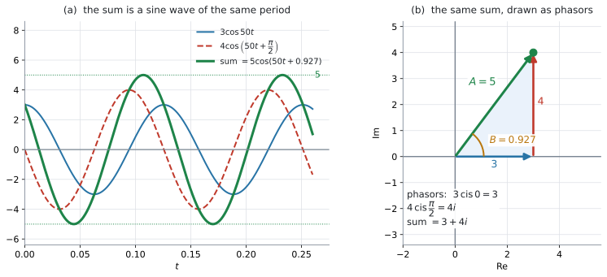
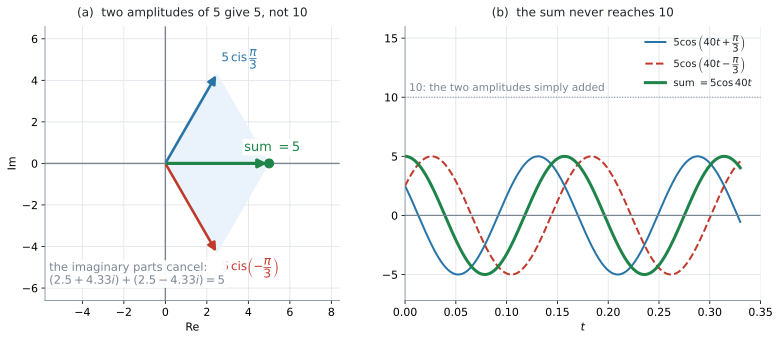

# AHL 1.13b — Adding sinusoidal functions（正弦波の合成） {#sec-ahl-1-13b}

::: {.callout-note}
## What you should be able to do
- 同じ **frequency**（周波数）の正弦波を足すと、**また同じ frequency の正弦波になる**（打ち消し合うときは $0$ になる）と言える。
- 各項を **phasor**（複素数の矢印）$A\operatorname{cis}\phi$ に直して、足せる。
- 足した複素数の **modulus が新しい振幅、argument が新しい phase shift** だと読める。
- 答えを $A\cos(\omega t + B)$ の形で書ける。
- $\sin$ と $\cos$ が混ざっているとき、形をそろえてから足せる。
- **振幅は単純な和にならない**理由を、図で説明できる。
:::

::: {.callout-important}
## 使う式は、AHL 1.13a のものだけです
新しい公式はありません。使うのは公式集の $1.13$ の欄の $1$ 行と、[AHL 1.12b](ahl-1-12b.qmd) の modulus・argument です。

$$
z = r(\cos\theta + i\sin\theta) = r\,e^{i\theta} = r\operatorname{cis}\theta
$$

**この項目でいちばん大事なのは、式ではなく手順**です（[第4節](#steps)）。
:::

::: {.callout-note}
## シラバスが、この項目に求めていること
AHL 1.13 の Content 欄は $6$ 行あり、[AHL 1.13a](ahl-1-13a.qmd) とこのページで分けて扱っています。このページに関わるのは、次の $1$ 行です。

> Adding sinusoidal functions with the same frequencies but different phase shift angles.

Guidance 欄には、こう書かれています。

> Phase shift and voltage in circuits as complex quantities.

> **Example:** Two AC voltage sources are connected in a circuit. If $V_1 = 10\cos(40t)$ and $V_2 = 20\cos(40t+10)$ find an expression for the total voltage in the form $V = A\cos(40t+B)$.

**この Example が、IB がこの項目について示している唯一の具体例**です。phase が $10$ radian と大きく、答えの $B$ は第 $3$ 象限に来ます。似た形を[演習 2](#exercises) に置いてあります。

**「as complex quantities」**——複素数として扱いなさい、と指定されています。このページの手順は、この指示に沿ったものです。

polar form と exponential form そのものは、[AHL 1.13a](ahl-1-13a.qmd) で扱いました。
:::

## The idea

### 1. 同じ周期の波を足すと、同じ周期の波か、$0$ になります {#idea}

$$
3\cos 50t \quad \text{と} \quad 4\cos\left(50t + \frac{\pi}{2}\right)
$$

を足してみます。どちらも $50t$ の部分が同じ、つまり**周期が同じ**です。

{#fig-ahl113b-add width=100%}

@fig-ahl113b-add の (a) の緑の線が、$2$ つを足したものです。**でこぼこにはならず、同じ周期の正弦波のまま**です。変わったのは $2$ つだけです。

- **amplitude**（振幅）が $3$ でも $4$ でもなく $5$ になった
- 波全体が横にずれた（**phase shift**）

つまり、答えは次の形に書けます。

$$
A_1\cos(\omega t + \phi_1) + A_2\cos(\omega t + \phi_2) = A\cos(\omega t + B)
$$ {#eq-ahl113b-goal}

**この項目の仕事は、$A$ と $B$ を求めること**です。$\omega$ は変わりません。

ただし、$2$ つがちょうど打ち消し合うときだけは別です。そのときは和が**いつも $0$** になり、$A = 0$ です。このとき $0\cos(\omega t + B)$ は**どの $B$ でも同じ $0$** になるので、**$B$ が $1$ つに決まりません。** @eq-ahl113b-goal の右辺は、ふつう **$A > 0$** として求められるものなので、**その形では表せません。** 答えは $0$ とします（演習 $6$・演習 $9$）。

### 2. なぜ複素数を使うのか {#why-complex}

$\cos(\omega t + \phi)$ を展開して整理する、という道もあります。しかし、それには **compound angle formula**（加法定理）$\cos(X+Y) = \cos X\cos Y - \sin X\sin Y$ が要ります。

**AI HL のシラバスに、加法定理はありません。** 公式集の $3.8$ の欄に印刷されている identity も

$$
\cos^{2}\theta + \sin^{2}\theta = 1, \qquad \tan\theta = \frac{\sin\theta}{\cos\theta}
$$

の $2$ つだけです。ですから、その道は通れません。

かわりに使うのが**複素数**です。シラバスが Guidance 欄で `as complex quantities` と書いているのは、このことです。

### 3. phasor とは {#phasor}

$A\cos(\omega t + \phi)$ という $1$ つの波に、複素数 $A\operatorname{cis}\phi$ を対応させます。この複素数を **phasor**（フェーザ）といいます。

$$
A\cos(\omega t + \phi) \quad \longleftrightarrow \quad A\operatorname{cis}\phi = A e^{i\phi}
$$ {#eq-ahl113b-phasor}

**$\omega t$ は phasor に入れません。** $2$ つの波で $\omega$ が同じだからこそ、共通部分として外に置いておけます（理由は [Why it works](#why-it-works)）。

@fig-ahl113b-add の (b) が、$3\cos 50t$ と $4\cos\left(50t+\dfrac{\pi}{2}\right)$ の phasor です。$3$ の矢印の先から $4i$ の矢印を**つないで**描いてあります。

$$
3\operatorname{cis}0 = 3, \qquad 4\operatorname{cis}\frac{\pi}{2} = 4i
$$

矢印をつないだ先が $3+4i$ で、その modulus が $5$、argument が $0.927$ です。これが (a) の緑の波の振幅と phase shift そのものです。

$2$ 本とも原点から描いて平行四辺形にしても、同じ点に着きます（[AHL 1.13a](ahl-1-13a.qmd#add-vector)）。**つないで描くほうが、和の矢印が見つけやすくなります。**

::: {.callout-warning}
## $\omega$ が違う波には使えません
この方法が働くのは、**$2$ つの $\omega$ が同じとき**だけです。シラバスも `with the same frequencies` と断っています。

$\cos 50t + \cos 30t$ のような和は、正弦波になりません。この項目の範囲外です。
:::

### 4. 手順は $4$ つです {#steps}

1. **各項を $A\operatorname{cis}\phi$ にして、$a+bi$ に直す**
2. **足す**（real part どうし、imaginary part どうし）
3. 足した複素数の **modulus が $A$、argument が $B$**
4. **$A\cos(\omega t + B)$ と書く**

$3$ 番の argument は、**象限を確かめてから**決めてください（[AHL 1.12b](ahl-1-12b.qmd#quadrant)）。ここでも $\arctan$ の値をそのまま使うと間違えます。

足した複素数が $0$ になったときは、argument が決まりません。そのときは $A = 0$、つまり**和が $0$** です（[第1節](#idea)）。

上の例で通してみます。

$$
3\operatorname{cis}0 = 3 + 0i, \qquad 4\operatorname{cis}\frac{\pi}{2} = 0 + 4i
$$

$$
(3+0i)+(0+4i) = 3 + 4i
$$

$$
A = \lvert 3+4i \rvert = \sqrt{9+16} = 5, \qquad B = \arctan\frac{4}{3} = 0.927
$$

$$
3\cos 50t + 4\cos\left(50t+\frac{\pi}{2}\right) = 5\cos(50t + 0.927)
$$

### 5. 振幅は、足し算ではありません {#not-sum}

$3$ と $4$ を足した波の振幅は $7$ ではなく $5$ でした。**なぜ小さくなるのか**を、図で見ておきます。

{#fig-ahl113b-cancel width=100%}

@fig-ahl113b-cancel の (a) は、振幅が同じ $5$ で、phase が $\dfrac{\pi}{3}$ と $-\dfrac{\pi}{3}$ の $2$ つです。

$$
5\operatorname{cis}\frac{\pi}{3} = 2.5 + 4.33i, \qquad 5\operatorname{cis}\left(-\frac{\pi}{3}\right) = 2.5 - 4.33i
$$

足すと **imaginary part が打ち消し合って**

$$
(2.5+4.33i) + (2.5-4.33i) = 5
$$

です。$A = 5$、$B = 0$ になりました。(b) のグラフでも、緑の波は $10$ に届いていません。

::: {.callout-important}
## $2$ つの矢印が同じ向きのときだけ、振幅は足し算になります
$\phi_1 = \phi_2$ なら矢印が一直線に並ぶので、$A = A_1 + A_2$ です。

向きが違えば、必ずそれより小さくなります。

$$
A \leq A_1 + A_2
$$

三角形の $2$ 辺の和が残りの $1$ 辺より長い——という、図形の性質そのものです（[AHL 1.13a](ahl-1-13a.qmd#add-vector) の平行四辺形）。
:::

### 6. $\sin$ と $\cos$ が混ざっているとき {#sine-form}

phasor を作る前に、**形をそろえます。** そろえてしまえば、あとは同じ手順です。

$$
\sin\theta = \cos\left(\theta - \frac{\pi}{2}\right), \qquad \cos\theta = \sin\left(\theta + \frac{\pi}{2}\right)
$$ {#eq-ahl113b-convert}

たとえば $4\sin 2t$ を $\cos$ にそろえるなら $4\cos\left(2t - \dfrac{\pi}{2}\right)$ で、phasor は $4\operatorname{cis}\left(-\dfrac{\pi}{2}\right) = -4i$ です。

::: {.callout-note}
## 三角比の値そのものは、試験では聞かれません
シラバスの AHL 3.8 の Guidance 欄には、こう書かれています。

> Knowledge of exact values of $\cos\theta$, $\sin\theta$, and $\tan\theta$ will not be assessed on examinations, but may aid student understanding of trigonometric functions.

$\cos\dfrac{\pi}{3} = \dfrac{1}{2}$ のような値は、電卓で出して構いません。このページで exact の練習をするのは、答えが $2\sqrt{3}$ のようにきれいになるとき、そのまま書いたほうが速く済むからです。
:::

::: {.callout-tip}
## 全部 $\sin$ でそろえてもかまいません
答えを $A\sin(\omega t + B)$ の形で求めよ、と言われたら、**全部 $\sin$ にそろえる**ほうが速く終わります。phasor の考え方は同じです。

**問題文が求めている形に、最初からそろえてください。** 最後に直そうとすると、$\dfrac{\pi}{2}$ の足し引きを間違えやすくなります。
:::

### 7. $B$ の読み方 {#interpret}

$B$ は、合成した波が**もとの $\cos\omega t$ から、角にしてどれだけずれたか**を表します。これは **phase**（位相）であって、時間そのものではありません。

$\omega > 0$ とすると、$A\cos(\omega t + B) = A\cos\!\left(\omega\!\left(t + \dfrac{B}{\omega}\right)\right)$ なので、**時間軸の上での符号付きの移動量**は

$$
-\frac{B}{\omega} \ \text{秒}
$$ {#eq-ahl113b-shift}

です。ずれの**大きさ**だけを言うなら $\dfrac{\lvert B \rvert}{\omega}$ 秒です。

- $B > 0$ … $-\dfrac{B}{\omega} < 0$ なので**左**へ移動する（波が先に来る、**leading**）
- $B < 0$ … $-\dfrac{B}{\omega} > 0$ なので**右**へ移動する（波が遅れて来る、**lagging**）

たとえば $B = 0.927$、$\omega = 50$ なら

$$
-\frac{0.927}{50} = -0.0185 \ \text{秒}
$$

で、**左へ $0.0185$ 秒移動します。** 山が来るのは $t = 0$ ではなく $t = -0.0185$ 秒です。**$0.927$ 秒ずれるのではありません。**

## Why it works

ここでは、**なぜ $\omega t$ を phasor から外してよいのか**だけを説明します。

出発点は、[AHL 1.13a](ahl-1-13a.qmd#exponential) の $e^{i\theta} = \cos\theta + i\sin\theta$ です。この式の **real part** を取り出すと

$$
\cos\theta = \operatorname{Re}\left(e^{i\theta}\right)
$$

です。ですから、$1$ つの波は次のように書けます。

$$
A\cos(\omega t + \phi) = \operatorname{Re}\left(A e^{i(\omega t + \phi)}\right) = \operatorname{Re}\left(A e^{i\phi} \cdot e^{i\omega t}\right)
$$

指数法則で $e^{i(\omega t+\phi)}$ を $2$ つに分けたところが要点です。**$A e^{i\phi}$ が phasor、$e^{i\omega t}$ が共通部分**になりました。

$2$ つの波を足すと

$$
\operatorname{Re}\left(A_1 e^{i\phi_1}e^{i\omega t}\right) + \operatorname{Re}\left(A_2 e^{i\phi_2}e^{i\omega t}\right) = \operatorname{Re}\left(\left(A_1 e^{i\phi_1} + A_2 e^{i\phi_2}\right)e^{i\omega t}\right)
$$

**$e^{i\omega t}$ が、そっくりくくり出せました。** $\omega$ が同じでなければ、このくくり出しはできません。

あとはかっこの中の複素数を $Ae^{iB}$ の形にまとめれば

$$
\operatorname{Re}\left(A e^{iB} e^{i\omega t}\right) = \operatorname{Re}\left(A e^{i(\omega t + B)}\right) = A\cos(\omega t + B)
$$

となります。つまり **phasor を足すという作業は、共通部分を外に置いたまま中身だけを足している**ということです。

全部を $\sin$ でそろえたときは、$\sin\theta = \operatorname{Im}\left(e^{i\theta}\right)$ から出発して、同じ計算をたどります。$\operatorname{Re}$ が $\operatorname{Im}$ に変わるだけで、phasor が $Ae^{i\phi}$ であることも、$e^{i\omega t}$ をくくり出せることも同じです。**大事なのは、$2$ つの波を同じ $\sin$（または同じ $\cos$）にそろえてから phasor を作ること**です。

## Worked examples

::: {.callout-note appearance="simple"}
問題文は英語です。意味が理解できなかったら、問題文の下の「**日本語訳**」を開いてください。解説は日本語です。
:::

::: {#exm-ahl113b-basic}
[Two voltages in a circuit are $V_1 = 3\cos 50t$ and $V_2 = 4\cos\left(50t + \dfrac{\pi}{2}\right)$, where $V$ is in volts and $t$ is in seconds.]{.q-en}

[Find the total voltage $V_1 + V_2$ in the form $A\cos(50t + B)$, where $A > 0$ and $B$ is in radians correct to $3$ significant figures.]{.q-en}

<details class="jp-trans">
<summary>日本語訳</summary>

ある回路の $2$ つの電圧が $V_1 = 3\cos 50t$、$V_2 = 4\cos\left(50t+\dfrac{\pi}{2}\right)$ です。$V$ の単位はボルト、$t$ の単位は秒です。

合計の電圧 $V_1 + V_2$ を $A\cos(50t+B)$ の形で求めなさい。$A > 0$ とし、$B$ は radian で有効数字 $3$ 桁で書きなさい。

</details>

---

[第4節](#steps) の手順どおりに進めます。

**手順 1。** 各項を phasor にします。

$$
V_1 \ \longrightarrow \ 3\operatorname{cis}0 = 3
$$

$$
V_2 \ \longrightarrow \ 4\operatorname{cis}\frac{\pi}{2} = 4\left(\cos\frac{\pi}{2} + i\sin\frac{\pi}{2}\right) = 4i
$$

**手順 2。** 足します。

$$
3 + 4i
$$

**手順 3。** modulus と argument を読みます。点 $(3,\ 4)$ は第 $1$ 象限なので、$\arctan$ をそのまま使えます。

$$
A = \sqrt{3^{2}+4^{2}} = 5, \qquad B = \arctan\frac{4}{3} = 0.927
$$

**手順 4。** 形にして書きます。

$$
V_1 + V_2 = 5\cos(50t + 0.927)
$$

**検算。** $t = 0$ を入れます。左辺は $3\cos 0 + 4\cos\dfrac{\pi}{2} = 3 + 0 = 3$、右辺は $5\cos 0.927 = 5 \times 0.6 = 3$ ✓

::: {.callout-note}
## 解答例（答案用紙にはこう書く）
$$V_1 \to 3\operatorname{cis}0 = 3, \qquad V_2 \to 4\operatorname{cis}\frac{\pi}{2} = 4i$$
$$3 + 4i$$
$$A = \sqrt{3^{2}+4^{2}} = 5, \qquad B = \arctan\frac{4}{3} = 0.927$$
$$V_1 + V_2 = 5\cos(50t + 0.927)$$
:::
:::

::: {#exm-ahl113b-cancel}
[Let $y_1 = 5\cos\left(40t + \dfrac{\pi}{3}\right)$ and $y_2 = 5\cos\left(40t - \dfrac{\pi}{3}\right)$.]{.q-en}

**(a)** [Write $y_1 + y_2$ in the form $A\cos(40t + B)$.]{.q-en}

**(b)** [Comment on the amplitude of $y_1 + y_2$ compared with the amplitudes of $y_1$ and $y_2$.]{.q-en}

<details class="jp-trans">
<summary>日本語訳</summary>

$y_1 = 5\cos\left(40t+\dfrac{\pi}{3}\right)$、$y_2 = 5\cos\left(40t-\dfrac{\pi}{3}\right)$ とします。

**(a)** $y_1 + y_2$ を $A\cos(40t+B)$ の形で書きなさい。

**(b)** $y_1+y_2$ の振幅を、$y_1$ と $y_2$ の振幅とくらべてコメントしなさい。

</details>

---

**(a)** phasor に直します。$\cos\dfrac{\pi}{3} = \dfrac{1}{2}$、$\sin\dfrac{\pi}{3} = \dfrac{\sqrt{3}}{2}$ です。

$$
5\operatorname{cis}\frac{\pi}{3} = \frac{5}{2} + \frac{5\sqrt{3}}{2}i, \qquad 5\operatorname{cis}\left(-\frac{\pi}{3}\right) = \frac{5}{2} - \frac{5\sqrt{3}}{2}i
$$

足すと、**imaginary part が打ち消し合います。**

$$
\left(\frac{5}{2}+\frac{5}{2}\right) + \left(\frac{5\sqrt{3}}{2}-\frac{5\sqrt{3}}{2}\right)i = 5
$$

$A = 5$、$B = \arg 5 = 0$ です（正の実軸上の点なので $0$ です。[AHL 1.12b](ahl-1-12b.qmd#quadrant)）。

$$
y_1 + y_2 = 5\cos 40t
$$

**検算。** $40t = 0$ のとき、左辺は $5\cos\dfrac{\pi}{3}+5\cos\left(-\dfrac{\pi}{3}\right) = 2.5+2.5 = 5$、右辺は $5\cos 0 = 5$ ✓

**(b)** `Comment on` は、**言葉で答える**設問です。数値だけでは点になりません。

::: {.model-answer}
**試験ではこう書く**

*The amplitude of the sum is $5$, the same as each of $y_1$ and $y_2$, and much less than $10$. The two phasors have equal length but point in different directions, $\frac{\pi}{3}$ above and below the real axis, so their imaginary parts cancel and only part of each contributes to the total.*
:::

（和の振幅は $5$ で、$y_1$ と $y_2$ のそれぞれと同じであり、$10$ よりずっと小さい。$2$ つの phasor は長さが等しいが向きが違い、実軸の上下 $\dfrac{\pi}{3}$ を向いているので、虚部が打ち消し合い、それぞれの一部だけが合計に効いている、という意味です。）

::: {.callout-note}
## 解答例（答案用紙にはこう書く）
**(a)**
$$5\operatorname{cis}\frac{\pi}{3} + 5\operatorname{cis}\left(-\frac{\pi}{3}\right) = \left(\frac{5}{2}+\frac{5\sqrt{3}}{2}i\right)+\left(\frac{5}{2}-\frac{5\sqrt{3}}{2}i\right) = 5$$
$$A = 5, \quad B = 0 \ \Rightarrow \ y_1 + y_2 = 5\cos 40t$$

**(b)**
*The amplitude of the sum is $5$, not $10$: the two phasors have equal length but different directions, so their imaginary parts cancel.*
:::
:::

::: {#exm-ahl113b-mixed}
[Let $y = 4\sin 2t + 3\cos 2t$.]{.q-en}

[Write $y$ in the form $A\sin(2t + B)$, where $A > 0$ and $B$ is in radians correct to $3$ significant figures.]{.q-en}

<details class="jp-trans">
<summary>日本語訳</summary>

$y = 4\sin 2t + 3\cos 2t$ とします。

$y$ を $A\sin(2t+B)$ の形で書きなさい。$A > 0$ とし、$B$ は radian で有効数字 $3$ 桁で書きなさい。

</details>

---

答えが $\sin$ の形なので、**まず全部を $\sin$ にそろえます**（[第6節](#sine-form)）。

@eq-ahl113b-convert より $\cos 2t = \sin\left(2t + \dfrac{\pi}{2}\right)$ です。

$$
y = 4\sin 2t + 3\sin\left(2t+\frac{\pi}{2}\right)
$$

**手順 1・2。** phasor にして足します。

$$
4\operatorname{cis}0 + 3\operatorname{cis}\frac{\pi}{2} = 4 + 3i
$$

**手順 3。** 点 $(4,\ 3)$ は第 $1$ 象限です。

$$
A = \sqrt{16+9} = 5, \qquad B = \arctan\frac{3}{4} = 0.644
$$

**手順 4。**

$$
y = 5\sin(2t + 0.644)
$$

**検算。** $t = 0$ を入れます。左辺は $4\sin 0 + 3\cos 0 = 3$、右辺は $5\sin 0.644 = 5 \times 0.6 = 3$ ✓

::: {.callout-note}
## 解答例（答案用紙にはこう書く）
$$3\cos 2t = 3\sin\left(2t+\frac{\pi}{2}\right)$$
$$4\operatorname{cis}0 + 3\operatorname{cis}\frac{\pi}{2} = 4 + 3i$$
$$A = \sqrt{4^{2}+3^{2}} = 5, \qquad B = \arctan\frac{3}{4} = 0.644$$
$$y = 5\sin(2t + 0.644)$$
:::
:::

::: {#exm-ahl113b-machine}
[Two vibrations act on the same point of a machine. Their displacements, in millimetres, are]{.q-en}

$$
y_1 = 8\sin 3t \qquad \text{and} \qquad y_2 = 8\sin\left(3t + \frac{2\pi}{3}\right)
$$

[where $t$ is in seconds.]{.q-en}

**(a)** [Write the combined displacement $y_1 + y_2$ in the form $A\sin(3t + B)$, giving exact values for $A$ and $B$.]{.q-en}

**(b)** [Interpret the value of $A$ in the context of the machine.]{.q-en}

<details class="jp-trans">
<summary>日本語訳</summary>

$2$ つの振動が、機械の同じ点にはたらいています。それぞれの変位はミリメートルで

$$
y_1 = 8\sin 3t \qquad \text{と} \qquad y_2 = 8\sin\left(3t + \frac{2\pi}{3}\right)
$$

です。$t$ の単位は秒です。

**(a)** 合わさった変位 $y_1+y_2$ を $A\sin(3t+B)$ の形で書きなさい。$A$ と $B$ は正確な値で書きなさい。

**(b)** $A$ の値を、この機械の文脈で解釈しなさい。

</details>

---

**(a)** どちらも $\sin$ なので、そろえる作業は要りません。

$$
8\operatorname{cis}0 = 8
$$

$$
8\operatorname{cis}\frac{2\pi}{3} = 8\left(-\frac{1}{2}\right) + 8\left(\frac{\sqrt{3}}{2}\right)i = -4 + 4\sqrt{3}\,i
$$

足すと

$$
8 + (-4 + 4\sqrt{3}\,i) = 4 + 4\sqrt{3}\,i
$$

$$
A = \sqrt{4^{2}+(4\sqrt{3})^{2}} = \sqrt{16+48} = \sqrt{64} = 8
$$

点 $(4,\ 4\sqrt{3})$ は第 $1$ 象限です。

$$
B = \arctan\frac{4\sqrt{3}}{4} = \arctan\sqrt{3} = \frac{\pi}{3}
$$

$$
y_1 + y_2 = 8\sin\left(3t + \frac{\pi}{3}\right)
$$

**検算。** $t = 0$ を入れます。左辺は $0 + 8\sin\dfrac{2\pi}{3} = 8 \times \dfrac{\sqrt{3}}{2} = 4\sqrt{3}$、右辺は $8\sin\dfrac{\pi}{3} = 4\sqrt{3}$ ✓

**(b)** `Interpret` は、数値を**文脈の言葉**に直す設問です。単位を必ず付けてください。

::: {.model-answer}
**試験ではこう書く**

*The combined vibration has amplitude $8$ mm, so the point moves at most $8$ mm from its rest position. This is the same as each single vibration and only half of $16$ mm, because the two vibrations are $\frac{2\pi}{3}$ out of phase and partly cancel each other.*
:::

（合わさった振動の振幅は $8$ mm なので、この点は静止位置から最大 $8$ mm しか動かない。これは $1$ つの振動と同じで、$16$ mm の半分でしかない。$2$ つの振動の phase が $\dfrac{2\pi}{3}$ ずれていて、たがいに一部を打ち消し合うからである、という意味です。）

::: {.callout-note}
## 解答例（答案用紙にはこう書く）
**(a)**
$$8\operatorname{cis}0 + 8\operatorname{cis}\frac{2\pi}{3} = 8 + \left(-4 + 4\sqrt{3}\,i\right) = 4 + 4\sqrt{3}\,i$$
$$A = \sqrt{16+48} = 8, \qquad B = \arctan\sqrt{3} = \frac{\pi}{3}$$
$$y_1 + y_2 = 8\sin\left(3t+\frac{\pi}{3}\right)$$

**(b)**
*The amplitude is $8$ mm, so the point moves at most $8$ mm from rest. The two vibrations are out of phase, so they partly cancel and the combined amplitude is $8$ mm rather than $16$ mm.*
:::
:::

## Common errors

::: {.callout-warning}
## 振幅を足してしまう
$3\cos 50t + 4\cos\left(50t+\dfrac{\pi}{2}\right)$ の振幅を $7$ と書いてしまう誤りです。

**振幅が足し算になるのは、$2$ つの phase が同じときだけ**です（[第5節](#not-sum)）。向きが違えば、必ずそれより小さくなります。

正しくは $\lvert 3+4i \rvert = 5$ です。**phasor を足してから modulus をとる**、という順番を守ってください。
:::

::: {.callout-warning}
## $\omega t$ を phasor に入れる
$3\cos 50t$ の phasor を $3\operatorname{cis}50t$ と書いてしまう誤りです。

phasor に入るのは **phase shift の $\phi$ だけ**です（@eq-ahl113b-phasor）。$\omega t$ は $2$ つの波で共通なので、外に置いたままにします（[Why it works](#why-it-works)）。

$3\cos 50t$ は $3\cos(50t + 0)$ なので、phasor は $3\operatorname{cis}0 = 3$ です。
:::

::: {.callout-warning}
## $\sin$ と $\cos$ を、そろえずに足す
$3\cos 2t$ と $4\sin 2t$ の phasor を、どちらも $\operatorname{cis}0$ として足してしまう誤りです。

$\sin$ と $\cos$ は、すでに $\dfrac{\pi}{2}$ ずれています。**先にどちらかにそろえてください**（[第6節](#sine-form)）。

$$
\cos 2t = \sin\left(2t+\frac{\pi}{2}\right), \qquad \sin 2t = \cos\left(2t - \frac{\pi}{2}\right)
$$
:::

::: {.callout-warning}
## $B$ を、象限を見ずに決める
$\arctan$ の値をそのまま $B$ にしてしまう誤りです。

足した phasor が第 $2$・第 $3$ 象限にあるときは、$\pi$ を足すか引く必要があります（[AHL 1.12b](ahl-1-12b.qmd#quadrant)）。

**足した複素数を図にかいてから**、$B$ を決めてください。
:::

::: {.callout-warning}
## $B$ を度で答える
GDC が `Angle: Degree` のままだと、$\arctan\dfrac{4}{3}$ が $53.1$ と返ります。

HL の試験では **radian が既定**です。$A\cos(50t+B)$ の $50t$ は radian なので、**$B$ も radian でなければ足せません。**

$53.1$ と $0.927$ が混ざった式は、意味を持ちません。
:::

## Using your GDC (TI-Nspire CX II)

### 1. 準備 {#gdc-setup}

```
doc → Settings → Document Settings
```

- `Angle` を **`Radian`** に
- `Real or Complex` を **`Polar`** に

`Polar` にしておくのが、この項目のこつです。理由は次の節にあります。

### 2. phasor を足すと、$A$ と $B$ が同時に出ます {#gdc-add}

`Polar` 設定のまま、phasor をそのまま足します。

```
3e^(0i)+4e^((pi/2)i)
```

$5e^{0.927i}$ の形で返ります。**$A = 5$ と $B = 0.927$ が、$1$ 回の計算で両方読めます。**

この打ち方が生きるのは、$\operatorname{cis}\dfrac{2\pi}{3}$ のように $a+bi$ へ直すのが面倒なときです。角が $0$ や $\dfrac{\pi}{2}$ だけなら、[次の節](#gdc-abs)のほうが速く済みます。

$e$ は `e^x` キーから入れます。$i$ は記号パレットからです（[AHL 1.12a](ahl-1-12a.qmd#gdc-i)）。

::: {.callout-tip}
## `Rectangular` だと、$3+4i$ が返ります
どちらの設定でも、計算しているものは同じです。**`Polar` は modulus と argument を、`Rectangular` は real part と imaginary part を見せてくれる**、という違いだけです（[AHL 1.13a](ahl-1-13a.qmd#gdc-form)）。

非CAS の CX II は数値で計算するので、どちらの表示でも**小数**で返ります。

途中の足し算を確かめたいときは `Rectangular`、答えを読むときは `Polar` が便利です。
:::

### 3. $A$ と $B$ を別々に出す {#gdc-abs}

設定を変えたくないときは、$2$ つの関数で読めます。

```
abs(3+4i)
angle(3+4i)
```

$5$ と $0.927$ が返ります（[AHL 1.12b](ahl-1-12b.qmd#gdc-abs)）。

### 4. グラフで確かめる {#gdc-graph}

いちばん納得できる検算は、**重ねて描くこと**です。

```
ctrl + doc → 2: Add Graphs
```

$4$ つ入れます。

| 入力 | 何の線か |
|:--|:--|
| `f1(x)=3cos(50x)` | もとの波 $1$ |
| `f2(x)=4cos(50x+π/2)` | もとの波 $2$ |
| `f3(x)=f1(x)+f2(x)` | $2$ つの和 |
| `f4(x)=5cos(50x+0.927)` | 自分の答え |

: グラフで重ねる {#tbl-ahl113b-graph}

**`f3` と `f4` がぴったり重なれば、答えは合っています。** ずれていれば、$A$ か $B$ のどちらかが違います。

`x` の範囲は、周期 $\dfrac{2\pi}{50} = 0.126$ の $2$ 倍ほど、つまり $0 \leq x \leq 0.25$ にすると見やすくなります。**$y$ の範囲も $-6 \leq y \leq 6$ にしてください。** 既定のままだと波が縦につぶれて、重なっているかどうかが分かりません。

::: {.callout-tip}
## ずれ方で、どちらが違うかが分かります
- **山の高さ**が違う → $A$ が違う
- **山の位置**が横にずれている → $B$ が違う

$B$ の符号を間違えると、ずれの向きが逆になります。横のずれは $-\dfrac{B}{\omega}$ 秒でした（@eq-ahl113b-shift）。
:::

### 5. $1$ 点だけで確かめる {#gdc-check}

グラフを描く時間がないときは、**$t = 0$ を入れる**のが最短です。

$$
\text{左辺} = 3\cos 0 + 4\cos\frac{\pi}{2} = 3, \qquad \text{右辺} = 5\cos 0.927 = 3
$$

$1$ 点で合っただけでは足りないこともあるので、**$t$ をもう $1$ つ選んで**確かめると確実です。

## Exercises

::: {.callout-note appearance="simple"}
各問題に、折りたたみが3つ付いています。**日本語訳**、**解答例**（答案用紙に書くべきこと。英語です）、**解説**（なぜそうなるか。日本語です）。

まず自分で解いて、次に解答例と見くらべてください。**解説は、合わなかったときだけ開けば十分です。**
:::

::: {.exercise-block}

[1]{.ex-no} [Write down the phasor for $6\cos\left(20t + \dfrac{\pi}{4}\right)$ in the form $a+bi$, giving exact values.]{.q-en}

<details class="jp-trans">
<summary>日本語訳</summary>

$6\cos\left(20t+\dfrac{\pi}{4}\right)$ の phasor を $a+bi$ の形で書きなさい。値は正確に書きなさい。

</details>

::: {.callout-note collapse="true"}
## 解答例（答案用紙に書くこと）

$$6\operatorname{cis}\frac{\pi}{4} = 6\cos\frac{\pi}{4} + 6i\sin\frac{\pi}{4} = 3\sqrt{2} + 3\sqrt{2}\,i$$
:::

::: {.callout-tip collapse="true"}
## 解説

phasor に入るのは、振幅 $6$ と phase shift $\dfrac{\pi}{4}$ だけです。**$20t$ は入れません**（[第3節](#phasor)）。

$\cos\dfrac{\pi}{4} = \sin\dfrac{\pi}{4} = \dfrac{1}{\sqrt{2}}$ なので、$6 \times \dfrac{1}{\sqrt{2}} = \dfrac{6}{\sqrt{2}} = 3\sqrt{2}$ です。

**検算。** $\lvert 3\sqrt{2}+3\sqrt{2}\,i \rvert = \sqrt{18+18} = 6$ ✓ 振幅に戻りました。
:::

::: {.ex-sep}
:::

[2]{.ex-no} [Two voltages in a circuit are $V_1 = 6\cos 40t$ and $V_2 = 10\cos\left(40t + \dfrac{5\pi}{6}\right)$, where $V$ is in volts and $t$ is in seconds.]{.q-en}

[Find $V_1 + V_2$ in the form $A\cos(40t+B)$, where $A > 0$ and $-\pi < B \leq \pi$, giving $A$ and $B$ correct to $3$ significant figures.]{.q-en}

<details class="jp-trans">
<summary>日本語訳</summary>

ある回路の $2$ つの電圧が $V_1 = 6\cos 40t$、$V_2 = 10\cos\left(40t+\dfrac{5\pi}{6}\right)$ です。$V$ の単位はボルト、$t$ の単位は秒です。

$V_1 + V_2$ を $A\cos(40t+B)$ の形で求めなさい。$A > 0$、$-\pi < B \leq \pi$ とし、$A$ と $B$ は有効数字 $3$ 桁で書きなさい。

</details>

::: {.callout-note collapse="true"}
## 解答例（答案用紙に書くこと）

$$6\operatorname{cis}0 = 6$$

$$10\operatorname{cis}\frac{5\pi}{6} = 10\left(-\frac{\sqrt{3}}{2}\right) + 10\left(\frac{1}{2}\right)i = -5\sqrt{3} + 5i$$

$$6 + \left(-5\sqrt{3}+5i\right) = -2.660 + 5i$$

$$A = \sqrt{(-2.660)^{2}+5^{2}} = 5.66$$

$$\arctan\frac{5}{-2.660} = -1.08$$

*The point $(-2.660,\ 5)$ is in the second quadrant, so*

$$B = -1.08 + \pi = 2.06$$

$$V_1 + V_2 = 5.66\cos(40t + 2.06)$$
:::

::: {.callout-tip collapse="true"}
## 解説

**この問題が、このページで唯一 $\arctan$ の直しが要る問題です。**

$\cos\dfrac{5\pi}{6} = -\dfrac{\sqrt{3}}{2}$、$\sin\dfrac{5\pi}{6} = \dfrac{1}{2}$ なので、$2$ つ目の phasor は real part が**負**になります。

足した $-2.660 + 5i$ は**第 $2$ 象限**の点です。$\arctan$ が返す $-1.08$ は第 $4$ 象限の向きなので、$\pi$ を足します（[AHL 1.12b](ahl-1-12b.qmd#quadrant)）。

**$B = -1.08$ と書くと、波が逆向きにずれた別の式になります。** 足した複素数を図にかいてから $B$ を決めてください（[Common errors](#common-errors) の $4$ つ目）。

**検算。** $t = 0$ で、左辺は $6 + 10\cos\dfrac{5\pi}{6} = 6 - 8.66 = -2.66$、右辺は $5.66\cos 2.06 = 5.66 \times (-0.4699) = -2.66$ ✓

シラバスの Guidance 欄の Example も、これと同じ形です（$V_1 = 10\cos 40t$、$V_2 = 20\cos(40t+10)$ で、答えの $B$ は第 $3$ 象限に来ます）。

:::

::: {.ex-sep}
:::

[3]{.ex-no} [Let $y_1 = 7\sin 4t$ and $y_2 = 7\sin\left(4t + \dfrac{\pi}{2}\right)$. Write $y_1 + y_2$ in the form $A\sin(4t+B)$, giving exact values for $A$ and $B$.]{.q-en}

<details class="jp-trans">
<summary>日本語訳</summary>

$y_1 = 7\sin 4t$、$y_2 = 7\sin\left(4t+\dfrac{\pi}{2}\right)$ とします。$y_1+y_2$ を $A\sin(4t+B)$ の形で書きなさい。$A$ と $B$ は正確な値で書きなさい。

</details>

::: {.callout-note collapse="true"}
## 解答例（答案用紙に書くこと）

$$7\operatorname{cis}0 + 7\operatorname{cis}\frac{\pi}{2} = 7 + 7i$$

$$A = \sqrt{49+49} = 7\sqrt{2}, \qquad B = \arctan 1 = \frac{\pi}{4}$$

$$y_1 + y_2 = 7\sqrt{2}\sin\left(4t + \frac{\pi}{4}\right)$$
:::

::: {.callout-tip collapse="true"}
## 解説

どちらも $\sin$ なので、そろえる作業は要りません。

振幅が同じ $2$ つで、**向きの差が $\pi$ より小さい**ときは、合成の向きはちょうど真ん中になります。ここでは $0$ と $\dfrac{\pi}{2}$ の差が $\dfrac{\pi}{2}$ なので、真ん中の $\dfrac{\pi}{4}$ です。

差がちょうど $\pi$ なら和は $0$ になり（演習 $9$）、$\pi$ より大きければ向きは真ん中の反対側になります。**いつでも真ん中、ではありません。**

$7\sqrt{2} = 9.90$ で、$14$ より小さくなっています（[第5節](#not-sum)）。

「exact」と指定されているので、$9.90$ ではなく $7\sqrt{2}$ と書いてください。
:::

::: {.ex-sep}
:::

[4]{.ex-no} [Let $y_1 = 2\cos 3t$ and $y_2 = 2\cos\left(3t + \dfrac{\pi}{3}\right)$. Write $y_1 + y_2$ in the form $A\cos(3t+B)$, giving exact values for $A$ and $B$.]{.q-en}

<details class="jp-trans">
<summary>日本語訳</summary>

$y_1 = 2\cos 3t$、$y_2 = 2\cos\left(3t+\dfrac{\pi}{3}\right)$ とします。$y_1+y_2$ を $A\cos(3t+B)$ の形で書きなさい。$A$ と $B$ は正確な値で書きなさい。

</details>

::: {.callout-note collapse="true"}
## 解答例（答案用紙に書くこと）

$$2\operatorname{cis}0 + 2\operatorname{cis}\frac{\pi}{3} = 2 + \left(1 + \sqrt{3}\,i\right) = 3 + \sqrt{3}\,i$$

$$A = \sqrt{9+3} = \sqrt{12} = 2\sqrt{3}, \qquad B = \arctan\frac{\sqrt{3}}{3} = \frac{\pi}{6}$$

$$y_1 + y_2 = 2\sqrt{3}\cos\left(3t + \frac{\pi}{6}\right)$$
:::

::: {.callout-tip collapse="true"}
## 解説

$2\operatorname{cis}\dfrac{\pi}{3} = 2\left(\dfrac{1}{2}\right) + 2\left(\dfrac{\sqrt{3}}{2}\right)i = 1 + \sqrt{3}\,i$ です（[AHL 1.13a](ahl-1-13a.qmd#to-cartesian)）。

$\arctan\dfrac{\sqrt{3}}{3} = \arctan\dfrac{1}{\sqrt{3}} = \dfrac{\pi}{6}$ です。分母を有理化してから見ると分かりやすくなります。

ここでも振幅が同じ $2$ つで、向きの差が $\dfrac{\pi}{3} < \pi$ なので、$B$ は $0$ と $\dfrac{\pi}{3}$ の真ん中の $\dfrac{\pi}{6}$ になりました（演習 $3$ の解説）。

$\sqrt{12}$ は $2\sqrt{3} = 3.46$ です。$4$ より小さくなっています。
:::

::: {.ex-sep}
:::

[5]{.ex-no} [Let $y = 3\sin 2t + 4\cos 2t$. Write $y$ in the form $A\sin(2t+B)$, giving $B$ correct to $3$ significant figures.]{.q-en}

<details class="jp-trans">
<summary>日本語訳</summary>

$y = 3\sin 2t + 4\cos 2t$ とします。$y$ を $A\sin(2t+B)$ の形で書きなさい。$B$ は有効数字 $3$ 桁で書きなさい。

</details>

::: {.callout-note collapse="true"}
## 解答例（答案用紙に書くこと）

$$4\cos 2t = 4\sin\left(2t+\frac{\pi}{2}\right)$$

$$3\operatorname{cis}0 + 4\operatorname{cis}\frac{\pi}{2} = 3 + 4i$$

$$A = 5, \qquad B = \arctan\frac{4}{3} = 0.927$$

$$y = 5\sin(2t + 0.927)$$
:::

::: {.callout-tip collapse="true"}
## 解説

答えが $\sin$ の形なので、$\cos$ のほうを $\sin$ に直します（@eq-ahl113b-convert）。

$$\cos\theta = \sin\left(\theta + \frac{\pi}{2}\right)$$

**そろえずに足すと、$7\sin 2t$ という誤った答えになります**（[Common errors](#common-errors) の $3$ つ目）。

**検算。** $t = 0$ で、左辺は $0 + 4 = 4$、右辺は $5\sin 0.927 = 5 \times 0.8 = 4$ ✓
:::

::: {.ex-sep}
:::

[6]{.ex-no} [In a three-phase electricity supply, the three voltages are]{.q-en}

$$
V_1 = 4\cos 60t, \quad V_2 = 4\cos\left(60t + \frac{2\pi}{3}\right), \quad V_3 = 4\cos\left(60t - \frac{2\pi}{3}\right)
$$

[Show that $V_1 + V_2 + V_3 = 0$ for all values of $t$.]{.q-en}

<details class="jp-trans">
<summary>日本語訳</summary>

三相交流の電源で、$3$ つの電圧が上のように与えられています。すべての $t$ について $V_1+V_2+V_3 = 0$ となることを示しなさい。

</details>

::: {.callout-note collapse="true"}
## 解答例（答案用紙に書くこと）

$$4\operatorname{cis}0 = 4$$
$$4\operatorname{cis}\frac{2\pi}{3} = -2 + 2\sqrt{3}\,i$$
$$4\operatorname{cis}\left(-\frac{2\pi}{3}\right) = -2 - 2\sqrt{3}\,i$$

*Adding the three phasors:*

$$4 + \left(-2+2\sqrt{3}\,i\right) + \left(-2-2\sqrt{3}\,i\right) = 0$$

*The sum of the phasors is $0$, so the amplitude of the combined voltage is $0$ and $V_1+V_2+V_3 = 0$ for all $t$.*
:::

::: {.callout-tip collapse="true"}
## 解説

phasor が $3$ つでも、手順は変わりません。**全部足すだけ**です。

$4\cos\dfrac{2\pi}{3} = 4\left(-\dfrac{1}{2}\right) = -2$、$4\sin\dfrac{2\pi}{3} = 4\left(\dfrac{\sqrt{3}}{2}\right) = 2\sqrt{3}$ です。

real part は $4 - 2 - 2 = 0$、imaginary part は $2\sqrt{3} - 2\sqrt{3} = 0$ になります。

`Show that` なので、**$3$ つの phasor を書き、足して $0$ になるところまで**書いてください。図で「対称だから」と言うだけでは足りません。

$3$ つの矢印は、$\dfrac{2\pi}{3}$ ずつ離れて正三角形を作ります。これが三相交流で、発電所から送電線までの電気は、この $3$ 本の形で運ばれています。
:::

::: {.ex-sep}
:::

[7]{.ex-no} [Let $y_1 = 5\cos t$ and $y_2 = k\cos\left(t + \dfrac{\pi}{2}\right)$, where $k > 0$. The amplitude of $y_1 + y_2$ is $13$. Find the value of $k$.]{.q-en}

<details class="jp-trans">
<summary>日本語訳</summary>

$y_1 = 5\cos t$、$y_2 = k\cos\left(t+\dfrac{\pi}{2}\right)$（$k > 0$）とします。$y_1+y_2$ の振幅が $13$ です。$k$ の値を求めなさい。

</details>

::: {.callout-note collapse="true"}
## 解答例（答案用紙に書くこと）

$$5\operatorname{cis}0 + k\operatorname{cis}\frac{\pi}{2} = 5 + ki$$

$$\sqrt{5^{2}+k^{2}} = 13$$

$$25 + k^{2} = 169 \ \Rightarrow \ k^{2} = 144 \ \Rightarrow \ k = 12 \quad (\text{since } k > 0)$$
:::

::: {.callout-tip collapse="true"}
## 解説

phasor を足すと $5 + ki$ です。その modulus が振幅なので、$\sqrt{25+k^{2}} = 13$ という方程式が立ちます。

両辺を $2$ 乗して $\sqrt{\ }$ を外します（[AHL 1.12b](ahl-1-12b.qmd#modulus) の演習 $9$ と同じ形です）。

$k^{2} = 144$ の解は $\pm 12$ ですが、問題文が $k > 0$ と指定しているので $k = 12$ です。

**$5 + k = 13$ として $k = 8$ とはなりません。** 振幅は足し算ではありません（[第5節](#not-sum)）。
:::

::: {.ex-sep}
:::

[8]{.ex-no} [Two sinusoidal functions have the same frequency and amplitudes $A_1$ and $A_2$. Explain why the amplitude of their sum can never be greater than $A_1 + A_2$.]{.q-en}

<details class="jp-trans">
<summary>日本語訳</summary>

同じ周波数の $2$ つの正弦波の振幅が $A_1$ と $A_2$ です。それらの和の振幅が $A_1+A_2$ より大きくなることはない理由を説明しなさい。

</details>

::: {.callout-note collapse="true"}
## 解答例（答案用紙に書くこと）

*The amplitude of the sum is the modulus of the sum of the two phasors, $\lvert z_1 + z_2 \rvert$, where $\lvert z_1 \rvert = A_1$ and $\lvert z_2 \rvert = A_2$.*

*On an Argand diagram $z_1 + z_2$ is the diagonal of the parallelogram formed by the two phasors, and this diagonal is never longer than the two sides added together:*

$$\lvert z_1 + z_2 \rvert \leq \lvert z_1 \rvert + \lvert z_2 \rvert = A_1 + A_2$$

*Equality happens only when the two phasors point in the same direction, that is, when the two functions have the same phase shift.*
:::

::: {.callout-tip collapse="true"}
## 解説

`Explain why` なので、英語で理由を書きます。

言うべきことは $2$ つです。

- 和の振幅は $\lvert z_1 + z_2 \rvert$ である
- 平行四辺形の対角線は、$2$ 辺の和より長くならない（[AHL 1.13a](ahl-1-13a.qmd#add-vector)）

「例で確かめた」では説明になりません。**どんな $A_1$、$A_2$ でも成り立つ理由**を書いてください。

等号が成り立つ場合（$2$ つの向きが同じとき）にも触れられると、より確かな答案になります（[第5節](#not-sum)）。

::: {.model-answer}
**試験ではこう書く**

*The amplitude of the sum is $\lvert z_1 + z_2 \rvert$, where $z_1$ and $z_2$ are the phasors, with $\lvert z_1 \rvert = A_1$ and $\lvert z_2 \rvert = A_2$. On an Argand diagram $z_1 + z_2$ is the diagonal of the parallelogram with sides $z_1$ and $z_2$, and a diagonal is never longer than the sum of the two sides, so $\lvert z_1 + z_2 \rvert \leq A_1 + A_2$. They are equal only when the two phasors point the same way, that is, when the phase shifts are equal.*
:::
:::

::: {.ex-sep}
:::

[9]{.ex-no} [Two loudspeakers produce sound pressures at the same point, given by]{.q-en}

$$
p_1 = 0.6\cos 880t \qquad \text{and} \qquad p_2 = 0.6\cos\left(880t + \pi\right)
$$

[where $p$ is in pascals and $t$ is in seconds.]{.q-en}

**(a)** [Find $p_1 + p_2$.]{.q-en}

**(b)** [Interpret your answer in the context of the two loudspeakers.]{.q-en}

<details class="jp-trans">
<summary>日本語訳</summary>

$2$ つのスピーカーが、同じ点に上のような音圧を作っています。$p$ の単位はパスカル、$t$ の単位は秒です。

**(a)** $p_1 + p_2$ を求めなさい。

**(b)** その答えを、$2$ つのスピーカーの文脈で解釈しなさい。

</details>

::: {.callout-note collapse="true"}
## 解答例（答案用紙に書くこと）

**(a)**
$$0.6\operatorname{cis}0 + 0.6\operatorname{cis}\pi = 0.6 + (-0.6) = 0$$
$$p_1 + p_2 = 0 \text{ for all } t$$

**(b)**
*The two sound pressures cancel completely at that point. They have equal amplitude but are exactly $\pi$ out of phase, so whenever one is positive the other is equally negative, and a listener at that point hears nothing from the two speakers together.*
:::

::: {.callout-tip collapse="true"}
## 解説

$0.6\operatorname{cis}\pi = 0.6(\cos\pi + i\sin\pi) = 0.6(-1+0i) = -0.6$ です。

$2$ つの phasor が**正反対を向いている**ので、足すと $0$ になります。これは [第5節](#not-sum) の極端な場合です。

`Interpret` が付いているので、$0$ という数だけでは点になりません。**現実に何が起きるか**を書いてください。

これはノイズキャンセリングの仕組みそのものです。逆位相の音を出して、耳に届く音圧を $0$ に近づけています。

::: {.model-answer}
**試験ではこう書く**

*The two pressures cancel exactly at that point, so the combined sound pressure is zero at all times. The speakers have equal amplitude but are $\pi$ out of phase, so one is positive whenever the other is equally negative.*
:::
:::

::: {.ex-sep}
:::

[10]{.ex-no} [A student is asked to write $y = 3\cos 2t + 4\sin 2t$ in the form $A\cos(2t+B)$ and writes]{.q-en}

$$
3\operatorname{cis}0 + 4\operatorname{cis}0 = 7 \quad \Rightarrow \quad y = 7\cos 2t
$$

[Identify the error and find the correct values of $A$ and $B$, giving $B$ correct to $3$ significant figures.]{.q-en}

<details class="jp-trans">
<summary>日本語訳</summary>

ある生徒が、$y = 3\cos 2t + 4\sin 2t$ を $A\cos(2t+B)$ の形で書くように言われて、上のように書きました。誤りを指摘し、$A$ と $B$ の正しい値を求めなさい。$B$ は有効数字 $3$ 桁で書きなさい。

</details>

::: {.callout-note collapse="true"}
## 解答例（答案用紙に書くこと）

*The error is that $\sin$ and $\cos$ were given the same phasor angle. They already differ by $\dfrac{\pi}{2}$, so the second term must be converted first.*

$$4\sin 2t = 4\cos\left(2t - \frac{\pi}{2}\right)$$

$$3\operatorname{cis}0 + 4\operatorname{cis}\left(-\frac{\pi}{2}\right) = 3 - 4i$$

$$A = \sqrt{9+16} = 5, \qquad B = \arctan\frac{-4}{3} = -0.927$$

$$y = 5\cos(2t - 0.927)$$
:::

::: {.callout-tip collapse="true"}
## 解説

`Identify the error` なので、**どこが違うかを言葉で書く**必要があります。値だけを直しても、指摘の点は取れません。

誤りは $1$ つです。$\sin 2t$ の phasor の角を $0$ としてしまったことです。$\sin$ と $\cos$ は、はじめから $\dfrac{\pi}{2}$ ずれています（[第6節](#sine-form)）。

答えを $\cos$ の形で求めるので、$\sin$ のほうを $\cos$ に直します。

$$\sin\theta = \cos\left(\theta - \frac{\pi}{2}\right)$$

点 $(3,\ -4)$ は第 $4$ 象限なので、$\arctan$ の値をそのまま使えます（[AHL 1.12b](ahl-1-12b.qmd#quadrant)）。負の値になるのは、図と合っています。

**検算。** $t = 0$ で、左辺は $3 + 0 = 3$、右辺は $5\cos(-0.927) = 5 \times 0.6 = 3$ ✓ 生徒の答え $7\cos 0 = 7$ とは合いません。

::: {.model-answer}
**試験ではこう書く**

*The error is that both terms were given the phasor angle $0$. A sine and a cosine of the same argument already differ in phase by $\frac{\pi}{2}$, so $4\sin 2t$ must first be written as $4\cos\left(2t-\frac{\pi}{2}\right)$, giving the phasor $-4i$. Then $3 - 4i$ has modulus $5$ and argument $-0.927$, so $y = 5\cos(2t-0.927)$.*
:::
:::

:::
