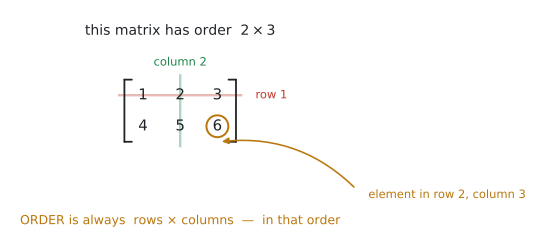
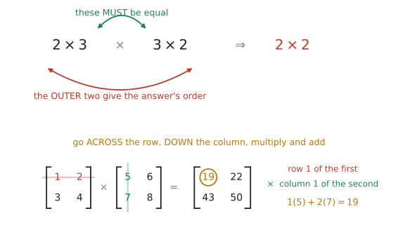
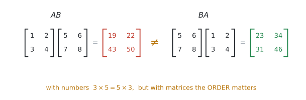
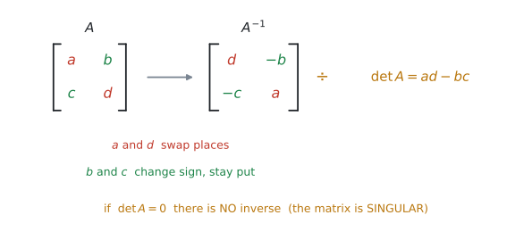
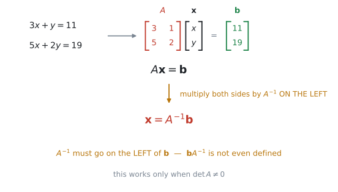
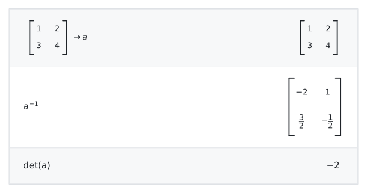

# AHL 1.14 — Matrices（行列） {#sec-ahl-1-14}

::: {.callout-note}
## What you should be able to do
- **matrix**（行列）の **element**（成分）、**row**（行）、**column**（列）、**order**（型）を言える。
- 足し算・引き算・**scalar**（実数）倍ができる。**同じ order どうし**でしかできない。
- **かけ算ができる**。**内側の数がそろっているか**を先に確かめられる。
- $AB$ と $BA$ は**ふつう違う**と分かる（**non-commutative**）。
- **identity matrix** $I$ と **zero matrix** $\mathbf{0}$ が何かを言える。
- $2 \times 2$ の **determinant**（行列式）と **inverse**（逆行列）を**手で**出せる。
- $\det = 0$ なら inverse がない（**singular**）と分かる。
- 連立方程式を $A\mathbf{x} = \mathbf{b}$ と書き、$\mathbf{x} = A^{-1}\mathbf{b}$ で解ける。
- 暗号や売上の計算など、**文脈のある問題**に行列を使える。
:::

::: {.callout-important}
## Formula booklet に載っています
公式集の **AHL 1.14** の欄には、次の $2$ つがあります。**どちらも $2 \times 2$ 専用**です。

$$
A = \begin{pmatrix} a & b \\ c & d \end{pmatrix} \ \Rightarrow \ \det A = |A| = ad - bc
$$ {#eq-ahl114-det}

$$
A = \begin{pmatrix} a & b \\ c & d \end{pmatrix} \ \Rightarrow \ A^{-1} = \frac{1}{\det A}\begin{pmatrix} d & -b \\ -c & a \end{pmatrix}
$$ {#eq-ahl114-inv}

**この $2$ つは覚えなくて構いません。** 試験で配られます。

いっぽう、**次のものは載っていません。**

| 載っていないもの | どうするか |
|---|---|
| かけ算のしかた | **手が覚えるまで練習する**（この項目の中心） |
| identity matrix $I$ | $\begin{pmatrix} 1 & 0 \\ 0 & 1 \end{pmatrix}$ を覚える |
| $A\mathbf{x} = \mathbf{b} \Rightarrow \mathbf{x} = A^{-1}\mathbf{b}$ | **覚える**。$A^{-1}$ は $\mathbf{b}$ の**左**に置く |

: 公式集にないもの {#tbl-ahl114-notinbooklet}
:::

::: {.callout-note}
## 日本の高校では、あまり扱いません
行列は、日本の高校数学から $2012$ 年の課程で外れました。$2022$ 年からの数学Cで「数学的な表現の工夫」の中に戻りましたが、**深くは扱われません。**

ですから、**知らなくて当たり前**です。このページは、まったく初めてのつもりで書いてあります。
:::

## The idea

### 1. 行列は、数を長方形に並べたものです {#matrix}

まずは言葉からです。

{#fig-ahl114-order width=82%}

@fig-ahl114-order の $1$ つ $1$ つの数を **element**（成分）と呼びます。横の並びが **row**（行）、縦の並びが **column**（列）です。

そして、行と列の数を並べたものが **order**（型）です。

#### なぜ「行 × 列」の順なのか {#order}

::: {.callout-warning}
## order は、いつも **rows $\times$ columns** です
@fig-ahl114-order の行列は $2 \times 3$ です。$3 \times 2$ ではありません。

**縦が先、横があと。** 順番を逆にすると、このあとのかけ算が全部おかしくなります。
:::

$m \times n$ の $m$ が行の数、$n$ が列の数です。行が $1$ つだけのものを **row matrix**、列が $1$ つだけのものを **column matrix** と呼びます。

$$
\begin{pmatrix} 1 & 2 & 3 \end{pmatrix} \ \text{は } 1 \times 3, \qquad \begin{pmatrix} 1 \\ 2 \end{pmatrix} \ \text{は } 2 \times 1
$$

### 2. 足し算・引き算・実数倍は、そのまま {#add}

ここは難しくありません。**同じ場所どうしを計算するだけ**です。

$$
\begin{pmatrix} 1 & 2 \\ 3 & 4 \end{pmatrix} + \begin{pmatrix} 5 & 0 \\ -1 & 2 \end{pmatrix} = \begin{pmatrix} 6 & 2 \\ 2 & 6 \end{pmatrix}
$$

実数（**scalar**）倍も、全部の element に掛けるだけです。

$$
3\begin{pmatrix} 1 & 2 \\ 3 & 4 \end{pmatrix} = \begin{pmatrix} 3 & 6 \\ 9 & 12 \end{pmatrix}
$$

::: {.callout-important}
## 足し算は、order が同じときだけ
$2 \times 2$ と $2 \times 3$ は**足せません。** 場所が対応しないからです。

問題文を読んだら、**まず order を確かめる**習慣をつけてください。
:::

**equality**（相等）も同じ考え方です。$2$ つの行列が等しいとは、**order が同じで、対応する element が全部等しい**ということです。

### 3. かけ算 {#multiply}

**この項目の中心です。** 足し算とはまったく違う計算になります。

{#fig-ahl114-multiply width=90%}

#### まず、計算できるかどうかを確かめます {#dimension}

$(m \times n)$ と $(n \times p)$ を掛けるとき、**内側の $n$ がそろっている必要があります。**

$$
(2 \times \underline{3})(\underline{3} \times 2) \ \Rightarrow \ 2 \times 2
$$

内側がそろっていなければ、**その掛け算は存在しません**（`not defined` と書きます）。答えの order は、**外側の $2$ つ**です。

#### 計算のしかた {#howto}

@fig-ahl114-multiply の下半分がその手順です。

> **左の行列の「行」を横に、右の行列の「列」を縦に見て、掛けて足す。**

$1$ 行目 $\times$ $1$ 列目が、答えの $1$ 行 $1$ 列目になります。

$$
\begin{pmatrix} 1 & 2 \\ 3 & 4 \end{pmatrix}\begin{pmatrix} 5 & 6 \\ 7 & 8 \end{pmatrix} = \begin{pmatrix} 1(5)+2(7) & 1(6)+2(8) \\ 3(5)+4(7) & 3(6)+4(8) \end{pmatrix} = \begin{pmatrix} 19 & 22 \\ 43 & 50 \end{pmatrix}
$$

::: {.callout-tip}
## 指を $2$ 本使ってください
左手の指で**左の行列の行**をなぞり、右手の指で**右の行列の列**をなぞります。

**同時に動かして、出会った数どうしを掛けて足す。** 慣れるまでは、声に出して「いち・ご、に・なな」と数えると間違いません。
:::

### 4. $AB$ と $BA$ は、ふつう違います {#noncommutative}

シラバスが名指ししている性質です。

> Properties of matrix multiplication: associativity, distributivity and **non-commutativity**.

{#fig-ahl114-noncomm width=94%}

同じ $2$ つの行列でも、**掛ける順番を変えると答えが変わります。**

| 性質 | 成り立つか |
|---|---|
| **associative**（結合法則） $\ (AB)C = A(BC)$ | ○ 成り立ちます |
| **distributive**（分配法則） $\ A(B+C) = AB + AC$ | ○ 成り立ちます |
| **commutative**（交換法則） $\ AB = BA$ | ✗ **ふつう成り立ちません** |

: かけ算の性質 {#tbl-ahl114-props}

::: {.callout-warning}
## 「掛ける順番はどちらでもよい」は、行列では通用しません
数では $3 \times 5 = 5 \times 3$ ですが、行列は違います。

しかも、$AB$ は計算できるのに $BA$ は **not defined**、ということも起こります（$2\times3$ と $3\times2$ がその例です）。

**式を写すときに順番を入れかえない。** これだけで、かなりの失点が防げます。
:::

### 5. $I$ と $\mathbf{0}$ {#identity}

シラバスは記号まで指定しています。

> Students should be familiar with the notation $I$ and $\mathbf{0}$.

**identity matrix**（単位行列）は、左上から右下の **diagonal**（対角）が $1$ で、あとは $0$ の正方行列です。

$$
I = \begin{pmatrix} 1 & 0 \\ 0 & 1 \end{pmatrix}
$$

これは**数の $1$ にあたるもの**です。

$$
AI = IA = A
$$

**zero matrix** $\mathbf{0}$ は全部の element が $0$ の行列で、**数の $0$ にあたるもの**です。$A + \mathbf{0} = A$ になります。

### 6. determinant と inverse {#inverse}

**inverse matrix**（逆行列）$A^{-1}$ は、**掛けると $I$ になる**行列です。

$$
AA^{-1} = A^{-1}A = I
$$

**数の逆数にあたるもの**だと思ってください。$5$ に対する $\frac{1}{5}$ です。

{#fig-ahl114-inverse width=88%}

@eq-ahl114-inv が公式集の式です。@fig-ahl114-inverse のとおり、**$a$ と $d$ を入れかえ、$b$ と $c$ の符号を変えて、$\det A$ で割る**だけです。

#### $\det A = 0$ のとき {#singular}

::: {.callout-important}
## $\det A = 0$ なら、inverse はありません
@eq-ahl114-inv の $\dfrac{1}{\det A}$ で、$0$ で割ることになるからです。

このような行列を **singular matrix**（特異行列）と呼びます。逆に $\det A \neq 0$ なら **non-singular** / **invertible** です。

**シラバスにこう書いてあります。**

> In examinations $A$ will always be an **invertible** matrix, except when solving for eigenvectors.

つまり試験で $A^{-1}$ を求めさせるときは、**必ず $\det A \neq 0$ になっています。** 安心して進めてください（例外は [AHL 1.15](ahl-1-15.qmd) の固有ベクトルのときだけです）。
:::

#### $3 \times 3$ 以上は電卓で {#bigger}

シラバスは、はっきり分けています。

> Determinants and inverses of $n \times n$ matrices **with technology**, and **by hand for $2 \times 2$** matrices.

**手で出すのは $2 \times 2$ だけ**です。$3 \times 3$ 以上は[電卓](#gdc-det)を使います。

### 7. 連立方程式を、行列で解きます {#solve}

行列がいちばん役に立つ場面です。

#### そもそも、なぜ連立方程式を解くのか {#why-solve}

「**条件がいくつもあって、その全部を同時に満たす値を探す**」という場面は、現実にいくらでもあります。

- 配合 … タンパク質も脂質もカロリーも、指定どおりの量にしたい
- 電気回路 … どの分岐点でも、入ってくる電流と出ていく電流がつり合っていなければならない
- 価格の割り出し … 「$A$ を $3$ 個と $B$ を $2$ 個で $11$ ドル」という記録が、何本もある

条件が $1$ つなら方程式は $1$ 本ですが、**条件が $n$ 個あれば式も $n$ 本**になります。これが連立方程式です。[SL 1.8](../../ai-sl/01-number-and-algebra/sl-1-8.qmd#system-of-equations) では、これを電卓の機能で解きました。この項目では、**同じことを行列で書きます。**

#### 行列にすると、何が便利になるのか {#why-matrix}

$3$ つあります。

**1. 式が何本でも、書き方が変わりません。**

$2$ 本でも $100$ 本でも、形は $A\mathbf{x} = \mathbf{b}$ のままです。式の本数が増えても、**やることは同じ**になります。

**2. 文字が消えて、数の並びだけが残ります。**

$x$ や $y$ という名前は、行列の**どこにあるか**で決まります。ですから、係数を並べた表さえあれば計算が進みます。**そのまま機械に渡せる形**になっている、ということです。

**3. 同じ $A$ を、何度も使い回せます。**

条件のほう（$A$）は変わらず、右辺（$\mathbf{b}$）だけが毎日変わる、という場面はよくあります。**$A^{-1}$ を $1$ 回作ってしまえば、あとは掛けるだけ**です。

#### コンピュータも、この形で計算しています {#computers}

「連立方程式を解く」という処理は、コンピュータの中では**行列の形**で行われています。画面の中で図形を動かすときも（[AHL 3.9](../03-geometry-and-trigonometry/ahl-3-9.qmd)）、天気予報や橋の強度を計算するときも、中身はこの形です。**式が何十万本になることもあります。**

::: {.callout-note}
## ただし、本物のソフトは $A^{-1}$ を作りません
$A^{-1}$ を求めてから掛けるより、**$A$ を分解して $\mathbf{x}$ を直接求めるほう**が速く、誤差も小さいからです。大学で LU 分解などとして習います。

**試験では $\mathbf{x} = A^{-1}\mathbf{b}$ で構いません。** $2 \times 2$ や $3 \times 3$ では、どちらでも答えは同じです。
:::

{#fig-ahl114-solve width=88%}

$$
\begin{cases} 3x + y = 11 \\ 5x + 2y = 19 \end{cases} \quad \Longleftrightarrow \quad \begin{pmatrix} 3 & 1 \\ 5 & 2 \end{pmatrix}\begin{pmatrix} x \\ y \end{pmatrix} = \begin{pmatrix} 11 \\ 19 \end{pmatrix}
$$

左の行列が **coefficient matrix**（係数行列）$A$、真ん中が $\mathbf{x}$、右が $\mathbf{b}$ です。

$$
A\mathbf{x} = \mathbf{b} \quad \Longrightarrow \quad \mathbf{x} = A^{-1}\mathbf{b}
$$ {#eq-ahl114-solve}

実際に、この式で解いてみます。

**手順1 … $\det A$ を出します。**

$$
\det A = 3(2) - 1(5) = 1
$$

$0$ ではないので、$A^{-1}$ があります（[第6節](#singular)）。

**手順2 … $A^{-1}$ を作ります。**

[公式](#inverse)のとおり、対角線を入れかえて、残りの $2$ つの符号を変えて、$\det A$ で割ります。

$$
A^{-1} = \frac{1}{1}\begin{pmatrix} 2 & -1 \\ -5 & 3 \end{pmatrix} = \begin{pmatrix} 2 & -1 \\ -5 & 3 \end{pmatrix}
$$

$\det A = 1$ なので、今回は割り算が要りません。

**手順3 … $\mathbf{b}$ に、左から掛けます。**

$$
\mathbf{x} = \begin{pmatrix} 2 & -1 \\ -5 & 3 \end{pmatrix}\begin{pmatrix} 11 \\ 19 \end{pmatrix}
= \begin{pmatrix} 2(11) + (-1)(19) \\ (-5)(11) + 3(19) \end{pmatrix}
= \begin{pmatrix} 3 \\ 2 \end{pmatrix}
$$

答えは $x = 3$、$y = 2$ です。

**検算。** $3(3) + 2 = 11$ ✓　$5(3) + 2(2) = 19$ ✓　**もとの $2$ 本の式に入れて、両方とも合うことを確かめてください。**

::: {.callout-tip}
## 答えは、縦に $1$ つ出てきます
$\mathbf{x}$ は $2 \times 1$ の column matrix なので、$x$ と $y$ が**上下に並んで**出てきます。

上が $x$、下が $y$ です。**$A$ を作ったときに並べた順番**と同じになります。答えを書くときは $x = 3$、$y = 2$ と横に直して構いません。
:::

::: {.callout-warning}
## $A^{-1}$ は、$\mathbf{b}$ の**左**に置きます
[$AB \neq BA$](#noncommutative) だからです。順番が意味を持ちます。

しかも $\mathbf{b}A^{-1}$ は、order が合わないので **not defined** です（$2\times1$ と $2\times2$）。

**$\mathbf{x} = A^{-1}\mathbf{b}$。** この形で覚えてください。
:::

## Why it works

:::: {.callout-note collapse="true" appearance="simple"}
## クリックすると開きます
なぜ $\mathbf{x} = A^{-1}\mathbf{b}$ になるのか。ここだけ説明します。

ふつうの方程式 $5x = 20$ を思い出してください。両辺を $5$ で割る、つまり**$\frac{1}{5}$ を掛ける**と $x = 4$ が出ます。

行列でも同じことをします。$A\mathbf{x} = \mathbf{b}$ の**両辺に、左から $A^{-1}$ を掛けます。**

$$
A^{-1}(A\mathbf{x}) = A^{-1}\mathbf{b}
$$

左辺は [associative](#noncommutative) なので、こう書きかえられます。

$$
(A^{-1}A)\mathbf{x} = A^{-1}\mathbf{b}
$$

$A^{-1}A = I$ ですから、

$$
I\mathbf{x} = A^{-1}\mathbf{b}
$$

そして $I$ は[数の $1$ にあたるもの](#identity)なので、$I\mathbf{x} = \mathbf{x}$。

$$
\mathbf{x} = A^{-1}\mathbf{b}
$$

::: {.callout-note appearance="simple"}
**「左から」掛けるのが大事**です。右から掛けると $A\mathbf{x}A^{-1}$ となり、$A^{-1}A$ の形が作れません。[順番が意味を持つ](#noncommutative)、というのはこういうことです。
:::
::::

## Worked examples

::: {.callout-note appearance="simple"}
問題文は英語です。意味が理解できなかったら、問題文の下の「**日本語訳**」を開いてください。解説は日本語です。
:::

::: {#exm-ahl114-basic}
[Let $A = \begin{pmatrix} 2 & 0 & -1 \\ 3 & 1 & 4 \end{pmatrix}$ and $B = \begin{pmatrix} 1 & 5 & 2 \\ 0 & -2 & 3 \end{pmatrix}$.]{.q-en}

**(a)** [Write down the order of $A$.]{.q-en}

**(b)** [Find $2A - B$.]{.q-en}

**(c)** [Explain why $AB$ is not defined.]{.q-en}

<details class="jp-trans">
<summary>日本語訳</summary>

$A = \begin{pmatrix} 2 & 0 & -1 \\ 3 & 1 & 4 \end{pmatrix}$、$B = \begin{pmatrix} 1 & 5 & 2 \\ 0 & -2 & 3 \end{pmatrix}$ とします。

**(a)** $A$ の order を書きなさい。

**(b)** $2A - B$ を求めなさい。

**(c)** $AB$ が定義されない理由を説明しなさい。

</details>

---

**(a)** 行が $2$ つ、列が $3$ つ。[行が先](#order)です。

$$
2 \times 3
$$

**(b)** まず $2A$ を作り、それから $B$ を引きます。**同じ場所どうし**です。

$$
2A = \begin{pmatrix} 4 & 0 & -2 \\ 6 & 2 & 8 \end{pmatrix}
$$

$$
2A - B = \begin{pmatrix} 4-1 & 0-5 & -2-2 \\ 6-0 & 2-(-2) & 8-3 \end{pmatrix} = \begin{pmatrix} 3 & -5 & -4 \\ 6 & 4 & 5 \end{pmatrix}
$$

**(c)** $A$ は $2 \times 3$、$B$ も $2 \times 3$。[内側](#dimension)は $3$ と $2$ で、そろっていません。

::: {.callout-tip}
## $2 - (-2) = 4$ に注意してください
$B$ の element が負のとき、引き算で符号が $2$回変わります。**カッコを書いてから計算する**と間違いません。
:::

::: {.callout-note}
## 解答例（答案用紙にはこう書く）
**(a)** $2 \times 3$

**(b)** $2A - B = \begin{pmatrix} 3 & -5 & -4 \\ 6 & 4 & 5 \end{pmatrix}$

**(c)** *$A$ is $2 \times 3$ and $B$ is $2 \times 3$. For $AB$ the number of columns of $A$ ($3$) must equal the number of rows of $B$ ($2$), and it does not, so $AB$ is not defined.*
:::
:::

::: {#exm-ahl114-multiply}
[Let $A = \begin{pmatrix} 1 & 2 \\ 3 & 4 \end{pmatrix}$ and $B = \begin{pmatrix} 5 & 6 \\ 7 & 8 \end{pmatrix}$.]{.q-en}

**(a)** [Find $AB$.]{.q-en}

**(b)** [Find $BA$.]{.q-en}

**(c)** [Comment on your answers.]{.q-en}

<details class="jp-trans">
<summary>日本語訳</summary>

$A = \begin{pmatrix} 1 & 2 \\ 3 & 4 \end{pmatrix}$、$B = \begin{pmatrix} 5 & 6 \\ 7 & 8 \end{pmatrix}$ とします。

**(a)** $AB$ を求めなさい。

**(b)** $BA$ を求めなさい。

**(c)** $2$ つの答えについてコメントしなさい。

</details>

---

**(a)** [行を横に、列を縦に](#howto)。

$$
AB = \begin{pmatrix} 1(5)+2(7) & 1(6)+2(8) \\ 3(5)+4(7) & 3(6)+4(8) \end{pmatrix} = \begin{pmatrix} 19 & 22 \\ 43 & 50 \end{pmatrix}
$$

**(b)** 今度は $B$ の行、$A$ の列です。

$$
BA = \begin{pmatrix} 5(1)+6(3) & 5(2)+6(4) \\ 7(1)+8(3) & 7(2)+8(4) \end{pmatrix} = \begin{pmatrix} 23 & 34 \\ 31 & 46 \end{pmatrix}
$$

**(c)** 数値だけでは点になりません。**性質の名前を書いてください。**

::: {.model-answer}
**試験ではこう書く**

*$AB \neq BA$, so matrix multiplication is not commutative.*
:::

（$AB$ と $BA$ は等しくない、つまり行列のかけ算には交換法則が成り立たない、という意味です。）

::: {.callout-note}
## 解答例（答案用紙にはこう書く）
**(a)** $AB = \begin{pmatrix} 19 & 22 \\ 43 & 50 \end{pmatrix}$

**(b)** $BA = \begin{pmatrix} 23 & 34 \\ 31 & 46 \end{pmatrix}$

**(c)** *$AB \neq BA$, so matrix multiplication is not commutative.*
:::
:::

::: {#exm-ahl114-shop}
[A café records the number of items sold on two days.]{.q-en}

| | Coffee | Tea | Cake |
|---|---|---|---|
| Monday | $12$ | $8$ | $5$ |
| Tuesday | $10$ | $14$ | $6$ |

: Items sold {#tbl-ahl114-we3}

[A coffee costs \$$4$, a tea costs \$$7$ and a cake costs \$$10$.]{.q-en}

**(a)** [Write down a $3 \times 1$ matrix $P$ for the prices.]{.q-en}

**(b)** [Find $SP$, where $S$ is the $2 \times 3$ matrix of sales.]{.q-en}

**(c)** [Interpret the elements of $SP$ in the context of the question.]{.q-en}

<details class="jp-trans">
<summary>日本語訳</summary>

あるカフェが、$2$ 日間に売れた商品の数を記録しました。見出しは Coffee がコーヒー、Tea が紅茶、Cake がケーキです。

コーヒーは \$$4$、紅茶は \$$7$、ケーキは \$$10$ です。

**(a)** 値段を表す $3 \times 1$ の行列 $P$ を書きなさい。

**(b)** 売上の $2 \times 3$ 行列を $S$ として、$SP$ を求めなさい。

**(c)** $SP$ の各成分を、問題の文脈で解釈しなさい。

</details>

---

**(a)** 値段は**縦に**並べます。そうしないと[かけ算ができません](#dimension)。

$$
P = \begin{pmatrix} 4 \\ 7 \\ 10 \end{pmatrix}
$$

**(b)** $(2 \times 3)(3 \times 1)$ なので、内側は $3$ でそろっています。答えは $2 \times 1$ です。

$$
SP = \begin{pmatrix} 12 & 8 & 5 \\ 10 & 14 & 6 \end{pmatrix}\begin{pmatrix} 4 \\ 7 \\ 10 \end{pmatrix} = \begin{pmatrix} 12(4)+8(7)+5(10) \\ 10(4)+14(7)+6(10) \end{pmatrix}
$$

$$
= \begin{pmatrix} 48+56+50 \\ 40+98+60 \end{pmatrix} = \begin{pmatrix} 154 \\ 198 \end{pmatrix}
$$

**(c)**

::: {.model-answer}
**試験ではこう書く**

*The café took \$$154$ on Monday and \$$198$ on Tuesday.*
:::

::: {.callout-tip}
## なぜ値段を「縦」にするのか
横に並べて $1 \times 3$ にすると、$(2\times3)(1\times3)$ となって[内側がそろいません](#dimension)。

**「掛けたい相手の行数」に合わせて並べる**、と考えてください。ここでは $S$ の列が $3$ つなので、$P$ の行も $3$ つにします。
:::

::: {.callout-note}
## 解答例（答案用紙にはこう書く）
**(a)** $P = \begin{pmatrix} 4 \\ 7 \\ 10 \end{pmatrix}$

**(b)** $SP = \begin{pmatrix} 154 \\ 198 \end{pmatrix}$

**(c)** *The café took \$$154$ on Monday and \$$198$ on Tuesday.*
:::
:::

::: {#exm-ahl114-solve}
[Consider the system of equations]{.q-en}

$$
3x + y = 11, \qquad 5x + 2y = 19
$$

**(a)** [Write the system in the form $A\mathbf{x} = \mathbf{b}$.]{.q-en}

**(b)** [Find $\det A$ and $A^{-1}$.]{.q-en}

**(c)** [Hence solve the system.]{.q-en}

<details class="jp-trans">
<summary>日本語訳</summary>

次の連立方程式を考えます。

$$
3x + y = 11, \qquad 5x + 2y = 19
$$

**(a)** この連立方程式を $A\mathbf{x} = \mathbf{b}$ の形に書きなさい。

**(b)** $\det A$ と $A^{-1}$ を求めなさい。

**(c)** これを使って、連立方程式を解きなさい。

</details>

---

**(a)** $x$ と $y$ の係数を、**式の順番のまま**並べます。

$$
\begin{pmatrix} 3 & 1 \\ 5 & 2 \end{pmatrix}\begin{pmatrix} x \\ y \end{pmatrix} = \begin{pmatrix} 11 \\ 19 \end{pmatrix}
$$

**(b)** 公式集の @eq-ahl114-det と @eq-ahl114-inv です。

$$
\det A = 3(2) - 1(5) = 6 - 5 = 1
$$

$$
A^{-1} = \frac{1}{1}\begin{pmatrix} 2 & -1 \\ -5 & 3 \end{pmatrix} = \begin{pmatrix} 2 & -1 \\ -5 & 3 \end{pmatrix}
$$

**(c)** `Hence` は「**(b) の答えを使え**」という意味です。@eq-ahl114-solve に入れます。

$$
\mathbf{x} = A^{-1}\mathbf{b} = \begin{pmatrix} 2 & -1 \\ -5 & 3 \end{pmatrix}\begin{pmatrix} 11 \\ 19 \end{pmatrix} = \begin{pmatrix} 2(11)-1(19) \\ -5(11)+3(19) \end{pmatrix} = \begin{pmatrix} 3 \\ 2 \end{pmatrix}
$$

$$
x = 3, \qquad y = 2
$$

**検算。** $3(3) + 2 = 11$ ✓、$5(3) + 2(2) = 19$ ✓

::: {.callout-tip}
## $\det A = 1$ は、たまたまではありません
試験で「手で解きなさい」と出るときは、$\det A$ が $1$ や $-1$、あるいは小さい整数になるように作られています。

**分数が大量に出てきたら、$\det$ の計算を疑ってください。**
:::

::: {.callout-note}
## 解答例（答案用紙にはこう書く）
**(a)** $\begin{pmatrix} 3 & 1 \\ 5 & 2 \end{pmatrix}\begin{pmatrix} x \\ y \end{pmatrix} = \begin{pmatrix} 11 \\ 19 \end{pmatrix}$

**(b)** $\det A = 6 - 5 = 1$;  $A^{-1} = \begin{pmatrix} 2 & -1 \\ -5 & 3 \end{pmatrix}$

**(c)** $\mathbf{x} = A^{-1}\mathbf{b} = \begin{pmatrix} 3 \\ 2 \end{pmatrix}$, so $x = 3$ and $y = 2$.
:::
:::

::: {#exm-ahl114-code}
[A message is coded using the matrix $A = \begin{pmatrix} 3 & 1 \\ 5 & 2 \end{pmatrix}$. Each letter is replaced by its position in the alphabet, so that $\text{A} = 1$, $\text{B} = 2$, and so on. The numbers are then taken in pairs as column matrices and multiplied by $A$.]{.q-en}

**(a)** [Code the word CODE.]{.q-en}

**(b)** [A message is received as $17, \ 30$. Decode it.]{.q-en}

<details class="jp-trans">
<summary>日本語訳</summary>

行列 $A = \begin{pmatrix} 3 & 1 \\ 5 & 2 \end{pmatrix}$ を使って、メッセージを暗号にします。それぞれの文字を、アルファベットの中での位置の数に置きかえます（$\text{A} = 1$、$\text{B} = 2$、…）。その数を $2$ つずつ組にして column matrix にし、$A$ を掛けます。

**(a)** CODE という単語を暗号にしなさい。

**(b)** 受け取ったメッセージが $17, \ 30$ でした。これを解読しなさい。

</details>

---

**(a)** まず文字を数に直します。$\text{C} = 3$、$\text{O} = 15$、$\text{D} = 4$、$\text{E} = 5$。

$2$ つずつ組にして、**縦に**並べます。

$$
\begin{pmatrix} 3 \\ 15 \end{pmatrix}, \qquad \begin{pmatrix} 4 \\ 5 \end{pmatrix}
$$

それぞれに $A$ を掛けます。

$$
\begin{pmatrix} 3 & 1 \\ 5 & 2 \end{pmatrix}\begin{pmatrix} 3 \\ 15 \end{pmatrix} = \begin{pmatrix} 9+15 \\ 15+30 \end{pmatrix} = \begin{pmatrix} 24 \\ 45 \end{pmatrix}
$$

$$
\begin{pmatrix} 3 & 1 \\ 5 & 2 \end{pmatrix}\begin{pmatrix} 4 \\ 5 \end{pmatrix} = \begin{pmatrix} 12+5 \\ 20+10 \end{pmatrix} = \begin{pmatrix} 17 \\ 30 \end{pmatrix}
$$

暗号は $24, \ 45, \ 17, \ 30$ です。

**(b)** 暗号にするときに $A$ を掛けたのですから、**もどすには $A^{-1}$ を掛けます。**

$$
A^{-1} = \begin{pmatrix} 2 & -1 \\ -5 & 3 \end{pmatrix} \quad (\det A = 1)
$$

$$
\begin{pmatrix} 2 & -1 \\ -5 & 3 \end{pmatrix}\begin{pmatrix} 17 \\ 30 \end{pmatrix} = \begin{pmatrix} 34-30 \\ -85+90 \end{pmatrix} = \begin{pmatrix} 4 \\ 5 \end{pmatrix}
$$

$4 = \text{D}$、$5 = \text{E}$ なので **DE** です。

::: {.callout-note appearance="simple"}
シラバスは、この使い道を名前で挙げています。

> Model and solve real-life problems including: **Coding and decoding messages**

**暗号にするのが $A$、もどすのが $A^{-1}$。** この対応だけ押さえておけば大丈夫です。
:::

::: {.callout-warning}
## $\det A = \pm 1$ の行列が選ばれています
そうでないと、$A^{-1}$ に分数が出て、**もどした答えが整数になりません。**

文字の番号は整数なので、答えに分数が出たら**どこかで計算を間違えています。**
:::

::: {.callout-note}
## 解答例（答案用紙にはこう書く）
**(a)** $\text{C},\text{O},\text{D},\text{E} \to 3, 15, 4, 5$

$A\begin{pmatrix} 3 \\ 15 \end{pmatrix} = \begin{pmatrix} 24 \\ 45 \end{pmatrix}$,  $A\begin{pmatrix} 4 \\ 5 \end{pmatrix} = \begin{pmatrix} 17 \\ 30 \end{pmatrix}$

Coded message: $24, \ 45, \ 17, \ 30$

**(b)** $A^{-1} = \begin{pmatrix} 2 & -1 \\ -5 & 3 \end{pmatrix}$;  $A^{-1}\begin{pmatrix} 17 \\ 30 \end{pmatrix} = \begin{pmatrix} 4 \\ 5 \end{pmatrix} \to \text{DE}$
:::
:::

## Common errors

::: {.callout-warning}
## order を「列 $\times$ 行」で書く
[いつも rows $\times$ columns](#order) です。

$2$ 行 $3$ 列なら $2 \times 3$。ここを逆にすると、かけ算ができるかどうかの判定まで狂います。
:::

::: {.callout-warning}
## かけ算で、対応する場所どうしを掛けてしまう
足し算と同じつもりで $\begin{pmatrix} 1 & 2 \\ 3 & 4 \end{pmatrix}\begin{pmatrix} 5 & 6 \\ 7 & 8 \end{pmatrix} = \begin{pmatrix} 5 & 12 \\ 21 & 32 \end{pmatrix}$ としてしまう誤りです。

かけ算は[行 $\times$ 列](#howto)。**足し算とはまったく別の計算**です。
:::

::: {.callout-warning}
## $AB$ と $BA$ を取りちがえる
問題文が $BA$ なのに $AB$ を計算すると、**答えは別物**になります（@fig-ahl114-noncomm）。

**書き写すときに順番を変えない。** 計算を始める前に、もう一度問題文を見てください。
:::

::: {.callout-warning}
## 内側がそろっていないのに掛ける
$(2\times3)(2\times3)$ は計算できません。

**掛ける前に、必ず order を書き出す**習慣をつけてください。$1$ 行書くだけで防げます。
:::

::: {.callout-warning}
## inverse で、$4$ つ全部の符号を変える
符号を変えるのは **$b$ と $c$ だけ**です。$a$ と $d$ は**入れかわるだけ**で、符号はそのままです（@fig-ahl114-inverse）。
:::

::: {.callout-warning}
## $\det A$ で割るのを忘れる
@eq-ahl114-inv の $\dfrac{1}{\det A}$ です。$\det A = 1$ の問題で練習していると、つい忘れます。

**$AA^{-1} = I$ になるか確かめる**のがいちばん確実です。
:::

::: {.callout-warning}
## $\mathbf{x} = \mathbf{b}A^{-1}$ と書く
[$A^{-1}$ は左](#solve)です。$\mathbf{b}A^{-1}$ は order が合わず、**そもそも計算できません。**
:::

::: {.callout-warning}
## 係数を書き写すときに、$x$ と $y$ を並べかえてしまう
$3x + y = 11$ と $2y + 5x = 19$ のように、**式によって順番が違う**ことがあります。

**$x$ の列、$y$ の列**と決めて、そこに入れてください。並べかえてから行列を作ります。
:::

::: {.callout-warning}
## $\det A = 0$ なのに inverse を求めようとする
[singular な行列には inverse がありません](#singular)。

ただし試験では、$A^{-1}$ を求めさせる問題の $A$ は**必ず invertible** です。$0$ が出たら計算間違いを疑ってください。
:::

::: {.callout-warning}
## 電卓の答えをそのまま書き写して、意味を書かない
文脈のある問題では、`Interpret` や `Comment on` が付きます。

**$\begin{pmatrix} 154 \\ 198 \end{pmatrix}$ と書くだけでは足りません。** 「月曜は \$$154$、火曜は \$$198$」という一文が要ります。
:::

## Using your GDC (TI-Nspire CX II)

::: {.callout-tip}
## 電卓を開きながら読んでください
行列は、**打ちこむところでいちばん時間を取られます。** 手順を先に覚えておくと、試験で慌てません。
:::

### 1. 行列を打ちこむ {#gdc-enter}

Calculator ページで、次のメニューから入ります。

```
menu → 7: Matrix & Vector → 1: Create → 1: Matrix
```

行と列の数を聞かれるので入れて `OK`。空の枠が出たら、`tab` で移動しながら数を入れます。

**入れた行列は、名前を付けて保存してください。**

```
ctrl + sto→
```

に続けて `a` などと打つと、以後 `a` と書くだけで呼び出せます。**同じ行列を何度も打ち直さずにすみます。**

::: {.callout-tip}
## 名前は `a`、`b`、`m` あたりが安全です
`i` や `e` は電卓が別の意味に使っているので、避けてください。
:::

### 2. determinant と inverse {#gdc-det}

保存した行列 `a` に対して、次のように打ちます。

```
det(a)
```

`det(` は `menu → 7: Matrix & Vector` の中の `Determinant` からも入れられます。

逆行列は、**累乗の `^` キーで $-1$ 乗を打つだけ**です。専用のメニューを探す必要はありません。

```
a^-1
```

{#fig-ahl114-gdc width=88%}

@fig-ahl114-gdc は、$\begin{pmatrix} 1 & 2 \\ 3 & 4 \end{pmatrix}$ を `a` に保存してから、`a^-1` と `det(a)` を打った画面です。**分数のまま返ってきます。**

::: {.callout-warning}
## 分数が小数で出るときは
`ctrl + enter` で入力すると小数になります。**分数のまま見たいときは `enter`** を使ってください。

$3 \times 3$ の逆行列は分数だらけになるので、**電卓の中に置いたまま**次の計算に使うのが安全です。
:::

### 3. 連立方程式を解く {#gdc-solve}

$3 \times 3$ 以上は、行列を作らずに直接解くほうが速いです。

```
menu → Algebra → Solve System of Linear Equations
```

式の数を入れて、変数名（`x, y, z`）を確認したら、テンプレートに式をそのまま打ちこみます。

::: {.callout-important}
## ただし、問題文の指示に従ってください
`Use an inverse matrix to solve` と指定されていたら、**$A^{-1}$ を書いてから $A^{-1}\mathbf{b}$ を計算した形**を答案に残します。

連立方程式ソルバーの答えだけを書くと、**指示に従っていない**ことになります。指定がなければ、ソルバーで構いません。
:::

### 4. かけ算と累乗 {#gdc-mult}

保存してあれば、そのまま書けます。

```
a*b
a^3
```

$A^{3}$ のような累乗は、[AHL 1.15](ahl-1-15.qmd#power) でよく使います。

::: {.callout-tip}
## 手で解く問題でも、電卓で検算できます
$2 \times 2$ は手で出すことになっていますが、**出したあとに電卓で確かめる**のは自由です。

`a*a^-1` と打って $I$ が出れば、逆行列は合っています。
:::

## Exercises

::: {.callout-note appearance="simple"}
各問題に、折りたたみが3つ付いています。**日本語訳**、**解答例**（答案用紙に書くべきこと。英語です）、**解説**（なぜそうなるか。日本語です）。

まず自分で解いて、次に解答例と見くらべてください。**解説は、合わなかったときだけ開けば十分です。**
:::

::: {.exercise-block}

[1]{.ex-no} [Let $A = \begin{pmatrix} 2 & -1 \\ 4 & 3 \end{pmatrix}$ and $B = \begin{pmatrix} 1 & 5 \\ 0 & 2 \end{pmatrix}$. Find $A + B$, $3A$ and $A - B$.]{.q-en}

<details class="jp-trans">
<summary>日本語訳</summary>

$A = \begin{pmatrix} 2 & -1 \\ 4 & 3 \end{pmatrix}$、$B = \begin{pmatrix} 1 & 5 \\ 0 & 2 \end{pmatrix}$ とします。$A + B$、$3A$、$A - B$ を求めなさい。

</details>

::: {.callout-note collapse="true"}
## 解答例（答案用紙に書くこと）
$A + B = \begin{pmatrix} 3 & 4 \\ 4 & 5 \end{pmatrix}$

$3A = \begin{pmatrix} 6 & -3 \\ 12 & 9 \end{pmatrix}$

$A - B = \begin{pmatrix} 1 & -6 \\ 4 & 1 \end{pmatrix}$
:::

::: {.callout-tip collapse="true"}
## 解説
**同じ場所どうし**だけです。難しくありません。

$3A$ は**全部の element** に $3$ を掛けます。$-1$ にも掛けるので $-3$ です。

$A - B$ の右上は $-1 - 5 = -6$。**符号に気をつけてください。**
:::

::: {.ex-sep}
:::

[2]{.ex-no} [The matrix $P$ has order $2 \times 3$, the matrix $Q$ has order $3 \times 4$, and the matrix $R$ has order $2 \times 3$.]{.q-en}

**(a)** [State whether $PQ$ is defined. If it is, write down its order.]{.q-en}

**(b)** [State whether $QP$ is defined.]{.q-en}

**(c)** [State whether $P + R$ is defined. If it is, write down its order.]{.q-en}

<details class="jp-trans">
<summary>日本語訳</summary>

行列 $P$ の order は $2 \times 3$、行列 $Q$ の order は $3 \times 4$、行列 $R$ の order は $2 \times 3$ です。

**(a)** $PQ$ が定義されるかどうかを述べなさい。定義されるなら、その order を書きなさい。

**(b)** $QP$ が定義されるかどうかを述べなさい。

**(c)** $P + R$ が定義されるかどうかを述べなさい。定義されるなら、その order を書きなさい。

</details>

::: {.callout-note collapse="true"}
## 解答例（答案用紙に書くこと）
**(a)** *Defined.* $\ 2 \times 4$

**(b)** *Not defined* ($Q$ has $4$ columns but $P$ has $2$ rows).

**(c)** *Defined.* $\ 2 \times 3$
:::

::: {.callout-tip collapse="true"}
## 解説
**(a)** $(2 \times \underline{3})(\underline{3} \times 4)$。[内側](#dimension)が $3$ でそろっています。答えは外側の $2 \times 4$。

**(b)** $(3 \times \underline{4})(\underline{2} \times 3)$。$4 \neq 2$ なので計算できません。

**$PQ$ はできるのに $QP$ はできない** ── これも[非可換](#noncommutative)のあらわれです。

**(c)** 足し算は order が**完全に一致**していれば可能。どちらも $2 \times 3$ です。
:::

::: {.ex-sep}
:::

[3]{.ex-no} [Let $A = \begin{pmatrix} 3 & 2 \\ 1 & 4 \end{pmatrix}$ and $B = \begin{pmatrix} 2 & 0 \\ 5 & 1 \end{pmatrix}$.]{.q-en}

**(a)** [Find $AB$ and $BA$.]{.q-en}

**(b)** [State what your answers show about matrix multiplication.]{.q-en}

<details class="jp-trans">
<summary>日本語訳</summary>

$A = \begin{pmatrix} 3 & 2 \\ 1 & 4 \end{pmatrix}$、$B = \begin{pmatrix} 2 & 0 \\ 5 & 1 \end{pmatrix}$ とします。

**(a)** $AB$ と $BA$ を求めなさい。

**(b)** その答えが、行列のかけ算について何を示しているかを述べなさい。

</details>

::: {.callout-note collapse="true"}
## 解答例（答案用紙に書くこと）
**(a)** $AB = \begin{pmatrix} 16 & 2 \\ 22 & 4 \end{pmatrix}$,  $BA = \begin{pmatrix} 6 & 4 \\ 16 & 14 \end{pmatrix}$

**(b)** *$AB \neq BA$, so matrix multiplication is not commutative.*
:::

::: {.callout-tip collapse="true"}
## 解説
$AB$ の $1$ 行 $1$ 列目は $3(2) + 2(5) = 16$。$1$ 行 $2$ 列目は $3(0) + 2(1) = 2$。

$BA$ の $1$ 行 $1$ 列目は $2(3) + 0(1) = 6$。**$0$ があるところで大きく変わります。**

**(b)** は `not commutative` という言葉を必ず入れてください。「違いました」だけでは点になりません。
:::

::: {.ex-sep}
:::

[4]{.ex-no} [Let $A = \begin{pmatrix} 5 & 3 \\ 3 & 2 \end{pmatrix}$.]{.q-en}

**(a)** [Find $\det A$.]{.q-en}

**(b)** [Find $A^{-1}$.]{.q-en}

**(c)** [Verify that $AA^{-1} = I$.]{.q-en}

<details class="jp-trans">
<summary>日本語訳</summary>

$A = \begin{pmatrix} 5 & 3 \\ 3 & 2 \end{pmatrix}$ とします。

**(a)** $\det A$ を求めなさい。

**(b)** $A^{-1}$ を求めなさい。

**(c)** $AA^{-1} = I$ となることを確かめなさい。

</details>

::: {.callout-note collapse="true"}
## 解答例（答案用紙に書くこと）
**(a)** $\det A = 5(2) - 3(3) = 10 - 9 = 1$

**(b)** $A^{-1} = \dfrac{1}{1}\begin{pmatrix} 2 & -3 \\ -3 & 5 \end{pmatrix} = \begin{pmatrix} 2 & -3 \\ -3 & 5 \end{pmatrix}$

**(c)** $AA^{-1} = \begin{pmatrix} 5 & 3 \\ 3 & 2 \end{pmatrix}\begin{pmatrix} 2 & -3 \\ -3 & 5 \end{pmatrix} = \begin{pmatrix} 10-9 & -15+15 \\ 6-6 & -9+10 \end{pmatrix} = \begin{pmatrix} 1 & 0 \\ 0 & 1 \end{pmatrix} = I$
:::

::: {.callout-tip collapse="true"}
## 解説
$a$ と $d$（$5$ と $2$）が**入れかわり**、$b$ と $c$（どちらも $3$）が**符号だけ変わります**。

$\det A = 1$ なので、割り算は要りません。

**(c)** の `Verify` は「確かめよ」。**計算を全部書く**必要があります。答えが $I$ になったところまで書いてください。
:::

::: {.ex-sep}
:::

[5]{.ex-no} [Show that the matrix $B = \begin{pmatrix} 6 & 4 \\ 3 & 2 \end{pmatrix}$ has no inverse.]{.q-en}

<details class="jp-trans">
<summary>日本語訳</summary>

行列 $B = \begin{pmatrix} 6 & 4 \\ 3 & 2 \end{pmatrix}$ に逆行列がないことを示しなさい。

</details>

::: {.callout-note collapse="true"}
## 解答例（答案用紙に書くこと）
$\det B = 6(2) - 4(3) = 12 - 12 = 0$

*Since $\det B = 0$, $B$ is singular and has no inverse.*
:::

::: {.callout-tip collapse="true"}
## 解説
`Show that` なので、**$\det B = 0$ を計算して見せる**ことが求められています。

そのうえで「$\det = 0$ だから inverse がない」という**一文**を英語で書いてください。数値だけでは足りません。

$\dfrac{1}{\det B}$ が $\dfrac{1}{0}$ になってしまう、というのが理由です。
:::

::: {.ex-sep}
:::

[6]{.ex-no} [Use an inverse matrix to solve the system]{.q-en}

$$
2x + 5y = 16, \qquad x + 3y = 9
$$

<details class="jp-trans">
<summary>日本語訳</summary>

逆行列を使って、次の連立方程式を解きなさい。

$$
2x + 5y = 16, \qquad x + 3y = 9
$$

</details>

::: {.callout-note collapse="true"}
## 解答例（答案用紙に書くこと）
$\begin{pmatrix} 2 & 5 \\ 1 & 3 \end{pmatrix}\begin{pmatrix} x \\ y \end{pmatrix} = \begin{pmatrix} 16 \\ 9 \end{pmatrix}$

$\det A = 2(3) - 5(1) = 1$;  $A^{-1} = \begin{pmatrix} 3 & -5 \\ -1 & 2 \end{pmatrix}$

$\mathbf{x} = A^{-1}\mathbf{b} = \begin{pmatrix} 3(16)-5(9) \\ -16+2(9) \end{pmatrix} = \begin{pmatrix} 3 \\ 2 \end{pmatrix}$

$x = 3$, $y = 2$
:::

::: {.callout-tip collapse="true"}
## 解説
`Use an inverse matrix` と指定があるので、**$A^{-1}$ を書く**ところまでが答案です。電卓の連立方程式ソルバーの答えだけでは点が出ません。

$48 - 45 = 3$、$-16 + 18 = 2$。

**検算。** $2(3) + 5(2) = 16$ ✓、$3 + 3(2) = 9$ ✓
:::

::: {.ex-sep}
:::

[7]{.ex-no} [A shop sells three items. The number sold on two days is shown.]{.q-en}

| | Item A | Item B | Item C |
|---|---|---|---|
| Monday | $10$ | $6$ | $4$ |
| Tuesday | $8$ | $9$ | $5$ |

: Items sold {#tbl-ahl114-e7}

[Item A costs \$$3$, item B costs \$$2$ and item C costs \$$5$.]{.q-en}

**(a)** [Use matrix multiplication to find the total taken on each day.]{.q-en}

**(b)** [Interpret your answer in the context of the question.]{.q-en}

<details class="jp-trans">
<summary>日本語訳</summary>

ある店が $3$ 種類の商品を売っています。$2$ 日間に売れた数は表のとおりです。

商品 A は \$$3$、商品 B は \$$2$、商品 C は \$$5$ です。

**(a)** 行列のかけ算を使って、それぞれの日の売上合計を求めなさい。

**(b)** 答えを、問題の文脈で解釈しなさい。

</details>

::: {.callout-note collapse="true"}
## 解答例（答案用紙に書くこと）
**(a)** $\begin{pmatrix} 10 & 6 & 4 \\ 8 & 9 & 5 \end{pmatrix}\begin{pmatrix} 3 \\ 2 \\ 5 \end{pmatrix} = \begin{pmatrix} 30+12+20 \\ 24+18+25 \end{pmatrix} = \begin{pmatrix} 62 \\ 67 \end{pmatrix}$

**(b)** *The shop took \$$62$ on Monday and \$$67$ on Tuesday.*
:::

::: {.callout-tip collapse="true"}
## 解説
値段は**縦に**（$3 \times 1$）並べます。$(2\times3)(3\times1) = 2\times1$ です。

$30 + 12 + 20 = 62$、$24 + 18 + 25 = 67$。

**(b)** を書かないと点が出ません。**曜日と金額の両方**を入れてください。
:::

::: {.ex-sep}
:::

[8]{.ex-no} [A theatre sells adult, child and senior tickets. Three groups buy tickets as follows.]{.q-en}

| Group | Adult | Child | Senior | Total (\$) |
|---|---|---|---|---|
| $1$ | $2$ | $3$ | $1$ | $64$ |
| $2$ | $1$ | $2$ | $3$ | $61$ |
| $3$ | $3$ | $1$ | $2$ | $73$ |

: Tickets bought {#tbl-ahl114-e8}

**(a)** [Write this information in the form $A\mathbf{x} = \mathbf{b}$.]{.q-en}

**(b)** [Use technology to find the price of each type of ticket.]{.q-en}

<details class="jp-trans">
<summary>日本語訳</summary>

ある劇場が、大人・子ども・シニアのチケットを売っています。$3$ つのグループが、表のとおりにチケットを買いました。見出しは Group がグループ、Adult が大人、Child が子ども、Senior がシニア、Total が合計金額です。

**(a)** この情報を $A\mathbf{x} = \mathbf{b}$ の形に書きなさい。

**(b)** 技術を使って、それぞれのチケットの値段を求めなさい。

</details>

::: {.callout-note collapse="true"}
## 解答例（答案用紙に書くこと）
**(a)** $\begin{pmatrix} 2 & 3 & 1 \\ 1 & 2 & 3 \\ 3 & 1 & 2 \end{pmatrix}\begin{pmatrix} a \\ c \\ s \end{pmatrix} = \begin{pmatrix} 64 \\ 61 \\ 73 \end{pmatrix}$

**(b)** $\mathbf{x} = A^{-1}\mathbf{b} = \begin{pmatrix} 15 \\ 8 \\ 10 \end{pmatrix}$

*An adult ticket costs \$$15$, a child ticket \$$8$ and a senior ticket \$$10$.*
:::

::: {.callout-tip collapse="true"}
## 解説
**表の行が、そのまま方程式の行**になります。$1$ 行目は $2a + 3c + s = 64$ です。

$3 \times 3$ なので[電卓](#gdc-det)を使います。$\det A = 18$ なので inverse があります。

**検算。** $2(15) + 3(8) + 10 = 30 + 24 + 10 = 64$ ✓

$a$、$c$、$s$ が何を表すかを**最初に書いておく**と、(b) の答えが書きやすくなります。
:::

::: {.ex-sep}
:::

[9]{.ex-no} [Messages are coded with $A = \begin{pmatrix} 3 & 1 \\ 5 & 2 \end{pmatrix}$, using $\text{A} = 1$, $\text{B} = 2$, and so on, in pairs.]{.q-en}

**(a)** [Code the word HIDE.]{.q-en}

**(b)** [Decode the message $33, \ 58$.]{.q-en}

<details class="jp-trans">
<summary>日本語訳</summary>

$A = \begin{pmatrix} 3 & 1 \\ 5 & 2 \end{pmatrix}$ を使ってメッセージを暗号にします。$\text{A} = 1$、$\text{B} = 2$、… として、$2$ 文字ずつ組にします。

**(a)** HIDE という単語を暗号にしなさい。

**(b)** 暗号 $33, \ 58$ を解読しなさい。

</details>

::: {.callout-note collapse="true"}
## 解答例（答案用紙に書くこと）
**(a)** $\text{H},\text{I},\text{D},\text{E} \to 8, 9, 4, 5$

$A\begin{pmatrix} 8 \\ 9 \end{pmatrix} = \begin{pmatrix} 33 \\ 58 \end{pmatrix}$,  $A\begin{pmatrix} 4 \\ 5 \end{pmatrix} = \begin{pmatrix} 17 \\ 30 \end{pmatrix}$

Coded message: $33, \ 58, \ 17, \ 30$

**(b)** $A^{-1}\begin{pmatrix} 33 \\ 58 \end{pmatrix} = \begin{pmatrix} 66-58 \\ -165+174 \end{pmatrix} = \begin{pmatrix} 8 \\ 9 \end{pmatrix} \to \text{HI}$
:::

::: {.callout-tip collapse="true"}
## 解説
$\text{H}$ は $8$ 番目、$\text{I}$ は $9$ 番目。アルファベットを数えるところが、意外と間違えやすいです。

**(b)** の答えが (a) の $1$ 組目と同じになっています。$A$ で暗号にしたものを $A^{-1}$ でもどすと、**必ずもとに戻る**ことが確かめられます。

$A^{-1} = \begin{pmatrix} 2 & -1 \\ -5 & 3 \end{pmatrix}$ です（$\det A = 1$）。
:::

::: {.ex-sep}
:::

[10]{.ex-no} [Let $A = \begin{pmatrix} 2 & 1 \\ 3 & 4 \end{pmatrix}$.]{.q-en}

**(a)** [Show that $AI = A$, where $I$ is the $2 \times 2$ identity matrix.]{.q-en}

**(b)** [Find $A^{2}$.]{.q-en}

<details class="jp-trans">
<summary>日本語訳</summary>

$A = \begin{pmatrix} 2 & 1 \\ 3 & 4 \end{pmatrix}$ とします。

**(a)** $I$ を $2 \times 2$ の identity matrix として、$AI = A$ となることを示しなさい。

**(b)** $A^{2}$ を求めなさい。

</details>

::: {.callout-note collapse="true"}
## 解答例（答案用紙に書くこと）
**(a)** $AI = \begin{pmatrix} 2 & 1 \\ 3 & 4 \end{pmatrix}\begin{pmatrix} 1 & 0 \\ 0 & 1 \end{pmatrix} = \begin{pmatrix} 2+0 & 0+1 \\ 3+0 & 0+4 \end{pmatrix} = \begin{pmatrix} 2 & 1 \\ 3 & 4 \end{pmatrix} = A$

**(b)** $A^{2} = \begin{pmatrix} 2 & 1 \\ 3 & 4 \end{pmatrix}\begin{pmatrix} 2 & 1 \\ 3 & 4 \end{pmatrix} = \begin{pmatrix} 4+3 & 2+4 \\ 6+12 & 3+16 \end{pmatrix} = \begin{pmatrix} 7 & 6 \\ 18 & 19 \end{pmatrix}$
:::

::: {.callout-tip collapse="true"}
## 解説
**(a)** `Show that` なので、**途中の計算を書く**必要があります。$AI = A$ と書くだけでは点になりません。

**(b)** $A^{2}$ は $A \times A$。**全部の element を $2$ 乗する**のではありません。ここは非常に多い誤りです。

$\begin{pmatrix} 4 & 1 \\ 9 & 16 \end{pmatrix}$ としてしまったら、かけ算の定義に戻ってください。
:::

::: {.ex-sep}
:::

[11]{.ex-no} [Let $A = \begin{pmatrix} 1 & 2 \\ 3 & 4 \end{pmatrix}$ and $B = \begin{pmatrix} 0 & 1 \\ 1 & 0 \end{pmatrix}$.]{.q-en}

**(a)** [Find $AB$ and $BA$.]{.q-en}

**(b)** [Describe the effect of multiplying by $B$ on the left, and on the right.]{.q-en}

<details class="jp-trans">
<summary>日本語訳</summary>

$A = \begin{pmatrix} 1 & 2 \\ 3 & 4 \end{pmatrix}$、$B = \begin{pmatrix} 0 & 1 \\ 1 & 0 \end{pmatrix}$ とします。

**(a)** $AB$ と $BA$ を求めなさい。

**(b)** $B$ を左から掛けたとき、右から掛けたときの効果をそれぞれ説明しなさい。

</details>

::: {.callout-note collapse="true"}
## 解答例（答案用紙に書くこと）
**(a)** $AB = \begin{pmatrix} 2 & 1 \\ 4 & 3 \end{pmatrix}$,  $BA = \begin{pmatrix} 3 & 4 \\ 1 & 2 \end{pmatrix}$

**(b)** *Multiplying by $B$ on the right swaps the two columns of $A$. Multiplying by $B$ on the left swaps the two rows of $A$.*
:::

::: {.callout-tip collapse="true"}
## 解説
$B$ をよく見てください。$\begin{pmatrix} 0 & 1 \\ 1 & 0 \end{pmatrix}$ は、$I$ の $2$ つの行を入れかえたものです。

$AB$ では**列**が入れかわり、$BA$ では**行**が入れかわります。$AB$ の $\begin{pmatrix} 2 & 1 \\ 4 & 3 \end{pmatrix}$ と $A$ を見くらべてください。

**同じ $B$ なのに、左から掛けるか右から掛けるかで結果が違う。** これが[非可換](#noncommutative)のいちばん分かりやすい例です。
:::

:::
