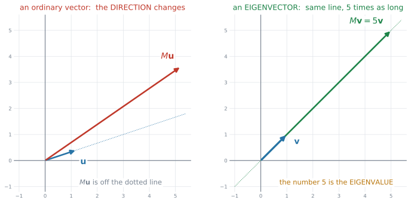
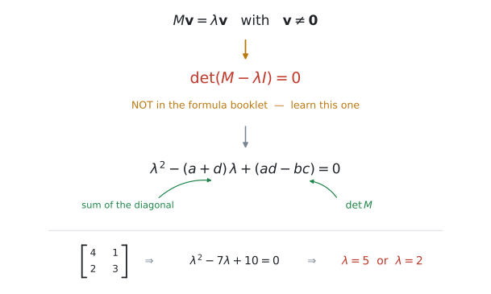
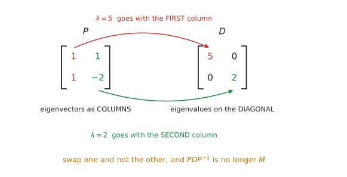
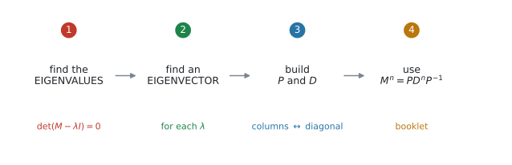
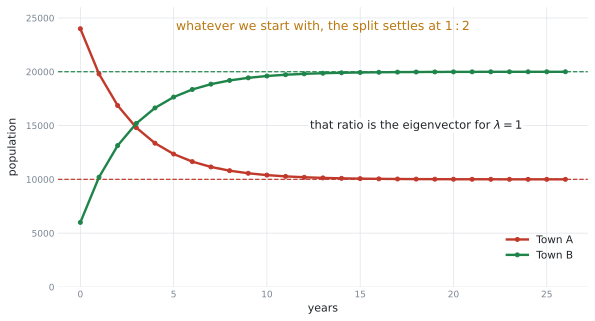

# AHL 1.15 — Eigenvalues and eigenvectors（固有値と固有ベクトル） {#sec-ahl-1-15}

::: {.callout-note}
## What you should be able to do
- **eigenvector**（固有ベクトル）とは、行列を掛けても**向きが変わらない**ベクトルだと言える。
- **characteristic equation** $\det(M - \lambda I) = 0$ を**書ける**（公式集に載っていません）。
- $2 \times 2$ の **eigenvalue**（固有値）を、手でも電卓でも出せる。
- それぞれの $\lambda$ に対する eigenvector を求められる。答えは**1つに決まりません**。
- eigenvector を列に並べて $P$、eigenvalue を対角に並べて $D$ を作れる。**順番をそろえる**。
- $M^{n} = PD^{n}P^{-1}$ を使って、行列の累乗を求められる。
- $2$ つの町の人口移動などで、**長い目で見たときどうなるか**を説明できる。
:::

::: {.callout-important}
## Formula booklet に載っています
公式集の **AHL 1.15** の欄にあるのは、**次の $1$ つだけ**です。

$$
M^{n} = PD^{n}P^{-1}
$$ {#eq-ahl115-power}

> where $P$ is the matrix of eigenvectors and $D$ is the diagonal matrix of eigenvalues

**そして、いちばん大事な式は載っていません。**

::: {.callout-warning}
## characteristic equation は、覚える必要があります
$$
\det(M - \lambda I) = 0
$$ {#eq-ahl115-char}

公式集のどこにも印刷されていません。**この項目で唯一、覚えなければならない式**です。
:::
:::

::: {.callout-note}
## 扱うのは $2 \times 2$ だけです
シラバスがはっきり限定しています。

> Students will only be expected to perform calculations by hand and with technology for **$2 \times 2$ matrices**.

$3 \times 3$ の固有値を手で出す、ということはありません。

また diagonalization（対角化）も、

> restricted to the case where there are **distinct real eigenvalues**

つまり **$\lambda$ が $2$ つとも実数で、しかも異なる**場合だけです。重解や複素数は出ません。
:::

## The idea

### 1. 向きが変わらないベクトルを探します {#idea}

行列を掛けると、ふつうベクトルは**向きも長さも変わります。** ところが、**向きだけは変わらない**特別なベクトルがあります。

{#fig-ahl115-idea width=100%}

@fig-ahl115-idea の左では、$M\mathbf{u}$ が点線からずれています。**向きが変わってしまった**わけです。

右では、$M\mathbf{v}$ が**同じ点線の上に乗ったまま**です。長さが $5$ 倍になっただけ。この $\mathbf{v}$ が **eigenvector**、$5$ が **eigenvalue** です。

$$
M\mathbf{v} = \lambda\mathbf{v}, \qquad \mathbf{v} \neq \mathbf{0}
$$ {#eq-ahl115-def}

#### $\mathbf{v} \neq \mathbf{0}$ という条件 {#nonzero}

::: {.callout-note}
## ゼロベクトルは、数えません
$\mathbf{v} = \mathbf{0}$ なら $M\mathbf{0} = \lambda\mathbf{0}$ はどんな $\lambda$ でも成り立ってしまいます。それでは意味がないので、**$\mathbf{0}$ は eigenvector に含めません。**

この条件が、次の [characteristic equation](#char) を生みます。
:::

### 2. characteristic equation {#char}

$\lambda$ を先に見つけます。

{#fig-ahl115-char width=90%}

@eq-ahl115-def を移項すると $M\mathbf{v} - \lambda\mathbf{v} = \mathbf{0}$、つまり

$$
(M - \lambda I)\mathbf{v} = \mathbf{0}
$$

もし $(M - \lambda I)$ に[逆行列があったら](ahl-1-14.qmd#inverse)、両辺に掛けて $\mathbf{v} = \mathbf{0}$ になってしまいます。それは[認めない](#nonzero)ので、**逆行列があってはいけません。**

[逆行列がないのは $\det = 0$ のとき](ahl-1-14.qmd#singular)ですから、@eq-ahl115-char が出ます。

#### 実際に展開すると {#expand}

$M = \begin{pmatrix} a & b \\ c & d \end{pmatrix}$ のとき、

$$
M - \lambda I = \begin{pmatrix} a - \lambda & b \\ c & d - \lambda \end{pmatrix}
$$

[$2\times2$ の determinant](ahl-1-14.qmd#inverse) をとって $0$ とおきます。

$$
(a-\lambda)(d-\lambda) - bc = 0
$$

$$
\lambda^{2} - (a+d)\lambda + (ad - bc) = 0
$$ {#eq-ahl115-quad}

これが **characteristic polynomial**（固有多項式）です。

::: {.callout-tip}
## $2$ つの係数は、行列から直接読めます
- $\lambda$ の係数 … **対角の和**（$a + d$）に $-$ を付けたもの
- 定数項 … **$\det M$**（$ad - bc$）

$M = \begin{pmatrix} 4 & 1 \\ 2 & 3 \end{pmatrix}$ なら、対角の和が $7$、$\det M = 12 - 2 = 10$。

$$
\lambda^{2} - 7\lambda + 10 = 0 \ \Rightarrow \ (\lambda-5)(\lambda-2) = 0
$$

$\lambda = 5$ または $\lambda = 2$ です。**展開せずに書ける**ようになると速いです。
:::

### 3. eigenvector の求め方 {#eigenvector}

$\lambda$ が出たら、@eq-ahl115-def にもどして $\mathbf{v}$ を探します。$\lambda = 5$ で試します。

$$
M - 5I = \begin{pmatrix} 4-5 & 1 \\ 2 & 3-5 \end{pmatrix} = \begin{pmatrix} -1 & 1 \\ 2 & -2 \end{pmatrix}
$$

$(M - 5I)\mathbf{v} = \mathbf{0}$ を成分で書くと、

$$
-x + y = 0, \qquad 2x - 2y = 0
$$

#### $2$本の式が、同じことを言っています {#same}

::: {.callout-important}
## これは間違いではありません
$2$ 本目は $1$ 本目を $-2$ 倍しただけです。**どちらも $y = x$ と言っています。**

そうなるように $\lambda$ を選んだ、というのがこの項目の仕組みです。[$\det(M - \lambda I) = 0$](#char) は、まさに「$2$ 本の式が重なる」ための条件でした。

**$2$ 本目を見て「解けない」と思わないでください。$1$ 本使えば十分です。**
:::

$y = x$ を満たすベクトルなら何でもよいので、いちばん簡単なものを選びます。

$$
\mathbf{v} = \begin{pmatrix} 1 \\ 1 \end{pmatrix}
$$

#### 答えは1つに決まりません {#notunique}

::: {.callout-note}
## $\begin{pmatrix} 2 \\ 2 \end{pmatrix}$ でも $\begin{pmatrix} -3 \\ -3 \end{pmatrix}$ でも正解です
eigenvector は**向き**の話なので、何倍しても eigenvector のままです。

$$
M\begin{pmatrix} 2 \\ 2 \end{pmatrix} = \begin{pmatrix} 10 \\ 10 \end{pmatrix} = 5\begin{pmatrix} 2 \\ 2 \end{pmatrix} \ \checkmark
$$

答案には**いちばん簡単な整数**を書いてください。採点では、あなたの選んだ $\mathbf{v}$ がそのまま使われます。
:::

$\lambda = 2$ も同じようにします。

$$
M - 2I = \begin{pmatrix} 2 & 1 \\ 2 & 1 \end{pmatrix} \ \Rightarrow \ 2x + y = 0 \ \Rightarrow \ y = -2x
$$

$$
\mathbf{v} = \begin{pmatrix} 1 \\ -2 \end{pmatrix}
$$

### 4. $P$ と $D$ を作ります {#pd}

{#fig-ahl115-pd width=88%}

- $P$ … eigenvector を**列**に並べる
- $D$ … eigenvalue を**対角**に並べる

$$
P = \begin{pmatrix} 1 & 1 \\ 1 & -2 \end{pmatrix}, \qquad D = \begin{pmatrix} 5 & 0 \\ 0 & 2 \end{pmatrix}
$$

::: {.callout-warning}
## 順番をそろえてください
$P$ の**$1$ 列目**が $\lambda = 5$ の eigenvector なら、$D$ の**$1$ 番目**も $5$ です。

片方だけ入れかえると、$PDP^{-1}$ はもう $M$ になりません。**書いたら $1$ 度、目で対応を確かめてください。**
:::

$$
M = PDP^{-1}
$$ {#eq-ahl115-diag}

これが **diagonalization**（対角化）です。

### 5. 累乗が、一気に計算できます {#power}

@eq-ahl115-power が公式集の式です。

{#fig-ahl115-steps width=100%}

$D$ は対角行列なので、累乗が**そのまま**です。

$$
D^{n} = \begin{pmatrix} 5^{n} & 0 \\ 0 & 2^{n} \end{pmatrix}
$$

::: {.callout-tip}
## 対角行列の累乗は、対角の数を累乗するだけです
$0$ が邪魔をしないので、$\begin{pmatrix} 5 & 0 \\ 0 & 2 \end{pmatrix}^{3} = \begin{pmatrix} 125 & 0 \\ 0 & 8 \end{pmatrix}$ になります。

**$M$ を $3$ 回掛けるより、はるかに楽です。** $n = 20$ でも同じ手間で出せます。
:::

### 6. 長い目で見ると、どうなるか {#longrun}

シラバスが挙げている使い道です。

> Applications, for example **movement of population between two towns**, predator/prey models.

{#fig-ahl115-towns width=92%}

@fig-ahl115-towns は、毎年 A 町の $20\%$ が B 町へ、B 町の $10\%$ が A 町へ移る場合です。

$$
T = \begin{pmatrix} 0.8 & 0.1 \\ 0.2 & 0.9 \end{pmatrix}
$$

固有値は $\lambda = 1$ と $\lambda = 0.7$ です。

::: {.callout-important}
## $\lambda = 1$ の eigenvector が、落ち着き先です
$\lambda = 1$ は「**掛けても変わらない**」という意味です。そこに達したら、もう動きません。

もう一方は $0.7$ で、$0.7^{n}$ は $n$ が大きくなると $0$ に近づきます。**その成分は消えていきます。**

だから、どこから始めても $\lambda = 1$ の eigenvector の**比**に落ち着きます。ここでは $\begin{pmatrix} 1 \\ 2 \end{pmatrix}$、つまり $1 : 2$ です。
:::

::: {.callout-note appearance="simple"}
このしくみは **AHL 4.19** の transition matrices（推移行列）と Markov chains、そして **AHL 5.17** の coupled differential equations につながります。シラバスにも `Link to:` として書かれています。
:::

## Why it works

:::: {.callout-note collapse="true" appearance="simple"}
## クリックすると開きます
なぜ $M^{n} = PD^{n}P^{-1}$ になるのか。ここだけ説明します。

@eq-ahl115-diag より $M = PDP^{-1}$ です。これを $2$ 乗してみます。

$$
M^{2} = (PDP^{-1})(PDP^{-1})
$$

[結合法則](ahl-1-14.qmd#noncommutative)が使えるので、真ん中に注目してください。

$$
M^{2} = PD\,(P^{-1}P)\,DP^{-1}
$$

$P^{-1}P = I$ ですから、**真ん中が消えます。**

$$
M^{2} = PD\,I\,DP^{-1} = PD^{2}P^{-1}
$$

$3$ 乗でも同じことが起こります。

$$
M^{3} = PD\,(P^{-1}P)\,D\,(P^{-1}P)\,DP^{-1} = PD^{3}P^{-1}
$$

**間にはさまった $P^{-1}P$ が、次々と消えていく。** これが $M^{n} = PD^{n}P^{-1}$ の中身です。

::: {.callout-note appearance="simple"}
$P$ と $P^{-1}$ は**両端に $1$ つずつ残るだけ**で、まん中には $D$ が $n$ 個並びます。だから[対角行列の累乗](#power)さえ計算できればよい、ということになります。
:::
::::

## Worked examples

::: {.callout-note appearance="simple"}
問題文は英語です。意味が理解できなかったら、問題文の下の「**日本語訳**」を開いてください。解説は日本語です。
:::

::: {#exm-ahl115-values}
[Let $M = \begin{pmatrix} 4 & 1 \\ 2 & 3 \end{pmatrix}$.]{.q-en}

**(a)** [Write down the characteristic equation of $M$.]{.q-en}

**(b)** [Hence find the eigenvalues of $M$.]{.q-en}

<details class="jp-trans">
<summary>日本語訳</summary>

$M = \begin{pmatrix} 4 & 1 \\ 2 & 3 \end{pmatrix}$ とします。

**(a)** $M$ の characteristic equation を書きなさい。

**(b)** これを使って、$M$ の eigenvalue を求めなさい。

</details>

---

**(a)** @eq-ahl115-char に入れます。$M - \lambda I$ は、**対角から $\lambda$ を引く**だけです。

$$
\det\begin{pmatrix} 4-\lambda & 1 \\ 2 & 3-\lambda \end{pmatrix} = 0
$$

$$
(4-\lambda)(3-\lambda) - (1)(2) = 0
$$

$$
12 - 7\lambda + \lambda^{2} - 2 = 0 \ \Rightarrow \ \lambda^{2} - 7\lambda + 10 = 0
$$

**(b)** 因数分解します。

$$
(\lambda - 5)(\lambda - 2) = 0 \ \Rightarrow \ \lambda = 5 \ \text{or} \ \lambda = 2
$$

::: {.callout-tip}
## 検算は[対角の和と $\det$](#expand) で
対角の和は $4 + 3 = 7$ ✓（$\lambda$ の係数）

$\det M = 4(3) - 1(2) = 10$ ✓（定数項）

**展開した式と一致しました。** 展開でミスをしていないか、これで確かめられます。
:::

::: {.callout-note}
## 解答例（答案用紙にはこう書く）
**(a)** $\det(M - \lambda I) = 0$

$(4-\lambda)(3-\lambda) - 2 = 0$,  so  $\lambda^{2} - 7\lambda + 10 = 0$

**(b)** $(\lambda-5)(\lambda-2) = 0$,  so  $\lambda = 5$ or $\lambda = 2$
:::
:::

::: {#exm-ahl115-vectors}
[For the matrix $M = \begin{pmatrix} 4 & 1 \\ 2 & 3 \end{pmatrix}$, the eigenvalues are $5$ and $2$. Find an eigenvector corresponding to each eigenvalue.]{.q-en}

<details class="jp-trans">
<summary>日本語訳</summary>

行列 $M = \begin{pmatrix} 4 & 1 \\ 2 & 3 \end{pmatrix}$ の eigenvalue は $5$ と $2$ です。それぞれの eigenvalue に対応する eigenvector を $1$ つずつ求めなさい。

</details>

---

**$\lambda = 5$ のとき。** 対角から $5$ を引きます。

$$
M - 5I = \begin{pmatrix} -1 & 1 \\ 2 & -2 \end{pmatrix}
$$

$1$ 行目から $-x + y = 0$、つまり $y = x$。（[$2$ 行目も同じこと](#same)を言っています。）

$$
\mathbf{v}_{1} = \begin{pmatrix} 1 \\ 1 \end{pmatrix}
$$

**$\lambda = 2$ のとき。**

$$
M - 2I = \begin{pmatrix} 2 & 1 \\ 2 & 1 \end{pmatrix}
$$

$1$ 行目から $2x + y = 0$、つまり $y = -2x$。

$$
\mathbf{v}_{2} = \begin{pmatrix} 1 \\ -2 \end{pmatrix}
$$

**検算。** $M\mathbf{v}_{1} = \begin{pmatrix} 4+1 \\ 2+3 \end{pmatrix} = \begin{pmatrix} 5 \\ 5 \end{pmatrix} = 5\mathbf{v}_{1}$ ✓

$M\mathbf{v}_{2} = \begin{pmatrix} 4-2 \\ 2-6 \end{pmatrix} = \begin{pmatrix} 2 \\ -4 \end{pmatrix} = 2\mathbf{v}_{2}$ ✓

::: {.callout-tip}
## $x = 1$ と決めてしまうのが速いです
$y = -2x$ が出たら、$x = 1$ とおいて $y = -2$。それだけです。

**分数が出るときは、分母を払ってください。** $y = \frac{2}{3}x$ なら $x = 3$、$y = 2$ として $\begin{pmatrix} 3 \\ 2 \end{pmatrix}$ とします。[何倍しても正解](#notunique)なので、整数にしておくほうが、あとの計算が楽になります。
:::

::: {.callout-note}
## 解答例（答案用紙にはこう書く）
$\lambda = 5$:  $(M - 5I)\mathbf{v} = \mathbf{0}$ gives $-x + y = 0$, so $\mathbf{v}_{1} = \begin{pmatrix} 1 \\ 1 \end{pmatrix}$

$\lambda = 2$:  $(M - 2I)\mathbf{v} = \mathbf{0}$ gives $2x + y = 0$, so $\mathbf{v}_{2} = \begin{pmatrix} 1 \\ -2 \end{pmatrix}$
:::
:::

::: {#exm-ahl115-pd}
[The matrix $M = \begin{pmatrix} 4 & 1 \\ 2 & 3 \end{pmatrix}$ has eigenvalues $5$ and $2$, with eigenvectors $\begin{pmatrix} 1 \\ 1 \end{pmatrix}$ and $\begin{pmatrix} 1 \\ -2 \end{pmatrix}$.]{.q-en}

**(a)** [Write down matrices $P$ and $D$ such that $M = PDP^{-1}$.]{.q-en}

**(b)** [Find $P^{-1}$.]{.q-en}

<details class="jp-trans">
<summary>日本語訳</summary>

行列 $M = \begin{pmatrix} 4 & 1 \\ 2 & 3 \end{pmatrix}$ の eigenvalue は $5$ と $2$ で、eigenvector はそれぞれ $\begin{pmatrix} 1 \\ 1 \end{pmatrix}$、$\begin{pmatrix} 1 \\ -2 \end{pmatrix}$ です。

**(a)** $M = PDP^{-1}$ となる行列 $P$ と $D$ を書きなさい。

**(b)** $P^{-1}$ を求めなさい。

</details>

---

**(a)** eigenvector を**列に**、eigenvalue を**対角に**。[順番をそろえます](#pd)。

$$
P = \begin{pmatrix} 1 & 1 \\ 1 & -2 \end{pmatrix}, \qquad D = \begin{pmatrix} 5 & 0 \\ 0 & 2 \end{pmatrix}
$$

**(b)** [公式集の逆行列の式](ahl-1-14.qmd#inverse)を使います。

$$
\det P = 1(-2) - 1(1) = -3
$$

$$
P^{-1} = \frac{1}{-3}\begin{pmatrix} -2 & -1 \\ -1 & 1 \end{pmatrix} = \frac{1}{3}\begin{pmatrix} 2 & 1 \\ 1 & -1 \end{pmatrix}
$$

::: {.callout-warning}
## $P$ の列と $D$ の対角がずれると、$M$ にもどりません
もし $P = \begin{pmatrix} 1 & 1 \\ -2 & 1 \end{pmatrix}$（列を入れかえた）としながら $D$ をそのままにすると、$PDP^{-1}$ は別の行列になります。

**$1$ 列目は $\lambda = 5$、$2$ 列目は $\lambda = 2$。** 書いたら指で対応を追ってください。
:::

::: {.callout-note}
## 解答例（答案用紙にはこう書く）
**(a)** $P = \begin{pmatrix} 1 & 1 \\ 1 & -2 \end{pmatrix}$,  $D = \begin{pmatrix} 5 & 0 \\ 0 & 2 \end{pmatrix}$

**(b)** $\det P = -3$;  $P^{-1} = \dfrac{1}{3}\begin{pmatrix} 2 & 1 \\ 1 & -1 \end{pmatrix}$
:::
:::

::: {#exm-ahl115-power}
[Let $M = \begin{pmatrix} 4 & 1 \\ 2 & 3 \end{pmatrix}$, with $P = \begin{pmatrix} 1 & 1 \\ 1 & -2 \end{pmatrix}$ and $D = \begin{pmatrix} 5 & 0 \\ 0 & 2 \end{pmatrix}$.]{.q-en}

[Use the result $M^{n} = PD^{n}P^{-1}$ to find $M^{3}$.]{.q-en}

<details class="jp-trans">
<summary>日本語訳</summary>

$M = \begin{pmatrix} 4 & 1 \\ 2 & 3 \end{pmatrix}$、$P = \begin{pmatrix} 1 & 1 \\ 1 & -2 \end{pmatrix}$、$D = \begin{pmatrix} 5 & 0 \\ 0 & 2 \end{pmatrix}$ とします。

$M^{n} = PD^{n}P^{-1}$ を使って $M^{3}$ を求めなさい。

</details>

---

まず $D^{3}$ です。[対角の数を $3$ 乗するだけ](#power)。

$$
D^{3} = \begin{pmatrix} 5^{3} & 0 \\ 0 & 2^{3} \end{pmatrix} = \begin{pmatrix} 125 & 0 \\ 0 & 8 \end{pmatrix}
$$

次に $PD^{3}$。

$$
PD^{3} = \begin{pmatrix} 1 & 1 \\ 1 & -2 \end{pmatrix}\begin{pmatrix} 125 & 0 \\ 0 & 8 \end{pmatrix} = \begin{pmatrix} 125 & 8 \\ 125 & -16 \end{pmatrix}
$$

最後に $P^{-1}$ を掛けます。

$$
M^{3} = \begin{pmatrix} 125 & 8 \\ 125 & -16 \end{pmatrix} \cdot \frac{1}{3}\begin{pmatrix} 2 & 1 \\ 1 & -1 \end{pmatrix}
$$

$$
= \frac{1}{3}\begin{pmatrix} 250+8 & 125-8 \\ 250-16 & 125+16 \end{pmatrix} = \frac{1}{3}\begin{pmatrix} 258 & 117 \\ 234 & 141 \end{pmatrix}
$$

$$
M^{3} = \begin{pmatrix} 86 & 39 \\ 78 & 47 \end{pmatrix}
$$

**検算。** $M^{2} = \begin{pmatrix} 18 & 7 \\ 14 & 11 \end{pmatrix}$、$M^{2}M = \begin{pmatrix} 86 & 39 \\ 78 & 47 \end{pmatrix}$ ✓

::: {.callout-tip}
## $\dfrac{1}{3}$ は最後まで外に出しておきます
途中で $\dfrac{1}{3}$ を分配すると分数だらけになります。**掛け算を全部すませてから割る**と、整数のまま進められます。

$258 \div 3 = 86$、$117 \div 3 = 39$、$234 \div 3 = 78$、$141 \div 3 = 47$。
:::

::: {.callout-note appearance="simple"}
$n = 3$ なら $M$ を $3$ 回掛けたほうが速いかもしれません。**この方法の値打ちは $n$ が大きいとき**です。$M^{20}$ でも、手間はまったく同じです。
:::

::: {.callout-note}
## 解答例（答案用紙にはこう書く）
$D^{3} = \begin{pmatrix} 125 & 0 \\ 0 & 8 \end{pmatrix}$

$M^{3} = PD^{3}P^{-1} = \begin{pmatrix} 125 & 8 \\ 125 & -16 \end{pmatrix}\cdot\dfrac{1}{3}\begin{pmatrix} 2 & 1 \\ 1 & -1 \end{pmatrix} = \begin{pmatrix} 86 & 39 \\ 78 & 47 \end{pmatrix}$
:::
:::

::: {#exm-ahl115-towns}
[Each year, $20\%$ of the people living in town A move to town B, and $10\%$ of the people living in town B move to town A. The total population of the two towns is $30\,000$ and stays the same.]{.q-en}

[The movement is modelled by $\mathbf{s}_{n+1} = T\mathbf{s}_{n}$, where $T = \begin{pmatrix} 0.8 & 0.1 \\ 0.2 & 0.9 \end{pmatrix}$.]{.q-en}

**(a)** [Initially town A has $24\,000$ people and town B has $6000$. Find the populations after one year.]{.q-en}

**(b)** [Find the eigenvalues of $T$.]{.q-en}

**(c)** [Find an eigenvector corresponding to $\lambda = 1$.]{.q-en}

**(d)** [Hence find the long-term population of each town, and justify your answer.]{.q-en}

<details class="jp-trans">
<summary>日本語訳</summary>

毎年、A 町に住む人の $20\%$ が B 町へ、B 町に住む人の $10\%$ が A 町へ移ります。$2$ つの町の人口の合計は $30\,000$ 人で、変わりません。

この移動は $\mathbf{s}_{n+1} = T\mathbf{s}_{n}$（$T = \begin{pmatrix} 0.8 & 0.1 \\ 0.2 & 0.9 \end{pmatrix}$）でモデル化されます。

**(a)** はじめ A 町に $24\,000$ 人、B 町に $6000$ 人いました。$1$ 年後の人口を求めなさい。

**(b)** $T$ の eigenvalue を求めなさい。

**(c)** $\lambda = 1$ に対応する eigenvector を $1$ つ求めなさい。

**(d)** これを使って、長い目で見たときの各町の人口を求め、その理由を書きなさい。

</details>

---

**(a)** [行列とベクトルの掛け算](ahl-1-14.qmd#howto)です。

$$
\begin{pmatrix} 0.8 & 0.1 \\ 0.2 & 0.9 \end{pmatrix}\begin{pmatrix} 24000 \\ 6000 \end{pmatrix} = \begin{pmatrix} 19200 + 600 \\ 4800 + 5400 \end{pmatrix} = \begin{pmatrix} 19800 \\ 10200 \end{pmatrix}
$$

A 町 $19\,800$ 人、B 町 $10\,200$ 人。（合計はやはり $30\,000$ です。）

**(b)** [対角の和と $\det$](#expand) を読みます。和は $0.8 + 0.9 = 1.7$、$\det T = 0.72 - 0.02 = 0.7$。

$$
\lambda^{2} - 1.7\lambda + 0.7 = 0 \ \Rightarrow \ (\lambda - 1)(\lambda - 0.7) = 0
$$

$$
\lambda = 1 \ \text{or} \ \lambda = 0.7
$$

**(c)** $\lambda = 1$ を入れます。

$$
T - I = \begin{pmatrix} -0.2 & 0.1 \\ 0.2 & -0.1 \end{pmatrix}
$$

$1$ 行目から $-0.2x + 0.1y = 0$、つまり $y = 2x$。

$$
\mathbf{v} = \begin{pmatrix} 1 \\ 2 \end{pmatrix}
$$

**(d)** [$\lambda = 1$ の eigenvector が落ち着き先](#longrun)です。比は $1 : 2$ なので、$30\,000$ を $3$ 等分して分けます。

$$
\text{A} = \frac{1}{3}(30000) = 10000, \qquad \text{B} = \frac{2}{3}(30000) = 20000
$$

::: {.model-answer}
**試験ではこう書く**

*In the long term town A has $10\,000$ people and town B has $20\,000$. The eigenvalue $\lambda = 1$ has eigenvector $\begin{pmatrix} 1 \\ 2 \end{pmatrix}$, so a population in the ratio $1 : 2$ does not change from year to year. The other eigenvalue is $0.7$, and $0.7^{n} \to 0$ as $n$ increases, so that part of the population distribution dies away.*
:::

（意味：長い目で見ると A 町は $10\,000$ 人、B 町は $20\,000$ 人になる。$\lambda = 1$ の eigenvector が $\begin{pmatrix} 1 \\ 2 \end{pmatrix}$ なので、$1 : 2$ の人口配分は年が変わっても動かない。もう一方の eigenvalue は $0.7$ で、$n$ が大きくなると $0.7^{n}$ は $0$ に近づくため、その成分は消えていく。）

::: {.callout-important}
## `justify` は、$2$ つとも書いてください
1. **$\lambda = 1$ だから、その配分は変わらない**
2. **もう一方は $|\lambda| < 1$ だから、$n$ が増えると消える**

$1$ つ目だけだと「なぜそこに向かうのか」が説明できていません。**$0.7^{n} \to 0$ の一文が要ります。**
:::

::: {.callout-note}
## 解答例（答案用紙にはこう書く）
**(a)** $T\begin{pmatrix} 24000 \\ 6000 \end{pmatrix} = \begin{pmatrix} 19800 \\ 10200 \end{pmatrix}$

**(b)** $\lambda^{2} - 1.7\lambda + 0.7 = 0$, so $\lambda = 1$ or $\lambda = 0.7$

**(c)** $\lambda = 1$: $-0.2x + 0.1y = 0$, so $\mathbf{v} = \begin{pmatrix} 1 \\ 2 \end{pmatrix}$

**(d)** *Town A: $10\,000$; town B: $20\,000$. The eigenvector for $\lambda = 1$ is $\begin{pmatrix} 1 \\ 2 \end{pmatrix}$, so the ratio $1 : 2$ is unchanged each year, and since $0.7^{n} \to 0$ the other part dies away.*
:::
:::

## Common errors

::: {.callout-warning}
## characteristic equation を思い出せない
[公式集に載っていません](#char)。$\det(M - \lambda I) = 0$ は**覚えるしかない式**です。

この項目で覚える式は、これ $1$ つだけです。
:::

::: {.callout-warning}
## $M - \lambda I$ で、$\lambda$ を全部の element から引く
引くのは**対角だけ**です。

$$
\begin{pmatrix} a-\lambda & b \\ c & d-\lambda \end{pmatrix} \quad \text{であって} \quad \begin{pmatrix} a-\lambda & b-\lambda \\ c-\lambda & d-\lambda \end{pmatrix} \ \text{ではありません}
$$

$\lambda I$ の $I$ は[対角だけが $1$](ahl-1-14.qmd#identity) だからです。
:::

::: {.callout-warning}
## $2$ 本の式が同じになるのを見て、手が止まる
[そうなるように $\lambda$ を選んでいます](#same)。間違いではありません。

**$1$ 本使えば eigenvector は出ます。** そのまま進めてください。
:::

::: {.callout-warning}
## eigenvector が「$1$ つに決まらない」ことに戸惑う
[何倍しても eigenvector](#notunique) です。$\begin{pmatrix} 1 \\ 2 \end{pmatrix}$ でも $\begin{pmatrix} 2 \\ 4 \end{pmatrix}$ でも正解です。

**いちばん簡単な整数**を選んでください。
:::

::: {.callout-warning}
## $P$ の列と $D$ の対角がずれる
$P$ の $1$ 列目が $\lambda_{1}$ の eigenvector なら、$D$ の $1$ 番目も $\lambda_{1}$ です（@fig-ahl115-pd）。

片方だけ入れかえると、$PDP^{-1}$ は $M$ になりません。
:::

::: {.callout-warning}
## eigenvector を「行」に並べてしまう
$P$ は **columns**（列）です。eigenvector が $\begin{pmatrix} 1 \\ 2 \end{pmatrix}$ と $\begin{pmatrix} 3 \\ -1 \end{pmatrix}$ なら、

$$
P = \begin{pmatrix} 1 & 3 \\ 2 & -1 \end{pmatrix} \quad \text{が正しく、} \quad \begin{pmatrix} 1 & 2 \\ 3 & -1 \end{pmatrix} \quad \text{は誤りです}
$$

**縦に置く。** ベクトルを書いた形のまま、そのまま立てて入れる、と覚えてください。
:::

::: {.callout-warning}
## $D^{n}$ で、対角以外まで累乗する
$0^{n} = 0$ なので結果は同じですが、**$D$ 全体を $n$ 回掛けようとして時間を失う**のがもったいないです。

対角の数だけ累乗すれば終わりです。
:::

::: {.callout-warning}
## $M^{n} = P^{n}D^{n}(P^{-1})^{n}$ としてしまう
そうはなりません。[間の $P^{-1}P$ が消える](#why-it-works)ので、$P$ と $P^{-1}$ は**両端に $1$ つずつ**残るだけです。

$$
M^{n} = PD^{n}P^{-1}
$$

公式集の式を、そのまま写してください。
:::

::: {.callout-warning}
## 長期の問題で、eigenvector をそのまま人数として書く
$\begin{pmatrix} 1 \\ 2 \end{pmatrix}$ は**比**であって、人数ではありません。

**合計に合わせて分ける**必要があります。$30\,000$ なら $10\,000$ と $20\,000$ です。
:::

::: {.callout-warning}
## `justify` で $\lambda = 1$ しか書かない
「もう一方の $\lambda$ の $n$ 乗が $0$ に近づく」まで書いて、はじめて理由になります。

**$2$ 文**書いてください。
:::

## Using your GDC (TI-Nspire CX II)

::: {.callout-tip}
## 電卓を開きながら読んでください
固有値・固有ベクトルは、電卓に専用のコマンドがあります。ただし**返ってくる形が答案用ではない**ので、そこだけ注意が要ります。
:::

### 1. 行列を入れて、名前を付ける {#gdc-enter}

[AHL 1.14](ahl-1-14.qmd#gdc-enter) と同じです。

```
menu → 7: Matrix & Vector → 1: Create → 1: Matrix
```

入れたら `ctrl + sto→` に続けて `m` などと打って保存します。

### 2. eigenvalue {#gdc-eigval}

```
menu → 7: Matrix & Vector → B: Advanced → 4: Eigenvalues
```

`eigVl()` が出るので、カッコの中に `m` と入れます。$\{5, 2\}$ のようにリストで返ってきます。

::: {.callout-warning}
## 並ぶ順番は、決まっていません
$\{5, 2\}$ で返るとは限りません。**どちらがどちらか、自分で確かめてください。**

対角の和と一致するか（$5 + 2 = 7$）で検算できます。
:::

### 3. eigenvector {#gdc-eigvec}

```
menu → 7: Matrix & Vector → B: Advanced → 5: Eigenvectors
```

`eigVc()` に `m` を入れると、行列が返ってきます。**各列が eigenvector**です。

::: {.callout-important}
## 電卓の答えは、そのままでは書けません
電卓は eigenvector を**長さ $1$ に直して**返します。

$$
x_{1}^{2} + x_{2}^{2} = 1
$$

になるように調整されるので、$\begin{pmatrix} 1 \\ 1 \end{pmatrix}$ は

$$
\begin{pmatrix} 0.707\ldots \\ 0.707\ldots \end{pmatrix}
$$

と表示されます。$\begin{pmatrix} 1 \\ -2 \end{pmatrix}$ なら $\begin{pmatrix} 0.447\ldots \\ -0.894\ldots \end{pmatrix}$ です。

**答案には、これを整数の比に直して書いてください。**

$0.447$ と $-0.894$ は $1 : -2$ ですから、$\begin{pmatrix} 1 \\ -2 \end{pmatrix}$ と書きます。[何倍しても正解](#notunique)なので、これで問題ありません。
:::

::: {.callout-tip}
## 比の見つけ方
**小さいほうで割ります。** $\dfrac{0.894}{0.447} = 2$ なので $1 : -2$。

符号が両方とも逆（$-0.447$ と $0.894$）で返ることもありますが、それも正解です。$-1$ 倍しても eigenvector です。
:::

### 4. 手で出した答えを確かめる {#gdc-check}

いちばん確実なのは、**定義そのもの**を打つことです。

```
m*v
```

$v$ に自分の出した eigenvector を入れて、$\lambda$ 倍になっていれば合っています。

$P$ と $D$ を作ったあとなら、

```
p*d*p^-1
```

がもとの $M$ にもどるかどうかで確かめられます。

::: {.callout-warning}
## ただし、答案には途中式を書いてください
`Find the eigenvalues` は電卓の値だけでも認められることがありますが、**`Show that` や `Hence` が付いていたら、$\det(M-\lambda I) = 0$ から書く**必要があります。

**電卓は検算用**と考えるのが安全です。
:::

## Exercises

::: {.callout-note appearance="simple"}
各問題に、折りたたみが3つ付いています。**日本語訳**、**解答例**（答案用紙に書くべきこと。英語です）、**解説**（なぜそうなるか。日本語です）。

まず自分で解いて、次に解答例と見くらべてください。**解説は、合わなかったときだけ開けば十分です。**
:::

::: {.exercise-block}

[1]{.ex-no} [Find the eigenvalues of $M = \begin{pmatrix} 5 & 2 \\ 2 & 2 \end{pmatrix}$.]{.q-en}

<details class="jp-trans">
<summary>日本語訳</summary>

$M = \begin{pmatrix} 5 & 2 \\ 2 & 2 \end{pmatrix}$ の eigenvalue を求めなさい。

</details>

::: {.callout-note collapse="true"}
## 解答例（答案用紙に書くこと）
$\det(M - \lambda I) = (5-\lambda)(2-\lambda) - 4 = 0$

$\lambda^{2} - 7\lambda + 6 = 0$

$(\lambda - 6)(\lambda - 1) = 0$,  so  $\lambda = 6$ or $\lambda = 1$
:::

::: {.callout-tip collapse="true"}
## 解説
対角の和は $5 + 2 = 7$、$\det M = 10 - 4 = 6$。だから $\lambda^{2} - 7\lambda + 6 = 0$ と**直接書けます**。

展開しても同じです。$10 - 7\lambda + \lambda^{2} - 4 = \lambda^{2} - 7\lambda + 6$ ✓
:::

::: {.ex-sep}
:::

[2]{.ex-no} [The matrix $M = \begin{pmatrix} 5 & 2 \\ 2 & 2 \end{pmatrix}$ has eigenvalues $6$ and $1$. Find an eigenvector for each.]{.q-en}

<details class="jp-trans">
<summary>日本語訳</summary>

行列 $M = \begin{pmatrix} 5 & 2 \\ 2 & 2 \end{pmatrix}$ の eigenvalue は $6$ と $1$ です。それぞれの eigenvector を $1$ つずつ求めなさい。

</details>

::: {.callout-note collapse="true"}
## 解答例（答案用紙に書くこと）
$\lambda = 6$:  $M - 6I = \begin{pmatrix} -1 & 2 \\ 2 & -4 \end{pmatrix}$, so $-x + 2y = 0$ and $\mathbf{v} = \begin{pmatrix} 2 \\ 1 \end{pmatrix}$

$\lambda = 1$:  $M - I = \begin{pmatrix} 4 & 2 \\ 2 & 1 \end{pmatrix}$, so $4x + 2y = 0$ and $\mathbf{v} = \begin{pmatrix} 1 \\ -2 \end{pmatrix}$
:::

::: {.callout-tip collapse="true"}
## 解説
$\lambda = 6$：$-x + 2y = 0$ から $x = 2y$。$y = 1$ とおいて $\begin{pmatrix} 2 \\ 1 \end{pmatrix}$。

$\lambda = 1$：$4x + 2y = 0$ から $y = -2x$。$x = 1$ とおいて $\begin{pmatrix} 1 \\ -2 \end{pmatrix}$。

**検算。** $M\begin{pmatrix} 2 \\ 1 \end{pmatrix} = \begin{pmatrix} 12 \\ 6 \end{pmatrix} = 6\begin{pmatrix} 2 \\ 1 \end{pmatrix}$ ✓
:::

::: {.ex-sep}
:::

[3]{.ex-no} [Find the eigenvalues and eigenvectors of $M = \begin{pmatrix} 3 & 1 \\ 0 & 2 \end{pmatrix}$.]{.q-en}

<details class="jp-trans">
<summary>日本語訳</summary>

$M = \begin{pmatrix} 3 & 1 \\ 0 & 2 \end{pmatrix}$ の eigenvalue と eigenvector を求めなさい。

</details>

::: {.callout-note collapse="true"}
## 解答例（答案用紙に書くこと）
$(3-\lambda)(2-\lambda) - 0 = 0$, so $\lambda^{2} - 5\lambda + 6 = 0$ and $\lambda = 3$ or $\lambda = 2$

$\lambda = 3$:  $\begin{pmatrix} 0 & 1 \\ 0 & -1 \end{pmatrix}$ gives $y = 0$, so $\mathbf{v} = \begin{pmatrix} 1 \\ 0 \end{pmatrix}$

$\lambda = 2$:  $\begin{pmatrix} 1 & 1 \\ 0 & 0 \end{pmatrix}$ gives $x + y = 0$, so $\mathbf{v} = \begin{pmatrix} 1 \\ -1 \end{pmatrix}$
:::

::: {.callout-tip collapse="true"}
## 解説
左下が $0$ の行列では、**eigenvalue が対角の数そのもの**（$3$ と $2$）になります。$bc = 0$ だからです。

$\lambda = 3$ のとき $2$ 行目は $0 = 0$ で、何も言っていません。**$1$ 行目の $y = 0$ だけ**を使います。$x$ は自由なので $x = 1$ とおきます。

$\lambda = 2$ のときは $2$ 行目が $0 = 0$。$1$ 行目の $x + y = 0$ を使います。
:::

::: {.ex-sep}
:::

[4]{.ex-no} [Let $M = \begin{pmatrix} 1 & 2 \\ 2 & 1 \end{pmatrix}$.]{.q-en}

**(a)** [Find the eigenvalues and eigenvectors of $M$.]{.q-en}

**(b)** [Write down matrices $P$ and $D$ such that $M = PDP^{-1}$.]{.q-en}

<details class="jp-trans">
<summary>日本語訳</summary>

$M = \begin{pmatrix} 1 & 2 \\ 2 & 1 \end{pmatrix}$ とします。

**(a)** $M$ の eigenvalue と eigenvector を求めなさい。

**(b)** $M = PDP^{-1}$ となる行列 $P$ と $D$ を書きなさい。

</details>

::: {.callout-note collapse="true"}
## 解答例（答案用紙に書くこと）
**(a)** $\lambda^{2} - 2\lambda - 3 = 0$, so $(\lambda-3)(\lambda+1) = 0$ and $\lambda = 3$ or $\lambda = -1$

$\lambda = 3$:  $\begin{pmatrix} -2 & 2 \\ 2 & -2 \end{pmatrix}$ gives $y = x$, so $\mathbf{v} = \begin{pmatrix} 1 \\ 1 \end{pmatrix}$

$\lambda = -1$:  $\begin{pmatrix} 2 & 2 \\ 2 & 2 \end{pmatrix}$ gives $y = -x$, so $\mathbf{v} = \begin{pmatrix} 1 \\ -1 \end{pmatrix}$

**(b)** $P = \begin{pmatrix} 1 & 1 \\ 1 & -1 \end{pmatrix}$,  $D = \begin{pmatrix} 3 & 0 \\ 0 & -1 \end{pmatrix}$
:::

::: {.callout-tip collapse="true"}
## 解説
対角の和は $2$、$\det M = 1 - 4 = -3$。だから $\lambda^{2} - 2\lambda - 3 = 0$。

**$\lambda$ が負でも構いません。** $\lambda = -1$ は「向きが逆になって、長さはそのまま」という意味です。

**(b)** で $D$ に $-1$ を書き忘れないように。$1$ 列目が $\lambda = 3$ の eigenvector なので、$D$ の $1$ 番目も $3$ です。
:::

::: {.ex-sep}
:::

[5]{.ex-no} [For $M = \begin{pmatrix} 1 & 2 \\ 2 & 1 \end{pmatrix}$, use $M^{n} = PD^{n}P^{-1}$ to find $M^{3}$.]{.q-en}

<details class="jp-trans">
<summary>日本語訳</summary>

$M = \begin{pmatrix} 1 & 2 \\ 2 & 1 \end{pmatrix}$ について、$M^{n} = PD^{n}P^{-1}$ を使って $M^{3}$ を求めなさい。

</details>

::: {.callout-note collapse="true"}
## 解答例（答案用紙に書くこと）
$P = \begin{pmatrix} 1 & 1 \\ 1 & -1 \end{pmatrix}$,  $D^{3} = \begin{pmatrix} 27 & 0 \\ 0 & -1 \end{pmatrix}$

$\det P = -2$,  so  $P^{-1} = \dfrac{1}{2}\begin{pmatrix} 1 & 1 \\ 1 & -1 \end{pmatrix}$

$PD^{3} = \begin{pmatrix} 27 & -1 \\ 27 & 1 \end{pmatrix}$

$M^{3} = \dfrac{1}{2}\begin{pmatrix} 27-1 & 27+1 \\ 27+1 & 27-1 \end{pmatrix} = \begin{pmatrix} 13 & 14 \\ 14 & 13 \end{pmatrix}$
:::

::: {.callout-tip collapse="true"}
## 解説
$(-1)^{3} = -1$ です。**符号を落とさないでください。**

$P^{-1}$ は $\dfrac{1}{-2}\begin{pmatrix} -1 & -1 \\ -1 & 1 \end{pmatrix}$ を整理して $\dfrac{1}{2}\begin{pmatrix} 1 & 1 \\ 1 & -1 \end{pmatrix}$ になります。

**検算。** $M^{2} = \begin{pmatrix} 5 & 4 \\ 4 & 5 \end{pmatrix}$、$M^{2}M = \begin{pmatrix} 13 & 14 \\ 14 & 13 \end{pmatrix}$ ✓
:::

::: {.ex-sep}
:::

[6]{.ex-no} [Let $M = \begin{pmatrix} 2 & 4 \\ 1 & 2 \end{pmatrix}$.]{.q-en}

**(a)** [Show that $\det M = 0$.]{.q-en}

**(b)** [Find the eigenvalues of $M$.]{.q-en}

**(c)** [State what you notice, and explain why.]{.q-en}

<details class="jp-trans">
<summary>日本語訳</summary>

$M = \begin{pmatrix} 2 & 4 \\ 1 & 2 \end{pmatrix}$ とします。

**(a)** $\det M = 0$ となることを示しなさい。

**(b)** $M$ の eigenvalue を求めなさい。

**(c)** 気づいたことを述べ、その理由を説明しなさい。

</details>

::: {.callout-note collapse="true"}
## 解答例（答案用紙に書くこと）
**(a)** $\det M = 2(2) - 4(1) = 4 - 4 = 0$

**(b)** $\lambda^{2} - 4\lambda + 0 = 0$, so $\lambda(\lambda - 4) = 0$ and $\lambda = 0$ or $\lambda = 4$

**(c)** *One eigenvalue is $0$. The constant term of the characteristic equation is $\det M$, so if $\det M = 0$ then $\lambda = 0$ is a root.*
:::

::: {.callout-tip collapse="true"}
## 解説
**(b)** 対角の和は $4$、定数項は $\det M = 0$。だから $\lambda^{2} - 4\lambda = 0$ です。

**(c)** $\lambda^{2} - (a+d)\lambda + \det M = 0$ に $\lambda = 0$ を入れると、残るのは $\det M$ だけ。**$\det M = 0$ なら成り立つ**、というのが理由です。

言いかえると、**singular な行列は必ず $\lambda = 0$ を持ちます。**
:::

::: {.ex-sep}
:::

[7]{.ex-no} [Each year $30\%$ of the customers of shop A move to shop B, and $20\%$ of the customers of shop B move to shop A. This is modelled by $T = \begin{pmatrix} 0.7 & 0.2 \\ 0.3 & 0.8 \end{pmatrix}$. There are $5000$ customers altogether.]{.q-en}

**(a)** [Find the eigenvalues of $T$.]{.q-en}

**(b)** [Find an eigenvector corresponding to $\lambda = 1$.]{.q-en}

**(c)** [Find the long-term number of customers of each shop.]{.q-en}

<details class="jp-trans">
<summary>日本語訳</summary>

毎年、店 A の客の $30\%$ が店 B へ、店 B の客の $20\%$ が店 A へ移ります。これは $T = \begin{pmatrix} 0.7 & 0.2 \\ 0.3 & 0.8 \end{pmatrix}$ でモデル化されます。客は全部で $5000$ 人です。

**(a)** $T$ の eigenvalue を求めなさい。

**(b)** $\lambda = 1$ に対応する eigenvector を $1$ つ求めなさい。

**(c)** 長い目で見たときの、それぞれの店の客数を求めなさい。

</details>

::: {.callout-note collapse="true"}
## 解答例（答案用紙に書くこと）
**(a)** $\lambda^{2} - 1.5\lambda + 0.5 = 0$, so $(\lambda - 1)(\lambda - 0.5) = 0$ and $\lambda = 1$ or $\lambda = 0.5$

**(b)** $T - I = \begin{pmatrix} -0.3 & 0.2 \\ 0.3 & -0.2 \end{pmatrix}$ gives $3x = 2y$, so $\mathbf{v} = \begin{pmatrix} 2 \\ 3 \end{pmatrix}$

**(c)** *Shop A: $2000$ customers; shop B: $3000$ customers.*
:::

::: {.callout-tip collapse="true"}
## 解説
**(a)** 対角の和は $1.5$、$\det T = 0.56 - 0.06 = 0.5$。

**推移行列では、$\lambda = 1$ が必ず出ます**（各列の和が $1$ だからです）。出なかったら計算を疑ってください。

**(b)** $-0.3x + 0.2y = 0$ から $3x = 2y$。$x = 2$、$y = 3$ とおくと整数になります。

**(c)** 比は $2 : 3$。$5000$ を $5$ 等分して $\begin{pmatrix} 2000 \\ 3000 \end{pmatrix}$。**比のまま書かないでください。**
:::

::: {.ex-sep}
:::

[8]{.ex-no} [A $2 \times 2$ matrix $M$ has eigenvalue $3$ with eigenvector $\begin{pmatrix} 1 \\ 1 \end{pmatrix}$, and eigenvalue $1$ with eigenvector $\begin{pmatrix} 1 \\ -1 \end{pmatrix}$.]{.q-en}

**(a)** [Write down $P$ and $D$.]{.q-en}

**(b)** [Hence find $M$.]{.q-en}

<details class="jp-trans">
<summary>日本語訳</summary>

ある $2 \times 2$ 行列 $M$ は、eigenvalue $3$ に対する eigenvector が $\begin{pmatrix} 1 \\ 1 \end{pmatrix}$、eigenvalue $1$ に対する eigenvector が $\begin{pmatrix} 1 \\ -1 \end{pmatrix}$ です。

**(a)** $P$ と $D$ を書きなさい。

**(b)** これを使って $M$ を求めなさい。

</details>

::: {.callout-note collapse="true"}
## 解答例（答案用紙に書くこと）
**(a)** $P = \begin{pmatrix} 1 & 1 \\ 1 & -1 \end{pmatrix}$,  $D = \begin{pmatrix} 3 & 0 \\ 0 & 1 \end{pmatrix}$

**(b)** $P^{-1} = \dfrac{1}{2}\begin{pmatrix} 1 & 1 \\ 1 & -1 \end{pmatrix}$

$PD = \begin{pmatrix} 3 & 1 \\ 3 & -1 \end{pmatrix}$

$M = PDP^{-1} = \dfrac{1}{2}\begin{pmatrix} 4 & 2 \\ 2 & 4 \end{pmatrix} = \begin{pmatrix} 2 & 1 \\ 1 & 2 \end{pmatrix}$
:::

::: {.callout-tip collapse="true"}
## 解説
これまでと**逆向き**の問題です。$P$ と $D$ から $M$ を組み立てます。

$\det P = -1 - 1 = -2$。$P^{-1} = \dfrac{1}{-2}\begin{pmatrix} -1 & -1 \\ -1 & 1 \end{pmatrix} = \dfrac{1}{2}\begin{pmatrix} 1 & 1 \\ 1 & -1 \end{pmatrix}$。

**検算。** $M\begin{pmatrix} 1 \\ 1 \end{pmatrix} = \begin{pmatrix} 3 \\ 3 \end{pmatrix} = 3\begin{pmatrix} 1 \\ 1 \end{pmatrix}$ ✓、$M\begin{pmatrix} 1 \\ -1 \end{pmatrix} = \begin{pmatrix} 1 \\ -1 \end{pmatrix}$ ✓
:::

::: {.ex-sep}
:::

[9]{.ex-no} [Let $M = \begin{pmatrix} 4 & 1 \\ 2 & 3 \end{pmatrix}$, with $P = \begin{pmatrix} 1 & 1 \\ 1 & -2 \end{pmatrix}$ and $D = \begin{pmatrix} 5 & 0 \\ 0 & 2 \end{pmatrix}$. Find $M^{5}$.]{.q-en}

<details class="jp-trans">
<summary>日本語訳</summary>

$M = \begin{pmatrix} 4 & 1 \\ 2 & 3 \end{pmatrix}$、$P = \begin{pmatrix} 1 & 1 \\ 1 & -2 \end{pmatrix}$、$D = \begin{pmatrix} 5 & 0 \\ 0 & 2 \end{pmatrix}$ とします。$M^{5}$ を求めなさい。

</details>

::: {.callout-note collapse="true"}
## 解答例（答案用紙に書くこと）
$D^{5} = \begin{pmatrix} 3125 & 0 \\ 0 & 32 \end{pmatrix}$

$PD^{5} = \begin{pmatrix} 3125 & 32 \\ 3125 & -64 \end{pmatrix}$

$M^{5} = \dfrac{1}{3}\begin{pmatrix} 6282 & 3093 \\ 6186 & 3189 \end{pmatrix} = \begin{pmatrix} 2094 & 1031 \\ 2062 & 1063 \end{pmatrix}$
:::

::: {.callout-tip collapse="true"}
## 解説
$5^{5} = 3125$、$2^{5} = 32$。**ここは電卓を使ってかまいません。**

$P^{-1} = \dfrac{1}{3}\begin{pmatrix} 2 & 1 \\ 1 & -1 \end{pmatrix}$ です（例題3と同じ）。

$\dfrac{1}{3}$ は**最後まで外に出したまま**にします。$6282 \div 3 = 2094$。

この大きさになると、$M$ を $5$ 回掛けるより**こちらのほうが速くて確実**です。
:::

::: {.ex-sep}
:::

[10]{.ex-no} [Each year $10\%$ of the birds nesting on island A move to island B, and $15\%$ of the birds on island B move to island A. This is modelled by $T = \begin{pmatrix} 0.9 & 0.15 \\ 0.1 & 0.85 \end{pmatrix}$. There are $40\,000$ birds altogether.]{.q-en}

**(a)** [Show that $\lambda = 1$ is an eigenvalue of $T$.]{.q-en}

**(b)** [Find the long-term number of birds on each island.]{.q-en}

**(c)** [Justify your answer to part (b).]{.q-en}

<details class="jp-trans">
<summary>日本語訳</summary>

毎年、島 A に巣を作る鳥の $10\%$ が島 B へ、島 B の鳥の $15\%$ が島 A へ移ります。これは $T = \begin{pmatrix} 0.9 & 0.15 \\ 0.1 & 0.85 \end{pmatrix}$ でモデル化されます。鳥は全部で $40\,000$ 羽です。

**(a)** $\lambda = 1$ が $T$ の eigenvalue であることを示しなさい。

**(b)** 長い目で見たときの、それぞれの島の鳥の数を求めなさい。

**(c)** (b) の答えの理由を書きなさい。

</details>

::: {.callout-note collapse="true"}
## 解答例（答案用紙に書くこと）
**(a)** $\lambda^{2} - 1.75\lambda + 0.75 = 0$

$(\lambda - 1)(\lambda - 0.75) = 0$, so $\lambda = 1$ is an eigenvalue (the other is $0.75$).

**(b)** $T - I = \begin{pmatrix} -0.1 & 0.15 \\ 0.1 & -0.15 \end{pmatrix}$ gives $2x = 3y$, so $\mathbf{v} = \begin{pmatrix} 3 \\ 2 \end{pmatrix}$

Island A: $\dfrac{3}{5}(40\,000) = 24\,000$;  island B: $\dfrac{2}{5}(40\,000) = 16\,000$

**(c)** *The eigenvector for $\lambda = 1$ is $\begin{pmatrix} 3 \\ 2 \end{pmatrix}$, so a population in the ratio $3 : 2$ is unchanged each year. The other eigenvalue is $0.75$, and $0.75^{n} \to 0$ as $n$ increases, so any other part of the distribution dies away.*
:::

::: {.callout-tip collapse="true"}
## 解説
**(a)** 対角の和は $1.75$、$\det T = 0.765 - 0.015 = 0.75$。

`Show that` なので、**characteristic equation を書いて因数分解する**ところまで必要です。「$\lambda = 1$ です」だけでは点になりません。

**(b)** $-0.1x + 0.15y = 0$ の両辺を $20$ 倍すると $-2x + 3y = 0$、つまり $2x = 3y$。$x = 3$、$y = 2$。

比は $3 : 2$ なので $5$ 等分して $24\,000$ と $16\,000$。

**(c)** [$2$ 文とも書いてください](#longrun)。$\lambda = 1$ の話だけでは、なぜそこに**向かう**のかが説明できていません。
:::

:::
