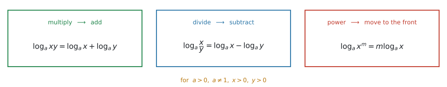
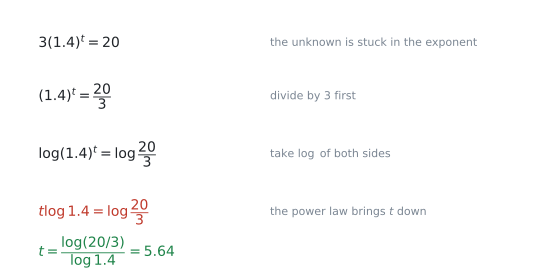
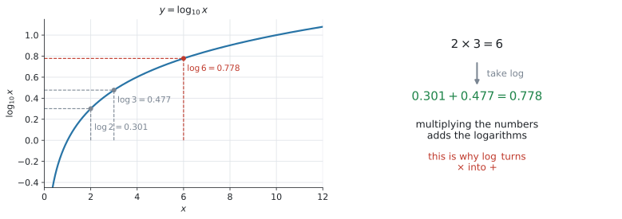
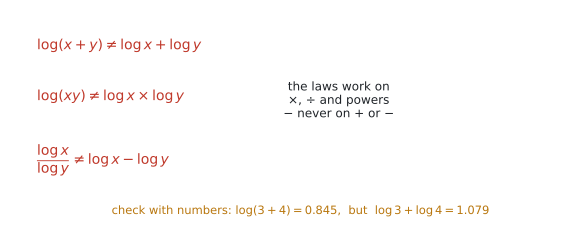
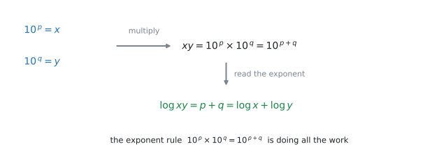

# AHL 1.9 — Laws of logarithms（対数法則） {#sec-ahl-1-9}

::: {.callout-note}
## What you should be able to do
- $3$ つの **laws of logarithms**（対数法則）——**積は和**、**商は差**、**累乗は前へ**——を書ける。
- 法則が使えるのは $a,\ x,\ y > 0$ のときだけだと分かる。
- いくつかの $\log$ を **$1$ つにまとめる**、逆に **$1$ つを分ける**、どちらもできる。
- SL 1.5 で学んだ指数方程式を、**power law**（累乗の法則、$\log_a x^{m} = m\log_a x$）を使って別の形でも解ける。
- $e$ の入った減衰の式から、**half-life**（半減期）を求められる。
- 大きな数の **number of digits**（桁数）を $\log$ で求められる。
:::

::: {.callout-note}
## SL 1.5 の続きです
$\log$ そのものの意味——「**指数を取り出す道具**」——は、[SL 1.5](../../ai-sl/01-number-and-algebra/sl-1-5.qmd) にあります。

$$
a^{x} = b \quad \iff \quad x = \log_a b
$$

この行き来があやしければ、先に [SL 1.5 の後半](../../ai-sl/01-number-and-algebra/sl-1-5.qmd#log-intro)を読んでください。**この項目で新しく出てくるのは、$3$ つの法則です。** SL 1.5 で作った土台は、そのまま使えます。

指数方程式も、SL 1.5 ですでに解いています。そこでは $a^{x} = b \iff x = \log_a b$ と、**定義から直接**取り出しました。このページでは、**両辺に同じ $\log$ を取り、power law で指数を前に出す**解き方も学びます。**同じ方程式を、別の形でも解けるようになる**ということです。

SL 1.5 のページには「log の法則は SL の範囲外です」と書いてあります。**その範囲外が、ここです。**
:::

::: {.callout-tip}
## 試験に出る底は、$10$ か $e$ だけです
シラバスにこう書かれています。

> In examinations, $a$ will equal $10$ or $e$.

つまり、$\log_{1.08}$ のような底が本文に出ることはあっても、**法則を使わせる問題の底は $\log_{10}$ か $\ln$ です。** $\log_7$ の計算を練習する必要はありません。

底を書かない $\log$ は $\log_{10}$ のこと、$\ln$ は $\log_e$ のことです。
:::

## The idea

$\log$ は「指数を取り出す道具」でした。指数には、すでに知っている法則があります。

$$
10^{\,p} \times 10^{\,q} = 10^{\,p+q}
$$

**指数の世界の掛け算は、指数どうしの足し算**です。$\log$ はその指数を取り出す道具ですから、**$\log$ の世界に持ちこむと、掛け算が足し算になります。** この項目は、その一言をきちんと書き下したものです。

### 1. $3$ つの法則 {#three-laws}

{#fig-ahl19-three width=96%}

@fig-ahl19-three が全部です。公式集の **AHL 1.9** の欄に、この $3$ つが $\ \text{for } a,\ x,\ y > 0$ という条件つきで印刷されています。**ですから、$3$ つの式そのものを覚える必要はありません。** 覚えるべきなのは、**どの場面でどれを使うか**のほうです。

$$
\log_a xy = \log_a x + \log_a y
$$ {#eq-ahl19-product}

$$
\log_a \frac{x}{y} = \log_a x - \log_a y
$$ {#eq-ahl19-quotient}

$$
\log_a x^{m} = m \log_a x
$$ {#eq-ahl19-power}

言葉にすると、こうなります。

| もとの中身 | $\log$ にすると |
|---|---|
| **掛け算** $xy$ | **足し算** $\log x + \log y$ |
| **割り算** $\dfrac{x}{y}$ | **引き算** $\log x - \log y$ |
| **累乗** $x^{m}$ | 指数が**前に出る** $m\log x$ |

: $3$ つの法則を、言葉で {#tbl-ahl19-three}

数で確かめておきます。$\log 2 = 0.301$、$\log 3 = 0.477$、$\log 6 = 0.778$ です。

$$
\log 2 + \log 3 = 0.301 + 0.477 = 0.778 = \log 6
$$

$2 \times 3 = 6$ という**掛け算**が、$0.301 + 0.477$ という**足し算**になりました。

::: {.callout-tip}
## $3$ つ目が、いちばん働きます
試験で点になるのは、圧倒的に @eq-ahl19-power です。**指数の中にいる未知数を、外に出せる**からです（[第4節](#solve)）。

$1$ つ目と $2$ つ目は、式を整理するときに使います。
:::

### 2. 使える条件は $a,\ x,\ y > 0$ です {#conditions}

公式集にも、$3$ つの式の下に **for $a,\ x,\ y > 0$** と印刷されています。

理由は $\log$ の定義そのものです。$\log_a x$ は「$a$ を何乗したら $x$ になるか」でした。

- $x \le 0$ … $10^{\,\square}$ は正の数にしかなりません。だから $\log(-5)$ や $\log 0$ は**ありません**。
- $a \le 0$ … 底として使えません。

$a = 1$ も底になれません（$1$ は何乗しても $1$ のままだからです）。ただしこれは、公式集の AHL 1.9 の欄ではなく、**SL 1.5 の欄**に $a \neq 1$ として書かれている条件です。試験に出る底は $10$ か $e$ なので、実際に困ることはありません。

::: {.callout-warning}
## $\log_a x^{m} = m\log_a x$ は、$x > 0$ のときの式です
$\log\!\left((-2)^{2}\right)$ は、中身が $4$ なので計算できます。しかし $2\log(-2)$ は**書けません**。$\log(-2)$ が存在しないからです。

$$
\log\!\left((-2)^{2}\right) = \log 4 = 0.602 \qquad \text{だが} \qquad 2\log(-2) \ \text{は定義されない}
$$

試験で $x$ の範囲まで問われることは多くありませんが、**「$\log$ の中身は正」**は頭に置いてください。方程式を解いたあとで、$\log$ の中身が負になる解を捨てる場面があります。
:::

### 3. $\log$ でも $\ln$ でも、法則は同じです {#log-ln}

$3$ つの法則は、底が何であっても成り立ちます。試験に出るのは $10$ か $e$ ですから、実際には次の $2$ 通りだけです。

$$
\log xy = \log x + \log y, \qquad \ln xy = \ln x + \ln y
$$

**どちらを使うかは、問題の中身で決まります。**

| 式に出てくるもの | 使う $\log$ |
|---|---|
| $10^{x}$、$1.4^{t}$、$(0.85)^{t}$ など | $\log_{10}$ でも $\ln$ でも**どちらでもよい** |
| $e^{kt}$ | **$\ln$**（$\ln e = 1$ なので、いちばん短くなる） |

: $\log$ と $\ln$ の選び方 {#tbl-ahl19-choose}

::: {.callout-tip}
## $e$ が見えたら $\ln$
$e^{-0.03t} = 0.25$ に $\log_{10}$ を取っても解けますが、$\ln$ なら $-0.03t = \ln 0.25$ と**一行**で済みます。

$\ln e^{\square} = \square$ になるからです。これは @eq-ahl19-power と $\ln e = 1$ から出ます。
:::

### 4. 使いどころ その1 — 指数の中の未知数を、外に出す {#solve}

**この項目で、いちばん出る形**です。

$$
3(1.4)^{t} = 20
$$

$t$ が**指数の中**にいるので、割ったり引いたりしても外に出てきません。ここで @eq-ahl19-power の出番です。

{#fig-ahl19-solve width=88%}

@fig-ahl19-solve の $4$ 段が、そのまま答案になります。

1. まず**指数のかたまりだけ**にします。$(1.4)^{t} = \dfrac{20}{3}$
2. **両辺の $\log$ を取ります。** $\log (1.4)^{t} = \log \dfrac{20}{3}$
3. **累乗の法則で $t$ が前に出ます。** $t\log 1.4 = \log \dfrac{20}{3}$
4. あとは $\log 1.4$ という**ただの数**で割るだけです。

$$
t = \frac{\log (20/3)}{\log 1.4} = 5.638\ldots = 5.64 \ (3\ \text{s.f.})
$$

::: {.callout-warning}
## 手順 $1$ を飛ばさないでください
$3(1.4)^{t} = 20$ にいきなり $\log$ を取ると、左辺は $\log 3 + t\log 1.4$ になります。

**間違いではありませんが**、$1$ 行増えます。**先に $3$ で割る**ほうが速く、写し間違いも減ります。
:::

### 5. 使いどころ その2 — 掛け算を足し算に変えて、大きさを測る {#scale}

{#fig-ahl19-graph width=92%}

@fig-ahl19-graph の左は $y = \log_{10} x$ のグラフです。$x$ が $2$ から $6$ へ **$3$ 倍**になるあいだに、$y$ は $0.301$ から $0.778$ へ **$0.477$ 増える**だけです。

**掛け算が足し算に化ける**——これが $\log$ の使いどころのもう $1$ つです。

#### 桁数を数える {#digits}

$2^{100}$ は何桁でしょうか。実際に計算しなくても、$\log$ で分かります。

$$
\log 2^{100} = 100 \log 2 = 100 \times 0.301030\ldots = 30.103
$$

つまり $2^{100} = 10^{30.103}$ です。$10^{30}$ より大きく、$10^{31}$ より小さいので、

$$
2^{100} = 1.27 \times 10^{30} \quad \Rightarrow \quad \mathbf{31}\ \text{桁}
$$

::: {.callout-tip}
## 桁数は「整数部分 $+\ 1$」
**$N$ が正の整数のとき**、$\log_{10} N$ の**整数部分が $30$** なら、$N$ は $31$ 桁です。

$10^{0} = 1$（$1$ 桁）、$10^{1} = 10$（$2$ 桁）、$10^{2} = 100$（$3$ 桁）と並べれば、$1$ 足す理由が見えます。
:::

#### AHL 2.10 へつながります {#link-210}

シラバスは、この項目に

> Link to: scaling large and small numbers (AHL 2.10)

と注を付けています。地震の $M$、音の $\text{dB}$、pH——**桁が違いすぎて並べられない量**を、$\log$ を取って $1$ 本の軸に載せるのが AHL 2.10 です。

$\log$ が掛け算を足し算に変えるからこそ、$100$ 倍が「$+2$」という**一定の間隔**になります。ここで練習する法則が、そのまま使われます。

### 6. 成り立たない形 {#not-laws}

{#fig-ahl19-notlaws width=94%}

法則が使えるのは、$\log$ の中身が**掛け算・割り算・累乗**のときだけです。@fig-ahl19-notlaws の $3$ つは、**どれも成り立ちません。**

$$
\log (x + y) \neq \log x + \log y
$$

$$
\log (xy) \neq \log x \times \log y
$$

$$
\frac{\log x}{\log y} \neq \log x - \log y
$$

数を入れれば一目です。$x = 3$、$y = 4$ とすると

$$
\log(3 + 4) = \log 7 = 0.845, \qquad \log 3 + \log 4 = 1.079
$$

まったく違います。

::: {.callout-warning}
## 中身の足し算は、絶対に分けられません
$\log(x+y)$ は、**それ以上どうにもなりません。** これを分けたくなったら、その気持ちを止めてください。

分けられるのは $\log(xy)$ だけです。**中身が掛け算になっているかどうか**を、毎回目で確かめてください。
:::

## Why it works

:::: {.callout-note collapse="true" appearance="simple"}
## クリックすると開きます
なぜ「掛けたら足す」になるのか、$1$ つ目の法則だけ見ておきます。残りの $2$ つも、まったく同じ理屈です。

{#fig-ahl19-why width=86%}

$\log x = p$、$\log y = q$ とします。$\log$ の定義（$a^{x} = b \iff x = \log_a b$）から、これは

$$
10^{\,p} = x, \qquad 10^{\,q} = y
$$

ということです。この $2$ つを掛けます。

$$
xy = 10^{\,p} \times 10^{\,q} = 10^{\,p+q}
$$

最後の等号は、**指数法則そのもの**です（[SL 1.5 の前半](../../ai-sl/01-number-and-algebra/sl-1-5.qmd#exp-laws)）。ここが仕組みの全部です。

いま $xy = 10^{\,p+q}$ という形になったので、もう一度 $\log$ の定義を使って指数を取り出します。

$$
\log xy = p + q = \log x + \log y
$$

@eq-ahl19-product が出ました。

同じように、$\dfrac{x}{y} = \dfrac{10^{\,p}}{10^{\,q}} = 10^{\,p-q}$ から @eq-ahl19-quotient が、$x^{m} = (10^{\,p})^{m} = 10^{\,pm}$ から @eq-ahl19-power が出ます。

つまり、**対数法則の仕組みは、すでに学んだ指数法則から説明できます。** 掛け算・割り算・累乗の指数法則を、$\log$ の側から書いたものです。

これで、[第6節](#not-laws)の $3$ つが成り立たない理由も見えます。$10^{\,p} + 10^{\,q}$ を $10$ の $1$ つの累乗にまとめる指数法則は、**存在しない**からです。
::::

## Worked examples

::: {.callout-note appearance="simple"}
問題文は英語です。意味が理解できなかったら、問題文の下の「**日本語訳**」を開いてください。解説は日本語です。
:::

::: {#exm-ahl19-value}
[Find the exact value of each of the following.]{.q-en}

**(a)** [$\log 8 + \log 125$]{.q-en}

**(b)** [$\log 200 - \log 2$]{.q-en}

**(c)** [$3\log 2 + \log 125$]{.q-en}

<details class="jp-trans">
<summary>日本語訳</summary>

次のそれぞれの値を、正確に（近似せずに）求めなさい。

**(a)** $\log 8 + \log 125$

**(b)** $\log 200 - \log 2$

**(c)** $3\log 2 + \log 125$

</details>

---

`Find the exact value` と言われているので、**電卓の小数ではなく整数で答えます。** $\log$ を $1$ つにまとめて、$10$ の何乗かを見るのが手順です。

**(a)** 足し算なので、@eq-ahl19-product を逆向きに使います。

$$
\log 8 + \log 125 = \log (8 \times 125) = \log 1000
$$

$1000 = 10^{3}$ なので、$\log 1000 = 3$ です。

**(b)** 引き算なので @eq-ahl19-quotient です。

$$
\log 200 - \log 2 = \log \frac{200}{2} = \log 100 = 2
$$

**(c)** いきなりはまとめられません。**係数の $3$ を、先に中に入れます**（@eq-ahl19-power）。

$$
3\log 2 = \log 2^{3} = \log 8
$$

あとは (a) と同じです。

$$
\log 8 + \log 125 = \log 1000 = 3
$$

::: {.callout-note}
## 解答例（答案用紙にはこう書く）
**(a)** $\log 8 + \log 125 = \log 1000 = 3$

**(b)** $\log 200 - \log 2 = \log 100 = 2$

**(c)** $3\log 2 + \log 125 = \log 8 + \log 125 = \log 1000 = 3$
:::

::: {.callout-tip}
## 数が「きれい」なのは、ヒントです
$8 \times 125 = 1000$、$200 \div 2 = 100$。**この例題は、まとめたあとの数が $10$、$100$、$1000$ になるように作られています。**

ですから、この $3$ 問でそうならなかったら、**法則を取りちがえていないか確かめてください。**

**一般の問題では、正しく変形しても $\log 12$ や $\ln 7$ のような形が残ります。** `Find the exact value` と書かれているときだけ、きれいな数になると思ってください。
:::
:::

::: {#exm-ahl19-single}
[Write each expression as a single logarithm, where $x > 0$ and $y > 0$.]{.q-en}

**(a)** [$2\ln x + \ln y$]{.q-en}

**(b)** [$\ln x - 3\ln y$]{.q-en}

<details class="jp-trans">
<summary>日本語訳</summary>

次の式を、$1$ つの対数で表しなさい。ただし $x > 0$、$y > 0$ とします。

**(a)** $2\ln x + \ln y$

**(b)** $\ln x - 3\ln y$

</details>

---

手順はいつも同じ $2$ 段です。

> **1. 係数を、累乗として中に入れる。 2. 足し算なら掛ける、引き算なら割る。**

**(a)** まず $2$ を中へ。

$$
2\ln x = \ln x^{2}
$$

足し算なので、中身を掛けます。

$$
\ln x^{2} + \ln y = \ln (x^{2} y)
$$

**(b)** $3$ を中へ入れると $3\ln y = \ln y^{3}$ です。引き算なので、中身を割ります。

$$
\ln x - \ln y^{3} = \ln \frac{x}{y^{3}}
$$

**検算。** $x = 3$、$y = 5$ を入れてみます。

- (a) 左は $2\ln 3 + \ln 5 = 3.807$、右は $\ln (9 \times 5) = \ln 45 = 3.807$ ✓
- (b) 左は $\ln 3 - 3\ln 5 = -3.730$、右は $\ln \dfrac{3}{125} = \ln 0.024 = -3.730$ ✓

::: {.callout-note}
## 解答例（答案用紙にはこう書く）
**(a)** $2\ln x + \ln y = \ln x^{2} + \ln y = \ln (x^{2} y)$

**(b)** $\ln x - 3\ln y = \ln x - \ln y^{3} = \ln \dfrac{x}{y^{3}}$
:::

::: {.callout-warning}
## $2\ln x$ を $\ln 2x$ としない
これは $\ln x^{2}$ です。**係数は、指数として中に入ります。** 掛け算として入るのではありません。

$x = 3$ で試すと、$2\ln 3 = 2.197$、$\ln 9 = 2.197$、$\ln 6 = 1.792$。**$\ln 6$ は合いません。**
:::

::: {.callout-tip}
## 法則は、逆向きにも使えます
まとめるのと同じ手順を、**逆にたどれば分けられます。** 中身が掛け算なら足し算に分け、そのあと指数を前に出します。

$$
\log (x^{3} y) = \log x^{3} + \log y = 3\log x + \log y \qquad (x > 0,\ y > 0)
$$

この向きの練習は、演習 $5$ にあります。
:::
:::

::: {#exm-ahl19-exp}
[Solve the equation $3(1.4)^{t} = 20$, giving your answer correct to three significant figures.]{.q-en}

<details class="jp-trans">
<summary>日本語訳</summary>

方程式 $3(1.4)^{t} = 20$ を解きなさい。答えは有効数字 $3$ 桁で求めなさい。

</details>

---

[第4節](#solve)の $4$ 段そのままです。まず $3$ で割って、指数のかたまりだけにします。

$$
(1.4)^{t} = \frac{20}{3}
$$

両辺の $\log$ を取ります。

$$
\log (1.4)^{t} = \log \frac{20}{3}
$$

@eq-ahl19-power で $t$ が前に出ます。

$$
t \log 1.4 = \log \frac{20}{3}
$$

$\log 1.4$ は**ただの数**（$0.146\ldots$）なので、割るだけです。

$$
t = \frac{\log (20/3)}{\log 1.4} = 5.638\ldots = 5.64 \ (3\ \text{s.f.})
$$

**検算。** $3 \times 1.4^{5.638} = 20.0$ ✓

::: {.callout-note}
## 解答例（答案用紙にはこう書く）
$$
(1.4)^{t} = \frac{20}{3}
$$

$$
t \log 1.4 = \log \frac{20}{3}
$$

$$
t = \frac{\log (20/3)}{\log 1.4} = 5.638\ldots = 5.64 \ (3\ \text{s.f.})
$$
:::

::: {.callout-tip}
## $\ln$ で解いても、同じ答えです
$$
t = \frac{\ln (20/3)}{\ln 1.4} = 5.638\ldots
$$

底は打ち消し合うので、**どちらを使っても構いません。** 電卓で押しやすいほうを使ってください。
:::
:::

::: {#exm-ahl19-decay}
[The mass of a radioactive sample is modelled by $M(t) = 200e^{-0.03t}$, where $M$ is measured in grams and $t$ is measured in years.]{.q-en}

**(a)** [Find the time taken for the mass to fall to $50$ grams.]{.q-en}

**(b)** [Find the half-life of the sample, that is, the time taken for the mass to fall to half of its value at any given moment.]{.q-en}

**(c)** [State what happens to the half-life if the initial mass is $400$ grams instead of $200$ grams. Give a reason for your answer.]{.q-en}

<details class="jp-trans">
<summary>日本語訳</summary>

ある放射性物質の質量は $M(t) = 200e^{-0.03t}$ で表されます。$M$ の単位はグラム、$t$ の単位は年です。

**(a)** 質量が $50$ グラムになるまでの時間を求めなさい。

**(b)** この物質の半減期、すなわち、ある時点の質量が半分になるまでの時間を求めなさい。

**(c)** はじめの質量が $200$ グラムではなく $400$ グラムだったとき、半減期がどうなるかを述べなさい。その理由も書きなさい。

</details>

---

**(a)** $e$ があるので $\ln$ を使います（@tbl-ahl19-choose）。

$$
200e^{-0.03t} = 50 \quad \Rightarrow \quad e^{-0.03t} = \frac{1}{4}
$$

両辺の $\ln$ を取ります。$\ln e^{\square} = \square$ なので、左辺は指数がそのまま出ます。

$$
-0.03t = \ln \frac{1}{4} = -1.386\ldots
$$

$$
t = \frac{-1.386\ldots}{-0.03} = 46.209\ldots = 46.2\ \text{年} \ (3\ \text{s.f.})
$$

**検算。** $200e^{-0.03 \times 46.209} = 50.0$ ✓

**(b)** 半減期は、**いつ測っても同じ**です。はじめの $200$ から $100$ になるまでを求めれば十分です。

$$
200e^{-0.03t} = 100 \quad \Rightarrow \quad e^{-0.03t} = \frac{1}{2}
$$

$$
-0.03t = \ln \frac{1}{2} = -\ln 2 \quad \Rightarrow \quad t = \frac{\ln 2}{0.03} = 23.10\ldots = 23.1\ \text{年}
$$

**(c)** (b) の $2$ 行目で、$200$ は両辺を割ったときに消えました。$400$ でも同じことが起こります。

$$
400e^{-0.03t} = 200 \quad \Rightarrow \quad e^{-0.03t} = \frac{1}{2}
$$

$1$ 行目からあとが (b) とまったく同じ式になるので、半減期も同じ $23.1$ 年です。

`Give a reason` と言われているので、**理由の一文が要ります。** 「はじめの量が約分されて消えるから」が理由です。

::: {.model-answer}
**試験ではこう書く**

*The half-life is unchanged, at $23.1$ years. The initial mass cancels when both sides are divided by it, so the half-life depends only on the rate $0.03$.*
:::

（半減期は変わらず $23.1$ 年です。両辺をはじめの質量で割ると、それが約分されて消えるので、半減期は $0.03$ という減り方だけで決まるからです、という意味です。）

::: {.callout-note}
## 解答例（答案用紙にはこう書く）
**(a)**
$$
e^{-0.03t} = 0.25 \quad \Rightarrow \quad -0.03t = \ln 0.25
$$
$$
t = 46.209\ldots = 46.2\ \text{years} \ (3\ \text{s.f.})
$$

**(b)**
$$
e^{-0.03t} = 0.5 \quad \Rightarrow \quad -0.03t = \ln 0.5
$$
$$
t = \frac{\ln 2}{0.03} = 23.10\ldots = 23.1\ \text{years} \ (3\ \text{s.f.})
$$

**(c)** *The half-life is unchanged, at $23.1$ years. The initial mass cancels when both sides are divided by it, so the half-life depends only on the rate $0.03$.*
:::

::: {.callout-tip}
## $200$ が消えるのが、半減期のポイントです
(b) の $2$ 行目で、$200$ は約分されて消えました。**はじめの量が何であっても、半分になるまでの時間は $\dfrac{\ln 2}{0.03}$ です。**

$46.2$ 年で $\frac{1}{4}$、$23.1$ 年で $\frac{1}{2}$。$23.1 \times 2 = 46.2$ になっているのも、よい検算です。
:::
:::

::: {#exm-ahl19-digits}
[Given that $\log_{10} 2 = 0.301030$ correct to six significant figures, find the number of digits in $2^{100}$.]{.q-en}

<details class="jp-trans">
<summary>日本語訳</summary>

$\log_{10} 2 = 0.301030$（有効数字 $6$ 桁）であることを使って、$2^{100}$ の桁数を求めなさい。

</details>

---

$2^{100}$ をそのまま電卓に入れると、$1.2676506\ldots \text{E}30$ のような表示になり、**桁数を数えるには使いにくい**です。$\log$ を取ります。

@eq-ahl19-power で、指数の $100$ が前に出ます。

$$
\log 2^{100} = 100 \log 2 = 100 \times 0.301030 = 30.1030
$$

これは「$2^{100} = 10^{30.103}$」という意味です。$10^{30.103} = 10^{0.103} \times 10^{30}$ なので

$$
2^{100} = 1.27 \times 10^{30}
$$

$10^{30}$ が $31$ 桁（$1$ のうしろに $0$ が $30$ 個）ですから、$2^{100}$ も **$31$ 桁**です。

::: {.callout-note}
## 解答例（答案用紙にはこう書く）
$$
\log_{10} 2^{100} = 100\log_{10} 2 = 30.1030
$$

$$
10^{30} < 2^{100} < 10^{31}
$$

*Therefore $2^{100}$ has $31$ digits.*
:::

::: {.callout-tip}
## 「整数部分 $+\ 1$」で覚えて構いません
$N$ が正の整数のとき、$\log_{10} N$ の整数部分が $30$ なら $N$ は $31$ 桁です（[第5節](#digits)）。

ただし、**答案には $10^{30} < N < 10^{31}$ の $1$ 行を書いてください。** 覚えた規則をそのまま書くより、はさんで見せるほうが確実に点になります。
:::
:::

## Common errors

::: {.callout-warning}
## $\log(x+y)$ を $\log x + \log y$ に分ける
**いちばん多い誤りです。** 分けられるのは $\log(xy)$ だけで、$\log(x+y)$ はそれ以上どうにもなりません。

数を入れた反例は[第6節](#not-laws)にあります。**$\log$ の中が $+$ か $-$ なら、手は出せません。**
:::

::: {.callout-warning}
## $\dfrac{\log x}{\log y}$ を $\log x - \log y$ にする
分数の形につられる誤りです。**引き算になるのは $\log \dfrac{x}{y}$**、つまり**割り算が $\log$ の中にあるとき**だけです。

$$
\log \frac{x}{y} = \log x - \log y \qquad \text{だが} \qquad \frac{\log x}{\log y} \neq \log x - \log y
$$

$\log$ の記号が **$1$ つか $2$ つか**で見分けてください。
:::

::: {.callout-warning}
## $2\log x$ を $\log 2x$ とする
正しくは $\log x^{2}$ です。**係数は、掛け算ではなく指数として中に入ります**（@eq-ahl19-power）。

数で確かめる例は @exm-ahl19-single にあります。
:::

::: {.callout-warning}
## $\log(xy)$ を $\log x \times \log y$ にする
正しくは $\log x + \log y$ です（@eq-ahl19-product）。**中身の掛け算は、外では足し算**——中と外で演算が入れかわります。

数を入れた反例は[第6節](#not-laws)にあります。
:::

::: {.callout-warning}
## 指数方程式で、$\log$ を片方だけ取る
$(1.4)^{t} = \dfrac{20}{3}$ から、いきなり $t\log 1.4 = \dfrac{20}{3}$ と書く誤りです。

**両辺に $\log$ を取ります。** 右辺も $\log \dfrac{20}{3}$ にしてください。片方だけだと、答えが $45.6$ のようにまったく違う値になります。
:::

::: {.callout-warning}
## $\dfrac{\log(20/3)}{\log 1.4}$ を、割らずに引く
$\log (20/3) - \log 1.4$ としてしまう誤りです。

$t\log 1.4 = \log \dfrac{20}{3}$ の $\log 1.4$ は、**$t$ に掛かっているただの数**です。移項するときは**割ります**。

$\log$ の法則を使う場面ではありません。**式のどこに法則を使ったのか、自分で言えるか**を確かめてください。
:::

::: {.callout-warning}
## $e$ の式に $\log_{10}$ を取って、行き詰まる
$e^{-0.03t} = 0.25$ に $\log_{10}$ を取ると $-0.03t\log e = \log 0.25$ となり、$\log e = 0.434$ を余分に扱うことになります。

**間違いではありませんが、遠回りです。** $e$ が見えたら $\ln$ にしてください（@tbl-ahl19-choose）。
:::

::: {.callout-warning}
## $\log$ の中身が負になる解を、そのまま書く
$\log(x-3) + \log x = 1$ のような問題で、まとめて解くと $x = 5$ と $x = -2$ が出ます。

$x = -2$ を入れると $\log(-5)$ になり、**存在しません**（[第2節](#conditions)）。**$\log$ の中身が正になるかを、必ず戻して確かめてください。**
:::

::: {.callout-warning}
## 桁数を、$\log$ の整数部分そのままで答える
$\log 2^{100} = 30.1$ から「$30$ 桁」と答える誤りです。正しくは **$31$ 桁**——**整数部分 $+\ 1$** です（[第5節](#digits)）。
:::

::: {.callout-warning}
## 途中で丸めてから割る
$\log 1.4 = 0.15$ と丸めてから $t = \dfrac{0.824}{0.15}$ を計算すると $5.49$ になり、正しい $5.64$ と合いません。

**式のまま電卓に入れて、最後に丸めます。** $3$ 桁の答えを出したいのに途中を $2$ 桁で丸めると、その時点で $3$ 桁目が失われます。
:::

## Using your GDC (TI-Nspire CX II)

この項目で電卓が要るのは、**最後の数値を出すところだけ**です。法則を使う変形は、手で書きます。

### 1. `log` と `ln` のキー {#gdc-keys}

[SL 1.5](../../ai-sl/01-number-and-algebra/sl-1-5.qmd#logkeys) と同じです。

- `ln` … そのままキーがあります
- `log` … `ctrl` + `10^x` で出ます

$\log$ を押すと $\log_{\square}(\square)$ というテンプレートが出ます（[SL 1.5 の log テンプレート](../../ai-sl/01-number-and-algebra/sl-1-5.qmd#logtemplate)）。**左下の小さいボックスを空のままにすると、底は $10$ になります。** この項目ではそれで構いません。

### 2. 指数方程式を、$1$ 行で入れる {#gdc-solve}

@exm-ahl19-exp の最後は、次のようにそのまま打てます。

```
log(20/3) / log(1.4)
```

$5.63827$ が出ます。

::: {.callout-warning}
## 分母のカッコを忘れない
`log(20/3)/log(1.4)` の最後のカッコを閉じ忘れると、電卓が式を勝手に読み替えます。

**入力欄の式を目で読んでから `enter`** を押してください。$5.64$ 前後にならなかったら、まず打ち間違いを疑います。
:::

### 3. $e$ の入った式 {#gdc-e}

$\ln 0.25 \div (-0.03)$ は、そのまま打てます。

```
ln(0.25) / (-0.03)
```

$46.209\ldots$ が出ます。$e$ そのものを打つときは `e^x` のキーです。

### 4. `nSolve` を使ってもよい {#gdc-solve-cmd}

数値だけが欲しいなら、`nSolve` でも出ます。

```
menu → Algebra → Numerical Solve
nSolve(3*1.4^t = 20, t)
```

$t = 5.63827$ と出ます。

::: {.callout-warning}
## `nSolve` だけでよいかは、問題によります
`nSolve` で数値解を求められる問題もあります。ただし、**途中式や対数法則の使用を求める問題では、電卓の答えだけでは方法点を得られないことがあります。**

このページでは、**$\log$ を取った式も書く習慣**をつけてください。そのうえで、`nSolve` を**検算に使う**のがいちばん確実です。
:::

### 5. 桁数を出す {#gdc-digits}

@exm-ahl19-digits のような問題では、$100\log 2$ を出して整数部分を見ます。

```
100 * log(2)
```

$30.103$ と出るので、$31$ 桁です。

$2^{100}$ をそのまま打つと `1.26765E30` という表示になります。**この `E30` からも $31$ 桁と読めます**（$1.27 \times 10^{30}$ という意味だからです）。

## Exercises

::: {.callout-note appearance="simple"}
各問題に、折りたたみが3つ付いています。**日本語訳**、**解答例**（答案用紙に書くべきこと。英語です）、**解説**（なぜそうなるか。日本語です）。

まず自分で解いて、次に解答例と見くらべてください。**解説は、合わなかったときだけ開けば十分です。**
:::

::: {.exercise-block}

[1]{.ex-no} [Find the exact value of each of the following.]{.q-en}

**(a)** [$\log 4 + \log 25$]{.q-en}

**(b)** [$\log 60 - \log 6$]{.q-en}

**(c)** [$2\log 5 + \log 4$]{.q-en}

<details class="jp-trans">
<summary>日本語訳</summary>

次のそれぞれの値を、正確に（近似せずに）求めなさい。

**(a)** $\log 4 + \log 25$

**(b)** $\log 60 - \log 6$

**(c)** $2\log 5 + \log 4$

</details>

::: {.callout-note collapse="true"}
## 解答例（答案用紙に書くこと）
**(a)** $\log 4 + \log 25 = \log 100 = 2$

**(b)** $\log 60 - \log 6 = \log 10 = 1$

**(c)** $2\log 5 + \log 4 = \log 25 + \log 4 = \log 100 = 2$
:::

::: {.callout-tip collapse="true"}
## 解説
@exm-ahl19-value と同じ形です。

**(a)** $4 \times 25 = 100 = 10^{2}$ なので $2$ です。

**(b)** $60 \div 6 = 10 = 10^{1}$ なので $1$ です。

**(c)** 係数の $2$ を先に中へ入れます。$2\log 5 = \log 5^{2} = \log 25$。あとは (a) と同じです。

**$\log 10 = 1$、$\log 100 = 2$、$\log 1000 = 3$** は、そのつど計算せずに出るようにしておくと速くなります。
:::

::: {.ex-sep}
:::

[2]{.ex-no} [Write each expression as a single logarithm, where $a,\ b,\ p$ and $q$ are positive.]{.q-en}

**(a)** [$3\ln a + \ln b$]{.q-en}

**(b)** [$\ln p - 2\ln q$]{.q-en}

<details class="jp-trans">
<summary>日本語訳</summary>

次の式を $1$ つの対数で表しなさい。ただし $a,\ b,\ p,\ q$ は正の数とします。

**(a)** $3\ln a + \ln b$

**(b)** $\ln p - 2\ln q$

</details>

::: {.callout-note collapse="true"}
## 解答例（答案用紙に書くこと）
**(a)** $3\ln a + \ln b = \ln a^{3} + \ln b = \ln (a^{3} b)$

**(b)** $\ln p - 2\ln q = \ln p - \ln q^{2} = \ln \dfrac{p}{q^{2}}$
:::

::: {.callout-tip collapse="true"}
## 解説
@exm-ahl19-single の $2$ 段です。**係数を中へ入れる → 足すなら掛ける、引くなら割る。**

**検算。** (b) で $p = 9$、$q = 3$ とすると、左は $\ln 9 - 2\ln 3 = 0$、右は $\ln \dfrac{9}{9} = \ln 1 = 0$ ✓

$0$ になる例は、**符号の取りちがえがすぐ分かる**ので検算に向いています。
:::

::: {.ex-sep}
:::

[3]{.ex-no} [A colony of bacteria has an initial population of $80$. The population is modelled by $P(n) = 80(1.06)^{n}$, where $n$ is the number of days.]{.q-en}

**(a)** [Find the value of $n$ for which $P(n) = 500$, giving your answer correct to three significant figures.]{.q-en}

**(b)** [Hence write down the number of whole days after which the population first exceeds $500$.]{.q-en}

<details class="jp-trans">
<summary>日本語訳</summary>

ある細菌のコロニーは、はじめの個体数が $80$ です。個体数は $P(n) = 80(1.06)^{n}$ で表されます。$n$ は日数です。

**(a)** $P(n) = 500$ となる $n$ の値を、有効数字 $3$ 桁で求めなさい。

**(b)** それを使って、個体数がはじめて $500$ を超えるのは何日後かを書きなさい。

</details>

::: {.callout-note collapse="true"}
## 解答例（答案用紙に書くこと）
**(a)**
$$
(1.06)^{n} = \frac{500}{80} = 6.25
$$
$$
n\log 1.06 = \log 6.25
$$
$$
n = \frac{\log 6.25}{\log 1.06} = 31.45\ldots = 31.5 \ (3\ \text{s.f.})
$$

**(b)** $32$ days
:::

::: {.callout-tip collapse="true"}
## 解説
**(a)** @exm-ahl19-exp と同じ $4$ 段です。まず $80$ で割って $(1.06)^{n} = 6.25$、両辺の $\log$、$n$ が前に出る、割る。

**(b)** $31.45$ 日で $500$ に届くので、**$31$ 日ではまだ足りず、$32$ 日で超えます。** ここは切り上げです。

**検算。** $80(1.06)^{31} = 487$（$500$ 未満）、$80(1.06)^{32} = 516$（$500$ 超）✓

::: {.callout-warning}
## $31.5$ を四捨五入して $31$ にしない
(a) の答えは有効数字 $3$ 桁なので $31.5$ ですが、**(b) はそこから四捨五入するのではありません。** 「はじめて超える」は**切り上げ**です。

$31.45$ という元の値から判断してください。$31.5$ を四捨五入すると $32$ になり、たまたま合いますが、**理由が違います。**
:::
:::

::: {.ex-sep}
:::

[4]{.ex-no} [Solve the equation $e^{-0.25t} = 0.1$, giving your answer correct to three significant figures.]{.q-en}

<details class="jp-trans">
<summary>日本語訳</summary>

方程式 $e^{-0.25t} = 0.1$ を解きなさい。答えは有効数字 $3$ 桁で求めなさい。

</details>

::: {.callout-note collapse="true"}
## 解答例（答案用紙に書くこと）
$$
-0.25t = \ln 0.1
$$

$$
t = \frac{\ln 0.1}{-0.25} = 9.2103\ldots = 9.21 \ (3\ \text{s.f.})
$$
:::

::: {.callout-tip collapse="true"}
## 解説
$e$ があるので $\ln$ です（@tbl-ahl19-choose）。$\ln e^{\square} = \square$ なので、左辺は**指数がそのまま出ます**。

$\ln 0.1 = -2.302\ldots$ と負の数です。$-0.25$ で割るので、**負 ÷ 負で正**になります。$t$ が負になったら、符号のどこかを落としています。

**検算。** $e^{-0.25 \times 9.2103} = 0.100$ ✓
:::

::: {.ex-sep}
:::

[5]{.ex-no} [Given that $x > 0$ and $y > 0$, write each of the following in terms of $\log x$ and $\log y$.]{.q-en}

**(a)** [$\log (x^{3} y)$]{.q-en}

**(b)** [$\log \dfrac{x}{y^{2}}$]{.q-en}

<details class="jp-trans">
<summary>日本語訳</summary>

$x > 0$、$y > 0$ とします。次のそれぞれを、$\log x$ と $\log y$ を使って表しなさい。

**(a)** $\log (x^{3} y)$

**(b)** $\log \dfrac{x}{y^{2}}$

</details>

::: {.callout-note collapse="true"}
## 解答例（答案用紙に書くこと）
**(a)** $\log (x^{3} y) = \log x^{3} + \log y = 3\log x + \log y$

**(b)** $\log \dfrac{x}{y^{2}} = \log x - \log y^{2} = \log x - 2\log y$
:::

::: {.callout-tip collapse="true"}
## 解説
問2の**逆向き**です。まとめるのではなく、**分けます。**

**(a)** 中身が掛け算なので、まず足し算に分けます（@eq-ahl19-product）。次に $\log x^{3}$ の指数を前に出します（@eq-ahl19-power）。

**(b)** 中身が割り算なので引き算に（@eq-ahl19-quotient）、そのあと $y^{2}$ の $2$ を前へ。

**検算。** $x = 2$、$y = 5$ で (b) を確かめると、左は $\log \dfrac{2}{25} = -1.097$、右は $\log 2 - 2\log 5 = 0.301 - 1.398 = -1.097$ ✓
:::

::: {.ex-sep}
:::

[6]{.ex-no} [Let $\log_{10} 2 = p$ and $\log_{10} 3 = q$. Write each of the following in terms of $p$ and $q$.]{.q-en}

**(a)** [$\log_{10} 6$]{.q-en}

**(b)** [$\log_{10} 1.5$]{.q-en}

**(c)** [$\log_{10} 12$]{.q-en}

**(d)** [$\log_{10} 5$]{.q-en}

<details class="jp-trans">
<summary>日本語訳</summary>

$\log_{10} 2 = p$、$\log_{10} 3 = q$ とします。次のそれぞれを $p$ と $q$ を使って表しなさい。

**(a)** $\log_{10} 6$

**(b)** $\log_{10} 1.5$

**(c)** $\log_{10} 12$

**(d)** $\log_{10} 5$

</details>

::: {.callout-note collapse="true"}
## 解答例（答案用紙に書くこと）
**(a)** $\log 6 = \log(2 \times 3) = p + q$

**(b)** $\log 1.5 = \log \dfrac{3}{2} = q - p$

**(c)** $\log 12 = \log(2^{2} \times 3) = 2p + q$

**(d)** $\log 5 = \log \dfrac{10}{2} = \log 10 - \log 2 = 1 - p$
:::

::: {.callout-tip collapse="true"}
## 解説
**中身を、$2$ と $3$ と $10$ だけで書き直す**のが手順です。

**(a)** $6 = 2 \times 3$。

**(b)** $1.5 = \dfrac{3}{2}$。分数に直すのがコツです。$q - p$ であって $p - q$ ではありません。

**(c)** $12 = 4 \times 3 = 2^{2} \times 3$。$\log 4 = 2\log 2 = 2p$ です。

**(d)** $5$ は $2$ でも $3$ でも作れませんが、$5 = \dfrac{10}{2}$ です。**$\log 10 = 1$ が使えます。**

**検算。** $p = 0.301$、$q = 0.477$ を入れると (c) は $2(0.301) + 0.477 = 1.079$。$\log 12 = 1.079$ ✓
:::

::: {.ex-sep}
:::

[7]{.ex-no} [A student writes $\log(x + y) = \log x + \log y$. Explain why this is incorrect, using $x = 10$ and $y = 10$ to support your answer.]{.q-en}

<details class="jp-trans">
<summary>日本語訳</summary>

ある生徒が $\log(x + y) = \log x + \log y$ と書きました。$x = 10$、$y = 10$ を使って、これが正しくない理由を説明しなさい。

</details>

::: {.callout-note collapse="true"}
## 解答例（答案用紙に書くこと）
$$
\log(10 + 10) = \log 20 = 1.301\ldots
$$

$$
\log 10 + \log 10 = 1 + 1 = 2
$$

::: {.model-answer}
**試験ではこう書く**

*The two sides give different values ($1.30$ and $2$), so the statement is not true. The law applies to $\log(xy)$, not to $\log(x+y)$: there is no law for the logarithm of a sum.*
:::

（両辺の値が違う（$1.30$ と $2$）ので、この式は成り立ちません。法則が使えるのは $\log(xy)$ であって $\log(x+y)$ ではありません。和の対数についての法則は存在しません、という意味です。）
:::

::: {.callout-tip collapse="true"}
## 解説
`Explain why` と言われているので、**言葉での説明が要ります。** 数を入れて食い違いを見せるだけでは、半分です。

$2$ つ書いてください。

1. **反例**——$x = y = 10$ で、左が $1.30$、右が $2$。
2. **理由**——法則は**中身が掛け算のとき**の式であって、足し算には使えない。

$x = y = 10$ が選ばれているのは、$\log 10 = 1$ なので**右辺が暗算で $2$ と出る**からです（[第6節](#not-laws)）。
:::

::: {.ex-sep}
:::

[8]{.ex-no} [Given that $\log_{10} 3 = 0.47712$ correct to five significant figures, find the number of digits in $3^{50}$.]{.q-en}

<details class="jp-trans">
<summary>日本語訳</summary>

$\log_{10} 3 = 0.47712$（有効数字 $5$ 桁）であることを使って、$3^{50}$ の桁数を求めなさい。

</details>

::: {.callout-note collapse="true"}
## 解答例（答案用紙に書くこと）
$$
\log_{10} 3^{50} = 50 \log_{10} 3 = 50 \times 0.47712 = 23.856
$$

$$
10^{23} < 3^{50} < 10^{24}
$$

*Therefore $3^{50}$ has $24$ digits.*
:::

::: {.callout-tip collapse="true"}
## 解説
@exm-ahl19-digits と同じです。$\log$ の**整数部分が $23$** なので、$3^{50}$ は $24$ 桁です。

$3^{50} = 7.18 \times 10^{23}$ です。$10^{23}$ が $24$ 桁なので、合っています。

**$23.856$ を四捨五入して $24$、と考えないでください。** たまたま同じ答えになりますが、$\log$ が $23.1$ でも桁数は $24$ です。**整数部分に $1$ 足す**が正しい理由です。
:::

::: {.ex-sep}
:::

[9]{.ex-no} [The concentration of a drug in a patient's bloodstream falls by $15\%$ each hour. The proportion remaining after $t$ hours is modelled by $(0.85)^{t}$.]{.q-en}

**(a)** [Find the value of $t$ for which the proportion remaining is $0.2$, giving your answer correct to three significant figures.]{.q-en}

**(b)** [Hence find the first whole number of hours after which less than $20\%$ of the drug remains.]{.q-en}

<details class="jp-trans">
<summary>日本語訳</summary>

ある薬の血中濃度は、$1$ 時間ごとに $15\%$ ずつ減ります。$t$ 時間後に残っている割合は $(0.85)^{t}$ で表されます。

**(a)** 残っている割合が $0.2$ となる $t$ の値を、有効数字 $3$ 桁で求めなさい。

**(b)** それを使って、残りが $20\%$ より少なくなる最初の整数時間を求めなさい。

</details>

::: {.callout-note collapse="true"}
## 解答例（答案用紙に書くこと）
**(a)**
$$
(0.85)^{t} = 0.2
$$

$$
t \log 0.85 = \log 0.2
$$
$$
t = \frac{\log 0.2}{\log 0.85} = 9.9031\ldots = 9.90 \ (3\ \text{s.f.})
$$

**(b)** $10$ hours
:::

::: {.callout-tip collapse="true"}
## 解説
**(a)** $15\%$ 減るので、残るのは $85\%$、つまり $1$ 時間で $0.85$ 倍です。

$\log 0.2$ も $\log 0.85$ も**負の数**です（$-0.699$ と $-0.0706$）。負 ÷ 負で正になります。

**(b)** $9.90$ 時間で $20\%$ ちょうどになるので、**$9$ 時間ではまだ $20\%$ より多く、$10$ 時間で下回ります。**

**検算。** $(0.85)^{9} = 0.232$（$20\%$ 超）、$(0.85)^{10} = 0.197$（$20\%$ 未満）✓

$P(n) = 500$ の問3と同じで、**切り上げ**です。「減っていく」場合も、**はじめて条件を満たす整数**は切り上げになります。
:::

::: {.ex-sep}
:::

[10]{.ex-no} [Two quantities are related by $y = 2x^{3}$, where $x > 0$.]{.q-en}

**(a)** [Show that $\log_{10} y = 3\log_{10} x + \log_{10} 2$.]{.q-en}

**(b)** [The values of $\log_{10} x$ and $\log_{10} y$ are plotted on a graph, with $\log_{10} x$ on the horizontal axis. Comment on the shape of this graph, giving the gradient and the vertical intercept.]{.q-en}

<details class="jp-trans">
<summary>日本語訳</summary>

$2$ つの量が $y = 2x^{3}$（$x > 0$）という関係にあります。

**(a)** $\log_{10} y = 3\log_{10} x + \log_{10} 2$ となることを示しなさい。

**(b)** $\log_{10} x$ を横軸、$\log_{10} y$ を縦軸としてグラフをかきます。このグラフの形について、傾きと縦軸切片を挙げて述べなさい。

</details>

::: {.callout-note collapse="true"}
## 解答例（答案用紙に書くこと）
**(a)**
$$
\log y = \log (2x^{3}) = \log 2 + \log x^{3} = \log 2 + 3\log x
$$

**(b)**

::: {.model-answer}
**試験ではこう書く**

*The graph is a straight line. Its gradient is $3$ and its vertical intercept is $\log_{10} 2 = 0.301$ (3 s.f.).*
:::

（グラフは直線になります。傾きは $3$、縦軸切片は $\log_{10} 2 = 0.301$ です、という意味です。）
:::

::: {.callout-tip collapse="true"}
## 解説
**(a)** 中身が $2 \times x^{3}$ という**掛け算**なので、まず足し算に分けます（@eq-ahl19-product）。次に $\log x^{3}$ の $3$ を前へ出します（@eq-ahl19-power）。

**(b)** $\log y = 3\log x + \log 2$ を、$Y = 3X + c$ と見ます。$X = \log x$、$Y = \log y$ と置けば、これは **$1$ 次関数の形**です（[SL 2.1](../../ai-sl/02-functions/sl-2-1.qmd)）。

$$
\underbrace{\log y}_{Y} = 3\underbrace{\log x}_{X} + \underbrace{\log 2}_{c}
$$

**傾きは $x$ の指数、切片は前の係数の $\log$。** $y = ax^{n}$ の形なら、いつもこうなります。

`Comment on` と言われているので、**「直線になる」という一言が要ります。** 傾きと切片の数だけでは足りません。

これが AHL 2.10 の **log-log graph**（両対数グラフ）の考え方です（[第5節](#link-210)）。曲線のデータを $\log$ で直線に直してから、傾きを読んで $n$ を決める、という使い方をします。
:::

:::
