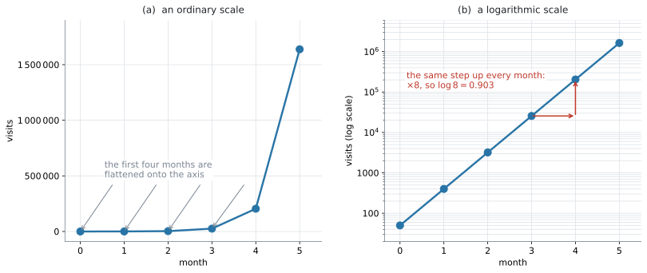
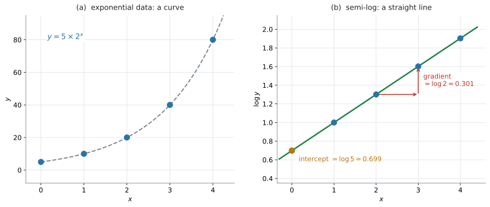
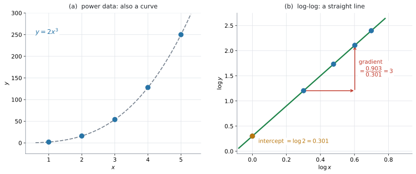

# AHL 2.10 — Log–log and semi-log scaling（対数目盛りと線形化） {#sec-ahl-2-10}

::: {.callout-note}
## What you should be able to do
- 桁の大きく違うデータに、**対数の目盛り**を使う理由を説明できる。
- **semi-log**（片対数）のグラフが直線なら **exponential**、**log-log**（両対数）のグラフが直線なら **power** の関係だと判断できる。
- データの $\log$ をとって直線にすることを **linearize**（線形化）といい、その手順を実行できる。
- 直線の**傾きと切片**から、元の $y = ka^{x}$ や $y = ax^{n}$ を復元できる。
- $\log$ でも $\ln$ でも線形化できることを知り、**戻すときに底をそろえられる**。
- 傾き・切片の値を、文脈の言葉で解釈できる。
:::

**このページに、新しい公式はありません。** 使うのは [AHL 1.9](../01-number-and-algebra/ahl-1-9.qmd#three-laws) の対数法則 $\log_a xy = \log_a x + \log_a y$、$\log_a x^{m} = m\log_a x$ だけです（公式集にあります）。元の式に戻すときは、これに加えて対数の定義そのもの——$10^{\log x} = x$——を使います（[SL 1.5](../../ai-sl/01-number-and-algebra/sl-1-5.qmd)）。

## The idea

### 1. 桁がちがうデータは、ふつうの目盛りでは読めません {#idea}

あるサイトの月ごとの訪問数が、$50$、$400$、$3200$、$25600$、$204800$、$1638400$ だったとします。**毎月 $8$ 倍**に増えています。

{#fig-ahl210-scale width=100%}

@fig-ahl210-scale の (a) が、ふつうの目盛りでかいたものです。**はじめの $4$ か月が、軸の上にぺしゃんこに潰れています。** $50$ も $400$ も $3200$ も $25600$ も、区別が付きません。

(b) は、縦軸を**対数の目盛り**にしたものです。目盛りが $10$、$100$、$1000$、$10^{4}$、$\ldots$ と、**$10$ 倍ごとに等間隔**になっています。

すると **$6$ 点が一直線に並びます。** しかも、$1$ か月ぶんの上がり幅がどこでも同じです。

$$
\log(8 \times \text{前月}) - \log(\text{前月}) = \log 8 = 0.903
$$

**「毎月 $8$ 倍」という一定の割合が、一定の高さとして目に見える**——これが対数目盛りの働きです。Guidance の言い方はこうです。

> ... where the emphasis of a graph is the rate of growth, rather than the absolute value.

Connections 欄の `exponential graphs that show alarming absolute figures, but reasonable rates of growth` も、同じことを言っています。**数そのものは驚くほど大きくても、増え方は落ち着いている**——それを見せられるのが対数目盛りです。

### 2. semi-log ── $y$ だけ対数をとります {#semi-log}

このページでは、$\log$ は**底 $10$** の対数を表します。$\log_{10}$ の下付きを省いた書き方です（$\ln$ については[第6節](#base)）。

::: {.callout-important}
## 軸の目盛りには、$2$ とおりの書き方があります
同じ「semi-log のグラフ」でも、縦軸の**目盛りの数字**が $2$ とおりあります。

- **元の数を、対数の間隔で並べる** … @fig-ahl210-scale の (b) です。目盛りには $10$、$100$、$1000$ と**元の数**が書いてあります。ただし間隔が等しくありません
- **$\log y$ の値を、ふつうの間隔で並べる** … @fig-ahl210-semilog の (b) です。目盛りには $0.301$、$0.699$ と**対数の値**が書いてあります

**中身は同じもの**です。$1$ つ目は新聞や電卓のグラフ、$2$ つ目は回帰にかけるときの形だと思ってください。

**このページで読むのは、たいてい $2$ つ目**です。**縦軸に $\log_{10} y$ と書いてあったら、そこに書かれている数は $y$ ではありません。** $\log y = 2$ は $y = 100$ という意味です（演習 $5$）。
:::

**semi-log**（片対数）のグラフとは、**横軸が $x$ のまま、縦軸が $\log y$** のグラフです。

指数の関係 $y = ka^{x}$（$k > 0$、$a > 0$）の両辺の $\log$ をとります。$\log y$ を取るので、**$y$ はつねに正でなければなりません**（[AHL 1.9](../01-number-and-algebra/ahl-1-9.qmd#conditions)）。

$$
\log y = \log\left(k a^{x}\right) = \log k + x\log a
$$ {#eq-ahl210-semilog}

**右辺は $x$ の $1$ 次式です。** $\log y$ を縦、$x$ を横に取れば、直線になります（@exm-ahl210-semi）。

$$
\underbrace{\log y}_{\text{縦}} = \underbrace{(\log a)}_{\text{傾き}} \, x + \underbrace{\log k}_{\text{切片}}
$$

{#fig-ahl210-semilog width=100%}

@fig-ahl210-semilog が、$y = 5 \times 2^{x}$ の場合です。(a) では曲線ですが、(b) では**きれいな直線**になります。

- 傾き $= \log 2 = 0.301$
- 切片 $= \log 5 = 0.699$

### 3. log-log ── 両方の対数をとります {#log-log}

**log-log**（両対数）のグラフとは、**横軸が $\log x$、縦軸が $\log y$** のグラフです。

累乗の関係 $y = ax^{n}$（$a > 0$、$x > 0$）の両辺の $\log$ をとります。**両方の $\log$ を取るので、$x$ も $y$ も正でなければなりません。**

$$
\log y = \log\left(a x^{n}\right) = \log a + n\log x
$$ {#eq-ahl210-loglog}

$$
\underbrace{\log y}_{\text{縦}} = \underbrace{n}_{\text{傾き}} \, \underbrace{\log x}_{\text{横}} + \underbrace{\log a}_{\text{切片}}
$$

@eq-ahl210-loglog を使う練習が @exm-ahl210-loglog です。

{#fig-ahl210-loglog width=100%}

@fig-ahl210-loglog が、$y = 2x^{3}$ の場合です。(a) では曲線ですが、(b) では直線になります。**傾きは $3$、切片は $\log 2 = 0.301$** です。

**傾きが指数 $n$ そのものになる**のが、log-log のいちばんの特徴です。

ただし、**縦と横で同じ底の対数を使ったとき**です。$\log_{10} y$ を $\ln x$ に対してかくと、傾きは $n$ になりません。**$2$ つの軸の底をそろえてください**（[第6節](#base)）。

### 4. どちらが直線になるかで、モデルが決まります {#which}

Content 欄の $2$ 行目が求めているのは、これです。

> Linearizing data using logarithms to determine if the data has an exponential or a power relationship ...

| 直線になるグラフ | 元の関係 | 傾き | 切片 |
|:--|:--|:--|:--|
| **semi-log**（$\log y$ 対 $x$） | $y = ka^{x}$（exponential） | $\log a$ | $\log k$ |
| **log-log**（$\log y$ 対 $\log x$） | $y = ax^{n}$（power） | $n$ | $\log a$ |

: どちらが直線になるか（$x > 0$、$y > 0$、$k > 0$、$a > 0$ のとき） {#tbl-ahl210-which}

覚え方は $1$ つです。

**$x$ が指数の位置にいるなら、$x$ はそのまま。$x$ が底の位置にいるなら、$x$ にも $\log$。**

- $y = k a^{x}$ … $x$ は**指数**の位置 → 横軸は $x$ のまま（semi-log）
- $y = a x^{n}$ … $x$ は**底**の位置 → 横軸も $\log x$（log-log）

::: {.callout-tip}
## $r$ は、どちらがより直線に近いかを比べる材料です
$2$ 通りとも計算して、**Pearson の $\lvert r \rvert$ が $1$ に近いほう**が、より直線に近いといえます。Guidance が `Link to: ... Pearson's product moment correlation coefficient (SL 4.4)` と書いているのは、このためです。

演習 $6$ のデータでは、log-log で $r = 1.000$、semi-log で $r = 0.959$ です。**どちらもそれなりに高い**ので、$2$ つを出して**比べる**必要があります。

$r$ が言えることと、言えないことを分けておきます。

- **$\lvert r \rvert$ が $1$ に近い** … 変換したあとの点が、直線に近く並んでいる
- **それだけでは**、元のデータが本当に exponential model や power model に従うとは**断定できません**
- 判断には、**散布図の形、residual（残差）の並び方、文脈、変数の意味**も要ります
- このページでは、$r$ を **semi-log と log-log のどちらがより直線に近いかを比べる補助**として使います

反例を $1$ つ挙げます。$y = x^{2}+40$ のようなデータでは semi-log の $r = 0.997$、log-log の $r = 0.925$ となり、$r$ で選ぶと exponential になりますが、**実際にはどちらのモデルでもありません。** [AHL 4.13](../04-statistics-and-probability/ahl-4-13.qmd#choosing) と同じ注意です。**散布図の形と文脈を先に見て、$r$ はそのあとの裏づけに使ってください。**

$r$ の意味は [SL 4.4](../../ai-sl/04-statistics-and-probability/sl-4-4.qmd#pearson-r) にあります。
:::

### 5. 傾きと切片から、元の式に戻します {#back}

ここが、この項目でいちばん使う操作です。**$\log$ を外すには、$10$ を底に乗せます。**

**semi-log** の直線が $\log y = mx + c$ のとき、

$$
y = 10^{mx+c} = 10^{c} \times \left(10^{m}\right)^{x}
$$ {#eq-ahl210-back-semi}

@tbl-ahl210-which と見くらべて

$$
k = 10^{c}, \qquad a = 10^{m}
$$

**log-log** の直線が $\log y = m\log x + c$ のとき、

$$
y = 10^{m\log x + c} = 10^{c} \times \left(10^{\log x}\right)^{m} = 10^{c} \, x^{m}
$$ {#eq-ahl210-back-log}

$$
a = 10^{c}, \qquad n = m
$$

::: {.callout-warning}
## 傾きをそのまま $a$ や $k$ にしないでください
semi-log の傾きが $0.3$ でも、**増え方は $0.3$ 倍ではありません。**

$$
a = 10^{0.3} = 2.00
$$

**約 $2$ 倍**です。切片も同じで、$c = 1.8$ なら $k = 10^{1.8} = 63.1$ であって、$1.8$ ではありません。

**$\log$ の世界の数を、そのまま元の世界に持ち出さない。** これがこの項目の最大の注意点です（演習 $10$）。
:::

### 6. $\log$ でも $\ln$ でも構いません {#base}

線形化は、**どの底の対数でもできます。** [AHL 1.9](../01-number-and-algebra/ahl-1-9.qmd#log-ln) のとおり、法則は底によらないからです。

$\ln$ を使うと、@eq-ahl210-semilog は

$$
\ln y = \ln k + x\ln a
$$

になります。直線であることは変わりませんが、**傾きと切片の値が変わります。**

| 使った対数 | semi-log の傾き | 元に戻すとき |
|:--|:--|:--|
| $\log$（底 $10$） | $\log a$ | $a = 10^{m}$ |
| $\ln$（底 $e$） | $\ln a$ | $a = e^{m}$ |

: 底をそろえてください {#tbl-ahl210-base}

@tbl-ahl210-base のとおりです。**$\ln$ で線形化したのに $10^{m}$ で戻す**——これがよくある誤りです。**$\ln$ で取ったなら $e$ で戻す**、と覚えてください（演習 $8$）。

$\ln$ を使うと、指数の形が $e$ の形で出るという利点があります。

$$
\ln y = mx + c \ \Longrightarrow \ y = e^{c}e^{mx}
$$

[AHL 2.9a](ahl-2-9a.qmd#half-life) の $M = M_0e^{-kt}$ と直接つながる形です。

### 7. 手順は $3$ 段階です {#steps}

データを渡されたときにやることは、いつも同じです。

1. **$\log$ の列を作る**（semi-log なら $\log y$ だけ、log-log なら $\log x$ と $\log y$）
2. **直線回帰をかける**（[SL 4.4](../../ai-sl/04-statistics-and-probability/sl-4-4.qmd#gdc-regression) と同じ操作）。$m$、$c$、$r$ が出ます
3. **@eq-ahl210-back-semi か @eq-ahl210-back-log で元に戻す**

$2$ 段目までは電卓に任せられます。**$3$ 段目だけは、自分で $10^{c}$ を計算します**（[GDC](#gdc-back)）。

::: {.callout-important}
## 丸めるのは、いちばん最後だけです
$m$ と $c$ を $3$ 桁に丸めてから $10^{c}$ を計算すると、答えがずれます。$c = 2.07857$ を $2.08$ にすると

$$
10^{2.07857} = 119.8, \qquad 10^{2.08} = 120.2
$$

**指数の中の小さなずれが、外に出ると大きくなります。** 電卓の中の値のまま進めてください（@exm-ahl210-bacteria）。
:::

### 8. AHL 4.13 との使い分け {#vs-413}

[AHL 4.13](../04-statistics-and-probability/ahl-4-13.qmd#gdc-curve) では、電卓に **Exponential Regression** や **Power Regression** を直接かけました。**同じ答えが出るのに、なぜ $2$ つあるのでしょうか。**

| | AHL 2.10（このページ） | [AHL 4.13](../04-statistics-and-probability/ahl-4-13.qmd) |
|:--|:--|:--|
| やること | $\log$ を取って**直線**にする | 電卓に**曲線**を当てはめさせる |
| 電卓の操作 | Linear Regression | Exponential / Power Regression |
| 見るもの | 直線の傾きと切片、$r$ | $a$、$b$、$R^{2}$ |
| 分かること | **どの形の関係か**を見分けられる | 当てはめた曲線の式 |

: $2$ つのやり方 {#tbl-ahl210-vs}

@tbl-ahl210-vs のとおり、**AHL 2.10 の強みは、$2$ つの候補を同じものさしで比べられることです。** semi-log と log-log は、どちらも**縦軸が $\log y$** です。ですから $r$ を並べて比べるのが公平です。

AHL 4.13 の Exponential / Power Regression でも比べられますが、返ってくる $R^{2}$ の出し方が機種やモデルによって違うので、比べ方に注意が要ります（[AHL 4.13](../04-statistics-and-probability/ahl-4-13.qmd#gdc-curve) の注意）。

**答えの式は、ふつうよく似た値になります**が、**まったく同じとはかぎりません。** 対数を取ってから直線を当てはめるのは「$\log y$ のずれ」を小さくすることで、$y$ そのもののずれを小さくするのとは別だからです。試験でこの違いを問われることはありません。

## Why it works

:::: {.callout-note collapse="true" appearance="simple"}
## クリックすると開きます
**なぜ $\log$ を取ると直線になるのか。** 使うのは [AHL 1.9](../01-number-and-algebra/ahl-1-9.qmd#three-laws) の $2$ つの法則だけです。

$$
\log xy = \log x + \log y, \qquad \log x^{m} = m\log x
$$

**指数の場合**を見ます。$y = ka^{x}$ の両辺に $\log$ をかけます。

$$
\log y = \log\left(k \cdot a^{x}\right)
$$

$1$ つ目の法則で、掛け算が足し算になります。

$$
\log y = \log k + \log a^{x}
$$

$2$ つ目の法則で、指数が前に出ます。

$$
\log y = \log k + x\log a
$$

**$\log k$ も $\log a$ も、ただの数です。** $x$ が動いても変わりません。ですから、これは

$$
(\text{縦}) = (\text{定数}) \times (\text{横}) + (\text{定数})
$$

の形——**直線の式**です。

**累乗の場合**も同じ流れです。$y = ax^{n}$ で

$$
\log y = \log a + \log x^{n} = \log a + n\log x
$$

こちらは、右辺に **$\log x$** が残ります。だから**横軸も $\log x$** にしないと直線になりません。

**$2$ つの違いは、$x$ が式のどこにいたかだけです。**

- $a^{x}$ … $x$ は指数 → $2$ つ目の法則で**そのまま前に出る** → 横軸は $x$
- $x^{n}$ … $x$ は底 → $2$ つ目の法則で出るのは $n$ のほう → **$\log x$ が残る** → 横軸は $\log x$

**逆に、直線になったという事実から、元の関係が言えます。** semi-log が直線なら、$\log y = mx+c$ が成り立っているので、$10$ を乗せて

$$
y = 10^{mx+c} = 10^{c}\left(10^{m}\right)^{x}
$$

これは $y = ka^{x}$ の形です。**「semi-log がぴったり直線になった」＝「$y = ka^{x}$ の形である」**（$y > 0$ のとき）というのは、この計算を逆にたどっているだけです。

**「指数っぽい」だけでは足りません。** $y = 3 + 2^{x}$ のように**定数が足されている**式は、$\log$ を取っても直線になりません（$x = 0$ から $7$ で $r = 0.989$——直線に見えてしまう程度には高い値です）。
::::

## Worked examples

::: {.callout-note appearance="simple"}
問題文は英語です。意味が理解できなかったら、問題文の下の「**日本語訳**」を開いてください。解説は日本語です。
:::

::: {#exm-ahl210-semi}
[The graph of $\log_{10} y$ against $x$ is a straight line with gradient $0.25$ and $y$-intercept $1.8$.]{.q-en}

**(a)** [Write down an equation for $\log_{10} y$ in terms of $x$.]{.q-en}

**(b)** [Find an expression for $y$ in terms of $x$.]{.q-en}

**(c)** [Find the value of $y$ when $x = 6$.]{.q-en}

<details class="jp-trans">
<summary>日本語訳</summary>

$\log_{10} y$ を $x$ に対してかいたグラフが、傾き $0.25$、$y$ 切片 $1.8$ の直線になります。

**(a)** $\log_{10} y$ を $x$ で表す式を書きなさい。

**(b)** $y$ を $x$ で表す式を求めなさい。

**(c)** $x = 6$ のときの $y$ の値を求めなさい。

</details>

---

**(a)** 直線なので $y = mx+c$ の形です。縦は $\log y$ です。

$$
\log y = 0.25x + 1.8
$$

**(b)** @eq-ahl210-back-semi です。$10$ を両辺に乗せます。

$$
y = 10^{0.25x+1.8} = 10^{1.8} \times \left(10^{0.25}\right)^{x}
$$

$$
10^{1.8} = 63.0957\ldots, \qquad 10^{0.25} = 1.77827\ldots
$$

$$
y = 63.1 \times 1.78^{x}
$$

**傾きの $0.25$ をそのまま使わないでください**（[第5節](#back)）。増え方は $1.78$ 倍です。

**(c)** **(a) の式のほうが速い**です。$\log$ の世界で計算してから、最後に戻します。

$$
\log y = 0.25(6) + 1.8 = 1.5 + 1.8 = 3.3
$$

$$
y = 10^{3.3} = 1995.26\ldots = 2000 \ (3\ \text{s.f.})
$$

**検算。** (b) の式でも出します。$63.0957 \times 1.778279^{6} = 1995.26\ldots$ ✓ 一致しました。

丸めた $63.1 \times 1.78^{6}$ で計算すると $2007$ になります。**丸めた値を使わないでください**（[第7節](#steps)）。

::: {.callout-note}
## 解答例（答案用紙にはこう書く）
**(a)**
$$\log_{10} y = 0.25x + 1.8$$

**(b)**
$$y = 10^{0.25x+1.8} = 10^{1.8}\left(10^{0.25}\right)^{x} = 63.1 \times 1.78^{x}$$

**(c)**
$$\log_{10} y = 0.25(6)+1.8 = 3.3 \ \Rightarrow \ y = 10^{3.3} = 1995.26\ldots = 2000 \ (3\ \text{s.f.})$$
:::
:::

::: {#exm-ahl210-loglog}
[For $x > 0$, the graph of $\log_{10} y$ against $\log_{10} x$ is a straight line with gradient $1.5$ and $y$-intercept $0.6$.]{.q-en}

**(a)** [Show that $y = ax^{n}$ for constants $a$ and $n$, and state their values.]{.q-en}

**(b)** [Find the value of $y$ when $x = 16$.]{.q-en}

<details class="jp-trans">
<summary>日本語訳</summary>

$\log_{10} y$ を $\log_{10} x$ に対してかいたグラフが、傾き $1.5$、$y$ 切片 $0.6$ の直線になります。

**(a)** $y = ax^{n}$（$a$、$n$ は定数）の形になることを示し、その値を述べなさい。

**(b)** $x = 16$ のときの $y$ の値を求めなさい。

</details>

---

**(a)** 直線の式を書きます。**横軸が $\log x$** であることに注意してください。

$$
\log y = 1.5\log x + 0.6
$$

$1.5\log x = \log x^{1.5}$ です（[AHL 1.9](../01-number-and-algebra/ahl-1-9.qmd#three-laws)）。

$$
\log y = \log x^{1.5} + 0.6
$$

$10$ を乗せます。

$$
y = 10^{0.6} \times x^{1.5}
$$

$10^{0.6} = 3.98107\ldots$ なので

$$
a = 3.98, \qquad n = 1.5
$$

**傾きが、そのまま指数 $n$ になります**（@tbl-ahl210-which）。切片のほうだけ $10$ を乗せます。

**(b)** $\log$ の世界で計算します。$\log 16 = 1.20412\ldots$ なので

$$
\log y = 1.5(1.20412) + 0.6 = 1.80618 + 0.6 = 2.40618
$$

$$
y = 10^{2.40618} = 254.79\ldots = 255
$$

**検算。** $3.981072 \times 16^{1.5} = 3.981072 \times 64 = 254.79\ldots$ ✓ $16^{1.5} = 16 \times \sqrt{16} = 64$ です（[AHL 1.10](../01-number-and-algebra/ahl-1-10.qmd)）。

::: {.callout-note}
## 解答例（答案用紙にはこう書く）
**(a)**
$$\log_{10} y = 1.5\log_{10} x + 0.6 = \log_{10} x^{1.5} + 0.6$$
$$y = 10^{0.6}x^{1.5}$$
*So $a = 3.98$ and $n = 1.5$.*

**(b)**
$$\log_{10} y = 1.5\log_{10} 16 + 0.6 = 2.40618 \ \Rightarrow \ y = 255$$
:::
:::

::: {#exm-ahl210-bacteria}
[A biologist counts the bacteria in a dish once an hour. The results are shown below.]{.q-en}

| $t$ (hours) | $0$ | $1$ | $2$ | $3$ | $4$ |
|:--|:--|:--|:--|:--|:--|
| $N$ | $120$ | $190$ | $305$ | $480$ | $770$ |

**(a)** [Complete a table of values of $\log_{10} N$, giving each value correct to $4$ decimal places.]{.q-en}

**(b)** [The graph of $\log_{10} N$ against $t$ is close to a straight line. Find the equation of the regression line of $\log_{10} N$ on $t$.]{.q-en}

**(c)** [Hence find a model of the form $N = k a^{t}$.]{.q-en}

**(d)** [Interpret the value of $a$ in this context.]{.q-en}

<details class="jp-trans">
<summary>日本語訳</summary>

ある生物学者が、シャーレの中の細菌を $1$ 時間おきに数えました。結果は上の表のとおりです。

**(a)** $\log_{10} N$ の値の表を完成させなさい。各値は小数第 $4$ 位まで答えなさい。

**(b)** $\log_{10} N$ を $t$ に対してかいたグラフは、ほぼ直線になります。$\log_{10} N$ の $t$ への回帰直線の式を求めなさい。

**(c)** これを用いて、$N = k a^{t}$ の形のモデルを求めなさい。

**(d)** この文脈で $a$ の値を解釈しなさい。

</details>

---

**(a)** 電卓の $C$ 列に、まとめて出します（[GDC](#gdc-columns)）。

| $t$ | $0$ | $1$ | $2$ | $3$ | $4$ |
|:--|:--|:--|:--|:--|:--|
| $\log_{10} N$ | $2.0792$ | $2.2788$ | $2.4843$ | $2.6812$ | $2.8865$ |

: $\log_{10} N$ の値 {#tbl-ahl210-logN}

@tbl-ahl210-logN で**差がほぼ一定（約 $0.20$）**であることに気づけば、この時点で直線だと見当が付きます。

**(b)** $t$ を $x$、$\log N$ を $y$ として直線回帰をかけます（[GDC](#gdc-linreg)）。

$$
\log_{10} N = 0.20171 t + 2.07857
$$

$r = 0.99998$ で、直線に非常に近いことが分かります。

**(c)** @eq-ahl210-back-semi です。

$$
N = 10^{2.07857} \times \left(10^{0.20171}\right)^{t}
$$

$$
10^{2.07857} = 119.83\ldots, \qquad 10^{0.20171} = 1.5911\ldots
$$

$$
N = 120 \times 1.59^{t}
$$

**検算。** $t = 4$ を入れます。$119.83 \times 1.5911^{4} = 768.0$ で、実際の $770$ に近い値です ✓

**(d)** `Interpret` なので、**文脈の言葉**で答えます。

::: {.model-answer}
**試験ではこう書く**

*The value $a = 1.59$ is the growth factor per hour: according to the model, the number of bacteria is multiplied by about $1.59$ each hour, an increase of about $59\%$ per hour. It is the same factor at every stage, which is why the semi-log graph is a straight line.*
:::

（$a = 1.59$ は $1$ 時間あたりの growth factor（増加倍率）である。このモデルによれば、細菌の数は $1$ 時間ごとに約 $1.59$ 倍、つまり $1$ 時間あたり約 $59\%$ 増える。どの時点でも同じ倍率であり、それが semi-log のグラフが直線になる理由である、という意味です。）

::: {.callout-note}
## 解答例（答案用紙にはこう書く）
**(a)** $2.0792$, $2.2788$, $2.4843$, $2.6812$, $2.8865$

**(b)**
$$\log_{10} N = 0.202t + 2.08 \qquad (r = 0.99998)$$

**(c)**
$$N = 10^{2.07857}\left(10^{0.20171}\right)^{t} = 120 \times 1.59^{t}$$

**(d)**
*$a = 1.59$ is the growth factor per hour: the number of bacteria is multiplied by about $1.59$, that is, it grows by about $59\%$, each hour.*
:::
:::

::: {#exm-ahl210-planets}
[The table shows the mean distance $d$ from the Sun, in astronomical units, and the orbital period $T$, in years, of six planets.]{.q-en}

| planet | Mercury | Venus | Earth | Mars | Jupiter | Saturn |
|:--|:--|:--|:--|:--|:--|:--|
| $d$ | $0.387$ | $0.723$ | $1.000$ | $1.524$ | $5.203$ | $9.537$ |
| $T$ | $0.241$ | $0.615$ | $1.000$ | $1.881$ | $11.86$ | $29.45$ |

**(a)** [The graph of $\log_{10} T$ against $\log_{10} d$ is a straight line. Find the equation of the regression line, giving the gradient and the intercept correct to $3$ significant figures.]{.q-en}

**(b)** [Hence write down a model of the form $T = a d^{n}$.]{.q-en}

**(c)** [Uranus has $d = 19.19$. Use the model to predict its orbital period.]{.q-en}

**(d)** [Comment on what the value of $n$ tells you about the relationship between $d$ and $T$.]{.q-en}

<details class="jp-trans">
<summary>日本語訳</summary>

表は、$6$ つの惑星について、太陽からの平均距離 $d$（天文単位）と公転周期 $T$（年）を示しています。

**(a)** $\log_{10} T$ を $\log_{10} d$ に対してかいたグラフは直線になります。回帰直線の式を求めなさい。傾きと切片は有効数字 $3$ 桁で答えなさい。

**(b)** これを用いて、$T = a d^{n}$ の形のモデルを書きなさい。

**(c)** 天王星は $d = 19.19$ です。このモデルを使って公転周期を予測しなさい。

**(d)** $n$ の値が $d$ と $T$ の関係について何を示しているか、コメントしなさい。

</details>

---

**(a)** **両方**の $\log$ を取ります（log-log）。$d$ と $T$ が、どちらも $0.2$ から $30$ まで大きく変わるからです。

$$
\log_{10} T = 1.50\log_{10} d + 0.000114
$$

$r = 1.000$ です。**これ以上ないほど直線に近い**といえます。

**(b)** 切片が $0.000114$ なので、$10^{0.000114} = 1.0003$——ほぼ $1$ です。

$$
T = 10^{0.000114} \times d^{1.49963} = 1.00 \times d^{1.50}
$$

$$
T = d^{1.5}
$$

**(c)** $\log$ の世界で計算します。$\log 19.19 = 1.28307\ldots$ なので

$$
\log T = 1.49963(1.28307) + 0.000114 = 1.92424\ldots
$$

$$
T = 10^{1.92424} = 84.0 \text{ 年}
$$

**検算。** $19.19^{1.5} = 19.19 \times \sqrt{19.19} = 19.19 \times 4.3806 = 84.06$ ✓ ほぼ同じです。

**(d)** `Comment on` なので、**言葉で**答えます。

$n = 1.5 = \dfrac{3}{2}$ です。$T = d^{\frac{3}{2}}$ の両辺を $2$ 乗すると $T^{2} = d^{3}$ になります。

::: {.model-answer}
**試験ではこう書く**

*The gradient $n = 1.50$ means that $T$ is proportional to $d^{1.5}$, that is, $T = d^{\frac{3}{2}}$. Squaring both sides gives $T^{2} = d^{3}$: the square of the orbital period is proportional to the cube of the mean distance. Because $r = 1.000$, the points lie almost exactly on a straight line on the log-log graph, so a power model fits this data extremely well. A semi-log graph of the same data gives only $r = 0.940$, so the power model is the better of the two.*
:::

（傾き $n = 1.50$ は、$T$ が $d^{1.5}$ に比例する、つまり $T = d^{\frac{3}{2}}$ であることを示している。両辺を $2$ 乗すると $T^2 = d^3$ となり、公転周期の $2$ 乗が平均距離の $3$ 乗に比例する。$r = 1.000$ なので log-log のグラフはほぼ完全な直線であり、累乗のモデルがこのデータに非常によく合う。同じデータの semi-log では $r = 0.940$ にとどまるので、$2$ つのうちでは累乗のほうがよい、という意味です。）

::: {.callout-note}
## 解答例（答案用紙にはこう書く）
**(a)**
$$\log_{10} T = 1.50\log_{10} d + 0.000114 \qquad (r = 1.000)$$

**(b)**
$$T = 10^{0.000114}d^{1.49963} = d^{1.50}$$

**(c)**
$$\log_{10} T = 1.49963\log_{10}(19.19) + 0.000114 = 1.92424$$
$$T = 10^{1.92424} = 84.0 \text{ years}$$

**(d)**
*$n = 1.5$ means $T = d^{\frac{3}{2}}$, so $T^{2} = d^{3}$: the square of the period is proportional to the cube of the distance.*
:::
:::

## Common errors

::: {.callout-warning}
## 傾きや切片を、そのまま $a$ や $k$ として書く
semi-log の直線が $\log y = 0.3x + 1.8$ のとき、

$$
y = 0.3x + 1.8 \qquad \text{や} \qquad y = 1.8 \times 0.3^{x}
$$

と書いてしまう誤りです。**どちらも違います。** 正しくは

$$
y = 10^{1.8}\left(10^{0.3}\right)^{x} = 63.1 \times 2.00^{x}
$$

**$\log$ の世界の数は、$10$ を乗せてから元の世界に持ち出します**（[第5節](#back)、演習 $10$）。
:::

::: {.callout-warning}
## $\ln$ で取って、$10$ で戻す
$\ln y = 0.25x + 3$ を $y = 10^{3}\left(10^{0.25}\right)^{x}$ としてしまう誤りです。

**$\ln$ で取ったなら、$e$ で戻します。**

$$
y = e^{3}\left(e^{0.25}\right)^{x} = 20.1 \times 1.28^{x}
$$

$10^{3} = 1000$ と $e^{3} = 20.1$ では、$50$ 倍近く違います（[第6節](#base)、演習 $8$）。
:::

::: {.callout-warning}
## semi-log と log-log を取り違える
$y = 5x^{3}$ のデータに semi-log をかけても、直線にはなりません。

**$x$ が指数の位置にいるか、底の位置にいるか**を見てください（[第4節](#which)）。

- $a^{x}$ の形 → semi-log
- $x^{n}$ の形 → log-log

どちらか分からないときは、**両方かけて $r$ を比べます。** ただし、$r$ が高いだけでは足りません。散布図の形も見てください（[第4節](#which)）。
:::

::: {.callout-warning}
## 途中で $m$ や $c$ を丸める
$c = 2.07857$ を $2.08$ に丸めてから $10^{c}$ を計算すると、$119.8$ が $120.2$ になります。

**指数の中の $0.0014$ が、外では $0.4$ になります。** 桁が大きいほど、この差は広がります。

$3$ 桁に丸めるのは、**最後の答えだけ**にしてください（[第7節](#steps)、@exm-ahl210-bacteria）。
:::

::: {.callout-warning}
## 対数目盛りの上で「直線だから比例」と読む
対数目盛りのグラフで直線でも、**$y$ と $x$ が比例しているわけではありません。**

semi-log で直線 → **一定の割合で増える、または減る**（指数）。向きは傾きの符号で決まります
log-log で直線 → **累乗の関係**

@fig-ahl210-scale の (b) は直線ですが、訪問数は毎月 $8$ **倍**です。$1$ 次関数ではありません（[第1節](#idea)）。
:::

## Using your GDC (TI-Nspire CX II)

### 1. $\log$ の列を作ります {#gdc-columns}

```
ctrl + doc → Add Lists & Spreadsheet
```

$A$ 列に $t$、$B$ 列に $N$ を入れて、いちばん上の名前の行に `t` と `n` と打ちます。

$C$ 列の**名前の下にある灰色の式の行**に、

```
=log(b[])
```

と入れます。`b[]` は「$B$ 列全体」という意味です。**$1$ つずつ計算する必要はありません。** $C$ 列に $\log N$ が並びます。

log-log なら、$D$ 列にも同じように `=log(a[])` を入れます。

::: {.callout-tip}
## 列に名前を付けておいてください
名前を付けておくと、回帰の画面で選びやすくなります。`logn`、`logt` のように、中身が分かる名前にしてください。

$4$ 桁で答えよと言われたら、表示されている値を**そこから $4$ 桁に丸めて**書きます。列に入っている値そのものは丸められていませんが、**画面の表示は `Document Settings` の `Display Digits` の設定で決まります。**

桁が足りないと感じたら、`doc → Settings → Document Settings` で `Display Digits` を `Float 6` 以上にしてください。
:::

### 2. 直線回帰をかけます {#gdc-linreg}

```
menu → Statistics → Stat Calculations → Linear Regression (mx+b)
```

[SL 4.4](../../ai-sl/04-statistics-and-probability/sl-4-4.qmd#gdc-regression) と同じ操作です。

| 欄 | semi-log のとき | log-log のとき |
|:--|:--|:--|
| `X List` | $t$ の列 | $\log t$ の列 |
| `Y List` | $\log N$ の列 | $\log N$ の列 |

: 何を入れるか {#tbl-ahl210-gdc}

@tbl-ahl210-gdc のとおりに入れると、`m`（傾き）、`b`（切片）、`r` が返ります。**`Linear Regression (a+bx)` のほうを選ぶと $a$ と $b$ が逆**になるので、気をつけてください（[SL 4.4](../../ai-sl/04-statistics-and-probability/sl-4-4.qmd#gdc-regression)）。

### 3. 元の式に戻します {#gdc-back}

**ここだけは、自分でやります。** 電卓は $\log$ の世界の直線しか返しません。

Calculator ページで

- $10^{2.07857}$
- $10^{0.20171}$

と打つと、$119.83$ と $1.5911$ が出ます。

**丸めずにやる方法**もあります。回帰のあと、電卓には `stat.m` と `stat.b` という変数が残っています。

- $10^{\texttt{stat.b}}$
- $10^{\texttt{stat.m}}$

と打てば、丸めのない値がそのまま使えます（[第7節](#steps)）。

::: {.callout-warning}
## `stat.m` と `stat.b` は、上書きされます
回帰をもう $1$ 回かけると、`stat.m` と `stat.b` の中身は**新しいほうに入れかわります。**

semi-log と log-log を両方かけたときは、**使いたいほうを最後にかけ直してから** $10^{\texttt{stat.b}}$ を打ってください。
:::

### 4. $r$ で、どちらが直線に近いかを比べます {#gdc-r}

semi-log と log-log の**両方**をかけて、$r$ を比べます（$x$ の値がすべて正のときにかぎります）。

- $\lvert r \rvert$ が $1$ に近いほう … **そちらのほうが直線に近い**。モデルの断定は、散布図の形と文脈で裏づけてからです（[第4節](#which)）
- どちらも $1$ に近い … データの範囲が狭いのかもしれません。**$r$ の差だけで決めつけないでください**

演習 $6$ のデータでは、log-log が $1.000$、semi-log が $0.959$ です。**差がはっきりしています。**

::: {.callout-warning}
## $\log$ の列に $0$ や負の数が入っていないか確かめてください
$\log 0$ も $\log(\text{負})$ も定義されません。データに $0$ があると、その行だけ空欄になるか、エラーになります（[AHL 1.9](../01-number-and-algebra/ahl-1-9.qmd#conditions)）。

**semi-log なら $t = 0$ は構いません。** $\log$ を取るのは $N$ の列だけだからです。

**log-log では $t = 0$ が使えません。** $\log t$ の列を作る必要があるからです。@exm-ahl210-bacteria のように $t$ が $0$ から始まるデータでは、log-log はそもそもかけられません。**「両方かけて比べる」が使えるのは、$x$ の値がすべて正のとき**です。
:::

### 5. 検算のしかた {#gdc-check}

- 元の式に戻したら、**データの点を $1$ つ代入**して、実際の値に近いか見る
- $\log$ の列の**差**を見る。semi-log で差がほぼ一定なら、直線です
- $r$ を **$2$ 通りとも**出して、比べる
- 予測値を出したら、**$\log$ の世界の計算と、元の式の計算の両方**でやって突き合わせる（@exm-ahl210-planets の (c)）

$1$ つ目がいちばん確実です。**データに戻せなければ、どこかで $10$ の乗せ方を間違えています。**

## Exercises

::: {.callout-note appearance="simple"}
各問題に、折りたたみが3つ付いています。**日本語訳**、**解答例**（答案用紙に書くべきこと。英語です）、**解説**（なぜそうなるか。日本語です）。

まず自分で解いて、次に解答例と見くらべてください。**解説は、合わなかったときだけ開けば十分です。**
:::

::: {.exercise-block}

[1]{.ex-no} [The graph of $\log_{10} y$ against $x$ is a straight line with equation $\log_{10} y = 0.4x + 1.2$. Find an expression for $y$ in terms of $x$.]{.q-en}

<details class="jp-trans">
<summary>日本語訳</summary>

$\log_{10} y$ を $x$ に対してかいたグラフが、$\log_{10} y = 0.4x + 1.2$ という直線になります。$y$ を $x$ で表す式を求めなさい。

</details>

::: {.callout-note collapse="true"}
## 解答例（答案用紙に書くこと）

$$y = 10^{0.4x+1.2} = 10^{1.2}\left(10^{0.4}\right)^{x}$$

$$y = 15.8 \times 2.51^{x}$$
:::

::: {.callout-tip collapse="true"}
## 解説

@eq-ahl210-back-semi です。$10^{1.2} = 15.8489\ldots$、$10^{0.4} = 2.51188\ldots$。

**$0.4$ をそのまま底にしないでください**（[Common errors](#common-errors) の $1$ つ目）。$0.4^{x}$ なら減っていく式になり、意味が逆になります。

**検算。** $x = 1$ を入れます。式では $15.8489 \times 2.51188 = 39.8$。もとの直線では $\log y = 0.4(1)+1.2 = 1.6$、すなわち $y = 10^{1.6} = 39.8$ ✓

**$x = 0$ で確かめても足りません。** $x = 0$ では底が何であっても $15.8489$ になるので、$0.4^{x}$ と書く誤りを見つけられないからです。
:::

::: {.ex-sep}
:::

[2]{.ex-no} [For $x > 0$, the graph of $\log_{10} y$ against $\log_{10} x$ is a straight line with equation $\log_{10} y = 2\log_{10} x - 0.5$. Find an expression for $y$ in terms of $x$.]{.q-en}

<details class="jp-trans">
<summary>日本語訳</summary>

$\log_{10} y$ を $\log_{10} x$ に対してかいたグラフが、$\log_{10} y = 2\log_{10} x - 0.5$ という直線になります。$y$ を $x$ で表す式を求めなさい。

</details>

::: {.callout-note collapse="true"}
## 解答例（答案用紙に書くこと）

$$\log_{10} y = \log_{10} x^{2} - 0.5$$

$$y = 10^{-0.5}x^{2} = 0.316x^{2}$$
:::

::: {.callout-tip collapse="true"}
## 解説

log-log なので、**傾きがそのまま指数**です（@tbl-ahl210-which）。$n = 2$。

切片のほうだけ $10$ を乗せます。$10^{-0.5} = \dfrac{1}{\sqrt{10}} = 0.31623\ldots$。

**マイナスの切片でも、やることは同じ**です。$10^{-0.5}$ は $1$ より小さい数になります。

**検算。** $x = 10$ を入れます。式では $0.31623 \times 100 = 31.623$。直線では $\log y = 2(1) - 0.5 = 1.5$ すなわち $y = 10^{1.5} = 31.623$ ✓
:::

::: {.ex-sep}
:::

[3]{.ex-no} [For the relationship $y = 7 \times 4^{x}$, state which of a log-log graph or a semi-log graph would give a straight line, and write down the gradient of that line.]{.q-en}

<details class="jp-trans">
<summary>日本語訳</summary>

関係 $y = 7 \times 4^{x}$ について、log-log と semi-log のどちらのグラフが直線になるかを述べ、その直線の傾きを書きなさい。

</details>

::: {.callout-note collapse="true"}
## 解答例（答案用紙に書くこと）

*A semi-log graph ($\log_{10} y$ against $x$) gives a straight line.*

$$\log_{10} y = \log_{10} 7 + x\log_{10} 4$$

*The gradient is $\log_{10} 4 = 0.602$.*
:::

::: {.callout-tip collapse="true"}
## 解説

$x$ が**指数の位置**にいるので semi-log です（[第4節](#which)）。

傾きは $\log 4 = 0.60206\ldots$。**$4$ ではありません。**

$\log$ を取った式を $1$ 行書いておくと、傾きと切片がそのまま読めます。

**検算。** $x = 0$ と $x = 1$ で確かめます。$y$ は $7$ から $28$ になり、$\log y$ は $0.8451$ から $1.4472$。差は $0.6021$ ✓ 傾きと一致しました。
:::

::: {.ex-sep}
:::

[4]{.ex-no} [For the relationship $y = 6x^{-2}$, where $x > 0$, state which of a log-log graph or a semi-log graph would give a straight line, and write down the gradient of that line.]{.q-en}

<details class="jp-trans">
<summary>日本語訳</summary>

関係 $y = 6x^{-2}$ について、log-log と semi-log のどちらのグラフが直線になるかを述べ、その直線の傾きを書きなさい。

</details>

::: {.callout-note collapse="true"}
## 解答例（答案用紙に書くこと）

*A log-log graph ($\log_{10} y$ against $\log_{10} x$) gives a straight line.*

$$\log_{10} y = \log_{10} 6 - 2\log_{10} x$$

*The gradient is $-2$.*
:::

::: {.callout-tip collapse="true"}
## 解説

$x$ が**底の位置**にいるので log-log です。

傾きは指数そのもので、$-2$。**負の指数でも同じ**です。$10$ を乗せる必要はありません。

**傾きが負なので、右下がりの直線**になります。$x$ が増えると $y$ は減るからです。

**検算。** $x = 1$ で $y = 6$、$x = 10$ で $y = 0.06$。$\log y$ は $0.7782$ から $-1.2218$ で、$\log x$ が $0$ から $1$ に増えるあいだに $-2$ 変わっています ✓
:::

::: {.ex-sep}
:::

[5]{.ex-no} [The graph of $\log_{10} y$ against $x$ is a straight line passing through the points $(2,\ 1.5)$ and $(8,\ 3.3)$. Find an expression for $y$ in terms of $x$.]{.q-en}

<details class="jp-trans">
<summary>日本語訳</summary>

$\log_{10} y$ を $x$ に対してかいたグラフが、点 $(2,\ 1.5)$ と $(8,\ 3.3)$ を通る直線になります。$y$ を $x$ で表す式を求めなさい。

</details>

::: {.callout-note collapse="true"}
## 解答例（答案用紙に書くこと）

$$m = \frac{3.3-1.5}{8-2} = \frac{1.8}{6} = 0.3$$

$$1.5 = 0.3(2) + c \ \Rightarrow \ c = 0.9$$

$$\log_{10} y = 0.3x + 0.9 \ \Rightarrow \ y = 10^{0.9}\left(10^{0.3}\right)^{x} = 7.94 \times 2.00^{x}$$
:::

::: {.callout-tip collapse="true"}
## 解説

まず**ふつうの直線の問題**として傾きと切片を出します（[SL 2.1](../../ai-sl/02-functions/sl-2-1.qmd)）。

**与えられた点の縦座標は $\log y$ の値**です。$(2,\ 1.5)$ は「$x = 2$ のとき $y = 10^{1.5} = 31.6$」という意味であって、「$y = 1.5$」ではありません。

$10^{0.9} = 7.94328\ldots$、$10^{0.3} = 1.99526\ldots$。**$2$ 倍にとても近い**ので、$2$ 倍ずつ増えるモデルだと読めます。

**検算。** $x = 8$ を入れます。直線では $\log y = 0.3(8)+0.9 = 3.3$ すなわち $y = 10^{3.3} = 1995.3$。式では $10^{0.9}\left(10^{0.3}\right)^{8} = 10^{3.3}$ で、同じ値です ✓
:::

::: {.ex-sep}
:::

[6]{.ex-no} [The table shows four data points, together with $\log_{10} x$ and $\log_{10} y$.]{.q-en}

| $x$ | $1$ | $2$ | $4$ | $8$ |
|:--|:--|:--|:--|:--|
| $y$ | $3.00$ | $16.97$ | $96.0$ | $543.06$ |
| $\log_{10} x$ | $0$ | $0.3010$ | $0.6021$ | $0.9031$ |
| $\log_{10} y$ | $0.4771$ | $1.2297$ | $1.9823$ | $2.7348$ |

**(a)** [State, with a reason, whether the data fit an exponential relationship or a power relationship.]{.q-en}

**(b)** [Find a model for $y$ in terms of $x$.]{.q-en}

<details class="jp-trans">
<summary>日本語訳</summary>

表は $4$ 組のデータと、$\log_{10} x$、$\log_{10} y$ の値を示しています。

**(a)** データが exponential の関係と power の関係のどちらに合うかを、理由とともに述べなさい。

**(b)** $y$ を $x$ で表すモデルを求めなさい。

</details>

::: {.callout-note collapse="true"}
## 解答例（答案用紙に書くこと）

**(a)**
*A power relationship. The values of $\log_{10} x$ increase by $0.3010$ each time, and the values of $\log_{10} y$ increase by about $0.7526$ each time, so $\log_{10} y$ against $\log_{10} x$ is a straight line ($r = 1.000$). Against $x$ itself the increases are not constant, so the semi-log graph is not straight ($r = 0.959$).*

**(b)**
$$m = \frac{0.7526}{0.3010} = 2.5, \qquad c = 0.4771$$

$$y = 10^{0.4771}x^{2.5} = 3.00\,x^{2.5}$$
:::

::: {.callout-tip collapse="true"}
## 解説

**(a)** `with a reason` なので、**なぜそう言えるか**を書きます。

表は $x$ が $2$ 倍ずつ（$1, 2, 4, 8$）なので、$\log x$ は**等間隔**です。その上で $\log y$ も等間隔なら、**log-log が直線**です。

$$2.7348 - 1.9823 = 0.7525, \qquad 1.9823 - 1.2297 = 0.7526$$

いっぽう $x$ そのものは $1, 2, 4, 8$ と**等間隔ではありません**。同じ $\log y$ の増え方に対して $x$ の増え方が変わるので、semi-log は直線になりません。

**(b)** 傾きは、**$\log y$ の増分を $\log x$ の増分で割った値**です。切片は $\log x = 0$ のときの $\log y$、つまり $0.4771$。

$10^{0.4771} = 3.0000$ です。

**検算。** $x = 4$ を入れます。$3 \times 4^{2.5} = 3 \times 32 = 96$ ✓ 表と一致しました（$4^{2.5} = 4^{2}\sqrt{4} = 32$）。

::: {.model-answer}
**試験ではこう書く**

*A power relationship. The values of $\log_{10} x$ go up in equal steps of $0.3010$, and the values of $\log_{10} y$ go up in equal steps of about $0.7526$, so the graph of $\log_{10} y$ against $\log_{10} x$ is a straight line, with $r = 1.000$. Plotted against $x$ itself the points are not evenly spaced, so the semi-log graph is not straight and $r$ is only $0.959$. A straight log-log graph means a relationship of the form $y = ax^{n}$.*
:::
:::

::: {.ex-sep}
:::

[7]{.ex-no} [A news article shows a graph of the number of users of an app each month. The vertical axis is labelled $\log_{10}(\text{users})$, and the plotted points lie close to a straight line with a positive gradient. Interpret what this tells you about the growth of the app.]{.q-en}

<details class="jp-trans">
<summary>日本語訳</summary>

あるニュース記事に、アプリの月ごとの利用者数のグラフが載っています。縦軸には $\log_{10}(\text{利用者数})$ と書かれており、点はほぼ、傾きが正の直線の上に並んでいます。これがアプリの成長について何を示しているかを解釈しなさい。

</details>

::: {.callout-note collapse="true"}
## 解答例（答案用紙に書くこと）

*Because $\log_{10}$ of the number of users is plotted against time and the points lie close to a straight line, the growth is approximately exponential: the number of users is multiplied by roughly the same factor each month.*

*A straight line here does not mean that the same number of users is added each month. The gradient $m$ gives the monthly multiplier $10^{m}$, so the number added each month is itself growing.*
:::

::: {.callout-tip collapse="true"}
## 解説

`Interpret` なので、**文脈の言葉**で答えます。言うべきことは $2$ つです。

- 縦が $\log$ で直線 → **exponential な増え方**（[第2節](#semi-log)）
- 直線でも、**毎月同じ人数が増えるという意味ではない**（[Common errors](#common-errors) の $5$ つ目）

**$2$ つ目まで書けると、しっかりした答案になります。** 対数目盛りのグラフを「ふつうのグラフ」として読んでしまうのが、この項目のいちばんの落とし穴です。

Connections 欄が `exponential graphs that show alarming absolute figures, but reasonable rates of growth` と挙げているのも、この読み方の話です。

::: {.model-answer}
**試験ではこう書く**

*Plotting $\log_{10}$ of the number of users against time and obtaining points close to a straight line means the relationship is approximately exponential: the number of users is multiplied by a fixed factor $10^{m}$ each month, where $m$ is the gradient. The growth rate is constant, but the number of new users added each month keeps increasing, so a straight line on this graph does not mean steady, linear growth.*
:::
:::

::: {.ex-sep}
:::

[8]{.ex-no} [A student takes natural logarithms of some data and finds that $\ln y = 0.25x + 3$. Find an expression for $y$ in terms of $x$.]{.q-en}

<details class="jp-trans">
<summary>日本語訳</summary>

ある生徒がデータの自然対数を取り、$\ln y = 0.25x + 3$ となることを見つけました。$y$ を $x$ で表す式を求めなさい。

</details>

::: {.callout-note collapse="true"}
## 解答例（答案用紙に書くこと）

$$y = e^{0.25x+3} = e^{3}\left(e^{0.25}\right)^{x}$$

$$y = 20.1 \times 1.28^{x}$$
:::

::: {.callout-tip collapse="true"}
## 解説

**$\ln$ で取ったので、$e$ で戻します**（[第6節](#base)）。$10$ ではありません。

$e^{3} = 20.0855\ldots$、$e^{0.25} = 1.28403\ldots$。

$y = 20.1e^{0.25x}$ と書いても正しい答えです。$e^{0.25x} = \left(e^{0.25}\right)^{x}$ だからです。**[AHL 2.9a](ahl-2-9a.qmd#half-life) の $M_0e^{kt}$ の形**になります。

**検算。** $x = 4$ を入れます。$e^{3}e^{1} = e^{4} = 54.598$。式では $20.0855 \times 1.28403^{4} = 54.598$ ✓

もし $10$ で戻していたら $10^{3} = 1000$ から始まり、**$50$ 倍近くずれます**（[Common errors](#common-errors) の $2$ つ目）。
:::

::: {.ex-sep}
:::

[9]{.ex-no} [For a group of animals, the graph of $\log_{10} B$ against $\log_{10} M$ is a straight line with gradient $0.75$ and intercept $0.85$, where $M$ is body mass and $B$ is metabolic rate.]{.q-en}

**(a)** [Find a model for $B$ in terms of $M$.]{.q-en}

**(b)** [Interpret the value of the gradient in this context.]{.q-en}

<details class="jp-trans">
<summary>日本語訳</summary>

ある動物のグループについて、$\log_{10} B$ を $\log_{10} M$ に対してかいたグラフが、傾き $0.75$、切片 $0.85$ の直線になります。ここで $M$ は体重、$B$ は代謝速度です。

**(a)** $B$ を $M$ で表すモデルを求めなさい。

**(b)** この文脈で、傾きの値を解釈しなさい。

</details>

::: {.callout-note collapse="true"}
## 解答例（答案用紙に書くこと）

**(a)**
$$\log_{10} B = 0.75\log_{10} M + 0.85$$

$$B = 10^{0.85}M^{0.75} = 7.08\,M^{0.75}$$

**(b)**
*The gradient $0.75$ is the power of $M$ in the model: metabolic rate is proportional to $M^{0.75}$. Since $0.75 < 1$, doubling the body mass multiplies the metabolic rate by $2^{0.75} = 1.68$, not by $2$: a heavier animal uses more energy in total, but less per unit of mass.*
:::

::: {.callout-tip collapse="true"}
## 解説

**(a)** log-log なので、傾きがそのまま指数です。$10^{0.85} = 7.07946\ldots$。

**(b)** `Interpret` なので、**文脈の言葉**で答えます。

$0.75$ という指数の意味を、**数を $1$ つ出して**説明すると伝わります。$M$ を $2$ 倍にすると

$$
B \ \text{は} \ 2^{0.75} = 1.68 \ \text{倍}
$$

です。**$2$ 倍ではありません。** $0.75 < 1$ なので、体重ほどには代謝が増えない、ということです。

::: {.model-answer}
**試験ではこう書く**

*The gradient of a log-log graph is the power in the model, so $B$ is proportional to $M^{0.75}$. Because $0.75$ is less than $1$, metabolic rate grows more slowly than body mass: doubling the mass multiplies $B$ by $2^{0.75} = 1.68$ rather than by $2$. A larger animal therefore uses more energy in total but less energy per kilogram than a smaller one.*
:::
:::

::: {.ex-sep}
:::

[10]{.ex-no} [A student is given a semi-log graph of $\log_{10} y$ against $x$, which is a straight line with gradient $0.3$ and intercept $1.8$. The student writes]{.q-en}

> [The growth factor is $0.3$, so the quantity is decreasing.]{.q-en}

[Identify the error and state the correct growth factor.]{.q-en}

<details class="jp-trans">
<summary>日本語訳</summary>

ある生徒が、$\log_{10} y$ を $x$ に対してかいた semi-log のグラフを渡されました。傾き $0.3$、切片 $1.8$ の直線です。生徒は「growth factor は $0.3$ なので、量は減っている」と書きました。誤りを指摘し、正しい growth factor を述べなさい。

</details>

::: {.callout-note collapse="true"}
## 解答例（答案用紙に書くこと）

*The gradient $0.3$ is the value of $\log_{10} a$, not of $a$ itself. The growth factor is*

$$a = 10^{0.3} = 2.00$$

*So the quantity is multiplied by about $2$ each time $x$ increases by $1$: it is increasing, not decreasing. On a graph of $\log_{10} y$ against $x$, a positive gradient $m$ means growth, because $10^{m} > 1$ whenever $m > 0$; a negative gradient would mean decay.*
:::

::: {.callout-tip collapse="true"}
## 解説

`Identify the error` なので、**どこが違うかを言葉で書きます。**

生徒は、**$\log$ の世界の数を、そのまま元の世界に持ち出しています**（[第5節](#back)）。

$0.3 < 1$ を見て「減っている」と考えたのでしょう。しかし $\log$ を取った世界では、**$0$ が境目**です。

$$
m > 0 \ \Longrightarrow \ a = 10^{m} > 1 \ \Longrightarrow \ \text{増加}
$$

$$
m < 0 \ \Longrightarrow \ a = 10^{m} < 1 \ \Longrightarrow \ \text{減少}
$$

（縦軸が $\log_{10} y$ のときの話です。$\ln y$ なら $e^{m}$ で見ます。）

**傾きが正なら増加**です。$10^{0.3} = 1.9953 = 2.00$（$3$ s.f.）なので、$x$ が $1$ 増えるごとに約 $2$ 倍です。

**検算。** $x = 0$ で $y = 10^{1.8} = 63.1$、$x = 1$ で $y = 10^{2.1} = 125.9$ ✓ たしかに約 $2$ 倍に増えています。

::: {.model-answer}
**試験ではこう書く**

*On a graph of $\log_{10} y$ against $x$ the gradient is $\log_{10} a$, not $a$. Here $\log_{10} a = 0.3$, so the growth factor is $a = 10^{0.3} = 2.00$ and the quantity roughly doubles each time $x$ increases by $1$. It is increasing. With this vertical axis a quantity decreases only when the gradient is negative, since $10^{m} < 1$ requires $m < 0$.*
:::
:::

:::

## 参考：シラバスの原文 {#syllabus}

:::: {.callout-note collapse="true" appearance="simple"}
## クリックすると開きます
Content 欄は $3$ 行です。

> Scaling very large or small numbers using logarithms.

> Linearizing data using logarithms to determine if the data has an exponential or a power relationship using best-fit straight lines to determine parameters.

> Interpretation of log-log and semi-log graphs.

Guidance 欄には $3$ つあります。

> Choosing a manageable scale, for example for data with a wide range of values in one, or both variables and/or where the emphasis of a graph is the rate of growth, rather than the absolute value.

> **Link to:** laws of logarithms (AHL 1.9) and Pearson's product moment correlation coefficient (SL 4.4).

> In examinations, students will not be expected to draw or sketch these graphs.

::: {.callout-tip}
## $3$ つ目は、覚えておくと気が楽になります
**対数目盛りのグラフを、自分で描くことは求められません。** このページは、**読むこと**と**式に戻すこと**に集中します。図はこちらで用意しました。
:::

Connections 欄には $4$ つ挙がっています。

> **Other contexts:** Growth of bacteria or traffic to websites/social media; exponential graphs that show alarming absolute figures, but reasonable rates of growth.

> **Links to other subjects:** pH semi-log curves and finding activation energy from experimental data (chemistry); exponential decay (physics); experimental work (sciences).

> **TOK:** Does the applicability of knowledge vary across the different areas of knowledge? What would the implications be if the value of all knowledge was measured solely in terms of its applicability?

> **Links to websites:** Gapminder makes use of log-log graphs: www.gapminder.org

Guidance の `Link to` が示すとおり、必要なのは [AHL 1.9](../01-number-and-algebra/ahl-1-9.qmd) の対数法則と、[SL 4.4](../../ai-sl/04-statistics-and-probability/sl-4-4.qmd#pearson-r) の $r$ と回帰直線です。**新しい道具は $1$ つもありません。** 組み合わせ方が新しいだけです。
::::
