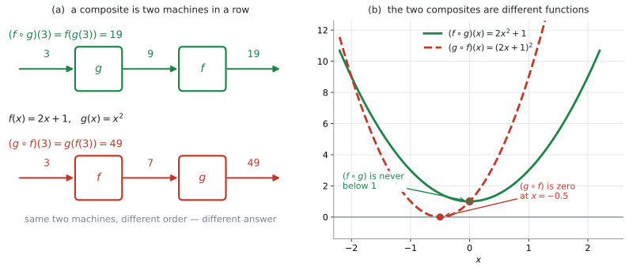
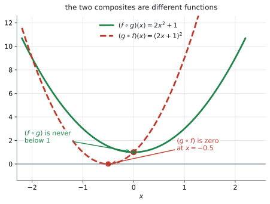
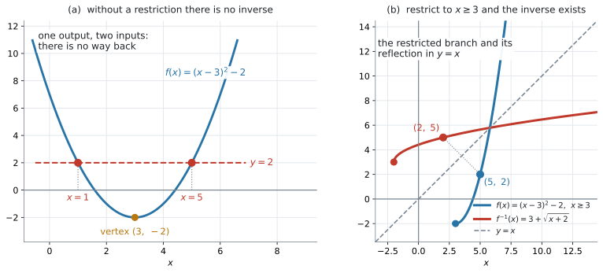

# AHL 2.7 — Composite and inverse functions（合成関数と逆関数） {#sec-ahl-2-7}

::: {.callout-note}
## What you should be able to do
- **composite function**（合成関数）$(f \circ g)(x) = f(g(x))$ を、**内側から順に**計算できる。
- $(f \circ g)$ と $(g \circ f)$ が**別の関数**であることを、値と式の両方で示せる。
- 文脈のなかで「どちらを先に通すか」を決め、その合成が何を表すかを説明できる。
- $y = f(x)$ を $x$ について解いて、**$f^{-1}(x)$ の式を求められる**。
- $(f \circ f^{-1})(x) = (f^{-1} \circ f)(x) = x$ を使って、求めた逆関数を検算できる。制限つきのときは、**制限した範囲の中の数で往復させて**確かめられる。
- $f(x) = (x-3)^2 - 2$ のような関数に、**なぜ domain restriction（定義域の制限）が要るのか**を説明できる。
:::

::: {.callout-important}
## 公式集の AHL 2.7 の欄
**ありません。**

公式集の Topic 2 の HL の部分にあるのは、Prior learning の quadratic formula と、2.1、2.5、2.9 だけです。**合成関数の記号も、逆関数の求め方も、印刷されていません。**

つまり、$(f \circ g)(x) = f(g(x))$ という**記号の意味**と、$f^{-1}$ を求める**手順**は、自分で持っておく必要があります。とはいえ、覚えることは多くありません。この項目は、**式を覚える項目ではなく、順番を間違えない項目**です。
:::

::: {.callout-note}
## シラバスが、この項目に求めていること
Content 欄の $4$ 行は、$(f \circ g)(x) = f(g(x))$ の記号、文脈のなかでの合成、$f^{-1}$ を求めること、そして domain restriction です。Guidance 欄には $(f \circ f^{-1})(x) = (f^{-1} \circ f)(x) = x$ と、$1$ つの例が挙がっています。

> **Example:** $f(x) = (x-3)^2 - 2$ has an inverse if the domain is restricted to $x \geq 3$ or to $x \leq 3$.

**シラバスが名指しした関数**なので、@exm-ahl27-restrict でそのまま扱います。

逆関数そのものは [SL 2.2](../../ai-sl/02-functions/sl-2-2.qmd#inverse) で一度出ていますが、そこは `Informal concept`（大まかな考え方）どまりでした。**HL で新しく足されるのは、$f^{-1}(x)$ の式を実際に求めることと、domain restriction です。**
:::

## The idea

### 1. 合成関数は、機械を $2$ 台つないだものです {#idea}

$f$ と $g$ を、$2$ 台の機械だと思ってください。**$1$ 台目から出てきたものを、そのまま $2$ 台目に入れる。** これが **composite function**（合成関数）です。

{#fig-ahl27-composite width=76%}

@fig-ahl27-composite を見てください。$f(x) = 2x+1$、$g(x) = x^{2}$ として、$3$ を入れます。

上の列は、**$g$ を先に**通した場合です。$3 \to 9 \to 19$ と進みます。

$$
f(g(3)) = f(9) = 2(9)+1 = 19
$$

下の列は、**$f$ を先に**通した場合です。$3 \to 7 \to 49$ と進みます。

$$
g(f(3)) = g(7) = 7^{2} = 49
$$

**同じ $2$ 台でも、つなぐ順番が変われば、出てくる数が変わります。**

### 2. $(f \circ g)(x)$ は、内側から読みます {#notation}

シラバスが指定している記号は、次のものです。

$$
(f \circ g)(x) = f(g(x))
$$ {#eq-ahl27-notation}

$\circ$ は「**composed with**」と読みます。$(f \circ g)$ は「$f$ composed with $g$」です。

ここがこの項目で最初につまずくところです。**$(f \circ g)$ と書いてあっても、先に働くのは $g$ のほうです。**

@eq-ahl27-notation の右辺 $f(g(x))$ を見れば、迷いません。**かっこの内側にあるものが、先です。**

| 書き方 | 先に働くのは | 意味 |
|:--|:--|:--|
| $(f \circ g)(x)$ | $g$ | $x \to g \to f$ |
| $f(g(x))$ | $g$ | 同じもの |
| $(g \circ f)(x)$ | $f$ | $x \to f \to g$ |
| $g(f(x))$ | $f$ | 同じもの |

: $\circ$ の読み方 {#tbl-ahl27-notation}

::: {.callout-tip}
## 迷ったら、$\circ$ の形を $f(g(x))$ に書き直してください
試験で $(f \circ g)(2)$ と問われたら、答案の $1$ 行目に

$$
(f \circ g)(2) = f(g(2))
$$

と書いてしまうのが確実です。この $1$ 行を書くだけで、順番の取り違えはほぼ防げます。
:::

### 3. 順番を変えると、別の関数になります {#order}

値だけでなく、**式そのものが変わります。** $f(x) = 2x+1$、$g(x) = x^{2}$ で確かめます。

$(f \circ g)(x)$ は、$f$ の $x$ のところに $g(x) = x^{2}$ を入れます。

$$
(f \circ g)(x) = f\left(x^{2}\right) = 2x^{2}+1
$$

$(g \circ f)(x)$ は、$g$ の $x$ のところに $f(x) = 2x+1$ を入れます。

$$
(g \circ f)(x) = g(2x+1) = (2x+1)^{2} = 4x^{2}+4x+1
$$

{#fig-ahl27-order width=70%}

@fig-ahl27-order が、この $2$ つのグラフです。**頂点の位置も、開き方も違います。**

読み方に迷ったら、@tbl-ahl27-notation に戻ってください。

$x = 3$ を入れれば、$2(9)+1 = 19$ と $(7)^{2} = 49$ で、@fig-ahl27-composite と合います。

::: {.callout-warning}
## $(f \circ g)(x)$ は、$f(x) \times g(x)$ ではありません
$\circ$ は掛け算の記号ではありません。

$$
f(x) \times g(x) = (2x+1)\left(x^{2}\right) = 2x^{3}+x^{2}
$$

これは $(f \circ g)(x) = 2x^{2}+1$ とも $(g \circ f)(x) = 4x^{2}+4x+1$ とも違います。**$3$ つとも別の関数です。**
:::

### 4. 文脈のなかの合成関数 {#context}

Content 欄の $1$ 行目は `Composite functions in context.` です。**現実の場面で、$2$ つの処理を続けて行うとき**に使います。

ある店で、$x$ 円の商品に次の $2$ つの処理をします。

- **割引** … $d(x) = x - 500$（$500$ 円引き）
- **消費税** … $t(x) = 1.1x$（$10\%$ の税を加える）

この $2$ つは、$x \geq 500$ の商品に使います。$500$ 円未満の商品では、割引後が負の値になってしまうからです。

順番が $2$ 通りあります。

$$
(t \circ d)(x) = t(x-500) = 1.1(x-500) = 1.1x - 550
$$

$$
(d \circ t)(x) = d(1.1x) = 1.1x - 500
$$

$x = 3000$ で比べます。

| 順番 | 意味 | $x = 3000$ のとき |
|:--|:--|:--|
| $(t \circ d)(x) = 1.1x - 550$ | 割引してから、課税する | $2750$ 円 |
| $(d \circ t)(x) = 1.1x - 500$ | 課税してから、割引する | $2800$ 円 |

: 順番で $50$ 円変わります {#tbl-ahl27-shop}

@tbl-ahl27-shop のとおり、差は $50$ 円です。**割引を先にすると、$500$ 円ぶんには税がかからない**からです。逆に課税を先にすると、その $500$ 円にも税がかかったうえで、$500$ 円しか引かれません。

$$
1.1 \times 500 - 500 = 550 - 500 = 50
$$

**文脈問題では、「どちらが先か」を先に日本語で決めてから、式を書いてください。** 式を先に書くと、順番が入れかわったまま気づけません。

同じ形の問題を @exm-ahl27-photo で扱います。そちらは、拡大と縁付けの順番です。

### 5. inverse function ── SL で学んだこと {#inverse-recap}

[SL 2.2](../../ai-sl/02-functions/sl-2-2.qmd#inverse) で扱った内容を、まとめておきます。

- $f(a) = b$ のとき、$f^{-1}(b) = a$。**入力と出力を入れかえたもの**が $f^{-1}$ です
- $y = f^{-1}(x)$ のグラフは、$y = f(x)$ のグラフを **$y = x$ について折り返した**もの（[SL 2.2](../../ai-sl/02-functions/sl-2-2.qmd#reflection)）
- $f$ の **domain**（定義域）と **range**（値域）が、$f^{-1}$ の range と domain になります
- 逆関数を持つのは、**one-to-one**（$1$ 対 $1$）の関数だけ（[SL 2.2](../../ai-sl/02-functions/sl-2-2.qmd#one-to-one)）
- one-to-one かどうかは、**horizontal line test**（水平線テスト）で見ます（[SL 2.2](../../ai-sl/02-functions/sl-2-2.qmd#horizontal-test)）

SL では、ここまででした。**HL では、$f^{-1}(x)$ の式そのものを求めます。**

### 6. $f^{-1}(x)$ の式を求める $3$ 手順 {#finding}

Content 欄の $4$ 行目 `Finding an inverse function.` が、この節です。手順は $3$ つです。

1. $y = f(x)$ と置く
2. **$x$ について解く**
3. 文字を入れかえて、$f^{-1}(x) = \ldots$ の形にする

$f(x) = \dfrac{3}{x-2}$ でやってみます。

**手順 1。**

$$
y = \frac{3}{x-2}
$$

**手順 2。** $x$ について解きます。まず分母を払って、

$$
y(x-2) = 3
$$

つぎに、両辺を $y$ で割ります（$f$ の range は $y \neq 0$ なので、これができます）。

$$
x - 2 = \frac{3}{y}
$$

$$
x = \frac{3}{y} + 2
$$

**手順 3。** $y$ を $x$ に書きかえます。

$$
f^{-1}(x) = \frac{3}{x} + 2
$$

::: {.callout-tip}
## 手順 2 が、この項目のほぼ全部です
$y = f(x)$ を $x$ について解く——**それだけ**です。分数なら分母を払う、$2$ 乗なら平方根をとる、$e$ なら $\ln$ をとる。

**手順 3 の文字の入れかえは、書き方をそろえるためのもの**です。数学の中身は変わりません。ここを飛ばして $f^{-1}(y) = \dfrac{3}{y}+2$ と書いても間違いではありませんが、試験では $x$ の式で答える形にそろえてください。
:::

**domain も一緒に決まります。** $f^{-1}(x) = \dfrac{3}{x} + 2$ は $x = 0$ で使えないので、$f^{-1}$ の domain は $x \neq 0$ です。これは $f$ の range（$y \neq 0$）と一致しています。

### 7. $(f \circ f^{-1})(x) = (f^{-1} \circ f)(x) = x$ {#undo}

Guidance の $1$ 行目です。

$$
(f \circ f^{-1})(x) = (f^{-1} \circ f)(x) = x
$$ {#eq-ahl27-undo}

**$f$ で進んで $f^{-1}$ で戻れば、元の場所に返る。** どちらの順でも、**使える範囲の中でなら**同じです。

::: {.callout-important}
## $2$ つの式は、成り立つ $x$ の範囲が違います
@eq-ahl27-undo は $2$ つの等式をまとめて書いたものですが、**それぞれ $x$ の範囲が違います。**

$$
f^{-1}\left(f(x)\right) = x \qquad (x \in \operatorname{Dom} f)
$$ {#eq-ahl27-undo1}

$$
f\left(f^{-1}(x)\right) = x \qquad (x \in \operatorname{Range} f = \operatorname{Dom} f^{-1})
$$ {#eq-ahl27-undo2}

理由は、**どちらに先に入れるか**です。

- @eq-ahl27-undo1 … 最初に $f$ へ入れるので、$x$ は **$f$ の domain** に入っていなければなりません
- @eq-ahl27-undo2 … 最初に $f^{-1}$ へ入れるので、$x$ は **$f^{-1}$ の domain**、つまり **$f$ の range** に入っていなければなりません

[第5節](#inverse-recap)で見たとおり、$f^{-1}$ の domain は $f$ の range です。**範囲を外れた $x$ では、そもそも左辺が計算できません。**
:::

さきほどの $f(x) = \dfrac{3}{x-2}$、$f^{-1}(x) = \dfrac{3}{x}+2$ で確かめます。

$$
f\left(f^{-1}(x)\right) = f\left(\frac{3}{x}+2\right) = \frac{3}{\left(\frac{3}{x}+2\right)-2} = \frac{3}{\frac{3}{x}} = x \qquad (x \neq 0)
$$

$x \neq 0$ が付くのは、$f^{-1}$ の domain が $x \neq 0$ だからです（@eq-ahl27-undo2）。

@eq-ahl27-undo は、**逆関数を求めたあとの検算に使えます。** ただし、**入れる順番に気をつけてください。**

制限のない $f$ なら、$f\left(f^{-1}(x)\right)$ を計算して $x$ に戻れば合っています。

**制限つきの問題では、$f\left(f^{-1}(x)\right)$ だけでは足りません。** $f(x)=(x-3)^{2}-2$ を $x \leq 3$ に制限したときの正しい逆関数は $3-\sqrt{x+2}$ ですが、まちがえて $3+\sqrt{x+2}$ と書いても

$$
f\left(3+\sqrt{x+2}\right) = \left(\left(3+\sqrt{x+2}\right)-3\right)^{2}-2 = (x+2)-2 = x
$$

となって、$x$ に戻ってしまいます。**この向きの検算は、根号の前の符号の取りちがえを見つけられません。** $3+\sqrt{x+2}$ でも $3-\sqrt{x+2}$ でも、同じように $x$ に戻ってしまうからです。

制限つきのときは、次のどちらかを使ってください。

- **制限した範囲の中の数を $1$ つ選んで、往復させる。** $x \geq 3$ なら、たとえば $f(5)=2$ を出してから、$f^{-1}(2)$ が $5$ に戻るかを見ます（@exm-ahl27-restrict）
- **$f^{-1}\left(f(x)\right)$ のほうを計算する。** 上の誤答なら $f^{-1}(f(x)) = 3+\lvert x-3 \rvert$ となり、$x \leq 3$ では $x$ に戻りません

戻らなければ、どこかで間違えています。

::: {.callout-note}
## この式は、composite と inverse をつなぐ場所です
このページの前半（合成）と後半（逆関数）は、@eq-ahl27-undo でつながります。**逆関数とは、合成すると「何もしない関数」になる相手**のことです。

シラバスが $1$ つの項目に両方を入れているのは、このためです。
:::

### 8. domain restriction は、なぜ要るのか {#restriction}

Content 欄の $3$ 行目「Inverse function $f^{-1}$, including domain restriction.」が、この節です。

シラバスの Example（@eq-ahl27-example）をそのまま見ます。

$$
f(x) = (x-3)^{2} - 2
$$ {#eq-ahl27-example}

{#fig-ahl27-inverse width=100%}

@fig-ahl27-inverse の (a) が、制限しないときの様子です。$y = 2$ の高さで横線を引くと、グラフと **$2$ か所**でぶつかります。

$$
f(1) = (1-3)^{2}-2 = 4-2 = 2, \qquad f(5) = (5-3)^{2}-2 = 4-2 = 2
$$

**出力 $2$ から、入力に戻れません。** $1$ なのか $5$ なのか、決まらないからです。horizontal line test に通らない、ということです（[SL 2.2](../../ai-sl/02-functions/sl-2-2.qmd#horizontal-test)）。

逆関数は「出力から入力を返す関数」ですから、**戻り先が $2$ つある時点で、関数として成り立ちません。**

そこで、**この放物線では domain を頂点の左右どちらか一方に制限します。** 頂点は $(3, -2)$ なので、区切りは $x = 3$ です。

@fig-ahl27-inverse の (b) が、$x \geq 3$ に制限したあとです。**どこに横線を引いても、ぶつかるのは $1$ 回だけ**になりました。これで逆関数が持てます。

$$
y = (x-3)^{2}-2 \ \Rightarrow \ y+2 = (x-3)^{2} \ \Rightarrow \ x-3 = \pm\sqrt{y+2}
$$

$\pm$ のどちらを取るかを、**制限した範囲が決めます。**

放物線を頂点で切ると、左半分と右半分に分かれます。この**片側ずつを「枝」**と呼びます。$x \geq 3$ が右の枝、$x \leq 3$ が左の枝です。

| 制限 | $x-3$ の符号 | 取る符号 | $f^{-1}(x)$ | $f^{-1}$ の domain |
|:--|:--|:--|:--|:--|
| $x \geq 3$ | $x-3 \geq 0$ | $+$ | $3 + \sqrt{x+2}$ | $x \geq -2$ |
| $x \leq 3$ | $x-3 \leq 0$ | $-$ | $3 - \sqrt{x+2}$ | $x \geq -2$ |

: 枝を選ぶと、逆関数が $1$ つに決まります {#tbl-ahl27-branch}

Guidance が「$x \geq 3$ **または** $x \leq 3$」と書いているのは、この $2$ 通りのことです。**どちらを選んでも逆関数はできますが、出てくる式は別のもの**になります。

@fig-ahl27-inverse の (b) では、$f$ の上の点 $(5,\ 2)$ が、$f^{-1}$ の上では $(2,\ 5)$ になっています。$y = x$ について折り返した位置です。

::: {.callout-warning}
## 制限を書かずに $f^{-1}$ だけ書くと、答えが宙に浮きます
$f(x) = (x-3)^{2}-2$ に対して $f^{-1}(x) = 3+\sqrt{x+2}$ と書いただけでは、**$x \leq 3$ 側のことが説明できていません。**

$f^{-1}(2) = 3+\sqrt{4} = 5$ ですが、$f(1)$ も $2$ です。**制限がなければ、この $f^{-1}$ は $f$ の逆関数になっていません。**

答案には、**どの範囲に制限したのか**を必ず書いてください（演習 $10$）。
:::

## Why it works

**なぜ「$y = f(x)$ を $x$ について解く」と逆関数が出るのか**を説明します。

$f$ は、$x$ を受け取って $y$ を返す機械です。式 $y = f(x)$ は、**$x$ が分かっているときに $y$ を出す形**で書かれています。

逆関数がほしいのは、その反対です。**$y$ が分かっているときに $x$ を出したい。** ですから、同じ関係式を **$x$ について書き直す**だけで済みます。

$$
y = \frac{3}{x-2} \qquad \text{と} \qquad x = \frac{3}{y}+2
$$

この $2$ つは、**同じ関係を別の向きから書いたもの**です。どちらも「$x$ と $y$ がこう結びついている」と言っています。左は $x \to y$ の読み方、右は $y \to x$ の読み方です。

だから、$3$ 手順のうち本質は手順 $2$ だけで、手順 $3$ は文字の名前を付けかえているにすぎません。

**グラフで見ると、これは $y = x$ についての折り返しです。** $x$ と $y$ の役割を入れかえるのですから、座標 $(a,\ b)$ は $(b,\ a)$ に移ります。$(a,\ b)$ と $(b,\ a)$ は、$y = x$ について対称な位置です（[SL 2.2](../../ai-sl/02-functions/sl-2-2.qmd#reflection)）。

**ここで、制限が必要になる理由も見えます。** $x$ について解いたときに $\pm\sqrt{\ }$ が出るということは、**range の中の $y$ を $1$ つ決めると、$x$ が $2$ つ返ってくる**ということです。$1$ つの入力に $2$ つの出力を返すものは、関数ではありません。

$f$ の domain がすでに絞ってあれば（演習 $7$ の $x \geq 0$ のように）、$2$ つのうち片方は domain の外にあるので、そこで自動的に $1$ つに決まります。**絞っていなければ、自分で絞ることになります。**

この放物線では、$\pm$ の片方だけを残すために、**domain を頂点の左右どちらか一方に制限します。** こうして $f$ を one-to-one にすると、$x$ について解いた式も、逆関数も $1$ つに決まります。

**domain restriction そのものは、後付けの制約ではなく、逆関数が存在するための条件**です。どこをどう制限するかは関数によって変わりますが、**「one-to-one になるまで domain を絞る」という目的は同じ**です。

## Worked examples

::: {.callout-note appearance="simple"}
問題文は英語です。意味が理解できなかったら、問題文の下の「**日本語訳**」を開いてください。解説は日本語です。
:::

::: {#exm-ahl27-basic}
[Let $f(x) = 2x+1$ and $g(x) = x^{2}$.]{.q-en}

**(a)** [Find $(f \circ g)(3)$.]{.q-en}

**(b)** [Find $(g \circ f)(3)$.]{.q-en}

**(c)** [Find an expression for $(f \circ g)(x)$.]{.q-en}

<details class="jp-trans">
<summary>日本語訳</summary>

$f(x) = 2x+1$、$g(x) = x^{2}$ とします。

**(a)** $(f \circ g)(3)$ を求めなさい。

**(b)** $(g \circ f)(3)$ を求めなさい。

**(c)** $(f \circ g)(x)$ を表す式を求めなさい。

</details>

---

**(a)** まず記号を書き直します（[第2節](#notation)）。

$$
(f \circ g)(3) = f(g(3))
$$

内側から計算します。$g(3) = 3^{2} = 9$、そのあと $f(9) = 2(9)+1 = 19$ です。

**(b)** 順番が逆です。

$$
(g \circ f)(3) = g(f(3))
$$

$f(3) = 2(3)+1 = 7$、そのあと $g(7) = 7^{2} = 49$ です。

**(a)** と **(b)** で答えが違うことに注目してください（@fig-ahl27-composite）。

**(c)** $f$ の $x$ のところに、$g(x) = x^{2}$ をそのまま入れます。

$$
(f \circ g)(x) = f\left(x^{2}\right) = 2\left(x^{2}\right)+1 = 2x^{2}+1
$$

**検算。** (c) の式に $x = 3$ を入れると $2(9)+1 = 19$ で、(a) と合いました ✓

::: {.callout-note}
## 解答例（答案用紙にはこう書く）
**(a)**
$$(f \circ g)(3) = f(g(3)) = f(9) = 2(9)+1 = 19$$

**(b)**
$$(g \circ f)(3) = g(f(3)) = g(7) = 7^{2} = 49$$

**(c)**
$$(f \circ g)(x) = f\left(x^{2}\right) = 2x^{2}+1$$
:::
:::

::: {#exm-ahl27-photo}
[A print shop enlarges a photograph and then adds a plain border all the way round it. For a photograph of width $x$ cm, the two operations are]{.q-en}

$$
e(x) = 1.5x, \qquad b(x) = x + 4
$$

[where $e$ enlarges the width by a scale factor of $1.5$ and $b$ adds a $2$ cm border on each side.]{.q-en}

**(a)** [Write down, in terms of $e$ and $b$, the composite function that the print shop uses.]{.q-en}

**(b)** [Find an expression for this composite function, and use it to find the finished width of a photograph that is $20$ cm wide.]{.q-en}

**(c)** [Explain why the finished photograph would be wider if the two operations were applied in the other order.]{.q-en}

<details class="jp-trans">
<summary>日本語訳</summary>

ある印刷店は、写真を拡大してから、そのまわり全体に無地の縁を付けます。幅 $x$ cm の写真に対して、$2$ つの処理は上の $e(x)$ と $b(x)$ です。ここで $e$ は幅を $1.5$ 倍に拡大し、$b$ は左右にそれぞれ $2$ cm の縁を付けます。

**(a)** 印刷店が使っている合成関数を、$e$ と $b$ を用いて書きなさい。

**(b)** この合成関数の式を求め、それを使って、幅 $20$ cm の写真の仕上がりの幅を求めなさい。

**(c)** $2$ つの処理を逆の順で行った場合に、仕上がりの幅が大きくなる理由を説明しなさい。

</details>

---

**(a)** 先に働くのは $e$（拡大）です。**先に働くほうが内側**なので（[第2節](#notation)）、

$$
(b \circ e)(x)
$$

です。$(e \circ b)(x)$ と書くと、順番が逆になります。

**(b)** $b$ の $x$ に $e(x) = 1.5x$ を入れます。

$$
(b \circ e)(x) = b(1.5x) = 1.5x + 4
$$

$x = 20$ を入れます。

$$
1.5(20) + 4 = 30 + 4 = 34
$$

$34$ cm です。

**検算。** 順を追っても確かめられます。$20 \times 1.5 = 30$、$30 + 4 = 34$ ✓ 式と一致しました。

**(c)** `Explain why` なので、**英語で理由を書きます。** 数字を $1$ 組出しておくと、説得力が上がります。

逆の順は $(e \circ b)(x) = 1.5(x+4) = 1.5x + 6$ で、$x = 20$ なら

$$
1.5(20+4) = 1.5(24) = 36
$$

差は $2$ cm です。$1.5 \times 4 - 4 = 6 - 4 = 2$ で、**縁まで一緒に拡大されてしまったぶん**です。縁は $2$ cm ずつのはずが、$3$ cm ずつになります。

::: {.model-answer}
**試験ではこう書く**

*In the other order the composite is $(e \circ b)(x) = 1.5(x+4) = 1.5x + 6$, while the print shop uses $(b \circ e)(x) = 1.5x + 4$. The other order is $2$ cm wider for every photograph, because the border is added before the enlargement and so is enlarged as well: each $2$ cm border becomes $3$ cm. A photograph $20$ cm wide would finish at $36$ cm instead of $34$ cm.*
:::

（逆の順の合成関数は $1.5x+6$、印刷店の使っている合成関数は $1.5x+4$ で、どの写真でも $2$ cm の差が出る。縁を先に付けると、その縁も一緒に拡大されるからである。$2$ cm の縁が $3$ cm になる。幅 $20$ cm の写真なら、$34$ cm ではなく $36$ cm に仕上がる、という意味です。）

::: {.callout-note}
## 解答例（答案用紙にはこう書く）
**(a)**
$$(b \circ e)(x)$$

**(b)**
$$(b \circ e)(x) = b(1.5x) = 1.5x + 4$$
$$(b \circ e)(20) = 30 + 4 = 34$$
*The finished width is $34$ cm.*

**(c)**
*The other order gives $(e \circ b)(x) = 1.5(x+4) = 1.5x + 6$, which is $2$ cm wider for every photograph, because the border is added first and is then enlarged by the factor $1.5$ as well.*
:::
:::

::: {#exm-ahl27-find}
[Let $f(x) = \dfrac{3}{x-2}$, for $x \neq 2$.]{.q-en}

**(a)** [Find $f^{-1}(x)$.]{.q-en}

**(b)** [State the domain of $f^{-1}$.]{.q-en}

**(c)** [Verify your answer to part (a) by finding $(f \circ f^{-1})(x)$.]{.q-en}

<details class="jp-trans">
<summary>日本語訳</summary>

$x \neq 2$ に対して $f(x) = \dfrac{3}{x-2}$ とします。

**(a)** $f^{-1}(x)$ を求めなさい。

**(b)** $f^{-1}$ の domain を述べなさい。

**(c)** $(f \circ f^{-1})(x)$ を求めることで、(a) の答えを確かめなさい。

</details>

---

**(a)** [第6節](#finding)の $3$ 手順です。

$$
y = \frac{3}{x-2}
$$

分母を払います。

$$
y(x-2) = 3
$$

$y$ で割ります。

$$
x-2 = \frac{3}{y}
$$

$$
x = \frac{3}{y}+2
$$

文字を入れかえて、

$$
f^{-1}(x) = \frac{3}{x}+2
$$

**(b)** $\dfrac{3}{x}$ は $x = 0$ で使えません。よって domain は $x \neq 0$ です。

これは $f$ の range と一致しています。$\dfrac{3}{x-2}$ は $0$ にならないからです（[第5節](#inverse-recap)）。

**(c)** @eq-ahl27-undo による検算です。

$$
(f \circ f^{-1})(x) = f\left(\frac{3}{x}+2\right) = \frac{3}{\left(\frac{3}{x}+2\right)-2} = \frac{3}{\frac{3}{x}} = 3 \times \frac{x}{3} = x
$$

$x$ に戻ったので、(a) は合っています ✓（この等式が使えるのは、(b) で求めた $f^{-1}$ の domain、つまり $x \neq 0$ の範囲です。@eq-ahl27-undo2）

**検算。** 数でも見ておきます。$f(5) = \dfrac{3}{3} = 1$ なので、$f^{-1}(1)$ は $5$ になるはずです。$\dfrac{3}{1}+2 = 5$ ✓

::: {.callout-note}
## 解答例（答案用紙にはこう書く）
**(a)**
$$y = \frac{3}{x-2} \ \Rightarrow \ y(x-2) = 3 \ \Rightarrow \ x-2 = \frac{3}{y} \ \Rightarrow \ x = \frac{3}{y}+2$$
$$f^{-1}(x) = \frac{3}{x}+2$$

**(b)**
$$x \neq 0$$

**(c)**
$$(f \circ f^{-1})(x) = \frac{3}{\left(\frac{3}{x}+2\right)-2} = \frac{3}{\frac{3}{x}} = x$$
:::
:::

::: {#exm-ahl27-restrict}
[Let $f(x) = (x-3)^{2} - 2$.]{.q-en}

**(a)** [Explain why $f$ does not have an inverse function when its domain is all real numbers.]{.q-en}

[The domain of $f$ is now restricted to $x \geq 3$.]{.q-en}

**(b)** [Find $f^{-1}(x)$.]{.q-en}

**(c)** [State the domain and the range of $f^{-1}$.]{.q-en}

<details class="jp-trans">
<summary>日本語訳</summary>

$f(x) = (x-3)^{2}-2$ とします。

**(a)** domain がすべての実数のとき、$f$ が逆関数を持たない理由を説明しなさい。

ここで、$f$ の domain を $x \geq 3$ に制限します。

**(b)** $f^{-1}(x)$ を求めなさい。

**(c)** $f^{-1}$ の domain と range を述べなさい。

</details>

---

**(a)** `Explain why` なので、英語で理由を書きます。**具体的な数を $1$ 組出す**のがいちばん短くて確実です。

$$
f(1) = (1-3)^{2}-2 = 2, \qquad f(5) = (5-3)^{2}-2 = 2
$$

$2$ という出力に対して、入力が $1$ と $5$ の $2$ つあります。**戻り先が決まらないので、逆関数を作れません**（[第8節](#restriction)）。

::: {.model-answer}
**試験ではこう書く**

*The function is not one-to-one: $f(1) = 2$ and $f(5) = 2$, so the horizontal line $y = 2$ meets the graph twice. An inverse would have to send $2$ back to a single value, and there is no way to choose between $1$ and $5$, so $f$ has no inverse on this domain.*
:::

（この関数は one-to-one ではない。$f(1) = 2$ かつ $f(5) = 2$ なので、横線 $y = 2$ はグラフと $2$ 回ぶつかる。逆関数は $2$ を $1$ つの値に戻さなければならないが、$1$ と $5$ のどちらを選ぶかを決められないので、この domain では逆関数を持たない、という意味です。）

**(b)** @eq-ahl27-example を $y$ と置いて、$x$ について解きます。

$$
y = (x-3)^{2}-2
$$

$$
y+2 = (x-3)^{2}
$$

$$
x-3 = \pm\sqrt{y+2}
$$

**ここで制限を使います。** $x \geq 3$ なので $x-3 \geq 0$、つまり $+$ のほうです（@tbl-ahl27-branch）。

$$
x = 3+\sqrt{y+2}
$$

$$
f^{-1}(x) = 3+\sqrt{x+2}
$$

**(c)** $f$ の range と domain が、そのまま入れかわります（[第5節](#inverse-recap)）。

$x \geq 3$ での $f$ の最小値は頂点の $-2$ で、そこから増え続けるので、range は $y \geq -2$ です。したがって

- $f^{-1}$ の domain … $x \geq -2$
- $f^{-1}$ の range … $y \geq 3$

$\sqrt{x+2}$ の中身が $0$ 以上であることからも、domain が $x \geq -2$ だと分かります。

**検算。** $f(5) = 2$ でした。$f^{-1}(2) = 3+\sqrt{4} = 3+2 = 5$ ✓ 戻りました（@fig-ahl27-inverse の (b) の $2$ 点です）

::: {.callout-note}
## 解答例（答案用紙にはこう書く）
**(a)**
*$f(1) = 2$ and $f(5) = 2$, so $f$ is not one-to-one and an output of $2$ has two possible inputs. An inverse function cannot be defined.*

**(b)**
$$y = (x-3)^{2}-2 \ \Rightarrow \ x-3 = \pm\sqrt{y+2}$$
*Since $x \geq 3$, take the positive root.*
$$f^{-1}(x) = 3+\sqrt{x+2}$$

**(c)**
*Domain: $x \geq -2$.  Range: $y \geq 3$.*
:::
:::

## Common errors

::: {.callout-warning}
## $(f \circ g)(x)$ を、$f$ から先に計算する
いちばん多い誤りです。$\circ$ の左に $f$ が書いてあるので、$f$ が先に見えます。

**先に働くのは、右の $g$ です。**

$$
(f \circ g)(x) = f(g(x))
$$

答案の $1$ 行目に $f(g(x))$ と書き直す習慣を付けてください（[第2節](#notation)）。**かっこの内側が先**、と覚えると迷いません。
:::

::: {.callout-warning}
## $(f \circ g)(x)$ と $f(x) \times g(x)$ を混同する
$\circ$ は掛け算ではありません。$f(x) = 2x+1$、$g(x) = x^{2}$ なら

$$
(f \circ g)(x) = 2x^{2}+1, \qquad f(x)\,g(x) = 2x^{3}+x^{2}
$$

**かけ算は次数を足し、合成は次数をかけます。** ここでは $1+2 = 3$ 次と $1 \times 2 = 2$ 次で、次数からして違います。

ただし、**次数を見るだけでは足りません。** $f(x)=x^{2}$、$g(x)=x^{2}+1$ なら、$(f \circ g)(x) = x^{4}+2x^{2}+1$ も $f(x)\,g(x) = x^{4}+x^{2}$ も、どちらも $4$ 次です。それでも別の関数です。**数を $1$ つ入れて比べる**のが確実です（[第3節](#order)）。
:::

::: {.callout-warning}
## $f^{-1}(x)$ を $\dfrac{1}{f(x)}$ の意味に取る
$-1$ が右上にあるので、$\dfrac{1}{f(x)}$ に見えます。**別のものです。**

$f(x) = 2x+1$ なら

$$
f^{-1}(x) = \frac{x-1}{2}, \qquad \frac{1}{f(x)} = \frac{1}{2x+1}
$$

$x = 3$ で比べると、$1$ と $\dfrac{1}{7}$ です。

**$f^{-1}$ は「戻す関数」、$\dfrac{1}{f}$ は「逆数」**です。読み方も違い、$f^{-1}$ は「$f$ inverse」と読みます。
:::

::: {.callout-warning}
## 制限したのに、$\pm$ の片方を選ばない
$x-3 = \pm\sqrt{y+2}$ まで来て、$\pm$ を付けたまま $f^{-1}(x) = 3 \pm \sqrt{x+2}$ と書いてしまう誤りです。

**$\pm$ が残っていたら、それは関数ではありません。** $1$ つの入力に $2$ つの出力を返しているからです。

制限が $x \geq 3$ なら $+$、$x \leq 3$ なら $-$ です（@tbl-ahl27-branch）。**制限は、この $1$ 文字を決めるためにあります。**
:::

::: {.callout-warning}
## 逆関数の domain を書き忘れる
`Find the inverse function` としか書かれていない設問でも、$f^{-1}$ に自然な制限が付く場合があります。

- $f^{-1}(x) = \dfrac{3}{x}+2$ … $x \neq 0$
- $f^{-1}(x) = 3+\sqrt{x+2}$ … $x \geq -2$

$f^{-1}$ の domain は、**$f$ の range** です（[第5節](#inverse-recap)）。$f$ が「式が使えるいちばん広い範囲」で定められているときは、**根号の中身と、分母**を見るだけで同じ答えが出ます。

**$f$ の domain が問題文で制限されているときは、$f$ の range のほうを見てください。** 根号や分母だけを見ると、広すぎる範囲を答えてしまうことがあります（演習 $7$ の解説）。
:::

## Using your GDC (TI-Nspire CX II)

この項目で電卓が役に立つのは、**逆関数の検算**のときだけです。合成の式も逆関数の式も、手で出します。

### 1. $y = x$ と一緒にかいて、折り返しを見る {#gdc-graph}

```
ctrl + doc → Add Graphs
```

$f(x)$、自分の求めた $f^{-1}(x)$、そして $f3(x)=x$ の $3$ 本を入れます。$f$ と $f^{-1}$ が **$y = x$ について対称**になっていれば、逆関数の式が合っている見込みが高いといえます（@fig-ahl27-inverse の (b)）。

その前に、**縦と横の目盛りをそろえてください。**

```
menu → Window/Zoom → Zoom - Square
```

目盛りがそろっていないと、$y = x$ が $45^{\circ}$ の直線に見えません。正しい逆関数でも、対称に見えなくなります。`Zoom - Fit` を使ったあとは、これをやり直してください（[SL 2.2](../../ai-sl/02-functions/sl-2-2.qmd#graph-range)）。

::: {.callout-warning}
## 制限は、電卓には映りません
$f1(x)=(x-3)^{2}-2$ とだけ打つと、電卓は**放物線の全体**をかきます。制限のことを、電卓は何も知りません。

ですから、制限つきの問題では**グラフだけでは足りません。** 制限した範囲の中の数を $1$ つ選んで往復させるほうが確実です（[第7節](#undo)）。
:::

## Exercises

::: {.callout-note appearance="simple"}
各問題に、折りたたみが3つ付いています。**日本語訳**、**解答例**（答案用紙に書くべきこと。英語です）、**解説**（なぜそうなるか。日本語です）。

まず自分で解いて、次に解答例と見くらべてください。**解説は、合わなかったときだけ開けば十分です。**
:::

::: {.exercise-block}

[1]{.ex-no} [Let $f(x) = 3x-5$ and $g(x) = x+2$. Find $(f \circ g)(4)$ and $(g \circ f)(4)$.]{.q-en}

<details class="jp-trans">
<summary>日本語訳</summary>

$f(x) = 3x-5$、$g(x) = x+2$ とします。$(f \circ g)(4)$ と $(g \circ f)(4)$ を求めなさい。

</details>

::: {.callout-note collapse="true"}
## 解答例（答案用紙に書くこと）

$$(f \circ g)(4) = f(g(4)) = f(6) = 3(6)-5 = 13$$

$$(g \circ f)(4) = g(f(4)) = g(7) = 7+2 = 9$$
:::

::: {.callout-tip collapse="true"}
## 解説

$1$ 行目に $f(g(4))$ と書き直すところから始めてください（[第2節](#notation)、@exm-ahl27-basic）。

$(f \circ g)$ では、**先に $g$** です。$g(4) = 6$、そのあと $f(6) = 13$。

$(g \circ f)$ では、**先に $f$** です。$f(4) = 3(4)-5 = 7$、そのあと $g(7) = 9$。

$13 \neq 9$ です。**順番で答えが変わることを、この $1$ 問で確かめておいてください。**
:::

::: {.ex-sep}
:::

[2]{.ex-no} [Let $f(x) = x^{2}$ and $g(x) = x-3$. Find expressions for $(f \circ g)(x)$ and $(g \circ f)(x)$, giving each in expanded form where possible.]{.q-en}

<details class="jp-trans">
<summary>日本語訳</summary>

$f(x) = x^{2}$、$g(x) = x-3$ とします。$(f \circ g)(x)$ と $(g \circ f)(x)$ を表す式を求め、展開できるものは展開した形で答えなさい。

</details>

::: {.callout-note collapse="true"}
## 解答例（答案用紙に書くこと）

$$(f \circ g)(x) = f(x-3) = (x-3)^{2} = x^{2}-6x+9$$

$$(g \circ f)(x) = g\left(x^{2}\right) = x^{2}-3$$
:::

::: {.callout-tip collapse="true"}
## 解説

$(f \circ g)$ は、$f$ の $x$ に $x-3$ を入れます。$x^{2}$ の $x$ が $x-3$ になるので $(x-3)^{2}$ です。

$(g \circ f)$ は、$g$ の $x$ に $x^{2}$ を入れます。$x-3$ の $x$ が $x^{2}$ になるので $x^{2}-3$ です。

**$(x-3)^{2}$ を $x^{2}-9$ としないでください。** $(x-3)^{2} = x^{2}-6x+9$ です。

**検算。** $x = 5$ で試します。$(f \circ g)(5) = f(2) = 4$、式では $25-30+9 = 4$ ✓ $(g \circ f)(5) = g(25) = 22$、式では $25-3 = 22$ ✓
:::

::: {.ex-sep}
:::

[3]{.ex-no} [Let $a(x) = x^{2}-1$ and $b(x) = 3x$. Show that the equation $(a \circ b)(x) = (b \circ a)(x)$ has no real solutions.]{.q-en}

<details class="jp-trans">
<summary>日本語訳</summary>

$a(x) = x^{2}-1$、$b(x) = 3x$ とします。方程式 $(a \circ b)(x) = (b \circ a)(x)$ が実数解を持たないことを示しなさい。

</details>

::: {.callout-note collapse="true"}
## 解答例（答案用紙に書くこと）

$$(a \circ b)(x) = a(3x) = (3x)^{2}-1 = 9x^{2}-1$$

$$(b \circ a)(x) = b\left(x^{2}-1\right) = 3\left(x^{2}-1\right) = 3x^{2}-3$$

*Setting them equal:*

$$9x^{2}-1 = 3x^{2}-3 \ \Rightarrow \ 6x^{2} = -2 \ \Rightarrow \ x^{2} = -\frac{1}{3}$$

*A real square cannot be negative, so there are no real solutions.*
:::

::: {.callout-tip collapse="true"}
## 解説

まず $2$ つの合成を出します。$(3x)^{2} = 9x^{2}$ で、$3x^{2}$ ではありません。**かっこ全体が $2$ 乗されます。**

等号で結んで整理すると $6x^{2} = -2$ になります。$x^{2}$ は $0$ 以上なので、$-\dfrac{1}{3}$ にはなりません。

`Show that` なので、**$x^{2}$ が負になるところまで書いて**「よって実数解なし」と結んでください。

判別式を使っても示せます。$6x^{2}+2 = 0$ で $\Delta = 0^{2}-4(6)(2) = -48 < 0$ です（[AHL 1.12a](../01-number-and-algebra/ahl-1-12a.qmd#quadratic)）。

**検算。** 合成の式は、**もとの関数に数を入れて**確かめます。$x = 1$ で $(a \circ b)(1) = a(3) = 3^{2}-1 = 8$、式では $9(1)^{2}-1 = 8$ ✓ $(b \circ a)(1) = b(0) = 0$、式では $3(1)^{2}-3 = 0$ ✓

$(3x)^{2}$ を $3x^{2}$ としてしまうと、ここで値が合わなくなり、すぐ気づけます。$2$ つの式どうしを見くらべるだけでは、この誤りは見つかりません。
:::

::: {.ex-sep}
:::

[4]{.ex-no} [Let $f(x) = 3x-5$. Find $f^{-1}(x)$.]{.q-en}

<details class="jp-trans">
<summary>日本語訳</summary>

$f(x) = 3x-5$ とします。$f^{-1}(x)$ を求めなさい。

</details>

::: {.callout-note collapse="true"}
## 解答例（答案用紙に書くこと）

$$y = 3x-5 \ \Rightarrow \ y+5 = 3x \ \Rightarrow \ x = \frac{y+5}{3}$$

$$f^{-1}(x) = \frac{x+5}{3}$$
:::

::: {.callout-tip collapse="true"}
## 解説

$3$ 手順のとおりです（[第6節](#finding)）。$y$ と置き、$x$ について解き、文字を入れかえます。

$+5$ してから $3$ で割ります。**$3$ で割ってから $5$ を足すのは誤り**です。$\dfrac{y}{3}+5$ になってしまいます。

**検算。** $f(4) = 3(4)-5 = 7$ です。$f^{-1}(7) = \dfrac{7+5}{3} = 4$ ✓ 戻りました（@eq-ahl27-undo）。

この $f$ は直線なので、domain も range もすべての実数です。制限は要りません。
:::

::: {.ex-sep}
:::

[5]{.ex-no} [Let $f(x) = \dfrac{x+1}{4}$. Find $f^{-1}(x)$.]{.q-en}

<details class="jp-trans">
<summary>日本語訳</summary>

$f(x) = \dfrac{x+1}{4}$ とします。$f^{-1}(x)$ を求めなさい。

</details>

::: {.callout-note collapse="true"}
## 解答例（答案用紙に書くこと）

$$y = \frac{x+1}{4} \ \Rightarrow \ 4y = x+1 \ \Rightarrow \ x = 4y-1$$

$$f^{-1}(x) = 4x-1$$
:::

::: {.callout-tip collapse="true"}
## 解説

分母の $4$ を先に払うと、あとが楽になります。

$f$ は「$1$ を足して $4$ で割る」、$f^{-1}$ は「$4$ を掛けて $1$ を引く」。**逆の操作を、逆の順で**行っています。

**検算。** $f(7) = \dfrac{8}{4} = 2$、$f^{-1}(2) = 8-1 = 7$ ✓

$f^{-1}(x) = 4x-1$ は $\dfrac{4}{x}-1$ ではありません。分母を払ったあとの形に気をつけてください。
:::

::: {.ex-sep}
:::

[6]{.ex-no} [Let $f(x) = \dfrac{2}{x+3}$, for $x \neq -3$. Find $f^{-1}(x)$ and state its domain.]{.q-en}

<details class="jp-trans">
<summary>日本語訳</summary>

$x \neq -3$ に対して $f(x) = \dfrac{2}{x+3}$ とします。$f^{-1}(x)$ を求め、その domain を述べなさい。

</details>

::: {.callout-note collapse="true"}
## 解答例（答案用紙に書くこと）

$$y = \frac{2}{x+3} \ \Rightarrow \ y(x+3) = 2 \ \Rightarrow \ x+3 = \frac{2}{y} \ \Rightarrow \ x = \frac{2}{y}-3$$

$$f^{-1}(x) = \frac{2}{x}-3, \qquad x \neq 0$$
:::

::: {.callout-tip collapse="true"}
## 解説

@exm-ahl27-find と同じ形です。分母を払ってから、$y$ で割ります。

domain は、**分母を見て**決めます。$\dfrac{2}{x}$ なので $x \neq 0$ です（[Common errors](#common-errors) の $5$ つ目）。

これは $f$ の range と一致します。$\dfrac{2}{x+3}$ は決して $0$ になりません。

**検算。** $f(-1) = \dfrac{2}{2} = 1$、$f^{-1}(1) = 2-3 = -1$ ✓
:::

::: {.ex-sep}
:::

[7]{.ex-no} [Let $f(x) = x^{2}+4$, with domain $x \geq 0$. Find $f^{-1}(x)$ and state its domain.]{.q-en}

<details class="jp-trans">
<summary>日本語訳</summary>

domain を $x \geq 0$ として、$f(x) = x^{2}+4$ とします。$f^{-1}(x)$ を求め、その domain を述べなさい。

</details>

::: {.callout-note collapse="true"}
## 解答例（答案用紙に書くこと）

$$y = x^{2}+4 \ \Rightarrow \ x^{2} = y-4 \ \Rightarrow \ x = \pm\sqrt{y-4}$$

*Since $x \geq 0$, take the positive root.*

$$f^{-1}(x) = \sqrt{x-4}, \qquad x \geq 4$$
:::

::: {.callout-tip collapse="true"}
## 解説

$\pm$ が出たら、**制限を見て片方を選びます**（@tbl-ahl27-branch）。ここは $x \geq 0$ なので $+$ です。

$f^{-1}$ の domain は、**$f$ の range** です（[第5節](#inverse-recap)）。$x \geq 0$ での $f$ の最小値は $x=0$ のときの $4$ で、そこから増え続けるので range は $y \geq 4$。よって $f^{-1}$ の domain は $x \geq 4$ です。

この問題では、**根号の中身が $0$ 以上**（$x-4 \geq 0$）という見方でも、同じ $x \geq 4$ が出ます。$f$ が「式が使えるいちばん広い範囲」で定められているときは、この $2$ つは一致します。

**ただし、いつも一致するとはかぎりません。** 同じ $f(x)=x^{2}+4$ を $x \geq 1$ に制限すると、$f^{-1}(x)=\sqrt{x-4}$ のままですが、$f$ の range は $y \geq 5$ なので、$f^{-1}$ の domain は $x \geq 5$ です。根号だけを見ると $x \geq 4$ となって、**広すぎる答え**になります。

**迷ったら、$f$ の range のほうを取ってください。** そちらが定義です。

**検算。** $f(3) = 13$、$f^{-1}(13) = \sqrt{9} = 3$ ✓
:::

::: {.ex-sep}
:::

[8]{.ex-no} [Explain why the function $f(x) = x^{2}+4$ has no inverse function when its domain is all real numbers.]{.q-en}

<details class="jp-trans">
<summary>日本語訳</summary>

domain がすべての実数のとき、関数 $f(x) = x^{2}+4$ が逆関数を持たない理由を説明しなさい。

</details>

::: {.callout-note collapse="true"}
## 解答例（答案用紙に書くこと）

*$f(3) = 13$ and $f(-3) = 13$, so two different inputs give the same output and $f$ is not one-to-one. The horizontal line $y = 13$ meets the graph twice. An inverse would have to return a single value for the input $13$, which is not possible, so $f$ has no inverse on this domain.*
:::

::: {.callout-tip collapse="true"}
## 解説

`Explain why` なので、英語で理由を書きます。

**具体的な数を $1$ 組出す**のが、いちばん短い書き方です。放物線は**頂点の左右で対称**なので、**頂点をはさんで同じだけ離れた $2$ つ**を選びます。$f(x)=x^{2}+4$ の頂点は $x=0$ なので $3$ と $-3$、$f(x)=(x-3)^{2}-2$ の頂点は $x=3$ なので $1$ と $5$ です（@exm-ahl27-restrict）。

言うべきことは $2$ つです。

- $2$ つの入力が同じ出力を与える（one-to-one でない）
- だから、出力から入力を $1$ つに決められない

**「$2$ 乗があるから」だけでは足りません。** $x \geq 0$ に制限すれば逆関数は持てるからです（演習 $7$）。**domain の話であることを書いてください**（[第8節](#restriction)）。

::: {.model-answer}
**試験ではこう書く**

*On the domain of all real numbers $f$ is not one-to-one: for example $f(3) = f(-3) = 13$, so the horizontal line $y = 13$ meets the graph twice. An inverse function must send each input to exactly one output, but $13$ would have to be sent back to both $3$ and $-3$. Restricting the domain to $x \geq 0$ (or to $x \leq 0$) would make the function one-to-one and an inverse would then exist.*
:::
:::

::: {.ex-sep}
:::

[9]{.ex-no} [Temperatures in degrees Fahrenheit are converted to degrees Celsius by $c(x) = \dfrac{5}{9}(x-32)$, and temperatures in degrees Celsius are converted to kelvin by $k(x) = x + 273.15$.]{.q-en}

**(a)** [Find an expression for $(k \circ c)(x)$.]{.q-en}

**(b)** [Use it to convert $68$ degrees Fahrenheit to kelvin.]{.q-en}

**(c)** [Interpret the composite function $(k \circ c)$ in this context.]{.q-en}

<details class="jp-trans">
<summary>日本語訳</summary>

華氏の温度は $c(x) = \dfrac{5}{9}(x-32)$ で摂氏に、摂氏の温度は $k(x) = x+273.15$ でケルビンに変換されます。

**(a)** $(k \circ c)(x)$ を表す式を求めなさい。

**(b)** それを使って、華氏 $68$ 度をケルビンに変換しなさい。

**(c)** この文脈で、合成関数 $(k \circ c)$ を解釈しなさい。

</details>

::: {.callout-note collapse="true"}
## 解答例（答案用紙に書くこと）

**(a)**
$$(k \circ c)(x) = k\left(\frac{5}{9}(x-32)\right) = \frac{5}{9}(x-32) + 273.15$$

**(b)**
$$\frac{5}{9}(68-32) + 273.15 = \frac{5}{9}(36) + 273.15 = 20 + 273.15 = 293.15$$

*So $68\,^{\circ}\text{F}$ is $293.15$ K.*

**(c)**
*$(k \circ c)$ converts a temperature given in degrees Fahrenheit directly into kelvin, in one step, by first changing it to degrees Celsius and then adding $273.15$.*
:::

::: {.callout-tip collapse="true"}
## 解説

**(a)** 先に働くのは $c$ です（内側）。$k$ の $x$ に $c(x)$ をそのまま入れます。展開して $\dfrac{5}{9}x + 255.37\ldots$ としても正しいのですが、**この形のままのほうが意味が読み取れます。**

**(b)** $68-32 = 36$、$\dfrac{5}{9}(36) = 20$。$20$ °C に $273.15$ を足して $293.15$ K です。

**単位を書いてください。** 温度の問題では、単位を落とすと何の数か分からなくなります。

**(c)** `Interpret` なので、**数式ではなく言葉で**答えます。$2$ つの変換をひとつづきにしたもの、という中身を書いてください。

順番を逆にした $(c \circ k)(x) = \dfrac{5}{9}(x+273.15-32)$ には、意味がありません。**摂氏でない数にケルビン変換をかけている**からです（[第4節](#context)）。

::: {.model-answer}
**試験ではこう書く**

*$(k \circ c)$ takes a temperature measured in degrees Fahrenheit and converts it straight to kelvin: it first converts to degrees Celsius using $c$, and then adds $273.15$ using $k$. For example, an input of $68$ gives an output of $293.15$, so $68\,^{\circ}\text{F}$ is $293.15$ K.*
:::
:::

::: {.ex-sep}
:::

[10]{.ex-no} [A student is asked to find the inverse of $f(x) = (x-3)^{2}-2$, where the domain of $f$ is all real numbers, and writes]{.q-en}

$$
f^{-1}(x) = 3 + \sqrt{x+2}
$$

[Identify the error and state what must be changed so that the answer is correct.]{.q-en}

<details class="jp-trans">
<summary>日本語訳</summary>

ある生徒が、domain をすべての実数として $f(x) = (x-3)^{2}-2$ の逆関数を求めるように言われて、上のように書きました。誤りを指摘し、答えが正しくなるために何を変える必要があるかを述べなさい。

</details>

::: {.callout-note collapse="true"}
## 解答例（答案用紙に書くこと）

*The algebra is correct, but $f$ has no inverse on this domain: $f(1) = f(5) = 2$, so $f$ is not one-to-one.*

*The expression $3+\sqrt{x+2}$ is the inverse only of the restricted function $f(x) = (x-3)^{2}-2$ with domain $x \geq 3$. The domain of $f$ must be restricted to $x \geq 3$ (taking $x \leq 3$ would instead give $f^{-1}(x) = 3-\sqrt{x+2}$).*
:::

::: {.callout-tip collapse="true"}
## 解説

`Identify the error` なので、**どこが違うかを言葉で書きます。**

この問題のこわいところは、**式変形そのものは合っている**ことです。$y+2 = (x-3)^{2}$ から $x = 3+\sqrt{y+2}$ は、正しい計算です。

間違っているのは、**$\pm$ のうち $+$ を選んだ理由がない**ことです。domain が制限されていないので、$-$ を選ぶ理由も同じだけあります（@tbl-ahl27-branch）。

$f(1) = 2$ と $f(5) = 2$ を書けば、逆関数が存在しないことがすぐ示せます（[第8節](#restriction)）。

**答えは「$f$ の domain を制限しなければならない」**です。式を書き直すのではなく、**問題の前提を足す**のが正しい直し方です。

そのうえで、**この生徒の式をそのまま使うなら、制限は $x \geq 3$ でなければなりません。** $x \leq 3$ に制限しても逆関数は持てますが（[第8節](#restriction)）、そのときの逆関数は $3-\sqrt{x+2}$ で、生徒の書いた式とは別のものになります。

::: {.model-answer}
**試験ではこう書く**

*The student's algebra is right, but the function has no inverse as it stands: $f(1) = 2$ and $f(5) = 2$, so $f$ is not one-to-one on all real numbers and the sign of the square root cannot be chosen. The domain of $f$ must be restricted. To make the student's expression correct, the restriction must be $x \geq 3$, and then $f^{-1}(x) = 3+\sqrt{x+2}$ with domain $x \geq -2$. Restricting instead to $x \leq 3$ also gives an inverse, but a different one: $f^{-1}(x) = 3-\sqrt{x+2}$.*
:::
:::

:::
