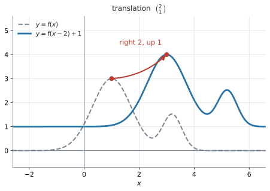
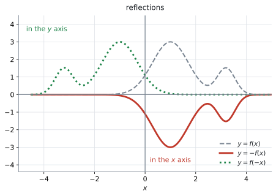
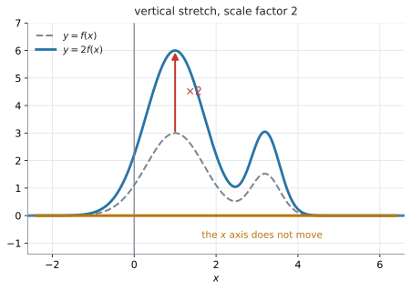
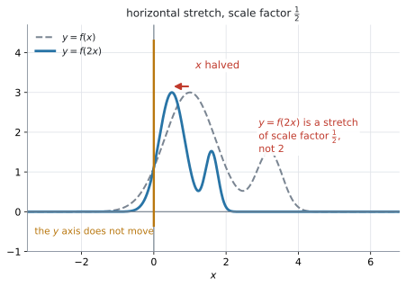
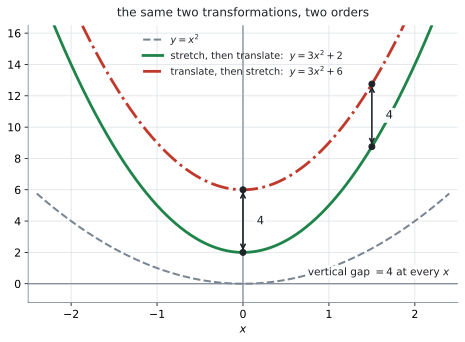
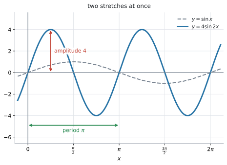

# AHL 2.8 — Transformations of graphs（グラフの変換） {#sec-ahl-2-8}

::: {.callout-note}
## What you should be able to do
- **translation**（平行移動）$y = f(x)+b$、$y = f(x-a)$ を、向きを間違えずに書ける。
- **reflection**（対称移動）$y = -f(x)$ と $y = f(-x)$ を見分けられる。
- **vertical stretch**（縦の拡大）$y = pf(x)$ と **horizontal stretch**（横の拡大）$y = f(qx)$ を書き、**$y = f(qx)$ の scale factor が $\dfrac{1}{q}$ である**ことを説明できる。
- 係数が**負のとき**は、scale factor を $\lvert p \rvert$ や $\dfrac{1}{\lvert q \rvert}$ とし、**reflection と組み合わせて**説明できる。
- $y = f(x)$ 上の点が、変換後にどこへ行くかを求められる。
- **composite transformation**（合成変換）の式を作り、**順序を変えると結果が変わる**場合を示せる。
:::

## The idea

### 1. transformation は「グラフを動かすこと」です {#idea}

$y = f(x)$ のグラフがあるとき、その式を少し書きかえると、グラフは**形を保ったまま動いたり、伸びたり、裏返ったり**します。これを **transformation**（変換）といいます。

シラバスが扱うのは、**translation**（平行移動）、**reflection**（対称移動）、**vertical stretch**（縦の拡大）、**horizontal stretch**（横の拡大）の $4$ 種類と、その組み合わせです。次の節から $1$ つずつ見ます。

どの図でも、**灰色の点線がもとの $y = f(x)$**、青や赤の線が変換したあとの **image**（像）です。

**大事なのは、$f$ が何なのかを知らなくてもよい**ことです。$f(x) = x^2$ でも $f(x) = \sin x$ でも $f(x) = 2^x$ でも、$y = f(x)+3$ は「上に $3$」です（@exm-ahl28-basic は $x^3-2x$、@exm-ahl28-reflect は $2^x+1$ で、同じ操作をしています）。

### 2. translation ── 縦は外に足し、横は中から引きます {#translation}

$$
y = f(x) + b \quad \text{は、上に } b
$$ {#eq-ahl28-vtrans}

$$
y = f(x - a) \quad \text{は、右に } a
$$ {#eq-ahl28-htrans}

{#fig-ahl28-translation width=70%}

@fig-ahl28-translation が、その両方を一度にやった例です。$y = f(x-2)+1$ は、**右に $2$、上に $1$** 動かしたものです。もとのグラフの山の頂上 $(1,\ 3)$ が $(3,\ 4)$ に移っています。

$2$ つをまとめて、**vector**（ベクトル）の形で書きます。

$$
\begin{pmatrix} a \\ b \end{pmatrix} \quad \text{だけ平行移動する}
$$

Guidance が例を挙げています。

> Translation by the vector $\begin{pmatrix} 3 \\ -2 \end{pmatrix}$ denotes horizontal translation of $3$ units to the right, and vertical translation of $2$ units down.

つまり $\begin{pmatrix} 3 \\ -2 \end{pmatrix}$ は「**右に $3$、下に $2$**」で、式は $y = f(x-3)-2$ です。

::: {.callout-warning}
## $f(x-3)$ が「右に $3$」です。左ではありません
ここが、この項目でいちばん間違えるところです。**引いてあるのに右に動く**からです。

$f(x) = x^2$ で確かめます。$y = f(x-3) = (x-3)^2$ の頂点は $x = 3$ です。もとの $y = x^2$ の頂点は $x = 0$ でしたから、たしかに**右に $3$** 動いています。

理由は [Why it works](#why-it-works) で説明します。**いまは、$1$ つ例で確かめる習慣**を付けてください。$f(x) = x^2$ なら $5$ 秒で確かめられます。
:::

### 3. reflection ── $-$ を外に付けるか、中に付けるか {#reflection}

$$
y = -f(x) \quad \text{は、} x \text{ 軸についての対称移動}
$$ {#eq-ahl28-xreflect}

$$
y = f(-x) \quad \text{は、} y \text{ 軸についての対称移動}
$$ {#eq-ahl28-yreflect}

{#fig-ahl28-reflection width=70%}

@fig-ahl28-reflection の赤い実線が $y = -f(x)$ で、**上下がひっくり返って**います。緑の点線が $y = f(-x)$ で、**左右がひっくり返って**います。

@eq-ahl28-xreflect と @eq-ahl28-yreflect の見分け方は $1$ つです。

- **$-$ が $f$ の外** … $y$ の値の符号が変わる → **上下**が変わる → $x$ 軸が鏡
- **$-$ が $f$ の中** … $x$ の値の符号が変わる → **左右**が変わる → $y$ 軸が鏡

「$x$ 軸についての対称移動」なのに式は $-f(x)$、「$y$ 軸についての対称移動」なのに式は $f(-x)$——**軸の名前と、式に出てくる文字が逆**になります。ここは覚えるしかありません。

### 4. vertical stretch ── $y = pf(x)$ {#vstretch}

$$
y = p\,f(x) \quad \text{は、vertical stretch with scale factor } p \qquad (p > 0)
$$ {#eq-ahl28-vstretch}

@eq-ahl28-vstretch の $p$ を **scale factor**（拡大率）といいます。**scale factor は正の大きさとして書きます。**

{#fig-ahl28-vstretch width=70%}

@fig-ahl28-vstretch が $p = 2$ の場合で、山の高さが $3$ から $6$ になっています。

**$y$ 座標だけが $p$ 倍になり、$x$ 座標は変わりません。** ですから

$$
(x,\ y) \ \longmapsto \ (x,\ py)
$$

です。$y = 0$ の点は $p$ をかけても $0$ のままなので、**$x$ 軸の上の点は動きません。** Guidance の `x and y axes are invariant.` は、$2$ つの stretch についての注意です。**vertical stretch では $x$ 軸の上の点が、horizontal stretch では $y$ 軸の上の点が動きません**（[第5節](#hstretch)）。**invariant**（不変な）は「動かない」という意味です。

$0 < p < 1$ なら縮み、$p > 1$ なら伸びます。**「拡大率」という日本語につられて、$1$ より大きい数だと決めつけないでください。**

**$p < 0$ のときは、$1$ つの変換ではありません。** $x$ 軸についての **reflection** と、scale factor $\lvert p \rvert$ の **vertical stretch** を組み合わせたものです。たとえば $y = -3f(x)$ は、$x$ 軸について折り返してから、縦に scale factor $3$ で拡大したものです。**$p = -3$ なら、裏返って $3$ 倍です。縮みません。**

**scale factor は $\lvert p \rvert$ であって、$-3$ ではありません。** `Describe the transformation` と問われたら、**折り返しと拡大の $2$ つを書いてください。**

### 5. horizontal stretch ── $y = f(qx)$ の scale factor は $\dfrac{1}{q}$ です {#hstretch}

$$
y = f(qx) \quad \text{は、横に } \frac{1}{q} \text{ 倍} \qquad (q > 0)
$$ {#eq-ahl28-hstretch}

$q < 0$ のときは、**scale factor $\dfrac{1}{\lvert q \rvert}$ の horizontal stretch** に加えて、**$y$ 軸についての対称移動**が起こります。$y = f(-x)$ が、そのいちばん簡単な場合です（[第3節](#reflection)）。$q = 0$ では $y = f(0)$ という水平な直線につぶれてしまうので、変換になりません。

シラバスも、この形で書いています。

> Horizontal stretch with scale factor $\dfrac{1}{q}$: $y = f(qx)$

{#fig-ahl28-hstretch width=70%}

@eq-ahl28-hstretch で $q = 2$ としたものが、@fig-ahl28-hstretch です。$y = f(2x)$ は、**横に $\dfrac{1}{2}$ 倍**——つまり半分に縮んでいます。山の頂上は $x = 1$ から $x = 0.5$ に移りました。

$$
(x,\ y) \ \longmapsto \ \left(\frac{x}{q},\ y\right)
$$

$x = 0$ の点は $\dfrac{1}{q}$ をかけても $0$ のままなので、**$y$ 軸の上の点は動きません**（[第4節](#vstretch)）。

::: {.callout-warning}
## $f(2x)$ は「$2$ 倍に広げる」ではありません
$y = f(2x)$ と書いてあると、$2$ 倍に広がりそうに見えます。**逆です。半分に縮みます。**

$f(x) = \sin x$ で確かめてください。$\sin x$ の周期は $2\pi$ ですが、$\sin 2x$ の周期は $\pi$ です。**$1$ 周が短くなっています**（@fig-ahl28-sine）。

`Describe the transformation` と問われたら、答えは「horizontal stretch with scale factor $\dfrac{1}{2}$」です。「scale factor $2$」と書くと違う変換になります。
:::

### 6. 「外は見たまま、中は逆」 {#outside-inside}

$4$ つを、$1$ つの表にまとめます。**$f$ の外にあるか、中にあるか**で、性格がはっきり分かれます。

| 式 | どこ | 何が変わるか | 動き | 動かない点 |
|:--|:--|:--|:--|:--|
| $y = f(x)+b$ | 外 | $y$ 座標 | 上に $b$ | なし |
| $y = -f(x)$ | 外 | $y$ 座標 | $x$ 軸で折り返し | $x$ 軸の上 |
| $y = p\,f(x)$ | 外 | $y$ 座標 | $y$ 座標を $p$ 倍する。$p<0$ なら reflection も起こり、stretch の scale factor は $\lvert p \rvert$ | $x$ 軸の上 |
| $y = f(x-a)$ | 中 | $x$ 座標 | 右に $a$ | なし |
| $y = f(-x)$ | 中 | $x$ 座標 | $y$ 軸で折り返し | $y$ 軸の上 |
| $y = f(qx)$ | 中 | $x$ 座標 | 横に $\dfrac{1}{q}$ 倍 | $y$ 軸の上 |

: $4$ つの変換 {#tbl-ahl28-four}

読み方は、次の $1$ 行です。

**$f$ の外の操作は、書いてあるとおりに $y$ に起こる。$f$ の中の操作は、$x$ に逆向きに起こる。**

- 外の $+b$ … $y$ が $b$ 増える（見たまま）
- 中の $-a$ … $x$ が $a$ **増える**（逆）
- 外の $\times p$ … $y$ が $p$ 倍（見たまま）
- 中の $\times q$ … $x$ が $\dfrac{1}{q}$ 倍（逆）

::: {.callout-tip}
## 点で追うのが、いちばん速い確かめ方です
$(x,\ y)$ がどこへ行くかを書けば、迷いません。

$$
y = 3f(x-2) \ \Longrightarrow \ (x,\ y) \longmapsto (x+2,\ 3y)
$$

**$x$ には逆の操作、$y$ には見たままの操作**です。$y = f(x)$ 上の点 $(4,\ 5)$ は、$(6,\ 15)$ に移ります。
:::

### 7. composite transformation ── 順序が結果を変えます {#composite}

$2$ つ以上の変換を続けて行うことを **composite transformation**（合成変換）といいます。Guidance が、わざわざ注意しています。

> Students should be made aware of the significance of the order of transformations.

シラバスの $1$ つ目の Example を見ます。

> **Example:** $y = x^2$ used to obtain $y = 3x^2+2$ by a vertical stretch of scale factor $3$ followed by a translation of $\begin{pmatrix} 0 \\ 2 \end{pmatrix}$.

**縦に $3$ 倍してから、上に $2$**（*a vertical stretch by $3$, followed by a shift up $2$*）です。順に書くと

$$
x^2 \ \xrightarrow[\ \text{stretch by } 3\ ]{\ \text{縦に } 3 \text{ 倍}\ } \ 3x^2 \ \xrightarrow[\ \text{shift up } 2\ ]{\ \text{上に } 2\ } \ 3x^2+2
$$

順を入れかえると、どうなるでしょうか。**上に $2$ してから、縦に $3$ 倍**（*a shift up $2$, followed by a vertical stretch by $3$*）します。

$$
x^2 \ \xrightarrow[\ \text{shift up } 2\ ]{\ \text{上に } 2\ } \ x^2+2 \ \xrightarrow[\ \text{stretch by } 3\ ]{\ \text{縦に } 3 \text{ 倍}\ } \ 3\left(x^2+2\right) = 3x^2+6
$$

{#fig-ahl28-order width=72%}

@fig-ahl28-order が、その $2$ 本です。$3x^2+2$ と $3x^2+6$ なので、**同じ $x$ でくらべると、$y$ の値がつねに $4$ だけちがいます。** 上に動かした $2$ も一緒に $3$ 倍されてしまうからです。

::: {.callout-note appearance="simple"}
**見た目のすき間は、$x$ が大きくなるほどせまく見えます。** ちがうのはあくまで**縦の $4$** で、$2$ 本のグラフの**間隔**ではありません。どちらも急に立ち上がるので、$x$ が $0$ から離れるほど、$2$ 本はくっついて見えます。**同じ $x$ のところで、縦にくらべてください。**
:::

::: {.callout-important}
## 外の操作は、$f$ に近いほうが先です
$y = 3f(x)+2$ という式を、内側から読んでください。

$$
f(x) \ \to \ 3f(x) \ \to \ 3f(x)+2
$$

**$f$ にくっついている $\times 3$ が先、いちばん外の $+2$ があと**です。[AHL 2.7](ahl-2-7.qmd#notation) の合成関数と同じ、「**内側が先**」の読み方です（ただしこれは、$f$ の**外**の操作についての話です。中の操作は、このすぐあとで扱います）。
:::

**中の操作は、そう単純ではありません。** $f(2x-6)$ のように、**$x$ の係数と定数が、同じかっこの中に混ざっている**からです。

**このまま「横に $\dfrac{1}{2}$ 倍して、右に $6$」と読むと、まちがえます。** そうならないために、かっこの中を $q(x-a)$ の形に**因数分解してから**読みます。

$$
y = f\bigl(q(x-a)\bigr) \quad \text{は、横に } \frac{1}{q} \text{ 倍してから、右に } a \qquad (q > 0)
$$ {#eq-ahl28-inside}

たとえば $y = f(2x-6)$ なら、$2x-6 = 2(x-3)$ なので、**横に $\dfrac{1}{2}$ 倍してから、右に $3$**（*a horizontal stretch by scale factor $\tfrac{1}{2}$, followed by a shift right $3$*）です。

::: {.callout-warning}
## $f(2x-6)$ には、正しい道すじが $2$ 通りあります。まちがいは「縮めてから右に $6$」です
同じ $f(2x-6)$ を作る道すじは、$2$ 通りあります。

- **右に $6$ 動かしてから、横に $\dfrac{1}{2}$ 倍**（*a shift right $6$, followed by a horizontal stretch by scale factor $\tfrac{1}{2}$*） … $f(x) \to f(x-6) \to f(2x-6)$
- **横に $\dfrac{1}{2}$ 倍してから、右に $3$**（*a horizontal stretch by scale factor $\tfrac{1}{2}$, followed by a shift right $3$*） … $f(x) \to f(2x) \to f\bigl(2(x-3)\bigr) = f(2x-6)$

**どちらも同じグラフで、どちらも正しい説明です**（演習 $7$）。右に $6$ 動かしてから半分に縮めれば、$6$ にあった特徴が $3$ に来るからです。

式だけを見て順序を答えるときは、@eq-ahl28-inside のほうが速く済みます。かっこを因数分解して、$q$ と $a$ をそのまま読むだけだからです。

まちがいなのは、**縮めてから右に $6$**（*a horizontal stretch by scale factor $\tfrac{1}{2}$, followed by a shift right $6$*）です。これは $f\bigl(2(x-6)\bigr) = f(2x-12)$ で、**別のグラフ**になります（演習 $7$ の (b)）。
:::

$2$ つ目の Example は、順序が問題にならない場合です。

> **Example:** $y = \sin x$ used to obtain $y = 4\sin 2x$ by a vertical stretch of scale factor $4$ and a horizontal stretch of scale factor $\dfrac{1}{2}$.

**縦の拡大と横の拡大は、片方が $y$ だけ、もう片方が $x$ だけを動かします。** ぶつからないので、どちらが先でも $4\sin 2x$ です。Guidance がここだけ `followed by` を使わず `and` で並べているのは、そのためだと読めます。

{#fig-ahl28-sine width=72%}

@fig-ahl28-sine が、その結果です。**amplitude（振幅）が $4$、period（周期）が $\pi$** になっています。

## Why it works

:::: {.callout-note collapse="true" appearance="simple"}
## クリックすると開きます
**なぜ $f$ の中をいじると、$x$ が逆向きに動くのか。** ここだけ説明します。

$y = f(x-3)$ のグラフを考えます。このグラフの上の点を $(X,\ Y)$ とすると

$$
Y = f(X-3)
$$

です。いっぽう、もとのグラフ $y = f(x)$ の上の点は $(t,\ f(t))$ の形をしています。

**この $2$ つを見くらべます。** $X - 3 = t$ のとき、$Y = f(t)$ になります。つまり、もとのグラフの点 $(t,\ f(t))$ とちょうど同じ高さの点が、新しいグラフでは

$$
X = t + 3
$$

のところに現れます。**高さは同じままで、$x$ 座標だけが $3$ 増える**——これが「右に $3$」です。

$$
(t,\ f(t)) \ \longmapsto \ (t+3,\ f(t))
$$

**引いたのに右に動くのは、「$f$ に $t$ を食べさせるために、$X$ を $3$ 多く用意しなければならない」から**です。中の操作は、$x$ が「補う」形で効きます。

横の拡大も同じです。$y = f(qx)$ の上の点 $(X,\ Y)$ で $qX = t$ とすると

$$
X = \frac{t}{q}
$$

なので、$x$ 座標が $\dfrac{1}{q}$ 倍になります。$q = 2$ なら半分です。

外の操作には、この「補う」動きがありません。$y = f(x)+3$ では $x$ をそのまま $f$ に入れて、**出てきた値に $3$ を足すだけ**です。だから $y$ が見たまま $3$ 増えます。

$$
(t,\ f(t)) \ \longmapsto \ (t,\ f(t)+3)
$$

**@eq-ahl28-inside の順序も、これで説明できます。** $y = f\bigl(q(x-a)\bigr)$ で $q(X-a) = t$ とすると

$$
X = \frac{t}{q} + a
$$

です。$t$ に対して**まず $\dfrac{1}{q}$ 倍し、そのあと $a$ を足して**います。だから「横に $\dfrac{1}{q}$ 倍してから、右に $a$」の順です。
::::

## Worked examples

::: {.callout-note appearance="simple"}
問題文は英語です。意味が理解できなかったら、問題文の下の「**日本語訳**」を開いてください。解説は日本語です。
:::

::: {#exm-ahl28-basic}
[Let $f(x) = x^{3}-2x$.]{.q-en}

**(a)** [Write down the equation of the graph of $y = f(x)$ after a translation of $\begin{pmatrix} 0 \\ 3 \end{pmatrix}$.]{.q-en}

**(b)** [Find, in expanded form, the equation of the graph of $y = f(x)$ after a translation of $\begin{pmatrix} 2 \\ 0 \end{pmatrix}$.]{.q-en}

**(c)** [The point $(1,\ -1)$ lies on $y = f(x)$. Find its image under the translation in part (b).]{.q-en}

<details class="jp-trans">
<summary>日本語訳</summary>

$f(x) = x^{3}-2x$ とします。

**(a)** $y = f(x)$ のグラフを $\begin{pmatrix} 0 \\ 3 \end{pmatrix}$ だけ平行移動したあとの式を書きなさい。

**(b)** $y = f(x)$ のグラフを $\begin{pmatrix} 2 \\ 0 \end{pmatrix}$ だけ平行移動したあとの式を、展開した形で求めなさい。

**(c)** 点 $(1,\ -1)$ は $y = f(x)$ の上にあります。(b) の平行移動による、この点の像を求めなさい。

</details>

---

**(a)** $\begin{pmatrix} 0 \\ 3 \end{pmatrix}$ は「横に $0$、上に $3$」です。縦の移動は**外に足します**（@eq-ahl28-vtrans）。

$$
y = x^{3}-2x+3
$$

**(b)** $\begin{pmatrix} 2 \\ 0 \end{pmatrix}$ は「右に $2$」です。横の移動は**中から引きます**（@eq-ahl28-htrans）。

$$
y = f(x-2) = (x-2)^{3} - 2(x-2)
$$

展開します。$(x-2)^{3} = x^{3}-6x^{2}+12x-8$ ですから

$$
y = x^{3}-6x^{2}+12x-8-2x+4 = x^{3}-6x^{2}+10x-4
$$

**$x$ を $x-2$ に置きかえるのは、$f(x)$ の $x$ が出てくるところ全部**です。$1$ か所だけ置きかえる誤りに注意してください。

**(c)** 右に $2$ 動くので、$x$ 座標だけが $2$ 増えます。

$$
(1,\ -1) \ \longmapsto \ (3,\ -1)
$$

**検算。** (b) の式に $x = 3$ を入れます。$27 - 54 + 30 - 4 = -1$ ✓ たしかに $(3,\ -1)$ を通ります。

::: {.callout-note}
## 解答例（答案用紙にはこう書く）
**(a)**
$$y = x^{3}-2x+3$$

**(b)**
$$y = (x-2)^{3}-2(x-2) = x^{3}-6x^{2}+10x-4$$

**(c)**
$$(3,\ -1)$$
:::
:::

::: {#exm-ahl28-reflect}
[Let $f(x) = 2^{x}+1$.]{.q-en}

**(a)** [Write down the equation of $y = -f(x)$ and the equation of $y = f(-x)$.]{.q-en}

**(b)** [The graph of $y = f(x)$ has a horizontal asymptote at $y = 1$. State the horizontal asymptote of each graph in part (a).]{.q-en}

**(c)** [The point $(2,\ 5)$ lies on $y = f(x)$. Find its image on each graph in part (a).]{.q-en}

<details class="jp-trans">
<summary>日本語訳</summary>

$f(x) = 2^{x}+1$ とします。

**(a)** $y = -f(x)$ の式と、$y = f(-x)$ の式を書きなさい。

**(b)** $y = f(x)$ のグラフは $y = 1$ に horizontal asymptote（水平漸近線）をもちます。(a) のそれぞれのグラフの horizontal asymptote を述べなさい。

**(c)** 点 $(2,\ 5)$ は $y = f(x)$ の上にあります。(a) のそれぞれのグラフ上での、この点の像を求めなさい。

</details>

---

**(a)** $-$ を**外**に付けるか、**中**に付けるかです（[第3節](#reflection)）。

$$
y = -f(x) = -\left(2^{x}+1\right) = -2^{x}-1
$$

$$
y = f(-x) = 2^{-x}+1
$$

**外に付けるときは、かっこを忘れないでください。** $-2^{x}+1$ と書くと、$+1$ の符号を変え損ねています。

**(b)** **asymptote**（漸近線）も、グラフの一部として一緒に動きます。

- $y = -f(x)$ … $x$ 軸で折り返すので、$y = 1$ は $y = -1$ になります
- $y = f(-x)$ … $y$ 軸で折り返しても**高さは変わらない**ので、$y = 1$ のままです（ただし、グラフが近づいていく**向き**は左右が入れかわります）

**(c)** 点の追い方は [第6節](#outside-inside) のとおりです。

- $y = -f(x)$ … $y$ の符号だけ変わる → $(2,\ -5)$
- $y = f(-x)$ … $x$ の符号だけ変わる → $(-2,\ 5)$

**検算。** $y = -f(x) = -2^{x}-1$ に $x = 2$ を入れると $-4-1 = -5$ ✓（$-2^{x}+1$ と書いていれば $-3$ になるので、ここで気づけます）

$y = f(-x) = 2^{-x}+1$ に $x = -2$ を入れると $2^{2}+1 = 5$ ✓

::: {.callout-note}
## 解答例（答案用紙にはこう書く）
**(a)**
$$y = -f(x) = -2^{x}-1, \qquad y = f(-x) = 2^{-x}+1$$

**(b)**
*For $y = -f(x)$: $y = -1$.  For $y = f(-x)$: $y = 1$.*

**(c)**
$$(2,\ -5) \text{ and } (-2,\ 5)$$
:::
:::

::: {#exm-ahl28-order}
[The graph of $y = x^{2}$ is transformed by a vertical stretch with scale factor $3$, followed by a translation of $\begin{pmatrix} 0 \\ 2 \end{pmatrix}$.]{.q-en}

**(a)** [Find the equation of the resulting graph.]{.q-en}

**(b)** [Find the equation that results when the same two transformations are applied in the opposite order.]{.q-en}

**(c)** [Explain why the two orders give different graphs.]{.q-en}

<details class="jp-trans">
<summary>日本語訳</summary>

$y = x^{2}$ のグラフに、scale factor $3$ の vertical stretch を行い、続いて $\begin{pmatrix} 0 \\ 2 \end{pmatrix}$ の平行移動を行います。

**(a)** できあがるグラフの式を求めなさい。

**(b)** 同じ $2$ つの変換を逆の順で行ったときにできる式を求めなさい。

**(c)** $2$ つの順序で違うグラフになる理由を説明しなさい。

</details>

---

**(a)** 順に書きます。

$$
x^{2} \ \xrightarrow[\ \text{stretch by } 3\ ]{\ \text{縦に } 3 \text{ 倍}\ } \ 3x^{2} \ \xrightarrow[\ \text{shift up } 2\ ]{\ \text{上に } 2\ } \ 3x^{2}+2
$$

$$
y = 3x^{2}+2
$$

シラバスの Example と同じ式になりました。

**(b)** 逆の順です。**先に上に $2$**、そのあとで全体を $3$ 倍します。

$$
x^{2} \ \xrightarrow[\ \text{shift up } 2\ ]{\ \text{上に } 2\ } \ x^{2}+2 \ \xrightarrow[\ \text{stretch by } 3\ ]{\ \text{縦に } 3 \text{ 倍}\ } \ 3\left(x^{2}+2\right) = 3x^{2}+6
$$

$$
y = 3x^{2}+6
$$

**かっこを付けてから展開する**のが確実です。$x^{2}+2$ を $3$ 倍するのですから、$+2$ も $3$ 倍されます。

**(c)** `Explain why` なので、英語で理由を書きます。**数を $1$ 組出す**と短く済みます。

同じ $x$ での**縦の差**は $3x^{2}+6-\left(3x^{2}+2\right) = 4$ で、$x$ によりません（@fig-ahl28-order）。この $4$ は、**上に動かした $2$ が余分に $3$ 倍された分**です。

$$
3 \times 2 - 2 = 6 - 2 = 4
$$

::: {.model-answer}
**試験ではこう書く**

*Stretching first gives $y = 3x^{2}+2$, but translating first gives $y = 3\left(x^{2}+2\right) = 3x^{2}+6$. The two differ by $4$ for every value of $x$. When the translation is done first, the $2$ that was added is itself multiplied by the scale factor $3$, giving $6$ instead of $2$. The vertical stretch and the vertical translation both change the $y$ coordinate, so the order in which they are applied matters.*
:::

（先に拡大すると $y = 3x^2+2$ になるが、先に平行移動すると $3(x^2+2) = 3x^2+6$ になる。どの $x$ でも $4$ だけ違う。平行移動を先にすると、足した $2$ そのものが scale factor $3$ で $3$ 倍され、$2$ ではなく $6$ になるからである。vertical stretch も vertical translation も $y$ 座標を変えるので、順序が結果に効く、という意味です。）

::: {.callout-note}
## 解答例（答案用紙にはこう書く）
**(a)**
$$y = 3x^{2}+2$$

**(b)**
$$y = 3\left(x^{2}+2\right) = 3x^{2}+6$$

**(c)**
*Both transformations change the $y$ coordinate. If the translation is applied first, the $+2$ is also multiplied by $3$, giving $3x^{2}+6$ instead of $3x^{2}+2$. The two graphs differ by $4$ for every $x$.*
:::
:::

::: {#exm-ahl28-sine}
[The graph of $y = \sin x$ is transformed into the graph of $y = 4\sin 2x$.]{.q-en}

**(a)** [Describe fully the two transformations involved.]{.q-en}

**(b)** [Write down the amplitude and the period of $y = 4\sin 2x$.]{.q-en}

**(c)** [The point $\left(\dfrac{\pi}{2},\ 1\right)$ lies on $y = \sin x$. Find its image on $y = 4\sin 2x$.]{.q-en}

<details class="jp-trans">
<summary>日本語訳</summary>

$y = \sin x$ のグラフが、$y = 4\sin 2x$ のグラフに変換されます。

**(a)** 関係している $2$ つの変換を、完全に述べなさい。

**(b)** $y = 4\sin 2x$ の amplitude と period を書きなさい。

**(c)** 点 $\left(\dfrac{\pi}{2},\ 1\right)$ は $y = \sin x$ の上にあります。$y = 4\sin 2x$ 上での、この点の像を求めなさい。

</details>

---

**(a)** `Describe fully` は、**変換の名前と scale factor の両方**を求めています。

- 外の $4$ … vertical stretch, scale factor $4$
- 中の $2$ … horizontal stretch, scale factor $\dfrac{1}{2}$

**中の $2$ を「scale factor $2$」と書かないでください**（[第5節](#hstretch)）。

::: {.model-answer}
**試験ではこう書く**

*A vertical stretch with scale factor $4$ (the $x$ axis is invariant), together with a horizontal stretch with scale factor $\dfrac{1}{2}$ (the $y$ axis is invariant). The two stretches change different coordinates, so they may be applied in either order.*
:::

（scale factor $4$ の vertical stretch（$x$ 軸は動かない）と、scale factor $\frac{1}{2}$ の horizontal stretch（$y$ 軸は動かない）である。$2$ つの拡大は別々の座標を変えるので、どちらの順で行ってもよい、という意味です。）

**(b)** [SL 2.5](../../ai-sl/02-functions/sl-2-5.qmd#sinusoidal) の読み方がそのまま使えます。

- amplitude … 外の係数なので $4$
- period … $\dfrac{2\pi}{2} = \pi$

@fig-ahl28-sine で、山の高さが $4$、$1$ 周の長さが $\pi$ になっていることを確かめてください。

**(c)** $x$ 座標は $\dfrac{1}{2}$ 倍、$y$ 座標は $4$ 倍です。

$$
\left(\frac{\pi}{2},\ 1\right) \ \longmapsto \ \left(\frac{\pi}{4},\ 4\right)
$$

**検算。** $4\sin\left(2 \times \dfrac{\pi}{4}\right) = 4\sin\dfrac{\pi}{2} = 4$ ✓ 合いました。

::: {.callout-note}
## 解答例（答案用紙にはこう書く）
**(a)**
*A vertical stretch with scale factor $4$, and a horizontal stretch with scale factor $\dfrac{1}{2}$.*

**(b)**
*Amplitude $4$; period $\dfrac{2\pi}{2} = \pi$.*

**(c)**
$$\left(\frac{\pi}{4},\ 4\right)$$
:::
:::

## Common errors

::: {.callout-warning}
## $y = f(x-a)$ の向きを、左右まちがえる
$-a$ と書いてあるので左に見えますが、**右に $a$** です。

$$
y = (x-3)^{2} \ \text{の頂点は} \ x = 3
$$

**$f(x) = x^2$ で $1$ 回確かめる**——これを毎回やってください（[第2節](#translation)）。理由は [Why it works](#why-it-works) にあります。
:::

::: {.callout-warning}
## $y = f(qx)$ の scale factor を $q$ と書く
$y = f(2x)$ は **scale factor $\tfrac{1}{2}$** の horizontal stretch です。$2$ ではありません。

`Describe the transformation` で $\dfrac{1}{q}$ と書けていなければ、その部分は別の変換の説明になります。

$\sin x$ の周期 $2\pi$ が、$\sin 2x$ では $\pi$ に**短くなる**——この $1$ 例を覚えておけば、向きを取りちがえません（[第5節](#hstretch)）。
:::

::: {.callout-warning}
## $-f(x)$ のかっこを外すときに、後ろの項を忘れる
$f(x) = 2^{x}+1$ のとき

$$
-f(x) = -\left(2^{x}+1\right) = -2^{x}-1
$$

です。$-2^{x}+1$ は誤りです。**$f$ の全部に $-$ が掛かります。**

$y = 3f(x)$ でも同じで、$f(x) = x^2+5$ なら $3x^2+15$ です。$3x^2+5$ ではありません。
:::

::: {.callout-warning}
## 縦の拡大と縦の平行移動を、順序を考えずに書く
$y = 3f(x)+2$ と $y = 3\bigl(f(x)+2\bigr)$ は**別の関数**です。後者は $3f(x)+6$ です。

**どちらも $y$ 座標を変える変換**なので、順序が効きます（@exm-ahl28-order）。

いっぽう、**縦の拡大と横の拡大は順序を気にしなくて構いません。** 変える座標が違うからです（@exm-ahl28-sine）。**「順序はいつも効く」でも「いつも効かない」でもありません。何と何が同じ座標を動かすかで決まります。**
:::

::: {.callout-warning}
## 変換したあとの asymptote を、動かし忘れる
指数関数や有理関数では、asymptote もグラフの一部です。

$y = 2^{x}$ の asymptote は $y = 0$ ですが、$y = 2^{x}+1$ では $y = 1$、$y = -2^{x}$ では $y = 0$ のまま、$y = 3 \cdot 2^{x} + 1$ では $y = 1$ です。

**縦の拡大は $y = 0$ を動かしませんが、縦の平行移動は動かします**（@exm-ahl28-reflect）。
:::

## Using your GDC (TI-Nspire CX II)

### 1. もとの関数に名前を付けてから、変換を書く {#gdc-define}

```
ctrl + doc → Add Graphs
```

入力欄に、もとの関数と、変換したものを並べて入れます。

- $f1(x) = x^{2}$
- $f2(x) = 3 \times f1(x) + 2$

**$2$ 行目で $1$ 行目を使えます。** $f1$ を書きかえれば $f2$ も一緒に変わるので、「$f$ が何であっても同じ動きをする」ことがそのまま確かめられます。

$1$ 行目を `f1(x)=sin(x)` や $f1(x) = 2^{x}$ に打ちかえて、同じ $f2$ がどう動くか見てください。

### 2. スライダーで、scale factor を動かす {#gdc-slider}

Graphs ページで、変数を動かすつまみを置けます。TI 公式のヘルプでは、Graphs・Geometry・Data & Statistics のページで

```
menu → Actions → Insert Slider
```

と説明されています。変数名を `p` として

```
f2(x)=p*f1(x)
```

と入れると、$p$ を動かしながらグラフの伸び縮みが見えます。**$p$ を $0$ と $1$ のあいだにすると縮み、$1$ より大きくすると伸び、負にすると裏返る**ことが、その場で確かめられます（[第4節](#vstretch)）。

`f2(x)=f1(q*x)` にすれば、横の拡大が見えます。**$q$ を正の範囲で大きくするほど細くなります**（scale factor が $\dfrac{1}{q}$ だからです）。$q$ を負にすると $y$ 軸について裏返り、$q = 0$ ではグラフが水平な直線につぶれます。スライダーの初めの範囲には負の数と $0$ が入っているので、そこも一度動かしてみてください。[第5節](#hstretch) の落とし穴は、これを $1$ 回見ておくのがいちばん早い対策です。

### 3. 点の像を、数で確かめる {#gdc-point}

Graphs と**同じ problem の中**の Calculator ページで、$f1$ と $f2$ の値を比べます。自分が手で出した像の座標と、電卓の値を突き合わせるための節です。

```
f1(2)
f2(2)
```

$y = 3f(x)+2$ なら、$f2(2)$ は $3 \times f1(2) + 2$ になります。**手で出した像の $y$ 座標**と、この数が合うかを見てください。

横の変換は、**入れる $x$ のほうを変えて**確かめます。Graphs ページで

```
f2(x)=f1(2*x)
```

と入れなおしてから、Calculator ページで

```
f1(4)
f2(2)
```

を比べます。同じ値になれば、**もとの $x = 4$ の点が、新しいグラフでは $x = 2$ にある**ということです。

::: {.callout-warning}
## 電卓は「scale factor がいくつか」を答えてくれません
グラフを見て「縮んだ」ことは分かりますが、**それが $\dfrac{1}{2}$ 倍なのか $\dfrac{1}{3}$ 倍なのかは、目では決まりません。**

`Describe the transformation` の答えは、式から読むものです（@tbl-ahl28-four）。電卓は、読み取った答えが正しいかを見るために使ってください。
:::

### 4. 検算のしかた {#gdc-check}

- **点を $1$ つ選んで追う。** もとのグラフの分かりやすい点（頂点、切片、山の頂上）が、どこへ行くかを式と見くらべる
- **$f1$ を別の関数に取りかえてみる。** 同じ変換なら、同じ動き方をするはずです
- 合成のときは、**$2$ つの順序で $2$ 本かいて重ねる。** 重ならなければ、順序が効いています（@fig-ahl28-order）
- 三角関数なら、**周期と振幅を画面で読む。** $4\sin 2x$ なら、$4$ と $\pi$ です

$1$ つ目がいちばん確実です。**点が合っていれば、向きも scale factor も合っています。**

## Exercises

::: {.callout-note appearance="simple"}
各問題に、折りたたみが3つ付いています。**日本語訳**、**解答例**（答案用紙に書くべきこと。英語です）、**解説**（なぜそうなるか。日本語です）。

まず自分で解いて、次に解答例と見くらべてください。**解説は、合わなかったときだけ開けば十分です。**
:::

::: {.exercise-block}

[1]{.ex-no} [Let $f(x) = x^{2}+1$. Write down the equation of $y = f(x)-3$, and find, in expanded form, the equation of $y = f(x+4)$.]{.q-en}

<details class="jp-trans">
<summary>日本語訳</summary>

$f(x) = x^{2}+1$ とします。$y = f(x)-3$ の式を書き、$y = f(x+4)$ の式を展開した形で求めなさい。

</details>

::: {.callout-note collapse="true"}
## 解答例（答案用紙に書くこと）

$$y = f(x)-3 = x^{2}-2$$

$$y = f(x+4) = (x+4)^{2}+1 = x^{2}+8x+17$$
:::

::: {.callout-tip collapse="true"}
## 解説

$1$ つ目は外の操作なので、**そのまま $3$ 引く**だけです（@tbl-ahl28-four）。

$2$ つ目は中の操作です。$f(x+4) = f\bigl(x-(-4)\bigr)$ なので **左に $4$** です。右ではありません（[第2節](#translation)）。

$f$ の $x$ を全部 $x+4$ に置きかえます。$f(x) = x^2+1$ の $x$ は $1$ か所だけなので、$(x+4)^2+1$ です。

**検算。** もとの頂点は $(0,\ 1)$。左に $4$ なので、新しい頂点は $(-4,\ 1)$ のはずです。$x = -4$ を入れると $16-32+17 = 1$ ✓
:::

::: {.ex-sep}
:::

[2]{.ex-no} [The graph of $y = f(x)$ is transformed into the graph of $y = f(x-5)+2$. Describe fully the transformation.]{.q-en}

<details class="jp-trans">
<summary>日本語訳</summary>

$y = f(x)$ のグラフが $y = f(x-5)+2$ のグラフに変換されます。この変換を完全に述べなさい。

</details>

::: {.callout-note collapse="true"}
## 解答例（答案用紙に書くこと）

*A translation of $5$ units to the right and $2$ units up, that is, a translation by the vector $\begin{pmatrix} 5 \\ 2 \end{pmatrix}$.*
:::

::: {.callout-tip collapse="true"}
## 解説

`Describe fully` なので、**向きと大きさの両方**を書きます。「a translation」だけでは足りません。

中の $-5$ は **右に $5$**、外の $+2$ は **上に $2$** です（@tbl-ahl28-four）。

ベクトルで書くと $\begin{pmatrix} 5 \\ 2 \end{pmatrix}$ です。Guidance が示した書き方に合わせてあります。

**この $2$ つは順序を気にしなくて構いません。** 縦と横で、変える座標が違うからです。

::: {.model-answer}
**試験ではこう書く**

*The graph is translated by the vector $\begin{pmatrix} 5 \\ 2 \end{pmatrix}$: $5$ units in the positive $x$ direction and $2$ units in the positive $y$ direction. Every point $(x,\ y)$ on $y = f(x)$ maps to $(x+5,\ y+2)$.*
:::
:::

::: {.ex-sep}
:::

[3]{.ex-no} [Let $f(x) = x^{3}$. Show that $y = -f(x)$ and $y = f(-x)$ give the same graph.]{.q-en}

<details class="jp-trans">
<summary>日本語訳</summary>

$f(x) = x^{3}$ とします。$y = -f(x)$ と $y = f(-x)$ が同じグラフになることを示しなさい。

</details>

::: {.callout-note collapse="true"}
## 解答例（答案用紙に書くこと）

$$y = -f(x) = -x^{3}$$

$$y = f(-x) = (-x)^{3} = -x^{3}$$

*The two equations are identical, so the graphs are the same.*
:::

::: {.callout-tip collapse="true"}
## 解説

`Show that` なので、**$2$ つの式を別々に作ってから**、同じであることを述べます。

$(-x)^{3} = (-1)^{3}x^{3} = -x^{3}$ です。**$3$ 乗は奇数乗なので、負号が外に出ます。**

**これは $f(x) = x^{3}$ だからです。** $f(x) = x^{2}$ なら $-f(x) = -x^{2}$、$f(-x) = x^{2}$ で、まったく違うグラフになります。**$2$ つの reflection がいつも一致するわけではありません**（[第3節](#reflection)）。

**検算。** 点 $(2,\ 8)$ で見ます。$x$ 軸で折り返すと $(2,\ -8)$、$y$ 軸で折り返すと $(-2,\ 8)$。どちらも $y = -x^{3}$ の上にあります ✓
:::

::: {.ex-sep}
:::

[4]{.ex-no} [Let $f(x) = x^{2}-x$. Find, in expanded form, the equations of $y = 3f(x)$ and $y = f(2x)$.]{.q-en}

<details class="jp-trans">
<summary>日本語訳</summary>

$f(x) = x^{2}-x$ とします。$y = 3f(x)$ と $y = f(2x)$ の式を、展開した形で求めなさい。

</details>

::: {.callout-note collapse="true"}
## 解答例（答案用紙に書くこと）

$$y = 3f(x) = 3\left(x^{2}-x\right) = 3x^{2}-3x$$

$$y = f(2x) = (2x)^{2}-(2x) = 4x^{2}-2x$$
:::

::: {.callout-tip collapse="true"}
## 解説

$3f(x)$ は**全体を $3$ 倍**します。$3x^2-x$ は誤りです（[Common errors](#common-errors) の $3$ つ目）。

$f(2x)$ は **$f$ の $x$ を全部 $2x$ に置きかえます**。$(2x)^2 = 4x^2$ で、$2x^2$ ではありません。

**$2$ つは別の変換です。** $3f(x)$ は縦に $3$ 倍、$f(2x)$ は横に $\dfrac{1}{2}$ 倍です。

**検算。** $x = 2$ で見ます。$f(2) = 4-2 = 2$ なので $3f(2) = 6$。式では $12-6 = 6$ ✓ また $f(4) = 16-4 = 12$ なので $f(2 \times 2) = 12$。式では $4(2)^{2}-2(2) = 16-4 = 12$ ✓
:::

::: {.ex-sep}
:::

[5]{.ex-no} [The graph of $y = f(x)$ is transformed into the graph of $y = f(5x)$. Describe fully the transformation, and state which points do not move.]{.q-en}

<details class="jp-trans">
<summary>日本語訳</summary>

$y = f(x)$ のグラフが $y = f(5x)$ のグラフに変換されます。この変換を完全に述べ、動かない点がどれかを答えなさい。

</details>

::: {.callout-note collapse="true"}
## 解答例（答案用紙に書くこと）

*A horizontal stretch with scale factor $\dfrac{1}{5}$. The $y$ axis is invariant, so any point of the graph on the $y$ axis does not move.*
:::

::: {.callout-tip collapse="true"}
## 解説

**$5$ ではなく $\dfrac{1}{5}$** です（[第5節](#hstretch)）。$y = f(qx)$ の scale factor は $\dfrac{1}{q}$ でした。

$x$ 座標が $\dfrac{1}{5}$ 倍になるので、グラフは $y$ 軸に向かって縮みます。

$x = 0$ の点だけは $\dfrac{1}{5}$ をかけても $0$ のままなので、動きません。Guidance の `x and y axes are invariant.` が、これを指しています。

::: {.model-answer}
**試験ではこう書く**

*It is a horizontal stretch with scale factor $\dfrac{1}{5}$: each point $(x,\ y)$ on $y = f(x)$ maps to $\left(\dfrac{x}{5},\ y\right)$. The $y$ coordinate is unchanged, and points with $x = 0$ stay where they are, so the $y$ axis is invariant.*
:::
:::

::: {.ex-sep}
:::

[6]{.ex-no} [The point $(6,\ -2)$ lies on the graph of $y = f(x)$. Find the image of this point on each of the following graphs.]{.q-en}

**(a)** [$y = f(x)+7$]{.q-en}  **(b)** [$y = f(x-1)$]{.q-en}  **(c)** [$y = 2f(x)$]{.q-en}  **(d)** [$y = f(2x)$]{.q-en}

<details class="jp-trans">
<summary>日本語訳</summary>

点 $(6,\ -2)$ は $y = f(x)$ のグラフ上にあります。次のそれぞれのグラフ上での、この点の像を求めなさい。

**(a)** $y = f(x)+7$　**(b)** $y = f(x-1)$　**(c)** $y = 2f(x)$　**(d)** $y = f(2x)$

</details>

::: {.callout-note collapse="true"}
## 解答例（答案用紙に書くこと）

**(a)** $(6,\ 5)$

**(b)** $(7,\ -2)$

**(c)** $(6,\ -4)$

**(d)** $(3,\ -2)$
:::

::: {.callout-tip collapse="true"}
## 解説

$(x,\ y)$ がどこへ行くかを書いてから、数を入れてください（[第6節](#outside-inside)）。

- **(a)** 外の $+7$ → $(x,\ y+7)$ → $(6,\ 5)$
- **(b)** 中の $-1$ → $(x+1,\ y)$ → $(7,\ -2)$
- **(c)** 外の $\times 2$ → $(x,\ 2y)$ → $(6,\ -4)$
- **(d)** 中の $\times 2$ → $\left(\dfrac{x}{2},\ y\right)$ → $(3,\ -2)$

**(c)** で $y$ が $-4$ になるところに注意してください。$-2$ を $2$ 倍すれば $-4$ です。**負の数でも、$2$ 倍は「$x$ 軸から $2$ 倍遠ざかる」**という意味です。

**(d)** で $x$ が $3$ になるのが、いちばん間違えやすいところです。$f(2x)$ は横に $\dfrac{1}{2}$ 倍なので、$6$ は $3$ に来ます。$12$ ではありません。

**検算。** $f$ が何であっても答えは同じなので、条件に合う関数を $1$ つ選んで確かめられます。$f(x) = \dfrac{x}{3}-4$ とすると $f(6) = 2-4 = -2$ ✓ 問題の条件を満たしています。

- **(a)** $f(6)+7 = -2+7 = 5$ → $(6,\ 5)$ ✓
- **(b)** $f(7-1) = f(6) = -2$ → $(7,\ -2)$ ✓
- **(c)** $2f(6) = -4$ → $(6,\ -4)$ ✓
- **(d)** $f(2 \times 3) = f(6) = -2$ → $(3,\ -2)$ ✓
:::

::: {.ex-sep}
:::

[7]{.ex-no} [The graph of $y = f(x)$ is translated $6$ units to the right and then stretched horizontally with scale factor $\dfrac{1}{2}$.]{.q-en}

**(a)** [Show that the resulting graph is $y = f(2x-6)$.]{.q-en}

**(b)** [Find the equation of the graph obtained when the same two transformations are applied in the opposite order.]{.q-en}

<details class="jp-trans">
<summary>日本語訳</summary>

$y = f(x)$ のグラフを右に $6$ 平行移動し、続いて scale factor $\dfrac{1}{2}$ で horizontal stretch します。

**(a)** できあがるグラフが $y = f(2x-6)$ であることを示しなさい。

**(b)** 同じ $2$ つの変換を逆の順で行ったときにできるグラフの式を求めなさい。

</details>

::: {.callout-note collapse="true"}
## 解答例（答案用紙に書くこと）

**(a)**
*Translating $6$ to the right gives $y = f(x-6)$.*

*A horizontal stretch with scale factor $\dfrac{1}{2}$ replaces $x$ by $2x$:*

$$y = f(2x-6)$$

**(b)**
*Stretching first gives $y = f(2x)$. Translating $6$ to the right then replaces $x$ by $x-6$:*

$$y = f\bigl(2(x-6)\bigr) = f(2x-12)$$
:::

::: {.callout-tip collapse="true"}
## 解説

**(a)** $2$ 段階に分けて書くのが確実です。まず $f(x-6)$、そのあと $x$ を $2x$ に置きかえます。

**horizontal stretch scale factor $\dfrac{1}{2}$ は、$x$ を $2x$ に置きかえること**でした（[第5節](#hstretch)）。$\dfrac{x}{2}$ ではありません。

**(b)** 逆の順です。先に $f(2x)$ を作り、そのあと右に $6$ 動かします。**そのときも、$x$ を $x-6$ に置きかえる**——ただし、置きかえる先はいまの式の $x$ 全部です。

$$f(2x) \ \to \ f\bigl(2(x-6)\bigr) = f(2x-12)$$

$f(2x-6)$ と $f(2x-12)$ は**別のグラフ**です。**横の平行移動と横の拡大は、どちらも $x$ 座標を動かす**ので、順序が効きます（[第7節](#composite)）。

**検算。** $f$ の上の点 $(0,\ f(0))$ を追います。(a) では $2x-6 = 0$ すなわち $x = 3$、(b) では $2x-12 = 0$ すなわち $x = 6$。違う場所に来ました ✓

なお (a) の答えは $2x-6 = 2(x-3)$ と因数分解できるので、@eq-ahl28-inside の読み方では「**横に $\dfrac{1}{2}$ 倍してから、右に $3$**」とも説明できます。**同じグラフを、別の $2$ 段階で作っている**だけです。
:::

::: {.ex-sep}
:::

[8]{.ex-no} [At a harbour, the height of the water above its mean level, in metres, is modelled by $d(t) = 2\sin\left(\dfrac{\pi t}{6}\right)$, where $t$ is the time in hours after midnight.]{.q-en}

[At a second harbour the pattern is the same shape, but the tide arrives $3$ hours later and the height above the mean level is $1.5$ times as large.]{.q-en}

**(a)** [Write down a model for the second harbour, in terms of $t$.]{.q-en}

**(b)** [The first harbour has its highest water at $t = 3$. Interpret what your model in part (a) says about the second harbour.]{.q-en}

<details class="jp-trans">
<summary>日本語訳</summary>

ある港で、平均水位からの水の高さ（メートル）が $d(t) = 2\sin\left(\dfrac{\pi t}{6}\right)$ でモデル化されます。$t$ は真夜中からの経過時間（時間）です。

$2$ つ目の港では、形は同じですが、潮が $3$ 時間遅れて来て、平均水位からの高さが $1.5$ 倍になります。

**(a)** $2$ つ目の港のモデルを、$t$ を用いて書きなさい。

**(b)** $1$ つ目の港は $t = 3$ で最高水位になります。(a) のモデルが $2$ つ目の港について何を言っているかを解釈しなさい。

</details>

::: {.callout-note collapse="true"}
## 解答例（答案用紙に書くこと）

**(a)**
$$1.5\,d(t-3) = 3\sin\left(\frac{\pi(t-3)}{6}\right)$$

**(b)**
*The second harbour follows the same $12$-hour cycle, but its high water occurs $3$ hours later, at $t = 6$, and the water then reaches $3$ m above the mean level instead of $2$ m.*
:::

::: {.callout-tip collapse="true"}
## 解説

**(a)** $2$ つの変換を、言葉から式に直します。

- 「$3$ 時間遅れて来る」… **右に $3$** の平行移動 → $d(t-3)$
- 「高さが $1.5$ 倍」… **縦に $1.5$ 倍** の vertical stretch → $1.5\,d(\ )$

$$1.5 \times 2 = 3$$

なので、振幅は $3$ になります。**$1.5\,d(t-3)$ と書いてから展開する**のが確実です。

$d$ は平均水位からの**高さ**なので、$0$ が平均です。$x$ 軸が動かないことが、そのまま「平均水位は変わらない」という意味になります（[第4節](#vstretch)）。

**(b)** `Interpret` なので、**数式ではなく文脈の言葉**で答えます。

周期は $\dfrac{2\pi}{\pi/6} = 12$ 時間で、これは変わりません。**横の平行移動は周期を変えません。**

**検算。** $t = 6$ を入れると $3\sin\left(\dfrac{\pi \times 3}{6}\right) = 3\sin\dfrac{\pi}{2} = 3$ ✓ 最高水位 $3$ m が $t = 6$ に来ています。

::: {.model-answer}
**試験ではこう書く**

*The second harbour has the same $12$-hour cycle as the first, because the horizontal translation does not change the period. Its high water occurs $3$ hours later, at $t = 6$, and at that time the water is $3$ m above the mean level rather than $2$ m, since the vertical stretch of scale factor $1.5$ multiplies every height by $1.5$. The mean level itself is unchanged.*
:::
:::

::: {.ex-sep}
:::

[9]{.ex-no} [A student writes]{.q-en}

> [The graph of $y = f(x+3)$ is the graph of $y = f(x)$ moved $3$ units to the right.]{.q-en}

[Identify the error and state the correct transformation.]{.q-en}

<details class="jp-trans">
<summary>日本語訳</summary>

ある生徒が「$y = f(x+3)$ のグラフは、$y = f(x)$ のグラフを右に $3$ 動かしたものである」と書きました。誤りを指摘し、正しい変換を述べなさい。

</details>

::: {.callout-note collapse="true"}
## 解答例（答案用紙に書くこと）

*The direction is wrong. $y = f(x-a)$ is a translation of $a$ units to the right, so $y = f(x+3) = f\bigl(x-(-3)\bigr)$ is a translation of $3$ units to the **left**.*

*For example, if $f(x) = x^{2}$, the vertex of $y = f(x+3) = (x+3)^{2}$ is at $x = -3$, which is $3$ units to the left of the vertex of $y = x^{2}$.*
:::

::: {.callout-tip collapse="true"}
## 解説

`Identify the error` なので、**どこが違うかを言葉で書きます。**

生徒は「$+3$ だから正の向き（右）」と考えたのでしょう。**中の操作は、$x$ に逆向きに効きます**（[第6節](#outside-inside)）。

いちばん強い示し方は、**具体的な $f$ で反例を出す**ことです。$f(x) = x^2$ なら、$(x+3)^2$ の頂点は $x = -3$。左です。

$y = f(x-a)$ の形に**そろえてから**読むと、間違えません。$f(x+3) = f\bigl(x-(-3)\bigr)$ なので $a = -3$、つまり「右に $-3$」＝「左に $3$」です。

::: {.model-answer}
**試験ではこう書く**

*The direction is the wrong way round. In $y = f(x-a)$ the graph moves $a$ units to the right, so $y = f(x+3)$, which is $y = f\bigl(x-(-3)\bigr)$, moves $3$ units to the **left**. Taking $f(x) = x^{2}$ shows this: the vertex of $y = (x+3)^{2}$ is at $x = -3$, not $x = 3$. Transformations inside $f$ act on $x$ in the opposite sense to the sign that is written.*
:::
:::

::: {.ex-sep}
:::

[10]{.ex-no} [The graph of $y = f(x)$ has a maximum point at $(2,\ 7)$ and crosses the $x$ axis at $x = -1$ and at $x = 5$.]{.q-en}

[Find the coordinates of the maximum point, and the $x$ intercepts, of the graph of $y = 3f(x-4)$.]{.q-en}

<details class="jp-trans">
<summary>日本語訳</summary>

$y = f(x)$ のグラフは $(2,\ 7)$ に最大点をもち、$x = -1$ と $x = 5$ で $x$ 軸と交わります。

$y = 3f(x-4)$ のグラフの最大点の座標と、$x$ 切片を求めなさい。

</details>

::: {.callout-note collapse="true"}
## 解答例（答案用紙に書くこと）

*The transformation maps $(x,\ y)$ to $(x+4,\ 3y)$.*

*Maximum point:*
$$(2+4,\ 3 \times 7) = (6,\ 21)$$

*$x$ intercepts:*
$$x = -1+4 = 3 \quad \text{and} \quad x = 5+4 = 9$$
:::

::: {.callout-tip collapse="true"}
## 解説

$f$ の式は与えられていません。**それでも解けます。** 変換は、$f$ が何であるかによらないからです（[第1節](#idea)）。

まず、点の移り方を $1$ 行書きます。

$$(x,\ y) \ \longmapsto \ (x+4,\ 3y)$$

中の $-4$ は右に $4$、外の $\times 3$ は縦に $3$ 倍です（@tbl-ahl28-four）。

**最大点**は $(2,\ 7)$ なので、$(6,\ 21)$ です。

**$x$ 切片**は $y = 0$ の点です。$3 \times 0 = 0$ なので、**$y$ 座標は $0$ のまま**。$x$ 座標だけが $4$ 増えて、$x = 3$ と $x = 9$ になります。

**縦に $3$ 倍しても $x$ 切片の $y$ が動かない**のは、$x$ 軸が invariant だからです（[第4節](#vstretch)）。ここを $21$ 倍などとしないでください。

**検算。** 条件に合う $f$ を $1$ つ作れば確かめられます。$f(x) = 7 - \dfrac{7}{9}(x-2)^{2}$ は最大点が $(2,\ 7)$ で、$f(-1) = f(5) = 0$ です。

$g(x) = 3f(x-4)$ とすると、$g(6) = 3f(2) = 21$、$g(3) = 3f(-1) = 0$、$g(9) = 3f(5) = 0$ ✓

**「左に $4$」と取りちがえていれば、ここで気づけます。** そのときの $3f(3+4)$ は $0$ にならないからです。
:::

:::
