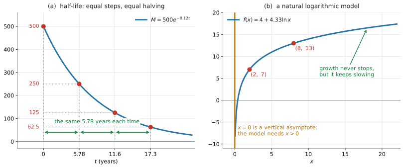
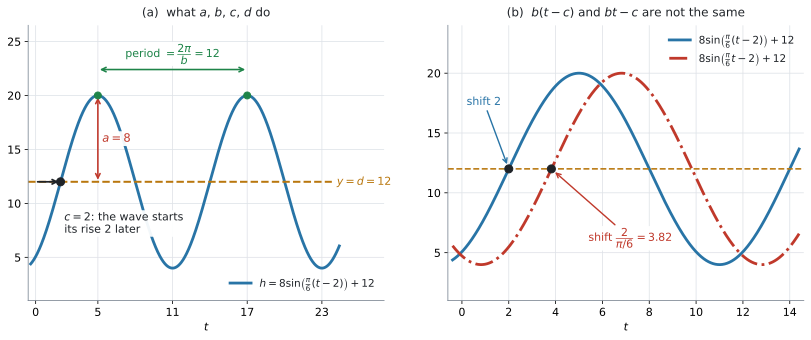

# AHL 2.9a — Half-life, natural logarithmic and sinusoidal models（半減期・自然対数モデル・正弦モデル） {#sec-ahl-2-9a}

::: {.callout-note}
## What you should be able to do
- 指数の減衰モデルから **half-life**（半減期）を求め、それが**はじめの量によらない**ことを説明できる。
- half-life から減衰の定数 $k$ を出し、$k$ から half-life を出せる（両方向）。
- **natural logarithmic model**（自然対数モデル）$f(x) = a + b\ln x$ の形を知り、$2$ 点から $a$ と $b$ を求められる。
- $f(x) = a + b\ln x$ の domain（定義域）が $x > 0$ であることを、文脈と結びつけて説明できる。
- **sinusoidal model**（正弦モデル）$f(x) = a\sin\bigl(b(x-c)\bigr)+d$ の $4$ 文字を読み分け、**ラジアンで** period（周期）$= \dfrac{2\pi}{b}$ を出せる。
- 最大・最小の値と時刻から、$a$、$b$、$c$、$d$ を決められる。
:::

::: {.callout-important}
## 公式集の AHL 2.9 の欄
**$1$ 行だけあります。** ただし、それは logistic function のもので、[AHL 2.9b](ahl-2-9b.qmd) で扱います。

$$
f(x) = \frac{L}{1+Ce^{-kx}}, \quad L,\ C,\ k > 0
$$

**このページの $3$ つのモデルは、$1$ つも印刷されていません。**

- half-life の式 … ありません
- $f(x) = a + b\ln x$ … ありません
- period $= \dfrac{2\pi}{b}$ … ありません

とくに **period $= \dfrac{2\pi}{b}$ は、自分で持っておく必要があります。** [SL 2.5](../../ai-sl/02-functions/sl-2-5.qmd#what-is-b) で $\dfrac{360}{b}$ を覚えたはずですが、HL ではラジアンが既定なので $\dfrac{2\pi}{b}$ のほうを使います（[第6節](#radian)）。
:::

::: {.callout-note}
## シラバスが、この項目に求めていること
Content 欄は、導入の $1$ 行と、$5$ つのモデルからできています。

> In addition to the models covered in the SL content the AHL content extends this to include modelling with the following functions:

> Exponential models to calculate half-life.

> Natural logarithmic models: $f(x) = a + b\ln x$

> Sinusoidal models: $f(x) = a\sin\bigl(b(x-c)\bigr)+d$

> Logistic models: $f(x) = \dfrac{L}{1+Ce^{-kx}}$; $L$, $C$, $k > 0$

> Piecewise models.

**このページは、上の $3$ つ**（half-life・natural logarithmic・sinusoidal）を扱います。logistic と piecewise は [AHL 2.9b](ahl-2-9b.qmd) です。

Guidance 欄のうち、このページに関わるのは次の $5$ つです。

> **Link to:** modelling skills (SL2.6).

> Radian measure should be assumed unless otherwise indicated by the use of the degree symbol, for example with $f(x) = \sin x^{\circ}$.

> In radians, period is $\dfrac{2\pi}{b}$.

> Students should be aware that a horizontal translation of $c$ can be referred to as a phase shift.

> **Link to:** radian measure (AHL 3.7)

**Natural logarithmic models の行は、Guidance 欄に対応する記述がありません。** 形をそのまま使う、ということです。

Connections 欄の `Other contexts` が、sinusoidal の文脈を並べています。

> **Sinusoidal models:** Waxing and waning of the moon, rainfall patterns, temperature, movement of bridges and buildings, pH scale, Richter scale, sound intensity, brightness of stars.

`Links to other subjects` の $1$ つ目が half-life です。

> Half-life (chemistry and physics); AC circuits and waves (physics); ...

モデルの立て方そのものは [SL 2.6](../../ai-sl/02-functions/sl-2-6.qmd) の手順に従います。**このページで新しいのは、使える関数が増えることだけ**です。
:::

## The idea

### 1. AHL で足される $5$ つのモデル {#idea}

[SL 2.5](../../ai-sl/02-functions/sl-2-5.qmd) で $6$ つのモデル（linear、quadratic、exponential、direct/inverse variation、cubic、sinusoidal）を扱いました。HL では、次の $5$ つが足されます。

| モデル | 形 | どこ |
|:--|:--|:--|
| exponential（half-life を出す） | $M = M_0 e^{-kt}$ など | このページ [第2節](#half-life) |
| natural logarithmic | $f(x) = a + b\ln x$ | このページ [第4節](#log-model) |
| sinusoidal | $f(x) = a\sin\bigl(b(x-c)\bigr)+d$ | このページ [第6節](#radian) |
| logistic | $f(x) = \dfrac{L}{1+Ce^{-kx}}$ | [AHL 2.9b](ahl-2-9b.qmd) |
| piecewise | 区間ごとに式が変わる | [AHL 2.9b](ahl-2-9b.qmd) |

: AHL 2.9 の $5$ つ {#tbl-ahl29a-five}

@tbl-ahl29a-five のうち exponential と sinusoidal は、SL でも出ています。**HL で新しくなるのは、次の $3$ 点**です。

- exponential … **half-life を求める**（SL では量そのものを求めるだけでした）
- sinusoidal … **ラジアンになり、$c$（phase shift）が入る**
- natural logarithmic … まるごと新しい形です

### 2. half-life は「半分になるまでの時間」です {#half-life}

**half-life**（半減期）は、量が半分になるまでにかかる時間です。放射性物質、体の中の薬、コーヒーのカフェイン——**減り方が指数的なもの**に使います。

$$
M = M_0\,e^{-kt}, \qquad M_0 > 0, \quad k > 0
$$ {#eq-ahl29a-decay}

$M_0$ ははじめの量、$k$ は減り方の速さです。**量を表すモデルなので、はじめの量 $M_0$ は正**とします。

{#fig-ahl29a-decay width=100%}

@fig-ahl29a-decay の (a) が $M = 500e^{-0.12t}$ です（@exm-ahl29a-decay でも使います）。$500 \to 250 \to 125 \to 62.5$ と半分ずつ減っていきますが、**そのたびにかかる時間はいつも同じ $5.78$ 年**です。これが half-life です。

half-life を $T$ と書くと、定義から

$$
M_0\,e^{-kT} = \frac{1}{2}M_0
$$

です。$M_0 > 0$ なので、両辺を $M_0$ で割れます。

$$
e^{-kT} = \frac{1}{2}
$$

となり、**$M_0$ が消えます。** $\ln$ をとって（[AHL 1.9](../01-number-and-algebra/ahl-1-9.qmd)）

$$
-kT = \ln\frac{1}{2} = -\ln 2
$$

$$
T = \frac{\ln 2}{k}
$$ {#eq-ahl29a-halflife}

（$M_0 = 0$ だと $M$ はいつも $0$ で、$M = \dfrac{1}{2}M_0$ がどの時刻でも成り立ってしまい、**half-life が $1$ つに決まりません。** だから $M_0 > 0$ としています。）

@eq-ahl29a-decay の $k = 0.12$ なら

$$
T = \frac{\ln 2}{0.12} = 5.7762\ldots = 5.78 \text{ 年}
$$

::: {.callout-important}
## half-life は、はじめの量によりません
$500$ mg から始めても $50$ mg から始めても、半分になるまでの時間は同じです。

理由は上の $2$ 行目にあります。**両辺を $M_0$ で割った時点で、$M_0$ が式から消えている**からです（[Why it works](#why-it-works)）。

`State what happens to the half-life if the initial mass is doubled` と聞かれたら、答えは「変わらない」です。同じ話が [AHL 1.9](../01-number-and-algebra/ahl-1-9.qmd) にも出ています。
:::

### 3. half-life と $k$ は、行き来できます {#k-and-T}

@eq-ahl29a-halflife は、どちらの向きにも使えます。

| 分かっているもの | 求めるもの | 使う式 |
|:--|:--|:--|
| $k$ | half-life $T$ | $T = \dfrac{\ln 2}{k}$ |
| half-life $T$ | $k$ | $k = \dfrac{\ln 2}{T}$ |

: $k$ と $T$ の行き来 {#tbl-ahl29a-kT}

$e$ を使わずに、**半分にする回数**で書く形もあります。

$$
M = M_0\left(\frac{1}{2}\right)^{t/T}
$$ {#eq-ahl29a-halving}

$t = T$ なら指数が $1$ で半分、$t = 2T$ なら $\dfrac{1}{4}$ です。@eq-ahl29a-decay と @eq-ahl29a-halving は**同じもの**で、$k$ と $T$ が @eq-ahl29a-halflife で結ばれています。

::: {.callout-tip}
## $2$ つの形で計算して、突き合わせてください
half-life $5$ 時間、はじめ $200$ mg の薬が、$12$ 時間後にどれだけ残るか。

$$
200\left(\frac{1}{2}\right)^{12/5} = 37.892\ldots
$$

$$
k = \frac{\ln 2}{5} = 0.1386294\ldots, \qquad 200e^{-k \times 12} = 37.892\ldots
$$

**同じ数になります。** どちらの道でも出せるので、片方を検算に使えます（@exm-ahl29a-caffeine）。
:::

### 4. natural logarithmic model $f(x) = a + b\ln x$ {#log-model}

シラバスが指定している形です。

$$
f(x) = a + b\ln x
$$ {#eq-ahl29a-log}

@fig-ahl29a-decay の (b) は **$b > 0$ の場合**です。$b > 0$ なら、**はじめは急に上がり、そのあと増え方が緩やかになります。** 上限はなく、$x$ が大きくなると増加を続けます。

**$b < 0$ ならグラフの上下が反転します。** はじめは急に下がり、そのあと下がり方が緩やかになります。

@eq-ahl29a-log の（$b > 0$ のときの）使いどころは、**「増えるけれど、だんだん増え方が鈍る」**場面です。学習の習熟度、音の大きさの感じ方、地震の規模——pH scale、Richter scale、sound intensity は、どれも対数の目盛りです。

大事な点が $2$ つあります。

- **domain は $x > 0$ です。** $\ln 0$ も $\ln(\text{負})$ も定義されません。@fig-ahl29a-decay の (b) で、$x = 0$ が **vertical asymptote**（垂直漸近線）になっています
- **$b > 0$ なら increasing（増加）、$b < 0$ なら decreasing（減少）**です。$b = 0$ なら $f(x) = a$ という **constant function**（定数関数）になり、$x$ による変化を表さないモデルになります。$\ln x$ 自体は増える関数なので、向きは $b$ の符号で決まります

::: {.callout-warning}
## $x = 0$ を入れられません
「$t = 0$ のときの値」を聞かれる文脈問題では、この形は使えません。

$f(x) = 4 + 4.33\ln x$ で $x = 0$ とすると、$\ln 0$ が定義されないので値がありません。それどころか、$x$ を $0$ に近づけると $f(x)$ は**いくらでも小さくなります**（@fig-ahl29a-decay の (b) の左端）。

文脈問題では、$x \geq 1$ のように**始まりの点を決めて**使います（演習 $7$）。
:::

### 5. $a$ と $b$ は、$2$ 点から出します {#fit-log}

パラメータの決め方は [SL 2.6](../../ai-sl/02-functions/sl-2-6.qmd) と同じです（Guidance の `Link to: modelling skills (SL2.6)` は、この項目全体にかかっています）。**$2$ 点を入れて、連立方程式にします。**

$(2,\ 7)$ と $(8,\ 13)$ を通るとします。

$$
a + b\ln 2 = 7
$$

$$
a + b\ln 8 = 13
$$

引き算すると $a$ が消えます。

$$
b(\ln 8 - \ln 2) = 6
$$

$\ln 8 - \ln 2 = \ln 4$ です（[AHL 1.9](../01-number-and-algebra/ahl-1-9.qmd)）。

$$
b = \frac{6}{\ln 4} = 4.3280\ldots
$$

$1$ つ目の式にもどして

$$
a = 7 - 4.3280\ldots \times \ln 2 = 7 - 3 = 4
$$

**$\ln$ の値は、丸めずに電卓の中のまま使ってください**（[GDC](#gdc-store)）。

### 6. sinusoidal model ── HL はラジアンです {#radian}

$$
f(x) = a\sin\bigl(b(x-c)\bigr)+d
$$ {#eq-ahl29a-sine}

[SL 2.5](../../ai-sl/02-functions/sl-2-5.qmd#sinusoidal) では $a\sin(bx)+d$ の形で、**度数法**で扱いました。HL では $c$ が入り、**ラジアンが既定**になります。

Guidance が、はっきり書いています。

> Radian measure should be assumed unless otherwise indicated by the use of the degree symbol, for example with $f(x) = \sin x^{\circ}$.

> In radians, period is $\dfrac{2\pi}{b}$.

ここでは $b > 0$ とします。$b$ が負のときの period は $\dfrac{2\pi}{\lvert b \rvert}$ です。$\sin(-2x)$ の period は $\pi$ で、$\dfrac{2\pi}{-2} = -\pi$ ではありません。

::: {.callout-important}
## period は $\dfrac{2\pi}{b}$ です。$\dfrac{360}{b}$ ではありません
SL で覚えた $\dfrac{360}{b}$ は、**度数法のときの式**です。

$$
\text{ラジアン} \ \Rightarrow \ \text{period} = \frac{2\pi}{b}, \qquad
\text{度数法} \ \Rightarrow \ \text{period} = \frac{360}{b}
$$

**見分け方は、$\sin$ の中の角に度の記号 $^{\circ}$ が付いているかどうか**です。$f(x) = \sin x^{\circ}$ のように書いてあれば度数法、書いてなければラジアンです。**摂氏の $^{\circ}\text{C}$ は角の単位ではないので、これには関係ありません**（演習 $9$）。

電卓の角の設定も、それに合わせて変えてください（[GDC](#gdc-angle)）。$\dfrac{2\pi}{b}$ と $\dfrac{360}{b}$ を取りちがえると、答えが $57.3$ 倍ずれます（演習 $10$）。
:::

### 7. $a$、$b$、$c$、$d$ の $4$ 文字 {#four-letters}

{#fig-ahl29a-sine width=100%}

@fig-ahl29a-sine の (a) が、$h = 8\sin\left(\dfrac{\pi}{6}(t-2)\right)+12$ です。

| 文字 | 名前 | 読み方 | 図では |
|:--|:--|:--|:--|
| $a$ | **amplitude**（振幅） | 中心線からの高さ。$\lvert a \rvert$ | $8$ |
| $b$ | — | period $= \dfrac{2\pi}{b}$（$b > 0$） | $\dfrac{\pi}{6}$、period $12$ |
| $c$ | **phase shift**（位相のずれ） | 横に $c$ だけ右へ | $2$ |
| $d$ | **principal axis**（中心線） | $y = d$ | $12$ |

: $4$ 文字の読み方 {#tbl-ahl29a-letters}

$c$ を「phase shift と呼ぶことがある」と、Guidance がわざわざ断っています（@exm-ahl29a-tide の (c) で問われる形です）。

> Students should be aware that a horizontal translation of $c$ can be referred to as a phase shift.

**これは [AHL 2.8](ahl-2-8.qmd#translation) の平行移動そのものです。** $\sin$ の中で $x$ が $x-c$ になっているので、$c > 0$ なら右に $c$、$c < 0$ なら左に $\lvert c \rvert$ です。

最大値と最小値からは、次のように決まります。**以下、$a > 0$、$b > 0$ にとります。**

$$
\lvert a \rvert = \frac{\text{最大} - \text{最小}}{2}, \qquad d = \frac{\text{最大} + \text{最小}}{2}
$$ {#eq-ahl29a-ad}

$a > 0$ と選べば $a = \dfrac{\text{最大}-\text{最小}}{2}$ です。同じデータを $a < 0$ で書くこともでき、そのときは $c$ の意味が変わります。$8\sin\left(\dfrac{\pi}{6}(t-2)\right)+12$ と $-8\sin\left(\dfrac{\pi}{6}(t-8)\right)+12$ は、同じグラフです。

$$
\text{period} = 2 \times \lvert \text{最大の時刻} - \text{最小の時刻} \rvert
$$ {#eq-ahl29a-period}

@eq-ahl29a-period は、**となり合う最大と最小のあいだが、ちょうど半周期**だからです。**あいだに別の山や谷をはさんだ最大と最小では使えません。** $h = 8\sin\left(\dfrac{\pi}{6}(t-2)\right)+12$ なら $t = 23$ も最小ですが、$2(23-5) = 36$ は周期ではありません。

$a > 0$、$b > 0$ のとき、$c$ は **$\sin$ が中心線を上向きに横切る時刻**です。最大の時刻から、$\dfrac{1}{4}$ 周期ぶん戻ったところにあります。

### 8. $c$ の位置に気をつけます {#phase-shift}

@eq-ahl29a-sine は $a\sin\bigl(b(x-c)\bigr)+d$ で、**$b$ がかっこの外**にあります。$a\sin(bx-c)+d$ と書くと、**別のもの**になります。

@fig-ahl29a-sine の (b) が、その比較です。

$$
8\sin\left(\frac{\pi}{6}(t-2)\right)+12 \qquad \text{は右に } 2
$$

$$
8\sin\left(\frac{\pi}{6}t-2\right)+12 \qquad \text{は右に } \frac{2}{\pi/6} = 3.82
$$

理由は [AHL 2.8](ahl-2-8.qmd#composite) と同じです。かっこの中を $b(x-c)$ の形に**因数分解してから** $c$ を読みます。

$$
\frac{\pi}{6}t - 2 = \frac{\pi}{6}\left(t - \frac{12}{\pi}\right)
$$

なので、ずれは $\dfrac{12}{\pi} = 3.82$ です。

**シラバスの形は $a\sin\bigl(b(x-c)\bigr)+d$ のほう**なので、自分で式を作るときはこちらで書いてください。$c$ がそのまま読めます。

## Why it works

**なぜ half-life がはじめの量によらないのか。** ここだけ、式で見ておきます。

はじめの量を $M_0$、時刻 $t_1$ での量を $M_1$ とします。

$$
M_1 = M_0 e^{-kt_1}
$$

ここから、さらに $T$ だけ時間が経ったときの量は

$$
M_0 e^{-k(t_1+T)} = M_0 e^{-kt_1} \times e^{-kT} = M_1 \times e^{-kT}
$$

です。**$e^{-kT}$ という同じ倍率が掛かるだけ**で、$M_1$ が何であっても関係ありません。

$e^{-kT} = \dfrac{1}{2}$ となる $T$ を選べば、**どの時点から測っても半分になります。** これが half-life です。

$$
e^{-kT} = \frac{1}{2} \ \Longrightarrow \ T = \frac{\ln 2}{k}
$$

**指数関数のこの性質——「同じ時間だけ進めば、同じ倍率が掛かる」——が、half-life を意味のある量にしています。** 直線的に減るモデル（$M = M_0 - ct$）では、こうはなりません。$M_0 = 100$、$c = 10$ なら、$100$ から $50$ までは $5$ 秒ですが、$50$ から $25$ までは $2.5$ 秒です。**半分になるまでの時間が、測る場所で変わってしまいます。**

**period が $\dfrac{2\pi}{b}$ になるのも、同じ読み方です。** $\sin$ は、中身が $2\pi$ 増えるごとに $1$ 周します。中身は $b(x-c)$ ですから、$x$ が $P$ 増えたときに中身が $2\pi$ 増えるとすると

$$
bP = 2\pi \ \Longrightarrow \ P = \frac{2\pi}{b}
$$

です。**$c$ は出てきません。** 横にずらしても、くり返しの速さは変わらないからです。

## Worked examples

::: {.callout-note appearance="simple"}
問題文は英語です。意味が理解できなかったら、問題文の下の「**日本語訳**」を開いてください。解説は日本語です。
:::

::: {#exm-ahl29a-decay}
[The mass of a radioactive sample, in milligrams, is modelled by]{.q-en}

$$
M(t) = 500e^{-0.12t}
$$

[where $t$ is the time in years.]{.q-en}

**(a)** [Find the mass after $10$ years.]{.q-en}

**(b)** [Find the half-life of the sample.]{.q-en}

**(c)** [Find the time taken for the mass to fall to $100$ mg.]{.q-en}

<details class="jp-trans">
<summary>日本語訳</summary>

ある放射性試料の質量（ミリグラム）が、上の式でモデル化されます。$t$ は経過年数です。

**(a)** $10$ 年後の質量を求めなさい。

**(b)** この試料の half-life を求めなさい。

**(c)** 質量が $100$ mg まで減るのにかかる時間を求めなさい。

</details>

---

**(a)** $t = 10$ を入れるだけです。

$$
M(10) = 500e^{-1.2} = 150.59\ldots = 151 \text{ mg}
$$

**(b)** 半分の $250$ mg になる時刻を求めます。@eq-ahl29a-halflife を使ってもよいのですが、**定義から書き出したほうが安全**です。

$$
500e^{-0.12t} = 250
$$

$$
e^{-0.12t} = \frac{1}{2}
$$

$\ln$ をとります。

$$
-0.12t = -\ln 2
$$

$$
t = \frac{\ln 2}{0.12} = 5.7762\ldots = 5.78 \text{ 年}
$$

**検算。** $500e^{-0.12 \times 5.7762} = 250.00$ ✓ ちょうど半分になりました。

**(c)** こんどは $100$ です。半分ではないので、@eq-ahl29a-halflife は使えません。

$$
500e^{-0.12t} = 100
$$

$$
e^{-0.12t} = 0.2
$$

$$
-0.12t = \ln 0.2
$$

$$
t = \frac{-\ln 0.2}{0.12} = \frac{\ln 5}{0.12} = 13.41\ldots = 13.4 \text{ 年}
$$

$-\ln 0.2 = \ln 5$ です。**電卓では $\ln 0.2$ のまま入れて構いません。**

**検算。** half-life が $5.78$ 年なので、$2$ 回で $125$ mg（$11.6$ 年）。$100$ mg はそれより少し先です。$13.4 > 11.6$ ✓ つじつまが合っています。

::: {.callout-note}
## 解答例（答案用紙にはこう書く）
**(a)**
$$M(10) = 500e^{-1.2} = 151 \text{ mg}$$

**(b)**
$$500e^{-0.12t} = 250 \ \Rightarrow \ e^{-0.12t} = 0.5 \ \Rightarrow \ -0.12t = \ln 0.5$$
$$t = 5.78 \text{ years}$$

**(c)**
$$500e^{-0.12t} = 100 \ \Rightarrow \ e^{-0.12t} = 0.2 \ \Rightarrow \ t = \frac{\ln 0.2}{-0.12} = 13.4 \text{ years}$$
:::
:::

::: {#exm-ahl29a-caffeine}
[The amount of caffeine in a person's body decreases exponentially with a half-life of $5$ hours. A person drinks a coffee containing $200$ mg of caffeine.]{.q-en}

**(a)** [Write a model of the form $A = A_0 e^{-kt}$ for the amount $A$ mg of caffeine remaining after $t$ hours, giving $k$ correct to $3$ significant figures.]{.q-en}

**(b)** [Find the amount of caffeine remaining after $12$ hours.]{.q-en}

**(c)** [Find how long it takes for the amount to fall below $20$ mg.]{.q-en}

<details class="jp-trans">
<summary>日本語訳</summary>

ある人の体内のカフェインは指数的に減り、half-life は $5$ 時間です。この人が、カフェインを $200$ mg 含むコーヒーを飲みます。

**(a)** $t$ 時間後に残るカフェインの量 $A$ mg について、$A = A_0 e^{-kt}$ の形のモデルを書きなさい。$k$ は有効数字 $3$ 桁で答えなさい。

**(b)** $12$ 時間後に残るカフェインの量を求めなさい。

**(c)** 量が $20$ mg を下回るまでにかかる時間を求めなさい。

</details>

---

**(a)** 今度は half-life から $k$ を出します（@tbl-ahl29a-kT）。

$$
k = \frac{\ln 2}{5} = 0.138629\ldots = 0.139
$$

$A_0 = 200$ なので

$$
A = 200e^{-0.139t}
$$

**(b)** $t = 12$ を入れます。**丸めた $0.139$ ではなく、電卓の中の $k$ をそのまま使ってください。** (a) で $0.139$ と答えるのは**書くとき**の話で、**計算には丸めていない値を使います。** この $2$ つは別のことです。

$$
A = 200e^{-0.138629 \times 12} = 37.89\ldots = 37.9 \text{ mg}
$$

**検算。** @eq-ahl29a-halving でも出します。$12$ 時間は half-life $2.4$ 個ぶんです。

$$
200\left(\frac{1}{2}\right)^{2.4} = 37.89\ldots
$$

✓ $2$ つの道が一致しました。

**(c)** $20$ mg になる時刻を求めます。

$$
200e^{-0.138629t} = 20
$$

$$
e^{-0.138629t} = 0.1
$$

$$
t = \frac{\ln 0.1}{-0.138629} = 16.60\ldots = 16.6 \text{ 時間}
$$

`below` なので、$16.6$ 時間を**過ぎてから**下回ります。

::: {.callout-tip}
## 丸めた $k$ を使うと、答えがずれます
$k = 0.139$（$3$ s.f.）で (b) を計算すると $37.72$ mg、$k$ をそのまま使うと $37.89$ mg です。**$3$ s.f. の答えが $37.7$ mg と $37.9$ mg に分かれてしまいます。**

**$3$ 桁で答えるのは最後だけ**にしてください。途中で丸めると、指数の中で誤差が広がります。電卓に $k$ という名前で保存しておくのがいちばん確実です（[GDC](#gdc-store)）。
:::

::: {.callout-note}
## 解答例（答案用紙にはこう書く）
**(a)**
$$e^{-5k} = 0.5 \ \Rightarrow \ k = \frac{\ln 2}{5} = 0.139$$
$$A = 200e^{-0.139t}$$

**(b)**
$$A = 200e^{-0.138629 \times 12} = 37.9 \text{ mg}$$

**(c)**
$$200e^{-kt} = 20 \ \Rightarrow \ e^{-kt} = 0.1 \ \Rightarrow \ t = 16.6 \text{ hours}$$
:::
:::

::: {#exm-ahl29a-log}
[The height of a young tree, in centimetres, is modelled by $h(x) = a + b\ln x$, where $x$ is the number of months since it was planted. The tree is $7$ cm tall after $2$ months and $13$ cm tall after $8$ months.]{.q-en}

**(a)** [Find the value of $a$ and the value of $b$.]{.q-en}

**(b)** [Use the model to predict the height after $20$ months.]{.q-en}

**(c)** [Explain why this model cannot be used to find the height of the tree at the moment it was planted.]{.q-en}

<details class="jp-trans">
<summary>日本語訳</summary>

若い木の高さ（センチメートル）が $h(x) = a + b\ln x$ でモデル化されます。$x$ は植えてからの月数です。この木は $2$ か月後に $7$ cm、$8$ か月後に $13$ cm でした。

**(a)** $a$ の値と $b$ の値を求めなさい。

**(b)** このモデルを使って、$20$ か月後の高さを予測しなさい。

**(c)** このモデルでは、植えた瞬間の木の高さを求められない理由を説明しなさい。

</details>

---

**(a)** [第5節](#fit-log) のとおり、$2$ 点を入れて連立させます。

$$
a + b\ln 2 = 7, \qquad a + b\ln 8 = 13
$$

引き算します。

$$
b(\ln 8 - \ln 2) = 6
$$

$$
b\ln 4 = 6 \ \Rightarrow \ b = \frac{6}{\ln 4} = 4.3280\ldots = 4.33
$$

$1$ つ目にもどして

$$
a = 7 - 4.3280\ldots \times \ln 2 = 7 - 3 = 4
$$

**検算。** $4 + 4.3280 \times \ln 8 = 4 + 9.00 = 13.00$ ✓ $2$ つ目の点も通りました。

**(b)** $x = 20$ を入れます。

$$
h(20) = 4 + 4.3280\ldots \times \ln 20 = 4 + 12.96\ldots = 16.9657\ldots = 17.0 \text{ cm}
$$

$8$ か月で $13$ cm だったものが、$20$ か月でも $17$ cm です。**伸びが鈍っている**のが数でも見えます。

**(c)** `Explain why` なので、英語で理由を書きます。

植えた瞬間は $x = 0$ ですが、$\ln 0$ は定義されません（[第4節](#log-model)）。

::: {.model-answer}
**試験ではこう書く**

*Planting corresponds to $x = 0$, and $\ln 0$ is not defined, so $h(0)$ has no value. In fact, as $x$ approaches $0$ the value of $\ln x$ decreases without limit, so the model predicts heights that become arbitrarily large and negative. The model can only be used for $x > 0$, and in practice only after the tree has been growing for some time.*
:::

（植えた瞬間は $x = 0$ にあたるが、$\ln 0$ は定義されないので $h(0)$ には値がない。それどころか $x$ を $0$ に近づけると $\ln x$ は限りなく小さくなるので、モデルはいくらでも大きな負の高さを出してしまう。このモデルは $x > 0$ でしか使えず、実際には木がある程度育ったあとにしか使えない、という意味です。）

::: {.callout-note}
## 解答例（答案用紙にはこう書く）
**(a)**
$$a + b\ln 2 = 7, \quad a + b\ln 8 = 13$$
$$b\ln 4 = 6 \ \Rightarrow \ b = 4.33, \quad a = 4$$

**(b)**
$$h(20) = 4 + \frac{6}{\ln 4}\ln 20 = 17.0 \text{ cm}$$

**(c)**
*$x = 0$ gives $\ln 0$, which is not defined, so the model has no value there. The model requires $x > 0$.*
:::
:::

::: {#exm-ahl29a-tide}
[The depth of water in a harbour, in metres, is modelled by $h(t) = a\sin\bigl(b(t-c)\bigr)+d$, where $t$ is the time in hours after midnight. The first high water is $20$ m at $t = 5$, and the first low water is $4$ m at $t = 11$.]{.q-en}

**(a)** [Find the value of $a$, of $b$, of $c$ and of $d$.]{.q-en}

**(b)** [Find the depth of water at midnight.]{.q-en}

**(c)** [Describe what the value of $c$ tells you about this harbour.]{.q-en}

<details class="jp-trans">
<summary>日本語訳</summary>

ある港の水深（メートル）が $h(t) = a\sin\bigl(b(t-c)\bigr)+d$ でモデル化されます。$t$ は真夜中からの経過時間（時間）です。最初の満潮は $t = 5$ で $20$ m、最初の干潮は $t = 11$ で $4$ m です。

**(a)** $a$、$b$、$c$、$d$ の値を求めなさい。

**(b)** 真夜中の水深を求めなさい。

**(c)** $c$ の値がこの港について何を表しているかを述べなさい。

</details>

---

**(a)** @eq-ahl29a-ad から始めます。

$$
a = \frac{20-4}{2} = 8, \qquad d = \frac{20+4}{2} = 12
$$

period は @eq-ahl29a-period です。満潮から干潮までが半周期なので

$$
\text{period} = 2 \times (11-5) = 12 \text{ 時間}
$$

ラジアンなので（[第6節](#radian)）

$$
\frac{2\pi}{b} = 12 \ \Rightarrow \ b = \frac{2\pi}{12} = \frac{\pi}{6}
$$

$c$ は、$\sin$ が最大になるところから決めます。$\sin$ が最大になるのは中身が $\dfrac{\pi}{2}$ のときで、それが $t = 5$ です。

$$
\frac{\pi}{6}(5-c) = \frac{\pi}{2}
$$

$$
5-c = 3 \ \Rightarrow \ c = 2
$$

$$
h(t) = 8\sin\left(\frac{\pi}{6}(t-2)\right)+12
$$

**検算。** $h(11) = 8\sin\left(\dfrac{\pi}{6} \times 9\right)+12 = 8\sin\dfrac{3\pi}{2}+12 = -8+12 = 4$ ✓ 干潮と合いました。

**(b)** 真夜中は $t = 0$ です。**電卓をラジアンにしてから**入れてください。

$$
h(0) = 8\sin\left(-\frac{\pi}{3}\right)+12 = 8 \times (-0.8660\ldots)+12 = 5.0717\ldots = 5.07 \text{ m}
$$

干潮の $4$ m に近い値です。@fig-ahl29a-sine の (a) で、$t = 0$ が谷の近くにあることを確かめてください。

**(c)** `Describe` なので、**言葉で**答えます。$c = 2$ は phase shift です。

::: {.model-answer}
**試験ではこう書く**

*The value $c = 2$ is the phase shift: the whole tidal pattern is shifted $2$ hours to the right. It means that the water is at its mean depth of $12$ m and rising at $t = 2$, that is, at $2$ a.m. Equivalently, the tide reaches high water $3$ hours later, one quarter of the $12$-hour period after $t = 2$.*
:::

（$c = 2$ は phase shift で、潮の動き全体が $2$ 時間だけ右にずれていることを表す。$t = 2$、つまり午前 $2$ 時に水深が平均の $12$ m で、しかも上がっている途中である、という意味である。言いかえれば、そこから $12$ 時間周期の $4$ 分の $1$ である $3$ 時間後に満潮になる、という意味です。）

::: {.callout-note}
## 解答例（答案用紙にはこう書く）
**(a)**
$$a = \frac{20-4}{2} = 8, \qquad d = \frac{20+4}{2} = 12$$
$$\text{period} = 2(11-5) = 12 \ \Rightarrow \ b = \frac{2\pi}{12} = \frac{\pi}{6}$$
$$\frac{\pi}{6}(5-c) = \frac{\pi}{2} \ \Rightarrow \ c = 2$$

**(b)**
$$h(0) = 8\sin\left(-\frac{\pi}{3}\right)+12 = 5.07 \text{ m}$$

**(c)**
*$c = 2$ is the phase shift: the pattern is moved $2$ hours to the right, so the depth is at its mean of $12$ m and rising at $2$ a.m.*
:::
:::

## Common errors

::: {.callout-warning}
## half-life を求めるのに、はじめの量を使う
$M = 500e^{-0.12t}$ の half-life を求めるとき、$500$ は**要りません。**

$$
e^{-0.12t} = \frac{1}{2}
$$

まで割ってしまえば、あとは $\ln$ をとるだけです（[第2節](#half-life)）。

`Find the half-life` で $M_0$ が与えられていなくても解けます。**$M_0$ が消えるのが、half-life の本質**です。
:::

::: {.callout-warning}
## $\dfrac{2\pi}{b}$ と $\dfrac{360}{b}$ を取りちがえる
SL では度数法だったので $\dfrac{360}{b}$ でした。**HL の既定はラジアン**なので $\dfrac{2\pi}{b}$ です（[第6節](#radian)）。

$b = 3$ なら、ラジアンで $\dfrac{2\pi}{3} = 2.09$、度数法で $\dfrac{360}{3} = 120$。**まったく違う数**です。

$\sin$ や $\cos$ の**中の角**に $^{\circ}$ が付いているかどうかを、先に確かめてください。付いていなければラジアンです（演習 $10$）。
:::

::: {.callout-warning}
## $a\sin(bx-c)+d$ の $c$ を、そのまま phase shift と読む
シラバスの形は $a\sin\bigl(b(x-c)\bigr)+d$ で、**$b$ がかっこの外**です。

$$
8\sin\left(\frac{\pi}{6}t-2\right)+12
$$

のように書かれていたら、まず因数分解してください。

$$
\frac{\pi}{6}t-2 = \frac{\pi}{6}\left(t-\frac{12}{\pi}\right)
$$

ずれは $2$ ではなく $\dfrac{12}{\pi} = 3.82$ です（[第8節](#phase-shift)、[AHL 2.8](ahl-2-8.qmd#composite)）。
:::

::: {.callout-warning}
## $\ln$ モデルに $x = 0$ を入れる
$f(x) = a + b\ln x$ の domain は $x > 0$ です。

「はじめの値」「$t = 0$ のとき」を聞かれても、この形では答えられません（[第4節](#log-model)）。

**文脈のほうを見てください。** $x$ が「植えてからの月数」なら、$x = 1$ から始めるのが自然です（@exm-ahl29a-log）。
:::

::: {.callout-warning}
## 途中で $k$ を丸める
$k = \dfrac{\ln 2}{5} = 0.138629\ldots$ を $0.139$ にしてから $12$ 時間後を計算すると、答えが $0.17$ mg ずれ、$3$ s.f. の答えまで $37.9$ mg から $37.7$ mg に変わります。

**指数の中の誤差は、外に出るときに広がります。** $k$ は電卓に保存して、そのまま使ってください（[GDC](#gdc-store)）。

答えを $3$ 桁に丸めるのは、**最後の $1$ 回だけ**です。
:::

## Using your GDC (TI-Nspire CX II)

### 1. 角の設定を、いちばん先に確かめます {#gdc-angle}

```
doc → Settings → Document Settings
```

`Angle` を **Radian** にします。AHL の sinusoidal model はラジアンが既定です（[第6節](#radian)）。

問題文に $\sin x^{\circ}$ のように度の記号が付いていたら、**Degree に変えるか、式の中に度の記号を入れて**ください。度の記号は記号パレットから選べます（TI 公式のガイドでは、handheld で `ctrl` と `k` を押すとパレットが開く、と書かれています）。

**設定が合っていないと、答えの数字はもっともらしいのに全部ずれます。** ここは毎回確かめる価値があります。

### 2. $k$ を保存して、丸めずに使う {#gdc-store}

Calculator ページで、名前を付けて保存します。

```
ln(2)/5 → k
```

`→` は `ctrl` を押してから `var` キーで入ります。`k := ln(2)/5` のように `:=` で書いても同じです。あとは

```
200*e^(-k*12)
```

と打つだけで、丸めのない値が出ます（@exm-ahl29a-caffeine）。

同じやり方で、$\ln$ モデルの $b$ も保存できます。

```
6/ln(4) → b
```

::: {.callout-warning}
## `e` と `π` は、キーで入れてください
アルファベットとして打った `e` や `pi` は、**ただの変数**になります。数としての $e$ は `e^x` キー、$\pi$ は `π` キー（または記号パレット）で入れてください。

変数のまま計算すると、エラーになるか、意味のない値が返ります。
:::

### 3. 方程式は、graph の交点で解くのが確実です {#gdc-solve}

「$100$ mg になるのはいつか」のような問題は、**グラフの交点**で解けます。

```
ctrl + doc → 2: Add Graphs
```

```
f1(x)=500*e^(-0.12*x)
f2(x)=100
```

としてから、`menu → Analyze Graph → Intersection` で交点を読みます（[SL 2.4](../../ai-sl/02-functions/sl-2-4.qmd#intersection) と同じ操作です）。

CAS ではない CX II に `solve(` はありません。数値で解く `nSolve(` はありますが、**交点のほうがグラフで形も見えるので確実**です。

**$\ln$ を使った手計算と、交点の値が合うかを見てください。** 両方できるようにしておくと、どちらかが詰まっても進めます。

### 4. sinusoidal は、まずグラフで形を見る {#gdc-sine}

$a$、$b$、$c$、$d$ を求めたら、**そのままグラフにして最大・最小を確かめます。**

```
f1(x)=8*sin(pi/6*(x-2))+12
```

`menu → Analyze Graph → Maximum` で、$t = 5$ 付近に $20$ が出れば合っています。

**window は period に合わせてください。** $x$ を $0$ から $24$、$y$ を $0$ から $24$ くらいにすると、$2$ 周ぶんが見えます。

`Zoom - Fit` は、**いまの $x$ の範囲に合わせて $y$ の範囲だけを合わせます。** $x$ の範囲が $1$ 周期に足りないままだと、波が $1$ 周も見えません。**$x$ を先に決めてください**（[SL 2.5](../../ai-sl/02-functions/sl-2-5.qmd) と同じ注意です）。

### 5. 検算のしかた {#gdc-check}

- half-life を出したら、**その時間だけ進めて半分になるか**を電卓で確かめる
- $k$ を出したら、**$e$ の式と $\left(\frac{1}{2}\right)^{t/T}$ の式の両方**で計算して突き合わせる（@eq-ahl29a-halving）
- $\ln$ モデルの $a$、$b$ を出したら、**もう $1$ つの点**を入れて合うか見る
- sinusoidal は、**最大・最小の値と時刻**をグラフで読んで、問題文と合わせる

$1$ つ目と $2$ つ目が、とくに効きます。**$2$ つの道で同じ数が出れば、電卓の打ちまちがいはありません。**

ただし、$2$ つの形は $k = \dfrac{\ln 2}{T}$ で結ばれた**同じ式**です。$T$ そのものを問題文から読みまちがえていると、**両方とも同じだけずれます。** $T$ は問題文にもどって確かめてください。

## Exercises

::: {.callout-note appearance="simple"}
各問題に、折りたたみが3つ付いています。**日本語訳**、**解答例**（答案用紙に書くべきこと。英語です）、**解説**（なぜそうなるか。日本語です）。

まず自分で解いて、次に解答例と見くらべてください。**解説は、合わなかったときだけ開けば十分です。**
:::

::: {.exercise-block}

[1]{.ex-no} [The mass of a substance is modelled by $M = 60e^{-0.05t}$ grams, where $t$ is measured in days. Find the half-life of the substance.]{.q-en}

<details class="jp-trans">
<summary>日本語訳</summary>

ある物質の質量が $M = 60e^{-0.05t}$ グラムでモデル化されます。$t$ の単位は日です。この物質の half-life を求めなさい。

</details>

::: {.callout-note collapse="true"}
## 解答例（答案用紙に書くこと）

$$60e^{-0.05t} = 30 \ \Rightarrow \ e^{-0.05t} = 0.5$$

$$-0.05t = \ln 0.5 \ \Rightarrow \ t = \frac{\ln 2}{0.05} = 13.9 \text{ days}$$
:::

::: {.callout-tip collapse="true"}
## 解説

$60$ は、$2$ 行目で消えます（[第2節](#half-life)）。

$\dfrac{\ln 2}{0.05} = 13.8629\ldots$ なので、$3$ s.f. で $13.9$ 日です。

**検算。** $60e^{-0.05 \times 13.8629} = 30.00$ ✓ ちょうど半分です。
:::

::: {.ex-sep}
:::

[2]{.ex-no} [A radioactive material has a half-life of $12$ hours. Find the value of $k$ in the model $A = A_0 e^{-kt}$, where $t$ is measured in hours.]{.q-en}

<details class="jp-trans">
<summary>日本語訳</summary>

ある放射性物質の half-life は $12$ 時間です。$t$ を時間として、モデル $A = A_0 e^{-kt}$ の $k$ の値を求めなさい。

</details>

::: {.callout-note collapse="true"}
## 解答例（答案用紙に書くこと）

$$e^{-12k} = 0.5 \ \Rightarrow \ -12k = \ln 0.5$$

$$k = \frac{\ln 2}{12} = 0.0578$$
:::

::: {.callout-tip collapse="true"}
## 解説

@tbl-ahl29a-kT の下の行です。$k = \dfrac{\ln 2}{T}$ にあてはめても構いませんが、**定義から書き出すほうが安全**です。

$A_0$ は与えられていません。**要りません。** そこが half-life の性質です。

$\dfrac{\ln 2}{12} = 0.057762\ldots$ なので $0.0578$ です。

**検算。** $e^{-0.057762 \times 12} = 0.5000$ ✓
:::

::: {.ex-sep}
:::

[3]{.ex-no} [A sample of $300$ mg of a substance has a half-life of $6$ days. Find the mass remaining after $15$ days.]{.q-en}

<details class="jp-trans">
<summary>日本語訳</summary>

$300$ mg の試料があり、その half-life は $6$ 日です。$15$ 日後に残っている質量を求めなさい。

</details>

::: {.callout-note collapse="true"}
## 解答例（答案用紙に書くこと）

$$M = 300\left(\frac{1}{2}\right)^{15/6} = 300 \times 2^{-2.5} = 53.0 \text{ mg}$$
:::

::: {.callout-tip collapse="true"}
## 解説

@eq-ahl29a-halving を使うのがいちばん速い問題です。$15$ 日は half-life $2.5$ 個ぶんです。

$$\frac{15}{6} = 2.5$$

$300 \times 2^{-2.5} = 53.033\ldots$ なので $53.0$ mg です。

**検算。** $e$ の形でも出します。$k = \dfrac{\ln 2}{6} = 0.1155245\ldots$ で

$$300e^{-k \times 15} = 53.033\ldots$$

✓ 一致しました（[GDC](#gdc-check)）。**丸めた $0.11552$ を打つと $53.0366$ になります。** ここでも、途中で丸めないのが大事です。

**「$2$ 回半分にして $75$、そこから少し」**という見当も付けておくと、桁のずれに気づけます。$2.5$ 回なので $75$ より少し小さい値です。
:::

::: {.ex-sep}
:::

[4]{.ex-no} [Show that the half-life of the model $A = A_0 e^{-kt}$, where $A_0 > 0$ and $k > 0$, is $\dfrac{\ln 2}{k}$, and state what this tells you about the effect of changing $A_0$.]{.q-en}

<details class="jp-trans">
<summary>日本語訳</summary>

$A_0 > 0$、$k > 0$ として、モデル $A = A_0 e^{-kt}$ の half-life が $\dfrac{\ln 2}{k}$ であることを示し、$A_0$ を変えたときの影響について述べなさい。

</details>

::: {.callout-note collapse="true"}
## 解答例（答案用紙に書くこと）

*Let $T$ be the half-life. Then*

$$A_0 e^{-kT} = \frac{1}{2}A_0$$

*Dividing both sides by $A_0$, which is not zero:*

$$e^{-kT} = \frac{1}{2} \ \Rightarrow \ -kT = \ln\frac{1}{2} = -\ln 2 \ \Rightarrow \ T = \frac{\ln 2}{k}$$

*The value of $A_0$ cancels, so the half-life does not depend on the initial amount. Changing $A_0$ leaves the half-life unchanged.*
:::

::: {.callout-tip collapse="true"}
## 解説

`Show that` なので、**$A_0$ が消える行**を必ず書いてください。そこがこの問題の中心です。

$\ln\dfrac{1}{2} = -\ln 2$ の変形も、$1$ 行入れておくと親切です（[AHL 1.9](../01-number-and-algebra/ahl-1-9.qmd)）。

$T$ を先に文字で置くのがコツです。**「半分になるまでの時間を $T$ とする」**と書き出せば、あとは式変形だけになります（[Why it works](#why-it-works)）。

::: {.model-answer}
**試験ではこう書く**

*Let $T$ be the half-life, so that $A_0 e^{-kT} = \tfrac{1}{2}A_0$. Dividing by $A_0$, which is not zero, gives $e^{-kT} = \tfrac{1}{2}$, so $-kT = -\ln 2$ and $T = \dfrac{\ln 2}{k}$. Because $A_0$ cancels, the half-life depends only on $k$: doubling, halving or otherwise changing the initial amount leaves the half-life unchanged.*
:::
:::

::: {.ex-sep}
:::

[5]{.ex-no} [Let $f(x) = 3 + 5\ln x$ for $x > 0$.]{.q-en}

**(a)** [Find $f(4)$.]{.q-en}

**(b)** [Solve $f(x) = 20$.]{.q-en}

<details class="jp-trans">
<summary>日本語訳</summary>

$x > 0$ に対して $f(x) = 3 + 5\ln x$ とします。

**(a)** $f(4)$ を求めなさい。

**(b)** $f(x) = 20$ を解きなさい。

</details>

::: {.callout-note collapse="true"}
## 解答例（答案用紙に書くこと）

**(a)**
$$f(4) = 3 + 5\ln 4 = 9.93$$

**(b)**
$$3 + 5\ln x = 20 \ \Rightarrow \ \ln x = 3.4 \ \Rightarrow \ x = e^{3.4} = 30.0$$
:::

::: {.callout-tip collapse="true"}
## 解説

**(a)** $\ln 4 = 1.38629\ldots$ なので $3 + 6.9315 = 9.9315$、$3$ s.f. で $9.93$ です。

**(b)** $\ln x$ を残して、最後に $e$ を両辺に乗せます。

$$\ln x = \frac{17}{5} = 3.4$$

$x = e^{3.4} = 29.964\ldots$ なので $30.0$ です。**$30$ ちょうどではありません。**

**検算。** $3 + 5\ln(29.964) = 3 + 5(3.4) = 20.0$ ✓
:::

::: {.ex-sep}
:::

[6]{.ex-no} [The function $f(x) = a + b\ln x$ passes through the points $(1,\ 6)$ and $(5,\ 14)$. Find the value of $a$ and the value of $b$.]{.q-en}

<details class="jp-trans">
<summary>日本語訳</summary>

関数 $f(x) = a + b\ln x$ が点 $(1,\ 6)$ と $(5,\ 14)$ を通ります。$a$ の値と $b$ の値を求めなさい。

</details>

::: {.callout-note collapse="true"}
## 解答例（答案用紙に書くこと）

$$a + b\ln 1 = 6 \ \Rightarrow \ a = 6 \quad (\ln 1 = 0)$$

$$6 + b\ln 5 = 14 \ \Rightarrow \ b = \frac{8}{\ln 5} = 4.97$$
:::

::: {.callout-tip collapse="true"}
## 解説

**$\ln 1 = 0$ に気づけば、連立させる必要はありません。** $x = 1$ の点は、そのまま $a$ を教えてくれます。

$\dfrac{8}{\ln 5} = \dfrac{8}{1.60944} = 4.97068\ldots$ なので $4.97$ です。

**検算。** $6 + 4.97068 \times \ln 5 = 6 + 8.00 = 14.00$ ✓

$x = 1$ の点が与えられていない問題では、[第5節](#fit-log) のように引き算で $a$ を消してください。
:::

::: {.ex-sep}
:::

[7]{.ex-no} [A student is asked to model the number of words a child can say, $x$ months after birth, by $N(x) = a + b\ln x$. Explain why this model cannot give a value at birth, and suggest what the student could do about it.]{.q-en}

<details class="jp-trans">
<summary>日本語訳</summary>

ある生徒が、生後 $x$ か月の子どもが話せる単語数を $N(x) = a + b\ln x$ でモデル化するように言われました。このモデルが誕生時の値を与えられない理由を説明し、生徒が取れる対応を提案しなさい。

</details>

::: {.callout-note collapse="true"}
## 解答例（答案用紙に書くこと）

*Birth corresponds to $x = 0$, and $\ln 0$ is not defined, so $N(0)$ does not exist. Since the number of words increases with age, $b > 0$; then $\ln x$ decreases without limit as $x$ approaches $0$, so the model would predict a large negative number of words, which has no meaning here.*

*The student could restrict the domain, for example to $x \geq 1$, and state that the model is only used from one month of age onwards.*
:::

::: {.callout-tip collapse="true"}
## 解説

`Explain why` なので、英語で理由を書きます。言うべきことは $2$ つです。

- $\ln 0$ が定義されない
- $x \to 0$ で値が負に発散し、文脈に合わない（単語数が負にはなりません）

**$2$ つ目まで書けると、しっかりした答案になります。** 「定義されない」だけでは、なぜ困るのかが伝わりません（[第4節](#log-model)）。

`suggest what the student could do` には、**domain を制限する**と答えます。$x \geq 1$ は「$1$ か月から使う」という意味です。

::: {.model-answer}
**試験ではこう書く**

*At birth $x = 0$, and $\ln 0$ is not defined, so the model gives no value. Since the number of words increases with age, $b > 0$, and $\ln x \to -\infty$ as $x \to 0^{+}$, so close to birth the model predicts a large negative number of words, which is impossible. The student should restrict the domain, for example to $x \geq 1$, and use the model only from the age of one month.*
:::
:::

::: {.ex-sep}
:::

[8]{.ex-no} [The height of a point on a rotating wheel, in metres, is modelled by $h(t) = 6\sin\left(\dfrac{\pi}{4}(t-1)\right)+10$, where $t$ is the time in seconds.]{.q-en}

**(a)** [Write down the amplitude, the period and the equation of the principal axis.]{.q-en}

**(b)** [Find the first time after $t = 0$ at which the point is at its highest.]{.q-en}

<details class="jp-trans">
<summary>日本語訳</summary>

回転する車輪上の点の高さ（メートル）が $h(t) = 6\sin\left(\dfrac{\pi}{4}(t-1)\right)+10$ でモデル化されます。$t$ は経過秒数です。

**(a)** amplitude、period、principal axis の式を書きなさい。

**(b)** $t = 0$ より後で、点が最も高くなる最初の時刻を求めなさい。

</details>

::: {.callout-note collapse="true"}
## 解答例（答案用紙に書くこと）

**(a)**
*Amplitude $6$; period $= \dfrac{2\pi}{\pi/4} = 8$ seconds; principal axis $y = 10$.*

**(b)**
$$\frac{\pi}{4}(t-1) = \frac{\pi}{2} \ \Rightarrow \ t-1 = 2 \ \Rightarrow \ t = 3 \text{ seconds}$$
:::

::: {.callout-tip collapse="true"}
## 解説

**(a)** @tbl-ahl29a-letters のとおりに読みます。

period は $\dfrac{2\pi}{b}$ です。$b = \dfrac{\pi}{4}$ なので

$$\frac{2\pi}{\pi/4} = 2\pi \times \frac{4}{\pi} = 8$$

**$\dfrac{360}{b}$ を使うと $458$ という無意味な数が出ます。** 度の記号が付いていないので、ラジアンです（[第6節](#radian)）。

**(b)** $\sin$ が最大になるのは中身が $\dfrac{\pi}{2}$ のときです。

**検算。** $h(3) = 6\sin\dfrac{\pi}{2}+10 = 16$ で、これは $d + a = 10+6$ と合っています ✓ $1$ つ前の最高は $3-8 = -5$ 秒なので、**$t = 3$ が $t = 0$ より後で最初**です ✓ 次の最高は $8$ 秒後の $t = 11$ です。
:::

::: {.ex-sep}
:::

[9]{.ex-no} [The temperature in a city, in degrees Celsius, is modelled by $T(t) = a\sin\bigl(b(t-c)\bigr)+d$, where $t$ is the time in hours after midnight. The maximum temperature is $26\,^{\circ}\text{C}$ at $t = 14$, and the minimum is $12\,^{\circ}\text{C}$ at $t = 2$.]{.q-en}

**(a)** [Find the value of $a$, of $b$, of $c$ and of $d$.]{.q-en}

**(b)** [Interpret the value of $d$ in this context.]{.q-en}

<details class="jp-trans">
<summary>日本語訳</summary>

ある都市の気温（摂氏）が $T(t) = a\sin\bigl(b(t-c)\bigr)+d$ でモデル化されます。$t$ は真夜中からの経過時間（時間）です。最高気温は $t = 14$ で $26\,^{\circ}\text{C}$、最低気温は $t = 2$ で $12\,^{\circ}\text{C}$ です。

**(a)** $a$、$b$、$c$、$d$ の値を求めなさい。

**(b)** この文脈で $d$ の値を解釈しなさい。

</details>

::: {.callout-note collapse="true"}
## 解答例（答案用紙に書くこと）

**(a)**
$$a = \frac{26-12}{2} = 7, \qquad d = \frac{26+12}{2} = 19$$

$$\text{period} = 2(14-2) = 24 \ \Rightarrow \ b = \frac{2\pi}{24} = \frac{\pi}{12}$$

$$\frac{\pi}{12}(14-c) = \frac{\pi}{2} \ \Rightarrow \ 14-c = 6 \ \Rightarrow \ c = 8$$

**(b)**
*$d = 19$ is the principal axis: the mean temperature over the day is $19\,^{\circ}\text{C}$, and the temperature swings $7\,^{\circ}\text{C}$ either side of it.*
:::

::: {.callout-tip collapse="true"}
## 解説

**(a)** @eq-ahl29a-ad と @eq-ahl29a-period です。最低から最高までが半周期なので、period は $2 \times 12 = 24$ 時間。$1$ 日でひと回り、という自然な結果になりました。

$c$ は、$\sin$ が最大になる条件から出します。$\dfrac{1}{4}$ 周期は $6$ 時間なので、最大の $6$ 時間前が $c$ です。

**検算。** $T(2) = 7\sin\left(\dfrac{\pi}{12}(2-8)\right)+19 = 7\sin\left(-\dfrac{\pi}{2}\right)+19 = -7+19 = 12$ ✓ 最低気温と合いました。

**(b)** `Interpret` なので、**文脈の言葉**で答えます。単位を落とさないでください。

$d$ は「平均」と言い切って構いません。$\sin$ が中心線の上下を対称に動くからです。

::: {.model-answer}
**試験ではこう書く**

*The value $d = 19$ is the principal axis of the model, so it represents the mean temperature in the city over a full day, namely $19\,^{\circ}\text{C}$. The temperature rises $7\,^{\circ}\text{C}$ above it and falls $7\,^{\circ}\text{C}$ below it, giving the maximum of $26\,^{\circ}\text{C}$ and the minimum of $12\,^{\circ}\text{C}$.*
:::
:::

::: {.ex-sep}
:::

[10]{.ex-no} [A student is asked for the period of $h(t) = 5\sin(3t)+2$ and writes]{.q-en}

> [Period $= \dfrac{360}{3} = 120$.]{.q-en}

[Identify the error and find the correct period.]{.q-en}

<details class="jp-trans">
<summary>日本語訳</summary>

ある生徒が $h(t) = 5\sin(3t)+2$ の period を聞かれて、「period $= \dfrac{360}{3} = 120$」と書きました。誤りを指摘し、正しい period を求めなさい。

</details>

::: {.callout-note collapse="true"}
## 解答例（答案用紙に書くこと）

*The formula $\dfrac{360}{b}$ applies when the angle is measured in degrees. Here there is no degree symbol, so the angle is in radians, and the period is*

$$\frac{2\pi}{b} = \frac{2\pi}{3} = 2.09$$
:::

::: {.callout-tip collapse="true"}
## 解説

`Identify the error` なので、**どこが違うかを言葉で書きます。**

生徒が使った $\dfrac{360}{b}$ は、**度数法の式**です。[SL 2.5](../../ai-sl/02-functions/sl-2-5.qmd#what-is-b) ではそれで正しかったのですが、HL の既定はラジアンです（[第6節](#radian)）。

**見分けるのは、度の記号 $^{\circ}$ があるかどうか**です。$5\sin(3t)+2$ には付いていないので、ラジアンです。

$\dfrac{2\pi}{3} = 2.0944\ldots$ なので $2.09$ です。$120$ とは $57$ 倍以上違います。

**検算。** $t = 0.5$ で $h = 5\sin 1.5+2 = 6.99$。$1$ 周期あとの $t = 0.5+2.0944 = 2.5944$ でも $6.99$ ✓ もどりました。半分の $1.047$ だけ進めると $-2.99$ で、もどっていません。

**中心線の上の点（$h = 2$）で確かめると、半周期でも同じ値になってしまいます。** 山や谷の途中の点を選んでください。

::: {.model-answer}
**試験ではこう書く**

*The student used $\dfrac{360}{b}$, which is the period only when the angle is measured in degrees. There is no degree symbol in $5\sin(3t)+2$, so the angle is in radians and the correct formula is $\dfrac{2\pi}{b}$. The period is $\dfrac{2\pi}{3} = 2.09$, not $120$.*
:::
:::

:::
