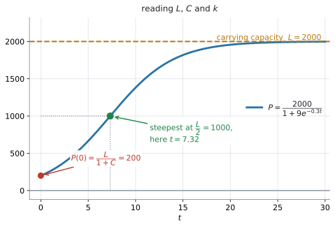
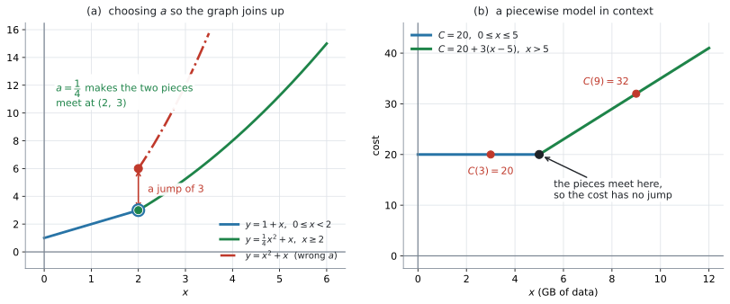

# AHL 2.9b — Logistic and piecewise models（ロジスティックモデルと区分モデル） {#sec-ahl-2-9b}

::: {.callout-note}
## What you should be able to do
- **logistic model**（ロジスティックモデル）$f(x) = \dfrac{L}{1+Ce^{-kx}}$ の $L$、$C$、$k$ が何を表すかを言える。
- $L$ が **carrying capacity**（環境収容力）であり、グラフの **horizontal asymptote**（水平漸近線）であることを説明できる。
- はじめの値から $C$ を、途中の $1$ 点から $k$ を求められる。
- logistic と exponential のちがいを、文脈の言葉で説明できる。
- **piecewise model**（区分モデル）の値を求め、文脈の中で意味を読み取れる。
- **continuous**（つながっている）になるように、定数を決められる。
:::

::: {.callout-important}
## 公式集の AHL 2.9 の欄
**$1$ 行あります。** logistic function です。

$$
f(x) = \frac{L}{1+Ce^{-kx}}, \quad L,\ C,\ k > 0
$$ {#eq-ahl29b-logistic}

**式は配られるので、覚える必要はありません。** 身につけるべきなのは、$L$、$C$、$k$ が**何を表しているか**と、与えられた情報からそれらを**どう決めるか**です。

piecewise model のほうは、公式集にありません。**式そのものが問題文で与えられる**ので、それで足ります。

$L$、$C$、$k$ がすべて正である、という条件も一緒に印刷されています。この条件のおかげで、グラフは $x$ 全体で見れば必ず**右上がりの S 字**になります（[第2節](#L)）。ただし、S の曲がり角が $x > 0$ に来るのは **$C > 1$**、つまり**はじめの値が $\dfrac{L}{2}$ より小さい**ときです（[第4節](#k)）。
:::

::: {.callout-note}
## シラバスが、この項目に求めていること
Content 欄のうち、このページが扱うのは最後の $2$ 行です。

> Logistic models: $f(x) = \dfrac{L}{1+Ce^{-kx}}$; $L$, $C$, $k > 0$

> Piecewise models.

残りの $3$ つ（half-life・natural logarithmic・sinusoidal）は [AHL 2.9a](ahl-2-9a.qmd) です。

Guidance 欄で、logistic に付いているのは $2$ つです。

> The logistic function is used in situations where there is a restriction on the growth. For example population on an island, bacteria in a petri dish or the increase in height of a person or seedling.

> Horizontal asymptote at $f(x) = L$ is often referred to as the carrying capacity.

piecewise に付いているのは $3$ つです。

> In some cases, parameters may need to be found that ensure continuity of the function, for example find $a$ to make $f(x) = \begin{cases} 1+x, & 0 \leq x < 2 \\ ax^{2}+x, & x \geq 2 \end{cases}$ continuous.

> The formal definition of continuity is not required.

> In examinations, students may be expected to interpret and use other models that are introduced in the question.

このほかに、項目全体にかかる `Link to: modelling skills (SL2.6)` があります（[AHL 2.9a](ahl-2-9a.qmd)）。モデルの立て方は [SL 2.6](../../ai-sl/02-functions/sl-2-6.qmd) と同じ手順です。

**$2$ つ目が、この項目のいちばんありがたい $1$ 行**です。連続の厳密な定義は要りません。**「$2$ つの式が、境目で同じ値になる」**——それだけです（[第7節](#continuity)）。

Guidance の Example は、そのまま @exm-ahl29b-continuity で扱います。

Connections 欄の `Other contexts` が、piecewise の文脈を並べています。

> **Piecewise models:** Income taxes and taxi fares, friction, mobile phone plans, depth of pool as function of distance from the deep end (piecewise linear), postage rates for letters, stock prices, parachuting before and after the chute opens, Hooke's law, shapes of buildings, horizontal distance from a wall to a curved object.

`Enrichment` 欄には、logistic の式がどこから来るかが書かれています。

> **Enrichment:** For the population equation $\dfrac{dP}{dt} = kP\left(1-\dfrac{P}{L}\right)$ with $P = P_0$ when $t = 0$, the solution is the logistic equation: $P = \dfrac{L}{1+Ce^{-kt}}$, with $C = \dfrac{L}{P_0}-1$.

**Enrichment は、試験に出る内容ではありません。** ただし、この式が「増え方が $P$ にも $\left(1-\dfrac{P}{L}\right)$ にも比例する」という考え方から来ていることは、[第5節](#vs-exp) で図として見ておく価値があります。微分方程式そのものは [AHL 5.14](../05-calculus/ahl-5-14.qmd) です。
:::

## The idea

### 1. logistic model は「上限のある増え方」です {#idea}

指数関数は、いつまでも増え続けます。しかし現実には、**増える余地がなくなる**場面がたくさんあります。

- 島の上の動物の数 … えさと場所に限りがあります
- シャーレの中の細菌 … 培地を食べつくします
- 人や苗の身長 … いつか止まります

Guidance が挙げているのは、まさにこの $3$ つです。

> The logistic function is used in situations where there is a restriction on the growth.

そういう場面に使うのが @eq-ahl29b-logistic です。**はじめは指数関数のように増え、途中から伸びが鈍り、ある高さで止まります。** グラフは横に寝た **S 字**になります。

{#fig-ahl29b-logistic width=100%}

@fig-ahl29b-logistic の (a) が

$$
P = \frac{2000}{1+9e^{-0.3t}}
$$

のグラフです。$200$ から始まり、$2000$ に向かって近づいていきます。

### 2. $L$ は carrying capacity（上限）です {#L}

$x$ をどんどん大きくすると、$e^{-kx}$ は $0$ に近づきます（$k > 0$ なので）。すると

$$
f(x) = \frac{L}{1+Ce^{-kx}} \ \longrightarrow \ \frac{L}{1+0} = L
$$

です。**$y = L$ が horizontal asymptote** で、Guidance がその名前を書いています。

> Horizontal asymptote at $f(x) = L$ is often referred to as the carrying capacity.

**carrying capacity**（環境収容力）は、「その環境が支えられる上限」という意味です。@fig-ahl29b-logistic の (a) では $L = 2000$ です。

::: {.callout-warning}
## $L$ に「届く」ことはありません
$e^{-kx}$ は $0$ に近づきますが、**$0$ にはなりません。** ですから、有限の $x$ に対して $f(x) < L$ です。$f(x)$ は $L$ に近づくだけで、$L$ にちょうど等しくなることも、$L$ を超えることもありません。

**ですから、数学的には $f$ に maximum（最大値）はありません。** $L$ は **upper bound**（上界）であり、$x$ が大きくなるにつれて近づいていく **limiting value**（極限値）です。モデルの文脈では、この $L$ を **carrying capacity**、つまり実質的な上限として解釈します。

**「最大値」ではなく「到達しない上限」**——これが $L$ の正体です。

同じ理由で、**$L$ を「はじめの値」と取りちがえない**でください。はじめの値は $\dfrac{L}{1+C}$ です（演習 $10$）。
:::

::: {.callout-tip}
## 問われ方によって、答え方が変わります
どれも $L$ のまわりの話ですが、聞かれ方で書くことが変わります。

| 問題文 | 答え方 |
|:--|:--|
| `State the carrying capacity` | $L$ |
| `State the limiting population` | $L$ |
| `State the horizontal asymptote` | $y = L$ |
| `Find when the population reaches L` | そのような有限の時刻は**存在しません** |
| `Find the maximum` | （$x$ に上限がないかぎり）厳密には maximum は存在せず、**到達しない上限**が $L$ です |

: 問われ方と答え方 {#tbl-ahl29b-ask}

@tbl-ahl29b-ask のいちばん下の $2$ 行が要注意です。**`reaches` と書かれていたら、「近づくが達しない」と答えます。** 実際の試験では、`carrying capacity` か `limiting value` の形で問われるのがふつうです。
:::

### 3. $C$ は、はじめの値から決まります {#C}

$x = 0$ を入れます。$e^{0} = 1$ なので

$$
f(0) = \frac{L}{1+C}
$$ {#eq-ahl29b-start}

これを $C$ について解くと

$$
C = \frac{L}{f(0)} - 1
$$ {#eq-ahl29b-C}

@fig-ahl29b-logistic の (a) では $L = 2000$、$f(0) = 200$ なので

$$
C = \frac{2000}{200} - 1 = 10 - 1 = 9
$$

たしかに式の中の $9$ と合っています。

**$C$ が大きいほど、スタートが低い**ということです。$C = 9$ なら、はじめは上限の $\dfrac{1}{10}$ です。

### 4. $k$ は、増え方の速さです {#k}

$k$ が大きいほど、S 字が立ちます。**$L$ と $C$ が同じなら、上限に速く近づく**、ということです。$\dfrac{L}{2}$ に達する時刻 $\dfrac{\ln C}{k}$ が、$k$ に反比例して小さくなります。**「上限に達する」わけではありません**（[第2節](#L)）。

$k$ は、途中の点を $1$ つ与えられて求めます。$L$ と $C$ が先に分かっていれば、あとは方程式を $1$ つ解くだけです（@exm-ahl29b-fit）。

いちばん急なのは、**ちょうど $\dfrac{L}{2}$ のところ**です。@fig-ahl29b-logistic の (a) では $P = 1000$、$t = 7.32$ の点です。

$$
\frac{L}{1+Ce^{-kx}} = \frac{L}{2} \ \Longrightarrow \ Ce^{-kx} = 1 \ \Longrightarrow \ x = \frac{\ln C}{k}
$$ {#eq-ahl29b-half}

$L = 2000$、$C = 9$、$k = 0.3$ なら $\dfrac{\ln 9}{0.3} = 7.324\ldots$ です。

$\dfrac{\ln C}{k}$ が正になるのは **$C > 1$** のときです。$C < 1$ なら、はじめの値がもう $\dfrac{L}{2}$ を超えていて、**いちばん急なところは $x = 0$ より前**にあります。文脈の問題では、その場合「いちばん急なのは最初」と答えます。

::: {.callout-tip}
## S 字は、まん中の点について点対称です
$x_0 = \dfrac{\ln C}{k}$ とすると、どんな $h$ についても

$$
f(x_0+h) + f(x_0-h) = L
$$

が成り立ちます。**まん中の点 $\left(x_0,\ \dfrac{L}{2}\right)$ を中心に、$180^{\circ}$ 回すと重なる**ということです。

だから、上半分と下半分は同じ形をしています。この点を **point of inflexion**（変曲点）と呼びます。名前と求め方は [AHL 5.10](../05-calculus/ahl-5-10.qmd) です。
:::

### 5. logistic と exponential のちがい {#vs-exp}

@fig-ahl29b-logistic の (b) が、$P = \dfrac{2000}{1+9e^{-0.3t}}$ と $P = 200e^{0.3t}$ を重ねたものです。

**はじめのうちは、近い形**です。$t = 1$ で $261$ と $270$、$t = 2$ で $337$ と $364$——$P$ が $L$ にくらべて小さいうちは、増える余地がほとんど減らないからです。

ただし**近いままでいられるのは、最初の $1$、$2$ 目盛りだけ**です。$t = 4$ ではもう $539$ と $664$ で、$2$ 割以上ちがいます。比べているのは、**はじめの値も $k$ も同じ** exponential です。

しかし $P$ が $L$ に近づくと、**logistic だけが寝てきます。** exponential のほうは、上限を知らないので増え続けます。

Enrichment 欄の式が、その理由を言っています。

$$
\frac{dP}{dt} = kP\left(1-\frac{P}{L}\right)
$$

**増え方が $2$ つのものに比例しています。**

- $P$ … 個体が多いほど、増える量も多い（指数関数と同じ）
- $1-\dfrac{P}{L}$ … **残っている余地**。$P$ が $L$ に近いと、これが $0$ に近づきます

$P$ が小さいうちは $1-\dfrac{P}{L} \approx 1$ なので、$\dfrac{dP}{dt} \approx kP$——ふつうの指数的な増え方です。$P$ が $L$ に近づくと、かっこの中が $0$ に近づいて、増え方が止まります。

::: {.callout-note}
## Enrichment は、試験に出る内容ではありません
上の微分方程式は Connections 欄の `Enrichment` にあるもので、Content 欄には入っていません。**この項目（AHL 2.9）では、解くことも覚えることも求められません。**

ここに書いたのは、**なぜ S 字になるのかが腑に落ちる**からです。微分方程式の立て方そのものは [AHL 5.14](../05-calculus/ahl-5-14.qmd) で扱います。
:::

### 6. piecewise model は、区間ごとに式が変わります {#piecewise}

**piecewise**（区分的）とは、「$x$ の範囲によって、使う式が変わる」という意味です。

$$
f(x) = \begin{cases}
1+x, & 0 \leq x < 2 \\
\dfrac{1}{4}x^{2}+x, & x \geq 2
\end{cases}
$$ {#eq-ahl29b-piece}

現実の料金や規則には、この形がたくさんあります。Connections 欄が並べているとおりです。

- 携帯電話の料金 … ある GB までは定額、超えたぶんは従量
- タクシー料金 … 初乗りと、そのあとの距離
- 所得税 … 所得の段階で税率が変わります
- プールの深さ … 浅い側は一定、そこから斜めに深くなります

{#fig-ahl29b-piece width=100%}

@fig-ahl29b-piece の (b) が、携帯の料金です。$5$ GB までは $20$、そこからは $1$ GB ごとに $3$ ずつ増えます。式に書くと、次のようになります。

$$
C(x) = \begin{cases}
20, & 0 \leq x \leq 5 \\
20 + 3(x-5), & x > 5
\end{cases}
$$

**値を求めるときは、$x$ がどの区間に入るかを先に確かめてください。**

$$
C(3) = 20 \quad (3 \leq 5 \text{ なので上の式})
$$

$$
C(9) = 20 + 3(9-5) = 32 \quad (9 > 5 \text{ なので下の式})
$$

### 7. continuity ── つながるように定数を決めます {#continuity}

境目で $2$ つの式の値が食い違うと、グラフが**とびます。** それを防ぐように定数を決めるのが、Guidance が例まで挙げている設問です。

@eq-ahl29b-piece の $\dfrac{1}{4}$ が、そうやって決まった値です。Guidance の Example を見ます。

> find $a$ to make $f(x) = \begin{cases} 1+x, & 0 \leq x < 2 \\ ax^{2}+x, & x \geq 2 \end{cases}$ continuous.

やることは $1$ つです。**境目の $x = 2$ で、$2$ つの式に同じ値を出させます。**

$$
\underbrace{1+2}_{\text{上の式}} = \underbrace{a(2)^{2}+2}_{\text{下の式}}
$$

$$
3 = 4a+2 \ \Longrightarrow \ a = \frac{1}{4}
$$

@fig-ahl29b-piece の (a) が、その結果です。緑の線（$a = \dfrac{1}{4}$）は $(2,\ 3)$ でぴったりつながります。赤い線（$a = 1$）は $(2,\ 6)$ から始まってしまい、**$3$ だけとびます。**

$(2,\ 3)$ の**白い輪**は、$1$ つ目の式の区間が $x < 2$ で、**$x = 2$ を含まない**ことを表しています。その値を埋めているのが、輪の中の緑の点——$2$ つ目の式です。

::: {.callout-important}
## 厳密な定義は要りません
Guidance が、はっきり書いています。

> The formal definition of continuity is not required.

**「境目で $2$ つの式の値が等しい」**——答案に書くのは、これだけで足ります。極限の記号は使わなくて構いません。

手順も $3$ 行です。

1. 境目の $x$ の値を読む
2. $2$ つの式に、その $x$ を入れる
3. **イコールで結んで、定数について解く**

境目の値をどちらの式に入れるかで迷ったら、**両方に入れてください。** $2$ つの式がどちらも境目の $x$ で計算できるかぎり、それがこの設問のやり方です。**計算できない式**（分母が $0$、根号の中が負など）が混じっているときだけは、境目に近づけた値で見ます。AHL 2.9 で出るのは、どちらにも入れられる形です。
:::

### 8. その場で出てくるモデルも読みます {#other-models}

Guidance の最後の $1$ 行が、大事な予告をしています。

> In examinations, students may be expected to interpret and use other models that are introduced in the question.

**シラバスに載っていない形の関数が、問題文の中で定義されることがあります。** そのときは、その場で読んで使います。

慌てる必要はありません。聞かれることは、いつも同じです。

- 値を代入する
- 方程式を解く（電卓の交点で構いません）
- グラフの形から、上限・下限・増減を読む
- 文脈の言葉で解釈する

**このページと [AHL 2.9a](ahl-2-9a.qmd) でやってきたことが、そのまま使えます。** 新しい形が出てきても、やることは変わりません。

## Why it works

**なぜ $L$ が上限になるのか。** @eq-ahl29b-logistic の分母だけを見ます。

$$
1 + Ce^{-kx}
$$

$L > 0$、$C > 0$、$k > 0$ なので（公式集の条件です）、$Ce^{-kx}$ は**正の数**で、$x$ が増えるにつれて $0$ に近づきます。ですから分母は

$$
1 + (\text{正の数}) \ \longrightarrow \ 1
$$

と、**$1$ より大きいところから $1$ に近づきます。** 分母が $1$ より大きいということは、$\dfrac{L}{\text{分母}}$ は $L$ より小さい、ということです。

$$
0 < \frac{L}{1+Ce^{-kx}} < L
$$

**分母が $1$ ちょうどになることはない**ので、値が $L$ に届くこともありません。これが「近づくが達しない」の中身です。

$x$ を負の方向に大きくすると、逆に $e^{-kx}$ がいくらでも大きくなり、分母もいくらでも大きくなります。ですから $f(x)$ は $0$ に近づきます。**$y = 0$ も horizontal asymptote** です。

$$
0 \ \xleftarrow{\ x \to -\infty\ } \ f(x) \ \xrightarrow{\ x \to +\infty\ } \ L
$$

ただし $y = 0$ のほうは、**$x$ を負にできる「関数として見たとき」の話**です。文脈の問題では $t \geq 0$ しか意味を持たないので、答案に書く漸近線は $y = L$ のほうです。

**$2$ 本の漸近線にはさまれて、そのあいだを $1$ 度だけ上がる**——これが S 字の正体です。

**continuity のほうも、$1$ 行で説明できます。** 境目の $x = p$ で、上の式が $A$、下の式が $B$ という値を出すとします。$A \neq B$ なら、グラフは $x = p$ のところで $\lvert A - B \rvert$ だけとびます。**とばないための条件は $A = B$ の $1$ つだけ**です。ですから、**境目が $1$ つ・未知の定数が $1$ つ・その定数が片方の式にだけ入っている**とき、方程式 $1$ つで定数が決まります。この $3$ つがそろっているのが、シラバスの Example の形です。

そろわないこともあります。$\begin{cases} ax+1, & x<1 \\ ax+2, & x\geq1 \end{cases}$ は $a$ が両方に入っているので $a+1 = a+2$ となり、**どんな $a$ でもつながりません。** 境目が $2$ つあれば、方程式も $2$ つできます。**「定数の数だけ方程式ができる」とはかぎりません。**

## Worked examples

::: {.callout-note appearance="simple"}
問題文は英語です。意味が理解できなかったら、問題文の下の「**日本語訳**」を開いてください。解説は日本語です。
:::

::: {#exm-ahl29b-read}
[The number of fish in a lake is modelled by]{.q-en}

$$
P(t) = \frac{2000}{1+9e^{-0.3t}}
$$

[where $t$ is the time in years since the fish were introduced.]{.q-en}

**(a)** [Write down the carrying capacity of the lake according to this model.]{.q-en}

**(b)** [Find the number of fish introduced at $t = 0$.]{.q-en}

**(c)** [Find the number of fish after $5$ years.]{.q-en}

**(d)** [Find the time taken for the number of fish to reach $1800$.]{.q-en}

<details class="jp-trans">
<summary>日本語訳</summary>

ある湖の魚の数が上の式でモデル化されます。$t$ は魚を放してからの経過年数です。

**(a)** このモデルによる、この湖の carrying capacity を書きなさい。

**(b)** $t = 0$ に放した魚の数を求めなさい。

**(c)** $5$ 年後の魚の数を求めなさい。

**(d)** 魚の数が $1800$ に達するまでの時間を求めなさい。

</details>

---

**(a)** 分子の $2000$ が $L$ です（[第2節](#L)）。

$$
L = 2000
$$

**(b)** @eq-ahl29b-start です。$t = 0$ で $e^{0} = 1$ なので

$$
P(0) = \frac{2000}{1+9} = 200
$$

**$2000$ ではありません。** $L$ と $\dfrac{L}{1+C}$ の取りちがえは、[Common errors](#common-errors) の $1$ つ目に挙げたとおりです。

**(c)** $t = 5$ を入れます。

$$
P(5) = \frac{2000}{1+9e^{-1.5}} = \frac{2000}{1+2.00817\ldots} = 664.85\ldots
$$

魚は整数なので、$665$ 匹（または「約 $665$」）と答えます。

**(d)** $1800$ とおいて解きます。

$$
\frac{2000}{1+9e^{-0.3t}} = 1800
$$

分母を払います。

$$
2000 = 1800\left(1+9e^{-0.3t}\right)
$$

$$
1+9e^{-0.3t} = \frac{2000}{1800} = \frac{10}{9}
$$

$$
9e^{-0.3t} = \frac{1}{9} \ \Longrightarrow \ e^{-0.3t} = \frac{1}{81}
$$

$\ln$ をとります。

$$
-0.3t = -\ln 81 \ \Longrightarrow \ t = \frac{\ln 81}{0.3} = 14.648\ldots = 14.6 \text{ 年}
$$

**検算。** $\dfrac{2000}{1+9e^{-0.3 \times 14.648}} = 1800.0$ ✓

**電卓のグラフの交点でも出せます**（[GDC](#gdc-solve)）。手計算と合うかを見てください。

::: {.callout-note}
## 解答例（答案用紙にはこう書く）
**(a)** $2000$ fish

**(b)**
$$P(0) = \frac{2000}{1+9} = 200$$

**(c)**
$$P(5) = \frac{2000}{1+9e^{-1.5}} = 665 \text{ fish}$$

**(d)**
$$\frac{2000}{1+9e^{-0.3t}} = 1800 \ \Rightarrow \ 9e^{-0.3t} = \frac{1}{9} \ \Rightarrow \ e^{-0.3t} = \frac{1}{81}$$
$$t = \frac{\ln 81}{0.3} = 14.6 \text{ years}$$
:::
:::

::: {#exm-ahl29b-fit}
[A colony of bacteria in a dish is modelled by $N(t) = \dfrac{L}{1+Ce^{-kt}}$, where $t$ is the time in hours. The dish can support at most $1200$ bacteria. There are $150$ bacteria at $t = 0$, and $400$ bacteria at $t = 4$.]{.q-en}

**(a)** [Write down the value of $L$.]{.q-en}

**(b)** [Find the value of $C$.]{.q-en}

**(c)** [Find the value of $k$, correct to $3$ significant figures.]{.q-en}

**(d)** [Interpret the value of $L$ in this context.]{.q-en}

<details class="jp-trans">
<summary>日本語訳</summary>

シャーレの中の細菌のコロニーが $N(t) = \dfrac{L}{1+Ce^{-kt}}$ でモデル化されます。$t$ は経過時間（時間）です。このシャーレは最大 $1200$ 個の細菌しか支えられません。$t = 0$ で $150$ 個、$t = 4$ で $400$ 個です。

**(a)** $L$ の値を書きなさい。

**(b)** $C$ の値を求めなさい。

**(c)** $k$ の値を有効数字 $3$ 桁で求めなさい。

**(d)** この文脈で $L$ の値を解釈しなさい。

</details>

---

**(a)** 「最大 $1200$ しか支えられない」が carrying capacity です。

$$
L = 1200
$$

**(b)** @eq-ahl29b-C を使います。

$$
C = \frac{1200}{150} - 1 = 8 - 1 = 7
$$

@eq-ahl29b-start から直接やっても同じです。$\dfrac{1200}{1+C} = 150$ から $1+C = 8$、$C = 7$。

**(c)** $t = 4$ の情報を使います。

$$
\frac{1200}{1+7e^{-4k}} = 400
$$

$$
1+7e^{-4k} = 3 \ \Longrightarrow \ 7e^{-4k} = 2 \ \Longrightarrow \ e^{-4k} = \frac{2}{7}
$$

$\ln$ をとります。

$$
-4k = \ln\frac{2}{7} \ \Longrightarrow \ k = \frac{1}{4}\ln\frac{7}{2} = 0.31319\ldots = 0.313
$$

$-\ln\dfrac{2}{7} = \ln\dfrac{7}{2}$ です（[AHL 1.9](../01-number-and-algebra/ahl-1-9.qmd)）。

**検算。** $\dfrac{1200}{1+7e^{-0.31319 \times 4}} = 400.0$ ✓

**(d)** `Interpret` なので、**文脈の言葉**で答えます。

::: {.model-answer}
**試験ではこう書く**

*$L = 1200$ is the carrying capacity of the dish: the largest number of bacteria the dish can support. In the model the number of bacteria increases towards $1200$ but never reaches it, so $1200$ is a ceiling that the colony approaches in the long term rather than a value it attains.*
:::

（$L = 1200$ はこのシャーレの carrying capacity で、シャーレが支えられる細菌の最大数である。モデルの中では細菌の数は $1200$ に向かって増えるが達することはないので、$1200$ は長い目で見て近づいていく上限であって、実際に取る値ではない、という意味です。）

::: {.callout-note}
## 解答例（答案用紙にはこう書く）
**(a)** $L = 1200$

**(b)**
$$\frac{1200}{1+C} = 150 \ \Rightarrow \ 1+C = 8 \ \Rightarrow \ C = 7$$

**(c)**
$$\frac{1200}{1+7e^{-4k}} = 400 \ \Rightarrow \ e^{-4k} = \frac{2}{7} \ \Rightarrow \ k = \frac{1}{4}\ln\frac{7}{2} = 0.313$$

**(d)**
*$L = 1200$ is the carrying capacity: the number of bacteria approaches $1200$ in the long term but never reaches it.*
:::
:::

::: {#exm-ahl29b-phone}
[A mobile phone plan costs $20$ dollars per month for up to $5$ GB of data. Each extra gigabyte after that costs $3$ dollars. The monthly cost, in dollars, for $x$ GB of data is]{.q-en}

$$
C(x) = \begin{cases}
20, & 0 \leq x \leq 5 \\
20 + 3(x-5), & x > 5
\end{cases}
$$

**(a)** [Find $C(3)$ and $C(9)$.]{.q-en}

**(b)** [A customer is charged $41$ dollars in one month. Find the amount of data they used.]{.q-en}

**(c)** [Show that the two pieces of the model give the same cost at $x = 5$.]{.q-en}

<details class="jp-trans">
<summary>日本語訳</summary>

ある携帯電話の料金プランは、$5$ GB までは月 $20$ ドルです。それを超えた $1$ GB ごとに $3$ ドルかかります。$x$ GB 使ったときの月額（ドル）が上の式です。

**(a)** $C(3)$ と $C(9)$ を求めなさい。

**(b)** ある月に $41$ ドル請求された客がいます。その客が使ったデータ量を求めなさい。

**(c)** $x = 5$ で、$2$ つの式が同じ料金を与えることを示しなさい。

</details>

---

**(a)** **どの区間に入るかを先に見ます**（[第6節](#piecewise)）。

$3 \leq 5$ なので上の式です。

$$
C(3) = 20
$$

$9 > 5$ なので下の式です。

$$
C(9) = 20 + 3(9-5) = 20+12 = 32
$$

**(b)** $41 > 20$ なので、$5$ GB は超えています。下の式で解きます。

$$
20 + 3(x-5) = 41
$$

$$
3(x-5) = 21 \ \Longrightarrow \ x-5 = 7 \ \Longrightarrow \ x = 12
$$

$12$ GB です。**$x = 12 > 5$ なので、使った式で正しかった**ことも確かめておいてください。

**検算。** $20+3(12-5) = 20+21 = 41$ ✓

**(c)** `Show that` なので、両方の式に $x = 5$ を入れて並べます。

$$
\text{上の式} : 20
$$

$$
\text{下の式} : 20+3(5-5) = 20+0 = 20
$$

同じ $20$ になります。だから @fig-ahl29b-piece の (b) のように、**グラフはとばずにつながります。**

::: {.callout-tip}
## $x = 5$ は、上の式の区間に入っています
$0 \leq x \leq 5$ に等号が付いているので、$C(5)$ の値は上の式で決まります。下の式は $x > 5$ で、$5$ を含みません。

**同じ $x$ が $2$ つの区間に入っていて、$2$ つの式が違う値を出す**——これだけは避けなければなりません。$1$ つの入力に $2$ つの出力ができて、function ではなくなるからです（[SL 2.2](../../ai-sl/02-functions/sl-2-2.qmd#what-is-function)）。

どちらの区間にも入らない $x$ があるのは、関数として構いません。その $x$ が **domain の外**だというだけです（[AHL 2.9a](ahl-2-9a.qmd) の $a+b\ln x$ が $x \leq 0$ で値を持たないのと同じです）。ただし**境目の $x$ がどちらにも入っていないと、そこで continuous かを問えません。** 試験の piecewise は、境目を必ずどちらか一方に入れて書かれます。
:::

::: {.callout-note}
## 解答例（答案用紙にはこう書く）
**(a)**
$$C(3) = 20, \qquad C(9) = 20+3(4) = 32$$

**(b)**
$$20+3(x-5) = 41 \ \Rightarrow \ x-5 = 7 \ \Rightarrow \ x = 12 \text{ GB}$$

**(c)**
*At $x = 5$: the first piece gives $20$, and the second gives $20+3(5-5) = 20$. The two agree, so the model is continuous at $x = 5$.*
:::
:::

::: {#exm-ahl29b-continuity}
[Consider the function]{.q-en}

$$
f(x) = \begin{cases}
1+x, & 0 \leq x < 2 \\
ax^{2}+x, & x \geq 2
\end{cases}
$$

**(a)** [Find the value of $a$ for which $f$ is continuous.]{.q-en}

**(b)** [Using this value of $a$, find $f(4)$.]{.q-en}

**(c)** [Explain what would happen to the graph of $f$ if $a$ were larger than the value found in part (a).]{.q-en}

<details class="jp-trans">
<summary>日本語訳</summary>

上の関数を考えます。

**(a)** $f$ が continuous になる $a$ の値を求めなさい。

**(b)** その $a$ の値を用いて、$f(4)$ を求めなさい。

**(c)** $a$ が (a) で求めた値より大きかった場合、$f$ のグラフに何が起こるかを説明しなさい。

</details>

---

**(a)** 境目は $x = 2$ です。**両方の式に $2$ を入れて、イコールで結びます**（[第7節](#continuity)）。

$$
1+2 = a(2)^{2}+2
$$

$$
3 = 4a+2
$$

$$
4a = 1 \ \Longrightarrow \ a = \frac{1}{4}
$$

**(b)** $4 \geq 2$ なので、下の式です。

$$
f(4) = \frac{1}{4}(4)^{2}+4 = 4+4 = 8
$$

**検算。** $x = 2$ で、$2$ つの式が同じ値を出すかを見ます。上の式は $1+2 = 3$、下の式は $\dfrac{1}{4}(2)^{2}+2 = 3$ ✓ ぴったり一致しました。

(b) のほうは、**$4 \geq 2$ なので下の式を使った**ことを確かめます。$\dfrac{1}{4}(16)+4 = 8$ ✓

**(c)** `Explain` なので、英語で書きます。@fig-ahl29b-piece の (a) の赤い線がその様子です。

$a$ が大きいと、$x = 2$ での下の式の値 $4a+2$ が $3$ より大きくなります。左からは $3$ に近づいているのに、$x = 2$ でいきなり大きい値に飛びます。

::: {.model-answer}
**試験ではこう書く**

*At $x = 2$ the first piece approaches $3$, while the second piece gives $4a+2$. If $a > \dfrac{1}{4}$ then $4a+2 > 3$, so at $x = 2$ the graph jumps upwards by $4a+2-3 = 4a-1$. The two pieces no longer join, and the function is not continuous at $x = 2$. For example, $a = 1$ gives a jump of $3$.*
:::

（$x = 2$ で、$1$ つ目の式は $3$ に近づくが、$2$ つ目の式は $4a+2$ を与える。$a > \frac{1}{4}$ なら $4a+2 > 3$ なので、$x = 2$ でグラフは $4a-1$ だけ上に飛ぶ。$2$ つの部分はつながらなくなり、関数は $x = 2$ で continuous でなくなる。たとえば $a = 1$ なら $3$ だけ飛ぶ、という意味です。）

::: {.callout-note}
## 解答例（答案用紙にはこう書く）
**(a)**
$$1+2 = a(2)^{2}+2 \ \Rightarrow \ 3 = 4a+2 \ \Rightarrow \ a = \frac{1}{4}$$

**(b)**
$$f(4) = \frac{1}{4}(16)+4 = 8$$

**(c)**
*The second piece would give $4a+2 > 3$ at $x = 2$, while the first approaches $3$, so the graph would jump by $4a-1$ at $x = 2$ and $f$ would not be continuous there.*
:::
:::

## Common errors

::: {.callout-warning}
## carrying capacity を $\dfrac{L}{1+C}$ と取りちがえる
$P = \dfrac{3000}{1+5e^{-0.4t}}$ の carrying capacity は **$3000$** です。$\dfrac{3000}{6} = 500$ は、**$t = 0$ のときの値**です（@eq-ahl29b-start）。

$$
L = 3000 \ (\text{上限}), \qquad \frac{L}{1+C} = 500 \ (\text{はじめの値})
$$

**分母が $1+Ce^{-kx}$ の形になっているかを先に確かめて**から、分子を読みます。分母は $t$ とともに $1$ に近づいていきます（演習 $10$）。

$P = \dfrac{6000}{2+3e^{-0.5t}}$ のように分母の定数項が $1$ でなければ、上下を $2$ で割って $\dfrac{3000}{1+1.5e^{-0.5t}}$ に直します。**$L = 3000$ で、$6000$ ではありません。**
:::

::: {.callout-warning}
## $L$ に達する時刻を求めようとする
`Find when the population reaches 2000` に、答えはありません。

$$
\frac{2000}{1+9e^{-0.3t}} = 2000 \ \Longrightarrow \ 9e^{-0.3t} = 0
$$

となりますが、**$e^{-0.3t}$ は決して $0$ になりません**（[第2節](#L)）。

問題が聞いているのは、たいてい「$1800$ になるのは」「$95\%$ に達するのは」のような**手前の値**です。問題文を読み直してください。
:::

::: {.callout-warning}
## 分母を払わずに、いきなり $\ln$ をとる
$$
\frac{2000}{1+9e^{-0.3t}} = 1800
$$

の両辺にいきなり $\ln$ をとっても、何も進みません。**$\ln$ は割り算や足し算をほどいてくれません。**

順番は決まっています。

1. 分母を払う
2. $e$ の項だけを片側に残す
3. そこで初めて $\ln$ をとる

@exm-ahl29b-read の (d) の $3$ 行が、その形です。
:::

::: {.callout-warning}
## piecewise で、どの区間かを確かめずに代入する
$C(x)$ の下の式に $x = 3$ を入れて $20+3(3-5) = 14$ としてしまう誤りです。

**$3$ は $0 \leq x \leq 5$ の側なので、下の式は使えません。** 答えは $20$ です。

代入する前に、**区間の条件と見くらべる**——この $1$ 手間を必ず入れてください（@exm-ahl29b-phone）。方程式を解いたあとも、**出てきた $x$ がその区間に入っているか**を確かめます。
:::

::: {.callout-warning}
## continuity の式を、片方の式だけで作る
$x = 2$ での連続を調べるのに、下の式だけに $2$ を入れて $4a+2$ で止まってしまう誤りです。

**比べる相手が要ります。** 上の式にも $2$ を入れて、$3 = 4a+2$ という**方程式**を作ってください（[第7節](#continuity)）。

「上の式は $x < 2$ なので $2$ を入れられないのでは」と思うかもしれませんが、**入れて構いません。** 境目でどんな値に近づいているかを見ているだけです。厳密な定義は要らない、と Guidance が書いています。
:::

## Using your GDC (TI-Nspire CX II)

### 1. logistic はグラフにして、形と $L$ を確かめます {#gdc-logistic}

```
ctrl + doc → 2: Add Graphs
```

```
f1(x)=2000/(1+9*e^(-0.3*x))
```

$e$ は `e^x` キーから入れます。**`2.718` と打たないでください。**

window を $x$: $0$ から $30$、$y$: $0$ から $2200$ くらいにすると、S 字の全体が見えます。**右のほうが $2000$ に貼りついていれば、$L$ が合っています。**

$x$ を $-10$ まで広げると、左側が $0$ に貼りつくのも見えます（[Why it works](#why-it-works)）。**魚を放す前の時刻なので、文脈の答えには使えません。** 関数の形を見るためだけの操作です。

### 2. 「いつ○○になるか」は交点で {#gdc-solve}

```
f2(x)=1800
```

を足して、`menu → Analyze Graph → Intersection` で交点を読みます（[SL 2.4](../../ai-sl/02-functions/sl-2-4.qmd#intersection) と同じ操作です）。$14.6$ が出れば、@exm-ahl29b-read の (d) と合っています。

**手計算と交点の両方をやってください。** どちらか一方だけだと、間違えたときに気づけません。

$k$ を求める問題も、同じやり方でできます。$x$ を $k$ だと思って

```
f1(x)=1200/(1+7*e^(-4*x))
f2(x)=400
```

の交点を読むと $0.313$ が出ます（@exm-ahl29b-fit）。window は $x$: $0$ から $1$、$y$: $0$ から $1300$ にしてください。**既定の window のままだと $f1$ も $f2$ も画面の外**で、交点が見つかりません。

### 3. piecewise は piecewise で入れます {#gdc-piecewise}

TI 公式のヘルプでは、グラフの入力欄に

```
piecewise(3,x>-2 and x<2)
```

のように書く、と説明されています。**式と条件を交互に並べる**形です。@eq-ahl29b-piece なら

と入れます。**条件を $0 \leq x < 2$ のようにつなげて書くことはできません。** `and` で $2$ つに分けます。TI 公式の例が `x>-2 and x<2` と書いているのは、このためです。

```
f1(x)=piecewise(1+x,x≥0 and x<2,x^2/4+x,x≥2)
```

$\leq$ と $\geq$ は記号パレットから選べます（TI 公式のガイドでは、handheld で `ctrl` と `k` を押すとパレットが開く、と書かれています）。

**入れたあとにグラフを見て、境目でとんでいないかを確かめてください。** これが continuity の視覚的な検算になります。

### 4. continuity は、両側の値を数で見ます {#gdc-continuity}

グラフでは、小さなとびは見えないことがあります。**数で見るほうが確実**です。

Calculator ページで、**境目の $x$ を $2$ つの式それぞれに**入れます。

```
1+2
0.25*2^2+2
```

どちらも $3$ です ✓ **同じ数がぴったり出るかどうか**が判定です。「近い」ではなく「同じ」を見てください。$a$ が違っていれば、ここで値が食い違います。

境目の $x$ が片方の式に入れられないとき（分母が $0$ になる、根号の中が負になるなど）だけ、$x = 1.999$ のように**境目にとても近い値**で代用します。AHL 2.9 で出るのは、どちらの式にも境目の $x$ を入れられる形です。

### 5. 検算のしかた {#gdc-check}

- logistic の $L$ は、**$x$ を大きくして値が近づく先**をグラフで読む
- $C$ を出したら、**$x = 0$ を代入して**はじめの値に戻るか見る（@eq-ahl29b-start）
- $k$ を出したら、**与えられた途中の点**を代入して合うか見る
- piecewise は、**境目の左右の値**を数で出して比べる
- 方程式を解いたら、**出てきた $x$ がその区間に入っているか**を確かめる

$2$ つ目と $3$ つ目が、logistic ではとくに効きます。**与えられた点に戻れなければ、$C$ か $k$ が違っています。**

## Exercises

::: {.callout-note appearance="simple"}
各問題に、折りたたみが3つ付いています。**日本語訳**、**解答例**（答案用紙に書くべきこと。英語です）、**解説**（なぜそうなるか。日本語です）。

まず自分で解いて、次に解答例と見くらべてください。**解説は、合わなかったときだけ開けば十分です。**
:::

::: {.exercise-block}

[1]{.ex-no} [A population is modelled by $P(t) = \dfrac{500}{1+4e^{-0.2t}}$, where $t$ is in years. Write down the carrying capacity, and find the population at $t = 0$.]{.q-en}

<details class="jp-trans">
<summary>日本語訳</summary>

ある個体数が $P(t) = \dfrac{500}{1+4e^{-0.2t}}$ でモデル化されます。$t$ の単位は年です。carrying capacity を書き、$t = 0$ での個体数を求めなさい。

</details>

::: {.callout-note collapse="true"}
## 解答例（答案用紙に書くこと）

*Carrying capacity: $500$.*

$$P(0) = \frac{500}{1+4} = 100$$
:::

::: {.callout-tip collapse="true"}
## 解説

carrying capacity は**分子の $L$** です（[第2節](#L)）。

はじめの値は、$e^{0} = 1$ を使って $\dfrac{L}{1+C}$ です（@eq-ahl29b-start）。$\dfrac{500}{5} = 100$。

**$500$ と $100$ を取りちがえないでください**（[Common errors](#common-errors) の $1$ つ目）。
:::

::: {.ex-sep}
:::

[2]{.ex-no} [For the model in question $1$, find the time taken for the population to reach $250$.]{.q-en}

<details class="jp-trans">
<summary>日本語訳</summary>

問題 $1$ のモデルについて、個体数が $250$ に達するまでの時間を求めなさい。

</details>

::: {.callout-note collapse="true"}
## 解答例（答案用紙に書くこと）

$$\frac{500}{1+4e^{-0.2t}} = 250 \ \Rightarrow \ 1+4e^{-0.2t} = 2$$

$$4e^{-0.2t} = 1 \ \Rightarrow \ e^{-0.2t} = 0.25$$

$$t = \frac{\ln 4}{0.2} = 6.93 \text{ years}$$
:::

::: {.callout-tip collapse="true"}
## 解説

$250$ は $\dfrac{L}{2}$ なので、@eq-ahl29b-half がそのまま使えます。

$$t = \frac{\ln C}{k} = \frac{\ln 4}{0.2} = 6.9314\ldots$$

分母を払ってから解いても同じです。**どちらでも構いませんが、分母を先に払う手順**を身につけておくと、$\dfrac{L}{2}$ 以外の値でも通用します（[Common errors](#common-errors) の $3$ つ目）。

**検算。** $\dfrac{500}{1+4e^{-0.2 \times 6.9314}} = 250.0$ ✓ ここがグラフのいちばん急なところです。
:::

::: {.ex-sep}
:::

[3]{.ex-no} [A logistic model $P(t) = \dfrac{L}{1+Ce^{-kt}}$ has carrying capacity $1200$ and an initial value of $150$. Find the value of $C$.]{.q-en}

<details class="jp-trans">
<summary>日本語訳</summary>

logistic model $P(t) = \dfrac{L}{1+Ce^{-kt}}$ の carrying capacity が $1200$、はじめの値が $150$ です。$C$ の値を求めなさい。

</details>

::: {.callout-note collapse="true"}
## 解答例（答案用紙に書くこと）

$$\frac{1200}{1+C} = 150 \ \Rightarrow \ 1+C = 8 \ \Rightarrow \ C = 7$$
:::

::: {.callout-tip collapse="true"}
## 解説

@eq-ahl29b-C にあてはめても構いません。

$$C = \frac{L}{P(0)} - 1 = \frac{1200}{150} - 1 = 7$$

**$k$ は要りません。** $t = 0$ では $e^{0} = 1$ なので、$k$ が式から消えるからです。

**検算。** $\dfrac{1200}{1+7} = 150$ ✓
:::

::: {.ex-sep}
:::

[4]{.ex-no} [The number of people who have heard a rumour is modelled by $N(t) = \dfrac{8000}{1+15e^{-0.25t}}$, where $t$ is the time in days.]{.q-en}

**(a)** [Find $N(10)$.]{.q-en}

**(b)** [Find the time taken for $6000$ people to have heard the rumour.]{.q-en}

<details class="jp-trans">
<summary>日本語訳</summary>

あるうわさを聞いた人の数が $N(t) = \dfrac{8000}{1+15e^{-0.25t}}$ でモデル化されます。$t$ の単位は日です。

**(a)** $N(10)$ を求めなさい。

**(b)** $6000$ 人がうわさを聞くまでにかかる時間を求めなさい。

</details>

::: {.callout-note collapse="true"}
## 解答例（答案用紙に書くこと）

**(a)**
$$N(10) = \frac{8000}{1+15e^{-2.5}} = 3585 \text{ people}$$

**(b)**
$$\frac{8000}{1+15e^{-0.25t}} = 6000 \ \Rightarrow \ 1+15e^{-0.25t} = \frac{4}{3}$$

$$15e^{-0.25t} = \frac{1}{3} \ \Rightarrow \ e^{-0.25t} = \frac{1}{45}$$

$$t = \frac{\ln 45}{0.25} = 15.2 \text{ days}$$
:::

::: {.callout-tip collapse="true"}
## 解説

**(a)** $e^{-2.5} = 0.082085$ なので、分母は $1+1.2313 = 2.2313$。$\dfrac{8000}{2.2313} = 3585.39\ldots$ です。人数なので整数にして $3585$ 人。**$3$ s.f. で答えるなら $3590$ 人**です。問題文の指示を見て決めてください。

**(b)** 分母を払う手順です（[Common errors](#common-errors) の $3$ つ目）。$\dfrac{8000}{6000} = \dfrac{4}{3}$ を先に約分しておくと、あとが楽です。

$$15e^{-0.25t} = \frac{4}{3}-1 = \frac{1}{3}$$

$$e^{-0.25t} = \frac{1}{45}$$

**検算。** $\dfrac{8000}{1+15e^{-0.25 \times 15.2266}} = 6000.0$ ✓

**$15.2$ 日は、$\dfrac{L}{2} = 4000$ に達する $\dfrac{\ln 15}{0.25} = 10.8$ 日より後**です。つじつまが合っています。
:::

::: {.ex-sep}
:::

[5]{.ex-no} [Explain why a logistic model is more appropriate than an exponential model for the number of bacteria growing in a dish.]{.q-en}

<details class="jp-trans">
<summary>日本語訳</summary>

シャーレの中で増える細菌の数について、logistic model が exponential model よりも適切である理由を説明しなさい。

</details>

::: {.callout-note collapse="true"}
## 解答例（答案用紙に書くこと）

*An exponential model grows without any upper limit, so it predicts that the number of bacteria becomes arbitrarily large. A dish contains only a limited amount of food and space, so the colony cannot grow beyond a certain size.*

*A logistic model has a horizontal asymptote at $f(x) = L$, the carrying capacity, so the number of bacteria increases quickly at first and then levels off towards $L$. This matches what happens in a dish.*
:::

::: {.callout-tip collapse="true"}
## 解説

`Explain why` なので、英語で理由を書きます。言うべきことは $2$ つです。

- exponential には**上限がない**（現実に合わない）
- logistic には **carrying capacity という上限がある**（現実に合う）

**現実の側の理由**（えさと場所に限りがある）まで書くと、しっかりした答案になります。Guidance が `bacteria in a petri dish` を例に挙げているのは、このためです。

@fig-ahl29b-logistic の (b) が、まさにこの比較です。**はじめのうちは $2$ つがほとんど同じ**である点にも触れられると、なお良い答案になります（[第5節](#vs-exp)）。

::: {.model-answer}
**試験ではこう書く**

*An exponential model increases without limit, so for large $t$ it predicts a number of bacteria that the dish could not possibly hold. A dish has only a fixed amount of food and space, so growth must slow down and stop. The logistic model has a horizontal asymptote at $f(x) = L$, the carrying capacity, so it grows almost exponentially while the colony is small but levels off as it approaches $L$. That behaviour matches the real situation.*
:::
:::

::: {.ex-sep}
:::

[6]{.ex-no} [Let]{.q-en}

$$
f(x) = \begin{cases}
2x+1, & x < 3 \\
10-x, & x \geq 3
\end{cases}
$$

**(a)** [Find $f(1)$, $f(3)$ and $f(5)$.]{.q-en}

**(b)** [Show that $f$ is continuous at $x = 3$.]{.q-en}

<details class="jp-trans">
<summary>日本語訳</summary>

上の関数について、

**(a)** $f(1)$、$f(3)$、$f(5)$ を求めなさい。

**(b)** $f$ が $x = 3$ で continuous であることを示しなさい。

</details>

::: {.callout-note collapse="true"}
## 解答例（答案用紙に書くこと）

**(a)**
$$f(1) = 2(1)+1 = 3, \qquad f(3) = 10-3 = 7, \qquad f(5) = 10-5 = 5$$

**(b)**
*At $x = 3$: the first piece gives $2(3)+1 = 7$, and the second gives $10-3 = 7$. The two agree, so $f$ is continuous at $x = 3$.*
:::

::: {.callout-tip collapse="true"}
## 解説

**(a)** 区間を先に見ます（[第6節](#piecewise)）。$1 < 3$ なので上、$3 \geq 3$ なので**下**、$5 \geq 3$ なので下です。

**$f(3)$ の値を決めるのは下の式です。** 条件は $x < 3$ で、$3$ を含みません。ここでは上の式に $3$ を入れても偶然 $7$ になりますが、それは (b) で示すとおり $x = 3$ でつながっているからです。**とんでいる関数では、どちらを使うかで答えが変わります**（@exm-ahl29b-continuity）。

**(b)** 両方の式に $3$ を入れて、同じ値になることを言います（[第7節](#continuity)）。

$f(3)$ の値そのものは下の式で決まりますが、**上の式が $3$ に近づくときの値**も $7$ です。だからとびません。

**この関数は、$x = 3$ で増加から減少に変わります。** つながってはいますが、折れ曲がっています。**「continuous」と「smooth（なめらか）」は別のこと**です。
:::

::: {.ex-sep}
:::

[7]{.ex-no} [Find the value of $k$ for which the function]{.q-en}

$$
f(x) = \begin{cases}
3x+1, & x < 2 \\
kx^{2}-1, & x \geq 2
\end{cases}
$$

[is continuous.]{.q-en}

<details class="jp-trans">
<summary>日本語訳</summary>

上の関数が continuous になる $k$ の値を求めなさい。

</details>

::: {.callout-note collapse="true"}
## 解答例（答案用紙に書くこと）

$$3(2)+1 = k(2)^{2}-1$$

$$7 = 4k-1 \ \Rightarrow \ 4k = 8 \ \Rightarrow \ k = 2$$
:::

::: {.callout-tip collapse="true"}
## 解説

境目は $x = 2$ です。両方の式に入れて、イコールで結びます（[第7節](#continuity)）。

$k(2)^2 = 4k$ です。**$2k$ ではありません。**

**検算。** $k = 2$ として、$f(2) = 2(4)-1 = 7$。左からは $3(2)+1 = 7$ ✓ つながりました。
:::

::: {.ex-sep}
:::

[8]{.ex-no} [Find the value of $a$ for which the function]{.q-en}

$$
f(x) = \begin{cases}
5-x, & 0 \leq x < 3 \\
a\sqrt{x+1}, & x \geq 3
\end{cases}
$$

[is continuous.]{.q-en}

<details class="jp-trans">
<summary>日本語訳</summary>

上の関数が continuous になる $a$ の値を求めなさい。

</details>

::: {.callout-note collapse="true"}
## 解答例（答案用紙に書くこと）

$$5-3 = a\sqrt{3+1}$$

$$2 = 2a \ \Rightarrow \ a = 1$$
:::

::: {.callout-tip collapse="true"}
## 解説

$\sqrt{4} = 2$ です。根号の中に $3$ をそのまま入れて $\sqrt{3}$ としないでください。**式は $\sqrt{x+1}$ です。**

手順は演習 $7$ とまったく同じです。境目の $x$ を両方に入れて、イコールで結ぶだけ。

**検算。** $a = 1$ として $f(3) = \sqrt{4} = 2$、左からは $5-3 = 2$ ✓
:::

::: {.ex-sep}
:::

[9]{.ex-no} [The depth of a swimming pool, in metres, at a distance $x$ metres from the shallow end is modelled by]{.q-en}

$$
d(x) = \begin{cases}
1.2, & 0 \leq x \leq 8 \\
1.2 + 0.15(x-8), & 8 < x \leq 20
\end{cases}
$$

**(a)** [Find the depth at $x = 15$.]{.q-en}

**(b)** [Interpret this model in the context of the pool.]{.q-en}

<details class="jp-trans">
<summary>日本語訳</summary>

プールの、浅い側から $x$ メートルの位置での深さ（メートル）が上の式でモデル化されます。

**(a)** $x = 15$ での深さを求めなさい。

**(b)** このモデルを、プールの文脈で解釈しなさい。

</details>

::: {.callout-note collapse="true"}
## 解答例（答案用紙に書くこと）

**(a)**
$$d(15) = 1.2+0.15(15-8) = 1.2+1.05 = 2.25 \text{ m}$$

**(b)**
*For the first $8$ m the pool has a flat floor at a constant depth of $1.2$ m. After that the floor slopes down at a constant rate of $0.15$ m of depth for every metre travelled, reaching $3$ m at the deep end, $x = 20$.*
:::

::: {.callout-tip collapse="true"}
## 解説

**(a)** $15 > 8$ なので下の式です。$0.15 \times 7 = 1.05$ を足します。

**(b)** `Interpret` なので、**プールの言葉**で答えます。式の $3$ か所を訳すつもりで書いてください。

- $1.2$ … 浅い側の深さ（一定）
- $8$ … 底が傾き始める位置
- $0.15$ … $1$ m 進むごとに深くなる量（傾き）

深い側の端は $d(20) = 1.2+0.15(12) = 3$ m です。**端の値を $1$ つ出しておくと、解釈がはっきりします。**

$x = 8$ では $2$ つの式がどちらも $1.2$ になるので、**底に段差はありません。** Connections 欄が `depth of pool as function of distance from the deep end (piecewise linear)` と挙げている文脈です。（シラバスは深い側から測っていますが、測る向きを変えても同じ形です。）

::: {.model-answer}
**試験ではこう書く**

*The model says that the pool has a flat floor for the first $8$ m from the shallow end, at a constant depth of $1.2$ m. From $x = 8$ onwards the floor slopes down steadily, gaining $0.15$ m of depth for each extra metre, so the depth at the deep end $x = 20$ is $1.2+0.15(12) = 3$ m. Both pieces give $1.2$ m at $x = 8$, so there is no step in the floor where the slope begins.*
:::
:::

::: {.ex-sep}
:::

[10]{.ex-no} [A student is asked for the carrying capacity of the model $P(t) = \dfrac{3000}{1+5e^{-0.4t}}$ and writes]{.q-en}

> [Carrying capacity $= \dfrac{3000}{1+5} = 500$.]{.q-en}

[Identify the error and state the correct carrying capacity.]{.q-en}

<details class="jp-trans">
<summary>日本語訳</summary>

ある生徒が $P(t) = \dfrac{3000}{1+5e^{-0.4t}}$ の carrying capacity を聞かれて、「carrying capacity $= \dfrac{3000}{1+5} = 500$」と書きました。誤りを指摘し、正しい carrying capacity を述べなさい。

</details>

::: {.callout-note collapse="true"}
## 解答例（答案用紙に書くこと）

*The student has calculated $P(0)$, the initial value, not the carrying capacity.*

*The carrying capacity is the horizontal asymptote, which is $L = 3000$. As $t$ increases, $e^{-0.4t}$ approaches $0$, so the denominator approaches $1$ and $P(t)$ approaches $3000$.*
:::

::: {.callout-tip collapse="true"}
## 解説

`Identify the error` なので、**どこが違うかを言葉で書きます。**

生徒が計算した $\dfrac{3000}{6} = 500$ は、$t = 0$ を入れた値です。$e^{0} = 1$ だからそうなります（@eq-ahl29b-start）。

**carrying capacity は、$t$ を大きくしたときの行き先**です。$e^{-0.4t} \to 0$ なので、分母は $1$ に近づき、$P \to 3000$ です（[第2節](#L)）。

$500$ と $3000$ では $6$ 倍違います。**分母が $1+Ce^{-kt}$ の形になっていることを確かめてから、分子を読んでください**（[Common errors](#common-errors) の $1$ つ目）。

**検算。** $t = 30$ を入れると $\dfrac{3000}{1+5e^{-12}} = 2999.9$ で、$3000$ に貼りついています ✓

::: {.model-answer}
**試験ではこう書く**

*The value $500$ is $P(0)$, the initial value, because $e^{0} = 1$ makes the denominator $1+5 = 6$. The carrying capacity is the horizontal asymptote that $P(t)$ approaches as $t$ increases: since $e^{-0.4t} \to 0$, the denominator tends to $1$ and $P(t)$ tends to $L = 3000$ without ever reaching it. The carrying capacity is therefore $3000$, not $500$.*
:::
:::

:::
