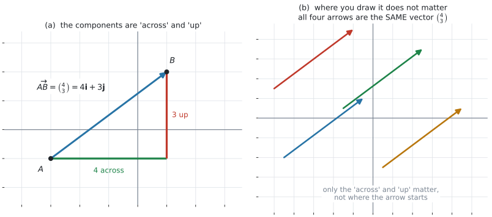
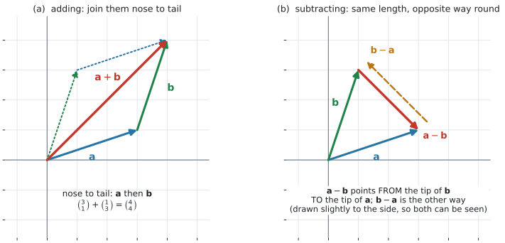
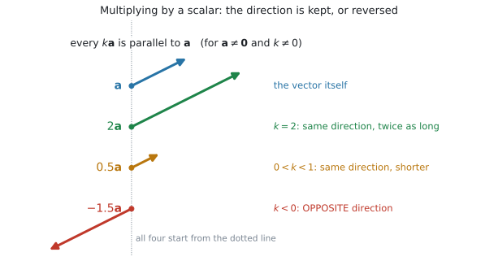

# AHL 3.10a — Vectors: the basics（ベクトルの基本） {#sec-ahl-3-10a}

::: {.callout-note}
## What you should be able to do
- **vector**（ベクトル）と **scalar**（スカラー）のちがいを、例を挙げて説明できる。
- ベクトルを **directed line segment**（有向線分）でかき、**成分**を読み取れる。
- 同じベクトルを、**列ベクトル**と **$\mathbf{i}$、$\mathbf{j}$、$\mathbf{k}$** の $2$ 通りで書ける。
- ベクトルの**和と差**を、**図でも成分でも**求められる。
- **scalar multiple**（スカラー倍）$k\mathbf{v}$ を求め、**$\mathbf{v}$ と平行**であることを説明できる。
- $2$ つのベクトルが平行かどうかを判定し、$\mathbf{a} = k\mathbf{b}$ の $k$ を求められる。
- **zero vector**（零ベクトル）$\mathbf{0}$ と $-\mathbf{v}$ が何を表すかを言える。
- $3$ 次元でも、**成分が $1$ つ増えるだけ**で同じ計算ができる。
:::

::: {.callout-important}
## 公式集の AHL 3.10 の欄
**$1$ 行だけです。** ベクトルの**大きさ**の式です。

$$
\lvert \mathbf{v} \rvert = \sqrt{v_1^{\,2} + v_2^{\,2} + v_3^{\,2}}, \qquad \mathbf{v} = \begin{pmatrix} v_1 \\ v_2 \\ v_3 \end{pmatrix}
$$ {#eq-ahl310a-mag}

@eq-ahl310a-mag は次のページ [AHL 3.10b](ahl-3-10b.qmd) で使います。

**このページで扱うこと——成分の書き方、和と差、スカラー倍——は、公式集にありません。** 覚える式というより、**書き方の約束**だからです。約束を $1$ 度のみこめば、あとは足し算と掛け算だけです。
:::

::: {.callout-note}
## シラバスが、この項目に求めていること
AHL 3.10 の Content 欄は $7$ 行あります。このページはそのうち $5$ 行を扱います。

> Concept of a vector and a scalar.

> Representation of vectors using directed line segments.

> Unit vectors; base vectors $\mathbf{i}$, $\mathbf{j}$, $\mathbf{k}$.

> Components of a vector; column representation; $\mathbf{v} = \begin{pmatrix} v_1 \\ v_2 \\ v_3 \end{pmatrix} = v_1\mathbf{i} + v_2\mathbf{j} + v_3\mathbf{k}$

> The zero vector $\mathbf{0}$, the vector $-\mathbf{v}$.

残りの $2$ 行——position vectors と rescaling / normalizing——は [AHL 3.10b](ahl-3-10b.qmd) です。`Unit vectors` も、**基準になる $\mathbf{i}$、$\mathbf{j}$、$\mathbf{k}$ はこのページ**、一般の単位ベクトルの作り方はあちらで扱います。

Guidance 欄のうち、このページに関わるのは次の $1$ 行です。

> Use algebraic and geometric approaches to calculate the sum and difference of two vectors, multiplication by a scalar, $k\mathbf{v}$ (parallel vectors), magnitude of a vector $\lvert\mathbf{v}\rvert$ from components.

**`algebraic and geometric` の $2$ つが並んでいるところが大事です。** 成分で計算できるだけでは足りず、**図で何をしているのかも説明できる**必要があります（[第5節](#add)、[第6節](#subtract)）。

Connections 欄には $3$ つ挙がっています。

> **Links to other subjects:** Vector sums, differences and resultants (physics).

> **Aims:** Vector theory is used for tracking displacement of objects, including peaceful and harmful purposes.

> **TOK:** Vectors are used to solve many problems in position location. This can be used to save a lost sailor or destroy a building with a laser-guided bomb. To what extent does possession of knowledge carry with it an ethical obligation?

AHL Topic 3 全体の Recommended teaching hours は $28$ 時間です。
:::

::: {.callout-tip}
## AI SL には、ベクトルがありません
AI SL の Topic 3 は、$3$ 次元図形・三角比・方位角・扇形・垂直二等分線・ボロノイ図でした。**ベクトルは $1$ 度も出てきません。**

ですから、この項目は**まったく新しい道具**です。前提として使うのは、座標の読み方と三平方の定理くらいです。**ゆっくり読んでください。**

このあと [AHL 3.11](ahl-3-11.qmd)（直線）、[AHL 3.12a](ahl-3-12a.qmd)（運動）、[AHL 3.13a](ahl-3-13a.qmd)（内積）と続きます。**全部このページの上に乗ります。**
:::

## The idea

### 1. vector は「大きさ」と「向き」の $2$ つを持ちます {#idea}

**scalar**（スカラー）は**数だけ**のものです。**vector**（ベクトル）は**数と向きの両方**を持つものです。

| scalar（数だけ） | vector（数と向き） |
|:--|:--|
| 距離 $5$ km | 変位 「北へ $5$ km」 |
| speed（速さ）$60$ km/h | velocity（速度）「東へ $60$ km/h」 |
| 質量 $3$ kg | force（力）「下向きに $30$ N」 |
| 時間 $2$ 時間 | — |

: scalar と vector {#tbl-ahl310a-vs}

@tbl-ahl310a-vs の右の列は、どれも「どちら向きか」を言わないと決まりません。**「$5$ km 歩いた」だけでは、どこにいるか分かりません。** 向きが要ります。これがベクトルを使う理由です。

::: {.callout-warning}
## speed と velocity は、別のものです
日本語ではどちらも「速さ／速度」と訳せてしまいますが、英語では区別します。

- **speed** … scalar。**数だけ。** $60$ km/h
- **velocity** … vector。**数と向き。** 「東へ $60$ km/h」

同じように **distance**（道のり、scalar）と **displacement**（変位、vector）も別です。[AHL 5.13](../05-calculus/ahl-5-13.qmd) で $1$ 次元の場合を扱いました。**このページは、それを平面と空間に広げます。**
:::

### 2. 有向線分でかきます {#arrow}

ベクトルは**矢印**でかきます。これを **directed line segment**（有向線分）といいます。

- **矢印の長さ** … 大きさ
- **矢印の向き** … 向き

点 $A$ から点 $B$ へ向かうベクトルを $\overrightarrow{AB}$ と書きます。

::: {.callout-important}
## 手書きでは、下線を引いてください
印刷では、ベクトルは**太字**で $\mathbf{v}$ と書かれます。しかし**手書きで太字は書けません。**

答案では、次のどちらかにします。

$$
\underline{v} \qquad \text{または} \qquad \overrightarrow{v}
$$

**ふつうの $v$ のまま書くと、スカラーと区別が付きません。** 採点者に、スカラーの計算をしているように読まれかねません。
:::

### 3. 成分で書きます — 列ベクトルと $\mathbf{i}$、$\mathbf{j}$、$\mathbf{k}$ {#components}

矢印だけでは計算できないので、**数の組**にします。

{#fig-ahl310a-components width=100%}

@fig-ahl310a-components の (a) を見てください。$A$ から $B$ へは、**右に $4$、上に $3$** 進みます。ですから

$$
\overrightarrow{AB} = \begin{pmatrix} 4 \\ 3 \end{pmatrix} = 4\mathbf{i} + 3\mathbf{j}
$$ {#eq-ahl310a-two-forms}

**同じものを $2$ 通りに書いただけ**です。

- **column representation**（列ベクトル）… 縦に並べます。**計算はこちらが速い**です
- **$\mathbf{i}$、$\mathbf{j}$、$\mathbf{k}$ を使う形** … 問題文はこちらで来ることもあります

$\mathbf{i}$、$\mathbf{j}$、$\mathbf{k}$ を **base vectors**（基本ベクトル）といいます。

$2$ 次元では、$2$ つです。

$$
\mathbf{i} = \begin{pmatrix} 1 \\ 0 \end{pmatrix}, \qquad \mathbf{j} = \begin{pmatrix} 0 \\ 1 \end{pmatrix}
$$ {#eq-ahl310a-base}

$3$ 次元では、成分が $1$ つ増えて $3$ つになります。

$$
\mathbf{i} = \begin{pmatrix} 1 \\ 0 \\ 0 \end{pmatrix}, \qquad \mathbf{j} = \begin{pmatrix} 0 \\ 1 \\ 0 \end{pmatrix}, \qquad \mathbf{k} = \begin{pmatrix} 0 \\ 0 \\ 1 \end{pmatrix}
$$ {#eq-ahl310a-base3}

**それぞれ、各軸の向きに長さ $1$ だけ進むベクトル**です。$4\mathbf{i} + 3\mathbf{j}$ は「$\mathbf{i}$ の向きに $4$、$\mathbf{j}$ の向きに $3$」という意味で、@eq-ahl310a-base を入れれば @eq-ahl310a-two-forms の列ベクトルとまったく同じものになります。

**このページでは、列ベクトルを主に使います。** ただし、初めて出す**例**には $\mathbf{i}$、$\mathbf{j}$、$\mathbf{k}$ の形も並べます。**問題文がどちらで来ても読めるように**しておいてください。

### 4. 同じベクトルは、どこに置いても同じです {#equal}

@fig-ahl310a-components の (b) の $4$ 本の矢印は、**すべて同じベクトル $\begin{pmatrix} 4 \\ 3 \end{pmatrix}$**です。(a) の $\overrightarrow{AB}$ と同じものを、$4$ か所に置いてみただけです。

**ベクトルが持っているのは、大きさと向きだけ**です。**どこから出発したかは、ベクトルの一部ではありません。**

$$
\text{成分が同じ} \quad \Longleftrightarrow \quad \text{同じベクトル}
$$

これは便利な性質です。足し算をするときに、**矢印を平行移動して好きな位置に置ける**からです（[第5節](#add)）。

::: {.callout-tip}
## 「点」と「ベクトル」は別のものです
点 $(4,\ 3)$ と、ベクトル $\begin{pmatrix} 4 \\ 3 \end{pmatrix}$ は、書き方が似ていますが**別のもの**です。

- **点** … 平面の $1$ か所を指します。動かせません
- **ベクトル** … 「右に $4$、上に $3$」という**動き方**を表します。どこから始めてもよい

$2$ つをつなぐのが **position vector**（位置ベクトル）で、[AHL 3.10b](ahl-3-10b.qmd#position) で扱います。
:::

### 5. 足し算 — 矢印をつなぐ、成分を足す {#add}

{#fig-ahl310a-addsub width=100%}

**幾何の見方**（@fig-ahl310a-addsub の (a)）。$\mathbf{a}$ の矢印の先に $\mathbf{b}$ の矢印の根元をつなぎます。**出発点から到着点までを結んだものが $\mathbf{a}+\mathbf{b}$** です。これを **nose to tail**（先端と根元をつなぐ）といいます。

**代数の見方。** 成分どうしを足すだけです。

$$
\begin{pmatrix} a_1 \\ a_2 \end{pmatrix} + \begin{pmatrix} b_1 \\ b_2 \end{pmatrix} = \begin{pmatrix} a_1+b_1 \\ a_2+b_2 \end{pmatrix}
$$ {#eq-ahl310a-add}

図の例では

$$
\begin{pmatrix} 3 \\ 1 \end{pmatrix} + \begin{pmatrix} 1 \\ 3 \end{pmatrix} = \begin{pmatrix} 4 \\ 4 \end{pmatrix}
$$

**$2$ つの見方は、同じことを言っています**（[Why it works](#why-it-works)）。

@fig-ahl310a-addsub の (a) の点線に注目してください。**$\mathbf{b}$ を先に進んでから $\mathbf{a}$ を進んでも、同じ場所に着きます。**

$$
\mathbf{a}+\mathbf{b} = \mathbf{b}+\mathbf{a}
$$

できる図が平行四辺形になるので、これを **parallelogram rule**（平行四辺形の法則）ともいいます。

::: {.callout-note}
## resultant（合成）は、足し算のことです
Guidance に `The resultant as the sum of two or more vectors.` とあります。

**resultant**（合力・合成ベクトル）は、**いくつかのベクトルを全部足したもの**です。新しい計算ではありません。

$3$ つ以上でも同じで、順に nose to tail でつないでいくだけです（@exm-ahl310a-drone）。

「resultant の**大きさと向き**」を聞かれたら、[AHL 3.10b](ahl-3-10b.qmd#magnitude) の $\lvert\mathbf{v}\rvert$ が要ります。**このページでは、足して成分を出すところまで**です。
:::

### 6. 引き算 — $\mathbf{a}-\mathbf{b}$ は $\mathbf{a} + (-\mathbf{b})$ です {#subtract}

成分では、引くだけです。

$$
\begin{pmatrix} a_1 \\ a_2 \end{pmatrix} - \begin{pmatrix} b_1 \\ b_2 \end{pmatrix} = \begin{pmatrix} a_1-b_1 \\ a_2-b_2 \end{pmatrix}
$$ {#eq-ahl310a-sub}

**図で見ると、向きが大事です。** @fig-ahl310a-addsub の (b) で、$\mathbf{a}$ と $\mathbf{b}$ を同じ点から出したとき

- **$\mathbf{a}-\mathbf{b}$** … **$\mathbf{b}$ の先から $\mathbf{a}$ の先へ**向かう矢印
- **$\mathbf{b}-\mathbf{a}$** … その**逆向き**

$2$ つは長さが同じで、**向きが正反対**です。

$$
\mathbf{b}-\mathbf{a} = -(\mathbf{a}-\mathbf{b})
$$

::: {.callout-warning}
## $\mathbf{a}-\mathbf{b}$ と $\mathbf{b}-\mathbf{a}$ を取りちがえない
足し算とちがって、**引き算は順序で答えが変わります。**

$\mathbf{a} = \begin{pmatrix} 3 \\ 1 \end{pmatrix}$、$\mathbf{b} = \begin{pmatrix} 1 \\ 3 \end{pmatrix}$ なら

$$
\mathbf{a}-\mathbf{b} = \begin{pmatrix} 2 \\ -2 \end{pmatrix}, \qquad \mathbf{b}-\mathbf{a} = \begin{pmatrix} -2 \\ 2 \end{pmatrix}
$$

**覚え方は「先から先へ」です。** $\mathbf{a}-\mathbf{b}$ は「**$\mathbf{b}$ から $\mathbf{a}$ へ**」。引かれるほうが**行き先**です。

この向きの取りちがえは、[AHL 3.10b](ahl-3-10b.qmd#ab) の $\overrightarrow{AB} = \mathbf{b}-\mathbf{a}$ でも、[AHL 3.12a](ahl-3-12a.qmd) の相対位置でも、そのまま効いてきます。
:::

### 7. スカラー倍と、平行 {#scalar-multiple}

**数を $1$ つ掛ける**のが scalar multiple です。成分すべてに掛けます。

$$
k\begin{pmatrix} a_1 \\ a_2 \end{pmatrix} = \begin{pmatrix} ka_1 \\ ka_2 \end{pmatrix}
$$ {#eq-ahl310a-scalar}

{#fig-ahl310a-scalar width=100%}

@fig-ahl310a-scalar のとおり、長さは $\lvert k \rvert$ 倍になり、**向きは $k$ の符号で決まります（$k \neq 0$ のとき）。**

| $k$ | 向き | 長さ |
|:--|:--|:--|
| $k > 1$ | $\mathbf{a}$ と同じ | 長くなる |
| $k = 1$ | $\mathbf{a}$ と同じ | 変わらない |
| $0 < k < 1$ | $\mathbf{a}$ と同じ | 短くなる |
| $k < 0$ | $\mathbf{a}$ と**逆** | $\lvert k \rvert$ 倍 |
| $k = 0$ | 向きがなくなる | $0$ になる（[第8節](#zero)） |

: $k\mathbf{a}$ の見え方 {#tbl-ahl310a-scalar}

**ここから、平行の判定が出ます。$\mathbf{a} \neq \mathbf{0}$、$\mathbf{b} \neq \mathbf{0}$ のとき**、次が成り立ちます。

$$
\mathbf{a} \ \text{と} \ \mathbf{b} \ \text{が平行} \quad \Longleftrightarrow \quad \mathbf{a} = k\mathbf{b} \ \text{となる数} \ k \ \text{がある}
$$ {#eq-ahl310a-parallel}

::: {.callout-important}
## 平行の判定は、$0$ の成分がなければ「比が同じか」で見ます
$\begin{pmatrix} 6 \\ -4 \end{pmatrix}$ と $\begin{pmatrix} -9 \\ 6 \end{pmatrix}$ が平行かを調べます。

$$
\frac{6}{-9} = -\frac{2}{3}, \qquad \frac{-4}{6} = -\frac{2}{3}
$$

**$2$ つの比が一致したので平行**です。$k = -\dfrac{2}{3}$ です（@exm-ahl310a-parallel）。

**比が食い違えば、平行ではありません。** $\begin{pmatrix} 6 \\ -4 \end{pmatrix}$ と $\begin{pmatrix} -9 \\ 5 \end{pmatrix}$ なら $-\dfrac{2}{3}$ と $-\dfrac{4}{5}$ で、平行ではありません。

**$k$ が負なら、平行だが向きは逆**です。「平行」は「同じ向き」とはかぎりません（@tbl-ahl310a-scalar）。

**$0$ の成分があるときは、割り算ではなく $\mathbf{a} = k\mathbf{b}$ を直に解いてください。** $\begin{pmatrix} 0 \\ 3 \end{pmatrix}$ と $\begin{pmatrix} 0 \\ -5 \end{pmatrix}$ は、$k = -\dfrac{3}{5}$ で平行です。
:::

### 8. 零ベクトルと $-\mathbf{v}$ {#zero}

**zero vector**（零ベクトル）$\mathbf{0}$ は、成分がすべて $0$ のベクトルです。

$$
\mathbf{0} = \begin{pmatrix} 0 \\ 0 \end{pmatrix}
$$

「動かない」を表します。**長さが $0$ なので、向きがありません。** これが $\mathbf{0}$ だけの特別なところです。

$-\mathbf{v}$ は、$\mathbf{v}$ に $k = -1$ を掛けたものです。

$$
-\begin{pmatrix} 3 \\ -5 \end{pmatrix} = \begin{pmatrix} -3 \\ 5 \end{pmatrix}
$$

**長さは同じで、向きが正反対**です。図でいえば、矢印の頭と根元を入れかえたものです。

$$
\mathbf{v} + (-\mathbf{v}) = \mathbf{0}, \qquad \overrightarrow{BA} = -\overrightarrow{AB}
$$ {#eq-ahl310a-neg}

**$\mathbf{0}$ は太字で書きます。** 数の $0$ とは別のものだからです。

### 9. $3$ 次元でも、成分が $1$ つ増えるだけです {#three-d}

ここまで $2$ 次元で書いてきましたが、**$3$ 次元でも規則は変わりません。**

$$
\begin{pmatrix} 1 \\ -2 \\ 4 \end{pmatrix} + \begin{pmatrix} 3 \\ 0 \\ -1 \end{pmatrix} = \begin{pmatrix} 4 \\ -2 \\ 3 \end{pmatrix}, \qquad 2\begin{pmatrix} 1 \\ -2 \\ 4 \end{pmatrix} = \begin{pmatrix} 2 \\ -4 \\ 8 \end{pmatrix}
$$

$3$ つ目の成分は $z$ 方向、つまり @eq-ahl310a-base3 の $\mathbf{k}$ の向きです。

$$
\begin{pmatrix} 1 \\ -2 \\ 4 \end{pmatrix} = \mathbf{i} - 2\mathbf{j} + 4\mathbf{k}
$$

**平行の判定も同じ**です。$3$ つの比がそろえば平行——ただし $0$ の成分があるときは、[第7節](#scalar-multiple) と同じく $\mathbf{a} = k\mathbf{b}$ を直に解きます。

**図はかきにくくなりますが、計算は変わりません。** ここが列ベクトルの強みです。図が想像できなくても、成分で押していけます。

## Why it works

**なぜ「矢印をつなぐ」と「成分を足す」が同じ結果になるのか。**

$\mathbf{a} = \begin{pmatrix} 3 \\ 1 \end{pmatrix}$ を進むというのは、「**右に $3$、上に $1$**」ということです。続けて $\mathbf{b} = \begin{pmatrix} 1 \\ 3 \end{pmatrix}$ を進むのは、「**右に $1$、上に $3$**」です。

$$
\text{横に進んだ合計} = 3+1 = 4, \qquad \text{縦に進んだ合計} = 1+3 = 4
$$

**横の動きと縦の動きは、互いに影響しません。** 右に進んでも高さは変わらず、上に進んでも横位置は変わらないからです。ですから**それぞれ別々に足せます。** これが @eq-ahl310a-add の中身です。

$3$ 次元でも同じで、$x$・$y$・$z$ の $3$ つが互いに影響しないので、$3$ つとも別々に足せます。

**$k\mathbf{a}$ が $\mathbf{a}$ と平行になる理由も、同じところにあります。**

$\mathbf{a} = \begin{pmatrix} a_1 \\ a_2 \end{pmatrix}$ に $k$ を掛けると $\begin{pmatrix} ka_1 \\ ka_2 \end{pmatrix}$ です。**横と縦が、同じ割合で伸びます。**

$$
\frac{ka_2}{ka_1} = \frac{a_2}{a_1} \qquad (a_1 \neq 0,\ k \neq 0)
$$

傾きが変わらないので、向きは同じ直線のままです。$k > 0$ なら同じ側、$k < 0$ なら反対側を向きます。

**$k = 0$ のときだけ別扱い**です。$0\mathbf{a} = \mathbf{0}$ で、これは向きを持ちません（[第8節](#zero)）。**「$\mathbf{0}$ はすべてのベクトルと平行」とする流儀もありますが、AI HL でそこを問われることはありません。**

## Worked examples

::: {.callout-note appearance="simple"}
問題文は英語です。意味が理解できなかったら、問題文の下の「**日本語訳**」を開いてください。解説は日本語です。
:::

::: {#exm-ahl310a-basic}
[Let $\mathbf{a} = \begin{pmatrix} 3 \\ -1 \end{pmatrix}$ and $\mathbf{b} = \begin{pmatrix} 2 \\ 5 \end{pmatrix}$.]{.q-en}

**(a)** [Find $\mathbf{a} + \mathbf{b}$.]{.q-en}

**(b)** [Find $\mathbf{a} - \mathbf{b}$.]{.q-en}

**(c)** [Find $2\mathbf{a} - 3\mathbf{b}$.]{.q-en}

<details class="jp-trans">
<summary>日本語訳</summary>

$\mathbf{a} = \begin{pmatrix} 3 \\ -1 \end{pmatrix}$、$\mathbf{b} = \begin{pmatrix} 2 \\ 5 \end{pmatrix}$ とします。

**(a)** $\mathbf{a} + \mathbf{b}$ を求めなさい。

**(b)** $\mathbf{a} - \mathbf{b}$ を求めなさい。

**(c)** $2\mathbf{a} - 3\mathbf{b}$ を求めなさい。

</details>

---

**(a)** 成分どうしを足します（@eq-ahl310a-add）。

$$
\mathbf{a}+\mathbf{b} = \begin{pmatrix} 3+2 \\ -1+5 \end{pmatrix} = \begin{pmatrix} 5 \\ 4 \end{pmatrix}
$$

**(b)** 成分どうしを引きます（@eq-ahl310a-sub）。**$-1 - 5$ の符号に注意してください。**

$$
\mathbf{a}-\mathbf{b} = \begin{pmatrix} 3-2 \\ -1-5 \end{pmatrix} = \begin{pmatrix} 1 \\ -6 \end{pmatrix}
$$

**(c)** **先にスカラー倍をしてから、引きます。**

$$
2\mathbf{a} = \begin{pmatrix} 6 \\ -2 \end{pmatrix}, \qquad 3\mathbf{b} = \begin{pmatrix} 6 \\ 15 \end{pmatrix}
$$

$$
2\mathbf{a}-3\mathbf{b} = \begin{pmatrix} 6-6 \\ -2-15 \end{pmatrix} = \begin{pmatrix} 0 \\ -17 \end{pmatrix}
$$

**検算。** (b) の答えを逆向きにすると $\mathbf{b}-\mathbf{a}$ になるはずです。$\begin{pmatrix} 2-3 \\ 5-(-1) \end{pmatrix} = \begin{pmatrix} -1 \\ 6 \end{pmatrix}$ で、たしかに $\begin{pmatrix} 1 \\ -6 \end{pmatrix}$ の符号を変えたもの ✓（[第6節](#subtract)）

(c) は、(a) の答えを使っても確かめられます。$2\mathbf{a}-3\mathbf{b} = 2(\mathbf{a}+\mathbf{b}) - 5\mathbf{b} = \begin{pmatrix} 10 \\ 8 \end{pmatrix} - \begin{pmatrix} 10 \\ 25 \end{pmatrix} = \begin{pmatrix} 0 \\ -17 \end{pmatrix}$ ✓ **別の道でも同じ値になりました。**

::: {.callout-note}
## 解答例（答案用紙にはこう書く）
**(a)**
$$\mathbf{a}+\mathbf{b} = \begin{pmatrix} 5 \\ 4 \end{pmatrix}$$

**(b)**
$$\mathbf{a}-\mathbf{b} = \begin{pmatrix} 1 \\ -6 \end{pmatrix}$$

**(c)**
$$2\mathbf{a}-3\mathbf{b} = \begin{pmatrix} 6 \\ -2 \end{pmatrix} - \begin{pmatrix} 6 \\ 15 \end{pmatrix} = \begin{pmatrix} 0 \\ -17 \end{pmatrix}$$
:::
:::

::: {#exm-ahl310a-ijk}
[Let $\mathbf{p} = 4\mathbf{i} - \mathbf{j}$ and $\mathbf{q} = -2\mathbf{i} + 3\mathbf{j}$.]{.q-en}

**(a)** [Find $\mathbf{p} + \mathbf{q}$, giving your answer in the form $a\mathbf{i} + b\mathbf{j}$.]{.q-en}

**(b)** [Find $3\mathbf{p} - 2\mathbf{q}$, giving your answer as a column vector.]{.q-en}

**(c)** [Describe the vector $-\mathbf{q}$ in relation to $\mathbf{q}$.]{.q-en}

<details class="jp-trans">
<summary>日本語訳</summary>

$\mathbf{p} = 4\mathbf{i} - \mathbf{j}$、$\mathbf{q} = -2\mathbf{i} + 3\mathbf{j}$ とします。

**(a)** $\mathbf{p} + \mathbf{q}$ を求め、$a\mathbf{i} + b\mathbf{j}$ の形で書きなさい。

**(b)** $3\mathbf{p} - 2\mathbf{q}$ を求め、列ベクトルで書きなさい。

**(c)** $\mathbf{q}$ との関係で、ベクトル $-\mathbf{q}$ を述べなさい。

</details>

---

**まず列ベクトルに直します。** そのほうが計算が速いからです（[第3節](#components)）。

$$
\mathbf{p} = \begin{pmatrix} 4 \\ -1 \end{pmatrix}, \qquad \mathbf{q} = \begin{pmatrix} -2 \\ 3 \end{pmatrix}
$$

**$4\mathbf{i} - \mathbf{j}$ の $\mathbf{j}$ の係数は $-1$ です。** 何も書いていないので $0$ ではありません。

**(a)** 足してから、$\mathbf{i}$、$\mathbf{j}$ の形に戻します。**問題文が指定した形で答えてください。**

$$
\mathbf{p}+\mathbf{q} = \begin{pmatrix} 2 \\ 2 \end{pmatrix} = 2\mathbf{i} + 2\mathbf{j}
$$

**(b)**

$$
3\mathbf{p} = \begin{pmatrix} 12 \\ -3 \end{pmatrix}, \qquad 2\mathbf{q} = \begin{pmatrix} -4 \\ 6 \end{pmatrix}
$$

$$
3\mathbf{p}-2\mathbf{q} = \begin{pmatrix} 12-(-4) \\ -3-6 \end{pmatrix} = \begin{pmatrix} 16 \\ -9 \end{pmatrix}
$$

**$12 - (-4) = 16$ です。** ここが、いちばん間違えるところです。

**(c)** `Describe` なので、**言葉で答えます**（[第8節](#zero)）。

::: {.model-answer}
**試験ではこう書く**

*The vector $-\mathbf{q}$ has the same magnitude as $\mathbf{q}$ but points in the opposite direction. In components, $-\mathbf{q} = 2\mathbf{i} - 3\mathbf{j}$, which is $\mathbf{q}$ with the sign of each component reversed.*
:::

（ベクトル $-\mathbf{q}$ は $\mathbf{q}$ と大きさが同じで、向きが反対である。成分で書けば $-\mathbf{q} = 2\mathbf{i} - 3\mathbf{j}$ で、$\mathbf{q}$ の各成分の符号を変えたものである、という意味です。）

**検算。** いちばん危ないのは (b) なので、そこを逆から見ます。$3\mathbf{p}-2\mathbf{q}$ に $2\mathbf{q}$ を足すと $3\mathbf{p}$ に戻るはずです。$\begin{pmatrix} 16 \\ -9 \end{pmatrix} + \begin{pmatrix} -4 \\ 6 \end{pmatrix} = \begin{pmatrix} 12 \\ -3 \end{pmatrix} = 3\mathbf{p}$ ✓ **$12-(-4)$ を $8$ としていたら、ここで $3\mathbf{p}$ に戻りません。**

::: {.callout-note}
## 解答例（答案用紙にはこう書く）
**(a)**
$$\mathbf{p}+\mathbf{q} = 2\mathbf{i} + 2\mathbf{j}$$

**(b)**
$$3\mathbf{p}-2\mathbf{q} = \begin{pmatrix} 12 \\ -3 \end{pmatrix} - \begin{pmatrix} -4 \\ 6 \end{pmatrix} = \begin{pmatrix} 16 \\ -9 \end{pmatrix}$$

**(c)**
*$-\mathbf{q}$ has the same magnitude as $\mathbf{q}$ but the opposite direction.*
:::
:::

::: {#exm-ahl310a-parallel}
[Let $\mathbf{a} = \begin{pmatrix} 6 \\ -4 \end{pmatrix}$ and $\mathbf{b} = \begin{pmatrix} -9 \\ 6 \end{pmatrix}$.]{.q-en}

**(a)** [Show that $\mathbf{a}$ and $\mathbf{b}$ are parallel.]{.q-en}

**(b)** [Find the value of $k$ such that $\mathbf{a} = k\mathbf{b}$.]{.q-en}

**(c)** [State, with a reason, whether $\mathbf{a}$ and $\mathbf{b}$ point in the same direction.]{.q-en}

<details class="jp-trans">
<summary>日本語訳</summary>

$\mathbf{a} = \begin{pmatrix} 6 \\ -4 \end{pmatrix}$、$\mathbf{b} = \begin{pmatrix} -9 \\ 6 \end{pmatrix}$ とします。

**(a)** $\mathbf{a}$ と $\mathbf{b}$ が平行であることを示しなさい。

**(b)** $\mathbf{a} = k\mathbf{b}$ となる $k$ の値を求めなさい。

**(c)** $\mathbf{a}$ と $\mathbf{b}$ が同じ向きかどうかを、理由とともに述べなさい。

</details>

---

**(a)** `Show that` なので、**比が一致するところまで書きます**（[第7節](#scalar-multiple)）。

$$
\frac{6}{-9} = -\frac{2}{3}, \qquad \frac{-4}{6} = -\frac{2}{3}
$$

$2$ つの比が等しいので、$\mathbf{a} = k\mathbf{b}$ となる $k$ が存在します。**したがって平行です。**

**(b)** その $k$ が、いま出た比です。

$$
k = -\frac{2}{3}
$$

**検算。** $-\dfrac{2}{3}\begin{pmatrix} -9 \\ 6 \end{pmatrix} = \begin{pmatrix} 6 \\ -4 \end{pmatrix}$ ✓ $\mathbf{a}$ に戻りました。

**(c)** `State, with a reason` なので、**答えと理由の両方**が要ります。

::: {.model-answer}
**試験ではこう書く**

*No. Since $k = -\dfrac{2}{3}$ is negative, $\mathbf{a}$ is a negative multiple of $\mathbf{b}$, so the two vectors are parallel but point in opposite directions.*
:::

（いいえ。$k = -\dfrac{2}{3}$ は負なので、$\mathbf{a}$ は $\mathbf{b}$ の負の倍数である。したがって $2$ つは平行だが、向きは反対である、という意味です。）

**検算。** (a) で平行が言えているので、残るは向きだけです。$\mathbf{a}$ は右下向き（$+$、$-$）、$\mathbf{b}$ は左上向き（$-$、$+$）——**平行なもの同士でこうなるのは $k<0$ のときだけ**です ✓ (c) と合っています。**（平行が言えていないうちに「符号が全部逆だから逆向き」とはできません。** $\begin{pmatrix} 1 \\ -1 \end{pmatrix}$ と $\begin{pmatrix} -1 \\ 5 \end{pmatrix}$ は符号が全部逆ですが、平行ですらありません。）

::: {.callout-note}
## 解答例（答案用紙にはこう書く）
**(a)**
$$\frac{6}{-9} = -\frac{2}{3} \quad \text{and} \quad \frac{-4}{6} = -\frac{2}{3}$$
*The ratios are equal, so $\mathbf{a}$ is a scalar multiple of $\mathbf{b}$ and the vectors are parallel.*

**(b)**
$$k = -\frac{2}{3}$$

**(c)**
*No: $k$ is negative, so they are parallel but in opposite directions.*
:::
:::

::: {#exm-ahl310a-drone}
[A drone flies three legs, one after the other. Taking east and north as the positive directions, in metres the legs are]{.q-en}

$$
\begin{pmatrix} 300 \\ 400 \end{pmatrix}, \qquad \begin{pmatrix} -100 \\ 250 \end{pmatrix}, \qquad \begin{pmatrix} 150 \\ -500 \end{pmatrix}
$$

**(a)** [Find the resultant displacement of the drone.]{.q-en}

**(b)** [Write down the vector the drone must fly to return directly to its starting point.]{.q-en}

**(c)** [Interpret your answer to part (a) in the context of the flight.]{.q-en}

<details class="jp-trans">
<summary>日本語訳</summary>

ドローンが $3$ 本の行程を続けて飛びます。東と北を正の向きとして、各行程はメートル単位で上のとおりです。

**(a)** このドローンの resultant displacement（合成変位）を求めなさい。

**(b)** 出発点にまっすぐ戻るために飛ぶべきベクトルを書きなさい。

**(c)** (a) の答えを、この飛行の文脈で解釈しなさい。

</details>

---

**(a)** resultant は**全部足したもの**でした（[第5節](#add)）。

$$
\begin{pmatrix} 300 \\ 400 \end{pmatrix} + \begin{pmatrix} -100 \\ 250 \end{pmatrix} + \begin{pmatrix} 150 \\ -500 \end{pmatrix} = \begin{pmatrix} 300-100+150 \\ 400+250-500 \end{pmatrix} = \begin{pmatrix} 350 \\ 150 \end{pmatrix}
$$

**(b)** 戻るには、いまの変位を打ち消せばよいので $-\mathbf{v}$ です（@eq-ahl310a-neg）。

$$
\begin{pmatrix} -350 \\ -150 \end{pmatrix}
$$

**(c)** `Interpret` なので、**ドローンの言葉**で書きます。$350$ は東向き、$150$ は北向きの成分です。

::: {.model-answer}
**試験ではこう書く**

*Although the drone flew three separate legs, its overall change in position is the same as flying $350$ m east and $150$ m north from the starting point. The path it actually took does not matter for the resultant: only where it started and where it finished.*
:::

（ドローンは $3$ 本の行程を別々に飛んだが、位置の変化全体は、出発点から東へ $350$ m、北へ $150$ m 飛んだのと同じである。resultant にとって、実際にたどった経路は関係ない。出発点と到着点だけで決まる、という意味です。）

**検算。** (a) を、足す順を変えて出し直します。**足し算の順序は答えを変えない**からです（[第5節](#add)）。

$$
\begin{pmatrix} -100 \\ 250 \end{pmatrix} + \begin{pmatrix} 150 \\ -500 \end{pmatrix} = \begin{pmatrix} 50 \\ -250 \end{pmatrix}, \qquad \begin{pmatrix} 50 \\ -250 \end{pmatrix} + \begin{pmatrix} 300 \\ 400 \end{pmatrix} = \begin{pmatrix} 350 \\ 150 \end{pmatrix} \ ✓
$$

**（(a) と (b) を足して $\mathbf{0}$ になるのは検算になりません。** (b) は (a) の符号を変えただけなので、(a) が間違っていても $\mathbf{0}$ になります。）なお **「出発点に戻る」＝「変位の合計が $\mathbf{0}$」**です（[第8節](#zero)）。

::: {.callout-note}
## 解答例（答案用紙にはこう書く）
**(a)**
$$\begin{pmatrix} 300 \\ 400 \end{pmatrix} + \begin{pmatrix} -100 \\ 250 \end{pmatrix} + \begin{pmatrix} 150 \\ -500 \end{pmatrix} = \begin{pmatrix} 350 \\ 150 \end{pmatrix}$$

**(b)**
$$\begin{pmatrix} -350 \\ -150 \end{pmatrix}$$

**(c)**
*The overall effect of the three legs is the same as a single flight of $350$ m east and $150$ m north.*
:::
:::

## Common errors

::: {.callout-warning}
## 引き算の順序を逆にする
$\mathbf{a}-\mathbf{b}$ と $\mathbf{b}-\mathbf{a}$ は**別のベクトル**です。長さは同じですが、向きが正反対です（[第6節](#subtract)）。

$$
\mathbf{a}-\mathbf{b} = \begin{pmatrix} 1 \\ -6 \end{pmatrix} \quad \text{に対して} \quad \mathbf{b}-\mathbf{a} = \begin{pmatrix} -1 \\ 6 \end{pmatrix}
$$

**引かれるほうが行き先**です。$\mathbf{a}-\mathbf{b}$ は「$\mathbf{b}$ から $\mathbf{a}$ へ」。
:::

::: {.callout-warning}
## スカラー倍で、成分を $1$ つしか掛けない
$3\begin{pmatrix} 2 \\ -5 \end{pmatrix}$ を $\begin{pmatrix} 6 \\ -5 \end{pmatrix}$ としてしまう誤りです。

**すべての成分に掛けます**（@eq-ahl310a-scalar）。正しくは $\begin{pmatrix} 6 \\ -15 \end{pmatrix}$ です。

$3$ 次元なら $3$ つとも掛けます。**書き写すときに $1$ つ落とさない**でください（演習 $4$、演習 $10$）。
:::

::: {.callout-warning}
## $\mathbf{i}$ や $\mathbf{j}$ の係数が $1$ のとき、$1$ を忘れる
$4\mathbf{i} - \mathbf{j}$ の $\mathbf{j}$ の係数は **$-1$** です。$0$ ではありません。

$$
4\mathbf{i} - \mathbf{j} = \begin{pmatrix} 4 \\ -1 \end{pmatrix}
$$

同じように $\mathbf{i} + 5\mathbf{k}$ は $\begin{pmatrix} 1 \\ 0 \\ 5 \end{pmatrix}$ です。**$\mathbf{j}$ が無いところは $0$、$\mathbf{i}$ だけのところは $1$** です。
:::

::: {.callout-warning}
## 「平行」を「同じ向き」と決めつける
$\mathbf{a} = k\mathbf{b}$ の $k$ が**負でも平行**です（@tbl-ahl310a-scalar）。

`Are they parallel?` と `Do they point in the same direction?` は、**別の問い**です。

前者は $k$ が**あるかどうか**、後者は $k$ の**符号**で決まります（@exm-ahl310a-parallel）。
:::

::: {.callout-warning}
## ベクトルに下線を引かずに書く
手書きでは太字が書けないので、$\underline{v}$ または $\overrightarrow{v}$ とします（[第2節](#arrow)）。

**下線のない $v$ は、スカラーとして読まれます。** $\mathbf{a}+\mathbf{b}$ を $a+b$ と書いてしまうと、まったく別のことを言っていることになります。

$\mathbf{0}$ も同じです。**零ベクトルは太字（手書きなら下線）**、数の $0$ とは書き分けます。
:::

## Using your GDC (TI-Nspire CX II)

### 1. ベクトルは角かっこで入れます {#gdc-enter}

TI-Nspire では、ベクトルを**角かっこ**で入力します。列ベクトルは、成分を `;` で区切ります。

```
[3;-1]
[2;5]
```

そのまま足し算・引き算・スカラー倍ができます。

```
[3;-1]+[2;5]
2*[3;-1]-3*[2;5]
```

$\begin{pmatrix} 5 \\ 4 \end{pmatrix}$ と $\begin{pmatrix} 0 \\ -17 \end{pmatrix}$ が返ります（@exm-ahl310a-basic）。

### 2. 名前を付けておくと、あとが楽です {#gdc-store}

同じベクトルを何度も使うので、変数に入れます。

```
[3;-1] → a
[2;5] → b
```

矢印 `→` は、**`ctrl` を押してから `var`** です。`sto` というキーはありません（[AHL 2.9a](../02-functions/ahl-2-9a.qmd#gdc-store) と同じです）。

そのあとは

```
a+b
2*a-3*b
```

と打つだけです。**打ち間違いが減ります。**

::: {.callout-warning}
## $1$ 文字の変数名は、ぶつかることがあります
`a` や `b` は、電卓が別の用途で使っていることがあります。うまくいかないときは、`va`、`vb` のような名前にしてください。

**$1$ つの問題が終わったら、変数を消しておく**と安全です（`menu → Actions → Clear a-z`）。
:::

### 3. $3$ 次元も同じです {#gdc-3d}

成分を $1$ つ増やすだけです。

```
[1;-2;4]+[3;0;-1]
```

$\begin{pmatrix} 4 \\ -2 \\ 3 \end{pmatrix}$ が返ります（[第9節](#three-d)）。**$2$ 次元と $3$ 次元で、打ち方は変わりません。**

### 4. 平行かどうかは、電卓では判定できません {#gdc-parallel}

**「平行か」を答えてくれるコマンドはありません。** 自分で比を見ます（[第7節](#scalar-multiple)）。

ただし、**$k$ を見つけたあとの確認**には使えます。

```
-2/3*[-9;6]
```

$\begin{pmatrix} 6 \\ -4 \end{pmatrix}$ が返れば、$k$ が合っています（@exm-ahl310a-parallel）。

### 5. 検算のしかた {#gdc-check}

- **答えをもとの式に戻す。** $k$ を出したら $k\mathbf{b}$ を計算して $\mathbf{a}$ に戻るか見る
- **引き算は、逆向きも出す。** $\mathbf{a}-\mathbf{b}$ と $\mathbf{b}-\mathbf{a}$ が符号だけ違うか見る（[第6節](#subtract)）
- **足して $\mathbf{0}$ になるはずのものは、実際に足す**（@exm-ahl310a-drone）
- **成分の符号を、図の向きと突き合わせる。** 右上向きなら両方正、左下向きなら両方負

$1$ つ目がいちばん強い検算です。**もとに戻らなければ、どこかで間違えています。**

## Exercises

::: {.callout-note appearance="simple"}
各問題に、折りたたみが $3$ つ付いています。**日本語訳**、**解答例**（答案用紙に書くべきこと。英語です）、**解説**（なぜそうなるか。日本語です）。

まず自分で解いて、次に解答例と見くらべてください。**解説は、合わなかったときだけ開けば十分です。**
:::

::: {.exercise-block}

[1]{.ex-no} [Let $\mathbf{a} = \begin{pmatrix} 5 \\ 2 \end{pmatrix}$ and $\mathbf{b} = \begin{pmatrix} -1 \\ 4 \end{pmatrix}$. Find $\mathbf{a}+\mathbf{b}$ and $\mathbf{a}-\mathbf{b}$.]{.q-en}

<details class="jp-trans">
<summary>日本語訳</summary>

$\mathbf{a} = \begin{pmatrix} 5 \\ 2 \end{pmatrix}$、$\mathbf{b} = \begin{pmatrix} -1 \\ 4 \end{pmatrix}$ とします。$\mathbf{a}+\mathbf{b}$ と $\mathbf{a}-\mathbf{b}$ を求めなさい。

</details>

::: {.callout-note collapse="true"}
## 解答例（答案用紙に書くこと）

$$\mathbf{a}+\mathbf{b} = \begin{pmatrix} 4 \\ 6 \end{pmatrix}, \qquad \mathbf{a}-\mathbf{b} = \begin{pmatrix} 6 \\ -2 \end{pmatrix}$$
:::

::: {.callout-tip collapse="true"}
## 解説

成分どうしを足し引きするだけです（@eq-ahl310a-add、@eq-ahl310a-sub）。

$5+(-1) = 4$、$5-(-1) = 6$ です。**引き算で $-(-1) = +1$ になるところ**が要注意です。

**検算。** $(\mathbf{a}+\mathbf{b})+(\mathbf{a}-\mathbf{b}) = 2\mathbf{a}$ になるはずです。$\begin{pmatrix} 4 \\ 6 \end{pmatrix}+\begin{pmatrix} 6 \\ -2 \end{pmatrix} = \begin{pmatrix} 10 \\ 4 \end{pmatrix} = 2\mathbf{a}$ ✓ **どちらか一方だけ間違えていたら、ここで合いません。**
:::

::: {.ex-sep}
:::

[2]{.ex-no} [Let $\mathbf{u} = 3\mathbf{i} + 7\mathbf{j}$ and $\mathbf{v} = 2\mathbf{i} - 5\mathbf{j}$. Find $\mathbf{u}+\mathbf{v}$ and $4\mathbf{u}-\mathbf{v}$, giving each answer in the form $a\mathbf{i}+b\mathbf{j}$.]{.q-en}

<details class="jp-trans">
<summary>日本語訳</summary>

$\mathbf{u} = 3\mathbf{i} + 7\mathbf{j}$、$\mathbf{v} = 2\mathbf{i} - 5\mathbf{j}$ とします。$\mathbf{u}+\mathbf{v}$ と $4\mathbf{u}-\mathbf{v}$ を求め、それぞれ $a\mathbf{i}+b\mathbf{j}$ の形で書きなさい。

</details>

::: {.callout-note collapse="true"}
## 解答例（答案用紙に書くこと）

$$\mathbf{u}+\mathbf{v} = 5\mathbf{i} + 2\mathbf{j}$$

$$4\mathbf{u}-\mathbf{v} = (12-2)\mathbf{i} + (28+5)\mathbf{j} = 10\mathbf{i} + 33\mathbf{j}$$
:::

::: {.callout-tip collapse="true"}
## 解説

$4\mathbf{u} = 12\mathbf{i}+28\mathbf{j}$ です。そこから $\mathbf{v} = 2\mathbf{i}-5\mathbf{j}$ を引くので、$\mathbf{j}$ のほうは $28-(-5) = 33$ になります。**ここが引っかかりどころ**です。

問題文に in the form $a\mathbf{i}+b\mathbf{j}$ と指定されているので、**列ベクトルで答えないでください**（[第3節](#components)、@exm-ahl310a-ijk）。

**検算。** $4\mathbf{u}-\mathbf{v}$ に $\mathbf{v}$ を足すと $4\mathbf{u}$ に戻るはずです。$(10+2)\mathbf{i} + (33-5)\mathbf{j} = 12\mathbf{i}+28\mathbf{j} = 4\mathbf{u}$ ✓ **$28-(-5)$ を $23$ としていたら、$23-5 = 18$ になって $28$ に戻りません。**
:::

::: {.ex-sep}
:::

[3]{.ex-no} [Let $\mathbf{a} = \begin{pmatrix} 2 \\ -3 \end{pmatrix}$. Find $5\mathbf{a}$ and $-2\mathbf{a}$.]{.q-en}

<details class="jp-trans">
<summary>日本語訳</summary>

$\mathbf{a} = \begin{pmatrix} 2 \\ -3 \end{pmatrix}$ とします。$5\mathbf{a}$ と $-2\mathbf{a}$ を求めなさい。

</details>

::: {.callout-note collapse="true"}
## 解答例（答案用紙に書くこと）

$$5\mathbf{a} = \begin{pmatrix} 10 \\ -15 \end{pmatrix}, \qquad -2\mathbf{a} = \begin{pmatrix} -4 \\ 6 \end{pmatrix}$$
:::

::: {.callout-tip collapse="true"}
## 解説

**両方の成分に掛けます**（@eq-ahl310a-scalar）。$-2$ を掛けると、**両方の符号が変わります。**

$5\mathbf{a}$ は $\mathbf{a}$ と同じ向きで $5$ 倍の長さ、$-2\mathbf{a}$ は**逆向き**で $2$ 倍の長さです（@tbl-ahl310a-scalar）。

**検算。** $5\mathbf{a}$ と $-2\mathbf{a}$ は、どちらも $\mathbf{a}$ に平行なはずです。$\dfrac{10}{2} = 5$、$\dfrac{-15}{-3} = 5$ ✓ $\dfrac{-4}{2} = -2$、$\dfrac{6}{-3} = -2$ ✓ **比が成分どうしでそろっています**（[第7節](#scalar-multiple)）。
:::

::: {.ex-sep}
:::

[4]{.ex-no} [Let $\mathbf{a} = \begin{pmatrix} 1 \\ -2 \\ 4 \end{pmatrix}$ and $\mathbf{b} = \begin{pmatrix} 3 \\ 0 \\ -1 \end{pmatrix}$. Find $\mathbf{a}+\mathbf{b}$ and $2\mathbf{a}-\mathbf{b}$.]{.q-en}

<details class="jp-trans">
<summary>日本語訳</summary>

$\mathbf{a} = \begin{pmatrix} 1 \\ -2 \\ 4 \end{pmatrix}$、$\mathbf{b} = \begin{pmatrix} 3 \\ 0 \\ -1 \end{pmatrix}$ とします。$\mathbf{a}+\mathbf{b}$ と $2\mathbf{a}-\mathbf{b}$ を求めなさい。

</details>

::: {.callout-note collapse="true"}
## 解答例（答案用紙に書くこと）

$$\mathbf{a}+\mathbf{b} = \begin{pmatrix} 4 \\ -2 \\ 3 \end{pmatrix}, \qquad 2\mathbf{a}-\mathbf{b} = \begin{pmatrix} -1 \\ -4 \\ 9 \end{pmatrix}$$
:::

::: {.callout-tip collapse="true"}
## 解説

**$3$ 次元でも、規則は同じ**です（[第9節](#three-d)）。成分が $1$ つ増えただけです。

$2\mathbf{a} = \begin{pmatrix} 2 \\ -4 \\ 8 \end{pmatrix}$ から $\mathbf{b}$ を引きます。$3$ つ目は $8-(-1) = 9$ です。

**検算。** 危ないのは $3$ つ目なので、$2\mathbf{a}-\mathbf{b}$ に $\mathbf{b}$ を足して $2\mathbf{a}$ に戻るかを見ます。$\begin{pmatrix} -1 \\ -4 \\ 9 \end{pmatrix}+\begin{pmatrix} 3 \\ 0 \\ -1 \end{pmatrix} = \begin{pmatrix} 2 \\ -4 \\ 8 \end{pmatrix} = 2\mathbf{a}$ ✓ **$3$ つ目を $7$ としていたら、$6$ になって $8$ に戻りません。**
:::

::: {.ex-sep}
:::

[5]{.ex-no} [Show that $\begin{pmatrix} 4 \\ -6 \end{pmatrix}$ and $\begin{pmatrix} -10 \\ 15 \end{pmatrix}$ are parallel, and find the scalar $k$ such that $\begin{pmatrix} 4 \\ -6 \end{pmatrix} = k\begin{pmatrix} -10 \\ 15 \end{pmatrix}$.]{.q-en}

<details class="jp-trans">
<summary>日本語訳</summary>

$\begin{pmatrix} 4 \\ -6 \end{pmatrix}$ と $\begin{pmatrix} -10 \\ 15 \end{pmatrix}$ が平行であることを示し、$\begin{pmatrix} 4 \\ -6 \end{pmatrix} = k\begin{pmatrix} -10 \\ 15 \end{pmatrix}$ となるスカラー $k$ を求めなさい。

</details>

::: {.callout-note collapse="true"}
## 解答例（答案用紙に書くこと）

$$\frac{4}{-10} = -\frac{2}{5} \quad \text{and} \quad \frac{-6}{15} = -\frac{2}{5}$$

*The ratios are equal, so the vectors are parallel.*

$$k = -\frac{2}{5}$$
:::

::: {.callout-tip collapse="true"}
## 解説

$\dfrac{4}{-10}$ を約分すると $-\dfrac{2}{5}$、$\dfrac{-6}{15}$ も $-\dfrac{2}{5}$ です。**一致したので平行**です（@eq-ahl310a-parallel）。

`Show that` なので、**比を $2$ つとも書いて、一致していると述べる**ところまで必要です。「平行です」だけでは点になりません。

**検算。** $k$ を戻します。$-\dfrac{2}{5}\begin{pmatrix} -10 \\ 15 \end{pmatrix} = \begin{pmatrix} 4 \\ -6 \end{pmatrix}$ ✓ もとのベクトルに戻りました。**$k$ を取りちがえていたら、ここで合いません。**
:::

::: {.ex-sep}
:::

[6]{.ex-no} [Find the value of $t$ for which $\begin{pmatrix} t \\ 6 \end{pmatrix}$ is parallel to $\begin{pmatrix} 2 \\ -3 \end{pmatrix}$.]{.q-en}

<details class="jp-trans">
<summary>日本語訳</summary>

$\begin{pmatrix} t \\ 6 \end{pmatrix}$ が $\begin{pmatrix} 2 \\ -3 \end{pmatrix}$ と平行になる $t$ の値を求めなさい。

</details>

::: {.callout-note collapse="true"}
## 解答例（答案用紙に書くこと）

$$\begin{pmatrix} t \\ 6 \end{pmatrix} = k\begin{pmatrix} 2 \\ -3 \end{pmatrix}$$

$$6 = -3k \ \Rightarrow \ k = -2$$

$$t = 2k = -4$$
:::

::: {.callout-tip collapse="true"}
## 解説

**$t$ が入っていない成分から始めてください。** $2$ つ目の成分は $6$ と $-3$ なので、$k$ がすぐ決まります。

$k = -2$ が分かれば、$1$ つ目の成分から $t = 2 \times (-2) = -4$ です。

**検算。** $\begin{pmatrix} -4 \\ 6 \end{pmatrix}$ と $\begin{pmatrix} 2 \\ -3 \end{pmatrix}$ の比を見ます。$\dfrac{-4}{2} = -2$、$\dfrac{6}{-3} = -2$ ✓ 一致しました（@eq-ahl310a-parallel）。**$t = 4$ としてしまうと、$\dfrac{4}{2} = 2$ で $-2$ と食い違うので、ここで落ちます。**
:::

::: {.ex-sep}
:::

[7]{.ex-no} [Let $\mathbf{a} = \begin{pmatrix} 3 \\ -5 \end{pmatrix}$. Find the vector $\mathbf{b}$ such that $\mathbf{a}+\mathbf{b} = \mathbf{0}$.]{.q-en}

<details class="jp-trans">
<summary>日本語訳</summary>

$\mathbf{a} = \begin{pmatrix} 3 \\ -5 \end{pmatrix}$ とします。$\mathbf{a}+\mathbf{b} = \mathbf{0}$ となるベクトル $\mathbf{b}$ を求めなさい。

</details>

::: {.callout-note collapse="true"}
## 解答例（答案用紙に書くこと）

$$\mathbf{b} = -\mathbf{a} = \begin{pmatrix} -3 \\ 5 \end{pmatrix}$$
:::

::: {.callout-tip collapse="true"}
## 解説

$\mathbf{a}+\mathbf{b} = \mathbf{0}$ ということは $\mathbf{b} = -\mathbf{a}$ です（@eq-ahl310a-neg）。**各成分の符号を変えるだけ**です。

図でいえば、$\mathbf{b}$ は $\mathbf{a}$ と**長さが同じで向きが正反対**の矢印です（[第8節](#zero)）。

**検算。** 足します。$\begin{pmatrix} 3 \\ -5 \end{pmatrix}+\begin{pmatrix} -3 \\ 5 \end{pmatrix} = \begin{pmatrix} 0 \\ 0 \end{pmatrix}$ ✓ **零ベクトルになりました。**
:::

::: {.ex-sep}
:::

[8]{.ex-no} [Explain why $\mathbf{a}-\mathbf{b}$ and $\mathbf{b}-\mathbf{a}$ always have the same magnitude but point in opposite directions, for any vectors $\mathbf{a}$ and $\mathbf{b}$ with $\mathbf{a} \neq \mathbf{b}$.]{.q-en}

<details class="jp-trans">
<summary>日本語訳</summary>

$\mathbf{a} \neq \mathbf{b}$ である任意のベクトル $\mathbf{a}$、$\mathbf{b}$ について、$\mathbf{a}-\mathbf{b}$ と $\mathbf{b}-\mathbf{a}$ がつねに大きさが等しく、向きが正反対である理由を説明しなさい。

</details>

::: {.callout-note collapse="true"}
## 解答例（答案用紙に書くこと）

*Every component of $\mathbf{b}-\mathbf{a}$ is the negative of the matching component of $\mathbf{a}-\mathbf{b}$, so $\mathbf{b}-\mathbf{a} = -(\mathbf{a}-\mathbf{b})$. Multiplying a vector by $-1$ keeps its length and reverses its direction, so the two vectors have the same magnitude and opposite directions.*
:::

::: {.callout-tip collapse="true"}
## 解説

`Explain why` なので、英語で理由を書きます。

言うべきことは **「$\mathbf{b}-\mathbf{a}$ は $\mathbf{a}-\mathbf{b}$ に $-1$ を掛けたもの」**という $1$ 点です（[第6節](#subtract)、[第7節](#scalar-multiple)）。

**$\mathbf{a} \neq \mathbf{b}$ という条件が付いているのは、$\mathbf{a} = \mathbf{b}$ だと両方 $\mathbf{0}$ になり、「向きが正反対」と言えなくなるから**です（[第8節](#zero)）。

**数で示すのも有効です。** $\mathbf{a} = \begin{pmatrix} 3 \\ 1 \end{pmatrix}$、$\mathbf{b} = \begin{pmatrix} 1 \\ 3 \end{pmatrix}$ なら $\begin{pmatrix} 2 \\ -2 \end{pmatrix}$ と $\begin{pmatrix} -2 \\ 2 \end{pmatrix}$ です。

::: {.model-answer}
**試験ではこう書く**

*Writing the components, $\mathbf{b}-\mathbf{a}$ has components $b_1-a_1$ and $b_2-a_2$, which are exactly the negatives of $a_1-b_1$ and $a_2-b_2$. Hence $\mathbf{b}-\mathbf{a} = -(\mathbf{a}-\mathbf{b})$, that is, a scalar multiple with $k = -1$. A negative scalar multiple has length $\lvert k \rvert = 1$ times the original, so the magnitudes are equal, and reverses the direction. For example, with $\mathbf{a} = \begin{pmatrix} 3 \\ 1 \end{pmatrix}$ and $\mathbf{b} = \begin{pmatrix} 1 \\ 3 \end{pmatrix}$, the two vectors are $\begin{pmatrix} 2 \\ -2 \end{pmatrix}$ and $\begin{pmatrix} -2 \\ 2 \end{pmatrix}$.*
:::
:::

::: {.ex-sep}
:::

[9]{.ex-no} [A boat sails two legs. Taking east and north as the positive directions, in metres the legs are]{.q-en}

$$
\begin{pmatrix} 420 \\ -160 \end{pmatrix} \qquad \text{and} \qquad \begin{pmatrix} -90 \\ 530 \end{pmatrix}
$$

**(a)** [Find the resultant displacement of the boat.]{.q-en}

**(b)** [Interpret your answer to part (a) in the context of the voyage.]{.q-en}

<details class="jp-trans">
<summary>日本語訳</summary>

ある船が $2$ 本の行程を進みます。東と北を正の向きとして、各行程はメートル単位で上のとおりです。

**(a)** この船の resultant displacement（合成変位）を求めなさい。

**(b)** (a) の答えを、この航海の文脈で解釈しなさい。

</details>

::: {.callout-note collapse="true"}
## 解答例（答案用紙に書くこと）

**(a)**
$$\begin{pmatrix} 420 \\ -160 \end{pmatrix} + \begin{pmatrix} -90 \\ 530 \end{pmatrix} = \begin{pmatrix} 330 \\ 370 \end{pmatrix}$$

**(b)**
*The boat finishes $330$ m east and $370$ m north of where it started, even though the first leg took it south. A single straight run of $\begin{pmatrix} 330 \\ 370 \end{pmatrix}$ would end at the same place.*
:::

::: {.callout-tip collapse="true"}
## 解説

**(a)** resultant は全部足したものです（[第5節](#add)）。$-160+530 = 370$ です。

**(b)** `Interpret` なので、**船の言葉**で書きます。$2$ 本の行程を別々に述べるのではなく、**全体としてどこに着いたか**を言います。

**$1$ 本目は南へ進んでいる**（$-160$）のに、合計では北向き（$+370$）になっているところが、この問題の面白さです。そこに触れると強い答案になります。

**検算。** 答えから $1$ 本目を引くと、$2$ 本目に戻るはずです。$\begin{pmatrix} 330 \\ 370 \end{pmatrix} - \begin{pmatrix} 420 \\ -160 \end{pmatrix} = \begin{pmatrix} -90 \\ 530 \end{pmatrix}$ ✓ **南北の符号を取りちがえて $-690$ としていたら、ここで $530$ に戻りません。**

::: {.model-answer}
**試験ではこう書く**

*The two legs together move the boat $330$ m east and $370$ m north of its starting point. Although the first leg carried the boat $160$ m south, the second leg more than made up for it, so the overall displacement is towards the north-east. The resultant depends only on the start and finish positions, not on the route taken.*
:::
:::

::: {.ex-sep}
:::

[10]{.ex-no} [A student is asked to find $3\mathbf{a}$, where $\mathbf{a} = \begin{pmatrix} 2 \\ -5 \end{pmatrix}$, and writes]{.q-en}

$$
3\mathbf{a} = \begin{pmatrix} 6 \\ -5 \end{pmatrix}
$$

[Identify the error and give the correct answer.]{.q-en}

<details class="jp-trans">
<summary>日本語訳</summary>

ある生徒が、$\mathbf{a} = \begin{pmatrix} 2 \\ -5 \end{pmatrix}$ について $3\mathbf{a}$ を求めるように言われ、上のように書きました。誤りを指摘し、正しい答えを書きなさい。

</details>

::: {.callout-note collapse="true"}
## 解答例（答案用紙に書くこと）

*The scalar was multiplied into the first component only. Multiplying a vector by a scalar multiplies every component.*

$$3\mathbf{a} = \begin{pmatrix} 6 \\ -15 \end{pmatrix}$$
:::

::: {.callout-tip collapse="true"}
## 解説

`Identify the error` なので、**どこが違うかを言葉で書きます。**

$3\mathbf{a}$ は**両方の成分**に $3$ を掛けます（@eq-ahl310a-scalar）。$-5$ をそのままにしてはいけません。

**この誤りは、平行の判定でも見つかります。** $3\mathbf{a}$ は $\mathbf{a}$ と平行のはずですが、$\begin{pmatrix} 6 \\ -5 \end{pmatrix}$ と $\begin{pmatrix} 2 \\ -5 \end{pmatrix}$ の比は $\dfrac{6}{2} = 3$ と $\dfrac{-5}{-5} = 1$ で**食い違います**（[第7節](#scalar-multiple)）。

::: {.model-answer}
**試験ではこう書く**

*The error is that only the first component was multiplied by $3$; the second component was left as $-5$. When a vector is multiplied by a scalar, every component is multiplied, so $3\mathbf{a} = \begin{pmatrix} 6 \\ -15 \end{pmatrix}$. A quick check is that $3\mathbf{a}$ must be parallel to $\mathbf{a}$: the ratios $\frac{6}{2} = 3$ and $\frac{-15}{-5} = 3$ agree, whereas the student's answer gives $3$ and $1$, which do not.*
:::
:::

:::
