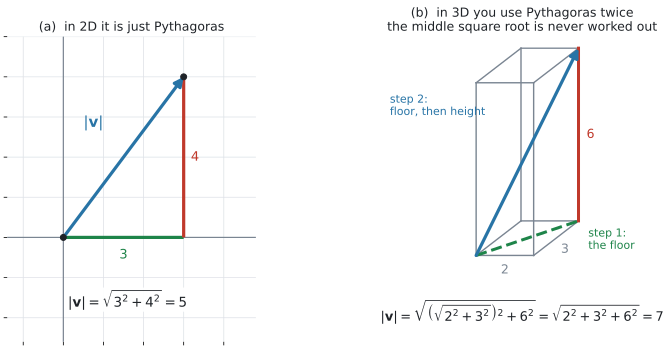
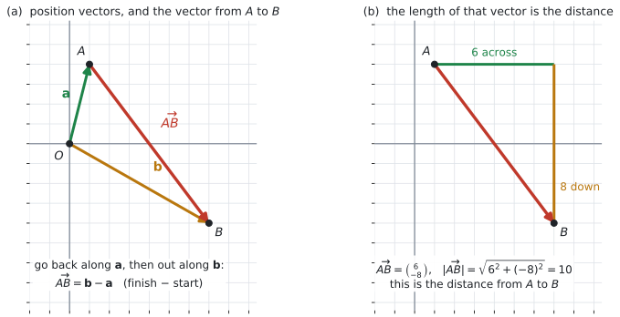
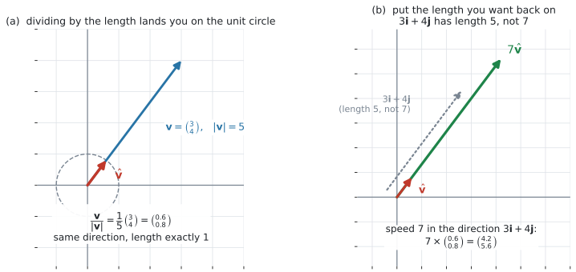

# AHL 3.10b — Magnitude, position and unit vectors（大きさ・位置ベクトル・単位ベクトル） {#sec-ahl-3-10b}

::: {.callout-note}
## What you should be able to do
- ベクトルの **magnitude**（大きさ）$\lvert \mathbf{v} \rvert$ を、成分から求められる。
- $3$ 次元でも、**成分が $1$ つ増えるだけ**で同じ計算ができる。
- **position vector**（位置ベクトル）$\overrightarrow{OA} = \mathbf{a}$ の意味が言える。
- $\overrightarrow{AB} = \mathbf{b}-\mathbf{a}$ を使って、$2$ 点を結ぶベクトルと**$2$ 点間の距離**を求められる。
- **unit vector**（単位ベクトル）$\dfrac{\mathbf{v}}{\lvert \mathbf{v} \rvert}$ を作れる（**normalize**、正規化）。
- 「**速さ $7$ で $3\mathbf{i}+4\mathbf{j}$ の向き**」のような指定から、速度ベクトルを作れる（**rescale**、長さの付け替え）。
- resultant の**大きさと向き**を求め、方位で答えられる。
- $\lvert k\mathbf{v} \rvert = \lvert k \rvert \lvert \mathbf{v} \rvert$ を使える。
:::

::: {.callout-important}
## 公式集の AHL 3.10 の欄
**$1$ 行だけです。** それが、このページの中心にある式です。

$$
\lvert \mathbf{v} \rvert = \sqrt{v_1^{\,2} + v_2^{\,2} + v_3^{\,2}}, \qquad \mathbf{v} = \begin{pmatrix} v_1 \\ v_2 \\ v_3 \end{pmatrix}
$$ {#eq-ahl310b-mag}

**@eq-ahl310b-mag は試験中に見られます。暗記は問われません。** ただ、$2$ 次元のときにどう書くのか（[第1節](#magnitude)）、なぜこの形なのか（[第1節](#magnitude)）は、自分で言えるようにしておいてください。

**単位ベクトルの式 $\dfrac{\mathbf{v}}{\lvert \mathbf{v} \rvert}$ は、公式集にありません。** シラバスの Guidance には書かれていますが、公式集の欄には出てきません。
:::

## The idea

### 1. 大きさは、三平方の定理です {#magnitude}

ベクトルの **magnitude**（大きさ）は、**矢印の長さ**です。$\lvert \mathbf{v} \rvert$ と書きます。

{#fig-ahl310b-magnitude width=100%}

@fig-ahl310b-magnitude の (a) を見てください。$\mathbf{v} = \begin{pmatrix} 3 \\ 4 \end{pmatrix}$ の矢印は、**横に $3$、たてに $4$ の直角三角形の斜辺**です。ですから

$$
\lvert \mathbf{v} \rvert = \sqrt{v_1^{\,2} + v_2^{\,2}}
$$ {#eq-ahl310b-mag2}

$$
\lvert \mathbf{v} \rvert = \sqrt{3^2+4^2} = \sqrt{25} = 5
$$

**大きさを出すときは、成分の符号を気にしなくてかまいません。** $2$ 乗すると消えるからです。$\begin{pmatrix} -3 \\ 4 \end{pmatrix}$ でも $\begin{pmatrix} 3 \\ -4 \end{pmatrix}$ でも、長さは $5$ です。

::: {.callout-important}
## $\lvert \mathbf{v} \rvert$ は **scalar** です
$\lvert \mathbf{v} \rvert$ は**数**です。ベクトルではありません。太字にも下線にもしません。

$\lvert \mathbf{v} \rvert \geq 0$ です。**長さが負になることはありません。**

$\lvert \mathbf{v} \rvert = 0$ になるのは $\mathbf{v} = \mathbf{0}$ のときだけです（[AHL 3.10a 第8節](ahl-3-10a.qmd#zero)）。
:::

**$3$ 次元でも、成分が $1$ つ増えるだけです。** @fig-ahl310b-magnitude の (b) は $\mathbf{v} = \begin{pmatrix} 2 \\ 3 \\ 6 \end{pmatrix}$ を直方体の対角線として描いたものです。**床の対角線で三平方の定理を $1$ 度、それと高さでもう $1$ 度**使うと、$\sqrt{\ }$ が $2$ 乗で消えて、$3$ つの $2$ 乗がそのまま足し合わさります。

$$
\lvert \mathbf{v} \rvert = \sqrt{2^2+3^2+6^2} = \sqrt{49} = 7
$$

**途中の $\sqrt{13}$ は、計算しません。** $2$ 次元の @eq-ahl310b-mag2 は、公式集の @eq-ahl310b-mag に $v_3 = 0$ を入れた場合だと思ってかまいません。

### 2. position vector — 点をベクトルで表す {#position}

**原点 $O$ から点 $A$ へ向かうベクトル**を、点 $A$ の **position vector**（位置ベクトル）といい、$\mathbf{a}$ と書きます。

$$
A(1,\ 4) \quad \Longrightarrow \quad \mathbf{a} = \overrightarrow{OA} = \begin{pmatrix} 1 \\ 4 \end{pmatrix}
$$ {#eq-ahl310b-pos}

**点の座標と、その点の position vector の成分は、同じ数**です。

::: {.callout-tip}
## それでも「点」と「ベクトル」は別のものです
[AHL 3.10a 第4節](ahl-3-10a.qmd#equal) で、ベクトルは**どこに置いてもよい**と書きました。position vector は、そのうち**根元を原点に固定したもの**です。

- **点 $A$** … 場所そのもの。動かせません
- **position vector $\mathbf{a}$** … 「原点から $A$ までの動き方」。$O$ を出発点と決めているので、点と $1$ 対 $1$ で対応します

**position vector を使うと、点の話をベクトルの計算に持ち込めます。** これが便利なところで、[AHL 3.11](ahl-3-11.qmd)（直線）も [AHL 3.12a](ahl-3-12a.qmd)（運動）も、ここに乗っています。
:::

### 3. $\overrightarrow{AB} = \mathbf{b}-\mathbf{a}$ — ゴールひくスタート {#ab}

{#fig-ahl310b-position width=100%}

@fig-ahl310b-position の (a) で、$A$ から $B$ へ行くには、**いったん $O$ まで戻ってから $B$ へ出る**と考えます。

$$
\overrightarrow{AB} = \overrightarrow{AO} + \overrightarrow{OB} = -\mathbf{a} + \mathbf{b}
$$

つまり

$$
\overrightarrow{AB} = \mathbf{b} - \mathbf{a}
$$ {#eq-ahl310b-ab}

**「ゴール $-$ スタート」**です。$A(1,4)$、$B(7,-4)$ なら

$$
\overrightarrow{AB} = \begin{pmatrix} 7 \\ -4 \end{pmatrix} - \begin{pmatrix} 1 \\ 4 \end{pmatrix} = \begin{pmatrix} 6 \\ -8 \end{pmatrix}
$$

::: {.callout-warning}
## $\mathbf{a}-\mathbf{b}$ ではありません
@eq-ahl310b-ab の順序は、[AHL 3.10a 第6節](ahl-3-10a.qmd#subtract) の「$\mathbf{a}-\mathbf{b}$ は $\mathbf{b}$ の先から $\mathbf{a}$ の先へ」と、そのまま同じ話です。

**引かれるほうが行き先**です。$\overrightarrow{AB}$ の**うしろの文字 $B$ が行き先**なので、$\mathbf{b}$ が前に来ます。

$$
\overrightarrow{BA} = \mathbf{a} - \mathbf{b} = -\overrightarrow{AB}
$$

**逆にすると、向きが正反対になります。** 長さは同じです（[第4節](#distance)）。
:::

### 4. $2$ 点間の距離は $\lvert \overrightarrow{AB} \rvert$ です {#distance}

@fig-ahl310b-position の (b) を見てください。$\overrightarrow{AB}$ の**長さ**が、そのまま **$A$ と $B$ の距離**です。

$$
AB = \lvert \overrightarrow{AB} \rvert = \lvert \mathbf{b} - \mathbf{a} \rvert
$$ {#eq-ahl310b-dist}

$A(1,4)$、$B(7,-4)$ なら

$$
\lvert \overrightarrow{AB} \rvert = \sqrt{6^2+(-8)^2} = \sqrt{100} = 10
$$

**これは、座標で習った距離の公式と同じもの**です。$\sqrt{(x_2-x_1)^2+(y_2-y_1)^2}$ の中身を、ベクトルの言葉で書き直しただけです。

**距離には向きがありません。** ですから

$$
\lvert \overrightarrow{AB} \rvert = \lvert \overrightarrow{BA} \rvert
$$

$\overrightarrow{AB}$ と $\overrightarrow{BA}$ は**向きが逆のベクトル**ですが、**長さは同じ**です。

| 英語 | 日本語 | 何のことか |
|:--|:--|:--|
| magnitude of $\mathbf{v}$ | $\mathbf{v}$ の大きさ | $\lvert \mathbf{v} \rvert$。**scalar** |
| length of $\mathbf{v}$ | $\mathbf{v}$ の長さ | magnitude と同じもの |
| distance from $A$ to $B$ | $A$ と $B$ の距離 | $\lvert \overrightarrow{AB} \rvert$。**scalar** |
| speed | 速さ | 速度ベクトルの大きさ。**scalar** |

: 大きさにまつわる言葉 {#tbl-ahl310b-words}

@tbl-ahl310b-words の右の列で、**scalar と vector を見分けてください。** 答えの形が変わります。

### 5. unit vector — 長さを $1$ にそろえる {#unit}

**長さが $1$ のベクトル**を **unit vector**（単位ベクトル）といいます。

$\mathbf{v} \neq \mathbf{0}$ のとき、$\mathbf{v}$ を自分の長さで割ると、単位ベクトルになります。

$$
\hat{\mathbf{v}} = \frac{\mathbf{v}}{\lvert \mathbf{v} \rvert}
$$ {#eq-ahl310b-unit}

これを **normalize**（正規化・単位化）するといいます。

{#fig-ahl310b-unit width=100%}

@fig-ahl310b-unit の (a) が、その様子です。$\mathbf{v} = \begin{pmatrix} 3 \\ 4 \end{pmatrix}$ は長さ $5$ なので

$$
\hat{\mathbf{v}} = \frac{1}{5}\begin{pmatrix} 3 \\ 4 \end{pmatrix} = \begin{pmatrix} 0.6 \\ 0.8 \end{pmatrix}
$$

**向きは変わりません。** $\dfrac{1}{5}$ は正の数なので、スカラー倍として向きを保ちます（[AHL 3.10a 第7節](ahl-3-10a.qmd#scalar-multiple)）。

**長さだけが $1$ になります。** たしかめると $\sqrt{0.6^2+0.8^2} = \sqrt{1} = 1$ です（電卓での作り方は[GDC 第3節](#gdc-unit)）。

::: {.callout-warning}
## $\mathbf{0}$ は normalize できません
$\lvert \mathbf{0} \rvert = 0$ なので、@eq-ahl310b-unit は $0$ で割ることになります。

**零ベクトルには向きがない**ので、これは当てはまらない、というだけのことです（[AHL 3.10a 第8節](ahl-3-10a.qmd#zero)）。$\mathbf{v} \neq \mathbf{0}$ が @eq-ahl310b-unit の条件です。
:::

### 6. 「速さ $7$ で、$3\mathbf{i}+4\mathbf{j}$ の向き」 {#direction}

シラバスが挙げている Example です。

> **Example:** Find the velocity of a particle with speed $7\,\text{ms}^{-1}$ in the direction $3\boldsymbol{i} + 4\boldsymbol{j}$.

**$3\mathbf{i}+4\mathbf{j}$ をそのまま答えにはできません。** このベクトルの長さは $5$ で、$7$ ではないからです。

**向きだけを取り出してから、ほしい長さを掛けます。**

$$
\mathbf{v} = (\text{速さ}) \times \frac{\text{向きのベクトル}}{\lvert \text{向きのベクトル} \rvert}
$$ {#eq-ahl310b-speed}

| ステップ | すること | この例では |
|:--|:--|:--|
| $1$ | 大きさを出す | $\lvert 3\mathbf{i}+4\mathbf{j} \rvert = 5$ |
| $2$ | 割って単位ベクトルにする | $\dfrac{1}{5}\begin{pmatrix} 3 \\ 4 \end{pmatrix} = \begin{pmatrix} 0.6 \\ 0.8 \end{pmatrix}$ |
| $3$ | ほしい長さを掛ける | $7\begin{pmatrix} 0.6 \\ 0.8 \end{pmatrix} = \begin{pmatrix} 4.2 \\ 5.6 \end{pmatrix}$ |

: 長さを付け替える $3$ 段 {#tbl-ahl310b-steps}

@fig-ahl310b-unit の (b) が、その $3$ つの手順です。答えは

$$
\mathbf{v} = 4.2\mathbf{i} + 5.6\mathbf{j}
$$

**検算。** 長さを出し直します。$\sqrt{4.2^2+5.6^2} = \sqrt{49} = 7$ ✓

**speed は scalar、velocity は vector** でした（[AHL 3.10a 第1節](ahl-3-10a.qmd#idea)）。この問題は、**scalar と向きから vector を組み立てる**問題です。

### 7. resultant の大きさと向き {#resultant}

[AHL 3.10a 第5節](ahl-3-10a.qmd#add) で、resultant は**全部足したもの**だと書きました。**そこで止めていた「大きさと向き」を、ここで出します。**

$$
\begin{pmatrix} 2.5 \\ 6 \end{pmatrix} \quad \Longrightarrow \quad \text{大きさ } \sqrt{2.5^2+6^2} = 6.5
$$

**向きは、角度で答えます。** 東西・南北の設定なら、**bearing**（方位）で聞かれることが多いです。

$$
\tan\theta = \frac{\text{東向きの成分}}{\text{北向きの成分}} = \frac{2.5}{6} \quad \Longrightarrow \quad \theta = 22.6^{\circ}
$$

北から東回りに $22.6^{\circ}$ なので、方位は $023^{\circ}$ です（@exm-ahl310b-boat）。

**この形がそのまま使えるのは、東向きの成分も北向きの成分も正のとき**です。どちらかが負のときは、$\tan^{-1}$ が返す値をそのまま方位にはできません。**図をかいて、$000^{\circ}$ から $360^{\circ}$ のどこに入るかを決めてください**（[AHL 3.12a](ahl-3-12a.qmd) では、負の成分がふつうに出てきます）。

::: {.callout-important}
## 向きを聞かれたら、角度の単位を確かめてください
AHL Topic 3 では、**試験では radian が既定**です（[AHL 3.7](ahl-3-7.qmd#which)）。

しかし**方位や「東から何度」は、度で答えます。** 問題文に `bearing` や $^{\circ}$ があれば、そちらに従ってください。

**電卓の角度設定も合わせます**（[GDC 第4節](#gdc-angle)）。設定が radian のままだと、$\tan^{-1}$ は radian で返ってきます。
:::

### 8. rescale — 長さを指定して作る {#rescale}

シラバスの行は `Rescaling and normalizing vectors.` でした。$2$ つは、@tbl-ahl310b-steps の**どこで止めるか**の違いです。

- **normalize** … 長さを $1$ にする。ステップ $2$ まで
- **rescale** … 長さを指定の値にする。ステップ $3$ まで

**$L > 0$ のとき**、長さ $L$ で $\mathbf{v}$ の向きのベクトルは

$$
L\,\frac{\mathbf{v}}{\lvert \mathbf{v} \rvert} \qquad (\mathbf{v} \neq \mathbf{0})
$$ {#eq-ahl310b-scale}

**$L$ が負なら、向きは反対になります。** そのときの長さは $\lvert L \rvert$ です。

これは、次の性質から出てきます。

$$
\lvert k\mathbf{v} \rvert = \lvert k \rvert \, \lvert \mathbf{v} \rvert
$$ {#eq-ahl310b-kv}

**$\lvert k \rvert$ です。** **$k$ ではありません。** $\sqrt{k^2} = \lvert k \rvert$ だからです。$k$ が負のとき、$k\lvert \mathbf{v} \rvert$ は負の数になってしまい、長さになりません。

**$3$ 次元でも、まったく同じ**です。成分が $1$ つ増えるだけで、割り算も掛け算も変わりません。

## Worked examples

::: {.callout-note appearance="simple"}
問題文は英語です。意味が理解できなかったら、問題文の下の「**日本語訳**」を開いてください。解説は日本語です。
:::

::: {#exm-ahl310b-mag}
[Find the magnitude of each vector. Give exact values where possible, otherwise give your answer to $3$ significant figures.]{.q-en}

**(a)** [$\mathbf{v} = \begin{pmatrix} 5 \\ -12 \end{pmatrix}$]{.q-en}

**(b)** [$\mathbf{w} = \begin{pmatrix} 2 \\ -3 \\ 6 \end{pmatrix}$]{.q-en}

**(c)** [$\mathbf{u} = 3\mathbf{i} - 5\mathbf{j}$]{.q-en}

日本語訳

それぞれのベクトルの大きさを求めなさい。正確な値が出せるときはその値を、出せないときは有効数字 $3$ 桁で答えなさい。

**(a)** $\mathbf{v} = \begin{pmatrix} 5 \\ -12 \end{pmatrix}$

**(b)** $\mathbf{w} = \begin{pmatrix} 2 \\ -3 \\ 6 \end{pmatrix}$

**(c)** $\mathbf{u} = 3\mathbf{i} - 5\mathbf{j}$

---

**(a)** @eq-ahl310b-mag2 に入れます。**$-12$ は $2$ 乗すると $+144$** です。

$$
\lvert \mathbf{v} \rvert = \sqrt{5^2+(-12)^2} = \sqrt{25+144} = \sqrt{169} = 13
$$

**(b)** 成分が $1$ つ増えるだけです（@eq-ahl310b-mag）。

$$
\lvert \mathbf{w} \rvert = \sqrt{2^2+(-3)^2+6^2} = \sqrt{4+9+36} = \sqrt{49} = 7
$$

**(c)** $\mathbf{i}$、$\mathbf{j}$ の形でも、成分を取り出せば同じです（[AHL 3.10a 第3節](ahl-3-10a.qmd#components)）。

$$
\lvert \mathbf{u} \rvert = \sqrt{3^2+(-5)^2} = \sqrt{34} \approx 5.83
$$

$\sqrt{34}$ は整数になりません。**正確な値は $\sqrt{34}$ のまま**、$3$ 桁でと言われたら $5.83$ です。

**検算。** 大きさは、必ず**いちばん大きい成分の絶対値以上**、**成分の絶対値の合計以下**です。**$0$ でない成分が $2$ つ以上あるときは、どちらも「等しい」にはなりません。** つまり、成分をそのまま足した値は、必ず**大きすぎます**。

- (a) $12 < 13 < 5+12 = 17$ ✓
- (b) $6 < 7 < 2+3+6 = 11$ ✓
- (c) $5 < 5.83 < 3+5 = 8$ ✓

**この幅から外れたら、どこかで間違えています。** 演習 $10$ のように $(-5)^2$ を $-25$ としてしまうと $\sqrt{-25+144} = \sqrt{119} \approx 10.9$ となり、いちばん大きい成分 $12$ より小さくなって、この幅から外れます。

::: {.callout-note}
## 解答例（答案用紙にはこう書く）
**(a)**
$$\lvert \mathbf{v} \rvert = \sqrt{5^2+(-12)^2} = 13$$

**(b)**
$$\lvert \mathbf{w} \rvert = \sqrt{2^2+(-3)^2+6^2} = 7$$

**(c)**
$$\lvert \mathbf{u} \rvert = \sqrt{3^2+(-5)^2} = \sqrt{34} \approx 5.83$$
:::
:::

::: {#exm-ahl310b-ab}
[The points $A$ and $B$ have coordinates $A(1,\ 4)$ and $B(7,\ -4)$.]{.q-en}

**(a)** [Write down the position vectors $\mathbf{a}$ and $\mathbf{b}$.]{.q-en}

**(b)** [Find $\overrightarrow{AB}$.]{.q-en}

**(c)** [Find $\lvert \overrightarrow{AB} \rvert$.]{.q-en}

**(d)** [Interpret $\lvert \overrightarrow{AB} \rvert$ in the context of the two points.]{.q-en}

日本語訳

点 $A$、$B$ の座標は $A(1,\ 4)$、$B(7,\ -4)$ です。

**(a)** 位置ベクトル $\mathbf{a}$、$\mathbf{b}$ を書きなさい。

**(b)** $\overrightarrow{AB}$ を求めなさい。

**(c)** $\lvert \overrightarrow{AB} \rvert$ を求めなさい。

**(d)** $\lvert \overrightarrow{AB} \rvert$ が、この $2$ 点についてどういう意味を持つかを述べなさい。

---

**(a)** 座標をそのまま縦に並べます（@eq-ahl310b-pos）。

$$
\mathbf{a} = \begin{pmatrix} 1 \\ 4 \end{pmatrix}, \qquad \mathbf{b} = \begin{pmatrix} 7 \\ -4 \end{pmatrix}
$$

**(b)** ゴールひくスタートです（@eq-ahl310b-ab）。**$4$ を引くので、$2$ つ目は $-8$** です。

$$
\overrightarrow{AB} = \mathbf{b}-\mathbf{a} = \begin{pmatrix} 7-1 \\ -4-4 \end{pmatrix} = \begin{pmatrix} 6 \\ -8 \end{pmatrix}
$$

**(c)** (b) の長さが、そのまま $2$ 点の距離です（@eq-ahl310b-dist）。

$$
\lvert \overrightarrow{AB} \rvert = \sqrt{6^2+(-8)^2} = \sqrt{100} = 10
$$

**(d)** `Interpret` なので、**この $2$ 点の言葉**で書きます。

::: {.model-answer}
**試験ではこう書く**

*$\lvert \overrightarrow{AB} \rvert = 10$ is the straight-line distance between the points $A$ and $B$. It is a scalar, so it carries no direction: the distance from $B$ to $A$ is also $10$.*
:::

（$\lvert \overrightarrow{AB} \rvert = 10$ は、$2$ 点 $A$、$B$ を直線で結んだときの距離である。scalar なので向きを持たず、$B$ から $A$ までの距離も $10$ である、という意味です。）

**検算。** (b) を、足し算に戻します。$\overrightarrow{OA} + \overrightarrow{AB} = \overrightarrow{OB}$ になるはずです。

$$
\begin{pmatrix} 1 \\ 4 \end{pmatrix} + \begin{pmatrix} 6 \\ -8 \end{pmatrix} = \begin{pmatrix} 7 \\ -4 \end{pmatrix} = \mathbf{b} \ ✓
$$

**$\mathbf{a}-\mathbf{b}$ と取りちがえて $\begin{pmatrix} -6 \\ 8 \end{pmatrix}$ としていたら、$\begin{pmatrix} -5 \\ 12 \end{pmatrix}$ になり、$\mathbf{b}$ に戻りません。**

**検算（(c) について）。** $8 < 10 < 6+8 = 14$ ✓ 幅の中に入っています。

::: {.callout-note}
## 解答例（答案用紙にはこう書く）
**(a)**
$$\mathbf{a} = \begin{pmatrix} 1 \\ 4 \end{pmatrix}, \qquad \mathbf{b} = \begin{pmatrix} 7 \\ -4 \end{pmatrix}$$

**(b)**
$$\overrightarrow{AB} = \mathbf{b}-\mathbf{a} = \begin{pmatrix} 6 \\ -8 \end{pmatrix}$$

**(c)**
$$\lvert \overrightarrow{AB} \rvert = \sqrt{6^2+(-8)^2} = 10$$

**(d)**
*It is the straight-line distance between $A$ and $B$, which is $10$ units.*
:::
:::

::: {#exm-ahl310b-unit}
[Let $\mathbf{v} = 3\mathbf{i} + 4\mathbf{j}$.]{.q-en}

**(a)** [Find $\lvert \mathbf{v} \rvert$.]{.q-en}

**(b)** [Find the unit vector in the direction of $\mathbf{v}$.]{.q-en}

**(c)** [Find the velocity of a particle with speed $7\ \text{ms}^{-1}$ in the direction $3\mathbf{i} + 4\mathbf{j}$.]{.q-en}

**(d)** [Explain why the answer to part (c) is not $21\mathbf{i} + 28\mathbf{j}$.]{.q-en}

日本語訳

$\mathbf{v} = 3\mathbf{i} + 4\mathbf{j}$ とします。

**(a)** $\lvert \mathbf{v} \rvert$ を求めなさい。

**(b)** $\mathbf{v}$ の向きの単位ベクトルを求めなさい。

**(c)** 速さ $7\ \text{ms}^{-1}$ で、$3\mathbf{i}+4\mathbf{j}$ の向きに進む粒子の velocity（速度）を求めなさい。

**(d)** (c) の答えが $21\mathbf{i}+28\mathbf{j}$ ではない理由を説明しなさい。

---

**(a)**

$$
\lvert \mathbf{v} \rvert = \sqrt{3^2+4^2} = 5
$$

**(b)** 長さで割ります（@eq-ahl310b-unit）。

$$
\hat{\mathbf{v}} = \frac{1}{5}\begin{pmatrix} 3 \\ 4 \end{pmatrix} = \begin{pmatrix} 0.6 \\ 0.8 \end{pmatrix} = 0.6\mathbf{i} + 0.8\mathbf{j}
$$

**(c)** @eq-ahl310b-speed のとおり、@tbl-ahl310b-steps の $3$ 段目で速さを掛けます。

$$
7\hat{\mathbf{v}} = 7\begin{pmatrix} 0.6 \\ 0.8 \end{pmatrix} = \begin{pmatrix} 4.2 \\ 5.6 \end{pmatrix} = 4.2\mathbf{i} + 5.6\mathbf{j}
$$

**(d)** `Explain why` なので、英語で理由を書きます。$21\mathbf{i}+28\mathbf{j}$ は $7(3\mathbf{i}+4\mathbf{j})$、つまり**単位ベクトルにする前に $7$ を掛けたもの**です。

::: {.model-answer}
**試験ではこう書く**

*Multiplying $3\mathbf{i}+4\mathbf{j}$ by $7$ gives $21\mathbf{i}+28\mathbf{j}$, whose magnitude is $7 \times 5 = 35$, not $7$. The direction vector $3\mathbf{i}+4\mathbf{j}$ has magnitude $5$, so it must first be divided by $5$ to give a unit vector, and only then multiplied by the speed $7$.*
:::

（$3\mathbf{i}+4\mathbf{j}$ に $7$ を掛けると $21\mathbf{i}+28\mathbf{j}$ になるが、その大きさは $7 \times 5 = 35$ であって $7$ ではない。向きのベクトル $3\mathbf{i}+4\mathbf{j}$ は大きさが $5$ なので、まず $5$ で割って単位ベクトルにし、そのあとで速さ $7$ を掛ける必要がある、という意味です。）

**検算。** (b) の長さを出し直します。$\sqrt{0.6^2+0.8^2} = \sqrt{0.36+0.64} = \sqrt{1} = 1$ ✓

**$1$ 成分だけ割って $\begin{pmatrix} 0.6 \\ 4 \end{pmatrix}$ としていたら、$\sqrt{0.36+16} \approx 4.04$ になり、$1$ になりません。**

**検算（(c) について）。** $\sqrt{4.2^2+5.6^2} = \sqrt{17.64+31.36} = \sqrt{49} = 7$ ✓ **速さが $7$ に戻りました。**

::: {.callout-note}
## 解答例（答案用紙にはこう書く）
**(a)**
$$\lvert \mathbf{v} \rvert = \sqrt{3^2+4^2} = 5$$

**(b)**
$$\hat{\mathbf{v}} = \frac{1}{5}(3\mathbf{i}+4\mathbf{j}) = 0.6\mathbf{i}+0.8\mathbf{j}$$

**(c)**
$$7\hat{\mathbf{v}} = 4.2\mathbf{i}+5.6\mathbf{j}$$

**(d)**
*$3\mathbf{i}+4\mathbf{j}$ has magnitude $5$, so $7(3\mathbf{i}+4\mathbf{j})$ has magnitude $35$. The direction vector must be normalized first.*
:::
:::

::: {#exm-ahl310b-boat}
[A boat's engine drives it due north at $6\ \text{km h}^{-1}$. A current carries it due east at $2.5\ \text{km h}^{-1}$. Take east and north as the positive directions.]{.q-en}

**(a)** [Write the resultant velocity of the boat as a column vector.]{.q-en}

**(b)** [Find the actual speed of the boat.]{.q-en}

**(c)** [Find the bearing on which the boat actually travels, to the nearest degree.]{.q-en}

**(d)** [Interpret your answers to parts (b) and (c) in the context of the boat.]{.q-en}

日本語訳

ある船は、エンジンによって真北へ $6\ \text{km h}^{-1}$ で進みます。潮流は、この船を真東へ $2.5\ \text{km h}^{-1}$ で運びます。東と北を正の向きとします。

**(a)** この船の resultant velocity（合成速度）を列ベクトルで書きなさい。

**(b)** この船の実際の速さを求めなさい。

**(c)** この船が実際に進む方位を、$1$ 度の単位で求めなさい。

**(d)** (b) と (c) の答えを、この船の文脈で解釈しなさい。

---

**(a)** resultant は足したものです（[AHL 3.10a 第5節](ahl-3-10a.qmd#add)）。東が $1$ つ目、北が $2$ つ目です。

$$
\begin{pmatrix} 0 \\ 6 \end{pmatrix} + \begin{pmatrix} 2.5 \\ 0 \end{pmatrix} = \begin{pmatrix} 2.5 \\ 6 \end{pmatrix}
$$

**(b)** 速さは、速度ベクトルの**大きさ**です（@tbl-ahl310b-words）。

$$
\sqrt{2.5^2+6^2} = \sqrt{6.25+36} = \sqrt{42.25} = 6.5\ \text{km h}^{-1}
$$

**(c)** 方位は、**北から東回りに測った角**です。

$$
\tan\theta = \frac{2.5}{6} \quad \Longrightarrow \quad \theta = \tan^{-1}\!\left(\frac{2.5}{6}\right) = 22.6^{\circ}
$$

$1$ 度の単位にして、方位は $\mathbf{023^{\circ}}$ です。**方位は $3$ 桁で書きます。**

**(d)** `Interpret` なので、**船の言葉**で書きます。

::: {.model-answer}
**試験ではこう書く**

*The boat moves at $6.5\ \text{km h}^{-1}$, which is faster than the $6\ \text{km h}^{-1}$ its engine produces, because the current adds an eastward push. It does not travel due north as the engine points, but on a bearing of $023^{\circ}$, that is, slightly east of north. The current pushes it off course.*
:::

（この船は $6.5\ \text{km h}^{-1}$ で進む。これは、エンジンだけによる $6\ \text{km h}^{-1}$ より速い。潮流が東向きの押しを加えているからである。船は、エンジンの向いている真北ではなく、方位 $023^{\circ}$、つまり北よりわずかに東へ進む。潮流によって進路がずれている、という意味です。）

**検算（(b) について）。** $6 < 6.5 < 2.5+6 = 8.5$ ✓ 幅の中です。**$\sqrt{\ }$ を忘れて $2.5+6 = 8.5$ としていたら、上限ちょうどになります。$0$ でない成分が $2$ つあるので、それは起こりません。**

**検算（(c) について）。** 東も北も正なので、**方位は $000^{\circ}$ と $090^{\circ}$ の間**にあるはずです。さらに、北向きの成分 $6$ のほうが東向きの $2.5$ より大きいので、**北寄り、つまり $045^{\circ}$ より小さい**はずです。$023^{\circ}$ はどちらも満たします ✓

**$\tan\theta$ の分母と分子を逆にすると $67.4^{\circ}$ になり、$045^{\circ}$ より大きくなって、この検算に引っかかります。**

::: {.callout-note}
## 解答例（答案用紙にはこう書く）
**(a)**
$$\begin{pmatrix} 2.5 \\ 6 \end{pmatrix}$$

**(b)**
$$\sqrt{2.5^2+6^2} = 6.5\ \text{km h}^{-1}$$

**(c)**
$$\theta = \tan^{-1}\!\left(\frac{2.5}{6}\right) = 22.6^{\circ}, \qquad \text{bearing } 023^{\circ}$$

**(d)**
*The current makes the boat faster than $6\ \text{km h}^{-1}$ and pushes it east of due north, onto a bearing of $023^{\circ}$.*
:::
:::

## Common errors

::: {.callout-warning}
## $\sqrt{\ }$ を忘れる、成分をそのまま足す
$\left\lvert \begin{pmatrix} 3 \\ 4 \end{pmatrix} \right\rvert$ を $3+4 = 7$ や $3^2+4^2 = 25$ としてしまう誤りです。

**$\sqrt{\ }$ まで込みで @eq-ahl310b-mag2 です。** 正しくは $5$ です。

**検算の幅**（@exm-ahl310b-mag）を使うと、気づけます。$25$ は幅の外です。$7$ は上限ちょうどですが、**上限に等しくなるのは、$0$ でない成分が $1$ つ以下のときだけ**なので、これも合いません。
:::

::: {.callout-warning}
## $\overrightarrow{AB}$ を $\mathbf{a}-\mathbf{b}$ にする
**行き先が先**です（@eq-ahl310b-ab）。$\overrightarrow{AB} = \mathbf{b}-\mathbf{a}$ です。

逆にすると $\overrightarrow{BA}$ になり、**向きが正反対**になります。

**距離を聞かれているだけなら、逆でも答えは同じ**です（[第4節](#distance)）。しかし**ベクトルを聞かれていたら、符号がすべて逆になって不正解**です。
:::

::: {.callout-warning}
## 単位ベクトルで、$1$ 成分だけ割る
$\begin{pmatrix} 3 \\ 4 \end{pmatrix}$ を $\begin{pmatrix} 0.6 \\ 4 \end{pmatrix}$ としてしまう誤りです。

**$\dfrac{1}{\lvert \mathbf{v} \rvert}$ は、スカラー倍**です。**全部の成分に掛かります**（[AHL 3.10a 第7節](ahl-3-10a.qmd#scalar-multiple)）。

**出したら長さを出し直してください。** $1$ にならなければ間違いです（@exm-ahl310b-unit）。
:::

::: {.callout-warning}
## 向きのベクトルを、そのまま答えにする
`speed 7 in the direction 3i + 4j` で、$7(3\mathbf{i}+4\mathbf{j})$ や $3\mathbf{i}+4\mathbf{j}$ を答えにしてしまう誤りです。

**$3\mathbf{i}+4\mathbf{j}$ の長さは $5$** です。$1$ でも $7$ でもありません。

**`in the direction` は「向きだけを使え」という指示**です。長さは、こちらで付け替えます（@tbl-ahl310b-steps）。
:::

::: {.callout-warning}
## $\lvert k\mathbf{v} \rvert$ の絶対値を落とす
$\lvert k\mathbf{v} \rvert = k\lvert \mathbf{v} \rvert$ と書いてしまう誤りです。

$k = -3$、$\lvert \mathbf{v} \rvert = 5$ なら、これは $-15$ になります。**長さが負になっている**ので、そこで気づけます。

正しくは @eq-ahl310b-kv で、$\lvert -3 \rvert \times 5 = 15$ です。
:::

## Using your GDC (TI-Nspire CX II)

### 1. 大きさは、そのまま $\sqrt{\ }$ で出せます {#gdc-mag}

いちばん確実なのは、**式をそのまま打つ**ことです。

- $\sqrt{5^{2} + \left(-12\right)^{2}}$
- $\sqrt{2^{2} + \left(-3\right)^{2} + 6^{2}}$

$13$ と $7$ が返ります（@exm-ahl310b-mag）。$\sqrt{\ }$ のテンプレートは **`ctrl` を押してから `x²`** です。

**負の数は、かっこで囲んでください。** `-12^2` と打つと $-(12^2) = -144$ になってしまいます。

### 2. 点を入れておくと、$\overrightarrow{AB}$ が楽です {#gdc-store}

$2$ 点の position vector を変数に入れます。

- $\begin{bmatrix} 1 \\ 4 \end{bmatrix}  \ \to \  va$
- $\begin{bmatrix} 7 \\ -4 \end{bmatrix}  \ \to \  vb$

矢印 `→` は、**`ctrl` を押してから `var`** です。`sto` というキーはありません（[AHL 3.10a の GDC 第2節](ahl-3-10a.qmd#gdc-store) と同じです）。

そのあとは

- $\texttt{vb} - \texttt{va}$
- $\sqrt{6^{2} + \left(-8\right)^{2}}$

で、$\begin{pmatrix} 6 \\ -8 \end{pmatrix}$ と $10$ が返ります（@exm-ahl310b-ab）。

**$1$ つの問題が終わったら、変数を消しておいてください**（`menu → Actions → Clear a-z`）。

### 3. 単位ベクトルは、割り算で作ります {#gdc-unit}

$\lvert \mathbf{v} \rvert$ を先に出してから、スカラー倍します。

- $\dfrac{1}{5} \times \begin{bmatrix}3\\4\end{bmatrix}$
- $7 \times \left(\dfrac{1}{5} \times \begin{bmatrix}3\\4\end{bmatrix}\right)$

$\begin{pmatrix} 0.6 \\ 0.8 \end{pmatrix}$ と $\begin{pmatrix} 4.2 \\ 5.6 \end{pmatrix}$ が返ります（@exm-ahl310b-unit）。

**長さが割り切れないときは、$\lvert \mathbf{v} \rvert$ を数で置かずに式のまま入れてください。**

$\dfrac{1}{\sqrt{34}} \times \begin{bmatrix}3\\-5\end{bmatrix}$

**途中で四捨五入すると、長さが $1$ からずれます。**

### 4. 向きの角度は、角度設定を確かめてから {#gdc-angle}

$\tan^{-1}\left(\dfrac{2.5}{6}\right)$

**返ってくる値の単位は、Document Settings の角度設定のとおり**です（`doc → Settings → Document Settings`）。

- 設定が **Degree** なら $22.6^{\circ}$
- 設定が **Radian** なら $0.3948$

**AHL Topic 3 の既定は radian** ですが、**方位は度で答えます**（[第7節](#resultant)）。$\tan^{-1}$ を使う前に、設定を見てください。

設定が **Radian** のままでよいときは、$\dfrac{180}{\pi}$ を掛けます。**Degree 設定のままこれをやると、$22.6$ にさらに $\dfrac{180}{\pi}$ が掛かって $1296$ になります。**

$\tan^{-1}\left(\dfrac{2.5}{6}\right) \times \dfrac{180}{\pi}$

$22.6$ が返ります（@exm-ahl310b-boat）。

### 5. 検算のしかた {#gdc-check}

- **大きさの幅を見る。** いちばん大きい成分の絶対値より大きく、絶対値の合計より小さい（$0$ でない成分が $2$ つ以上のとき。@exm-ahl310b-mag）
- **単位ベクトルは、長さを出し直す。** $1$ にならなければ間違い
- **$\overrightarrow{AB}$ は、足し算に戻す。** $\mathbf{a}+\overrightarrow{AB}$ が $\mathbf{b}$ になるか見る
- **rescale したら、長さを出し直す。** 指定された値に戻るか見る（@exm-ahl310b-unit）
- **方位は、符号から範囲を絞る。** 東も北も正なら $000^{\circ}$ 〜 $090^{\circ}$ の間（@exm-ahl310b-boat）

$1$ つ目は**電卓なしでもできる**ので、まずこれを習慣にしてください。

## Exercises

::: {.callout-note appearance="simple"}
各問題に、折りたたみが $3$ つ付いています。**日本語訳**、**解答例**（答案用紙に書くべきこと。英語です）、**解説**（なぜそうなるか。日本語です）。

まず自分で解いて、次に解答例と見くらべてください。**解説は、合わなかったときだけ開けば十分です。**
:::

::: {.exercise-block}

[1]{.ex-no} [Find the magnitude of $\begin{pmatrix} 8 \\ -15 \end{pmatrix}$ and of $\begin{pmatrix} 7 \\ -4 \end{pmatrix}$, giving the second answer to $3$ significant figures.]{.q-en}

日本語訳

$\begin{pmatrix} 8 \\ -15 \end{pmatrix}$ と $\begin{pmatrix} 7 \\ -4 \end{pmatrix}$ の大きさを求めなさい。$2$ つ目は有効数字 $3$ 桁で答えなさい。

::: {.callout-note collapse="true"}
## 解答例（答案用紙に書くこと）

$$\sqrt{8^2+(-15)^2} = \sqrt{289} = 17, \qquad \sqrt{7^2+(-4)^2} = \sqrt{65} \approx 8.06$$
:::

::: {.callout-tip collapse="true"}
## 解説

@eq-ahl310b-mag2 に入れるだけです。**$-15$ を $2$ 乗すると $+225$** です（[第1節](#magnitude)）。

$\sqrt{65}$ は整数になりません。**$3$ 桁の指示があるので $8.06$** です。

**検算。** 幅を見ます。$15 < 17 < 8+15 = 23$ ✓、$7 < 8.06 < 7+4 = 11$ ✓
:::

::: {.ex-sep}
:::

[2]{.ex-no} [Find the magnitude of $\begin{pmatrix} 1 \\ -2 \\ 2 \end{pmatrix}$ and of $\begin{pmatrix} 4 \\ 4 \\ -7 \end{pmatrix}$.]{.q-en}

日本語訳

$\begin{pmatrix} 1 \\ -2 \\ 2 \end{pmatrix}$ と $\begin{pmatrix} 4 \\ 4 \\ -7 \end{pmatrix}$ の大きさを求めなさい。

::: {.callout-note collapse="true"}
## 解答例（答案用紙に書くこと）

$$\sqrt{1^2+(-2)^2+2^2} = \sqrt{9} = 3, \qquad \sqrt{4^2+4^2+(-7)^2} = \sqrt{81} = 9$$
:::

::: {.callout-tip collapse="true"}
## 解説

$3$ 次元でも、成分が $1$ つ増えるだけです（@eq-ahl310b-mag、[第1節](#magnitude)）。

$1+4+4 = 9$、$16+16+49 = 81$ で、どちらもきれいな平方数になります。

**検算。** 幅を見ます。$2 < 3 < 1+2+2 = 5$ ✓、$7 < 9 < 4+4+7 = 15$ ✓
:::

::: {.ex-sep}
:::

[3]{.ex-no} [The points $A$ and $B$ have coordinates $A(2,\ -1)$ and $B(6,\ 2)$. Find $\overrightarrow{AB}$ and $\lvert \overrightarrow{AB} \rvert$.]{.q-en}

日本語訳

点 $A$、$B$ の座標は $A(2,\ -1)$、$B(6,\ 2)$ です。$\overrightarrow{AB}$ と $\lvert \overrightarrow{AB} \rvert$ を求めなさい。

::: {.callout-note collapse="true"}
## 解答例（答案用紙に書くこと）

$$\overrightarrow{AB} = \begin{pmatrix} 6 \\ 2 \end{pmatrix} - \begin{pmatrix} 2 \\ -1 \end{pmatrix} = \begin{pmatrix} 4 \\ 3 \end{pmatrix}, \qquad \lvert \overrightarrow{AB} \rvert = \sqrt{4^2+3^2} = 5$$
:::

::: {.callout-tip collapse="true"}
## 解説

ゴールひくスタートです（@eq-ahl310b-ab）。**$2$ つ目は $2-(-1) = 3$** で、ここが引っかかりどころです。

**検算。** $\mathbf{a}+\overrightarrow{AB}$ が $\mathbf{b}$ に戻るはずです。$\begin{pmatrix} 2 \\ -1 \end{pmatrix}+\begin{pmatrix} 4 \\ 3 \end{pmatrix} = \begin{pmatrix} 6 \\ 2 \end{pmatrix}$ ✓ **$2-(-1)$ を $1$ としていたら、$2$ つ目が $0$ になって $\mathbf{b}$ に戻りません。**
:::

::: {.ex-sep}
:::

[4]{.ex-no} [Find the unit vector in the direction of $\begin{pmatrix} -6 \\ 8 \end{pmatrix}$.]{.q-en}

日本語訳

$\begin{pmatrix} -6 \\ 8 \end{pmatrix}$ の向きの単位ベクトルを求めなさい。

::: {.callout-note collapse="true"}
## 解答例（答案用紙に書くこと）

$$\left\lvert \begin{pmatrix} -6 \\ 8 \end{pmatrix} \right\rvert = \sqrt{(-6)^2+8^2} = 10, \qquad \frac{1}{10}\begin{pmatrix} -6 \\ 8 \end{pmatrix} = \begin{pmatrix} -0.6 \\ 0.8 \end{pmatrix}$$
:::

::: {.callout-tip collapse="true"}
## 解説

まず長さ、次に割る、の $2$ つの手順です（@eq-ahl310b-unit）。**符号は、そのまま残ります。** $\dfrac{1}{10}$ は正なので、向きは変わりません。

**検算。** 長さを出し直します。$\sqrt{(-0.6)^2+0.8^2} = \sqrt{0.36+0.64} = 1$ ✓ **$1$ 成分だけ割って $\begin{pmatrix} -0.6 \\ 8 \end{pmatrix}$ としていたら、$\sqrt{64.36} \approx 8.02$ になり、$1$ になりません。**
:::

::: {.ex-sep}
:::

[5]{.ex-no} [Find the velocity of a particle with speed $20\ \text{ms}^{-1}$ in the direction $-3\mathbf{i} + 4\mathbf{j}$.]{.q-en}

日本語訳

速さ $20\ \text{ms}^{-1}$ で、$-3\mathbf{i}+4\mathbf{j}$ の向きに進む粒子の velocity（速度）を求めなさい。

::: {.callout-note collapse="true"}
## 解答例（答案用紙に書くこと）

$$\lvert -3\mathbf{i}+4\mathbf{j} \rvert = 5, \qquad 20 \times \frac{1}{5}(-3\mathbf{i}+4\mathbf{j}) = -12\mathbf{i} + 16\mathbf{j}$$
:::

::: {.callout-tip collapse="true"}
## 解説

@tbl-ahl310b-steps の $3$ つの手順です。$\lvert -3\mathbf{i}+4\mathbf{j} \rvert = 5$、単位ベクトルは $-0.6\mathbf{i}+0.8\mathbf{j}$、それに $20$ を掛けます。

**$20(-3\mathbf{i}+4\mathbf{j}) = -60\mathbf{i}+80\mathbf{j}$ としないでください。** これは長さ $100$ です（[第6節](#direction)）。

**検算。** $\sqrt{(-12)^2+16^2} = \sqrt{144+256} = \sqrt{400} = 20$ ✓ **速さが $20$ に戻りました。**
:::

::: {.ex-sep}
:::

[6]{.ex-no} [Find the vector of magnitude $26$ in the direction of $5\mathbf{i} + 12\mathbf{j}$.]{.q-en}

日本語訳

$5\mathbf{i}+12\mathbf{j}$ の向きで、大きさが $26$ のベクトルを求めなさい。

::: {.callout-note collapse="true"}
## 解答例（答案用紙に書くこと）

$$\lvert 5\mathbf{i}+12\mathbf{j} \rvert = \sqrt{25+144} = 13, \qquad 26 \times \frac{1}{13}(5\mathbf{i}+12\mathbf{j}) = 10\mathbf{i} + 24\mathbf{j}$$
:::

::: {.callout-tip collapse="true"}
## 解説

速さの問題と、まったく同じ手順です（@eq-ahl310b-scale）。**$\dfrac{26}{13} = 2$ なので、結局 $2$ 倍**になります。

**検算 $1$。** $\sqrt{10^2+24^2} = \sqrt{100+576} = \sqrt{676} = 26$ ✓

**検算 $2$。** 向きが変わっていないことを見ます。$\dfrac{10}{5} = 2$、$\dfrac{24}{12} = 2$ で比が一致するので、もとのベクトルに平行で、$k = 2 > 0$ なので同じ向きです ✓（[AHL 3.10a 第7節](ahl-3-10a.qmd#scalar-multiple)）
:::

::: {.ex-sep}
:::

[7]{.ex-no} [A plane flies with a velocity of $240\ \text{km h}^{-1}$ due north relative to the air. The wind blows at $70\ \text{km h}^{-1}$ due east. Take east and north as the positive directions.]{.q-en}

**(a)** [Write the resultant velocity of the plane as a column vector.]{.q-en}

**(b)** [Find the ground speed of the plane.]{.q-en}

**(c)** [Find the bearing on which the plane actually travels, to the nearest degree.]{.q-en}

**(d)** [Interpret your answer to part (b) in the context of the flight.]{.q-en}

日本語訳

ある飛行機は、空気に対して真北へ $240\ \text{km h}^{-1}$ の速度で飛びます。風は真東へ $70\ \text{km h}^{-1}$ で吹いています。東と北を正の向きとします。

**(a)** この飛行機の resultant velocity（合成速度）を列ベクトルで書きなさい。

**(b)** この飛行機の ground speed（対地速度）を求めなさい。

**(c)** この飛行機が実際に進む方位を、$1$ 度の単位で求めなさい。

**(d)** (b) の答えを、この飛行の文脈で解釈しなさい。

::: {.callout-note collapse="true"}
## 解答例（答案用紙に書くこと）

**(a)**
$$\begin{pmatrix} 70 \\ 240 \end{pmatrix}$$

**(b)**
$$\sqrt{70^2+240^2} = \sqrt{62500} = 250\ \text{km h}^{-1}$$

**(c)**
$$\theta = \tan^{-1}\!\left(\frac{70}{240}\right) = 16.26^{\circ}, \qquad \text{bearing } 016^{\circ}$$

**(d)**
*The plane covers ground at $250\ \text{km h}^{-1}$, which is faster than the $240\ \text{km h}^{-1}$ it flies through the air, because the wind adds a sideways push.*
:::

::: {.callout-tip collapse="true"}
## 解説

**(a)** 東が $1$ つ目、北が $2$ つ目です（@exm-ahl310b-boat と同じ設定）。

**(b)** ground speed は、**合成速度の大きさ**です（@tbl-ahl310b-words）。

**(c)** 北から東回りに測ります。$\tan\theta = \dfrac{70}{240}$ です。$16.2602\ldots^{\circ}$ なので、$1$ 度の単位にして方位は $016^{\circ}$ です。

**(d)** `Interpret` なので、**飛行機の言葉**で書きます。**「$250$ です」だけでは足りません。** $240$ より速くなっている理由まで書きます。

**検算（(b) について）。** 幅を見ます。$240 < 250 < 70+240 = 310$ ✓

**検算（(c) について）。** 東も北も正なので $000^{\circ}$ 〜 $090^{\circ}$ の間、しかも北向きの $240$ が東向きの $70$ よりずっと大きいので、**$045^{\circ}$ よりかなり小さい**はずです。$016^{\circ}$ は両方を満たします ✓ **分母と分子を逆にすると $73.7^{\circ}$ になり、この検算に引っかかります。**

::: {.model-answer}
**試験ではこう書く**

*The plane moves over the ground at $250\ \text{km h}^{-1}$, which is $10\ \text{km h}^{-1}$ faster than the $240\ \text{km h}^{-1}$ at which it flies through the air. The eastward wind adds a component at right angles to the plane's own heading, and combining the two by Pythagoras gives a larger resultant speed. The increase is small because the wind is much weaker than the plane's own speed.*
:::
:::

::: {.ex-sep}
:::

[8]{.ex-no} [Let $\mathbf{v} = 2\mathbf{i} - 3\mathbf{j} + 6\mathbf{k}$. Find $\lvert \mathbf{v} \rvert$ and the unit vector in the direction of $\mathbf{v}$.]{.q-en}

日本語訳

$\mathbf{v} = 2\mathbf{i}-3\mathbf{j}+6\mathbf{k}$ とします。$\lvert \mathbf{v} \rvert$ と、$\mathbf{v}$ の向きの単位ベクトルを求めなさい。

::: {.callout-note collapse="true"}
## 解答例（答案用紙に書くこと）

$$\lvert \mathbf{v} \rvert = \sqrt{2^2+(-3)^2+6^2} = 7$$

$$\hat{\mathbf{v}} = \frac{1}{7}(2\mathbf{i}-3\mathbf{j}+6\mathbf{k}) = \frac{2}{7}\mathbf{i} - \frac{3}{7}\mathbf{j} + \frac{6}{7}\mathbf{k}$$
:::

::: {.callout-tip collapse="true"}
## 解説

$3$ 次元でも手順は同じです（[第8節](#rescale)）。**$3$ つとも $7$ で割ります。**

分数のままで正確です。小数にすると $0.286\mathbf{i}-0.429\mathbf{j}+0.857\mathbf{k}$（$3$ 桁）ですが、**指示がなければ分数のほうが安全**です。

**検算。** 分数のまま長さを出します。

$$
\sqrt{\left(\frac{2}{7}\right)^{2}+\left(-\frac{3}{7}\right)^{2}+\left(\frac{6}{7}\right)^{2}} = \sqrt{\frac{4+9+36}{49}} = \sqrt{\frac{49}{49}} = 1 \ ✓
$$

**$1$ つでも割り忘れていたら、この分数は $1$ になりません。**
:::

::: {.ex-sep}
:::

[9]{.ex-no} [The points $A$ and $B$ have coordinates $A(-4,\ 7)$ and $B(5,\ -5)$.]{.q-en}

**(a)** [Find $\lvert \overrightarrow{AB} \rvert$.]{.q-en}

**(b)** [Explain why $\lvert \overrightarrow{BA} \rvert$ has the same value, even though $\overrightarrow{BA} \neq \overrightarrow{AB}$.]{.q-en}

日本語訳

点 $A$、$B$ の座標は $A(-4,\ 7)$、$B(5,\ -5)$ です。

**(a)** $\lvert \overrightarrow{AB} \rvert$ を求めなさい。

**(b)** $\overrightarrow{BA} \neq \overrightarrow{AB}$ であるのに $\lvert \overrightarrow{BA} \rvert$ が同じ値になる理由を説明しなさい。

::: {.callout-note collapse="true"}
## 解答例（答案用紙に書くこと）

**(a)**
$$\overrightarrow{AB} = \begin{pmatrix} 9 \\ -12 \end{pmatrix}, \qquad \lvert \overrightarrow{AB} \rvert = \sqrt{81+144} = 15$$

**(b)**
*$\overrightarrow{BA} = -\overrightarrow{AB}$, and squaring each component removes the sign, so the two magnitudes are equal.*
:::

::: {.callout-tip collapse="true"}
## 解説

**(a)** $5-(-4) = 9$、$-5-7 = -12$ です（@eq-ahl310b-ab）。**$2$ か所とも符号に注意**してください。

**(b)** `Explain why` なので、英語で理由を書きます。言うべきことは **「$2$ 乗が符号を消す」**という $1$ 点です（[第1節](#magnitude)）。

**検算（(a) について）。** 幅を見ます。$12 < 15 < 9+12 = 21$ ✓

さらに $\mathbf{a}+\overrightarrow{AB} = \begin{pmatrix} -4 \\ 7 \end{pmatrix}+\begin{pmatrix} 9 \\ -12 \end{pmatrix} = \begin{pmatrix} 5 \\ -5 \end{pmatrix} = \mathbf{b}$ ✓ **引く順を逆にしていたら、ここで $\mathbf{b}$ に戻りません。**

::: {.model-answer}
**試験ではこう書く**

*$\overrightarrow{BA} = \mathbf{a}-\mathbf{b} = -(\mathbf{b}-\mathbf{a}) = -\overrightarrow{AB}$, so every component of $\overrightarrow{BA}$ is the negative of the matching component of $\overrightarrow{AB}$. The magnitude is found by squaring each component, and $(-x)^2 = x^2$, so the sum under the square root is unchanged. Hence $\lvert \overrightarrow{BA} \rvert = \lvert \overrightarrow{AB} \rvert = 15$. In words, the two vectors point in opposite directions but the distance between $A$ and $B$ has no direction.*
:::
:::

::: {.ex-sep}
:::

[10]{.ex-no} [A student is asked to find the magnitude of $\begin{pmatrix} -5 \\ 12 \end{pmatrix}$, and writes]{.q-en}

$$
\sqrt{(-5)^2+12^2} = \sqrt{-25+144} = \sqrt{119} \approx 10.9
$$

[Identify the error and give the correct answer.]{.q-en}

日本語訳

ある生徒が $\begin{pmatrix} -5 \\ 12 \end{pmatrix}$ の大きさを求めるよう言われ、上のように書きました。

誤りを指摘し、正しい答えを書きなさい。

::: {.callout-note collapse="true"}
## 解答例（答案用紙に書くこと）

*The error is $(-5)^2 = -25$. Squaring a negative number gives a positive result, so $(-5)^2 = 25$.*

$$\sqrt{(-5)^2+12^2} = \sqrt{25+144} = \sqrt{169} = 13$$
:::

::: {.callout-tip collapse="true"}
## 解説

`Identify the error` なので、**どこが違うのかを名指し**してから、正しい答えを書きます。

$(-5)^2$ は $(-5) \times (-5) = 25$ です。**$-5^2$（$= -25$）と混同**しています。かっこがあるかないかで、意味が変わります。

**大きさが成分より小さくなっている**ところで気づけます。$12$ という成分があるのに、答えが $10.9$ になっているのは、ありえません。

**検算。** 幅を見ます（@exm-ahl310b-mag）。$12 < \lvert \mathbf{v} \rvert < 5+12 = 17$ でなければなりません。

- 生徒の $10.9$ … $12$ より小さいので、**幅の外**。誤りだと分かります
- 正しい $13$ … $12 < 13 < 17$ ✓

::: {.model-answer}
**試験ではこう書く**

*The student wrote $(-5)^2 = -25$. A negative number squared is positive, so $(-5)^2 = 25$ and the sum inside the square root is $25+144 = 169$. The correct magnitude is $\sqrt{169} = 13$. A quick check is that a magnitude can never be smaller than the largest component in size, and the student's answer $10.9$ is smaller than $12$.*
:::
:::

:::

## 参考：`normal` という語の $2$ つの意味 {#normal-note}

:::: {.callout-warning collapse="true" appearance="simple"}
## クリックすると開きます
Guidance の $\dfrac{\boldsymbol{v}}{\lvert \boldsymbol{v} \rvert}$ には `the unit normal vector` と書かれています。**ここに書かれている式 $\dfrac{\mathbf{v}}{\lvert \mathbf{v} \rvert}$ は、長さを $1$ にそろえた（normalize した）ベクトル**です。**垂直**という意味ではありません。

いっぽう [AHL 3.13b](ahl-3-13b.qmd) に出てくる `unit normal vector` は、**垂直**という意味です。

**$\dfrac{\mathbf{v}}{\lvert \mathbf{v} \rvert}$ は $\mathbf{v}$ と同じ向き**で、$\mathbf{v}$ に垂直ではありません（[第5節](#unit)）。**同じ英語が別の意味で出てくる**ので、そこだけ気を付けてください。
::::

## 参考：シラバスの原文 {#syllabus}

:::: {.callout-note collapse="true" appearance="simple"}
## クリックすると開きます
[AHL 3.10a](ahl-3-10a.qmd) で $5$ 行を扱いました。**残りの $2$ 行が、このページ**です。

> Position vectors $\overrightarrow{\text{OA}} = \boldsymbol{a}$.

> Rescaling and normalizing vectors.

$2$ 行目の Guidance 欄は、次のとおりです。

> $\dfrac{\boldsymbol{v}}{\lvert \boldsymbol{v} \rvert}$, the unit normal vector.

> **Example:** Find the velocity of a particle with speed $7\,\text{ms}^{-1}$ in the direction $3\boldsymbol{i} + 4\boldsymbol{j}$.

この **Example は、そのまま @exm-ahl310b-unit で扱います。**

AHL 3.10 の Guidance には、大きさと resultant についての行もあります。

> Use algebraic and geometric approaches to calculate ... magnitude of a vector $\lvert v \rvert$ from components.

> The resultant as the sum of two or more vectors.

**resultant を「足す」ところは [AHL 3.10a](ahl-3-10a.qmd#add) で終わりました。その大きさと向きを出すのが、このページ**です（[第7節](#resultant)）。
::::
