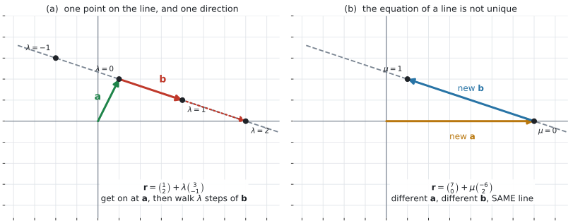
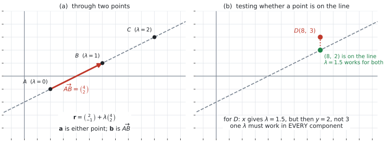
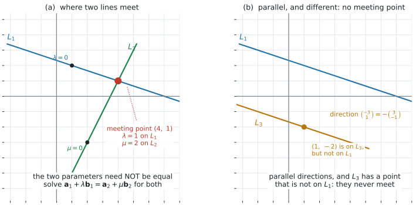

# AHL 3.11 — Vector equation of a line（直線のベクトル方程式） {#sec-ahl-3-11}

::: {.callout-note}
## What you should be able to do
- 直線が「**通る点 $1$ つ**」と「**向き $1$ つ**」で決まることを説明できる。
- $\mathbf{r} = \mathbf{a} + \lambda\mathbf{b}$ の $\mathbf{a}$ と $\mathbf{b}$ が何を表すかを言える。
- $\lambda$ に値を入れて、直線上の点を求められる。
- **同じ直線が、いくつもの式で書ける**ことを説明できる。
- **parametric form**（媒介変数表示）に書き直せる。
- $2$ 点を通る直線の式を作れる。
- ある点が直線上にあるかどうかを、**全成分**で判定できる。
- $3$ 次元でも、**成分が $1$ つ増えるだけ**で同じ計算ができる。
- $2$ 直線が平行かどうかを判定し、平行でないときは**交点**を求められる（$3$ 次元では、平行でなくても交わらないことがある）。
:::

::: {.callout-important}
## 公式集の AHL 3.11 の欄
**$2$ 行あります。どちらも与えられます。**

$$
\mathbf{r} = \mathbf{a} + \lambda\mathbf{b}
$$ {#eq-ahl311-vector}

$$
x = x_0 + \lambda l, \quad y = y_0 + \lambda m, \quad z = z_0 + \lambda n
$$ {#eq-ahl311-param}

**@eq-ahl311-vector も @eq-ahl311-param も試験中に見られます。暗記は問われません。**

しかし、**$\mathbf{a}$ が何で $\mathbf{b}$ が何なのかは書かれていません。** そこが分かっていないと、式があっても使えません（[第1節](#idea)）。
:::

::: {.callout-note}
## シラバスが、この項目に求めていること
AHL 3.11 の Content 欄は、**$1$ 行だけ**です。

> Vector equation of a line in two and three dimensions:

> $\boldsymbol{r} = \boldsymbol{a} + \lambda\boldsymbol{b}$, where $\boldsymbol{b}$ is a direction vector of the line.

Guidance 欄も $1$ 行です。

> Convert to parametric form: $x = x_0 + \lambda l$, $y = y_0 + \lambda m$, $z = z_0 + \lambda n$.

**`a direction vector` の `a` に注目してください。** `the` ではありません。**向きのベクトルは $1$ つに決まらない**ということが、ここに書かれています（[第3節](#not-unique)）。

Connections 欄には TOK が $1$ つだけあります。

> **TOK:** Mathematics and the knower: Why are symbolic representations of three-dimensional objects easier to deal with than visual representations? What does this tell us about our knowledge of mathematics in other dimensions?

**$3$ 次元の図はかきにくいのに、式なら $2$ 次元と同じように扱える**——この項目は、まさにそれを体験する項目です（[第7節](#three-d)）。
:::

::: {.callout-tip}
## 交点は、シラバスでは AHL 3.12 の欄にあります
`Finding positions, intersections, ...` という Guidance は、**AHL 3.12（運動）の欄**に書かれています。

ただ、交点の出し方そのものは**直線の式だけの話**なので、このページで先にやっておきます（[第9節](#intersect)）。[AHL 3.12a](ahl-3-12a.qmd) では、そこに**時刻**という意味が加わります。

なお、**$3$ 次元で「交わりもせず平行でもない」$2$ 直線までの距離**を求める公式は、シラバスの Content 欄にはありません。
:::

## The idea

### 1. 直線は「通る点 $1$ つ」と「向き $1$ つ」で決まります {#idea}

紙の上に直線を $1$ 本ひくには、$2$ つ決めれば足ります。

- **どこを通るか** … 通る点を $1$ つ
- **どちらを向いているか** … 向きを $1$ つ

{#fig-ahl311-idea width=100%}

@fig-ahl311-idea の (a) がその図です。式にすると

$$
\mathbf{r} = \mathbf{a} + \lambda\mathbf{b}
$$

- $\mathbf{r}$ … 直線上の**点の位置ベクトル**（[AHL 3.10b 第3節](ahl-3-10b.qmd#position)）
- $\mathbf{a}$ … 直線上の**$1$ 点**の位置ベクトル
- $\mathbf{b}$ … **direction vector**（方向ベクトル）。$\mathbf{b} \neq \mathbf{0}$
- $\lambda$ … **parameter**（媒介変数）。どんな実数でもよい

**イメージは「乗って、歩く」です。** まず $\mathbf{a}$ の地点まで行き、そこから $\mathbf{b}$ を $\lambda$ 回ぶん進みます。**$\lambda$ が負なら、逆向きに進みます。**

::: {.callout-warning}
## $\mathbf{b} = \mathbf{0}$ では、直線になりません
$\mathbf{b} = \mathbf{0}$ だと、$\lambda$ をどう変えても $\mathbf{r} = \mathbf{a}$ のままです。**点が $1$ つあるだけ**で、直線にはなりません。

ですから **direction vector は、いつも $\mathbf{0}$ でない**ものを選びます（[AHL 3.10a 第8節](ahl-3-10a.qmd#zero)）。
:::

### 2. $\lambda$ を動かすと、点が直線の上を動きます {#lambda}

$\mathbf{r} = \begin{pmatrix} 1 \\ 2 \end{pmatrix} + \lambda\begin{pmatrix} 3 \\ -1 \end{pmatrix}$ で、$\lambda$ に値を入れてみます。

| $\lambda$ | $\mathbf{r}$ | 点 |
|:--|:--|:--|
| $-1$ | $\begin{pmatrix} 1 \\ 2 \end{pmatrix} - \begin{pmatrix} 3 \\ -1 \end{pmatrix}$ | $(-2,\ 3)$ |
| $0$ | $\begin{pmatrix} 1 \\ 2 \end{pmatrix}$ | $(1,\ 2)$ |
| $1$ | $\begin{pmatrix} 1 \\ 2 \end{pmatrix} + \begin{pmatrix} 3 \\ -1 \end{pmatrix}$ | $(4,\ 1)$ |
| $2$ | $\begin{pmatrix} 1 \\ 2 \end{pmatrix} + 2\begin{pmatrix} 3 \\ -1 \end{pmatrix}$ | $(7,\ 0)$ |

: $\lambda$ を変えると点が動く {#tbl-ahl311-lambda}

@tbl-ahl311-lambda の点は、@fig-ahl311-idea の (a) に打ってあります。**$\lambda$ が $1$ 増えるごとに、$\mathbf{b}$ だけ動きます。**

**$\lambda$ は、どんな実数でもかまいません。** 負でも、分数でも、$0$ でもよいので、**直線は両側にどこまでも伸びます**。

::: {.callout-important}
## $\lambda$ は、距離でも時刻でもありません
$\lambda$ は「**直線上のどこか**」を指すためだけの数です。距離でも時刻でもありません。

$\lambda = 2$ は「$\mathbf{b}$ を $2$ 回ぶん進んだところ」であって、「$2$ だけ進んだところ」でも「$2$ 秒後」でもありません。

**時刻の意味が付くのは [AHL 3.12a](ahl-3-12a.qmd) から**です。そこでは $\lambda$ の代わりに $t$ と書き、$\mathbf{b}$ は速度になります。**$t$ が時刻という決まった意味を持つので、$\mathbf{b}$ を勝手にスカラー倍することは、もうできません**（[第3節](#not-unique)）。
:::

### 3. 同じ直線を、いくつもの式で書けます {#not-unique}

**これが、この項目でいちばん引っかかるところです。**

@fig-ahl311-idea の (b) を見てください。(a) と**同じ直線**を、別の式で書いたものです。

$$
\mathbf{r} = \begin{pmatrix} 1 \\ 2 \end{pmatrix} + \lambda\begin{pmatrix} 3 \\ -1 \end{pmatrix}
\qquad \text{と} \qquad
\mathbf{r} = \begin{pmatrix} 7 \\ 0 \end{pmatrix} + \mu\begin{pmatrix} -6 \\ 2 \end{pmatrix}
$$

変えてよいのは、次の $2$ つです。

- **$\mathbf{a}$** … **直線上のどの点**でもかまいません。$(7,\ 0)$ は、$\lambda = 2$ のときの点でした
- **$\mathbf{b}$** … **$0$ でないスカラー倍**なら何でもかまいません。$\begin{pmatrix} -6 \\ 2 \end{pmatrix} = -2\begin{pmatrix} 3 \\ -1 \end{pmatrix}$ です

ですから、**「答えが教科書と違う」からといって間違いとはかぎりません。** 同じ直線かどうかは、[第8節](#parallel) の $2$ 段の手順で調べます。

::: {.callout-warning}
## direction vector の**長さ**には、意味がありません
[AHL 3.10b 第7節](ahl-3-10b.qmd#direction) では、$3\mathbf{i}+4\mathbf{j}$ の長さが $5$ であることが問題になりました。

**このページでは、そこは問題になりません。** $\mathbf{b}$ を $2$ 倍にしても、$\lambda$ が半分になるだけで、**同じ直線**が出てくるからです。

長さに意味が戻るのは [AHL 3.12a](ahl-3-12a.qmd) です。そこでは $\mathbf{b}$ が**速度**になり、**その大きさが速さ**になります。
:::

### 4. parametric form — 成分ごとに書き出す {#parametric}

Guidance が求めているのは、この書き換えです。

$$
\mathbf{r} = \begin{pmatrix} x_0 \\ y_0 \\ z_0 \end{pmatrix} + \lambda\begin{pmatrix} l \\ m \\ n \end{pmatrix}
\qquad \Longleftrightarrow \qquad
\begin{cases} x = x_0 + \lambda l \\ y = y_0 + \lambda m \\ z = z_0 + \lambda n \end{cases}
$$

**やっていることは、成分ごとに $1$ 行ずつ書き出すことだけ**です。新しい内容はありません。

さきほどの例なら

$$
\mathbf{r} = \begin{pmatrix} 1 \\ 2 \end{pmatrix} + \lambda\begin{pmatrix} 3 \\ -1 \end{pmatrix}
\qquad \Longleftrightarrow \qquad
\begin{cases} x = 1 + 3\lambda \\ y = 2 - \lambda \end{cases}
$$

**この形にすると、$\lambda$ を求める式が立てられます。** 点が直線上にあるかの判定（[第6節](#on-line)）も、交点（[第9節](#intersect)）も、ここから始まります。

::: {.callout-tip}
## $2$ 次元なら、$\lambda$ を消して直線の式に戻せます
上の $2$ 式から $\lambda$ を消すと

$$
\lambda = \frac{x-1}{3} = 2-y \quad \Longrightarrow \quad x + 3y = 7
$$

中学・SL で習った直線の式に戻りました。傾きは $-\dfrac{1}{3}$ で、これは $\dfrac{-1}{3}$、つまり **direction vector の $\dfrac{\text{たて}}{\text{よこ}}$** です。

**この書き換えは、シラバスが求めているものではありません。** ただ、**検算には使えます。** なお **$3$ 次元ではこの形は作れません**し、$2$ 次元でも $\mathbf{b} = \begin{pmatrix} 0 \\ 1 \end{pmatrix}$ のような縦向きの直線では傾きが定まりません。
:::

### 5. $2$ 点を通る直線 {#two-points}

{#fig-ahl311-point width=100%}

$2$ 点 $A$、$B$（$A \neq B$）が与えられたら、@fig-ahl311-point の (a) のようにします。**$A = B$ だと $\overrightarrow{AB} = \mathbf{0}$ になり、直線が決まりません**（[第1節](#idea)）。

- **$\mathbf{a}$** … $A$ でも $B$ でも、どちらでもかまいません
- **$\mathbf{b}$** … $\overrightarrow{AB} = \mathbf{b}-\mathbf{a}$（[AHL 3.10b 第4節](ahl-3-10b.qmd#ab)）

$A(2,\ -1)$、$B(6,\ 1)$ なら $\overrightarrow{AB} = \begin{pmatrix} 4 \\ 2 \end{pmatrix}$ なので

$$
\mathbf{r} = \begin{pmatrix} 2 \\ -1 \end{pmatrix} + \lambda\begin{pmatrix} 4 \\ 2 \end{pmatrix}
$$ {#eq-ahl311-twopoints}

**$\lambda = 0$ で $A$、$\lambda = 1$ で $B$** です。これは覚えやすい形なので、答えを書いたら**この $2$ つを入れて確かめてください**。

**$\begin{pmatrix} 2 \\ 1 \end{pmatrix}$ を direction vector にしても正解**です（[第3節](#not-unique)）。ただしそのときは、$B$ に対応する $\lambda$ が $2$ になります。

### 6. 点が直線上にあるかどうか {#on-line}

@fig-ahl311-point の (b) が、この判定です。**parametric form にしてから、$\lambda$ を求めます。**

$$
\mathbf{r} = \begin{pmatrix} 2 \\ -1 \end{pmatrix} + \lambda\begin{pmatrix} 4 \\ 2 \end{pmatrix} \quad \Longleftrightarrow \quad \begin{cases} x = 2+4\lambda \\ y = -1+2\lambda \end{cases}
$$

点 $D(8,\ 3)$ を調べます。

- $x$ から … $2+4\lambda = 8$ なので $\lambda = 1.5$
- その $\lambda$ を $y$ に入れると … $-1+2(1.5) = 2$

**$2$ であって $3$ ではないので、$D$ は直線上にありません。**

::: {.callout-important}
## $1$ つの $\lambda$ が、**すべての成分**で成り立たなければなりません
$\lambda$ は**数が $1$ つ**です。$x$ 用の $\lambda$ と $y$ 用の $\lambda$ が別、ということはありません。

ですから判定は、次の $2$ 段です。

1. **$1$ つの成分から $\lambda$ を求める**（いちばん計算が楽な成分を選びます）
2. **その $\lambda$ を、残りの成分すべてに入れて合うか見る**

**$1$ 成分だけ見て「ある」と結論しないでください。** $3$ 次元なら、$3$ つとも合って初めて直線上です（@exm-ahl311-point）。
:::

### 7. $3$ 次元でも、成分が $1$ つ増えるだけです {#three-d}

$$
\mathbf{r} = \begin{pmatrix} 1 \\ 2 \\ -3 \end{pmatrix} + \lambda\begin{pmatrix} 2 \\ -1 \\ 4 \end{pmatrix}
\qquad \Longleftrightarrow \qquad
\begin{cases} x = 1+2\lambda \\ y = 2-\lambda \\ z = -3+4\lambda \end{cases}
$$

**式の上では、$2$ 次元と何も変わりません。** 調べ方も、$\lambda$ を $1$ つ求めて残りに入れるだけです。

**図はかけなくなりますが、計算はできます。** シラバスの TOK 欄が問うているのは、ここのことです。

### 8. 平行か、同じ直線か {#parallel}

{#fig-ahl311-intersect width=100%}

$2$ 直線 $L_1: \mathbf{r} = \mathbf{a}_1 + \lambda\mathbf{b}_1$、$L_2: \mathbf{r} = \mathbf{a}_2 + \mu\mathbf{b}_2$ について、まず**方向ベクトルを見ます**。

- **$\mathbf{b}_1$ と $\mathbf{b}_2$ が平行でない** … 向きが違う直線です
- **$\mathbf{b}_1$ と $\mathbf{b}_2$ が平行** … 次の $1$ 段が要ります

平行だったときは、**$\mathbf{a}_2$ が $L_1$ の上にあるか**を調べます（[第6節](#on-line)）。

- **ある** … $2$ つは**同じ直線**です
- **ない** … **平行で、別の直線**です。@fig-ahl311-intersect の (b) のように、**交わりません**

平行かどうかは、[AHL 3.10a 第7節](ahl-3-10a.qmd#scalar-multiple) の判定をそのまま使います。$\mathbf{b}_1 = k\mathbf{b}_2$ となる $k$ があるかどうかです。

### 9. 交点を求める {#intersect}

@fig-ahl311-intersect の (a) です。**$2$ 直線が同じ点に来る**ということなので

$$
\mathbf{a}_1 + \lambda\mathbf{b}_1 = \mathbf{a}_2 + \mu\mathbf{b}_2
$$ {#eq-ahl311-meet}

成分ごとに書き出すと、$\lambda$ と $\mu$ の連立方程式になります。

::: {.callout-warning}
## $2$ 直線で、同じ文字を使わないでください
$L_1$ の parameter と $L_2$ の parameter は、**別の数**です。

@fig-ahl311-intersect の (a) の交点 $(4,\ 1)$ は、$L_1$ では $\lambda = 1$、$L_2$ では $\mu = 2$ のところです。**同じ点なのに、値が違います。**

両方 $\lambda$ と書いてしまうと、「$\lambda$ が同時に $1$ でも $2$ でもある」という無理な式になり、交点を見落とします。**$\lambda$ と $\mu$、または $s$ と $t$ を使ってください。**
:::

**$2$ 次元で、$\mathbf{b}_1$ と $\mathbf{b}_2$ が平行でなければ**、$2$ 本の式で $2$ 個の未知数なので解けます。

**平行なのに解こうとすると、$0 = 4$ のような式になります。** それは「解が無い」、つまり**交わらない**という意味です（[第8節](#parallel)）。

**$3$ 次元では、式が $3$ 本になります。** $\lambda$ と $\mu$ が**両方とも決まる $2$ 本**を選んで解き、**残りの $1$ 本に入れて合うかを見ます。**

- **合う** … その点で交わります
- **合わない** … **平行でもないのに交わらない**という、$3$ 次元だけの状態です

## Why it works

**なぜ $\mathbf{a} + \lambda\mathbf{b}$ で、直線上の点が全部出るのか。**

直線上に点 $A$ を $1$ つ取り、その位置ベクトルを $\mathbf{a}$ とします。直線上の別の点を $P$、その位置ベクトルを $\mathbf{r}$ とします。

$\overrightarrow{AP}$ は**直線に沿ったベクトル**なので、方向ベクトル $\mathbf{b}$ と平行です。$\mathbf{b} \neq \mathbf{0}$ なので、[AHL 3.10a 第7節](ahl-3-10a.qmd#scalar-multiple) から

$$
\overrightarrow{AP} = \lambda\mathbf{b} \quad \text{となる数} \ \lambda \ \text{があります}
$$

nose to tail でつなぐと $\overrightarrow{OA} + \overrightarrow{AP} = \overrightarrow{OP}$ なので

$$
\mathbf{r} = \mathbf{a} + \lambda\mathbf{b}
$$

**逆も成り立ちます。** どんな $\lambda$ を入れても、$\mathbf{a}+\lambda\mathbf{b}$ の点は $A$ から $\mathbf{b}$ の向きに進んだ点なので、直線の上にあります。

**「もれなく、だぶりなく」出る**ので、これが直線の式になります。

**なぜ書き方が $1$ 通りでないのか。**

上の議論で、$A$ は**直線上のどの点を取ってもよかった**ことに注意してください。$\mathbf{b}$ も、直線に平行でありさえすればよいので、$k\mathbf{b}$（$k \neq 0$）に取り替えられます。

実際、$\mathbf{a}' = \mathbf{a}+c\mathbf{b}$、$\mathbf{b}' = k\mathbf{b}$ とおくと

$$
\mathbf{a}' + \mu\mathbf{b}' = \mathbf{a} + c\mathbf{b} + \mu k\mathbf{b} = \mathbf{a} + (c+\mu k)\mathbf{b}
$$

$\mu$ が実数全体を動くと $c+\mu k$ も実数全体を動く（$k \neq 0$ だから）ので、**出てくる点の集まりは同じ**です。

**なぜ判定に全成分が要るのか。**

$\lambda$ は**数が $1$ つ**です。$\mathbf{r} = \mathbf{a}+\lambda\mathbf{b}$ という**ベクトルの等式**は、「すべての成分が同時に等しい」という意味です（[AHL 3.10a 第4節](ahl-3-10a.qmd#equal)）。

ですから、$1$ 成分から求めた $\lambda$ が残りの成分でも合って初めて、その点は直線上にあります。

## Worked examples

::: {.callout-note appearance="simple"}
問題文は英語です。意味が理解できなかったら、問題文の下の「**日本語訳**」を開いてください。解説は日本語です。
:::

::: {#exm-ahl311-write}
[The points $A$ and $B$ have coordinates $A(2,\ -1)$ and $B(6,\ 1)$.]{.q-en}

**(a)** [Find $\overrightarrow{AB}$.]{.q-en}

**(b)** [Write down a vector equation of the line through $A$ and $B$.]{.q-en}

**(c)** [Write this line in parametric form.]{.q-en}

**(d)** [Show that the point $C(10,\ 3)$ lies on the line.]{.q-en}

<details class="jp-trans">
<summary>日本語訳</summary>

点 $A$、$B$ の座標は $A(2,\ -1)$、$B(6,\ 1)$ です。

**(a)** $\overrightarrow{AB}$ を求めなさい。

**(b)** $A$ と $B$ を通る直線のベクトル方程式を $1$ つ書きなさい。

**(c)** この直線を parametric form（媒介変数表示）で書きなさい。

**(d)** 点 $C(10,\ 3)$ がこの直線上にあることを示しなさい。

</details>

---

**(a)** 行き先ひく出発点です（[AHL 3.10b 第4節](ahl-3-10b.qmd#ab)）。

$$
\overrightarrow{AB} = \begin{pmatrix} 6 \\ 1 \end{pmatrix} - \begin{pmatrix} 2 \\ -1 \end{pmatrix} = \begin{pmatrix} 4 \\ 2 \end{pmatrix}
$$

**(b)** $\mathbf{a}$ に $A$、$\mathbf{b}$ に $\overrightarrow{AB}$ を入れます（@eq-ahl311-twopoints）。

$$
\mathbf{r} = \begin{pmatrix} 2 \\ -1 \end{pmatrix} + \lambda\begin{pmatrix} 4 \\ 2 \end{pmatrix}
$$

**問題文が `a vector equation` と言っている**ので、$1$ つ書けば足ります（[第3節](#not-unique)）。

**(c)** 成分ごとに書き出します（@eq-ahl311-param）。

$$
x = 2+4\lambda, \qquad y = -1+2\lambda
$$

**(d)** $x$ から $\lambda$ を求めて、$y$ に入れます（[第6節](#on-line)）。

$$
2+4\lambda = 10 \quad \Longrightarrow \quad \lambda = 2
$$

$$
y = -1+2(2) = 3
$$

**同じ $\lambda = 2$ で $x$ も $y$ も合った** ✓ ので、$C$ は直線上にあります。

**検算。** (b) の式に $\lambda = 0$ と $\lambda = 1$ を入れると、$A$ と $B$ に戻るはずです。

$$
\lambda = 0: \begin{pmatrix} 2 \\ -1 \end{pmatrix} = A, \qquad \lambda = 1: \begin{pmatrix} 6 \\ 1 \end{pmatrix} = B
$$

どちらも戻りました ✓

**$\mathbf{a}$ と $\mathbf{b}$ を取りちがえて $\mathbf{r} = \begin{pmatrix} 4 \\ 2 \end{pmatrix} + \lambda\begin{pmatrix} 2 \\ -1 \end{pmatrix}$ としていたら、$\lambda = 0$ で $(4,\ 2)$ になり、$A$ に戻りません。**

::: {.callout-note}
## 解答例（答案用紙にはこう書く）
**(a)**
$$\overrightarrow{AB} = \begin{pmatrix} 4 \\ 2 \end{pmatrix}$$

**(b)**
$$\mathbf{r} = \begin{pmatrix} 2 \\ -1 \end{pmatrix} + \lambda\begin{pmatrix} 4 \\ 2 \end{pmatrix}$$

**(c)**
$$x = 2+4\lambda, \qquad y = -1+2\lambda$$

**(d)**
$$2+4\lambda = 10 \ \Rightarrow \ \lambda = 2, \qquad y = -1+2(2) = 3$$
*The same value $\lambda = 2$ satisfies both equations, so $C$ lies on the line.*
:::
:::

::: {#exm-ahl311-point}
[A line has vector equation $\mathbf{r} = \begin{pmatrix} 1 \\ 2 \\ -3 \end{pmatrix} + \lambda\begin{pmatrix} 2 \\ -1 \\ 4 \end{pmatrix}$.]{.q-en}

**(a)** [Find the position vector of the point on the line where $\lambda = 3$.]{.q-en}

**(b)** [Determine whether the point $P(5,\ 0,\ 1)$ lies on the line.]{.q-en}

**(c)** [Determine whether the point $Q(-3,\ 4,\ -11)$ lies on the line.]{.q-en}

**(d)** [Explain why checking only the $x$-coordinate is not enough.]{.q-en}

<details class="jp-trans">
<summary>日本語訳</summary>

ある直線のベクトル方程式は $\mathbf{r} = \begin{pmatrix} 1 \\ 2 \\ -3 \end{pmatrix} + \lambda\begin{pmatrix} 2 \\ -1 \\ 4 \end{pmatrix}$ です。

**(a)** $\lambda = 3$ のときの、直線上の点の位置ベクトルを求めなさい。

**(b)** 点 $P(5,\ 0,\ 1)$ がこの直線上にあるかどうかを判定しなさい。

**(c)** 点 $Q(-3,\ 4,\ -11)$ がこの直線上にあるかどうかを判定しなさい。

**(d)** $x$ 座標だけを調べるのでは足りない理由を説明しなさい。

</details>

---

**(a)** 代入するだけです。

$$
\begin{pmatrix} 1 \\ 2 \\ -3 \end{pmatrix} + 3\begin{pmatrix} 2 \\ -1 \\ 4 \end{pmatrix} = \begin{pmatrix} 7 \\ -1 \\ 9 \end{pmatrix}
$$

**(b)** parametric form は $x = 1+2\lambda$、$y = 2-\lambda$、$z = -3+4\lambda$ です。

$$
1+2\lambda = 5 \quad \Longrightarrow \quad \lambda = 2
$$

$$
y = 2-2 = 0, \qquad z = -3+4(2) = 5
$$

$y$ は合いました ✓ しかし **$z$ が $5$ で、$1$ ではありません** ✗ ですから $P$ は直線上に**ありません**。

**$y$ が合ってしまうところ**が、この問題の意地悪なところです。$2$ つ合っても、$3$ つ目が合わなければ直線上にはありません。

**(c)** 同じ手順です。

$$
1+2\lambda = -3 \quad \Longrightarrow \quad \lambda = -2
$$

$$
y = 2-(-2) = 4, \qquad z = -3+4(-2) = -11
$$

**$3$ つとも合った** ✓ ので、$Q$ は直線上に**あります**。

**(d)** `Explain why` なので、英語で理由を書きます。

::: {.model-answer}
**試験ではこう書く**

*The parameter $\lambda$ is a single number, and the vector equation requires all three components to match for that same value of $\lambda$. The $x$-coordinate alone only fixes what $\lambda$ would have to be; it does not check the other two components. Part (b) shows this: for $P$ the $x$-coordinate gives $\lambda = 2$ and the $y$-coordinate agrees, but the $z$-coordinate gives $5$ instead of $1$, so $P$ is not on the line.*
:::

（parameter $\lambda$ は数が $1$ つで、ベクトル方程式は、その同じ $\lambda$ に対して $3$ 成分すべてが一致することを要求している。$x$ 座標だけでは、$\lambda$ がいくつでなければならないかが決まるだけで、残りの $2$ 成分の確認にはならない。(b) がその例で、$P$ では $x$ から $\lambda = 2$ が出て $y$ も合うが、$z$ が $1$ ではなく $5$ になるので、$P$ は直線上にない、という意味です。）

**検算。** (a) の答えを、逆向きに戻します。$\begin{pmatrix} 7 \\ -1 \\ 9 \end{pmatrix} - \begin{pmatrix} 1 \\ 2 \\ -3 \end{pmatrix} = \begin{pmatrix} 6 \\ -3 \\ 12 \end{pmatrix} = 3\begin{pmatrix} 2 \\ -1 \\ 4 \end{pmatrix}$ ✓ **ちょうど $\mathbf{b}$ の $3$ 倍**になりました。

**$z$ を $-3+4(3) = 15$ と誤って計算していたら、差が $\begin{pmatrix} 6 \\ -3 \\ 18 \end{pmatrix}$ になり、$\mathbf{b}$ のスカラー倍になりません。**

::: {.callout-note}
## 解答例（答案用紙にはこう書く）
**(a)**
$$\begin{pmatrix} 7 \\ -1 \\ 9 \end{pmatrix}$$

**(b)**
$$1+2\lambda = 5 \ \Rightarrow \ \lambda = 2; \qquad y = 0 \ \checkmark, \qquad z = -3+8 = 5 \neq 1$$
*So $P$ does not lie on the line.*

**(c)**
$$1+2\lambda = -3 \ \Rightarrow \ \lambda = -2; \qquad y = 4 \ \checkmark, \qquad z = -11 \ \checkmark$$
*So $Q$ lies on the line.*

**(d)**
*One value of $\lambda$ must satisfy all three component equations, so the $x$-coordinate alone is not sufficient.*
:::
:::

::: {#exm-ahl311-same}
[Two lines are given by]{.q-en}

$$
L_1: \ \mathbf{r} = \begin{pmatrix} 1 \\ 2 \end{pmatrix} + \lambda\begin{pmatrix} 3 \\ -1 \end{pmatrix}, \qquad L_2: \ \mathbf{r} = \begin{pmatrix} 7 \\ 0 \end{pmatrix} + \mu\begin{pmatrix} -6 \\ 2 \end{pmatrix}
$$

**(a)** [Show that the direction vectors are parallel.]{.q-en}

**(b)** [Show that the point $\begin{pmatrix} 7 \\ 0 \end{pmatrix}$ lies on $L_1$.]{.q-en}

**(c)** [Justify the claim that $L_1$ and $L_2$ are the same line.]{.q-en}

<details class="jp-trans">
<summary>日本語訳</summary>

$2$ 直線が上のように与えられています。

**(a)** $2$ つの方向ベクトルが平行であることを示しなさい。

**(b)** 点 $\begin{pmatrix} 7 \\ 0 \end{pmatrix}$ が $L_1$ 上にあることを示しなさい。

**(c)** $L_1$ と $L_2$ が同じ直線であるという主張を、根拠を挙げて説明しなさい。

</details>

---

**(a)** スカラー倍になっているかを見ます（[AHL 3.10a 第7節](ahl-3-10a.qmd#scalar-multiple)）。

$$
\begin{pmatrix} -6 \\ 2 \end{pmatrix} = -2\begin{pmatrix} 3 \\ -1 \end{pmatrix}
$$

$k = -2$ があるので平行です。**$k$ が負なので矢印の向きは逆ですが、通る点の集まりは変わりません。**

**(b)** $L_1$ の parametric form は $x = 1+3\lambda$、$y = 2-\lambda$ です。

$$
1+3\lambda = 7 \quad \Longrightarrow \quad \lambda = 2, \qquad y = 2-2 = 0
$$

$x$ も $y$ も合いました ✓

**(c)** `Justify` なので、**(a) と (b) をつないで**書きます。

::: {.model-answer}
**試験ではこう書く**

*The direction vectors satisfy $\begin{pmatrix} -6 \\ 2 \end{pmatrix} = -2\begin{pmatrix} 3 \\ -1 \end{pmatrix}$, so $L_1$ and $L_2$ are parallel. Two parallel lines are either identical or have no point in common. The point $\begin{pmatrix} 7 \\ 0 \end{pmatrix}$ of $L_2$ lies on $L_1$, taking $\lambda = 2$, so the lines do have a point in common. Hence $L_1$ and $L_2$ are the same line.*
:::

（方向ベクトルは $\begin{pmatrix} -6 \\ 2 \end{pmatrix} = -2\begin{pmatrix} 3 \\ -1 \end{pmatrix}$ を満たすので、$L_1$ と $L_2$ は平行である。平行な $2$ 直線は、一致するか、共有点を持たないかのどちらかである。$L_2$ の点 $\begin{pmatrix} 7 \\ 0 \end{pmatrix}$ は $\lambda = 2$ で $L_1$ 上にあるので、共有点がある。よって $L_1$ と $L_2$ は同じ直線である、という意味です。）

**(a) だけでは足りません。** 平行なだけなら、@fig-ahl311-intersect の (b) のように**別の直線**でもありえます。

**検算。** $L_2$ の点を $1$ つ作って、$L_1$ 上にあるか見ます。$\mu = 1$ で $\begin{pmatrix} 7 \\ 0 \end{pmatrix}+\begin{pmatrix} -6 \\ 2 \end{pmatrix} = \begin{pmatrix} 1 \\ 2 \end{pmatrix}$ です。これは $L_1$ の $\lambda = 0$ の点 ✓

**別の点でも合う**ので、たまたま $1$ 点で交わっているのではありません。

::: {.callout-note}
## 解答例（答案用紙にはこう書く）
**(a)**
$$\begin{pmatrix} -6 \\ 2 \end{pmatrix} = -2\begin{pmatrix} 3 \\ -1 \end{pmatrix}$$
*so the direction vectors are parallel.*

**(b)**
$$1+3\lambda = 7 \ \Rightarrow \ \lambda = 2, \qquad y = 2-2 = 0$$
*so $\begin{pmatrix} 7 \\ 0 \end{pmatrix}$ lies on $L_1$.*

**(c)**
*The lines are parallel and share the point $\begin{pmatrix} 7 \\ 0 \end{pmatrix}$, so they are the same line.*
:::
:::

::: {#exm-ahl311-intersect}
[Two lines are given by]{.q-en}

$$
L_1: \ \mathbf{r} = \begin{pmatrix} 1 \\ 2 \end{pmatrix} + \lambda\begin{pmatrix} 3 \\ -1 \end{pmatrix}, \qquad L_2: \ \mathbf{r} = \begin{pmatrix} 2 \\ -3 \end{pmatrix} + \mu\begin{pmatrix} 1 \\ 2 \end{pmatrix}
$$

**(a)** [Show that the lines are not parallel.]{.q-en}

**(b)** [Find the coordinates of the point where the lines meet.]{.q-en}

**(c)** [Explain why the two lines must be given different parameters.]{.q-en}

<details class="jp-trans">
<summary>日本語訳</summary>

$2$ 直線が上のように与えられています。

**(a)** $2$ 直線が平行でないことを示しなさい。

**(b)** $2$ 直線が交わる点の座標を求めなさい。

**(c)** $2$ 直線に、別々の parameter を与えなければならない理由を説明しなさい。

</details>

---

**(a)** 成分の比を見ます（[AHL 3.10a 第7節](ahl-3-10a.qmd#scalar-multiple)）。

$$
\frac{3}{1} = 3, \qquad \frac{-1}{2} = -0.5
$$

**比が食い違うので、平行ではありません。**

**(b)** $2$ 直線が同じ点に来る、と置きます（@eq-ahl311-meet）。

$$
\begin{pmatrix} 1+3\lambda \\ 2-\lambda \end{pmatrix} = \begin{pmatrix} 2+\mu \\ -3+2\mu \end{pmatrix}
$$

成分ごとに書き出します。

$$
1+3\lambda = 2+\mu \qquad \cdots (1)
$$

$$
2-\lambda = -3+2\mu \qquad \cdots (2)
$$

$(1)$ から $\mu = 3\lambda-1$ です。これを $(2)$ に入れます。

$$
2-\lambda = -3+2(3\lambda-1) = 6\lambda-5
$$

$$
7 = 7\lambda \quad \Longrightarrow \quad \lambda = 1, \qquad \mu = 2
$$

$\lambda = 1$ を $L_1$ に入れて

$$
\begin{pmatrix} 1 \\ 2 \end{pmatrix} + \begin{pmatrix} 3 \\ -1 \end{pmatrix} = \begin{pmatrix} 4 \\ 1 \end{pmatrix}
$$

交点は $(4,\ 1)$ です。

**(c)** `Explain why` なので、英語で理由を書きます。

::: {.model-answer}
**試験ではこう書く**

*The parameters locate a point along each line separately, and there is no reason for the same value to reach the meeting point on both. Here the meeting point $(4,\ 1)$ occurs at $\lambda = 1$ on $L_1$ but at $\mu = 2$ on $L_2$. Using one letter for both would force $\lambda = 1$ and $\lambda = 2$ at once, which has no solution, and the intersection would be missed.*
:::

（parameter は、それぞれの直線上の位置を別々に指すものであり、同じ値が両方で交点に届く理由はない。ここでは交点 $(4,\ 1)$ は $L_1$ では $\lambda = 1$、$L_2$ では $\mu = 2$ のところにある。$1$ つの文字で書いてしまうと $\lambda = 1$ と $\lambda = 2$ を同時に要求することになり、解が無くなって、交点を見落とす、という意味です。）

**検算。** $\mu = 2$ を **$L_2$ のほうに**入れて、同じ点になるか見ます。

$$
\begin{pmatrix} 2 \\ -3 \end{pmatrix} + 2\begin{pmatrix} 1 \\ 2 \end{pmatrix} = \begin{pmatrix} 4 \\ 1 \end{pmatrix}
$$

同じ点になりました ✓

**$L_1$ で出した点を $L_1$ に入れ直すだけでは検算になりません。** 使っていないほうの式に入れるので、独立した確認になります。

::: {.callout-note}
## 解答例（答案用紙にはこう書く）
**(a)**
$$\frac{3}{1} = 3 \neq -0.5 = \frac{-1}{2}$$
*so the direction vectors are not parallel.*

**(b)**
$$1+3\lambda = 2+\mu, \qquad 2-\lambda = -3+2\mu$$
$$\lambda = 1, \quad \mu = 2, \qquad \text{meeting point } (4,\ 1)$$

**(c)**
*The same point is reached at $\lambda = 1$ on $L_1$ and $\mu = 2$ on $L_2$, so one letter cannot serve both.*
:::
:::

## Common errors

::: {.callout-warning}
## $\mathbf{a}$ と $\mathbf{b}$ を取りちがえる
点 $(2,\ 5)$ を通り、向きが $4\mathbf{i}-3\mathbf{j}$ の直線を $\mathbf{r} = \begin{pmatrix} 4 \\ -3 \end{pmatrix} + \lambda\begin{pmatrix} 2 \\ 5 \end{pmatrix}$ としてしまう誤りです。

**前が「通る点」、$\lambda$ の後ろが「向き」**です（@eq-ahl311-vector）。

**検算はすぐできます。** $\lambda = 0$ を入れて、通るはずの点が出るか見てください（演習 $10$）。
:::

::: {.callout-warning}
## 「答えは $1$ 通り」と思い込む
同じ直線が、いくつもの式で書けます（[第3節](#not-unique)）。

$\mathbf{a}$ は**直線上のどの点**でもよく、$\mathbf{b}$ は**$0$ でないスカラー倍**なら何でもかまいません。

**模範解答と形が違っても、上の $2$ つを確かめれば正しいと分かります**（@exm-ahl311-same）。
:::

::: {.callout-warning}
## $1$ 成分だけ見て「線上にある」と結論する
$\lambda$ は**数が $1$ つ**です。**すべての成分で同じ $\lambda$** が成り立たなければなりません（[第6節](#on-line)）。

@exm-ahl311-point の $P$ は、$x$ も $y$ も合うのに $z$ で外れます。**$3$ 次元では、$3$ つとも確かめてください。**
:::

::: {.callout-warning}
## $2$ 直線に同じ文字を使う
$L_1$ と $L_2$ の parameter を、両方 $\lambda$ と書いてしまう誤りです。

**交点でも、$2$ つの値は一致しません**（@exm-ahl311-intersect では $1$ と $2$）。

同じ文字にすると解が無くなり、**「交わらない」と誤って結論**してしまいます。
:::

::: {.callout-warning}
## direction vector の長さを、そろえようとする
$\mathbf{b}$ を単位ベクトルに直す必要はありません（[第3節](#not-unique)）。

**長さを変えても、同じ直線**です。$\lambda$ の値が変わるだけです。

**単位ベクトルが要るのは [AHL 3.10b 第7節](ahl-3-10b.qmd#direction) の「速さ $\times$ 向き」の場面**で、直線の式では要りません。
:::

## Using your GDC (TI-Nspire CX II)

### 1. 点は、代入で出せます {#gdc-points}

$\mathbf{a}$ と $\mathbf{b}$ を角かっこで入れて、そのまま計算します（[AHL 3.10a の GDC 第1節](ahl-3-10a.qmd#gdc-enter)）。

```
[1;2]+2*[3;-1]
```

$\begin{pmatrix} 7 \\ 0 \end{pmatrix}$ が返ります（@tbl-ahl311-lambda）。

$3$ 次元でも同じです。

```
[1;2;-3]+3*[2;-1;4]
```

$\begin{pmatrix} 7 \\ -1 \\ 9 \end{pmatrix}$ が返ります（@exm-ahl311-point）。

### 2. 名前を付けておくと、$\lambda$ を変えるのが楽です {#gdc-store}

```
[1;2] → va
[3;-1] → vb
```

矢印 `→` は、**`ctrl` を押してから `var`** です（[AHL 3.10a の GDC 第2節](ahl-3-10a.qmd#gdc-store)）。

そのあとは `va+0*vb`、`va+1*vb`、`va+2*vb` と打つだけで、@tbl-ahl311-lambda が作れます。

**$1$ つの問題が終わったら、変数を消しておいてください**（`menu → Actions → Clear a-z`）。

### 3. 交点は、連立方程式として解けます {#gdc-linsolve}

`menu → 3: Algebra` の中に **Solve System of Linear Equations** があります。これを選ぶと、式の本数と変数を聞かれます。

選び終わると、入力行に `linSolve(` という関数が出てきます。**手で打つこともできます。**

@exm-ahl311-intersect なら、$2$ 本・変数 $p$、$q$ として

```
1+3*p = 2+q
2-p = -3+2*q
```

と入れます。$\{1,\ 2\}$ が返り、$\lambda = 1$、$\mu = 2$ です。

::: {.callout-warning}
## $l$ や $\lambda$ を、そのまま変数名にしないでください
`l`（エル）は $1$ と見分けが付きません。$\lambda$ も、電卓では入力に手間がかかります。

**`p`、`q` や `s`、`t` のような、打ちやすくて紛れない文字**を使ってください。答案に書くときに $\lambda$、$\mu$ に戻せば足ります。
:::

### 4. $2$ 次元なら、グラフでも確かめられます {#gdc-graph}

`ctrl + doc` でページを足し、Graphs を開きます。`menu → Graph Entry/Edit → Parametric` を選ぶと、$x_1(t)$、$y_1(t)$ が出ます。

```
x1(t)=1+3t     y1(t)=2-t
x2(t)=2+t      y2(t)=-3+2t
```

**電卓の parameter は $t$ です。** $\lambda$ や $\mu$ とは書けないので、$L_1$ と $L_2$ で $t$ の意味が違うことは、自分で覚えておいてください。

$t$ の範囲は既定で $0 \leq t \leq 2\pi$ くらいです。**負の側も見たいときは、入力行にいっしょに出ている `tmin` を、その場で負に書き換えます。** `Window Settings` にあるのは $x$ と $y$ の範囲だけで、`tmin` はそこにはありません。

交点は `menu → Geometry → Points & Lines → Intersection Point(s)` で、$2$ 本の曲線を順に選ぶと出ます。$(4,\ 1)$ が出れば、@exm-ahl311-intersect と合っています。

**`Analyze Graph` は関数のグラフ用**で、parametric では使えません。

**グラフは、答えの見当を付けるためのものです。** 答案には、@eq-ahl311-meet を解く過程を書いてください。

### 5. 線上かどうかは、$2$ 段で {#gdc-online}

**電卓に「この点は線上か」と聞くコマンドはありません。**

$1$ 成分から $\lambda$ を求め、その値を代入して比べます。

```
[1;2;-3]+2*[2;-1;4]
```

$\begin{pmatrix} 5 \\ 0 \\ 5 \end{pmatrix}$ が返ります。調べたい点 $P(5,\ 0,\ 1)$ と**$3$ 成分すべてを見くらべて**、$z$ が違うと分かります（@exm-ahl311-point）。

**この使い方なら、$1$ 成分だけ見て終わる誤りが起こりません。**

### 6. 検算のしかた {#gdc-check}

- **$\lambda = 0$ を入れる。** 通るはずの点が出るか見る。**$2$ 点の問題なら $\lambda = 1$ も入れて、もう一方の点に届くか見る**（@exm-ahl311-write）
- **交点は、使っていないほうの式に入れる。** $\mu$ を $L_2$ に入れて同じ点になるか見る（@exm-ahl311-intersect）
- **求めた点から $\mathbf{a}$ を引く。** $\mathbf{b}$ のスカラー倍になるはず（@exm-ahl311-point）
- **$2$ 次元ならグラフでも見る。** 交点の位置が計算と合うか（[GDC 第4節](#gdc-graph)）

$1$ つ目がいちばん速い検算です。**$\lambda = 0$ と $\lambda = 1$ の両方を入れれば、$\mathbf{a}$ と $\mathbf{b}$ の取りちがえは見つかります。** $\lambda = 0$ だけだと、$\mathbf{b}$ に $B$ の位置ベクトルを使ってしまった誤りを見落とします。

## Exercises

::: {.callout-note appearance="simple"}
各問題に、折りたたみが $3$ つ付いています。**日本語訳**、**解答例**（答案用紙に書くべきこと。英語です）、**解説**（なぜそうなるか。日本語です）。

まず自分で解いて、次に解答例と見くらべてください。**解説は、合わなかったときだけ開けば十分です。**
:::

::: {.exercise-block}

[1]{.ex-no} [A line has vector equation $\mathbf{r} = \begin{pmatrix} 4 \\ -1 \end{pmatrix} + \lambda\begin{pmatrix} 2 \\ 5 \end{pmatrix}$. Find the position vectors of the points on the line where $\lambda = 0$, $\lambda = 1$ and $\lambda = -2$.]{.q-en}

<details class="jp-trans">
<summary>日本語訳</summary>

ある直線のベクトル方程式は $\mathbf{r} = \begin{pmatrix} 4 \\ -1 \end{pmatrix} + \lambda\begin{pmatrix} 2 \\ 5 \end{pmatrix}$ です。$\lambda = 0$、$\lambda = 1$、$\lambda = -2$ のときの、直線上の点の位置ベクトルを求めなさい。

</details>

::: {.callout-note collapse="true"}
## 解答例（答案用紙に書くこと）

$$\lambda = 0: \begin{pmatrix} 4 \\ -1 \end{pmatrix}, \qquad \lambda = 1: \begin{pmatrix} 6 \\ 4 \end{pmatrix}, \qquad \lambda = -2: \begin{pmatrix} 0 \\ -11 \end{pmatrix}$$
:::

::: {.callout-tip collapse="true"}
## 解説

代入するだけです（[第2節](#lambda)）。**$\lambda = -2$ では、$\mathbf{b}$ を $2$ つぶん逆向きに進みます。**

$-1 + (-2)(5) = -11$ です。**符号を $2$ か所とも間違えないように**してください。

**検算。** $\lambda$ が $1$ 増えるごとに、差はちょうど $\mathbf{b}$ になるはずです。$\begin{pmatrix} 6 \\ 4 \end{pmatrix}-\begin{pmatrix} 4 \\ -1 \end{pmatrix} = \begin{pmatrix} 2 \\ 5 \end{pmatrix}$ ✓ また $\begin{pmatrix} 0 \\ -11 \end{pmatrix}-\begin{pmatrix} 4 \\ -1 \end{pmatrix} = \begin{pmatrix} -4 \\ -10 \end{pmatrix} = -2\mathbf{b}$ ✓ **$-1+(-10)$ を $9$ としていたら、$-2\mathbf{b}$ になりません。**
:::

::: {.ex-sep}
:::

[2]{.ex-no} [Write the line $\mathbf{r} = \begin{pmatrix} -3 \\ 5 \\ 2 \end{pmatrix} + \lambda\begin{pmatrix} 1 \\ -4 \\ 6 \end{pmatrix}$ in parametric form.]{.q-en}

<details class="jp-trans">
<summary>日本語訳</summary>

直線 $\mathbf{r} = \begin{pmatrix} -3 \\ 5 \\ 2 \end{pmatrix} + \lambda\begin{pmatrix} 1 \\ -4 \\ 6 \end{pmatrix}$ を parametric form（媒介変数表示）で書きなさい。

</details>

::: {.callout-note collapse="true"}
## 解答例（答案用紙に書くこと）

$$x = -3+\lambda, \qquad y = 5-4\lambda, \qquad z = 2+6\lambda$$
:::

::: {.callout-tip collapse="true"}
## 解説

成分ごとに $1$ 行ずつ書くだけです（@eq-ahl311-param）。**$\mathbf{b}$ の $1$ つ目が $1$ なので、$x$ は $\lambda$ の係数が $1$** になります。$\lambda$ を書き落とさないでください。

**検算。** $\lambda = 1$ を、$2$ つの形の両方に入れます。ベクトル形は $\begin{pmatrix} -3 \\ 5 \\ 2 \end{pmatrix}+\begin{pmatrix} 1 \\ -4 \\ 6 \end{pmatrix} = \begin{pmatrix} -2 \\ 1 \\ 8 \end{pmatrix}$、parametric form は $x = -2$、$y = 1$、$z = 8$ ✓ **符号を写し間違えていたら、ここで食い違います。**
:::

::: {.ex-sep}
:::

[3]{.ex-no} [Find a vector equation of the line through $P(1,\ 3)$ and $Q(5,\ -1)$.]{.q-en}

<details class="jp-trans">
<summary>日本語訳</summary>

$P(1,\ 3)$ と $Q(5,\ -1)$ を通る直線のベクトル方程式を $1$ つ求めなさい。

</details>

::: {.callout-note collapse="true"}
## 解答例（答案用紙に書くこと）

$$\overrightarrow{PQ} = \begin{pmatrix} 4 \\ -4 \end{pmatrix}, \qquad \mathbf{r} = \begin{pmatrix} 1 \\ 3 \end{pmatrix} + \lambda\begin{pmatrix} 4 \\ -4 \end{pmatrix}$$
:::

::: {.callout-tip collapse="true"}
## 解説

$\mathbf{a}$ に $P$、$\mathbf{b}$ に $\overrightarrow{PQ}$ を入れます（[第5節](#two-points)）。

**$\begin{pmatrix} 1 \\ -1 \end{pmatrix}$ を使っても正解**です（[第3節](#not-unique)）。そのときは $Q$ が $\lambda = 4$ になります。

**検算。** $\lambda = 0$ で $P$、$\lambda = 1$ で $Q$ になるはずです。$\begin{pmatrix} 1 \\ 3 \end{pmatrix}+\begin{pmatrix} 4 \\ -4 \end{pmatrix} = \begin{pmatrix} 5 \\ -1 \end{pmatrix} = Q$ ✓ **$\overrightarrow{QP}$ と取りちがえていたら、$\lambda = 1$ で $(-3,\ 7)$ になり、$Q$ に届きません。**
:::

::: {.ex-sep}
:::

[4]{.ex-no} [Determine whether the point $(11,\ 14)$ lies on the line $\mathbf{r} = \begin{pmatrix} 1 \\ 2 \end{pmatrix} + \lambda\begin{pmatrix} 5 \\ 6 \end{pmatrix}$.]{.q-en}

<details class="jp-trans">
<summary>日本語訳</summary>

点 $(11,\ 14)$ が直線 $\mathbf{r} = \begin{pmatrix} 1 \\ 2 \end{pmatrix} + \lambda\begin{pmatrix} 5 \\ 6 \end{pmatrix}$ 上にあるかどうかを判定しなさい。

</details>

::: {.callout-note collapse="true"}
## 解答例（答案用紙に書くこと）

$$1+5\lambda = 11 \ \Rightarrow \ \lambda = 2, \qquad y = 2+6(2) = 14 \ \checkmark$$

*The same $\lambda$ satisfies both equations, so the point lies on the line.*
:::

::: {.callout-tip collapse="true"}
## 解説

$x$ から $\lambda$ を出し、$y$ に入れます（[第6節](#on-line)）。$\lambda = 2$ で $y = 14$ になるので、線上にあります。

**「$\lambda = 2$ だから線上」では足りません。** $y$ まで確かめて、はじめて結論できます。

**検算。** 求めた点から $\mathbf{a}$ を引くと、$\mathbf{b}$ のスカラー倍になるはずです。$\begin{pmatrix} 11 \\ 14 \end{pmatrix}-\begin{pmatrix} 1 \\ 2 \end{pmatrix} = \begin{pmatrix} 10 \\ 12 \end{pmatrix} = 2\begin{pmatrix} 5 \\ 6 \end{pmatrix}$ ✓ **$\mathbf{b}$ のちょうど $2$ 倍になっているので、たしかに線上の点です。**
:::

::: {.ex-sep}
:::

[5]{.ex-no} [Determine whether the point $(7,\ 1,\ 10)$ lies on the line $\mathbf{r} = \begin{pmatrix} 1 \\ -2 \\ 3 \end{pmatrix} + \lambda\begin{pmatrix} 2 \\ 1 \\ 2 \end{pmatrix}$.]{.q-en}

<details class="jp-trans">
<summary>日本語訳</summary>

点 $(7,\ 1,\ 10)$ が直線 $\mathbf{r} = \begin{pmatrix} 1 \\ -2 \\ 3 \end{pmatrix} + \lambda\begin{pmatrix} 2 \\ 1 \\ 2 \end{pmatrix}$ 上にあるかどうかを判定しなさい。

</details>

::: {.callout-note collapse="true"}
## 解答例（答案用紙に書くこと）

$$1+2\lambda = 7 \ \Rightarrow \ \lambda = 3, \qquad y = -2+3 = 1 \ \checkmark, \qquad z = 3+2(3) = 9 \neq 10$$

*The point does not lie on the line.*
:::

::: {.callout-tip collapse="true"}
## 解説

$x$ と $y$ は合いますが、**$z$ が $9$ で $10$ ではありません**（[第6節](#on-line)）。

**$2$ つ合ったところでやめてしまうと、間違えます。** @exm-ahl311-point と同じ形の問題です。

**検算。** 点から $\mathbf{a}$ を引きます。$\begin{pmatrix} 7 \\ 1 \\ 10 \end{pmatrix}-\begin{pmatrix} 1 \\ -2 \\ 3 \end{pmatrix} = \begin{pmatrix} 6 \\ 3 \\ 7 \end{pmatrix}$ です。$\mathbf{b} = \begin{pmatrix} 2 \\ 1 \\ 2 \end{pmatrix}$ の比は $3$、$3$、$3.5$ で**そろいません** ✗ $\mathbf{b}$ のスカラー倍ではないので、線上にありません。
:::

::: {.ex-sep}
:::

[6]{.ex-no} [Three lines are given by]{.q-en}

$$
\text{(i)} \ \mathbf{r} = \begin{pmatrix} 4 \\ 5 \end{pmatrix} + \mu\begin{pmatrix} -6 \\ 9 \end{pmatrix}, \qquad \text{(ii)} \ \mathbf{r} = \begin{pmatrix} 0 \\ 1 \end{pmatrix} + \mu\begin{pmatrix} 3 \\ -2 \end{pmatrix}, \qquad \text{(iii)} \ \mathbf{r} = \begin{pmatrix} 5 \\ -7 \end{pmatrix} + \mu\begin{pmatrix} 4 \\ -6 \end{pmatrix}
$$

[State, with a reason, which of these lines are parallel to $\mathbf{r} = \begin{pmatrix} 1 \\ 0 \end{pmatrix} + \lambda\begin{pmatrix} 2 \\ -3 \end{pmatrix}$.]{.q-en}

<details class="jp-trans">
<summary>日本語訳</summary>

$3$ 本の直線が上のように与えられています。

このうち、$\mathbf{r} = \begin{pmatrix} 1 \\ 0 \end{pmatrix} + \lambda\begin{pmatrix} 2 \\ -3 \end{pmatrix}$ と平行なものはどれか、理由を付けて答えなさい。

</details>

::: {.callout-note collapse="true"}
## 解答例（答案用紙に書くこと）

*(i) and (iii).*

$$\begin{pmatrix} -6 \\ 9 \end{pmatrix} = -3\begin{pmatrix} 2 \\ -3 \end{pmatrix}, \qquad \begin{pmatrix} 4 \\ -6 \end{pmatrix} = 2\begin{pmatrix} 2 \\ -3 \end{pmatrix}$$

*Line (ii) is not parallel, since $\dfrac{3}{2} \neq \dfrac{-2}{-3}$.*
:::

::: {.callout-tip collapse="true"}
## 解説

方向ベクトルだけを見ます（[第8節](#parallel)）。**$\mathbf{a}$ は関係ありません。**

(i) は $k = -3$、(iii) は $k = 2$ でスカラー倍になっています。**$k$ が負でも平行**です（[AHL 3.10a 第7節](ahl-3-10a.qmd#scalar-multiple)）。

(ii) は $\dfrac{3}{2} = 1.5$ と $\dfrac{-2}{-3} \approx 0.667$ で食い違います。

**検算。** [第4節](#parametric) の傾きで見ます。傾きは $\dfrac{\text{たて}}{\text{よこ}}$ でした。もとの直線は $\dfrac{-3}{2} = -1.5$、(i) は $\dfrac{9}{-6} = -1.5$ ✓、(iii) は $\dfrac{-6}{4} = -1.5$ ✓、(ii) は $\dfrac{-2}{3} \approx -0.67$ で違います ✗ **$1$ 成分だけ見ていたら、(ii) でも $k = \dfrac{3}{2}$ という値は出てしまい、平行でないことに気づけません。**

::: {.model-answer}
**試験ではこう書く**

*Lines (i) and (iii) are parallel to the given line. Their direction vectors are scalar multiples of $\begin{pmatrix} 2 \\ -3 \end{pmatrix}$: $\begin{pmatrix} -6 \\ 9 \end{pmatrix} = -3\begin{pmatrix} 2 \\ -3 \end{pmatrix}$ and $\begin{pmatrix} 4 \\ -6 \end{pmatrix} = 2\begin{pmatrix} 2 \\ -3 \end{pmatrix}$. A negative scalar still gives a parallel line, since reversing the direction vector traces out the same line. Line (ii) is not parallel, because $\begin{pmatrix} 3 \\ -2 \end{pmatrix} = k\begin{pmatrix} 2 \\ -3 \end{pmatrix}$ would need $k = 1.5$ from the first component and $k = \tfrac{2}{3}$ from the second.*
:::
:::

::: {.ex-sep}
:::

[7]{.ex-no} [Find the coordinates of the point where the lines]{.q-en}

$$
L_1: \ \mathbf{r} = \begin{pmatrix} 2 \\ 1 \end{pmatrix} + \lambda\begin{pmatrix} 1 \\ 3 \end{pmatrix} \qquad \text{and} \qquad L_2: \ \mathbf{r} = \begin{pmatrix} 7 \\ 6 \end{pmatrix} + \mu\begin{pmatrix} -1 \\ 2 \end{pmatrix}
$$

[meet.]{.q-en}

<details class="jp-trans">
<summary>日本語訳</summary>

上の $2$ 直線 $L_1$、$L_2$ が交わる点の座標を求めなさい。

</details>

::: {.callout-note collapse="true"}
## 解答例（答案用紙に書くこと）

$$2+\lambda = 7-\mu, \qquad 1+3\lambda = 6+2\mu$$

$$\lambda = 3, \quad \mu = 2, \qquad \text{meeting point } (5,\ 10)$$
:::

::: {.callout-tip collapse="true"}
## 解説

$2$ 直線が同じ点に来る、と置きます（@eq-ahl311-meet）。**文字は $2$ 種類**です（[第9節](#intersect)）。

$1$ 本目から $\mu = 5-\lambda$ です。$2$ 本目に入れると $1+3\lambda = 6+2(5-\lambda) = 16-2\lambda$、つまり $5\lambda = 15$ で $\lambda = 3$ です。

$L_1$ に $\lambda = 3$ を入れて $\begin{pmatrix} 2 \\ 1 \end{pmatrix}+3\begin{pmatrix} 1 \\ 3 \end{pmatrix} = \begin{pmatrix} 5 \\ 10 \end{pmatrix}$ です。

**検算。** $\mu = 2$ を $L_2$ に入れます。$\begin{pmatrix} 7 \\ 6 \end{pmatrix}+2\begin{pmatrix} -1 \\ 2 \end{pmatrix} = \begin{pmatrix} 5 \\ 10 \end{pmatrix}$ ✓ **使っていないほうの式で同じ点が出た**ので、独立した確認になっています。
:::

::: {.ex-sep}
:::

[8]{.ex-no} [Two lines are given by]{.q-en}

$$
L_1: \ \mathbf{r} = \begin{pmatrix} 3 \\ 1 \\ -2 \end{pmatrix} + \lambda\begin{pmatrix} 1 \\ -2 \\ 3 \end{pmatrix} \qquad \text{and} \qquad L_2: \ \mathbf{r} = \begin{pmatrix} 5 \\ -3 \\ 4 \end{pmatrix} + \mu\begin{pmatrix} 2 \\ -4 \\ 6 \end{pmatrix}
$$

[Justify the claim that $L_1$ and $L_2$ are the same line.]{.q-en}

<details class="jp-trans">
<summary>日本語訳</summary>

上の $2$ 直線 $L_1$、$L_2$ が同じ直線であるという主張を、根拠を挙げて説明しなさい。

</details>

::: {.callout-note collapse="true"}
## 解答例（答案用紙に書くこと）

$$\begin{pmatrix} 2 \\ -4 \\ 6 \end{pmatrix} = 2\begin{pmatrix} 1 \\ -2 \\ 3 \end{pmatrix}$$

$$3+\lambda = 5 \ \Rightarrow \ \lambda = 2; \qquad 1-2(2) = -3 \ \checkmark, \qquad -2+3(2) = 4 \ \checkmark$$

*The directions are parallel and $L_2$ passes through a point of $L_1$, so the lines are the same.*
:::

::: {.callout-tip collapse="true"}
## 解説

$2$ 段です（[第8節](#parallel)）。

1. **方向ベクトルが平行**か … $k = 2$ ✓
2. **一方の $\mathbf{a}$ が、他方の上にある**か … $\lambda = 2$ で $3$ 成分とも合う ✓

**$1$ だけでは足りません。** 平行なだけなら、別の直線でもありえます（@fig-ahl311-intersect の (b)）。

**検算。** $L_2$ の別の点でも見ます。$\mu = 1$ で $\begin{pmatrix} 5 \\ -3 \\ 4 \end{pmatrix}+\begin{pmatrix} 2 \\ -4 \\ 6 \end{pmatrix} = \begin{pmatrix} 7 \\ -7 \\ 10 \end{pmatrix}$ です。$L_1$ では $3+\lambda = 7$ から $\lambda = 4$、$1-8 = -7$ ✓、$-2+12 = 10$ ✓ **別の点でも $3$ 成分とも合った**ので、$1$ 点で交わっているだけではありません。

::: {.model-answer}
**試験ではこう書く**

*The direction vectors satisfy $\begin{pmatrix} 2 \\ -4 \\ 6 \end{pmatrix} = 2\begin{pmatrix} 1 \\ -2 \\ 3 \end{pmatrix}$, so $L_1$ and $L_2$ are parallel. Two parallel lines are either identical or share no point at all. Substituting the point $\begin{pmatrix} 5 \\ -3 \\ 4 \end{pmatrix}$ of $L_2$ into $L_1$ gives $\lambda = 2$ from the first component, and this same value gives $1-4 = -3$ and $-2+6 = 4$, so all three components agree. The lines therefore share a point, and being parallel as well, they are the same line.*
:::
:::

::: {.ex-sep}
:::

[9]{.ex-no} [A line has vector equation $\mathbf{r} = \begin{pmatrix} 5 \\ -1 \end{pmatrix} + \lambda\begin{pmatrix} -1 \\ 2 \end{pmatrix}$. Find the coordinates of the point where the line crosses the $y$-axis.]{.q-en}

<details class="jp-trans">
<summary>日本語訳</summary>

ある直線のベクトル方程式は $\mathbf{r} = \begin{pmatrix} 5 \\ -1 \end{pmatrix} + \lambda\begin{pmatrix} -1 \\ 2 \end{pmatrix}$ です。この直線が $y$ 軸と交わる点の座標を求めなさい。

</details>

::: {.callout-note collapse="true"}
## 解答例（答案用紙に書くこと）

$$x = 5-\lambda = 0 \ \Rightarrow \ \lambda = 5, \qquad y = -1+2(5) = 9$$

*The line crosses the $y$-axis at $(0,\ 9)$.*
:::

::: {.callout-tip collapse="true"}
## 解説

**$y$ 軸の上では $x = 0$** です。そこから $\lambda$ を求めて、$y$ に入れます（[第4節](#parametric)）。

**$x$ 軸ではありません。** $y$ 軸なので、$0$ にするのは $x$ のほうです。ここを取りちがえる答案が多いところです。

**検算。** [第4節](#parametric) のやり方で $\lambda$ を消すと、$\lambda = 5-x$ から $y = -1+2(5-x)$、つまり $y = 9-2x$ です。$x = 0$ を入れると $y = 9$ ✓ **もとの点 $(5,\ -1)$ も $9-10 = -1$ で合っています。** **$x$ 軸と取りちがえて $y = 0$ としていたら $x = 4.5$ となり、$y$ 軸上の点にはなりません。**
:::

::: {.ex-sep}
:::

[10]{.ex-no} [A student is asked to write a vector equation of the line through $A(2,\ 5)$ with direction vector $4\mathbf{i} - 3\mathbf{j}$, and writes]{.q-en}

$$
\mathbf{r} = \begin{pmatrix} 4 \\ -3 \end{pmatrix} + \lambda\begin{pmatrix} 2 \\ 5 \end{pmatrix}
$$

[Identify the error and give a correct answer.]{.q-en}

<details class="jp-trans">
<summary>日本語訳</summary>

ある生徒が、$A(2,\ 5)$ を通り方向ベクトルが $4\mathbf{i}-3\mathbf{j}$ である直線のベクトル方程式を書くよう言われ、上のように書きました。

誤りを指摘し、正しい答えを $1$ つ書きなさい。

</details>

::: {.callout-note collapse="true"}
## 解答例（答案用紙に書くこと）

*The student has swapped $\mathbf{a}$ and $\mathbf{b}$. The point comes first and the direction vector is multiplied by $\lambda$.*

$$\mathbf{r} = \begin{pmatrix} 2 \\ 5 \end{pmatrix} + \lambda\begin{pmatrix} 4 \\ -3 \end{pmatrix}$$
:::

::: {.callout-tip collapse="true"}
## 解説

`Identify the error` なので、**どこが違うのかを名指し**してから、正しい式を書きます。

**$\lambda$ が掛かっているほうが方向ベクトル**です（@eq-ahl311-vector）。生徒の式では、点と向きが入れかわっています。

**検算。** $\lambda = 0$ を入れます。生徒の式では $(4,\ -3)$ で、通るはずの $A(2,\ 5)$ ではありません ✗ 正しい式では $(2,\ 5) = A$ ✓

**さらに強い確認。** $A$ が生徒の直線の上にあるかを調べます。$4+2\lambda = 2$ から $\lambda = -1$、そのとき $y = -3-5 = -8$ で、$5$ ではありません。**$A$ は生徒の直線の上にすらありません。**

::: {.model-answer}
**試験ではこう書く**

*The student has interchanged the position vector and the direction vector. In $\mathbf{r} = \mathbf{a} + \lambda\mathbf{b}$, the vector $\mathbf{a}$ is the position vector of a point on the line and $\mathbf{b}$, the vector multiplied by $\lambda$, is the direction. Setting $\lambda = 0$ in the student's equation gives the point $(4,\ -3)$, not $A(2,\ 5)$; in fact $A$ does not lie on the student's line at all, since $4+2\lambda = 2$ gives $\lambda = -1$, which then gives $y = -8$ rather than $5$. A correct equation is $\mathbf{r} = \begin{pmatrix} 2 \\ 5 \end{pmatrix} + \lambda\begin{pmatrix} 4 \\ -3 \end{pmatrix}$.*
:::
:::

:::
