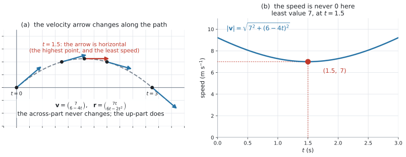
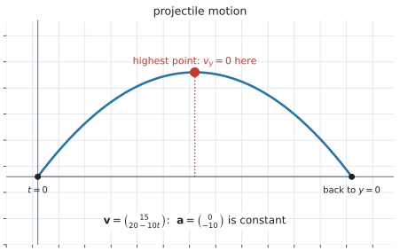
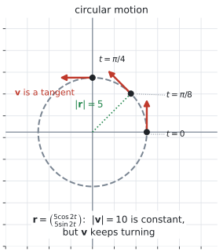
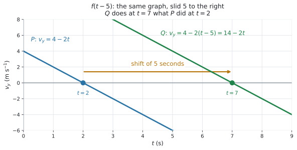

# AHL 3.12b — Kinematics: variable velocity（速度が変わる運動） {#sec-ahl-3-12b}

::: {.callout-note}
## What you should be able to do
- **velocity**（速度）が $t$ の式になっている運動を読み取れる。
- **speed**（速さ）$\lvert \mathbf{v}(t) \rvert$ を $t$ の式で書き、**最小**を求められる。
- **acceleration**（加速度）$\mathbf{a} = \dfrac{d\mathbf{v}}{dt}$ を、**成分ごとの微分**で求められる。
- 位置 $\mathbf{r}(t)$ を、**成分ごとの積分**で求められる。
- 成分が $0$ になる時刻から、**折り返し**（加速度が下向きなら**最高点**）を求められる。
- **projectile motion**（放物運動）と **circular motion**（円運動）が、その特別な場合だと説明できる。
- **time shift**（時間のずらし）$f(t-a)$ の意味が言える。
- [AHL 3.12a](ahl-3-12a.qmd) の**相対位置**と**衝突の判定**が、そのまま使えることが分かる。
:::


## The idea

### 1. $\mathbf{v}$ が $t$ の式になります {#idea}

[AHL 3.12a](ahl-3-12a.qmd#idea) では、$\mathbf{v}$ は動かない矢印でした。**ここでは、$\mathbf{v}$ が時刻とともに変わります。**

シラバスが挙げている例で見ます。

$$
\mathbf{v} = \begin{pmatrix} v_x \\ v_y \end{pmatrix} = \begin{pmatrix} 7 \\ 6-4t \end{pmatrix}
$$ {#eq-ahl312b-example}

{#fig-ahl312b-idea width=100%}

@fig-ahl312b-idea の (a) が、その様子です。**矢印が、進むにつれて向きを変えています。**

| $t$ | $\mathbf{v}$ | 向き |
|:--|:--|:--|
| $0$ | $\begin{pmatrix} 7 \\ 6 \end{pmatrix}$ | 右上 |
| $1$ | $\begin{pmatrix} 7 \\ 2 \end{pmatrix}$ | 右やや上 |
| $1.5$ | $\begin{pmatrix} 7 \\ 0 \end{pmatrix}$ | 真横 |
| $2$ | $\begin{pmatrix} 7 \\ -2 \end{pmatrix}$ | 右やや下 |
| $3$ | $\begin{pmatrix} 7 \\ -6 \end{pmatrix}$ | 右下 |

: $\mathbf{v}$ が変わっていく様子 {#tbl-ahl312b-v}

@tbl-ahl312b-v で、**横向きの成分 $7$ は、ずっと変わりません。** 変わるのは縦向きの成分だけです。

::: {.callout-important}
## 成分ごとに、別々の関数だと思ってください
$\mathbf{v}(t)$ は、**$2$ つの関数を縦に並べたもの**です。

$$
\mathbf{v}(t) = \begin{pmatrix} v_x(t) \\ v_y(t) \end{pmatrix}
$$

微分も積分も、**それぞれの行に、別々に**します（[Why it works](#why-it-works)）。**新しく覚える式はありません。** 新しい微分法や積分法も要りません。
:::

### 2. speed は $\lvert \mathbf{v}(t) \rvert$ で、$t$ の関数になります {#speed}

$$
\lvert \mathbf{v} \rvert = \sqrt{v_x^{\,2} + v_y^{\,2}}
$$ {#eq-ahl312b-speed}

@eq-ahl312b-example なら

$$
\lvert \mathbf{v} \rvert = \sqrt{7^2 + (6-4t)^2}
$$

@fig-ahl312b-idea の (b) が、そのグラフです。

**最小を出すときは、$\sqrt{\ }$ の中だけを見ます。** $\sqrt{\ }$ は増加する関数なので、**中が最小のとき $\lvert \mathbf{v} \rvert$ も最小**です（[AHL 3.12a 第8節](ahl-3-12a.qmd#closest) と同じ理由）。

$7^2$ は定数なので、$(6-4t)^2$ が最小、つまり $0$ のときです。**求めた $t$ が問題の範囲の中にあるかを、必ず確かめてください。** 範囲の外なら、範囲の端がいちばん小さくなります。

$$
6-4t = 0 \quad \Longrightarrow \quad t = 1.5, \qquad \lvert \mathbf{v} \rvert = \sqrt{49} = 7
$$

::: {.callout-warning}
## 速さが $0$ になるとは、かぎりません
$\lvert \mathbf{v} \rvert = 0$ になるのは、**すべての成分が同時に $0$** のときだけです。

上の例では $v_x = 7$ がずっと $0$ にならないので、**速さは決して $0$ になりません。** 最小でも $7$ です。

**「最小の速さ」と「静止する時刻」は、別の問い**です。$1$ 次元の [AHL 5.13](../05-calculus/ahl-5-13.qmd#gdc-rest) では $v = 0$ を解けば静止する時刻でしたが、$2$ 次元では**両方の成分が同時に $0$** でなければ止まりません。
:::

### 3. acceleration は、成分ごとの微分です {#acceleration}

$$
\mathbf{a} = \frac{d\mathbf{v}}{dt} = \begin{pmatrix} \dfrac{dv_x}{dt} \\[4pt] \dfrac{dv_y}{dt} \end{pmatrix}
$$ {#eq-ahl312b-a}

@eq-ahl312b-example なら

$$
\mathbf{a} = \begin{pmatrix} 0 \\ -4 \end{pmatrix} \ \text{m s}^{-2}
$$

**横向きの成分は定数なので、微分すると $0$** です。

微分のしかたは [AHL 5.9b](../05-calculus/ahl-5-9b.qmd) のままです。$\cos 2t$ のような形が出てきたら、**chain rule**（合成関数の微分法）を使います（[AHL 5.9b 第2節](../05-calculus/ahl-5-9b.qmd#chain)）。

**単位は、速度の単位を秒で割ったもの**です。m s$^{-1}$ を微分すれば m s$^{-2}$ になります。

### 4. 位置は、成分ごとの積分です {#position}

$$
\mathbf{r}(t) = \begin{pmatrix} \displaystyle\int v_x \, dt \\[6pt] \displaystyle\int v_y \, dt \end{pmatrix}
$$ {#eq-ahl312b-r}

**積分定数は、成分ごとに $1$ つずつ**あります。まとめて $\mathbf{C} = \begin{pmatrix} C_1 \\ C_2 \end{pmatrix}$ と書きます。それを、$\mathbf{r}$ の値が分かっている時刻から決めます（[AHL 5.11a 第6節](../05-calculus/ahl-5-11a.qmd#boundary)）。

@eq-ahl312b-example で、$t = 0$ に原点にいたとすると

$$
\int 7 \, dt = 7t + C_1, \qquad \int (6-4t) \, dt = 6t - 2t^2 + C_2
$$

$\mathbf{r}(0) = \mathbf{0}$ から $C_1 = C_2 = 0$ なので

$$
\mathbf{r} = \begin{pmatrix} 7t \\ 6t-2t^2 \end{pmatrix}
$$ {#eq-ahl312b-rexample}

::: {.callout-warning}
## 定数の成分も、忘れずに積分してください
$v_x = 7$ を積分すると **$7t$** です。$7$ のままにしてしまう誤りが、いちばん多いところです（演習 $10$）。

**検算は、微分して戻すこと**です。$\dfrac{d}{dt}(7t) = 7$ ✓ もとの $v_x$ に戻ります。
:::

### 5. 成分が $0$ になる時刻を読む {#turning}

**$v_y = 0$ になる時刻**は、縦の動きが折り返す時刻です。@eq-ahl312b-rexample なら $t = 1.5$ で、そのとき

$$
\mathbf{r}(1.5) = \begin{pmatrix} 10.5 \\ 4.5 \end{pmatrix}
$$

**ここでは、これが最高点**です。$y$ 座標が最大になる時刻では $\dfrac{dy}{dt} = v_y = 0$ になるからです。

**ただし「$v_y = 0$ なら最高点」と言えるのは、$\mathbf{a}$ が下向き**（$y$ が $t$ の上に凸な $2$ 次式）**のときだけ**です。円運動では、$v_y = 0$ が最低点になることもあります（[第7節](#circular)）。

**$y = 0$ になる時刻**は、地面の高さに戻る時刻です。

$$
6t-2t^2 = 2t(3-t) = 0 \quad \Longrightarrow \quad t = 0 \ \text{または} \ t = 3
$$

$t = 3$ で $x = 21$ です。

::: {.callout-important}
## $v_y = 0$ と $y = 0$ を、取りちがえないでください
- **$v_y = 0$** … 上下の動きが止まる。$\mathbf{a}$ が下向きなら**いちばん高いところ**
- **$y = 0$** … 高さが $0$。**出発した高さに戻ったところ**

聞かれているのがどちらか、問題文で確かめてください。上の例では $t = 1.5$ と $t = 3$ で、**別の時刻**です。
:::

### 6. projectile motion は、特別な場合です {#projectile}

{#fig-ahl312b-projectile width=72%}

**projectile motion**（放物運動）は、**加速度が下向きの定数**である運動です。**投げたボールや打ち上げた花火のように、横向きには同じ速さで進み続け、たて向きだけが重力で減っていく運動**です。上がっていって、いちばん高いところで $v_y = 0$ になり、そこから落ちてきます。経路は放物線です。

$$
\mathbf{a} = \begin{pmatrix} 0 \\ -g \end{pmatrix} \quad \Longrightarrow \quad \mathbf{v} = \begin{pmatrix} v_{x0} \\ v_{y0} - gt \end{pmatrix}
$$ {#eq-ahl312b-projectile}

@fig-ahl312b-projectile が、その例です。$\mathbf{v} = \begin{pmatrix} 15 \\ 20-10t \end{pmatrix}$ で、$\mathbf{a} = \begin{pmatrix} 0 \\ -10 \end{pmatrix}$ です。@eq-ahl312b-projectile で $v_{x0} = 15$、$v_{y0} = 20$、$g = 10$ とした形です。

**新しい公式ではありません。** @eq-ahl312b-example と同じ形で、$v_y$ が $t$ の $1$ 次式になっているだけです。

**$g$ の値は、問題文で与えられます。** $9.8$ のことも $10$ のこともあるので、**問題文の数を使ってください。**

### 7. circular motion も、特別な場合です {#circular}

{#fig-ahl312b-circular width=64%}

**circular motion**（円運動）は、位置が

$$
\mathbf{r} = \begin{pmatrix} R\cos\omega t \\ R\sin\omega t \end{pmatrix}
$$ {#eq-ahl312b-circular}

の形をしている運動です。$R > 0$ は半径、$\omega$ は $1$ 秒あたりに回る角です。

**角は radian**（弧度法）**です**（[AHL 3.7](ahl-3-7.qmd#which)）。

微分すると（chain rule。[AHL 5.9b 第2節](../05-calculus/ahl-5-9b.qmd#chain)）

$$
\mathbf{v} = \begin{pmatrix} -R\omega\sin\omega t \\ R\omega\cos\omega t \end{pmatrix}, \qquad \lvert \mathbf{v} \rvert = R\lvert \omega \rvert
$$ {#eq-ahl312b-circspeed}

$\cos^2 + \sin^2 = 1$（[AHL 3.8](ahl-3-8.qmd#pythagoras)）を使うと、**速さが一定**になることが出てきます。

@fig-ahl312b-circular が、$R = 5$、$\omega = 2$ の場合です。速さは $10$ で一定ですが、**矢印はまわり続けています。**

::: {.callout-important}
## 速さが一定でも、速度は一定ではありません
**speed は scalar**（スカラー）**、velocity は vector**（ベクトル）**でした**（[AHL 3.10a 第1節](ahl-3-10a.qmd#idea)）。

円運動では $\lvert \mathbf{v} \rvert$ が変わりませんが、**向きが変わり続けます。** ですから $\mathbf{v}$ は一定ではなく、$\mathbf{a} \neq \mathbf{0}$ です。

**「速さが一定だから加速度は $0$」は、誤りです。**
:::

### 8. time shift — $f(t-a)$ {#time-shift}

**同じ動きを、$a$ だけ遅れて始める**とき、式の $t$ を $t-a$ に置き換えます。

{#fig-ahl312b-shift width=100%}

@fig-ahl312b-shift は、$v_y = 4-2t$ の粒子 $P$ と、**$5$ 秒遅れて同じ動きをする**粒子 $Q$ です。

$$
v_{y,Q}(t) = v_{y,P}(t-5) = 4-2(t-5) = 14-2t
$$

$P$ の $v_y$ が $0$ になるのは $t = 2$、$Q$ は $t = 7$ です。**ちょうど $5$ 秒ずれています。**

::: {.callout-warning}
## $a$ の符号に注意してください
- **$f(t-a)$、$a > 0$** … グラフは**右**へ $a$ 動く。**遅れて起こる**
- **$f(t+a)$、$a > 0$** … グラフは**左**へ $a$ 動く。**先に起こる**

$t$ から**引く**と**遅れる**、というのが分かりにくいところです。**$t = a$ を入れると、もとの $t = 0$ の値になる**と考えると、確かめられます。

Guidance の `Link to: phase shift (AHL 1.13)` は、ここのことです。[AHL 1.13 の第10節の注記](../01-number-and-algebra/ahl-1-13.qmd#interpret) では $A\cos(\omega t + B)$ の形で、時間軸の上での移動量が $-\dfrac{B}{\omega}$ 秒でした。**$f(t-a)$ の $a$ にあたるのが、その $-\dfrac{B}{\omega}$ です。**
:::

### 9. [AHL 3.12a](ahl-3-12a.qmd) から、変わることと変わらないこと {#carry-over}

**変わらないこと。**

- **相対位置** $\overrightarrow{AB} = \mathbf{r}_B - \mathbf{r}_A$（[AHL 3.12a 第5節](ahl-3-12a.qmd#relative)）
- **衝突の判定** … $\overrightarrow{AB} = \mathbf{0}$ となる $t \geq 0$ があるか（[AHL 3.12a 第6節](ahl-3-12a.qmd#collide-test)）
- **距離** $d = \lvert \overrightarrow{AB} \rvert$

**変わること。**

- **$\overrightarrow{AB}$ が $t$ の $1$ 次式とはかぎりません。** ですから $d^2$ も $2$ 次式とはかぎらず、**平方完成では解けない**ことがあります（電卓を使います。[GDC 第1節](#gdc-min)）
- **問われるのは $2$ 次元だけ**です。シラバスの `in two dimensions` のとおりで、$3$ 次元が出てくるのは等速度のときだけでした

**問題文の読み取りは、[AHL 3.12a 第1節](ahl-3-12a.qmd#idea) と同じ**です。$t = 0$ がいつか、単位は何か、$t \geq 0$ か——この $3$ つを先に書き出してください。

## Why it works

:::: {.callout-note collapse="true" appearance="simple"}
## クリックすると開きます
**なぜ成分ごとに微分・積分してよいのか。**

$\mathbf{r}(t) = x(t)\mathbf{i} + y(t)\mathbf{j}$ と書いてみます。$\mathbf{i}$ と $\mathbf{j}$ は**動かないベクトル**です（[AHL 3.10a 第3節](ahl-3-10a.qmd#components)）。

$t$ が少し変わったときの変化は

$$
\Delta\mathbf{r} = \Delta x \, \mathbf{i} + \Delta y \, \mathbf{j}
$$

なので、$\Delta t$ で割って $\Delta t \to 0$ とすれば

$$
\frac{d\mathbf{r}}{dt} = \frac{dx}{dt}\mathbf{i} + \frac{dy}{dt}\mathbf{j}
$$

**横の変化と縦の変化が互いに影響しない**からこうなります。これは [AHL 3.10a 第5節](ahl-3-10a.qmd#add) で、足し算を成分ごとにしてよい理由として書いたことと、同じ話です。

積分は微分の逆なので、**同じ理由で成分ごと**にできます。

**なぜ速さの最小が $\sqrt{\ }$ の中で探せるのか。**

$\lvert \mathbf{v} \rvert \geq 0$ で、$u \mapsto \sqrt{u}$ は $u \geq 0$ で増加します。ですから $\lvert \mathbf{v} \rvert^2$ が最小になる $t$ で、$\lvert \mathbf{v} \rvert$ も最小になります。

**なぜ projectile motion が特別な場合なのか。**

$\mathbf{a}$ が定数だと、$\mathbf{v}$ は $t$ の $1$ 次式になり、$\mathbf{r}$ は $t$ の $2$ 次式になります。

$$
\mathbf{a} = \begin{pmatrix} 0 \\ -g \end{pmatrix} \ \Longrightarrow \ \mathbf{v} = \begin{pmatrix} v_{x0} \\ v_{y0}-gt \end{pmatrix} \ \Longrightarrow \ \mathbf{r} = \begin{pmatrix} x_0 + v_{x0}t \\ y_0 + v_{y0}t - \tfrac{1}{2}gt^2 \end{pmatrix}
$$

$v_{x0} \neq 0$ なら $x$ は $t$ の $1$ 次式、$y$ は $2$ 次式なので、$t$ を消すと $y$ が $x$ の $2$ 次式になります。**だから道すじが放物線になります。**

**$v_{x0} = 0$ のときは別**で、真上に投げた形になり、道すじはたて $1$ 本の線分です。

**なぜ円運動の速さが一定なのか。**

@eq-ahl312b-circspeed から

$$
\lvert \mathbf{v} \rvert^2 = R^2\omega^2\sin^2\omega t + R^2\omega^2\cos^2\omega t = R^2\omega^2(\sin^2\omega t + \cos^2\omega t) = R^2\omega^2
$$

$\sin^2+\cos^2 = 1$（[AHL 3.8](ahl-3-8.qmd#pythagoras)）が効いています。$t$ が消えるので、速さは一定です。

同じ計算で $\lvert \mathbf{r} \rvert = R$ も出ます。**半径が一定だから、円の上にいる**わけです。$\omega \neq 0$ なら、その円の上をまわり続けます。
::::

## Worked examples

::: {.callout-note appearance="simple"}
問題文は英語です。意味が理解できなかったら、問題文の下の「**日本語訳**」を開いてください。解説は日本語です。
:::

::: {#exm-ahl312b-speed}
[A particle moves in a plane with velocity $\mathbf{v} = \begin{pmatrix} 7 \\ 6-4t \end{pmatrix}$ m s$^{-1}$, where $t$ is in seconds.]{.q-en}

**(a)** [Find the speed of the particle when $t = 0$, giving your answer to $3$ significant figures.]{.q-en}

**(b)** [Find the time at which the velocity is horizontal.]{.q-en}

**(c)** [Find the least speed of the particle.]{.q-en}

**(d)** [Find the acceleration of the particle.]{.q-en}

<details class="jp-trans">
<summary>日本語訳</summary>

ある粒子が平面上を、速度 $\mathbf{v} = \begin{pmatrix} 7 \\ 6-4t \end{pmatrix}$ m s$^{-1}$ で動きます。$t$ は秒です。

**(a)** $t = 0$ のときの速さを、有効数字 $3$ 桁で求めなさい。

**(b)** 速度が水平になる時刻を求めなさい。

**(c)** この粒子の最小の速さを求めなさい。

**(d)** この粒子の加速度を求めなさい。

</details>

---

**(a)** $t = 0$ を入れてから、大きさを出します（@eq-ahl312b-speed）。

$$
\mathbf{v}(0) = \begin{pmatrix} 7 \\ 6 \end{pmatrix}, \qquad \lvert \mathbf{v}(0) \rvert = \sqrt{49+36} = \sqrt{85} \approx 9.22 \ \text{m s}^{-1}
$$

**(b)** 「水平」は、**縦の成分が $0$** ということです。

$$
6-4t = 0 \quad \Longrightarrow \quad t = 1.5 \ \text{秒}
$$

**(c)** $\sqrt{\ }$ の中を見ます（[第2節](#speed)）。

$$
\lvert \mathbf{v} \rvert^2 = 49 + (6-4t)^2
$$

$49$ は定数で、$(6-4t)^2 \geq 0$ です。**$(6-4t)^2 = 0$ のときが最小**なので、$t = 1.5$ のときで

$$
\lvert \mathbf{v} \rvert = \sqrt{49} = 7 \ \text{m s}^{-1}
$$

**(b) と同じ時刻**になりました。横向きの成分が変わらないので、縦向きが $0$ のときがいちばん遅いのです。

**(d)** 成分ごとに微分します（@eq-ahl312b-a）。

$$
\mathbf{a} = \begin{pmatrix} 0 \\ -4 \end{pmatrix} \ \text{m s}^{-2}
$$

**検算（(a) について）。** 大きさの幅を使います（[AHL 3.10b の「検算のしかた」](ahl-3-10b.qmd#gdc-check)）。$0$ でない成分が $2$ つあるので $7 < \sqrt{85} < 7+6 = 13$ ✓

**検算（(c) について）。** $t = 1.5$ の前後で、速さが大きくなるかを見ます。

$$
t = 1: \ \sqrt{49+4} = \sqrt{53} \approx 7.28, \qquad t = 2: \ \sqrt{49+4} = \sqrt{53} \approx 7.28
$$

どちらも $7$ より大きく、しかも $t = 1.5$ をはさんで**同じ値**です ✓ **頂点が $t = 1.5$ にあることの裏付け**になります。

::: {.callout-note}
## 解答例（答案用紙にはこう書く）
**(a)**
$$\lvert \mathbf{v}(0) \rvert = \sqrt{7^2+6^2} = \sqrt{85} \approx 9.22 \ \text{m s}^{-1}$$

**(b)**
$$6-4t = 0 \ \Rightarrow \ t = 1.5 \ \text{s}$$

**(c)**
$$\lvert \mathbf{v} \rvert^2 = 49+(6-4t)^2 \geq 49, \qquad \text{least speed} = 7 \ \text{m s}^{-1} \ \text{at } t = 1.5 \ \text{s}$$

**(d)**
$$\mathbf{a} = \begin{pmatrix} 0 \\ -4 \end{pmatrix} \ \text{m s}^{-2}$$
:::
:::

::: {#exm-ahl312b-position}
[A particle moves with velocity $\mathbf{v} = \begin{pmatrix} 7 \\ 6-4t \end{pmatrix}$ m s$^{-1}$ and is at the origin when $t = 0$.]{.q-en}

**(a)** [Find the position vector of the particle at time $t$.]{.q-en}

**(b)** [Find the position of the particle when $t = 2$.]{.q-en}

**(c)** [Find the time, after $t = 0$, at which the particle returns to the $x$-axis, and the position at that time.]{.q-en}

**(d)** [Explain why the path is a curve, even though the $x$-component of the velocity never changes.]{.q-en}

<details class="jp-trans">
<summary>日本語訳</summary>

ある粒子が速度 $\mathbf{v} = \begin{pmatrix} 7 \\ 6-4t \end{pmatrix}$ m s$^{-1}$ で動き、$t = 0$ のとき原点にいます。

**(a)** 時刻 $t$ における位置ベクトルを求めなさい。

**(b)** $t = 2$ のときの位置を求めなさい。

**(c)** $t = 0$ より後で、この粒子が $x$ 軸に戻る時刻と、そのときの位置を求めなさい。

**(d)** 速度の $x$ 成分がまったく変わらないのに、道すじが曲線になる理由を説明しなさい。

</details>

---

**(a)** 成分ごとに積分します（@eq-ahl312b-r）。

$$
\int 7 \, dt = 7t + C_1, \qquad \int (6-4t) \, dt = 6t - 2t^2 + C_2
$$

$t = 0$ で原点なので $C_1 = C_2 = 0$ です（[AHL 5.11a 第6節](../05-calculus/ahl-5-11a.qmd#boundary)）。

$$
\mathbf{r} = \begin{pmatrix} 7t \\ 6t-2t^2 \end{pmatrix}
$$

**(b)**

$$
\mathbf{r}(2) = \begin{pmatrix} 14 \\ 12-8 \end{pmatrix} = \begin{pmatrix} 14 \\ 4 \end{pmatrix}
$$

**(c)** $x$ 軸の上では $y = 0$ です（[第5節](#turning)）。

$$
6t-2t^2 = 2t(3-t) = 0 \quad \Longrightarrow \quad t = 0 \ \text{または} \ t = 3
$$

$t = 0$ は出発時なので、求める時刻は $t = 3$ 秒で、そのとき

$$
\mathbf{r}(3) = \begin{pmatrix} 21 \\ 0 \end{pmatrix}
$$

**(d)** `Explain why` なので、英語で理由を書きます。

::: {.model-answer}
**試験ではこう書く**

*A path is straight only when the velocity keeps the same line of direction. Here the $x$-component stays at $7$ but the $y$-component $6-4t$ changes with time, so the ratio $v_y : v_x$ changes and the direction of $\mathbf{v}$ turns. Since $x = 7t$ is linear in $t$ while $y = 6t-2t^2$ is quadratic, eliminating $t$ gives $y$ as a quadratic in $x$, which is a parabola rather than a straight line.*
:::

（道すじがまっすぐになるのは、速度の向きの直線が変わらないときだけである。ここでは $x$ 成分は $7$ のままだが、$y$ 成分 $6-4t$ は時刻とともに変わるので、比 $v_y : v_x$ が変わり、$\mathbf{v}$ の向きが回る。$x = 7t$ は $t$ の $1$ 次式、$y = 6t-2t^2$ は $2$ 次式なので、$t$ を消すと $y$ が $x$ の $2$ 次式になり、直線ではなく放物線になる、という意味です。）

**検算。** (a) を微分して、もとの $\mathbf{v}$ に戻るかを見ます。

$$
\frac{d}{dt}\begin{pmatrix} 7t \\ 6t-2t^2 \end{pmatrix} = \begin{pmatrix} 7 \\ 6-4t \end{pmatrix}
$$

戻りました ✓ **$\int 7 \, dt$ を $7$ のままにしていたら、$1$ つ目が $0$ になって $7$ に戻りません。**

**検算（(c) について）。** まず $y(3) = 18-18 = 0$ ✓ そのうえで前後を見ます。$y(2) = 4 > 0$、$y(4) = 24-32 = -8 < 0$ で、$t = 3$ をはさんで符号が変わっています ✓ **$t = 2.5$ などとしていたら、$y(2.5) = 15-12.5 = 2.5$ で $0$ になりません。**

::: {.callout-note}
## 解答例（答案用紙にはこう書く）
**(a)**
$$\mathbf{r} = \begin{pmatrix} 7t \\ 6t-2t^2 \end{pmatrix}$$

**(b)**
$$\mathbf{r}(2) = \begin{pmatrix} 14 \\ 4 \end{pmatrix}$$

**(c)**
$$6t-2t^2 = 0 \ \Rightarrow \ t = 0 \text{ or } t = 3; \qquad t = 3 \ \text{s}, \quad \mathbf{r}(3) = \begin{pmatrix} 21 \\ 0 \end{pmatrix}$$

**(d)**
*The direction of $\mathbf{v}$ changes because $v_y$ depends on $t$, so the path is not straight; $x$ is linear and $y$ is quadratic in $t$, giving a parabola.*
:::
:::

::: {#exm-ahl312b-circular}
[A particle moves so that its position vector at time $t$ seconds is $\mathbf{r} = \begin{pmatrix} 5\cos 2t \\ 5\sin 2t \end{pmatrix}$, where distances are in metres.]{.q-en}

**(a)** [Show that the particle moves on a circle, and state the radius.]{.q-en}

**(b)** [Find $\mathbf{v}$.]{.q-en}

**(c)** [Show that the speed is constant, and state its value.]{.q-en}

**(d)** [Explain why the velocity is not constant, even though the speed is.]{.q-en}

<details class="jp-trans">
<summary>日本語訳</summary>

ある粒子の、時刻 $t$ 秒における位置ベクトルは $\mathbf{r} = \begin{pmatrix} 5\cos 2t \\ 5\sin 2t \end{pmatrix}$ です。距離の単位はメートルです。

**(a)** この粒子が円の上を動くことを示し、半径を答えなさい。

**(b)** $\mathbf{v}$ を求めなさい。

**(c)** 速さが一定であることを示し、その値を答えなさい。

**(d)** 速さが一定であるのに、速度は一定でない理由を説明しなさい。

</details>

---

**(a)** 原点からの距離を出します。

$$
\lvert \mathbf{r} \rvert^2 = 25\cos^2 2t + 25\sin^2 2t = 25(\cos^2 2t + \sin^2 2t) = 25
$$

$\cos^2 + \sin^2 = 1$ を使いました（[AHL 3.8](ahl-3-8.qmd#pythagoras)）。$\lvert \mathbf{r} \rvert = 5$ で $t$ によらないので、**原点を中心とする半径 $5$ の円**の上を動きます。

**(b)** 成分ごとに微分します。**中身が $2t$ なので chain rule** です（[AHL 5.9b 第2節](../05-calculus/ahl-5-9b.qmd#chain)）。

$$
\mathbf{v} = \begin{pmatrix} -10\sin 2t \\ 10\cos 2t \end{pmatrix} \ \text{m s}^{-1}
$$

**(c)**

$$
\lvert \mathbf{v} \rvert^2 = 100\sin^2 2t + 100\cos^2 2t = 100
$$

$\lvert \mathbf{v} \rvert = 10$ m s$^{-1}$ で、$t$ が消えたので一定です。

**(d)** `Explain why` なので、英語で理由を書きます。

::: {.model-answer}
**試験ではこう書く**

*Speed is the magnitude of the velocity, a scalar, while velocity is a vector carrying both magnitude and direction. Here the magnitude is always $10$, but the components $-10\sin 2t$ and $10\cos 2t$ keep changing: at $t = 0$ the velocity is $\begin{pmatrix} 0 \\ 10 \end{pmatrix}$ and at $t = \tfrac{\pi}{4}$ it is $\begin{pmatrix} -10 \\ 0 \end{pmatrix}$. The direction therefore turns continuously, so $\mathbf{v}$ is not constant and the acceleration is not zero.*
:::

（速さは速度の大きさで scalar であり、速度は大きさと向きの両方を持つ vector である。ここでは大きさはつねに $10$ だが、成分 $-10\sin 2t$ と $10\cos 2t$ は変わり続ける。$t = 0$ では速度は $\begin{pmatrix} 0 \\ 10 \end{pmatrix}$、$t = \tfrac{\pi}{4}$ では $\begin{pmatrix} -10 \\ 0 \end{pmatrix}$ である。したがって向きは回り続けるので $\mathbf{v}$ は一定ではなく、加速度は $\mathbf{0}$ ではない、という意味です。）

**検算。** $2$ つの時刻で、実際に値を出します。

$$
\mathbf{r}(0) = \begin{pmatrix} 5 \\ 0 \end{pmatrix}, \ \mathbf{v}(0) = \begin{pmatrix} 0 \\ 10 \end{pmatrix}; \qquad \mathbf{r}\!\left(\tfrac{\pi}{4}\right) = \begin{pmatrix} 0 \\ 5 \end{pmatrix}, \ \mathbf{v}\!\left(\tfrac{\pi}{4}\right) = \begin{pmatrix} -10 \\ 0 \end{pmatrix}
$$

どちらも $\lvert \mathbf{r} \rvert = 5$、$\lvert \mathbf{v} \rvert = 10$ ✓ しかも**向きは別**です ✓ **chain rule の $2$ を落として $\mathbf{v} = \begin{pmatrix} -5\sin 2t \\ 5\cos 2t \end{pmatrix}$ としていたら、速さが $5$ になってしまいます。**

::: {.callout-note}
## 解答例（答案用紙にはこう書く）
**(a)**
$$\lvert \mathbf{r} \rvert^2 = 25\cos^2 2t + 25\sin^2 2t = 25 \ \Rightarrow \ \lvert \mathbf{r} \rvert = 5$$
*The distance from the origin is always $5$, so the path is a circle of radius $5$ m.*

**(b)**
$$\mathbf{v} = \begin{pmatrix} -10\sin 2t \\ 10\cos 2t \end{pmatrix} \ \text{m s}^{-1}$$

**(c)**
$$\lvert \mathbf{v} \rvert^2 = 100\sin^2 2t + 100\cos^2 2t = 100 \ \Rightarrow \ \lvert \mathbf{v} \rvert = 10 \ \text{m s}^{-1}$$

**(d)**
*The magnitude is constant but the direction turns, so the vector $\mathbf{v}$ is not constant.*
:::
:::

::: {#exm-ahl312b-shift}
[A particle $P$ moves with velocity $\mathbf{v}_P = \begin{pmatrix} 3 \\ 4-2t \end{pmatrix}$ m s$^{-1}$, where $t$ is in seconds. A particle $Q$ moves in exactly the same way, but starting $5$ seconds later.]{.q-en}

**(a)** [Write down $\mathbf{v}_Q$ in terms of $t$.]{.q-en}

**(b)** [The velocity of $P$ is horizontal when $t = 2$. Find the corresponding time for $Q$.]{.q-en}

**(c)** [Find the speed of $Q$ at that time.]{.q-en}

**(d)** [Interpret the time shift in the context of the two particles.]{.q-en}

<details class="jp-trans">
<summary>日本語訳</summary>

粒子 $P$ が速度 $\mathbf{v}_P = \begin{pmatrix} 3 \\ 4-2t \end{pmatrix}$ m s$^{-1}$ で動きます。$t$ は秒です。粒子 $Q$ は、$P$ とまったく同じ動きを、$5$ 秒遅れて始めます。

**(a)** $\mathbf{v}_Q$ を $t$ の式で書きなさい。

**(b)** $P$ の速度は $t = 2$ で水平になります。$Q$ について、それに対応する時刻を求めなさい。

**(c)** そのときの $Q$ の速さを求めなさい。

**(d)** この時間のずらしが、$2$ 粒子について何を意味するかを述べなさい。

</details>

---

**(a)** $t$ を $t-5$ に置き換えます（[第8節](#time-shift)）。

$$
\mathbf{v}_Q(t) = \mathbf{v}_P(t-5) = \begin{pmatrix} 3 \\ 4-2(t-5) \end{pmatrix} = \begin{pmatrix} 3 \\ 14-2t \end{pmatrix}
$$

**$x$ 成分は定数なので、$t$ が入っておらず、変わりません。**

**(b)**

$$
14-2t = 0 \quad \Longrightarrow \quad t = 7 \ \text{秒}
$$

**$2+5 = 7$** で、ちょうど $5$ 秒ずれています。

**(c)** そのとき $\mathbf{v}_Q = \begin{pmatrix} 3 \\ 0 \end{pmatrix}$ なので

$$
\lvert \mathbf{v}_Q \rvert = 3 \ \text{m s}^{-1}
$$

**(d)** `Interpret` なので、**$2$ 粒子の言葉**で書きます。

::: {.model-answer}
**試験ではこう書く**

*$Q$ repeats everything $P$ does, but five seconds later: whatever $P$ is doing at time $t$, $Q$ does at time $t+5$. So $Q$'s velocity is horizontal at $t = 7$ rather than $t = 2$, and its least speed of $3\ \text{m s}^{-1}$ occurs then. The two particles never differ in what happens, only in when it happens.*
:::

（$Q$ は $P$ のすることをすべて繰り返すが、$5$ 秒遅れている。$P$ が時刻 $t$ にしていることを、$Q$ は時刻 $t+5$ にする。だから $Q$ の速度が水平になるのは $t = 2$ ではなく $t = 7$ で、最小の速さ $3\ \text{m s}^{-1}$ もそのときである。$2$ 粒子は、何が起こるかではなく、いつ起こるかだけが違う、という意味です。）

**検算。** $t = 5$ を $\mathbf{v}_Q$ に入れると、$\mathbf{v}_P(0)$ に戻るはずです。

$$
\mathbf{v}_Q(5) = \begin{pmatrix} 3 \\ 14-10 \end{pmatrix} = \begin{pmatrix} 3 \\ 4 \end{pmatrix} = \mathbf{v}_P(0)
$$

戻りました ✓ **符号を取りちがえて $4-2(t+5) = -6-2t$ としていたら、$t = 5$ で $\begin{pmatrix} 3 \\ -16 \end{pmatrix}$ になり、$\mathbf{v}_P(0)$ に戻りません。**

::: {.callout-note}
## 解答例（答案用紙にはこう書く）
**(a)**
$$\mathbf{v}_Q = \begin{pmatrix} 3 \\ 4-2(t-5) \end{pmatrix} = \begin{pmatrix} 3 \\ 14-2t \end{pmatrix}$$

**(b)**
$$14-2t = 0 \ \Rightarrow \ t = 7 \ \text{s}$$

**(c)**
$$\lvert \mathbf{v}_Q(7) \rvert = 3 \ \text{m s}^{-1}$$

**(d)**
*$Q$ does at time $t+5$ whatever $P$ does at time $t$; only the timing differs.*
:::
:::

## Common errors

::: {.callout-warning}
## 定数の成分を、積分し忘れる
$\mathbf{v} = \begin{pmatrix} 6 \\ 8-2t \end{pmatrix}$ を積分して $\mathbf{r} = \begin{pmatrix} 6 \\ 8t-t^2 \end{pmatrix}$ としてしまう誤りです。

**$\int 6 \, dt = 6t$** です。正しくは $\begin{pmatrix} 6t \\ 8t-t^2 \end{pmatrix}$ です（演習 $10$）。

**微分して戻せば、すぐ気づけます。** $\dfrac{d}{dt}(6) = 0$ で、$6$ には戻りません。
:::

::: {.callout-warning}
## 「速さが一定」から「加速度は $0$」と結論する
円運動が、まさにその反例です（[第7節](#circular)）。

**速さは大きさだけ、速度は向きも持ちます。** 向きが変われば $\mathbf{v}$ は変わるので、$\mathbf{a} \neq \mathbf{0}$ です。

**$\mathbf{a} = \mathbf{0}$ なのは、$\mathbf{v}$ の成分がすべて定数のとき**、つまり [AHL 3.12a](ahl-3-12a.qmd) の等速度のときだけです。
:::

::: {.callout-warning}
## $v_y = 0$ と $y = 0$ を取りちがえる
**$v_y = 0$ は上下の折り返し（$\mathbf{a}$ が下向きなら最高点）、$y = 0$ は出発した高さに戻ったところ**です（[第5節](#turning)）。

@exm-ahl312b-position では $t = 1.5$ と $t = 3$ で、**別の時刻**でした。

問題文が `highest point` と言っているのか `returns to the ground` と言っているのかを、先に確かめてください。
:::

::: {.callout-warning}
## $2$ 次元なのに、$\lvert \mathbf{v} \rvert = 0$ を $1$ 成分だけで解く
$v_y = 0$ になっても、$v_x \neq 0$ なら**止まっていません**（[第2節](#speed)）。

**止まるのは、すべての成分が同時に $0$ のときだけ**です。

$1$ 次元の [AHL 5.13](../05-calculus/ahl-5-13.qmd#gdc-rest) とは、ここが違います。
:::

::: {.callout-warning}
## $f(t-a)$ の符号を逆にする
**$t$ から引くと、遅れます。** $f(t-5)$ は、グラフが**右**へ $5$ 動きます（[第8節](#time-shift)）。

$4-2(t-5)$ を $4-2(t+5)$ としてしまう誤りが多いところです。

**$t = a$ を入れて、もとの $t = 0$ の値になるか**を見てください（@exm-ahl312b-shift）。
:::

## Using your GDC (TI-Nspire CX II)

### 1. 速さの最小は、グラフで {#gdc-min}

$\lvert \mathbf{v} \rvert$ を $x$ の関数として入れます。

$f1(x) = \sqrt{7^{2} + \left(6 - 4x\right)^{2}}$

`menu → Analyze Graph → Minimum` で下限と上限を聞かれるので、頂点をはさむように選びます。$(1.5,\ 7)$ が出れば @exm-ahl312b-speed と合っています。

**$\sqrt{\ }$ のテンプレートは `ctrl` を押してから `x²`** です。**負の数はかっこで囲んでください。**

**この方法は、$\lvert \mathbf{v} \rvert^2$ が $2$ 次式でないときにも使えます。** 手計算で平方完成できない形は、こちらで出します（[第9節](#carry-over)）。

### 2. 微分と積分は、確かめに使います {#gdc-calc}

`menu → Calculus` の中の **`Derivative at a Point`** と **`Integral`** を使います。どちらもテンプレートが出るので、**画面に出てくる形のまま**入れます。

積分を確かめるには

$$
\int_{0}^{2} \left(6 - 4x\right) dx
$$

$4$ が返ります。これは $y(2)-y(0)$、つまり**縦の変位**です。@exm-ahl312b-position では $y(0) = 0$ なので、そのまま $y(2)$ になります。**$y(0) \neq 0$ のときは、その分を足してください。**

微分のテンプレートに $6x-2x^2$ を入れて $x = 1$ で評価すると $2$ が返り、$v_y(1) = 6-4 = 2$ と合います。

**答案には、手で積分した過程を書いてください。** 電卓は確かめのためです。

### 3. 道すじは parametric で描けます {#gdc-graph}

Graphs のページで `menu → Graph Entry/Edit → Parametric` を選びます（[AHL 3.11 の GDC 第4節](ahl-3-11.qmd#gdc-graph)）。

- $x1(t) = 7t$
- $y1(t) = 6t - 2t^{2}$

$t$ の範囲は、入力行の `tmin`、`tmax` をその場で書き換えます。$0 \leq t \leq 3$ にすれば、@fig-ahl312b-idea の (a) と同じ弧が出ます。

**円運動のときは、角の設定を Radian にしてください**（`doc → Settings → Document Settings`）。$x_1(t) = 5\cos 2t$ は、radian でないと円になりません。

### 4. 表で、符号が変わるところを見る {#gdc-table}

$v_y$ を関数として入れて `ctrl + T` を押すと、表が出ます。

```
f1(x)=6-4x
```

$6,\ 2,\ -2,\ -6$ と並び、**$x = 1$ と $x = 2$ のあいだで符号が変わる**ことが見えます。表の刻みは、はじめ $1$ です（変えられます）。

**正確な時刻は、式を解いて出してください。** 表は見当を付けるためのものです。

### 5. 時間のずらしは、式に入れるだけ {#gdc-shift}

$f(t-a)$ は、電卓でも同じです。

```
f1(x)=4-2x
f2(x)=f1(x-5)
```

$f_2$ のグラフが、$f_1$ を右に $5$ 動かしたものになります（@fig-ahl312b-shift）。**符号の確かめに使えます。**

### 6. 検算のしかた {#gdc-check}

- **積分したら、微分して戻す**（@exm-ahl312b-position）
- **$t = 0$ を入れる。** 与えられた初期条件に合うか見る
- **最小の前後 $2$ 点で値を出す。** どちらも大きければ、見当は合っています。**$\sqrt{\ }$ の中が $t$ の $2$ 次式のときは、対称なら頂点も正しい**と言えます（@exm-ahl312b-speed）。$2$ 次式でないときは、対称でも頂点とはかぎりません（[第9節](#carry-over)）
- **円運動は、$\lvert \mathbf{r} \rvert$ と $\lvert \mathbf{v} \rvert$ を $2$ つの時刻で出す**（@exm-ahl312b-circular）
- **時間のずらしは、$t = a$ を入れてもとの $t = 0$ に戻るか見る**（@exm-ahl312b-shift）

$1$ つ目がいちばん確実です。**積分定数の落としも、定数成分の積分し忘れも、これで見つかります。**

## Exercises

::: {.callout-note appearance="simple"}
各問題に、折りたたみが $3$ つ付いています。**日本語訳**、**解答例**（答案用紙に書くべきこと。英語です）、**解説**（なぜそうなるか。日本語です）。

まず自分で解いて、次に解答例と見くらべてください。**解説は、合わなかったときだけ開けば十分です。**
:::

::: {.exercise-block}

[1]{.ex-no} [A particle has velocity $\mathbf{v} = \begin{pmatrix} 2t \\ 3 \end{pmatrix}$ m s$^{-1}$. Find its speed when $t = 4$, giving your answer to $3$ significant figures.]{.q-en}

<details class="jp-trans">
<summary>日本語訳</summary>

ある粒子の速度は $\mathbf{v} = \begin{pmatrix} 2t \\ 3 \end{pmatrix}$ m s$^{-1}$ です。$t = 4$ のときの速さを、有効数字 $3$ 桁で求めなさい。

</details>

::: {.callout-note collapse="true"}
## 解答例（答案用紙に書くこと）

$$\mathbf{v}(4) = \begin{pmatrix} 8 \\ 3 \end{pmatrix}, \qquad \lvert \mathbf{v}(4) \rvert = \sqrt{64+9} = \sqrt{73} \approx 8.54 \ \text{m s}^{-1}$$
:::

::: {.callout-tip collapse="true"}
## 解説

**先に $t = 4$ を入れてから**、大きさを出します（@eq-ahl312b-speed）。

$\sqrt{73}$ は整数になりません。$3$ 桁で $8.54$ です。

**検算。** 大きさの幅を使います（[AHL 3.10b の検算のしかた](ahl-3-10b.qmd#gdc-check)）。$0$ でない成分が $2$ つあるので $8 < 8.54 < 8+3 = 11$ ✓
:::

::: {.ex-sep}
:::

[2]{.ex-no} [A particle has velocity $\mathbf{v} = \begin{pmatrix} 6 \\ 8-2t \end{pmatrix}$ m s$^{-1}$. Find the time at which the speed is least, and that least speed.]{.q-en}

<details class="jp-trans">
<summary>日本語訳</summary>

ある粒子の速度は $\mathbf{v} = \begin{pmatrix} 6 \\ 8-2t \end{pmatrix}$ m s$^{-1}$ です。速さが最小になる時刻と、その最小の速さを求めなさい。

</details>

::: {.callout-note collapse="true"}
## 解答例（答案用紙に書くこと）

$$\lvert \mathbf{v} \rvert^2 = 36+(8-2t)^2 \geq 36$$

$$8-2t = 0 \ \Rightarrow \ t = 4 \ \text{s}, \qquad \lvert \mathbf{v} \rvert = 6 \ \text{m s}^{-1}$$
:::

::: {.callout-tip collapse="true"}
## 解説

$\sqrt{\ }$ の中だけを見ます（[第2節](#speed)）。$36$ は定数で、$(8-2t)^2$ が $0$ のときが最小です。

**速さは $0$ になりません。** $v_x = 6$ がずっと残るからです。

**検算。** 前後で大きくなるかを見ます。$t = 3$：$\sqrt{36+4} = \sqrt{40} \approx 6.32$、$t = 5$：$\sqrt{36+4} \approx 6.32$ ✓ **$t = 4$ をはさんで同じ値**になっています。
:::

::: {.ex-sep}
:::

[3]{.ex-no} [A particle has velocity $\mathbf{v} = \begin{pmatrix} 4 \\ 10-2t \end{pmatrix}$ m s$^{-1}$ and is at the point $(1,\ 0)$ when $t = 0$. Find its position vector at time $t$, and its position when $t = 3$.]{.q-en}

<details class="jp-trans">
<summary>日本語訳</summary>

ある粒子の速度は $\mathbf{v} = \begin{pmatrix} 4 \\ 10-2t \end{pmatrix}$ m s$^{-1}$ で、$t = 0$ のとき点 $(1,\ 0)$ にいます。時刻 $t$ における位置ベクトルと、$t = 3$ のときの位置を求めなさい。

</details>

::: {.callout-note collapse="true"}
## 解答例（答案用紙に書くこと）

$$\mathbf{r} = \begin{pmatrix} 1+4t \\ 10t-t^2 \end{pmatrix}, \qquad \mathbf{r}(3) = \begin{pmatrix} 13 \\ 21 \end{pmatrix}$$
:::

::: {.callout-tip collapse="true"}
## 解説

成分ごとに積分し、$t = 0$ の値で定数を決めます（@eq-ahl312b-r、[AHL 5.11a 第6節](../05-calculus/ahl-5-11a.qmd#boundary)）。

**$x$ の定数は $1$、$y$ の定数は $0$** です。原点から始まるとはかぎりません。

**検算。** 微分して戻します。$\dfrac{d}{dt}\begin{pmatrix} 1+4t \\ 10t-t^2 \end{pmatrix} = \begin{pmatrix} 4 \\ 10-2t \end{pmatrix}$ ✓ また $t = 0$ を入れると $\begin{pmatrix} 1 \\ 0 \end{pmatrix}$ ✓ **$+1$ を落としていたら、ここで合いません。**
:::

::: {.ex-sep}
:::

[4]{.ex-no} [A particle has position vector $\mathbf{r} = \begin{pmatrix} 3t \\ 12t-3t^2 \end{pmatrix}$ metres at time $t$ seconds.]{.q-en}

**(a)** [Find $\mathbf{v}$ and $\mathbf{a}$.]{.q-en}

**(b)** [Find the time at which the particle is at its highest point, and that height.]{.q-en}

<details class="jp-trans">
<summary>日本語訳</summary>

ある粒子の、時刻 $t$ 秒における位置ベクトルは $\mathbf{r} = \begin{pmatrix} 3t \\ 12t-3t^2 \end{pmatrix}$ メートルです。

**(a)** $\mathbf{v}$ と $\mathbf{a}$ を求めなさい。

**(b)** この粒子が最高点にある時刻と、その高さを求めなさい。

</details>

::: {.callout-note collapse="true"}
## 解答例（答案用紙に書くこと）

**(a)**
$$\mathbf{v} = \begin{pmatrix} 3 \\ 12-6t \end{pmatrix} \ \text{m s}^{-1}, \qquad \mathbf{a} = \begin{pmatrix} 0 \\ -6 \end{pmatrix} \ \text{m s}^{-2}$$

**(b)**
$$12-6t = 0 \ \Rightarrow \ t = 2 \ \text{s}, \qquad y = 24-12 = 12 \ \text{m}$$
:::

::: {.callout-tip collapse="true"}
## 解説

**(a)** 成分ごとに $1$ 回ずつ微分します（@eq-ahl312b-a）。$\mathbf{a}$ が定数なので、これは projectile motion の形です（[第6節](#projectile)）。

**(b)** $\mathbf{a} = \begin{pmatrix} 0 \\ -6 \end{pmatrix}$ が下向きなので、最高点は $v_y = 0$ のときです（[第5節](#turning)）。**$y = 0$ ではありません。**

**検算。** $t = 2$ の前後の高さを見ます。$y(1) = 12-3 = 9$、$y(3) = 36-27 = 9$ ✓ **$t = 2$ をはさんで同じ高さ**で、しかもどちらも $12$ より低くなっています。
:::

::: {.ex-sep}
:::

[5]{.ex-no} [A particle has position vector $\mathbf{r} = \begin{pmatrix} 4\cos 3t \\ 4\sin 3t \end{pmatrix}$ metres at time $t$ seconds. Find the radius of the circle on which it moves, and its speed.]{.q-en}

<details class="jp-trans">
<summary>日本語訳</summary>

ある粒子の、時刻 $t$ 秒における位置ベクトルは $\mathbf{r} = \begin{pmatrix} 4\cos 3t \\ 4\sin 3t \end{pmatrix}$ メートルです。この粒子が動く円の半径と、速さを求めなさい。

</details>

::: {.callout-note collapse="true"}
## 解答例（答案用紙に書くこと）

$$\lvert \mathbf{r} \rvert^2 = 16\cos^2 3t + 16\sin^2 3t = 16 \ \Rightarrow \ \text{radius} = 4 \ \text{m}$$

$$\mathbf{v} = \begin{pmatrix} -12\sin 3t \\ 12\cos 3t \end{pmatrix}, \qquad \lvert \mathbf{v} \rvert = 12 \ \text{m s}^{-1}$$
:::

::: {.callout-tip collapse="true"}
## 解説

@eq-ahl312b-circular の形で、$R = 4$、$\omega = 3$ です。@eq-ahl312b-circspeed から $\lvert \mathbf{v} \rvert = R\lvert \omega \rvert = 12$ です。

**chain rule の $3$ を落とさない**でください（[AHL 5.9b 第2節](../05-calculus/ahl-5-9b.qmd#chain)）。

**検算。** $t = 0$ で出します。$\mathbf{r}(0) = \begin{pmatrix} 4 \\ 0 \end{pmatrix}$ で $\lvert \mathbf{r} \rvert = 4$ ✓、$\mathbf{v}(0) = \begin{pmatrix} 0 \\ 12 \end{pmatrix}$ で $\lvert \mathbf{v} \rvert = 12$ ✓ **$3$ を落としていたら、速さが $4$ になってしまいます。**
:::

::: {.ex-sep}
:::

[6]{.ex-no} [A particle $P$ has velocity $\mathbf{v}_P = \begin{pmatrix} 5 \\ 9-3t \end{pmatrix}$ m s$^{-1}$. A particle $Q$ moves in the same way but starting $4$ seconds later. Write down $\mathbf{v}_Q$ in terms of $t$, and find the time at which the velocity of $Q$ is horizontal.]{.q-en}

<details class="jp-trans">
<summary>日本語訳</summary>

粒子 $P$ の速度は $\mathbf{v}_P = \begin{pmatrix} 5 \\ 9-3t \end{pmatrix}$ m s$^{-1}$ です。粒子 $Q$ は同じ動きを、$4$ 秒遅れて始めます。$\mathbf{v}_Q$ を $t$ の式で書き、$Q$ の速度が水平になる時刻を求めなさい。

</details>

::: {.callout-note collapse="true"}
## 解答例（答案用紙に書くこと）

$$\mathbf{v}_Q(t) = \mathbf{v}_P(t-4) = \begin{pmatrix} 5 \\ 9-3(t-4) \end{pmatrix} = \begin{pmatrix} 5 \\ 21-3t \end{pmatrix}$$

$$21-3t = 0 \ \Rightarrow \ t = 7 \ \text{s}$$
:::

::: {.callout-tip collapse="true"}
## 解説

$t$ を $t-4$ に置き換えます（[第8節](#time-shift)）。$P$ が水平になるのは $9-3t = 0$ から $t = 3$ で、$Q$ はその $4$ 秒あと、$t = 7$ です。

**$3+4 = 7$** になっていることを確かめてください。

**検算。** $t = 4$ を $\mathbf{v}_Q$ に入れると $\mathbf{v}_P(0)$ に戻るはずです。$\begin{pmatrix} 5 \\ 21-12 \end{pmatrix} = \begin{pmatrix} 5 \\ 9 \end{pmatrix} = \mathbf{v}_P(0)$ ✓ **$t+4$ としていたら $\begin{pmatrix} 5 \\ -15 \end{pmatrix}$ になり、戻りません。**
:::

::: {.ex-sep}
:::

[7]{.ex-no} [A ball is thrown from the origin. At time $t$ seconds its velocity is $\mathbf{v} = \begin{pmatrix} 12 \\ 16-10t \end{pmatrix}$ m s$^{-1}$.]{.q-en}

**(a)** [Find the position vector of the ball at time $t$.]{.q-en}

**(b)** [Find the greatest height reached by the ball.]{.q-en}

**(c)** [Find the horizontal distance travelled when the ball returns to the height it was thrown from.]{.q-en}

<details class="jp-trans">
<summary>日本語訳</summary>

あるボールが原点から投げられます。時刻 $t$ 秒におけるその速度は $\mathbf{v} = \begin{pmatrix} 12 \\ 16-10t \end{pmatrix}$ m s$^{-1}$ です。

**(a)** 時刻 $t$ におけるボールの位置ベクトルを求めなさい。

**(b)** ボールが達する最高の高さを求めなさい。

**(c)** ボールが投げられた高さに戻ったときの、水平方向の移動距離を求めなさい。

</details>

::: {.callout-note collapse="true"}
## 解答例（答案用紙に書くこと）

**(a)**
$$\mathbf{r} = \begin{pmatrix} 12t \\ 16t-5t^2 \end{pmatrix}$$

**(b)**
$$16-10t = 0 \ \Rightarrow \ t = 1.6 \ \text{s}, \qquad y = 25.6-12.8 = 12.8 \ \text{m}$$

**(c)**
$$16t-5t^2 = 0 \ \Rightarrow \ t = 3.2 \ \text{s}, \qquad x = 12 \times 3.2 = 38.4 \ \text{m}$$
:::

::: {.callout-tip collapse="true"}
## 解説

projectile motion です（[第6節](#projectile)）。$\mathbf{a} = \begin{pmatrix} 0 \\ -10 \end{pmatrix}$ で、この問題では $g = 10$ が使われています。

**(b)** 最高点は $v_y = 0$、**(c)** は $y = 0$ です。**$2$ つを取りちがえない**でください（[第5節](#turning)）。

**検算。** 最高点の前後の高さを見ます。$y(1) = 16-5 = 11$、$y(2.2) = 35.2-24.2 = 11$ ✓ **$t = 1.6$ をはさんで同じ高さ**です。また $3.2 = 2 \times 1.6$ で、**最高点が飛行の真ん中**にあることとも合っています。
:::

::: {.ex-sep}
:::

[8]{.ex-no} [Two particles have position vectors at time $t$ seconds]{.q-en}

$$
\mathbf{r}_A = \begin{pmatrix} 2t \\ 3t \end{pmatrix}, \qquad \mathbf{r}_B = \begin{pmatrix} 2t \\ 5+3t-t^2 \end{pmatrix}
$$

**(a)** [Find $\overrightarrow{AB}$ in terms of $t$.]{.q-en}

**(b)** [Show that the particles collide, and find the time, giving your answer to $3$ significant figures.]{.q-en}

**(c)** [Interpret the vector $\overrightarrow{AB}$ in the context of the two particles.]{.q-en}

<details class="jp-trans">
<summary>日本語訳</summary>

$2$ つの粒子の、時刻 $t$ 秒における位置ベクトルは上のとおりです。

**(a)** $\overrightarrow{AB}$ を $t$ の式で求めなさい。

**(b)** $2$ つが衝突することを示し、その時刻を有効数字 $3$ 桁で求めなさい。

**(c)** ベクトル $\overrightarrow{AB}$ が、この $2$ 粒子について何を表すかを述べなさい。

</details>

::: {.callout-note collapse="true"}
## 解答例（答案用紙に書くこと）

**(a)**
$$\overrightarrow{AB} = \begin{pmatrix} 0 \\ 5-t^2 \end{pmatrix}$$

**(b)**
*The first component is $0$ for every $t$. The second is $0$ when $t^2 = 5$, so $t = \sqrt{5} \approx 2.24$ s (taking $t \geq 0$). Both components vanish there, so the particles collide.*

**(c)**
*$\overrightarrow{AB}$ is the position of $B$ relative to $A$. Here it is always vertical, so $B$ stays directly above or below $A$, and the gap closes to zero at $t = \sqrt{5}$.*
:::

::: {.callout-tip collapse="true"}
## 解説

**(a)** $\mathbf{r}_B - \mathbf{r}_A$ です（[AHL 3.12a 第5節](ahl-3-12a.qmd#relative)）。$x$ 成分が両方 $2t$ なので、差は $0$ になります。

**(b)** **$1$ つ目の成分は、$t$ によらず $0$** です。これは**はじめから満たされている**ので、条件にはなりません（[AHL 3.12a 第6節](ahl-3-12a.qmd#collide-test)）。残るのは $5-t^2 = 0$ だけです。

$t = -\sqrt{5}$ は $t \geq 0$ の範囲外なので採りません。

**(c)** `Interpret` なので、**$2$ 粒子の言葉**で書きます。

**検算。** $t = \sqrt{5}$ での位置を、**両方の式**で出します。$\mathbf{r}_A = \begin{pmatrix} 2\sqrt{5} \\ 3\sqrt{5} \end{pmatrix}$、$\mathbf{r}_B = \begin{pmatrix} 2\sqrt{5} \\ 5+3\sqrt{5}-5 \end{pmatrix} = \begin{pmatrix} 2\sqrt{5} \\ 3\sqrt{5} \end{pmatrix}$ ✓ **同じ点になりました。**

::: {.model-answer}
**試験ではこう書く**

*$\overrightarrow{AB} = \mathbf{r}_B - \mathbf{r}_A = \begin{pmatrix} 0 \\ 5-t^2 \end{pmatrix}$ is the position of $B$ as seen from $A$. Its first component is $0$ at every instant, which says that $B$ is always directly above or below $A$: the two particles share the same $x$-coordinate $2t$ throughout. The second component starts at $5$, so $B$ begins $5$ m above $A$, and it decreases to $0$ at $t = \sqrt{5} \approx 2.24$ s, which is the moment the particles meet. After that the component is negative, so $B$ would be below $A$.*
:::
:::

::: {.ex-sep}
:::

[9]{.ex-no} [A particle has position vector $\mathbf{r} = \begin{pmatrix} 5\cos t \\ 3\sin t \end{pmatrix}$ metres at time $t$ seconds.]{.q-en}

**(a)** [Find $\mathbf{v}$.]{.q-en}

**(b)** [Find the speed when $t = 0$ and when $t = \dfrac{\pi}{2}$.]{.q-en}

**(c)** [Explain why this is not circular motion.]{.q-en}

<details class="jp-trans">
<summary>日本語訳</summary>

ある粒子の、時刻 $t$ 秒における位置ベクトルは $\mathbf{r} = \begin{pmatrix} 5\cos t \\ 3\sin t \end{pmatrix}$ メートルです。

**(a)** $\mathbf{v}$ を求めなさい。

**(b)** $t = 0$ と $t = \dfrac{\pi}{2}$ のときの速さを求めなさい。

**(c)** これが円運動ではない理由を説明しなさい。

</details>

::: {.callout-note collapse="true"}
## 解答例（答案用紙に書くこと）

**(a)**
$$\mathbf{v} = \begin{pmatrix} -5\sin t \\ 3\cos t \end{pmatrix} \ \text{m s}^{-1}$$

**(b)**
$$\lvert \mathbf{v}(0) \rvert = 3 \ \text{m s}^{-1}, \qquad \left\lvert \mathbf{v}\!\left(\tfrac{\pi}{2}\right) \right\rvert = 5 \ \text{m s}^{-1}$$

**(c)**
*The distance from the origin is not constant: $\lvert \mathbf{r}(0) \rvert = 5$ but $\lvert \mathbf{r}(\tfrac{\pi}{2}) \rvert = 3$. The path is an ellipse, not a circle.*
:::

::: {.callout-tip collapse="true"}
## 解説

**(a)** 中身が $t$ そのものなので、chain rule の係数は $1$ です。

**(b)** $\mathbf{v}(0) = \begin{pmatrix} 0 \\ 3 \end{pmatrix}$、$\mathbf{v}\!\left(\tfrac{\pi}{2}\right) = \begin{pmatrix} -5 \\ 0 \end{pmatrix}$ です。**速さが一定ではありません。**

**(c)** `Explain why` なので、英語で理由を書きます。**$2$ つの係数が違う**ところが要点です（@eq-ahl312b-circular では両方 $R$ でした）。

**検算。** $\lvert \mathbf{r} \rvert^2 = 25\cos^2 t + 9\sin^2 t$ です。$25$ と $9$ が違うので $\cos^2+\sin^2$ でくくれず、$t$ が消えません ✓ **@exm-ahl312b-circular では両方 $25$ だったので消えました。**

::: {.model-answer}
**試験ではこう書く**

*For circular motion the distance from the centre must be the same at every instant. Here $\lvert \mathbf{r} \rvert^2 = 25\cos^2 t + 9\sin^2 t$, and because the two coefficients $25$ and $9$ differ, the identity $\cos^2 t + \sin^2 t = 1$ cannot be used to remove $t$. Concretely, $\lvert \mathbf{r}(0) \rvert = 5$ while $\lvert \mathbf{r}(\tfrac{\pi}{2}) \rvert = 3$, so the distance from the origin changes. The path is an ellipse with semi-axes $5$ and $3$. The speed is not constant either, being $3\ \text{m s}^{-1}$ at $t = 0$ and $5\ \text{m s}^{-1}$ at $t = \tfrac{\pi}{2}$.*
:::
:::

::: {.ex-sep}
:::

[10]{.ex-no} [A student is given $\mathbf{v} = \begin{pmatrix} 6 \\ 8-2t \end{pmatrix}$ m s$^{-1}$ and told that the particle is at the origin when $t = 0$. The student writes]{.q-en}

$$
\mathbf{r} = \begin{pmatrix} 6 \\ 8t-t^2 \end{pmatrix}
$$

[Identify the error and give the correct answer.]{.q-en}

<details class="jp-trans">
<summary>日本語訳</summary>

ある生徒が $\mathbf{v} = \begin{pmatrix} 6 \\ 8-2t \end{pmatrix}$ m s$^{-1}$ を与えられ、$t = 0$ でその粒子が原点にいると教えられました。生徒は上のように書きました。

誤りを指摘し、正しい答えを書きなさい。

</details>

::: {.callout-note collapse="true"}
## 解答例（答案用紙に書くこと）

*The student did not integrate the first component: $\int 6 \, dt = 6t$, not $6$.*

$$\mathbf{r} = \begin{pmatrix} 6t \\ 8t-t^2 \end{pmatrix}$$
:::

::: {.callout-tip collapse="true"}
## 解説

`Identify the error` なので、**どこが違うのかを名指し**してから、正しい式を書きます。

**定数も、積分すれば $t$ が付きます**（[第4節](#position)）。$\int 6 \, dt = 6t$ です。

**検算。** 微分して戻します。生徒の式では $\dfrac{d}{dt}(6) = 0$ で、$6$ には戻りません ✗ 正しい式では $\dfrac{d}{dt}(6t) = 6$ ✓

**単位でも気づけます。** 位置の単位はメートルですが、$6$ のままだと**時刻によらず $x = 6$**、つまり粒子が縦にしか動かないことになってしまいます。$v_x = 6 \neq 0$ と食い違います。

::: {.model-answer}
**試験ではこう書く**

*The student left the first component as $6$, but $6$ is the velocity, not the displacement: integrating gives $\int 6 \, dt = 6t + C$, and the initial condition $\mathbf{r}(0) = \mathbf{0}$ gives $C = 0$. The student's answer would mean $x = 6$ for every $t$, so the particle would never move horizontally, contradicting $v_x = 6$. Differentiating the student's first component gives $0$, not $6$. The correct position vector is $\mathbf{r} = \begin{pmatrix} 6t \\ 8t-t^2 \end{pmatrix}$.*
:::
:::

:::

## 参考：シラバスの原文 {#syllabus}

:::: {.callout-note collapse="true" appearance="simple"}
## クリックすると開きます
AHL 3.12 の Content 欄の **$2$ 行目**が、このページです。

> Motion with variable velocity in two dimensions.

この行の Guidance 欄は、次の $4$ 行です。

> **For example:** $\begin{pmatrix} v_x \\ v_y \end{pmatrix} = \begin{pmatrix} 7 \\ 6-4t \end{pmatrix}$.

> Projectile motion and circular motion are special cases.

> $f(t-a)$ to indicate a time-shift of $a$.

> **Link to:** kinematics (AHL 5.13) and phase shift (AHL 1.13).

**`in two dimensions` に注意してください。** [AHL 3.12a](ahl-3-12a.qmd) の等速度は `in two and three dimensions` でしたが、**試験で問われる「速度が変わる運動」は $2$ 次元だけ**です（[第9節](#carry-over)）。計算のしかた自体は $3$ 次元でも同じですが、シラバスの範囲外です。

**AHL 3.12 の Connections 欄は、空です。**
::::
