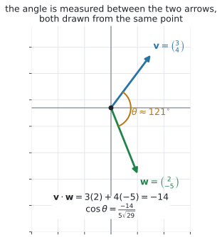
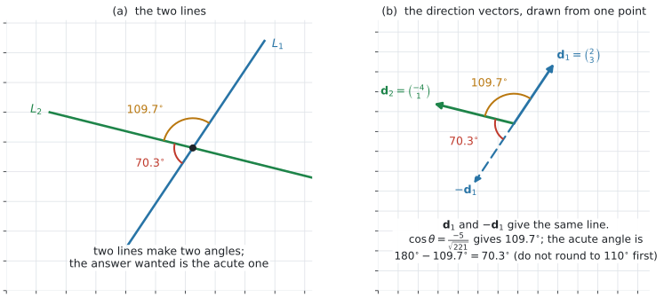
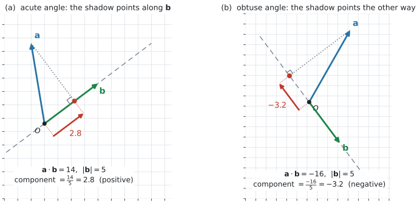

# AHL 3.13a — The scalar product（スカラー積） {#sec-ahl-3-13a}

::: {.callout-note}
## What you should be able to do
- **scalar product**（スカラー積、内積）$\mathbf{v} \cdot \mathbf{w}$ を、**成分から**計算できる（$2$ 次元でも $3$ 次元でも）。
- 答えが **vector**（ベクトル）ではなく **scalar**（スカラー、ただの数）であることが言える。
- もう $1$ つの形 $\mathbf{v} \cdot \mathbf{w} = \lvert \mathbf{v} \rvert \lvert \mathbf{w} \rvert \cos\theta$ を使える。
- $2$ つのベクトルのあいだの角 $\theta$ を求められる。
- $\mathbf{v} \cdot \mathbf{w}$ の**符号**から、角が鋭角か直角か鈍角かを言える。
- **perpendicular**（垂直）かどうかを $\mathbf{v} \cdot \mathbf{w} = 0$ で判定できる。
- $2$ 直線のあいだの **acute angle**（鋭角）を、方向ベクトルから求められる。
- $\mathbf{a}$ の、$\mathbf{b}$ の向きの **component**（成分）$\dfrac{\mathbf{a} \cdot \mathbf{b}}{\lvert \mathbf{b} \rvert}$ を求められる。
:::

::: {.callout-important}
## 公式集の AHL 3.13 の欄
このページで使うのは、上の $3$ 行です。

| 見出し | 式 |
|:--|:--|
| Scalar product | $\mathbf{v} \cdot \mathbf{w} = v_1w_1 + v_2w_2 + v_3w_3$ |
| | $\mathbf{v} \cdot \mathbf{w} = \lvert \mathbf{v} \rvert \lvert \mathbf{w} \rvert \cos\theta$ |
| Angle between two vectors | $\cos\theta = \dfrac{v_1w_1 + v_2w_2 + v_3w_3}{\lvert \mathbf{v} \rvert \lvert \mathbf{w} \rvert}$ |

: 公式集にあるもの {#tbl-ahl313a-booklet}

残りの $3$ 行（vector product、$\lvert \mathbf{v} \times \mathbf{w} \rvert$、平行四辺形の面積）は [AHL 3.13b](ahl-3-13b.qmd) で使います。

**$\dfrac{\mathbf{a} \cdot \mathbf{b}}{\lvert \mathbf{b} \rvert}$（$\mathbf{b}$ の向きの成分）は、公式集にありません。** シラバスの Guidance 欄にだけ書かれています。ただし、**上の $2$ 行から $1$ 行で出せます**（[第8節](#component)）。
:::

::: {.callout-note}
## シラバスが、この項目に求めていること
AHL 3.13 の Content 欄のうち、このページは次の $2$ 行です。

> Definition and calculation of the scalar product of two vectors.

> The angle between two vectors; the acute angle between two lines.

Guidance 欄のうち、角についての行は次の $1$ 行です。

> Calculate the angle between two vectors using $\mathbf{v} \cdot \mathbf{w} = \lvert \mathbf{v} \rvert \lvert \mathbf{w} \rvert \cos\theta$, where $\theta$ is the angle between two **non-zero** vectors $\mathbf{v}$ and $\mathbf{w}$, and ascertain whether the vectors are perpendicular ($\mathbf{v} \cdot \mathbf{w} = 0$).

**`non-zero` が明記されています。** $\mathbf{0}$ は向きを持たないので、角を考えられません（[AHL 3.10a 第8節](ahl-3-10a.qmd#zero)）。このページでは、そこを何度か確かめます。

Content 欄の `Components of vectors.` の行のうち、**$\mathbf{b}$ の向きの成分**が [第8節](#component) です。

> The component of vector $\mathbf{a}$ acting in the direction of vector $\mathbf{b}$ is $\dfrac{\mathbf{a} \cdot \mathbf{b}}{\lvert \mathbf{b} \rvert} = \lvert \mathbf{a} \rvert \cos\theta$.

**$\mathbf{b}$ に垂直な向きの成分**は $\times$ を使うので、[AHL 3.13b](ahl-3-13b.qmd) に回します。

また、Guidance にはこう書かれています。

> **Not required:** generalized properties and proofs of scalar and cross product.

**証明は問われません。** ですから [Why it works](#why-it-works) は、読まなくても解けます。「なぜ成分をかけて足すと角が出るのか」が気になったときだけ開いてください。
:::

## The idea

### 1. scalar product の答えは、ベクトルではなく「数」です {#idea}

$2$ つのベクトルから、**$1$ つの数**を作ります。**成分どうしをかけて、足す**だけです。

$$
\mathbf{v} \cdot \mathbf{w} = v_1w_1 + v_2w_2
$$ {#eq-ahl313a-dot2}

$\mathbf{v} = \begin{pmatrix} 3 \\ 4 \end{pmatrix}$、$\mathbf{w} = \begin{pmatrix} 2 \\ -5 \end{pmatrix}$ なら

$$
\mathbf{v} \cdot \mathbf{w} = 3(2) + 4(-5) = 6 - 20 = -14
$$

{#fig-ahl313a-idea width=100%}

::: {.callout-important}
## 答えは scalar です。矢印ではありません
$\mathbf{v} \cdot \mathbf{w} = -14$ であって、$\begin{pmatrix} 6 \\ -20 \end{pmatrix}$ ではありません。

**足すのを忘れる**のが、いちばん多い誤りです（[Common errors](#common-errors)）。

答えに $\begin{pmatrix} \ \end{pmatrix}$ を書いていたら、その時点で間違いです。**$\mathbf{v} \cdot \mathbf{w}$ は「気温」と同じ、ただの数**です。負にもなります。
:::

読み方は **dot product**（ドット積）とも言います。**同じもの**です。$\cdot$ を落とさないでください。$\mathbf{v}\mathbf{w}$ という書き方はしません。

### 2. $3$ 次元でも、まったく同じです {#three-d}

公式集は、はじめから $3$ 成分で書かれています。

$$
\mathbf{v} \cdot \mathbf{w} = v_1w_1 + v_2w_2 + v_3w_3, \qquad
\mathbf{v} = \begin{pmatrix} v_1 \\ v_2 \\ v_3 \end{pmatrix}, \quad
\mathbf{w} = \begin{pmatrix} w_1 \\ w_2 \\ w_3 \end{pmatrix}
$$ {#eq-ahl313a-dot}

**$2$ 次元は、$3$ つ目の項がないだけ**です。@eq-ahl313a-dot2 は @eq-ahl313a-dot の特別な場合です。

$\mathbf{p} = \begin{pmatrix} 1 \\ 2 \\ 2 \end{pmatrix}$、$\mathbf{q} = \begin{pmatrix} 4 \\ 0 \\ -3 \end{pmatrix}$ なら

$$
\mathbf{p} \cdot \mathbf{q} = 1(4) + 2(0) + 2(-3) = 4 + 0 - 6 = -2
$$

$\mathbf{i}$、$\mathbf{j}$、$\mathbf{k}$ の形で書かれていても同じです（[AHL 3.10a 第3節](ahl-3-10a.qmd#components)）。$(\mathbf{i} + 2\mathbf{j} + 2\mathbf{k}) \cdot (4\mathbf{i} - 3\mathbf{k})$ も $-2$ です。

::: {.callout-warning}
## 成分の数が違うベクトルどうしでは、計算できません
$2$ 成分のベクトルと $3$ 成分のベクトルの scalar product は、定義されていません。

$3$ 次元の問題で $\begin{pmatrix} 3 \\ 4 \end{pmatrix}$ が出てきたら、それは**平面上の話**か、**$z$ 成分の書き落とし**です。問題文に戻ってください。
:::

### 3. もう $1$ つの形 — $\lvert \mathbf{v} \rvert \lvert \mathbf{w} \rvert \cos\theta$ {#two-forms}

公式集の $2$ 行目です。

$$
\mathbf{v} \cdot \mathbf{w} = \lvert \mathbf{v} \rvert \lvert \mathbf{w} \rvert \cos\theta
$$ {#eq-ahl313a-geom}

ここで $\theta$ は、**$\mathbf{v}$ と $\mathbf{w}$ を同じ点から描いたときの、あいだの角**です（@fig-ahl313a-idea の (a)）。

**$\mathbf{v} \neq \mathbf{0}$、$\mathbf{w} \neq \mathbf{0}$ のときだけ**、$\theta$ が決まります。シラバスが `non-zero` と書いているのは、このためです。

::: {.callout-important}
## $2$ つの形は、同じ数の $2$ 通りの書き方です
- **成分が与えられている** … @eq-ahl313a-dot で計算する
- **大きさと角が与えられている** … @eq-ahl313a-geom で計算する

$\lvert \mathbf{v} \rvert = 6$、$\lvert \mathbf{w} \rvert = 4$、$\theta = 60^{\circ}$ なら、成分を知らなくても

$$
\mathbf{v} \cdot \mathbf{w} = 6 \times 4 \times \cos 60^{\circ} = 24 \times \tfrac{1}{2} = 12
$$

**どちらを使うかは、与えられているもので決まります**（[第9節](#facts)）。
:::

$\theta$ は $0^{\circ}$ 以上 $180^{\circ}$ 以下で測ります。**$2$ 本の矢印のあいだの角は、この範囲で $1$ つに決まります。**

### 4. 角を出す {#angle}

@eq-ahl313a-geom を $\cos\theta$ について解いたものが、公式集の $3$ 行目です。

$$
\cos\theta = \frac{\mathbf{v} \cdot \mathbf{w}}{\lvert \mathbf{v} \rvert \lvert \mathbf{w} \rvert} = \frac{v_1w_1 + v_2w_2 + v_3w_3}{\lvert \mathbf{v} \rvert \lvert \mathbf{w} \rvert}
$$ {#eq-ahl313a-cos}

手順は $3$ つです。

| 手順 | すること |
|:--|:--|
| $1$ | $\mathbf{v} \cdot \mathbf{w}$ を出す |
| $2$ | $\lvert \mathbf{v} \rvert$ と $\lvert \mathbf{w} \rvert$ を出す（[AHL 3.10b 第1節](ahl-3-10b.qmd#magnitude)） |
| $3$ | 割って $\cos^{-1}$ を取る |

: 角を出す手順 {#tbl-ahl313a-steps}

さきほどの $\mathbf{v} = \begin{pmatrix} 3 \\ 4 \end{pmatrix}$、$\mathbf{w} = \begin{pmatrix} 2 \\ -5 \end{pmatrix}$ なら

$$
\cos\theta = \frac{-14}{5\sqrt{29}} = -0.51994\ldots, \qquad \theta = 121.32\ldots^{\circ}
$$

::: {.callout-warning}
## 途中で丸めないでください
$\cos\theta$ を $-0.5$ に丸めてから $\cos^{-1}$ を取ると、ちょうど $120^{\circ}$ が出ます。正しい $121^{\circ}$ と合いません。

**電卓の中に入れたまま、最後に $1$ 回だけ丸めてください。**

$121.32\ldots$ を**有効数字 $3$ 桁**にすると $121^{\circ}$ です。$3$ 桁の角では、**小数点以下が消えます**。指示が `to 3 significant figures` なら、それで正しい答えです。
:::

::: {.callout-important}
## 角の単位は、問題文で確かめてください
AHL Topic 3 の冒頭には `On HL examination papers radian measure should be assumed unless otherwise indicated.` とあります。

ただし、**$2$ ベクトルや $2$ 直線のなす角は、度で聞かれることが多い**項目です。問題文に $^{\circ}$ が出ていれば度、`in radians` とあれば radian（弧度法。[AHL 3.7](ahl-3-7.qmd#which)）です。

**電卓の Document Settings が、その単位になっているかも確かめてください**（[GDC 第3節](#gdc-angle)）。
:::

### 5. 符号だけで、角の種類が分かります（$\mathbf{0}$ でないとき） {#sign}

$\mathbf{v}$ と $\mathbf{w}$ が $\mathbf{0}$ でなければ $\lvert \mathbf{v} \rvert > 0$、$\lvert \mathbf{w} \rvert > 0$ なので、@eq-ahl313a-geom の**符号を決めるのは $\cos\theta$ だけ**です。

| $\mathbf{v} \cdot \mathbf{w}$ | $\cos\theta$ | $\theta$ |
|:--|:--|:--|
| 正 | 正 | **acute angle**（鋭角）。$0^{\circ} < \theta < 90^{\circ}$（$\theta = 0^{\circ}$、つまり同じ向きも正になります） |
| $0$ | $0$ | $\theta = 90^{\circ}$ |
| 負 | 負 | **obtuse angle**（鈍角）。$90^{\circ} < \theta < 180^{\circ}$（$\theta = 180^{\circ}$、つまり反対向きも負になります） |

: 符号から分かること（$\mathbf{v}$、$\mathbf{w}$ はどちらも $\mathbf{0}$ でないとき） {#tbl-ahl313a-sign}

@fig-ahl313a-idea の (b) が、その $3$ つです。

**計算の見当を付けるのに使えます。** 図で見て鈍角なのに $\mathbf{v} \cdot \mathbf{w}$ が正になったら、どこかで符号を間違えています。

### 6. 垂直かどうかは、$0$ かどうかで決まります {#perpendicular}

$$
\mathbf{v} \perp \mathbf{w} \iff \mathbf{v} \cdot \mathbf{w} = 0 \qquad (\mathbf{v} \neq \mathbf{0},\ \mathbf{w} \neq \mathbf{0})
$$ {#eq-ahl313a-perp}

**大きさを出す必要はありません。** $\mathbf{v} \cdot \mathbf{w}$ が $0$ かどうかだけ見ます。

$\begin{pmatrix} 6 \\ 3 \end{pmatrix} \cdot \begin{pmatrix} -1 \\ 2 \end{pmatrix} = -6 + 6 = 0$ なので、この $2$ 本は垂直です。

::: {.callout-warning}
## $\mathbf{0}$ を入れると、この同値は崩れます
$\mathbf{0} \cdot \mathbf{w} = 0$ は、どんな $\mathbf{w}$ についても成り立ちます。

けれども $\mathbf{0}$ は**向きを持たない**ので、「$\mathbf{0}$ は $\mathbf{w}$ に垂直だ」とは言いません（[AHL 3.10a 第8節](ahl-3-10a.qmd#zero)）。

$\iff$ が使えるのは、**両方とも $\mathbf{0}$ でないとき**だけです。文字が入った問題では、**求めた値でベクトルが $\mathbf{0}$ になっていないか**を見てください。
:::

$\perp$ を含む問題は、たいてい**未知の文字を決める**形で出ます。$\mathbf{v} \cdot \mathbf{w} = 0$ を**方程式として解く**わけです（演習 $5$）。

### 7. $2$ 直線のあいだの acute angle {#lines}

シラバスは `the acute angle between two lines` と書いています。**直線どうし**のときは、少し注意が要ります。

{#fig-ahl313a-lines width=100%}

**直線には、向きが $2$ 通りあります。** $\mathbf{d}$ でも $-\mathbf{d}$ でも、同じ直線を表します（[AHL 3.11 第3節](ahl-3-11.qmd#not-unique)）。ですから、方向ベクトルから出した角は、**どちらを選んだかで $\theta$ にも $180^{\circ} - \theta$ にもなります**（@fig-ahl313a-lines の (b)）。

$$
\text{$2$ 直線のあいだの acute angle} = \begin{cases} \theta & (\theta \leq 90^{\circ}) \\[2pt] 180^{\circ} - \theta & (\theta > 90^{\circ}) \end{cases}
$$ {#eq-ahl313a-lines}

ここで $\theta$ は、$2$ 本の**方向ベクトル**のあいだの角です。

@fig-ahl313a-lines は $\mathbf{d}_1 = \begin{pmatrix} 2 \\ 3 \end{pmatrix}$、$\mathbf{d}_2 = \begin{pmatrix} -4 \\ 1 \end{pmatrix}$ の場合です。

$$
\cos\theta = \frac{-5}{\sqrt{13}\sqrt{17}} = \frac{-5}{\sqrt{221}}, \qquad \theta = 109.65\ldots^{\circ}
$$

$90^{\circ}$ より大きいので、$180^{\circ} - 109.65\ldots^{\circ} = 70.34\ldots^{\circ}$、すなわち $70.3^{\circ}$ が答えです。

::: {.callout-warning}
## 引き算の前に、丸めないでください
$109.65\ldots^{\circ}$ を先に $110^{\circ}$ に丸めてしまうと、$180^{\circ} - 110^{\circ} = 70^{\circ}$ になり、正しい $70.3^{\circ}$ と合いません。

**丸めるのは、いちばん最後の $1$ 回だけ**です（[第4節](#angle)）。
:::

::: {.callout-important}
## $\lvert \cos\theta \rvert$ を使えば、$1$ 行で済みます
はじめから絶対値を取れば、場合分けが要りません。

$$
\cos(\text{acute angle}) = \frac{\lvert \mathbf{d}_1 \cdot \mathbf{d}_2 \rvert}{\lvert \mathbf{d}_1 \rvert \lvert \mathbf{d}_2 \rvert}
$$

上の例なら $\dfrac{5}{\sqrt{221}}$ から、直に $70.3^{\circ}$ が出ます。

**境目では、鋭角にはなりません。** 垂直なら $90^{\circ}$、平行なら $0^{\circ}$ が返ります（このすぐ下の $2$ つ）。

**この形は公式集にありません。** 使うのは構いませんが、答案には $\mathbf{d}_1 \cdot \mathbf{d}_2$ の値と $\lvert \mathbf{d}_1 \rvert$、$\lvert \mathbf{d}_2 \rvert$ を書いてください。
:::

境目の $2$ つは、次のとおりです。

- **$\theta = 90^{\circ}$ のとき** … $2$ 直線は垂直で、答えは $90^{\circ}$ です。鋭角ではありませんが、$2$ 直線のなす角としてはこれ $1$ つに決まります
- **$\mathbf{d}_1$ と $\mathbf{d}_2$ が平行のとき** … $2$ 直線は平行（または同じ直線）で、なす角は $0^{\circ}$ です（[AHL 3.11 第8節](ahl-3-11.qmd#parallel)）

::: {.callout-important}
## $2$ 直線が交わらなくても、角は決まります
$3$ 次元では、平行でも交わりもしない **skew**（ねじれの位置の）直線があります（[AHL 3.11 第7節](ahl-3-11.qmd#three-d)）。

それでも、**方向ベクトルのあいだの角は計算できます。** @eq-ahl313a-lines は交点があるかどうかによりません。

**通る点 $\mathbf{a}$ は、角には関係しません。** 使うのは方向ベクトルだけです。
:::

### 8. $\mathbf{b}$ の向きの成分 {#component}

シラバスの Guidance が求めているのは、次の $1$ 本です。

$$
\text{$\mathbf{a}$ の、$\mathbf{b}$ の向きの component} = \frac{\mathbf{a} \cdot \mathbf{b}}{\lvert \mathbf{b} \rvert} = \lvert \mathbf{a} \rvert \cos\theta \qquad (\mathbf{b} \neq \mathbf{0})
$$ {#eq-ahl313a-comp}

右の形 $\lvert \mathbf{a} \rvert \cos\theta$ は、$\mathbf{a} \neq \mathbf{0}$ のときに使えます（$\theta$ が決まるため）。

{#fig-ahl313a-component width=100%}

@fig-ahl313a-component が、その意味です。**$\mathbf{b}$ の線の上に、$\mathbf{a}$ の影を落としたときの長さ**にあたります。

::: {.callout-warning}
## ここでの「成分」は、縦に並んだ数のことではありません
[第1節](#idea) までの **component**（成分）は、$\begin{pmatrix} 4 \\ 7 \end{pmatrix}$ の $4$ や $7$、つまり**座標軸の向きの成分**でした。

ここでの成分は、**$\mathbf{b}$ という好きな向きに取った成分**です。$\mathbf{b} = \begin{pmatrix} 1 \\ 0 \end{pmatrix}$ を選べば、$\dfrac{\mathbf{a} \cdot \mathbf{b}}{\lvert \mathbf{b} \rvert} = 4$ で、$1$ 行目の成分に戻ります。**軸の向きは、選べる向きの $1$ つ**というわけです。
:::

::: {.callout-important}
## これも scalar です。しかも符号が付きます
- **正** … $\theta$ が鋭角。影は $\mathbf{b}$ と**同じ向き**に伸びます（@fig-ahl313a-component の (a)）
- **$0$** … $\mathbf{a} \perp \mathbf{b}$。影の長さが $0$
- **負** … $\theta$ が鈍角。影は $\mathbf{b}$ と**反対向き**に伸びます（@fig-ahl313a-component の (b)）

**負になったら、それが答えです。** 絶対値を取らないでください。符号が「どちら向きか」を伝えています。
:::

::: {.callout-warning}
## $\lvert \mathbf{b} \rvert$ で割ります。$\lvert \mathbf{a} \rvert$ ではありません
「$\mathbf{a}$ の、$\mathbf{b}$ の向きの成分」なので、**割るのは向きを与えるほう**、つまり $\lvert \mathbf{b} \rvert$ です。

$\dfrac{\mathbf{a} \cdot \mathbf{b}}{\lvert \mathbf{b} \rvert}$ と $\dfrac{\mathbf{a} \cdot \mathbf{b}}{\lvert \mathbf{a} \rvert}$ は、**別の数**です（@exm-ahl313a-component）。

英語では `the component of` のあとが $\mathbf{a}$、`in the direction of` のあとが $\mathbf{b}$ です。**割るのは、`in the direction of` のほう**と覚えてください。
:::

$\mathbf{a} \cdot \mathbf{b}$ そのものではなく、$\lvert \mathbf{b} \rvert$ で割ることに注意してください。$\mathbf{b}$ を単位ベクトル（[AHL 3.10b 第6節](ahl-3-10b.qmd#unit)）に直してから内積を取っている、と見ることもできます。

$$
\frac{\mathbf{a} \cdot \mathbf{b}}{\lvert \mathbf{b} \rvert} = \mathbf{a} \cdot \hat{\mathbf{b}}, \qquad \hat{\mathbf{b}} = \frac{\mathbf{b}}{\lvert \mathbf{b} \rvert}
$$

### 9. 使ってよい事実と、形の選び方 {#facts}

**証明は問われません**が、次の $3$ つは計算で使います。

$$
\mathbf{v} \cdot \mathbf{w} = \mathbf{w} \cdot \mathbf{v}, \qquad
\mathbf{v} \cdot \mathbf{v} = \lvert \mathbf{v} \rvert^2, \qquad
(k\mathbf{v}) \cdot \mathbf{w} = k(\mathbf{v} \cdot \mathbf{w})
$$ {#eq-ahl313a-facts}

$2$ つ目は、$\theta = 0$ を @eq-ahl313a-geom に入れれば出ます。[AHL 3.10b](ahl-3-10b.qmd#gdc-dotp) で $\lvert \mathbf{v} \rvert$ を `√(dotP(v,v))` と書いたのは、この事実によるものです。

$3$ つ目から、**$\mathbf{d}$ を $-\mathbf{d}$ に変えると内積の符号が変わる**ことが出ます。[第7節](#lines) で $\theta$ が $180^{\circ} - \theta$ に変わったのは、これが理由です。

どの形を使うかは、**与えられているもの**で決まります。

| 与えられているもの | 使う形 |
|:--|:--|
| 両方の成分 | @eq-ahl313a-dot（かけて足す） |
| 両方の大きさと、あいだの角 | @eq-ahl313a-geom |
| 成分と、「角を求めよ」 | @eq-ahl313a-cos |
| 成分と、「垂直か」 | @eq-ahl313a-perp（大きさは不要） |
| $2$ 直線と、「acute angle を求めよ」 | @eq-ahl313a-lines（方向ベクトルだけ） |
| 成分と、「$\mathbf{b}$ の向きの成分」 | @eq-ahl313a-comp |

: 何が与えられたら、どれを使うか {#tbl-ahl313a-which}

## Why it works

**なぜ「成分をかけて足す」と、角の情報が出てくるのか。**

$\mathbf{v}$ と $\mathbf{w}$ を同じ点から描き、先端どうしを結びます。その $3$ 本目が $\mathbf{v} - \mathbf{w}$ です（[AHL 3.10a 第6節](ahl-3-10a.qmd#subtract)）。この三角形に **cosine rule**（余弦定理）を当てると

$$
\lvert \mathbf{v} - \mathbf{w} \rvert^2 = \lvert \mathbf{v} \rvert^2 + \lvert \mathbf{w} \rvert^2 - 2\lvert \mathbf{v} \rvert \lvert \mathbf{w} \rvert \cos\theta
$$

一方、左辺を成分で展開すると（$2$ 次元で書きます）

$$
\lvert \mathbf{v} - \mathbf{w} \rvert^2 = (v_1-w_1)^2 + (v_2-w_2)^2 = \lvert \mathbf{v} \rvert^2 + \lvert \mathbf{w} \rvert^2 - 2(v_1w_1 + v_2w_2)
$$

$2$ つを見くらべて $\lvert \mathbf{v} \rvert^2 + \lvert \mathbf{w} \rvert^2$ を消すと

$$
v_1w_1 + v_2w_2 = \lvert \mathbf{v} \rvert \lvert \mathbf{w} \rvert \cos\theta
$$

**$2$ つの形が同じ数だ**と分かります。$3$ 次元でも、項が $1$ つ増えるだけで同じです。

（$\mathbf{v}$ と $\mathbf{w}$ が同じ向きや反対向きだと三角形がつぶれますが、そのときは $\cos\theta = \pm 1$ を直に入れれば確かめられます。一般の証明はシラバスの `Not required` です。）

**なぜ $\mathbf{v} \cdot \mathbf{w} = 0$ が垂直と同じことなのか。**

$\lvert \mathbf{v} \rvert > 0$、$\lvert \mathbf{w} \rvert > 0$ のとき、$\lvert \mathbf{v} \rvert \lvert \mathbf{w} \rvert \cos\theta = 0$ になるのは $\cos\theta = 0$ のときだけです。$0^{\circ} \leq \theta \leq 180^{\circ}$ でそうなるのは $\theta = 90^{\circ}$ だけなので、垂直と同じことになります。

**どちらかが $\mathbf{0}$ だと、$\lvert \mathbf{v} \rvert \lvert \mathbf{w} \rvert = 0$ になり、$\cos\theta$ が何であっても積が $0$** です。角の情報がまったく出てきません。これが、シラバスが `non-zero` と断っている理由です。

**なぜ直線では acute angle を取るのか。**

$\mathbf{d}$ と $-\mathbf{d}$ は同じ直線を表します。@eq-ahl313a-facts の $3$ つ目で $k = -1$ とすると

$$
(-\mathbf{d}_1) \cdot \mathbf{d}_2 = -(\mathbf{d}_1 \cdot \mathbf{d}_2)
$$

大きさは $\lvert -\mathbf{d}_1 \rvert = \lvert \mathbf{d}_1 \rvert$ で変わらないので、$\cos\theta$ の**符号だけ**がひっくり返ります。$\cos(180^{\circ} - \theta) = -\cos\theta$（[AHL 3.8 の Why it works](ahl-3-8.qmd#why-it-works)）なので、角は $180^{\circ} - \theta$ になります。

**つまり、方向ベクトルの選び方で $\theta$ と $180^{\circ} - \theta$ の $2$ つが出てしまう**わけです。どちらを選んでも同じ答えになるように、「鋭角のほう」と決めているのです。

**なぜ $\mathbf{b}$ の向きの成分が $\dfrac{\mathbf{a} \cdot \mathbf{b}}{\lvert \mathbf{b} \rvert}$ なのか。**

@eq-ahl313a-geom を $\lvert \mathbf{b} \rvert$ で割るだけです。

$$
\frac{\mathbf{a} \cdot \mathbf{b}}{\lvert \mathbf{b} \rvert} = \frac{\lvert \mathbf{a} \rvert \lvert \mathbf{b} \rvert \cos\theta}{\lvert \mathbf{b} \rvert} = \lvert \mathbf{a} \rvert \cos\theta
$$

$\lvert \mathbf{a} \rvert \cos\theta$ は、直角三角形の**底辺の長さ**にあたります（@fig-ahl313a-component）。$\theta$ が鈍角なら $\cos\theta < 0$ なので、この数は負になり、影が反対側に落ちていることを表します。

## Worked examples

::: {.callout-note appearance="simple"}
問題文は英語です。意味が理解できなかったら、問題文の下の「**日本語訳**」を開いてください。解説は日本語です。
:::

::: {#exm-ahl313a-dot}
[Let $\mathbf{v} = \begin{pmatrix} 3 \\ 4 \end{pmatrix}$, $\mathbf{w} = \begin{pmatrix} 2 \\ -5 \end{pmatrix}$, $\mathbf{p} = \begin{pmatrix} 1 \\ 2 \\ 2 \end{pmatrix}$ and $\mathbf{q} = \begin{pmatrix} 4 \\ 0 \\ -3 \end{pmatrix}$.]{.q-en}

**(a)** [Find $\mathbf{v} \cdot \mathbf{w}$.]{.q-en}

**(b)** [Find $\mathbf{p} \cdot \mathbf{q}$.]{.q-en}

**(c)** [Show that $\begin{pmatrix} 6 \\ 3 \end{pmatrix}$ and $\begin{pmatrix} -1 \\ 2 \end{pmatrix}$ are perpendicular.]{.q-en}

**(d)** [Find $\mathbf{p} \cdot \mathbf{p}$ and hence write down $\lvert \mathbf{p} \rvert$.]{.q-en}

<details class="jp-trans">
<summary>日本語訳</summary>

$\mathbf{v} = \begin{pmatrix} 3 \\ 4 \end{pmatrix}$、$\mathbf{w} = \begin{pmatrix} 2 \\ -5 \end{pmatrix}$、$\mathbf{p} = \begin{pmatrix} 1 \\ 2 \\ 2 \end{pmatrix}$、$\mathbf{q} = \begin{pmatrix} 4 \\ 0 \\ -3 \end{pmatrix}$ とします。

**(a)** $\mathbf{v} \cdot \mathbf{w}$ を求めなさい。

**(b)** $\mathbf{p} \cdot \mathbf{q}$ を求めなさい。

**(c)** $\begin{pmatrix} 6 \\ 3 \end{pmatrix}$ と $\begin{pmatrix} -1 \\ 2 \end{pmatrix}$ が垂直であることを示しなさい。

**(d)** $\mathbf{p} \cdot \mathbf{p}$ を求め、そこから $\lvert \mathbf{p} \rvert$ を書きなさい。

</details>

---

**(a)** 成分どうしをかけて、足します（@eq-ahl313a-dot2）。

$$
\mathbf{v} \cdot \mathbf{w} = 3(2) + 4(-5) = 6 - 20 = -14
$$

**(b)** $3$ 成分でも同じです（@eq-ahl313a-dot）。

$$
\mathbf{p} \cdot \mathbf{q} = 1(4) + 2(0) + 2(-3) = 4 + 0 - 6 = -2
$$

**$0$ になる項も、書いておいてください。** 飛ばすと、成分の対応がずれます。

**(c)** `Show that` なので、**$0$ になることを計算で見せます**（@eq-ahl313a-perp）。

$$
\begin{pmatrix} 6 \\ 3 \end{pmatrix} \cdot \begin{pmatrix} -1 \\ 2 \end{pmatrix} = 6(-1) + 3(2) = -6 + 6 = 0
$$

どちらも $\mathbf{0}$ ではないので、$2$ 本は垂直です。**大きさは要りません。**

**(d)** 自分自身との内積です（@eq-ahl313a-facts）。

$$
\mathbf{p} \cdot \mathbf{p} = 1 + 4 + 4 = 9, \qquad \lvert \mathbf{p} \rvert = \sqrt{9} = 3
$$

**検算（(a) について）。** $\mathbf{w} \cdot \mathbf{v}$ を、**順番を入れかえて**出し直します（@eq-ahl313a-facts）。

$$
\mathbf{w} \cdot \mathbf{v} = 2(3) + (-5)(4) = 6 - 20 = -14
$$

同じです ✓ さらに、$\mathbf{v}$ は右上、$\mathbf{w}$ は右下を向いているので、図から角は鈍角のはずです。**負になっていて合っています**（@tbl-ahl313a-sign）。**符号を落として $+14$ としていたら、この向きの見立てと食い違います。**

**検算（(d) について）。** **成分を $2$ つだけ取った長さ**が、下からの目安になります。$\mathbf{p}$ の後ろ $2$ 成分だけで $\sqrt{2^2+2^2} = 2.83$ なので、$\lvert \mathbf{p} \rvert$ はこれ以上のはずです。$3 \geq 2.83$ ✓ **$\mathbf{p} \cdot \mathbf{p}$ を $1+2+2 = 5$ と、かけ算をせずに出していたら $\lvert \mathbf{p} \rvert = \sqrt{5} = 2.24$ になり、$2.83$ より小さくなって合いません。**

::: {.callout-note}
## 解答例（答案用紙にはこう書く）
**(a)**
$$\mathbf{v} \cdot \mathbf{w} = 3(2)+4(-5) = -14$$

**(b)**
$$\mathbf{p} \cdot \mathbf{q} = 1(4)+2(0)+2(-3) = -2$$

**(c)**
$$\begin{pmatrix} 6 \\ 3 \end{pmatrix} \cdot \begin{pmatrix} -1 \\ 2 \end{pmatrix} = -6+6 = 0$$
*Both vectors are non-zero and their scalar product is $0$, so they are perpendicular.*

**(d)**
$$\mathbf{p} \cdot \mathbf{p} = 9, \qquad \lvert \mathbf{p} \rvert = 3$$
:::
:::

::: {#exm-ahl313a-angle}
[Let $\mathbf{v} = \begin{pmatrix} 3 \\ 4 \end{pmatrix}$ and $\mathbf{w} = \begin{pmatrix} 2 \\ -5 \end{pmatrix}$, and let $\mathbf{p} = \begin{pmatrix} 1 \\ 2 \\ 2 \end{pmatrix}$ and $\mathbf{q} = \begin{pmatrix} 4 \\ 0 \\ -3 \end{pmatrix}$.]{.q-en}

**(a)** [Find the angle between $\mathbf{v}$ and $\mathbf{w}$, giving your answer in degrees to $3$ significant figures.]{.q-en}

**(b)** [Find the angle between $\mathbf{p}$ and $\mathbf{q}$, giving your answer in degrees to $3$ significant figures.]{.q-en}

**(c)** [State what the sign of a scalar product tells you about the angle between two non-zero vectors, and explain why.]{.q-en}

<details class="jp-trans">
<summary>日本語訳</summary>

$\mathbf{v} = \begin{pmatrix} 3 \\ 4 \end{pmatrix}$、$\mathbf{w} = \begin{pmatrix} 2 \\ -5 \end{pmatrix}$ とし、$\mathbf{p} = \begin{pmatrix} 1 \\ 2 \\ 2 \end{pmatrix}$、$\mathbf{q} = \begin{pmatrix} 4 \\ 0 \\ -3 \end{pmatrix}$ とします。

**(a)** $\mathbf{v}$ と $\mathbf{w}$ のあいだの角を、度で、有効数字 $3$ 桁で求めなさい。

**(b)** $\mathbf{p}$ と $\mathbf{q}$ のあいだの角を、度で、有効数字 $3$ 桁で求めなさい。

**(c)** $\mathbf{0}$ でない $2$ つのベクトルについて、scalar product の符号が角について何を伝えるかを述べ、その理由を説明しなさい。

</details>

---

**(a)** @tbl-ahl313a-steps の順です。内積は @exm-ahl313a-dot で $-14$ でした。

$$
\lvert \mathbf{v} \rvert = \sqrt{9+16} = 5, \qquad \lvert \mathbf{w} \rvert = \sqrt{4+25} = \sqrt{29}
$$

$$
\cos\theta = \frac{-14}{5\sqrt{29}} = -0.51994\ldots, \qquad \theta = 121.32\ldots^{\circ}
$$

有効数字 $3$ 桁で $\theta = 121^{\circ}$ です。**$3$ 桁なので、小数点以下は残りません。**

**(b)** $\mathbf{p} \cdot \mathbf{q} = -2$、$\lvert \mathbf{p} \rvert = 3$、$\lvert \mathbf{q} \rvert = \sqrt{16+0+9} = 5$ でした。

$$
\cos\theta = \frac{-2}{15} = -0.1333\ldots, \qquad \theta = 97.66\ldots^{\circ} \approx 97.7^{\circ}
$$

**(c)** `explain why` なので、英語で理由を書きます。

::: {.model-answer}
**試験ではこう書く**

*Since $\mathbf{v} \cdot \mathbf{w} = \lvert \mathbf{v} \rvert \lvert \mathbf{w} \rvert \cos\theta$ and both magnitudes are positive for non-zero vectors, the sign of $\mathbf{v} \cdot \mathbf{w}$ is the sign of $\cos\theta$. For $0^{\circ} \leq \theta \leq 180^{\circ}$, $\cos\theta$ is positive when $\theta < 90^{\circ}$, zero when $\theta = 90^{\circ}$ and negative when $\theta > 90^{\circ}$. So a positive scalar product means an acute angle, zero means the vectors are perpendicular, and a negative value means an obtuse angle. Both parts above give negative values, which matches the angles $121^{\circ}$ and $97.7^{\circ}$ found there.*
:::

（$\mathbf{v} \cdot \mathbf{w} = \lvert \mathbf{v} \rvert \lvert \mathbf{w} \rvert \cos\theta$ であり、$\mathbf{0}$ でないベクトルでは大きさが両方とも正なので、$\mathbf{v} \cdot \mathbf{w}$ の符号は $\cos\theta$ の符号と同じである。$0^{\circ} \leq \theta \leq 180^{\circ}$ では、$\cos\theta$ は $\theta < 90^{\circ}$ のとき正、$\theta = 90^{\circ}$ のとき $0$、$\theta > 90^{\circ}$ のとき負である。したがって内積が正なら鋭角、$0$ なら垂直、負なら鈍角である。上の $2$ 問はどちらも負で、そこで求めた $121^{\circ}$ と $97.7^{\circ}$ に合っている、という意味です。）

**検算（(a) について）。** 求めた角を @eq-ahl313a-geom に**戻して**、内積が再現するかを見ます。

$$
5 \times \sqrt{29} \times \cos 121.32\ldots^{\circ} = -14.0
$$

$-14$ に戻りました ✓ **$\lvert \mathbf{w} \rvert$ を $\sqrt{29}$ ではなく $29$ として $\theta = 95.5^{\circ}$ を出していたら、正しい $5\sqrt{29}$ で戻したとき $-2.60$ になり、$-14$ に戻りません。**

**検算（(b) について）。** $\cos\theta = -\dfrac{2}{15}$ は $0$ に近い負の数なので、角は $90^{\circ}$ を少し超えるはずです。$97.7^{\circ}$ はその範囲に入っています ✓ **符号を落として $+\dfrac{2}{15}$ としていたら $82.3^{\circ}$ になり、$90^{\circ}$ より小さくなってしまいます。**

::: {.callout-note}
## 解答例（答案用紙にはこう書く）
**(a)**
$$\cos\theta = \frac{3(2)+4(-5)}{5\sqrt{29}} = \frac{-14}{5\sqrt{29}}, \qquad \theta = 121^{\circ} \ (3 \text{ s.f.})$$

**(b)**
$$\cos\theta = \frac{-2}{3 \times 5} = -\frac{2}{15}, \qquad \theta = 97.7^{\circ} \ (3 \text{ s.f.})$$

**(c)**
*The magnitudes are positive, so $\mathbf{v} \cdot \mathbf{w}$ has the same sign as $\cos\theta$: positive gives an acute angle, zero gives $90^{\circ}$, negative gives an obtuse angle.*
:::
:::

::: {#exm-ahl313a-lines}
[Two lines are given by $L_1: \mathbf{r} = \begin{pmatrix} 1 \\ -2 \end{pmatrix} + \lambda\begin{pmatrix} 2 \\ 3 \end{pmatrix}$ and $L_2: \mathbf{r} = \begin{pmatrix} 9 \\ 3 \end{pmatrix} + \mu\begin{pmatrix} -4 \\ 1 \end{pmatrix}$.]{.q-en}

**(a)** [Find the angle between the two direction vectors, giving your answer in degrees to $1$ decimal place.]{.q-en}

**(b)** [Hence find the acute angle between $L_1$ and $L_2$, in degrees to $3$ significant figures.]{.q-en}

**(c)** [Two lines in three dimensions have direction vectors $\begin{pmatrix} 1 \\ 2 \\ 2 \end{pmatrix}$ and $\begin{pmatrix} 2 \\ -1 \\ 2 \end{pmatrix}$. Find the acute angle between them, in degrees to $3$ significant figures.]{.q-en}

**(d)** [Explain why the answer to (c) does not depend on which direction vector is chosen for each line.]{.q-en}

<details class="jp-trans">
<summary>日本語訳</summary>

$2$ 直線が $L_1: \mathbf{r} = \begin{pmatrix} 1 \\ -2 \end{pmatrix} + \lambda\begin{pmatrix} 2 \\ 3 \end{pmatrix}$、$L_2: \mathbf{r} = \begin{pmatrix} 9 \\ 3 \end{pmatrix} + \mu\begin{pmatrix} -4 \\ 1 \end{pmatrix}$ で与えられています。

**(a)** $2$ つの方向ベクトルのあいだの角を、度で、小数第 $1$ 位まで求めなさい。

**(b)** そこから、$L_1$ と $L_2$ のあいだの鋭角を、度で、有効数字 $3$ 桁で求めなさい。

**(c)** $3$ 次元の $2$ 直線の方向ベクトルが $\begin{pmatrix} 1 \\ 2 \\ 2 \end{pmatrix}$ と $\begin{pmatrix} 2 \\ -1 \\ 2 \end{pmatrix}$ です。そのあいだの鋭角を、度で、有効数字 $3$ 桁で求めなさい。

**(d)** (c) の答えが、各直線についてどちらの方向ベクトルを選ぶかによらない理由を説明しなさい。

</details>

---

**(a)** 使うのは**方向ベクトルだけ**です。通る点 $\begin{pmatrix} 1 \\ -2 \end{pmatrix}$、$\begin{pmatrix} 9 \\ 3 \end{pmatrix}$ は使いません（[第7節](#lines)）。

$$
\mathbf{d}_1 \cdot \mathbf{d}_2 = 2(-4) + 3(1) = -8 + 3 = -5
$$

$$
\lvert \mathbf{d}_1 \rvert = \sqrt{4+9} = \sqrt{13}, \qquad \lvert \mathbf{d}_2 \rvert = \sqrt{16+1} = \sqrt{17}
$$

$$
\cos\theta = \frac{-5}{\sqrt{13}\sqrt{17}} = \frac{-5}{\sqrt{221}}, \qquad \theta = 109.65\ldots^{\circ} \approx 109.7^{\circ}
$$

**(b)** $\theta > 90^{\circ}$ なので、$180^{\circ}$ から引きます（@eq-ahl313a-lines）。

$$
180^{\circ} - 109.65\ldots^{\circ} = 70.34\ldots^{\circ} \approx 70.3^{\circ}
$$

**引くのは、丸める前の値からです。** $110^{\circ}$ から引くと $70^{\circ}$ になり、合いません。

**(c)** 同じ手順です。$3$ 成分になるだけです。

$$
\mathbf{d}_1 \cdot \mathbf{d}_2 = 1(2) + 2(-1) + 2(2) = 2 - 2 + 4 = 4
$$

$$
\lvert \mathbf{d}_1 \rvert = \sqrt{1+4+4} = 3, \qquad \lvert \mathbf{d}_2 \rvert = \sqrt{4+1+4} = 3
$$

$$
\cos\theta = \frac{4}{9} = 0.444\ldots, \qquad \theta = 63.61\ldots^{\circ} \approx 63.6^{\circ}
$$

**正なので、これがもう鋭角です。** $180^{\circ}$ から引く必要はありません。

**(d)** `Explain why` なので、英語で理由を書きます。

::: {.model-answer}
**試験ではこう書く**

*A line has two possible direction vectors, $\mathbf{d}$ and $-\mathbf{d}$. Replacing $\mathbf{d}_1$ by $-\mathbf{d}_1$ changes $\mathbf{d}_1 \cdot \mathbf{d}_2$ to $-(\mathbf{d}_1 \cdot \mathbf{d}_2)$ but leaves $\lvert \mathbf{d}_1 \rvert$ unchanged, so $\cos\theta$ changes sign and $\theta$ becomes $180^{\circ}-\theta$. The two possible answers are therefore $\theta$ and $180^{\circ}-\theta$, and exactly one of them is acute (unless the lines are perpendicular, when both are $90^{\circ}$). Taking the acute angle picks the same value whichever direction vectors are used.*
:::

（直線には方向ベクトルが $\mathbf{d}$ と $-\mathbf{d}$ の $2$ 通りある。$\mathbf{d}_1$ を $-\mathbf{d}_1$ に置き換えると $\mathbf{d}_1 \cdot \mathbf{d}_2$ は $-(\mathbf{d}_1 \cdot \mathbf{d}_2)$ になるが $\lvert \mathbf{d}_1 \rvert$ は変わらないので、$\cos\theta$ の符号が変わり、$\theta$ は $180^{\circ}-\theta$ になる。したがって出うる答えは $\theta$ と $180^{\circ}-\theta$ の $2$ つで、そのうち鋭角はちょうど $1$ つである（$2$ 直線が垂直のときだけは両方 $90^{\circ}$）。鋭角を取れば、どちらの方向ベクトルを使っても同じ値が選ばれる、という意味です。）

**検算（(b) について）。** $\mathbf{d}_1$ の代わりに $-\mathbf{d}_1 = \begin{pmatrix} -2 \\ -3 \end{pmatrix}$ を使って、**やり直します。**

$$
(-\mathbf{d}_1) \cdot \mathbf{d}_2 = (-2)(-4) + (-3)(1) = 8 - 3 = 5, \qquad \cos\theta = \frac{5}{\sqrt{221}}
$$

$\theta = 70.34\ldots^{\circ}$ で、(b) と同じ $70.3^{\circ}$ になりました ✓ **これは (a) の $109.7^{\circ}$ とは別の角なので、単に同じ計算を繰り返したことにはなりません。**

**検算（(c) について）。** $\cos\theta = \dfrac{4}{9}$ は $\dfrac{1}{2}$ より少し小さいので、角は $60^{\circ}$ より少し大きいはずです（$\cos 60^{\circ} = \dfrac{1}{2}$。[AHL 3.8 第4節](ahl-3-8.qmd#exact)）。$63.6^{\circ}$ はその範囲に入っています ✓ **$\lvert \mathbf{d}_1 \rvert \lvert \mathbf{d}_2 \rvert$ を $9$ ではなく $6$ としていたら $\cos\theta = 0.667$ で $48.2^{\circ}$ になり、$60^{\circ}$ より小さくなってしまいます。**

::: {.callout-note}
## 解答例（答案用紙にはこう書く）
**(a)**
$$\cos\theta = \frac{2(-4)+3(1)}{\sqrt{13}\sqrt{17}} = \frac{-5}{\sqrt{221}}, \qquad \theta = 109.7^{\circ}$$

**(b)**
$$180^{\circ} - 109.65\ldots^{\circ} = 70.3^{\circ} \ (3 \text{ s.f.})$$

**(c)**
$$\cos\theta = \frac{1(2)+2(-1)+2(2)}{3 \times 3} = \frac{4}{9}, \qquad \theta = 63.6^{\circ} \ (3 \text{ s.f.})$$

**(d)**
*Replacing $\mathbf{d}$ by $-\mathbf{d}$ reverses the sign of the scalar product, so $\theta$ becomes $180^{\circ}-\theta$; taking the acute angle gives the same value either way.*
:::
:::

::: {#exm-ahl313a-component}
[Let $\mathbf{a} = \begin{pmatrix} 4 \\ 7 \end{pmatrix}$ and $\mathbf{b} = \begin{pmatrix} 3 \\ -4 \end{pmatrix}$.]{.q-en}

**(a)** [Find the component of $\mathbf{a}$ acting in the direction of $\mathbf{b}$.]{.q-en}

**(b)** [Find the component of $\mathbf{b}$ acting in the direction of $\mathbf{a}$, giving your answer to $3$ significant figures.]{.q-en}

**(c)** [Find the component of $\begin{pmatrix} 6 \\ 2 \\ 3 \end{pmatrix}$ acting in the direction of $\begin{pmatrix} 2 \\ -1 \\ 2 \end{pmatrix}$.]{.q-en}

**(d)** [Explain what the sign of your answer to (a) means.]{.q-en}

<details class="jp-trans">
<summary>日本語訳</summary>

$\mathbf{a} = \begin{pmatrix} 4 \\ 7 \end{pmatrix}$、$\mathbf{b} = \begin{pmatrix} 3 \\ -4 \end{pmatrix}$ とします。

**(a)** $\mathbf{b}$ の向きにはたらく $\mathbf{a}$ の成分を求めなさい。

**(b)** $\mathbf{a}$ の向きにはたらく $\mathbf{b}$ の成分を、有効数字 $3$ 桁で求めなさい。

**(c)** $\begin{pmatrix} 2 \\ -1 \\ 2 \end{pmatrix}$ の向きにはたらく $\begin{pmatrix} 6 \\ 2 \\ 3 \end{pmatrix}$ の成分を求めなさい。

**(d)** (a) の答えの符号が何を意味するかを説明しなさい。

</details>

---

**(a)** @eq-ahl313a-comp です。**割るのは $\lvert \mathbf{b} \rvert$** です。

$$
\mathbf{a} \cdot \mathbf{b} = 4(3) + 7(-4) = 12 - 28 = -16, \qquad \lvert \mathbf{b} \rvert = \sqrt{9+16} = 5
$$

$$
\frac{\mathbf{a} \cdot \mathbf{b}}{\lvert \mathbf{b} \rvert} = \frac{-16}{5} = -3.2
$$

**(b)** 今度は $\lvert \mathbf{a} \rvert$ で割ります。**内積は同じ $-16$ です。**

$$
\lvert \mathbf{a} \rvert = \sqrt{16+49} = \sqrt{65}
$$

$$
\frac{\mathbf{a} \cdot \mathbf{b}}{\lvert \mathbf{a} \rvert} = \frac{-16}{\sqrt{65}} = -1.98\ldots \approx -1.98
$$

**(a) と違う数**になりました。**どちらの向きを聞かれているか**で、割る相手が変わります。

**(c)** $3$ 成分でも同じです。

$$
\begin{pmatrix} 6 \\ 2 \\ 3 \end{pmatrix} \cdot \begin{pmatrix} 2 \\ -1 \\ 2 \end{pmatrix} = 12 - 2 + 6 = 16, \qquad \left\lvert \begin{pmatrix} 2 \\ -1 \\ 2 \end{pmatrix} \right\rvert = \sqrt{4+1+4} = 3
$$

$$
\frac{16}{3} = 5.33\ldots
$$

**今度は正**です。$\theta$ が鋭角だということです。

**(d)** `Explain` なので、英語で意味を書きます。

::: {.model-answer}
**試験ではこう書く**

*The component is $\lvert \mathbf{a} \rvert \cos\theta$, and it is negative because $\theta$, the angle between $\mathbf{a}$ and $\mathbf{b}$, is obtuse: here $\cos\theta = \frac{-16}{5\sqrt{65}}$, giving $\theta = 113^{\circ}$. Geometrically, the projection of $\mathbf{a}$ onto the line of $\mathbf{b}$ lands on the opposite side of the starting point from $\mathbf{b}$ itself, so $\mathbf{a}$ has no part acting along $\mathbf{b}$; it has a part of size $3.2$ acting along $-\mathbf{b}$. The value $-3.2$ is a scalar, not a vector, and the minus sign is part of the answer.*
:::

（この成分は $\lvert \mathbf{a} \rvert \cos\theta$ であり、$\mathbf{a}$ と $\mathbf{b}$ のあいだの角 $\theta$ が鈍角なので負になる。ここでは $\cos\theta = \frac{-16}{5\sqrt{65}}$ で $\theta = 113^{\circ}$ である。図で言えば、$\mathbf{a}$ を $\mathbf{b}$ の直線に落とした影が、始点から見て $\mathbf{b}$ と反対側に落ちる。つまり $\mathbf{a}$ には $\mathbf{b}$ の向きにはたらく部分がなく、$-\mathbf{b}$ の向きに大きさ $3.2$ の部分がある。$-3.2$ は vector ではなく scalar で、マイナスも答えの一部である、という意味です。）

**検算（(a) について）。** $\lvert \mathbf{a} \rvert \cos\theta$ のほうで出し直します（@eq-ahl313a-comp の右の形）。

$$
\lvert \mathbf{a} \rvert = \sqrt{65} \approx 8.0623, \qquad \cos\theta = \frac{-16}{5\sqrt{65}} \approx -0.39691
$$

$$
8.0623 \times (-0.39691) = -3.200
$$

$-3.2$ に戻りました ✓ **この $2$ 通りが確かめているのは、割った相手が $\lvert \mathbf{b} \rvert$ かどうか**です。$\lvert \mathbf{a} \rvert$ で割って $-1.98$ としていたら、$\lvert \mathbf{a} \rvert \cos\theta$ のほうは $-3.2$ のままなので、食い違いに気づけます。**内積 $-16$ そのものは、どちらの道でも同じものを使っています。**

**検算（(c) について）。** 影の長さは、もとのベクトルの長さを超えられません（@fig-ahl313a-component）。$\left\lvert \begin{pmatrix} 6 \\ 2 \\ 3 \end{pmatrix} \right\rvert = \sqrt{36+4+9} = 7$ で、$5.33 < 7$ ✓ **$\lvert \mathbf{b} \rvert$ ではなく $\lvert \mathbf{a} \rvert = 7$ で割って $\dfrac{16}{7} = 2.29$ としていた場合も $7$ 未満なので、この検算だけでは足りません。** 割った相手が `in the direction of` のほうかを、必ず見直してください。

::: {.callout-note}
## 解答例（答案用紙にはこう書く）
**(a)**
$$\frac{\mathbf{a} \cdot \mathbf{b}}{\lvert \mathbf{b} \rvert} = \frac{-16}{5} = -3.2$$

**(b)**
$$\frac{\mathbf{a} \cdot \mathbf{b}}{\lvert \mathbf{a} \rvert} = \frac{-16}{\sqrt{65}} = -1.98 \ (3 \text{ s.f.})$$

**(c)**
$$\frac{16}{3} = 5.33 \ (3 \text{ s.f.})$$

**(d)**
*The angle between $\mathbf{a}$ and $\mathbf{b}$ is obtuse, so the projection of $\mathbf{a}$ points along $-\mathbf{b}$ rather than along $\mathbf{b}$. The minus sign is part of the answer.*
:::
:::

## Common errors

::: {.callout-warning}
## 成分をかけたところで止めて、足さない
$\begin{pmatrix} 3 \\ 4 \end{pmatrix} \cdot \begin{pmatrix} 2 \\ -5 \end{pmatrix}$ を $\begin{pmatrix} 6 \\ -20 \end{pmatrix}$ としてしまう誤りです。

**scalar product の答えは、$1$ つの数**です（[第1節](#idea)）。$6 + (-20) = -14$ まで進めてください。

**答えに $\begin{pmatrix} \ \end{pmatrix}$ が付いていたら、その時点で誤り**だと分かります。
:::

::: {.callout-warning}
## 途中で丸めてから、$180^{\circ}$ から引く
$109.65\ldots^{\circ}$ を $110^{\circ}$ に丸めてから引くと $70^{\circ}$ になり、正しい $70.3^{\circ}$ と合いません（[第7節](#lines)）。

**丸めるのは、最後の $1$ 回だけ**です。電卓の答えは、そのまま次の計算に使ってください。

$\cos^{-1}$ の値をいったん変数に入れてから引くと、確実です（[GDC 第5節](#gdc-lines)）。
:::

::: {.callout-warning}
## $2$ ベクトルの角を、勝手に鋭角に直す
`the angle between two vectors` は、$0^{\circ}$ から $180^{\circ}$ の範囲で **$1$ つに決まります**（[第3節](#two-forms)）。鈍角なら、鈍角が答えです。

$180^{\circ}$ から引くのは、**`the acute angle between two lines`** と聞かれたときだけです（[第7節](#lines)）。

**ベクトルには向きがあり、直線にはありません。** ここが違いのもとです（演習 $10$）。
:::

::: {.callout-warning}
## $\lvert \mathbf{a} \rvert$ で割ってしまう
「$\mathbf{a}$ の、$\mathbf{b}$ の向きの成分」で割るのは $\lvert \mathbf{b} \rvert$ です（[第8節](#component)）。

@exm-ahl313a-component では $-3.2$ と $-1.98$ で、**別の数**でした。

**`in the direction of` のあとにあるベクトルの大きさで割る**、と読み替えてください。
:::

::: {.callout-warning}
## $\cos\theta$ の値を、そのまま角として答える
$\cos\theta = \dfrac{\mathbf{v} \cdot \mathbf{w}}{\lvert \mathbf{v} \rvert \lvert \mathbf{w} \rvert}$ の右辺は、**$\cos\theta$ そのもの**です（@eq-ahl313a-cos）。

$\theta$ を出すには $\cos^{-1}$ を取ります。**右辺を答えにしないでください。** $\cos\theta = 0.444$ は角ではありません。

**$-1$ から $1$ の外の値**が出たら、そこまでの計算が間違っています（[GDC 第6節](#gdc-check)）。
:::

::: {.callout-warning}
## $\mathbf{0}$ が混ざったまま「垂直」と言う
文字を含む問題で $\mathbf{v} \cdot \mathbf{w} = 0$ を解いたとき、**その値でどちらかが $\mathbf{0}$ になっていないか**を確かめてください（[第6節](#perpendicular)）。

$\mathbf{0}$ はどんなベクトルとの内積も $0$ ですが、**向きを持たないので垂直とは言いません。**
:::

## Using your GDC (TI-Nspire CX II)

### 1. `dotP(` で、内積が $1$ 行 {#gdc-dotp}

```
dotP([3;4],[2;-5])
```

$-14$ が返ります。`dotP(` は **`menu → 7: Matrix & Vector → C: Vector`** の中です（[AHL 3.10b の GDC 第2節](ahl-3-10b.qmd#gdc-dotp)）。同じところに `crossP(` もあり、そちらは [AHL 3.13b](ahl-3-13b.qmd) で使います。

ベクトルは **`[3;4]`**（角かっこ、区切りはセミコロン）で入れます。$3$ 次元なら `[1;2;2]` です。

**負の数は、かっこで囲まなくても `;` の直後なら大丈夫**ですが、迷ったら囲んでください。

### 2. ベクトルを入れておくと、あとが楽です {#gdc-store}

同じベクトルを何度も使うので、変数に入れます。矢印は **`ctrl` を押してから `var`** です（`sto` というキーはありません）。

```
[3;4] → v
[2;-5] → w
dotP(v,w)
```

これで `dotP(v,w)`、大きさの `√(dotP(v,v))`、角の式まで、**打ち直しが $1$ 回で済みます**（[AHL 3.10b の GDC 第3節](ahl-3-10b.qmd#gdc-store)）。

**変数を消したいときは `menu → Actions → Clear a-z` です。**

### 3. 角は、$1$ 行で出せます {#gdc-angle}

```
cos⁻¹(dotP(v,w)/(√(dotP(v,v))*√(dotP(w,w))))
```

長く見えますが、**$\lvert \mathbf{v} \rvert = \sqrt{\mathbf{v} \cdot \mathbf{v}}$ を使っているだけ**です（@eq-ahl313a-facts）。

**返る値の単位は、Document Settings の角度設定のとおり**です（`doc → Settings → Document Settings`）。

- **Degree** なら $121.3^{\circ}$
- **Radian** なら $2.118$

**Radian のまま度がほしいときは $\dfrac{180}{\pi}$ を掛けます。** Degree 設定のままこれをやると、$121.3$ にさらに $\dfrac{180}{\pi}$ が掛かってしまいます（[AHL 3.10b の GDC 第5節](ahl-3-10b.qmd#gdc-angle)）。

**答案には、$\mathbf{v} \cdot \mathbf{w}$ と $\lvert \mathbf{v} \rvert$、$\lvert \mathbf{w} \rvert$ の値を書いてください。** 電卓の $1$ 行だけでは、途中点が付きません。

### 4. 垂直の確認は、$0$ が出るかどうかだけ {#gdc-perp}

```
dotP([6;3],[-1;2])
```

$0$ が返れば垂直です（どちらも $\mathbf{0}$ でないとき。[第6節](#perpendicular)）。

**文字が入っているときは、求めた値を入れて確かめます。** 演習 $5$ のように値が $2$ つ出たら、**両方**を入れて $0$ になるかを見てください。

**小数で $0$ に近い値（$1 \times 10^{-13}$ など）が出たら、それは丸め誤差です。** 成分が整数なら、内積も整数になります。**整数で計算し直してください。**

### 5. $2$ 直線の角は、絶対値を付けてから {#gdc-lines}

```
[2;3] → d1
[-4;1] → d2
cos⁻¹(abs(dotP(d1,d2))/(√(dotP(d1,d1))*√(dotP(d2,d2))))
```

`abs(` を入れておくと、**$180^{\circ}$ から引く手間がなくなります**（[第7節](#lines)）。$70.3^{\circ}$ が直に返ります。

`abs(` を付けずに $109.7^{\circ}$ を出したときは、**その角を変数に入れてから** $180$ から引いてください。

```
cos⁻¹(dotP(d1,d2)/(√(dotP(d1,d1))*√(dotP(d2,d2)))) → t
180-t
```

**変数の中身は丸める前の値**なので、$70.3^{\circ}$ が正しく出ます。画面の $109.7$ を打ち直すと、$70.3$ になりません。

**答案には $\mathbf{d}_1 \cdot \mathbf{d}_2 = -5$ と $\lvert \mathbf{d}_1 \rvert$、$\lvert \mathbf{d}_2 \rvert$ を書いてください。**

### 6. 検算のしかた {#gdc-check}

- **順番を入れかえる。** $\mathbf{w} \cdot \mathbf{v}$ も同じ値になるはずです（@eq-ahl313a-facts）
- **$\cos\theta$ が $-1$ から $1$ の中にあるか見る。** 外に出たら、大きさか内積のどちらかが間違っています
- **符号と図を見くらべる。** 正なら鋭角、負なら鈍角です（@tbl-ahl313a-sign）
- **角を @eq-ahl313a-geom に戻す。** $\lvert \mathbf{v} \rvert \lvert \mathbf{w} \rvert \cos\theta$ が、はじめの内積に戻るか見ます（@exm-ahl313a-angle）
- **成分は、もとのベクトルの大きさを超えない。** $\left\lvert \dfrac{\mathbf{a} \cdot \mathbf{b}}{\lvert \mathbf{b} \rvert} \right\rvert \leq \lvert \mathbf{a} \rvert$ です（@exm-ahl313a-component）
- **直線の角は、$-\mathbf{d}_1$ でやり直す。** 同じ鋭角に戻るはずです（@exm-ahl313a-lines）

$2$ つ目がいちばん手早く、$4$ つ目がいちばん確実です。

## Exercises

::: {.callout-note appearance="simple"}
各問題に、折りたたみが $3$ つ付いています。**日本語訳**、**解答例**（答案用紙に書くべきこと。英語です）、**解説**（なぜそうなるか。日本語です）。

まず自分で解いて、次に解答例と見くらべてください。**解説は、合わなかったときだけ開けば十分です。**
:::

::: {.exercise-block}

[1]{.ex-no} [Find $\begin{pmatrix} 7 \\ -2 \end{pmatrix} \cdot \begin{pmatrix} 3 \\ 5 \end{pmatrix}$.]{.q-en}

<details class="jp-trans">
<summary>日本語訳</summary>

$\begin{pmatrix} 7 \\ -2 \end{pmatrix} \cdot \begin{pmatrix} 3 \\ 5 \end{pmatrix}$ を求めなさい。

</details>

::: {.callout-note collapse="true"}
## 解答例（答案用紙に書くこと）

$$7(3) + (-2)(5) = 21 - 10 = 11$$
:::

::: {.callout-tip collapse="true"}
## 解説

成分どうしをかけて、足します（@eq-ahl313a-dot2）。

**答えは数です。** $\begin{pmatrix} 21 \\ -10 \end{pmatrix}$ で止めないでください。

**検算。** 順番を入れかえます（@eq-ahl313a-facts）。$3(7) + 5(-2) = 21 - 10 = 11$ ✓ また、正なので $2$ 本のあいだの角は鋭角のはずです。$\begin{pmatrix} 7 \\ -2 \end{pmatrix}$ は右やや下、$\begin{pmatrix} 3 \\ 5 \end{pmatrix}$ は右上で、たしかに $90^{\circ}$ 未満です ✓
:::

::: {.ex-sep}
:::

[2]{.ex-no} [Find $\begin{pmatrix} 2 \\ -1 \\ 4 \end{pmatrix} \cdot \begin{pmatrix} 3 \\ 6 \\ 1 \end{pmatrix}$.]{.q-en}

<details class="jp-trans">
<summary>日本語訳</summary>

$\begin{pmatrix} 2 \\ -1 \\ 4 \end{pmatrix} \cdot \begin{pmatrix} 3 \\ 6 \\ 1 \end{pmatrix}$ を求めなさい。

</details>

::: {.callout-note collapse="true"}
## 解答例（答案用紙に書くこと）

$$2(3) + (-1)(6) + 4(1) = 6 - 6 + 4 = 4$$
:::

::: {.callout-tip collapse="true"}
## 解説

$3$ 成分でも、やることは同じです（@eq-ahl313a-dot）。

**はじめの $2$ 項が打ち消し合います。** そこで止めて $0$ と答えないでください。$3$ つ目の項が残ります。

**検算。** **項の順を逆にして**足します。$4(1) + (-1)(6) + 2(3) = 4 - 6 + 6 = 4$ ✓ 打ち消し合う $2$ 項が先頭でなくなるので、**そこで止めて $0$ と答える誤りに気づけます。**
:::

::: {.ex-sep}
:::

[3]{.ex-no} [Find the angle between $\begin{pmatrix} 5 \\ 2 \end{pmatrix}$ and $\begin{pmatrix} -1 \\ 4 \end{pmatrix}$, giving your answer in degrees to $3$ significant figures.]{.q-en}

<details class="jp-trans">
<summary>日本語訳</summary>

$\begin{pmatrix} 5 \\ 2 \end{pmatrix}$ と $\begin{pmatrix} -1 \\ 4 \end{pmatrix}$ のあいだの角を、度で、有効数字 $3$ 桁で求めなさい。

</details>

::: {.callout-note collapse="true"}
## 解答例（答案用紙に書くこと）

*Let $\mathbf{v} = \begin{pmatrix} 5 \\ 2 \end{pmatrix}$ and $\mathbf{w} = \begin{pmatrix} -1 \\ 4 \end{pmatrix}$.*

$$\mathbf{v} \cdot \mathbf{w} = 5(-1) + 2(4) = 3$$

$$\lvert \mathbf{v} \rvert = \sqrt{29}, \qquad \lvert \mathbf{w} \rvert = \sqrt{17}$$

$$\cos\theta = \frac{3}{\sqrt{29}\sqrt{17}} = \frac{3}{\sqrt{493}}, \qquad \theta = 82.2^{\circ} \ (3 \text{ s.f.})$$
:::

::: {.callout-tip collapse="true"}
## 解説

@tbl-ahl313a-steps の順です。

**内積が正なので、鋭角になるはずです**（@tbl-ahl313a-sign）。$82.2^{\circ}$ は $90^{\circ}$ の少し手前です。

**検算。** $\cos\theta = 0.1351\ldots$ で、$0$ にかなり近い正の数です。ですから角は $90^{\circ}$ の少し手前のはずです ✓ **$\lvert \mathbf{v} \rvert \lvert \mathbf{w} \rvert$ を $\sqrt{29+17} = \sqrt{46}$ としていたら $\cos\theta = 0.442$ で $63.7^{\circ}$ になり、$90^{\circ}$ からずいぶん離れてしまいます。** 大きさは、**足すのではなく掛けます。**
:::

::: {.ex-sep}
:::

[4]{.ex-no} [Find the angle between $\begin{pmatrix} 3 \\ 0 \\ 4 \end{pmatrix}$ and $\begin{pmatrix} 1 \\ 2 \\ 2 \end{pmatrix}$, giving your answer in degrees to $3$ significant figures.]{.q-en}

<details class="jp-trans">
<summary>日本語訳</summary>

$\begin{pmatrix} 3 \\ 0 \\ 4 \end{pmatrix}$ と $\begin{pmatrix} 1 \\ 2 \\ 2 \end{pmatrix}$ のあいだの角を、度で、有効数字 $3$ 桁で求めなさい。

</details>

::: {.callout-note collapse="true"}
## 解答例（答案用紙に書くこと）

*Let $\mathbf{v} = \begin{pmatrix} 3 \\ 0 \\ 4 \end{pmatrix}$ and $\mathbf{w} = \begin{pmatrix} 1 \\ 2 \\ 2 \end{pmatrix}$.*

$$\mathbf{v} \cdot \mathbf{w} = 3(1) + 0(2) + 4(2) = 11$$

$$\lvert \mathbf{v} \rvert = 5, \qquad \lvert \mathbf{w} \rvert = 3$$

$$\cos\theta = \frac{11}{15}, \qquad \theta = 42.8^{\circ} \ (3 \text{ s.f.})$$
:::

::: {.callout-tip collapse="true"}
## 解説

**$0$ の成分があっても、項として書いてください。** $0(2) = 0$ ですが、書いておくと成分の対応がずれません。

$\lvert \mathbf{v} \rvert = \sqrt{9+0+16} = 5$、$\lvert \mathbf{w} \rvert = \sqrt{1+4+4} = 3$ です。

**検算。** $\cos\theta = 0.733\ldots$ は $\dfrac{1}{2}$ より大きく $1$ より小さいので、角は $0^{\circ}$ と $60^{\circ}$ のあいだのはずです（$\cos 60^{\circ} = \dfrac{1}{2}$、$\cos 0^{\circ} = 1$）。$42.8^{\circ}$ はその中にあります ✓ **$0$ の成分を飛ばして $2$ 成分どうしの計算にしてしまうと $\lvert \mathbf{w} \rvert = \sqrt{5}$ になり、$\cos\theta = 0.984$、$\theta = 10.3^{\circ}$ という、ずっと小さい角が出ます。**
:::

::: {.ex-sep}
:::

[5]{.ex-no} [The vectors $\begin{pmatrix} k \\ 4 \end{pmatrix}$ and $\begin{pmatrix} k \\ -9 \end{pmatrix}$ are perpendicular. Find all possible values of $k$.]{.q-en}

<details class="jp-trans">
<summary>日本語訳</summary>

ベクトル $\begin{pmatrix} k \\ 4 \end{pmatrix}$ と $\begin{pmatrix} k \\ -9 \end{pmatrix}$ は垂直です。$k$ のとりうる値をすべて求めなさい。

</details>

::: {.callout-note collapse="true"}
## 解答例（答案用紙に書くこと）

$$\begin{pmatrix} k \\ 4 \end{pmatrix} \cdot \begin{pmatrix} k \\ -9 \end{pmatrix} = k^2 - 36 = 0$$

$$k = 6 \quad \text{or} \quad k = -6$$
:::

::: {.callout-tip collapse="true"}
## 解説

$\mathbf{v} \cdot \mathbf{w} = 0$ を**方程式として解きます**（@eq-ahl313a-perp）。

$$k(k) + 4(-9) = k^2 - 36$$

**$2$ 次方程式なので、答えは $2$ つあります。** `all possible values` と書かれているので、$k = 6$ だけでは足りません。

どちらの $k$ でも、$2$ 本とも $\mathbf{0}$ にはなりません（$y$ 成分が $4$ と $-9$ で、$0$ になりません）。ですから「垂直」と言えます（[第6節](#perpendicular)）。

**検算。** 求めた値を**成分に戻して**確かめます。

$k = 6$：$\begin{pmatrix} 6 \\ 4 \end{pmatrix} \cdot \begin{pmatrix} 6 \\ -9 \end{pmatrix} = 36 - 36 = 0$ ✓

$k = -6$：$\begin{pmatrix} -6 \\ 4 \end{pmatrix} \cdot \begin{pmatrix} -6 \\ -9 \end{pmatrix} = 36 - 36 = 0$ ✓

**$k = 6$ だけを答えていたら、$k = -6$ も同じく $0$ になることを見落としています。**
:::

::: {.ex-sep}
:::

[6]{.ex-no} [Two lines have equations $\mathbf{r} = \begin{pmatrix} 2 \\ 1 \end{pmatrix} + \lambda\begin{pmatrix} 1 \\ 5 \end{pmatrix}$ and $\mathbf{r} = \begin{pmatrix} 0 \\ 4 \end{pmatrix} + \mu\begin{pmatrix} 3 \\ -1 \end{pmatrix}$. Find the acute angle between them, in degrees to $3$ significant figures.]{.q-en}

<details class="jp-trans">
<summary>日本語訳</summary>

$2$ 直線の方程式が $\mathbf{r} = \begin{pmatrix} 2 \\ 1 \end{pmatrix} + \lambda\begin{pmatrix} 1 \\ 5 \end{pmatrix}$ と $\mathbf{r} = \begin{pmatrix} 0 \\ 4 \end{pmatrix} + \mu\begin{pmatrix} 3 \\ -1 \end{pmatrix}$ です。このあいだの鋭角を、度で、有効数字 $3$ 桁で求めなさい。

</details>

::: {.callout-note collapse="true"}
## 解答例（答案用紙に書くこと）

*Let $\mathbf{d}_1 = \begin{pmatrix} 1 \\ 5 \end{pmatrix}$ and $\mathbf{d}_2 = \begin{pmatrix} 3 \\ -1 \end{pmatrix}$ be the direction vectors.*

$$\mathbf{d}_1 \cdot \mathbf{d}_2 = 1(3) + 5(-1) = -2$$

$$\lvert \mathbf{d}_1 \rvert = \sqrt{26}, \qquad \lvert \mathbf{d}_2 \rvert = \sqrt{10}$$

$$\cos\theta = \frac{-2}{\sqrt{260}}, \qquad \theta = 97.12\ldots^{\circ}$$

$$180^{\circ} - 97.12\ldots^{\circ} = 82.9^{\circ} \ (3 \text{ s.f.})$$
:::

::: {.callout-tip collapse="true"}
## 解説

**通る点は使いません。** 方向ベクトルだけです（[第7節](#lines)）。

内積が負なので $\theta$ は鈍角です。鋭角を聞かれているので、$180^{\circ}$ から引きます。

**引く前に丸めないでください。** $97.1^{\circ}$ から引くと $82.9^{\circ}$ になり、たまたま合いますが、いつもそうとはかぎりません。

**検算。** $\mathbf{d}_1$ の代わりに $-\mathbf{d}_1 = \begin{pmatrix} -1 \\ -5 \end{pmatrix}$ で**やり直します。** $(-1)(3) + (-5)(-1) = -3 + 5 = 2$ で、$\cos\theta = \dfrac{2}{\sqrt{260}}$、$\theta = 82.87\ldots^{\circ}$ ✓ 同じ鋭角に戻りました。**$180^{\circ}$ から引き忘れて $97.1^{\circ}$ と答えていたら、こちらのやり直しで $82.9^{\circ}$ が出て、食い違いに気づけます。**
:::

::: {.ex-sep}
:::

[7]{.ex-no} [Find the component of $\begin{pmatrix} 9 \\ 2 \end{pmatrix}$ acting in the direction of $\begin{pmatrix} 4 \\ 3 \end{pmatrix}$.]{.q-en}

<details class="jp-trans">
<summary>日本語訳</summary>

$\begin{pmatrix} 4 \\ 3 \end{pmatrix}$ の向きにはたらく $\begin{pmatrix} 9 \\ 2 \end{pmatrix}$ の成分を求めなさい。

</details>

::: {.callout-note collapse="true"}
## 解答例（答案用紙に書くこと）

*Let $\mathbf{a} = \begin{pmatrix} 9 \\ 2 \end{pmatrix}$ and $\mathbf{b} = \begin{pmatrix} 4 \\ 3 \end{pmatrix}$.*

$$\mathbf{a} \cdot \mathbf{b} = 9(4) + 2(3) = 42, \qquad \lvert \mathbf{b} \rvert = 5$$

$$\frac{\mathbf{a} \cdot \mathbf{b}}{\lvert \mathbf{b} \rvert} = \frac{42}{5} = 8.4$$
:::

::: {.callout-tip collapse="true"}
## 解説

割るのは **`in the direction of` のほう**、つまり $\left\lvert \begin{pmatrix} 4 \\ 3 \end{pmatrix} \right\rvert = 5$ です（[第8節](#component)）。

**検算。** 影の長さは、もとのベクトルの長さを超えません。$\left\lvert \begin{pmatrix} 9 \\ 2 \end{pmatrix} \right\rvert = \sqrt{85} \approx 9.22$ で、$8.4 < 9.22$ ✓ **$\lvert \mathbf{a} \rvert = \sqrt{85}$ で割って $\dfrac{42}{\sqrt{85}} = 4.56$ としていたら、これも $9.22$ 未満なので、この検算では見つかりません。** そこで、$\lvert \mathbf{a} \rvert \cos\theta$ でも出し直します。$\cos\theta = \dfrac{42}{5\sqrt{85}} = 0.9111$、$\sqrt{85} \times 0.9111 = 8.4$ ✓ **$4.56$ とは合いません。**
:::

::: {.ex-sep}
:::

[8]{.ex-no} [The points are $A(1,\ 2)$, $B(5,\ 4)$ and $C(3,\ 8)$.]{.q-en}

**(a)** [Find $\overrightarrow{AB}$, $\overrightarrow{BC}$ and $\overrightarrow{CA}$.]{.q-en}

**(b)** [Show that triangle $ABC$ has a right angle, and state at which vertex.]{.q-en}

**(c)** [Explain why finding that $\overrightarrow{AB} \cdot \overrightarrow{AC} \neq 0$ would not, on its own, show that the triangle has no right angle.]{.q-en}

<details class="jp-trans">
<summary>日本語訳</summary>

点は $A(1,\ 2)$、$B(5,\ 4)$、$C(3,\ 8)$ です。

**(a)** $\overrightarrow{AB}$、$\overrightarrow{BC}$、$\overrightarrow{CA}$ を求めなさい。

**(b)** 三角形 $ABC$ が直角を持つことを示し、どの頂点かを答えなさい。

**(c)** $\overrightarrow{AB} \cdot \overrightarrow{AC} \neq 0$ が分かっただけでは、この三角形に直角がないことを示したことにならない理由を説明しなさい。

</details>

::: {.callout-note collapse="true"}
## 解答例（答案用紙に書くこと）

**(a)**
$$\overrightarrow{AB} = \begin{pmatrix} 4 \\ 2 \end{pmatrix}, \qquad \overrightarrow{BC} = \begin{pmatrix} -2 \\ 4 \end{pmatrix}, \qquad \overrightarrow{CA} = \begin{pmatrix} -2 \\ -6 \end{pmatrix}$$

**(b)**
$$\overrightarrow{AB} \cdot \overrightarrow{BC} = 4(-2) + 2(4) = -8 + 8 = 0$$
*Both vectors are non-zero, and $\overrightarrow{BA} = -\overrightarrow{AB}$, so $\overrightarrow{BA} \cdot \overrightarrow{BC} = 0$ as well and the angle at $B$ is a right angle.*

**(c)**
*The scalar product $\overrightarrow{AB} \cdot \overrightarrow{AC}$ only tests the angle at $A$. A triangle can have its right angle at $B$ or at $C$ instead, as this one does.*
:::

::: {.callout-tip collapse="true"}
## 解説

**(a)** $\overrightarrow{AB} = \mathbf{b} - \mathbf{a}$ です（[AHL 3.10b 第4節](ahl-3-10b.qmd#ab)）。

**(b)** 頂点 $B$ での角を見るには、**$B$ から出る $2$ 本**が要ります。$\overrightarrow{AB}$ は $B$ に入ってくる向きですが、$\overrightarrow{BA} = -\overrightarrow{AB}$ なので、内積の符号が変わるだけで **$0$ かどうかは同じ**です（@eq-ahl313a-facts）。

$\overrightarrow{BA} \cdot \overrightarrow{BC} = (-4)(-2) + (-2)(4) = 8 - 8 = 0$ でも構いません。

**(c)** `Explain why` なので、英語で理由を書きます。**「どの頂点を調べたか」**が要点です。

**検算。** 直角があるなら、**Pythagoras**（三平方の定理）が成り立つはずです。$\lvert \overrightarrow{AB} \rvert^2 = 20$、$\lvert \overrightarrow{BC} \rvert^2 = 20$、$\lvert \overrightarrow{CA} \rvert^2 = 4 + 36 = 40$ で、$20 + 20 = 40$ ✓ **いちばん長い辺は $CA$ で、その向かいの頂点 $B$ が直角**です。これは内積の計算とは別の道すじなので、$B$ を $A$ と取りちがえていたら、ここで食い違います。

::: {.model-answer}
**試験ではこう書く**

*The scalar product $\overrightarrow{AB} \cdot \overrightarrow{AC}$ measures only the angle at $A$, because both of those vectors start at $A$. Getting a non-zero value shows that the angle at $A$ is not $90^{\circ}$, and says nothing about the angles at $B$ and $C$. In this triangle $\overrightarrow{AB} \cdot \overrightarrow{AC} = 4(2)+2(6) = 20 \neq 0$, yet the triangle does have a right angle, at $B$. To rule out a right angle altogether, all three vertices must be tested.*
:::
:::

::: {.ex-sep}
:::

[9]{.ex-no} [A force $\mathbf{F} = \begin{pmatrix} 12 \\ -5 \end{pmatrix}$ newtons moves an object through a displacement $\mathbf{d} = \begin{pmatrix} 4 \\ 3 \end{pmatrix}$ metres. The work done is given by $W = \mathbf{F} \cdot \mathbf{d}$ joules.]{.q-en}

**(a)** [Find the work done.]{.q-en}

**(b)** [Find the angle between $\mathbf{F}$ and $\mathbf{d}$, in degrees to $3$ significant figures.]{.q-en}

**(c)** [Explain what it would mean for the work done to be negative.]{.q-en}

<details class="jp-trans">
<summary>日本語訳</summary>

力 $\mathbf{F} = \begin{pmatrix} 12 \\ -5 \end{pmatrix}$ ニュートンが、物体を変位 $\mathbf{d} = \begin{pmatrix} 4 \\ 3 \end{pmatrix}$ メートルだけ動かします。仕事は $W = \mathbf{F} \cdot \mathbf{d}$ ジュールで与えられます。

**(a)** 仕事を求めなさい。

**(b)** $\mathbf{F}$ と $\mathbf{d}$ のあいだの角を、度で、有効数字 $3$ 桁で求めなさい。

**(c)** 仕事が負になるとしたら、それが何を意味するかを説明しなさい。

</details>

::: {.callout-note collapse="true"}
## 解答例（答案用紙に書くこと）

**(a)**
$$W = 12(4) + (-5)(3) = 48 - 15 = 33 \ \text{J}$$

**(b)**
$$\lvert \mathbf{F} \rvert = 13, \qquad \lvert \mathbf{d} \rvert = 5, \qquad \cos\theta = \frac{33}{65}$$
$$\theta = 59.5^{\circ} \ (3 \text{ s.f.})$$

**(c)**
*A negative value of $\mathbf{F} \cdot \mathbf{d}$ means $\cos\theta < 0$, so the angle between the force and the displacement is obtuse: the force has a component acting against the direction of motion.*
:::

::: {.callout-tip collapse="true"}
## 解説

**(a)** 公式が問題文で与えられています。**内積を計算するだけ**です。物理の知識は要りません。

**(b)** $\lvert \mathbf{F} \rvert = \sqrt{144+25} = 13$、$\lvert \mathbf{d} \rvert = \sqrt{16+9} = 5$ です。

**(c)** `Explain` なので、英語で書きます。**符号の意味**（[第5節](#sign)）を、力と変位の言葉に直します。

**検算（(b) について）。** 内積を使わずに、**それぞれが $x$ 軸となす角**を出して引きます。

$$
\mathbf{d}: \ \tan^{-1}\!\frac{3}{4} = 36.87^{\circ}, \qquad \mathbf{F}: \ \tan^{-1}\!\frac{-5}{12} = -22.62^{\circ}
$$

差は $36.87^{\circ} - (-22.62^{\circ}) = 59.49^{\circ}$ ✓ **これは内積をまったく使っていない、別の道すじです。** $\lvert \mathbf{F} \rvert$ を $\sqrt{144+25} = 13$ ではなく $144+25 = 169$ としていたら $\cos\theta = \dfrac{33}{845}$ で $87.8^{\circ}$ が出ますが、この方法は $59.49^{\circ}$ のままなので、食い違いに気づけます。

::: {.model-answer}
**試験ではこう書く**

*Since $W = \mathbf{F} \cdot \mathbf{d} = \lvert \mathbf{F} \rvert \lvert \mathbf{d} \rvert \cos\theta$ and both magnitudes are positive, $W$ is negative exactly when $\cos\theta < 0$, that is when the angle between the force and the displacement is obtuse. Physically this means the force is directed partly opposite to the motion, so it takes energy out of the object rather than putting energy in. Here $W = 33 > 0$ and $\theta = 59.5^{\circ}$ is acute, so the force is helping the motion.*
:::
:::

::: {.ex-sep}
:::

[10]{.ex-no} [A student is asked to find the angle between $\mathbf{v} = \begin{pmatrix} 2 \\ -3 \end{pmatrix}$ and $\mathbf{w} = \begin{pmatrix} -4 \\ 1 \end{pmatrix}$. The student writes]{.q-en}

$$
\cos\theta = \frac{-11}{\sqrt{13}\sqrt{17}} = -0.7399\ldots, \qquad \theta = 137.7^{\circ}
$$

[and then answers $180^{\circ} - 137.7^{\circ} = 42.3^{\circ}$. Identify the error and give the correct answer to $3$ significant figures.]{.q-en}

<details class="jp-trans">
<summary>日本語訳</summary>

ある生徒が、$\mathbf{v} = \begin{pmatrix} 2 \\ -3 \end{pmatrix}$ と $\mathbf{w} = \begin{pmatrix} -4 \\ 1 \end{pmatrix}$ のあいだの角を求めるように言われました。生徒は上のように書き、そのうえで $180^{\circ} - 137.7^{\circ} = 42.3^{\circ}$ と答えました。

誤りを指摘し、正しい答えを有効数字 $3$ 桁で書きなさい。

</details>

::: {.callout-note collapse="true"}
## 解答例（答案用紙に書くこと）

*The calculation of $\cos\theta$ is correct. The error is the last step: the question asks for the angle between two **vectors**, which is $\theta$ itself and may be obtuse. Subtracting from $180^{\circ}$ is only done for the acute angle between two **lines**.*

$$\theta = 138^{\circ} \ (3 \text{ s.f.})$$
:::

::: {.callout-tip collapse="true"}
## 解説

`Identify the error` なので、**どこが違うのかを名指し**してから、正しい答えを書きます。

**ベクトルには向きがあります。** $\mathbf{v}$ と $\mathbf{w}$ のあいだの角は $0^{\circ}$ から $180^{\circ}$ の範囲で $1$ つに決まり、**鈍角なら鈍角が答え**です（[第3節](#two-forms)）。

**直線には向きがありません。** 方向ベクトルを $\mathbf{d}$ と取るか $-\mathbf{d}$ と取るかで $2$ 通りの角が出てしまうので、そのときだけ鋭角に決めます（[第7節](#lines)）。

**$3$ 桁の指示に注意してください。** $137.72\ldots$ を有効数字 $3$ 桁にすると $138$ です。小数点以下は残りません（[第4節](#angle)）。

**検算。** 内積が $2(-4) + (-3)(1) = -11$ で**負**なので、角は鈍角のはずです（@tbl-ahl313a-sign）。$137.7^{\circ}$ は鈍角、$42.3^{\circ}$ は鋭角です ✗ **符号を見るだけで、生徒の答えが合わないと分かります。**

::: {.model-answer}
**試験ではこう書く**

*The scalar product and the magnitudes are right: $\mathbf{v} \cdot \mathbf{w} = 2(-4)+(-3)(1) = -11$, $\lvert \mathbf{v} \rvert = \sqrt{13}$, $\lvert \mathbf{w} \rvert = \sqrt{17}$, so $\cos\theta = \frac{-11}{\sqrt{221}}$ and $\theta = 137.7^{\circ}$. The mistake is the final subtraction. The angle between two vectors is measured between the two arrows drawn from a common point and lies in $0^{\circ} \leq \theta \leq 180^{\circ}$, so an obtuse value is a valid answer; a negative scalar product in fact guarantees an obtuse angle. Replacing $\theta$ by $180^{\circ}-\theta$ is only correct for the acute angle between two lines, where each line has two possible direction vectors. The correct answer is $\theta = 138^{\circ}$ to $3$ significant figures.*
:::
:::

:::
