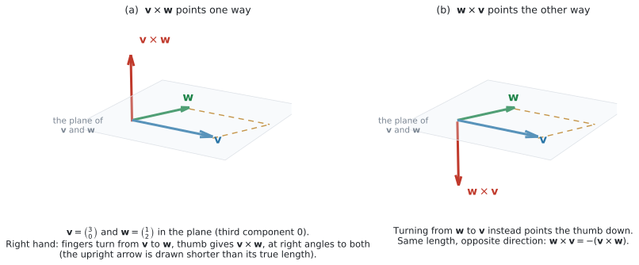
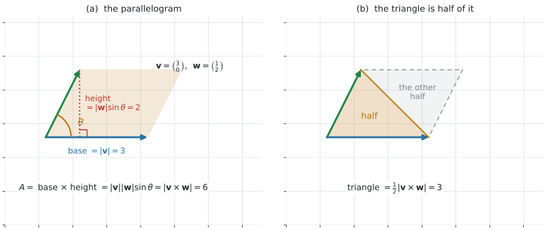
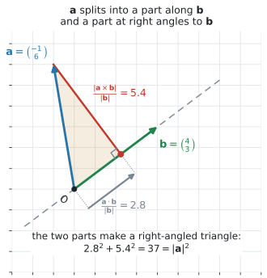

# AHL 3.13b — The vector product（ベクトル積） {#sec-ahl-3-13b}

::: {.callout-note}
## What you should be able to do
- **vector product**（ベクトル積、外積）$\mathbf{v} \times \mathbf{w}$ を、**成分から**計算できる。
- 答えが **scalar**（スカラー、ただの数）ではなく **vector**（ベクトル）であることが言える。
- $\mathbf{v} \times \mathbf{w}$ が（$\mathbf{0}$ でなければ）**$\mathbf{v}$ にも $\mathbf{w}$ にも垂直**であることが言え、確かめられる。
- 向きの決まり方（**right-hand screw rule**（右ねじの規則）と **unit normal vector**（単位法線ベクトル）$\mathbf{n}$）が説明できる。
- $\mathbf{w} \times \mathbf{v} = -(\mathbf{v} \times \mathbf{w})$ を使える。
- $\lvert \mathbf{v} \times \mathbf{w} \rvert = \lvert \mathbf{v} \rvert \lvert \mathbf{w} \rvert \sin\theta$ を使える。
- $\mathbf{v} \times \mathbf{w} = \mathbf{0}$ が **parallel**（平行）と同じことだと言える。
- **平行四辺形**の面積 $A = \lvert \mathbf{v} \times \mathbf{w} \rvert$ と、**三角形**の面積 $\dfrac{1}{2}\lvert \mathbf{v} \times \mathbf{w} \rvert$ を求められる。
- $\mathbf{a}$ の、$\mathbf{b}$ に**垂直な向き**の **component**（成分）$\dfrac{\lvert \mathbf{a} \times \mathbf{b} \rvert}{\lvert \mathbf{b} \rvert}$ を求められる。
:::

::: {.callout-important}
## 公式集の AHL 3.13 の欄
このページで使うのは、下の $3$ 行です。上の $3$ 行は [AHL 3.13a](ahl-3-13a.qmd) で使いました。

| 見出し | 式 |
|:--|:--|
| Vector product | $\mathbf{v} \times \mathbf{w} = \begin{pmatrix} v_2w_3 - v_3w_2 \\ v_3w_1 - v_1w_3 \\ v_1w_2 - v_2w_1 \end{pmatrix}$ |
| | $\lvert \mathbf{v} \times \mathbf{w} \rvert = \lvert \mathbf{v} \rvert \lvert \mathbf{w} \rvert \sin\theta$ |
| Area of a parallelogram | $A = \lvert \mathbf{v} \times \mathbf{w} \rvert$（$\mathbf{v}$、$\mathbf{w}$ は隣り合う $2$ 辺） |

: 公式集にあるもの {#tbl-ahl313b-booklet}

**成分の式は公式集に印刷されています。** 試験中に見られるので、**覚える必要はありません。** このページでは、**読み取り方**だけ確かめます（[第2節](#formula)）。

**$\dfrac{\lvert \mathbf{a} \times \mathbf{b} \rvert}{\lvert \mathbf{b} \rvert}$（$\mathbf{b}$ に垂直な向きの成分）は、公式集にありません。** シラバスの Guidance 欄にだけ書かれています。ただし、上の $2$ 行目から $1$ 行で出せます（[第9節](#component)）。
:::

## The idea

### 1. 答えが「ベクトル」になる、もう $1$ つのかけ算 {#idea}

[AHL 3.13a](ahl-3-13a.qmd#idea) の **scalar product**（スカラー積、内積）は、$2$ つのベクトルから**数**を作りました。

**vector product は、$2$ つのベクトルから、新しい**ベクトル**を作ります。**

$$
\mathbf{v} \times \mathbf{w} = \begin{pmatrix} v_2w_3 - v_3w_2 \\ v_3w_1 - v_1w_3 \\ v_1w_2 - v_2w_1 \end{pmatrix}
$$ {#eq-ahl313b-cross}

**cross product**（クロス積）とも言います。**同じもの**です。記号は $\times$ で、$\cdot$ ではありません。

::: {.callout-important}
## $3$ 成分のベクトルどうしにだけ使えます
scalar product は $2$ 成分でも $3$ 成分でも定義されていましたが、**vector product は $3$ 次元のものです。**

$2$ 次元の問題では、**$3$ つ目の成分に $0$ を足してから**使います（[第7節](#two-d)）。

$2$ 成分のまま @eq-ahl313b-cross に入れると、$v_3$ や $w_3$ が空欄になって計算できません。
:::

### 2. 公式集の行の、読み取り方 {#formula}

@eq-ahl313b-cross は $3$ 行あります。**どの行にも、自分と同じ番号の成分が入っていません。**

| 行 | 式 | 使う成分 |
|:--|:--|:--|
| $1$ 行目 | $v_2w_3 - v_3w_2$ | $2$ と $3$（$1$ を飛ばす） |
| $2$ 行目 | $v_3w_1 - v_1w_3$ | $3$ と $1$（$2$ を飛ばす） |
| $3$ 行目 | $v_1w_2 - v_2w_1$ | $1$ と $2$（$3$ を飛ばす） |

: 成分の作り方 {#tbl-ahl313b-rows}

**$2$ 行目だけ、番号が $3,1$ の順**になっています。ここが引っかかりやすいところです（演習 $10$）。

$\mathbf{v} = \begin{pmatrix} 2 \\ -1 \\ 2 \end{pmatrix}$、$\mathbf{w} = \begin{pmatrix} 4 \\ 3 \\ 0 \end{pmatrix}$ で、$1$ 行ずつ書いてみます。

$$
\mathbf{v} \times \mathbf{w} = \begin{pmatrix} (-1)(0) - (2)(3) \\ (2)(4) - (2)(0) \\ (2)(3) - (-1)(4) \end{pmatrix} = \begin{pmatrix} -6 \\ 8 \\ 10 \end{pmatrix}
$$

**式は公式集にあります。** 答案では、上のように**成分をあてはめた式を $1$ 行書いてから**値にしてください。写し間違いが見つけやすくなります。

### 3. $\mathbf{v} \times \mathbf{w}$ は、$\mathbf{0}$ でなければ両方に垂直です {#perpendicular}

{#fig-ahl313b-idea width=100%}

@fig-ahl313b-idea の (a) が、その様子です。$\mathbf{v}$ と $\mathbf{w}$ が張る平面から、**まっすぐ立ち上がって**います。

さきほどの例で確かめられます（[AHL 3.13a 第6節](ahl-3-13a.qmd#perpendicular)）。

$$
\mathbf{v} \cdot (\mathbf{v} \times \mathbf{w}) = 2(-6) + (-1)(8) + 2(10) = -12 - 8 + 20 = 0
$$

$$
\mathbf{w} \cdot (\mathbf{v} \times \mathbf{w}) = 4(-6) + 3(8) + 0(10) = -24 + 24 + 0 = 0
$$

**どちらも $0$** なので、$\mathbf{v} \times \mathbf{w}$ は $\mathbf{v}$ にも $\mathbf{w}$ にも垂直です。

シラバスは、向きまで込めてこう書いています。

$$
\mathbf{v} \times \mathbf{w} = \lvert \mathbf{v} \rvert \lvert \mathbf{w} \rvert \sin\theta \ \mathbf{n}
$$ {#eq-ahl313b-geom}

$\mathbf{n}$ が **unit normal vector**（単位法線ベクトル）で、長さ $1$、平面に垂直です。

::: {.callout-important}
## 右ねじの規則 — どちら向きに立つか
平面に垂直な向きは、**上と下の $2$ 通り**あります。どちらかを決めるのが **right-hand screw rule**（右ねじの規則）です。

**右手の人さし指・中指・親指**を、たがいに直角になるように立てます。

- **人さし指** … **先にかけるほう**のベクトル
- **中指** … **後ろからかけるほう**のベクトル
- **親指** … その向きが、かけ算の答えの向き

$\mathbf{v} \times \mathbf{w}$ なら、**人さし指を $\mathbf{v}$、中指を $\mathbf{w}$** に合わせます。そのとき**親指が向いているほうが、$\mathbf{v} \times \mathbf{w}$ の向き**です（@fig-ahl313b-idea の (a)）。

**順番が大事です。** $\mathbf{w} \times \mathbf{v}$ なら、**人さし指が $\mathbf{w}$、中指が $\mathbf{v}$** になります（@fig-ahl313b-idea の (b)）。$2$ 本を入れかえるので、親指は逆を向きます。それが $\mathbf{w} \times \mathbf{v} = -(\mathbf{v} \times \mathbf{w})$ です（[第4節](#order)）。

ねじを締めるときの回し方と、ねじが進む向きの関係と同じです。@fig-ahl313b-idea の (a) では、上向きになります。

**この向きは、計算した成分にすでに入っています。** @eq-ahl313b-cross で出した $\begin{pmatrix} -6 \\ 8 \\ 10 \end{pmatrix}$ が、そのまま答えです。手で向きを決め直す必要はありません。
:::

::: {.callout-warning}
## $\mathbf{n}$ は、$\mathbf{v} \times \mathbf{w} = \mathbf{0}$ のときには決まりません
$\mathbf{v}$ と $\mathbf{w}$ が平行のとき、またはどちらかが $\mathbf{0}$ のとき、$2$ 本は平面を張らないので、「その平面に垂直な向き」がありません（[第6節](#parallel)）。

@eq-ahl313b-geom は、そのとき $\sin\theta = 0$ になって右辺が $\mathbf{0}$ になり、$\mathbf{n}$ が何であっても成り立ちます。**$\mathbf{n}$ が意味を持つのは、$\mathbf{v} \times \mathbf{w} \neq \mathbf{0}$ のときだけ**です。
:::

### 4. 順番を変えると、向きが逆になります {#order}

$$
\mathbf{w} \times \mathbf{v} = -(\mathbf{v} \times \mathbf{w})
$$ {#eq-ahl313b-anti}

@fig-ahl313b-idea の (b) が、それです。**長さは同じで、向きだけが反対**になります。

さきほどの例なら $\mathbf{w} \times \mathbf{v} = \begin{pmatrix} 6 \\ -8 \\ -10 \end{pmatrix}$ です。

::: {.callout-warning}
## scalar product とは、ここが違います
$\mathbf{v} \cdot \mathbf{w} = \mathbf{w} \cdot \mathbf{v}$ でした（[AHL 3.13a 第9節](ahl-3-13a.qmd#facts)）。**入れかえても同じ**です。

$\mathbf{v} \times \mathbf{w}$ は**入れかえると符号が変わります。** 問題文の順番を、そのまま守ってください。

**ただし、大きさは同じ**です。$\lvert \mathbf{w} \times \mathbf{v} \rvert = \lvert \mathbf{v} \times \mathbf{w} \rvert$ なので、**面積を聞かれているときは順番を気にしなくて構いません**（[第8節](#area)）。
:::

同じ向きどうしなら、$\mathbf{v} \times \mathbf{v} = \mathbf{0}$ です。@eq-ahl313b-cross に $\mathbf{w} = \mathbf{v}$ を入れれば、$3$ 行とも $0$ になります。

### 5. 大きさは $\lvert \mathbf{v} \rvert \lvert \mathbf{w} \rvert \sin\theta$ {#magnitude}

$$
\lvert \mathbf{v} \times \mathbf{w} \rvert = \lvert \mathbf{v} \rvert \lvert \mathbf{w} \rvert \sin\theta
$$ {#eq-ahl313b-mag}

$\theta$ は、$2$ 本を同じ点から描いたときのあいだの角で、$0^{\circ} \leq \theta \leq 180^{\circ}$ です（[AHL 3.13a 第3節](ahl-3-13a.qmd#two-forms)）。

**この範囲では $\sin\theta \geq 0$** なので、右辺は決して負になりません。左辺は長さなので、負にならないほうが筋が通ります。

さきほどの例で見ます。$\lvert \mathbf{v} \rvert = 3$、$\lvert \mathbf{w} \rvert = 5$、$\lvert \mathbf{v} \times \mathbf{w} \rvert = \sqrt{36+64+100} = \sqrt{200} = 10\sqrt{2}$ なので

$$
\sin\theta = \frac{10\sqrt{2}}{15} = 0.9428\ldots
$$

::: {.callout-warning}
## $\sin^{-1}$ だけでは、角が決まりません
$\sin^{-1}(0.9428\ldots)$ は $70.5^{\circ}$ を返します。けれども $\sin 109.5^{\circ}$ も同じ値です（[AHL 3.8 第8節](ahl-3-8.qmd#ambiguous)）。

**$\lvert \mathbf{v} \times \mathbf{w} \rvert$ だけでは、鋭角か鈍角かが分かりません。**

決めるには、**scalar product の符号**を見ます（[AHL 3.13a 第5節](ahl-3-13a.qmd#sign)）。この例では $\mathbf{v} \cdot \mathbf{w} = 8 - 3 + 0 = 5 > 0$ なので鋭角、つまり $70.5^{\circ}$ です。

**角を聞かれたら、$\cos$ を使うほうが速くて確実**です。$\cos^{-1}$ は $0^{\circ}$ から $180^{\circ}$ の値を $1$ つだけ返します。
:::

### 6. $\mathbf{v} \times \mathbf{w} = \mathbf{0}$ は、平行と同じことです {#parallel}

$$
\mathbf{v} \parallel \mathbf{w} \iff \mathbf{v} \times \mathbf{w} = \mathbf{0} \qquad (\mathbf{v} \neq \mathbf{0},\ \mathbf{w} \neq \mathbf{0})
$$ {#eq-ahl313b-parallel}

@eq-ahl313b-mag で $\sin\theta = 0$、つまり $\theta = 0^{\circ}$ か $\theta = 180^{\circ}$ のときです。どちらも**同じ直線の向き**です（[AHL 3.10a 第7節](ahl-3-10a.qmd#scalar-multiple)）。

::: {.callout-important}
## $2$ つの $0$ を、取りちがえないでください
- **$\mathbf{v} \cdot \mathbf{w} = 0$** … **垂直**（[AHL 3.13a 第6節](ahl-3-13a.qmd#perpendicular)）。答えは**数**の $0$
- **$\mathbf{v} \times \mathbf{w} = \mathbf{0}$** … **平行**。答えは**ベクトル**の $\mathbf{0}$、つまり $3$ 成分すべてが $0$

**正反対の意味**です。$\times$ か $\cdot$ かを、先に確かめてください。
:::

$\mathbf{0}$ を入れると、この同値も崩れます。$\mathbf{0} \times \mathbf{w} = \mathbf{0}$ はどんな $\mathbf{w}$ でも成り立ちますが、$\mathbf{0}$ は向きを持たないので「平行」とは言いません（[AHL 3.10a 第8節](ahl-3-10a.qmd#zero)）。

$\mathbf{v} \parallel \mathbf{w}$ は $\mathbf{v} = k\mathbf{w}$ とも書けました（[AHL 3.10a 第7節](ahl-3-10a.qmd#scalar-multiple)）。**$\times$ は、その $k$ を探さずに $1$ 回で判定できる**のが利点です。

### 7. $2$ 次元は、$0$ を足してから {#two-d}

$2$ 次元のベクトルには、$3$ 番目に $0$ を足します。

$$
\begin{pmatrix} a_1 \\ a_2 \end{pmatrix} \times \begin{pmatrix} b_1 \\ b_2 \end{pmatrix} \ \longrightarrow \ \begin{pmatrix} a_1 \\ a_2 \\ 0 \end{pmatrix} \times \begin{pmatrix} b_1 \\ b_2 \\ 0 \end{pmatrix} = \begin{pmatrix} 0 \\ 0 \\ a_1b_2 - a_2b_1 \end{pmatrix}
$$ {#eq-ahl313b-2d}

**はじめの $2$ 成分は、必ず $0$ になります。** $v_3 = w_3 = 0$ を @eq-ahl313b-cross に入れれば、そうなります。

ですから**$2$ 次元では、残るのは $3$ 行目の $a_1b_2 - a_2b_1$ ひとつ**です。大きさは、その絶対値です。

$$
\left\lvert \begin{pmatrix} a_1 \\ a_2 \end{pmatrix} \times \begin{pmatrix} b_1 \\ b_2 \end{pmatrix} \right\rvert = \lvert a_1b_2 - a_2b_1 \rvert
$$

**この値は負になることがあります。** 面積にするときは、**絶対値を取ってください**（[第8節](#area)）。

### 8. 平行四辺形と三角形の面積 {#area}

**$\mathbf{v}$ と $\mathbf{w}$ を隣り合う $2$ 辺とする平行四辺形の面積は、$\mathbf{v} \times \mathbf{w}$ の大きさに等しくなります。**

$$
A_{\text{parallelogram}} = \lvert \mathbf{v} \times \mathbf{w} \rvert
$$ {#eq-ahl313b-area}

{#fig-ahl313b-area width=100%}

@fig-ahl313b-area の (a) が理由です。**底辺が $\lvert \mathbf{v} \rvert$、高さが $\lvert \mathbf{w} \rvert \sin\theta$** なので、面積は $\lvert \mathbf{v} \rvert \lvert \mathbf{w} \rvert \sin\theta$、つまり @eq-ahl313b-mag そのものです。

**$\mathbf{v}$ と $\mathbf{w}$ を $2$ 辺とする三角形**——つまり平行四辺形を対角線で半分にしたほう——の面積は、その半分です。

$$
A_{\text{triangle}} = \frac{1}{2}\lvert \mathbf{v} \times \mathbf{w} \rvert
$$ {#eq-ahl313b-tri}

@fig-ahl313b-area の (b) のとおり、対角線で $2$ つに切ると、同じ大きさの三角形が $2$ つできます。

::: {.callout-warning}
## $\mathbf{v}$ と $\mathbf{w}$ は、同じ頂点から出た $2$ 辺にそろえます
三角形 $ABC$ の面積なら、使うのは $\overrightarrow{AB}$ と $\overrightarrow{AC}$、つまり**頂点 $A$ から出る $2$ 本**です。

**どの頂点を選んでも、答えは同じ**です（[Why it works](#why-it-works)）。$\overrightarrow{BA}$ と $\overrightarrow{BC}$ でも、$\overrightarrow{CA}$ と $\overrightarrow{CB}$ でも構いません。

$\overrightarrow{AB}$ と $\overrightarrow{BC}$ のように頂点をそろえずに取っても、じつは同じ答えになります（$\overrightarrow{AB} \times \overrightarrow{BC} = \overrightarrow{AB} \times \overrightarrow{AC}$）。**それでも、頂点をそろえる書き方にしておいてください。** どの $2$ 本を使ったかが自分にも採点者にも見えるので、辺の取りちがえに気づけます。
:::

::: {.callout-important}
## $\dfrac{1}{2}$ を忘れないでください
`parallelogram` なら $\lvert \mathbf{v} \times \mathbf{w} \rvert$、`triangle` なら $\dfrac{1}{2}\lvert \mathbf{v} \times \mathbf{w} \rvert$ です。

**問題文のどちらの語が出ているか**を、先に丸で囲んでください（演習 $3$ が `parallelogram`、演習 $4$ が `triangle` です）。

公式集にあるのは平行四辺形のほうだけで、`(and hence a triangle)` はシラバスの Guidance にあります。
:::

### 9. $\mathbf{b}$ に垂直な向きの成分 {#component}

$$
\text{$\mathbf{a}$ の、$\mathbf{b}$ に垂直な向きの component} = \frac{\lvert \mathbf{a} \times \mathbf{b} \rvert}{\lvert \mathbf{b} \rvert} = \lvert \mathbf{a} \rvert \sin\theta \qquad (\mathbf{b} \neq \mathbf{0})
$$ {#eq-ahl313b-comp}

右の形 $\lvert \mathbf{a} \rvert \sin\theta$ は、$\mathbf{a} \neq \mathbf{0}$ のときに使えます（$\theta$ が決まるため）。

{#fig-ahl313b-component width=100%}

@fig-ahl313b-component が、[AHL 3.13a 第8節](ahl-3-13a.qmd#component) の続きです。**同じ $\mathbf{a}$、$\mathbf{b}$** で、今度は**直角三角形のもう $1$ 辺**を出しています。

$$
\underbrace{\frac{\mathbf{a} \cdot \mathbf{b}}{\lvert \mathbf{b} \rvert}}_{\mathbf{b} \text{ に平行な分}} = 2.8, \qquad \underbrace{\frac{\lvert \mathbf{a} \times \mathbf{b} \rvert}{\lvert \mathbf{b} \rvert}}_{\mathbf{b} \text{ に垂直な分}} = 5.4, \qquad 2.8^2 + 5.4^2 = 37 = \lvert \mathbf{a} \rvert^2
$$

::: {.callout-warning}
## 「垂直な向き」は、$\mathbf{a} \times \mathbf{b}$ の向きではありません
シラバスは `in the plane formed by the two vectors` と断っています。**$\mathbf{a}$ と $\mathbf{b}$ が乗っている平面の中**での、$\mathbf{b}$ に垂直な向きです。

$\mathbf{a} \times \mathbf{b}$ は、**その平面から立ち上がった向き**でした（[第3節](#perpendicular)）。**別の向き**です。

ここで使っているのは $\mathbf{a} \times \mathbf{b}$ の**大きさ**だけです。向きは使いません。
:::

::: {.callout-important}
## この成分は、負になりません
$\lvert \mathbf{a} \times \mathbf{b} \rvert \geq 0$ で $\lvert \mathbf{b} \rvert > 0$ なので、**割り算の答えはつねに $0$ 以上**です。

[AHL 3.13a 第8節](ahl-3-13a.qmd#component) の平行な成分は、**負にもなりました。** $\cos\theta$ が負になれるからです。

**平行な分は「どちら向きか」まで持ち、垂直な分は「どれだけか」だけを持つ**、というのが違いです（@exm-ahl313b-component）。
:::

$2$ つを見くらべると、次のようになります。

| | scalar product | vector product |
|:--|:--|:--|
| 答え | **数**（scalar） | **ベクトル**（vector） |
| 記号 | $\mathbf{v} \cdot \mathbf{w}$ | $\mathbf{v} \times \mathbf{w}$ |
| 次元 | $2$ でも $3$ でも | $3$ だけ（$2$ 次元は $0$ を足す） |
| 入れかえ | 変わらない | 符号が変わる |
| $0$ になるのは（どちらも $\mathbf{0}$ でないとき） | **垂直**のとき | **平行**のとき |
| $\theta$ を使う形 | $\lvert \mathbf{v} \rvert \lvert \mathbf{w} \rvert \cos\theta$（**負にもなります**） | $\lvert \mathbf{v} \times \mathbf{w} \rvert = \lvert \mathbf{v} \rvert \lvert \mathbf{w} \rvert \sin\theta$（$0$ 以上） |
| おもな使い道 | 角、垂直の判定、平行な成分 | 面積、平行の判定、垂直な成分 |

: $2$ つのかけ算のくらべ方 {#tbl-ahl313b-compare}

## Why it works

:::: {.callout-note collapse="true" appearance="simple"}
## クリックすると開きます
**なぜ $\lvert \mathbf{v} \times \mathbf{w} \rvert$ が平行四辺形の面積になるのか。**

底辺を $\lvert \mathbf{v} \rvert$ とすると、高さは $\mathbf{w}$ の**底辺に垂直な分**、つまり $\lvert \mathbf{w} \rvert \sin\theta$ です（@fig-ahl313b-area の (a)）。ですから

$$
A = \text{底辺} \times \text{高さ} = \lvert \mathbf{v} \rvert \lvert \mathbf{w} \rvert \sin\theta = \lvert \mathbf{v} \times \mathbf{w} \rvert
$$

$\theta$ が鈍角でも、高さは $\lvert \mathbf{w} \rvert \sin\theta$ のままです（$0^{\circ} \leq \theta \leq 180^{\circ}$ で $\sin\theta \geq 0$）。**傾きの向きが変わるだけで、高さは同じ**です。

**なぜ三角形の面積が半分なのか。**

平行四辺形を対角線で切ると、$2$ つの三角形ができます。$3$ 辺の長さが対応して等しいので、この $2$ つは合同です。ですから、それぞれが半分です。

**なぜ、どの頂点から測っても同じ面積になるのか。**

三角形 $ABC$ で、$A$ から測ると $\dfrac{1}{2}\lvert \overrightarrow{AB} \times \overrightarrow{AC} \rvert$、$B$ から測ると $\dfrac{1}{2}\lvert \overrightarrow{BA} \times \overrightarrow{BC} \rvert$ です。

$\overrightarrow{BA} = -\overrightarrow{AB}$、$\overrightarrow{BC} = \overrightarrow{AC} - \overrightarrow{AB}$ を入れて展開すると（$\times$ も、$\cdot$ と同じように各項に配ることができます）

$$
(-\overrightarrow{AB}) \times (\overrightarrow{AC} - \overrightarrow{AB}) = -\overrightarrow{AB} \times \overrightarrow{AC} + \overrightarrow{AB} \times \overrightarrow{AB} = -(\overrightarrow{AB} \times \overrightarrow{AC})
$$

$\overrightarrow{AB} \times \overrightarrow{AB} = \mathbf{0}$ を使いました（[第4節](#order)）。**符号が変わるだけ**なので、大きさは同じです。

$C$ から測ると $\overrightarrow{CA} \times \overrightarrow{CB}$ で、同じように展開すると**符号も変わらず** $\overrightarrow{AB} \times \overrightarrow{AC}$ そのものになります。いずれにしても、**変わるとしても符号だけ**です。

**なぜ $2$ 次元だと、はじめの $2$ 成分が $0$ になるのか。**

@eq-ahl313b-cross に $v_3 = w_3 = 0$ を入れます。

$$
\begin{pmatrix} v_2 \cdot 0 - 0 \cdot w_2 \\ 0 \cdot w_1 - v_1 \cdot 0 \\ v_1w_2 - v_2w_1 \end{pmatrix} = \begin{pmatrix} 0 \\ 0 \\ v_1w_2 - v_2w_1 \end{pmatrix}
$$

図で言えば、$\mathbf{v}$ も $\mathbf{w}$ も $xy$ 平面に乗っているので、**両方に垂直な向きは $z$ 軸の向きだけ**です。ですから $3$ 行目しか残りません。

**なぜ垂直な成分が $\dfrac{\lvert \mathbf{a} \times \mathbf{b} \rvert}{\lvert \mathbf{b} \rvert}$ なのか。**

@eq-ahl313b-mag を $\lvert \mathbf{b} \rvert$ で割るだけです。

$$
\frac{\lvert \mathbf{a} \times \mathbf{b} \rvert}{\lvert \mathbf{b} \rvert} = \frac{\lvert \mathbf{a} \rvert \lvert \mathbf{b} \rvert \sin\theta}{\lvert \mathbf{b} \rvert} = \lvert \mathbf{a} \rvert \sin\theta
$$

$\lvert \mathbf{a} \rvert \sin\theta$ は、直角三角形の**高さ**にあたります（@fig-ahl313b-component）。[AHL 3.13a](ahl-3-13a.qmd#component) の $\lvert \mathbf{a} \rvert \cos\theta$ が底辺だったので、$2$ つ合わせて

$$
(\lvert \mathbf{a} \rvert \cos\theta)^2 + (\lvert \mathbf{a} \rvert \sin\theta)^2 = \lvert \mathbf{a} \rvert^2(\cos^2\theta + \sin^2\theta) = \lvert \mathbf{a} \rvert^2
$$

$\cos^2 + \sin^2 = 1$（[AHL 3.8 第5節](ahl-3-8.qmd#pythagoras)）が効いています。**これが、いちばん確実な検算**です。
::::

## Worked examples

::: {.callout-note appearance="simple"}
問題文は英語です。意味が理解できなかったら、問題文の下の「**日本語訳**」を開いてください。解説は日本語です。
:::

::: {#exm-ahl313b-cross}
[Let $\mathbf{v} = \begin{pmatrix} 2 \\ -1 \\ 2 \end{pmatrix}$ and $\mathbf{w} = \begin{pmatrix} 4 \\ 3 \\ 0 \end{pmatrix}$.]{.q-en}

**(a)** [Find $\mathbf{v} \times \mathbf{w}$.]{.q-en}

**(b)** [Show that $\mathbf{v} \times \mathbf{w}$ is perpendicular to both $\mathbf{v}$ and $\mathbf{w}$.]{.q-en}

**(c)** [Write down $\mathbf{w} \times \mathbf{v}$.]{.q-en}

**(d)** [Find a unit vector perpendicular to both $\mathbf{v}$ and $\mathbf{w}$.]{.q-en}

日本語訳

$\mathbf{v} = \begin{pmatrix} 2 \\ -1 \\ 2 \end{pmatrix}$、$\mathbf{w} = \begin{pmatrix} 4 \\ 3 \\ 0 \end{pmatrix}$ とします。

**(a)** $\mathbf{v} \times \mathbf{w}$ を求めなさい。

**(b)** $\mathbf{v} \times \mathbf{w}$ が $\mathbf{v}$ にも $\mathbf{w}$ にも垂直であることを示しなさい。

**(c)** $\mathbf{w} \times \mathbf{v}$ を書きなさい。

**(d)** $\mathbf{v}$ にも $\mathbf{w}$ にも垂直な単位ベクトルを $1$ つ求めなさい。

---

**(a)** @eq-ahl313b-cross に成分をあてはめます（@tbl-ahl313b-rows）。

$$
\mathbf{v} \times \mathbf{w} = \begin{pmatrix} (-1)(0) - (2)(3) \\ (2)(4) - (2)(0) \\ (2)(3) - (-1)(4) \end{pmatrix} = \begin{pmatrix} -6 \\ 8 \\ 10 \end{pmatrix}
$$

**(b)** `Show that` なので、scalar product が $0$ になることを計算で見せます。

$$
\mathbf{v} \cdot (\mathbf{v} \times \mathbf{w}) = 2(-6) + (-1)(8) + 2(10) = -12 - 8 + 20 = 0
$$

$$
\mathbf{w} \cdot (\mathbf{v} \times \mathbf{w}) = 4(-6) + 3(8) + 0(10) = -24 + 24 + 0 = 0
$$

どれも $\mathbf{0}$ ではないので、垂直です（[AHL 3.13a 第6節](ahl-3-13a.qmd#perpendicular)）。

**(c)** 符号を変えるだけです（@eq-ahl313b-anti）。

$$
\mathbf{w} \times \mathbf{v} = \begin{pmatrix} 6 \\ -8 \\ -10 \end{pmatrix}
$$

**(d)** (a) の答えを、自分の大きさで割ります（[AHL 3.10b 第5節](ahl-3-10b.qmd#unit)）。

$$
\lvert \mathbf{v} \times \mathbf{w} \rvert = \sqrt{36+64+100} = \sqrt{200} = 10\sqrt{2}
$$

$$
\frac{1}{10\sqrt{2}}\begin{pmatrix} -6 \\ 8 \\ 10 \end{pmatrix}
$$

`a unit vector` なので $1$ つで足ります。**符号を変えたものも正解**です。

**検算（(a) について）。** (b) がそのまま (a) の検算になっています。**成分を $1$ つでも間違えると、$2$ つの内積が同時に $0$ になることは、まずありません。** たとえば $2$ 行目を $8$ ではなく $-8$ としていたら、$\mathbf{v}$ との内積が $-12+8+20 = 16 \neq 0$ になります。

**検算（(d) について）。** 成分から長さを出し直します。

$$
\left(\frac{-6}{10\sqrt{2}}\right)^2 + \left(\frac{8}{10\sqrt{2}}\right)^2 + \left(\frac{10}{10\sqrt{2}}\right)^2 = \frac{36+64+100}{200} = 1
$$

$1$ になりました ✓ **$\lvert \mathbf{v} \times \mathbf{w} \rvert$ を $10$ と間違えて割っていたら、ここは $\dfrac{200}{100} = 2$ になり、$1$ になりません。**

::: {.callout-note}
## 解答例（答案用紙にはこう書く）
**(a)**
$$\mathbf{v} \times \mathbf{w} = \begin{pmatrix} (-1)(0)-(2)(3) \\ (2)(4)-(2)(0) \\ (2)(3)-(-1)(4) \end{pmatrix} = \begin{pmatrix} -6 \\ 8 \\ 10 \end{pmatrix}$$

**(b)**
$$\mathbf{v} \cdot (\mathbf{v} \times \mathbf{w}) = -12-8+20 = 0, \qquad \mathbf{w} \cdot (\mathbf{v} \times \mathbf{w}) = -24+24+0 = 0$$
*All three vectors are non-zero, so $\mathbf{v} \times \mathbf{w}$ is perpendicular to both.*

**(c)**
$$\mathbf{w} \times \mathbf{v} = \begin{pmatrix} 6 \\ -8 \\ -10 \end{pmatrix}$$

**(d)**
$$\lvert \mathbf{v} \times \mathbf{w} \rvert = 10\sqrt{2}, \qquad \frac{1}{10\sqrt{2}}\begin{pmatrix} -6 \\ 8 \\ 10 \end{pmatrix}$$
:::
:::

::: {#exm-ahl313b-mag}
[Let $\mathbf{v} = \begin{pmatrix} 2 \\ -1 \\ 2 \end{pmatrix}$ and $\mathbf{w} = \begin{pmatrix} 4 \\ 3 \\ 0 \end{pmatrix}$, so that $\mathbf{v} \times \mathbf{w} = \begin{pmatrix} -6 \\ 8 \\ 10 \end{pmatrix}$.]{.q-en}

**(a)** [Find $\lvert \mathbf{v} \times \mathbf{w} \rvert$, giving your answer in exact form.]{.q-en}

**(b)** [Hence find $\sin\theta$, where $\theta$ is the angle between $\mathbf{v}$ and $\mathbf{w}$.]{.q-en}

**(c)** [Find $\theta$ in degrees to $3$ significant figures.]{.q-en}

**(d)** [Explain why part (a) on its own is not enough to find $\theta$.]{.q-en}

日本語訳

$\mathbf{v} = \begin{pmatrix} 2 \\ -1 \\ 2 \end{pmatrix}$、$\mathbf{w} = \begin{pmatrix} 4 \\ 3 \\ 0 \end{pmatrix}$ とし、$\mathbf{v} \times \mathbf{w} = \begin{pmatrix} -6 \\ 8 \\ 10 \end{pmatrix}$ とします。

**(a)** $\lvert \mathbf{v} \times \mathbf{w} \rvert$ を、正確な形で求めなさい。

**(b)** そこから $\sin\theta$ を求めなさい。$\theta$ は $\mathbf{v}$ と $\mathbf{w}$ のあいだの角です。

**(c)** $\theta$ を度で、有効数字 $3$ 桁で求めなさい。

**(d)** (a) だけでは $\theta$ が求まらない理由を説明しなさい。

---

**(a)** 成分から大きさを出します（[AHL 3.10b 第1節](ahl-3-10b.qmd#magnitude)）。

$$
\lvert \mathbf{v} \times \mathbf{w} \rvert = \sqrt{(-6)^2 + 8^2 + 10^2} = \sqrt{36+64+100} = \sqrt{200} = 10\sqrt{2}
$$

`exact form` なので、$14.1$ にせず $10\sqrt{2}$ のままにします。

**(b)** @eq-ahl313b-mag を $\sin\theta$ について解きます。$\lvert \mathbf{v} \rvert = \sqrt{4+1+4} = 3$、$\lvert \mathbf{w} \rvert = \sqrt{16+9+0} = 5$ です。

$$
\sin\theta = \frac{10\sqrt{2}}{3 \times 5} = \frac{2\sqrt{2}}{3} = 0.9428\ldots
$$

**(c)** $\sin^{-1}$ は $70.5^{\circ}$ を返しますが、**それが答えとはかぎりません**（[第5節](#magnitude)）。scalar product の符号で決めます。

$$
\mathbf{v} \cdot \mathbf{w} = 2(4) + (-1)(3) + 2(0) = 5 > 0
$$

正なので鋭角です（[AHL 3.13a 第5節](ahl-3-13a.qmd#sign)）。したがって $\theta = 70.5^{\circ}$ です。

**(d)** `Explain why` なので、英語で理由を書きます。

::: {.model-answer}
**試験ではこう書く**

*The magnitude gives $\sin\theta$ only, and $\sin\theta = \sin(180^{\circ}-\theta)$, so two angles in $0^{\circ} \leq \theta \leq 180^{\circ}$ share the same sine. Here $\sin\theta = \frac{2\sqrt{2}}{3}$ is satisfied by both $70.5^{\circ}$ and $109.5^{\circ}$, and $\lvert \mathbf{v} \times \mathbf{w} \rvert$ cannot tell them apart because it is never negative. The scalar product settles it: $\mathbf{v} \cdot \mathbf{w} = 5 > 0$ means $\cos\theta > 0$, so the angle is acute and $\theta = 70.5^{\circ}$.*
:::

（大きさから分かるのは $\sin\theta$ だけであり、$\sin\theta = \sin(180^{\circ}-\theta)$ なので、$0^{\circ} \leq \theta \leq 180^{\circ}$ の中に同じ正弦を持つ角が $2$ つある。ここでは $\sin\theta = \frac{2\sqrt{2}}{3}$ を $70.5^{\circ}$ も $109.5^{\circ}$ も満たし、$\lvert \mathbf{v} \times \mathbf{w} \rvert$ は決して負にならないので区別できない。scalar product が決め手になる。$\mathbf{v} \cdot \mathbf{w} = 5 > 0$ から $\cos\theta > 0$ なので鋭角で、$\theta = 70.5^{\circ}$ である、という意味です。）

**検算（(c) について）。** $\cos$ の側から独立に出し直します（[AHL 3.13a 第4節](ahl-3-13a.qmd#angle)）。

$$
\cos\theta = \frac{5}{3 \times 5} = \frac{1}{3}, \qquad \theta = 70.5^{\circ}
$$

同じ値になりました ✓ **こちらは $\cos^{-1}$ なので、$0^{\circ}$ から $180^{\circ}$ の答えが $1$ つに決まります。** さらに $\left(\dfrac{2\sqrt{2}}{3}\right)^2 + \left(\dfrac{1}{3}\right)^2 = \dfrac{8}{9} + \dfrac{1}{9} = 1$ ✓ **$\sin$ と $\cos$ が食い違っていたら、ここで $1$ になりません。**

::: {.callout-note}
## 解答例（答案用紙にはこう書く）
**(a)**
$$\lvert \mathbf{v} \times \mathbf{w} \rvert = \sqrt{36+64+100} = 10\sqrt{2}$$

**(b)**
$$\lvert \mathbf{v} \rvert = 3, \quad \lvert \mathbf{w} \rvert = 5, \qquad \sin\theta = \frac{10\sqrt{2}}{15} = \frac{2\sqrt{2}}{3}$$

**(c)**
$$\mathbf{v} \cdot \mathbf{w} = 5 > 0 \ \Rightarrow \ \theta \text{ is acute}, \qquad \theta = 70.5^{\circ} \ (3 \text{ s.f.})$$

**(d)**
*$\sin\theta = \sin(180^{\circ}-\theta)$, so the magnitude alone allows $70.5^{\circ}$ or $109.5^{\circ}$; the sign of $\mathbf{v} \cdot \mathbf{w}$ decides.*
:::
:::

::: {#exm-ahl313b-area}
[Find the following areas.]{.q-en}

**(a)** [The parallelogram with adjacent sides $\mathbf{v} = \begin{pmatrix} 2 \\ -1 \\ 2 \end{pmatrix}$ and $\mathbf{w} = \begin{pmatrix} 4 \\ 3 \\ 0 \end{pmatrix}$.]{.q-en}

**(b)** [The triangle with vertices $A(1,\ 0,\ 2)$, $B(3,\ 2,\ 1)$ and $C(2,\ -1,\ 4)$, to $3$ significant figures.]{.q-en}

**(c)** [The triangle with vertices $P(1,\ 1)$, $Q(5,\ 2)$ and $R(2,\ 6)$.]{.q-en}

**(d)** [Explain why the answer to (b) is the same whichever vertex the two side vectors are taken from.]{.q-en}

日本語訳

次の面積を求めなさい。

**(a)** 隣り合う $2$ 辺が $\mathbf{v} = \begin{pmatrix} 2 \\ -1 \\ 2 \end{pmatrix}$、$\mathbf{w} = \begin{pmatrix} 4 \\ 3 \\ 0 \end{pmatrix}$ である平行四辺形。

**(b)** 頂点が $A(1,\ 0,\ 2)$、$B(3,\ 2,\ 1)$、$C(2,\ -1,\ 4)$ である三角形。有効数字 $3$ 桁で。

**(c)** 頂点が $P(1,\ 1)$、$Q(5,\ 2)$、$R(2,\ 6)$ である三角形。

**(d)** (b) の答えが、$2$ 辺をどの頂点から取っても同じになる理由を説明しなさい。

---

**(a)** @eq-ahl313b-area です。$\mathbf{v} \times \mathbf{w} = \begin{pmatrix} -6 \\ 8 \\ 10 \end{pmatrix}$ でした（@exm-ahl313b-cross）。

$$
A = \lvert \mathbf{v} \times \mathbf{w} \rvert = 10\sqrt{2}
$$

**(b)** まず、**同じ頂点から出る $2$ 辺**を作ります（[第8節](#area)）。

$$
\overrightarrow{AB} = \begin{pmatrix} 2 \\ 2 \\ -1 \end{pmatrix}, \qquad \overrightarrow{AC} = \begin{pmatrix} 1 \\ -1 \\ 2 \end{pmatrix}
$$

$$
\overrightarrow{AB} \times \overrightarrow{AC} = \begin{pmatrix} (2)(2)-(-1)(-1) \\ (-1)(1)-(2)(2) \\ (2)(-1)-(2)(1) \end{pmatrix} = \begin{pmatrix} 3 \\ -5 \\ -4 \end{pmatrix}
$$

$$
A = \tfrac{1}{2}\sqrt{9+25+16} = \tfrac{1}{2}\sqrt{50} = \tfrac{5\sqrt{2}}{2} \approx 3.54
$$

**(c)** $2$ 次元なので、$3$ 番目に $0$ を足します（[第7節](#two-d)）。

$$
\overrightarrow{PQ} = \begin{pmatrix} 4 \\ 1 \\ 0 \end{pmatrix}, \qquad \overrightarrow{PR} = \begin{pmatrix} 1 \\ 5 \\ 0 \end{pmatrix}
$$

$3$ 行目だけが残ります。

$$
(4)(5) - (1)(1) = 19, \qquad A = \tfrac{1}{2} \times 19 = 9.5
$$

**(d)** `Explain why` なので、英語で理由を書きます。

::: {.model-answer}
**試験ではこう書く**

*Taking the sides from $B$ instead of $A$ replaces $\overrightarrow{AB} \times \overrightarrow{AC}$ by $\overrightarrow{BA} \times \overrightarrow{BC} = (-\overrightarrow{AB}) \times (\overrightarrow{AC} - \overrightarrow{AB})$. Expanding gives $-(\overrightarrow{AB} \times \overrightarrow{AC}) + \overrightarrow{AB} \times \overrightarrow{AB}$, and $\overrightarrow{AB} \times \overrightarrow{AB} = \mathbf{0}$, so the result is $-(\overrightarrow{AB} \times \overrightarrow{AC})$. The same expansion at $C$ gives $\overrightarrow{CA} \times \overrightarrow{CB} = \overrightarrow{AB} \times \overrightarrow{AC}$ itself. So changing the vertex changes the vector product by at most a sign, and the area uses the magnitude, so it is unchanged.*
:::

（$A$ ではなく $B$ から辺を取ると、$\overrightarrow{AB} \times \overrightarrow{AC}$ が $\overrightarrow{BA} \times \overrightarrow{BC} = (-\overrightarrow{AB}) \times (\overrightarrow{AC} - \overrightarrow{AB})$ に置き換わる。展開すると $-(\overrightarrow{AB} \times \overrightarrow{AC}) + \overrightarrow{AB} \times \overrightarrow{AB}$ となり、$\overrightarrow{AB} \times \overrightarrow{AB} = \mathbf{0}$ なので $-(\overrightarrow{AB} \times \overrightarrow{AC})$ になる。$C$ で同じ展開をすると $\overrightarrow{CA} \times \overrightarrow{CB} = \overrightarrow{AB} \times \overrightarrow{AC}$ そのものになる。つまり頂点を変えても変わるのは符号だけで、面積は大きさを使うので変わらない、という意味です。）

**検算（(b) について）。** $B$ から取って**やり直します。**

$$
\overrightarrow{BA} = \begin{pmatrix} -2 \\ -2 \\ 1 \end{pmatrix}, \qquad \overrightarrow{BC} = \begin{pmatrix} -1 \\ -3 \\ 3 \end{pmatrix}
$$

$$
\overrightarrow{BA} \times \overrightarrow{BC} = \begin{pmatrix} (-2)(3)-(1)(-3) \\ (1)(-1)-(-2)(3) \\ (-2)(-3)-(-2)(-1) \end{pmatrix} = \begin{pmatrix} -3 \\ 5 \\ 4 \end{pmatrix}
$$

大きさは同じ $\sqrt{50}$ で、面積も $3.54$ です ✓ **成分がすべて符号違いになっている**ところまで、(d) の説明と合っています。**これは別の $2$ 辺からの計算なので、同じ式を繰り返したことにはなりません。**

**検算（(c) について）。** $2$ 次元なので、座標から直に面積を出せます。$P$ を原点に移すと $Q'(4,\ 1)$、$R'(1,\ 5)$ です。長方形 $4 \times 5 = 20$ から、まわりの $3$ つの直角三角形を引きます。

$$
20 - \tfrac{1}{2}(4)(1) - \tfrac{1}{2}(1)(5) - \tfrac{1}{2}(3)(4) = 20 - 2 - 2.5 - 6 = 9.5
$$

同じ $9.5$ です ✓ **$\dfrac{1}{2}$ を忘れて $19$ としていたら、この方法と合いません。**

::: {.callout-note}
## 解答例（答案用紙にはこう書く）
**(a)**
$$A = \lvert \mathbf{v} \times \mathbf{w} \rvert = 10\sqrt{2}$$

**(b)**
$$\overrightarrow{AB} \times \overrightarrow{AC} = \begin{pmatrix} 3 \\ -5 \\ -4 \end{pmatrix}, \qquad A = \tfrac{1}{2}\sqrt{50} = 3.54 \ (3 \text{ s.f.})$$

**(c)**
$$(4)(5)-(1)(1) = 19, \qquad A = 9.5$$

**(d)**
*Changing the vertex changes the vector product by at most a sign, and the area uses its magnitude.*
:::
:::

::: {#exm-ahl313b-component}
[Let $\mathbf{a} = \begin{pmatrix} -1 \\ 6 \end{pmatrix}$ and $\mathbf{b} = \begin{pmatrix} 4 \\ 3 \end{pmatrix}$.]{.q-en}

**(a)** [Find the component of $\mathbf{a}$ acting perpendicular to $\mathbf{b}$.]{.q-en}

**(b)** [Write down the component of $\mathbf{a}$ acting in the direction of $\mathbf{b}$, and verify that the two components are consistent with $\lvert \mathbf{a} \rvert$.]{.q-en}

**(c)** [Find the component of $\begin{pmatrix} 2 \\ -1 \\ 2 \end{pmatrix}$ acting perpendicular to $\begin{pmatrix} 4 \\ 3 \\ 0 \end{pmatrix}$, giving your answer in exact form.]{.q-en}

**(d)** [Explain why a perpendicular component can never be negative, while a component in the direction of $\mathbf{b}$ can be.]{.q-en}

日本語訳

$\mathbf{a} = \begin{pmatrix} -1 \\ 6 \end{pmatrix}$、$\mathbf{b} = \begin{pmatrix} 4 \\ 3 \end{pmatrix}$ とします。

**(a)** $\mathbf{b}$ に垂直にはたらく $\mathbf{a}$ の成分を求めなさい。

**(b)** $\mathbf{b}$ の向きにはたらく $\mathbf{a}$ の成分を書き、$2$ つの成分が $\lvert \mathbf{a} \rvert$ と矛盾しないことを確かめなさい。

**(c)** $\begin{pmatrix} 4 \\ 3 \\ 0 \end{pmatrix}$ に垂直にはたらく $\begin{pmatrix} 2 \\ -1 \\ 2 \end{pmatrix}$ の成分を、正確な形で求めなさい。

**(d)** 垂直な成分は決して負にならないのに、$\mathbf{b}$ の向きの成分は負になりうる理由を説明しなさい。

---

**(a)** $2$ 次元なので $0$ を足します（[第7節](#two-d)）。$3$ 行目だけが残ります。

$$
(-1)(3) - (6)(4) = -3 - 24 = -27, \qquad \lvert \mathbf{a} \times \mathbf{b} \rvert = 27
$$

**絶対値を取ります。** $\lvert \mathbf{b} \rvert = \sqrt{16+9} = 5$ なので（@eq-ahl313b-comp）

$$
\frac{\lvert \mathbf{a} \times \mathbf{b} \rvert}{\lvert \mathbf{b} \rvert} = \frac{27}{5} = 5.4
$$

**(b)** [AHL 3.13a 第8節](ahl-3-13a.qmd#component) のほうです。

$$
\mathbf{a} \cdot \mathbf{b} = (-1)(4) + (6)(3) = 14, \qquad \frac{\mathbf{a} \cdot \mathbf{b}}{\lvert \mathbf{b} \rvert} = \frac{14}{5} = 2.8
$$

$2$ つは直角三角形の $2$ 辺なので、**Pythagoras**（三平方の定理）が成り立つはずです（[Why it works](#why-it-works)）。

$$
2.8^2 + 5.4^2 = 7.84 + 29.16 = 37, \qquad \lvert \mathbf{a} \rvert^2 = 1 + 36 = 37
$$

合っています。

**(c)** @exm-ahl313b-cross で $\lvert \mathbf{v} \times \mathbf{w} \rvert = 10\sqrt{2}$、$\lvert \mathbf{w} \rvert = 5$ でした。

$$
\frac{10\sqrt{2}}{5} = 2\sqrt{2}
$$

**(d)** `Explain why` なので、英語で理由を書きます。

::: {.model-answer}
**試験ではこう書く**

*The perpendicular component is $\frac{\lvert \mathbf{a} \times \mathbf{b} \rvert}{\lvert \mathbf{b} \rvert} = \lvert \mathbf{a} \rvert \sin\theta$. A magnitude is never negative, and for $0^{\circ} \leq \theta \leq 180^{\circ}$ we always have $\sin\theta \geq 0$, so this component is never negative. The component along $\mathbf{b}$ is $\lvert \mathbf{a} \rvert \cos\theta$, and $\cos\theta$ is negative for an obtuse angle, so that one can be negative. The difference is what the two numbers record: the component along $\mathbf{b}$ carries a direction along that line, forwards or backwards, while the perpendicular component records only how far $\mathbf{a}$ stands off the line, and both sides of the line are the same distance away.*
:::

（垂直な成分は $\frac{\lvert \mathbf{a} \times \mathbf{b} \rvert}{\lvert \mathbf{b} \rvert} = \lvert \mathbf{a} \rvert \sin\theta$ である。大きさは負にならず、$0^{\circ} \leq \theta \leq 180^{\circ}$ ではつねに $\sin\theta \geq 0$ なので、この成分は負にならない。$\mathbf{b}$ の向きの成分は $\lvert \mathbf{a} \rvert \cos\theta$ で、鈍角なら $\cos\theta$ が負になるので、こちらは負になりうる。違いは、$2$ つの数が何を記録しているかにある。$\mathbf{b}$ の向きの成分はその直線に沿った向き（前か後ろか）まで持つが、垂直な成分は $\mathbf{a}$ がその直線からどれだけ離れているかだけを記録し、直線のどちら側でも距離は同じである、という意味です。）

**検算（(a) について）。** $\lvert \mathbf{a} \rvert \sin\theta$ のほうで出し直します。ただし $\sin\theta$ は、**外積を使わずに** scalar product から出します。$\cos\theta = \dfrac{14}{5\sqrt{37}} \approx 0.46032$ なので $\theta = 62.59^{\circ}$、$\sin\theta \approx 0.88775$ です。$\lvert \mathbf{a} \rvert = \sqrt{37} \approx 6.0828$ なので

$$
6.0828 \times 0.88775 = 5.400
$$

$5.4$ に戻りました ✓ **$\lvert \mathbf{b} \rvert$ ではなく $\lvert \mathbf{a} \rvert$ で割って $\dfrac{27}{\sqrt{37}} = 4.44$ としていたら、(b) の Pythagoras が $2.8^2 + 4.44^2 = 27.5$ となり、$37$ になりません。**

**検算（(c) について）。** 垂直な成分は、もとのベクトルの長さを超えられません。$\left\lvert \begin{pmatrix} 2 \\ -1 \\ 2 \end{pmatrix} \right\rvert = 3$ で、$2\sqrt{2} \approx 2.83 < 3$ ✓ さらに @exm-ahl313b-mag の平行な分 $\dfrac{5}{5} = 1$ と合わせると、$1^2 + (2\sqrt{2})^2 = 1 + 8 = 9 = 3^2$ ✓

::: {.callout-note}
## 解答例（答案用紙にはこう書く）
**(a)**
$$\lvert \mathbf{a} \times \mathbf{b} \rvert = \lvert (-1)(3)-(6)(4) \rvert = 27, \qquad \frac{27}{5} = 5.4$$

**(b)**
$$\frac{\mathbf{a} \cdot \mathbf{b}}{\lvert \mathbf{b} \rvert} = \frac{14}{5} = 2.8, \qquad 2.8^2 + 5.4^2 = 37 = \lvert \mathbf{a} \rvert^2$$

**(c)**
$$\frac{10\sqrt{2}}{5} = 2\sqrt{2}$$

**(d)**
*It equals $\lvert \mathbf{a} \rvert \sin\theta$ and $\sin\theta \geq 0$ for $0^{\circ} \leq \theta \leq 180^{\circ}$, whereas the component along $\mathbf{b}$ is $\lvert \mathbf{a} \rvert \cos\theta$ and $\cos\theta$ is negative for an obtuse angle.*
:::
:::

## Common errors

::: {.callout-warning}
## $2$ 行目の順番を、$1,3$ にしてしまう
公式集の $2$ 行目は $v_3w_1 - v_1w_3$ で、**$3$ が先**です（@tbl-ahl313b-rows）。

$v_1w_3 - v_3w_1$ と書くと、**その成分だけ符号が逆**になります（演習 $10$）。

**見つけ方は、内積です。** $\mathbf{v} \cdot (\mathbf{v} \times \mathbf{w})$ が $0$ にならなければ、どこかが違います。
:::

::: {.callout-warning}
## $\times$ の答えを、数として書く
$\mathbf{v} \times \mathbf{w}$ は**ベクトル**です（[第1節](#idea)）。$3$ 成分をそろえて書いてください。

逆に $\mathbf{v} \cdot \mathbf{w}$ は**数**でした。**$\times$ と $\cdot$ を、まず見分けてください。**

$\lvert \mathbf{v} \times \mathbf{w} \rvert$ は数ですが、それは**大きさを取ったあと**です。
:::

::: {.callout-warning}
## 三角形なのに $\dfrac{1}{2}$ を付けない
$\lvert \mathbf{v} \times \mathbf{w} \rvert$ は**平行四辺形**の面積です（[第8節](#area)）。

三角形は、その半分です。**問題文の `triangle` と `parallelogram` を見分けてから**書いてください。

**辺の取り方は、$1$ つの頂点にそろえてください。** $\overrightarrow{AB}$ と $\overrightarrow{AC}$ のように、**同じ頂点から出る $2$ 本**です（[第8節](#area)）。
:::

::: {.callout-warning}
## $\sin^{-1}$ の値を、そのまま角にする
$\sin\theta$ からは、$\theta$ と $180^{\circ}-\theta$ の $2$ つが出ます（[第5節](#magnitude)）。

**$\lvert \mathbf{v} \times \mathbf{w} \rvert$ だけでは決まりません。** $\mathbf{v} \cdot \mathbf{w}$ の符号を見てください。

**角を聞かれたら、はじめから $\cos$ で解くほうが確実**です（[AHL 3.13a 第4節](ahl-3-13a.qmd#angle)）。
:::

::: {.callout-warning}
## $\mathbf{v} \times \mathbf{w} = \mathbf{0}$ を「垂直」と読む
$\mathbf{0}$ になるのは**平行**のときです（[第6節](#parallel)）。垂直のときに $0$ になるのは $\mathbf{v} \cdot \mathbf{w}$ のほうです。

**「積が $0$」という形が同じなので、取りちがえやすい**ところです。

$\times$ の答えは $\begin{pmatrix} 0 \\ 0 \\ 0 \end{pmatrix}$、$\cdot$ の答えは $0$ という数です。
:::

::: {.callout-warning}
## $2$ 次元のまま、$\times$ を計算しようとする
vector product は $3$ 成分どうしのものです（[第1節](#idea)）。

$2$ 次元の問題では、**$3$ 番目に $0$ を書き足してから**使ってください（[第7節](#two-d)）。

答えの $3$ 行目 $a_1b_2 - a_2b_1$ は**負にもなります。** 面積にするときは絶対値を取ります。
:::

## Using your GDC (TI-Nspire CX II)

### 1. `crossP(` で、外積が $1$ 行 {#gdc-crossp}

$\texttt{crossP}\left(\begin{bmatrix}2\\-1\\2\end{bmatrix},\ \begin{bmatrix}4\\3\\0\end{bmatrix}\right)$

$\begin{pmatrix} -6 \\ 8 \\ 10 \end{pmatrix}$ が返ります。`crossP(` は **`menu → Matrix & Vector → Vector`** の中で、`dotP(` と同じところです（[AHL 3.13a の GDC 第1節](ahl-3-13a.qmd#gdc-dotp)）。

ベクトルは **Matrix** として入れます（[AHL 3.10a の GDC 第1節](ahl-3-10a.qmd#gdc-enter)）。`Number of rows` を $3$、`Number of columns` を $1$ にすると、$\begin{bmatrix} 2 \\ -1 \\ 2 \end{bmatrix}$ の形の空欄が出ます。

**答案には、成分をあてはめた式を書いてください。** 電卓の $1$ 行だけでは、途中点が付きません。

### 2. ベクトルを入れておくと、あとが楽です {#gdc-store}

矢印は **`ctrl` を押してから `var`** です（`sto` というキーはありません）。

- $\begin{bmatrix}2\\-1\\2\end{bmatrix} \ \to \ v$
- $\begin{bmatrix}4\\3\\0\end{bmatrix} \ \to \ w$
- $\texttt{crossP}\left(v,\ w\right) \ \to \ c$

こうしておくと、大きさも垂直の確認も、打ち直さずに続けられます。

**変数を消したいときは `menu → Actions → Clear a-z` です。**

### 3. 面積は、そのまま $1$ 行で {#gdc-area}

平行四辺形なら

$\sqrt{\texttt{dotP}\left(c,\ c\right)}$

$14.142\ldots$ が返ります。これが $10\sqrt{2}$ の小数です。$\lvert \mathbf{c} \rvert = \sqrt{\mathbf{c} \cdot \mathbf{c}}$ を使っています（[AHL 3.13a 第9節](ahl-3-13a.qmd#facts)）。

三角形なら、$\dfrac{1}{2}$ を掛けます。

$0.5 \times \sqrt{\texttt{dotP}\left(c,\ c\right)}$

**$\sqrt{\ }$ のテンプレートは `ctrl` を押してから `x²`** です。

**正確な形を聞かれたら、電卓の小数は答えになりません。** $14.1$ ではなく $10\sqrt{2}$ と書いてください。

### 4. $2$ 次元は、$0$ を足して入れます {#gdc-2d}

$\texttt{crossP}\left(\begin{bmatrix}4\\1\\0\end{bmatrix},\ \begin{bmatrix}1\\5\\0\end{bmatrix}\right)$

$\begin{pmatrix} 0 \\ 0 \\ 19 \end{pmatrix}$ が返ります。**はじめの $2$ 成分が $0$ でなければ、$0$ の書き足しを間違えています**（[第7節](#two-d)）。

**答案には、$0$ を書き足した $3$ 成分の形で書いてください。** $2$ 成分のまま打つと、電卓が何を返しても、答案の式としては通りません。

### 5. 垂直かどうかは、`dotP(` で確かめます {#gdc-perp}

- $\texttt{dotP}\left(v,\ c\right)$
- $\texttt{dotP}\left(w,\ c\right)$

**どちらも $0$ になるはず**です（[第3節](#perpendicular)）。

**成分の打ち間違いは、ここでほぼ捕まります。** $1$ か所間違えて、$2$ つの内積が同時に $0$ になることは、まずありません。

**ただし $2$ 次元（第 $3$ 成分が $0$）のときは別です。** $3$ 行目をいくつ間違えても、内積は $0$ のままになります。面積は、座標から出し直して確かめてください（@exm-ahl313b-area）。

**小数で $0$ に近い値（$1 \times 10^{-13}$ など）が出たら、それは丸め誤差です。** 成分が整数なら、内積も整数になります。

### 6. 検算のしかた {#gdc-check}

- **$\mathbf{v} \cdot (\mathbf{v} \times \mathbf{w})$ と $\mathbf{w} \cdot (\mathbf{v} \times \mathbf{w})$ を出す。** 両方 $0$ になるか（@exm-ahl313b-cross）
- **順番を入れかえる。** `crossP(w,v)` が、全成分の符号違いになるか（@eq-ahl313b-anti）
- **$2$ 次元なら、はじめの $2$ 成分が $0$ か**（[第7節](#two-d)）
- **面積は、$\dfrac{1}{2}$ の有無を問題文と見くらべる**（[第8節](#area)）
- **$\sin$ と $\cos$ を両方出す。** $\sin^2\theta + \cos^2\theta = 1$ になるか（@exm-ahl313b-mag）
- **成分は、$\lvert \mathbf{a} \rvert$ を超えない。** 平行な分と垂直な分で $\lvert \mathbf{a} \rvert^2$ に戻るか（@exm-ahl313b-component）
- **角の単位を、`doc → Settings → Document Settings` で確かめる。** 度で聞かれているのに Radian のままだと、$70.5$ ではなく $1.23$ が返ります（[AHL 3.13a の GDC 第3節](ahl-3-13a.qmd#gdc-angle)）

$1$ つ目がいちばん確実です。**成分の写し間違いは、ほとんどここで見つかります。**

## Exercises

::: {.callout-note appearance="simple"}
各問題に、折りたたみが $3$ つ付いています。**日本語訳**、**解答例**（答案用紙に書くべきこと。英語です）、**解説**（なぜそうなるか。日本語です）。

まず自分で解いて、次に解答例と見くらべてください。**解説は、合わなかったときだけ開けば十分です。**
:::

::: {.exercise-block}

[1]{.ex-no} [Find $\begin{pmatrix} 3 \\ 1 \\ -2 \end{pmatrix} \times \begin{pmatrix} 2 \\ 4 \\ 1 \end{pmatrix}$.]{.q-en}

日本語訳

$\begin{pmatrix} 3 \\ 1 \\ -2 \end{pmatrix} \times \begin{pmatrix} 2 \\ 4 \\ 1 \end{pmatrix}$ を求めなさい。

::: {.callout-note collapse="true"}
## 解答例（答案用紙に書くこと）

$$\begin{pmatrix} (1)(1)-(-2)(4) \\ (-2)(2)-(3)(1) \\ (3)(4)-(1)(2) \end{pmatrix} = \begin{pmatrix} 9 \\ -7 \\ 10 \end{pmatrix}$$
:::

::: {.callout-tip collapse="true"}
## 解説

@tbl-ahl313b-rows のとおり、$1$ 行ずつあてはめます。**$2$ 行目は $3$ と $1$ の順**です。

**検算。** 内積を $2$ つ出します（[GDC 第6節](#gdc-check)）。

$3(9) + 1(-7) + (-2)(10) = 27 - 7 - 20 = 0$ ✓

$2(9) + 4(-7) + 1(10) = 18 - 28 + 10 = 0$ ✓

**$2$ 行目を $(3)(1)-(-2)(2) = 7$ と、順番を逆にしていたら**、$1$ つ目が $27+7-20 = 14 \neq 0$ になって、すぐ分かります。
:::

::: {.ex-sep}
:::

[2]{.ex-no} [Let $\mathbf{v} = \begin{pmatrix} 2 \\ 0 \\ -1 \end{pmatrix}$ and $\mathbf{w} = \begin{pmatrix} 1 \\ 3 \\ 2 \end{pmatrix}$. Find $\mathbf{v} \times \mathbf{w}$ and show that it is perpendicular to both $\mathbf{v}$ and $\mathbf{w}$.]{.q-en}

日本語訳

$\mathbf{v} = \begin{pmatrix} 2 \\ 0 \\ -1 \end{pmatrix}$、$\mathbf{w} = \begin{pmatrix} 1 \\ 3 \\ 2 \end{pmatrix}$ とします。$\mathbf{v} \times \mathbf{w}$ を求め、それが $\mathbf{v}$ にも $\mathbf{w}$ にも垂直であることを示しなさい。

::: {.callout-note collapse="true"}
## 解答例（答案用紙に書くこと）

$$\mathbf{v} \times \mathbf{w} = \begin{pmatrix} (0)(2)-(-1)(3) \\ (-1)(1)-(2)(2) \\ (2)(3)-(0)(1) \end{pmatrix} = \begin{pmatrix} 3 \\ -5 \\ 6 \end{pmatrix}$$

$$\mathbf{v} \cdot (\mathbf{v} \times \mathbf{w}) = 6+0-6 = 0, \qquad \mathbf{w} \cdot (\mathbf{v} \times \mathbf{w}) = 3-15+12 = 0$$

*All three vectors are non-zero, so $\mathbf{v} \times \mathbf{w}$ is perpendicular to both.*
:::

::: {.callout-tip collapse="true"}
## 解説

**$0$ の成分があっても、項として書いてください。** $(0)(2) = 0$ ですが、書いておくと成分の対応がずれません。

`show that` なので、**内積を $2$ つとも書きます。** $1$ つだけでは足りません。

**検算。** 順番を入れかえます（@eq-ahl313b-anti）。

$$
\mathbf{w} \times \mathbf{v} = \begin{pmatrix} (3)(-1)-(2)(0) \\ (2)(2)-(1)(-1) \\ (1)(0)-(3)(2) \end{pmatrix} = \begin{pmatrix} -3 \\ 5 \\ -6 \end{pmatrix}
$$

**全成分がちょうど符号違い**になっています ✓ **これは別の順番での計算なので、同じ式を繰り返したことにはなりません。**

**ただし、$2$ 行目の順番を取りちがえていると、入れかえた側も同じように狂うので、この検算では捕まりません。**

**内積は、$\mathbf{v}$ と $\mathbf{w}$ の両方で出してください。** この演習では $\mathbf{v}$ の $2$ 行目が $0$ なので、$2$ 行目を $5$ と取りちがえても $\mathbf{v}$ との内積は $0$ のままです。$\mathbf{w}$ との内積が $3+15+12 = 30 \neq 0$ になって、そこで見つかります。
:::

::: {.ex-sep}
:::

[3]{.ex-no} [Find the area of the parallelogram with adjacent sides $\begin{pmatrix} 2 \\ 3 \\ 1 \end{pmatrix}$ and $\begin{pmatrix} 1 \\ 0 \\ 4 \end{pmatrix}$, giving your answer to $3$ significant figures.]{.q-en}

日本語訳

隣り合う $2$ 辺が $\begin{pmatrix} 2 \\ 3 \\ 1 \end{pmatrix}$、$\begin{pmatrix} 1 \\ 0 \\ 4 \end{pmatrix}$ である平行四辺形の面積を、有効数字 $3$ 桁で求めなさい。

::: {.callout-note collapse="true"}
## 解答例（答案用紙に書くこと）

$$\mathbf{v} \times \mathbf{w} = \begin{pmatrix} (3)(4)-(1)(0) \\ (1)(1)-(2)(4) \\ (2)(0)-(3)(1) \end{pmatrix} = \begin{pmatrix} 12 \\ -7 \\ -3 \end{pmatrix}$$

$$A = \sqrt{144+49+9} = \sqrt{202} = 14.2 \ (3 \text{ s.f.})$$
:::

::: {.callout-tip collapse="true"}
## 解説

`parallelogram` なので、$\dfrac{1}{2}$ は付けません（[第8節](#area)）。

**検算。** 内積で確かめます。$2(12) + 3(-7) + 1(-3) = 24 - 21 - 3 = 0$ ✓ $1(12) + 0(-7) + 4(-3) = 12 - 12 = 0$ ✓

さらに、面積は $\lvert \mathbf{v} \rvert \lvert \mathbf{w} \rvert$ を超えられません（$\sin\theta \leq 1$。@eq-ahl313b-mag）。$\sqrt{14} \times \sqrt{17} = \sqrt{238} \approx 15.4$ で、$14.2 < 15.4$ ✓ **$\dfrac{1}{2}$ を付けて $7.11$ としていたら、この上限は満たしますが、問題文が `parallelogram` なので誤りです。**
:::

::: {.ex-sep}
:::

[4]{.ex-no} [Find the area of the triangle with vertices $A(2,\ 0,\ 1)$, $B(4,\ 3,\ 2)$ and $C(1,\ 1,\ 4)$, giving your answer to $3$ significant figures.]{.q-en}

日本語訳

頂点が $A(2,\ 0,\ 1)$、$B(4,\ 3,\ 2)$、$C(1,\ 1,\ 4)$ である三角形の面積を、有効数字 $3$ 桁で求めなさい。

::: {.callout-note collapse="true"}
## 解答例（答案用紙に書くこと）

$$\overrightarrow{AB} = \begin{pmatrix} 2 \\ 3 \\ 1 \end{pmatrix}, \qquad \overrightarrow{AC} = \begin{pmatrix} -1 \\ 1 \\ 3 \end{pmatrix}$$

$$\overrightarrow{AB} \times \overrightarrow{AC} = \begin{pmatrix} (3)(3)-(1)(1) \\ (1)(-1)-(2)(3) \\ (2)(1)-(3)(-1) \end{pmatrix} = \begin{pmatrix} 8 \\ -7 \\ 5 \end{pmatrix}$$

$$A = \tfrac{1}{2}\sqrt{64+49+25} = \tfrac{1}{2}\sqrt{138} = 5.87 \ (3 \text{ s.f.})$$
:::

::: {.callout-tip collapse="true"}
## 解説

まず、**同じ頂点 $A$ から出る $2$ 辺**を作ります（[第8節](#area)）。$\overrightarrow{AB} = \mathbf{b} - \mathbf{a}$ です（[AHL 3.10b 第3節](ahl-3-10b.qmd#ab)）。

`triangle` なので $\dfrac{1}{2}$ が要ります。

**検算。** 頂点 $C$ から取って**やり直します。** $\overrightarrow{CA} = \begin{pmatrix} 1 \\ -1 \\ -3 \end{pmatrix}$、$\overrightarrow{CB} = \begin{pmatrix} 3 \\ 2 \\ -2 \end{pmatrix}$ で

$$
\overrightarrow{CA} \times \overrightarrow{CB} = \begin{pmatrix} (-1)(-2)-(-3)(2) \\ (-3)(3)-(1)(-2) \\ (1)(2)-(-1)(3) \end{pmatrix} = \begin{pmatrix} 8 \\ -7 \\ 5 \end{pmatrix}
$$

同じ $\sqrt{138}$ になりました ✓ **これは別の $2$ 辺から、別の引き算で作った計算です。** $\overrightarrow{AB}$ や $\overrightarrow{AC}$ の成分を書き写し間違えていたら、こちらは同じ値になりません。
:::

::: {.ex-sep}
:::

[5]{.ex-no} [Find the area of the triangle with vertices $P(2,\ 1)$, $Q(6,\ 3)$ and $R(3,\ 7)$.]{.q-en}

日本語訳

頂点が $P(2,\ 1)$、$Q(6,\ 3)$、$R(3,\ 7)$ である三角形の面積を求めなさい。

::: {.callout-note collapse="true"}
## 解答例（答案用紙に書くこと）

$$\overrightarrow{PQ} = \begin{pmatrix} 4 \\ 2 \\ 0 \end{pmatrix}, \qquad \overrightarrow{PR} = \begin{pmatrix} 1 \\ 6 \\ 0 \end{pmatrix}$$

$$(4)(6)-(2)(1) = 22, \qquad A = \tfrac{1}{2} \times 22 = 11$$
:::

::: {.callout-tip collapse="true"}
## 解説

$2$ 次元なので $0$ を足します（[第7節](#two-d)）。**残るのは $3$ 行目だけ**です。

**検算。** 座標から直に出し直します。$P$ を原点に移すと $Q'(4,\ 2)$、$R'(1,\ 6)$ です。$4 \times 6 = 24$ の長方形から、まわりの $3$ つの直角三角形を引きます。

$$
24 - \tfrac{1}{2}(4)(2) - \tfrac{1}{2}(1)(6) - \tfrac{1}{2}(3)(4) = 24 - 4 - 3 - 6 = 11
$$

同じ $11$ です ✓ **これは外積を使っていない別の道すじです。** $\dfrac{1}{2}$ を忘れて $22$ としていたら、ここで合いません。
:::

::: {.ex-sep}
:::

[6]{.ex-no} [Show that $\begin{pmatrix} 2 \\ -4 \\ 6 \end{pmatrix}$ and $\begin{pmatrix} -3 \\ 6 \\ -9 \end{pmatrix}$ are parallel.]{.q-en}

日本語訳

$\begin{pmatrix} 2 \\ -4 \\ 6 \end{pmatrix}$ と $\begin{pmatrix} -3 \\ 6 \\ -9 \end{pmatrix}$ が平行であることを示しなさい。

::: {.callout-note collapse="true"}
## 解答例（答案用紙に書くこと）

$$\begin{pmatrix} (-4)(-9)-(6)(6) \\ (6)(-3)-(2)(-9) \\ (2)(6)-(-4)(-3) \end{pmatrix} = \begin{pmatrix} 36-36 \\ -18+18 \\ 12-12 \end{pmatrix} = \begin{pmatrix} 0 \\ 0 \\ 0 \end{pmatrix}$$

*Both vectors are non-zero and their vector product is $\mathbf{0}$, so they are parallel.*
:::

::: {.callout-tip collapse="true"}
## 解説

@eq-ahl313b-parallel です。**$3$ 成分すべてが $0$** になることを見せます。$1$ つだけでは足りません。

**「どちらも $\mathbf{0}$ でない」と書き添えてください。** $\mathbf{0}$ は向きを持たないので、平行とは言いません（[第6節](#parallel)）。

**検算。** $k$ を探す方法で確かめます（[AHL 3.10a 第7節](ahl-3-10a.qmd#scalar-multiple)）。$-\dfrac{3}{2}$ を掛けると

$$
-\tfrac{3}{2}\begin{pmatrix} 2 \\ -4 \\ 6 \end{pmatrix} = \begin{pmatrix} -3 \\ 6 \\ -9 \end{pmatrix}
$$

$3$ 成分ともそろいました ✓

**これは外積を使っていない別の道すじです。** どこか $1$ 成分の外積を計算し間違えて $\mathbf{0}$ になっていたら、$k$ が成分ごとにそろわず、食い違いに気づけます。
:::

::: {.ex-sep}
:::

[7]{.ex-no} [Find the component of $\begin{pmatrix} 5 \\ 2 \\ 1 \end{pmatrix}$ acting perpendicular to $\begin{pmatrix} 1 \\ 2 \\ 2 \end{pmatrix}$, giving your answer to $3$ significant figures.]{.q-en}

日本語訳

$\begin{pmatrix} 1 \\ 2 \\ 2 \end{pmatrix}$ に垂直にはたらく $\begin{pmatrix} 5 \\ 2 \\ 1 \end{pmatrix}$ の成分を、有効数字 $3$ 桁で求めなさい。

::: {.callout-note collapse="true"}
## 解答例（答案用紙に書くこと）

$$\mathbf{a} \times \mathbf{b} = \begin{pmatrix} (2)(2)-(1)(2) \\ (1)(1)-(5)(2) \\ (5)(2)-(2)(1) \end{pmatrix} = \begin{pmatrix} 2 \\ -9 \\ 8 \end{pmatrix}$$

$$\lvert \mathbf{a} \times \mathbf{b} \rvert = \sqrt{4+81+64} = \sqrt{149}, \qquad \lvert \mathbf{b} \rvert = 3$$

$$\frac{\sqrt{149}}{3} = 4.07 \ (3 \text{ s.f.})$$
:::

::: {.callout-tip collapse="true"}
## 解説

割るのは **`perpendicular to` のほう**、つまり $\lvert \mathbf{b} \rvert = 3$ です（@eq-ahl313b-comp）。

**検算。** 平行な分と合わせて、Pythagoras（三平方の定理）を見ます（[Why it works](#why-it-works)）。

$$
\mathbf{a} \cdot \mathbf{b} = 5 + 4 + 2 = 11, \qquad \frac{11}{3} = 3.667
$$

$$
\left(\frac{11}{3}\right)^2 + \left(\frac{\sqrt{149}}{3}\right)^2 = \frac{121+149}{9} = 30, \qquad \lvert \mathbf{a} \rvert^2 = 25+4+1 = 30
$$

同じ $30$ になりました ✓

**$\lvert \mathbf{a} \rvert = \sqrt{30}$ で割って $\dfrac{\sqrt{149}}{\sqrt{30}} = 2.23$ としていたら**、$\left(\dfrac{11}{3}\right)^2 + \dfrac{149}{30} = 13.44 + 4.97 = 18.4$ となり、$30$ になりません。
:::

::: {.ex-sep}
:::

[8]{.ex-no} [Let $\mathbf{v} = \begin{pmatrix} 1 \\ -2 \\ 2 \end{pmatrix}$ and $\mathbf{w} = \begin{pmatrix} -2 \\ 2 \\ 1 \end{pmatrix}$.]{.q-en}

**(a)** [Find $\mathbf{v} \times \mathbf{w}$ and $\lvert \mathbf{v} \times \mathbf{w} \rvert$.]{.q-en}

**(b)** [Find $\sin\theta$, and write down the two angles in $0^{\circ} \leq \theta \leq 180^{\circ}$ with that sine, to $3$ significant figures.]{.q-en}

**(c)** [Find $\mathbf{v} \cdot \mathbf{w}$ and hence state which of the two is $\theta$.]{.q-en}

**(d)** [Explain why the vector product alone could not decide part (c).]{.q-en}

日本語訳

$\mathbf{v} = \begin{pmatrix} 1 \\ -2 \\ 2 \end{pmatrix}$、$\mathbf{w} = \begin{pmatrix} -2 \\ 2 \\ 1 \end{pmatrix}$ とします。

**(a)** $\mathbf{v} \times \mathbf{w}$ と $\lvert \mathbf{v} \times \mathbf{w} \rvert$ を求めなさい。

**(b)** $\sin\theta$ を求め、$0^{\circ} \leq \theta \leq 180^{\circ}$ でその正弦を持つ $2$ つの角を、有効数字 $3$ 桁で書きなさい。

**(c)** $\mathbf{v} \cdot \mathbf{w}$ を求め、そこから $2$ つのうちどちらが $\theta$ かを述べなさい。

**(d)** vector product だけでは (c) を決められない理由を説明しなさい。

::: {.callout-note collapse="true"}
## 解答例（答案用紙に書くこと）

**(a)**
$$\mathbf{v} \times \mathbf{w} = \begin{pmatrix} (-2)(1)-(2)(2) \\ (2)(-2)-(1)(1) \\ (1)(2)-(-2)(-2) \end{pmatrix} = \begin{pmatrix} -6 \\ -5 \\ -2 \end{pmatrix}, \qquad \lvert \mathbf{v} \times \mathbf{w} \rvert = \sqrt{65}$$

**(b)**
$$\lvert \mathbf{v} \rvert = 3, \quad \lvert \mathbf{w} \rvert = 3, \qquad \sin\theta = \frac{\sqrt{65}}{9}$$
$$\theta = 63.6^{\circ} \quad \text{or} \quad \theta = 116^{\circ} \ (3 \text{ s.f.})$$

**(c)**
$$\mathbf{v} \cdot \mathbf{w} = -2-4+2 = -4 < 0$$
*The angle is obtuse, so $\theta = 116^{\circ}$.*

**(d)**
*$\lvert \mathbf{v} \times \mathbf{w} \rvert$ gives $\sin\theta$, which is the same for $\theta$ and $180^{\circ}-\theta$.*
:::

::: {.callout-tip collapse="true"}
## 解説

**(a)** @tbl-ahl313b-rows のとおりです。

**(b)** $\sin^{-1}\left(\dfrac{\sqrt{65}}{9}\right) = 63.612\ldots^{\circ}$ です。もう $1$ つは $180^{\circ} - 63.612\ldots^{\circ} = 116.387\ldots^{\circ}$ で、$3$ 桁にすると $116^{\circ}$ です。

**引き算は、丸める前の値からしてください**（[AHL 3.13a 第7節](ahl-3-13a.qmd#lines)）。

**(c)** 内積が負なので鈍角です（[AHL 3.13a 第5節](ahl-3-13a.qmd#sign)）。

**(d)** `Explain why` なので、英語で理由を書きます。

**検算。** $\cos$ から直に出します。$\cos\theta = -\dfrac{4}{9}$ を、**丸めずにそのまま**入れて $\cos^{-1}\left(-\dfrac{4}{9}\right) = 116.39^{\circ}$ ✓（$-0.4444$ に丸めてから入れると $116.38^{\circ}$ になります） **$\cos^{-1}$ は $1$ つしか返さない**ので、これで決まります。さらに $\left(\dfrac{\sqrt{65}}{9}\right)^2 + \left(\dfrac{-4}{9}\right)^2 = \dfrac{65+16}{81} = 1$ ✓

::: {.model-answer}
**試験ではこう書く**

*The magnitude of the vector product gives only $\sin\theta$, and $\sin\theta = \sin(180^{\circ}-\theta)$, so $\frac{\sqrt{65}}{9}$ is the sine of both $63.6^{\circ}$ and $116^{\circ}$. Moreover $\lvert \mathbf{v} \times \mathbf{w} \rvert$ is a magnitude and so is never negative, which means it carries no information about the sign of $\cos\theta$. The scalar product does: $\mathbf{v} \cdot \mathbf{w} = -4$, and since $\lvert \mathbf{v} \rvert \lvert \mathbf{w} \rvert > 0$ this forces $\cos\theta < 0$, so $\theta$ is obtuse and equals $116^{\circ}$.*
:::
:::

::: {.ex-sep}
:::

[9]{.ex-no} [Let $\mathbf{v} = \begin{pmatrix} 3 \\ 1 \\ -1 \end{pmatrix}$ and $\mathbf{w} = \begin{pmatrix} 2 \\ -2 \\ 4 \end{pmatrix}$.]{.q-en}

**(a)** [Find $\mathbf{v} \cdot \mathbf{w}$ and $\mathbf{v} \times \mathbf{w}$.]{.q-en}

**(b)** [State what each answer tells you about $\mathbf{v}$ and $\mathbf{w}$.]{.q-en}

**(c)** [Explain why one of these two products is a scalar and the other is a vector.]{.q-en}

日本語訳

$\mathbf{v} = \begin{pmatrix} 3 \\ 1 \\ -1 \end{pmatrix}$、$\mathbf{w} = \begin{pmatrix} 2 \\ -2 \\ 4 \end{pmatrix}$ とします。

**(a)** $\mathbf{v} \cdot \mathbf{w}$ と $\mathbf{v} \times \mathbf{w}$ を求めなさい。

**(b)** それぞれの答えが $\mathbf{v}$ と $\mathbf{w}$ について何を伝えるかを述べなさい。

**(c)** この $2$ つの積の一方が scalar で、他方が vector である理由を説明しなさい。

::: {.callout-note collapse="true"}
## 解答例（答案用紙に書くこと）

**(a)**
$$\mathbf{v} \cdot \mathbf{w} = 6-2-4 = 0$$
$$\mathbf{v} \times \mathbf{w} = \begin{pmatrix} (1)(4)-(-1)(-2) \\ (-1)(2)-(3)(4) \\ (3)(-2)-(1)(2) \end{pmatrix} = \begin{pmatrix} 2 \\ -14 \\ -8 \end{pmatrix}$$

**(b)**
*$\mathbf{v} \cdot \mathbf{w} = 0$ with both vectors non-zero says that $\mathbf{v}$ and $\mathbf{w}$ are perpendicular. $\mathbf{v} \times \mathbf{w} \neq \mathbf{0}$ says they are not parallel, and it gives a vector at right angles to both, of length $\lvert \mathbf{v} \rvert \lvert \mathbf{w} \rvert \sin 90^{\circ} = \lvert \mathbf{v} \rvert \lvert \mathbf{w} \rvert$.*

**(c)**
*The scalar product adds up products of matched components, which is one number. The vector product builds one number for each of the three axis directions, so the answer has three components.*
:::

::: {.callout-tip collapse="true"}
## 解説

**(a)** $\cdot$ と $\times$ の両方を、順に計算します。

**(b)** $\mathbf{v} \cdot \mathbf{w} = 0$ は**垂直**、$\mathbf{v} \times \mathbf{w} \neq \mathbf{0}$ は**平行でない**ことを言っています（@tbl-ahl313b-compare）。

**(c)** `Explain why` なので、英語で理由を書きます。

**検算。** 垂直なので $\sin\theta = 1$ で、@eq-ahl313b-mag から $\lvert \mathbf{v} \times \mathbf{w} \rvert = \lvert \mathbf{v} \rvert \lvert \mathbf{w} \rvert$ になるはずです。

$$
\lvert \mathbf{v} \times \mathbf{w} \rvert = \sqrt{4+196+64} = \sqrt{264}, \qquad \lvert \mathbf{v} \rvert \lvert \mathbf{w} \rvert = \sqrt{11} \times \sqrt{24} = \sqrt{264}
$$

同じ $\sqrt{264}$ です ✓

**これは (a) の $2$ つを結び付ける確かめ**です。$2$ 行目を $(3)(4)-(-1)(2) = 14$ と符号を逆にしていたら、$\lvert \mathbf{v} \times \mathbf{w} \rvert$ は $\sqrt{264}$ のままですが、$\mathbf{v}$ との内積が $6 + 14 + 8 = 28 \neq 0$ になって見つかります。

::: {.model-answer}
**試験ではこう書く**

*The scalar product multiplies matched components and adds the results, so everything collapses into a single number: $\mathbf{v} \cdot \mathbf{w} = 3(2)+1(-2)+(-1)(4) = 0$. It records how much of one vector lies along the other, which is one piece of information, and $0$ here says the two are at right angles. The vector product instead produces one entry for each of the three axis directions, so the answer is itself a vector. It has to be, because its job is to name a direction — the direction at right angles to both $\mathbf{v}$ and $\mathbf{w}$ — and a single number cannot do that in three dimensions.*
:::
:::

::: {.ex-sep}
:::

[10]{.ex-no} [A student is asked to find $\begin{pmatrix} 2 \\ 3 \\ 1 \end{pmatrix} \times \begin{pmatrix} 4 \\ -1 \\ 5 \end{pmatrix}$ and writes]{.q-en}

$$
\begin{pmatrix} 16 \\ 6 \\ -14 \end{pmatrix}
$$

[Identify the error and give the correct answer.]{.q-en}

日本語訳

ある生徒が $\begin{pmatrix} 2 \\ 3 \\ 1 \end{pmatrix} \times \begin{pmatrix} 4 \\ -1 \\ 5 \end{pmatrix}$ を求めるように言われ、上のように書きました。

誤りを指摘し、正しい答えを書きなさい。

::: {.callout-note collapse="true"}
## 解答例（答案用紙に書くこと）

*The second component was taken as $v_1w_3 - v_3w_1 = 2(5)-1(4) = 6$. The formula booklet gives $v_3w_1 - v_1w_3 = 1(4)-2(5) = -6$, so that component has the wrong sign.*

$$\begin{pmatrix} 16 \\ -6 \\ -14 \end{pmatrix}$$
:::

::: {.callout-tip collapse="true"}
## 解説

`Identify the error` なので、**どこが違うのかを名指し**してから、正しい答えを書きます。

$1$ 行目と $3$ 行目は合っています。$(3)(5)-(1)(-1) = 16$、$(2)(-1)-(3)(4) = -14$ です。

**$2$ 行目だけが $3,1$ の順**でした（@tbl-ahl313b-rows）。

**検算。** 内積で見ます（[GDC 第6節](#gdc-check)）。生徒の答えでは

$2(16) + 3(6) + 1(-14) = 32 + 18 - 14 = 36 \neq 0$ ✗

正しい答えでは

$2(16) + 3(-6) + 1(-14) = 32 - 18 - 14 = 0$ ✓

$4(16) + (-1)(-6) + 5(-14) = 64 + 6 - 70 = 0$ ✓

**外積を計算し直さずに、誤りだと分かります。**

::: {.model-answer}
**試験ではこう書く**

*The first and third components are right: $v_2w_3 - v_3w_2 = 3(5)-1(-1) = 16$ and $v_1w_2 - v_2w_1 = 2(-1)-3(4) = -14$. The second component is where the error is. The formula booklet gives $v_3w_1 - v_1w_3$, which is $1(4)-2(5) = -6$, but the student used $v_1w_3 - v_3w_1 = 2(5)-1(4) = 6$, reversing the order and so the sign. The mistake shows up at once in a check: with the student's answer, $\mathbf{v} \cdot (\mathbf{v} \times \mathbf{w}) = 32+18-14 = 36 \neq 0$, whereas the vector product must be perpendicular to $\mathbf{v}$. The correct answer is $\begin{pmatrix} 16 \\ -6 \\ -14 \end{pmatrix}$.*
:::
:::

:::

## 参考：シラバスの原文 {#syllabus}

:::: {.callout-note collapse="true" appearance="simple"}
## クリックすると開きます
AHL 3.13 の Content 欄のうち、このページは次の $2$ 行と、$1$ 行の一部です。

> Definition and calculation of the vector product of two vectors.

> Geometric interpretation of $\lvert \mathbf{v} \times \mathbf{w} \rvert$.

> Components of vectors.

Guidance 欄の、それぞれに対応する行です。

> $\mathbf{v} \times \mathbf{w} = \lvert \mathbf{v} \rvert \lvert \mathbf{w} \rvert \sin\theta \ \mathbf{n}$, where $\theta$ is the angle between $\mathbf{v}$ and $\mathbf{w}$ and $\mathbf{n}$ is the unit normal vector whose direction is given by the right-hand screw rule.

> Use of $\lvert \mathbf{v} \times \mathbf{w} \rvert$ to find the area of a parallelogram (and hence a triangle).

> The component of a vector $\mathbf{a}$ acting perpendicular to vector $\mathbf{b}$, in the plane formed by the two vectors, is $\dfrac{\lvert \mathbf{a} \times \mathbf{b} \rvert}{\lvert \mathbf{b} \rvert} = \lvert \mathbf{a} \rvert \sin\theta$.

そして、[AHL 3.13a](ahl-3-13a.qmd) と同じ $1$ 行です。

> **Not required:** generalized properties and proofs of scalar and cross product.

**証明は問われません。** [Why it works](#why-it-works) は、読まなくても解けます。

**Connections 欄**には、この項目の使い道が挙がっています。ねじを締めるときの **torque**（トルク、回す力）、電磁気の力、コンピュータグラフィックスの光の当たり方。**どれも「面に垂直な向き」が要る場面**です。
::::
