# AHL 3.14 — Graph theory（グラフ理論） {#sec-ahl-3-14}

::: {.callout-note}
## What you should be able to do
- **graph**（グラフ）の **vertex**（頂点）と **edge**（辺）が何かを言える。
- **adjacent vertices**（隣り合う頂点）、**adjacent edges**（隣り合う辺）、**degree**（次数）が読める。
- degree の合計が edge の数の $2$ 倍になることを使える。
- **simple graph**（単純グラフ）、**complete graph**（完全グラフ）、**weighted graph**（重み付きグラフ）を見分けられる。
- **directed graph**（有向グラフ）の **in degree** と **out degree** を数えられる。
- **connected**（連結）と **strongly connected**（強連結）のちがいを説明できる。
- **subgraph**（部分グラフ）と **tree**（木）が何かを言える。
- 道路網や部屋の配置など、**現実のものをグラフで表せる**。
:::

::: {.callout-note}
## 日本の高校では習いません
graph theory は、日本の高校数学の課程にありません。ですから、**まったく初めてで当たり前**です。このページは、何も知らないところから読めるように書いてあります。

新しいのは**言葉だけ**で、計算そのものは足し算と数えることしかありません。**用語を覚えるのが、この項目の中身**です。
:::

::: {.callout-important}
## 公式集には、graph theory の欄がありません
AI HL の formula booklet で Topic 3 に欄があるのは、**AHL 3.9 の変換行列**と、ベクトルの **AHL 3.10、3.11、3.13** だけです。**graph theory の欄は $1$ つもありません。**

ですから、この項目で出てくる数少ない関係（degree の合計、complete graph の edge の数、tree の edge の数）は、**自分で覚えることになります。** どれも短いので、意味と一緒に覚えてしまってください。出てくるたびに、その場で説明します。
:::

## The idea

この項目は、**「何と何がつながっているか」だけを取り出して図にする**項目です。

### 1. graph は、点と線だけの図です {#what}

**graph**（グラフ）は、**vertex**（頂点）と、それを結ぶ **edge**（辺）でできています。

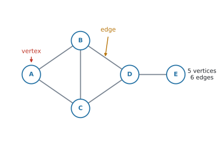{#fig-ahl314-parts width=84%}

@fig-ahl314-parts には、vertex が $5$ つ、edge が $6$ 本あります。vertex は **vertices** と複数形になります。

::: {.callout-warning}
## 「グラフ」でも、$y = f(x)$ のグラフとは別のものです
日本語でも英語でも、同じ **graph** という言葉を使います。**関数のグラフとは、まったく別のもの**です。

この項目の graph には、軸も座標もありません。あるのは「点」と「つながり」だけです。
:::

いちばん大事なのは、**点をどこに置いたかには意味がない**ということです。

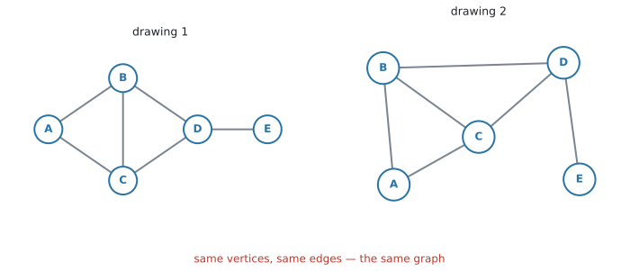{#fig-ahl314-same width=96%}

@fig-ahl314-same の $2$ つは、見た目がまるで違いますが、**同じ graph** です。vertex の名前も、どれとどれが結ばれているかも、まったく同じだからです。

**線の長さも、曲がっているかどうかも、関係ありません。** 意味があるのは「つながっているか、いないか」だけです。

### 2. adjacent と degree {#terms}

用語を $3$ つ入れます。

- $2$ つの vertex が edge で結ばれているとき、その $2$ つは **adjacent**（隣り合っている）といいます
- $2$ 本の edge が同じ vertex を共有しているとき、その $2$ 本は **adjacent edges** です
- $1$ つの vertex から出ている edge の本数を、その vertex の **degree**（次数）といいます

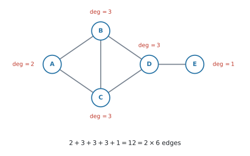{#fig-ahl314-degree width=86%}

@fig-ahl314-degree で、$B$ から出ている edge は $BA$、$BC$、$BD$ の $3$ 本なので $\deg(B) = 3$ です。$E$ からは $1$ 本しか出ていないので $\deg(E) = 1$ です。

#### degree の合計は、edge の数の $2$ 倍です {#handshake}

@fig-ahl314-degree の degree を全部足すと $2+3+3+3+1 = 12$ で、edge の数 $6$ のちょうど $2$ 倍です。これは**いつでも成り立ちます。**

$$
\sum \deg(v) = 2 \times (\text{number of edges})
$$ {#eq-ahl314-handshake}

**公式集にはありません。覚えてください。** 理由は[Why it works](#why-it-works)で説明します。そこが分かっていれば、忘れても作り直せます。

::: {.callout-tip}
## 数え忘れの検算に使えます
degree を全部書き出したあと、合計が **edge の数の $2$ 倍になっているか**を見てください。合わなければ、どこかで数え落としています。

**degree の合計は、必ず偶数です。** 奇数になったら、その時点で間違いです。
:::

### 3. graph の種類 {#kinds}

問題文でよく出る $3$ つの言い方があります。

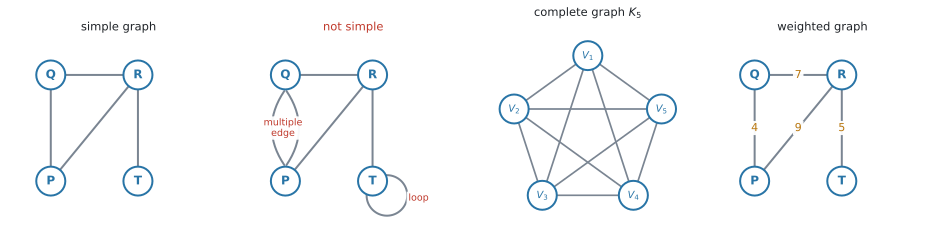{#fig-ahl314-kinds width=100%}

- **simple graph**（単純グラフ）… **loop**（同じ vertex にもどる edge）も、**multiple edge**（同じ $2$ 点を結ぶ $2$ 本以上の edge）もない graph
- **complete graph**（完全グラフ）… **どの $2$ つの vertex も** edge で結ばれている graph。vertex が $n$ 個のものを $K_n$ と書きます
- **weighted graph**（重み付きグラフ）… edge に数（距離・費用・時間など）が書き込まれている graph

#### complete graph の edge の数 {#complete}

$K_n$ では、$n$ 個から $2$ 個を選ぶ組み合わせの数だけ edge があります。

$$
\text{number of edges of } K_n = \frac{n(n-1)}{2}
$$ {#eq-ahl314-complete}

**検算。** @fig-ahl314-kinds の $K_5$ なら $\dfrac{5 \times 4}{2} = 10$ 本 ✓

$K_n$ の各 vertex は、**自分以外の全部**と結ばれているので $\deg = n - 1$ です。@eq-ahl314-handshake で確かめると $n(n-1) = 2 \times \dfrac{n(n-1)}{2}$ ✓

これも公式集にはありません。ただ、**$\dfrac{n(n-1)}{2}$ は「$n$ 個から $2$ 個を選ぶ組み合わせ」の式**なので、電卓の `nCr(n, 2)` でも出せます。

### 4. directed graph では、向きを数えます {#directed}

edge に矢印が付いたものを **directed graph**（有向グラフ）といいます。一方通行の道路や、$1$ 方向だけのリンクを表すのに使います。

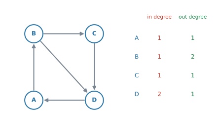{#fig-ahl314-directed width=90%}

矢印が入ってくる本数を **in degree**、出ていく本数を **out degree** といいます。

@fig-ahl314-directed の $D$ には $C$ と $B$ から $2$ 本入り、$A$ へ $1$ 本出ているので、in degree $= 2$、out degree $= 1$ です。

**in degree の合計も、out degree の合計も、矢印の本数と同じ**になります。どちらも $5$ です。$1$ 本の矢印は、どこかから $1$ 回出て、どこかへ $1$ 回入るからです。

::: {.callout-warning}
## 矢印があるかどうかを、先に見てください
directed graph では、$A$ から $B$ へ行けても、$B$ から $A$ へ行けるとはかぎりません。

問題文に `directed` があるか、図に矢印が付いているか。**そこを見てから数え始めてください。**
:::

### 5. connected と strongly connected {#connected}

**connected**（連結）は、**どの $2$ つの vertex のあいだにも道がある**という意味です。

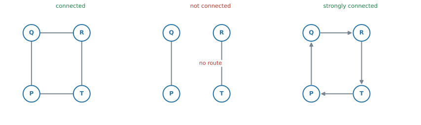{#fig-ahl314-connected width=100%}

@fig-ahl314-connected の真ん中は、左半分と右半分のあいだに edge がないので、**connected ではありません。**

directed graph では、もう $1$ 段きびしい言い方があります。**strongly connected**（強連結）は、**どの $2$ つの vertex についても、矢印の向きに従って行き来できる**という意味です。

$A$ から $B$ へ行けるだけでは足りません。**$B$ から $A$ へも行けなければなりません。**

::: {.callout-tip}
## 一方通行の街だと思ってください
strongly connected は、「どの交差点からどの交差点へも、一方通行の標識を守ったまま行ける」という意味です。

矢印を全部無視すれば connected なのに、向きを守ると行けない場所ができる——これが strongly connected でない graph です。この区別は、[AHL 3.15](ahl-3-15.qmd) の transition matrix で必要になります。
:::

### 6. subgraph と tree {#tree}

**subgraph**（部分グラフ）は、**もとの graph から vertex と edge をいくつか選んだもの**です。新しい edge を足すことはできません。

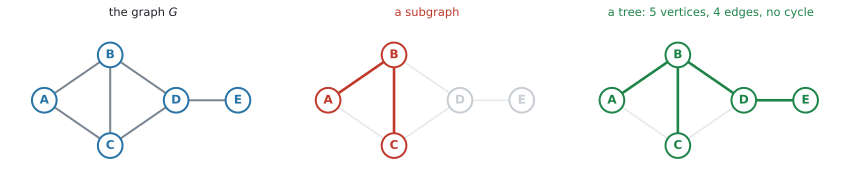{#fig-ahl314-tree width=100%}

**tree**（木）は、**connected で、cycle（一周してもどる道）がない** graph です。

@fig-ahl314-tree の右は tree です。$5$ つの vertex が全部つながっていて、どこをたどっても同じ場所にもどってきません。

#### tree の edge の数 {#tree-edges}

vertex が $n$ 個の tree は、edge が必ず $n - 1$ 本です。

$$
\text{number of edges of a tree} = n - 1
$$ {#eq-ahl314-tree}

$1$ 本でも足すと cycle ができ、$1$ 本でも減らすと切りはなされてしまいます。**これも公式集にはないので、覚えてください。**

::: {.callout-note}
## tree はこのあと使います
**AHL 3.16** の **minimum spanning tree**（最小全域木）は、「全部の vertex を、いちばん軽い重みでつなぐ tree」を探す問題です。

この項目では、**言葉の意味だけ**押さえておけば十分です。
:::

### 7. 現実のものを graph にします {#modelling}

シラバスは、`Students should be able to represent real-world structures (circuits, maps, etc) as graphs` と書いています。**現実の場面を graph に直すところ**が、この項目の出口です。

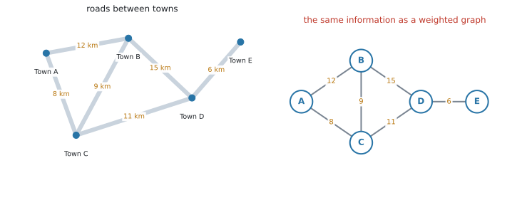{#fig-ahl314-map width=98%}

@fig-ahl314-map の左は地図、右は同じ情報の graph です。町が vertex、道路が edge、距離が weight になっています。

**地図では町の位置に意味がありましたが、graph では意味がありません。** 残っているのは「どの町とどの町が道でつながっているか」と「その距離」だけです。

| 現実のもの | vertex | edge |
|---|---|---|
| 道路網 | 町・交差点 | 道路 |
| 部屋の配置 | 部屋 | ドア・通路 |
| 電気回路 | 接続点 | 配線 |
| 航空路線 | 空港 | 路線 |
| ウェブサイト | ページ | リンク（**directed**） |

: 何を vertex にするか {#tbl-ahl314-model}

::: {.callout-tip}
## 「何を vertex にするか」を先に決めてください
文章題では、まずここで迷います。**つながれる側**が vertex、**つなぐもの**が edge です。

道路の問題なら、道路そのものを vertex にしてはいけません。町が vertex です。
:::

## Why it works

:::: {.callout-note collapse="true" appearance="simple"}
## クリックすると開きます
ここで説明するのは、**なぜ degree の合計が edge の数の $2$ 倍になるのか**、その $1$ 点だけです。

edge を $1$ 本えらんでください。その edge には**両端**があり、片方の vertex の degree に $1$、もう片方の degree に $1$ を足しています。

つまり、**$1$ 本の edge は、degree の合計に必ず $2$ を足す**ということです。

edge が $6$ 本あれば、degree の合計は $6 \times 2 = 12$。これが @eq-ahl314-handshake です。

::: {.callout-note appearance="simple"}
この関係は、英語では **handshake lemma**（握手の補題）と呼ばれます。「$1$ 回の握手には手が $2$ つ要る」からです。試験でこの名前が問われることはありません。
:::
::::

## Worked examples

::: {.callout-note appearance="simple"}
問題文は英語です。意味が理解できなかったら、問題文の下の「**日本語訳**」を開いてください。解説は日本語です。
:::

::: {#exm-ahl314-degree}
[The graph $G$ is shown below.]{.q-en}

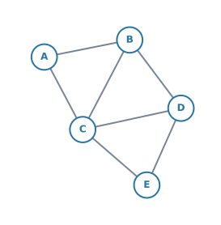{width=58%}

**(a)** [Write down the number of edges of $G$.]{.q-en}

**(b)** [Write down the degree of each vertex, and verify that the sum of the degrees is twice the number of edges.]{.q-en}

**(c)** [Explain why $G$ is a simple graph.]{.q-en}

<details class="jp-trans">
<summary>日本語訳</summary>

グラフ $G$ が下に示されています。

**(a)** $G$ の辺の数を書きなさい。

**(b)** 各頂点の次数を書き、次数の合計が辺の数の $2$ 倍になっていることを確かめなさい。

**(c)** $G$ が simple graph である理由を説明しなさい。

</details>

---

**(a)** 数えます。$AB$、$AC$、$BC$、$BD$、$CD$、$CE$、$DE$ の $7$ 本です。

**数え落としが出やすいところ**なので、$A$ から出るもの、$B$ から出るもの、と**順番に**拾ってください。

**(b)** それぞれの vertex から出ている edge の本数です。

| vertex | $A$ | $B$ | $C$ | $D$ | $E$ |
|---|---|---|---|---|---|
| $\deg$ | $2$ | $3$ | $4$ | $3$ | $2$ |

$$
2 + 3 + 4 + 3 + 2 = 14 = 2 \times 7
$$

@eq-ahl314-handshake のとおりになっています。

**(c)** simple graph の条件は $2$ つでした（[第3節](#kinds)）。loop がないこと、multiple edge がないことです。

::: {.model-answer}
**試験ではこう書く**

*$G$ is simple because no edge joins a vertex to itself (no loops), and no two vertices are joined by more than one edge (no multiple edges).*
:::

（自分自身にもどる edge がなく、同じ $2$ 点を結ぶ edge が $2$ 本以上ないから、という意味です。）

::: {.callout-note}
## 解答例（答案用紙にはこう書く）
**(a)** $7$

**(b)**
$$
\deg(A)=2,\quad \deg(B)=3,\quad \deg(C)=4
$$
$$
\deg(D)=3,\quad \deg(E)=2
$$
$$
2+3+4+3+2 = 14 = 2 \times 7 \quad ✓
$$

**(c)** *There are no loops and no multiple edges, so $G$ is simple.*
:::
:::

::: {#exm-ahl314-directed}
[The directed graph $D$ is shown below.]{.q-en}

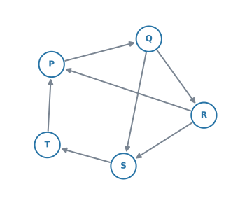{width=58%}

**(a)** [Write down the in degree and the out degree of each vertex.]{.q-en}

**(b)** [Determine whether $D$ is strongly connected, justifying your answer.]{.q-en}

<details class="jp-trans">
<summary>日本語訳</summary>

有向グラフ $D$ が下に示されています。

**(a)** 各頂点の in degree と out degree を書きなさい。

**(b)** $D$ が strongly connected かどうかを判断し、その理由を書きなさい。

</details>

---

**(a)** 矢印を $1$ 本ずつ見て、**入るほう**と**出るほう**に分けて数えます。

| vertex | $P$ | $Q$ | $R$ | $S$ | $T$ |
|---|---|---|---|---|---|
| in degree | $2$ | $1$ | $1$ | $2$ | $1$ |
| out degree | $1$ | $2$ | $2$ | $1$ | $1$ |

**検算。** 矢印は $7$ 本で、in の合計も out の合計も $7$ です ✓（[第4節](#directed)）

**(b)** 「どの vertex からどの vertex へも、矢印の向きどおりに行けるか」を見ます。

$1$ 組ずつ調べると $20$ 通りになって大変です。**全部の vertex を通る一方通行の輪が $1$ つ見つかれば、それで足ります。**

$$
P \to Q \to R \to S \to T \to P
$$

この輪をぐるぐる回れば、**どの vertex からでも、どの vertex にも行けます。**

`justifying your answer` と書かれているので、**この輪を示すところまでが解答**です。「はい」だけでは点になりません。

::: {.model-answer}
**試験ではこう書く**

*Yes. The directed cycle $P \to Q \to R \to S \to T \to P$ passes through every vertex, so from any vertex we can reach any other by following this cycle. Hence $D$ is strongly connected.*
:::

（すべての vertex を通る有向の輪があるので、どの vertex からもどの vertex へも行ける、という意味です。）

::: {.callout-note}
## 解答例（答案用紙にはこう書く）
**(a)**

| vertex | $P$ | $Q$ | $R$ | $S$ | $T$ |
|---|---|---|---|---|---|
| in | $2$ | $1$ | $1$ | $2$ | $1$ |
| out | $1$ | $2$ | $2$ | $1$ | $1$ |

**(b)** *Yes. $P \to Q \to R \to S \to T \to P$ is a directed cycle through all five vertices, so every vertex can be reached from every other vertex. $D$ is strongly connected.*
:::
:::

::: {#exm-ahl314-complete}
[A complete graph has $45$ edges.]{.q-en}

**(a)** [Find the number of vertices.]{.q-en}

**(b)** [Write down the degree of each vertex.]{.q-en}

<details class="jp-trans">
<summary>日本語訳</summary>

ある complete graph の辺の数は $45$ です。

**(a)** 頂点の数を求めなさい。

**(b)** 各頂点の次数を書きなさい。

</details>

---

**(a)** [complete graph の edge の数](#complete)は $\dfrac{n(n-1)}{2}$ でした。これを $45$ とおきます。

$$
\frac{n(n-1)}{2} = 45
$$

$$
n(n-1) = 90 \quad \Rightarrow \quad n^{2} - n - 90 = 0
$$

電卓の `Polynomial Root Finder`（[SL 1.8](../../ai-sl/01-number-and-algebra/sl-1-8.qmd#poly)）に入れると $n = 10$ と $n = -9$ が出ます。

**vertex の数は負になりません。** $n = -9$ は捨てて、理由を一言書いてください。

$$
n = 10
$$

**検算。** $\dfrac{10 \times 9}{2} = 45$ ✓

**(b)** complete graph では、$1$ つの vertex が**自分以外の全部**と結ばれています。

$$
\deg = 10 - 1 = 9
$$

**検算。** $10 \times 9 = 90 = 2 \times 45$ ✓（@eq-ahl314-handshake）

::: {.callout-note}
## 解答例（答案用紙にはこう書く）
**(a)**
$$
\frac{n(n-1)}{2} = 45 \quad \Rightarrow \quad n^{2} - n - 90 = 0
$$
$$
n = 10 \ \text{or} \ n = -9
$$

*$n$ must be positive, so there are $10$ vertices.*

**(b)** $\deg = 9$
:::
:::

::: {#exm-ahl314-model}
[The weighted graph below shows the roads between five delivery points. The weights are distances in kilometres.]{.q-en}

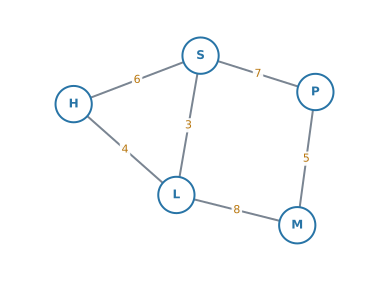{width=62%}

**(a)** [Write down the degree of vertex $L$.]{.q-en}

**(b)** [Explain why this graph is not complete.]{.q-en}

**(c)** [Find the total distance of the route $H \to S \to P \to M$.]{.q-en}

**(d)** [Write down the vertices that are adjacent to $S$.]{.q-en}

<details class="jp-trans">
<summary>日本語訳</summary>

下の重み付きグラフは、$5$ つの配達先のあいだの道路を表しています。重みはキロメートル単位の距離です。

**(a)** 頂点 $L$ の次数を書きなさい。

**(b)** このグラフが complete でない理由を説明しなさい。

**(c)** 経路 $H \to S \to P \to M$ の距離の合計を求めなさい。

**(d)** $S$ に adjacent な頂点を書きなさい。

</details>

---

**(a)** $L$ から出ている edge は $LH$、$LS$、$LM$ の $3$ 本です。$\deg(L) = 3$

**(b)** complete graph は、**どの $2$ 点も結ばれている** graph でした。

vertex が $5$ つなので、complete なら edge は $\dfrac{5 \times 4}{2} = 10$ 本必要です。この図には $6$ 本しかありません。

具体例を $1$ つ挙げるほうが、答案としては強くなります。**$H$ と $P$ を結ぶ edge がありません。**

::: {.model-answer}
**試験ではこう書く**

*The graph is not complete because not every pair of vertices is joined by an edge: for example, there is no edge between $H$ and $P$. A complete graph on $5$ vertices would have $10$ edges, but this graph has only $6$.*
:::

（すべての組が結ばれてはいないから、という意味です。$H$ と $P$ の例と、$10$ 本と $6$ 本の対比を添えています。）

**(c)** 通る edge の weight を足すだけです。

$$
6 + 7 + 5 = 18 \ \text{km}
$$

**(d)** $S$ から edge が出ている先を全部書きます。

$$
H,\ L,\ P
$$

::: {.callout-note}
## 解答例（答案用紙にはこう書く）
**(a)** $\deg(L) = 3$

**(b)** *Not every pair of vertices is joined: for example, $H$ and $P$ are not adjacent. A complete graph on $5$ vertices has $10$ edges, but this one has $6$.*

**(c)**
$$
6 + 7 + 5 = 18 \ \text{km}
$$

**(d)** $H$, $L$, $P$
:::
:::

## Common errors

::: {.callout-warning}
## 図の見た目で「別のグラフ」と判断する
線が交差しているかどうか、線が長いか短いかで、違う graph だと考えてしまう誤りです。

**同じ vertex どうしが結ばれていれば、同じ graph** です（@fig-ahl314-same）。見るのは「つながりの表」であって、絵ではありません。
:::

::: {.callout-warning}
## degree を数えるときに、edge の数を数えてしまう
$\deg(v)$ は「その vertex から出ている edge の本数」です。**graph 全体の edge の数ではありません。**

数えたあとで、[合計が edge の $2$ 倍になっているか](#handshake)を確かめてください。
:::

::: {.callout-warning}
## degree の合計が奇数になる
@eq-ahl314-handshake より、degree の合計は**必ず偶数**です。

奇数が出たら、計算する前に**数え間違い**です。もう一度、$1$ つの vertex ずつ数え直してください。
:::

::: {.callout-warning}
## complete graph の edge の数を $n(n-1)$ とする
$2$ で割るのを忘れる誤りです。

$A$ と $B$ を結ぶ edge は $1$ 本で、「$A$ から $B$」と「$B$ から $A$」を別に数えてはいけません。**$2$ 回数えた分を、$2$ で割って戻します。**
:::

::: {.callout-warning}
## directed graph で、in と out を分けずに数える
矢印付きの図で $\deg = 3$ とだけ書いてしまう誤りです。

directed graph では、聞かれているのは **in degree** と **out degree** です。**$2$ つに分けて書いてください。**
:::

::: {.callout-warning}
## connected と strongly connected を混同する
`strongly connected` は directed graph だけの言葉です。矢印のない graph に使ってはいけません。

逆に、矢印のある graph に `connected` とだけ答えると、**向きを見ていない**と判断されます。問題文にどちらが書かれているかを見てください。
:::

::: {.callout-warning}
## strongly connected の理由を「図を見れば分かる」で済ませる
`justify` や `explain` が付いた設問では、**行き来できることを示す道を書く**必要があります。

@exm-ahl314-directed のように、**全部の vertex を通る有向の輪**を $1$ つ書くのが、いちばん短い答え方です。
:::

::: {.callout-warning}
## subgraph に、もとの graph にない edge を足す
subgraph は「選ぶ」だけです。**新しく結ぶことはできません。**

選んだ vertex どうしでも、もとの graph で結ばれていなければ、subgraph でも結べません。
:::

::: {.callout-warning}
## tree なのに cycle を残してしまう
`tree` と言われたのに、一周できる道が残っている図をかいてしまう誤りです。

vertex が $n$ 個なら edge は $n-1$ 本（@eq-ahl314-tree）。**本数を数えるだけで、その場で確かめられます。**
:::

## Using your GDC (TI-Nspire CX II)

**この項目は、電卓よりも紙と鉛筆の項目です。** 図を読んで数える作業が中心なので、電卓の出番は多くありません。

とはいえ、$3$ つだけ使い道があります。

### 1. complete graph の edge の数 {#gdc-ncr}

$\dfrac{n(n-1)}{2}$ は、組み合わせの `nCr` で出せます。

```
nCr(12, 2)
```

$66$ と返ります。$K_{12}$ の edge の数です。手で $\dfrac{12 \times 11}{2}$ と計算しても同じですが、**桁が大きいときはこちらが速い**です。

### 2. 逆に、edge の数から vertex の数を出す {#gdc-solve}

@exm-ahl314-complete のように $\dfrac{n(n-1)}{2} = 45$ を解くときは、$2$ 次方程式なので `Polynomial Root Finder` が使えます。

```
menu → Algebra → Polynomial Tools → Find Roots of Polynomial
```

次数 $2$、係数 $1$、$-1$、$-90$ と入れると、$10$ と $-9$ が返ります。

::: {.callout-warning}
## 電卓が返した負の解は、必ず捨ててください
vertex の数は負になりません。**捨てた理由を答案に一言書く**ところまでが解答です（[SL 1.8](../../ai-sl/01-number-and-algebra/sl-1-8.qmd)）。
:::

### 3. degree の合計を足す {#gdc-sum}

vertex が多いときは、degree をリストに入れて `sum()` で足すと、数え落としが見つけやすくなります。

```
sum({2, 3, 4, 3, 2})
```

$14$ と返れば、edge が $7$ 本のはずです。**合っていなければ、数え直しの合図**です。

::: {.callout-note}
## 隣接行列は、次の項目です
「つながりを行列で書く」やり方は [AHL 3.15](ahl-3-15.qmd) で扱います。そこからは、電卓の出番が一気に増えます。

この項目では、**言葉と数え方**に集中してください。
:::

## Exercises

::: {.callout-note appearance="simple"}
各問題に、折りたたみが3つ付いています。**日本語訳**、**解答例**（答案用紙に書くべきこと。英語です）、**解説**（なぜそうなるか。日本語です）。

まず自分で解いて、次に解答例と見くらべてください。**解説は、合わなかったときだけ開けば十分です。**
:::

::: {.exercise-block}

[1]{.ex-no} [The graph below has vertices $A$, $B$, $C$, $D$, $E$ and $F$.]{.q-en}

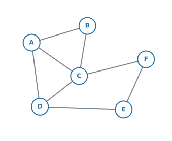{width=54%}

**(a)** [Write down the number of edges.]{.q-en}

**(b)** [Write down the degree of each vertex.]{.q-en}

**(c)** [Verify your answers using the sum of the degrees.]{.q-en}

<details class="jp-trans">
<summary>日本語訳</summary>

下のグラフは、頂点 $A$、$B$、$C$、$D$、$E$、$F$ をもちます。

**(a)** 辺の数を書きなさい。

**(b)** 各頂点の次数を書きなさい。

**(c)** 次数の合計を使って、答えを確かめなさい。

</details>

::: {.callout-note collapse="true"}
## 解答例（答案用紙に書くこと）
**(a)** $8$

**(b)**
$$
\deg(A)=3,\quad \deg(B)=2,\quad \deg(C)=4
$$
$$
\deg(D)=3,\quad \deg(E)=2,\quad \deg(F)=2
$$

**(c)**
$$
3+2+4+3+2+2 = 16 = 2 \times 8 \quad ✓
$$
:::

::: {.callout-tip collapse="true"}
## 解説
**(a)** $AB$、$AC$、$AD$、$BC$、$CD$、$DE$、$EF$、$CF$ の $8$ 本です。**$1$ つの vertex から出るものを順に拾う**と、数え落としが減ります。

**(c)** 合計 $16$ が $8$ の $2$ 倍になっているので、(a) と (b) はどちらも合っています（@eq-ahl314-handshake）。合わなかったら、**両方を疑ってください。**
:::

::: {.ex-sep}
:::

[2]{.ex-no} [A graph has $9$ edges. Every vertex has degree $3$. Find the number of vertices.]{.q-en}

<details class="jp-trans">
<summary>日本語訳</summary>

あるグラフの辺の数は $9$ です。すべての頂点の次数は $3$ です。頂点の数を求めなさい。

</details>

::: {.callout-note collapse="true"}
## 解答例（答案用紙に書くこと）
$$
\sum \deg(v) = 2 \times 9 = 18
$$
$$
3n = 18 \quad \Rightarrow \quad n = 6
$$
:::

::: {.callout-tip collapse="true"}
## 解説
図がなくても解けます。@eq-ahl314-handshake から、degree の合計は $18$ と決まります。

そのうえで「$3$ が $n$ 個で $18$」と考えれば、$n = 6$ です。

**graph をかく必要はありません。** この形の問題は、$2$ 行で終わります。
:::

::: {.ex-sep}
:::

[3]{.ex-no} [Consider the complete graph $K_{7}$.]{.q-en}

**(a)** [Write down the degree of each vertex.]{.q-en}

**(b)** [Find the number of edges.]{.q-en}

<details class="jp-trans">
<summary>日本語訳</summary>

complete graph $K_{7}$ を考えます。

**(a)** 各頂点の次数を書きなさい。

**(b)** 辺の数を求めなさい。

</details>

::: {.callout-note collapse="true"}
## 解答例（答案用紙に書くこと）
**(a)** $\deg = 7 - 1 = 6$

**(b)**
$$
\frac{7 \times 6}{2} = 21
$$
:::

::: {.callout-tip collapse="true"}
## 解説
**(a)** complete graph では、$1$ つの vertex が自分以外の $6$ つ全部と結ばれています。

**(b)** @eq-ahl314-complete に $n = 7$ を入れます。電卓なら `nCr(7, 2)` でも $21$ が出ます（[GDC 第1節](#gdc-ncr)）。

**検算。** $7 \times 6 = 42 = 2 \times 21$ ✓
:::

::: {.ex-sep}
:::

[4]{.ex-no} [Explain why there is no graph with exactly five vertices, each of degree $3$.]{.q-en}

<details class="jp-trans">
<summary>日本語訳</summary>

次数がすべて $3$ である頂点をちょうど $5$ つもつグラフが存在しない理由を説明しなさい。

</details>

::: {.callout-note collapse="true"}
## 解答例（答案用紙に書くこと）
$$
\sum \deg(v) = 5 \times 3 = 15
$$

*The sum of the degrees must equal twice the number of edges, so it must be even. $15$ is odd, so no such graph exists.*
:::

::: {.callout-tip collapse="true"}
## 解説
degree の合計は、edge の数の $2$ 倍でした。ですから、**必ず偶数**になります。

$5 \times 3 = 15$ は奇数なので、そんな graph は作れません。

**図をかいて試す必要はありません。** 合計が奇数だと分かった時点で、答えが出ています。この形の問題は、@eq-ahl314-handshake だけで片付きます。
:::

::: {.ex-sep}
:::

[5]{.ex-no} [The directed graph below has vertices $A$, $B$, $C$ and $D$.]{.q-en}

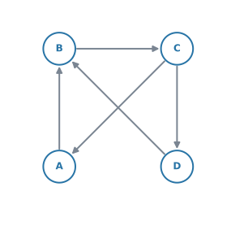{width=42%}

**(a)** [Write down the in degree and the out degree of each vertex.]{.q-en}

**(b)** [Verify that both totals equal the number of directed edges.]{.q-en}

<details class="jp-trans">
<summary>日本語訳</summary>

下の有向グラフは、頂点 $A$、$B$、$C$、$D$ をもちます。

**(a)** 各頂点の in degree と out degree を書きなさい。

**(b)** どちらの合計も有向辺の数に等しいことを確かめなさい。

</details>

::: {.callout-note collapse="true"}
## 解答例（答案用紙に書くこと）
**(a)**

| vertex | $A$ | $B$ | $C$ | $D$ |
|---|---|---|---|---|
| in | $1$ | $2$ | $1$ | $1$ |
| out | $1$ | $1$ | $2$ | $1$ |

**(b)**
$$
1+2+1+1 = 5, \qquad 1+1+2+1 = 5
$$

*There are $5$ directed edges, so both totals are correct.*
:::

::: {.callout-tip collapse="true"}
## 解説
矢印は $A \to B$、$B \to C$、$C \to A$、$C \to D$、$D \to B$ の $5$ 本です。

**入る矢印と出る矢印を、別々に数えてください。** 混ぜてしまうのが一番多い誤りです。

**(b)** $1$ 本の矢印は「どこかから出て、どこかへ入る」ので、in の合計も out の合計も矢印の本数と同じになります（[第4節](#directed)）。
:::

::: {.ex-sep}
:::

[6]{.ex-no} [Two directed graphs are shown below.]{.q-en}

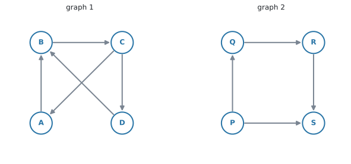{width=76%}

[For each graph, determine whether it is strongly connected. Justify your answers.]{.q-en}

<details class="jp-trans">
<summary>日本語訳</summary>

$2$ つの有向グラフが下に示されています。

それぞれについて、strongly connected かどうかを判断しなさい。理由も書きなさい。

</details>

::: {.callout-note collapse="true"}
## 解答例（答案用紙に書くこと）
**Graph 1** *is strongly connected. The directed cycle $A \to B \to C \to A$ joins those three vertices, $D$ is reached by $C \to D$, and $D \to B$ returns to the cycle. So every vertex can be reached from every other vertex; for example $D \to B \to C \to A$.*

**Graph 2** *is not strongly connected: no directed edge leaves $S$, so it is impossible to travel from $S$ to any other vertex.*
:::

::: {.callout-tip collapse="true"}
## 解説
**graph 1** は、$C \to A$ という「もどる矢印」があるのが効いています。$D$ から $A$ へも $D \to B \to C \to A$ で行けます。

**graph 2** は、$S$ から出る矢印が $1$ 本もありません。**入ってくるだけで、出られません。** ですから strongly connected ではありません。

`justify` が付いているので、**行けない具体例を $1$ つ挙げる**ところまで書いてください。「いいえ」だけでは点になりません。

なお graph 2 も、**矢印を無視すれば connected** です。connected と strongly connected を混同しないでください（[第5節](#connected)）。
:::

::: {.ex-sep}
:::

[7]{.ex-no} [A tree has $12$ vertices. Write down the number of edges.]{.q-en}

<details class="jp-trans">
<summary>日本語訳</summary>

ある tree の頂点の数は $12$ です。辺の数を書きなさい。

</details>

::: {.callout-note collapse="true"}
## 解答例（答案用紙に書くこと）
$$
12 - 1 = 11
$$
:::

::: {.callout-tip collapse="true"}
## 解説
tree の edge の数は、いつも「vertex の数 $- 1$」です（@eq-ahl314-tree）。

**検算。** degree の合計は $2 \times 11 = 22$ になるはずです。
:::

::: {.ex-sep}
:::

[8]{.ex-no} [Using the graph in question 1, write down the edges of the subgraph formed by the vertices $A$, $B$, $C$ and $D$ only.]{.q-en}

<details class="jp-trans">
<summary>日本語訳</summary>

問題 1 のグラフについて、頂点 $A$、$B$、$C$、$D$ だけでできる部分グラフの辺を書きなさい。

</details>

::: {.callout-note collapse="true"}
## 解答例（答案用紙に書くこと）
$$
AB,\quad AC,\quad AD,\quad BC,\quad CD
$$
:::

::: {.callout-tip collapse="true"}
## 解説
$A$、$B$、$C$、$D$ の**両端がそろっている edge だけ**を残します。

$DE$、$EF$、$CF$ は、$E$ や $F$ が選ばれていないので入りません。

**新しい edge を足してはいけません。** たとえば $B$ と $D$ を結びたくなりますが、もとの graph に $BD$ がないので、subgraph にも入りません（[第6節](#tree)）。
:::

::: {.ex-sep}
:::

[9]{.ex-no} [The graph below shows five areas of a house. Two areas are joined by an edge if there is a door between them.]{.q-en}

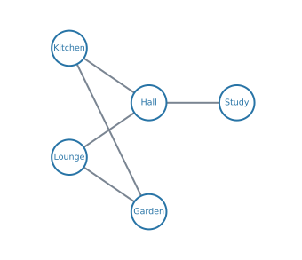{width=54%}

**(a)** [Write down the degree of the vertex Hall, and interpret this number in context.]{.q-en}

**(b)** [Explain why the graph is connected, and say what this means for the house.]{.q-en}

<details class="jp-trans">
<summary>日本語訳</summary>

下のグラフは、ある家の $5$ つの場所を表しています。あいだにドアがあるとき、$2$ つの場所は辺で結ばれています。

**(a)** 頂点 Hall の次数を書き、その数が文脈で何を意味するかを説明しなさい。

**(b)** このグラフが connected である理由を説明し、それが家について何を意味するかを書きなさい。

</details>

::: {.callout-note collapse="true"}
## 解答例（答案用紙に書くこと）
**(a)** $\deg(\text{Hall}) = 3$

*The hall has three doors leading directly to other areas.*

**(b)** *Every area can be reached from every other area, for example Study $\to$ Hall $\to$ Kitchen $\to$ Garden. So you can walk from any area of the house to any other without going outside.*
:::

::: {.callout-tip collapse="true"}
## 解説
**(a)** Hall から出ている edge は Kitchen、Lounge、Study の $3$ 本です。

`interpret this number in context` と言われたら、**$3$ という数字が現実で何なのか**を書きます。ここでは「ドアが $3$ つある」です。**数字だけでは点になりません。**

**(b)** connected は「どの $2$ 点のあいだにも道がある」でした。ここでは「どの部屋からどの部屋へも行ける」という意味になります。

理由として**具体的な道を $1$ つ**書いておくと、答案が強くなります。
:::

::: {.ex-sep}
:::

[10]{.ex-no} [The weighted graph below shows the times, in minutes, to walk between four buildings.]{.q-en}

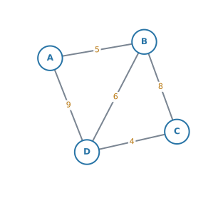{width=50%}

**(a)** [Write down the degree of vertex $D$.]{.q-en}

**(b)** [Find the total time for the route $A \to B \to D \to C$.]{.q-en}

**(c)** [Find a quicker route from $A$ to $C$, and state its total time.]{.q-en}

<details class="jp-trans">
<summary>日本語訳</summary>

下の重み付きグラフは、$4$ つの建物のあいだを歩く時間（分）を表しています。

**(a)** 頂点 $D$ の次数を書きなさい。

**(b)** 経路 $A \to B \to D \to C$ にかかる合計時間を求めなさい。

**(c)** $A$ から $C$ へのもっと速い経路を $1$ つ見つけ、その合計時間を書きなさい。

</details>

::: {.callout-note collapse="true"}
## 解答例（答案用紙に書くこと）
**(a)** $\deg(D) = 3$

**(b)**
$$
5 + 6 + 4 = 15 \ \text{minutes}
$$

**(c)** *The route $A \to D \to C$ takes*
$$
9 + 4 = 13 \ \text{minutes}
$$
:::

::: {.callout-tip collapse="true"}
## 解説
**(a)** $D$ から出ている edge は $DA$、$DB$、$DC$ の $3$ 本です。

**(b)** 通った edge の weight を足すだけです。$AB = 5$、$BD = 6$、$DC = 4$ で $15$ 分。

**(c)** 同じ場所を $2$ 度通らない道は、$4$ つあります。

| 経路 | 時間 |
|---|---|
| $A \to B \to C$ | $5 + 8 = 13$ |
| $A \to D \to C$ | $9 + 4 = 13$ |
| $A \to B \to D \to C$ | $5 + 6 + 4 = 15$ |
| $A \to D \to B \to C$ | $9 + 6 + 8 = 23$ |

$13$ 分の道が $2$ つあるので、**どちらを書いても正解**です。`a quicker route` は「(b) より速い道を $1$ つ」という意味なので、$1$ つ書けば足ります。

**重みの大きい edge を通る道が、いつも遅いとはかぎりません。** $AD$ は $9$ と大きいのに、$A \to D \to C$ は速いほうに入ります。**必ず足して比べてください。**
:::

:::
