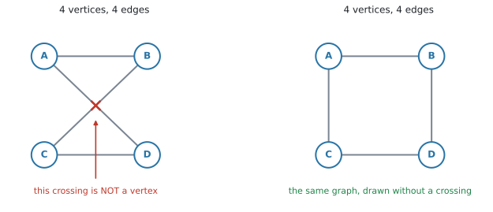
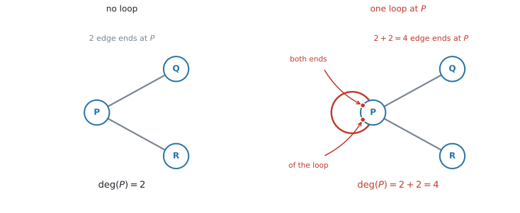
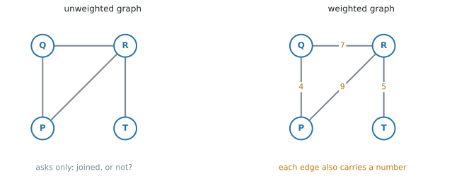
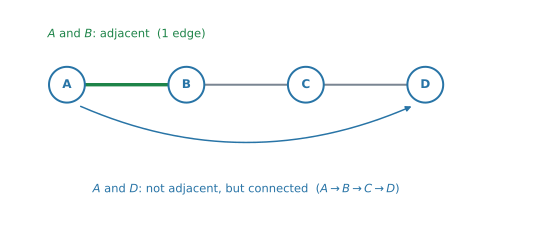
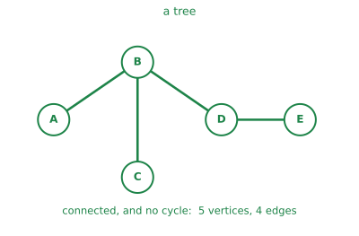
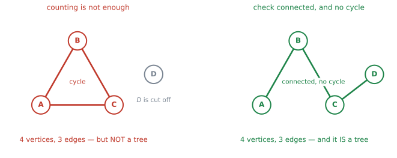

# AHL 3.14 — Graph theory（グラフ理論） {#sec-ahl-3-14}

::: {.callout-note}
## What you should be able to do
- 道路網・部屋・回路などの**現実の構造を、自分で graph に直せる**。何を **vertex**（頂点）にし、何を **edge**（辺）にするかを決められる。
- **adjacent**（隣り合う）と **degree**（次数）を読み取り、degree の合計が edge の数の $2$ 倍になる理由を言える。
- **unweighted / weighted**、**directed**、**simple**、**complete** を見分けられる。
- **adjacent** と **connected**（連結）のちがい、**connected** と **strongly connected**（強連結）のちがいを説明できる。
- **subgraph**（部分グラフ）が何かを言える。
- **tree**（木）かどうかを、**connected であること**と **cycle がないこと**の $2$ つで判定できる。
:::

::: {.callout-note}
## 日本の高校では習いません
graph theory は、日本の高校数学の課程にありません。ですから、**まったく初めてで当たり前**です。このページは、何も知らないところから読めるように書いてあります。

計算そのものは、足し算と数えることだけです。**新しいのは言葉と、その言葉が何を指しているか**です。
:::

::: {.callout-note}
## graph theory は $3$ ページ続きます
この $3$ つは、$1$ つの単元です。

| ページ | やること |
|---|---|
| **AHL 3.14**（このページ） | 現実の構造を graph に直し、**言葉を決める** |
| [AHL 3.15](ahl-3-15.qmd) | graph を **adjacency matrix** に直して、**計算する** |
| [AHL 3.16](ahl-3-16.qmd) | graph の上の**道**と、**最適化の algorithm** |

このページで決めた言葉が、あとの $2$ ページでそのまま使われます。**急がずに、言葉の指すものを図で確かめながら読んでください。**

なお、公式集にはこの $3$ ページの欄がありません。ただ、出てくる関係はどれも短く、**理由から作り直せます**。このページでも、そのつど理由を書きます。
:::

## The idea

### 1. まず、現実のものを graph にします {#modelling}

シラバスは、この項目の出発点をこう書いています。

> Students should be able to represent real-world structures (circuits, maps, etc) as graphs (weighted and unweighted)

つまり、**現実の場面を点と線に直すところ**から始まります。定義より先に、その作業を見てください。

{#fig-ahl314-map width=98%}

@fig-ahl314-map の左は地図です。町の位置、道路の曲がりぐあい、地図上の距離——いろいろな情報が入っています。

右は、同じ場面から**「どの町とどの町が道でつながっているか」と「その距離」だけ**を取り出したものです。

::: {.callout-important}
## 捨てるのは位置、残すのは接続関係
地図では、町の**位置**に意味がありました。右の図には、その意味がありません。**点をどこに置いても構いません。**

残っているのは、**つながり方**（と、書き込まれた数）だけです。この「位置を捨てて、つながりだけを残した図」が **graph**（グラフ）です。
:::

同じことは、地図以外でもできます。

| 現実のもの | vertex にするもの | edge にするもの |
|---|---|---|
| 道路網 | 町・交差点 | 道路 |
| 部屋の配置 | 部屋 | ドア・通路 |
| 電気回路 | 接続点 | 配線 |
| 航空路線 | 空港 | 路線 |
| ウェブサイト | ページ | リンク（**向きがあります**） |

: 何を vertex にするか {#tbl-ahl314-model}

::: {.callout-tip}
## 「何を vertex にするか」を先に決めてください
文章題では、まずここで迷います。**つながれる側**が vertex、**つなぐもの**が edge です。

道路の問題なら、道路そのものを vertex にしてはいけません。町が vertex です。
:::

### 2. graph、vertex、edge {#what}

言葉を決めます。**graph** は、**vertex**（頂点）と、それを結ぶ **edge**（辺）でできた図です。

{#fig-ahl314-parts width=84%}

@fig-ahl314-parts には vertex が $5$ つ、edge が $6$ 本あります。vertex の複数形は **vertices** です。

::: {.callout-warning}
## 「グラフ」でも、$y = f(x)$ のグラフとは別のものです
日本語でも英語でも、同じ **graph** という言葉を使います。**関数のグラフとは、まったく別のもの**です。

この項目の graph には、軸も座標もありません。あるのは「点」と「つながり」だけです。
:::

[第1節](#modelling)で位置を捨てたので、**同じ graph を、いくらでも違う形に描けます。**

{#fig-ahl314-same width=96%}

@fig-ahl314-same の $2$ つは、見た目がまるで違いますが、**同じ graph** です。vertex の名前も、どれとどれが結ばれているかも、まったく同じだからです。

**線の長さも、曲がっているかどうかも、関係ありません。**

### 3. 線が交差しても、そこは vertex ではありません {#crossing}

図を描き直していると、線どうしが交わることがあります。

{#fig-ahl314-crossing width=98%}

@fig-ahl314-crossing の左では、$AD$ と $BC$ が真ん中で交わっています。**その交点は vertex ではありません。**

vertex は、**丸が描いてあるところだけ**です。交点に丸がなければ、そこは「たまたま紙の上で線が重なった場所」にすぎません。

右は、まったく同じ graph を、交差しないように描き直したものです。**vertex は $4$ つ、edge は $4$ 本**——左と同じです。

::: {.callout-warning}
## 交点を数えて、vertex が $5$ つと答えない
左の図を見て「vertex は $5$ つ」と書いてしまうのが、この項目のいちばん最初の誤りです。

**丸の数を数えてください。** 交差は、描き方の都合で出たり消えたりします。
:::

### 4. adjacent — 隣り合っているということ {#adjacent}

言葉を $2$ つ入れます。どちらも「$1$ 本の edge を共有している」という意味です。

- $2$ つの **vertex** が edge $1$ 本で直接結ばれているとき、その $2$ つは **adjacent vertices**（隣接する頂点）といいます
- $2$ 本の **edge** が同じ vertex を共有しているとき、その $2$ 本は **adjacent edges**（隣接する辺）といいます

@fig-ahl314-parts では、$A$ と $B$ は adjacent です。$A$ と $E$ は、直接結ばれていないので adjacent ではありません。

[Write down the vertices adjacent to $B$.]{.q-en} と問われたら、**$B$ から edge が $1$ 本で届く先を全部**書きます。

### 5. degree は、vertex に付いている edge の端の数です {#degree}

**degree**（次数）$\deg(v)$ は、**その vertex に付いている edge の「端」の数**です。

{#fig-ahl314-degree width=86%}

@fig-ahl314-degree で、$B$ に付いているのは $BA$、$BC$、$BD$ の $3$ 本なので $\deg(B) = 3$ です。$E$ には $1$ 本しか付いていないので $\deg(E) = 1$ です。

「出ている edge の本数」と言っても、ふつうは同じことになります。ただし、**$1$ か所だけ違う場面**があります。

::: {.callout-important}
## loop は、degree に $2$ と数えます
**loop**（自己ループ）は、同じ vertex にもどってくる edge です。この edge は、**両方の端が同じ vertex に付いています。**

ですから、loop $1$ 本は degree に **$2$** を足します。$1$ ではありません。

{#fig-ahl314-loop width=98%}

@fig-ahl314-loop の左では、$P$ に $PQ$ と $PR$ の $2$ 本が付いていて $\deg(P) = 2$ です。右で loop を $1$ 本足すと、その $1$ 本が**赤い点の $2$ か所で $P$ に付きます。** ですから端の数は $2$ 増えて、$\deg(P) = 4$ になります。

「edge の本数」ではなく「**端の数**」と覚えておくと、ここで迷いません。
:::

::: {.callout-note}
## degree の値だけで、edge の本数は決まりません
$\deg(v) = 4$ と分かっても、$v$ に付いている edge が $4$ 本とはかぎりません。loop が $1$ 本あれば、edge は $3$ 本です。

試験に出る graph の多くは loop のない **simple graph**（[第8節](#kinds)）なので、ふだんは気にせずに済みます。**loop が描いてあるときだけ、ここに戻ってきてください。**
:::

### 6. degree の合計は、edge の数の $2$ 倍です {#handshake}

@fig-ahl314-degree の degree を全部足すと $2+3+3+3+1 = 12$ で、edge の数 $6$ のちょうど $2$ 倍です。これは**いつでも成り立ちます。**

$$
\sum \deg(v) = 2 \times (\text{number of edges})
$$ {#eq-ahl314-handshake}

**覚えるものではありません。** 理由が $1$ 行だからです。

> **$1$ 本の edge には、端が $2$ つある。**

degree は「端の数」でした（[第5節](#degree)）。ですから、graph 全体の degree を足すということは、**全部の edge の端を数えている**ことになります。edge が $6$ 本なら端は $12$ 個、それが合計です。

loop も、この $1$ 行にそのまま従います。loop の $2$ つの端は同じ vertex に付いているので、その vertex の degree に $2$ を足します。

::: {.callout-tip}
## 数え忘れの検算に使えます
degree を全部書き出したあと、合計が **edge の数の $2$ 倍になっているか**を見てください。合わなければ、どこかで数え落としています。

**degree の合計は、必ず偶数です。** 奇数になったら、その時点で間違いです。
:::

### 7. unweighted graph と weighted graph {#weighted}

ここまでの graph は、edge に何も書いてありませんでした。これを **unweighted graph**（重みなしグラフ）といいます。

{#fig-ahl314-weighted width=98%}

**weighted graph**（重み付きグラフ）は、edge $1$ 本ずつに**数**が書き込まれた graph です。その数を **weight**（重み）といいます。

$2$ つの違いは、**答えられる問いの種類**です。

| | 書いてあるもの | 答えられる問い |
|---|---|---|
| **unweighted** | つながっているかどうかだけ | 行けるか。何本の edge を通るか |
| **weighted** | それに加えて、各 edge の数 | **どれだけかかるか**。どれがいちばん短いか |

: unweighted と weighted {#tbl-ahl314-weighted}

weight は距離とはかぎりません。**時間・費用・容量**など、問題文が決めます。

::: {.callout-warning}
## weight の大小と、線の長さは無関係です
weight $9$ の edge が、weight $2$ の edge より短く描いてあることがあります。**図の見た目ではなく、書かれた数を読んでください。**

[第1節](#modelling)で位置を捨てたので、線の長さには意味がありません。
:::

::: {.callout-note}
## weight は、AHL 3.16 の主役です
[AHL 3.16](ahl-3-16.qmd) の「最短の道」「いちばん軽くつなぐ」という問題は、すべて weighted graph の話です。

このページでは、**足して比べられれば十分**です。
:::

### 8. simple graph、complete graph、directed graph {#kinds}

問題文でよく出る言い方を、あと $3$ つ入れます。

{#fig-ahl314-kinds width=100%}

- **simple graph**（単純グラフ）… **loop** も、**multiple edge**（多重辺。同じ $2$ 点を結ぶ $2$ 本以上の edge）もない graph
- **complete graph**（完全グラフ）… **どの $2$ つの vertex も** edge で結ばれている graph。vertex が $n$ 個のものを $K_n$ と書きます

@fig-ahl314-kinds のいちばん右には、[第7節](#weighted)の **weighted graph** も並べてあります。$3$ つ目の **directed graph** は、このあとの見出しで扱います。

#### complete graph の edge の数 {#complete}

$K_n$ では、$n$ 個から $2$ 個を選ぶ組み合わせの数だけ edge があります。

$$
\text{number of edges of } K_n = \frac{n(n-1)}{2}
$$ {#eq-ahl314-complete}

これも、理由のほうが短いものです。$1$ つの vertex から $n-1$ 本ずつ出ているので、端は全部で $n(n-1)$ 個。@eq-ahl314-handshake より、edge はその半分です。

**検算。** @fig-ahl314-kinds の $K_5$ なら $\dfrac{5 \times 4}{2} = 10$ 本 ✓

電卓の `nCr(n, 2)` でも同じ値が出ます。$\dfrac{n(n-1)}{2}$ が「$n$ 個から $2$ 個を選ぶ組み合わせ」の式だからです。

#### directed graph {#directed}

edge に矢印が付いたものを **directed graph**（有向グラフ）といいます。一方通行の道路や、$1$ 方向だけのリンクを表すのに使います。

矢印の付いていない、ここまで見てきたほうの graph は **undirected graph**（無向グラフ）です。**このサイトでは、以降どちらも英語のまま書きます。**

{#fig-ahl314-directed width=90%}

矢印が入ってくる本数を **in degree**（入次数）、出ていく本数を **out degree**（出次数）といいます。

@fig-ahl314-directed の $D$ には $C$ と $B$ から $2$ 本入り、$A$ へ $1$ 本出ているので、in degree $= 2$、out degree $= 1$ です。

**in degree の合計も、out degree の合計も、矢印の本数と同じ**になります。どちらも $5$ です。$1$ 本の矢印は、どこかから $1$ 回出て、どこかへ $1$ 回入るからです。

::: {.callout-warning}
## 矢印があるかどうかを、先に見てください
directed graph では、$A$ から $B$ へ行けても、$B$ から $A$ へ行けるとはかぎりません。

問題文に `directed` があるか、図に矢印が付いているか。**そこを見てから数え始めてください。**
:::

### 9. adjacent と connected は、別のことです {#connected}

似ていますが、指しているものが違います。

{#fig-ahl314-adjacent width=94%}

- **adjacent** … **edge $1$ 本で直接**結ばれている（[第4節](#adjacent)）
- **connected**（連結）… **edge を何本か乗りついで**行き来できる

@fig-ahl314-adjacent で、$A$ と $B$ は adjacent です。$A$ と $D$ は adjacent ではありませんが、$A \to B \to C \to D$ と乗りついで行けるので **connected** です。

graph 全体について `connected` と言うときは、**どの $2$ つの vertex のあいだにも、乗りついで行ける道がある**という意味です。

{#fig-ahl314-connected width=100%}

@fig-ahl314-connected の真ん中は、左半分と右半分のあいだに edge が $1$ 本もないので、**connected ではありません。**

::: {.callout-warning}
## 「$A$ と $D$ は結ばれていないから connected ではない」としない
それは **adjacent** でないというだけです。connected は、**乗りついでよい**のです。

`connected` と問われたら、**行ける道を $1$ つ書いて**示してください。
:::

### 10. strongly connected {#strong}

directed graph では、もう $1$ 段きびしい言い方があります。**strongly connected**（強連結）は、**どの $2$ つの vertex についても、矢印の向きに従って行き来できる**という意味です。

$A$ から $B$ へ行けるだけでは足りません。**$B$ から $A$ へも行けなければなりません。**

::: {.callout-tip}
## 一方通行の街だと思ってください
strongly connected は、「どの交差点からどの交差点へも、一方通行の標識を守ったまま行ける」という意味です。

矢印を全部無視すれば connected なのに、向きを守ると行けない場所ができる——これが strongly connected でない graph です。この区別は、[AHL 3.15](ahl-3-15.qmd#transition) の transition matrix で必要になります。
:::

### 11. subgraph {#subgraph}

**subgraph**（部分グラフ）は、もとの graph から **vertex をいくつか選び、edge をいくつか選んだ**ものです。

条件は $2$ つだけです。

1. **新しい edge を足さない。** もとの graph にない結び方は、subgraph にも入りません。
2. **選んだ edge の両端の vertex は、必ず選んでおく。** 端のない edge は描けないからです。

{#fig-ahl314-tree width=100%}

::: {.callout-important}
## 選んだ vertex のあいだの edge を、全部残す必要はありません
ここを取りちがえやすいところです。$A$、$B$、$C$ を選んだからといって、$AB$、$BC$、$AC$ を**全部入れなければならないわけではありません。** $AB$ と $BC$ だけの subgraph も、正しい subgraph です。

いっぽう、**選んだ vertex のあいだの edge をすべて残した** subgraph には、**induced subgraph**（誘導部分グラフ）という名前が付いています。試験でこの語が使われることはまれですが、問題文が「これらの頂点のあいだの辺をすべて含む部分グラフ」と書いていたら、それのことです。

**問題文が edge をどう指定しているか**を、先に読んでください。
:::

### 12. tree {#tree}

**tree**（木）は、次の $2$ つを**両方**みたす graph です。

1. **connected** である（[第9節](#connected)）
2. **cycle**（閉路。同じ vertex にもどってくる輪）がない

@fig-ahl314-tree の右は tree です。$5$ つの vertex が全部つながっていて、どこをたどっても同じ場所にもどってきません。その部分だけを取り出すと、こうなります。

{#fig-ahl314-treeonly width=72%}

#### vertex が $n$ 個の tree は、edge が $n-1$ 本です {#tree-edges}

vertex が $n$ 個の tree は、edge が必ず $n - 1$ 本です。

$$
\text{a tree with } n \text{ vertices has } n - 1 \text{ edges}
$$ {#eq-ahl314-tree}

$1$ 本でも足すと cycle ができ、$1$ 本でも減らすと切りはなされてしまいます。

::: {.callout-warning}
## 「$n$ 個と $n-1$ 本だから tree」は、成り立ちません
これは**逆が言えない**関係です。$n$ 個の vertex と $n-1$ 本の edge があっても、tree でないことがあります。

{#fig-ahl314-nottree width=98%}

@fig-ahl314-nottree の左は、vertex が $4$ 個、edge が $3$ 本です。本数は合っています。しかし

- $A$、$B$、$C$ が輪になっている（**cycle がある**）
- $D$ がどこともつながっていない（**connected でない**）

ので、tree ではありません。

**判定するときは、必ず $2$ つとも確かめてください。** connected か。cycle がないか。本数を数えるのは、そのあとの**検算**です。
:::

::: {.callout-note}
## tree はこのあと使います
[AHL 3.16](ahl-3-16.qmd#mst) の **minimum spanning tree**（最小全域木）は、「全部の vertex を、いちばん軽い重みでつなぐ tree」を探す問題です。

この項目では、**言葉の意味と判定のしかた**だけ押さえておけば十分です。
:::

::: {.callout-note appearance="simple"}
なお、道のたどり方には **walk**、**trail**、**path**、**circuit**、**cycle** という $5$ つの名前があり、それぞれ意味が違います。ここでは「cycle = もとの場所にもどってくる輪」という、いちばんゆるい理解で構いません。**正式な区別は [AHL 3.16 の第1節](ahl-3-16.qmd#words)** でまとめて扱います。
:::

## Why it works

:::: {.callout-note collapse="true" appearance="simple"}
## クリックすると開きます
[第6節](#handshake)で、degree の合計が edge の数の $2$ 倍になる理由を見ました。ここでは、そこから出てくる**もう $1$ つの結論**を見ておきます。あとで何度も使うものです。

> **degree が奇数の vertex は、必ず偶数個ある。**

degree が奇数の vertex を **odd vertex** といいます。なぜ偶数個なのかを見ます。

vertex を、degree が偶数のものと奇数のものに分けます。

$$
\sum \deg(v) = \underbrace{(\text{even vertex の degree の和})}_{\text{偶数どうしの和なので偶数}} + (\text{odd vertex の degree の和})
$$

左辺は @eq-ahl314-handshake より $2 \times (\text{edge の数})$、つまり**偶数**です。右辺の第 $1$ 項も偶数です。

ですから、**odd vertex の degree の和も偶数**でなければなりません。

奇数を足して偶数になるのは、**足した個数が偶数のとき**だけです（$3+5 = 8$ は偶数、$3+5+7 = 15$ は奇数）。したがって、odd vertex の個数は偶数です。

::: {.callout-note appearance="simple"}
この関係は、英語では **handshake lemma**（握手の補題）と呼ばれます。「$1$ 回の握手には手が $2$ つ要る」からです。試験でこの名前が問われることはありません。
:::

この結論は、[AHL 3.16](ahl-3-16.qmd#euler) の Eulerian の判定でそのまま効きます。odd vertex の個数が $0$、$2$、$4$、… しかありえないから、判定表に「$1$ 個のとき」という行が無いのです。
::::

## Worked examples

::: {.callout-note appearance="simple"}
問題文は英語です。意味が理解できなかったら、問題文の下の「**日本語訳**」を開いてください。解説は日本語です。
:::

::: {#exm-ahl314-degree}
[The graph $G$ is shown below.]{.q-en}

{width=58%}

**(a)** [Write down the number of edges of $G$.]{.q-en}

**(b)** [Write down the degree of each vertex, and verify that the sum of the degrees is twice the number of edges.]{.q-en}

**(c)** [Explain why $G$ is a simple graph.]{.q-en}

<details class="jp-trans">
<summary>日本語訳</summary>

グラフ $G$ が下に示されています。

**(a)** $G$ の辺の数を書きなさい。

**(b)** 各頂点の次数を書き、次数の合計が辺の数の $2$ 倍になっていることを確かめなさい。

**(c)** $G$ が simple graph である理由を説明しなさい。

</details>

---

**(a)** 数えます。$AB$、$AC$、$BC$、$BD$、$CD$、$CE$、$DE$ の $7$ 本です。

**数え落としが出やすいところ**なので、$A$ に付いているもの、$B$ に付いているもの、と**順番に**拾ってください。

**(b)** それぞれの vertex に付いている端の数です（[第5節](#degree)）。

| vertex | $A$ | $B$ | $C$ | $D$ | $E$ |
|---|---|---|---|---|---|
| $\deg$ | $2$ | $3$ | $4$ | $3$ | $2$ |

$$
2 + 3 + 4 + 3 + 2 = 14 = 2 \times 7
$$

@eq-ahl314-handshake のとおりになっています。

**(c)** simple graph の条件は $2$ つでした（[第8節](#kinds)）。loop がないこと、multiple edge がないことです。

::: {.model-answer}
**試験ではこう書く**

*$G$ is simple because no edge joins a vertex to itself (no loops), and no two vertices are joined by more than one edge (no multiple edges).*
:::

（自分自身にもどる edge がなく、同じ $2$ 点を結ぶ edge が $2$ 本以上ないから、という意味です。）

::: {.callout-note}
## 解答例（答案用紙にはこう書く）
**(a)** $7$

**(b)**
$$
\deg(A)=2,\quad \deg(B)=3,\quad \deg(C)=4
$$
$$
\deg(D)=3,\quad \deg(E)=2
$$
$$
2+3+4+3+2 = 14 = 2 \times 7 \quad ✓
$$

**(c)** *There are no loops and no multiple edges, so $G$ is simple.*
:::
:::

::: {#exm-ahl314-directed}
[The directed graph $D$ is shown below.]{.q-en}

{width=58%}

**(a)** [Write down the in degree and the out degree of each vertex.]{.q-en}

**(b)** [Determine whether $D$ is strongly connected, justifying your answer.]{.q-en}

<details class="jp-trans">
<summary>日本語訳</summary>

有向グラフ $D$ が下に示されています。

**(a)** 各頂点の in degree と out degree を書きなさい。

**(b)** $D$ が strongly connected かどうかを判断し、その理由を書きなさい。

</details>

---

**(a)** 矢印を $1$ 本ずつ見て、**入るほう**と**出るほう**に分けて数えます。

| vertex | $P$ | $Q$ | $R$ | $S$ | $T$ |
|---|---|---|---|---|---|
| in degree | $2$ | $1$ | $1$ | $2$ | $1$ |
| out degree | $1$ | $2$ | $2$ | $1$ | $1$ |

**検算。** 矢印は $7$ 本で、in の合計も out の合計も $7$ です ✓（[第8節](#directed)）

**(b)** 「どの vertex からどの vertex へも、矢印の向きどおりに行けるか」を見ます。

$1$ 組ずつ調べると $20$ 通りになって大変です。**全部の vertex を通る一方通行の輪が $1$ つ見つかれば、それで足ります。**

$$
P \to Q \to R \to S \to T \to P
$$

この輪をぐるぐる回れば、**どの vertex からでも、どの vertex にも行けます。**

`justifying your answer` と書かれているので、**この輪を示すところまでが解答**です。「はい」だけでは点になりません。

::: {.model-answer}
**試験ではこう書く**

*Yes. The directed cycle $P \to Q \to R \to S \to T \to P$ passes through every vertex, so from any vertex we can reach any other by following this cycle. Hence $D$ is strongly connected.*
:::

（すべての vertex を通る有向の輪があるので、どの vertex からもどの vertex へも行ける、という意味です。）

::: {.callout-note}
## 解答例（答案用紙にはこう書く）
**(a)**

| vertex | $P$ | $Q$ | $R$ | $S$ | $T$ |
|---|---|---|---|---|---|
| in | $2$ | $1$ | $1$ | $2$ | $1$ |
| out | $1$ | $2$ | $2$ | $1$ | $1$ |

**(b)** *Yes. $P \to Q \to R \to S \to T \to P$ is a directed cycle through all five vertices, so every vertex can be reached from every other vertex. $D$ is strongly connected.*
:::
:::

::: {#exm-ahl314-complete}
[A complete graph has $45$ edges.]{.q-en}

**(a)** [Find the number of vertices.]{.q-en}

**(b)** [Write down the degree of each vertex.]{.q-en}

<details class="jp-trans">
<summary>日本語訳</summary>

ある complete graph の辺の数は $45$ です。

**(a)** 頂点の数を求めなさい。

**(b)** 各頂点の次数を書きなさい。

</details>

---

**(a)** [complete graph の edge の数](#complete)は $\dfrac{n(n-1)}{2}$ でした。これを $45$ とおきます。

$$
\frac{n(n-1)}{2} = 45
$$

$$
n(n-1) = 90 \quad \Rightarrow \quad n^{2} - n - 90 = 0
$$

電卓の `Polynomial Root Finder`（[SL 1.8](../../ai-sl/01-number-and-algebra/sl-1-8.qmd#poly)）に入れると $n = 10$ と $n = -9$ が出ます。

**vertex の数は負になりません。** $n = -9$ は捨てて、理由を一言書いてください。

$$
n = 10
$$

**検算。** $\dfrac{10 \times 9}{2} = 45$ ✓

**(b)** complete graph では、$1$ つの vertex が**自分以外の全部**と結ばれています。

$$
\deg = 10 - 1 = 9
$$

**検算。** $10 \times 9 = 90 = 2 \times 45$ ✓（@eq-ahl314-handshake）

::: {.callout-note}
## 解答例（答案用紙にはこう書く）
**(a)**
$$
\frac{n(n-1)}{2} = 45 \quad \Rightarrow \quad n^{2} - n - 90 = 0
$$
$$
n = 10 \ \text{or} \ n = -9
$$

*$n$ must be positive, so there are $10$ vertices.*

**(b)** $\deg = 9$
:::
:::

::: {#exm-ahl314-model}
[The weighted graph below shows the roads between five delivery points. The weights are distances in kilometres.]{.q-en}

{width=62%}

**(a)** [Write down the degree of vertex $L$.]{.q-en}

**(b)** [Explain why this graph is not complete.]{.q-en}

**(c)** [Find the total distance of the route $H \to S \to P \to M$.]{.q-en}

**(d)** [Write down the vertices that are adjacent to $S$.]{.q-en}

<details class="jp-trans">
<summary>日本語訳</summary>

下の重み付きグラフは、$5$ つの配達先のあいだの道路を表しています。重みはキロメートル単位の距離です。

**(a)** 頂点 $L$ の次数を書きなさい。

**(b)** このグラフが complete でない理由を説明しなさい。

**(c)** 経路 $H \to S \to P \to M$ の距離の合計を求めなさい。

**(d)** $S$ に adjacent な頂点を書きなさい。

</details>

---

**(a)** $L$ に付いている edge は $LH$、$LS$、$LM$ の $3$ 本です。$\deg(L) = 3$

**(b)** complete graph は、**どの $2$ 点も結ばれている** graph でした。

vertex が $5$ つなので、complete なら edge は $\dfrac{5 \times 4}{2} = 10$ 本必要です。この図には $6$ 本しかありません。

具体例を $1$ つ挙げるほうが、答案としては強くなります。**$H$ と $P$ を結ぶ edge がありません。**

::: {.model-answer}
**試験ではこう書く**

*The graph is not complete because not every pair of vertices is joined by an edge: for example, there is no edge between $H$ and $P$. A complete graph on $5$ vertices would have $10$ edges, but this graph has only $6$.*
:::

（すべての組が結ばれてはいないから、という意味です。$H$ と $P$ の例と、$10$ 本と $6$ 本の対比を添えています。）

**(c)** 通る edge の weight を足すだけです。

$$
6 + 7 + 5 = 18 \ \text{km}
$$

**(d)** `adjacent` は「**edge $1$ 本で直接**結ばれている」でした（[第4節](#adjacent)）。$S$ から edge が $1$ 本で届く先を全部書きます。

$$
H,\ L,\ P
$$

$M$ は、$S \to P \to M$ と乗りつげば行けますが、**adjacent ではありません**（[第9節](#connected)）。

::: {.callout-note}
## 解答例（答案用紙にはこう書く）
**(a)** $\deg(L) = 3$

**(b)** *Not every pair of vertices is joined: for example, $H$ and $P$ are not adjacent. A complete graph on $5$ vertices has $10$ edges, but this one has $6$.*

**(c)**
$$
6 + 7 + 5 = 18 \ \text{km}
$$

**(d)** $H$, $L$, $P$
:::
:::

## Common errors

::: {.callout-warning}
## 線が交差したところを、vertex として数える
交点に丸がなければ、そこは vertex ではありません（[第3節](#crossing)）。**丸の数を数えてください。**

同じ graph でも、描き方を変えれば交差は消えます。
:::

::: {.callout-warning}
## 図の見た目で「別のグラフ」と判断する
線が長いか短いか、曲がっているかどうかで、違う graph だと考えてしまう誤りです。

**同じ vertex どうしが結ばれていれば、同じ graph** です（@fig-ahl314-same）。見るのは「つながりの表」であって、絵ではありません。
:::

::: {.callout-warning}
## loop を degree に $1$ と数える
loop は**両端が同じ vertex に付いている**ので、degree に $2$ を足します（[第5節](#degree)）。

loop が $1$ 本だけなら、$1$ と数えたときに degree の合計が奇数になるので、そこで気づけます。ただし loop が $2$ 本あると合計は偶数のままで、気づけません。**loop を見つけたら、その場で $2$ と書いてください。**
:::

::: {.callout-warning}
## degree の合計が奇数になる
@eq-ahl314-handshake より、degree の合計は**必ず偶数**です。

奇数が出たら、**数え間違い**です。もう一度、$1$ つの vertex ずつ数え直してください。
:::

::: {.callout-warning}
## complete graph の edge の数を $n(n-1)$ とする
$2$ で割るのを忘れる誤りです。

$n(n-1)$ は**端の数**であって、edge の数ではありません。$A$ と $B$ を結ぶ edge は $1$ 本で、「$A$ から $B$」と「$B$ から $A$」を別に数えてはいけません。
:::

::: {.callout-warning}
## directed graph で、in と out を分けずに数える
矢印付きの図で $\deg = 3$ とだけ書いてしまう誤りです。

directed graph では、聞かれているのは **in degree** と **out degree** です。**$2$ つに分けて書いてください。**
:::

::: {.callout-warning}
## adjacent と connected を混同する
**adjacent は edge $1$ 本で直接、connected は乗りついでよい**、でした（[第9節](#connected)）。

`adjacent` と聞かれて乗りついだ先まで書くと、余分なものが入ります。逆に `connected` と聞かれて「直接つながっていないから」と答えると、意味が変わってしまいます。
:::

::: {.callout-warning}
## connected と strongly connected を混同する
`strongly connected` は directed graph だけの言葉です。矢印のない graph に使ってはいけません。

逆に、矢印のある graph に `connected` とだけ答えると、**向きを見ていない**と判断されます。問題文にどちらが書かれているかを見てください。
:::

::: {.callout-warning}
## strongly connected の理由を「図を見れば分かる」で済ませる
`justify` や `explain` が付いた設問では、**行き来できることを示す道を書く**必要があります。

@exm-ahl314-directed のように、**全部の vertex を通る有向の輪**を $1$ つ書くのが、いちばん短い答え方です。
:::

::: {.callout-warning}
## subgraph に、もとの graph にない edge を足す
subgraph は「選ぶ」だけです。**新しく結ぶことはできません**（[第11節](#subgraph)）。

選んだ vertex どうしでも、もとの graph で結ばれていなければ、subgraph でも結べません。
:::

::: {.callout-warning}
## 「$n$ 個の vertex と $n-1$ 本の edge」だけで tree と判定する
本数が合っていても、cycle があったり、切りはなされた vertex があったりします（@fig-ahl314-nottree）。

判定は、**connected か**と**cycle がないか**の $2$ つです（[第12節](#tree)）。本数は、そのあとの検算に使ってください。
:::

## Using your GDC (TI-Nspire CX II)

**この項目は、電卓よりも紙と鉛筆の項目です。** 図を読んで数える作業が中心なので、電卓の出番は多くありません。

とはいえ、$3$ つだけ使い道があります。

### 1. complete graph の edge の数 {#gdc-ncr}

$\dfrac{n(n-1)}{2}$ は、組み合わせの `nCr` で出せます。

```
nCr(12, 2)
```

$66$ と返ります。$K_{12}$ の edge の数です。手で $\dfrac{12 \times 11}{2}$ と計算しても同じですが、**桁が大きいときはこちらが速い**です。

### 2. 逆に、edge の数から vertex の数を出す {#gdc-solve}

@exm-ahl314-complete のように $\dfrac{n(n-1)}{2} = 45$ を解くときは、$2$ 次方程式なので `Polynomial Root Finder` が使えます。

```
menu → Algebra → Polynomial Tools → Find Roots of Polynomial
```

`Degree` の欄に $2$、係数に $1$、$-1$、$-90$ と入れると、$10$ と $-9$ が返ります。（この `Degree` は多項式の次数のことで、vertex の degree とは別のものです。）

::: {.callout-warning}
## 電卓が返した負の解は、必ず捨ててください
vertex の数は負になりません。**捨てた理由を答案に一言書く**ところまでが解答です（[SL 1.8](../../ai-sl/01-number-and-algebra/sl-1-8.qmd)）。
:::

### 3. degree の合計を足す {#gdc-sum}

vertex が多いときは、degree をリストに入れて `sum()` で足すと、数え落としが見つけやすくなります。

```
sum({2, 3, 4, 3, 2})
```

$14$ と返れば、edge が $7$ 本のはずです。**合っていなければ、数え直しの合図**です。

::: {.callout-note}
## adjacency matrix（隣接行列）は、次の項目です
「つながりを行列で書く」やり方——**adjacency matrix**（隣接行列）——は [AHL 3.15](ahl-3-15.qmd) で扱います。そこからは、電卓の出番が一気に増えます。

この項目では、**言葉と数え方**に集中してください。
:::

## Exercises

::: {.callout-note appearance="simple"}
各問題に、折りたたみが3つ付いています。**日本語訳**、**解答例**（答案用紙に書くべきこと。英語です）、**解説**（なぜそうなるか。日本語です）。

まず自分で解いて、次に解答例と見くらべてください。**解説は、合わなかったときだけ開けば十分です。**
:::

::: {.exercise-block}

[1]{.ex-no} [The graph below has vertices $A$, $B$, $C$, $D$, $E$ and $F$.]{.q-en}

{width=54%}

**(a)** [Write down the number of edges.]{.q-en}

**(b)** [Write down the degree of each vertex.]{.q-en}

**(c)** [Verify your answers using the sum of the degrees.]{.q-en}

<details class="jp-trans">
<summary>日本語訳</summary>

下のグラフは、頂点 $A$、$B$、$C$、$D$、$E$、$F$ をもちます。

**(a)** 辺の数を書きなさい。

**(b)** 各頂点の次数を書きなさい。

**(c)** 次数の合計を使って、答えを確かめなさい。

</details>

::: {.callout-note collapse="true"}
## 解答例（答案用紙に書くこと）
**(a)** $8$

**(b)**
$$
\deg(A)=3,\quad \deg(B)=2,\quad \deg(C)=4
$$
$$
\deg(D)=3,\quad \deg(E)=2,\quad \deg(F)=2
$$

**(c)**
$$
3+2+4+3+2+2 = 16 = 2 \times 8 \quad ✓
$$
:::

::: {.callout-tip collapse="true"}
## 解説
**(a)** $AB$、$AC$、$AD$、$BC$、$CD$、$DE$、$EF$、$CF$ の $8$ 本です。**$1$ つの vertex に付いているものを順に拾う**と、数え落としが減ります。

**(b)** $1$ つの vertex ずつ、付いている edge の端を数えます。$C$ には $AC$、$BC$、$CD$、$CF$ の $4$ 本が付いているので $\deg(C) = 4$ です。

**(c)** 合計 $16$ が $8$ の $2$ 倍になっているので、**(a) と (b) は食い違ってはいません**（@eq-ahl314-handshake）。

ただし、これで「両方合っている」とまでは言えません。**edge を $1$ 本まるごと数え落とすと、その両端の degree も同時に $1$ ずつ減る**ので、合計はやはり $2$ 倍のままになります。

この検算が教えてくれるのは「**合わなければ、どこかが誤り**」ということだけです。合わなかったら、**両方を疑ってください。**
:::

::: {.ex-sep}
:::

[2]{.ex-no} [A graph has $9$ edges. Every vertex has degree $3$. Find the number of vertices.]{.q-en}

<details class="jp-trans">
<summary>日本語訳</summary>

あるグラフの辺の数は $9$ です。すべての頂点の次数は $3$ です。頂点の数を求めなさい。

</details>

::: {.callout-note collapse="true"}
## 解答例（答案用紙に書くこと）
$$
\sum \deg(v) = 2 \times 9 = 18
$$
$$
3n = 18 \quad \Rightarrow \quad n = 6
$$
:::

::: {.callout-tip collapse="true"}
## 解説
図がなくても解けます。@eq-ahl314-handshake から、degree の合計は $18$ と決まります。

そのうえで「$3$ が $n$ 個で $18$」と考えれば、$n = 6$ です。

**graph をかく必要はありません。** この形の問題は、$2$ 行で終わります。
:::

::: {.ex-sep}
:::

[3]{.ex-no} [Consider the complete graph $K_{7}$.]{.q-en}

**(a)** [Write down the degree of each vertex.]{.q-en}

**(b)** [Find the number of edges.]{.q-en}

<details class="jp-trans">
<summary>日本語訳</summary>

complete graph $K_{7}$ を考えます。

**(a)** 各頂点の次数を書きなさい。

**(b)** 辺の数を求めなさい。

</details>

::: {.callout-note collapse="true"}
## 解答例（答案用紙に書くこと）
**(a)** $\deg = 7 - 1 = 6$

**(b)**
$$
\frac{7 \times 6}{2} = 21
$$
:::

::: {.callout-tip collapse="true"}
## 解説
**(a)** complete graph では、$1$ つの vertex が自分以外の $6$ つ全部と結ばれています。

**(b)** @eq-ahl314-complete に $n = 7$ を入れます。電卓なら `nCr(7, 2)` でも $21$ が出ます（[GDC 第1節](#gdc-ncr)）。

**検算。** $7 \times 6 = 42 = 2 \times 21$ ✓
:::

::: {.ex-sep}
:::

[4]{.ex-no} [Explain why there is no graph with exactly five vertices, each of degree $3$.]{.q-en}

<details class="jp-trans">
<summary>日本語訳</summary>

次数がすべて $3$ である頂点をちょうど $5$ つもつグラフが存在しない理由を説明しなさい。

</details>

::: {.callout-note collapse="true"}
## 解答例（答案用紙に書くこと）
$$
\sum \deg(v) = 5 \times 3 = 15
$$

*The sum of the degrees must equal twice the number of edges, so it must be even. $15$ is odd, so no such graph exists.*
:::

::: {.callout-tip collapse="true"}
## 解説
degree の合計は、edge の数の $2$ 倍でした。ですから、**必ず偶数**になります。


::: {.model-answer}
**試験ではこう書く**

*The sum of the degrees equals twice the number of edges, so it is always even. Here the sum would be $5 \times 3 = 15$, which is odd, so no such graph exists.*
:::

$5 \times 3 = 15$ は奇数なので、そんな graph は作れません。

**図をかいて試す必要はありません。** 合計が奇数だと分かった時点で、答えが出ています。この形の問題は、@eq-ahl314-handshake だけで片付きます。
:::

::: {.ex-sep}
:::

[5]{.ex-no} [The directed graph below has vertices $A$, $B$, $C$ and $D$.]{.q-en}

{width=42%}

**(a)** [Write down the in degree and the out degree of each vertex.]{.q-en}

**(b)** [Verify that both totals equal the number of directed edges.]{.q-en}

<details class="jp-trans">
<summary>日本語訳</summary>

下の有向グラフは、頂点 $A$、$B$、$C$、$D$ をもちます。

**(a)** 各頂点の in degree と out degree を書きなさい。

**(b)** どちらの合計も有向辺の数に等しいことを確かめなさい。

</details>

::: {.callout-note collapse="true"}
## 解答例（答案用紙に書くこと）
**(a)**

| vertex | $A$ | $B$ | $C$ | $D$ |
|---|---|---|---|---|
| in | $1$ | $2$ | $1$ | $1$ |
| out | $1$ | $1$ | $2$ | $1$ |

**(b)**
$$
1+2+1+1 = 5, \qquad 1+1+2+1 = 5
$$

*There are $5$ directed edges, so both totals are correct.*
:::

::: {.callout-tip collapse="true"}
## 解説
矢印は $A \to B$、$B \to C$、$C \to A$、$C \to D$、$D \to B$ の $5$ 本です。

**入る矢印と出る矢印を、別々に数えてください。** 混ぜてしまうのが一番多い誤りです。

**(b)** $1$ 本の矢印は「どこかから出て、どこかへ入る」ので、in の合計も out の合計も矢印の本数と同じになります（[第8節](#directed)）。
:::

::: {.ex-sep}
:::

[6]{.ex-no} [Two directed graphs are shown below.]{.q-en}

{width=76%}

[For each graph, determine whether it is strongly connected. Justify your answers.]{.q-en}

<details class="jp-trans">
<summary>日本語訳</summary>

$2$ つの有向グラフが下に示されています。

それぞれについて、strongly connected かどうかを判断しなさい。理由も書きなさい。

</details>

::: {.callout-note collapse="true"}
## 解答例（答案用紙に書くこと）
**Graph 1** *is strongly connected. The directed cycle $A \to B \to C \to A$ joins those three vertices, $D$ is reached by $C \to D$, and $D \to B$ returns to the cycle. So every vertex can be reached from every other vertex; for example $D \to B \to C \to A$.*

**Graph 2** *is not strongly connected: no directed edge leaves $S$, so it is impossible to travel from $S$ to any other vertex.*
:::

::: {.callout-tip collapse="true"}
## 解説
**graph 1** は、$C \to A$ という「もどる矢印」があるのが効いています。$D$ から $A$ へも $D \to B \to C \to A$ で行けます。

**graph 2** は、$S$ から出る矢印が $1$ 本もありません。**入ってくるだけで、出られません。** ですから strongly connected ではありません。

`justify` が付いているので、**行けない具体例を $1$ つ挙げる**ところまで書いてください。「いいえ」だけでは点になりません。

::: {.model-answer}
**試験ではこう書く**

*Graph 1 is strongly connected: $A \to B \to C \to A$ is a directed cycle, $C \to D$ reaches $D$, and $D \to B$ returns to the cycle, so every vertex is reachable from every other — for example $D \to B \to C \to A$. Graph 2 is not strongly connected: no directed edge leaves $S$, so $S$ cannot reach any other vertex.*
:::


なお graph 2 も、**矢印を無視すれば connected** です。connected と strongly connected を混同しないでください（[第10節](#strong)）。
:::

::: {.ex-sep}
:::

[7]{.ex-no} [A connected graph has $12$ vertices and no cycles.]{.q-en}

**(a)** [State the name given to such a graph.]{.q-en}

**(b)** [Write down the number of edges.]{.q-en}

**(c)** [Another graph also has $12$ vertices and $11$ edges. Explain why this is not enough to conclude that it is a tree.]{.q-en}

<details class="jp-trans">
<summary>日本語訳</summary>

ある connected なグラフは、頂点が $12$ 個あり、cycle がありません。

**(a)** このようなグラフの名前を述べなさい。

**(b)** 辺の数を書きなさい。

**(c)** 別のグラフも、頂点が $12$ 個、辺が $11$ 本です。これだけでは tree であると結論できない理由を説明しなさい。

</details>

::: {.callout-note collapse="true"}
## 解答例（答案用紙に書くこと）
**(a)** *A tree.*

**(b)**
$$
12 - 1 = 11
$$

**(c)** *The condition works only one way: a tree with $12$ vertices must have $11$ edges, but a graph with $12$ vertices and $11$ edges need not be a tree. For example, a triangle together with a separate tree on the other nine vertices has $12$ vertices and $11$ edges, but it contains a cycle and is not connected.*
:::

::: {.callout-tip collapse="true"}
## 解説
**(a)** connected で cycle がない——これが tree の定義そのものです（[第12節](#tree)）。

**(b)** @eq-ahl314-tree より $12 - 1 = 11$ 本です。

**検算。** degree の合計は $2 \times 11 = 22$ になるはずです。

**(c)** `Explain why` なので、**言葉で理由を書きます。** 要点は「**逆が言えない**」ことです。

反例を $1$ つ挙げると、答案が強くなります。@fig-ahl314-nottree の左は、$4$ 個と $3$ 本で tree ではありませんでした。同じ作り方を $12$ 個に広げれば、**三角形 $1$ つ（$3$ 個・$3$ 本）＋ 残り $9$ 個をつないだ tree（$9$ 個・$8$ 本）**で、合計 $12$ 個・$11$ 本になります。

**検算。** $3 + 8 = 11$ ✓ この graph には cycle があり、しかも $2$ つに分かれています。

::: {.model-answer}
**試験ではこう書く**

*The implication only works one way. A tree with $12$ vertices must have $11$ edges, but a graph with $12$ vertices and $11$ edges need not be a tree: for example, a triangle together with a tree on the other nine vertices has $12$ vertices and $3 + 8 = 11$ edges, yet it contains a cycle and is not connected.*
:::

:::

::: {.ex-sep}
:::

[8]{.ex-no} [Consider the graph in question 1.]{.q-en}

**(a)** [Write down the edges of the subgraph on the vertices $A$, $B$, $C$ and $D$ that contains every edge of the original graph joining two of them.]{.q-en}

**(b)** [Write down the edges of a different subgraph on the same four vertices, and explain why it is also a subgraph.]{.q-en}

<details class="jp-trans">
<summary>日本語訳</summary>

問題 1 のグラフを考えます。

**(a)** 頂点 $A$、$B$、$C$、$D$ **だけ**からなり、そのうちの $2$ つを結ぶもとのグラフの辺を**すべて**含む部分グラフについて、その辺を書きなさい。

**(b)** 同じ $4$ 頂点上の、これとは異なる部分グラフの辺を書き、それも部分グラフである理由を説明しなさい。

</details>

::: {.callout-note collapse="true"}
## 解答例（答案用紙に書くこと）
**(a)**
$$
AB,\quad AC,\quad AD,\quad BC,\quad CD
$$

**(b)** *For example $AB$, $AC$, $CD$.*

*A subgraph only has to use vertices and edges of the original graph; it does not have to include every edge between the chosen vertices. Each of $AB$, $AC$, $CD$ is an edge of the original graph, and both of its endpoints are among $A$, $B$, $C$, $D$.*
:::

::: {.callout-tip collapse="true"}
## 解説
**(a)** 「そのうちの $2$ つを結ぶ辺をすべて」と指定されているので、**両端がそろっている edge を全部**残します。

$DE$、$EF$、$CF$ は、$E$ や $F$ が選ばれていないので入りません。

このように**選んだ vertex のあいだの edge を全部残した** subgraph を **induced subgraph**（誘導部分グラフ）といいます（[第11節](#subgraph)）。

**(b)** ここが、subgraph でいちばん取りちがえやすいところです。**edge を全部残す必要はありません。** $AB$、$AC$、$CD$ の $3$ 本だけを選んでも、立派な subgraph です。

ただし、**もとの graph にない edge は足せません。** $B$ と $D$ を結びたくなりますが、問題 1 の graph に $BD$ がないので、subgraph にも入りません。


::: {.model-answer}
**試験ではこう書く**

*A subgraph only has to use vertices and edges of the original graph; it does not have to include every edge between the chosen vertices. Each of $AB$, $AC$, $CD$ is an edge of the original graph and both of its endpoints are among $A$, $B$, $C$, $D$, so this is a subgraph.*
:::

（$AB$ だけ、あるいは edge を $1$ 本も選ばない形も subgraph です。答えは $1$ つに決まりません。）
:::

::: {.ex-sep}
:::

[9]{.ex-no} [The graph below shows five areas of a house. Two areas are joined by an edge if there is a door between them.]{.q-en}

{width=54%}

**(a)** [Write down the degree of the vertex Hall, and interpret this number in context.]{.q-en}

**(b)** [Explain why the graph is connected, and say what this means for the house.]{.q-en}

<details class="jp-trans">
<summary>日本語訳</summary>

下のグラフは、ある家の $5$ つの場所を表しています。あいだにドアがあるとき、$2$ つの場所は辺で結ばれています。

**(a)** 頂点 Hall の次数を書き、その数が文脈で何を意味するかを説明しなさい。

**(b)** このグラフが connected である理由を説明し、それが家について何を意味するかを書きなさい。

</details>

::: {.callout-note collapse="true"}
## 解答例（答案用紙に書くこと）
**(a)** $\deg(\text{Hall}) = 3$

*The hall has three doors leading directly to other areas.*

**(b)** *Every area can be reached from every other area, for example Study $\to$ Hall $\to$ Kitchen $\to$ Garden. So you can walk from any area of the house to any other without going outside.*
:::

::: {.callout-tip collapse="true"}
## 解説
**(a)** Hall に付いている edge は Kitchen、Lounge、Study の $3$ 本です。

`interpret this number in context` と言われたら、**$3$ という数字が現実で何なのか**を書きます。ここでは「ドアが $3$ つある」です。**数字だけでは点になりません。**

::: {.model-answer}
**試験ではこう書く**

*$\deg(\text{Hall}) = 3$, which means the hall has three doors leading directly to other areas of the house.*
:::


**(b)** connected は「乗りついで、どの $2$ 点のあいだも行き来できる」でした（[第9節](#connected)）。ここでは「どの部屋からどの部屋へも行ける」という意味になります。

理由として**具体的な道を $1$ つ**書いておくと、答案が強くなります。Study と Garden は adjacent ではありませんが、Hall と Kitchen を乗りつげば行けます。

::: {.model-answer}
**試験ではこう書く**

*The graph is connected because every area can be reached from every other area, for example Study $\to$ Hall $\to$ Kitchen $\to$ Garden. This means you can walk from any area of the house to any other without going outside.*
:::

:::

::: {.ex-sep}
:::

[10]{.ex-no} [The weighted graph below shows the times, in minutes, to walk between four buildings.]{.q-en}

{width=50%}

**(a)** [Write down the degree of vertex $D$.]{.q-en}

**(b)** [Find the total time for the route $A \to B \to D \to C$.]{.q-en}

**(c)** [Find a quicker route from $A$ to $C$, and state its total time.]{.q-en}

<details class="jp-trans">
<summary>日本語訳</summary>

下の重み付きグラフは、$4$ つの建物のあいだを歩く時間（分）を表しています。

**(a)** 頂点 $D$ の次数を書きなさい。

**(b)** 経路 $A \to B \to D \to C$ にかかる合計時間を求めなさい。

**(c)** $A$ から $C$ へのもっと速い経路を $1$ つ見つけ、その合計時間を書きなさい。

</details>

::: {.callout-note collapse="true"}
## 解答例（答案用紙に書くこと）
**(a)** $\deg(D) = 3$

**(b)**
$$
5 + 6 + 4 = 15 \ \text{minutes}
$$

**(c)** *The route $A \to D \to C$ takes*
$$
9 + 4 = 13 \ \text{minutes}
$$
:::

::: {.callout-tip collapse="true"}
## 解説
**(a)** $D$ に付いている edge は $DA$、$DB$、$DC$ の $3$ 本です。

**(b)** 通った edge の weight を足すだけです。$AB = 5$、$BD = 6$、$DC = 4$ で $15$ 分。

**(c)** 同じ場所を $2$ 度通らない道は、$4$ つあります。

| 経路 | 時間 |
|---|---|
| $A \to B \to C$ | $5 + 8 = 13$ |
| $A \to D \to C$ | $9 + 4 = 13$ |
| $A \to B \to D \to C$ | $5 + 6 + 4 = 15$ |
| $A \to D \to B \to C$ | $9 + 6 + 8 = 23$ |

$13$ 分の道が $2$ つあるので、**どちらを書いても正解**です。`a quicker route` は「(b) より速い道を $1$ つ」という意味なので、$1$ つ書けば足ります。

**weight の大きい edge を通る道が、いつも遅いとはかぎりません。** $AD$ は $9$ と大きいのに、$A \to D \to C$ は速いほうに入ります（[第7節](#weighted)）。**必ず足して比べてください。**
:::

::: {.ex-sep}
:::

[11]{.ex-no} [A small flat has a Hall, a Kitchen, a Bedroom, a Bathroom and a Balcony. There is a door between the Hall and each of the Kitchen, the Bedroom and the Bathroom. There is also a door between the Kitchen and the Balcony, and a door between the Bedroom and the Bathroom. There are no other doors.]{.q-en}

**(a)** [Draw a graph to represent the flat, stating what the vertices and the edges represent.]{.q-en}

**(b)** [Write down the degree of each vertex, and verify your graph using the sum of the degrees.]{.q-en}

**(c)** [Determine whether the graph is a tree. Justify your answer.]{.q-en}

<details class="jp-trans">
<summary>日本語訳</summary>

小さなアパートに、Hall（玄関ホール）、Kitchen（台所）、Bedroom（寝室）、Bathroom（浴室）、Balcony（バルコニー）があります。Hall と Kitchen、Hall と Bedroom、Hall と Bathroom のあいだに、それぞれドアがあります。また、Kitchen と Balcony のあいだ、Bedroom と Bathroom のあいだにもドアがあります。ほかにドアはありません。

**(a)** このアパートを表すグラフをかき、頂点と辺が何を表しているかを述べなさい。

**(b)** 各頂点の次数を書き、次数の合計を使ってグラフを確かめなさい。

**(c)** このグラフが tree かどうかを判定しなさい。理由も書きなさい。

</details>

::: {.callout-note collapse="true"}
## 解答例（答案用紙に書くこと）
**(a)** *Each vertex represents a room, and each edge represents a door between two rooms.*

*Vertices: Hall, Kitchen, Bedroom, Bathroom, Balcony.*

*Edges: Hall–Kitchen, Hall–Bedroom, Hall–Bathroom, Kitchen–Balcony, Bedroom–Bathroom.*

**(b)**
$$
\deg(\text{Hall}) = 3, \quad \deg(\text{Kitchen}) = 2, \quad \deg(\text{Bedroom}) = 2
$$
$$
\deg(\text{Bathroom}) = 2, \quad \deg(\text{Balcony}) = 1
$$
$$
3+2+2+2+1 = 10 = 2 \times 5 \quad ✓
$$

**(c)** *It is not a tree. The graph is connected, but Hall $\to$ Bedroom $\to$ Bathroom $\to$ Hall is a cycle, so the second condition fails.*
:::

::: {.callout-tip collapse="true"}
## 解説
**(a)** [第1節](#modelling)の作業です。**つながれる側**が vertex なので、部屋が vertex、ドアが edge です（@tbl-ahl314-model）。

ドアを vertex にしてはいけません。

`stating what the vertices and the edges represent` と書かれているので、**その一文を必ず添えてください。** 図だけでは点になりません。

なお、`Draw` は本来「定規と目盛りで正確にかく」という指示ですが、graph には**位置にも線の長さにも意味がありません**（[第1節](#modelling)）。ここでは、**どの vertex とどの vertex が結ばれているか**が読み取れれば十分です。

**(b)** ドアは $5$ つなので edge は $5$ 本。degree の合計は $10 = 2 \times 5$ です（@eq-ahl314-handshake）。合わなければ、ドアを読み落としています。

Balcony は Kitchen としかつながっていないので、$\deg = 1$ です。

**(c)** tree の判定は $2$ つでした（[第12節](#tree)）。

- **connected か。** どの部屋からも、Hall を通ってどこへでも行けます ✓
- **cycle がないか。** Hall $\to$ Bedroom $\to$ Bathroom $\to$ Hall で、もとの場所にもどってきます ✗

$1$ つ目は成り立ちますが、$2$ つ目が成り立たないので tree ではありません。

::: {.model-answer}
**試験ではこう書く**

*The graph is connected, but Hall $\to$ Bedroom $\to$ Bathroom $\to$ Hall is a cycle. A tree must be connected and have no cycle, so this graph is not a tree.*
:::


**本数で先に確かめることもできます。** vertex が $5$ 個なら tree の edge は $4$ 本のはずですが、ここは $5$ 本です。**ただしこれは「合わないから tree ではない」という使い方に限られます**（[第12節](#tree-edges)）。合っていても tree とはかぎらないので、答案には cycle を書いてください。
:::

:::
