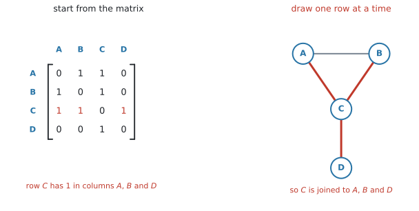
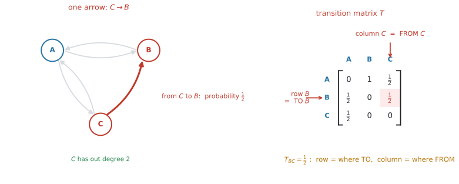
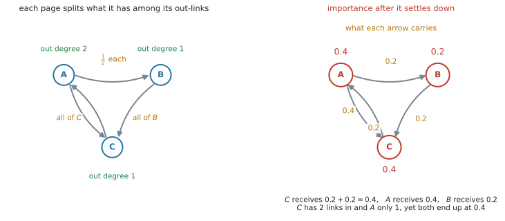

# AHL 3.15 — Adjacency matrices（隣接行列） {#sec-ahl-3-15}

::: {.callout-note}
## What you should be able to do
- graph から **adjacency matrix**（隣接行列）を作れる。逆に、**行列から graph をかきもどせる**。
- undirected graph の adjacency matrix が**対称**になる理由を言える。
- **walk**（歩道）が何かを言い、その **length**（長さ）を数えられる。
- $A^{k}$ の $(i,\ j)$ 成分が、**$i$ から $j$ への長さ $k$ の walk の数**だと使える。「ちょうど $k$」と「$k$ 以下」を区別できる。
- **weighted adjacency table**（重み付き隣接表）を読み書きし、adjacency matrix との違いを言える。
- directed graph から **transition matrix**（推移行列）を作り、**列の和が $1$** になる理由を言える。
:::

::: {.callout-note}
## $3$ つのページの真ん中です
[AHL 3.14](ahl-3-14.qmd) で、現実の構造を graph に直し、言葉を決めました。

このページでやるのは、**その graph を「計算できる表」に書き直すこと**です。図を見て数える代わりに、行列のかけ算に仕事をさせます。

道具は $2$ つのページから来ています。

- [AHL 1.14](../01-number-and-algebra/ahl-1-14.qmd) … 行列の**かけ算**と**累乗**
- [AHL 3.14](ahl-3-14.qmd) … vertex、edge、degree、directed、strongly connected

そして、ここで作った行列の使い道の続きは [AHL 3.16](ahl-3-16.qmd) と AHL 4.19 にあります。

なお、この項目にも公式集の欄はありません。ただ、中心にある「$A^{k}$ が $k$ 歩の walk の数を数える」は、**行列のかけ算の定義から出てきます**（[Why it works](#why-it-works)）。意味が分かっていれば、忘れても作り直せます。
:::

## The idea

### 1. graph を、計算できる表に変えます {#idea}

vertex を縦にも横にも並べて、**結ばれていれば $1$、結ばれていなければ $0$** と書きます。これが **adjacency matrix**（隣接行列）です。

{#fig-ahl315-idea width=98%}

@fig-ahl315-idea の $1$ 行目は、$A$ から見た行です。$A$ は $B$ と $C$ に結ばれ、$D$ とは結ばれていないので $\begin{pmatrix} 0 & 1 & 1 & 0 \end{pmatrix}$ となります。

$$
A = \begin{pmatrix}
0 & 1 & 1 & 0 \\
1 & 0 & 1 & 0 \\
1 & 1 & 0 & 1 \\
0 & 0 & 1 & 0
\end{pmatrix}
$$ {#eq-ahl315-adj}

図と行列は、**同じ情報を持っています。** 違うのは、行列なら**電卓に入れて計算できる**という一点だけです。それが、このページのねらいです。

### 2. まず、vertex の順序を決めます {#order}

行列を書き始める前に、**必ずやることが $1$ つ**あります。

> **vertex を並べる順序を決めて、それを書きとめる。**

@eq-ahl315-adj は $A$、$B$、$C$、$D$ の順で書いたものです。$D$、$C$、$B$、$A$ の順で書けば、**同じ graph から違う行列が出ます。** どちらも正しく、どちらも同じ graph を表しています。

::: {.callout-important}
## 行列のまわりに、vertex の名前を書いてください
@fig-ahl315-idea のように、上と左に名前を書いておきます。$30$ 秒もかかりません。

これをしないと、$A^{2}$ を読むときに「$2$ 行目は $B$ だったか $C$ だったか」で必ず迷います。**この項目の失点の多くは、行列の中身ではなく、読み違いから出ます。**

問題文が `using the order P, Q, R, S` と指定していたら、**その順に従ってください。** 指定がなければ、問題文に出てくる順（ふつうはアルファベット順）にします。
:::

### 3. 行が「どこから」、列が「どこへ」です {#adjacency}

$(i,\ j)$ 成分は、**$i$ から $j$ への edge の本数**です。

::: {.callout-important}
## このサイトでは、いつも「行 $=$ from、列 $=$ to」で書きます
undirected graph では向きがないので、どちらで決めても同じ行列になります。しかし [第11節](#transition)の directed graph では、**取りちがえると答えが変わります。**

本によっては逆の約束を使うこともあります。**このサイトでは、行が「から」で統一します。** 問題文に約束が書かれていれば、そちらに従ってください。

さらに、[第11節](#transition)の transition matrix では、シラバスの指定によって**この向きが逆になります。** そこがこの項目でいちばん間違えるところなので、先に言っておきます。
:::

#### 成分は $0$ と $1$ とはかぎりません {#entries}

成分は「edge の本数」なので、

- **simple graph**（loop も multiple edge もない graph、[AHL 3.14](ahl-3-14.qmd#kinds)）なら、成分は **$0$ か $1$** だけです
- 同じ $2$ 点を結ぶ edge が $2$ 本あれば、その成分は **$2$** になります。$3$ 本なら $3$ です

シラバスはこの項目について `Consideration of simple graphs` と書いているので、**試験に出る行列の成分は、ふつう $0$ と $1$ だけ**です。ただ、$2$ が出てきたときに「書き間違いだ」と決めつけないでください。**multiple edge があるという意味**です。

#### 行の和は degree です（条件付き） {#rowsum}

$1$ 行を横に足すと、その vertex の **degree** になります。

@eq-ahl315-adj の $3$ 行目は $1 + 1 + 0 + 1 = 3$ で、$\deg(C) = 3$ ✓（[AHL 3.14](ahl-3-14.qmd#degree)）

::: {.callout-warning}
## これが成り立つのは、loop のない undirected graph のときです
$2$ つ条件があります。

- **undirected** であること。directed graph では、行の和は **out degree**、列の和は **in degree** になります
- **loop がない**こと。loop は degree に $2$ を足しますが（[AHL 3.14](ahl-3-14.qmd#degree)）、行列の対角成分には $1$ と書く流儀もあり、そのときは行の和が degree より $1$ 小さくなります

試験に出る graph はほとんど loop のない simple graph なので、**ふだんはそのまま使えます。** loop が描いてある図でだけ、ここに戻ってきてください。
:::

条件がそろっていれば、**書き写しの検算に使えます。** degree を図から数えたものと、行の和が合っているかを見てください。

### 4. undirected graph の adjacency matrix は対称です {#symmetric}

{#fig-ahl315-symmetric width=100%}

undirected graph では、$A$ と $B$ が結ばれていれば $B$ と $A$ も結ばれています。ですから $(1,2)$ 成分と $(2,1)$ 成分は必ず同じで、**対角線を折り目にして折り返すと重なります。**

directed graph では、そうはなりません。@fig-ahl315-symmetric の右では、$A \to B$ の矢印はありますが $B \to A$ はないので、$(1,2)$ 成分は $1$、$(2,1)$ 成分は $0$ です。

::: {.callout-tip}
## 対称かどうかは、書き終えたあとの検算になります
undirected graph の問題で、書いた行列が対称になっていなければ、**どこかで書き間違えています。**

対角線をはさんで、$1$ 組ずつ見くらべてください。
:::

::: {.callout-note}
## simple graph なら、対角成分は $0$ です
$(i,\ i)$ 成分は「$i$ から $i$ への edge」、つまり **loop** の数です。simple graph には loop がないので、**対角線は全部 $0$** になります。

対角線に $0$ でない数が出てきたら、loop のある graph です。
:::

### 5. 行列から graph をかきもどせます {#draw}

同じ情報を持っているので、**逆向きの作業もできます。** 試験でも問われます。

{#fig-ahl315-frommatrix width=98%}

手順は $1$ つだけです。

> **$1$ 行ずつ見て、$1$ が立っている列の vertex と結ぶ。**

@fig-ahl315-frommatrix では、$C$ の行に $A$、$B$、$D$ の列で $1$ が立っています。ですから $C$ を $A$、$B$、$D$ と結びます。

::: {.callout-tip}
## 対角線から下（または上）だけを見れば足ります
undirected graph では行列が対称なので、$AB$ と $BA$ は同じ $1$ 本の edge です。**両方を見ると、同じ edge を $2$ 度描くことになります。**

対角線より上の三角だけを見て、そこにある $1$ の数だけ edge を描いてください。**その本数が、そのまま edge の数**になります。

**検算。** 描いた図の degree と、行の和を見くらべます（[第3節](#rowsum)）。
:::

### 6. walk は、edge をたどった道です {#walk}

**walk**（歩道）は、vertex から vertex へ、edge をたどって進んだ道のことです。**通った edge の本数**を、その walk の **length**（長さ）といいます。

{#fig-ahl315-walk width=68%}

@fig-ahl315-walk の $A \to B \to C \to D$ は、edge を $3$ 本通っているので **length $3$ の walk** です。

::: {.callout-warning}
## walk では、同じ vertex も同じ edge も、何度通っても構いません
$A \to B \to A \to C$ も、立派な length $3$ の walk です。$A$ を $2$ 回通り、edge $AB$ を $2$ 回通っていますが、**それでよい**のです。

walk は、**いちばんゆるいたどり方**です。「もどっているから数えない」と考えると、答えが小さくなります。
:::

::: {.callout-note appearance="simple"}
制限の付いたたどり方には、**trail**、**path**、**circuit**、**cycle** という別の名前があります。それらは [AHL 3.16 の第1節](ahl-3-16.qmd#words)でまとめて扱います。**この項目で数えるのは walk だけ**です。
:::

### 7. $A^{2}$ の成分は、途中の vertex を数えています {#square}

ここがこの項目の中心です。まず $2$ 乗だけを、具体的に見ます。

{#fig-ahl315-power width=100%}

@fig-ahl315-power で、$A$ から $C$ への **length $2$** の walk を探します。length $2$ ということは、**途中に vertex を $1$ つはさむ**ということです。

はさめる候補は $A$、$B$、$C$、$D$ の $4$ つ。$1$ つずつ試します。

| 途中の点 $k$ | $A \to k$ | $k \to C$ | 通れるか |
|---|---|---|---|
| $A$ | ✗（loop なし） | — | ✗ |
| $B$ | ○ | ○ | **○** |
| $C$ | ○ | ✗（loop なし） | ✗ |
| $D$ | ✗ | ○ | ✗ |

: 途中の点を $1$ つずつ試す {#tbl-ahl315-mid}

通れるのは $A \to B \to C$ の $1$ 本だけです。そして $A^{2}$ の $(A,\ C)$ 成分も **$1$** になっています ✓

**直接つながっている $A \to C$ は、length $1$ なので数えません。** 聞かれているのは長さ $2$ の道だけです。

#### 電卓で $A^{2}$ を出して、見くらべてください {#check-square}

いま数えたのは $1$ か所だけです。ほかの成分も合っているかどうかは、**電卓に $A$ を入れて $2$ 乗すれば**分かります。

$$
A =
\begin{pmatrix}
0 & 1 & 1 & 0 \\
1 & 0 & 1 & 0 \\
1 & 1 & 0 & 1 \\
0 & 0 & 1 & 0
\end{pmatrix}
\qquad \Longrightarrow \qquad
A^{2} =
\begin{pmatrix}
2 & 1 & 1 & 1 \\
1 & 2 & 1 & 1 \\
1 & 1 & 3 & 0 \\
1 & 1 & 0 & 1
\end{pmatrix}
$$ {#eq-ahl315-a2}

$4 \times 4$ の行列を入れて $2$ 乗するだけです（[GDC 第2節](#gdc-power)）。手で $16$ 個の成分を計算する必要はありません。

**$(A,\ C)$ 成分は $1$。** @tbl-ahl315-mid で数えた本数と一致しています ✓

ほかの成分も、同じように確かめられます。たとえば $(C,\ D)$ 成分は $0$ です。$D$ につながっているのは $C$ だけなので、$C \to \square \to D$ の $\square$ に入れる vertex がありません。

::: {.callout-note}
## 表を数えることと、行列をかけることは、同じ作業です
@tbl-ahl315-mid の $4$ 行は、$(A,\ C)$ 成分を作るときに足す $4$ つの項に、そのまま対応しています（[AHL 1.14](../01-number-and-algebra/ahl-1-14.qmd#howto)）。$A$ の成分は $0$ か $1$ しかないので、**$2$ つとも $1$ のときだけ $1$ が足され、それ以外は $0$** です。

**試験で、この表を書く必要はありません。** 電卓で $A^{k}$ を出して、その成分を読めば足ります。表は、なぜそれでよいのかを納得するためのものです。
:::

### 8. 同じ理由で、$A^{k}$ が長さ $k$ の walk を数えます {#power}

$A^{3}$ は $A^{2}$ に $A$ を掛けたものです。「$2$ 歩の道」に「もう $1$ 歩」を足しているだけなので、[第7節](#square)とまったく同じ理屈が通ります。

$$
\bigl(A^{k}\bigr)_{ij} = \text{（$i$ から $j$ への、長さ $k$ の walk の数）}
$$ {#eq-ahl315-power}

シラバスの書き方もこれです。

> Given an adjacency matrix $A$, the $(i,\ j)$th entry of $A^{k}$ gives the number of $k$ length walks from $i$ to $j$.

directed graph でも、そのまま成り立ちます。**ただし walk は、矢印の向きに逆らえません。**

#### $A^{2}$ の対角成分（条件付き） {#diagonal}

$(A^{2})_{ii}$ は「$i$ を出て、$1$ 点はさんで $i$ にもどる walk の数」です。

隣へ行って、そのまま引き返すだけなので、これは**隣の数**、つまり degree と同じになります。

@fig-ahl315-power の $A^{2}$ の対角線は $2,\ 2,\ 3,\ 1$ で、[第3節](#rowsum)の degree と一致します ✓

::: {.callout-warning}
## これも、loop のない undirected な simple graph のときの話です
- **directed graph では成り立ちません。** 行って帰れるとはかぎらないからです。$(A^{2})_{ii}$ が数えるのは「往復できる隣の数」です
- **loop があるとずれます。** loop $1$ 本だけでも、$i \to i \to i$ という長さ $2$ の walk が増えます

undirected で loop がないときだけ、「$A^{2}$ の対角 $=$ degree」と書いてください。**問題文に `simple graph` とあるかどうか**を、先に確かめます。
:::

### 9. 「ちょうど $k$」「$1$ から $k$」「$0$ から $k$」を区別します {#atmost}

問題文の言い方で、足すものが変わります。

| 問題文 | 計算するもの |
|---|---|
| `of length k`（ちょうど $k$） | $A^{k}$ の成分だけ |
| `of length k or less` / `at most k` | $A + A^{2} + \cdots + A^{k}$ |
| 長さ $0$ も数える場合 | $I + A + A^{2} + \cdots + A^{k}$ |

: 何を足すか {#tbl-ahl315-atmost}

$$
A + A^{2} + \cdots + A^{k}
$$ {#eq-ahl315-atmost}

::: {.callout-note}
## 長さ $0$ の walk とは、その場を動かないことです
$I$（identity matrix）を足すのは、**「$1$ 歩も動かない」を $1$ 通りと数えるとき**です。$I$ の対角成分が $1$、それ以外が $0$ なのは、まさに「自分から自分へは $1$ 通り、他へは $0$ 通り」だからです。

試験でふつうに `length 3 or less` と言われたときは、**長さ $0$ は数えません。** $A + A^{2} + A^{3}$ です。

`including staying at the same vertex` のような但し書きが付いたときだけ、$I$ を足してください。**問題文が決めます。**
:::

::: {.callout-warning}
## `of length 3` と `of length 3 or less` は別の問いです
前者は $A^{3}$ の成分だけ、後者は $A + A^{2} + A^{3}$ の成分です。

**問題文の `or less` / `at most` に印を付けてから**、計算を始めてください。ここだけで答えが変わります。
:::

### 10. weighted adjacency table {#weighted}

edge に重みが付いているときは、$1$ の代わりに**重みそのもの**を書きます。これを **weighted adjacency table**（重み付き隣接表）といいます。

{#fig-ahl315-weighted width=100%}

シラバスは、重みについて `Weights could be costs, distances, lengths of time for example` と書いています。距離とはかぎりません。

#### edge がないところの書き方 {#nocell}

edge がないマスには、$0$ ではなく **「$-$」や「$\infty$」**と書きます。

::: {.callout-warning}
## 重みの表では、$0$ を書かないでください
$0$ は「距離 $0$ でつながっている」と読めてしまいます。**「つながっていない」と「距離が $0$」は別のこと**です。

このサイトでは「$-$」で統一します。ただし、**問題文が別の記号を使っていたら、そちらに合わせてください。** 表を読むときは、まず「edge がないマスに何が書いてあるか」を確かめます。
:::

#### 累乗しても、walk の数にはなりません {#nopower}

@eq-ahl315-power が数えているのは、**「edge の本数」を並べた行列を掛け合わせた結果**です。$1 \times 1 = 1$、$1 \times 0 = 0$ という掛け算が、「$2$ 本続けて通れるか」をそのまま表していました（[第7節](#square)）。

重みの表を（「$-$」を $0$ とみなして）$2$ 乗すると、$5 \times 8$ のような**重みどうしの積**が出てきます。これは「$2$ 歩の道の数」ではありません。

@fig-ahl315-weighted の表を $2$ 乗すると、$(A,\ D)$ 成分は $5 \times 8 + 3 \times 4 = 52$ になります。いっぽう $A$ から $D$ への長さ $2$ の walk は $A \to B \to D$ と $A \to C \to D$ の **$2$ 本**です。**$52$ と $2$ は、まったく別のもの**です。

::: {.callout-note}
## 「累乗の意味があるのは $0$ と $1$ の行列だけ」ではありません
multiple edge のある graph の adjacency matrix には $2$ 以上の成分が入りますが（[第3節](#entries)）、そこでも @eq-ahl315-power はそのまま成り立ちます。成分が「edge の本数」でありさえすればよいからです。

区別するのは **$0$ と $1$ かどうか**ではなく、**成分が「本数」か「重み」か**です。
:::

重みの表は、累乗するのではなく、**表のまま読んで使います。** [AHL 3.16](ahl-3-16.qmd#prim-matrix) の Prim's algorithm は、この表の上でそのまま実行できます。

### 11. transition matrix {#transition}

**transition matrix**（推移行列）は、「いまここにいる人が、次にどこへ行くか」の確率を並べた行列です。directed graph から作れます。

{#fig-ahl315-transition width=100%}

#### まず、仮定を書きます {#assume}

::: {.callout-important}
## 「出ていく矢印を、等しい確率で選ぶ」は仮定です
graph には確率が書かれていません。ですから、**確率をどう割りふるかは、こちらが決める**ことになります。

この項目でずっと使うのは、次の仮定です。

> **いまいる vertex から出ている edge のうち、$1$ 本を等しい確率で選ぶ。** directed graph なら、出ている矢印から選びます。

出ている矢印が $3$ 本なら、それぞれ $\frac{1}{3}$ です。問題文には、`chooses each available path at random`（進める道を無作為に選ぶ）や `is equally likely to follow any link` のような一文が添えられているのがふつうです。

**その一文を探してください。** 確率が別のしかたで与えられていることもあります（「$A$ からは $70\%$ が $B$ へ」など）。そのときは、指示された確率をそのまま入れます。
:::

この仮定のもとでの作り方は $2$ 段階です。

1. vertex $j$ の **out degree** を数える
2. $j$ から出る矢印それぞれに、$\dfrac{1}{\text{out degree}}$ を割りふる

@fig-ahl315-transition の $A$ は out degree $2$ なので、$B$ へ $\frac{1}{2}$、$C$ へ $\frac{1}{2}$ です。

#### undirected graph のときは、degree で割ります {#undirected}

シラバスの文は `undirected or directed graph` です。**undirected graph からも transition matrix は作れます。**

undirected graph には向きがないので、**どの edge も両方向に通れます。** ですから、vertex $j$ から出る先は $\deg(j)$ 通りあり、それぞれの確率は $\dfrac{1}{\deg(j)}$ です。**「out degree」を「degree」に読みかえるだけ**で、あとは同じです。

**検算。** 列の和は、やはり $1$ になります。

#### 行と列が、adjacency matrix と入れかわります {#direction}

シラバスは、transition matrix について次のように書いています。

> $s_n = T^{n}s_0$, where $T$ is the transition matrix, with $T_{ij}$ representing the probability of moving from state $j$ to state $i$

つまり **transition matrix では、列が「どこから」、行が「どこへ」**です。[第3節](#adjacency)の adjacency matrix と**ちょうど逆**になっています。

| | 行 | 列 |
|---|---|---|
| adjacency matrix | どこ**から** | どこ**へ** |
| transition matrix | どこ**へ** | どこ**から** |

: $2$ つの行列の向き {#tbl-ahl315-direction}

**ここは、この項目でいちばん取りちがえやすいところです。** 矢印 $1$ 本を追いかけて、行列のどこに入るかを見てください。

{#fig-ahl315-tdirection width=100%}

@fig-ahl315-tdirection の左で、$C$ から $B$ へ矢印が $1$ 本出ています。$C$ の out degree は $2$（$A$ へと $B$ へ）なので、この矢印の確率は $\dfrac{1}{2}$ です。

この $\dfrac{1}{2}$ が入るのは、**行 $B$、列 $C$** です。

- **列**を見る … 「**$C$ から**」出発する話なので、列は $C$
- **行**を見る … 「**$B$ へ**」着く話なので、行は $B$

adjacency matrix なら、$C \to B$ は**行 $C$、列 $B$** に入りました。**同じ矢印が、$2$ つの行列では反対の場所に入る**わけです。

::: {.callout-tip}
## 迷ったら、列を $1$ 本ずつ作ってください
transition matrix は、**列ごとに作る**と間違えません。

「$C$ の列を作る」と決めたら、$C$ から出ている矢印だけを見ます。$C$ からは $A$ と $B$ へ出ているので、その $2$ か所に $\dfrac{1}{2}$ を書き、残りは $0$。**書き終えたら、その列を縦に足して $1$ になるか**を見ます（[第11節](#columnsum)）。

行ごとに作ろうとすると、$1$ になる保証がないので検算ができません。**必ず列から。**
:::

::: {.callout-tip}
## なぜ逆なのか — $s_{n+1} = Ts_n$ を書いてみると分かります
理由は、**transition matrix が「掛け算される側」だから**です。

いまどこにいるかの確率を、**縦に並べた** state matrix $s_n$ で表します。$1$ 歩進んだあとは

$$
s_{n+1} = T s_n
$$ {#eq-ahl315-step}

です。行列とベクトルのかけ算の決まり（[AHL 1.14](../01-number-and-algebra/ahl-1-14.qmd#howto)）から、この式の $i$ 番目の成分は

$$
(s_{n+1})_i = T_{i1}(s_n)_1 + T_{i2}(s_n)_2 + \cdots + T_{in}(s_n)_n
$$

になります。左辺は「次に $i$ にいる確率」です。右辺の $T_{ij}(s_n)_j$ は「いま $j$ にいて、次に $i$ へ移る」分です。

ですから、**$T_{ij}$ は「$j$ から $i$ へ」でなければ、この式が成り立ちません。** 縦ベクトルを左から掛けるという書き方が、向きを決めているのです。

adjacency matrix には、この掛けられ方の約束がありません。ただの表として「行から、列へ」と読むだけです。**約束が違うから、向きも違う**——それだけのことです。
:::

#### 列の和は、必ず $1$ です {#columnsum}

$1$ つの vertex から出ていく確率を全部足せば $1$ になります。**どこかへは必ず行く**からです。

@fig-ahl315-transition の各列は $0 + \frac{1}{2} + \frac{1}{2} = 1$、$1 + 0 + 0 = 1$、$\frac{1}{2} + \frac{1}{2} + 0 = 1$ ✓

**検算に使えるのは、列の和だけです。** 行の和は $1$ になることもあれば、ならないこともあります。そこを見ても、正しく作れたかは分かりません。

#### 出る矢印がない vertex — absorbing state {#absorbing}

出る矢印が $1$ 本もない vertex があると、[第11節の仮定](#assume)の「出ている矢印から $1$ 本選ぶ」が使えません。選ぶものがないからです。

ただし、**行き詰まりというわけではありません。** モデルを作る側が、その vertex での動き方を決めればよいのです。よく使われるのは次の決め方です。

> **その vertex に入ったら、そのまま留まる。**

こう決めると、その列は「自分の行だけ $1$、あとは $0$」になり、列の和も $1$ になります。このような state を **absorbing state**（吸収状態）といいます。シラバスでは、この語は AHL 4.19 の **Connections（Other contexts）** の欄に出てきます。試験に出る内容そのものではありませんが、名前を知っておくと、問題文の「入ったら留まる」という条件が読みやすくなります。

::: {.callout-note}
## シラバスが strongly connected と書いているわけ
この項目についてのシラバスの文は、次のようになっています。

> Construction of the transition matrix for a strongly-connected, undirected or directed graph

**strongly connected**（[AHL 3.14](ahl-3-14.qmd#strong)）なら、どの vertex からも必ずどこかへ出られます。ですから、[第11節の仮定](#assume)だけで、余分な決め事をせずに全部の列が埋まります。

**この項目で作らされるのは、その形の graph**だと思ってください。absorbing state を扱うときは、その vertex での動き方が問題文で与えられているかどうかを、先に確かめてください。
:::

### 12. 長い目で見ると — Markov chain と PageRank {#pagerank}

$T$ を作ったら、次は「何歩か進んだあと、どこにいる確率が高いか」を知りたくなります。@eq-ahl315-step をくり返せば

$$
s_n = T^{n} s_0
$$ {#eq-ahl315-markov}

です。この式と、$n$ を大きくしたときの様子を調べるのが、**AHL 4.19** の **Markov chains**（マルコフ連鎖）です。公式集の $s_n = T^{n}s_0$ も、そちらの欄にあります。

::: {.callout-warning}
## 「必ず $1$ つの分布に落ち着く」とはかぎりません
strongly connected であっても、**$s_n$ が $1$ つの分布に近づくとはかぎりません。**

たとえば、$A$ と $B$ の $2$ 状態だけで、$A \to B$ と $B \to A$ しかないモデルを考えます。これは strongly connected です。$A$ から出発すると、$s_n$ は $\begin{pmatrix} 1 \\ 0 \end{pmatrix}$ と $\begin{pmatrix} 0 \\ 1 \end{pmatrix}$ を行ったり来たりするだけで、**$1$ つの分布に近づきません。**

落ち着くかどうかは、strongly connected だけでは決まりません。シラバスは AHL 4.19 で、落ち着く場合の求め方を、**eigenvalue**（固有値）が $1$ の **eigenvector**（固有ベクトル）として扱います（[AHL 1.15](../01-number-and-algebra/ahl-1-15.qmd)）。

> Awareness that the solution is the eigenvector corresponding to the eigenvalue equal to $1$ and whose entries have been scaled to sum to $1$

この項目では、**$T$ を正しく作れることと、$T^{n}s_0$ の意味が言えること**までで十分です。
:::

#### PageRank {#pr}

シラバスは、この項目の応用として **Google の PageRank algorithm** を挙げています。

> Consideration of simple graphs, including the Google PageRank algorithm as an example of this

基本的な発想はこうです。**ウェブページを vertex、リンクを directed edge** とします。「でたらめにリンクをたどり続ける人」が、長い目で見てどのページにいる割合が高いか——それをそのページの重要度とみなす、という考え方です。

つまり、**リンクの構造から transition matrix を作って、その落ち着き先を調べる**わけです。

小さな例で見ます。ページが $A$、$B$、$C$ の $3$ つだけの世界です。

{#fig-ahl315-pagerank width=100%}

@fig-ahl315-pagerank の左が、リンクのつながりです。$A$ は $B$ と $C$ の $2$ か所へリンクしているので out degree は $2$、$B$ は $C$ へ、$C$ は $A$ へ、それぞれ $1$ か所だけです。

この $3$ ページの transition matrix は

$$
T =
\begin{pmatrix}
0 & 0 & 1 \\
\tfrac{1}{2} & 0 & 0 \\
\tfrac{1}{2} & 1 & 0
\end{pmatrix}
$$ {#eq-ahl315-pr}

で、落ち着き先は $s = (0.4,\ 0.2,\ 0.4)$ になります。$Ts = s$ を確かめてみてください。

**ここから、$2$ つのことが読み取れます。**

$1$ つ目。**重要度は、リンクをさかのぼって流れこみます。** 落ち着き先は $s = Ts$ をみたすので、あるページの値は「そこへ入ってくるぶんの合計」です。@fig-ahl315-pagerank の右で、$C$ には $A$ から $0.2$、$B$ から $0.2$ が入って合計 $0.4$。$A$ には $C$ から $0.4$ が入って $0.4$ です。ですから、**リンクの本数だけでなく、リンク元がどれだけ重要か**が効きます。

$2$ つ目。**out degree で割るのは、これとは別の理由です。** $1$ つのページは、自分の重要度を、出しているリンクに**等分して**渡します。$A$ は $0.4$ を $2$ 本に分けるので、$1$ 本あたり $0.2$。$C$ は $0.4$ を $1$ 本にそのまま渡すので $0.4$ です。**リンクをたくさん出しているページからの $1$ 本は、それだけ軽くなります。**

この $2$ つが重なって、**$C$ はリンクを $2$ 本受けているのに、$1$ 本しか受けていない $A$ と同じ $0.4$** になりました。「リンクの数を数えるだけ」では出てこない結果です。

::: {.callout-note}
## 実際の PageRank には、もう $1$ 段の工夫があります
リンクだけをたどり続けると、[absorbing state](#absorbing) のような「入ったら出られない」ページで止まってしまいます。実際のアルゴリズムでは、これを **damping factor**（減衰係数）と **random jump**（ランダムジャンプ）で避けます。

> 一定の確率でリンクをたどり、残りの確率では、**どこか別のページへ直接飛ぶ。**

こうすると、どのページからもどのページへも行けるようになり、落ち着き先がちゃんと定まります。

**この工夫は、PageRank を実際に動かすためのものです。** ここでは「リンクをたどるだけでは足りない」という点だけ押さえておけば十分です。[第12節](#pagerank)の注意と、そのままつながっています。
:::

## Why it works

:::: {.callout-note collapse="true" appearance="simple"}
## クリックすると開きます
[第7節](#square)では、$A^{2}$ の $1$ つの成分を具体的に見ました。ここでは、それが**どの成分でも、$A^{k}$ のどの $k$ でも**成り立つことを書き下します。

行列のかけ算の定義（[AHL 1.14](../01-number-and-algebra/ahl-1-14.qmd#howto)）から、$A^{2}$ の $(i,\ j)$ 成分は

$$
\bigl(A^{2}\bigr)_{ij} = A_{i1}A_{1j} + A_{i2}A_{2j} + \cdots + A_{in}A_{nj}
$$ {#eq-ahl315-why}

です。$1$ つの項 $A_{ik}A_{kj}$ を見てください。

- $A_{ik}$ は「$i$ から $k$ への edge の本数」
- $A_{kj}$ は「$k$ から $j$ への edge の本数」

$i \to k \to j$ という $2$ 歩の道の数は、**この $2$ つの積**です。$i \to k$ の選び方が $A_{ik}$ 通り、そのそれぞれについて $k \to j$ の選び方が $A_{kj}$ 通りだからです。片方でも $0$ なら、積は $0$ になります。

@eq-ahl315-why は、その積を**途中の点 $k$ について全部足したもの**です。$2$ 歩の道は、途中の点がどれか $1$ つに決まっているので、**重複も数え落としもなく**数えられます。

$A^{3}$ も同じです。$A^{3} = A^{2} \cdot A$ なので

$$
\bigl(A^{3}\bigr)_{ij} = \sum_{k} \bigl(A^{2}\bigr)_{ik} A_{kj}
$$

となり、「$i$ から $k$ への $2$ 歩の道」と「$k$ から $j$ への $1$ 歩」を組み合わせて足しています。これは「$i$ から $j$ への $3$ 歩の道を、**最後から $1$ つ手前の点で分類して**数える」ということです。

同じ議論を $1$ 段ずつ積み上げれば、$A^{k}$ まで成り立ちます。

::: {.callout-note appearance="simple"}
この議論のどこにも「同じ点を通ってはいけない」という制限が入っていないことに注意してください。だから $A^{k}$ が数えるのは **walk** であって、path ではありません（[第6節](#walk)）。
:::
::::

## Worked examples

::: {.callout-note appearance="simple"}
問題文は英語です。意味が理解できなかったら、問題文の下の「**日本語訳**」を開いてください。解説は日本語です。
:::

::: {#exm-ahl315-build}
[The graph $G$ is shown below.]{.q-en}

{width=46%}

**(a)** [Write down the adjacency matrix $A$ of $G$, using the order $P$, $Q$, $R$, $S$.]{.q-en}

**(b)** [Find $A^{2}$, and hence write down the number of walks of length $2$ from $P$ to $R$.]{.q-en}

**(c)** [Find the number of walks of length $3$ or less from $P$ to $R$.]{.q-en}

<details class="jp-trans">
<summary>日本語訳</summary>

グラフ $G$ が下に示されています。

**(a)** $P$、$Q$、$R$、$S$ の順で、$G$ の隣接行列 $A$ を書きなさい。

**(b)** $A^{2}$ を求め、それを使って $P$ から $R$ への長さ $2$ の walk の数を書きなさい。

**(c)** $P$ から $R$ への長さ $3$ 以下の walk の数を求めなさい。

</details>

---

**(a)** `using the order P, Q, R, S` と指定されているので、**その順に並べます**（[第2節](#order)）。$1$ 行ずつ、その vertex の隣を拾います。

- $P$ は $Q$ と $S$ に結ばれています
- $Q$ は $P$、$R$、$S$
- $R$ は $Q$ と $S$
- $S$ は $P$、$Q$、$R$

$$
A = \begin{pmatrix}
0 & 1 & 0 & 1 \\
1 & 0 & 1 & 1 \\
0 & 1 & 0 & 1 \\
1 & 1 & 1 & 0
\end{pmatrix}
$$

**検算。** 対称になっています ✓（[第4節](#symmetric)）行の和は $2,\ 3,\ 2,\ 3$ で、図の degree と一致します ✓（[第3節](#rowsum)）

**(b)** 電卓に入れて $2$ 乗します（[GDC 第2節](#gdc-power)）。

$$
A^{2} = \begin{pmatrix}
2 & 1 & 2 & 1 \\
1 & 3 & 1 & 2 \\
2 & 1 & 2 & 1 \\
1 & 2 & 1 & 3
\end{pmatrix}
$$

$P$ の行、$R$ の列を見ます。**$2$** です。

**検算。** $P \to Q \to R$ と $P \to S \to R$ の $2$ 本です ✓

**(c)** `or less` があるので、長さ $1$、$2$、$3$ を全部足します（@tbl-ahl315-atmost）。

$$
A^{3} = \begin{pmatrix}
2 & 5 & 2 & 5 \\
5 & 4 & 5 & 5 \\
2 & 5 & 2 & 5 \\
5 & 5 & 5 & 4
\end{pmatrix}
$$

$(P,\ R)$ 成分だけを見ればよいので、$3$ つ足します。

$$
0 + 2 + 2 = 4
$$

長さ $0$ は数えません（[第9節](#atmost)）。問題文にその指示がないからです。

::: {.callout-note}
## 解答例（答案用紙にはこう書く）
**(a)**
$$
A = \begin{pmatrix}
0 & 1 & 0 & 1 \\
1 & 0 & 1 & 1 \\
0 & 1 & 0 & 1 \\
1 & 1 & 1 & 0
\end{pmatrix}
$$

**(b)**
$$
A^{2} = \begin{pmatrix}
2 & 1 & 2 & 1 \\
1 & 3 & 1 & 2 \\
2 & 1 & 2 & 1 \\
1 & 2 & 1 & 3
\end{pmatrix}
\qquad \Rightarrow \qquad 2 \ \text{walks}
$$

**(c)**
$$
(A)_{PR} + (A^{2})_{PR} + (A^{3})_{PR} = 0 + 2 + 2 = 4
$$
:::
:::

::: {#exm-ahl315-draw}
[The matrix below is the adjacency matrix of a graph, using the order $R$, $S$, $T$, $U$.]{.q-en}

$$
A = \begin{pmatrix}
0 & 1 & 1 & 1 \\
1 & 0 & 0 & 0 \\
1 & 0 & 0 & 1 \\
1 & 0 & 1 & 0
\end{pmatrix}
$$

**(a)** [Draw the graph.]{.q-en}

**(b)** [Write down the degree of each vertex, and the number of edges.]{.q-en}

**(c)** [Find the number of walks of length $2$ from $S$ to $T$, and list them.]{.q-en}

<details class="jp-trans">
<summary>日本語訳</summary>

下の行列は、$R$、$S$、$T$、$U$ の順で書かれた、あるグラフの隣接行列です。

**(a)** そのグラフをかきなさい。

**(b)** 各頂点の次数と、辺の数を書きなさい。

**(c)** $S$ から $T$ への長さ $2$ の walk の数を求め、それらを書き出しなさい。

</details>

---

**(a)** [第5節](#draw)のとおり、$1$ 行ずつ読みます。対称なので、**対角線より上だけ**を見れば足ります。

| 行 | $1$ が立っている列 | 描く edge |
|---|---|---|
| $R$ | $S$、$T$、$U$ | $RS$、$RT$、$RU$ |
| $S$ | （$R$ だけ。もう描いた） | — |
| $T$ | $U$（$R$ はもう描いた） | $TU$ |
| $U$ | （もう全部描いた） | — |

: 行を $1$ つずつ読む {#tbl-ahl315-read}

edge は $RS$、$RT$、$RU$、$TU$ の $4$ 本です。$R$ を真ん中に置き、$S$ を外に、$T$ と $U$ を $R$ とつないだうえで $T$ と $U$ どうしも結ぶと、**三角形 $RTU$ に $S$ が $1$ 本ぶら下がった形**になります。

**(b)** 行の和がそのまま degree です（[第3節](#rowsum)）。この graph は undirected で loop がないので、条件がそろっています。

| vertex | $R$ | $S$ | $T$ | $U$ |
|---|---|---|---|---|
| $\deg$ | $3$ | $1$ | $2$ | $2$ |

$$
3 + 1 + 2 + 2 = 8 = 2 \times 4
$$

edge は **$4$ 本**です（[AHL 3.14](ahl-3-14.qmd#handshake)）。(a) で数えた $4$ 本と合っています ✓

**(c)** $S$ から出ているのは $SR$ の $1$ 本だけなので、途中にはさめるのは $R$ しかありません。$R$ から $T$ へは行けるので、

$$
S \to R \to T
$$

の **$1$ 本**です。

**検算。** $A^{2}$ の $(S,\ T)$ 成分を見ると

$$
A^{2} = \begin{pmatrix}
3 & 0 & 1 & 1 \\
0 & 1 & 1 & 1 \\
1 & 1 & 2 & 1 \\
1 & 1 & 1 & 2
\end{pmatrix}
$$

$2$ 行目 $3$ 列目は $1$ ✓

::: {.callout-note}
## 解答例（答案用紙にはこう書く）
**(a)** *Edges: $RS$, $RT$, $RU$, $TU$.* （図をかく）

**(b)**
$$
\deg(R)=3,\quad \deg(S)=1,\quad \deg(T)=2,\quad \deg(U)=2
$$
$$
3+1+2+2 = 8 = 2E \quad \Rightarrow \quad E = 4
$$

**(c)** *There is $1$ walk: $S \to R \to T$.*
:::

::: {.callout-tip}
## 「かきなさい」でも、edge を書き出してください
図だけを提出すると、$1$ 本読み落としていたときに、どこで間違えたかが採点者に伝わりません。

**$RS$、$RT$、$RU$、$TU$ と並べて書いてから、図をかいてください。** 自分の検算にもなります。
:::
:::

::: {#exm-ahl315-interpret}
[The matrix $A$ is the adjacency matrix of a simple graph. The diagonal entries of $A^{2}$ are $2$, $3$, $2$ and $3$.]{.q-en}

**(a)** [State what the diagonal entries of $A^{2}$ represent.]{.q-en}

**(b)** [Hence write down the number of edges of the graph.]{.q-en}

<details class="jp-trans">
<summary>日本語訳</summary>

行列 $A$ は、ある simple graph の隣接行列です。$A^{2}$ の対角成分は $2$、$3$、$2$、$3$ です。

**(a)** $A^{2}$ の対角成分が何を表しているかを述べなさい。

**(b)** これを使って、このグラフの辺の数を書きなさい。

</details>

---

**(a)** $(A^{2})_{ii}$ は「$i$ から出て、$1$ 点はさんで $i$ にもどる walk の数」です。

隣へ行って引き返すだけなので、これは**隣の数**、つまり degree と同じです。問題文に `simple graph` とあるので、[第8節の条件](#diagonal)がそろっています。

::: {.model-answer}
**試験ではこう書く**

*The diagonal entry $(A^{2})_{ii}$ is the number of walks of length $2$ from vertex $i$ back to itself. In a simple undirected graph these are exactly the walks out to a neighbour and straight back, so the entry equals the degree of vertex $i$.*
:::

（$i$ から $i$ への長さ $2$ の walk の数であり、undirected な simple graph では「隣へ行って引き返す」道だけなので $i$ の次数に等しい、という意味です。）

**(b)** degree が $2,\ 3,\ 2,\ 3$ と分かったので、[AHL 3.14](ahl-3-14.qmd#handshake) の関係が使えます。

$$
2 + 3 + 2 + 3 = 10 = 2 \times (\text{number of edges})
$$

$$
\text{number of edges} = 5
$$

::: {.callout-note}
## 解答例（答案用紙にはこう書く）
**(a)** *$(A^{2})_{ii}$ counts the walks of length $2$ from vertex $i$ back to itself. For a simple undirected graph this equals the degree of vertex $i$.*

**(b)**
$$
\sum \deg = 2+3+2+3 = 10 = 2E \quad \Rightarrow \quad E = 5
$$
:::
:::

::: {#exm-ahl315-transition}
[The directed graph below shows the links between three web pages $X$, $Y$ and $Z$.]{.q-en}

{width=46%}

**(a)** [Write down the adjacency matrix, using the order $X$, $Y$, $Z$.]{.q-en}

**(b)** [Find the number of walks of length $2$ from $X$ back to $X$.]{.q-en}

**(c)** [A user clicks one of the available links at random, each link being equally likely. Write down the transition matrix $T$.]{.q-en}

<details class="jp-trans">
<summary>日本語訳</summary>

下の有向グラフは、$3$ つのウェブページ $X$、$Y$、$Z$ のあいだのリンクを表しています。

**(a)** $X$、$Y$、$Z$ の順で隣接行列を書きなさい。

**(b)** $X$ から $X$ へもどる長さ $2$ の walk の数を求めなさい。

**(c)** 利用者は、進めるリンクのうち $1$ つを、どれも同じ確率で選んでクリックします。推移行列 $T$ を書きなさい。

</details>

---

**(a)** 矢印は $X \to Y$、$X \to Z$、$Y \to Z$、$Z \to X$ の $4$ 本です。**行が「から」**でした（[第3節](#adjacency)）。

$$
A = \begin{pmatrix}
0 & 1 & 1 \\
0 & 0 & 1 \\
1 & 0 & 0
\end{pmatrix}
$$

**対称ではありません。** directed graph なので、それでよいのです。

**(b)** $A$ を $2$ 乗して、$(X,\ X)$ 成分を見ます。

$$
A^{2} = \begin{pmatrix}
1 & 0 & 1 \\
1 & 0 & 0 \\
0 & 1 & 1
\end{pmatrix}
$$

$(X,\ X)$ 成分は **$1$** です。$X \to Z \to X$ の $1$ 本だけです ✓

**対角成分が degree になる話は、ここでは使えません。** directed graph だからです（[第8節](#diagonal)）。

**(c)** 問題文に `each link being equally likely` とあります。これが[第11節の仮定](#assume)です。まず out degree を数えます。

| vertex | $X$ | $Y$ | $Z$ |
|---|---|---|---|
| out degree | $2$ | $1$ | $1$ |

ここで**行と列が入れかわります**（[第11節](#direction)）。$X$ の**列**には、$Y$ へ $\frac{1}{2}$、$Z$ へ $\frac{1}{2}$ を入れます。$Y$ の列は $Z$ へ $1$、$Z$ の列は $X$ へ $1$ です。

$$
T = \begin{pmatrix}
0 & 0 & 1 \\
\frac{1}{2} & 0 & 0 \\
\frac{1}{2} & 1 & 0
\end{pmatrix}
$$

**検算。** 各列の和が $1$ になっています ✓（[第11節](#columnsum)）

::: {.callout-note}
## 解答例（答案用紙にはこう書く）
**(a)**
$$
A = \begin{pmatrix} 0 & 1 & 1 \\ 0 & 0 & 1 \\ 1 & 0 & 0 \end{pmatrix}
$$

**(b)**
$$
A^{2} = \begin{pmatrix} 1 & 0 & 1 \\ 1 & 0 & 0 \\ 0 & 1 & 1 \end{pmatrix}
\qquad \Rightarrow \qquad 1 \ \text{walk}
$$

**(c)**
$$
T = \begin{pmatrix} 0 & 0 & 1 \\ \frac{1}{2} & 0 & 0 \\ \frac{1}{2} & 1 & 0 \end{pmatrix}
$$
:::
:::

::: {#exm-ahl315-weighted}
[The weighted adjacency table below shows the distances, in kilometres, between four sites. A dash means that there is no direct road.]{.q-en}

| | $A$ | $B$ | $C$ | $D$ |
|---|---|---|---|---|
| $A$ | $-$ | $5$ | $3$ | $-$ |
| $B$ | $5$ | $-$ | $6$ | $8$ |
| $C$ | $3$ | $6$ | $-$ | $4$ |
| $D$ | $-$ | $8$ | $4$ | $-$ |

**(a)** [Explain what the entry "$-$" in row $A$, column $D$ means.]{.q-en}

**(b)** [Find the total distance of the route $A \to C \to D$.]{.q-en}

**(c)** [Find the shortest route from $A$ to $D$, and state its length.]{.q-en}

<details class="jp-trans">
<summary>日本語訳</summary>

下の重み付き隣接表は、$4$ つの地点のあいだの距離（キロメートル）を表しています。ダッシュ（$-$）は、直接の道路がないことを表します。表の見出しは地点の名前です。

**(a)** $A$ の行、$D$ の列にある「$-$」が何を意味するかを説明しなさい。

**(b)** 経路 $A \to C \to D$ の距離の合計を求めなさい。

**(c)** $A$ から $D$ への最短経路を求め、その距離を書きなさい。

</details>

---

**(a)** 表の $A$ の行と $D$ の列が交わるところが「$-$」です。問題文が `A dash means that there is no direct road` と教えてくれています（[第10節](#nocell)）。

::: {.model-answer}
**試験ではこう書く**

*There is no direct edge between $A$ and $D$: the two sites are not joined by a road. It does not mean that the distance is zero.*
:::

（$A$ と $D$ を直接つなぐ道路がない、という意味です。**距離が $0$ という意味ではありません。**）

**(b)** 表から $AC = 3$、$CD = 4$ を読みます。

$$
3 + 4 = 7 \ \text{km}
$$

**(c)** 同じ場所を $2$ 度通らない道を、全部書き出します。$A$ から出られるのは $B$ と $C$ の $2$ 方向で、そのあとの分かれ方を考えると $4$ 通りあります。

| 経路 | 距離 |
|---|---|
| $A \to C \to D$ | $3 + 4 = 7$ |
| $A \to B \to D$ | $5 + 8 = 13$ |
| $A \to B \to C \to D$ | $5 + 6 + 4 = 15$ |
| $A \to C \to B \to D$ | $3 + 6 + 8 = 17$ |

いちばん短いのは $A \to C \to D$ で、**$7$ km** です。

::: {.callout-note}
## 解答例（答案用紙にはこう書く）
**(a)** *There is no edge between $A$ and $D$; it does not mean a distance of zero.*

**(b)**
$$
3 + 4 = 7 \ \text{km}
$$

**(c)**
$$
A \to C \to D = 7, \qquad A \to B \to D = 13
$$
$$
A \to B \to C \to D = 15, \qquad A \to C \to B \to D = 17
$$

*The shortest route is $A \to C \to D$, of length $7$ km.*
:::

::: {.callout-tip}
## この表を $2$ 乗しないでください
$A^{2}$ を計算したくなりますが、これは重みの表です。$2$ 乗しても walk の数は出ません（[第10節](#nopower)）。

**この形の問題は、道を書き出して足すだけ**です。[AHL 3.16](ahl-3-16.qmd#least) では、この「$2$ 点のあいだの最短」を表にまとめる作業が出てきます。**最短経路そのものを出す algorithm は、AI HL では扱いません。**
:::
:::

## Common errors

::: {.callout-warning}
## transition matrix を、adjacency matrix と同じ向きで書く
**この項目で、いちばん多い失点です。**

adjacency matrix は「行 $=$ から」、transition matrix は「**列 $=$ から**」です（@tbl-ahl315-direction）。理由は $s_{n+1} = Ts_n$ という書き方にあります（[第11節](#direction)）。

書き終えたら、**列の和が $1$ になっているか**を必ず見てください。$1$ にならない列があれば、向きを取りちがえています。
:::

::: {.callout-warning}
## vertex の順番を決めずに書き始める
$P$、$Q$、$R$、$S$ の順で作った行列を、$A^{2}$ を読むときに別の順で見てしまう誤りです。

**行列のまわりに、vertex の名前を書き込んでください**（[第2節](#order)）。表の見出しがあれば、読み間違えません。
:::

::: {.callout-warning}
## `of length 3` と `of length 3 or less` を取りちがえる
前者は $A^{3}$ の $1$ つの成分、後者は $A + A^{2} + A^{3}$ の成分です（@tbl-ahl315-atmost）。

**問題文の `or less` / `at most` に印を付けてから**、計算を始めてください。
:::

::: {.callout-warning}
## 何も言われていないのに $I$ を足す
$I$ を足すのは、**長さ $0$（動かないこと）も数えるとき**だけです（[第9節](#atmost)）。

ふつうの `length 3 or less` では、$A + A^{2} + A^{3}$ です。$I$ を足すと、対角成分だけが $1$ ずつ多くなります。
:::

::: {.callout-warning}
## 重みの表を累乗する
weighted adjacency table を $2$ 乗すると、重みどうしの積が出てきます。それは walk の本数ではありません（[第10節](#nopower)）。

区別するのは、成分が**「本数」か「重み」か**です。
:::

::: {.callout-warning}
## edge がないところに $0$ を書く（重みの表）
重みの表では、$0$ は「距離 $0$」と読めてしまいます。**「$-$」か「$\infty$」**を書いてください。

いっぽう adjacency matrix では、$0$ が「つながっていない」の意味で正しいものです。**$2$ つの表で、$0$ の意味が違います。**
:::

::: {.callout-warning}
## walk と path を混同する
walk は、**同じ vertex も同じ edge も、何度通っても構いません**（[第6節](#walk)）。

$A \to B \to A$ を「もどっているから数えない」と考えて、答えが小さくなる誤りが多いところです。$A^{k}$ が数えているのは、**制限のない walk** です。
:::

::: {.callout-warning}
## directed graph なのに、対称な行列を書く
undirected graph の癖で、$X \to Y$ を書いたときに $(Y,\ X)$ にも $1$ を入れてしまう誤りです。

**矢印があるほうにだけ**書いてください。directed graph の行列は、対称にならないのがふつうです。
:::

::: {.callout-warning}
## directed graph で「$A^{2}$ の対角 $=$ degree」を使う
これは **undirected で loop のない simple graph** のときの話です（[第8節](#diagonal)）。

directed graph の $(A^{2})_{ii}$ が数えるのは、「行って帰れる隣の数」です。degree とは違います。
:::

::: {.callout-warning}
## $A^{k}$ の成分を、電卓の小数のまま書き写す
walk の数は**整数**です。電卓が $2.$ や $1.99999$ と表示したときは、表示の設定の問題です。

Document Settings の `Display Digits` を確かめてください。**答案には整数で書きます。**
:::

## Using your GDC (TI-Nspire CX II)

この項目から、**電卓の出番が一気に増えます。** $4 \times 4$ を手で $3$ 乗するのは、時間がかかるうえに間違えます。

### 1. 行列を打ちこんで、名前を付ける {#gdc-enter}

[AHL 1.14](../01-number-and-algebra/ahl-1-14.qmd#gdc-enter) と同じ手順です。

```
menu → Matrix & Vector → Create → Matrix
```

行と列の数を入れて `OK`。`tab` で移動しながら $0$ と $1$ を入れ、最後に名前を付けます。

```
ctrl + sto→
```

に続けて `a` と打てば、以後は `a` で呼び出せます。

::: {.callout-tip}
## $0$ と $1$ の入力は、行ごとに声に出して確かめてください
$4 \times 4$ なら $16$ 個です。**打ち間違えると、そのあとが全部ずれます。**

打ち終わったら、[行の和が degree になっているか](#rowsum)を見てください。$30$ 秒の検算で、大きな失点が防げます。
:::

### 2. 累乗する {#gdc-power}

`^` キーで指数を打つだけです。

```
a^2
a^3
```

$3 \times 3$ でも $4 \times 4$ でも、一瞬で返ります。

### 3. 「長さ $k$ 以下」を足す {#gdc-sum}

@eq-ahl315-atmost は、そのまま打てます。

```
a + a^2 + a^3
```

長さ $0$ も数えるときだけ、単位行列を足します。

```
identity(4) + a + a^2 + a^3
```

**$1$ つの成分だけが要るときも、行列全体を出してから読むほうが速い**です。成分を取り出す書き方もありますが、覚えることが増えるだけです。

### 4. transition matrix は分数のまま入れる {#gdc-fraction}

$\frac{1}{2}$ を $0.5$ と打っても計算はできますが、**答えが小数で出て、書き写すときに桁を落とします。**

分数テンプレート（`ctrl + ÷`）で $\frac{1}{2}$ のまま入れてください。列の和の検算も、分数のほうが速く済みます。

::: {.callout-warning}
## 列の和は、電卓でも確かめられます
打ちこんだ transition matrix を `t` としたとき、

```
[[1, 1, 1]] * t
```

と打つと、**各列の和が $1$ 行に並んで返ります。** 全部 $1$ なら正しく作れています。
:::

## Exercises

::: {.callout-note appearance="simple"}
各問題に、折りたたみが3つ付いています。**日本語訳**、**解答例**（答案用紙に書くべきこと。英語です）、**解説**（なぜそうなるか。日本語です）。

まず自分で解いて、次に解答例と見くらべてください。**解説は、合わなかったときだけ開けば十分です。**
:::

::: {.exercise-block}

[1]{.ex-no} [The graph below has vertices $A$, $B$, $C$ and $D$.]{.q-en}

{width=44%}

**(a)** [Write down the adjacency matrix $A$, using the order $A$, $B$, $C$, $D$.]{.q-en}

**(b)** [Write down the degree of each vertex, and check it against your matrix.]{.q-en}

<details class="jp-trans">
<summary>日本語訳</summary>

下のグラフは、頂点 $A$、$B$、$C$、$D$ をもちます。

**(a)** $A$、$B$、$C$、$D$ の順で隣接行列 $A$ を書きなさい。

**(b)** 各頂点の次数を書き、行列と合っているか確かめなさい。

</details>

::: {.callout-note collapse="true"}
## 解答例（答案用紙に書くこと）
**(a)**
$$
A = \begin{pmatrix}
0 & 1 & 0 & 1 \\
1 & 0 & 1 & 1 \\
0 & 1 & 0 & 1 \\
1 & 1 & 1 & 0
\end{pmatrix}
$$

**(b)** $\deg(A)=2$, $\deg(B)=3$, $\deg(C)=2$, $\deg(D)=3$

*Each row sum equals the degree of that vertex.*
:::

::: {.callout-tip collapse="true"}
## 解説
edge は $AB$、$AD$、$BC$、$BD$、$CD$ の $5$ 本です。

**(b)** 行の和は $2,\ 3,\ 2,\ 3$ で、図から数えた degree と一致します。この graph は undirected で loop がないので、[第3節](#rowsum)の条件がそろっています。合計 $10$ が $2 \times 5$ になっていることも確かめられます。

書いた行列が**対称**になっているかも見てください。undirected graph なので、対称でなければ書き間違いです。
:::

::: {.ex-sep}
:::

[2]{.ex-no} [For the graph in question 1, find $A^{2}$ and hence write down the number of walks of length $2$ from $A$ to $C$. List these walks.]{.q-en}

<details class="jp-trans">
<summary>日本語訳</summary>

問題 1 のグラフについて、$A^{2}$ を求め、それを使って $A$ から $C$ への長さ $2$ の walk の数を書きなさい。その walk を書き出しなさい。

</details>

::: {.callout-note collapse="true"}
## 解答例（答案用紙に書くこと）
$$
A^{2} = \begin{pmatrix}
2 & 1 & 2 & 1 \\
1 & 3 & 1 & 2 \\
2 & 1 & 2 & 1 \\
1 & 2 & 1 & 3
\end{pmatrix}
$$

*There are $2$ walks: $A \to B \to C$ and $A \to D \to C$.*
:::

::: {.callout-tip collapse="true"}
## 解説
$(A^{2})_{AC}$、つまり $1$ 行目 $3$ 列目を読みます。$2$ です。

`List these walks` と言われているので、**実際に書き出す**ところまでが解答です。$A$ の隣は $B$ と $D$、そのどちらからも $C$ へ行けるので $2$ 本です（[第7節](#square)）。

**行と列を取りちがえないでください。** 行が「から」、列が「へ」でした（[第3節](#adjacency)）。この graph は undirected なので $(A^{2})_{CA}$ でも同じ値ですが、directed graph では変わります。
:::

::: {.ex-sep}
:::

[3]{.ex-no} [For the graph in question 1, find the number of walks of length $3$ or less from $A$ to $B$.]{.q-en}

<details class="jp-trans">
<summary>日本語訳</summary>

問題 1 のグラフについて、$A$ から $B$ への長さ $3$ 以下の walk の数を求めなさい。

</details>

::: {.callout-note collapse="true"}
## 解答例（答案用紙に書くこと）
$$
(A)_{AB} + (A^{2})_{AB} + (A^{3})_{AB} = 1 + 1 + 5 = 7
$$
:::

::: {.callout-tip collapse="true"}
## 解説
`or less` があるので、$3$ つ足します（@tbl-ahl315-atmost）。

電卓なら `a + a^2 + a^3` と打って、$1$ 行目 $2$ 列目を読むだけです（[GDC 第3節](#gdc-sum)）。

$A^{3}$ を単独で求めて $5$ と答えるのが、いちばん多い誤りです。**問われているのは合計です。**

なお、$I$ は足しません。長さ $0$ を数えよという指示がないからです（[第9節](#atmost)）。足したとしても $(A,\ B)$ 成分は対角ではないので、この問題の答えは変わりません。
:::

::: {.ex-sep}
:::

[4]{.ex-no} [The adjacency matrix of a simple graph has $A^{2}$ with diagonal entries $3$, $3$, $4$, $2$ and $2$. Find the number of edges of the graph.]{.q-en}

<details class="jp-trans">
<summary>日本語訳</summary>

ある simple graph の隣接行列について、$A^{2}$ の対角成分が $3$、$3$、$4$、$2$、$2$ です。このグラフの辺の数を求めなさい。

</details>

::: {.callout-note collapse="true"}
## 解答例（答案用紙に書くこと）
*The graph is simple and undirected, so the diagonal entries of $A^{2}$ are the degrees.*

$$
3+3+4+2+2 = 14 = 2E \quad \Rightarrow \quad E = 7
$$
:::

::: {.callout-tip collapse="true"}
## 解説
$A^{2}$ の対角成分が degree であること（[第8節](#diagonal)）に気づけば、あとは [AHL 3.14](ahl-3-14.qmd#handshake) の関係だけです。

**`simple graph` という条件が効いています。** loop があると、この読み替えはできません。答案でも、その一言を添えてください。

**graph をかく必要はありません。** 合計 $14$ が偶数になっていることも、答えが正しい合図です。
:::

::: {.ex-sep}
:::

[5]{.ex-no} [The directed graph below shows the one-way paths between three points.]{.q-en}

{width=44%}

**(a)** [Write down the adjacency matrix, using the order $P$, $Q$, $R$.]{.q-en}

**(b)** [Write down the transition matrix for a walker who chooses each available path at random, each path being equally likely.]{.q-en}

<details class="jp-trans">
<summary>日本語訳</summary>

下の有向グラフは、$3$ 地点のあいだの一方通行の道を表しています。

**(a)** $P$、$Q$、$R$ の順で隣接行列を書きなさい。

**(b)** 進める道を無作為に、どれも同じ確率で選ぶ人についての推移行列を書きなさい。

</details>

::: {.callout-note collapse="true"}
## 解答例（答案用紙に書くこと）
**(a)**
$$
A = \begin{pmatrix} 0 & 1 & 0 \\ 0 & 0 & 1 \\ 1 & 1 & 0 \end{pmatrix}
$$

**(b)**
$$
T = \begin{pmatrix} 0 & 0 & \frac{1}{2} \\ 1 & 0 & \frac{1}{2} \\ 0 & 1 & 0 \end{pmatrix}
$$
:::

::: {.callout-tip collapse="true"}
## 解説
矢印は $P \to Q$、$Q \to R$、$R \to P$、$R \to Q$ の $4$ 本です。

**(a)** 行が「から」です。$R$ の行だけ $1$ が $2$ つ入ります。**対称にはなりません。**

**(b)** ここで**行と列が入れかわります**（[第11節](#direction)）。out degree は $P$ が $1$、$Q$ が $1$、$R$ が $2$ です。

$R$ の**列**に $\frac{1}{2}$ を $2$ つ入れるのが、この問題の山です。

**検算。** 列の和は $0+1+0 = 1$、$0+0+1 = 1$、$\frac{1}{2}+\frac{1}{2}+0 = 1$ ✓
:::

::: {.ex-sep}
:::

[6]{.ex-no} [For the directed graph in question 5, find the number of walks of length $2$ from $P$ to $R$.]{.q-en}

<details class="jp-trans">
<summary>日本語訳</summary>

問題 5 の有向グラフについて、$P$ から $R$ への長さ $2$ の walk の数を求めなさい。

</details>

::: {.callout-note collapse="true"}
## 解答例（答案用紙に書くこと）
$$
A^{2} = \begin{pmatrix} 0 & 0 & 1 \\ 1 & 1 & 0 \\ 0 & 1 & 1 \end{pmatrix}
\qquad \Rightarrow \qquad (A^{2})_{PR} = 1
$$

*The walk is $P \to Q \to R$.*
:::

::: {.callout-tip collapse="true"}
## 解説
使うのは **(a) の隣接行列**です。transition matrix を $2$ 乗しても、walk の数は出ません。$T$ の成分は確率であって、edge の本数ではないからです（[第10節](#nopower)と同じ理由です）。

$P$ から出る矢印は $Q$ へ $1$ 本だけ。$Q$ からは $R$ へ行けるので、$P \to Q \to R$ の $1$ 本です ✓

**directed graph では向きが効きます。** $(A^{2})_{RP}$ は別の値になります。
:::

::: {.ex-sep}
:::

[7]{.ex-no} [Explain why the adjacency matrix of an undirected graph is always symmetric.]{.q-en}

<details class="jp-trans">
<summary>日本語訳</summary>

無向グラフの隣接行列がいつも対称になる理由を説明しなさい。

</details>

::: {.callout-note collapse="true"}
## 解答例（答案用紙に書くこと）
*In an undirected graph, an edge between $i$ and $j$ can be travelled in both directions. So the entry in row $i$, column $j$ and the entry in row $j$, column $i$ both count the same edge, and they are always equal. Hence $A = A^{\mathrm{T}}$.*
:::

::: {.callout-tip collapse="true"}
## 解説
`Explain why` は、**言葉で理由を書く**設問です。行列を $1$ つ書いて「対称だから」では点になりません。

要点は「**同じ $1$ 本の edge を、$2$ か所で数えている**」ことです。向きがないので、どちらから見ても同じ edge です。

directed graph でこれが崩れる理由も、同じ文で説明できます。**片方向にしか行けないので、片方だけが $1$ になる**からです。

::: {.model-answer}
**試験ではこう書く**

*In an undirected graph an edge joining $i$ and $j$ can be travelled in either direction, so the entry in row $i$, column $j$ and the entry in row $j$, column $i$ count the same edge. They are therefore always equal, and $A = A^{\mathrm{T}}$.*
:::

:::

::: {.ex-sep}
:::

[8]{.ex-no} [The weighted graph below shows the cost, in dollars, of shipping between four warehouses.]{.q-en}

{width=46%}

**(a)** [Write down the weighted adjacency table.]{.q-en}

**(b)** [Find the cheapest route from $A$ to $C$, and state its cost.]{.q-en}

<details class="jp-trans">
<summary>日本語訳</summary>

下の重み付きグラフは、$4$ つの倉庫のあいだの輸送費（ドル）を表しています。

**(a)** 重み付き隣接表を書きなさい。

**(b)** $A$ から $C$ への最も安い経路を求め、その費用を書きなさい。

</details>

::: {.callout-note collapse="true"}
## 解答例（答案用紙に書くこと）
**(a)**

| | $A$ | $B$ | $C$ | $D$ |
|---|---|---|---|---|
| $A$ | $-$ | $7$ | $-$ | $5$ |
| $B$ | $7$ | $-$ | $6$ | $9$ |
| $C$ | $-$ | $6$ | $-$ | $3$ |
| $D$ | $5$ | $9$ | $3$ | $-$ |

**(b)**
$$
A \to D \to C = 5 + 3 = 8, \qquad A \to B \to C = 7 + 6 = 13
$$
$$
A \to B \to D \to C = 7 + 9 + 3 = 19
$$
$$
A \to D \to B \to C = 5 + 9 + 6 = 20
$$

*The cheapest route is $A \to D \to C$, costing $8$ dollars.*
:::

::: {.callout-tip collapse="true"}
## 解説
**(a)** 対角線は「自分から自分へ」なので「$-$」です。$A$ と $C$ は直接つながっていないので、そこも「$-$」になります。

**$0$ と書かないでください**（[第10節](#nocell)）。

**(b)** $A$ から出られるのは $B$ と $D$ の $2$ 方向です。そのあとの分かれ方まで考えると、同じ場所を $2$ 度通らない道は $4$ 通りあります。

**重みが小さい edge から順に選べば最短になる、とはかぎりません。** ここでは $AD = 5$ が最小で、たまたまそれが答えの一部になっていますが、必ず**足して比べて**ください。
:::

::: {.ex-sep}
:::

[9]{.ex-no} [The matrix below is the adjacency matrix of a directed graph, using the order $P$, $Q$, $R$, $S$, with row $=$ from and column $=$ to.]{.q-en}

$$
A = \begin{pmatrix}
0 & 1 & 0 & 0 \\
0 & 0 & 1 & 0 \\
1 & 0 & 0 & 1 \\
0 & 1 & 0 & 0
\end{pmatrix}
$$

**(a)** [Draw the directed graph.]{.q-en}

**(b)** [Write down the out degree and the in degree of each vertex.]{.q-en}

**(c)** [Explain why this matrix is not symmetric.]{.q-en}

<details class="jp-trans">
<summary>日本語訳</summary>

下の行列は、$P$、$Q$、$R$、$S$ の順で書かれた、ある有向グラフの隣接行列です。行が「から」、列が「へ」です。

**(a)** その有向グラフをかきなさい。

**(b)** 各頂点の out degree と in degree を書きなさい。

**(c)** この行列が対称でない理由を説明しなさい。

</details>

::: {.callout-note collapse="true"}
## 解答例（答案用紙に書くこと）
**(a)** *Directed edges: $P \to Q$, $Q \to R$, $R \to P$, $R \to S$, $S \to Q$.* （矢印を付けた図をかく）

**(b)**

| vertex | $P$ | $Q$ | $R$ | $S$ |
|---|---|---|---|---|
| out | $1$ | $1$ | $2$ | $1$ |
| in | $1$ | $2$ | $1$ | $1$ |

**(c)** *The graph is directed. For example, there is an edge $P \to Q$ but no edge $Q \to P$, so the $(P,\ Q)$ entry is $1$ while the $(Q,\ P)$ entry is $0$.*
:::

::: {.callout-tip collapse="true"}
## 解説
**(a)** 行が「から」なので、$1$ 行ずつ「この vertex から出る矢印」を読みます（[第5節](#draw)）。

**undirected graph のときと違って、対角線の片側だけを見るわけにはいきません。** 対称でないので、$16$ 個すべてを見る必要があります。

**(b)** out degree は**行**の和、in degree は**列**の和です（[第3節](#rowsum)）。

**検算。** 矢印は $5$ 本で、out の合計も in の合計も $5$ です ✓（[AHL 3.14](ahl-3-14.qmd#directed)）

**(c)** `Explain why` なので、**言葉で理由を書き、具体例を $1$ つ添えます。** 「directed だから」だけでは足りません。どの成分が食い違っているかを示してください。

::: {.model-answer}
**試験ではこう書く**

*The graph is directed, so an edge can exist in one direction only. Here there is an edge $P \to Q$ but no edge $Q \to P$, so the $(P,\ Q)$ entry is $1$ while the $(Q,\ P)$ entry is $0$, and the matrix is not symmetric.*
:::

:::

::: {.ex-sep}
:::

[10]{.ex-no} [A model has three states $A$, $B$ and $C$. From $A$, the system moves to $B$ or to $C$, each being equally likely. From $B$, it always moves to $A$. There is no transition out of $C$.]{.q-en}

**(a)** [Explain why the rule "choose each outgoing transition with equal probability" does not give a column for $C$.]{.q-en}

**(b)** [The modeller decides that once the system reaches $C$ it stays at $C$. Write down the transition matrix $T$, using the order $A$, $B$, $C$.]{.q-en}

**(c)** [State the name given to a state such as $C$.]{.q-en}

<details class="jp-trans">
<summary>日本語訳</summary>

あるモデルは、$A$、$B$、$C$ の $3$ つの状態をもちます。$A$ からは $B$ または $C$ へ、どちらも同じ確率で移ります。$B$ からは必ず $A$ へ移ります。$C$ から出る移動はありません。

**(a)** 「出ていく移動をどれも同じ確率で選ぶ」という規則では、$C$ の列が決まらない理由を説明しなさい。

**(b)** モデルを作る人が、$C$ に達したらそのまま $C$ に留まると決めました。$A$、$B$、$C$ の順で推移行列 $T$ を書きなさい。

**(c)** $C$ のような状態に付けられている名前を述べなさい。

</details>

::: {.callout-note collapse="true"}
## 解答例（答案用紙に書くこと）
**(a)** *There is no transition leaving $C$, so there is nothing to share the probability between. The rule gives a column of zeros, whose sum is $0$ and not $1$.*

**(b)**
$$
T = \begin{pmatrix}
0 & 1 & 0 \\
\frac{1}{2} & 0 & 0 \\
\frac{1}{2} & 0 & 1
\end{pmatrix}
$$

**(c)** *An absorbing state.*
:::

::: {.callout-tip collapse="true"}
## 解説
**(a)** [第11節の仮定](#assume)は「出ている矢印から $1$ 本を等しい確率で選ぶ」でした。$C$ には選ぶ矢印がありません。

規則をそのまま当てはめると $C$ の列が全部 $0$ になり、**列の和が $1$ になりません**（[第11節](#columnsum)）。確率としておかしい、というのが理由です。

::: {.model-answer}
**試験ではこう書く**

*There is no transition leaving $C$, so the rule has nothing to share the probability between. It gives a column of zeros, and that column sums to $0$ rather than to $1$, so it is not a valid transition matrix.*
:::


**(b)** 「$C$ に留まる」と決めたので、$C$ の列は「$C$ の行だけ $1$」になります。

$$
\text{$C$ の列} = \begin{pmatrix} 0 \\ 0 \\ 1 \end{pmatrix}
$$

$A$ の列は $B$ へ $\frac{1}{2}$、$C$ へ $\frac{1}{2}$。$B$ の列は $A$ へ $1$ です。

**検算。** 列の和は $0+\frac{1}{2}+\frac{1}{2} = 1$、$1+0+0 = 1$、$0+0+1 = 1$ ✓

**(c)** **absorbing state**（吸収状態）です（[第11節](#absorbing)）。シラバスでは AHL 4.19 の Connections の欄に出てくる語です。

$C$ から出発した場合を計算すると、$T\begin{pmatrix} 0 \\ 0 \\ 1 \end{pmatrix} = \begin{pmatrix} 0 \\ 0 \\ 1 \end{pmatrix}$ で、何歩進んでも $C$ のままです。「吸収」という名前は、ここから来ています。
:::

:::
