# AHL 3.15 — Adjacency matrices（隣接行列） {#sec-ahl-3-15}

::: {.callout-note}
## What you should be able to do
- graph から **adjacency matrix**（隣接行列）を作れる。逆に、行列から graph をかける。
- 無向グラフの adjacency matrix が**対称**になる理由を言える。
- **walk**（歩道）が何かを言い、その **length**（長さ）を数えられる。
- $A^{k}$ の $(i,\ j)$ 成分が、**$i$ から $j$ への長さ $k$ の walk の数**だと使える。
- 「長さ $k$ **以下**」を、$A + A^{2} + \cdots + A^{k}$ で出せる。
- **weighted adjacency table**（重み付き隣接表）を読み書きできる。
- 有向グラフから **transition matrix**（推移行列）を作れる。**列の和が $1$** になる理由を言える。
- Google の **PageRank** が、この形の応用だと説明できる。
:::

::: {.callout-note}
## AHL 1.14 と AHL 3.14 の続きです
この項目は、$2$ つのページの上に立っています。

- [AHL 1.14](../01-number-and-algebra/ahl-1-14.qmd) … 行列の**かけ算**と**累乗**。ここが計算の道具です
- [AHL 3.14](ahl-3-14.qmd) … vertex、edge、degree、directed、strongly connected。ここが言葉です

新しいのは、**その $2$ つを結びつける見方**だけです。
:::

::: {.callout-important}
## 公式集には、この項目の欄がありません
AI HL の formula booklet に、adjacency matrix の欄はありません。関係するものとしては、**AHL 4.19 の $s_n = T^{n}s_0$ が載っているだけ**です。

ですから、この項目の中心である「$A^{k}$ が $k$ 歩の walk の数を数える」は、**自分で覚えることになります。** 理由は [Why it works](#why-it-works) で説明します。意味が分かっていれば、忘れても作り直せます。
:::

## The idea

この項目は、**graph を「表」に書き直して、計算できるようにする**項目です。

### 1. adjacency matrix は、つながりの表です {#adjacency}

vertex を縦にも横にも並べて、**結ばれていれば $1$、結ばれていなければ $0$** と書きます。これが **adjacency matrix**（隣接行列）です。

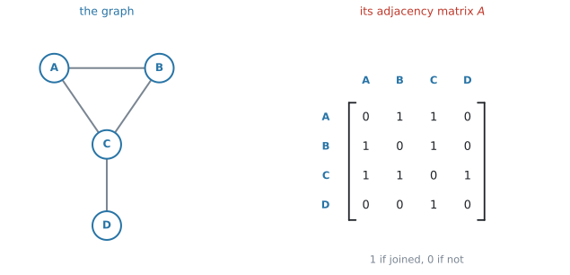{#fig-ahl315-idea width=98%}

@fig-ahl315-idea の $1$ 行目は、$A$ から見た行です。$A$ は $B$ と $C$ に結ばれ、$D$ とは結ばれていないので $\begin{pmatrix} 0 & 1 & 1 & 0 \end{pmatrix}$ となります。

$$
A = \begin{pmatrix}
0 & 1 & 1 & 0 \\
1 & 0 & 1 & 0 \\
1 & 1 & 0 & 1 \\
0 & 0 & 1 & 0
\end{pmatrix}
$$ {#eq-ahl315-adj}

::: {.callout-important}
## 行が「どこから」、列が「どこへ」です
$(i,\ j)$ 成分は、**$i$ から $j$ への edge の数**です。この向きの約束を、最初に決めておいてください。

無向グラフでは向きがないので気になりませんが、[第5節](#directed)の有向グラフでは**答えが変わります。**

さらに、[第7節](#transition)の transition matrix では**この向きが逆になります。** そこがこの項目でいちばん間違えるところなので、先に言っておきます。
:::

#### 行の和は degree です {#rowsum}

$1$ 行を横に足すと、その vertex から出ている edge の本数、つまり **degree** になります。

@eq-ahl315-adj の $3$ 行目は $1 + 1 + 0 + 1 = 3$ で、$\deg(C) = 3$ ✓（[AHL 3.14](ahl-3-14.qmd#terms)）

**書き写しの検算に使えます。** degree を図から数えたものと、行の和が合っているかを見てください。

### 2. 無向グラフの adjacency matrix は対称です {#symmetric}

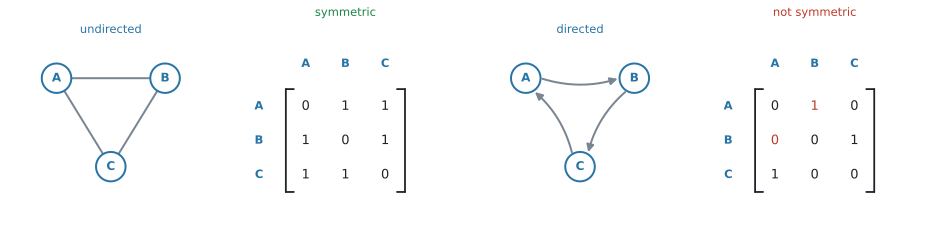{#fig-ahl315-symmetric width=100%}

無向グラフでは、$A$ と $B$ が結ばれていれば $B$ と $A$ も結ばれています。ですから $(1,2)$ 成分と $(2,1)$ 成分は必ず同じで、**対角線を折り目にして折り返すと重なります。**

有向グラフでは、そうはなりません。@fig-ahl315-symmetric の右では、$A \to B$ の矢印はありますが $B \to A$ はないので、$(1,2)$ 成分は $1$、$(2,1)$ 成分は $0$ です。

::: {.callout-tip}
## 対称かどうかは、書き終えたあとの検算になります
無向グラフの問題で、書いた行列が対称になっていなければ、**どこかで書き間違えています。**

対角線をはさんで、$1$ 組ずつ見くらべてください。
:::

::: {.callout-note}
## simple graph なら、対角成分は $0$ です
$(i,\ i)$ 成分は「$i$ から $i$ への edge」、つまり **loop** の数です。simple graph には loop がないので、**対角線は全部 $0$** になります（[AHL 3.14](ahl-3-14.qmd#kinds)）。

対角線に $1$ が出てきたら、loop のある graph です。
:::

### 3. walk は、edge をたどった道です {#walk}

**walk**（歩道）は、vertex から vertex へ、edge をたどって進んだ道のことです。**通った edge の本数**を、その walk の **length**（長さ）といいます。

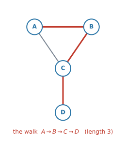{#fig-ahl315-walk width=68%}

@fig-ahl315-walk の $A \to B \to C \to D$ は、edge を $3$ 本通っているので **length $3$ の walk** です。

::: {.callout-warning}
## walk では、同じ場所を何度通っても構いません
$A \to B \to A \to C$ も、立派な length $3$ の walk です。**$A$ を $2$ 回通っていますが、それでよい**のです。

「同じ vertex を $2$ 度通らない道」には **path** という別の名前があり、そちらは **AHL 3.16** で扱います。この項目で数えるのは **walk** です。**制限のない、いちばんゆるい道**だと思ってください。
:::

### 4. $A^{k}$ が、長さ $k$ の walk を数えます {#power}

ここがこの項目の中心です。

$$
\bigl(A^{k}\bigr)_{ij} = \text{（$i$ から $j$ への、長さ $k$ の walk の数）}
$$ {#eq-ahl315-power}

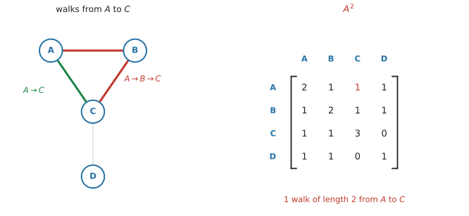{#fig-ahl315-power width=100%}

@fig-ahl315-power で確かめます。$A$ から $C$ への **length $2$** の walk は、途中に $1$ 点だけはさむ道です。

- $A \to B \to C$ … あります
- $A \to C \to C$ … $C$ から $C$ への edge がないので、ありません

ですから $1$ 本です。$A^{2}$ の $(A,\ C)$ 成分も $1$ になっています ✓

**直接つながっている $A \to C$ は、length $1$ なので数えません。** 聞かれているのは長さ $2$ の道だけです。

#### 対角成分は degree になります {#diagonal}

$A^{2}$ の $(i,\ i)$ 成分は「$i$ を出て、$1$ 点はさんで $i$ にもどる道」の数です。

これは「$i$ の隣に行って、そのまま引き返す」道なので、**隣の数、つまり degree** と同じになります。

@fig-ahl315-power の $A^{2}$ の対角線は $2,\ 2,\ 3,\ 1$ で、[第1節](#rowsum)の degree と一致します ✓

#### 「長さ $k$ 以下」は、足し算です {#atmost}

`walks of length 3 or less` と聞かれたら、長さ $1$、$2$、$3$ を**全部足します。**

$$
A + A^{2} + A^{3}
$$ {#eq-ahl315-atmost}

::: {.callout-warning}
## `of length 3` と `of length 3 or less` は別の問いです
前者は $A^{3}$ の成分だけ、後者は $A + A^{2} + A^{3}$ の成分です。

**問題文の `or less` / `at most` を見落とさないでください。** ここだけで答えが変わります。
:::

### 5. 有向グラフでも、同じように作れます {#directed}

矢印があるときは、**矢印の向きにだけ $1$** を書きます。$X \to Y$ の矢印があって $Y \to X$ がなければ、$(X,\ Y)$ 成分は $1$、$(Y,\ X)$ 成分は $0$ です。

@eq-ahl315-power は、有向グラフでもそのまま成り立ちます。**ただし walk は、矢印の向きに逆らえません。**

### 6. weighted adjacency table {#weighted}

edge に重みが付いているときは、$1$ の代わりに**重みそのもの**を書きます。これを **weighted adjacency table**（重み付き隣接表）といいます。

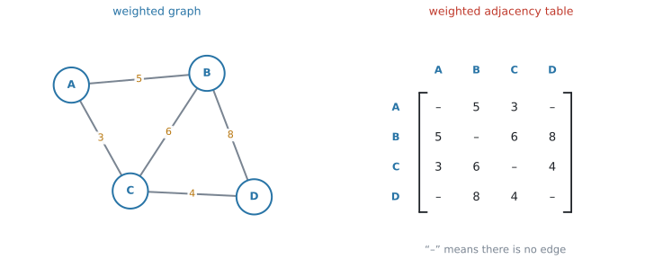{#fig-ahl315-weighted width=100%}

edge がないところは、$0$ ではなく **「$-$」や「$\infty$」**と書きます。

::: {.callout-warning}
## 重みの表では、$0$ を書かないでください
$0$ は「距離 $0$ でつながっている」と読めてしまいます。**「つながっていない」と「距離が $0$」は別のこと**です。

問題文の表に何が書いてあるかを、先に確かめてください。
:::

**重みの表に、@eq-ahl315-power は使えません。** 累乗して意味があるのは、$0$ と $1$ でできた adjacency matrix だけです。重みの表は、**AHL 3.16** の経路の問題で使います。

### 7. transition matrix は、向きが逆です {#transition}

**transition matrix**（推移行列）は、「いまここにいる人が、次にどこへ行くか」の確率を並べた行列です。有向グラフから作れます。

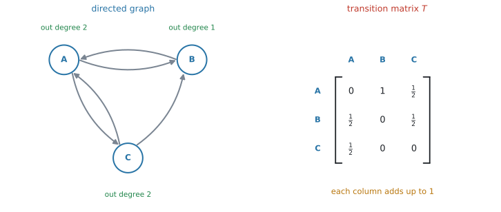{#fig-ahl315-transition width=100%}

作り方は $2$ 段階です。

1. vertex $j$ の **out degree** を数える
2. $j$ から出る矢印それぞれに、$\dfrac{1}{\text{out degree}}$ を割りふる

@fig-ahl315-transition の $A$ は out degree $2$ なので、$B$ へ $\frac{1}{2}$、$C$ へ $\frac{1}{2}$ です。

::: {.callout-important}
## adjacency matrix と、行と列が入れかわります
シラバスは、transition matrix について次のように書いています。

> $T_{ij}$ representing the probability of moving from state $j$ to state $i$

つまり **列が「どこから」、行が「どこへ」**です。[第1節](#adjacency)の adjacency matrix と**ちょうど逆**になっています。

| | 行 | 列 |
|---|---|---|
| adjacency matrix | どこ**から** | どこ**へ** |
| transition matrix | どこ**へ** | どこ**から** |

: $2$ つの行列の向き {#tbl-ahl315-direction}

**この $1$ 点が、この項目でいちばん失点するところ**です。transition matrix を作ったら、必ず次の検算をしてください。
:::

#### 列の和は、必ず $1$ です {#columnsum}

$1$ つの vertex から出ていく確率を全部足せば $1$ になります。**どこかへは必ず行く**からです。

@fig-ahl315-transition の各列は $0 + \frac{1}{2} + \frac{1}{2} = 1$、$1 + 0 + 0 = 1$、$\frac{1}{2} + \frac{1}{2} + 0 = 1$ ✓

**検算に使えるのは、列の和だけです。** 行の和は $1$ になることもあれば、ならないこともあります。そこを見ても、正しく作れたかは分かりません。

::: {.callout-note}
## 出る矢印がない vertex があると、作れません
出る矢印が $1$ 本もない vertex があると、その列に割りふる確率がありません。**入ったら出られない場所**があると、その列が作れないのです。

シラバスは、扱う対象を `Construction of the transition matrix for a strongly-connected, undirected or directed graph` と書いています。**strongly connected**（[AHL 3.14](ahl-3-14.qmd#connected)）なら、どの vertex からも必ずどこかへ出られるので、この心配がありません。
:::

この続き——$T$ を何乗すると何が分かるか、長い目で見るとどこに落ち着くか——は **AHL 4.19** の **Markov chains**（マルコフ連鎖）で扱います。公式集の $s_n = T^{n}s_0$ も、そちらの欄にあります。

### 8. PageRank は、この形の応用です {#pagerank}

シラバスは、この項目の応用として **Google の PageRank algorithm** を挙げています。

考え方はこうです。**ウェブページを vertex、リンクを有向の edge** とします。「でたらめにリンクをたどり続ける人」が、長い目で見てどのページにいる割合が高いか——それがそのページの重要度だ、という発想です。

つまり、**リンクの構造から transition matrix を作って、その落ち着き先を調べる**わけです。

「たくさんリンクされているページは重要」というだけではありません。**重要なページからリンクされているほど、重みが大きくなります。** リンク元の out degree で割るのは、そのためです。

::: {.callout-note appearance="simple"}
試験で PageRank の計算そのものを求められることはありません。**「有向グラフ → transition matrix → 長い目で見た割合」という筋道**が説明できれば十分です。
:::

## Why it works

:::: {.callout-note collapse="true" appearance="simple"}
## クリックすると開きます
ここで説明するのは、**なぜ $A^{2}$ の成分が「$2$ 歩の道の数」になるのか**、その $1$ 点だけです。

行列のかけ算の定義を思い出してください（[AHL 1.14](../01-number-and-algebra/ahl-1-14.qmd#howto)）。$A^{2}$ の $(i,\ j)$ 成分は

$$
\bigl(A^{2}\bigr)_{ij} = A_{i1}A_{1j} + A_{i2}A_{2j} + \cdots + A_{in}A_{nj}
$$ {#eq-ahl315-why}

でした。$1$ つの項 $A_{ik}A_{kj}$ を見てください。

- $A_{ik}$ は「$i$ から $k$ へ行けるか」（行ければ $1$）
- $A_{kj}$ は「$k$ から $j$ へ行けるか」（行ければ $1$）

**掛けて $1$ になるのは、両方 $1$ のとき**、つまり **$i \to k \to j$ と通り抜けられるとき**だけです。片方でも $0$ なら、積は $0$ です。

@eq-ahl315-why は、その積を**途中の点 $k$ について全部足したもの**です。ですから、$i$ から $j$ への $2$ 歩の道が何本あるかを数えていることになります。

$A^{3}$ も同じです。$A^{2}$ に $A$ を掛けるので、「$2$ 歩の道」に「もう $1$ 歩」を足しているだけです。$A^{k}$ まで、まったく同じ理由で成り立ちます。
::::

## Worked examples

::: {.callout-note appearance="simple"}
問題文は英語です。意味が理解できなかったら、問題文の下の「**日本語訳**」を開いてください。解説は日本語です。
:::

::: {#exm-ahl315-build}
[The graph $G$ is shown below.]{.q-en}

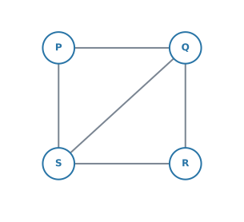{width=46%}

**(a)** [Write down the adjacency matrix $A$ of $G$, using the order $P$, $Q$, $R$, $S$.]{.q-en}

**(b)** [Find $A^{2}$, and hence write down the number of walks of length $2$ from $P$ to $R$.]{.q-en}

**(c)** [Find the number of walks of length $3$ or less from $P$ to $R$.]{.q-en}

<details class="jp-trans">
<summary>日本語訳</summary>

グラフ $G$ が下に示されています。

**(a)** $P$、$Q$、$R$、$S$ の順で、$G$ の隣接行列 $A$ を書きなさい。

**(b)** $A^{2}$ を求め、それを使って $P$ から $R$ への長さ $2$ の walk の数を書きなさい。

**(c)** $P$ から $R$ への長さ $3$ 以下の walk の数を求めなさい。

</details>

---

**(a)** $1$ 行ずつ、その vertex の隣を拾います。

- $P$ は $Q$ と $S$ に結ばれています
- $Q$ は $P$、$R$、$S$
- $R$ は $Q$ と $S$
- $S$ は $P$、$Q$、$R$

$$
A = \begin{pmatrix}
0 & 1 & 0 & 1 \\
1 & 0 & 1 & 1 \\
0 & 1 & 0 & 1 \\
1 & 1 & 1 & 0
\end{pmatrix}
$$

**検算。** 対称になっています ✓（[第2節](#symmetric)）行の和は $2,\ 3,\ 2,\ 3$ で、図の degree と一致します ✓

**(b)** 電卓に入れて $2$ 乗します（[GDC 第2節](#gdc-power)）。

$$
A^{2} = \begin{pmatrix}
2 & 1 & 2 & 1 \\
1 & 3 & 1 & 2 \\
2 & 1 & 2 & 1 \\
1 & 2 & 1 & 3
\end{pmatrix}
$$

$P$ の行、$R$ の列を見ます。**$2$** です。

**検算。** $P \to Q \to R$ と $P \to S \to R$ の $2$ 本です ✓

**(c)** `or less` があるので、長さ $1$、$2$、$3$ を全部足します（@eq-ahl315-atmost）。

$$
A^{3} = \begin{pmatrix}
2 & 5 & 2 & 5 \\
5 & 4 & 5 & 5 \\
2 & 5 & 2 & 5 \\
5 & 5 & 5 & 4
\end{pmatrix}
$$

$(P,\ R)$ 成分だけを見ればよいので、$3$ つ足します。

$$
0 + 2 + 2 = 4
$$

::: {.callout-note}
## 解答例（答案用紙にはこう書く）
**(a)**
$$
A = \begin{pmatrix}
0 & 1 & 0 & 1 \\
1 & 0 & 1 & 1 \\
0 & 1 & 0 & 1 \\
1 & 1 & 1 & 0
\end{pmatrix}
$$

**(b)**
$$
A^{2} = \begin{pmatrix}
2 & 1 & 2 & 1 \\
1 & 3 & 1 & 2 \\
2 & 1 & 2 & 1 \\
1 & 2 & 1 & 3
\end{pmatrix}
\qquad \Rightarrow \qquad 2 \ \text{walks}
$$

**(c)**
$$
(A)_{PR} + (A^{2})_{PR} + (A^{3})_{PR} = 0 + 2 + 2 = 4
$$
:::
:::

::: {#exm-ahl315-interpret}
[The matrix $A$ is the adjacency matrix of a simple graph. The diagonal entries of $A^{2}$ are $2$, $3$, $2$ and $3$.]{.q-en}

**(a)** [State what the diagonal entries of $A^{2}$ represent.]{.q-en}

**(b)** [Hence write down the number of edges of the graph.]{.q-en}

<details class="jp-trans">
<summary>日本語訳</summary>

行列 $A$ は、ある simple graph の隣接行列です。$A^{2}$ の対角成分は $2$、$3$、$2$、$3$ です。

**(a)** $A^{2}$ の対角成分が何を表しているかを述べなさい。

**(b)** これを使って、このグラフの辺の数を書きなさい。

</details>

---

**(a)** $(A^{2})_{ii}$ は「$i$ から出て、$1$ 点はさんで $i$ にもどる walk の数」です。

隣へ行って引き返すだけなので、これは**隣の数**、つまり degree と同じです（[第4節](#diagonal)）。

::: {.model-answer}
**試験ではこう書く**

*The diagonal entry $(A^{2})_{ii}$ is the number of walks of length $2$ from vertex $i$ back to itself, which is the degree of vertex $i$.*
:::

（$i$ から $i$ への長さ $2$ の walk の数であり、それは $i$ の次数に等しい、という意味です。）

**(b)** degree が $2,\ 3,\ 2,\ 3$ と分かったので、[AHL 3.14](ahl-3-14.qmd#handshake) の関係が使えます。

$$
2 + 3 + 2 + 3 = 10 = 2 \times (\text{number of edges})
$$

$$
\text{number of edges} = 5
$$

::: {.callout-note}
## 解答例（答案用紙にはこう書く）
**(a)** *$(A^{2})_{ii}$ counts the walks of length $2$ from vertex $i$ back to itself, so it equals the degree of vertex $i$.*

**(b)**
$$
\sum \deg = 2+3+2+3 = 10 = 2E \quad \Rightarrow \quad E = 5
$$
:::
:::

::: {#exm-ahl315-transition}
[The directed graph below shows the links between three web pages $X$, $Y$ and $Z$.]{.q-en}

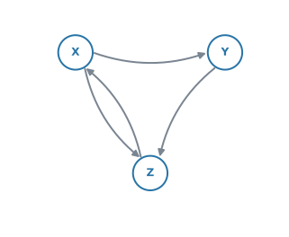{width=46%}

**(a)** [Write down the adjacency matrix, using the order $X$, $Y$, $Z$.]{.q-en}

**(b)** [Find the number of walks of length $2$ from $X$ back to $X$.]{.q-en}

**(c)** [A user clicks a link at random. Write down the transition matrix $T$.]{.q-en}

<details class="jp-trans">
<summary>日本語訳</summary>

下の有向グラフは、$3$ つのウェブページ $X$、$Y$、$Z$ のあいだのリンクを表しています。

**(a)** $X$、$Y$、$Z$ の順で隣接行列を書きなさい。

**(b)** $X$ から $X$ へもどる長さ $2$ の walk の数を求めなさい。

**(c)** 利用者がリンクを無作為に選ぶとします。推移行列 $T$ を書きなさい。

</details>

---

**(a)** 矢印は $X \to Y$、$X \to Z$、$Y \to Z$、$Z \to X$ の $4$ 本です。**行が「から」**でした（[第1節](#adjacency)）。

$$
A = \begin{pmatrix}
0 & 1 & 1 \\
0 & 0 & 1 \\
1 & 0 & 0
\end{pmatrix}
$$

**対称ではありません。** 有向グラフなので、それでよいのです。

**(b)** $A$ を $2$ 乗して、$(X,\ X)$ 成分を見ます。

$$
A^{2} = \begin{pmatrix}
1 & 0 & 1 \\
1 & 0 & 0 \\
0 & 1 & 1
\end{pmatrix}
$$

$(X,\ X)$ 成分は **$1$** です。$X \to Z \to X$ の $1$ 本だけです ✓

**(c)** ここで**行と列が入れかわります**（[第7節](#transition)）。まず out degree を数えます。

| vertex | $X$ | $Y$ | $Z$ |
|---|---|---|---|
| out degree | $2$ | $1$ | $1$ |

$X$ の列には、$Y$ へ $\frac{1}{2}$、$Z$ へ $\frac{1}{2}$ を入れます。$Y$ の列は $Z$ へ $1$、$Z$ の列は $X$ へ $1$ です。

$$
T = \begin{pmatrix}
0 & 0 & 1 \\
\frac{1}{2} & 0 & 0 \\
\frac{1}{2} & 1 & 0
\end{pmatrix}
$$

**検算。** 各列の和が $1$ になっています ✓（[第7節](#columnsum)）

::: {.callout-note}
## 解答例（答案用紙にはこう書く）
**(a)**
$$
A = \begin{pmatrix} 0 & 1 & 1 \\ 0 & 0 & 1 \\ 1 & 0 & 0 \end{pmatrix}
$$

**(b)**
$$
A^{2} = \begin{pmatrix} 1 & 0 & 1 \\ 1 & 0 & 0 \\ 0 & 1 & 1 \end{pmatrix}
\qquad \Rightarrow \qquad 1 \ \text{walk}
$$

**(c)**
$$
T = \begin{pmatrix} 0 & 0 & 1 \\ \frac{1}{2} & 0 & 0 \\ \frac{1}{2} & 1 & 0 \end{pmatrix}
$$
:::
:::

::: {#exm-ahl315-weighted}
[The weighted adjacency table below shows the distances, in kilometres, between four sites.]{.q-en}

| | $A$ | $B$ | $C$ | $D$ |
|---|---|---|---|---|
| $A$ | $-$ | $5$ | $3$ | $-$ |
| $B$ | $5$ | $-$ | $6$ | $8$ |
| $C$ | $3$ | $6$ | $-$ | $4$ |
| $D$ | $-$ | $8$ | $4$ | $-$ |

**(a)** [Explain what the entry "$-$" in row $A$, column $D$ means.]{.q-en}

**(b)** [Find the total distance of the route $A \to C \to D$.]{.q-en}

**(c)** [Find the shortest route from $A$ to $D$, and state its length.]{.q-en}

<details class="jp-trans">
<summary>日本語訳</summary>

下の重み付き隣接表は、$4$ つの地点のあいだの距離（キロメートル）を表しています。表の見出しは地点の名前です。

**(a)** $A$ の行、$D$ の列にある「$-$」が何を意味するかを説明しなさい。

**(b)** 経路 $A \to C \to D$ の距離の合計を求めなさい。

**(c)** $A$ から $D$ への最短経路を求め、その距離を書きなさい。

</details>

---

**(a)** 表の $A$ の行と $D$ の列が交わるところが「$-$」です。

::: {.model-answer}
**試験ではこう書く**

*There is no direct edge between $A$ and $D$: the two sites are not joined by a road.*
:::

（$A$ と $D$ を直接つなぐ道路がない、という意味です。**距離が $0$ という意味ではありません**（[第6節](#weighted)）。）

**(b)** 表から $AC = 3$、$CD = 4$ を読みます。

$$
3 + 4 = 7 \ \text{km}
$$

**(c)** 同じ場所を $2$ 度通らない道を、全部書き出します。$A$ から出られるのは $B$ と $C$ の $2$ 方向で、そのあとの分かれ方を考えると $4$ 通りあります。

| 経路 | 距離 |
|---|---|
| $A \to C \to D$ | $3 + 4 = 7$ |
| $A \to B \to D$ | $5 + 8 = 13$ |
| $A \to B \to C \to D$ | $5 + 6 + 4 = 15$ |
| $A \to C \to B \to D$ | $3 + 6 + 8 = 17$ |

いちばん短いのは $A \to C \to D$ で、**$7$ km** です。

::: {.callout-note}
## 解答例（答案用紙にはこう書く）
**(a)** *There is no edge between $A$ and $D$.*

**(b)**
$$
3 + 4 = 7 \ \text{km}
$$

**(c)**
$$
A \to C \to D = 7, \qquad A \to B \to D = 13
$$
$$
A \to B \to C \to D = 15, \qquad A \to C \to B \to D = 17
$$

*The shortest route is $A \to C \to D$, of length $7$ km.*
:::
:::

## Common errors

::: {.callout-warning}
## transition matrix を、adjacency matrix と同じ向きで書く
**この項目で、いちばん多い失点です。**

adjacency matrix は「行 = から」、transition matrix は「**列 = から**」です（@tbl-ahl315-direction）。

書き終えたら、**列の和が $1$ になっているか**を必ず見てください。$1$ にならない列があれば、向きを取りちがえています。
:::

::: {.callout-warning}
## `of length 3` と `of length 3 or less` を取りちがえる
前者は $A^{3}$ の $1$ つの成分、後者は $A + A^{2} + A^{3}$ の成分です。

**問題文の `or less` / `at most` に印を付けてから**、計算を始めてください。
:::

::: {.callout-warning}
## vertex の順番を、途中で変えてしまう
$P$、$Q$、$R$、$S$ の順で作った行列を、$A^{2}$ を読むときに別の順で見てしまう誤りです。

**行列のまわりに、vertex の名前を書き込んでください。** 表の見出しがあれば、読み間違えません。
:::

::: {.callout-warning}
## 重みの表を累乗する
weighted adjacency table を $2$ 乗しても、意味のある数は出てきません。

@eq-ahl315-power が使えるのは、**$0$ と $1$ でできた adjacency matrix だけ**です（[第6節](#weighted)）。
:::

::: {.callout-warning}
## edge がないところに $0$ を書く（重みの表）
重みの表では、$0$ は「距離 $0$」と読めてしまいます。**「$-$」か「$\infty$」**を書いてください。

いっぽう adjacency matrix では、$0$ が「つながっていない」の意味で正しいものです。**$2$ つの表で、$0$ の意味が違います。**
:::

::: {.callout-warning}
## walk と path を混同する
walk は、**同じ vertex を何度通っても構いません**（[第3節](#walk)）。

$A \to B \to A$ を「もどっているから数えない」と考えて、答えが小さくなる誤りが多いところです。$A^{k}$ が数えているのは、**制限のない walk** です。
:::

::: {.callout-warning}
## 有向グラフなのに、対称な行列を書く
無向グラフの癖で、$X \to Y$ を書いたときに $(Y,\ X)$ にも $1$ を入れてしまう誤りです。

**矢印があるほうにだけ**書いてください。有向グラフの行列は、対称にならないのがふつうです。
:::

::: {.callout-warning}
## $A^{k}$ の成分を、電卓の小数のまま書き写す
walk の数は**整数**です。電卓が $2.$ や $1.99999$ と表示したときは、表示の設定の問題です。

`ctrl + menu → Number → Round` や、Document Settings の `Display Digits` を確かめてください。**答案には整数で書きます。**
:::

## Using your GDC (TI-Nspire CX II)

この項目から、**電卓の出番が一気に増えます。** $4 \times 4$ を手で $3$ 乗するのは、時間がかかるうえに間違えます。

### 1. 行列を打ちこんで、名前を付ける {#gdc-enter}

[AHL 1.14](../01-number-and-algebra/ahl-1-14.qmd#gdc-enter) と同じ手順です。

```
menu → 7: Matrix & Vector → 1: Create → 1: Matrix
```

行と列の数を入れて `OK`。`tab` で移動しながら $0$ と $1$ を入れ、最後に名前を付けます。

```
ctrl + sto→
```

に続けて `a` と打てば、以後は `a` で呼び出せます。

::: {.callout-tip}
## $0$ と $1$ の入力は、行ごとに声に出して確かめてください
$4 \times 4$ なら $16$ 個です。**打ち間違えると、そのあとが全部ずれます。**

打ち終わったら、[行の和が degree になっているか](#rowsum)を見てください。$30$ 秒の検算で、大きな失点が防げます。
:::

### 2. 累乗する {#gdc-power}

`^` キーで指数を打つだけです。

```
a^2
a^3
```

$3 \times 3$ でも $4 \times 4$ でも、一瞬で返ります。

### 3. 「長さ $k$ 以下」を足す {#gdc-sum}

@eq-ahl315-atmost は、そのまま打てます。

```
a + a^2 + a^3
```

**$1$ つの成分だけが要るときも、行列全体を出してから読むほうが速い**です。成分を取り出す書き方もありますが、覚えることが増えるだけです。

### 4. transition matrix は分数のまま入れる {#gdc-fraction}

$\frac{1}{2}$ を $0.5$ と打っても計算はできますが、**答えが小数で出て、書き写すときに桁を落とします。**

分数テンプレート（`ctrl + ÷`）で $\frac{1}{2}$ のまま入れてください。列の和の検算も、分数のほうが速く済みます。

::: {.callout-warning}
## 列の和は、電卓でも確かめられます
打ちこんだ transition matrix を `t` としたとき、

```
[[1, 1, 1]] * t
```

と打つと、**各列の和が $1$ 行に並んで返ります。** 全部 $1$ なら正しく作れています。
:::

## Exercises

::: {.callout-note appearance="simple"}
各問題に、折りたたみが3つ付いています。**日本語訳**、**解答例**（答案用紙に書くべきこと。英語です）、**解説**（なぜそうなるか。日本語です）。

まず自分で解いて、次に解答例と見くらべてください。**解説は、合わなかったときだけ開けば十分です。**
:::

::: {.exercise-block}

[1]{.ex-no} [The graph below has vertices $A$, $B$, $C$ and $D$.]{.q-en}

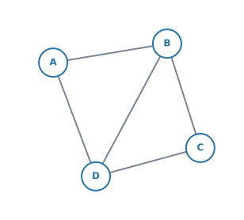{width=44%}

**(a)** [Write down the adjacency matrix $A$, using the order $A$, $B$, $C$, $D$.]{.q-en}

**(b)** [Write down the degree of each vertex, and check it against your matrix.]{.q-en}

<details class="jp-trans">
<summary>日本語訳</summary>

下のグラフは、頂点 $A$、$B$、$C$、$D$ をもちます。

**(a)** $A$、$B$、$C$、$D$ の順で隣接行列 $A$ を書きなさい。

**(b)** 各頂点の次数を書き、行列と合っているか確かめなさい。

</details>

::: {.callout-note collapse="true"}
## 解答例（答案用紙に書くこと）
**(a)**
$$
A = \begin{pmatrix}
0 & 1 & 0 & 1 \\
1 & 0 & 1 & 1 \\
0 & 1 & 0 & 1 \\
1 & 1 & 1 & 0
\end{pmatrix}
$$

**(b)** $\deg(A)=2$, $\deg(B)=3$, $\deg(C)=2$, $\deg(D)=3$

*Each row sum equals the degree of that vertex.*
:::

::: {.callout-tip collapse="true"}
## 解説
edge は $AB$、$AD$、$BC$、$BD$、$CD$ の $5$ 本です。

**(b)** 行の和は $2,\ 3,\ 2,\ 3$ で、図から数えた degree と一致します（[第1節](#rowsum)）。合計 $10$ が $2 \times 5$ になっていることも確かめられます。

書いた行列が**対称**になっているかも見てください。無向グラフなので、対称でなければ書き間違いです。
:::

::: {.ex-sep}
:::

[2]{.ex-no} [For the graph in question 1, find $A^{2}$ and hence write down the number of walks of length $2$ from $A$ to $C$. List these walks.]{.q-en}

<details class="jp-trans">
<summary>日本語訳</summary>

問題 1 のグラフについて、$A^{2}$ を求め、それを使って $A$ から $C$ への長さ $2$ の walk の数を書きなさい。その walk を書き出しなさい。

</details>

::: {.callout-note collapse="true"}
## 解答例（答案用紙に書くこと）
$$
A^{2} = \begin{pmatrix}
2 & 1 & 2 & 1 \\
1 & 3 & 1 & 2 \\
2 & 1 & 2 & 1 \\
1 & 2 & 1 & 3
\end{pmatrix}
$$

*There are $2$ walks: $A \to B \to C$ and $A \to D \to C$.*
:::

::: {.callout-tip collapse="true"}
## 解説
$(A^{2})_{AC}$、つまり $1$ 行目 $3$ 列目を読みます。$2$ です。

`List these walks` と言われているので、**実際に書き出す**ところまでが解答です。$A$ の隣は $B$ と $D$、そのどちらからも $C$ へ行けるので $2$ 本です。

**行と列を取りちがえないでください。** 行が「から」、列が「へ」でした（[第1節](#adjacency)）。この graph は無向なので $(A^{2})_{CA}$ でも同じ値ですが、有向グラフでは変わります。
:::

::: {.ex-sep}
:::

[3]{.ex-no} [For the graph in question 1, find the number of walks of length $3$ or less from $A$ to $B$.]{.q-en}

<details class="jp-trans">
<summary>日本語訳</summary>

問題 1 のグラフについて、$A$ から $B$ への長さ $3$ 以下の walk の数を求めなさい。

</details>

::: {.callout-note collapse="true"}
## 解答例（答案用紙に書くこと）
$$
(A)_{AB} + (A^{2})_{AB} + (A^{3})_{AB} = 1 + 1 + 5 = 7
$$
:::

::: {.callout-tip collapse="true"}
## 解説
`or less` があるので、$3$ つ足します（@eq-ahl315-atmost）。

電卓なら `a + a^2 + a^3` と打って、$1$ 行目 $2$ 列目を読むだけです（[GDC 第3節](#gdc-sum)）。

$A^{3}$ を単独で求めて $5$ と答えるのが、いちばん多い誤りです。**問われているのは合計です。**
:::

::: {.ex-sep}
:::

[4]{.ex-no} [The adjacency matrix of a simple graph has $A^{2}$ with diagonal entries $3$, $3$, $4$, $2$ and $2$. Find the number of edges of the graph.]{.q-en}

<details class="jp-trans">
<summary>日本語訳</summary>

ある simple graph の隣接行列について、$A^{2}$ の対角成分が $3$、$3$、$4$、$2$、$2$ です。このグラフの辺の数を求めなさい。

</details>

::: {.callout-note collapse="true"}
## 解答例（答案用紙に書くこと）
*The diagonal entries of $A^{2}$ are the degrees.*

$$
3+3+4+2+2 = 14 = 2E \quad \Rightarrow \quad E = 7
$$
:::

::: {.callout-tip collapse="true"}
## 解説
$A^{2}$ の対角成分が degree であること（[第4節](#diagonal)）に気づけば、あとは [AHL 3.14](ahl-3-14.qmd#handshake) の関係だけです。

**graph をかく必要はありません。** 合計 $14$ が偶数になっていることも、答えが正しい合図です。
:::

::: {.ex-sep}
:::

[5]{.ex-no} [The directed graph below shows the one-way paths between three points.]{.q-en}

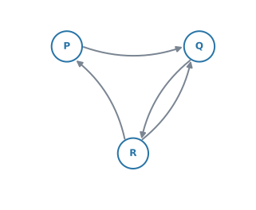{width=44%}

**(a)** [Write down the adjacency matrix, using the order $P$, $Q$, $R$.]{.q-en}

**(b)** [Write down the transition matrix for a walker who chooses each available path at random.]{.q-en}

<details class="jp-trans">
<summary>日本語訳</summary>

下の有向グラフは、$3$ 地点のあいだの一方通行の道を表しています。

**(a)** $P$、$Q$、$R$ の順で隣接行列を書きなさい。

**(b)** 進める道を無作為に選ぶ人についての推移行列を書きなさい。

</details>

::: {.callout-note collapse="true"}
## 解答例（答案用紙に書くこと）
**(a)**
$$
A = \begin{pmatrix} 0 & 1 & 0 \\ 0 & 0 & 1 \\ 1 & 1 & 0 \end{pmatrix}
$$

**(b)**
$$
T = \begin{pmatrix} 0 & 0 & \frac{1}{2} \\ 1 & 0 & \frac{1}{2} \\ 0 & 1 & 0 \end{pmatrix}
$$
:::

::: {.callout-tip collapse="true"}
## 解説
矢印は $P \to Q$、$Q \to R$、$R \to P$、$R \to Q$ の $4$ 本です。

**(a)** 行が「から」です。$R$ の行だけ $1$ が $2$ つ入ります。**対称にはなりません。**

**(b)** ここで**行と列が入れかわります**（[第7節](#transition)）。out degree は $P$ が $1$、$Q$ が $1$、$R$ が $2$ です。

$R$ の**列**に $\frac{1}{2}$ を $2$ つ入れるのが、この問題の山です。

**検算。** 列の和は $0+1+0 = 1$、$0+0+1 = 1$、$\frac{1}{2}+\frac{1}{2}+0 = 1$ ✓
:::

::: {.ex-sep}
:::

[6]{.ex-no} [For the directed graph in question 5, find the number of walks of length $2$ from $P$ to $R$.]{.q-en}

<details class="jp-trans">
<summary>日本語訳</summary>

問題 5 の有向グラフについて、$P$ から $R$ への長さ $2$ の walk の数を求めなさい。

</details>

::: {.callout-note collapse="true"}
## 解答例（答案用紙に書くこと）
$$
A^{2} = \begin{pmatrix} 0 & 0 & 1 \\ 1 & 1 & 0 \\ 0 & 1 & 1 \end{pmatrix}
\qquad \Rightarrow \qquad (A^{2})_{PR} = 1
$$

*The walk is $P \to Q \to R$.*
:::

::: {.callout-tip collapse="true"}
## 解説
使うのは **(a) の隣接行列**です。transition matrix を $2$ 乗しても、walk の数は出ません。

$P$ から出る矢印は $Q$ へ $1$ 本だけ。$Q$ からは $R$ へ行けるので、$P \to Q \to R$ の $1$ 本です ✓

**有向グラフでは向きが効きます。** $(A^{2})_{RP}$ は別の値になります。
:::

::: {.ex-sep}
:::

[7]{.ex-no} [Explain why the adjacency matrix of an undirected graph is always symmetric.]{.q-en}

<details class="jp-trans">
<summary>日本語訳</summary>

無向グラフの隣接行列がいつも対称になる理由を説明しなさい。

</details>

::: {.callout-note collapse="true"}
## 解答例（答案用紙に書くこと）
*In an undirected graph, an edge between $i$ and $j$ can be travelled in both directions. So the entry in row $i$, column $j$ and the entry in row $j$, column $i$ both count the same edge, and they are always equal. Hence $A = A^{\mathrm{T}}$.*
:::

::: {.callout-tip collapse="true"}
## 解説
`Explain why` は、**言葉で理由を書く**設問です。行列を $1$ つ書いて「対称だから」では点になりません。

要点は「**同じ $1$ 本の edge を、$2$ か所で数えている**」ことです。向きがないので、どちらから見ても同じ edge です。

有向グラフでこれが崩れる理由も、同じ文で説明できます。**片方向にしか行けないので、片方だけが $1$ になる**からです。
:::

::: {.ex-sep}
:::

[8]{.ex-no} [The weighted graph below shows the cost, in dollars, of shipping between four warehouses.]{.q-en}

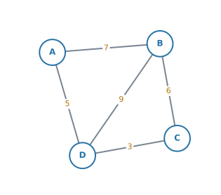{width=46%}

**(a)** [Write down the weighted adjacency table.]{.q-en}

**(b)** [Find the cheapest route from $A$ to $C$, and state its cost.]{.q-en}

<details class="jp-trans">
<summary>日本語訳</summary>

下の重み付きグラフは、$4$ つの倉庫のあいだの輸送費（ドル）を表しています。

**(a)** 重み付き隣接表を書きなさい。

**(b)** $A$ から $C$ への最も安い経路を求め、その費用を書きなさい。

</details>

::: {.callout-note collapse="true"}
## 解答例（答案用紙に書くこと）
**(a)**

| | $A$ | $B$ | $C$ | $D$ |
|---|---|---|---|---|
| $A$ | $-$ | $7$ | $-$ | $5$ |
| $B$ | $7$ | $-$ | $6$ | $9$ |
| $C$ | $-$ | $6$ | $-$ | $3$ |
| $D$ | $5$ | $9$ | $3$ | $-$ |

**(b)**
$$
A \to D \to C = 5 + 3 = 8, \qquad A \to B \to C = 7 + 6 = 13
$$
$$
A \to B \to D \to C = 7 + 9 + 3 = 19
$$
$$
A \to D \to B \to C = 5 + 9 + 6 = 20
$$

*The cheapest route is $A \to D \to C$, costing $8$ dollars.*
:::

::: {.callout-tip collapse="true"}
## 解説
**(a)** 対角線は「自分から自分へ」なので「$-$」です。$A$ と $C$ は直接つながっていないので、そこも「$-$」になります。

**$0$ と書かないでください**（[第6節](#weighted)）。

**(b)** $A$ から出られるのは $B$ と $D$ の $2$ 方向です。そのあとの分かれ方まで考えると、同じ場所を $2$ 度通らない道は $4$ 通りあります。

**重みが小さい edge から順に選べば最短になる、とはかぎりません。** ここでは $AD = 5$ が最小で、たまたまそれが答えの一部になっていますが、必ず**足して比べて**ください。
:::

:::
