# AHL 3.16 — Tree and cycle algorithms（木と閉路のアルゴリズム） {#sec-ahl-3-16}

::: {.callout-note}
## What you should be able to do
- **walk**、**trail**（小道）、**path**（道）、**circuit**（回路）、**cycle**（閉路）を区別できる。
- **odd vertex の個数**から、**Eulerian trail / circuit** があるかを判定できる。**Hamiltonian path / cycle** との違いを言える。
- **minimum spanning tree**（最小全域木）を **Kruskal** と **Prim** で求められる。Prim は**表の上でも**実行できる。
- **Chinese postman problem**（中国人郵便配達問題）を、odd vertex が $4$ 個までのグラフで解ける。**なぜその方法でよいかを説明できる。**
- **travelling salesman problem**（巡回セールスマン問題）で、**nearest neighbour** による上界と、**deleted vertex** による下界を求められる。
- 現実の道路網を、**table of least distances**（最短距離の表）で **complete graph**（完全グラフ）に直せる。
:::

::: {.callout-note}
## $3$ つのページの最後です
[AHL 3.15 の第6節](ahl-3-15.qmd#walk)で、**walk** —— edge をたどった道 —— を入れました。同じ vertex も同じ edge も、何度通ってもよい、いちばんゆるいたどり方でした。

このページでは、まず **その walk を分類します。** 「edge を繰り返さない」「vertex を繰り返さない」「出発点にもどる」という制限を付けて、名前を分けます。

そのうえで、graph の上の**道を選ぶ問題**を $3$ つ扱います。

| 問題 | 何を全部通るか | 何を最小にするか |
|---|---|---|
| **minimum spanning tree** | vertex を全部**つなぐ** | つないだ edge の weight の合計 |
| **Chinese postman** | **edge** を全部通る | 歩く距離の合計 |
| **travelling salesman** | **vertex** を全部通る | 回る距離の合計 |

: この項目で解く $3$ つの問題 {#tbl-ahl316-three}

**edge の話か、vertex の話か。** 最初にそこを見分けるだけで、使う道具が決まります。$3$ つの見分け方は、[最後の節](#compare)にまとめてあります。
:::

::: {.callout-note}
## この項目に出てくるのは、すべて algorithm です
**algorithm**（アルゴリズム）とは、**迷わずに最後まで実行できる手順**のことです。この項目で覚えるのは、公式ではなく手順です。

| algorithm | 何のため | 出てくるもの |
|---|---|---|
| Eulerian の判定 | edge を全部 $1$ 回ずつ通れるか | あるか・ないか |
| **Kruskal** / **Prim** | 全部つなぐ最小の weight | **正確な値** |
| Chinese postman | edge を全部通る最短 | **正確な値** |
| **nearest neighbour** | vertex を全部回る道を $1$ つ作る | **upper bound**（上界） |
| **deleted vertex** | 回る距離がこれを下回れないという値 | **lower bound**（下界） |

: この項目の algorithm と、それぞれが出すもの {#tbl-ahl316-algos}

**最後の列がいちばん大事です。** 「正確な値が出るのか、上からの押さえなのか、下からの押さえなのか」を取りちがえると、答え方そのものが変わります。

（この項目にも公式集の欄はありません。手順の理由は、そのつど書きます。）
:::

::: {.callout-note appearance="simple"}
シラバスは、この項目を `Tree and cycle algorithms with undirected graphs` と書いています。**この項目に出てくる graph は、矢印のない無向グラフ（undirected graph）です。**
:::

## The idea

### 1. walk、trail、path、circuit、cycle {#words}

[AHL 3.15](ahl-3-15.qmd#walk) の walk に、制限を付けていきます。

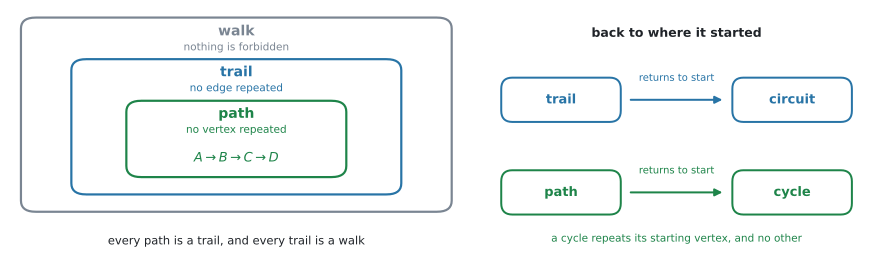{#fig-ahl316-nested width=100%}

| 英語 | 日本語 | 決まり |
|---|---|---|
| **walk** | 歩道 | 何を繰り返してもよい |
| **trail** | 小道 | **edge** を繰り返さない |
| **path** | 道 | **vertex** を繰り返さない |
| **circuit** | 回路 | 出発点にもどる **trail** |
| **cycle** | 閉路 | 出発点にもどる **path** |

: たどり方の $5$ つの名前 {#tbl-ahl316-words}

@fig-ahl316-nested の左が、walk・trail・path の $3$ つの関係です。**path は必ず trail であり、trail は必ず walk** です。逆は言えません。

vertex を繰り返さなければ、同じ edge を $2$ 度通ることもできません（$2$ 度目に通るには、その edge の端にもう $1$ 度立たなければならないからです）。ですから **path は自動的に trail** になります。

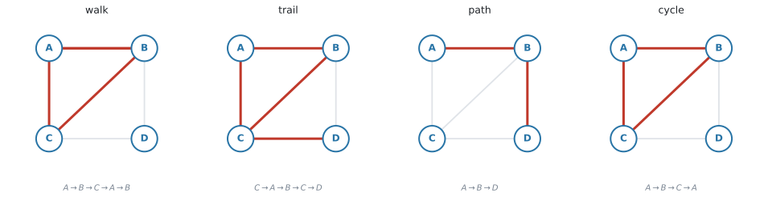{#fig-ahl316-words width=100%}

@fig-ahl316-words の $2$ 番目は、$C$ を $2$ 度通っています。だから path ではありません。しかし、**同じ edge を $2$ 度は通っていない**ので trail です。

#### 出発点にもどると、名前が変わります {#closed}

@fig-ahl316-nested の右です。**trail が出発点にもどれば circuit**、**path が出発点にもどれば cycle** です。

::: {.callout-important}
## cycle は、出発点と終点だけが同じです
$A \to B \to C \to A$ は cycle です。$A$ が $2$ 度出てきますが、**それは出発点と終点として $1$ 度ずつ**であって、途中で $A$ を通り直しているわけではありません。

**「出発点と終点以外の vertex は、$1$ 度ずつしか通らない」**——これが cycle の条件です。

$A \to B \to C \to B \to A$ は、途中で $B$ を $2$ 度通っているので cycle ではありません（edge も繰り返しているので circuit でもありません）。
:::

::: {.callout-tip}
## 見分け方は、$2$ つの質問だけです
1. **同じ edge を $2$ 度通ったか。** 通っていれば walk 止まりです。
2. **出発点と終点を除いて、同じ vertex を $2$ 度通ったか。** 通っていれば trail 止まりで、path ではありません。

そして、**出発点にもどっていれば**、trail は circuit に、path は cycle になります。

`State whether ... is a walk, a trail, or a path` と問われたら、**あてはまるいちばん強い言い方**を答えます。path は walk でもありますが、`walk` と書いても点にはなりません。
:::

### 2. この項目でずっと使うグラフ {#graph}

以下、この重み付きグラフ $G$ を使います。

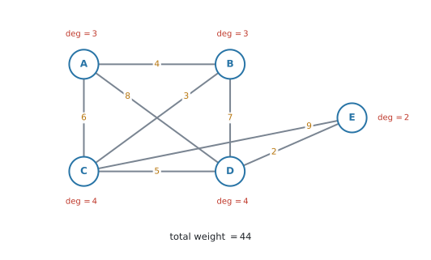{#fig-ahl316-graph width=82%}

vertex は $5$ 個、edge は $8$ 本、weight の合計は $44$ です。degree は次のようになります。

$$
\deg A = 3, \quad \deg B = 3, \quad \deg C = 4, \quad \deg D = 4, \quad \deg E = 2
$$

合計は $16 = 2 \times 8$ で、[AHL 3.14 の関係](ahl-3-14.qmd#handshake)と合っています。

**odd vertex（次数が奇数の頂点）は $A$ と $B$ の $2$ 個**です。この $2$ 個という数字が、あとで何度も効いてきます。

### 3. Eulerian trail と Eulerian circuit {#euler}

**全部の edge を、ちょうど $1$ 回ずつ通る**たどり方を考えます。

- **Eulerian trail**（オイラー小道）… 全部の edge を $1$ 回ずつ通る trail
- **Eulerian circuit**（オイラー回路）… それが**出発点にもどる**もの

「一筆書き」のことです。**グラフがつながってさえいれば**、あるかないかは **odd vertex を数えるだけ**で分かります。

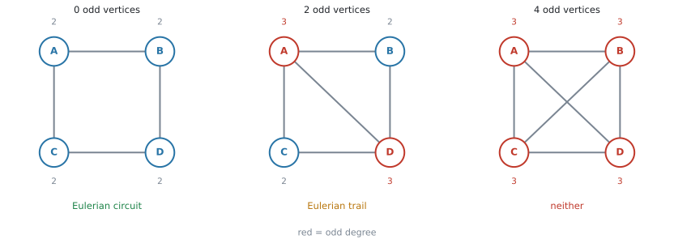{#fig-ahl316-euler width=100%}

| odd vertex の個数 | 結論 |
|---|---|
| $0$ 個 | **Eulerian circuit がある**（どこから始めてもよい） |
| $2$ 個 | **Eulerian trail がある**。ただし、**その $2$ 個の一方から出発して、もう一方で終わる** |
| それ以外 | どちらもない |

: Eulerian の判定（グラフが connected である場合） {#tbl-ahl316-euler}

::: {.callout-warning}
## つながっていることが、前提です
この判定表は、グラフが [connected](ahl-3-14.qmd#connected) であることを前提にしています。

たとえば、離れた三角形が $2$ つあるグラフは degree が全部 $2$（odd vertex は $0$ 個）ですが、片方からもう片方へ行けないので、Eulerian circuit はありません。**まず、ひとつながりかどうかを見てください。**
:::

::: {.callout-important}
## odd vertex は、$1$ 個や $3$ 個にはなりません
[AHL 3.14 の Why it works](ahl-3-14.qmd#why-it-works) で見たとおり、**odd vertex の個数は必ず偶数**です。

$0$、$2$、$4$、$6$、… しかありません。判定表に「$1$ 個のとき」が無いのは、そのためです。
:::

@fig-ahl316-graph の $G$ では odd vertex が $A$、$B$ の $2$ 個なので、**Eulerian trail はあり、Eulerian circuit はありません**。しかも、その trail は $A$ から始めて $B$ で終わる（またはその逆）と決まっています。

### 4. Hamiltonian path と Hamiltonian cycle {#hamilton}

こんどは **vertex** の話です。

- **Hamiltonian path**（ハミルトン道）… 全部の vertex を、ちょうど $1$ 回ずつ通る path
- **Hamiltonian cycle**（ハミルトン閉路）… それが出発点にもどるもの

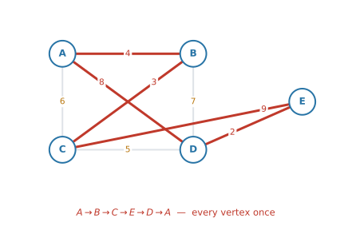{#fig-ahl316-hamilton width=76%}

@fig-ahl316-hamilton は $A \to B \to C \to E \to D \to A$ で、$5$ 個の vertex を $1$ 回ずつ通ってもどっています。使わなかった edge があってもかまいません。**Hamiltonian は edge を全部使う必要がない**からです。

| | 全部通るもの | 判定 |
|---|---|---|
| **Eulerian** | **edge** | odd vertex を数えれば決まる |
| **Hamiltonian** | **vertex** | 数えるだけでは決まらない |

: Eulerian と Hamiltonian {#tbl-ahl316-eh}

::: {.callout-warning}
## Hamiltonian には、このコースで使える簡単な必要十分条件はありません
Eulerian は odd vertex を数えるだけで決まりました。**Hamiltonian には、それにあたる簡単な条件がありません。**

「degree が全部これ以上なら必ずある」という**十分条件**はいくつか知られていますが、どれもこのコースの範囲外です。「あるとき、そしてそのときにかぎり」と言える簡単な条件は、この課程では扱いません。

ですから問われるのは、たいてい**具体的に $1$ つ見つけて書く**ことです。見つけたら、$A \to B \to C \to E \to D \to A$ のように**順番を書いてください。**

（ないことを示すのは、ずっと難しくなります。試験で問われるとすれば、ある vertex に edge が $1$ 本しか付いていないなど、**その vertex を通り抜けられない**ことが目で見て分かる場合です。）
:::

::: {.callout-note}
## 名前の由来
Euler は $18$ 世紀のスイスの数学者で、ケーニヒスベルクの $7$ つの橋を一筆書きできるかという問題を、この odd vertex の考え方で解きました。Hamilton は $19$ 世紀のアイルランドの数学者で、正十二面体の頂点をめぐるパズルを作りました。
:::

### 5. subgraph、spanning subgraph、spanning tree、MST {#mst}

言葉が $4$ つ並ぶので、図で見分けてください。

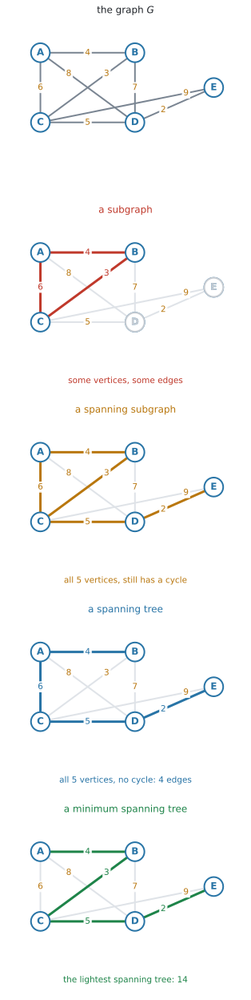{#fig-ahl316-spanning width=52%}

| 言葉 | 条件 |
|---|---|
| **subgraph**（部分グラフ） | もとの graph から vertex と edge を選んだもの（[AHL 3.14](ahl-3-14.qmd#subgraph)） |
| **spanning subgraph**（全域部分グラフ） | subgraph のうち、**vertex を全部含む**もの。cycle があってもよい |
| **spanning tree**（全域木） | spanning subgraph のうち、**tree** であるもの（connected で cycle なし） |
| **minimum spanning tree（MST）** | spanning tree のうち、**weight の合計が最小**のもの |

: $4$ つの言葉 {#tbl-ahl316-spanning}

$1$ つずつ条件が増えていきます。**vertex を全部入れる → 輪をなくす → いちばん軽くする**、という順です。

vertex が $n$ 個なら、spanning tree の edge は必ず $n-1$ 本です（[AHL 3.14](ahl-3-14.qmd#tree-edges)）。

::: {.callout-tip}
## 何の問題を解いているのか
$5$ つの町を、ケーブルで**全部つなぎたい**。ただし、**ケーブルの総延長を最小にしたい**。

このとき「全部つながる」が spanning、「余分な輪を作らない」が tree、「総延長最小」が minimum です。**cycle があったら、そのうち $1$ 本を切っても全部つながったまま**なので、必ず無駄になります。
:::

::: {.callout-important}
## MST の $3$ 点
- **通るもの** … vertex を全部**つなぐ**（回るのではありません）
- **最小にするもの** … 選んだ edge の weight の合計
- **出てくるもの** … **正確な最小値**。上界でも下界でもありません
:::

MST の求め方は $2$ つあります。**どちらを使っても、weight の合計は必ず同じ**になります。

### 6. Kruskal's algorithm {#kruskal}

**軽い edge から順に、cycle ができないかぎり採る。** 手順はこの $1$ 行です。

::: {.callout-note}
## Kruskal の手順
1. すべての edge を、**weight の小さい順**に並べる。
2. 上から順に見て、**cycle ができないなら採る**。できるなら捨てる。
3. edge が $n-1$ 本になったら終わり。
:::

$G$ でやってみます。edge を軽い順に並べると $2, 3, 4, 5, 6, 7, 8, 9$ です。

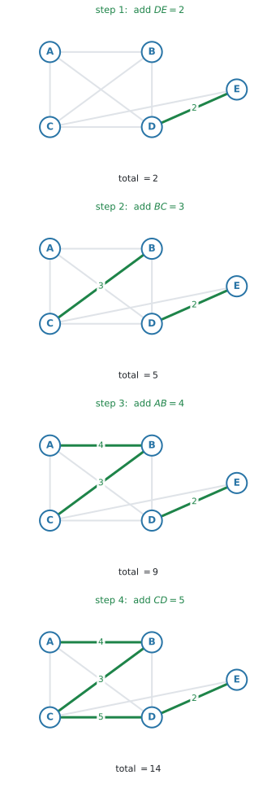{#fig-ahl316-kruskal width=50%}

| 順 | edge | weight | 採否 |
|---|---|---|---|
| $1$ | $DE$ | $2$ | 採る |
| $2$ | $BC$ | $3$ | 採る |
| $3$ | $AB$ | $4$ | 採る |
| $4$ | $CD$ | $5$ | 採る（これで $4$ 本） |
| — | $AC$ | $6$ | 見る前に終了 |

: Kruskal の記録 {#tbl-ahl316-kruskal}

$$
\text{MST} = 2 + 3 + 4 + 5 = 14
$$

vertex が $5$ 個なので edge は $4$ 本。**$4$ 本になった時点で止めます。**

::: {.callout-warning}
## Kruskal では、木がバラバラのままでも構いません
@fig-ahl316-kruskal の step 1 と step 2 を見てください。選ばれた $DE$ と $BC$ は、**離れています**。

Kruskal は「つながっているか」を気にしません。気にするのは **cycle ができないか**だけです。最後にひとつながりになります。
:::

#### 同じ weight が並んだとき {#ties}

軽い順に並べる途中で、**同じ weight の edge が $2$ 本以上**出てくることがあります。

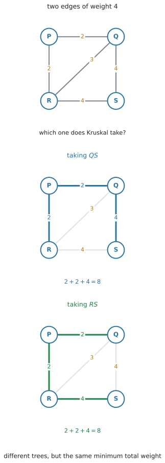{#fig-ahl316-tie width=45%}

@fig-ahl316-tie では、$QS$ と $RS$ がどちらも $4$ です。$PQ = 2$ と $PR = 2$ を採ったあと、$QR = 3$ は cycle を作るので捨て、次に $4$ の $2$ 本を見ます。

- $QS$ を採ると、$\{PQ,\ PR,\ QS\}$
- $RS$ を採ると、$\{PQ,\ PR,\ RS\}$

**$2$ つは違う tree です。** どちらも $3$ 本で、全部の vertex をつないでいて、cycle がありません。そして合計は

$$
2 + 2 + 4 = 8
$$

で、**どちらも同じ**です。

::: {.callout-important}
## MST は $1$ つに決まらないことがあります。合計は決まります
同じ weight が並んだら、**どちらを先に採っても構いません。** 出てくる tree が違っても、それは間違いではありません。

**変わらないのは、weight の合計です。** `Find the minimum total weight` と問われているのなら、どちらの道を通っても同じ答えになります。

`State the edges` と問われているときは、**自分が採ったほうを書けば正解**です。ただし、**同点があったことと、どちらを選んだかを書いておく**と、採点者に伝わります。

$$
\text{採った edge：} PQ\ (2),\ PR\ (2),\ QS\ (4) \quad (QS \text{ と } RS \text{ はどちらも } 4)
$$
:::

### 7. Prim's algorithm {#prim}

Prim は、**$1$ 点から育てていく**やり方です。

::: {.callout-note}
## Prim の手順
1. どこか $1$ つの vertex から始める。
2. **いま木に入っている vertex と、まだ入っていない vertex を結ぶ edge** の中から、いちばん軽いものを採る。
3. vertex が全部入るまで繰り返す。
:::

$A$ から始めます。

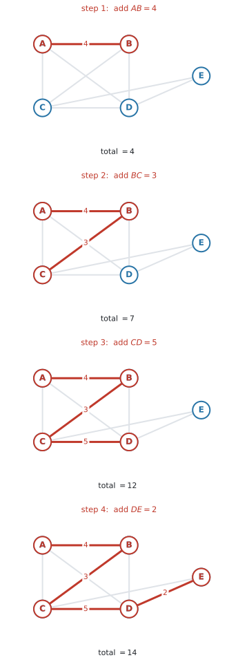{#fig-ahl316-prim width=50%}

| 順 | 木の中 | 候補 | 採る edge |
|---|---|---|---|
| $1$ | $A$ | $AB=4$, $AC=6$, $AD=8$ | $AB=4$ |
| $2$ | $A,B$ | $AC=6$, $AD=8$, $BC=3$, $BD=7$ | $BC=3$ |
| $3$ | $A,B,C$ | $AD=8$, $BD=7$, $CD=5$, $CE=9$ | $CD=5$ |
| $4$ | $A,B,C,D$ | $CE=9$, $DE=2$ | $DE=2$ |

: Prim の記録（$A$ から） {#tbl-ahl316-prim}

$$
\text{MST} = 4 + 3 + 5 + 2 = 14
$$

Kruskal と**同じ $14$** です。選んだ edge の集合も、この $G$ では同じでした。

::: {.callout-important}
## Prim は、どこから始めても合計は同じです
$B$ から始めても、$E$ から始めても、**合計は $14$** です。途中で採る順番は変わりますが、最後の合計は変わりません。

「$A$ から始めよ」と指定されたら、途中の順番も採点されます。**指定された vertex から始めてください。**
:::

Prim でも、**候補の中に同じ weight が $2$ つ以上あることがあります**（[第6節](#ties)）。そのときは、**どちらを採っても構いません。** 合計は変わりません。

::: {.callout-tip}
## Kruskal と Prim、どちらを使うか
- **図が与えられていて、weight が読み取りやすい** → Kruskal（並べ替えるだけ）
- **表・行列で与えられている**、または **vertex が多い** → Prim（並べ替えなくてよい）

問題文が `starting at A` のように出発点を指定していれば Prim、`in order of weight` のように重み順を指定していれば Kruskal です。

::: {.callout-warning}
## algorithm を指定されたら、その手順どおりに書いてください
`Use Kruskal's algorithm` と書かれているのに Prim で解くと、**答えが合っていても方法点が落ちます。**

そして、どちらの場合も **edge を採った順番**を書いてください。`State the edges in the order in which they are added` は、そのままの意味です。合計だけでは、指定された手順を実行したことが示せません。
:::
:::

### 8. Prim を行列の上で走らせます {#prim-matrix}

シラバスには、はっきりこう書かれています。

> Use of matrix method for Prim's algorithm

つまり、**表の形で出された問題を、図に描き直さずにそのまま解く**やり方です。シラバスが名指ししている解き方なので、必ず練習してください。

::: {.callout-important}
## 使うのは、無向の重み付きグラフの「対称な表」です
この項目の graph は無向なので（[AHL 3.15](ahl-3-15.qmd#symmetric)）、weight の表は**対角線をはさんで対称**になります。$AB$ の欄と $BA$ の欄には、同じ数が入っています。

行列法は、その対称性を前提にしています。**$1$ 本の edge が表の $2$ か所に現れるので、行を見ても列を見ても同じ edge が見つかる**——それが、この手順が動く理由です。

表が対称でなかったら、それは有向グラフの表です。**この項目の algorithm は、そこには使えません。**
:::

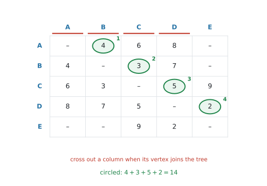{#fig-ahl316-prim-matrix width=88%}

::: {.callout-note}
## 行列法の手順
1. 出発する vertex の**列を消す**（もう「入る先」ではないから）。
2. 木に入っている vertex の**行**を全部見て、消していない列の中で**いちばん小さい数**に丸をつける。
3. その数の**列の vertex**が木に入る。その**列を消す**。
4. 全部の vertex が入るまで、$2$ と $3$ を繰り返す。
:::

@fig-ahl316-prim-matrix では、$A$ 行から $4$（$B$ 列）、次に $A$ 行と $B$ 行を見て $3$（$C$ 列）、次に $A,B,C$ 行を見て $5$（$D$ 列）、最後に $2$（$E$ 列）と丸がついています。

$$
4 + 3 + 5 + 2 = 14
$$

::: {.callout-warning}
## 「行を消す」ではありません。消すのは**列**です
行を消してしまうと、その vertex から出る edge が見えなくなります。木に入った vertex は、**これから外へ伸ばすために使う**ので、行は残しておかなければなりません。

**列を消す $=$ もうその vertex に入る必要はない**、という意味です。
:::

### 9. Chinese postman problem {#cpp}

> the shortest route around a weighted graph with up to four odd vertices, going along each edge at least once

::: {.callout-important}
## Chinese postman の $3$ 点
- **通るもの** … **edge を全部**、最低 $1$ 回ずつ。**繰り返してよい**
- **最小にするもの** … 歩く距離の合計。出発点にもどる
- **出てくるもの** … **正確な最小値**
:::

郵便配達員が全部の道を配って局にもどる、という場面から来ています。

odd vertex が $0$ 個なら、[Eulerian circuit がある](#euler)ので、**答えは weight の合計そのもの**です。何も繰り返さずにすみます（グラフがつながっている場合です）。

問題になるのは、odd vertex がある場合です。

#### odd vertex が $2$ 個のとき {#cpp2}

$G$ では $A$ と $B$ が odd でした。

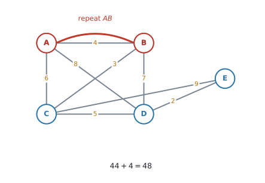{#fig-ahl316-cpp width=76%}

::: {.callout-note}
## odd vertex が $2$ 個のときの手順
1. odd vertex を見つける（ここでは $A$ と $B$）。
2. その $2$ 点のあいだの**最短の道**（least distance）を探す。
3. その道の分だけ、**もう $1$ 度通る**（repeat する）。
4. 答えは、**weight の合計 $+$ その最短の道の長さ**。
:::

$A$ と $B$ を結ぶ道を全部調べます。同じ vertex を $2$ 度通らない道は、$7$ 通りあります。

| 道 | 重みの合計 |
|---|---|
| $A \to B$ | $4$ |
| $A \to C \to B$ | $6 + 3 = 9$ |
| $A \to D \to B$ | $8 + 7 = 15$ |
| $A \to D \to C \to B$ | $8 + 5 + 3 = 16$ |
| $A \to C \to D \to B$ | $6 + 5 + 7 = 18$ |
| $A \to D \to E \to C \to B$ | $8 + 2 + 9 + 3 = 22$ |
| $A \to C \to E \to D \to B$ | $6 + 9 + 2 + 7 = 24$ |

: $A$ から $B$ への道 {#tbl-ahl316-ab}

いちばん短いのは、直接の $AB = 4$ です。

::: {.callout-tip}
## 数え落としを防ぐ順番
$1$ 点も経由しない道、$1$ 点だけ経由する道、$2$ 点経由する道……と、**経由する vertex の数の順**に書き出すと、落としにくくなります。

上の表は、$A \to B$（経由なし）、$ACB$ と $ADB$（$1$ 点）、$ADCB$ と $ACDB$（$2$ 点）、$ADECB$ と $ACEDB$（$3$ 点）の順です。
:::

$$
44 + 4 = 48
$$

#### odd vertex が $4$ 個のとき {#cpp4}

手順が $1$ 段増えます。**$4$ 個を $2$ 個ずつのペアに分ける方法が $3$ 通りある**ので、その $3$ 通りを比べます。

::: {.callout-note}
## odd vertex が $4$ 個のときの手順
1. odd vertex を $4$ 個見つける。$W$、$X$、$Y$、$Z$ とする。
2. **$6$ 組すべてについて、$2$ 点間の least distance を求める。**
   $$
   WX,\quad WY,\quad WZ,\quad XY,\quad XZ,\quad YZ
   $$
3. ペアの作り方 $3$ 通りについて、**$2$ つの least distance の和**を出す。
   $$
   \{WX,\ YZ\}, \qquad \{WY,\ XZ\}, \qquad \{WZ,\ XY\}
   $$
4. **いちばん小さい和**を、weight の合計に足す。
:::

::: {.callout-warning}
## $3$ 通りを全部書いてください
いちばん小さいものだけを書くと、**それが最小である理由が示せません。** $3$ 通りとも計算して並べたところまでが解答です。

ペアの作り方が $3$ 通りなのは、**$W$ の相手を $X$、$Y$、$Z$ のどれにするかで $3$ 通り**あり、相手が決まれば残りの $2$ 個も自動的に決まるからです。

なお、odd vertex が $6$ 個になるとペアの作り方は $15$ 通りになります。シラバスが `up to four odd vertices` と限っているのは、この範囲までということです。
:::

::: {.callout-warning}
## 手順 $2$ の `least distance` を、直接の edge で済ませない
$2$ つの odd vertex が直接つながっていても、**他の点を経由したほうが短いことがあります。** また、直接つながっていないこともあります。

odd vertex を $P$ と $R$ とすると、$PR = 10$ でも $P \to Q \to R$ が $3 + 4 = 7$ なら、使うのは $7$ です。**$6$ 組すべてについて、経由路も比べてください。**
:::

やり方は @exm-ahl316-cpp4 と演習 $9$ で見ます。

### 10. travelling salesman problem {#tsp}

> the Hamiltonian cycle of least weight in a weighted complete graph

::: {.callout-important}
## travelling salesman の $3$ 点
- **通るもの** … **vertex を全部**、ちょうど $1$ 回ずつ（$=$ Hamiltonian cycle）
- **最小にするもの** … 回る距離の合計
- **出てくるもの** … **正確な値は出しません。** 上界と下界ではさみます
:::

Chinese postman との違いを、並べておきます。

| | 通るもの | 何回 |
|---|---|---|
| **Chinese postman** | **edge** を全部 | **最低 $1$ 回**（繰り返してよい） |
| **travelling salesman** | **vertex** を全部 | **ちょうど $1$ 回** |

: $2$ つの問題の違い {#tbl-ahl316-two}

::: {.callout-warning}
## travelling salesman には、うまい解き方がありません
Chinese postman は、手順どおりにやれば**必ず最短が出ます**。

travelling salesman は違います。調べるべき cycle の数は

$$
\frac{(n-1)!}{2}
$$ {#eq-ahl316-count}

通りあり、$n$ が少し増えるだけで手に負えなくなります。$5$ 点で $12$ 通り、$6$ 点で $60$ 通り、$8$ 点になると $2520$ 通りです。

だから、**最短そのものは求めず、「これ以下」と「これ以上」ではさむ**のがこの項目のやり方です。上から押さえるのが nearest neighbour、下から押さえるのが deleted vertex です。
:::

::: {.callout-note}
## @eq-ahl316-count が成り立つのは、次の $3$ つがそろうときです
$1$. **undirected な complete graph** であること。どの $2$ 点も結ばれていて、向きがないこと。

$2$. **出発点を $1$ つに固定する**こと。$(n-1)!$ の $-1$ は、ここから来ています。残り $n-1$ 個を並べる順が $(n-1)!$ 通りです。

$3$. **逆回りを同じものと数える**こと。$P \to Q \to R \to S \to P$ と $P \to S \to R \to Q \to P$ は、通る edge がまったく同じで、長さも同じです。だから $2$ で割ります。

**検算。** $4$ 点なら $\dfrac{3!}{2} = 3$ 通り。実際、$P$ を出発点に固定すると $PQRS$、$PQSR$、$PRQS$ の $3$ 通りしかありません（残りの $3$ 通りは、この $3$ つの逆回りです）。
:::

### 11. table of least distances {#least}

> Practical problems should be converted to the classical problem by completion of a table of least distances where necessary

travelling salesman は、**complete graph** の問題です。ところが現実の道路網は、そうなっていないことがあります。

- $2$ 点のあいだに、**直接の道がない**
- 直接の道はあるが、**他の点を経由したほうが短い**

そこで、**「$2$ 点のあいだの最短距離」を表にして、complete graph に作り直します。**

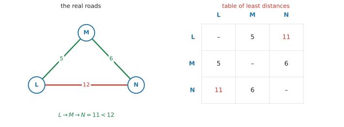{#fig-ahl316-least width=100%}

$L$ と $N$ は $12$ の道で直接つながっていますが、$L \to M \to N$ なら $5 + 6 = 11$ です。**最短は $11$** なので、表には $11$ と書きます。

::: {.callout-warning}
## 直接の道の長さを、そのまま書き写さないでください
`table of least distances` の `least` は、「**回り道を含めて、いちばん短い行き方**」という意味です。

表の各マスについて、**直接行った場合と、他の点を経由した場合を比べて**ください。短いほうを書きます。
:::

::: {.callout-important}
## この表を作ってから、次の $2$ 節の algorithm を使います
現実の道路網に nearest neighbour をそのままかけることはできません。**「$L$ から $P$ へ」の距離が表にないと、algorithm が止まってしまう**からです。

順番はいつもこうです。

$$
\text{現実の道路網} \ \longrightarrow \ \text{table of least distances} \ \longrightarrow \ \text{nearest neighbour / deleted vertex}
$$

はじめから complete graph が与えられていれば、この作業は要りません。**表を作る必要があるかどうかを、先に確かめてください。**
:::

::: {.callout-note}
## 答えを現実にもどす
表の上で出てきた cycle は、「$L \to N$」と書いてあっても、**現実には $L \to M \to N$ と通る**ことになります。

答案では、そこまで書けると丁寧です。
:::

以下、$4$ つの町 $P, Q, R, S$ の complete graph（すでに最短距離の表になっているもの）で説明します。

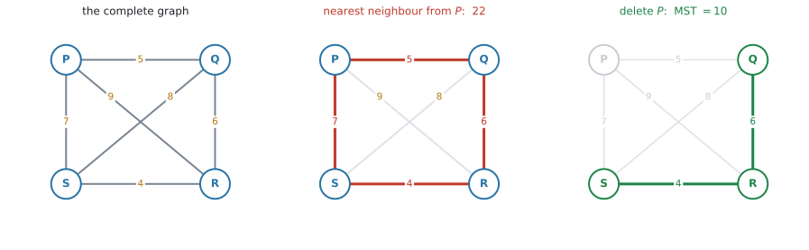{#fig-ahl316-tsp width=100%}

### 12. nearest neighbour algorithm で、上界を出します {#nn}

**nearest neighbour algorithm**（最近傍法）は、その場でいちばん近いところへ進み続けるやり方です。

::: {.callout-note}
## nearest neighbour の手順
1. 指定された vertex から始める。
2. **まだ行っていない vertex のうち、いちばん近いところへ行く。**
3. 全部回ったら、**出発点にもどる**。
4. 通った weight を全部足す。
:::

$P$ から始めます。$P$ からは $PQ = 5$、$PS = 7$、$PR = 9$ なので、いちばん近い $Q$ へ。$Q$ からは $QR = 6$、$QS = 8$ なので $R$ へ。$R$ からは、残っているのが $S$ だけなので $RS = 4$。最後に $S \to P = 7$ でもどります。

$$
P \to Q \to R \to S \to P
$$

$$
5 + 6 + 4 + 7 = 22
$$

これは**実際に通れる道**なので、**最短はこれ以下**です。つまり **upper bound（上界）** が $22$ と分かりました。

::: {.callout-warning}
## 最後に出発点へもどる分を、忘れないでください
$5 + 6 + 4 = 15$ で止めてしまうと、それは cycle ではありません。出発点にもどっていないからです。

**必ず $4$ 本（vertex が $n$ 個なら $n$ 本）足してください。**
:::

::: {.callout-tip}
## 出発点を変えると、答えが変わります
nearest neighbour は「その場でいちばん近い方へ」としか見ていないので、出発点によって別の cycle が出ます。

上界は**小さいほど良い**ので、`starting at each vertex` と指示されたら、全部やって**いちばん小さいもの**を答えます。
:::

#### 同じ距離の候補が $2$ つ以上あるとき {#nn-ties}

いま立っている vertex から、**まだ行っていない $2$ つの vertex が、同じ距離**ということがあります。

そのときは、**どちらを選んでも構いません。** ただし、Kruskal の同点（[第6節](#ties)）とは違って、**出てくる上界が変わることがあります。**

たとえば $AB = AC = 3$、$BC = 2$、$CD = 4$、$BD = 9$、$AD = 10$ の complete graph を $A$ から始めると、

| 最初に選ぶ | できる cycle | 合計 |
|---|---|---|
| $B$ | $A \to B \to C \to D \to A$ | $3 + 2 + 4 + 10 = 19$ |
| $C$ | $A \to C \to B \to D \to A$ | $3 + 2 + 9 + 10 = 24$ |

: 同点の選び方で上界が変わる例 {#tbl-ahl316-nntie}

**どちらも正しい上界です。** どちらも実際に通れる道だからです。ただし上界は小さいほど良いので、$19$ のほうが役に立ちます。

::: {.callout-important}
## 選んだほうを、答案に書いてください
同点があったときは、**「$AB$ と $AC$ はどちらも $3$。$B$ を選んだ」**のように書きます。

そうしないと、採点者は「$C$ を選ぶべきところを間違えた」のか「同点のうち一方を選んだ」のか区別できません。

`Find an upper bound` と問われているだけなら、$1$ つ出せば足ります。`the best upper bound` を聞かれたら、**両方やって小さいほう**を答えてください。
:::

### 13. deleted vertex algorithm で、下界を出します {#lb}

**deleted vertex algorithm**（頂点削除法）は、vertex を $1$ つ取り除いて考えるやり方です。

::: {.callout-important}
## 使えるのは、complete graph（または最短距離の表）に対してだけです
この手順は、**消した vertex から他の全部の vertex へ距離がある**ことを前提にしています。「小さいほうから $2$ 本」を選ぶには、候補がそろっていなければなりません。

また、**手順 $2$ で残ったグラフの MST を出す**にも、残りがひとつながりでなければなりません。complete graph なら、どちらの条件も自動的にみたされます。

ですから、現実の道路網に直接かけることはできません。**先に table of least distances を作ってください**（[第11節](#least)）。
:::

::: {.callout-note}
## deleted vertex の手順
1. vertex を $1$ つ選んで、**その vertex と、そこにつながる edge を全部消す**。
2. 残ったグラフの **MST** を求める。
3. 消した vertex から出ていた edge のうち、**小さいほうから $2$ 本**を足す。
4. その合計が **lower bound（下界）** です。
:::

$P$ を消します。残るのは $Q, R, S$ で、$QR = 6$、$QS = 8$、$RS = 4$。この MST は、軽いほうから $RS = 4$ と $QR = 6$ で、

$$
\text{MST} = 4 + 6 = 10
$$

$P$ から出ていた edge は $PQ = 5$、$PS = 7$、$PR = 9$。小さいほうから $2$ 本は $5$ と $7$ です。

$$
10 + 5 + 7 = 22
$$

**最短はこれ以上**です。

#### なぜ、これが下界になるのか {#why-lb}

::: {.callout-tip}
## 残りが「$1$ 本道」になることが、鍵です
どんな Hamiltonian cycle でも、そこから **$P$ と、$P$ に付いている $2$ 本の edge を取り除く**と、何が残るかを考えてください。

cycle は輪なので、$P$ を切り取ると**輪がほどけて、$1$ 本の道になります。** しかも、その道は $P$ 以外の vertex を全部 $1$ 回ずつ通っています。これを **spanning path**（全域道）といいます。

そこで、$2$ つのことが言えます。

$1$. **spanning path は、$P$ を除いたグラフの spanning tree です。** 道は connected で cycle がないので、tree の条件をみたしています（[AHL 3.14](ahl-3-14.qmd#tree)）。ですから、その weight は **MST 以上**です。

$$
(\text{spanning path の weight}) \ \ge \ \text{MST}(\text{$P$ を除いたグラフ})
$$

$2$. **取り除いた $2$ 本は、$P$ に付いている edge です。** ですから、その $2$ 本の和は、$P$ に付いている edge のうち**小さいほうから $2$ 本の和以上**です。

$$
(\text{取り除いた $2$ 本の和}) \ \ge \ (\text{$P$ の最小 $2$ 本の和})
$$

この $2$ つを足すと

$$
(\text{cycle 全体の weight}) \ \ge \ \text{MST} + (\text{$P$ の最小 $2$ 本の和})
$$

**どの Hamiltonian cycle についても**成り立つので、最短のものについても成り立ちます。だから右辺は下界です。
:::

::: {.callout-important}
## 上界と下界が一致したら、それが答えです
いま、上界も下界も $22$ になりました。最短を $L$ とすると

$$
22 \le L \le 22
$$

なので、$L = 22$ と**確定します**。これは強い結論なので、問題に `hence` や `deduce` とあれば、ここまで書いてください。

一致しないほうがふつうです。そのときは「$30 \le L \le 31$」のように、**はさんだ形のまま答えます。**
:::

::: {.callout-tip}
## どの vertex を消すかで、下界は変わります
消す vertex を変えると、別の下界が出ます。下界は**大きいほど良い**（最短をきつくはさめる）ので、`by deleting each vertex in turn` と指示されたら、全部やって**いちばん大きいもの**を答えます。

nearest neighbour の上界とは、**逆向き**です。上界は小さいほど良く、下界は大きいほど良い。
:::

### 14. $3$ つを見分けます {#compare}

最後に、[第5節](#mst)・[第9節](#cpp)・[第10節](#tsp)を並べておきます。**問題文を読んで、まずこの表のどれかを決めてください。**

| | **minimum spanning tree** | **Chinese postman** | **travelling salesman** |
|---|---|---|---|
| **何を全部** | vertex を全部**つなぐ** | **edge** を全部通る | **vertex** を全部通る |
| **何回** | — | 最低 $1$ 回（繰り返してよい） | ちょうど $1$ 回 |
| **出発点にもどるか** | もどらない（輪を作らない） | **もどる** | **もどる** |
| **最小にするもの** | 選んだ edge の weight の合計 | 歩く距離の合計 | 回る距離の合計 |
| **使う手順** | Kruskal / Prim | odd vertex を見つけて、最短の道を繰り返す | nearest neighbour / deleted vertex |
| **出てくるもの** | **正確な値** | **正確な値** | **upper bound と lower bound** |
| **問題文の合図** | `connect all`, `cable`, `minimum spanning tree` | `along every road at least once`, `postman`, `inspector` | `visit every town once`, `salesman`, `tour` |

: $3$ つの問題の見分け方 {#tbl-ahl316-compare}

::: {.callout-tip}
## いちばん短い見分け方
> **つなぐだけか（MST）。edge を全部通るか（postman）。vertex を全部通るか（salesman）。**

問題文に `every road`（道を全部）とあれば edge、`every town`（町を全部）とあれば vertex です。**そこを読み違えなければ、あとは手順どおりです。**
:::

## Why it works

:::: {.callout-note collapse="true" appearance="simple"}
## クリックすると開きます
シラバスは、Chinese postman について次のように求めています。

> Students should be able to explain why the algorithm for constructing the Chinese postman problem works, apply the algorithm and justify their choice of algorithm

「どの algorithm を選んだかの理由を書く」ことも求められています。その見分け方は[第14節](#compare)にまとめてあります。

ここで説明するのは、**なぜ「$2$ 点のあいだの最短の道を、もう $1$ 度通る」でよいのか**、その $1$ 点です。ただし、その理由は odd vertex の意味から出てくるので、そこから始めます。

### なぜ、odd vertex が $0$ か $2$ なのか {#why-euler}

ある vertex $v$ を、途中で**通り抜ける**場面を考えます。入ってくるのに edge を $1$ 本、出ていくのに edge を $1$ 本、合わせて **$2$ 本ずつ**使います。

$v$ を $3$ 回通り抜ければ $6$ 本、$5$ 回なら $10$ 本。**通り抜けるかぎり、使う edge の数は必ず偶数**です。

Eulerian trail は edge を全部ちょうど $1$ 回ずつ使うので、$v$ で使う edge の数は $\deg v$ そのものです。だから、

- **通り抜けるだけの vertex は、$\deg$ が偶数でなければならない。**

例外は、**出発点と終点**です。出発点は「出ていく」が $1$ 本多く、終点は「入ってくる」が $1$ 本多い。だからこの $2$ つだけ、奇数になり得ます。

- odd vertex が $0$ 個 → 出発点と終点が同じ場所になる → **circuit**
- odd vertex が $2$ 個 → その $2$ つが出発点と終点になる → **trail**
- odd vertex が $4$ 個以上 → 出発点と終点は $2$ つしかないので、**足りない**

### なぜ、最短の道を $1$ 回だけ足すのか {#why-cpp}

Chinese postman では、出発点にもどらなければなりません。つまり **circuit** が要ります。ところが odd vertex があると circuit は作れません。

そこで、**edge を何本か「もう $1$ 度通る」ことにします。** ある edge をもう $1$ 度通ると、その両端の degree が $1$ ずつ増えます。**奇数は偶数に、偶数は奇数に変わります。**

$A$ と $B$ を結ぶ道に沿って全部の edge を繰り返すと、

- 道の**途中**にある vertex は、$2$ 本（入る分と出る分）増えるので、**偶数のまま**。
- 道の**両端**の $A$ と $B$ は、$1$ 本ずつ増えるので、**奇数から偶数へ**。

これで odd vertex が $0$ 個になり、circuit ができます。**余分に歩く距離は、繰り返した道の長さそのもの**です。

だから、**$A$ と $B$ を結ぶ最短の道を選べば、余分に歩く距離が最小**になります。これが、あの手順の意味です。

### odd vertex が $4$ 個のときも、同じ理屈です {#why-cpp4}

odd vertex が $W$、$X$、$Y$、$Z$ の $4$ 個あるとき、$1$ 本の道を繰り返しても、偶数に直せるのは**その両端の $2$ つだけ**です。残りの $2$ つは奇数のまま残ります。

ですから、**$2$ 本の道が要ります。** $4$ 個を $2$ つの組に分け、それぞれの組を結ぶ道を繰り返す——それが[第9節の手順](#cpp4)です。

分け方は $3$ 通りしかないので、**$3$ 通りとも計算して、合計が最小のものを採る**ことができます。

::: {.callout-tip}
## 説明を求められたら、この $2$ 行を書いてください
*Repeating a path changes the parity of the degree at its two ends only.*

*So repeating the shortest path between the two odd vertices makes every degree even, at the least possible extra cost.*

日本語で理解しておいて、答案には英語で $2$ 行書けば十分です。
:::
::::

## Worked examples

::: {.callout-note appearance="simple"}
問題文は英語です。意味が理解できなかったら、問題文の下の「**日本語訳**」を開いてください。解説は日本語です。
:::

::: {#exm-ahl316-euler}
[The graph $G$ has vertices $A$, $B$, $C$, $D$, $E$ and the edges shown below.]{.q-en}

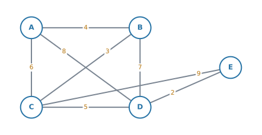{width=78% fig-align="center"}

**(a)** [Write down the degree of each vertex.]{.q-en}

**(b)** [Determine whether $G$ has an Eulerian circuit, an Eulerian trail, or neither. Justify your answer.]{.q-en}

**(c)** [State a possible starting vertex for an Eulerian trail.]{.q-en}

<details class="jp-trans">
<summary>日本語訳</summary>

グラフ $G$ は、頂点 $A$、$B$、$C$、$D$、$E$ と、上に示された辺をもちます。

**(a)** 各頂点の次数を書きなさい。

**(b)** $G$ に Eulerian circuit があるか、Eulerian trail があるか、どちらもないかを判定しなさい。理由も書きなさい。

**(c)** Eulerian trail の出発点になりうる頂点を $1$ つ述べなさい。

</details>

---

**(a)** それぞれの vertex に付いている edge を数えます。

$$
\deg A = 3, \quad \deg B = 3, \quad \deg C = 4, \quad \deg D = 4, \quad \deg E = 2
$$

**検算。** 合計は $3+3+4+4+2 = 16$。edge は $8$ 本なので $2 \times 8 = 16$ ✓

**(b)** [odd vertex を数えます](#euler)。奇数なのは $A$ と $B$ の $2$ 個です。

$2$ 個なので、**Eulerian trail はあり、Eulerian circuit はありません**。

::: {.model-answer}
**試験ではこう書く**

*$G$ is connected and has exactly two vertices of odd degree, $A$ and $B$. So $G$ has an Eulerian trail but no Eulerian circuit.*
:::

（つながっていて、次数が奇数の頂点がちょうど $2$ 個あるから、という意味です。**connected にも一言ふれておく**と確実です。）

**(c)** trail は odd vertex から始まるので、**$A$ または $B$** です。

::: {.callout-note}
## 解答例（答案用紙にはこう書く）
**(a)** $\deg A = 3$, $\deg B = 3$, $\deg C = 4$, $\deg D = 4$, $\deg E = 2$

**(b)** *$G$ is connected and has exactly two vertices of odd degree ($A$ and $B$), so $G$ has an Eulerian trail but no Eulerian circuit.*

**(c)** *$A$ (or $B$).*
:::
:::

::: {#exm-ahl316-kruskal}
[Use Kruskal's algorithm to find a minimum spanning tree for the graph below. State the edges in the order in which they are added, and give the total weight.]{.q-en}

{width=78% fig-align="center"}

<details class="jp-trans">
<summary>日本語訳</summary>

上のグラフについて、Kruskal のアルゴリズムを使って最小全域木を $1$ つ求めなさい。加えた順に辺を述べ、重みの合計も書きなさい。

</details>

---

weight の小さい順に見ていきます。

| edge | weight | 判断 |
|---|---|---|
| $DE$ | $2$ | 採る |
| $BC$ | $3$ | 採る |
| $AB$ | $4$ | 採る |
| $CD$ | $5$ | 採る。これで $4$ 本 |

vertex が $5$ 個なので、edge は $5 - 1 = 4$ 本で終わりです。

$$
2 + 3 + 4 + 5 = 14
$$

**検算。** cycle ができていないか確かめます。$DE$、$BC$、$AB$、$CD$ をつなぐと $A - B - C - D - E$ の一本道で、輪はありません ✓

この $G$ には同じ weight の edge がないので、**MST は $1$ つに決まります**（[第6節](#ties)）。

::: {.callout-note}
## 解答例（答案用紙にはこう書く）
*Edges added in order: $DE$ $(2)$, $BC$ $(3)$, $AB$ $(4)$, $CD$ $(5)$.*

$$
\text{Total weight} = 2 + 3 + 4 + 5 = 14
$$
:::

::: {.callout-tip}
## `in the order` と書かれたら、順番まで書きます
合計の $14$ だけでは、聞かれたことに答えたことになりません。**$2, 3, 4, 5$ の順に採ったこと**を見せてください。

`Use Kruskal's algorithm` と指定されているので、**重み順に見ていったことが分かる書き方**にします（[第7節](#prim)）。
:::
:::

::: {#exm-ahl316-prim}
[The table shows the weights of the edges of an undirected graph.]{.q-en}

|  | $A$ | $B$ | $C$ | $D$ | $E$ |
|---|---|---|---|---|---|
| $A$ | – | $4$ | $6$ | $8$ | – |
| $B$ | $4$ | – | $3$ | $7$ | – |
| $C$ | $6$ | $3$ | – | $5$ | $9$ |
| $D$ | $8$ | $7$ | $5$ | – | $2$ |
| $E$ | – | – | $9$ | $2$ | – |

[Use Prim's algorithm, starting at $A$, to find a minimum spanning tree. State the edges in the order in which they are added.]{.q-en}

<details class="jp-trans">
<summary>日本語訳</summary>

表は、ある無向グラフの辺の重みを示しています。

$A$ から始めて Prim のアルゴリズムを使い、最小全域木を求めなさい。加えた順に辺を述べなさい。

</details>

---

まず、**表が対称になっているか**を見ます。$AB$ の欄も $BA$ の欄も $4$、$CE$ も $EC$ も $9$。対称です ✓ 無向グラフの表なので、[行列法](#prim-matrix)が使えます。

$A$ の列を消して始めます。

**手順 $1$。** $A$ の行を見ます。消していない列で最小は $4$（$B$ 列）。$AB$ を採り、$B$ 列を消す。

**手順 $2$。** $A$ と $B$ の行を見ます。残っている列は $C$、$D$、$E$。数は $6, 8$（$A$ 行）と $3, 7$（$B$ 行）。最小は $3$（$C$ 列）。$BC$ を採り、$C$ 列を消す。

**手順 $3$。** $A$、$B$、$C$ の行を見ます。残るのは $D$、$E$ 列。数は $8, 7, 5$ と $9$。最小は $5$（$D$ 列）。$CD$ を採り、$D$ 列を消す。

**手順 $4$。** 残るのは $E$ 列だけ。数は $9$（$C$ 行）と $2$（$D$ 行）。最小は $2$。$DE$ を採る。

$$
4 + 3 + 5 + 2 = 14
$$

**検算。** edge は $4$ 本 $= 5 - 1$ ✓ Kruskal（@exm-ahl316-kruskal）と同じ $14$ ✓

::: {.callout-note}
## 解答例（答案用紙にはこう書く）
*Edges added in order: $AB$ $(4)$, $BC$ $(3)$, $CD$ $(5)$, $DE$ $(2)$.*

$$
\text{Total weight} = 4 + 3 + 5 + 2 = 14
$$
:::

::: {.callout-tip}
## 表の問題で、図を描き直す必要はありません
表のまま、列を消しながら進められます。図に描き直すと、写しまちがえる分だけ危険です。

**表のどのマスに丸をつけ、どの列を消したかが分かるように**、答案にも表を写して印を残してください。
:::
:::

::: {#exm-ahl316-cpp}
[A postman must walk along every road in the network below at least once, starting and finishing at $A$. The weights are distances in kilometres.]{.q-en}

{width=78% fig-align="center"}

**(a)** [Explain why the postman must walk along at least one road twice.]{.q-en}

**(b)** [Find the length of the shortest such route.]{.q-en}

<details class="jp-trans">
<summary>日本語訳</summary>

郵便配達員が、上のネットワークのすべての道を最低 $1$ 回は歩き、$A$ で出発して $A$ で終わらなければなりません。重みは距離（km）です。

**(a)** 配達員が、少なくとも $1$ 本の道を $2$ 回歩かなければならない理由を説明しなさい。

**(b)** そのような最短の経路の長さを求めなさい。

</details>

---

`every road` とあるので、**edge を全部通る**問題です。Chinese postman です（@tbl-ahl316-compare）。

**(a)** odd vertex が $A$ と $B$ の $2$ 個あります。Eulerian circuit があるのは odd vertex が $0$ 個のときだけ（[第3節](#euler)）なので、全部の道を $1$ 回ずつでもどることはできません。

**(b)** odd vertex が $2$ 個なので、[第9節の手順](#cpp2)です。$A$ と $B$ を結ぶ道を、[表](#tbl-ahl316-ab)のとおり全部調べます。

$$
4, \quad 9, \quad 15, \quad 16, \quad 18, \quad 22, \quad 24
$$

最短は、直接の $AB = 4$ です。weight の合計 $44$ に足します。

$$
44 + 4 = 48
$$

**$48$ km** です。

::: {.model-answer}
**試験ではこう書く**

*$A$ and $B$ have odd degree, so $G$ has no Eulerian circuit. Therefore at least one edge must be walked twice.*
:::

（$A$ と $B$ の次数が奇数なので Eulerian circuit がなく、だから少なくとも $1$ 本は $2$ 度歩くことになる、という意味です。）

::: {.callout-note}
## 解答例（答案用紙にはこう書く）
**(a)** *$A$ and $B$ have odd degree, so no Eulerian circuit exists and at least one edge must be repeated.*

**(b)** *Shortest path from $A$ to $B$ is $AB = 4$.*

$$
44 + 4 = 48 \ \text{km}
$$
:::

::: {.callout-tip}
## 出発点は、答えに影響しません
「$A$ で出発して $A$ で終わる」と書かれていますが、繰り返す道は odd vertex どうしを結ぶ道で決まります。**どこから出発しても、答えは $48$** です。
:::
:::

::: {#exm-ahl316-cpp4}
[The complete graph with vertices $W$, $X$, $Y$, $Z$ has edge weights]{.q-en}

$$
WX = 3, \quad XY = 4, \quad YZ = 3, \quad WZ = 4, \quad WY = 5, \quad XZ = 6
$$

**(a)** [Show that all four vertices have odd degree.]{.q-en}

**(b)** [Find the length of the shortest route that travels along every edge at least once and returns to its starting point.]{.q-en}

<details class="jp-trans">
<summary>日本語訳</summary>

頂点 $W$、$X$、$Y$、$Z$ をもつ完全グラフの、辺の重みは次のとおりです。

$$
WX = 3, \quad XY = 4, \quad YZ = 3, \quad WZ = 4, \quad WY = 5, \quad XZ = 6
$$

**(a)** $4$ つの頂点がすべて奇数次数であることを示しなさい。

**(b)** すべての辺を最低 $1$ 回は通り、出発点にもどる最短の経路の長さを求めなさい。

</details>

---

**(a)** complete graph なので、どの vertex も他の $3$ 個とつながっています。

$$
\deg W = \deg X = \deg Y = \deg Z = 3
$$

$3$ は奇数なので、$4$ つとも odd vertex です。

**(b)** odd vertex が $4$ 個あるので、[第9節の手順](#cpp4)です。**手順 $1$**（odd vertex を見つける）は (a) で済んでいるので、**手順 $2$** から始めます。

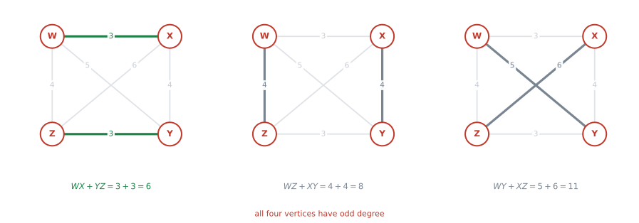{#fig-ahl316-cpp4 width=100%}

**手順 $2$。** まず、$6$ 組すべての **least distance** を出します。この $4$ 点では、どの $2$ 点も**直接の edge がいちばん短い**ので、そのまま使えます。

| 組 | 直接 | 経由したとき | least distance |
|---|---|---|---|
| $WX$ | $3$ | $W \to Z \to X = 4+6 = 10$、$W \to Y \to X = 5+4 = 9$ | $\mathbf{3}$ |
| $WY$ | $5$ | $W \to X \to Y = 3+4 = 7$、$W \to Z \to Y = 4+3 = 7$ | $\mathbf{5}$ |
| $WZ$ | $4$ | $W \to Y \to Z = 5+3 = 8$、$W \to X \to Z = 3+6 = 9$ | $\mathbf{4}$ |
| $XY$ | $4$ | $X \to W \to Y = 3+5 = 8$、$X \to Z \to Y = 6+3 = 9$ | $\mathbf{4}$ |
| $XZ$ | $6$ | $X \to W \to Z = 3+4 = 7$、$X \to Y \to Z = 4+3 = 7$ | $\mathbf{7 > 6}$ なので $6$ |
| $YZ$ | $3$ | $Y \to W \to Z = 5+4 = 9$、$Y \to X \to Z = 4+6 = 10$ | $\mathbf{3}$ |

: $6$ 組の least distance {#tbl-ahl316-least6}

**手順 $3$。** ペアの作り方 $3$ 通りを比べます。

| ペアの作り方 | 合計 |
|---|---|
| $WX$ と $YZ$ | $3 + 3 = 6$ |
| $WZ$ と $XY$ | $4 + 4 = 8$ |
| $WY$ と $XZ$ | $5 + 6 = 11$ |

: $3$ 通りのペア {#tbl-ahl316-pairs}

**手順 $4$。** いちばん小さいのは $6$ です。weight の合計は

$$
3 + 4 + 3 + 4 + 5 + 6 = 25
$$

$$
25 + 6 = 31
$$

::: {.callout-note}
## 解答例（答案用紙にはこう書く）
**(a)** *The graph is complete on four vertices, so every vertex has degree $3$, which is odd.*

**(b)** *In this graph the direct edge is the least distance for every pair. Pairings of the odd vertices:*

$$
WX + YZ = 3 + 3 = 6, \qquad WZ + XY = 4 + 4 = 8, \qquad WY + XZ = 5 + 6 = 11
$$

*The least is $6$, and the total weight is $25$.*

$$
25 + 6 = 31
$$
:::

::: {.callout-tip}
## $3$ 通りを、全部書いてください
$6$ がいちばん小さいことを示すには、$8$ と $11$ も出しておく必要があります。**$6$ だけを書くと、それが最小である理由が示せません。**

@tbl-ahl316-least6 のように、**直接と経由を比べたこと**も一言添えておくと、丁寧な答案になります。演習 $9$ では、ここが実際に効いてきます。
:::
:::

::: {#exm-ahl316-tsp}
[The complete graph below has vertices $P$, $Q$, $R$, $S$.]{.q-en}

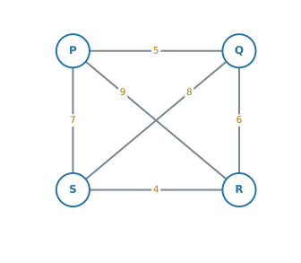{width=58% fig-align="center"}

**(a)** [Use the nearest neighbour algorithm, starting at $R$, to find an upper bound for the travelling salesman problem.]{.q-en}

**(b)** [By deleting $S$, find a lower bound.]{.q-en}

**(c)** [Hence write down the weight of the Hamiltonian cycle of least weight.]{.q-en}

<details class="jp-trans">
<summary>日本語訳</summary>

上の完全グラフは、頂点 $P$、$Q$、$R$、$S$ をもちます。

**(a)** $R$ から始めて nearest neighbour のアルゴリズムを使い、巡回セールスマン問題の上界を求めなさい。

**(b)** $S$ を消すことで、下界を求めなさい。

**(c)** よって、重みが最小のハミルトン閉路の重みを書きなさい。

</details>

---

はじめから complete graph が与えられているので、[table of least distances](#least) を作る作業は要りません。

**(a)** $R$ から、近い順に進みます。$R$ から出ているのは $RS = 4$、$RQ = 6$、$RP = 9$ です。同じ距離のものはないので、迷うところはありません（[第12節](#nn-ties)）。

| いる場所 | 行ける先 | 選ぶ |
|---|---|---|
| $R$ | $S=4$, $Q=6$, $P=9$ | $S$ |
| $S$ | $P=7$, $Q=8$ | $P$ |
| $P$ | $Q=5$ | $Q$ |
| $Q$ | （$R$ にもどる） | $R=6$ |

$$
R \to S \to P \to Q \to R
$$

$$
4 + 7 + 5 + 6 = 22
$$

上界は $22$ です。

**(b)** $S$ と、$S$ につながる edge を消します。残るのは $P$、$Q$、$R$ で、$PQ = 5$、$QR = 6$、$PR = 9$。

MST は、軽いほうから $PQ = 5$ と $QR = 6$ で $11$。$3$ 点なので edge は $2$ 本です。

$S$ から出ていた $SR = 4$、$SP = 7$、$SQ = 8$ のうち、小さいほうから $2$ 本は $4$ と $7$。

$$
11 + 4 + 7 = 22
$$

下界は $22$ です。

**(c)** 最短を $L$ とすると $22 \le L \le 22$ なので、$L = 22$ です。

::: {.callout-note}
## 解答例（答案用紙にはこう書く）
**(a)** *$R \to S \to P \to Q \to R$*

$$
4 + 7 + 5 + 6 = 22
$$

**(b)** *MST of $P$, $Q$, $R$ is $PQ + QR = 5 + 6 = 11$. Two least edges at $S$ are $4$ and $7$.*

$$
11 + 4 + 7 = 22
$$

**(c)** *Upper bound $=$ lower bound $= 22$, so the least weight is $22$.*
:::

::: {.callout-tip}
## `Hence` は「いま出した $2$ つを使え」という指示です
(c) で全部の cycle を書き出す必要はありません。**(a) と (b) がはさんでいる**ことを書けば、それが答えです。

なお、[第12節](#nn)は $P$ から始めて、[第13節](#lb)は $P$ を消して、どちらも $22$ でした。この complete graph では、**どこから始めても、どこを消しても $22$** になります。そういうグラフばかりではないので（演習 $6$ と $7$ を見てください）、$1$ つの結果から決めつけないでください。
:::
:::

## Common errors

::: {.callout-warning}
## trail と path を取りちがえる
**trail は edge を繰り返さない、path は vertex を繰り返さない。**

`edge` と `vertex` のどちらの話かで決まります。@fig-ahl316-words の $2$ 番目のように、$C$ を $2$ 度通っていても edge を繰り返していなければ trail です。
:::

::: {.callout-warning}
## cycle を「vertex を $2$ 度通っているから path ではない」と否定する
cycle は**出発点にもどる path** です（[第1節](#closed)）。出発点だけは $2$ 度出てきますが、それでよいのです。

否定するべきなのは、**出発点と終点以外**の vertex を $2$ 度通っている場合です。
:::

::: {.callout-warning}
## Eulerian と Hamiltonian を混ぜる
**Eulerian は edge を全部、Hamiltonian は vertex を全部**です（@tbl-ahl316-eh）。

Eulerian は odd vertex を数えれば判定できますが、**Hamiltonian には、このコースで使える簡単な必要十分条件がありません**。「odd vertex が $2$ 個だから Hamiltonian cycle がある」は、まったく別の話です。
:::

::: {.callout-warning}
## odd vertex を「奇数番目の頂点」と読む
odd なのは **degree（次数）** です。頂点の名前や番号ではありません。

$\deg C = 4$ なら $C$ は even vertex です。
:::

::: {.callout-warning}
## Kruskal で、cycle ができる edge を採ってしまう
軽い順に見ていくとき、**その edge を足したら輪になるか**を毎回確かめてください。

輪になるなら**飛ばして、次に軽いもの**を見ます。「軽い順に $4$ 本」ではありません。
:::

::: {.callout-warning}
## 同じ weight が並んだときに、手が止まる
どちらを採っても構いません（[第6節](#ties)）。**合計は変わりません。**

ただし、**同点があったことと、どちらを選んだか**を答案に書いてください。

（nearest neighbour の同点は事情が違います。あちらは**上界の値が変わることがあります**（[第12節](#nn-ties)）。）
:::

::: {.callout-warning}
## MST の edge の数をまちがえる
vertex が $n$ 個なら、edge は**必ず $n-1$ 本**です（[AHL 3.14](ahl-3-14.qmd#tree-edges)）。

$5$ 個なら $4$ 本。$3$ 本で止めても、$5$ 本採っても、両方まちがいです。
:::

::: {.callout-warning}
## Prim の行列法で、行を消してしまう
消すのは**列**だけです。木に入った vertex の行は、**そこから外へ伸ばす候補を見るために残します**（[第8節](#prim-matrix)）。
:::

::: {.callout-warning}
## 指定された algorithm と違う方法で解く
`Use Kruskal's algorithm` に Prim で答えると、**答えが合っていても方法点が落ちます。**

そして、どちらの場合も **edge を採った順番**を書いてください（[第7節](#prim)）。
:::

::: {.callout-warning}
## Chinese postman で、繰り返す道を「いちばん長い道」にしてしまう
繰り返すのは、odd vertex どうしを結ぶ**いちばん短い道**です。余分に歩く距離を最小にしたいからです。
:::

::: {.callout-warning}
## Chinese postman で、直接の edge だけを見る
$2$ つの odd vertex が直接つながっていても、**他の点を経由したほうが短いことがあります。**

$PR = 10$ でも $P \to Q \to R$ が $3 + 4 = 7$ なら、繰り返すのは後者です。**必ず全部の道を比べてください**（[第9節](#cpp4)）。
:::

::: {.callout-warning}
## odd vertex が $4$ 個のとき、$1$ 通りだけ計算する
ペアの作り方は $3$ 通りあります（[第9節](#cpp4)）。**$3$ 通りとも書いて、いちばん小さいものを採ってください。**

$1$ 通りだけでは、それが最小である理由が示せません。
:::

::: {.callout-warning}
## nearest neighbour で、出発点にもどる分を足し忘れる
vertex が $n$ 個なら、足す weight は **$n$ 本**です。$n-1$ 本で止めると cycle になりません。
:::

::: {.callout-warning}
## deleted vertex で、消した点の edge を $1$ 本しか足さない
Hamiltonian cycle は、どの vertex にも**入って出る**ので、必ず $2$ 本使います。**小さいほうから $2$ 本**です（[第13節](#why-lb)）。
:::

::: {.callout-warning}
## 上界と下界を、逆に書く
**nearest neighbour は実際に通れる道なので上界**、**deleted vertex は実際には通れない形なので下界**です。

答えるときは $(\text{下界}) \le L \le (\text{上界})$ の向きで書いてください。
:::

::: {.callout-warning}
## table of least distances に、直接の距離を書き写す
`least` は「回り道を含めた最短」です。**直接行くより短い経由路がないか**を、マスごとに確かめてください（[第11節](#least)）。
:::

## Using your GDC (TI-Nspire CX II)

**この項目は、紙と鉛筆の項目です。** Kruskal も Prim も Chinese postman も、電卓に専用の機能はありません。**手順を手で実行できることが、そのまま採点対象**です。

とはいえ、確かめに使える場面が $3$ つあります。

### 1. degree の合計で、数え落としを見つける {#gdc-sum}

vertex が多いと、degree を数えまちがえます。リストにして足してください。

```
sum({3, 3, 4, 4, 2})
```

$16$ と返ります。edge が $8$ 本なら $2 \times 8 = 16$ で合っています（[AHL 3.14](ahl-3-14.qmd#handshake)）。**合わなければ、数え直しの合図**です。

### 2. weight の合計を、一度で出す {#gdc-total}

Chinese postman では、まず全部の weight を足します。

```
sum({4, 6, 8, 3, 7, 5, 9, 2})
```

$44$ と返ります。**edge の本数と、リストの項目数が同じか**を必ず見てください。$8$ 本なのに $7$ 個しか入れていない、というのがよくある失敗です。

### 3. Hamiltonian cycle の総数を確かめる {#gdc-count}

@eq-ahl316-count は、そのまま打てます。

```
(4-1)!/2
```

$3$ と返ります。$4$ 点なら $3$ 通りしかないので、**全部書き出して確かめることもできます**。

::: {.callout-tip}
## 全部書き出してよいのは、$4$ 点まで
$5$ 点で $12$ 通り、$6$ 点で $60$ 通り、$8$ 点になると $2520$ 通りです。

点が増えると、書き出すのは現実的でなくなります。だからこの項目では、**上界と下界ではさむ**やり方を使います。
:::

::: {.callout-note}
## 行列を打ちこむ機能は、ここでは使いません
[AHL 3.15](ahl-3-15.qmd#gdc-enter) では隣接行列を電卓に入れて累乗しました。この項目の「行列」は Prim の作業表であって、計算する行列ではありません。

**手で丸をつけて、手で消してください。**
:::

## Exercises

::: {.callout-note appearance="simple"}
各問題に、折りたたみが3つ付いています。**日本語訳**、**解答例**（答案用紙に書くべきこと。英語です）、**解説**（なぜそうなるか。日本語です）。

まず自分で解いて、次に解答例と見くらべてください。**解説は、合わなかったときだけ開けば十分です。**
:::

::: {.exercise-block}

[1]{.ex-no} [The graph below has vertices $A$, $B$, $C$, $D$, $E$.]{.q-en}

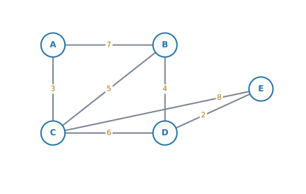{#fig-ahl316-ex3 width=68%}

**(a)** [State whether $A \to C \to B \to D \to E$ is a walk, a trail, or a path. Give a reason.]{.q-en}

**(b)** [Write down a cycle in this graph, and state the number of edges in it.]{.q-en}

<details class="jp-trans">
<summary>日本語訳</summary>

下のグラフは、頂点 $A$、$B$、$C$、$D$、$E$ をもちます。

**(a)** $A \to C \to B \to D \to E$ が walk か trail か path かを述べ、理由を書きなさい。

**(b)** このグラフの cycle を $1$ つ書き、それが何本の辺を使うかを述べなさい。

</details>

::: {.callout-note collapse="true"}
## 解答例（答案用紙に書くこと）
**(a)** *It is a path, because no vertex is repeated (and therefore no edge is repeated either).*

**(b)** *$A \to B \to C \to A$, which uses $3$ edges.*
:::

::: {.callout-tip collapse="true"}
## 解説
**(a)** $A$、$C$、$B$、$D$、$E$ はすべて $1$ 度ずつです。vertex を繰り返していないので **path** です（[第1節](#words)）。

::: {.model-answer}
**試験ではこう書く**

*It is a path, because no vertex is repeated (and therefore no edge is repeated either).*
:::

path は trail でもあり walk でもあるので、**いちばん強い言い方**を答えます。`walk` とだけ書いても嘘ではありませんが、点にはなりません。

**(b)** $A \to B \to C \to A$ は、$AB$、$BC$、$CA$ の $3$ 本を使ってもどります。$A$ が $2$ 度出てきますが、**出発点と終点としてなので cycle です**（[第1節](#closed)）。

$B \to C \to D \to B$、$A \to B \to D \to C \to A$ なども正解です。

::: {.callout-warning}
## `length` には $2$ つの意味があります
[AHL 3.15](ahl-3-15.qmd#walk) では、walk の **length** は「通った edge の本数」でした。一方、この項目の表では「重みの合計」を聞かれることもあります。

**weight が書かれているグラフで `length` と出てきたら、どちらの意味か**を、問題文の前後（`km` などの単位が付いているか）で確かめてください。
:::
:::

::: {.ex-sep}
:::

[2]{.ex-no} [$K_4$ is the complete graph on four vertices. Determine whether $K_4$ has an Eulerian trail, an Eulerian circuit, or neither. Justify your answer.]{.q-en}

<details class="jp-trans">
<summary>日本語訳</summary>

$K_4$ は、$4$ 頂点の完全グラフです。$K_4$ に Eulerian trail があるか、Eulerian circuit があるか、どちらもないかを判定しなさい。理由も書きなさい。

</details>

::: {.callout-note collapse="true"}
## 解答例（答案用紙に書くこと）
*Every vertex of $K_4$ is joined to the other three, so every vertex has degree $3$. There are four vertices of odd degree, so $K_4$ has neither an Eulerian trail nor an Eulerian circuit.*
:::

::: {.callout-tip collapse="true"}
## 解説
complete graph $K_n$ では、どの vertex も他の $n-1$ 個すべてとつながっています（[AHL 3.14](ahl-3-14.qmd#complete)）。$n = 4$ なので、degree は全部 $3$ です。

::: {.model-answer}
**試験ではこう書く**

*Every vertex of $K_4$ is joined to the other three, so every vertex has degree $3$. There are four vertices of odd degree, so $K_4$ has neither an Eulerian trail nor an Eulerian circuit.*
:::

$$
\deg = 3, 3, 3, 3
$$

odd vertex は $4$ 個。$0$ でも $2$ でもないので、**どちらもありません**（[第3節](#euler)）。

**検算。** degree の合計は $12$。edge は $\dfrac{4 \times 3}{2} = 6$ 本で、$2 \times 6 = 12$ ✓

なお、**Hamiltonian cycle のほうは存在します**（$K_4$ ではどの並びでも回れます）。Eulerian がないことと、Hamiltonian がないことは別の話です（@tbl-ahl316-eh）。
:::

::: {.ex-sep}
:::

[3]{.ex-no} [For the graph in @fig-ahl316-ex3, use Kruskal's algorithm to find a minimum spanning tree. State the edges in the order in which they are added, and give the total weight.]{.q-en}

<details class="jp-trans">
<summary>日本語訳</summary>

@fig-ahl316-ex3 のグラフについて、Kruskal のアルゴリズムを使って最小全域木を求めなさい。加えた順に辺を述べ、重みの合計も書きなさい。

</details>

::: {.callout-note collapse="true"}
## 解答例（答案用紙に書くこと）
*Edges added in order: $DE$ $(2)$, $AC$ $(3)$, $BD$ $(4)$, $BC$ $(5)$.*

$$
\text{Total weight} = 2 + 3 + 4 + 5 = 14
$$
:::

::: {.callout-tip collapse="true"}
## 解説
weight の小さい順は $2, 3, 4, 5, 6, 7, 8$ です。同じ weight は $1$ つもないので、採る順は $1$ つに決まります（[第6節](#ties)）。

| edge | weight | 判断 |
|---|---|---|
| $DE$ | $2$ | 採る |
| $AC$ | $3$ | 採る |
| $BD$ | $4$ | 採る |
| $BC$ | $5$ | 採る。これで $4$ 本 |

vertex が $5$ 個なので、$4$ 本で終わりです。合計 $14$。

**検算。** $A-C-B-D-E$ という一本道になっていて、輪はありません ✓
:::

::: {.ex-sep}
:::

[4]{.ex-no} [For the graph in @fig-ahl316-ex3, use Prim's algorithm starting at $A$. State the edges in the order in which they are added.]{.q-en}

<details class="jp-trans">
<summary>日本語訳</summary>

@fig-ahl316-ex3 のグラフについて、$A$ から始めて Prim のアルゴリズムを使いなさい。加えた順に辺を述べなさい。

</details>

::: {.callout-note collapse="true"}
## 解答例（答案用紙に書くこと）
*Edges added in order: $AC$ $(3)$, $BC$ $(5)$, $BD$ $(4)$, $DE$ $(2)$.*

$$
\text{Total weight} = 3 + 5 + 4 + 2 = 14
$$
:::

::: {.callout-tip collapse="true"}
## 解説

| 木の中 | 候補 | 採る |
|---|---|---|
| $A$ | $AB=7$, $AC=3$ | $AC=3$ |
| $A,C$ | $AB=7$, $BC=5$, $CD=6$, $CE=8$ | $BC=5$ |
| $A,B,C$ | $BD=4$, $CD=6$, $CE=8$ | $BD=4$ |
| $A,B,C,D$ | $CE=8$, $DE=2$ | $DE=2$ |

合計は $14$ で、**演習 $3$（同じグラフを Kruskal で解いたもの）と一致します**。

採る順番は違います（演習 $3$ の Kruskal は $2,3,4,5$、こちらは $3,5,4,2$）。選んだ edge の集合は同じで、**合計はどちらも $14$** です。

**$A$ から始めよと指定されているので、$A$ から始めてください**（[第7節](#prim)）。他の点から始めても合計は $14$ ですが、採る順が変わるので、書いた順番が採点に合いません。
:::

::: {.ex-sep}
:::

[5]{.ex-no} [A road inspector must travel along every road in @fig-ahl316-ex3 at least once and return to the starting point. The weights are distances in kilometres.]{.q-en}

**(a)** [Write down the vertices of odd degree.]{.q-en}

**(b)** [Find the length of the shortest possible route.]{.q-en}

<details class="jp-trans">
<summary>日本語訳</summary>

道路の点検員が、@fig-ahl316-ex3 のすべての道を最低 $1$ 回は通り、出発点にもどらなければなりません。重みは距離（km）です。

**(a)** 次数が奇数の頂点を書きなさい。

**(b)** 可能な最短の経路の長さを求めなさい。

</details>

::: {.callout-note collapse="true"}
## 解答例（答案用紙に書くこと）
**(a)** *$B$ and $D$.*

**(b)** *Total weight $= 7+3+5+4+6+8+2 = 35$. The shortest path from $B$ to $D$ is $BD = 4$.*

$$
35 + 4 = 39 \ \text{km}
$$
:::

::: {.callout-tip collapse="true"}
## 解説
`every road` なので Chinese postman です（@tbl-ahl316-compare）。

**(a)** degree を数えます。

$$
\deg A = 2, \quad \deg B = 3, \quad \deg C = 4, \quad \deg D = 3, \quad \deg E = 2
$$

odd なのは $B$ と $D$ です。

**検算。** 合計 $14$、edge は $7$ 本で $2 \times 7 = 14$ ✓

**(b)** weight の合計は $7+3+5+4+6+8+2 = 35$。

odd vertex が $2$ 個なので、[第9節の手順](#cpp2)です。$B$ から $D$ への道は $5$ 通りあります。全部比べます。

| 道 | 重みの合計 |
|---|---|
| $B \to D$ | $4$ |
| $B \to C \to D$ | $5 + 6 = 11$ |
| $B \to C \to E \to D$ | $5 + 8 + 2 = 15$ |
| $B \to A \to C \to D$ | $7 + 3 + 6 = 16$ |
| $B \to A \to C \to E \to D$ | $7 + 3 + 8 + 2 = 20$ |

最短は $4$ なので、$35 + 4 = 39$ km です。
:::

::: {.ex-sep}
:::

[6]{.ex-no} [The complete graph below shows the cost, in dollars, of a direct coach ticket between each pair of four towns. A traveller must visit all four towns and return to the start.]{.q-en}

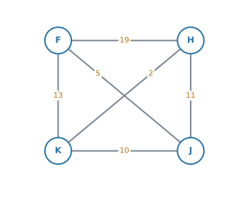{#fig-ahl316-ex6 width=52%}

**(a)** [Use the nearest neighbour algorithm, starting at $F$, to find an upper bound for the total cost.]{.q-en}

**(b)** [Use the nearest neighbour algorithm, starting at $J$, to find another upper bound.]{.q-en}

**(c)** [Write down the better of the two upper bounds.]{.q-en}

<details class="jp-trans">
<summary>日本語訳</summary>

下の完全グラフは、$4$ つの町のあいだの直通バスの運賃（ドル）を示しています。旅行者は $4$ つの町をすべて訪ね、出発地にもどらなければなりません。

**(a)** $F$ から始めて nearest neighbour のアルゴリズムを使い、合計費用の上界を求めなさい。

**(b)** $J$ から始めて、別の上界を求めなさい。

**(c)** $2$ つの上界のうち、よいほうを書きなさい。

</details>

::: {.callout-note collapse="true"}
## 解答例（答案用紙に書くこと）
**(a)** *$F \to J \to K \to H \to F$*

$$
5 + 10 + 2 + 19 = 36
$$

**(b)** *$J \to F \to K \to H \to J$*

$$
5 + 13 + 2 + 11 = 31
$$

**(c)** *The better upper bound is $31$ dollars.*
:::

::: {.callout-tip collapse="true"}
## 解説
`visit all four towns` なので travelling salesman です（@tbl-ahl316-compare）。

**(a)** $F$ からは $FJ = 5$ がいちばん安い。$J$ からは、残る $H = 11$、$K = 10$ で $K$。$K$ からは残る $H$ へ $2$。最後に $H \to F = 19$ でもどります。

$$
5 + 10 + 2 + 19 = 36
$$

最後の $19$ が大きく効いています。**安いところへ行き続けた結果、最後に高い区間が残る**——nearest neighbour の弱点がそのまま出ています。

**(b)** $J$ からは $JF = 5$。$F$ からは $H = 19$、$K = 13$ で $K$。$K$ からは $H$ へ $2$。最後に $H \to J = 11$。

$$
5 + 13 + 2 + 11 = 31
$$

**(c)** 上界は**小さいほうがよい**（最小をきつくはさめる）ので、$31$ ドルです。

$36$ と書いても間違いではありませんが、`the better` と聞かれているので $31$ を答えます。

::: {.callout-note}
## ここでは、最短距離の表を作りません
[第11節](#least)の作業が要るのは、**どこかの $2$ 点が直接つながっていないとき**、または**経由したほうが安いとき**です。この問題は、はじめから $6$ 本すべての運賃が与えられた complete graph なので、そのまま nearest neighbour にかけられます。

（この運賃表は、$FH = 19$ より $F \to K \to H = 13 + 2 = 15$ のほうが安いので、**最短距離の表にはなっていません。** それでも、この問題は complete graph と使う algorithm を指定して出されているので、**与えられた数のまま nearest neighbour にかけてください。** 表を作り直すのは、[第11節](#least)のように「直接の道がない」と問題文が言っているときです。）
:::
:::

::: {.ex-sep}
:::

[7]{.ex-no} [For the graph in @fig-ahl316-ex6, use the deleted vertex algorithm, deleting $F$, to find a lower bound for the travelling salesman problem. Hence write down an inequality satisfied by the weight $L$ of the Hamiltonian cycle of least weight, using your answer to question 6.]{.q-en}

<details class="jp-trans">
<summary>日本語訳</summary>

@fig-ahl316-ex6 のグラフについて、$F$ を消して deleted vertex のアルゴリズムを使い、巡回セールスマン問題の下界を求めなさい。よって、問6の答えを使って、重みが最小のハミルトン閉路の重み $L$ が満たす不等式を書きなさい。

</details>

::: {.callout-note collapse="true"}
## 解答例（答案用紙に書くこと）
*Deleting $F$ leaves $H$, $J$, $K$ with $HK = 2$, $JK = 10$, $HJ = 11$.*

*MST $= 2 + 10 = 12$. Two least edges at $F$ are $5$ and $13$.*

$$
12 + 5 + 13 = 30
$$

$$
30 \le L \le 31
$$
:::

::: {.callout-tip collapse="true"}
## 解説
$F$ を消すと、残るのは $H$、$J$、$K$ の $3$ 点です。edge は $HJ = 11$、$HK = 2$、$JK = 10$。

MST は軽いほうから $2$ 本で、$2 + 10 = 12$。$3$ 点なので edge は $2$ 本です。

$F$ から出ていたのは $FH = 19$、$FJ = 5$、$FK = 13$。小さいほうから $2$ 本は $5$ と $13$ です。

$$
12 + 5 + 13 = 30
$$

演習 $6$ で上界 $31$ が出ているので、

$$
30 \le L \le 31
$$

**ここでは一致しません。** @exm-ahl316-tsp では上界と下界が両方 $22$ になって答えが確定しましたが、それは運のよい場合です。ふつうは、このように**幅が残ります**。

（このグラフでは、実際の最小は $31$ です。演習 $6$(b) で出した $J \to F \to K \to H \to J$ が、そのまま最小でした。ただし **$30 \le L \le 31$ と書けていれば、それが求められた答え**です。）
:::

::: {.ex-sep}
:::

[8]{.ex-no} [The table below shows the roads joining four villages. The weights are distances in kilometres. There is no direct road from $A$ to $C$.]{.q-en}

| Road | Distance (km) |
|---|---|
| $A$–$B$ | $6$ |
| $B$–$C$ | $5$ |
| $C$–$D$ | $4$ |
| $B$–$D$ | $9$ |
| $A$–$D$ | $20$ |

**(a)** [Find the least distance from $A$ to $C$.]{.q-en}

**(b)** [Find the least distance from $A$ to $D$.]{.q-en}

**(c)** [Explain why a table of least distances is needed before the nearest neighbour algorithm can be used.]{.q-en}

<details class="jp-trans">
<summary>日本語訳</summary>

下の表は、$4$ つの村を結ぶ道を示しています。重みは距離（km）です。$A$ から $C$ への直接の道はありません。

表の見出しは、`Road` が「道」、`Distance` が「距離」です。

**(a)** $A$ から $C$ への最短距離を求めなさい。

**(b)** $A$ から $D$ への最短距離を求めなさい。

**(c)** nearest neighbour のアルゴリズムを使う前に、最短距離の表が必要な理由を説明しなさい。

</details>

::: {.callout-note collapse="true"}
## 解答例（答案用紙に書くこと）
**(a)** *$A \to B \to C = 6 + 5 = 11$ km.*

**(b)** *$A \to B \to D = 6 + 9 = 15$ km (also $A \to B \to C \to D = 6 + 5 + 4 = 15$ km), which is less than the direct road $A \to D = 20$ km.*

**(c)** *The nearest neighbour algorithm needs a complete graph, but there is no direct road from $A$ to $C$. Replacing each pair of villages by the least distance between them gives a complete graph, so the algorithm can then be used.*
:::

::: {.callout-tip collapse="true"}
## 解説
**(a)** $A$ から $C$ へ行く道は $4$ 通りです。

| 道 | 距離 |
|---|---|
| $A \to B \to C$ | $6 + 5 = 11$ |
| $A \to B \to D \to C$ | $6 + 9 + 4 = 19$ |
| $A \to D \to C$ | $20 + 4 = 24$ |
| $A \to D \to B \to C$ | $20 + 9 + 5 = 34$ |

最短は $11$ km です。

**(b)** $A$ から $D$ へ行く道は $3$ 通りです。

| 道 | 距離 |
|---|---|
| $A \to B \to D$ | $6 + 9 = 15$ |
| $A \to B \to C \to D$ | $6 + 5 + 4 = 15$ |
| $A \to D$ | $20$ |

最短は $15$ km。**直接の道 $20$ より短い**ので、表には $15$ と書きます（[第11節](#least)）。$15$ の道が $2$ つありますが、**距離が同じなので、表に入る数は $15$ で変わりません。**

**(c)** travelling salesman は **complete graph** の問題です（[第10節](#tsp)）。$A$ と $C$ のあいだに道がないので、このままでは nearest neighbour が「$A$ から $C$ への距離」を読めません。

::: {.model-answer}
**試験ではこう書く**

*The nearest neighbour algorithm needs a complete graph, but there is no direct road from $A$ to $C$. Replacing each pair of villages by the least distance between them gives a complete graph, so the algorithm can then be used.*
:::

最短距離で埋めた表を作れば、すべての組に数が入り、complete graph として扱えます。**deleted vertex も同じ理由で、この表を作ってから使います**（[第13節](#lb)）。

**答えを現実にもどすとき**は、表の「$A$–$C$ が $11$」は、実際には $A \to B \to C$ と通ることを意味します。ここまで書ければ丁寧です。
:::

::: {.ex-sep}
:::

[9]{.ex-no} [A gardener must walk along every path in the park shown below at least once, starting and finishing at the same point. The weights are distances in metres.]{.q-en}

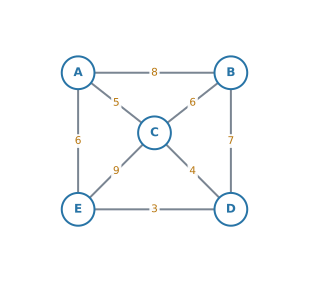{#fig-ahl316-ex9 width=62%}

**(a)** [Write down the vertices of odd degree.]{.q-en}

**(b)** [Find the length of the shortest possible route.]{.q-en}

<details class="jp-trans">
<summary>日本語訳</summary>

庭師が、下の公園のすべての小道を最低 $1$ 回は歩き、同じ地点で出発して同じ地点で終わらなければなりません。重みは距離（m）です。

**(a)** 次数が奇数の頂点を書きなさい。

**(b)** 可能な最短の経路の長さを求めなさい。

</details>

::: {.callout-note collapse="true"}
## 解答例（答案用紙に書くこと）
**(a)** *$A$, $B$, $D$ and $E$.*

**(b)** *Total weight $= 8+5+6+7+4+9+3+6 = 48$. The least distances between the odd vertices are $AB = 8$, $AD = 9$, $AE = 6$, $BD = 7$, $BE = 10$, $DE = 3$. The three pairings give*

$$
AB + DE = 8 + 3 = 11
$$

$$
AE + BD = 6 + 7 = 13
$$

$$
AD + BE = 9 + 10 = 19
$$

*The least is $11$.*

$$
48 + 11 = 59 \ \text{m}
$$
:::

::: {.callout-tip collapse="true"}
## 解説
**(a)** degree を数えます。

$$
\deg A = 3, \quad \deg B = 3, \quad \deg C = 4, \quad \deg D = 3, \quad \deg E = 3
$$

odd なのは $A$、$B$、$D$、$E$ の $4$ 個です。

**検算。** 合計は $16$。edge は $8$ 本で $2 \times 8 = 16$ ✓

**(b)** odd vertex が $4$ 個なので、[第9節の手順](#cpp4)です。**手順 $2$** から始めます。$4$ 個から $2$ 個を選ぶ $6$ 組すべての **least distance** を出します。

| 組 | 最短の道 | 長さ |
|---|---|---|
| $A$–$B$ | $A \to B$（直接） | $8$ |
| $A$–$D$ | $A \to C \to D$ | $5 + 4 = 9$ |
| $A$–$E$ | $A \to E$（直接） | $6$ |
| $B$–$D$ | $B \to D$（直接） | $7$ |
| $B$–$E$ | $B \to D \to E$ | $7 + 3 = 10$ |
| $D$–$E$ | $D \to E$（直接） | $3$ |

**$A$ と $D$ を結ぶ直接の道はありません**ので、経由して出します。$A \to E \to D$ も $6 + 3 = 9$ で同じ長さです。

**手順 $3$。** $3$ 通りを比べます。

| ペアの作り方 | 合計 |
|---|---|
| $AB$ と $DE$ | $8 + 3 = 11$ |
| $AE$ と $BD$ | $6 + 7 = 13$ |
| $AD$ と $BE$ | $9 + 10 = 19$ |

いちばん小さいのは $11$ です。

**手順 $4$。**

$$
48 + 11 = 59 \ \text{m}
$$

**$3$ 通りとも書いてください。** $11$ だけでは、それが最小である理由が示せません。
:::

::: {.ex-sep}
:::

[10]{.ex-no} [A complete graph has vertices $P$, $Q$, $R$ and $S$, with]{.q-en}

$$
PQ = 4, \quad PR = 4, \quad PS = 12, \quad QR = 3, \quad QS = 11, \quad RS = 5
$$

**(a)** [Explain why the nearest neighbour algorithm starting at $P$ does not give a single answer.]{.q-en}

**(b)** [Carry out the algorithm for each of the two choices, and state the better upper bound.]{.q-en}

**(c)** [By deleting $P$, find a lower bound, and hence write down an inequality satisfied by the weight $L$ of the Hamiltonian cycle of least weight.]{.q-en}

<details class="jp-trans">
<summary>日本語訳</summary>

ある完全グラフは、頂点 $P$、$Q$、$R$、$S$ をもち、辺の重みは次のとおりです。

$$
PQ = 4, \quad PR = 4, \quad PS = 12, \quad QR = 3, \quad QS = 11, \quad RS = 5
$$

**(a)** $P$ から始める nearest neighbour のアルゴリズムが、答えを $1$ つに決めない理由を説明しなさい。

**(b)** $2$ つの選び方それぞれについてアルゴリズムを実行し、よいほうの上界を述べなさい。

**(c)** $P$ を消して下界を求め、それを使って、重みが最小のハミルトン閉路の重み $L$ が満たす不等式を書きなさい。

</details>

::: {.callout-note collapse="true"}
## 解答例（答案用紙に書くこと）
**(a)** *From $P$ the two nearest unvisited vertices are $Q$ and $R$, both at distance $4$. The algorithm does not say which of two equal choices to take, so either may be chosen.*

**(b)** *Taking $Q$ first:*

$$
P \to Q \to R \to S \to P = 4 + 3 + 5 + 12 = 24
$$

*Taking $R$ first:*

$$
P \to R \to Q \to S \to P = 4 + 3 + 11 + 12 = 30
$$

*Both are upper bounds. The better one is $24$.*

**(c)** *Deleting $P$ leaves $Q$, $R$, $S$ with $QR = 3$, $RS = 5$, $QS = 11$. MST $= 3 + 5 = 8$. The two least edges at $P$ are $4$ and $4$.*

$$
8 + 4 + 4 = 16
$$

$$
16 \le L \le 24
$$
:::

::: {.callout-tip collapse="true"}
## 解説
**(a)** $P$ からの距離は $PQ = 4$、$PR = 4$、$PS = 12$。**$Q$ と $R$ が同点**です（[第12節](#nn-ties)）。

手順は「いちばん近いところへ行く」としか言っていないので、**同点のときはどちらでもよい**ことになります。

::: {.model-answer}
**試験ではこう書く**

*From $P$ the two nearest unvisited vertices are $Q$ and $R$, both at distance $4$. The algorithm does not say which of two equal choices to take, so the route, and hence the upper bound, is not determined.*
:::

**(b)** $Q$ を先に取ると、$Q$ からは $QR = 3$ が最短なので $R$ へ。$R$ からは残る $S$ へ $5$。最後に $S \to P = 12$。

$$
4 + 3 + 5 + 12 = 24
$$

$R$ を先に取ると、$R$ からは $RQ = 3 < RS = 5$ なので $Q$ へ。$Q$ からは残る $S$ へ $11$。最後に $S \to P = 12$。

$$
4 + 3 + 11 + 12 = 30
$$

**どちらも正しい上界です。** どちらも実際に通れる道だからです。ただし上界は小さいほど良いので、$24$ のほうが役に立ちます。

**この点が、Kruskal の同点とは違います。** Kruskal では、どちらを選んでも合計は変わりませんでした（[第6節](#ties)）。nearest neighbour では**値が変わります。** 選んだほうを答案に書いてください。

**(c)** $P$ を消すと $Q$、$R$、$S$ が残ります。MST は軽いほうから $QR = 3$ と $RS = 5$ で $8$。$P$ に付いていた $4$、$4$、$12$ のうち、小さいほうから $2$ 本は $4$ と $4$ です（[第13節](#lb)）。

$$
8 + 4 + 4 = 16
$$

(b) の上界 $24$ と合わせて $16 \le L \le 24$ です。**一致しないので、はさんだ形のまま答えます。**

（このグラフでは、実際の最短は $24$ です。ただし **$16 \le L \le 24$ と書けていれば、それが求められた答え**です。上界と下界だけからは、$24$ が最短だとは分かりません。）
:::

:::
