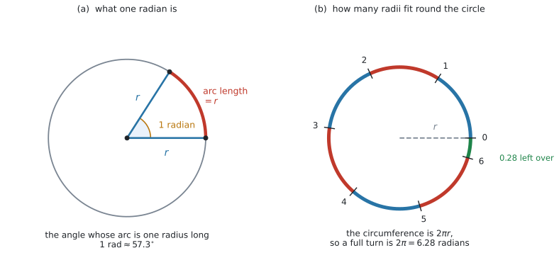
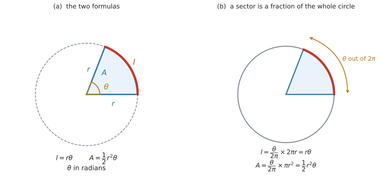

# AHL 3.7 — Radian measure（弧度法） {#sec-ahl-3-7}

::: {.callout-note}
## What you should be able to do
- **radian**（ラジアン）が「**半径と同じ長さの弧**の中心角」であることを説明できる。
- $180^{\circ} = \pi$ radians を使って、度とラジアンを**両方向に**換算できる。
- よく出る角を、**$\pi$ の分数の形**でも小数でも書ける。
- $l = r\theta$ で弧の長さを、$A = \dfrac{1}{2}r^{2}\theta$ で扇形の面積を求められる。
- **度数法の式とラジアンの式を、正しく使い分けられる**。
- $l$ や $A$ から、$\theta$ や $r$ を逆に求められる。
:::

::: {.callout-important}
## 公式集の AHL 3.7 の欄
**$2$ 行あります。**

$$
l = r\theta \quad (\text{arc length}), \qquad A = \frac{1}{2}r^{2}\theta \quad (\text{area of a sector})
$$ {#eq-ahl37-both}

どちらにも、次の断り書きが添えてあります。

> where $r$ is the radius, $\theta$ is the angle measured in radians

**式は配られるので、覚える必要はありません。** ただし、この断り書きの `in radians` を読み飛ばすと、答えが丸ごとずれます（[Common errors](#common-errors)）。

いっぽう、**度とラジアンの換算は印刷されていません。**

$$
180^{\circ} = \pi \text{ radians}
$$ {#eq-ahl37-convert}

**この $1$ 行だけは、自分で持っておく必要があります**（[第3節](#convert)）。

度数法の式のほうも、[SL 3.4](../../ai-sl/03-geometry-and-trigonometry/sl-3-4.qmd) の欄に印刷されています。**$2$ 組が並んで載っている**ので、どちらを使うかを自分で決めることになります（[第7節](#which)）。
:::

## The idea

### 1. radian は「半径と同じ長さの弧」の中心角です {#idea}

角の大きさを測るのに、$360$ という数を使う理由は、実はありません。**円を $360$ 等分するのは、ただの約束事**です（Connections 欄の `why are there 360 degrees in a complete turn?` は、まさにその問いです）。

**radian**（ラジアン）は、約束事を使わない測り方です。

{#fig-ahl37-radian width=100%}

@fig-ahl37-radian の (a) を見てください。半径 $r$ の円で、**長さがちょうど $r$ の弧**を取ります。その弧の、**中心に対する角**が **$1$ radian** です。

$$
1 \text{ radian} = \text{円の半径に等しい長さの弧の、中心に対する角度}
$$

**円の大きさによりません。** 半径 $1$ cm の円でも $100$ m の円でも、「弧の長さ＝半径」となる角は同じ大きさです。長さの比で決めているからです。

数で言うと、$1$ radian は約 $57.3^{\circ}$ です（[第3節](#convert)）。

### 2. だから、一周は $2\pi$ radians です {#full-turn}

@fig-ahl37-radian の (b) が、その理由です。

円周の長さは $2\pi r$ です（[SL 3.4](../../ai-sl/03-geometry-and-trigonometry/sl-3-4.qmd) の Prior learning）。そこに、長さ $r$ の弧が何個入るでしょうか。

$$
\frac{2\pi r}{r} = 2\pi = 6.283\ldots
$$

**$6$ 個と、$0.28$ 個ぶんです。** 図の (b) では、$0$ から $6$ まで目盛りを打ったあと、少しだけ余っています。

つまり

$$
\text{一周} = 2\pi \text{ radians} = 360^{\circ}
$$ {#eq-ahl37-turn}

**$2\pi$ という数は、円周の公式から出てきただけ**です。覚えるというより、$\dfrac{2\pi r}{r}$ を思い出せば作れます。

### 3. $180^{\circ} = \pi$ radians で換算します {#convert}

@eq-ahl37-turn の両辺を $2$ で割ると、いちばん使いやすい形になります。@eq-ahl37-convert です。

$$
180^{\circ} = \pi \text{ radians}
$$

ここから、両方向の換算が出ます。

| したいこと | かけるもの |
|:--|:--|
| 度 → ラジアン | $\dfrac{\pi}{180}$ |
| ラジアン → 度 | $\dfrac{180}{\pi}$ |

: 換算のしかた {#tbl-ahl37-convert}

たとえば $60^{\circ}$ なら

$$
60 \times \frac{\pi}{180} = \frac{60\pi}{180} = \frac{\pi}{3} = 1.047\ldots
$$

逆に $2$ radians なら

$$
2 \times \frac{180}{\pi} = \frac{360}{\pi} = 114.59\ldots^{\circ}
$$

::: {.callout-tip}
## どちらをかけるか迷ったら、大きさで確かめてください
ラジアンのほうが**数が小さくなります**。$360$ 度ぶんが $6.28$ にしかならないからです。

- 度 → ラジアン … 数が**小さく**なるはず。$\dfrac{\pi}{180} \approx 0.0175$ をかけます
- ラジアン → 度 … 数が**大きく**なるはず。$\dfrac{180}{\pi} \approx 57.3$ をかけます

$60^{\circ}$ が $1.05$ になれば向きは合っています。$3438$ になったら、逆をかけています。
:::

### 4. よく出る角の変換表 {#table}

シラバスの Guidance 欄が `exact multiples of` と `decimals` を並べて挙げているとおり、**どちらの形でも構いません。**

| 度 | ラジアン（$\pi$ の形） | 小数（$4$ s.f.） |
|:--|:--|:--|
| $30^{\circ}$ | $\dfrac{\pi}{6}$ | $0.5236$ |
| $45^{\circ}$ | $\dfrac{\pi}{4}$ | $0.7854$ |
| $60^{\circ}$ | $\dfrac{\pi}{3}$ | $1.047$ |
| $90^{\circ}$ | $\dfrac{\pi}{2}$ | $1.571$ |
| $120^{\circ}$ | $\dfrac{2\pi}{3}$ | $2.094$ |
| $180^{\circ}$ | $\pi$ | $3.142$ |
| $270^{\circ}$ | $\dfrac{3\pi}{2}$ | $4.712$ |
| $360^{\circ}$ | $2\pi$ | $6.283$ |

: よく出る角 {#tbl-ahl37-table}

**@tbl-ahl37-table を丸暗記する必要はありません。** $\dfrac{\pi}{180}$ をかければ、その場で出せます。ただし $\dfrac{\pi}{6}$、$\dfrac{\pi}{4}$、$\dfrac{\pi}{3}$、$\dfrac{\pi}{2}$、$\pi$ の $5$ つは何度も出てくるので、見ただけで度が浮かぶようにしておくと速くなります。

**使い分けの目安**は、次のとおりです。

- **$\pi$ の分数で答える** … 角そのものを聞かれたとき（`Give your answer in terms of π` と書いてあることもあります）
- **小数で答える** … 弧の長さや面積を計算するとき。どうせ電卓に入れるからです

### 5. 弧の長さは $l = r\theta$ です {#arc}

公式集の $2$ 行（@eq-ahl37-both）の $1$ 行目です。

$$
l = r\theta \qquad (\theta \text{ はラジアン})
$$ {#eq-ahl37-arc}

{#fig-ahl37-sector width=100%}

@fig-ahl37-sector の (a) が、記号の意味です。

**この式が短いのが、ラジアンを使う最大の理由**です。度数法では

$$
l = \frac{\theta}{360} \times 2\pi r
$$

と、$360$ と $2\pi$ を両方引きずらなければなりません（[SL 3.4](../../ai-sl/03-geometry-and-trigonometry/sl-3-4.qmd)）。

たとえば $r = 9$ cm、$\theta = 1.2$ radians なら

$$
l = 9 \times 1.2 = 10.8 \text{ cm}
$$

**かけ算 $1$ 回**です。

### 6. 扇形の面積は $A = \dfrac{1}{2}r^{2}\theta$ です {#sector}

$$
A = \frac{1}{2}r^{2}\theta \qquad (\theta \text{ はラジアン})
$$ {#eq-ahl37-area}

同じ $r = 9$ cm、$\theta = 1.2$ radians で

$$
A = \frac{1}{2} \times 81 \times 1.2 = 48.6 \text{ cm}^{2}
$$

::: {.callout-warning}
## $\dfrac{1}{2}$ を忘れないでください
$r^{2}\theta$ だけで止めると、答えが $2$ 倍になります。

**三角形の面積 $\dfrac{1}{2}bh$ と同じ $\dfrac{1}{2}$** だと思っておくと、忘れにくくなります。実際、$\theta$ が小さいとき、扇形は底辺 $l = r\theta$、高さ $r$ の三角形にとても近い形です。

$$
\frac{1}{2} \times \underbrace{r\theta}_{\text{底辺}} \times \underbrace{r}_{\text{高さ}} = \frac{1}{2}r^{2}\theta
$$

**これは覚え方であって、証明ではありません。** きちんとした理由は [Why it works](#why-it-works) にあります。
:::

### 7. 度数法の式と、どちらを使うか {#which}

公式集には**$2$ 組**の式が載っています。

| $\theta$ の単位 | 弧の長さ | 扇形の面積 | どこ |
|:--|:--|:--|:--|
| 度 | $\dfrac{\theta}{360} \times 2\pi r$ | $\dfrac{\theta}{360} \times \pi r^{2}$ | 公式集の 3.4 |
| ラジアン | $r\theta$ | $\dfrac{1}{2}r^{2}\theta$ | 公式集の 3.7 |

: $2$ 組の式 {#tbl-ahl37-which}

**選び方は $1$ つです。$\theta$ が何で書かれているかを見ます。**

- $50^{\circ}$ のように**度の記号がある** → 度の式を使う。または $\dfrac{\pi}{180}$ をかけてラジアンに直す
- $1.2$ のように**記号がない** → ラジアン。ラジアンの式を使う

::: {.callout-important}
## HL の試験では、断りがなければラジアンです
$\sin x$ と書いてあればラジアン、$\sin x^{\circ}$ と書いてあれば度です。**$^{\circ}$ という小さな記号を見落とさない**でください（[AHL 2.9a](../02-functions/ahl-2-9a.qmd#radian) でも同じ話をしています）。

電卓の角の設定も、これに合わせます（[GDC](#gdc-angle)）。**設定が違っていると、もっともらしい数が出るのに全部ずれます。**
:::

## Why it works

:::: {.callout-note collapse="true" appearance="simple"}
## クリックすると開きます
**なぜ $l = r\theta$ と $A = \dfrac{1}{2}r^{2}\theta$ になるのか。** どちらも「**円全体の何割か**」という $1$ つの考え方から出ます。

@fig-ahl37-sector の (b) を見てください。一周は $2\pi$ radians でした（@eq-ahl37-turn）。ですから、角 $\theta$ の扇形は、円全体の

$$
\frac{\theta}{2\pi}
$$

の割合を占めています。

**弧の長さ**は、円周 $2\pi r$ のその割合です。

$$
l = \frac{\theta}{2\pi} \times 2\pi r = r\theta
$$

**$2\pi$ が約分で消えます。** これが式の短さの正体です。

**面積**は、円の面積 $\pi r^{2}$ のその割合です。

$$
A = \frac{\theta}{2\pi} \times \pi r^{2} = \frac{r^{2}\theta}{2} = \frac{1}{2}r^{2}\theta
$$

こちらでは $\pi$ だけが約分され、**$2$ が残ります。** これが $\dfrac{1}{2}$ の出どころです。

**度数法でも、まったく同じ議論です。** 一周が $360$ なので、割合は $\dfrac{\theta}{360}$。

$$
l = \frac{\theta}{360} \times 2\pi r, \qquad A = \frac{\theta}{360} \times \pi r^{2}
$$

$360$ と $2\pi$ が約分できないので、式が長いまま残ります。

**「一周をいくつと数えるか」を $2\pi$ にしておくと、円周の $2\pi$ と打ち消し合う**——ラジアンの利点は、ここに尽きます。同じ理由で、[AHL 5.9a](../05-calculus/ahl-5-9a.qmd) の $\dfrac{d}{dx}\sin x = \cos x$ も、ラジアンのときだけ余分な係数が付きません。
::::

## Worked examples

::: {.callout-note appearance="simple"}
問題文は英語です。意味が理解できなかったら、問題文の下の「**日本語訳**」を開いてください。解説は日本語です。
:::

::: {#exm-ahl37-convert}
**(a)** [Convert $144^{\circ}$ to radians, giving your answer as an exact multiple of $\pi$.]{.q-en}

**(b)** [Convert $2.4$ radians to degrees, correct to $1$ decimal place.]{.q-en}

**(c)** [Find, correct to $1$ decimal place, the size of an angle of $1$ radian in degrees.]{.q-en}

<details class="jp-trans">
<summary>日本語訳</summary>

**(a)** $144^{\circ}$ をラジアンに直しなさい。答えは $\pi$ の正確な倍数の形で書きなさい。

**(b)** $2.4$ ラジアンを度に直しなさい。小数第 $1$ 位まで答えなさい。

**(c)** $1$ ラジアンの角の大きさを度で求めなさい。小数第 $1$ 位まで答えなさい。

</details>

---

**(a)** 度 → ラジアンなので、$\dfrac{\pi}{180}$ をかけます（@tbl-ahl37-convert）。

$$
144 \times \frac{\pi}{180} = \frac{144\pi}{180}
$$

約分します。$144$ と $180$ の最大公約数は $36$ です。

$$
\frac{144\pi}{180} = \frac{4\pi}{5}
$$

`exact multiple of π` と言われているので、**ここで止めます。** 小数にしないでください。

**検算。** $\dfrac{4\pi}{5} = 2.513\ldots$ で、$\pi = 3.14$ より少し小さい値です。$144^{\circ}$ は $180^{\circ}$ より少し小さいので、つじつまが合っています ✓

**(b)** ラジアン → 度なので、$\dfrac{180}{\pi}$ をかけます。

$$
2.4 \times \frac{180}{\pi} = \frac{432}{\pi} = 137.509\ldots = 137.5^{\circ}
$$

**検算。** $2.4$ は $\dfrac{\pi}{2} = 1.57$ より大きく $\pi = 3.14$ より小さいので、$90^{\circ}$ と $180^{\circ}$ のあいだのはずです。$137.5$ ✓

**(c)** 同じ式に $1$ を入れます。

$$
1 \times \frac{180}{\pi} = 57.295\ldots = 57.3^{\circ}
$$

@fig-ahl37-radian の (a) の角です。**この $57.3$ という数は、覚えておくと見当を付けるのに使えます。**

::: {.callout-note}
## 解答例（答案用紙にはこう書く）
**(a)**
$$144 \times \frac{\pi}{180} = \frac{4\pi}{5}$$

**(b)**
$$2.4 \times \frac{180}{\pi} = 137.5^{\circ}$$

**(c)**
$$\frac{180}{\pi} = 57.3^{\circ}$$
:::
:::

::: {#exm-ahl37-sector}
[A sector of a circle has radius $9$ cm and angle $1.2$ radians at the centre.]{.q-en}

**(a)** [Find the length of the arc.]{.q-en}

**(b)** [Find the area of the sector.]{.q-en}

**(c)** [Find the perimeter of the sector.]{.q-en}

<details class="jp-trans">
<summary>日本語訳</summary>

ある扇形の半径は $9$ cm、中心角は $1.2$ ラジアンです。

**(a)** 弧の長さを求めなさい。

**(b)** 扇形の面積を求めなさい。

**(c)** 扇形の周の長さを求めなさい。

</details>

---

$1.2$ には度の記号が付いていないので、**ラジアン**です（[第7節](#which)）。

**(a)** @eq-ahl37-arc です。

$$
l = r\theta = 9 \times 1.2 = 10.8 \text{ cm}
$$

**(b)** @eq-ahl37-area です。

$$
A = \frac{1}{2}r^{2}\theta = \frac{1}{2} \times 9^{2} \times 1.2 = \frac{1}{2} \times 81 \times 1.2 = 48.6 \text{ cm}^{2}
$$

**$r$ を先に $2$ 乗してください。** $\left(\dfrac{1}{2} \times 9\right)^{2} \times 1.2$ ではありません。

**(c)** 周には、弧のほかに**半径が $2$ 本**入ります（@eq-ahl37-perim）。

$$
\text{perimeter} = 10.8 + 2 \times 9 = 10.8 + 18 = 28.8 \text{ cm}
$$

**検算。** 円全体と比べます。$1.2$ radians は一周 $6.283$ の約 $19\%$ です。

$$
\text{円周} = 2\pi(9) = 56.5, \qquad 56.5 \times 0.191 = 10.8 \ ✓
$$

$$
\text{円の面積} = \pi(81) = 254.5, \qquad 254.5 \times 0.191 = 48.6 \ ✓
$$

::: {.callout-note}
## 解答例（答案用紙にはこう書く）
**(a)**
$$l = r\theta = 9(1.2) = 10.8 \text{ cm}$$

**(b)**
$$A = \frac{1}{2}r^{2}\theta = \frac{1}{2}(81)(1.2) = 48.6 \text{ cm}^{2}$$

**(c)**
$$\text{perimeter} = 10.8 + 2(9) = 28.8 \text{ cm}$$
:::
:::

::: {#exm-ahl37-backwards}
[An arc of length $15$ cm lies on a circle of radius $6$ cm.]{.q-en}

**(a)** [Find the angle subtended at the centre, in radians.]{.q-en}

**(b)** [Give this angle in degrees, correct to $1$ decimal place.]{.q-en}

**(c)** [Find the area of the corresponding sector.]{.q-en}

<details class="jp-trans">
<summary>日本語訳</summary>

半径 $6$ cm の円の上に、長さ $15$ cm の弧があります。

**(a)** 中心に対する角をラジアンで求めなさい。

**(b)** この角を度で、小数第 $1$ 位まで答えなさい。

**(c)** 対応する扇形の面積を求めなさい。

</details>

---

**(a)** @eq-ahl37-arc を $\theta$ について解きます。

$$
\theta = \frac{l}{r} = \frac{15}{6} = 2.5 \text{ radians}
$$

**この形が、radian の定義そのもの**です（[第1節](#idea)）。弧が半径の $2.5$ 倍あるので、角は $2.5$ radians です。

**(b)** $\dfrac{180}{\pi}$ をかけます。

$$
2.5 \times \frac{180}{\pi} = 143.239\ldots = 143.2^{\circ}
$$

**(c)** ここで **$2.5$ を使います。$143.2$ ではありません。**

$$
A = \frac{1}{2} \times 6^{2} \times 2.5 = \frac{1}{2} \times 36 \times 2.5 = 45 \text{ cm}^{2}
$$

**検算。** もう $1$ つの式でも出します。$\dfrac{1}{2}lr = \dfrac{1}{2}(15)(6) = 45$ ✓

（$A = \dfrac{1}{2}r^{2}\theta = \dfrac{1}{2}r(r\theta) = \dfrac{1}{2}lr$ なので、$l$ が分かっているときはこちらが速いことがあります。）

::: {.callout-warning}
## 度に直した値を、ラジアンの式に入れない
(c) で $\dfrac{1}{2}(36)(143.2)$ としてしまうと、$2577.6$ という値が出ます。

**円全体の面積は $\pi(36) = 113$ cm² しかありません。** 扇形がそれより大きくなることはありえないので、この時点で気づけます（演習 $10$）。
:::

::: {.callout-note}
## 解答例（答案用紙にはこう書く）
**(a)**
$$\theta = \frac{l}{r} = \frac{15}{6} = 2.5 \text{ radians}$$

**(b)**
$$2.5 \times \frac{180}{\pi} = 143.2^{\circ}$$

**(c)**
$$A = \frac{1}{2}(6)^{2}(2.5) = 45 \text{ cm}^{2}$$
:::
:::

::: {#exm-ahl37-sprinkler}
[A garden sprinkler waters a sector of a circle. The sprinkler throws water a distance of $8$ m and turns through an angle of $2.1$ radians.]{.q-en}

**(a)** [Find the area of ground that is watered.]{.q-en}

**(b)** [Find the distance travelled by the tip of the jet of water as the sprinkler turns once through this angle.]{.q-en}

**(c)** [The gardener says that doubling the distance the water is thrown would double the area watered. Comment on this statement.]{.q-en}

<details class="jp-trans">
<summary>日本語訳</summary>

庭のスプリンクラーが、円の扇形の部分に水をまきます。水は $8$ m 先まで届き、スプリンクラーは $2.1$ ラジアンの角だけ回ります。

**(a)** 水がまかれる地面の面積を求めなさい。

**(b)** スプリンクラーがこの角を $1$ 回まわるあいだに、水の先端が動く距離を求めなさい。

**(c)** 庭師は「水の届く距離を $2$ 倍にすれば、まかれる面積も $2$ 倍になる」と言っています。この発言についてコメントしなさい。

</details>

---

**(a)** 半径 $8$ m、角 $2.1$ radians の扇形です。

$$
A = \frac{1}{2} \times 8^{2} \times 2.1 = \frac{1}{2} \times 64 \times 2.1 = 67.2 \text{ m}^{2}
$$

**(b)** 先端が動くのは、半径 $8$ m の**弧**です。

$$
l = 8 \times 2.1 = 16.8 \text{ m}
$$

**(c)** `Comment on` なので、**言葉で答えます。** まず計算して確かめます。

半径を $16$ m にすると

$$
A = \frac{1}{2} \times 16^{2} \times 2.1 = \frac{1}{2} \times 256 \times 2.1 = 268.8 \text{ m}^{2}
$$

$$
\frac{268.8}{67.2} = 4
$$

**$2$ 倍ではなく $4$ 倍**です。$A = \dfrac{1}{2}r^{2}\theta$ の $r$ が $2$ 乗されているからです。

::: {.model-answer}
**試験ではこう書く**

*The statement is not correct. In $A = \frac{1}{2}r^{2}\theta$ the radius is squared, so doubling $r$ from $8$ m to $16$ m multiplies the area by $2^{2} = 4$, from $67.2$ m$^{2}$ to $268.8$ m$^{2}$. The area would be four times as large, not twice as large. Doubling the **angle** instead would double the area, because $A$ is proportional to $\theta$.*
:::

（この発言は正しくない。$A = \frac12 r^2\theta$ では半径が $2$ 乗されているので、$r$ を $8$ m から $16$ m に $2$ 倍すると面積は $2^2 = 4$ 倍になり、$67.2$ m² から $268.8$ m² になる。面積は $2$ 倍ではなく $4$ 倍である。かわりに**角**を $2$ 倍にすれば面積は $2$ 倍になる。$A$ は $\theta$ に比例するからである、という意味です。）

::: {.callout-note}
## 解答例（答案用紙にはこう書く）
**(a)**
$$A = \frac{1}{2}(8)^{2}(2.1) = 67.2 \text{ m}^{2}$$

**(b)**
$$l = 8(2.1) = 16.8 \text{ m}$$

**(c)**
*Not correct. Since $A = \frac{1}{2}r^{2}\theta$ has $r$ squared, doubling $r$ multiplies the area by $4$: $\frac{1}{2}(16)^{2}(2.1) = 268.8$ m$^{2}$, which is $4 \times 67.2$. Doubling the angle would double the area.*
:::
:::

## Common errors

::: {.callout-warning}
## 度の値を、ラジアンの式にそのまま入れる
$\theta = 50^{\circ}$、$r = 6$ cm で

$$
A = \frac{1}{2}(36)(50) = 900 \text{ cm}^{2}
$$

としてしまう誤りです。**円全体でも $\pi(36) = 113$ cm² しかありません。**

先に $50 \times \dfrac{\pi}{180} = 0.8727$ に直してから使ってください（演習 $10$）。

**答えが円全体を超えていないか**を見るのが、いちばん速い検算です。
:::

::: {.callout-warning}
## $\dfrac{\pi}{180}$ と $\dfrac{180}{\pi}$ を取り違える
どちらをかけるか迷ったら、**大きさで確かめてください**（[第3節](#convert)）。

- 度 → ラジアン … 数は**小さく**なる
- ラジアン → 度 … 数は**大きく**なる

$45^{\circ}$ が $0.785$ になれば正しく、$2578$ になったら逆です。
:::

::: {.callout-warning}
## 面積の式で $\dfrac{1}{2}$ を落とす
$A = r^{2}\theta$ と書いてしまうと、答えが**ちょうど $2$ 倍**になります。

公式集には $\dfrac{1}{2}r^{2}\theta$ と印刷されています。**写すときに落とさない**でください（[第6節](#sector)）。
:::

::: {.callout-warning}
## 扇形の周に、半径を入れ忘れる
`perimeter` を聞かれて、弧の長さだけを答える誤りです。扇形の**周**（perimeter）には、弧のほかに**半径が $2$ 本**入ります。

$$
\text{perimeter} = l + 2r = r\theta + 2r
$$ {#eq-ahl37-perim}

**扇形はピザの $1$ 切れの形**です。まわりを $1$ 周すると、丸い部分と、まっすぐな辺が $2$ 本あります（[SL 3.4](../../ai-sl/03-geometry-and-trigonometry/sl-3-4.qmd#perimeter) と同じ考え方です）。
:::

::: {.callout-warning}
## $r$ を $2$ 乗する前に $\dfrac{1}{2}$ をかける
$\dfrac{1}{2} \times 9^{2}$ は $40.5$ ですが、$\left(\dfrac{1}{2} \times 9\right)^{2} = 20.25$ です。**$2$ 乗が先**です。

電卓に入れるときも、`0.5*9^2*1.2` の順で打てば取り違えません。`(0.5*9)^2` としないでください。
:::

## Using your GDC (TI-Nspire CX II)

### 1. 角の設定を、いちばん先に確かめます {#gdc-angle}

```
doc → Settings → Document Settings
```

`Angle` を **Radian** にします。**HL の試験では、断りがなければラジアン**でした（[第7節](#which)）。

$l = r\theta$ と $A = \dfrac{1}{2}r^{2}\theta$ は、**ただのかけ算なので設定の影響を受けません。** 影響が出るのは、$\sin$、$\cos$、$\tan$ を使うときです。**扇形の問題でも、弓形の面積や三角形の面積を出す段になると効いてきます**（[SL 3.4](../../ai-sl/03-geometry-and-trigonometry/sl-3-4.qmd#segment-area)）。

**設定が違っていると、もっともらしい数が出るのに全部ずれます。** 毎回確かめる価値があります。

### 2. $\pi$ はキーで入れます {#gdc-pi}

$\pi$ は専用のキーがあります。**`3.14` と打たないでください。** 桁が足りず、あとの計算に誤差が乗ります。

$144 \times \dfrac{\pi}{180}$

と打つと、$\dfrac{4\pi}{5}$ の小数、つまり $2.51327$ が返ります（かけ算と割り算だけなので、Radian か Degree かの設定には左右されません）。

::: {.callout-warning}
## CX II は $\dfrac{4\pi}{5}$ の形では返しません
TI-Nspire CX II は **Numeric** です。$\dfrac{4\pi}{5}$ のような**記号のままの答えは返ってきません。** 小数の $2.51327\ldots$ が出ます。

`exact multiple of π` と問われたら、**約分は自分でやります**（@exm-ahl37-convert）。$\dfrac{144}{180}$ を約分して $\dfrac{4}{5}$、それに $\pi$ を付ける——手でやるほうが速い作業です。

出した答えの検算には電卓が使えます。$\dfrac{4\pi}{5}$ と $144 \times \dfrac{\pi}{180}$ の**小数が一致するか**を見てください。
:::

### 3. 度とラジアンが混ざるとき {#gdc-degree}

Radian 設定のまま度の値を使いたいときは、**式の中に度の記号を入れます。**

```
sin(50°)
```

度の記号は、キーボードのいちばん下、左端の **`π` のキー**を押すと開く**記号パレット**から選びます。設定を切りかえるより、こちらのほうが安全です（[AHL 5.9a](../05-calculus/ahl-5-9a.qmd) と同じやり方です）。

**逆に、Degree 設定のままラジアンを使いたいとき**は、パレットの上付き `r` を付けます。ただし、**HL では Radian にしておくほうが混乱しません。**

### 4. 弧と扇形の計算 {#gdc-compute}

式が短いので、そのまま $1$ 行で打てます。

- $9 \times 1.2$
- $0.5 \times 9^{2} \times 1.2$

$10.8$ と $48.6$ が返ります。**$2$ 乗を先に計算させる**ため、`0.5*9^2` の順で打ってください（[Common errors](#common-errors) の $5$ つ目）。

度の値から始めるときは、換算を式の中に入れてしまうのが確実です。

$0.5 \times 6^{2} \times \left(50 \times \dfrac{\pi}{180}\right)$

$15.708$ が返ります。**途中で丸めた $0.87$ を使わない**ですみます。

### 5. 検算のしかた {#gdc-check}

- **円全体と比べる。** 扇形の面積が $\pi r^{2}$ を超えていたら、必ず間違いです
- **割合で確かめる。** $\theta$ が一周 $2\pi$ の何割かを出し、円周・円の面積にその割合をかける（@exm-ahl37-sector）
- $A$ を出したら、**$\dfrac{1}{2}lr$ でも計算**して突き合わせる（@exm-ahl37-backwards）
- 換算したら、**大きさの向き**を見る。度 → ラジアンで数が大きくなっていたら、逆をかけています

$1$ つ目が、いちばん強い検算です。**円より大きい扇形はありません。**

## Exercises

::: {.callout-note appearance="simple"}
各問題に、折りたたみが3つ付いています。**日本語訳**、**解答例**（答案用紙に書くべきこと。英語です）、**解説**（なぜそうなるか。日本語です）。

まず自分で解いて、次に解答例と見くらべてください。**解説は、合わなかったときだけ開けば十分です。**
:::

::: {.exercise-block}

[1]{.ex-no} [Convert $75^{\circ}$ to radians, giving your answer as an exact multiple of $\pi$ and also correct to $3$ significant figures.]{.q-en}

<details class="jp-trans">
<summary>日本語訳</summary>

$75^{\circ}$ をラジアンに直しなさい。答えを $\pi$ の正確な倍数の形と、有効数字 $3$ 桁の両方で書きなさい。

</details>

::: {.callout-note collapse="true"}
## 解答例（答案用紙に書くこと）

$$75 \times \frac{\pi}{180} = \frac{75\pi}{180} = \frac{5\pi}{12}$$

$$\frac{5\pi}{12} = 1.31 \text{ radians}$$
:::

::: {.callout-tip collapse="true"}
## 解説

$75$ と $180$ の最大公約数は $15$ です。$\dfrac{75}{15} = 5$、$\dfrac{180}{15} = 12$。

$\dfrac{5\pi}{12} = 1.30899\ldots$ なので、$3$ s.f. で $1.31$ です。

**検算。** $75^{\circ}$ は $90^{\circ} = \dfrac{\pi}{2} = 1.571$ より少し小さいはずです。$1.31 < 1.571$ ✓ また $60^{\circ} = 1.047$ より大きいはずです。$1.31 > 1.047$ ✓
:::

::: {.ex-sep}
:::

[2]{.ex-no} [Convert $3.7$ radians to degrees, correct to the nearest degree.]{.q-en}

<details class="jp-trans">
<summary>日本語訳</summary>

$3.7$ ラジアンを度に直しなさい。答えは最も近い整数の度で書きなさい。

</details>

::: {.callout-note collapse="true"}
## 解答例（答案用紙に書くこと）

$$3.7 \times \frac{180}{\pi} = 211.994\ldots = 212^{\circ}$$
:::

::: {.callout-tip collapse="true"}
## 解説

ラジアン → 度なので $\dfrac{180}{\pi}$ をかけます（@tbl-ahl37-convert）。

**検算。** $3.7$ は $\pi = 3.142$（$180^{\circ}$）より少し大きく、$\dfrac{3\pi}{2} = 4.712$（$270^{\circ}$）より小さいので、答えは $180$ と $270$ のあいだのはずです。$212$ ✓

$57.3$ を $3.7$ 倍しても $212$ になります（$57.3 \times 3.7 = 212.0$）。**$1$ radian $\approx 57.3^{\circ}$ を覚えておくと、暗算で見当が付きます。**
:::

::: {.ex-sep}
:::

[3]{.ex-no} [A sector has radius $14$ cm and angle $0.85$ radians. Find the length of the arc and the area of the sector.]{.q-en}

<details class="jp-trans">
<summary>日本語訳</summary>

ある扇形の半径は $14$ cm、角は $0.85$ ラジアンです。弧の長さと扇形の面積を求めなさい。

</details>

::: {.callout-note collapse="true"}
## 解答例（答案用紙に書くこと）

$$l = r\theta = 14(0.85) = 11.9 \text{ cm}$$

$$A = \frac{1}{2}r^{2}\theta = \frac{1}{2}(196)(0.85) = 83.3 \text{ cm}^{2}$$
:::

::: {.callout-tip collapse="true"}
## 解説

度の記号が付いていないので、**ラジアン**です（[第7節](#which)）。

$14^{2} = 196$ を先に出してから、$\dfrac{1}{2}$ と $0.85$ をかけます。

**検算。** $\dfrac{1}{2}lr = \dfrac{1}{2}(11.9)(14) = 83.3$ ✓ ただし、ここの $l$ は自分で $r\theta$ として出したものです。$\dfrac{1}{2}(r\theta)r$ は $\dfrac{1}{2}r^{2}\theta$ を書き直しただけなので、**この検算で見つかるのは $\dfrac{1}{2}$ の落としや打ち間違い**です。$r$ や $\theta$ の読み違いは見つかりません（$l$ が問題文で与えられている @exm-ahl37-backwards では、こちらは本当に別の道になります）。

円全体の面積は $\pi(196) = 615.8$ cm² なので、$83.3$ はその $13.5\%$。$\dfrac{0.85}{2\pi} = 13.5\%$ ✓
:::

::: {.ex-sep}
:::

[4]{.ex-no} [An arc of length $24$ cm subtends an angle of $1.6$ radians at the centre of a circle. Find the radius of the circle.]{.q-en}

<details class="jp-trans">
<summary>日本語訳</summary>

長さ $24$ cm の弧が、円の中心に $1.6$ ラジアンの角を張ります。この円の半径を求めなさい。

</details>

::: {.callout-note collapse="true"}
## 解答例（答案用紙に書くこと）

$$l = r\theta \ \Rightarrow \ 24 = r(1.6)$$

$$r = \frac{24}{1.6} = 15 \text{ cm}$$
:::

::: {.callout-tip collapse="true"}
## 解説

@eq-ahl37-arc を $r$ について解きます。

**検算。** $15 \times 1.6 = 24$ ✓ もとに戻りました。

$\theta = 1.6$ は $1$ より大きいので、**弧は半径より長い**はずです。$24 > 15$ ✓ 向きも合っています。
:::

::: {.ex-sep}
:::

[5]{.ex-no} [A sector of a circle of radius $10$ cm has area $50$ cm$^{2}$. Find the angle of the sector in radians.]{.q-en}

<details class="jp-trans">
<summary>日本語訳</summary>

半径 $10$ cm の円の扇形の面積が $50$ cm² です。この扇形の角をラジアンで求めなさい。

</details>

::: {.callout-note collapse="true"}
## 解答例（答案用紙に書くこと）

$$A = \frac{1}{2}r^{2}\theta \ \Rightarrow \ 50 = \frac{1}{2}(100)\theta = 50\theta$$

$$\theta = 1 \text{ radian}$$
:::

::: {.callout-tip collapse="true"}
## 解説

$\dfrac{1}{2}(100) = 50$ なので、式が $50 = 50\theta$ になります。

$\theta = 1$ radian ということは、**弧の長さがちょうど半径の $10$ cm** だということです（[第1節](#idea)）。

**検算。** $l = 10 \times 1 = 10$ cm。$\dfrac{1}{2}lr = \dfrac{1}{2}(10)(10) = 50$ ✓
:::

::: {.ex-sep}
:::

[6]{.ex-no} [Find the perimeter of a sector of radius $7$ cm with angle $1.5$ radians.]{.q-en}

<details class="jp-trans">
<summary>日本語訳</summary>

半径 $7$ cm、角 $1.5$ ラジアンの扇形の周の長さを求めなさい。

</details>

::: {.callout-note collapse="true"}
## 解答例（答案用紙に書くこと）

$$l = 7(1.5) = 10.5 \text{ cm}$$

$$\text{perimeter} = l + 2r = 10.5 + 14 = 24.5 \text{ cm}$$
:::

::: {.callout-tip collapse="true"}
## 解説

**弧だけで止めないでください**（[Common errors](#common-errors) の $4$ つ目）。半径が $2$ 本入ります。

$$\text{perimeter} = r\theta + 2r$$

**検算。** $\theta = 1.5$ は $2$ より小さいので、弧 $r\theta$ は $2r = 14$ より短いはずです。$10.5 < 14$ ✓ そして**周は、その弧に $14$ を足したもの**ですから、$14$ より大きくなるはずです。$24.5 > 14$ ✓ 弧だけで止めた $10.5$ は、この $2$ つ目で落ちます。

$\theta = 2$ radians なら、弧と $2$ 本の半径がちょうど同じ長さになります。おもしろい目安です。
:::

::: {.ex-sep}
:::

[7]{.ex-no} [A sector has radius $12$ cm and angle $40^{\circ}$. By first converting the angle to radians, find the area of the sector.]{.q-en}

<details class="jp-trans">
<summary>日本語訳</summary>

ある扇形の半径は $12$ cm、角は $40^{\circ}$ です。まず角をラジアンに直してから、扇形の面積を求めなさい。

</details>

::: {.callout-note collapse="true"}
## 解答例（答案用紙に書くこと）

$$40 \times \frac{\pi}{180} = \frac{2\pi}{9} = 0.698131\ldots$$

$$A = \frac{1}{2}(144)(0.698131\ldots) = 50.3 \text{ cm}^{2}$$
:::

::: {.callout-tip collapse="true"}
## 解説

**度の記号が付いている**ので、そのままラジアンの式には入れられません（[第7節](#which)）。

$\dfrac{2\pi}{9}$ の値は、**丸めずに電卓の中のまま**使ってください（[GDC](#gdc-compute)）。$0.698$ で計算すると $50.256$ となり、$3$ s.f. では同じ $50.3$ ですが、桁が大きい問題ではずれます。

**検算。** 度の式でも出します（@tbl-ahl37-which）。

$$\frac{40}{360} \times \pi \times 144 = 50.265\ldots$$

✓ 一致しました。**$2$ 組の式は同じものです。**
:::

::: {.ex-sep}
:::

[8]{.ex-no} [Explain why the formula $l = r\theta$ can only be used when $\theta$ is measured in radians.]{.q-en}

<details class="jp-trans">
<summary>日本語訳</summary>

公式 $l = r\theta$ が、$\theta$ をラジアンで測ったときにしか使えない理由を説明しなさい。

</details>

::: {.callout-note collapse="true"}
## 解答例（答案用紙に書くこと）

*A sector of angle $\theta$ is the fraction $\dfrac{\theta}{2\pi}$ of a full circle when $\theta$ is in radians, so its arc is*

$$l = \frac{\theta}{2\pi} \times 2\pi r = r\theta$$

*The $2\pi$ cancels only because a full turn is $2\pi$ radians. If $\theta$ were in degrees, the fraction would be $\dfrac{\theta}{360}$ and the arc would be $\dfrac{\theta}{360} \times 2\pi r$, which is not $r\theta$.*
:::

::: {.callout-tip collapse="true"}
## 解説

`Explain why` なので、英語で理由を書きます。

言うべきことは、**「$2\pi$ が約分で消えるのは、一周が $2\pi$ radians のときだけ」**という $1$ 点です（[Why it works](#why-it-works)）。

**数で示すのも有効です。** $r = 10$、$\theta = 90^{\circ}$ で試すと、正しい弧は

$$\frac{90}{360} \times 2\pi(10) = 15.7$$

ですが、$r\theta = 10 \times 90 = 900$ です。**円周の $62.8$ より大きい**ので、これが弧の長さでないことは、値を見ただけで分かります。

::: {.model-answer}
**試験ではこう書く**

*The sector is the fraction $\dfrac{\theta}{2\pi}$ of the whole circle only when $\theta$ is in radians, since a full turn is $2\pi$ radians. Then $l = \dfrac{\theta}{2\pi} \times 2\pi r = r\theta$, the $2\pi$ cancelling. In degrees a full turn is $360$, so the fraction is $\dfrac{\theta}{360}$ and $l = \dfrac{\theta}{360} \times 2\pi r$, which is not $r\theta$. For example, with $r = 10$ and $\theta = 90^{\circ}$ the true arc is $15.7$, while $r\theta$ would give $900$, longer than the whole circumference.*
:::
:::

::: {.ex-sep}
:::

[9]{.ex-no} [A pendulum has a string of length $0.75$ m. The string swings through an angle of $0.3$ radians, from one side to the other.]{.q-en}

**(a)** [Find the distance travelled by the bob in one swing.]{.q-en}

**(b)** [Interpret what happens to this distance if the string is made twice as long, with the same angle.]{.q-en}

<details class="jp-trans">
<summary>日本語訳</summary>

ある振り子のひもの長さは $0.75$ m です。ひもは、片側からもう片側まで $0.3$ ラジアンの角だけ振れます。

**(a)** $1$ 振りで振り子のおもりが動く距離を求めなさい。

**(b)** 同じ角のまま、ひもの長さを $2$ 倍にしたとき、この距離がどうなるかを解釈しなさい。

</details>

::: {.callout-note collapse="true"}
## 解答例（答案用紙に書くこと）

**(a)**
$$l = r\theta = 0.75(0.3) = 0.225 \text{ m}$$

**(b)**
*The distance is directly proportional to the length of the string, since $l = r\theta$ with $\theta$ fixed. Doubling the length to $1.5$ m doubles the distance to $0.45$ m.*
:::

::: {.callout-tip collapse="true"}
## 解説

**(a)** おもりが動くのは**円弧**です。ひもの長さが半径になります。

$0.225$ m、つまり $22.5$ cm です。

**(b)** `Interpret` なので、**文脈の言葉**で答えます。

$l = r\theta$ で $\theta$ が変わらないなら、$l$ は $r$ に**比例**します。$2$ 倍なら $2$ 倍です。

**面積のときとは違います。** $A = \dfrac{1}{2}r^{2}\theta$ では $r$ が $2$ 乗なので $4$ 倍でした（@exm-ahl37-sprinkler）。**弧は $1$ 乗、面積は $2$ 乗**——ここを混同しないでください。

::: {.model-answer}
**試験ではこう書く**

*Since $l = r\theta$ and the angle $\theta$ stays at $0.3$ radians, the distance travelled is directly proportional to the length of the string. Doubling the length from $0.75$ m to $1.5$ m therefore doubles the distance, from $0.225$ m to $0.45$ m. This is unlike the area of a sector, which depends on $r^{2}$ and would be four times as large.*
:::
:::

::: {.ex-sep}
:::

[10]{.ex-no} [A student is asked for the area of a sector of radius $6$ cm with angle $50^{\circ}$, and writes]{.q-en}

$$
A = \frac{1}{2}r^{2}\theta = \frac{1}{2}(36)(50) = 900 \text{ cm}^{2}
$$

[Identify the error and find the correct area.]{.q-en}

<details class="jp-trans">
<summary>日本語訳</summary>

ある生徒が、半径 $6$ cm、角 $50^{\circ}$ の扇形の面積を聞かれて、上のように書きました。誤りを指摘し、正しい面積を求めなさい。

</details>

::: {.callout-note collapse="true"}
## 解答例（答案用紙に書くこと）

*The formula $A = \frac{1}{2}r^{2}\theta$ requires $\theta$ in radians, but $50^{\circ}$ was substituted directly.*

$$50 \times \frac{\pi}{180} = 0.872664\ldots \text{ radians}$$

$$A = \frac{1}{2}(36)(0.872664\ldots) = 15.7 \text{ cm}^{2}$$
:::

::: {.callout-tip collapse="true"}
## 解説

`Identify the error` なので、**どこが違うかを言葉で書きます。**

$A = \dfrac{1}{2}r^{2}\theta$ には、公式集にも次の断り書きが添えてあります。

> where $r$ is the radius, $\theta$ is the angle measured in radians

**その断りを読み飛ばした**のが誤りです。

**$900$ という答えは、それ自体がおかしい**ことにも気づけます。円全体の面積は

$$\pi(6)^{2} = 113 \text{ cm}^{2}$$

しかありません。**扇形が円より大きくなることはありません**（[GDC](#gdc-check)）。

$50^{\circ}$ は一周の $\dfrac{50}{360} = 13.9\%$ なので、$113 \times 0.139 = 15.7$ ✓ 正しい答えと合いました。

::: {.model-answer}
**試験ではこう書く**

*The error is that $\theta$ was left in degrees. The formula $A = \frac{1}{2}r^{2}\theta$ is only valid when $\theta$ is measured in radians, so $50^{\circ}$ must first be converted: $50 \times \frac{\pi}{180} = 0.8727$ radians. Then $A = \frac{1}{2}(36)(0.8727) = 15.7$ cm$^{2}$. The answer $900$ cm$^{2}$ is impossible in any case, since the whole circle has area only $\pi(6)^{2} = 113$ cm$^{2}$.*
:::
:::

:::

## 参考：シラバスの原文 {#syllabus}

:::: {.callout-note collapse="true" appearance="simple"}
## クリックすると開きます
Content 欄は $2$ 行です。

> The definition of a radian and conversion between degrees and radians.

> Using radians to calculate area of sector, length of arc.

Guidance 欄には $2$ つあります。

> Radian measure may be expressed as exact multiples of $\pi$, or decimals.

> **Link to:** trigonometric functions (AHL 2.9).

$1$ つ目が大事です。**$\dfrac{\pi}{6}$ と書いても $0.524$ と書いても、どちらでも構いません**（[第4節](#table)）。

AHL の Topic 3 全体にかかる、もっと大事な $1$ 行もあります。

> On HL examination papers radian measure should be assumed unless otherwise indicated.

**HL の試験では、断りがなければラジアンです。** 度の記号 $^{\circ}$ が付いていないかぎり、ラジアンだと思ってください（[第7節](#which)）。AHL Topic 3 全体の Recommended teaching hours は $28$ 時間です。

Connections 欄には $3$ つ挙がっています。

> **Links to other subjects:** Diffraction patterns and circular motion (physics)

> **International-mindedness:** Seki Takakazu calculating $\pi$ to ten decimal places; Hipparchus, Menelaus and Ptolemy; why are there 360 degrees in a complete turn? Why do we use minutes and seconds for time?; Links to Babylonian mathematics.

> **TOK:** Which is the better measure of an angle, degrees or radians? What criteria can/do/should mathematicians use to make such judgments?

Guidance の `Link to: trigonometric functions (AHL 2.9)` は、[AHL 2.9a](../02-functions/ahl-2-9a.qmd#radian) の sinusoidal model のことです。あちらで period $= \dfrac{2\pi}{b}$ を使ったのは、**この項目のラジアンが前提だから**です。
::::
